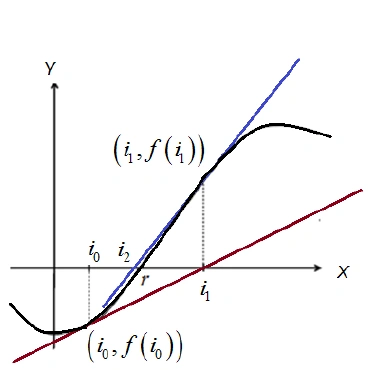
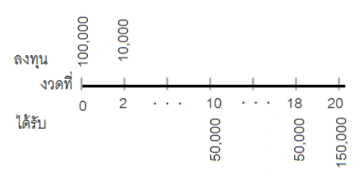

<!-- PDF page 92: independently reviewed -->

เนื้อหาประกอบด้วยอัตราดอกเบี้ยโดยประมาณ

3.1&nbsp; วิธีผลตอบแทนสูงสุด

3.2&nbsp; วิธีผลตอบแทนต่ำสุด

3.3&nbsp; วิธีอัตราส่วนคงที่

3.4&nbsp; วิธีอัตราส่วนโดยตรง

3.5&nbsp; วิธีทำซ้ำของนิวตัน-ราฟสัน

<h2>บทนำ</h2>

ในบางสถานการณ์การแก้ปัญหาเกี่ยวกับอัตราดอกเบี้ยค่อนข้างยาก ไม่สามารถใช้วิธีทาง<em>พีชคณิตหรือวิธีคณิตศาสตร์ประกันภัย</em> (Actuarial Method)ได้โดยตรง แต่อาจใช้วิธีวิเคราะห์เชิงตัวเลขที่เรียกว่า <em>วิธีการทำซ้ำ</em> (Iteration Method)ร่วมด้วยได้ อย่างไรก็ตามก็ยังมีความยุ่งยากซับซ้อนอยู่ดี โดยความยากมักจะอยู่ที่การเลือกค่าเริ่มต้นในกระบวนการทำซ้ำ ในบทนี้ จะกล่าวถึงการประมาณอัตราดอกเบี้ย 5 วิธี ได้แก่ วิธีผลตอบแทนสูงสุด วิธีผลตอบแทนต่ำสุด วิธีอัตราส่วนคงที่ วิธีอัตราส่วนโดยตรง และ วิธีทำซ้ำของนิวตัน-ราฟสัน โดยวิธีสุดท้าย จะกล่าวทบทวนวิธีทำซ้ำของนิวตัน-ราฟสันโดยใช้วิธีประมาณค่า 4 วิธีแรกในการเลือกค่าเริ่มต้นในกระบวนการทำซ้ำ นอกจากนี้วิธีการประมาณอัตราดอกเบี้ยดังกล่าวยังเป็นแนวคิดที่สำคัญสำหรับการคำนวณค่าเสื่อมราคาของสินทรัพย์ซึ่งจะกล่าวในบทต่อไปอีกด้วย

กำหนดสัญลักษณ์ที่เกี่ยวข้องกับสำหรับการประมาณอัตราดอกเบี้ย ดังต่อไปนี้

<dl class="source-definitions">
<dt><math data-tex="P_0"><msub><mi>P</mi><mn>0</mn></msub></math></dt><dd>แทน เงินกู้ หรือ เงินต้น</dd>
<dt><math data-tex="C"><mi>C</mi></math></dt><dd>แทน ดอกเบี้ยจ่ายสะสมซึ่งเป็นค่าใช้จ่ายทั้งหมดที่ผู้กู้ต้องจ่ายในการกู้เงินรวมถึงค่าธรรมเนียมต่างๆและดอกเบี้ยเงินกู้ ดอกเบี้ยจ่ายสะสมจะถูกพิจารณาเป็น<em>ต้นทุนเงินกู้</em> (Finance Charge)</dd>
<dt><math data-tex="r"><mi>r</mi></math></dt><dd>แทน เงินชำระหนี้ในแต่ละงวด</dd>
<dt><math data-tex="m"><mi>m</mi></math></dt><dd>แทน จำนวนงวดที่ชำระต่อปี</dd>
<dt><math data-tex="n"><mi>n</mi></math></dt><dd>แทน จำนวนงวดที่ชำระทั้งหมด</dd>
</dl>

<!-- PDF page 93: independently reviewed -->

<math display="inline" xmlns="http://www.w3.org/1998/Math/MathML"><semantics><msub><mi>B</mi><mi>t</mi></msub><annotation encoding="application/x-tex">B_t</annotation></semantics></math> แทน มูลค่าตามบัญชีหรือหนี้คงเหลือ ณ ปลายงวดที่ <math display="inline" xmlns="http://www.w3.org/1998/Math/MathML"><semantics><mi>t</mi><annotation encoding="application/x-tex">t</annotation></semantics></math> หลังจากชำระหนี้งวดที่ <math display="inline" xmlns="http://www.w3.org/1998/Math/MathML"><semantics><mi>t</mi><annotation encoding="application/x-tex">t</annotation></semantics></math> ไปแล้ว

<math display="inline" xmlns="http://www.w3.org/1998/Math/MathML"><semantics><mi>i</mi><annotation encoding="application/x-tex">i</annotation></semantics></math> แทน <math display="inline" xmlns="http://www.w3.org/1998/Math/MathML"><semantics><msup><mi>i</mi><mrow><mo stretchy="false" form="prefix">(</mo><mi>m</mi><mo stretchy="false" form="postfix">)</mo></mrow></msup><annotation encoding="application/x-tex">i^{(m)}</annotation></semantics></math> ซึ่งเป็นอัตราดอกเบี้ยเพียงในนาม คิดทบต้น <math display="inline" xmlns="http://www.w3.org/1998/Math/MathML"><semantics><mi>m</mi><annotation encoding="application/x-tex">m</annotation></semantics></math> ครั้งต่อปี

<math display="inline" xmlns="http://www.w3.org/1998/Math/MathML"><semantics><msub><mi>I</mi><mi>t</mi></msub><annotation encoding="application/x-tex">I_t</annotation></semantics></math> แทน ดอกเบี้ยจ่าย ซึ่งรวมถึง ค่าธรรมเนียมและค่าใช้จ่ายต่างๆ ปลายงวดที่ <math display="inline" xmlns="http://www.w3.org/1998/Math/MathML"><semantics><mi>t</mi><annotation encoding="application/x-tex">t</annotation></semantics></math>

<h2 id="วธผลตอบแทนสงสด">3.1 วิธีผลตอบแทนสูงสุด</h2>

การประมาณอัตราดอกเบี้ยด้วยวิธีผลตอบแทนสูงสุด (Maximum Yield Method ) ค่าของอัตราดอกเบี้ยที่ประมาณได้ด้วยวิธีนี้ จะแทนด้วย สัญลักษณ์ <math display="inline" xmlns="http://www.w3.org/1998/Math/MathML"><semantics><msup><mi>i</mi><mi mathvariant="normal">max</mi></msup><annotation encoding="application/x-tex">i^{\max}</annotation></semantics></math>

แนวความคิดของวิธีนี้ คือ จ่ายชำระเงินต้นงวดละ <math display="inline" xmlns="http://www.w3.org/1998/Math/MathML"><semantics><mi>r</mi><annotation encoding="application/x-tex">r</annotation></semantics></math> บาท จำนวน <math display="inline" xmlns="http://www.w3.org/1998/Math/MathML"><semantics><mrow><mi>n</mi><mo>−</mo><mn>1</mn></mrow><annotation encoding="application/x-tex">n-1</annotation></semantics></math> งวด โดยในงวดที่ <math display="inline" xmlns="http://www.w3.org/1998/Math/MathML"><semantics><mi>n</mi><annotation encoding="application/x-tex">n</annotation></semantics></math> ค่ารายงวดจำนวน <math display="inline" xmlns="http://www.w3.org/1998/Math/MathML"><semantics><mi>r</mi><annotation encoding="application/x-tex">r</annotation></semantics></math> บาทจะรวมดอกเบี้ยจ่ายทั้งหมดด้วย ดังนั้น เงินจำนวน <math display="inline" xmlns="http://www.w3.org/1998/Math/MathML"><semantics><mrow><mi>r</mi><mo>−</mo><mi>C</mi></mrow><annotation encoding="application/x-tex">r-C</annotation></semantics></math> จะเป็นเงินต้นที่ชำระ ในงวดที่ <math display="inline" xmlns="http://www.w3.org/1998/Math/MathML"><semantics><mi>n</mi><annotation encoding="application/x-tex">n</annotation></semantics></math> โดยที่ เงินที่ต้องชำระทั้งหมด เท่ากับ

<math display="block" xmlns="http://www.w3.org/1998/Math/MathML"><semantics><mrow><mi>n</mi><mi>r</mi><mo>=</mo><msub><mi>P</mi><mn>0</mn></msub><mo>+</mo><mi>C</mi><mspace width="2.0em"></mspace><mo stretchy="false" form="prefix">(</mo><mn>3.1</mn><mo stretchy="false" form="postfix">)</mo></mrow><annotation encoding="application/x-tex">nr=P_0+C\qquad(3.1)</annotation></semantics></math>

เมื่อจัดรูป (3.1) จะได้

<math display="block" xmlns="http://www.w3.org/1998/Math/MathML"><semantics><mrow><mi>r</mi><mo>=</mo><mfrac><mrow><msub><mi>P</mi><mn>0</mn></msub><mo>+</mo><mi>C</mi></mrow><mi>n</mi></mfrac><mspace width="2.0em"></mspace><mo stretchy="false" form="prefix">(</mo><mn>3.2</mn><mo stretchy="false" form="postfix">)</mo></mrow><annotation encoding="application/x-tex">r=\frac{P_0+C}{n}\qquad(3.2)</annotation></semantics></math>

เราสามารถแสดงการจ่ายชำระหนี้ ด้วยวิธีผลตอบแทนสูงสุดได้ ดังในตารางต่อไปนี้

<table>
<colgroup>
<col style="width: 20%" />
<col style="width: 20%" />
<col style="width: 20%" />
<col style="width: 20%" />
<col style="width: 20%" />
</colgroup>
<thead>
<tr>
<th style="text-align: center;">งวดที่</th>
<th style="text-align: center;">เงินที่ชำระ</th>
<th style="text-align: center;">ชำระเป็นค่าเงินต้น</th>
<th style="text-align: center;">ชำระเป็นค่าดอกเบี้ย</th>
<th style="text-align: center;">เงินต้นค้างชำระ <math display="inline" xmlns="http://www.w3.org/1998/Math/MathML"><semantics><msub><mi>B</mi><mi>t</mi></msub><annotation encoding="application/x-tex">B_t</annotation></semantics></math></th>
</tr>
</thead>
<tbody>
<tr>
<td style="text-align: center;"><math display="inline" xmlns="http://www.w3.org/1998/Math/MathML"><semantics><mn>0</mn><annotation encoding="application/x-tex">0</annotation></semantics></math></td>
<td style="text-align: center;"></td>
<td style="text-align: center;"></td>
<td style="text-align: center;"></td>
<td style="text-align: center;"><math display="inline" xmlns="http://www.w3.org/1998/Math/MathML"><semantics><msub><mi>P</mi><mn>0</mn></msub><annotation encoding="application/x-tex">P_0</annotation></semantics></math></td>
</tr>
<tr>
<td style="text-align: center;"><math display="inline" xmlns="http://www.w3.org/1998/Math/MathML"><semantics><mn>1</mn><annotation encoding="application/x-tex">1</annotation></semantics></math></td>
<td style="text-align: center;"><math display="inline" xmlns="http://www.w3.org/1998/Math/MathML"><semantics><mi>r</mi><annotation encoding="application/x-tex">r</annotation></semantics></math></td>
<td style="text-align: center;"><math display="inline" xmlns="http://www.w3.org/1998/Math/MathML"><semantics><mi>r</mi><annotation encoding="application/x-tex">r</annotation></semantics></math></td>
<td style="text-align: center;"><math display="inline" xmlns="http://www.w3.org/1998/Math/MathML"><semantics><mn>0</mn><annotation encoding="application/x-tex">0</annotation></semantics></math></td>
<td style="text-align: center;"><math display="inline" xmlns="http://www.w3.org/1998/Math/MathML"><semantics><mrow><msub><mi>P</mi><mn>0</mn></msub><mo>−</mo><mi>r</mi></mrow><annotation encoding="application/x-tex">P_0-r</annotation></semantics></math></td>
</tr>
<tr>
<td style="text-align: center;"><math display="inline" xmlns="http://www.w3.org/1998/Math/MathML"><semantics><mn>2</mn><annotation encoding="application/x-tex">2</annotation></semantics></math></td>
<td style="text-align: center;"><math display="inline" xmlns="http://www.w3.org/1998/Math/MathML"><semantics><mi>r</mi><annotation encoding="application/x-tex">r</annotation></semantics></math></td>
<td style="text-align: center;"><math display="inline" xmlns="http://www.w3.org/1998/Math/MathML"><semantics><mi>r</mi><annotation encoding="application/x-tex">r</annotation></semantics></math></td>
<td style="text-align: center;"><math display="inline" xmlns="http://www.w3.org/1998/Math/MathML"><semantics><mn>0</mn><annotation encoding="application/x-tex">0</annotation></semantics></math></td>
<td style="text-align: center;"><math display="inline" xmlns="http://www.w3.org/1998/Math/MathML"><semantics><mrow><msub><mi>P</mi><mn>0</mn></msub><mo>−</mo><mn>2</mn><mi>r</mi></mrow><annotation encoding="application/x-tex">P_0-2r</annotation></semantics></math></td>
</tr>
<tr>
<td style="text-align: center;"><math display="inline" xmlns="http://www.w3.org/1998/Math/MathML"><semantics><mi>⋮</mi><annotation encoding="application/x-tex">\vdots</annotation></semantics></math></td>
<td style="text-align: center;"><math display="inline" xmlns="http://www.w3.org/1998/Math/MathML"><semantics><mi>⋮</mi><annotation encoding="application/x-tex">\vdots</annotation></semantics></math></td>
<td style="text-align: center;"><math display="inline" xmlns="http://www.w3.org/1998/Math/MathML"><semantics><mi>⋮</mi><annotation encoding="application/x-tex">\vdots</annotation></semantics></math></td>
<td style="text-align: center;"><math display="inline" xmlns="http://www.w3.org/1998/Math/MathML"><semantics><mi>⋮</mi><annotation encoding="application/x-tex">\vdots</annotation></semantics></math></td>
<td style="text-align: center;"><math display="inline" xmlns="http://www.w3.org/1998/Math/MathML"><semantics><mi>⋮</mi><annotation encoding="application/x-tex">\vdots</annotation></semantics></math></td>
</tr>
<tr>
<td style="text-align: center;"><math display="inline" xmlns="http://www.w3.org/1998/Math/MathML"><semantics><mrow><mi>n</mi><mo>−</mo><mn>1</mn></mrow><annotation encoding="application/x-tex">n-1</annotation></semantics></math></td>
<td style="text-align: center;"><math display="inline" xmlns="http://www.w3.org/1998/Math/MathML"><semantics><mi>r</mi><annotation encoding="application/x-tex">r</annotation></semantics></math></td>
<td style="text-align: center;"><math display="inline" xmlns="http://www.w3.org/1998/Math/MathML"><semantics><mi>r</mi><annotation encoding="application/x-tex">r</annotation></semantics></math></td>
<td style="text-align: center;"><math display="inline" xmlns="http://www.w3.org/1998/Math/MathML"><semantics><mn>0</mn><annotation encoding="application/x-tex">0</annotation></semantics></math></td>
<td style="text-align: center;"><math display="inline" xmlns="http://www.w3.org/1998/Math/MathML"><semantics><mrow><msub><mi>P</mi><mn>0</mn></msub><mo>−</mo><mo stretchy="false" form="prefix">(</mo><mi>n</mi><mo>−</mo><mn>1</mn><mo stretchy="false" form="postfix">)</mo><mi>r</mi></mrow><annotation encoding="application/x-tex">P_0-(n-1)r</annotation></semantics></math></td>
</tr>
<tr>
<td style="text-align: center;"><math display="inline" xmlns="http://www.w3.org/1998/Math/MathML"><semantics><mi>n</mi><annotation encoding="application/x-tex">n</annotation></semantics></math></td>
<td style="text-align: center;"><math display="inline" xmlns="http://www.w3.org/1998/Math/MathML"><semantics><mi>r</mi><annotation encoding="application/x-tex">r</annotation></semantics></math></td>
<td style="text-align: center;"><math display="inline" xmlns="http://www.w3.org/1998/Math/MathML"><semantics><mrow><mi>r</mi><mo>−</mo><mi>C</mi></mrow><annotation encoding="application/x-tex">r-C</annotation></semantics></math></td>
<td style="text-align: center;"><math display="inline" xmlns="http://www.w3.org/1998/Math/MathML"><semantics><mi>C</mi><annotation encoding="application/x-tex">C</annotation></semantics></math></td>
<td style="text-align: center;"><math display="inline" xmlns="http://www.w3.org/1998/Math/MathML"><semantics><mn>0</mn><annotation encoding="application/x-tex">0</annotation></semantics></math></td>
</tr>
<tr>
<td style="text-align: center;">รวม</td>
<td style="text-align: center;"><math display="inline" xmlns="http://www.w3.org/1998/Math/MathML"><semantics><mrow><mi>n</mi><mi>r</mi><mo>=</mo><msub><mi>P</mi><mn>0</mn></msub><mo>+</mo><mi>C</mi></mrow><annotation encoding="application/x-tex">nr=P_0+C</annotation></semantics></math></td>
<td style="text-align: center;"><math display="inline" xmlns="http://www.w3.org/1998/Math/MathML"><semantics><mrow><mi>n</mi><mi>r</mi><mo>−</mo><mi>C</mi><mo>=</mo><msub><mi>P</mi><mn>0</mn></msub></mrow><annotation encoding="application/x-tex">nr-C=P_0</annotation></semantics></math></td>
<td style="text-align: center;"><math display="inline" xmlns="http://www.w3.org/1998/Math/MathML"><semantics><mi>C</mi><annotation encoding="application/x-tex">C</annotation></semantics></math></td>
<td style="text-align: center;"></td>
</tr>
</tbody>
</table>

เนื่องจาก <math display="inline" xmlns="http://www.w3.org/1998/Math/MathML"><semantics><mi>i</mi><annotation encoding="application/x-tex">i</annotation></semantics></math> เป็นอัตราดอกเบี้ยเพียงในนาม คิดทบต้น <math display="inline" xmlns="http://www.w3.org/1998/Math/MathML"><semantics><mi>m</mi><annotation encoding="application/x-tex">m</annotation></semantics></math> ครั้งต่อปี ดังนั้น อัตราดอกเบี้ยต่องวดเท่ากับ <math display="inline" xmlns="http://www.w3.org/1998/Math/MathML"><semantics><mfrac><mi>i</mi><mi>m</mi></mfrac><annotation encoding="application/x-tex">\frac{i}{m}</annotation></semantics></math> และ ดอกเบี้ยจ่ายในปลายงวดที่ <math display="inline" xmlns="http://www.w3.org/1998/Math/MathML"><semantics><mi>t</mi><annotation encoding="application/x-tex">t</annotation></semantics></math> คือ

<math display="block" xmlns="http://www.w3.org/1998/Math/MathML"><semantics><mrow><msub><mi>I</mi><mi>t</mi></msub><mo>=</mo><mfrac><mi>i</mi><mi>m</mi></mfrac><msub><mi>B</mi><mrow><mi>t</mi><mo>−</mo><mn>1</mn></mrow></msub><mspace width="2.0em"></mspace><mo stretchy="false" form="prefix">(</mo><mn>3.3</mn><mo stretchy="false" form="postfix">)</mo></mrow><annotation encoding="application/x-tex">I_t=\frac{i}{m}B_{t-1}\qquad(3.3)</annotation></semantics></math>

<!-- PDF page 94: independently reviewed -->

สำหรับทุกๆ <math display="inline" xmlns="http://www.w3.org/1998/Math/MathML"><semantics><mrow><mi>t</mi><mo>=</mo><mn>1</mn><mo>,</mo><mn>2</mn><mo>,</mo><mi>.</mi><mi>.</mi><mi>.</mi><mo>,</mo><mi>n</mi></mrow><annotation encoding="application/x-tex">t=1,2,...,n</annotation></semantics></math> โดยที่ <math display="inline" xmlns="http://www.w3.org/1998/Math/MathML"><semantics><mrow><msub><mi>B</mi><mn>0</mn></msub><mo>=</mo><msub><mi>P</mi><mn>0</mn></msub></mrow><annotation encoding="application/x-tex">B_0=P_0</annotation></semantics></math>

ดังนั้น ดอกเบี้ยจ่ายสะสม

<math display="block" xmlns="http://www.w3.org/1998/Math/MathML"><semantics><mrow><mi>C</mi><mo>=</mo><munderover><mo>∑</mo><mrow><mi>t</mi><mo>=</mo><mn>1</mn></mrow><mi>n</mi></munderover><msub><mi>I</mi><mi>t</mi></msub><mo>=</mo><munderover><mo>∑</mo><mrow><mi>t</mi><mo>=</mo><mn>1</mn></mrow><mi>n</mi></munderover><mfrac><mi>i</mi><mi>m</mi></mfrac><msub><mi>B</mi><mrow><mi>t</mi><mo>−</mo><mn>1</mn></mrow></msub><mo>=</mo><mfrac><mi>i</mi><mi>m</mi></mfrac><munderover><mo>∑</mo><mrow><mi>t</mi><mo>=</mo><mn>1</mn></mrow><mi>n</mi></munderover><msub><mi>B</mi><mrow><mi>t</mi><mo>−</mo><mn>1</mn></mrow></msub><mspace width="2.0em"></mspace><mo stretchy="false" form="prefix">(</mo><mn>3.4</mn><mo stretchy="false" form="postfix">)</mo></mrow><annotation encoding="application/x-tex">C=\sum_{t=1}^{n}I_t=\sum_{t=1}^{n}\frac{i}{m}B_{t-1}=\frac{i}{m}\sum_{t=1}^{n}B_{t-1}\qquad(3.4)</annotation></semantics></math>

จากตารางการจ่ายชำระหนี้ มูลค่าตามบัญชีหรือหนี้คงเหลือปลายงวดที่ <math display="inline" xmlns="http://www.w3.org/1998/Math/MathML"><semantics><mi>t</mi><annotation encoding="application/x-tex">t</annotation></semantics></math> จากการจ่ายค่ารายงวด คือ

<math display="block" xmlns="http://www.w3.org/1998/Math/MathML"><semantics><mrow><msub><mi>B</mi><mi>t</mi></msub><mo>=</mo><msub><mi>P</mi><mn>0</mn></msub><mo>−</mo><mi>t</mi><mi>r</mi><mspace width="2.0em"></mspace><mo stretchy="false" form="prefix">(</mo><mn>3.5</mn><mo stretchy="false" form="postfix">)</mo></mrow><annotation encoding="application/x-tex">B_t=P_0-tr\qquad(3.5)</annotation></semantics></math>

เมื่อ แทน (3.5) ใน (3.4) จะได้

<math display="block" xmlns="http://www.w3.org/1998/Math/MathML"><semantics><mrow><mtable><mtr><mtd columnalign="right" style="text-align: right; padding-right: 0"><mi>C</mi></mtd><mtd columnalign="left" style="text-align: left; padding-left: 0"><mo>=</mo><mfrac><mi>i</mi><mi>m</mi></mfrac><munderover><mo>∑</mo><mrow><mi>t</mi><mo>=</mo><mn>1</mn></mrow><mi>n</mi></munderover><mrow><mo stretchy="true" form="prefix">(</mo><msub><mi>P</mi><mn>0</mn></msub><mo>−</mo><mo stretchy="false" form="prefix">(</mo><mi>t</mi><mo>−</mo><mn>1</mn><mo stretchy="false" form="postfix">)</mo><mi>r</mi><mo stretchy="true" form="postfix">)</mo></mrow></mtd></mtr><mtr><mtd columnalign="right" style="text-align: right; padding-right: 0"></mtd><mtd columnalign="left" style="text-align: left; padding-left: 0"><mo>=</mo><mfrac><mi>i</mi><mi>m</mi></mfrac><mrow><mo stretchy="true" form="prefix">(</mo><munderover><mo>∑</mo><mrow><mi>t</mi><mo>=</mo><mn>1</mn></mrow><mi>n</mi></munderover><msub><mi>P</mi><mn>0</mn></msub><mo>−</mo><mi>r</mi><munderover><mo>∑</mo><mrow><mi>t</mi><mo>=</mo><mn>1</mn></mrow><mi>n</mi></munderover><mo stretchy="false" form="prefix">(</mo><mi>t</mi><mo>−</mo><mn>1</mn><mo stretchy="false" form="postfix">)</mo><mo stretchy="true" form="postfix">)</mo></mrow></mtd></mtr><mtr><mtd columnalign="right" style="text-align: right; padding-right: 0"></mtd><mtd columnalign="left" style="text-align: left; padding-left: 0"><mo>=</mo><mfrac><mi>i</mi><mi>m</mi></mfrac><mrow><mo stretchy="true" form="prefix">(</mo><msub><mi>P</mi><mn>0</mn></msub><mi>n</mi><mo>−</mo><mi>r</mi><mfrac><mrow><mo stretchy="false" form="prefix">(</mo><mi>n</mi><mo>−</mo><mn>1</mn><mo stretchy="false" form="postfix">)</mo><mi>n</mi></mrow><mn>2</mn></mfrac><mo stretchy="true" form="postfix">)</mo></mrow></mtd></mtr></mtable><mspace width="2.0em"></mspace><mo stretchy="false" form="prefix">(</mo><mn>3.6</mn><mo stretchy="false" form="postfix">)</mo></mrow><annotation encoding="application/x-tex">\begin{aligned}C&amp;=\frac{i}{m}\sum_{t=1}^{n}\left(P_0-(t-1)r\right)\\&amp;=\frac{i}{m}\left(\sum_{t=1}^{n}P_0-r\sum_{t=1}^{n}(t-1)\right)\\&amp;=\frac{i}{m}\left(P_0n-r\frac{(n-1)n}{2}\right)\end{aligned}\qquad(3.6)</annotation></semantics></math>

แก้สมการหา <math display="inline" xmlns="http://www.w3.org/1998/Math/MathML"><semantics><mi>i</mi><annotation encoding="application/x-tex">i</annotation></semantics></math> (เขียนแทนด้วย <math display="inline" xmlns="http://www.w3.org/1998/Math/MathML"><semantics><msup><mi>i</mi><mi mathvariant="normal">max</mi></msup><annotation encoding="application/x-tex">i^{\max}</annotation></semantics></math> ) จะได้

<math display="block" xmlns="http://www.w3.org/1998/Math/MathML"><semantics><mrow><msup><mi>i</mi><mi mathvariant="normal">max</mi></msup><mo>=</mo><mfrac><mrow><mn>2</mn><mi>m</mi><mi>C</mi></mrow><mrow><mo stretchy="false" form="prefix">(</mo><mi>n</mi><mo>+</mo><mn>1</mn><mo stretchy="false" form="postfix">)</mo><msub><mi>P</mi><mn>0</mn></msub><mo>−</mo><mo stretchy="false" form="prefix">(</mo><mi>n</mi><mo>−</mo><mn>1</mn><mo stretchy="false" form="postfix">)</mo><mi>C</mi></mrow></mfrac><mspace width="2.0em"></mspace><mo stretchy="false" form="prefix">(</mo><mn>3.7</mn><mo stretchy="false" form="postfix">)</mo></mrow><annotation encoding="application/x-tex">i^{\max}=\frac{2mC}{(n+1)P_0-(n-1)C}\qquad(3.7)</annotation></semantics></math>

ซึ่งเป็นอัตราดอกเบี้ยเพียงในนาม <math display="inline" xmlns="http://www.w3.org/1998/Math/MathML"><semantics><msup><mi>i</mi><mrow><mo stretchy="false" form="prefix">(</mo><mi>m</mi><mo stretchy="false" form="postfix">)</mo></mrow></msup><annotation encoding="application/x-tex">i^{(m)}</annotation></semantics></math> ที่ประมาณด้วยวิธีผลตอบแทนสูงสุด

<strong>ตัวอย่างที่ 3.1</strong> นายเอกู้เงิน 800,000 บาท กับธนาคารเพื่อซื้อบ้าน โดยจ่ายหนี้ เดือนละ 15,000 บาททุกสิ้นเดือน เป็นเวลา 60 เดือน จงหาอัตราดอกเบี้ยเพียงในนาม ต่อปี โดยประมาณด้วยวิธีผลตอบแทนสูงสุด

<strong>วิธีทำ</strong> ในที่นี้โจทย์ต้องการประมาณอัตราดอกเบี้ยเพียงในนาม <math display="inline" xmlns="http://www.w3.org/1998/Math/MathML"><semantics><msup><mi>i</mi><mrow><mo stretchy="false" form="prefix">(</mo><mn>12</mn><mo stretchy="false" form="postfix">)</mo></mrow></msup><annotation encoding="application/x-tex">i^{(12)}</annotation></semantics></math> ด้วย <math display="inline" xmlns="http://www.w3.org/1998/Math/MathML"><semantics><msup><mi>i</mi><mi mathvariant="normal">max</mi></msup><annotation encoding="application/x-tex">i^{\max}</annotation></semantics></math> โดยกำหนด <math display="inline" xmlns="http://www.w3.org/1998/Math/MathML"><semantics><mrow><msub><mi>P</mi><mn>0</mn></msub><mo>=</mo><mn>800</mn><mo>,</mo><mn>000</mn></mrow><annotation encoding="application/x-tex">P_0=800,000</annotation></semantics></math> , <math display="inline" xmlns="http://www.w3.org/1998/Math/MathML"><semantics><mrow><mi>m</mi><mo>=</mo><mn>12</mn></mrow><annotation encoding="application/x-tex">m=12</annotation></semantics></math> , <math display="inline" xmlns="http://www.w3.org/1998/Math/MathML"><semantics><mrow><mi>n</mi><mo>=</mo><mn>60</mn></mrow><annotation encoding="application/x-tex">n=60</annotation></semantics></math> , <math display="inline" xmlns="http://www.w3.org/1998/Math/MathML"><semantics><mrow><mi>r</mi><mo>=</mo><mn>15</mn><mo>,</mo><mn>000</mn></mrow><annotation encoding="application/x-tex">r=15,000</annotation></semantics></math> และ คำนวณ

<math display="block" xmlns="http://www.w3.org/1998/Math/MathML"><semantics><mrow><mi>C</mi><mo>=</mo><mi>n</mi><mi>r</mi><mo>−</mo><msub><mi>P</mi><mn>0</mn></msub><mo>=</mo><mn>60</mn><mo stretchy="false" form="prefix">(</mo><mn>15</mn><mo>,</mo><mn>000</mn><mo stretchy="false" form="postfix">)</mo><mo>−</mo><mn>800</mn><mo>,</mo><mn>000</mn><mo>=</mo><mn>100</mn><mo>,</mo><mn>000</mn></mrow><annotation encoding="application/x-tex">C=nr-P_0=60(15,000)-800,000=100,000</annotation></semantics></math>

จาก <math display="inline" xmlns="http://www.w3.org/1998/Math/MathML"><semantics><mrow><msup><mi>i</mi><mi mathvariant="normal">max</mi></msup><mo>=</mo><mstyle displaystyle="true"><mfrac><mrow><mn>2</mn><mi>m</mi><mi>C</mi></mrow><mrow><mo stretchy="false" form="prefix">(</mo><mi>n</mi><mo>+</mo><mn>1</mn><mo stretchy="false" form="postfix">)</mo><msub><mi>P</mi><mn>0</mn></msub><mo>−</mo><mo stretchy="false" form="prefix">(</mo><mi>n</mi><mo>−</mo><mn>1</mn><mo stretchy="false" form="postfix">)</mo><mi>C</mi></mrow></mfrac></mstyle></mrow><annotation encoding="application/x-tex">i^{\max}=\dfrac{2mC}{(n+1)P_0-(n-1)C}</annotation></semantics></math>

โดยการแทนค่า จะได้ <math display="inline" xmlns="http://www.w3.org/1998/Math/MathML"><semantics><mrow><msup><mi>i</mi><mi mathvariant="normal">max</mi></msup><mo>=</mo><mstyle displaystyle="true"><mfrac><mrow><mn>2</mn><mo stretchy="false" form="prefix">(</mo><mn>12</mn><mo stretchy="false" form="postfix">)</mo><mo stretchy="false" form="prefix">(</mo><mn>100</mn><mo>,</mo><mn>000</mn><mo stretchy="false" form="postfix">)</mo></mrow><mrow><mo stretchy="false" form="prefix">(</mo><mn>61</mn><mo stretchy="false" form="postfix">)</mo><mn>800</mn><mo>,</mo><mn>000</mn><mo>−</mo><mo stretchy="false" form="prefix">(</mo><mn>59</mn><mo stretchy="false" form="postfix">)</mo><mn>100</mn><mo>,</mo><mn>000</mn></mrow></mfrac></mstyle><mo>≈</mo><mn>0.0559</mn></mrow><annotation encoding="application/x-tex">i^{\max}=\dfrac{2(12)(100,000)}{(61)800,000-(59)100,000}\approx0.0559</annotation></semantics></math>

ดังนั้น อัตราดอกเบี้ยเพียงในนาม <math display="inline" xmlns="http://www.w3.org/1998/Math/MathML"><semantics><msup><mi>i</mi><mrow><mo stretchy="false" form="prefix">(</mo><mn>12</mn><mo stretchy="false" form="postfix">)</mo></mrow></msup><annotation encoding="application/x-tex">i^{(12)}</annotation></semantics></math> โดยประมาณ 0.0559 □

<!-- PDF page 95: independently reviewed -->
<h2 id="วธผลตอบแทนตำสด">3.2 วิธีผลตอบแทนต่ำสุด</h2>

การประมาณอัตราดอกเบี้ยด้วยวิธีผลตอบแทนต่ำสุด (Minimum Yield Method ) ค่าของอัตราดอกเบี้ยที่ประมาณได้ด้วยวิธีนี้ จะแทนด้วย สัญลักษณ์ <math display="inline" xmlns="http://www.w3.org/1998/Math/MathML"><semantics><msup><mi>i</mi><mi mathvariant="normal">min</mi></msup><annotation encoding="application/x-tex">i^{\min}</annotation></semantics></math>

แนวความคิดของวิธีนี้ คือ จ่ายค่ารายงวด <math display="inline" xmlns="http://www.w3.org/1998/Math/MathML"><semantics><mi>r</mi><annotation encoding="application/x-tex">r</annotation></semantics></math> บาท ในงวดแรกซึ่งเป็นค่ารายงวดที่รวมกับดอกเบี้ยจ่ายสะสม <math display="inline" xmlns="http://www.w3.org/1998/Math/MathML"><semantics><mi>C</mi><annotation encoding="application/x-tex">C</annotation></semantics></math> บาทด้วย ดังนั้นเงินที่ชำระเป็นเงินต้นในงวดแรกจะเท่ากับ <math display="inline" xmlns="http://www.w3.org/1998/Math/MathML"><semantics><mrow><mi>r</mi><mo>−</mo><mi>C</mi></mrow><annotation encoding="application/x-tex">r-C</annotation></semantics></math> บาท งวดที่เหลือจำนวน <math display="inline" xmlns="http://www.w3.org/1998/Math/MathML"><semantics><mrow><mi>n</mi><mo>−</mo><mn>1</mn></mrow><annotation encoding="application/x-tex">n-1</annotation></semantics></math> งวด จะเป็นการจ่ายชำระเงินต้นเพียงอย่างเดียวงวดละ <math display="inline" xmlns="http://www.w3.org/1998/Math/MathML"><semantics><mi>r</mi><annotation encoding="application/x-tex">r</annotation></semantics></math> บาท ดังนั้นเงินที่ต้องชำระทั้งหมด เท่ากับ

<math display="block" xmlns="http://www.w3.org/1998/Math/MathML"><semantics><mrow><mi>n</mi><mi>r</mi><mo>=</mo><msub><mi>P</mi><mn>0</mn></msub><mo>+</mo><mi>C</mi><mspace width="2.0em"></mspace><mo stretchy="false" form="prefix">(</mo><mn>3.8</mn><mo stretchy="false" form="postfix">)</mo></mrow><annotation encoding="application/x-tex">nr=P_0+C\qquad(3.8)</annotation></semantics></math>

จัดรูปสมการ (3.8) ได้

<math display="block" xmlns="http://www.w3.org/1998/Math/MathML"><semantics><mrow><mi>r</mi><mo>=</mo><mfrac><mrow><msub><mi>P</mi><mn>0</mn></msub><mo>+</mo><mi>C</mi></mrow><mi>n</mi></mfrac><mspace width="2.0em"></mspace><mo stretchy="false" form="prefix">(</mo><mn>3.9</mn><mo stretchy="false" form="postfix">)</mo></mrow><annotation encoding="application/x-tex">r=\frac{P_0+C}{n}\qquad(3.9)</annotation></semantics></math>

เราสามารถแสดงการจ่ายชำระหนี้ ด้วยวิธีผลตอบแทนต่ำสุด ได้ดังตารางต่อไปนี้

<table>
<colgroup>
<col style="width: 20%" />
<col style="width: 20%" />
<col style="width: 20%" />
<col style="width: 20%" />
<col style="width: 20%" />
</colgroup>
<thead>
<tr>
<th style="text-align: center;">งวดที่</th>
<th style="text-align: center;">เงินที่ชำระ</th>
<th style="text-align: center;">ชำระเป็นค่าเงินต้น</th>
<th style="text-align: center;">ชำระเป็นค่าดอกเบี้ย</th>
<th style="text-align: center;">เงินต้นค้างชำระ <math display="inline" xmlns="http://www.w3.org/1998/Math/MathML"><semantics><msub><mi>B</mi><mi>t</mi></msub><annotation encoding="application/x-tex">B_t</annotation></semantics></math></th>
</tr>
</thead>
<tbody>
<tr>
<td style="text-align: center;"><math display="inline" xmlns="http://www.w3.org/1998/Math/MathML"><semantics><mn>0</mn><annotation encoding="application/x-tex">0</annotation></semantics></math></td>
<td style="text-align: center;"></td>
<td style="text-align: center;"></td>
<td style="text-align: center;"></td>
<td style="text-align: center;"><math display="inline" xmlns="http://www.w3.org/1998/Math/MathML"><semantics><msub><mi>P</mi><mn>0</mn></msub><annotation encoding="application/x-tex">P_0</annotation></semantics></math></td>
</tr>
<tr>
<td style="text-align: center;"><math display="inline" xmlns="http://www.w3.org/1998/Math/MathML"><semantics><mn>1</mn><annotation encoding="application/x-tex">1</annotation></semantics></math></td>
<td style="text-align: center;"><math display="inline" xmlns="http://www.w3.org/1998/Math/MathML"><semantics><mi>r</mi><annotation encoding="application/x-tex">r</annotation></semantics></math></td>
<td style="text-align: center;"><math display="inline" xmlns="http://www.w3.org/1998/Math/MathML"><semantics><mrow><mi>r</mi><mo>−</mo><mi>C</mi></mrow><annotation encoding="application/x-tex">r-C</annotation></semantics></math></td>
<td style="text-align: center;"><math display="inline" xmlns="http://www.w3.org/1998/Math/MathML"><semantics><mi>C</mi><annotation encoding="application/x-tex">C</annotation></semantics></math></td>
<td style="text-align: center;"><math display="inline" xmlns="http://www.w3.org/1998/Math/MathML"><semantics><mrow><msub><mi>P</mi><mn>0</mn></msub><mo>−</mo><mi>r</mi><mo>+</mo><mi>C</mi></mrow><annotation encoding="application/x-tex">P_0-r+C</annotation></semantics></math></td>
</tr>
<tr>
<td style="text-align: center;"><math display="inline" xmlns="http://www.w3.org/1998/Math/MathML"><semantics><mn>2</mn><annotation encoding="application/x-tex">2</annotation></semantics></math></td>
<td style="text-align: center;"><math display="inline" xmlns="http://www.w3.org/1998/Math/MathML"><semantics><mi>r</mi><annotation encoding="application/x-tex">r</annotation></semantics></math></td>
<td style="text-align: center;"><math display="inline" xmlns="http://www.w3.org/1998/Math/MathML"><semantics><mi>r</mi><annotation encoding="application/x-tex">r</annotation></semantics></math></td>
<td style="text-align: center;"><math display="inline" xmlns="http://www.w3.org/1998/Math/MathML"><semantics><mn>0</mn><annotation encoding="application/x-tex">0</annotation></semantics></math></td>
<td style="text-align: center;"><math display="inline" xmlns="http://www.w3.org/1998/Math/MathML"><semantics><mrow><msub><mi>P</mi><mn>0</mn></msub><mo>−</mo><mn>2</mn><mi>r</mi><mo>+</mo><mi>C</mi></mrow><annotation encoding="application/x-tex">P_0-2r+C</annotation></semantics></math></td>
</tr>
<tr>
<td style="text-align: center;"><math display="inline" xmlns="http://www.w3.org/1998/Math/MathML"><semantics><mi>⋮</mi><annotation encoding="application/x-tex">\vdots</annotation></semantics></math></td>
<td style="text-align: center;"><math display="inline" xmlns="http://www.w3.org/1998/Math/MathML"><semantics><mi>⋮</mi><annotation encoding="application/x-tex">\vdots</annotation></semantics></math></td>
<td style="text-align: center;"><math display="inline" xmlns="http://www.w3.org/1998/Math/MathML"><semantics><mi>⋮</mi><annotation encoding="application/x-tex">\vdots</annotation></semantics></math></td>
<td style="text-align: center;"><math display="inline" xmlns="http://www.w3.org/1998/Math/MathML"><semantics><mi>⋮</mi><annotation encoding="application/x-tex">\vdots</annotation></semantics></math></td>
<td style="text-align: center;"><math display="inline" xmlns="http://www.w3.org/1998/Math/MathML"><semantics><mi>⋮</mi><annotation encoding="application/x-tex">\vdots</annotation></semantics></math></td>
</tr>
<tr>
<td style="text-align: center;"><math display="inline" xmlns="http://www.w3.org/1998/Math/MathML"><semantics><mrow><mi>n</mi><mo>−</mo><mn>1</mn></mrow><annotation encoding="application/x-tex">n-1</annotation></semantics></math></td>
<td style="text-align: center;"><math display="inline" xmlns="http://www.w3.org/1998/Math/MathML"><semantics><mi>r</mi><annotation encoding="application/x-tex">r</annotation></semantics></math></td>
<td style="text-align: center;"><math display="inline" xmlns="http://www.w3.org/1998/Math/MathML"><semantics><mi>r</mi><annotation encoding="application/x-tex">r</annotation></semantics></math></td>
<td style="text-align: center;"><math display="inline" xmlns="http://www.w3.org/1998/Math/MathML"><semantics><mn>0</mn><annotation encoding="application/x-tex">0</annotation></semantics></math></td>
<td style="text-align: center;"><math display="inline" xmlns="http://www.w3.org/1998/Math/MathML"><semantics><mrow><msub><mi>P</mi><mn>0</mn></msub><mo>−</mo><mo stretchy="false" form="prefix">(</mo><mi>n</mi><mo>−</mo><mn>1</mn><mo stretchy="false" form="postfix">)</mo><mi>r</mi><mo>+</mo><mi>C</mi></mrow><annotation encoding="application/x-tex">P_0-(n-1)r+C</annotation></semantics></math></td>
</tr>
<tr>
<td style="text-align: center;"><math display="inline" xmlns="http://www.w3.org/1998/Math/MathML"><semantics><mi>n</mi><annotation encoding="application/x-tex">n</annotation></semantics></math></td>
<td style="text-align: center;"><math display="inline" xmlns="http://www.w3.org/1998/Math/MathML"><semantics><mi>r</mi><annotation encoding="application/x-tex">r</annotation></semantics></math></td>
<td style="text-align: center;"><math display="inline" xmlns="http://www.w3.org/1998/Math/MathML"><semantics><mi>r</mi><annotation encoding="application/x-tex">r</annotation></semantics></math></td>
<td style="text-align: center;"><math display="inline" xmlns="http://www.w3.org/1998/Math/MathML"><semantics><mn>0</mn><annotation encoding="application/x-tex">0</annotation></semantics></math></td>
<td style="text-align: center;"><math display="inline" xmlns="http://www.w3.org/1998/Math/MathML"><semantics><mn>0</mn><annotation encoding="application/x-tex">0</annotation></semantics></math></td>
</tr>
<tr>
<td style="text-align: center;">รวม</td>
<td style="text-align: center;"><math display="inline" xmlns="http://www.w3.org/1998/Math/MathML"><semantics><mrow><mi>n</mi><mi>r</mi><mo>=</mo><msub><mi>P</mi><mn>0</mn></msub><mo>+</mo><mi>C</mi></mrow><annotation encoding="application/x-tex">nr=P_0+C</annotation></semantics></math></td>
<td style="text-align: center;"><math display="inline" xmlns="http://www.w3.org/1998/Math/MathML"><semantics><mrow><mi>n</mi><mi>r</mi><mo>−</mo><mi>C</mi><mo>=</mo><msub><mi>P</mi><mn>0</mn></msub></mrow><annotation encoding="application/x-tex">nr-C=P_0</annotation></semantics></math></td>
<td style="text-align: center;"><math display="inline" xmlns="http://www.w3.org/1998/Math/MathML"><semantics><mi>C</mi><annotation encoding="application/x-tex">C</annotation></semantics></math></td>
<td style="text-align: center;"></td>
</tr>
</tbody>
</table>

เนื่องจาก <math display="inline" xmlns="http://www.w3.org/1998/Math/MathML"><semantics><mi>i</mi><annotation encoding="application/x-tex">i</annotation></semantics></math> เป็นอัตราดอกเบี้ยเพียงในนาม คิดทบต้น <math display="inline" xmlns="http://www.w3.org/1998/Math/MathML"><semantics><mi>m</mi><annotation encoding="application/x-tex">m</annotation></semantics></math> ครั้งต่อปี ดังนั้น อัตราดอกเบี้ยต่องวดเท่ากับ <math display="inline" xmlns="http://www.w3.org/1998/Math/MathML"><semantics><mfrac><mi>i</mi><mi>m</mi></mfrac><annotation encoding="application/x-tex">\frac{i}{m}</annotation></semantics></math> และ ดอกเบี้ยจ่ายในปลายงวดที่ <math display="inline" xmlns="http://www.w3.org/1998/Math/MathML"><semantics><mi>t</mi><annotation encoding="application/x-tex">t</annotation></semantics></math> คือ

<math display="block" xmlns="http://www.w3.org/1998/Math/MathML"><semantics><mrow><msub><mi>I</mi><mi>t</mi></msub><mo>=</mo><mfrac><mi>i</mi><mi>m</mi></mfrac><msub><mi>B</mi><mrow><mi>t</mi><mo>−</mo><mn>1</mn></mrow></msub><mspace width="2.0em"></mspace><mo stretchy="false" form="prefix">(</mo><mn>3.10</mn><mo stretchy="false" form="postfix">)</mo></mrow><annotation encoding="application/x-tex">I_t=\frac{i}{m}B_{t-1}\qquad(3.10)</annotation></semantics></math>

สำหรับทุกๆ <math display="inline" xmlns="http://www.w3.org/1998/Math/MathML"><semantics><mrow><mi>t</mi><mo>=</mo><mn>1</mn><mo>,</mo><mn>2</mn><mo>,</mo><mi>.</mi><mi>.</mi><mi>.</mi><mo>,</mo><mi>n</mi></mrow><annotation encoding="application/x-tex">t=1,2,...,n</annotation></semantics></math> โดยที่ <math display="inline" xmlns="http://www.w3.org/1998/Math/MathML"><semantics><mrow><msub><mi>B</mi><mn>0</mn></msub><mo>=</mo><msub><mi>P</mi><mn>0</mn></msub></mrow><annotation encoding="application/x-tex">B_0=P_0</annotation></semantics></math>

ดังนั้น ดอกเบี้ยจ่ายสะสม

<!-- PDF page 96: independently reviewed -->

<math display="block" xmlns="http://www.w3.org/1998/Math/MathML"><semantics><mrow><mi>C</mi><mo>=</mo><munderover><mo>∑</mo><mrow><mi>t</mi><mo>=</mo><mn>1</mn></mrow><mi>n</mi></munderover><msub><mi>I</mi><mi>t</mi></msub><mo>=</mo><munderover><mo>∑</mo><mrow><mi>t</mi><mo>=</mo><mn>1</mn></mrow><mi>n</mi></munderover><mfrac><mi>i</mi><mi>m</mi></mfrac><msub><mi>B</mi><mrow><mi>t</mi><mo>−</mo><mn>1</mn></mrow></msub><mo>=</mo><mfrac><mi>i</mi><mi>m</mi></mfrac><munderover><mo>∑</mo><mrow><mi>t</mi><mo>=</mo><mn>1</mn></mrow><mi>n</mi></munderover><msub><mi>B</mi><mrow><mi>t</mi><mo>−</mo><mn>1</mn></mrow></msub><mspace width="2.0em"></mspace><mo stretchy="false" form="prefix">(</mo><mn>3.11</mn><mo stretchy="false" form="postfix">)</mo></mrow><annotation encoding="application/x-tex">C=\sum_{t=1}^{n}I_t=\sum_{t=1}^{n}\frac{i}{m}B_{t-1}=\frac{i}{m}\sum_{t=1}^{n}B_{t-1}\qquad(3.11)</annotation></semantics></math>

จากตารางการจ่ายชำระหนี้ มูลค่าตามบัญชีปลายงวดที่ <math display="inline" xmlns="http://www.w3.org/1998/Math/MathML"><semantics><mi>t</mi><annotation encoding="application/x-tex">t</annotation></semantics></math> จากการจ่ายค่ารายงวด คือ

<math display="block" xmlns="http://www.w3.org/1998/Math/MathML"><semantics><mrow><msub><mi>B</mi><mi>t</mi></msub><mo>=</mo><msub><mi>P</mi><mn>0</mn></msub><mo>−</mo><mi>t</mi><mi>r</mi><mo>+</mo><mi>C</mi><mspace width="2.0em"></mspace><mo stretchy="false" form="prefix">(</mo><mn>3.12</mn><mo stretchy="false" form="postfix">)</mo></mrow><annotation encoding="application/x-tex">B_t=P_0-tr+C\qquad(3.12)</annotation></semantics></math>

เมื่อ แทน (3.12) ใน (3.11) จะได้

<math display="block" xmlns="http://www.w3.org/1998/Math/MathML"><semantics><mrow><mtable><mtr><mtd columnalign="right" style="text-align: right; padding-right: 0"><mi>C</mi></mtd><mtd columnalign="left" style="text-align: left; padding-left: 0"><mo>=</mo><mfrac><mi>i</mi><mi>m</mi></mfrac><mrow><mo stretchy="true" form="prefix">(</mo><msub><mi>B</mi><mn>0</mn></msub><mo>+</mo><munderover><mo>∑</mo><mrow><mi>t</mi><mo>=</mo><mn>2</mn></mrow><mi>n</mi></munderover><msub><mi>B</mi><mrow><mi>t</mi><mo>−</mo><mn>1</mn></mrow></msub><mo stretchy="true" form="postfix">)</mo></mrow></mtd></mtr><mtr><mtd columnalign="right" style="text-align: right; padding-right: 0"></mtd><mtd columnalign="left" style="text-align: left; padding-left: 0"><mo>=</mo><mfrac><mi>i</mi><mi>m</mi></mfrac><mrow><mo stretchy="true" form="prefix">(</mo><msub><mi>P</mi><mn>0</mn></msub><mo>+</mo><munderover><mo>∑</mo><mrow><mi>t</mi><mo>=</mo><mn>2</mn></mrow><mi>n</mi></munderover><mrow><mo stretchy="true" form="prefix">(</mo><msub><mi>P</mi><mn>0</mn></msub><mo>−</mo><mo stretchy="false" form="prefix">(</mo><mi>t</mi><mo>−</mo><mn>1</mn><mo stretchy="false" form="postfix">)</mo><mi>r</mi><mo>+</mo><mi>C</mi><mo stretchy="true" form="postfix">)</mo></mrow><mo stretchy="true" form="postfix">)</mo></mrow></mtd></mtr><mtr><mtd columnalign="right" style="text-align: right; padding-right: 0"></mtd><mtd columnalign="left" style="text-align: left; padding-left: 0"><mo>=</mo><mfrac><mi>i</mi><mi>m</mi></mfrac><mrow><mo stretchy="true" form="prefix">(</mo><msub><mi>P</mi><mn>0</mn></msub><mo>+</mo><munderover><mo>∑</mo><mrow><mi>t</mi><mo>=</mo><mn>2</mn></mrow><mi>n</mi></munderover><mo stretchy="false" form="prefix">(</mo><msub><mi>P</mi><mn>0</mn></msub><mo>+</mo><mi>C</mi><mo stretchy="false" form="postfix">)</mo><mo>−</mo><mi>r</mi><munderover><mo>∑</mo><mrow><mi>t</mi><mo>=</mo><mn>2</mn></mrow><mi>n</mi></munderover><mo stretchy="false" form="prefix">(</mo><mi>t</mi><mo>−</mo><mn>1</mn><mo stretchy="false" form="postfix">)</mo><mo stretchy="true" form="postfix">)</mo></mrow></mtd></mtr><mtr><mtd columnalign="right" style="text-align: right; padding-right: 0"></mtd><mtd columnalign="left" style="text-align: left; padding-left: 0"><mo>=</mo><mfrac><mi>i</mi><mi>m</mi></mfrac><mrow><mo stretchy="true" form="prefix">(</mo><msub><mi>P</mi><mn>0</mn></msub><mo>+</mo><mo stretchy="false" form="prefix">(</mo><msub><mi>P</mi><mn>0</mn></msub><mo>+</mo><mi>C</mi><mo stretchy="false" form="postfix">)</mo><mo stretchy="false" form="prefix">(</mo><mi>n</mi><mo>−</mo><mn>1</mn><mo stretchy="false" form="postfix">)</mo><mo>−</mo><mi>r</mi><mfrac><mrow><mo stretchy="false" form="prefix">(</mo><mi>n</mi><mo>−</mo><mn>1</mn><mo stretchy="false" form="postfix">)</mo><mi>n</mi></mrow><mn>2</mn></mfrac><mo stretchy="true" form="postfix">)</mo></mrow></mtd></mtr></mtable><mspace width="2.0em"></mspace><mo stretchy="false" form="prefix">(</mo><mn>3.13</mn><mo stretchy="false" form="postfix">)</mo></mrow><annotation encoding="application/x-tex">\begin{aligned}C&amp;=\frac{i}{m}\left(B_0+\sum_{t=2}^{n}B_{t-1}\right)\\&amp;=\frac{i}{m}\left(P_0+\sum_{t=2}^{n}\left(P_0-(t-1)r+C\right)\right)\\&amp;=\frac{i}{m}\left(P_0+\sum_{t=2}^{n}(P_0+C)-r\sum_{t=2}^{n}(t-1)\right)\\&amp;=\frac{i}{m}\left(P_0+(P_0+C)(n-1)-r\frac{(n-1)n}{2}\right)\end{aligned}\qquad(3.13)</annotation></semantics></math>

แก้สมการหา <math display="inline" xmlns="http://www.w3.org/1998/Math/MathML"><semantics><mi>i</mi><annotation encoding="application/x-tex">i</annotation></semantics></math> (เขียนแทนด้วย <math display="inline" xmlns="http://www.w3.org/1998/Math/MathML"><semantics><msup><mi>i</mi><mi mathvariant="normal">min</mi></msup><annotation encoding="application/x-tex">i^{\min}</annotation></semantics></math> ) จะได้

<math display="block" xmlns="http://www.w3.org/1998/Math/MathML"><semantics><mrow><msup><mi>i</mi><mi mathvariant="normal">min</mi></msup><mo>=</mo><mfrac><mrow><mn>2</mn><mi>m</mi><mi>C</mi></mrow><mrow><mo stretchy="false" form="prefix">(</mo><mi>n</mi><mo>+</mo><mn>1</mn><mo stretchy="false" form="postfix">)</mo><msub><mi>P</mi><mn>0</mn></msub><mo>+</mo><mo stretchy="false" form="prefix">(</mo><mi>n</mi><mo>−</mo><mn>1</mn><mo stretchy="false" form="postfix">)</mo><mi>C</mi></mrow></mfrac><mspace width="2.0em"></mspace><mo stretchy="false" form="prefix">(</mo><mn>3.14</mn><mo stretchy="false" form="postfix">)</mo></mrow><annotation encoding="application/x-tex">i^{\min}=\frac{2mC}{(n+1)P_0+(n-1)C}\qquad(3.14)</annotation></semantics></math>

<strong>ตัวอย่างที่ 3.2</strong> นายเอกู้เงิน กับธนาคารจำนวนหนึ่งเพื่อซื้อบ้าน โดยจ่ายหนี้ เดือนละ 15,000 บาท ทุกสิ้นเดือน เป็นเวลา 60 เดือนถ้าดอกเบี้ยจ่ายสะสมเท่ากับ 100,000 บาท จงหาอัตราดอกเบี้ยเพียงในนาม ต่อปี โดยประมาณด้วยวิธีผลตอบแทนต่ำสุด

<strong>วิธีทำ</strong> ในที่นี้โจทย์ต้องการประมาณอัตราดอกเบี้ยเพียงในนาม <math display="inline" xmlns="http://www.w3.org/1998/Math/MathML"><semantics><msup><mi>i</mi><mrow><mo stretchy="false" form="prefix">(</mo><mn>12</mn><mo stretchy="false" form="postfix">)</mo></mrow></msup><annotation encoding="application/x-tex">i^{(12)}</annotation></semantics></math> ด้วย <math display="inline" xmlns="http://www.w3.org/1998/Math/MathML"><semantics><msup><mi>i</mi><mi mathvariant="normal">min</mi></msup><annotation encoding="application/x-tex">i^{\min}</annotation></semantics></math> โดยกำหนด <math display="inline" xmlns="http://www.w3.org/1998/Math/MathML"><semantics><mrow><mi>C</mi><mo>=</mo><mn>100</mn><mo>,</mo><mn>000</mn></mrow><annotation encoding="application/x-tex">C=100,000</annotation></semantics></math> , <math display="inline" xmlns="http://www.w3.org/1998/Math/MathML"><semantics><mrow><mi>m</mi><mo>=</mo><mn>12</mn></mrow><annotation encoding="application/x-tex">m=12</annotation></semantics></math> , <math display="inline" xmlns="http://www.w3.org/1998/Math/MathML"><semantics><mrow><mi>n</mi><mo>=</mo><mn>60</mn></mrow><annotation encoding="application/x-tex">n=60</annotation></semantics></math> , <math display="inline" xmlns="http://www.w3.org/1998/Math/MathML"><semantics><mrow><mi>r</mi><mo>=</mo><mn>15</mn><mo>,</mo><mn>000</mn></mrow><annotation encoding="application/x-tex">r=15,000</annotation></semantics></math> และ คำนวณ

<math display="block" xmlns="http://www.w3.org/1998/Math/MathML"><semantics><mrow><msub><mi>P</mi><mn>0</mn></msub><mo>=</mo><mi>n</mi><mi>r</mi><mo>−</mo><mi>C</mi><mo>=</mo><mn>60</mn><mo stretchy="false" form="prefix">(</mo><mn>15</mn><mo>,</mo><mn>000</mn><mo stretchy="false" form="postfix">)</mo><mo>−</mo><mn>100</mn><mo>,</mo><mn>000</mn><mo>=</mo><mn>800</mn><mo>,</mo><mn>000</mn></mrow><annotation encoding="application/x-tex">P_0=nr-C=60(15,000)-100,000=800,000</annotation></semantics></math>

จาก <math display="inline" xmlns="http://www.w3.org/1998/Math/MathML"><semantics><mrow><msup><mi>i</mi><mi mathvariant="normal">min</mi></msup><mo>=</mo><mstyle displaystyle="true"><mfrac><mrow><mn>2</mn><mi>m</mi><mi>C</mi></mrow><mrow><mo stretchy="false" form="prefix">(</mo><mi>n</mi><mo>+</mo><mn>1</mn><mo stretchy="false" form="postfix">)</mo><msub><mi>P</mi><mn>0</mn></msub><mo>+</mo><mo stretchy="false" form="prefix">(</mo><mi>n</mi><mo>−</mo><mn>1</mn><mo stretchy="false" form="postfix">)</mo><mi>C</mi></mrow></mfrac></mstyle></mrow><annotation encoding="application/x-tex">i^{\min}=\dfrac{2mC}{(n+1)P_0+(n-1)C}</annotation></semantics></math>

โดยการแทนค่าได้ <math display="inline" xmlns="http://www.w3.org/1998/Math/MathML"><semantics><mrow><msup><mi>i</mi><mi mathvariant="normal">min</mi></msup><mo>=</mo><mstyle displaystyle="true"><mfrac><mrow><mn>2</mn><mo stretchy="false" form="prefix">(</mo><mn>12</mn><mo stretchy="false" form="postfix">)</mo><mo stretchy="false" form="prefix">(</mo><mn>100</mn><mo>,</mo><mn>000</mn><mo stretchy="false" form="postfix">)</mo></mrow><mrow><mo stretchy="false" form="prefix">(</mo><mn>61</mn><mo stretchy="false" form="postfix">)</mo><mn>800</mn><mo>,</mo><mn>000</mn><mo>+</mo><mo stretchy="false" form="prefix">(</mo><mn>59</mn><mo stretchy="false" form="postfix">)</mo><mn>100</mn><mo>,</mo><mn>000</mn></mrow></mfrac></mstyle><mo>≈</mo><mn>0.0439</mn></mrow><annotation encoding="application/x-tex">i^{\min}=\dfrac{2(12)(100,000)}{(61)800,000+(59)100,000}\approx0.0439</annotation></semantics></math>

ดังนั้น อัตราดอกเบี้ยเพียงในนาม <math display="inline" xmlns="http://www.w3.org/1998/Math/MathML"><semantics><msup><mi>i</mi><mrow><mo stretchy="false" form="prefix">(</mo><mn>12</mn><mo stretchy="false" form="postfix">)</mo></mrow></msup><annotation encoding="application/x-tex">i^{(12)}</annotation></semantics></math> โดยประมาณ 0.0439 □

<!-- PDF page 97: independently reviewed -->
<h2 id="วธอตราสวนคงท">3.3 วิธีอัตราส่วนคงที่</h2>

การประมาณอัตราดอกเบี้ยด้วยวิธีอัตราส่วนคงที่ (Constant Ratio Method :CRM) ค่าของอัตราดอกเบี้ยที่ประมาณได้ด้วยวิธีนี้ จะแทนด้วย สัญลักษณ์ <math display="inline" xmlns="http://www.w3.org/1998/Math/MathML"><semantics><msup><mi>i</mi><mrow><mi>c</mi><mi>r</mi><mi>m</mi></mrow></msup><annotation encoding="application/x-tex">i^{crm}</annotation></semantics></math>

แนวความคิดของวิธีนี้ คือ จ่ายค่ารายงวดงวดละ <math display="inline" xmlns="http://www.w3.org/1998/Math/MathML"><semantics><mi>r</mi><annotation encoding="application/x-tex">r</annotation></semantics></math> บาท โดยแบ่งชำระดอกเบี้ยทุกๆงวดด้วยสัดส่วนที่เท่ากันทุกงวด นั่นคือ แบ่งจ่ายดอกเบี้ยงวดละ <math display="inline" xmlns="http://www.w3.org/1998/Math/MathML"><semantics><mfrac><mi>C</mi><mi>n</mi></mfrac><annotation encoding="application/x-tex">\frac{C}{n}</annotation></semantics></math> ดังนั้น ชำระเงินต้นในแต่ละงวดเป็นจำนวนเงิน <math display="inline" xmlns="http://www.w3.org/1998/Math/MathML"><semantics><mrow><mi>r</mi><mo>−</mo><mfrac><mi>C</mi><mi>n</mi></mfrac></mrow><annotation encoding="application/x-tex">r-\frac{C}{n}</annotation></semantics></math> ภายใต้เงื่อนไข <math display="inline" xmlns="http://www.w3.org/1998/Math/MathML"><semantics><mrow><mi>r</mi><mo>&gt;</mo><mfrac><mi>C</mi><mi>n</mi></mfrac></mrow><annotation encoding="application/x-tex">r&gt;\frac{C}{n}</annotation></semantics></math> โดยเงินที่ต้องชำระทั้งหมด เท่ากับ

<math display="block" xmlns="http://www.w3.org/1998/Math/MathML"><semantics><mrow><mi>n</mi><mi>r</mi><mo>=</mo><msub><mi>P</mi><mn>0</mn></msub><mo>+</mo><mi>C</mi><mspace width="2.0em"></mspace><mo stretchy="false" form="prefix">(</mo><mn>3.15</mn><mo stretchy="false" form="postfix">)</mo></mrow><annotation encoding="application/x-tex">nr=P_0+C\qquad(3.15)</annotation></semantics></math>

และจะได้ค่ารายงวด

<math display="block" xmlns="http://www.w3.org/1998/Math/MathML"><semantics><mrow><mi>r</mi><mo>=</mo><mfrac><mrow><msub><mi>P</mi><mn>0</mn></msub><mo>+</mo><mi>C</mi></mrow><mi>n</mi></mfrac><mspace width="2.0em"></mspace><mo stretchy="false" form="prefix">(</mo><mn>3.16</mn><mo stretchy="false" form="postfix">)</mo></mrow><annotation encoding="application/x-tex">r=\frac{P_0+C}{n}\qquad(3.16)</annotation></semantics></math>

เราสามารถแสดงการจ่ายชำระหนี้ ด้วยวิธีอัตราส่วนคงที่ ได้ดังในตารางต่อไปนี้

<table>
<colgroup>
<col style="width: 20%" />
<col style="width: 20%" />
<col style="width: 20%" />
<col style="width: 20%" />
<col style="width: 20%" />
</colgroup>
<thead>
<tr>
<th style="text-align: center;">งวดที่</th>
<th style="text-align: center;">เงินที่ชำระ</th>
<th style="text-align: center;">ชำระเป็นค่าเงินต้น</th>
<th style="text-align: center;">ชำระเป็นค่าดอกเบี้ย</th>
<th style="text-align: center;">เงินต้นค้างชำระ <math display="inline" xmlns="http://www.w3.org/1998/Math/MathML"><semantics><msub><mi>B</mi><mi>t</mi></msub><annotation encoding="application/x-tex">B_t</annotation></semantics></math></th>
</tr>
</thead>
<tbody>
<tr>
<td style="text-align: center;"><math display="inline" xmlns="http://www.w3.org/1998/Math/MathML"><semantics><mn>0</mn><annotation encoding="application/x-tex">0</annotation></semantics></math></td>
<td style="text-align: center;"></td>
<td style="text-align: center;"></td>
<td style="text-align: center;"></td>
<td style="text-align: center;"><math display="inline" xmlns="http://www.w3.org/1998/Math/MathML"><semantics><msub><mi>P</mi><mn>0</mn></msub><annotation encoding="application/x-tex">P_0</annotation></semantics></math></td>
</tr>
<tr>
<td style="text-align: center;"><math display="inline" xmlns="http://www.w3.org/1998/Math/MathML"><semantics><mn>1</mn><annotation encoding="application/x-tex">1</annotation></semantics></math></td>
<td style="text-align: center;"><math display="inline" xmlns="http://www.w3.org/1998/Math/MathML"><semantics><mi>r</mi><annotation encoding="application/x-tex">r</annotation></semantics></math></td>
<td style="text-align: center;"><math display="inline" xmlns="http://www.w3.org/1998/Math/MathML"><semantics><mrow><mi>r</mi><mo>−</mo><mfrac><mi>C</mi><mi>n</mi></mfrac></mrow><annotation encoding="application/x-tex">r-\frac{C}{n}</annotation></semantics></math></td>
<td style="text-align: center;"><math display="inline" xmlns="http://www.w3.org/1998/Math/MathML"><semantics><mfrac><mi>C</mi><mi>n</mi></mfrac><annotation encoding="application/x-tex">\frac{C}{n}</annotation></semantics></math></td>
<td style="text-align: center;"><math display="inline" xmlns="http://www.w3.org/1998/Math/MathML"><semantics><mrow><msub><mi>P</mi><mn>0</mn></msub><mo>−</mo><mi>r</mi><mo>+</mo><mfrac><mi>C</mi><mi>n</mi></mfrac></mrow><annotation encoding="application/x-tex">P_0-r+\frac{C}{n}</annotation></semantics></math></td>
</tr>
<tr>
<td style="text-align: center;"><math display="inline" xmlns="http://www.w3.org/1998/Math/MathML"><semantics><mn>2</mn><annotation encoding="application/x-tex">2</annotation></semantics></math></td>
<td style="text-align: center;"><math display="inline" xmlns="http://www.w3.org/1998/Math/MathML"><semantics><mi>r</mi><annotation encoding="application/x-tex">r</annotation></semantics></math></td>
<td style="text-align: center;"><math display="inline" xmlns="http://www.w3.org/1998/Math/MathML"><semantics><mrow><mi>r</mi><mo>−</mo><mfrac><mi>C</mi><mi>n</mi></mfrac></mrow><annotation encoding="application/x-tex">r-\frac{C}{n}</annotation></semantics></math></td>
<td style="text-align: center;"><math display="inline" xmlns="http://www.w3.org/1998/Math/MathML"><semantics><mfrac><mi>C</mi><mi>n</mi></mfrac><annotation encoding="application/x-tex">\frac{C}{n}</annotation></semantics></math></td>
<td style="text-align: center;"><math display="inline" xmlns="http://www.w3.org/1998/Math/MathML"><semantics><mrow><msub><mi>P</mi><mn>0</mn></msub><mo>−</mo><mn>2</mn><mi>r</mi><mo>+</mo><mfrac><mrow><mn>2</mn><mi>C</mi></mrow><mi>n</mi></mfrac></mrow><annotation encoding="application/x-tex">P_0-2r+\frac{2C}{n}</annotation></semantics></math></td>
</tr>
<tr>
<td style="text-align: center;"><math display="inline" xmlns="http://www.w3.org/1998/Math/MathML"><semantics><mi>⋮</mi><annotation encoding="application/x-tex">\vdots</annotation></semantics></math></td>
<td style="text-align: center;"><math display="inline" xmlns="http://www.w3.org/1998/Math/MathML"><semantics><mi>⋮</mi><annotation encoding="application/x-tex">\vdots</annotation></semantics></math></td>
<td style="text-align: center;"><math display="inline" xmlns="http://www.w3.org/1998/Math/MathML"><semantics><mi>⋮</mi><annotation encoding="application/x-tex">\vdots</annotation></semantics></math></td>
<td style="text-align: center;"><math display="inline" xmlns="http://www.w3.org/1998/Math/MathML"><semantics><mi>⋮</mi><annotation encoding="application/x-tex">\vdots</annotation></semantics></math></td>
<td style="text-align: center;"><math display="inline" xmlns="http://www.w3.org/1998/Math/MathML"><semantics><mi>⋮</mi><annotation encoding="application/x-tex">\vdots</annotation></semantics></math></td>
</tr>
<tr>
<td style="text-align: center;"><math display="inline" xmlns="http://www.w3.org/1998/Math/MathML"><semantics><mrow><mi>n</mi><mo>−</mo><mn>1</mn></mrow><annotation encoding="application/x-tex">n-1</annotation></semantics></math></td>
<td style="text-align: center;"><math display="inline" xmlns="http://www.w3.org/1998/Math/MathML"><semantics><mi>r</mi><annotation encoding="application/x-tex">r</annotation></semantics></math></td>
<td style="text-align: center;"><math display="inline" xmlns="http://www.w3.org/1998/Math/MathML"><semantics><mrow><mi>r</mi><mo>−</mo><mfrac><mi>C</mi><mi>n</mi></mfrac></mrow><annotation encoding="application/x-tex">r-\frac{C}{n}</annotation></semantics></math></td>
<td style="text-align: center;"><math display="inline" xmlns="http://www.w3.org/1998/Math/MathML"><semantics><mfrac><mi>C</mi><mi>n</mi></mfrac><annotation encoding="application/x-tex">\frac{C}{n}</annotation></semantics></math></td>
<td style="text-align: center;"><math display="inline" xmlns="http://www.w3.org/1998/Math/MathML"><semantics><mrow><msub><mi>P</mi><mn>0</mn></msub><mo>−</mo><mo stretchy="false" form="prefix">(</mo><mi>n</mi><mo>−</mo><mn>1</mn><mo stretchy="false" form="postfix">)</mo><mi>r</mi><mo>+</mo><mfrac><mrow><mo stretchy="false" form="prefix">(</mo><mi>n</mi><mo>−</mo><mn>1</mn><mo stretchy="false" form="postfix">)</mo><mi>C</mi></mrow><mi>n</mi></mfrac></mrow><annotation encoding="application/x-tex">P_0-(n-1)r+\frac{(n-1)C}{n}</annotation></semantics></math></td>
</tr>
<tr>
<td style="text-align: center;"><math display="inline" xmlns="http://www.w3.org/1998/Math/MathML"><semantics><mi>n</mi><annotation encoding="application/x-tex">n</annotation></semantics></math></td>
<td style="text-align: center;"><math display="inline" xmlns="http://www.w3.org/1998/Math/MathML"><semantics><mi>r</mi><annotation encoding="application/x-tex">r</annotation></semantics></math></td>
<td style="text-align: center;"><math display="inline" xmlns="http://www.w3.org/1998/Math/MathML"><semantics><mrow><mi>r</mi><mo>−</mo><mfrac><mi>C</mi><mi>n</mi></mfrac></mrow><annotation encoding="application/x-tex">r-\frac{C}{n}</annotation></semantics></math></td>
<td style="text-align: center;"><math display="inline" xmlns="http://www.w3.org/1998/Math/MathML"><semantics><mfrac><mi>C</mi><mi>n</mi></mfrac><annotation encoding="application/x-tex">\frac{C}{n}</annotation></semantics></math></td>
<td style="text-align: center;"><math display="inline" xmlns="http://www.w3.org/1998/Math/MathML"><semantics><mn>0</mn><annotation encoding="application/x-tex">0</annotation></semantics></math></td>
</tr>
<tr>
<td style="text-align: center;">รวม</td>
<td style="text-align: center;"><math display="inline" xmlns="http://www.w3.org/1998/Math/MathML"><semantics><mrow><mi>n</mi><mi>r</mi><mo>=</mo><msub><mi>P</mi><mn>0</mn></msub><mo>+</mo><mi>C</mi></mrow><annotation encoding="application/x-tex">nr=P_0+C</annotation></semantics></math></td>
<td style="text-align: center;"><math display="inline" xmlns="http://www.w3.org/1998/Math/MathML"><semantics><mrow><mi>n</mi><mi>r</mi><mo>−</mo><mi>C</mi><mo>=</mo><msub><mi>P</mi><mn>0</mn></msub></mrow><annotation encoding="application/x-tex">nr-C=P_0</annotation></semantics></math></td>
<td style="text-align: center;"><math display="inline" xmlns="http://www.w3.org/1998/Math/MathML"><semantics><mi>C</mi><annotation encoding="application/x-tex">C</annotation></semantics></math></td>
<td style="text-align: center;"></td>
</tr>
</tbody>
</table>

เนื่องจาก <math display="inline" xmlns="http://www.w3.org/1998/Math/MathML"><semantics><mi>i</mi><annotation encoding="application/x-tex">i</annotation></semantics></math> เป็นอัตราดอกเบี้ยเพียงในนาม คิดทบต้น <math display="inline" xmlns="http://www.w3.org/1998/Math/MathML"><semantics><mi>m</mi><annotation encoding="application/x-tex">m</annotation></semantics></math> ครั้งต่อปี ดังนั้น อัตราดอกเบี้ยต่องวดเท่ากับ <math display="inline" xmlns="http://www.w3.org/1998/Math/MathML"><semantics><mfrac><mi>i</mi><mi>m</mi></mfrac><annotation encoding="application/x-tex">\frac{i}{m}</annotation></semantics></math> และ ดอกเบี้ยจ่ายในปลายงวดที่ <math display="inline" xmlns="http://www.w3.org/1998/Math/MathML"><semantics><mi>t</mi><annotation encoding="application/x-tex">t</annotation></semantics></math> คือ

<math display="block" xmlns="http://www.w3.org/1998/Math/MathML"><semantics><mrow><msub><mi>I</mi><mi>t</mi></msub><mo>=</mo><mfrac><mi>i</mi><mi>m</mi></mfrac><msub><mi>B</mi><mrow><mi>t</mi><mo>−</mo><mn>1</mn></mrow></msub><mspace width="2.0em"></mspace><mo stretchy="false" form="prefix">(</mo><mn>3.17</mn><mo stretchy="false" form="postfix">)</mo></mrow><annotation encoding="application/x-tex">I_t=\frac{i}{m}B_{t-1}\qquad(3.17)</annotation></semantics></math>

สำหรับทุกๆ <math display="inline" xmlns="http://www.w3.org/1998/Math/MathML"><semantics><mrow><mi>t</mi><mo>=</mo><mn>1</mn><mo>,</mo><mn>2</mn><mo>,</mo><mi>.</mi><mi>.</mi><mi>.</mi><mo>,</mo><mi>n</mi></mrow><annotation encoding="application/x-tex">t=1,2,...,n</annotation></semantics></math> โดยที่ <math display="inline" xmlns="http://www.w3.org/1998/Math/MathML"><semantics><mrow><msub><mi>B</mi><mn>0</mn></msub><mo>=</mo><msub><mi>P</mi><mn>0</mn></msub></mrow><annotation encoding="application/x-tex">B_0=P_0</annotation></semantics></math>

<!-- PDF page 98: independently reviewed -->

ดังนั้น ดอกเบี้ยจ่ายสะสม

<math display="block" xmlns="http://www.w3.org/1998/Math/MathML"><semantics><mrow><mi>C</mi><mo>=</mo><munderover><mo>∑</mo><mrow><mi>t</mi><mo>=</mo><mn>1</mn></mrow><mi>n</mi></munderover><msub><mi>I</mi><mi>t</mi></msub><mo>=</mo><munderover><mo>∑</mo><mrow><mi>t</mi><mo>=</mo><mn>1</mn></mrow><mi>n</mi></munderover><mfrac><mi>i</mi><mi>m</mi></mfrac><msub><mi>B</mi><mrow><mi>t</mi><mo>−</mo><mn>1</mn></mrow></msub><mo>=</mo><mfrac><mi>i</mi><mi>m</mi></mfrac><munderover><mo>∑</mo><mrow><mi>t</mi><mo>=</mo><mn>1</mn></mrow><mi>n</mi></munderover><msub><mi>B</mi><mrow><mi>t</mi><mo>−</mo><mn>1</mn></mrow></msub><mspace width="2.0em"></mspace><mo stretchy="false" form="prefix">(</mo><mn>3.18</mn><mo stretchy="false" form="postfix">)</mo></mrow><annotation encoding="application/x-tex">C=\sum_{t=1}^{n}I_t=\sum_{t=1}^{n}\frac{i}{m}B_{t-1}=\frac{i}{m}\sum_{t=1}^{n}B_{t-1}\qquad(3.18)</annotation></semantics></math>

จากตารางการจ่ายชำระหนี้ มูลค่าตามบัญชีปลายงวดที่ <math display="inline" xmlns="http://www.w3.org/1998/Math/MathML"><semantics><mi>t</mi><annotation encoding="application/x-tex">t</annotation></semantics></math> จากการจ่ายค่ารายงวด คือ

<math display="block" xmlns="http://www.w3.org/1998/Math/MathML"><semantics><mrow><msub><mi>B</mi><mi>t</mi></msub><mo>=</mo><msub><mi>P</mi><mn>0</mn></msub><mo>−</mo><mi>t</mi><mi>r</mi><mo>+</mo><mfrac><mrow><mi>t</mi><mi>C</mi></mrow><mi>n</mi></mfrac><mo>=</mo><mfrac><mrow><mo stretchy="false" form="prefix">(</mo><mi>n</mi><mo>−</mo><mi>t</mi><mo stretchy="false" form="postfix">)</mo><msub><mi>P</mi><mn>0</mn></msub></mrow><mi>n</mi></mfrac><mspace width="2.0em"></mspace><mo stretchy="false" form="prefix">(</mo><mn>3.19</mn><mo stretchy="false" form="postfix">)</mo></mrow><annotation encoding="application/x-tex">B_t=P_0-tr+\frac{tC}{n}=\frac{(n-t)P_0}{n}\qquad(3.19)</annotation></semantics></math>

ดังนั้น เมื่อ แทน (3.19) ใน (3.18) จะได้

<math display="block" xmlns="http://www.w3.org/1998/Math/MathML"><semantics><mrow><mtable><mtr><mtd columnalign="right" style="text-align: right; padding-right: 0"><mi>C</mi></mtd><mtd columnalign="left" style="text-align: left; padding-left: 0"><mo>=</mo><mfrac><mi>i</mi><mi>m</mi></mfrac><mrow><mo stretchy="true" form="prefix">(</mo><munderover><mo>∑</mo><mrow><mi>t</mi><mo>=</mo><mn>1</mn></mrow><mi>n</mi></munderover><mfrac><mrow><mo stretchy="false" form="prefix">(</mo><mi>n</mi><mo>−</mo><mi>t</mi><mo>+</mo><mn>1</mn><mo stretchy="false" form="postfix">)</mo><msub><mi>P</mi><mn>0</mn></msub></mrow><mi>n</mi></mfrac><mo stretchy="true" form="postfix">)</mo></mrow></mtd></mtr><mtr><mtd columnalign="right" style="text-align: right; padding-right: 0"></mtd><mtd columnalign="left" style="text-align: left; padding-left: 0"><mo>=</mo><mfrac><mi>i</mi><mi>m</mi></mfrac><mrow><mo stretchy="true" form="prefix">(</mo><mo stretchy="false" form="prefix">(</mo><mi>n</mi><mo>+</mo><mn>1</mn><mo stretchy="false" form="postfix">)</mo><msub><mi>P</mi><mn>0</mn></msub><mo>−</mo><mfrac><msub><mi>P</mi><mn>0</mn></msub><mi>n</mi></mfrac><munderover><mo>∑</mo><mrow><mi>t</mi><mo>=</mo><mn>1</mn></mrow><mi>n</mi></munderover><mi>t</mi><mo stretchy="true" form="postfix">)</mo></mrow></mtd></mtr><mtr><mtd columnalign="right" style="text-align: right; padding-right: 0"></mtd><mtd columnalign="left" style="text-align: left; padding-left: 0"><mo>=</mo><mfrac><mi>i</mi><mi>m</mi></mfrac><mrow><mo stretchy="true" form="prefix">(</mo><mo stretchy="false" form="prefix">(</mo><mi>n</mi><mo>+</mo><mn>1</mn><mo stretchy="false" form="postfix">)</mo><msub><mi>P</mi><mn>0</mn></msub><mo>−</mo><mfrac><msub><mi>P</mi><mn>0</mn></msub><mi>n</mi></mfrac><mfrac><mrow><mi>n</mi><mo stretchy="false" form="prefix">(</mo><mi>n</mi><mo>+</mo><mn>1</mn><mo stretchy="false" form="postfix">)</mo></mrow><mn>2</mn></mfrac><mo stretchy="true" form="postfix">)</mo></mrow></mtd></mtr><mtr><mtd columnalign="right" style="text-align: right; padding-right: 0"></mtd><mtd columnalign="left" style="text-align: left; padding-left: 0"><mo>=</mo><mfrac><mi>i</mi><mi>m</mi></mfrac><mfrac><mrow><mo stretchy="false" form="prefix">(</mo><mi>n</mi><mo>+</mo><mn>1</mn><mo stretchy="false" form="postfix">)</mo><msub><mi>P</mi><mn>0</mn></msub></mrow><mn>2</mn></mfrac></mtd></mtr></mtable><mspace width="2.0em"></mspace><mo stretchy="false" form="prefix">(</mo><mn>3.20</mn><mo stretchy="false" form="postfix">)</mo></mrow><annotation encoding="application/x-tex">\begin{aligned}C&amp;=\frac{i}{m}\left(\sum_{t=1}^{n}\frac{(n-t+1)P_0}{n}\right)\\&amp;=\frac{i}{m}\left((n+1)P_0-\frac{P_0}{n}\sum_{t=1}^{n}t\right)\\&amp;=\frac{i}{m}\left((n+1)P_0-\frac{P_0}{n}\frac{n(n+1)}{2}\right)\\&amp;=\frac{i}{m}\frac{(n+1)P_0}{2}\end{aligned}\qquad(3.20)</annotation></semantics></math>

แก้สมการหา <math display="inline" xmlns="http://www.w3.org/1998/Math/MathML"><semantics><mi>i</mi><annotation encoding="application/x-tex">i</annotation></semantics></math> (แทนด้วยสัญลักษณ์ <math display="inline" xmlns="http://www.w3.org/1998/Math/MathML"><semantics><msup><mi>i</mi><mrow><mi>c</mi><mi>r</mi><mi>m</mi></mrow></msup><annotation encoding="application/x-tex">i^{crm}</annotation></semantics></math> ) จะได้

<math display="block" xmlns="http://www.w3.org/1998/Math/MathML"><semantics><mrow><msup><mi>i</mi><mrow><mi>c</mi><mi>r</mi><mi>m</mi></mrow></msup><mo>=</mo><mfrac><mrow><mn>2</mn><mi>m</mi><mi>C</mi></mrow><mrow><mo stretchy="false" form="prefix">(</mo><mi>n</mi><mo>+</mo><mn>1</mn><mo stretchy="false" form="postfix">)</mo><msub><mi>P</mi><mn>0</mn></msub></mrow></mfrac><mspace width="2.0em"></mspace><mo stretchy="false" form="prefix">(</mo><mn>3.21</mn><mo stretchy="false" form="postfix">)</mo></mrow><annotation encoding="application/x-tex">i^{crm}=\frac{2mC}{(n+1)P_0}\qquad(3.21)</annotation></semantics></math>

<strong>ตัวอย่างที่ 3.3</strong> นายเอกู้เงินกับธนาคารจำนวน 800,000 บาท เพื่อซื้อบ้าน โดยจ่ายหนี้ เดือนละ 15,000 บาททุกสิ้นเดือน ถ้าดอกเบี้ยจ่ายสะสมเท่ากับ 100,000 บาท จงหาอัตราดอกเบี้ยเพียงในนาม ต่อปี โดยประมาณด้วยวิธีอัตราส่วนคงที่

<strong>วิธีทำ</strong> ในที่นี้โจทย์ต้องการประมาณอัตราดอกเบี้ยเพียงในนาม <math display="inline" xmlns="http://www.w3.org/1998/Math/MathML"><semantics><msup><mi>i</mi><mrow><mo stretchy="false" form="prefix">(</mo><mn>12</mn><mo stretchy="false" form="postfix">)</mo></mrow></msup><annotation encoding="application/x-tex">i^{(12)}</annotation></semantics></math> ด้วย <math display="inline" xmlns="http://www.w3.org/1998/Math/MathML"><semantics><msup><mi>i</mi><mrow><mi>c</mi><mi>r</mi><mi>m</mi></mrow></msup><annotation encoding="application/x-tex">i^{crm}</annotation></semantics></math> โดยกำหนด <math display="inline" xmlns="http://www.w3.org/1998/Math/MathML"><semantics><mrow><msub><mi>P</mi><mn>0</mn></msub><mo>=</mo><mn>800</mn><mo>,</mo><mn>000</mn></mrow><annotation encoding="application/x-tex">P_0=800,000</annotation></semantics></math> , <math display="inline" xmlns="http://www.w3.org/1998/Math/MathML"><semantics><mrow><mi>C</mi><mo>=</mo><mn>100</mn><mo>,</mo><mn>000</mn></mrow><annotation encoding="application/x-tex">C=100,000</annotation></semantics></math> , <math display="inline" xmlns="http://www.w3.org/1998/Math/MathML"><semantics><mrow><mi>m</mi><mo>=</mo><mn>12</mn></mrow><annotation encoding="application/x-tex">m=12</annotation></semantics></math> , <math display="inline" xmlns="http://www.w3.org/1998/Math/MathML"><semantics><mrow><mi>r</mi><mo>=</mo><mn>15</mn><mo>,</mo><mn>000</mn></mrow><annotation encoding="application/x-tex">r=15,000</annotation></semantics></math> และ คำนวณ

<math display="block" xmlns="http://www.w3.org/1998/Math/MathML"><semantics><mrow><mi>n</mi><mo>=</mo><mfrac><mrow><msub><mi>P</mi><mn>0</mn></msub><mo>+</mo><mi>C</mi></mrow><mi>r</mi></mfrac><mo>=</mo><mfrac><mrow><mn>800</mn><mo>,</mo><mn>000</mn><mo>+</mo><mn>100</mn><mo>,</mo><mn>000</mn></mrow><mrow><mn>15</mn><mo>,</mo><mn>000</mn></mrow></mfrac><mo>=</mo><mn>60</mn></mrow><annotation encoding="application/x-tex">n=\frac{P_0+C}{r}=\frac{800,000+100,000}{15,000}=60</annotation></semantics></math>

จาก <math display="inline" xmlns="http://www.w3.org/1998/Math/MathML"><semantics><mrow><msup><mi>i</mi><mrow><mi>c</mi><mi>r</mi><mi>m</mi></mrow></msup><mo>=</mo><mstyle displaystyle="true"><mfrac><mrow><mn>2</mn><mi>m</mi><mi>C</mi></mrow><mrow><mo stretchy="false" form="prefix">(</mo><mi>n</mi><mo>+</mo><mn>1</mn><mo stretchy="false" form="postfix">)</mo><msub><mi>P</mi><mn>0</mn></msub></mrow></mfrac></mstyle></mrow><annotation encoding="application/x-tex">i^{crm}=\dfrac{2mC}{(n+1)P_0}</annotation></semantics></math>

โดยการแทนค่า จะได้ <math display="inline" xmlns="http://www.w3.org/1998/Math/MathML"><semantics><mrow><msup><mi>i</mi><mrow><mi>c</mi><mi>r</mi><mi>m</mi></mrow></msup><mo>=</mo><mstyle displaystyle="true"><mfrac><mrow><mn>2</mn><mo stretchy="false" form="prefix">(</mo><mn>12</mn><mo stretchy="false" form="postfix">)</mo><mo stretchy="false" form="prefix">(</mo><mn>100</mn><mo>,</mo><mn>000</mn><mo stretchy="false" form="postfix">)</mo></mrow><mrow><mo stretchy="false" form="prefix">(</mo><mn>61</mn><mo stretchy="false" form="postfix">)</mo><mn>800</mn><mo>,</mo><mn>000</mn></mrow></mfrac></mstyle><mo>≈</mo><mn>0.0492</mn></mrow><annotation encoding="application/x-tex">i^{crm}=\dfrac{2(12)(100,000)}{(61)800,000}\approx0.0492</annotation></semantics></math>

ดังนั้น อัตราดอกเบี้ยเพียงในนาม <math display="inline" xmlns="http://www.w3.org/1998/Math/MathML"><semantics><msup><mi>i</mi><mrow><mo stretchy="false" form="prefix">(</mo><mn>12</mn><mo stretchy="false" form="postfix">)</mo></mrow></msup><annotation encoding="application/x-tex">i^{(12)}</annotation></semantics></math> โดยประมาณ 0.0492 □

<!-- PDF page 99: independently reviewed -->
<h2 id="วธอตราสวนโดยตรง">3.4 วิธีอัตราส่วนโดยตรง</h2>

การประมาณอัตราดอกเบี้ยด้วยวิธีอัตราส่วนโดยตรง (Direct Ratio Method ) ค่าของอัตราดอกเบี้ยที่ประมาณได้ด้วยวิธีนี้ จะแทนด้วย สัญลักษณ์ <math display="inline" xmlns="http://www.w3.org/1998/Math/MathML"><semantics><msup><mi>i</mi><mrow><mi>d</mi><mi>r</mi><mi>m</mi></mrow></msup><annotation encoding="application/x-tex">i^{drm}</annotation></semantics></math> แนวความคิดของวิธีนี้ คือ จ่ายค่ารายงวด <math display="inline" xmlns="http://www.w3.org/1998/Math/MathML"><semantics><mi>n</mi><annotation encoding="application/x-tex">n</annotation></semantics></math> งวด งวดละ <math display="inline" xmlns="http://www.w3.org/1998/Math/MathML"><semantics><mi>r</mi><annotation encoding="application/x-tex">r</annotation></semantics></math> บาท เป็นการจ่ายเงินต้นรวมดอกเบี้ยทุกงวด งวดแรกๆจ่ายดอกเบี้ยสูงๆ จากนั้นลดลงเรื่อยๆ โดยกำหนดค่าถ่วงน้ำหนักเป็นจำนวนงวดที่เหลือหารด้วยผลบวกของเลขงวด นั่นคือ จ่ายดอกเบี้ยในงวดที่ <math display="inline" xmlns="http://www.w3.org/1998/Math/MathML"><semantics><mi>t</mi><annotation encoding="application/x-tex">t</annotation></semantics></math> เท่ากับ

<math display="block" xmlns="http://www.w3.org/1998/Math/MathML"><semantics><mrow><mrow><mo stretchy="true" form="prefix">(</mo><mfrac><mrow><mi>n</mi><mo>+</mo><mn>1</mn><mo>−</mo><mi>t</mi></mrow><msub><mi>S</mi><mi>n</mi></msub></mfrac><mo stretchy="true" form="postfix">)</mo></mrow><mi>C</mi><mspace width="1.0em"></mspace><mrow><mtext mathvariant="normal">สำหรับ </mtext><mspace width="0.333em"></mspace></mrow><mi>t</mi><mo>=</mo><mn>1</mn><mo>,</mo><mn>2</mn><mo>,</mo><mi>.</mi><mi>.</mi><mi>.</mi><mo>,</mo><mi>n</mi><mspace width="2.0em"></mspace><mo stretchy="false" form="prefix">(</mo><mn>3.22</mn><mo stretchy="false" form="postfix">)</mo></mrow><annotation encoding="application/x-tex">\left(\frac{n+1-t}{S_n}\right)C\quad\text{สำหรับ }t=1,2,...,n\qquad(3.22)</annotation></semantics></math>

เมื่อ <math display="inline" xmlns="http://www.w3.org/1998/Math/MathML"><semantics><mrow><msub><mi>S</mi><mi>n</mi></msub><mo>=</mo><mn>1</mn><mo>+</mo><mn>2</mn><mo>+</mo><mi>.</mi><mi>.</mi><mi>.</mi><mo>+</mo><mi>n</mi><mo>=</mo><mstyle displaystyle="true"><mfrac><mrow><mi>n</mi><mo stretchy="false" form="prefix">(</mo><mi>n</mi><mo>+</mo><mn>1</mn><mo stretchy="false" form="postfix">)</mo></mrow><mn>2</mn></mfrac></mstyle></mrow><annotation encoding="application/x-tex">S_n=1+2+...+n=\dfrac{n(n+1)}{2}</annotation></semantics></math> ดังนั้น <math display="inline" xmlns="http://www.w3.org/1998/Math/MathML"><semantics><mrow><mi>r</mi><mo>−</mo><mrow><mo stretchy="true" form="prefix">(</mo><mstyle displaystyle="true"><mfrac><mrow><mi>n</mi><mo>+</mo><mn>1</mn><mo>−</mo><mi>t</mi></mrow><msub><mi>S</mi><mi>n</mi></msub></mfrac></mstyle><mo stretchy="true" form="postfix">)</mo></mrow><mi>C</mi></mrow><annotation encoding="application/x-tex">r-\left(\dfrac{n+1-t}{S_n}\right)C</annotation></semantics></math> เป็นเงินต้นที่จ่ายในงวดที่ <math display="inline" xmlns="http://www.w3.org/1998/Math/MathML"><semantics><mi>t</mi><annotation encoding="application/x-tex">t</annotation></semantics></math>

สำหรับทุกๆ <math display="inline" xmlns="http://www.w3.org/1998/Math/MathML"><semantics><mrow><mi>t</mi><mo>=</mo><mn>1</mn><mo>,</mo><mn>2</mn><mo>,</mo><mi>.</mi><mi>.</mi><mi>.</mi><mo>,</mo><mi>n</mi></mrow><annotation encoding="application/x-tex">t=1,2,...,n</annotation></semantics></math> และ เงินที่ต้องชำระทั้งหมด เท่ากับ

<math display="block" xmlns="http://www.w3.org/1998/Math/MathML"><semantics><mrow><mi>n</mi><mi>r</mi><mo>=</mo><msub><mi>P</mi><mn>0</mn></msub><mo>+</mo><mi>C</mi><mspace width="2.0em"></mspace><mo stretchy="false" form="prefix">(</mo><mn>3.23</mn><mo stretchy="false" form="postfix">)</mo></mrow><annotation encoding="application/x-tex">nr=P_0+C\qquad(3.23)</annotation></semantics></math>

จัดรูปได้

<math display="block" xmlns="http://www.w3.org/1998/Math/MathML"><semantics><mrow><mi>r</mi><mo>=</mo><mfrac><mrow><msub><mi>P</mi><mn>0</mn></msub><mo>+</mo><mi>C</mi></mrow><mi>n</mi></mfrac><mspace width="2.0em"></mspace><mo stretchy="false" form="prefix">(</mo><mn>3.24</mn><mo stretchy="false" form="postfix">)</mo></mrow><annotation encoding="application/x-tex">r=\frac{P_0+C}{n}\qquad(3.24)</annotation></semantics></math>

เราสามารถแสดงการจ่ายชำระหนี้ ด้วยวิธีอัตราส่วนโดยตรง ได้ดังนี้

<table>
<colgroup>
<col style="width: 20%" />
<col style="width: 20%" />
<col style="width: 20%" />
<col style="width: 20%" />
<col style="width: 20%" />
</colgroup>
<thead>
<tr>
<th style="text-align: center;">งวดที่</th>
<th style="text-align: center;">เงินที่ชำระ</th>
<th style="text-align: center;">ชำระเป็นค่าเงินต้น</th>
<th style="text-align: center;">ชำระเป็นค่าดอกเบี้ย</th>
<th style="text-align: center;">เงินต้นค้างชำระ <math display="inline" xmlns="http://www.w3.org/1998/Math/MathML"><semantics><msub><mi>B</mi><mi>t</mi></msub><annotation encoding="application/x-tex">B_t</annotation></semantics></math></th>
</tr>
</thead>
<tbody>
<tr>
<td style="text-align: center;"><math display="inline" xmlns="http://www.w3.org/1998/Math/MathML"><semantics><mn>0</mn><annotation encoding="application/x-tex">0</annotation></semantics></math></td>
<td style="text-align: center;"></td>
<td style="text-align: center;"></td>
<td style="text-align: center;"></td>
<td style="text-align: center;"><math display="inline" xmlns="http://www.w3.org/1998/Math/MathML"><semantics><msub><mi>P</mi><mn>0</mn></msub><annotation encoding="application/x-tex">P_0</annotation></semantics></math></td>
</tr>
<tr>
<td style="text-align: center;"><math display="inline" xmlns="http://www.w3.org/1998/Math/MathML"><semantics><mn>1</mn><annotation encoding="application/x-tex">1</annotation></semantics></math></td>
<td style="text-align: center;"><math display="inline" xmlns="http://www.w3.org/1998/Math/MathML"><semantics><mi>r</mi><annotation encoding="application/x-tex">r</annotation></semantics></math></td>
<td style="text-align: center;"><math display="inline" xmlns="http://www.w3.org/1998/Math/MathML"><semantics><mrow><mi>r</mi><mo>−</mo><mfrac><mrow><mi>n</mi><mi>C</mi></mrow><msub><mi>S</mi><mi>n</mi></msub></mfrac></mrow><annotation encoding="application/x-tex">r-\frac{nC}{S_n}</annotation></semantics></math></td>
<td style="text-align: center;"><math display="inline" xmlns="http://www.w3.org/1998/Math/MathML"><semantics><mfrac><mrow><mi>n</mi><mi>C</mi></mrow><msub><mi>S</mi><mi>n</mi></msub></mfrac><annotation encoding="application/x-tex">\frac{nC}{S_n}</annotation></semantics></math></td>
<td style="text-align: center;"><math display="inline" xmlns="http://www.w3.org/1998/Math/MathML"><semantics><mrow><msub><mi>P</mi><mn>0</mn></msub><mo>−</mo><mi>r</mi><mo>+</mo><mfrac><mrow><mi>n</mi><mi>C</mi></mrow><msub><mi>S</mi><mi>n</mi></msub></mfrac></mrow><annotation encoding="application/x-tex">P_0-r+\frac{nC}{S_n}</annotation></semantics></math></td>
</tr>
<tr>
<td style="text-align: center;"><math display="inline" xmlns="http://www.w3.org/1998/Math/MathML"><semantics><mn>2</mn><annotation encoding="application/x-tex">2</annotation></semantics></math></td>
<td style="text-align: center;"><math display="inline" xmlns="http://www.w3.org/1998/Math/MathML"><semantics><mi>r</mi><annotation encoding="application/x-tex">r</annotation></semantics></math></td>
<td style="text-align: center;"><math display="inline" xmlns="http://www.w3.org/1998/Math/MathML"><semantics><mrow><mi>r</mi><mo>−</mo><mfrac><mrow><mo stretchy="false" form="prefix">(</mo><mi>n</mi><mo>−</mo><mn>1</mn><mo stretchy="false" form="postfix">)</mo><mi>C</mi></mrow><msub><mi>S</mi><mi>n</mi></msub></mfrac></mrow><annotation encoding="application/x-tex">r-\frac{(n-1)C}{S_n}</annotation></semantics></math></td>
<td style="text-align: center;"><math display="inline" xmlns="http://www.w3.org/1998/Math/MathML"><semantics><mfrac><mrow><mo stretchy="false" form="prefix">(</mo><mi>n</mi><mo>−</mo><mn>1</mn><mo stretchy="false" form="postfix">)</mo><mi>C</mi></mrow><msub><mi>S</mi><mi>n</mi></msub></mfrac><annotation encoding="application/x-tex">\frac{(n-1)C}{S_n}</annotation></semantics></math></td>
<td style="text-align: center;"><math display="inline" xmlns="http://www.w3.org/1998/Math/MathML"><semantics><mrow><msub><mi>P</mi><mn>0</mn></msub><mo>−</mo><mn>2</mn><mi>r</mi><mo>+</mo><mrow><mo stretchy="true" form="prefix">(</mo><mfrac><mrow><mo stretchy="false" form="prefix">(</mo><mi>n</mi><mo>−</mo><mn>1</mn><mo stretchy="false" form="postfix">)</mo><mo>+</mo><mi>n</mi></mrow><msub><mi>S</mi><mi>n</mi></msub></mfrac><mo stretchy="true" form="postfix">)</mo></mrow><mi>C</mi></mrow><annotation encoding="application/x-tex">P_0-2r+\left(\frac{(n-1)+n}{S_n}\right)C</annotation></semantics></math></td>
</tr>
<tr>
<td style="text-align: center;"><math display="inline" xmlns="http://www.w3.org/1998/Math/MathML"><semantics><mn>3</mn><annotation encoding="application/x-tex">3</annotation></semantics></math></td>
<td style="text-align: center;"><math display="inline" xmlns="http://www.w3.org/1998/Math/MathML"><semantics><mi>r</mi><annotation encoding="application/x-tex">r</annotation></semantics></math></td>
<td style="text-align: center;"><math display="inline" xmlns="http://www.w3.org/1998/Math/MathML"><semantics><mrow><mi>r</mi><mo>−</mo><mfrac><mrow><mo stretchy="false" form="prefix">(</mo><mi>n</mi><mo>−</mo><mn>2</mn><mo stretchy="false" form="postfix">)</mo><mi>C</mi></mrow><msub><mi>S</mi><mi>n</mi></msub></mfrac></mrow><annotation encoding="application/x-tex">r-\frac{(n-2)C}{S_n}</annotation></semantics></math></td>
<td style="text-align: center;"><math display="inline" xmlns="http://www.w3.org/1998/Math/MathML"><semantics><mfrac><mrow><mo stretchy="false" form="prefix">(</mo><mi>n</mi><mo>−</mo><mn>2</mn><mo stretchy="false" form="postfix">)</mo><mi>C</mi></mrow><msub><mi>S</mi><mi>n</mi></msub></mfrac><annotation encoding="application/x-tex">\frac{(n-2)C}{S_n}</annotation></semantics></math></td>
<td style="text-align: center;"><math display="inline" xmlns="http://www.w3.org/1998/Math/MathML"><semantics><mrow><msub><mi>P</mi><mn>0</mn></msub><mo>−</mo><mn>3</mn><mi>r</mi><mo>+</mo><mrow><mo stretchy="true" form="prefix">(</mo><mfrac><mrow><mo stretchy="false" form="prefix">(</mo><mi>n</mi><mo>−</mo><mn>2</mn><mo stretchy="false" form="postfix">)</mo><mo>+</mo><mo stretchy="false" form="prefix">(</mo><mi>n</mi><mo>−</mo><mn>1</mn><mo stretchy="false" form="postfix">)</mo><mo>+</mo><mi>n</mi></mrow><msub><mi>S</mi><mi>n</mi></msub></mfrac><mo stretchy="true" form="postfix">)</mo></mrow><mi>C</mi></mrow><annotation encoding="application/x-tex">P_0-3r+\left(\frac{(n-2)+(n-1)+n}{S_n}\right)C</annotation></semantics></math></td>
</tr>
<tr>
<td style="text-align: center;"><math display="inline" xmlns="http://www.w3.org/1998/Math/MathML"><semantics><mn>4</mn><annotation encoding="application/x-tex">4</annotation></semantics></math></td>
<td style="text-align: center;"><math display="inline" xmlns="http://www.w3.org/1998/Math/MathML"><semantics><mi>r</mi><annotation encoding="application/x-tex">r</annotation></semantics></math></td>
<td style="text-align: center;"><math display="inline" xmlns="http://www.w3.org/1998/Math/MathML"><semantics><mrow><mi>r</mi><mo>−</mo><mfrac><mrow><mo stretchy="false" form="prefix">(</mo><mi>n</mi><mo>−</mo><mn>3</mn><mo stretchy="false" form="postfix">)</mo><mi>C</mi></mrow><msub><mi>S</mi><mi>n</mi></msub></mfrac></mrow><annotation encoding="application/x-tex">r-\frac{(n-3)C}{S_n}</annotation></semantics></math></td>
<td style="text-align: center;"><math display="inline" xmlns="http://www.w3.org/1998/Math/MathML"><semantics><mfrac><mrow><mo stretchy="false" form="prefix">(</mo><mi>n</mi><mo>−</mo><mn>3</mn><mo stretchy="false" form="postfix">)</mo><mi>C</mi></mrow><msub><mi>S</mi><mi>n</mi></msub></mfrac><annotation encoding="application/x-tex">\frac{(n-3)C}{S_n}</annotation></semantics></math></td>
<td style="text-align: center;"><math display="inline" xmlns="http://www.w3.org/1998/Math/MathML"><semantics><mrow><msub><mi>P</mi><mn>0</mn></msub><mo>−</mo><mn>4</mn><mi>r</mi><mo>+</mo><mrow><mo stretchy="true" form="prefix">(</mo><mfrac><mrow><mo stretchy="false" form="prefix">(</mo><mi>n</mi><mo>−</mo><mn>3</mn><mo stretchy="false" form="postfix">)</mo><mo>+</mo><mo stretchy="false" form="prefix">(</mo><mi>n</mi><mo>−</mo><mn>2</mn><mo stretchy="false" form="postfix">)</mo><mo>+</mo><mi>.</mi><mi>.</mi><mi>.</mi><mo>+</mo><mi>n</mi></mrow><msub><mi>S</mi><mi>n</mi></msub></mfrac><mo stretchy="true" form="postfix">)</mo></mrow><mi>C</mi></mrow><annotation encoding="application/x-tex">P_0-4r+\left(\frac{(n-3)+(n-2)+...+n}{S_n}\right)C</annotation></semantics></math></td>
</tr>
<tr>
<td style="text-align: center;"><math display="inline" xmlns="http://www.w3.org/1998/Math/MathML"><semantics><mi>⋮</mi><annotation encoding="application/x-tex">\vdots</annotation></semantics></math></td>
<td style="text-align: center;"><math display="inline" xmlns="http://www.w3.org/1998/Math/MathML"><semantics><mi>⋮</mi><annotation encoding="application/x-tex">\vdots</annotation></semantics></math></td>
<td style="text-align: center;"><math display="inline" xmlns="http://www.w3.org/1998/Math/MathML"><semantics><mi>⋮</mi><annotation encoding="application/x-tex">\vdots</annotation></semantics></math></td>
<td style="text-align: center;"><math display="inline" xmlns="http://www.w3.org/1998/Math/MathML"><semantics><mi>⋮</mi><annotation encoding="application/x-tex">\vdots</annotation></semantics></math></td>
<td style="text-align: center;"><math display="inline" xmlns="http://www.w3.org/1998/Math/MathML"><semantics><mi>⋮</mi><annotation encoding="application/x-tex">\vdots</annotation></semantics></math></td>
</tr>
<tr>
<td style="text-align: center;"><math display="inline" xmlns="http://www.w3.org/1998/Math/MathML"><semantics><mrow><mi>n</mi><mo>−</mo><mn>1</mn></mrow><annotation encoding="application/x-tex">n-1</annotation></semantics></math></td>
<td style="text-align: center;"><math display="inline" xmlns="http://www.w3.org/1998/Math/MathML"><semantics><mi>r</mi><annotation encoding="application/x-tex">r</annotation></semantics></math></td>
<td style="text-align: center;"><math display="inline" xmlns="http://www.w3.org/1998/Math/MathML"><semantics><mrow><mi>r</mi><mo>−</mo><mfrac><mrow><mn>2</mn><mi>C</mi></mrow><msub><mi>S</mi><mi>n</mi></msub></mfrac></mrow><annotation encoding="application/x-tex">r-\frac{2C}{S_n}</annotation></semantics></math></td>
<td style="text-align: center;"><math display="inline" xmlns="http://www.w3.org/1998/Math/MathML"><semantics><mfrac><mrow><mn>2</mn><mi>C</mi></mrow><msub><mi>S</mi><mi>n</mi></msub></mfrac><annotation encoding="application/x-tex">\frac{2C}{S_n}</annotation></semantics></math></td>
<td style="text-align: center;"><math display="inline" xmlns="http://www.w3.org/1998/Math/MathML"><semantics><mrow><msub><mi>P</mi><mn>0</mn></msub><mo>−</mo><mo stretchy="false" form="prefix">(</mo><mi>n</mi><mo>−</mo><mn>1</mn><mo stretchy="false" form="postfix">)</mo><mi>r</mi><mo>+</mo><mrow><mo stretchy="true" form="prefix">(</mo><mfrac><mrow><mo stretchy="false" form="prefix">(</mo><mi>n</mi><mo>−</mo><mo stretchy="false" form="prefix">(</mo><mi>n</mi><mo>−</mo><mn>2</mn><mo stretchy="false" form="postfix">)</mo><mo stretchy="false" form="postfix">)</mo><mo>+</mo><mo stretchy="false" form="prefix">(</mo><mi>n</mi><mo>−</mo><mo stretchy="false" form="prefix">(</mo><mi>n</mi><mo>−</mo><mn>3</mn><mo stretchy="false" form="postfix">)</mo><mo stretchy="false" form="postfix">)</mo><mo>+</mo><mi>.</mi><mi>.</mi><mi>.</mi><mo>+</mo><mi>n</mi></mrow><msub><mi>S</mi><mi>n</mi></msub></mfrac><mo stretchy="true" form="postfix">)</mo></mrow><mi>C</mi></mrow><annotation encoding="application/x-tex">P_0-(n-1)r+\left(\frac{(n-(n-2))+(n-(n-3))+...+n}{S_n}\right)C</annotation></semantics></math></td>
</tr>
</tbody>
</table>

<!-- PDF page 100: independently reviewed -->
<table class="source-table">
<colgroup>
<col style="width: 20%"/>
<col style="width: 20%"/>
<col style="width: 20%"/>
<col style="width: 20%"/>
<col style="width: 20%"/>
</colgroup>

<tbody>
<tr>
<td style="text-align: center;"><math display="inline" xmlns="http://www.w3.org/1998/Math/MathML"><semantics><mi>n</mi><annotation encoding="application/x-tex">n</annotation></semantics></math></td>
<td style="text-align: center;"><math display="inline" xmlns="http://www.w3.org/1998/Math/MathML"><semantics><mi>r</mi><annotation encoding="application/x-tex">r</annotation></semantics></math></td>
<td style="text-align: center;"><math display="inline" xmlns="http://www.w3.org/1998/Math/MathML"><semantics><mrow><mi>r</mi><mo>−</mo><mfrac><mi>C</mi><msub><mi>S</mi><mi>n</mi></msub></mfrac></mrow><annotation encoding="application/x-tex">r-\frac{C}{S_n}</annotation></semantics></math></td>
<td style="text-align: center;"><math display="inline" xmlns="http://www.w3.org/1998/Math/MathML"><semantics><mfrac><mi>C</mi><msub><mi>S</mi><mi>n</mi></msub></mfrac><annotation encoding="application/x-tex">\frac{C}{S_n}</annotation></semantics></math></td>
<td style="text-align: center;"><math display="inline" xmlns="http://www.w3.org/1998/Math/MathML"><semantics><mn>0</mn><annotation encoding="application/x-tex">0</annotation></semantics></math></td>
</tr>
<tr>
<td style="text-align: center;">รวม</td>
<td style="text-align: center;"><math display="inline" xmlns="http://www.w3.org/1998/Math/MathML"><semantics><mrow><mi>n</mi><mi>r</mi><mo>=</mo><msub><mi>P</mi><mn>0</mn></msub><mo>+</mo><mi>C</mi></mrow><annotation encoding="application/x-tex">nr=P_0+C</annotation></semantics></math></td>
<td style="text-align: center;"><math display="inline" xmlns="http://www.w3.org/1998/Math/MathML"><semantics><mrow><mi>n</mi><mi>r</mi><mo>−</mo><mi>C</mi><mo>=</mo><msub><mi>P</mi><mn>0</mn></msub></mrow><annotation encoding="application/x-tex">nr-C=P_0</annotation></semantics></math></td>
<td style="text-align: center;"><math display="inline" xmlns="http://www.w3.org/1998/Math/MathML"><semantics><mi>C</mi><annotation encoding="application/x-tex">C</annotation></semantics></math></td>
<td style="text-align: center;"></td>
</tr>
</tbody>
</table>

เนื่องจาก <math display="inline" xmlns="http://www.w3.org/1998/Math/MathML"><semantics><mi>i</mi><annotation encoding="application/x-tex">i</annotation></semantics></math> เป็นอัตราดอกเบี้ยเพียงในนาม คิดทบต้น <math display="inline" xmlns="http://www.w3.org/1998/Math/MathML"><semantics><mi>m</mi><annotation encoding="application/x-tex">m</annotation></semantics></math> ครั้งต่อปี ดังนั้น อัตราดอกเบี้ยต่องวดเท่ากับ <math display="inline" xmlns="http://www.w3.org/1998/Math/MathML"><semantics><mfrac><mi>i</mi><mi>m</mi></mfrac><annotation encoding="application/x-tex">\frac{i}{m}</annotation></semantics></math> และ ดอกเบี้ยจ่ายในปลายงวดที่ <math display="inline" xmlns="http://www.w3.org/1998/Math/MathML"><semantics><mi>t</mi><annotation encoding="application/x-tex">t</annotation></semantics></math> คือ

<math display="block" xmlns="http://www.w3.org/1998/Math/MathML"><semantics><mrow><msub><mi>I</mi><mi>t</mi></msub><mo>=</mo><mfrac><mi>i</mi><mi>m</mi></mfrac><msub><mi>B</mi><mrow><mi>t</mi><mo>−</mo><mn>1</mn></mrow></msub><mspace width="2.0em"></mspace><mo form="prefix" stretchy="false">(</mo><mn>3.25</mn><mo form="postfix" stretchy="false">)</mo></mrow><annotation encoding="application/x-tex">I_t=\frac{i}{m}B_{t-1}\qquad(3.25)</annotation></semantics></math>

สำหรับทุกๆ <math display="inline" xmlns="http://www.w3.org/1998/Math/MathML"><semantics><mrow><mi>t</mi><mo>=</mo><mn>1</mn><mo>,</mo><mn>2</mn><mo>,</mo><mi>.</mi><mi>.</mi><mi>.</mi><mo>,</mo><mi>n</mi></mrow><annotation encoding="application/x-tex">t=1,2,...,n</annotation></semantics></math> โดยที่ <math display="inline" xmlns="http://www.w3.org/1998/Math/MathML"><semantics><mrow><msub><mi>B</mi><mn>0</mn></msub><mo>=</mo><msub><mi>P</mi><mn>0</mn></msub></mrow><annotation encoding="application/x-tex">B_0=P_0</annotation></semantics></math>

ดังนั้น ดอกเบี้ยจ่ายสะสม

<math display="block" xmlns="http://www.w3.org/1998/Math/MathML"><semantics><mrow><mi>C</mi><mo>=</mo><munderover><mo>∑</mo><mrow><mi>t</mi><mo>=</mo><mn>1</mn></mrow><mi>n</mi></munderover><msub><mi>I</mi><mi>t</mi></msub><mo>=</mo><munderover><mo>∑</mo><mrow><mi>t</mi><mo>=</mo><mn>1</mn></mrow><mi>n</mi></munderover><mfrac><mi>i</mi><mi>m</mi></mfrac><msub><mi>B</mi><mrow><mi>t</mi><mo>−</mo><mn>1</mn></mrow></msub><mo>=</mo><mfrac><mi>i</mi><mi>m</mi></mfrac><munderover><mo>∑</mo><mrow><mi>t</mi><mo>=</mo><mn>1</mn></mrow><mi>n</mi></munderover><msub><mi>B</mi><mrow><mi>t</mi><mo>−</mo><mn>1</mn></mrow></msub><mspace width="2.0em"></mspace><mo form="prefix" stretchy="false">(</mo><mn>3.26</mn><mo form="postfix" stretchy="false">)</mo></mrow><annotation encoding="application/x-tex">C=\sum_{t=1}^{n}I_t=\sum_{t=1}^{n}\frac{i}{m}B_{t-1}=\frac{i}{m}\sum_{t=1}^{n}B_{t-1}\qquad(3.26)</annotation></semantics></math>

จากตารางการจ่ายชำระหนี้ มูลค่าตามบัญชีปลายงวดที่ <math display="inline" xmlns="http://www.w3.org/1998/Math/MathML"><semantics><mi>t</mi><annotation encoding="application/x-tex">t</annotation></semantics></math> จากการจ่ายค่ารายงวด คือ

<math display="block" xmlns="http://www.w3.org/1998/Math/MathML"><semantics><mrow><mtable><mtr><mtd columnalign="right" style="text-align: right; padding-right: 0"><msub><mi>B</mi><mi>t</mi></msub></mtd><mtd columnalign="left" style="text-align: left; padding-left: 0"><mo>=</mo><msub><mi>P</mi><mn>0</mn></msub><mo>−</mo><mi>t</mi><mi>r</mi><mo>+</mo><mfrac><mrow><mo form="prefix" stretchy="false">(</mo><mi>n</mi><mo>−</mo><mo form="prefix" stretchy="false">(</mo><mi>t</mi><mo>−</mo><mn>1</mn><mo form="postfix" stretchy="false">)</mo><mo form="postfix" stretchy="false">)</mo><mo>+</mo><mo form="prefix" stretchy="false">(</mo><mi>n</mi><mo>−</mo><mo form="prefix" stretchy="false">(</mo><mi>t</mi><mo>−</mo><mn>2</mn><mo form="postfix" stretchy="false">)</mo><mo form="postfix" stretchy="false">)</mo><mo>+</mo><mi>.</mi><mi>.</mi><mi>.</mi><mo>+</mo><mi>n</mi></mrow><msub><mi>S</mi><mi>n</mi></msub></mfrac><mi>C</mi></mtd></mtr><mtr><mtd columnalign="right" style="text-align: right; padding-right: 0"></mtd><mtd columnalign="left" style="text-align: left; padding-left: 0"><mo>=</mo><msub><mi>P</mi><mn>0</mn></msub><mo>−</mo><mi>r</mi><mi>t</mi><mo>+</mo><mrow><mo form="prefix" stretchy="true">(</mo><mfrac><mrow><msub><mi>S</mi><mi>n</mi></msub><mo>−</mo><msub><mi>S</mi><mrow><mi>n</mi><mo>−</mo><mi>t</mi></mrow></msub></mrow><msub><mi>S</mi><mi>n</mi></msub></mfrac><mo form="postfix" stretchy="true">)</mo></mrow><mi>C</mi></mtd></mtr><mtr><mtd columnalign="right" style="text-align: right; padding-right: 0"></mtd><mtd columnalign="left" style="text-align: left; padding-left: 0"><mo>=</mo><msub><mi>P</mi><mn>0</mn></msub><mo>−</mo><mi>r</mi><mi>t</mi><mo>+</mo><mi>C</mi><mo>−</mo><mrow><mo form="prefix" stretchy="true">(</mo><mfrac><msub><mi>S</mi><mrow><mi>n</mi><mo>−</mo><mi>t</mi></mrow></msub><msub><mi>S</mi><mi>n</mi></msub></mfrac><mo form="postfix" stretchy="true">)</mo></mrow><mi>C</mi></mtd></mtr></mtable><mspace width="2.0em"></mspace><mo form="prefix" stretchy="false">(</mo><mn>3.27</mn><mo form="postfix" stretchy="false">)</mo></mrow><annotation encoding="application/x-tex">\begin{aligned}B_t&amp;=P_0-tr+\frac{(n-(t-1))+(n-(t-2))+...+n}{S_n}C\\&amp;=P_0-rt+\left(\frac{S_n-S_{n-t}}{S_n}\right)C\\&amp;=P_0-rt+C-\left(\frac{S_{n-t}}{S_n}\right)C\end{aligned}\qquad(3.27)</annotation></semantics></math>

ดังนั้น เมื่อ แทน (3.27) ใน (3.26) จะได้

<math display="block" xmlns="http://www.w3.org/1998/Math/MathML"><semantics><mrow><mtable><mtr><mtd columnalign="right" style="text-align: right; padding-right: 0"><mi>C</mi></mtd><mtd columnalign="left" style="text-align: left; padding-left: 0"><mo>=</mo><mfrac><mi>i</mi><mi>m</mi></mfrac><mrow><mo form="prefix" stretchy="true">(</mo><munderover><mo>∑</mo><mrow><mi>t</mi><mo>=</mo><mn>1</mn></mrow><mi>n</mi></munderover><msub><mi>B</mi><mrow><mi>t</mi><mo>−</mo><mn>1</mn></mrow></msub><mo form="postfix" stretchy="true">)</mo></mrow></mtd></mtr><mtr><mtd columnalign="right" style="text-align: right; padding-right: 0"></mtd><mtd columnalign="left" style="text-align: left; padding-left: 0"><mo>=</mo><mfrac><mi>i</mi><mi>m</mi></mfrac><munderover><mo>∑</mo><mrow><mi>t</mi><mo>=</mo><mn>1</mn></mrow><mi>n</mi></munderover><mrow><mo form="prefix" stretchy="true">(</mo><msub><mi>P</mi><mn>0</mn></msub><mo>+</mo><mi>C</mi><mo>−</mo><mi>r</mi><mo form="prefix" stretchy="false">(</mo><mi>t</mi><mo>−</mo><mn>1</mn><mo form="postfix" stretchy="false">)</mo><mo>−</mo><mrow><mo form="prefix" stretchy="true">(</mo><mfrac><msub><mi>S</mi><mrow><mi>n</mi><mo>−</mo><mi>t</mi><mo>+</mo><mn>1</mn></mrow></msub><msub><mi>S</mi><mi>n</mi></msub></mfrac><mo form="postfix" stretchy="true">)</mo></mrow><mi>C</mi><mo form="postfix" stretchy="true">)</mo></mrow></mtd></mtr><mtr><mtd columnalign="right" style="text-align: right; padding-right: 0"></mtd><mtd columnalign="left" style="text-align: left; padding-left: 0"><mo>=</mo><mfrac><mi>i</mi><mi>m</mi></mfrac><mrow><mo form="prefix" stretchy="true">(</mo><msub><mi>P</mi><mn>0</mn></msub><mi>n</mi><mo>+</mo><mi>C</mi><mi>n</mi><mo>−</mo><mi>r</mi><munderover><mo>∑</mo><mrow><mi>t</mi><mo>=</mo><mn>1</mn></mrow><mi>n</mi></munderover><mo form="prefix" stretchy="false">(</mo><mi>t</mi><mo>−</mo><mn>1</mn><mo form="postfix" stretchy="false">)</mo><mo>−</mo><mfrac><mi>C</mi><msub><mi>S</mi><mi>n</mi></msub></mfrac><munderover><mo>∑</mo><mrow><mi>t</mi><mo>=</mo><mn>1</mn></mrow><mi>n</mi></munderover><msub><mi>S</mi><mrow><mi>n</mi><mo>−</mo><mi>t</mi><mo>+</mo><mn>1</mn></mrow></msub><mo form="postfix" stretchy="true">)</mo></mrow></mtd></mtr></mtable><mspace width="2.0em"></mspace><mo form="prefix" stretchy="false">(</mo><mn>3.28</mn><mo form="postfix" stretchy="false">)</mo></mrow><annotation encoding="application/x-tex">\begin{aligned}C&amp;=\frac{i}{m}\left(\sum_{t=1}^{n}B_{t-1}\right)\\&amp;=\frac{i}{m}\sum_{t=1}^{n}\left(P_0+C-r(t-1)-\left(\frac{S_{n-t+1}}{S_n}\right)C\right)\\&amp;=\frac{i}{m}\left(P_0n+Cn-r\sum_{t=1}^{n}(t-1)-\frac{C}{S_n}\sum_{t=1}^{n}S_{n-t+1}\right)\end{aligned}\qquad(3.28)</annotation></semantics></math>

เพราะว่า <math display="inline" xmlns="http://www.w3.org/1998/Math/MathML"><semantics><mrow><msubsup><mo>∑</mo><mrow><mi>t</mi><mo>=</mo><mn>1</mn></mrow><mi>n</mi></msubsup><mo form="prefix" stretchy="false">(</mo><mi>t</mi><mo>−</mo><mn>1</mn><mo form="postfix" stretchy="false">)</mo><mo>=</mo><mfrac><mrow><mo form="prefix" stretchy="false">(</mo><mi>n</mi><mo>−</mo><mn>1</mn><mo form="postfix" stretchy="false">)</mo><mi>n</mi></mrow><mn>2</mn></mfrac></mrow><annotation encoding="application/x-tex">\displaystyle\sum_{t=1}^{n}(t-1)=\frac{(n-1)n}{2}</annotation></semantics></math> และ

<math display="block" xmlns="http://www.w3.org/1998/Math/MathML"><semantics><mrow><munderover><mo>∑</mo><mrow><mi>t</mi><mo>=</mo><mn>1</mn></mrow><mi>n</mi></munderover><msub><mi>S</mi><mrow><mi>n</mi><mo>−</mo><mi>t</mi><mo>+</mo><mn>1</mn></mrow></msub><mo>=</mo><munderover><mo>∑</mo><mrow><mi>t</mi><mo>=</mo><mn>1</mn></mrow><mi>n</mi></munderover><mo form="prefix" stretchy="false">(</mo><mn>1</mn><mo>+</mo><mn>2</mn><mo>+</mo><mi>.</mi><mi>.</mi><mi>.</mi><mo>+</mo><mo form="prefix" stretchy="false">(</mo><mi>n</mi><mo>−</mo><mi>t</mi><mo>+</mo><mn>1</mn><mo form="postfix" stretchy="false">)</mo><mo form="postfix" stretchy="false">)</mo><mo>=</mo><munderover><mo>∑</mo><mrow><mi>t</mi><mo>=</mo><mn>1</mn></mrow><mi>n</mi></munderover><mfrac><mrow><mo form="prefix" stretchy="false">(</mo><mi>n</mi><mo>−</mo><mi>t</mi><mo>+</mo><mn>1</mn><mo form="postfix" stretchy="false">)</mo><mo form="prefix" stretchy="false">(</mo><mi>n</mi><mo>−</mo><mi>t</mi><mo>+</mo><mn>2</mn><mo form="postfix" stretchy="false">)</mo></mrow><mn>2</mn></mfrac></mrow><annotation encoding="application/x-tex">\sum_{t=1}^{n}S_{n-t+1}=\sum_{t=1}^{n}(1+2+...+(n-t+1))=\sum_{t=1}^{n}\frac{(n-t+1)(n-t+2)}{2}</annotation></semantics></math>

<!-- PDF page 101: independently reviewed -->

<math display="block" xmlns="http://www.w3.org/1998/Math/MathML"><semantics><mrow><mtable><mtr><mtd columnalign="right" style="text-align: right; padding-right: 0"></mtd><mtd columnalign="left" style="text-align: left; padding-left: 0"><mo>=</mo><mfrac><mn>1</mn><mn>2</mn></mfrac><mrow><mo stretchy="true" form="prefix">(</mo><munderover><mo>∑</mo><mrow><mi>t</mi><mo>=</mo><mn>1</mn></mrow><mi>n</mi></munderover><mo stretchy="false" form="prefix">(</mo><mi>n</mi><mo>−</mo><mi>t</mi><mo>+</mo><mn>1</mn><msup><mo stretchy="false" form="postfix">)</mo><mn>2</mn></msup><mo>+</mo><munderover><mo>∑</mo><mrow><mi>t</mi><mo>=</mo><mn>1</mn></mrow><mi>n</mi></munderover><mo stretchy="false" form="prefix">(</mo><mi>n</mi><mo>−</mo><mi>t</mi><mo>+</mo><mn>1</mn><mo stretchy="false" form="postfix">)</mo><mo stretchy="true" form="postfix">)</mo></mrow></mtd></mtr><mtr><mtd columnalign="right" style="text-align: right; padding-right: 0"></mtd><mtd columnalign="left" style="text-align: left; padding-left: 0"><mo>=</mo><mfrac><mn>1</mn><mn>2</mn></mfrac><mrow><mo stretchy="true" form="prefix">(</mo><mfrac><mrow><mi>n</mi><mo stretchy="false" form="prefix">(</mo><mi>n</mi><mo>+</mo><mn>1</mn><mo stretchy="false" form="postfix">)</mo><mo stretchy="false" form="prefix">(</mo><mn>2</mn><mi>n</mi><mo>+</mo><mn>1</mn><mo stretchy="false" form="postfix">)</mo></mrow><mn>6</mn></mfrac><mo>+</mo><mfrac><mrow><mi>n</mi><mo stretchy="false" form="prefix">(</mo><mi>n</mi><mo>+</mo><mn>1</mn><mo stretchy="false" form="postfix">)</mo></mrow><mn>2</mn></mfrac><mo stretchy="true" form="postfix">)</mo></mrow><mo>=</mo><mfrac><mn>1</mn><mn>6</mn></mfrac><mi>n</mi><mo stretchy="false" form="prefix">(</mo><mi>n</mi><mo>+</mo><mn>1</mn><mo stretchy="false" form="postfix">)</mo><mo stretchy="false" form="prefix">(</mo><mi>n</mi><mo>+</mo><mn>2</mn><mo stretchy="false" form="postfix">)</mo></mtd></mtr></mtable><mspace width="2.0em"></mspace><mo stretchy="false" form="prefix">(</mo><mn>3.29</mn><mo stretchy="false" form="postfix">)</mo></mrow><annotation encoding="application/x-tex">\begin{aligned}&amp;=\frac{1}{2}\left(\sum_{t=1}^{n}(n-t+1)^2+\sum_{t=1}^{n}(n-t+1)\right)\\&amp;=\frac{1}{2}\left(\frac{n(n+1)(2n+1)}{6}+\frac{n(n+1)}{2}\right)=\frac{1}{6}n(n+1)(n+2)\end{aligned}\qquad(3.29)</annotation></semantics></math>

เมื่อแทน (3.29) ใน (3.28) จะได้

<math display="block" xmlns="http://www.w3.org/1998/Math/MathML"><semantics><mrow><mtable><mtr><mtd columnalign="right" style="text-align: right; padding-right: 0"><mi>C</mi></mtd><mtd columnalign="left" style="text-align: left; padding-left: 0"><mo>=</mo><mfrac><mi>i</mi><mi>m</mi></mfrac><mrow><mo stretchy="true" form="prefix">(</mo><msub><mi>P</mi><mn>0</mn></msub><mi>n</mi><mo>+</mo><mi>C</mi><mi>n</mi><mo>−</mo><mi>r</mi><mfrac><mrow><mo stretchy="false" form="prefix">(</mo><mi>n</mi><mo>−</mo><mn>1</mn><mo stretchy="false" form="postfix">)</mo><mi>n</mi></mrow><mn>2</mn></mfrac><mo>−</mo><mfrac><mi>C</mi><mrow><mi>n</mi><mo stretchy="false" form="prefix">(</mo><mi>n</mi><mo>+</mo><mn>1</mn><mo stretchy="false" form="postfix">)</mo></mrow></mfrac><mfrac><mn>1</mn><mn>3</mn></mfrac><mi>n</mi><mo stretchy="false" form="prefix">(</mo><mi>n</mi><mo>+</mo><mn>1</mn><mo stretchy="false" form="postfix">)</mo><mo stretchy="false" form="prefix">(</mo><mi>n</mi><mo>+</mo><mn>2</mn><mo stretchy="false" form="postfix">)</mo><mo stretchy="true" form="postfix">)</mo></mrow></mtd></mtr><mtr><mtd columnalign="right" style="text-align: right; padding-right: 0"></mtd><mtd columnalign="left" style="text-align: left; padding-left: 0"><mo>=</mo><mfrac><mi>i</mi><mi>m</mi></mfrac><mrow><mo stretchy="true" form="prefix">(</mo><msub><mi>P</mi><mn>0</mn></msub><mi>n</mi><mo>+</mo><mi>C</mi><mi>n</mi><mo>−</mo><mfrac><mrow><mo stretchy="false" form="prefix">(</mo><msub><mi>P</mi><mn>0</mn></msub><mo>+</mo><mi>C</mi><mo stretchy="false" form="postfix">)</mo><mo stretchy="false" form="prefix">(</mo><mi>n</mi><mo>−</mo><mn>1</mn><mo stretchy="false" form="postfix">)</mo></mrow><mn>2</mn></mfrac><mo>−</mo><mfrac><mi>C</mi><mn>3</mn></mfrac><mo stretchy="false" form="prefix">(</mo><mi>n</mi><mo>+</mo><mn>2</mn><mo stretchy="false" form="postfix">)</mo><mo stretchy="true" form="postfix">)</mo></mrow></mtd></mtr><mtr><mtd columnalign="right" style="text-align: right; padding-right: 0"></mtd><mtd columnalign="left" style="text-align: left; padding-left: 0"><mo>=</mo><mfrac><mi>i</mi><mrow><mn>2</mn><mi>m</mi></mrow></mfrac><mrow><mo stretchy="true" form="prefix">(</mo><mo stretchy="false" form="prefix">(</mo><mi>n</mi><mo>+</mo><mn>1</mn><mo stretchy="false" form="postfix">)</mo><msub><mi>P</mi><mn>0</mn></msub><mo>+</mo><mfrac><mn>1</mn><mn>3</mn></mfrac><mo stretchy="false" form="prefix">(</mo><mi>n</mi><mo>−</mo><mn>1</mn><mo stretchy="false" form="postfix">)</mo><mi>C</mi><mo stretchy="true" form="postfix">)</mo></mrow></mtd></mtr></mtable><mspace width="2.0em"></mspace><mo stretchy="false" form="prefix">(</mo><mn>3.30</mn><mo stretchy="false" form="postfix">)</mo></mrow><annotation encoding="application/x-tex">\begin{aligned}C&amp;=\frac{i}{m}\left(P_0n+Cn-r\frac{(n-1)n}{2}-\frac{C}{n(n+1)}\frac{1}{3}n(n+1)(n+2)\right)\\&amp;=\frac{i}{m}\left(P_0n+Cn-\frac{(P_0+C)(n-1)}{2}-\frac{C}{3}(n+2)\right)\\&amp;=\frac{i}{2m}\left((n+1)P_0+\frac{1}{3}(n-1)C\right)\end{aligned}\qquad(3.30)</annotation></semantics></math>

แก้สมการหา <math display="inline" xmlns="http://www.w3.org/1998/Math/MathML"><semantics><mi>i</mi><annotation encoding="application/x-tex">i</annotation></semantics></math> (เขียนแทนด้วย <math display="inline" xmlns="http://www.w3.org/1998/Math/MathML"><semantics><msup><mi>i</mi><mrow><mi>d</mi><mi>r</mi><mi>m</mi></mrow></msup><annotation encoding="application/x-tex">i^{drm}</annotation></semantics></math> ) จะได้

<math display="block" xmlns="http://www.w3.org/1998/Math/MathML"><semantics><mrow><msup><mi>i</mi><mrow><mi>d</mi><mi>r</mi><mi>m</mi></mrow></msup><mo>=</mo><mfrac><mrow><mn>2</mn><mi>m</mi><mi>C</mi></mrow><mrow><mo stretchy="false" form="prefix">(</mo><mi>n</mi><mo>+</mo><mn>1</mn><mo stretchy="false" form="postfix">)</mo><msub><mi>P</mi><mn>0</mn></msub><mo>+</mo><mfrac><mn>1</mn><mn>3</mn></mfrac><mo stretchy="false" form="prefix">(</mo><mi>n</mi><mo>−</mo><mn>1</mn><mo stretchy="false" form="postfix">)</mo><mi>C</mi></mrow></mfrac><mspace width="2.0em"></mspace><mo stretchy="false" form="prefix">(</mo><mn>3.31</mn><mo stretchy="false" form="postfix">)</mo></mrow><annotation encoding="application/x-tex">i^{drm}=\frac{2mC}{(n+1)P_0+\frac{1}{3}(n-1)C}\qquad(3.31)</annotation></semantics></math>

<strong>ตัวอย่างที่ 3.4</strong> นายเอกู้เงินกับธนาคารจำนวน 800,000 บาท เพื่อซื้อบ้าน โดยจ่ายหนี้ ทุกสิ้นเดือน เดือนละเท่าๆกัน เป็นระยะเวลานาน 60 เดือน ถ้าจ่ายชำระหนี้รวมดอกเบี้ยทั้งหมดเท่ากับ 900,000 บาท จงหาอัตราดอกเบี้ยเพียงในนาม ต่อปี โดยประมาณด้วยวิธีอัตราส่วนโดยตรง

<strong>วิธีทำ</strong> ในที่นี้โจทย์ต้องการประมาณอัตราดอกเบี้ยเพียงในนาม <math display="inline" xmlns="http://www.w3.org/1998/Math/MathML"><semantics><msup><mi>i</mi><mrow><mo stretchy="false" form="prefix">(</mo><mn>12</mn><mo stretchy="false" form="postfix">)</mo></mrow></msup><annotation encoding="application/x-tex">i^{(12)}</annotation></semantics></math> ด้วย <math display="inline" xmlns="http://www.w3.org/1998/Math/MathML"><semantics><msup><mi>i</mi><mrow><mi>d</mi><mi>r</mi><mi>m</mi></mrow></msup><annotation encoding="application/x-tex">i^{drm}</annotation></semantics></math> โดยกำหนด <math display="inline" xmlns="http://www.w3.org/1998/Math/MathML"><semantics><mrow><msub><mi>P</mi><mn>0</mn></msub><mo>=</mo><mn>800</mn><mo>,</mo><mn>000</mn></mrow><annotation encoding="application/x-tex">P_0=800,000</annotation></semantics></math> , <math display="inline" xmlns="http://www.w3.org/1998/Math/MathML"><semantics><mrow><mi>n</mi><mo>=</mo><mn>60</mn></mrow><annotation encoding="application/x-tex">n=60</annotation></semantics></math> , <math display="inline" xmlns="http://www.w3.org/1998/Math/MathML"><semantics><mrow><mi>n</mi><mi>r</mi><mo>=</mo><mn>900</mn><mo>,</mo><mn>000</mn></mrow><annotation encoding="application/x-tex">nr=900,000</annotation></semantics></math> , <math display="inline" xmlns="http://www.w3.org/1998/Math/MathML"><semantics><mrow><mi>m</mi><mo>=</mo><mn>12</mn></mrow><annotation encoding="application/x-tex">m=12</annotation></semantics></math> และ คำนวณ

<math display="block" xmlns="http://www.w3.org/1998/Math/MathML"><semantics><mrow><mi>C</mi><mo>=</mo><mi>n</mi><mi>r</mi><mo>−</mo><msub><mi>P</mi><mn>0</mn></msub><mo>=</mo><mn>900</mn><mo>,</mo><mn>000</mn><mo>−</mo><mn>800</mn><mo>,</mo><mn>000</mn><mo>=</mo><mn>100</mn><mo>,</mo><mn>000</mn></mrow><annotation encoding="application/x-tex">C=nr-P_0=900,000-800,000=100,000</annotation></semantics></math>

จาก <math display="inline" xmlns="http://www.w3.org/1998/Math/MathML"><semantics><mrow><msup><mi>i</mi><mrow><mi>d</mi><mi>r</mi><mi>m</mi></mrow></msup><mo>=</mo><mstyle displaystyle="true"><mfrac><mrow><mn>2</mn><mi>m</mi><mi>C</mi></mrow><mrow><mo stretchy="false" form="prefix">(</mo><mi>n</mi><mo>+</mo><mn>1</mn><mo stretchy="false" form="postfix">)</mo><msub><mi>P</mi><mn>0</mn></msub><mo>+</mo><mfrac><mn>1</mn><mn>3</mn></mfrac><mo stretchy="false" form="prefix">(</mo><mi>n</mi><mo>−</mo><mn>1</mn><mo stretchy="false" form="postfix">)</mo><mi>C</mi></mrow></mfrac></mstyle></mrow><annotation encoding="application/x-tex">i^{drm}=\dfrac{2mC}{(n+1)P_0+\frac{1}{3}(n-1)C}</annotation></semantics></math>

โดยการแทนค่า จะได้ <math display="inline" xmlns="http://www.w3.org/1998/Math/MathML"><semantics><mrow><msup><mi>i</mi><mrow><mi>d</mi><mi>r</mi><mi>m</mi></mrow></msup><mo>=</mo><mstyle displaystyle="true"><mfrac><mrow><mn>2</mn><mo stretchy="false" form="prefix">(</mo><mn>12</mn><mo stretchy="false" form="postfix">)</mo><mo stretchy="false" form="prefix">(</mo><mn>100</mn><mo>,</mo><mn>000</mn><mo stretchy="false" form="postfix">)</mo></mrow><mrow><mo stretchy="false" form="prefix">(</mo><mn>61</mn><mo stretchy="false" form="postfix">)</mo><mn>800</mn><mo>,</mo><mn>000</mn><mo>+</mo><mfrac><mn>1</mn><mn>3</mn></mfrac><mo stretchy="false" form="prefix">(</mo><mn>59</mn><mo stretchy="false" form="postfix">)</mo><mo stretchy="false" form="prefix">(</mo><mn>100</mn><mo>,</mo><mn>000</mn><mo stretchy="false" form="postfix">)</mo></mrow></mfrac></mstyle><mo>≈</mo><mn>0.0473</mn></mrow><annotation encoding="application/x-tex">i^{drm}=\dfrac{2(12)(100,000)}{(61)800,000+\frac{1}{3}(59)(100,000)}\approx0.0473</annotation></semantics></math> ดังนั้น

อัตราดอกเบี้ยเพียงในนาม <math display="inline" xmlns="http://www.w3.org/1998/Math/MathML"><semantics><msup><mi>i</mi><mrow><mo stretchy="false" form="prefix">(</mo><mn>12</mn><mo stretchy="false" form="postfix">)</mo></mrow></msup><annotation encoding="application/x-tex">i^{(12)}</annotation></semantics></math> โดยประมาณ 0.0473 □

<!-- PDF page 102: independently reviewed -->

<strong>ทฤษฎีบท 3.1</strong> ถ้า <math display="inline" xmlns="http://www.w3.org/1998/Math/MathML"><semantics><mrow><mo stretchy="false" form="prefix">(</mo><mi>n</mi><mo>+</mo><mn>1</mn><mo stretchy="false" form="postfix">)</mo><msub><mi>P</mi><mn>0</mn></msub><mo>−</mo><mo stretchy="false" form="prefix">(</mo><mi>n</mi><mo>−</mo><mn>1</mn><mo stretchy="false" form="postfix">)</mo><mi>C</mi><mo>&gt;</mo><mn>0</mn></mrow><annotation encoding="application/x-tex">(n+1)P_0-(n-1)C&gt;0</annotation></semantics></math> แล้ว <math display="inline" xmlns="http://www.w3.org/1998/Math/MathML"><semantics><mrow><msup><mi>i</mi><mi mathvariant="normal">min</mi></msup><mo>≤</mo><msup><mi>i</mi><mrow><mi>d</mi><mi>r</mi><mi>m</mi></mrow></msup><mo>≤</mo><msup><mi>i</mi><mrow><mi>c</mi><mi>r</mi><mi>m</mi></mrow></msup><mo>≤</mo><msup><mi>i</mi><mi mathvariant="normal">max</mi></msup></mrow><annotation encoding="application/x-tex">i^{\min}\leq i^{drm}\leq i^{crm}\leq i^{\max}</annotation></semantics></math>

<strong>พิสูจน์</strong> เพราะว่า

<math display="block" xmlns="http://www.w3.org/1998/Math/MathML"><semantics><mrow><mn>0</mn><mo>&lt;</mo><mo stretchy="false" form="prefix">(</mo><mi>n</mi><mo>+</mo><mn>1</mn><mo stretchy="false" form="postfix">)</mo><msub><mi>P</mi><mn>0</mn></msub><mo>−</mo><mo stretchy="false" form="prefix">(</mo><mi>n</mi><mo>−</mo><mn>1</mn><mo stretchy="false" form="postfix">)</mo><mi>C</mi><mo>≤</mo><mo stretchy="false" form="prefix">(</mo><mi>n</mi><mo>+</mo><mn>1</mn><mo stretchy="false" form="postfix">)</mo><msub><mi>P</mi><mn>0</mn></msub><mo>≤</mo><mo stretchy="false" form="prefix">(</mo><mi>n</mi><mo>+</mo><mn>1</mn><mo stretchy="false" form="postfix">)</mo><msub><mi>P</mi><mn>0</mn></msub><mo>+</mo><mfrac><mn>1</mn><mn>3</mn></mfrac><mo stretchy="false" form="prefix">(</mo><mi>n</mi><mo>−</mo><mn>1</mn><mo stretchy="false" form="postfix">)</mo><mi>C</mi><mo>≤</mo><mo stretchy="false" form="prefix">(</mo><mi>n</mi><mo>+</mo><mn>1</mn><mo stretchy="false" form="postfix">)</mo><msub><mi>P</mi><mn>0</mn></msub><mo>+</mo><mo stretchy="false" form="prefix">(</mo><mi>n</mi><mo>−</mo><mn>1</mn><mo stretchy="false" form="postfix">)</mo><mi>C</mi></mrow><annotation encoding="application/x-tex">0&lt;(n+1)P_0-(n-1)C\leq(n+1)P_0\leq(n+1)P_0+\frac{1}{3}(n-1)C\leq(n+1)P_0+(n-1)C</annotation></semantics></math>

ดังนั้น <math display="inline" xmlns="http://www.w3.org/1998/Math/MathML"><semantics><mrow><mstyle displaystyle="true"><mfrac><mrow><mn>2</mn><mi>m</mi><mi>C</mi></mrow><mrow><mo stretchy="false" form="prefix">(</mo><mi>n</mi><mo>+</mo><mn>1</mn><mo stretchy="false" form="postfix">)</mo><msub><mi>P</mi><mn>0</mn></msub><mo>−</mo><mo stretchy="false" form="prefix">(</mo><mi>n</mi><mo>−</mo><mn>1</mn><mo stretchy="false" form="postfix">)</mo><mi>C</mi></mrow></mfrac></mstyle><mo>≥</mo><mstyle displaystyle="true"><mfrac><mrow><mn>2</mn><mi>m</mi><mi>C</mi></mrow><mrow><mo stretchy="false" form="prefix">(</mo><mi>n</mi><mo>+</mo><mn>1</mn><mo stretchy="false" form="postfix">)</mo><msub><mi>P</mi><mn>0</mn></msub></mrow></mfrac></mstyle><mo>≥</mo><mstyle displaystyle="true"><mfrac><mrow><mn>2</mn><mi>m</mi><mi>C</mi></mrow><mrow><mo stretchy="false" form="prefix">(</mo><mi>n</mi><mo>+</mo><mn>1</mn><mo stretchy="false" form="postfix">)</mo><msub><mi>P</mi><mn>0</mn></msub><mo>+</mo><mfrac><mn>1</mn><mn>3</mn></mfrac><mo stretchy="false" form="prefix">(</mo><mi>n</mi><mo>−</mo><mn>1</mn><mo stretchy="false" form="postfix">)</mo><mi>C</mi></mrow></mfrac></mstyle><mo>≥</mo><mstyle displaystyle="true"><mfrac><mrow><mn>2</mn><mi>m</mi><mi>C</mi></mrow><mrow><mo stretchy="false" form="prefix">(</mo><mi>n</mi><mo>+</mo><mn>1</mn><mo stretchy="false" form="postfix">)</mo><msub><mi>P</mi><mn>0</mn></msub><mo>+</mo><mo stretchy="false" form="prefix">(</mo><mi>n</mi><mo>−</mo><mn>1</mn><mo stretchy="false" form="postfix">)</mo><mi>C</mi></mrow></mfrac></mstyle></mrow><annotation encoding="application/x-tex">\dfrac{2mC}{(n+1)P_0-(n-1)C}\geq\dfrac{2mC}{(n+1)P_0}\geq\dfrac{2mC}{(n+1)P_0+\frac{1}{3}(n-1)C}\geq\dfrac{2mC}{(n+1)P_0+(n-1)C}</annotation></semantics></math>

นั่นคือ <math display="inline" xmlns="http://www.w3.org/1998/Math/MathML"><semantics><mrow><msup><mi>i</mi><mi mathvariant="normal">min</mi></msup><mo>≤</mo><msup><mi>i</mi><mrow><mi>d</mi><mi>r</mi><mi>m</mi></mrow></msup><mo>≤</mo><msup><mi>i</mi><mrow><mi>c</mi><mi>r</mi><mi>m</mi></mrow></msup><mo>≤</mo><msup><mi>i</mi><mi mathvariant="normal">max</mi></msup></mrow><annotation encoding="application/x-tex">i^{\min}\leq i^{drm}\leq i^{crm}\leq i^{\max}</annotation></semantics></math> □

<h2 id="วธทำซำของนวตน-ราฟสน">3.5 วิธีทำซ้ำของนิวตัน-ราฟสัน</h2>

การประมาณอัตราดอกเบี้ยด้วยวิธีทำซ้ำของนิวตัน-ราฟสัน เป็นวิธีการทำซ้ำโดยอาศัยหลักการของแคลคูลัสในการหาผลเฉลยของสมการ <math display="inline" xmlns="http://www.w3.org/1998/Math/MathML"><semantics><mrow><mi>f</mi><mo stretchy="false" form="prefix">(</mo><mi>i</mi><mo stretchy="false" form="postfix">)</mo><mo>=</mo><mn>0</mn></mrow><annotation encoding="application/x-tex">f(i)=0</annotation></semantics></math> ซึ่งมีประสิทธิภาพสูง เข้าใจง่าย ไม่ซับซ้อนจึงเป็นที่นิยมใช้กันมาก

กำหนดให้ <math display="inline" xmlns="http://www.w3.org/1998/Math/MathML"><semantics><mrow><msub><mi>i</mi><mn>0</mn></msub><mo>∈</mo><mi mathvariant="double-struck">ℝ</mi></mrow><annotation encoding="application/x-tex">i_0\in\mathbb{R}</annotation></semantics></math> เป็นจุดประมาณเริ่มต้นของราก <math display="inline" xmlns="http://www.w3.org/1998/Math/MathML"><semantics><mi>r</mi><annotation encoding="application/x-tex">r</annotation></semantics></math> ของสมการ <math display="inline" xmlns="http://www.w3.org/1998/Math/MathML"><semantics><mrow><mi>f</mi><mo stretchy="false" form="prefix">(</mo><mi>i</mi><mo stretchy="false" form="postfix">)</mo><mo>=</mo><mn>0</mn></mrow><annotation encoding="application/x-tex">f(i)=0</annotation></semantics></math> และ <math display="inline" xmlns="http://www.w3.org/1998/Math/MathML"><semantics><mi>f</mi><annotation encoding="application/x-tex">f</annotation></semantics></math> เป็นฟังก์ชันซึ่งหาอนุพันธ์ได้ บนบางช่วงเปิด <math display="inline" xmlns="http://www.w3.org/1998/Math/MathML"><semantics><mrow><mo stretchy="false" form="prefix">(</mo><mi>a</mi><mo>,</mo><mi>b</mi><mo stretchy="false" form="postfix">)</mo></mrow><annotation encoding="application/x-tex">(a,b)</annotation></semantics></math> ซึ่ง <math display="inline" xmlns="http://www.w3.org/1998/Math/MathML"><semantics><mrow><msub><mi>i</mi><mn>0</mn></msub><mo>∈</mo><mo stretchy="false" form="prefix">(</mo><mi>a</mi><mo>,</mo><mi>b</mi><mo stretchy="false" form="postfix">)</mo></mrow><annotation encoding="application/x-tex">i_0\in(a,b)</annotation></semantics></math> โดยที่ความชันของเส้นตรงที่สัมผัสที่จุด <math display="inline" xmlns="http://www.w3.org/1998/Math/MathML"><semantics><mrow><mo stretchy="false" form="prefix">(</mo><msub><mi>i</mi><mn>0</mn></msub><mo>,</mo><mi>f</mi><mo stretchy="false" form="prefix">(</mo><msub><mi>i</mi><mn>0</mn></msub><mo stretchy="false" form="postfix">)</mo><mo stretchy="false" form="postfix">)</mo></mrow><annotation encoding="application/x-tex">(i_0,f(i_0))</annotation></semantics></math> เท่ากับ <math display="inline" xmlns="http://www.w3.org/1998/Math/MathML"><semantics><mrow><msup><mi>f</mi><mo>′</mo></msup><mo stretchy="false" form="prefix">(</mo><msub><mi>i</mi><mn>0</mn></msub><mo stretchy="false" form="postfix">)</mo></mrow><annotation encoding="application/x-tex">f&#39;(i_0)</annotation></semantics></math> และสมการเส้นตรงเส้นสัมผัส คือ

<math display="block" xmlns="http://www.w3.org/1998/Math/MathML"><semantics><mrow><mi>y</mi><mo>−</mo><mi>f</mi><mo stretchy="false" form="prefix">(</mo><msub><mi>i</mi><mn>0</mn></msub><mo stretchy="false" form="postfix">)</mo><mo>=</mo><msup><mi>f</mi><mo>′</mo></msup><mo stretchy="false" form="prefix">(</mo><msub><mi>i</mi><mn>0</mn></msub><mo stretchy="false" form="postfix">)</mo><mo stretchy="false" form="prefix">(</mo><mi>i</mi><mo>−</mo><msub><mi>i</mi><mn>0</mn></msub><mo stretchy="false" form="postfix">)</mo></mrow><annotation encoding="application/x-tex">y-f(i_0)=f&#39;(i_0)(i-i_0)</annotation></semantics></math>

และเส้นตรงดังกล่าวตัดแกน <math display="inline" xmlns="http://www.w3.org/1998/Math/MathML"><semantics><mi>X</mi><annotation encoding="application/x-tex">X</annotation></semantics></math> ที่จุด <math display="inline" xmlns="http://www.w3.org/1998/Math/MathML"><semantics><mrow><mo stretchy="false" form="prefix">(</mo><msub><mi>i</mi><mn>1</mn></msub><mo>,</mo><mn>0</mn><mo stretchy="false" form="postfix">)</mo></mrow><annotation encoding="application/x-tex">(i_1,0)</annotation></semantics></math> (ดูรูปที่ 3.1 ประกอบ) ทำให้ได้

<math display="block" xmlns="http://www.w3.org/1998/Math/MathML"><semantics><mrow><msub><mi>i</mi><mn>1</mn></msub><mo>=</mo><msub><mi>i</mi><mn>0</mn></msub><mo>−</mo><mfrac><mrow><mi>f</mi><mo stretchy="false" form="prefix">(</mo><msub><mi>i</mi><mn>0</mn></msub><mo stretchy="false" form="postfix">)</mo></mrow><mrow><msup><mi>f</mi><mo>′</mo></msup><mo stretchy="false" form="prefix">(</mo><msub><mi>i</mi><mn>0</mn></msub><mo stretchy="false" form="postfix">)</mo></mrow></mfrac></mrow><annotation encoding="application/x-tex">i_1=i_0-\frac{f(i_0)}{f&#39;(i_0)}</annotation></semantics></math>

ซึ่งเป็นค่าประมาณถัดมาของ <math display="inline" xmlns="http://www.w3.org/1998/Math/MathML"><semantics><mi>r</mi><annotation encoding="application/x-tex">r</annotation></semantics></math> ตราบเท่าที่ <math display="inline" xmlns="http://www.w3.org/1998/Math/MathML"><semantics><mrow><msup><mi>f</mi><mo>′</mo></msup><mo stretchy="false" form="prefix">(</mo><msub><mi>i</mi><mn>0</mn></msub><mo stretchy="false" form="postfix">)</mo><mo>≠</mo><mn>0</mn></mrow><annotation encoding="application/x-tex">f&#39;(i_0)\neq0</annotation></semantics></math>

และเช่นเดียวกันสมการเส้นตรงเส้นสัมผัส จุด <math display="inline" xmlns="http://www.w3.org/1998/Math/MathML"><semantics><mrow><mo stretchy="false" form="prefix">(</mo><msub><mi>i</mi><mn>1</mn></msub><mo>,</mo><mi>f</mi><mo stretchy="false" form="prefix">(</mo><msub><mi>i</mi><mn>1</mn></msub><mo stretchy="false" form="postfix">)</mo><mo stretchy="false" form="postfix">)</mo></mrow><annotation encoding="application/x-tex">(i_1,f(i_1))</annotation></semantics></math> คือ

<math display="block" xmlns="http://www.w3.org/1998/Math/MathML"><semantics><mrow><mi>y</mi><mo>−</mo><mi>f</mi><mo stretchy="false" form="prefix">(</mo><msub><mi>i</mi><mn>1</mn></msub><mo stretchy="false" form="postfix">)</mo><mo>=</mo><msup><mi>f</mi><mo>′</mo></msup><mo stretchy="false" form="prefix">(</mo><msub><mi>i</mi><mn>1</mn></msub><mo stretchy="false" form="postfix">)</mo><mo stretchy="false" form="prefix">(</mo><mi>i</mi><mo>−</mo><msub><mi>i</mi><mn>1</mn></msub><mo stretchy="false" form="postfix">)</mo></mrow><annotation encoding="application/x-tex">y-f(i_1)=f&#39;(i_1)(i-i_1)</annotation></semantics></math>

และเส้นตรงดังกล่าวตัดแกน <math display="inline" xmlns="http://www.w3.org/1998/Math/MathML"><semantics><mi>X</mi><annotation encoding="application/x-tex">X</annotation></semantics></math> ที่จุด <math display="inline" xmlns="http://www.w3.org/1998/Math/MathML"><semantics><mrow><mo stretchy="false" form="prefix">(</mo><msub><mi>i</mi><mn>2</mn></msub><mo>,</mo><mn>0</mn><mo stretchy="false" form="postfix">)</mo></mrow><annotation encoding="application/x-tex">(i_2,0)</annotation></semantics></math> (ดูรูปที่ 3.1 ประกอบ) ทำให้ได้

<math display="block" xmlns="http://www.w3.org/1998/Math/MathML"><semantics><mrow><msub><mi>i</mi><mn>2</mn></msub><mo>=</mo><msub><mi>i</mi><mn>1</mn></msub><mo>−</mo><mfrac><mrow><mi>f</mi><mo stretchy="false" form="prefix">(</mo><msub><mi>i</mi><mn>1</mn></msub><mo stretchy="false" form="postfix">)</mo></mrow><mrow><msup><mi>f</mi><mo>′</mo></msup><mo stretchy="false" form="prefix">(</mo><msub><mi>i</mi><mn>1</mn></msub><mo stretchy="false" form="postfix">)</mo></mrow></mfrac></mrow><annotation encoding="application/x-tex">i_2=i_1-\frac{f(i_1)}{f&#39;(i_1)}</annotation></semantics></math>

ทำซ้ำเช่นนี้ไปเรื่อยๆ จะได้สมการการทำซ้ำ คือ

<math display="block" xmlns="http://www.w3.org/1998/Math/MathML"><semantics><mrow><msub><mi>i</mi><mi>n</mi></msub><mo>=</mo><msub><mi>i</mi><mrow><mi>n</mi><mo>−</mo><mn>1</mn></mrow></msub><mo>−</mo><mfrac><mrow><mi>f</mi><mo stretchy="false" form="prefix">(</mo><msub><mi>i</mi><mrow><mi>n</mi><mo>−</mo><mn>1</mn></mrow></msub><mo stretchy="false" form="postfix">)</mo></mrow><mrow><msup><mi>f</mi><mo>′</mo></msup><mo stretchy="false" form="prefix">(</mo><msub><mi>i</mi><mrow><mi>n</mi><mo>−</mo><mn>1</mn></mrow></msub><mo stretchy="false" form="postfix">)</mo></mrow></mfrac><mspace width="2.0em"></mspace><mo stretchy="false" form="prefix">(</mo><mn>3.32</mn><mo stretchy="false" form="postfix">)</mo></mrow><annotation encoding="application/x-tex">i_n=i_{n-1}-\frac{f(i_{n-1})}{f&#39;(i_{n-1})}\qquad(3.32)</annotation></semantics></math>

<!-- PDF page 103: independently reviewed -->

ซึ่งเป็นค่าประมาณอันดับที่ <math display="inline" xmlns="http://www.w3.org/1998/Math/MathML"><semantics><mi>n</mi><annotation encoding="application/x-tex">n</annotation></semantics></math> ของ <math display="inline" xmlns="http://www.w3.org/1998/Math/MathML"><semantics><mi>r</mi><annotation encoding="application/x-tex">r</annotation></semantics></math> ตราบเท่าที่ <math display="inline" xmlns="http://www.w3.org/1998/Math/MathML"><semantics><mrow><msup><mi>f</mi><mo>′</mo></msup><mo stretchy="false" form="prefix">(</mo><msub><mi>i</mi><mrow><mi>n</mi><mo>−</mo><mn>1</mn></mrow></msub><mo stretchy="false" form="postfix">)</mo><mo>≠</mo><mn>0</mn></mrow><annotation encoding="application/x-tex">f&#39;(i_{n-1})\neq0</annotation></semantics></math>

เราสามารถพิจารณาความแม่นยำถึงตำแหน่งที่ <math display="inline" xmlns="http://www.w3.org/1998/Math/MathML"><semantics><mi>m</mi><annotation encoding="application/x-tex">m</annotation></semantics></math> จากอสมการ

<math display="block" xmlns="http://www.w3.org/1998/Math/MathML"><semantics><mrow><mrow><mo stretchy="true" form="prefix">|</mo><msub><mi>i</mi><mi>n</mi></msub><mo>−</mo><msub><mi>i</mi><mrow><mi>n</mi><mo>−</mo><mn>1</mn></mrow></msub><mo stretchy="true" form="postfix">|</mo></mrow><mo>≤</mo><mi>A</mi><mo>×</mo><msup><mn>10</mn><mrow><mi>−</mi><mi>m</mi></mrow></msup><mspace width="2.0em"></mspace><mo stretchy="false" form="prefix">(</mo><mn>3.33</mn><mo stretchy="false" form="postfix">)</mo></mrow><annotation encoding="application/x-tex">\left|i_n-i_{n-1}\right|\leq A\times10^{-m}\qquad(3.33)</annotation></semantics></math>

เมื่อ <math display="inline" xmlns="http://www.w3.org/1998/Math/MathML"><semantics><mrow><mn>1</mn><mo>≤</mo><mi>A</mi><mo>&lt;</mo><mn>10</mn></mrow><annotation encoding="application/x-tex">1\leq A&lt;10</annotation></semantics></math> เพื่อหยุดการทำซ้ำ

หลักการดังกล่าวแสดงได้ด้วยแผนภาพต่อไปนี้

<figure class="source-figure">

<figcaption>
<em>รูปที่ 3.1 แสดงการสร้างความสัมพันธ์เวียนเกิดวิธีทำซ้ำของนิวตัน-ราฟสัน</em>
</figcaption>
</figure>

นอกจากนี้ยังสามารถใช้อัตราดอกเบี้ยโดยประมาณ <math display="inline" xmlns="http://www.w3.org/1998/Math/MathML"><semantics><msup><mi>i</mi><mi mathvariant="normal">max</mi></msup><annotation encoding="application/x-tex">i^{\max}</annotation></semantics></math> , <math display="inline" xmlns="http://www.w3.org/1998/Math/MathML"><semantics><msup><mi>i</mi><mi mathvariant="normal">min</mi></msup><annotation encoding="application/x-tex">i^{\min}</annotation></semantics></math> , <math display="inline" xmlns="http://www.w3.org/1998/Math/MathML"><semantics><msup><mi>i</mi><mrow><mi>c</mi><mi>r</mi><mi>m</mi></mrow></msup><annotation encoding="application/x-tex">i^{crm}</annotation></semantics></math> และ <math display="inline" xmlns="http://www.w3.org/1998/Math/MathML"><semantics><msup><mi>i</mi><mrow><mi>d</mi><mi>r</mi><mi>m</mi></mrow></msup><annotation encoding="application/x-tex">i^{drm}</annotation></semantics></math> เป็นค่าเริ่มต้นในการทำซ้ำของ นิวตัน-ราฟสัน ซึ่งจะทำให้จำนวนรอบในการทำซ้ำนั้นน้อยลงอีกด้วย

<strong>ตัวอย่างที่ 3.5</strong> จากตัวอย่างที่ 3.4 จงหาอัตราดอกเบี้ยโดยประมาณด้วยวิธีทำซ้ำของนิวตัน-ราฟสัน โดยใช้ อัตราดอกเบี้ยประมาณ <math display="inline" xmlns="http://www.w3.org/1998/Math/MathML"><semantics><msup><mi>i</mi><mrow><mi>d</mi><mi>r</mi><mi>m</mi></mrow></msup><annotation encoding="application/x-tex">i^{drm}</annotation></semantics></math> เป็นค่าเริ่มต้นในการทำซ้ำ ความแม่นยำถึงตำแหน่งที่ 6

<strong>วิธีทำ</strong> ในที่นี้โจทย์ต้องการประมาณอัตราดอกเบี้ยเพียงในนาม <math display="inline" xmlns="http://www.w3.org/1998/Math/MathML"><semantics><msup><mi>i</mi><mrow><mo stretchy="false" form="prefix">(</mo><mn>12</mn><mo stretchy="false" form="postfix">)</mo></mrow></msup><annotation encoding="application/x-tex">i^{(12)}</annotation></semantics></math> ด้วย วิธีทำซ้ำของนิวตัน-ราฟสัน โดยกำหนด <math display="inline" xmlns="http://www.w3.org/1998/Math/MathML"><semantics><mrow><msub><mi>P</mi><mn>0</mn></msub><mo>=</mo><mn>800</mn><mo>,</mo><mn>000</mn></mrow><annotation encoding="application/x-tex">P_0=800,000</annotation></semantics></math> , <math display="inline" xmlns="http://www.w3.org/1998/Math/MathML"><semantics><mrow><mi>n</mi><mo>=</mo><mn>60</mn></mrow><annotation encoding="application/x-tex">n=60</annotation></semantics></math> , <math display="inline" xmlns="http://www.w3.org/1998/Math/MathML"><semantics><mrow><mi>n</mi><mi>r</mi><mo>=</mo><mn>900</mn><mo>,</mo><mn>000</mn></mrow><annotation encoding="application/x-tex">nr=900,000</annotation></semantics></math> , <math display="inline" xmlns="http://www.w3.org/1998/Math/MathML"><semantics><mrow><mi>m</mi><mo>=</mo><mn>12</mn></mrow><annotation encoding="application/x-tex">m=12</annotation></semantics></math> และ คำนวณหาค่ารายงวด

<math display="block" xmlns="http://www.w3.org/1998/Math/MathML"><semantics><mrow><mi>r</mi><mo>=</mo><mfrac><mrow><mn>900</mn><mo>,</mo><mn>000</mn></mrow><mn>60</mn></mfrac><mo>=</mo><mn>15</mn><mo>,</mo><mn>000</mn></mrow><annotation encoding="application/x-tex">r=\frac{900,000}{60}=15,000</annotation></semantics></math>

และอัตราดอกเบี้ยต่อเดือนเท่ากับ <math display="inline" xmlns="http://www.w3.org/1998/Math/MathML"><semantics><mstyle displaystyle="true"><mfrac><msup><mi>i</mi><mrow><mo stretchy="false" form="prefix">(</mo><mn>12</mn><mo stretchy="false" form="postfix">)</mo></mrow></msup><mn>12</mn></mfrac></mstyle><annotation encoding="application/x-tex">\dfrac{i^{(12)}}{12}</annotation></semantics></math> เพื่อความสะดวกจะแทนด้วย <math display="inline" xmlns="http://www.w3.org/1998/Math/MathML"><semantics><mi>i</mi><annotation encoding="application/x-tex">i</annotation></semantics></math>

และจาก มูลค่าปัจจุบันของการจ่าย <math display="inline" xmlns="http://www.w3.org/1998/Math/MathML"><semantics><mrow><mo>=</mo><mn>15</mn><mo>,</mo><mn>000</mn><msub><mi>a</mi><mrow><mover><mn>60</mn><mo accent="true">¯</mo></mover><mo stretchy="false" form="prefix">|</mo><mi>i</mi></mrow></msub><mo>=</mo><mn>800</mn><mo>,</mo><mn>000</mn></mrow><annotation encoding="application/x-tex">=15,000a_{\overline{60}|i}=800,000</annotation></semantics></math>

จัดรูปสมการ ได้ <math display="inline" xmlns="http://www.w3.org/1998/Math/MathML"><semantics><mrow><mn>3</mn><mrow><mo stretchy="true" form="prefix">(</mo><mstyle displaystyle="true"><mfrac><mrow><mn>1</mn><mo>−</mo><msup><mi>v</mi><mn>60</mn></msup></mrow><mi>i</mi></mfrac></mstyle><mo stretchy="true" form="postfix">)</mo></mrow><mo>−</mo><mn>160</mn><mo>=</mo><mn>0</mn></mrow><annotation encoding="application/x-tex">3\left(\dfrac{1-v^{60}}{i}\right)-160=0</annotation></semantics></math>

หรือจัดรูปเป็น <math display="inline" xmlns="http://www.w3.org/1998/Math/MathML"><semantics><mrow><mn>3</mn><msup><mi>v</mi><mn>60</mn></msup><mo>+</mo><mn>160</mn><mi>i</mi><mo>−</mo><mn>3</mn><mo>=</mo><mn>0</mn></mrow><annotation encoding="application/x-tex">3v^{60}+160i-3=0</annotation></semantics></math> (เมื่อ <math display="inline" xmlns="http://www.w3.org/1998/Math/MathML"><semantics><mrow><mi>v</mi><mo>=</mo><mo stretchy="false" form="prefix">(</mo><mn>1</mn><mo>+</mo><mi>i</mi><msup><mo stretchy="false" form="postfix">)</mo><mrow><mi>−</mi><mn>1</mn></mrow></msup></mrow><annotation encoding="application/x-tex">v=(1+i)^{-1}</annotation></semantics></math> )

กำหนดให้ <math display="inline" xmlns="http://www.w3.org/1998/Math/MathML"><semantics><mrow><mi>f</mi><mo stretchy="false" form="prefix">(</mo><mi>i</mi><mo stretchy="false" form="postfix">)</mo><mo>=</mo><mn>3</mn><mo stretchy="false" form="prefix">(</mo><mn>1</mn><mo>+</mo><mi>i</mi><msup><mo stretchy="false" form="postfix">)</mo><mrow><mi>−</mi><mn>60</mn></mrow></msup><mo>+</mo><mn>160</mn><mi>i</mi><mo>−</mo><mn>3</mn></mrow><annotation encoding="application/x-tex">f(i)=3(1+i)^{-60}+160i-3</annotation></semantics></math> จะได้ <math display="inline" xmlns="http://www.w3.org/1998/Math/MathML"><semantics><mrow><msup><mi>f</mi><mo>′</mo></msup><mo stretchy="false" form="prefix">(</mo><mi>i</mi><mo stretchy="false" form="postfix">)</mo><mo>=</mo><mi>−</mi><mn>180</mn><mo stretchy="false" form="prefix">(</mo><mn>1</mn><mo>+</mo><mi>i</mi><msup><mo stretchy="false" form="postfix">)</mo><mrow><mi>−</mi><mn>61</mn></mrow></msup><mo>+</mo><mn>160</mn></mrow><annotation encoding="application/x-tex">f&#39;(i)=-180(1+i)^{-61}+160</annotation></semantics></math>

<!-- PDF page 104: independently reviewed -->

จากสูตรของนิวตัน-ราฟสัน <math display="inline" xmlns="http://www.w3.org/1998/Math/MathML"><semantics><mrow><msub><mi>i</mi><mi>n</mi></msub><mo>=</mo><msub><mi>i</mi><mrow><mi>n</mi><mo>−</mo><mn>1</mn></mrow></msub><mo>−</mo><mstyle displaystyle="true"><mfrac><mrow><mi>f</mi><mo stretchy="false" form="prefix">(</mo><msub><mi>i</mi><mrow><mi>n</mi><mo>−</mo><mn>1</mn></mrow></msub><mo stretchy="false" form="postfix">)</mo></mrow><mrow><msup><mi>f</mi><mo>′</mo></msup><mo stretchy="false" form="prefix">(</mo><msub><mi>i</mi><mrow><mi>n</mi><mo>−</mo><mn>1</mn></mrow></msub><mo stretchy="false" form="postfix">)</mo></mrow></mfrac></mstyle></mrow><annotation encoding="application/x-tex">i_n=i_{n-1}-\dfrac{f(i_{n-1})}{f&#39;(i_{n-1})}</annotation></semantics></math>

จะได้ <math display="inline" xmlns="http://www.w3.org/1998/Math/MathML"><semantics><mrow><msub><mi>i</mi><mi>n</mi></msub><mo>=</mo><msub><mi>i</mi><mrow><mi>n</mi><mo>−</mo><mn>1</mn></mrow></msub><mo>−</mo><mstyle displaystyle="true"><mfrac><mrow><mn>3</mn><mo stretchy="false" form="prefix">(</mo><mn>1</mn><mo>+</mo><msub><mi>i</mi><mrow><mi>n</mi><mo>−</mo><mn>1</mn></mrow></msub><msup><mo stretchy="false" form="postfix">)</mo><mrow><mi>−</mi><mn>60</mn></mrow></msup><mo>+</mo><mn>160</mn><msub><mi>i</mi><mrow><mi>n</mi><mo>−</mo><mn>1</mn></mrow></msub><mo>−</mo><mn>3</mn></mrow><mrow><mi>−</mi><mn>180</mn><mo stretchy="false" form="prefix">(</mo><mn>1</mn><mo>+</mo><msub><mi>i</mi><mrow><mi>n</mi><mo>−</mo><mn>1</mn></mrow></msub><msup><mo stretchy="false" form="postfix">)</mo><mrow><mi>−</mi><mn>61</mn></mrow></msup><mo>+</mo><mn>160</mn></mrow></mfrac></mstyle></mrow><annotation encoding="application/x-tex">i_n=i_{n-1}-\dfrac{3(1+i_{n-1})^{-60}+160i_{n-1}-3}{-180(1+i_{n-1})^{-61}+160}</annotation></semantics></math>

กำหนดค่าเริ่มต้น <math display="inline" xmlns="http://www.w3.org/1998/Math/MathML"><semantics><mrow><msub><mi>i</mi><mn>0</mn></msub><mo>=</mo><mn>0.0473</mn><mi>/</mi><mn>12</mn><mo>=</mo><mn>0.003942</mn></mrow><annotation encoding="application/x-tex">i_0=0.0473/12=0.003942</annotation></semantics></math> จะได้

<table class="source-table">
<tbody>
<tr>
<td>
<math display="inline" xmlns="http://www.w3.org/1998/Math/MathML"><semantics><mrow><msub><mi>i</mi><mn>0</mn></msub><mo>=</mo><mn>0.003942</mn></mrow><annotation encoding="application/x-tex">i_0=0.003942</annotation></semantics></math>
</td>
<td>
</td>
</tr>
<tr>
<td>
<math display="inline" xmlns="http://www.w3.org/1998/Math/MathML"><semantics><mrow><msub><mi>i</mi><mn>1</mn></msub><mo>=</mo><mn>0.003946</mn></mrow><annotation encoding="application/x-tex">i_1=0.003946</annotation></semantics></math>
</td>
<td>
<math display="inline" xmlns="http://www.w3.org/1998/Math/MathML"><semantics><mrow><mrow><mo stretchy="true" form="prefix">|</mo><msub><mi>i</mi><mn>1</mn></msub><mo>−</mo><msub><mi>i</mi><mn>0</mn></msub><mo stretchy="true" form="postfix">|</mo></mrow><mo>=</mo><mrow><mo stretchy="true" form="prefix">|</mo><mn>0.003946</mn><mo>−</mo><mn>0.003942</mn><mo stretchy="true" form="postfix">|</mo></mrow><mo>=</mo><mn>0.000004</mn></mrow><annotation encoding="application/x-tex">\left|i_1-i_0\right|=\left|0.003946-0.003942\right|=0.000004</annotation></semantics></math>
</td>
</tr>
<tr>
<td>
<math display="inline" xmlns="http://www.w3.org/1998/Math/MathML"><semantics><mrow><msub><mi>i</mi><mn>2</mn></msub><mo>=</mo><mn>0.003946</mn></mrow><annotation encoding="application/x-tex">i_2=0.003946</annotation></semantics></math>
</td>
<td>
<math display="inline" xmlns="http://www.w3.org/1998/Math/MathML"><semantics><mrow><mrow><mo stretchy="true" form="prefix">|</mo><msub><mi>i</mi><mn>2</mn></msub><mo>−</mo><msub><mi>i</mi><mn>1</mn></msub><mo stretchy="true" form="postfix">|</mo></mrow><mo>=</mo><mrow><mo stretchy="true" form="prefix">|</mo><mn>0.003946</mn><mo>−</mo><mn>0.003946</mn><mo stretchy="true" form="postfix">|</mo></mrow><mo>=</mo><mn>0.000000</mn></mrow><annotation encoding="application/x-tex">\left|i_2-i_1\right|=\left|0.003946-0.003946\right|=0.000000</annotation></semantics></math>
</td>
</tr>
</tbody>
</table>

ดังนั้น อัตราดอกเบี้ยเพียงในนาม <math display="inline" xmlns="http://www.w3.org/1998/Math/MathML"><semantics><msup><mi>i</mi><mrow><mo stretchy="false" form="prefix">(</mo><mn>12</mn><mo stretchy="false" form="postfix">)</mo></mrow></msup><annotation encoding="application/x-tex">i^{(12)}</annotation></semantics></math> โดยประมาณ <math display="inline" xmlns="http://www.w3.org/1998/Math/MathML"><semantics><mrow><mn>0.003946</mn><mo>×</mo><mn>12</mn><mo>=</mo><mn>0.047352</mn></mrow><annotation encoding="application/x-tex">0.003946\times12=0.047352</annotation></semantics></math> □

<strong>ตัวอย่างที่ 3.6</strong> นักลงทุนลงทุนทันทีด้วยเงิน 100,000 บาท ลงทุนอีกทีต้นปีที่ 2 เป็นจำนวนเงิน 10,000 บาท เพื่อที่จะได้รับเงินต้นพร้อมดอกเบี้ยคืนปลายปีที่ 5, 9 และ 10 เป็นจำนวนเงิน 50,000 50,000 และ 150,000 บาท ตามลำดับ จงหาอัตราดอกเบี้ยต่อปี คิดทบต้นทุก 6 เดือน ของการลงทุนนี้

<strong>วิธีทำ</strong> จากโจทย์เขียนแผนภาพกระเงินสดได้ดังนี้

<figure class="source-figure">

</figure>

ให้ <math display="inline" xmlns="http://www.w3.org/1998/Math/MathML"><semantics><msup><mi>i</mi><mrow><mo stretchy="false" form="prefix">(</mo><mn>2</mn><mo stretchy="false" form="postfix">)</mo></mrow></msup><annotation encoding="application/x-tex">i^{(2)}</annotation></semantics></math> แทนอัตราดอกเบี้ยเพียงในนามต่อปี คิดทบต้นทุก 6 เดือน จะได้อัตราดอกเบี้ยต่อคาบเท่ากับ <math display="inline" xmlns="http://www.w3.org/1998/Math/MathML"><semantics><mrow><msup><mi>i</mi><mrow><mo stretchy="false" form="prefix">(</mo><mn>2</mn><mo stretchy="false" form="postfix">)</mo></mrow></msup><mi>/</mi><mn>2</mn></mrow><annotation encoding="application/x-tex">i^{(2)}/2</annotation></semantics></math> เพื่อความสะดวกจะแทนด้วย <math display="inline" xmlns="http://www.w3.org/1998/Math/MathML"><semantics><mi>i</mi><annotation encoding="application/x-tex">i</annotation></semantics></math> และ

มูลค่าปัจจุบันของเงินลงทุน <math display="inline" xmlns="http://www.w3.org/1998/Math/MathML"><semantics><mo>=</mo><annotation encoding="application/x-tex">=</annotation></semantics></math> มูลค่าปัจจุบันของเงินที่ได้รับ

<math display="block" xmlns="http://www.w3.org/1998/Math/MathML"><semantics><mrow><mn>100</mn><mo>,</mo><mn>000</mn><mo>+</mo><mn>10</mn><mo>,</mo><mn>000</mn><msup><mi>v</mi><mn>2</mn></msup><mo>=</mo><mn>50</mn><mo>,</mo><mn>000</mn><msup><mi>v</mi><mn>10</mn></msup><mo>+</mo><mn>50</mn><mo>,</mo><mn>000</mn><msup><mi>v</mi><mn>18</mn></msup><mo>+</mo><mn>150</mn><mo>,</mo><mn>000</mn><msup><mi>v</mi><mn>20</mn></msup></mrow><annotation encoding="application/x-tex">100,000+10,000v^2=50,000v^{10}+50,000v^{18}+150,000v^{20}</annotation></semantics></math>

<math display="block" xmlns="http://www.w3.org/1998/Math/MathML"><semantics><mrow><mn>10</mn><mo>+</mo><msup><mi>v</mi><mn>2</mn></msup><mo>=</mo><mn>5</mn><msup><mi>v</mi><mn>10</mn></msup><mo>+</mo><mn>5</mn><msup><mi>v</mi><mn>18</mn></msup><mo>+</mo><mn>15</mn><msup><mi>v</mi><mn>20</mn></msup></mrow><annotation encoding="application/x-tex">10+v^2=5v^{10}+5v^{18}+15v^{20}</annotation></semantics></math>

<math display="block" xmlns="http://www.w3.org/1998/Math/MathML"><semantics><mrow><mn>15</mn><msup><mi>v</mi><mn>20</mn></msup><mo>+</mo><mn>5</mn><msup><mi>v</mi><mn>18</mn></msup><mo>+</mo><mn>5</mn><msup><mi>v</mi><mn>10</mn></msup><mo>−</mo><msup><mi>v</mi><mn>2</mn></msup><mo>−</mo><mn>10</mn><mo>=</mo><mn>0</mn></mrow><annotation encoding="application/x-tex">15v^{20}+5v^{18}+5v^{10}-v^2-10=0</annotation></semantics></math>

เพื่อความสะดวกจะใช้วิธีของนิวตัน-ราฟสัน คำนวณ <math display="inline" xmlns="http://www.w3.org/1998/Math/MathML"><semantics><mi>v</mi><annotation encoding="application/x-tex">v</annotation></semantics></math> ก่อน โดย

<!-- PDF page 105: independently reviewed -->

กำหนดให้ <math display="inline" xmlns="http://www.w3.org/1998/Math/MathML"><semantics><mrow><mi>f</mi><mo stretchy="false" form="prefix">(</mo><mi>v</mi><mo stretchy="false" form="postfix">)</mo><mo>=</mo><mn>15</mn><msup><mi>v</mi><mn>20</mn></msup><mo>+</mo><mn>5</mn><msup><mi>v</mi><mn>18</mn></msup><mo>+</mo><mn>5</mn><msup><mi>v</mi><mn>10</mn></msup><mo>−</mo><msup><mi>v</mi><mn>2</mn></msup><mo>−</mo><mn>10</mn></mrow><annotation encoding="application/x-tex">f(v)=15v^{20}+5v^{18}+5v^{10}-v^2-10</annotation></semantics></math> จะได้ <math display="inline" xmlns="http://www.w3.org/1998/Math/MathML"><semantics><mrow><msup><mi>f</mi><mo>′</mo></msup><mo stretchy="false" form="prefix">(</mo><mi>v</mi><mo stretchy="false" form="postfix">)</mo><mo>=</mo><mn>300</mn><msup><mi>v</mi><mn>19</mn></msup><mo>+</mo><mn>90</mn><msup><mi>v</mi><mn>18</mn></msup><mo>+</mo><mn>50</mn><msup><mi>v</mi><mn>9</mn></msup><mo>−</mo><mn>2</mn><mi>v</mi></mrow><annotation encoding="application/x-tex">f&#39;(v)=300v^{19}+90v^{18}+50v^9-2v</annotation></semantics></math>

จาก <math display="inline" xmlns="http://www.w3.org/1998/Math/MathML"><semantics><mrow><msub><mi>v</mi><mi>n</mi></msub><mo>=</mo><msub><mi>v</mi><mrow><mi>n</mi><mo>−</mo><mn>1</mn></mrow></msub><mo>−</mo><mstyle displaystyle="true"><mfrac><mrow><mi>f</mi><mo stretchy="false" form="prefix">(</mo><msub><mi>v</mi><mrow><mi>n</mi><mo>−</mo><mn>1</mn></mrow></msub><mo stretchy="false" form="postfix">)</mo></mrow><mrow><msup><mi>f</mi><mo>′</mo></msup><mo stretchy="false" form="prefix">(</mo><msub><mi>v</mi><mrow><mi>n</mi><mo>−</mo><mn>1</mn></mrow></msub><mo stretchy="false" form="postfix">)</mo></mrow></mfrac></mstyle></mrow><annotation encoding="application/x-tex">v_n=v_{n-1}-\dfrac{f(v_{n-1})}{f&#39;(v_{n-1})}</annotation></semantics></math>

จะได้ <math display="inline" xmlns="http://www.w3.org/1998/Math/MathML"><semantics><mrow><msub><mi>v</mi><mi>n</mi></msub><mo>=</mo><msub><mi>v</mi><mrow><mi>n</mi><mo>−</mo><mn>1</mn></mrow></msub><mo>−</mo><mstyle displaystyle="true"><mfrac><mrow><mn>15</mn><mo stretchy="false" form="prefix">(</mo><msub><mi>v</mi><mrow><mi>n</mi><mo>−</mo><mn>1</mn></mrow></msub><msup><mo stretchy="false" form="postfix">)</mo><mn>20</mn></msup><mo>+</mo><mn>5</mn><mo stretchy="false" form="prefix">(</mo><msub><mi>v</mi><mrow><mi>n</mi><mo>−</mo><mn>1</mn></mrow></msub><msup><mo stretchy="false" form="postfix">)</mo><mn>18</mn></msup><mo>+</mo><mn>5</mn><mo stretchy="false" form="prefix">(</mo><msub><mi>v</mi><mrow><mi>n</mi><mo>−</mo><mn>1</mn></mrow></msub><msup><mo stretchy="false" form="postfix">)</mo><mn>10</mn></msup><mo>−</mo><mo stretchy="false" form="prefix">(</mo><msub><mi>v</mi><mrow><mi>n</mi><mo>−</mo><mn>1</mn></mrow></msub><msup><mo stretchy="false" form="postfix">)</mo><mn>2</mn></msup><mo>−</mo><mn>10</mn></mrow><mrow><mn>300</mn><mo stretchy="false" form="prefix">(</mo><msub><mi>v</mi><mrow><mi>n</mi><mo>−</mo><mn>1</mn></mrow></msub><msup><mo stretchy="false" form="postfix">)</mo><mn>19</mn></msup><mo>+</mo><mn>90</mn><mo stretchy="false" form="prefix">(</mo><msub><mi>v</mi><mrow><mi>n</mi><mo>−</mo><mn>1</mn></mrow></msub><msup><mo stretchy="false" form="postfix">)</mo><mn>18</mn></msup><mo>+</mo><mn>50</mn><mo stretchy="false" form="prefix">(</mo><msub><mi>v</mi><mrow><mi>n</mi><mo>−</mo><mn>1</mn></mrow></msub><msup><mo stretchy="false" form="postfix">)</mo><mn>9</mn></msup><mo>−</mo><mn>2</mn><mo stretchy="false" form="prefix">(</mo><msub><mi>v</mi><mrow><mi>n</mi><mo>−</mo><mn>1</mn></mrow></msub><mo stretchy="false" form="postfix">)</mo></mrow></mfrac></mstyle></mrow><annotation encoding="application/x-tex">v_n=v_{n-1}-\dfrac{15(v_{n-1})^{20}+5(v_{n-1})^{18}+5(v_{n-1})^{10}-(v_{n-1})^2-10}{300(v_{n-1})^{19}+90(v_{n-1})^{18}+50(v_{n-1})^9-2(v_{n-1})}</annotation></semantics></math>

เนื่องจากโจทย์ไม่ได้กำหนด อัตราดอกเบี้ยเริ่มต้น และเราทราบว่า <math display="inline" xmlns="http://www.w3.org/1998/Math/MathML"><semantics><mrow><mi>v</mi><mo>=</mo><mo stretchy="false" form="prefix">(</mo><mn>1</mn><mo>+</mo><mi>i</mi><msup><mo stretchy="false" form="postfix">)</mo><mrow><mi>−</mi><mn>1</mn></mrow></msup><mo>&lt;</mo><mn>1</mn></mrow><annotation encoding="application/x-tex">v=(1+i)^{-1}&lt;1</annotation></semantics></math> ดังนั้นสุ่มเลือก <math display="inline" xmlns="http://www.w3.org/1998/Math/MathML"><semantics><mrow><msub><mi>v</mi><mn>0</mn></msub><mo>=</mo><mn>0.9</mn></mrow><annotation encoding="application/x-tex">v_0=0.9</annotation></semantics></math> โดยที่ค่าของ <math display="inline" xmlns="http://www.w3.org/1998/Math/MathML"><semantics><mi>v</mi><annotation encoding="application/x-tex">v</annotation></semantics></math> ในแต่ละรอบแสดงในตาราง ต่อไปนี้

<table class="source-table">
<tbody>
<tr>
<td>
<math display="inline" xmlns="http://www.w3.org/1998/Math/MathML"><semantics><mrow><msub><mi>v</mi><mn>0</mn></msub><mo>=</mo><mn>0.900000</mn></mrow><annotation encoding="application/x-tex">v_0=0.900000</annotation></semantics></math>
</td>
<td>
</td>
</tr>
<tr>
<td>
<math display="inline" xmlns="http://www.w3.org/1998/Math/MathML"><semantics><mrow><msub><mi>v</mi><mn>1</mn></msub><mo>=</mo><mn>0.990671</mn></mrow><annotation encoding="application/x-tex">v_1=0.990671</annotation></semantics></math>
</td>
<td>
<math display="inline" xmlns="http://www.w3.org/1998/Math/MathML"><semantics><mrow><mrow><mo stretchy="true" form="prefix">|</mo><msub><mi>v</mi><mn>1</mn></msub><mo>−</mo><msub><mi>v</mi><mn>0</mn></msub><mo stretchy="true" form="postfix">|</mo></mrow><mo>=</mo><mrow><mo stretchy="true" form="prefix">|</mo><mn>0.990671</mn><mo>−</mo><mn>0.900000</mn><mo stretchy="true" form="postfix">|</mo></mrow><mo>=</mo><mn>0.090671</mn></mrow><annotation encoding="application/x-tex">\left|v_1-v_0\right|=\left|0.990671-0.900000\right|=0.090671</annotation></semantics></math>
</td>
</tr>
<tr>
<td>
<math display="inline" xmlns="http://www.w3.org/1998/Math/MathML"><semantics><mrow><msub><mi>v</mi><mn>2</mn></msub><mo>=</mo><mn>0.963099</mn></mrow><annotation encoding="application/x-tex">v_2=0.963099</annotation></semantics></math>
</td>
<td>
<math display="inline" xmlns="http://www.w3.org/1998/Math/MathML"><semantics><mrow><mrow><mo stretchy="true" form="prefix">|</mo><msub><mi>v</mi><mn>2</mn></msub><mo>−</mo><msub><mi>v</mi><mn>1</mn></msub><mo stretchy="true" form="postfix">|</mo></mrow><mo>=</mo><mrow><mo stretchy="true" form="prefix">|</mo><mn>0.963099</mn><mo>−</mo><mn>0.990671</mn><mo stretchy="true" form="postfix">|</mo></mrow><mo>=</mo><mn>0.027572</mn></mrow><annotation encoding="application/x-tex">\left|v_2-v_1\right|=\left|0.963099-0.990671\right|=0.027572</annotation></semantics></math>
</td>
</tr>
<tr>
<td>
<math display="inline" xmlns="http://www.w3.org/1998/Math/MathML"><semantics><mrow><msub><mi>v</mi><mn>3</mn></msub><mo>=</mo><mn>0.953739</mn></mrow><annotation encoding="application/x-tex">v_3=0.953739</annotation></semantics></math>
</td>
<td>
<math display="inline" xmlns="http://www.w3.org/1998/Math/MathML"><semantics><mrow><mrow><mo stretchy="true" form="prefix">|</mo><msub><mi>v</mi><mn>3</mn></msub><mo>−</mo><msub><mi>v</mi><mn>2</mn></msub><mo stretchy="true" form="postfix">|</mo></mrow><mo>=</mo><mrow><mo stretchy="true" form="prefix">|</mo><mn>0.953739</mn><mo>−</mo><mn>0.963099</mn><mo stretchy="true" form="postfix">|</mo></mrow><mo>=</mo><mn>0.009360</mn></mrow><annotation encoding="application/x-tex">\left|v_3-v_2\right|=\left|0.953739-0.963099\right|=0.009360</annotation></semantics></math>
</td>
</tr>
<tr>
<td>
<math display="inline" xmlns="http://www.w3.org/1998/Math/MathML"><semantics><mrow><msub><mi>v</mi><mn>4</mn></msub><mo>=</mo><mn>0.952942</mn></mrow><annotation encoding="application/x-tex">v_4=0.952942</annotation></semantics></math>
</td>
<td>
<math display="inline" xmlns="http://www.w3.org/1998/Math/MathML"><semantics><mrow><mrow><mo stretchy="true" form="prefix">|</mo><msub><mi>v</mi><mn>4</mn></msub><mo>−</mo><msub><mi>v</mi><mn>3</mn></msub><mo stretchy="true" form="postfix">|</mo></mrow><mo>=</mo><mrow><mo stretchy="true" form="prefix">|</mo><mn>0.952942</mn><mo>−</mo><mn>0.953739</mn><mo stretchy="true" form="postfix">|</mo></mrow><mo>=</mo><mn>0.000797</mn></mrow><annotation encoding="application/x-tex">\left|v_4-v_3\right|=\left|0.952942-0.953739\right|=0.000797</annotation></semantics></math>
</td>
</tr>
<tr>
<td>
<math display="inline" xmlns="http://www.w3.org/1998/Math/MathML"><semantics><mrow><msub><mi>v</mi><mn>5</mn></msub><mo>=</mo><mn>0.952944</mn></mrow><annotation encoding="application/x-tex">v_5=0.952944</annotation></semantics></math>
</td>
<td>
<math display="inline" xmlns="http://www.w3.org/1998/Math/MathML"><semantics><mrow><mrow><mo stretchy="true" form="prefix">|</mo><msub><mi>v</mi><mn>5</mn></msub><mo>−</mo><msub><mi>v</mi><mn>4</mn></msub><mo stretchy="true" form="postfix">|</mo></mrow><mo>=</mo><mrow><mo stretchy="true" form="prefix">|</mo><mn>0.952944</mn><mo>−</mo><mn>0.952942</mn><mo stretchy="true" form="postfix">|</mo></mrow><mo>=</mo><mn>0.000002</mn></mrow><annotation encoding="application/x-tex">\left|v_5-v_4\right|=\left|0.952944-0.952942\right|=0.000002</annotation></semantics></math>
</td>
</tr>
<tr>
<td>
<math display="inline" xmlns="http://www.w3.org/1998/Math/MathML"><semantics><mrow><msub><mi>v</mi><mn>6</mn></msub><mo>=</mo><mn>0.952944</mn></mrow><annotation encoding="application/x-tex">v_6=0.952944</annotation></semantics></math>
</td>
<td>
<math display="inline" xmlns="http://www.w3.org/1998/Math/MathML"><semantics><mrow><mrow><mo stretchy="true" form="prefix">|</mo><msub><mi>v</mi><mn>6</mn></msub><mo>−</mo><msub><mi>v</mi><mn>5</mn></msub><mo stretchy="true" form="postfix">|</mo></mrow><mo>=</mo><mrow><mo stretchy="true" form="prefix">|</mo><mn>0.952944</mn><mo>−</mo><mn>0.952944</mn><mo stretchy="true" form="postfix">|</mo></mrow><mo>=</mo><mn>0.000000</mn></mrow><annotation encoding="application/x-tex">\left|v_6-v_5\right|=\left|0.952944-0.952944\right|=0.000000</annotation></semantics></math>
</td>
</tr>
</tbody>
</table>

ดังนั้น <math display="inline" xmlns="http://www.w3.org/1998/Math/MathML"><semantics><mrow><mo stretchy="false" form="prefix">(</mo><mn>1</mn><mo>+</mo><mi>i</mi><msup><mo stretchy="false" form="postfix">)</mo><mrow><mi>−</mi><mn>1</mn></mrow></msup><mo>=</mo><mi>v</mi><mo>≈</mo><mn>0.952944</mn></mrow><annotation encoding="application/x-tex">(1+i)^{-1}=v\approx0.952944</annotation></semantics></math> ทำให้ได้ <math display="inline" xmlns="http://www.w3.org/1998/Math/MathML"><semantics><mrow><mi>i</mi><mo>≈</mo><msup><mn>0.952944</mn><mrow><mi>−</mi><mn>1</mn></mrow></msup><mo>−</mo><mn>1</mn><mo>≈</mo><mn>0.049380</mn></mrow><annotation encoding="application/x-tex">i\approx0.952944^{-1}-1\approx0.049380</annotation></semantics></math>

นั่นคืออัตราดอกเบี้ยต่อปี คิดทบต้นทุก 6 เดือน <math display="inline" xmlns="http://www.w3.org/1998/Math/MathML"><semantics><mrow><msup><mi>i</mi><mrow><mo stretchy="false" form="prefix">(</mo><mn>2</mn><mo stretchy="false" form="postfix">)</mo></mrow></msup><mo>≈</mo><mn>0.049380</mn><mo>×</mo><mn>2</mn><mo>=</mo><mn>0.09876</mn></mrow><annotation encoding="application/x-tex">i^{(2)}\approx0.049380\times2=0.09876</annotation></semantics></math> □

<!-- PDF page 106: independently reviewed -->
<h1 id="แบบฝกหดทายบทท-3">แบบฝึกหัดท้ายบทที่ 3</h1>
<ol type="1">
<li>จงหารากของสมการต่อไปนี้บนช่วงบนช่วง (0,1) โดยวิธีการทำซ้ำของนิวตัน-ราฟสัน กำหนดความแม่นยำถึงทศนิยมตำแหน่งที่ 5</li>
</ol>

1.1) <math display="inline" xmlns="http://www.w3.org/1998/Math/MathML"><semantics><mrow><mn>100</mn><mo>,</mo><mn>000</mn><mo stretchy="false" form="prefix">(</mo><mn>1</mn><mo>+</mo><mi>i</mi><msup><mo stretchy="false" form="postfix">)</mo><mrow><mi>−</mi><mn>3</mn></mrow></msup><mo>−</mo><mn>300</mn><mo stretchy="false" form="prefix">(</mo><mn>1</mn><mo>+</mo><mi>i</mi><msup><mo stretchy="false" form="postfix">)</mo><mrow><mi>−</mi><mn>2</mn></mrow></msup><mo>+</mo><mn>20</mn><mo stretchy="false" form="prefix">(</mo><mn>1</mn><mo>+</mo><mi>i</mi><msup><mo stretchy="false" form="postfix">)</mo><mrow><mi>−</mi><mn>1</mn></mrow></msup><mo>−</mo><mn>1.08</mn><mo>=</mo><mn>0</mn></mrow><annotation encoding="application/x-tex">100,000(1+i)^{-3}-300(1+i)^{-2}+20(1+i)^{-1}-1.08=0</annotation></semantics></math>

1.2) <math display="inline" xmlns="http://www.w3.org/1998/Math/MathML"><semantics><mrow><mn>30</mn><mo>,</mo><mn>000</mn><mo stretchy="false" form="prefix">(</mo><mn>1</mn><mo>+</mo><mi>i</mi><msup><mo stretchy="false" form="postfix">)</mo><mrow><mi>−</mi><mn>2</mn></mrow></msup><mo>+</mo><mn>100</mn><mo stretchy="false" form="prefix">(</mo><mn>1</mn><mo>+</mo><mi>i</mi><msup><mo stretchy="false" form="postfix">)</mo><mrow><mi>−</mi><mn>1</mn></mrow></msup><msup><mi>e</mi><mrow><mn>100</mn><mo stretchy="false" form="prefix">(</mo><mn>1</mn><mo>+</mo><mi>i</mi><msup><mo stretchy="false" form="postfix">)</mo><mrow><mi>−</mi><mn>1</mn></mrow></msup></mrow></msup><mo>=</mo><mn>2</mn></mrow><annotation encoding="application/x-tex">30,000(1+i)^{-2}+100(1+i)^{-1}e^{100(1+i)^{-1}}=2</annotation></semantics></math>

1.3) <math display="inline" xmlns="http://www.w3.org/1998/Math/MathML"><semantics><mrow><mn>360</mn><mo>,</mo><mn>000</mn><mo stretchy="false" form="prefix">(</mo><mn>1</mn><mo>+</mo><mi>i</mi><msup><mo stretchy="false" form="postfix">)</mo><mrow><mi>−</mi><mn>2</mn></mrow></msup><mo>−</mo><mn>2</mn><mo>,</mo><mn>400</mn><mo stretchy="false" form="prefix">(</mo><mn>1</mn><mo>+</mo><mi>i</mi><msup><mo stretchy="false" form="postfix">)</mo><mrow><mi>−</mi><mn>1</mn></mrow></msup><mo>+</mo><mn>5.2</mn><mo>=</mo><mn>0</mn></mrow><annotation encoding="application/x-tex">360,000(1+i)^{-2}-2,400(1+i)^{-1}+5.2=0</annotation></semantics></math>

1.4) <math display="inline" xmlns="http://www.w3.org/1998/Math/MathML"><semantics><mrow><mn>20</mn><mo>,</mo><mn>000</mn><mo stretchy="false" form="prefix">(</mo><mn>1</mn><mo>+</mo><mi>i</mi><msup><mo stretchy="false" form="postfix">)</mo><mrow><mi>−</mi><mn>5</mn></mrow></msup><mo>−</mo><mn>1</mn><mo>,</mo><mn>000</mn><mo stretchy="false" form="prefix">(</mo><mn>1</mn><mo>+</mo><mi>i</mi><msup><mo stretchy="false" form="postfix">)</mo><mrow><mi>−</mi><mn>3</mn></mrow></msup><mo>+</mo><mn>40</mn><mo stretchy="false" form="prefix">(</mo><mn>1</mn><mo>+</mo><mi>i</mi><msup><mo stretchy="false" form="postfix">)</mo><mrow><mi>−</mi><mn>1</mn></mrow></msup><mo>=</mo><mn>2</mn></mrow><annotation encoding="application/x-tex">20,000(1+i)^{-5}-1,000(1+i)^{-3}+40(1+i)^{-1}=2</annotation></semantics></math>

โจทย์ ข้อ 2)- 6) จงประมาณอัตราดอกเบี้ย ด้วยวิธีต่อไปนี้

ก) วิธีผลตอบแทนสูงสุด 
ข) วิธีผลตอบแทนต่ำสุด 
ค) วิธีอัตราส่วนคงที่ 
ง) วิธีอัตราส่วนโดยตรง 
จ) วิธีทำซ้ำของนิวตัน-ราฟสัน โดยใช้ <math display="inline" xmlns="http://www.w3.org/1998/Math/MathML"><semantics><msup><mi>i</mi><mrow><mi>d</mi><mi>r</mi><mi>m</mi></mrow></msup><annotation encoding="application/x-tex">i^{drm}</annotation></semantics></math> เป็นค่าเริ่มต้นในการทำซ้ำ

<ol start="2" type="1">
<li>
นายพรศักดิ์ กู้เงินจำนวน 200,000 บาท โดยกำหนดจ่ายคืน ปีละ 30,000 บาทเป็นเวลา 10 ปี จงประมาณอัตราดอกเบี้ยเงินกู้
</li>
<li>
นายพรชัยกู้เงินจำนวนหนึ่งกำหนดจ่ายคืน เดือนละ 10,000 บาท เป็นเวลา 5 ปี ถ้ามูลค่าอนาคตของเงินกู้ก้อนนี้ปลายปีที่ 5 เท่ากับ 1,000,000 บาท จงประมาณอัตราดอกเบี้ยเงินกู้
</li>
<li>
นายพรพล ซื้อบ้านราคา 3,000,000 บาท ผ่อนชำระกับธนาคารนาน 20 ปี ผ่อนชำระเดือนละ 20,000 บาท จงประมาณอัตราดอกเบี้ยต่อปี คิดทบต้นทุกเดือน
</li>
<li>
นายพรหมพร กู้เงินจำนวน 200,000 บาท นาน 1 ปี ดอกเบี้ยรวม 24,000 บาท โดยกำหนดจ่ายชำระหนี้ทุกๆสิ้นเดือนเดือนละเท่าๆกัน จงประมาณอัตราดอกเบี้ยต่อปี คิดทบต้นทุกเดือน
</li>
<li>
นายพรวิทย์กู้เงินจำนวนหนึ่ง นาน 1 ปี ซึ่งมีดอกเบี้ยรวม 20,000 บาท และมูลค่าสะสมของการจ่ายปลายเดือนที่ 12 เท่ากับ 400,000 บาท โดยจ่ายคืนจำนวนเท่าๆกันทุกๆสิ้นเดือนจงประมาณอัตราดอกเบี้ยต่อปีคิดทบต้นทุกเดือน
</li>
</ol>

<!-- PDF page 107: independently reviewed -->
<ol start="7" type="1">
<li>
นายพรแสวง ลงทุน 40,000 บาท ณ ปัจจุบัน ลงทุน 30,000 บาท ณ ปลายปีที่ 1 และลงทุนอีก 10,000 บาท ปลายปีที่ 3 และได้เงินรวมทั้งสิ้น 120,000 บาทปลายปีที่ 5 จงประมาณอัตราดอกเบี้ยต่อปีวิธีทำซ้ำของนิวตัน-ราฟสัน
</li>
<li>
นายจตุพร ฝากเงิน 20,000 บาท ณ วันที่ 1 มกราคม 2550 และฝากอีก 30,000 บาทในวันที่ 1 มกราคม 2553 โดยระหว่างนั้นไม่มีรายการฝาก-ถอน อื่นใด ถ้าในวันที่ 1 มกราคม 2556 มีเงินในบัญชีทั้งสิ้น 60,000 บาท หลังหักภาษีเงินได้ ณ ที่จ่าย 15% ต่อปี จงประมาณอัตราดอกเบี้ยต่อปีที่ธนาคารกำหนดก่อนหักภาษี
</li>
</ol>
