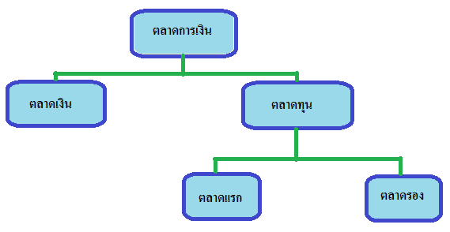
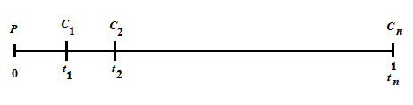
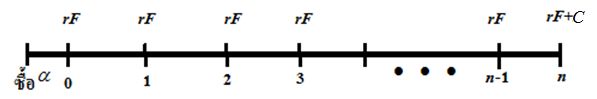
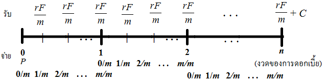
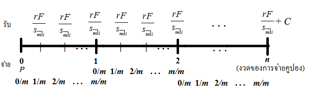
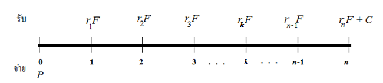
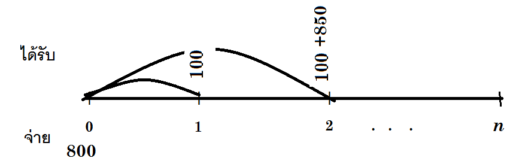

<!-- PDF page 142: independently reviewed -->

เนื้อหาประกอบด้วย

5.1 ภาพรวมตลาดการเงิน

5.2 อัตราผลตอบแทนในตลาดเงิน

5.3 ผลตอบแทนและการประเมินราคาตราสารทุน

5.4 ผลตอบแทนและการประเมินราคาตราสารหนี้

<h2 id="บทนำ">บทนำ</h2>

สำหรับในบทนี้จะกล่าวถึงภาพรวมของตลาดการเงินเพื่อให้ผู้ศึกษาได้มีความรู้พื้นฐานและรู้จักคำศัพท์ที่เกี่ยวข้องในตลาดการเงินซึ่งจะทำให้ผู้ศึกษาเข้าใจเนื้อหาในคณิตศาสตร์การเงินได้ง่ายขึ้น นอกจากนี้ยังกล่าวถึงผลตอบแทน การวิเคราะห์และประเมินมูลค่าของตราสารทุนและตราสารหนี้โดยใช้ความรู้กระแสเงินสดและความรู้ที่ได้กล่าวไว้ในบทก่อนหน้านี้ ในส่วนของแบบฝึกหัดนั้นผู้เขียนได้รวบรวมแนวข้อสอบใบอนุญาตผู้แนะนำนักลงทุน(Single License) เพื่อให้ผู้อ่านได้ทบทวนความรู้พื้นฐานเกี่ยวกับตลาดการเงินอีกด้วย

<h2 id="ภาพรวมตลาดการเงน">5.1 ภาพรวมตลาดการเงิน</h2>
<h3 id="ความหมายของตลาดการเงน">5.1.1 ความหมายของตลาดการเงิน</h3>

ตลาดการเงิน (Financial Market) คือ แหล่งหรือสถาบันที่ให้บริการทางการเงิน ซึ่งประกอบด้วยบุคคลหรือคณะบุคคล 2 ฝ่ายคือ ฝ่ายหนึ่งคือ ผู้มีเงินทุนเหลือหรือผู้ต้องการลงทุน และอีกฝ่ายหนึ่งคือ ผู้ต้องการเงินลงทุนซึ่งเป็นผู้ขาดแคลนเงินทุน ได้มาทำธุรกรรมทางด้านการเงิน โดยมีตัวกลางเป็น <em>เงินทุน</em> (Capital) โดยที่ตลาดการเงินมีความแตกต่างจากตลาดสินค้าและบริการ คือ ตลาดสินค้าและบริการเป็นแหล่งแลกเปลี่ยนสินค้าหรือบริการกับเงิน แต่ตลาดการเงินเป็นตลาดของเงินทุน

<figure class="source-figure">

<figcaption>
<em>รูปที่ 5.1 แผนภาพแสดงความหมายของตลาดการเงิน</em>
</figcaption>
</figure>

<!-- PDF page 143: independently reviewed -->

ตลาดการเงินนับว่ามีความสำคัญต่อระบบเศรษฐกิจอย่างมาก โดยทำหน้าที่เป็นช่องทางการส่งผ่านเงินทุนจากผู้ที่มีเงินทุนเหลือไปยังผู้ต้องการเงินทุนที่จะนำเงินทุนเหล่านั้นไปลงทุนหรือดำเนินกิจกรรมต่างๆทางเศรษฐกิจ อาทิ การผลิต การจ้างงาน การซื้อขายแลกเปลี่ยน เป็นต้น โดยที่ตลาดการเงินมีบทบาทและหน้าที่ที่สำคัญในระบบเศรษฐกิจ ดังนี้ คือ 1) ส่งเสริมการออม (Saving Function) 2) สนับสนุนการระดมเงินทุน (Liquidity Function) 3) เป็นคลังเพื่อรักษาความมั่งคั่ง (Wealth Function) 4) บริการด้านการชำระราคา (Payment Function) ในการซื้อขายแลกเปลี่ยนสินทรัพย์ทางการเงินกับเงินทุนหรือกิจกรรมที่เกี่ยวข้อง 5) การประเมินเครดิต (Credit Function) ของผู้ให้กู้และผู้กู้ 6) เป็นช่องทางในการบริหารความเสี่ยง (Risk Function) ที่เกิดขึ้นจากการลงทุน และ 7) เป็นส่วนประกอบหนึ่งในการดำเนินนโยบายทางเศรษฐกิจของภาครัฐ (Policy Function)

<h3 id="โครงสรางตลาดการเงน">5.1.2 โครงสร้างตลาดการเงิน</h3>

ตลาดการเงิน แบ่งออกเป็น 2 ประเภทหลัก คือ ตลาดเงิน(Money Market) และ ตลาดทุน (Capital Market) ทั้งสองตลาดนี้ใช้เกณฑ์ระยะเวลาในการลงทุนในการแบ่งประเภท ซึ่งจะกล่าวลงรายละเอียดพอสังเขป ดังนี้

<strong>1) ตลาดเงิน</strong>

<em>ตลาดเงิน</em> เป็นตลาดที่มีการซื้อขายตราสารทางการเงินที่มีอายุไม่เกิน 1 ปี เช่น ตั๋วแลกเงิน ตั๋วสัญญาใช้เงิน บัตรเงินฝาก ตั๋วเงินคลัง เป็นต้น โดยมีวัตถุประสงค์เพื่อระดมทุนไปใช้ในระยะสั้นหรือเพื่อการหมุนเวียนภายในกิจการ

<strong>2) ตลาดทุน</strong>

<em>ตลาดทุน</em> เป็นตลาดที่มีการซื้อขายตราสารทางการเงินที่มีอายุมากกว่า 1 ปีขึ้นไป เช่น หุ้นสามัญ หุ้นกู้ พันธบัตรรัฐบาล เป็นต้น เพื่อนำเงินทุนที่ได้ไปใช้ในการลงทุนโครงการระยะยาวต่าง ๆ โดยที่ ตลาดทุน แบ่งออกได้เป็นตลาดแรก (Primary Market) และตลาดรอง (Secondary Market)

2.1) <em>ตลาดแรก</em> เป็นตลาดที่สินทรัพย์ทางการเงินถูกซื้อขายเป็นครั้งแรกระหว่างผู้มีเงินออมที่ต้องการลงทุนกับผู้ที่ต้องการเงินลงทุนหรือเจ้าของกิจการ โดยเจ้าของกิจการจะเป็นผู้ออกหลักทรัพย์มาขายเพื่อนำเงินที่ได้ไปลงทุนหรือใช้ในการดำเนินการต่างๆในกิจการ

2.2) <em>ตลาดรอง</em> เป็นตลาดที่สินทรัพย์ทางการเงินที่นักลงทุนถือครองอยู่กับผู้ที่ต้องการถือครองสินทรัพย์ทำการซื้อขายแลกเปลี่ยนกัน โดยผู้ขายอาจจะมีเหตุผลเพื่อให้ได้รับเงินทุน หรือขาย

<!-- PDF page 144: independently reviewed -->

ทำกำไร และผู้ซื้ออาจจะมีเหตุผลเพื่อลงทุนระยะยาวหรือเพื่อการเก็งกำไรระยะสั้น ตลาดรองสามารถแบ่งได้เป็น 2 ประเภท ดังนี้

2.2.1) ตลาดรองที่เป็นทางการ (Organized Market) คือ ตลาดที่มีการจัดตั้งอย่างเป็นระบบ มีข้อบังคับ กฎเกณฑ์ในการซื้อขายสินทรัพย์ทางการเงินหรือหลักทรัพย์ทางการเงินอย่างชัดเจน เช่น ตลาดหลักทรัพย์แห่งประเทศไทย (The Stock Exchange of Thailand: SET) ตลาดหลักทรัพย์ เอ็ม เอ ไอ (Market for Alternative Investment: mai) ตลาดตราสารหนี้ (Bond Electronic Exchange: BEX) เป็นต้น

2.2.2) ตลาดรองที่ไม่เป็นทางการ (Over-the-Counter Market) คือ ตลาดที่มีการซื้อขายสินทรัพย์ทางการเงินด้วยการเจรจาซื้อขายต่อรองกันระหว่างคู่ค้าใดๆ โดยไม่ต้องผ่านหน่วยงานใดๆ เช่น ผู้ค้าทำการซื้อขายตราสารหนี้ในปริมาณที่มากสามารถเจรจาต่อรองซื้อขายกันเองได้โดยไม่ต้องผ่านหน่วยงานใด

จากความหมายและโครงสร้างของตลาดการเงินสามารถเขียนแสดงด้วยแผนภาพ ดังนี้

<figure class="source-figure">

<figcaption>
<em>รูปที่ 5.2 แผนภาพแสดงส่วนประกอบตลาดเงิน</em>
</figcaption>
</figure>
<h3 id="ประเภทของสนทรพยทางการเงน">5.1.3 ประเภทของสินทรัพย์ทางการเงิน</h3>

ประเภทของสินทรัพย์ทางการเงิน ได้แก่ เงิน (Money) ตราสารทุน (Equities) ตราสารหนี้ (Debt Instruments) และ ตราสารอนุพันธ์ (Derivative Instruments) โดยที่

<ol type="1">
<li>เงิน คือ สินทรัพย์ที่ทำหน้าเป็นสื่อกลางในการชำระราคาสินค้าและบริการ เงินเป็นสื่อกลาง ในการชำระหนี้ได้โดยกฎหมาย สินทรัพย์ทางการเงินที่จัดว่าเป็นเงินมีหลายรูปแบบและมีความหมายครอบคลุมกว้างกว่าเงินสด</li>
</ol>

<!-- PDF page 145: independently reviewed -->
<ol start="2" type="1">
<li>
ตราสารทุน คือ สินทรัพย์ที่บ่งบอกถึงความเป็นเจ้าของกิจการโดยผู้ถือครองตราสารทุนจะได้รับส่วนแบ่งเงินสดจากผลกำไรของกิจการในรูปเงินปันผลหรือรูปแบบอื่นเช่น หุ้นปันผล หรือสิทธิจองซื้อหุ้นก่อนนักลงทุนคนอื่น เป็นต้น และได้รับมูลค่าคงเหลือของกิจการในกรณีที่บริษัทจะต้องปิดกิจการแล้วมีการชำระบัญชี
</li>
<li>
ตราสารหนี้ คือ ตราสารทางการเงิน ที่ผู้ออกมีฐานะเป็น <em>ผู้กู้</em> (ลูกหนี้) มีข้อผูกพันทางกฎหมายว่าจะจ่ายผลประโยชน์ตามข้อตกลงและตามระยะเวลาที่กำหนดให้กับผู้ถือตราสาร ซึ่งมีฐานะเป็น <em>ผู้ให้กู้</em> (เจ้าหนี้) โดยตราสารหนี้อาจแบ่งตามระยะเวลาที่กำหนดได้เป็น
</li>
</ol>
<ul>
<li>ตราสารหนี้ระยะสั้น (ไม่เกิน 1 ปี)</li>
<li>ตราสารหนี้ระยะปานกลาง (มากกว่า 1 แต่ไม่เกิน 10 ปี)</li>
<li>ตราสารหนี้ระยะยาว (เกิน 10 ปีขึ้นไป)</li>
</ul>

<strong>หมายเหตุ</strong> - ตราสารหนี้ระยะสั้นจะเป็นสินทรัพย์อยู่ในตลาดเงิน ส่วน ตราสารหนี้ระยะกลางและยาวจะเป็นสินทรัพย์ในตลาดทุน

<ul>
<li>บางครั้งอาจแบ่งตราสารหนี้สำหรับตราสารหนี้ตามระยะเวลาเป็น 2 ประเภท คือ ตราสารหนี้ระยะสั้น (มีอายุไม่เกิน 1 ปี) และตราสารหนี้ระยะยาว (มีอายุเกิน 1 ปี)</li>
</ul>
<ol start="4" type="1">
<li>ตราสารอนุพันธ์ เป็นสัญญาทางการเงินที่ผู้ซื้อและผู้ขายตกลงที่จะซื้อหรือขายสินค้าอ้างอิง (Underlying Assets) โดยข้อตกลงทำธุรกรรมดังกล่าวทำในปัจจุบันแต่ชำระราคาและส่งมอบสินค้าอ้างอิงตามเวลาที่กำหนดไว้ในอนาคต ข้อตกลงทำธุรกรรมที่ระบุในตราสารอนุพันธ์อาจอยู่ในรูปพันธะผูกพัน (Obligation) ระหว่างคู่สัญญาทั้งฝ่ายซื้อและฝ่ายขาย หรืออาจเป็นข้อตกลงที่ให้สิทธิ (Right) แก่คู่สัญญาในการซื้อหรือขายสินค้าอ้างอิงหรือตัวแปรอ้างอิง ณ เวลาใดเวลาหนึ่งในอนาคต โดยมีการระบุจำนวนหรือปริมาณและคุณภาพของสินค้าอ้างอิง ราคาซื้อขายและวิธีการส่งมอบสินค้าอ้างอิงไว้เป็นการล่วงหน้า สินค้าอ้างอิงที่ระบุในตราสารอนุพันธ์ อาจเป็น</li>
</ol>
<ul>
<li>สินทรัพย์ทางการเงิน เช่น หุ้นสามัญ กลุ่มของหุ้น พันธบัตรรัฐบาล</li>
<li>ตัวแปรอ้างอิง เช่น ดัชนีราคาหุ้น (SET, SET100 และ SET50) เป็นต้น</li>
<li>สินค้าโภคภัณฑ์ เช่น สินค้าและผลิตภัณฑ์ทางการเกษตร น้ำมันดิบ สินแร่ เป็นต้น</li>
</ul>
<h3 id="ประเภทของตราสารทน">5.1.3 ประเภทของตราสารทุน</h3>

ตราสารทุนแบ่งออกเป็นหุ้นสามัญ (Common Stocks) และ หุ้นบุริมสิทธิ (Preferred Stocks) ดังนี้

<!-- PDF page 146: independently reviewed -->
<ol type="1">
<li>
<em>หุ้นสามัญ</em> คือ ตราสารที่แสดงถึงความเป็นเจ้าของกิจการตามสัดส่วนของหุ้นที่ถือครอง ได้รับสิทธิต่างๆของผู้ถือหุ้นตามที่กฎหมายกำหนด ได้สิทธิออกเสียงในที่ประชุมผู้ถือหุ้น ได้รับส่วนแบ่งกำไรในรูปของเงินปันผลและยังได้รับส่วนแบ่งในทรัพย์สินกรณีที่เลิกกิจการแต่ได้รับสิทธิเป็นลำดับสุดท้ายหลังจากผู้เรียกร้องอื่นๆเรียกร้องสิทธิแล้ว
</li>
<li>
<em>หุ้นบุริมสิทธิ</em> เป็นตราสารที่แสดงถึงความเป็นเจ้าของกิจการ แต่เป็นไปในลักษณะกึ่งหนี้สินกึ่งหุ้นสามัญ กล่าวคือมีลักษณะเป็นเจ้าของกิจการร่วมกับการเป็นเจ้าหนี้ด้วย โดยผู้ถือครองจะได้รับเงินปันผลในอัตราที่กำหนดแน่นอน แต่ไม่ได้รับสิทธิลงคะแนนเสียงในที่ประชุมผู้ถือหุ้น มีสิทธิได้รับเงินปันผลก่อนผู้ถือหุ้นสามัญ ในกรณีที่เลิกกิจการ มีสิทธิได้รับส่วนแบ่งในสินทรัพย์ของกิจการหลังเจ้าหนี้ แต่จะได้รับก่อนผู้ถือหุ้นสามัญ
</li>
</ol>
<h3 id="องคประกอบของตราสารหน">5.1.4 องค์ประกอบของตราสารหนี้</h3>

โดยทั่วไปองค์ประกอบของตราสารหนี้ ได้แก่

<ol type="1">
<li>
มูลค่าที่ตราไว้ หรือราคาที่ตราไว้ (Par Value or Face Value : F) คือ ราคาของตราสารที่ระบุในตราสารแต่ละหน่วย
</li>
<li>
มูลค่าไถ่ถอน หรือ ราคาไถ่ถอน (Maturity Value : C) หมายถึง มูลค่าของตราสารที่ผู้ออก(ผู้กู้) จะต้องจ่ายชำระคืนให้กับผู้ถือตราสารในวันที่ครบกำหนดไถ่ถอน ซึ่งโดยปกติจะเท่ากับราคาที่ตราไว้
</li>
<li>
อัตราคูปอง (Coupon Rate : r) เป็นอัตราดอกเบี้ยที่ผู้ออกจ่ายให้กับผู้ถือตราสารตามงวดโดยคำนวณจากราคาที่ตราไว้ อัตราคูปองของตราสารอาจจะระบุเป็นอัตราตายตัว (Fixed Rate Bond or Coupon Bond) หรืออัตราลอยตัว (Floating Rate Bond) ก็ได้ ตราสารหนี้บางตราสารอาจจะไม่มีการจ่ายคูปองก็ได้ เรียกว่า <em>ตราสารไม่มีคูปอง</em> ( Zero Coupon Bond )ซึ่งราคาจำหน่ายตราสาร(ราคาซื้อ) จะต่ำกว่าราคาที่ตราไว้ เรียกว่า <em>ซื้อ (ขาย) ในราคาส่วนลด</em>
</li>
<li>
งวดของการจ่ายคูปอง(Coupon Frequency) คือจำนวนครั้งการจ่ายคูปองใน 1 ปี
</li>
<li>
ลักษณะของสิทธิแฝง (Embeded Option) คือสิทธิหรือทางเลือกที่แฝงอยู่ในตราสาร เช่น
</li>
</ol>
<ul>
<li>สิทธิของผู้ถือตราสารหนี้ในการแปลงสภาพตราสารหนี้เป็นตราสารทุน ตราสาที่มีสิทธินี้ เรียกว่า <em>หุ้นกู้แปลงสภาพ</em> (Convertible Bond)</li>
</ul>

<!-- PDF page 147: independently reviewed -->
<ul>
<li>
สิทธิของผู้ออกตราสารหนี้ในไถ่ถอนคืนก่อนวันครบกำหนดได้ (Callable Bond) ผู้ออกตราสารสามารถไถ่ถอนตราสารคืนได้ก่อนกำหนด ซึ่งจ่าย <em>เงินเรียกคืนชดเชย</em> (Call Premium)รวมกับราคาที่ตราไว้ให้กับผู้ถือตราสาร เงินเรียกคืนชดเชยนี้จะลดลงเรื่อยๆ เมื่อใกล้เวลาไถ่ถอน
</li>
<li>
สิทธิที่ผู้ถือตราสารหนี้ในการขายตราสารหนี้คืนให้กับผู้ออกตราสาร (Putable Bond) สิทธิในการขายคืนที่ถือได้รับนี้ ทำให้ผู้ถือสามารถลดความเสี่ยงจากการลงทุนได้ โดยเฉพาะอย่างยิ่งเมื่ออันดับเครดิตของผู้ออกตราสารลดลง หรือในช่วงที่อัตราดอกเบี้ยในท้องตลาดสูงขึ้น
</li>
</ul>
<ol start="6" type="1">
<li>
ข้อสัญญา (Convenants) คือ เงื่อนไขที่ผู้ออกจะต้องปฏิบัติตามหรืองดเว้นการปฏิบัติ ตลอดอายุของตราสารหนี้ หรืออาจรวมถึงการจำกัดด้านการบริหาร เช่นห้ามจ่ายเงินปันผลแก่ผู้ถือหุ้นสามัญเกินที่กำหนด ห้ามควบรวมกิจการ เป็นต้น
</li>
<li>
ชื่อผู้ออก (Issuer Name) คือ ผู้ออกตราสารซึ่งมีฐานะเป็น ลูกหนี้
</li>
</ol>
<h3 id="ประเภทของตราสารหน">5.1.5 ประเภทของตราสารหนี้</h3>

โดยทั่วไปผู้ออกตราสารหนี้มักจะมีการออกตราสารหนี้ให้สอดคล้องกับความต้องการใช้เงินทุนและความสามารถในการชำระหนี้ในอนาคตของผู้ออก และเพื่อเป็นการดึงดูดนักลงทุน ผู้ออกมักออกตราสารเพื่อตอบสนองต่อความต้องการที่แตกต่างกันของนักลงทุนแต่ละประเภทด้วย เช่น คนวัยเกษียณอายุที่ยอมรับความเสี่ยงได้ต่ำมักต้องการลงทุนในตราสารหนี้ภาครัฐระยะสั้นหรือปานกลางแม้ว่าจะให้ผลตอบแทนค่อนข้างต่ำ ในขณะที่คนวัยเริ่มต้นทำงานยอมรับความเสี่ยงได้มากกว่ามักชอบลงทุนในตราสารหนี้ภาคเอกชนที่ให้ผลตอบแทนสูงแต่ก็มีความเสี่ยงมากขึ้นด้วย เป็นต้น ดังนั้น ตราสารหนี้จึงสามารถแบ่งได้หลายประเภท ซึ่งจะขอกล่าวเพื่อเป็นความรู้ไว้พอสังเขป ดังนี้

• <em>ตราสารหนี้แบ่งตามประเภทของผู้ออก</em>

<strong>1) ตราสารหนี้ที่ออกโดยรัฐบาล</strong>

<u>หน่วยงานที่ออก</u> กระทรวงการคลัง

<u>วัตถุประสงค์ในการออกตราสาร</u> เพื่อระดมเงินทุนจากนักลงทุนและประชาชนทั่วไป เพื่อนำเงินทุนมาใช้จ่ายในกิจกรรมของรัฐบาลโดยเป็นการอุดหนุนภาระขาดดุลงบประมาณ

<u>จุดเด่น</u> ไม่มีความเสี่ยงเรื่องการผิดนัดชำระดอกเบี้ยและเงินต้น (Default Free) ความเสี่ยงต่ำมากจนจัดได้ว่าไม่มีความเสี่ยง (Risk Free Bond) แต่อัตราผลตอบแทนก็ต่ำ

<u>ผลิตภัณฑ์</u> แบ่งตามอายุของตราสาร ได้แก่

<!-- PDF page 148: independently reviewed -->
<ul>
<li>
อายุน้อยกว่า 1 ปี เรียกว่า <em>ตั๋วเงินคลัง</em> เป็นตราสารประเภทไม่จ่ายคูปอง ขายในราคาที่หักส่วนลดจากมูลค่าหน้าตั๋วหรือราคาที่ตราไว้ เมื่อครบกำหนดอายุจะได้รับการไถ่ถอนตามราคาที่ตราไว้
</li>
<li>
อายุตั้งแต่ 1 ปี ขึ้นไปเรียกว่า <em>พันธบัตรรัฐบาล</em> โดยมีราคาที่ตราไว้ เท่ากับ 1,000 บาทต่อหน่วยโดยทั่วไปมีลักษณะการจ่ายดอกเบี้ยเป็นแบบอัตราดอกเบี้ยคงที่ โดยจ่ายปีละ 2 ครั้งและชำระคืนเงินต้นครั้งเดียว ณ วันไถ่ถอน
</li>
</ul>

<strong>2) ตราสารหนี้ที่ออกโดยองค์กรภาครัฐและรัฐวิสาหกิจ</strong>

<u>หน่วยงานที่ออก</u> องค์กรภาครัฐและรัฐวิสาหกิจ เช่น ธนาคารแห่งประเทศไทย การไฟฟ้าส่วนภูมิภาค เป็นต้น บางหน่วยงานมีรัฐบาลเป็นผู้ค้ำประกัน

<u>วัตถุประสงค์ในการออกตราสาร</u> เพื่อระดมเงินทุนนักลงทุนและประชาชนทั่วไปเพื่อใช้ในการดำเนินกิจการ

<u>จุดเด่น</u> มีความเสี่ยงต่ำ

<u>ผลิตภัณฑ์</u> เป็นตราสารลักษณะเดียวกับพันธบัตรรัฐบาลมีชื่อเรียกตามหน่วยงานที่ออก เช่นพันธบัตรธนาคารแห่งประเทศไทย พันธบัตรการไฟฟ้าส่วนภูมิภาค ฯลฯ

<strong>3) ตราสารหนี้ภาคเอกชน</strong>

<u>หน่วยงานที่ออก</u> บริษัทเอกชน

<u>วัตถุประสงค์ในการออกตราสาร</u> เพื่อระดมเงินทุนจากนักลงทุนและประชาชนทั่วไปเพื่อนำไปใช้ในการดำเนินกิจการ

<u>จุดเด่น</u> ให้อัตราผลตอบแทนที่สูงกว่าพันธบัตร แต่ มีความเสี่ยงที่สูงกว่า

<u>ผลิตภัณฑ์</u> เป็นตราสารหนี้ที่มีอายุมากกว่า 1 ปี เรียกว่า <em>หุ้นกู้</em>

• <em>ตราสารหนี้แบ่งตามสิทธิในการเรียกร้อง</em>

<ul>
<li>
<u>ตราสารหนี้ด้อยสิทธิ</u> (Subordinated Bond) คือ ตราสารหนี้ที่ผู้ถือจะมีสิทธิเรียกร้องชำระหนี้ในอันดับหลังจากเจ้าหนี้บุริมสิทธิ์และเจ้าหนี้ทั่วไปในกรณีที่บริษัทผู้ออกตราสารล้มละลาย หรือมีการชำระบัญชีเพื่อเลิกกิจการ แต่จะมีสิทธิสูงกว่าผู้ถือหุ้นบุริมสิทธิ และหุ้นสามัญ ซึ่งจะมีสิทธิเป็นอันดับสุดท้าย
</li>
<li>
<u>ตราสารหนี้ไม่ด้อยสิทธิ</u> คือ ตราสารหนี้ที่ผู้ถือจะมีสิทธิเรียกร้องชำระหนี้ได้ทัดเทียมกับ
</li>
</ul>

<!-- PDF page 149: independently reviewed -->

เจ้าหนี้สามัญรายอื่นๆ และมีสิทธิเรียกร้องสูงกว่าผู้ถือตราสารหนี้ด้อยสิทธิ ผู้ถือหุ้นบุริมสิทธิ และผู้ถือหุ้นสามัญตาม ลำดับ

• <em>แบ่งตามการค้ำประกัน</em>

<ul>
<li>
<u>ตราสารหนี้มีประกัน</u> หมายถึง ตราสารหนี้ที่ผู้ออกนำสินทรัพย์ซึ่งอาจเป็นอสังหาริมทรัพย์ เช่น ที่ดิน อาคาร โรงงาน หรือ สังหาริมทรัพย์ เช่น สินค้าในโรงงาน เป็นหลักประกันในการออก โดยผู้ถือจะมีบุริมสิทธิเหนือสินทรัพย์นั้น
</li>
<li>
<u>ตราสารหนี้ไม่มีประกัน</u> หมายถึงตราสารหนี้ที่ไม่ได้จัดให้มีหลักประกันเพื่อการชำระหนี้
</li>
</ul>

• <em>แบ่งตามประเภทอื่นๆ</em>

<ul>
<li>
<u>ตราสารหนี้จ่ายดอกเบี้ยแบบคงที่</u> (Fixed-Rate Bond) คือ ตราสารหนี้ที่จ่ายดอกเบี้ยในอัตราคงที่ตามที่กำหนดไว้ตลอดอายุของตราสารหนี้ โดยตราสารหนี้ในตลาดกว่าร้อยละ 80 จะมีลักษณะการจ่ายดอกเบี้ยแบบคงที่
</li>
<li>
<u>ตราสารหนี้จ่ายดอกเบี้ยแบบลอยตัว</u> (Floating Rate Bond หรือ FRN) หมายถึง ตราสารหนี้ที่กำหนดอัตราผลตอบแทนที่แปรไปตามอัตราอ้างอิงหรือดัชนีที่กำหนดไว้ เช่น อัตราดอกเบี้ยเงินฝาก หรืออัตราดอกเบี้ยเงินกู้ของธนาคารพาณิชย์ ดังนั้น เมื่อมีการเปลี่ยนแปลงอัตราดอกเบี้ย อัตราผลตอบแทนของตราสารหนี้ก็จะเปลี่ยนแปลงไปด้วย
</li>
</ul>

<strong>หมายเหตุ</strong> ถ้าอัตราดอกเบี้ยมีแนวโน้มสูงขึ้นแล้ว ผู้ออกตราสารหนี้จะต้องการออกตราสารหนี้แบบจ่ายดอกเบี้ยแบบคงที่ มากกว่า แต่ นักลงทุนจะต้องการซื้อตราสารหนี้แบบจ่ายดอกเบี้ยแบบลอยตัวมากกว่า ในทางกลับกัน ถ้าอัตราดอกเบี้ยมีแนวโน้มสูงขึ้นแล้ว ผู้ออกตราสารหนี้จะต้องการออกตราสารหนี้แบบจ่ายดอกเบี้ยแบบคงที่ มากกว่า แต่ นักลงทุนจะต้องการซื้อตราสารหนี้แบบจ่ายดอกเบี้ยแบบลอยตัวมากกว่า

<ul>
<li><u>หุ้นกู้แปลงสภาพ</u> (Convertible Bond) เป็นตราสารหนี้ที่ให้สิทธิแก่ผู้ถือหุ้นกู้ในการแปลงสภาพจากการถือหุ้นกู้ไปเป็นหุ้นสามัญตามอัตรา ราคาแปลงสภาพ และเวลาที่กำหนดไว้ในตราสาร</li>
</ul>

<strong>หมายเหตุ</strong> นักลงทุนจะมีต้องการหุ้นกูประเภทนี้ถ้าราคาหุ้นมีแนวโน้มสูงขึ้น

<ul>
<li><u>หุ้นกู้ประเภททยอยจ่ายคืนเงินต้น</u> (Amortizing Bond) คือ ตราสารหนี้ประเภทที่ผู้ออกจะทยอยจ่ายคืนเงินต้นแก่ผู้ถือในแต่ละงวด หุ้นกู้ประเภทนี้ช่วยลดความเสี่ยงในการผิด</li>
</ul>

<!-- PDF page 150: independently reviewed -->

ชำระของผู้ลงทุนได้ในระดับหนึ่ง แต่มีความเสี่ยงในเรื่องของการลงทุนต่อแทน

<ul>
<li>
<u>หุ้นกู้ที่ผู้ออกมีสิทธิเรียกไถ่ถอนก่อนกำหนด</u> (Callable Bond) คือ ตราสารหนี้ที่ให้สิทธิผู้ออกในการเรียกคืน (Call) หรือไถ่ถอนหุ้นกู้นั้นก่อนกำหนด ตราสารหนี้ ประเภทนี้ผู้ออกจะได้ประโยชน์หากอัตราดอกเบี้ยในตลาดอยู่ในระดับต่ำ แต่ผู้ถือตราสารจะเสียประโยชน์
</li>
<li>
<u>หุ้นกู้ที่ผู้ถือมีสิทธิไถ่ถอนก่อนกำหนด</u> (Puttable Bond) คือ ตราสารหนี้ที่ให้สิทธิแก่ผู้ถือในการขอไถ่ถอนก่อนครบกำหนด ตราสารหนี้ประเภทนี้ผู้ถือจะได้ประโยชน์หากอัตราดอกเบี้ยในตลาดอยู่ในระดับสูง แต่ผู้ถือตราสารจะเสียประโยชน์
</li>
<li>
<u>ตราสารหนี้จากการแปลงสินทรัพย์เป็นหลักทรัพย์</u> (Securitized Bond) คือ ตราสารหนี้ที่เกิดจากกระบวนการแปลงสินทรัพย์ให้เป็นหลักทรัพย์ (Securitization) โดยมีหลักทรัพย์ที่นำมาแปลงนั้นค้ำประกัน และการจ่ายดอกเบี้ยจากกระแสเงินสดที่ได้จากตัวสินทรัพย์ที่นำมาแปลงนั้น
</li>
<li>
<u>ตราสารหนี้ประเภทไถ่ถอนเมื่อเลิกบริษัท</u> (Perpetual Bond) คือตราสารหนี้ที่ไม่มีวันหมดอายุ โดยไม่มีการไถ่ถอนคืนจนกว่าบริษัทจะเลิกกิจการ และจะมีการจ่ายดอกเบี้ยอย่างต่อเนื่องตามที่กำหนด
</li>
</ul>
<h3 id="การจดอนดบความนาเชอถอของตราสารหน">5.1.6 การจัดอันดับความน่าเชื่อถือของตราสารหนี้</h3>

การลงทุนในตราสารหนี้นั้น นักลงทุนจะต้องคำนึงถึงปัจจัยความเสี่ยงด้านการผิดนัดชำระดอกเบี้ยและเงินต้น ซึ่งจะขึ้นอยู่กับความมั่นคงและฐานะทางการเงินของบริษัทหรือหน่วยงานผู้ออก เพื่อเป็นการให้ข้อมูลแก่นักลงทุนที่เป็นผู้แบกรับความเสี่ยงนั้น จึงได้มีการจัดตั้งสถาบันจัดอันดับความน่าเชื่อถือของตราสารหนี้ขึ้น โดยวัตถุประสงค์เพื่อให้บริการด้านการวิเคราะห์และประเมินสถานะความน่าเชื่อถือของตราสารหนี้ เพื่อประโยชน์แก่นักลงทุน ผู้ออกตราสารหนี้และสถาบันการเงินได้ใช้ประกอบการพิจารณาและประเมินการลงทุนในตราสารหนี้

ปัจจุบันประเทศไทยมีสถาบันจัดอันดับความน่าเชื่อถืออยู่ 2 สถาบันคือ

<ol type="1">
<li><u>บริษัท ไทยเรทติ้งแอนด์อินฟอร์เมชั่นเซอร์วิส จำกัด</u> หรือ ทริส (TRIS) เป็นสถาบันจัดอันดับความน่าเชื่อถือแห่งแรกของไทย จัดตั้งโดยการสนับสนุนจากกระทรวงการคลังและธนาคารแห่งประเทศไทยในปี พ.ศ. 2536</li>
</ol>

<!-- PDF page 151: independently reviewed -->
<ol start="2" type="1">
<li><u>บริษัทฟิทช์เรทติ้ง (ประเทศไทย) จำกัด</u> หรือ ฟิทช์ (FITCH) เป็นบริษัทจัดความน่าเชื่อถืออีกแห่งหนึ่งของประเทศไทย จัดตั้งในปี 2544 โดยมีกองทุนบำเหน็จบำนาญข้าราชการเป็นผู้ถือหุ้นรายใหญ่</li>
</ol>

โดยสถาบันการจัดอันดับความน่าเชื่อถือจะจัดอันดับตามความเสี่ยงของการผิดชำระหนี้จากความเสี่ยงต่ำที่สุด ไปยังอันดับที่มีความเสี่ยงสูงที่สุด โดยการพิจารณาจาก ความสามารถในการชำระคืนดอกเบี้ยและเงินต้น ความเปลี่ยนแปลงทางธุรกิจและเศรษฐกิจส่งผลกระทบมากน้อยเพียงใด โดยเริ่มจาก อันดับ AAA ไปจนกระทั่งถึง D ดังนี้

<table class="source-table rating-table">
<thead>
<tr>
<th>
สัญลักษณ์
</th>
<th>
ระดับความเชื่อมั่น
</th>
<th>
ระดับความเสี่ยง
</th>
<th>
หมายเหตุ
</th>
</tr>
</thead>
<tbody>
<tr>
<td>
AAA
</td>
<td>
มีความเชื่อมั่นสูงที่สุด
</td>
<td>
มีความเสี่ยงต่ำที่สุด
</td>
<td rowspan="4">
จัดเป็นตราสารหนี้ที่ เหมาะลงทุน (Investment Grade Bond)
</td>
</tr>
<tr>
<td>
AA
</td>
<td>
มีความเชื่อมั่นสูงมาก
</td>
<td>
มีความเสี่ยงต่ำมาก
</td>
</tr>
<tr>
<td>
A
</td>
<td>
มีความเชื่อมั่นสูง
</td>
<td>
มีความเสี่ยงต่ำ
</td>
</tr>
<tr>
<td>
BBB
</td>
<td>
มีความเชื่อมั่นปานกลาง
</td>
<td>
มีความเสี่ยงปานกลาง
</td>
</tr>
<tr class="rating-speculative" style="background:#dbe5f1">
<td>
BB
</td>
<td>
มีความเชื่อมั่นต่ำ
</td>
<td>
มีความเสี่ยงสูง
</td>
<td rowspan="4">
จัดเป็นตราสารหนี้ ประเภทเก็งกำไร (Speculative Grade Bond)
</td>
</tr>
<tr class="rating-speculative" style="background:#dbe5f1">
<td>
B
</td>
<td>
มีความเชื่อมั่นต่ำมาก
</td>
<td>
มีความเสี่ยงสูงมาก
</td>
</tr>
<tr class="rating-speculative" style="background:#dbe5f1">
<td>
C
</td>
<td>
มีความเชื่อมั่นต่ำที่สุด
</td>
<td>
มีความเสี่ยงสูงมากที่สุด
</td>
</tr>
<tr class="rating-speculative" style="background:#dbe5f1">
<td>
D
</td>
<td>
ไม่มีความเชื่อมั่นว่าจะได้รับการชำระหนี้
</td>
<td>
อยู่ในภาวะผิดนัดชำระหนี้
</td>
</tr>
</tbody>
</table>

<strong>หมายเหตุ</strong> อันดับน่าเชื่อถือ AAA ถึง C อาจมีเครื่องหมาย บวก(+) ลบ (-) ต่อท้าย เช่น AAA- มีระดับความเชื่อมั่นสูงกว่า AA+ แต่ต่ำกว่า AAA เป็นต้น

<h3 id="ประเภทของตราสารอนพนธตามลกษณะพนธะผกพนของสญญา">5.1.7 ประเภทของตราสารอนุพันธ์ตามลักษณะพันธะผูกพันของสัญญา</h3>

ตราสารอนุพันธ์ตามลักษณะพันธะผูกพันของสัญญา จำแนกเป็น 3 ประเภท คือ สัญญาซื้อขายล่วงหน้า ออปชั่น และสัญญาสวอป

<ol type="1">
<li><u>สัญญาซื้อขายล่วงหน้า</u></li>
</ol>

เป็นสัญญาระหว่างคู่สัญญาสองฝ่ายที่ตกลงจะซื้อจะขายสินค้าอ้างอิงที่ระบุในสัญญา ในราคา ปริมาณ และเวลาส่งมอบที่ได้กำหนดในไว้สัญญา โดยทั้งผู้ที่จะซื้อและผู้ที่จะขาย

<!-- PDF page 152: independently reviewed -->

มีภาระผูกพันต้องทำตามสัญญานั้นๆ กล่าวคือ ฝ่ายผู้ขายจะต้องนำสินค้าอ้างอิงมาส่งมอบตามเวลาที่กำหนดไว้ในสัญญา และฝ่ายผู้ซื้อจะต้องชำระราคาตามกำหนด

<u>ประเภทของสัญญาซื้อขายล่วงหน้ามีอยู่ 2 ประเภท คือ</u>

1.1) <u>สัญญาฟอร์เวิร์ด</u> (Forward Contact) เป็นสัญญาซื้อขายล่วงหน้าที่คู่สัญญาตกลงซื้อขายกันเองในตลาดที่ไม่เป็นทางการ (Over-the-Counter Market) โดยคู่สัญญาจะต้องปฏิบัติตามข้อผูกพันตามสัญญาฟอร์เวิร์ดโดยมีการส่งมอบตัวสินค้าอ้างอิงจริง (Physical Delivery)

<u>ตัวอย่างของสัญญาฟอร์เวิร์ด</u> ได้แก่ สัญญาฟอร์เวิร์ดเงินตราต่างประเทศ สัญญาฟอร์เวิร์ดอัตราดอกเบี้ย (Forward Rate Agreement หรือ FRA) สัญญาฟอร์เวิร์ดยางพารา และ สัญญาฟอร์เวิร์ดดอกทิวลิป เป็นต้น

1.2) <u>สัญญาฟิวเจอร์ส</u> (Future Contact) เป็นสัญญาซื้อขายล่วงหน้าที่คู่สัญญาตกลงซื้อขายผ่านนายหน้าในตลาดที่จัดตั้งอย่างทางการ(Organized Exchange) โดยคู่สัญญาตามสัญญาฟิวเจอร์ส ส่วนใหญ่มิได้ต้องการส่งมอบหรือรับมอบตัวสินค้าอ้างอิงจริงๆ เช่นเดียวกับสัญญาฟอร์เวิร์ด แต่คู่สัญญาเลือกที่จะล้างหรือปิดฐานะการเป็นคู่สัญญาได้ โดยการรับและจ่ายเงินสด (Cash Settlement)

<u>ตัวอย่างของสัญญาฟิวเจอร์ส</u> ได้แก่ สัญญาฟิวเจอร์สในดัชนีราคาหุ้น SET50 หรือ SET50 Index Futures ที่ซื้อขายในตลาดอนุพันธ์ TFEX และสัญญาซื้อขายสินค้าเกษตรล่วงหน้า ในตลาดล่วงหน้า AFEX เป็นต้น

<ol start="2" type="1">
<li><u>ออปชั่น</u> (Option)หรือตราสารสิทธิ เป็นสัญญาซื้อขายล่วงหน้าที่ผู้ออกออปชั่นให้สิทธิ (Right)แก่ผู้ซื้อออปชั่นที่จะซื้อหรือขายสินค้าอ้างอิงหรือตัวแปรอ้างอิง ในราคา ปริมาณ และเวลาตามที่กำหนดไว้ในสัญญา สิทธิในที่นี้ มิใช่พันธะ เนื่องจากออปชั่นมีลักษณะเป็นใบแสดงสิทธิ ดังนั้น ผู้ซื้อออปชั่นจึงต้องจ่ายเงินเพื่อซื้อออปชั่น เรียกว่า <em>ค่าพรีเมียม</em> (Premium) เพื่อให้ได้มาซึ่ง สิทธิที่ระบุในออปชั่น หากผู้ถือออปชั่นใช้สิทธิ ผู้ออกหรือผู้ขายออปชั่นมีพันธะที่จะต้องขายหรือรับซื้อสินค้าอ้างอิงหรือตัวแปรอ้างอิงตามที่ระบุในสัญญา</li>
</ol>

<u>ประเภทของออปชั่นแบ่งตามการให้สิทธิแบ่งได้ 2 ประเภท</u>

<ul>
<li><u>คอลออปชั่น</u> (Call Option) เป็นออปชั่นที่ให้สิทธิแก่ผู้ถือออปชั่นในการซื้อสินค้าอ้างอิง</li>
<li><u>พุทออปชั่น</u> (Put Option) เป็นออปชั่นที่ให้สิทธิแก่ผู้ถือออปชั่นในการขายสินค้าอ้างอิง</li>
</ul>

<!-- PDF page 153: independently reviewed -->

<u>ตัวอย่างของออปชั่นที่มีการซื้อขายในศูนย์ซื้อขายอนุพันธ์</u> ได้แก่ คอลออปชั่นและพุทออปชั่นของ SET50 Index

<ol start="3" type="1">
<li><u>สัญญาสวอป</u> (Swarp) เป็นสัญญาที่กำหนดให้คู่สัญญาแลกเปลี่ยนกระแสเงินสดที่จะเกิดขึ้นในอนาคตระหว่างกันเพื่อให้เหมาะสมกับการดำเนินธุรกิจของแต่ละฝ่ายโดยคู่สัญญาจะต้องปฏิบัติตามพันธะผูกพันในการส่งมอบกระแสเงินสดระหว่างกันที่งวดที่กำหนดตลอดอายุสัญญา</li>
</ol>

<u>ตัวอย่างของสัญญาสวอป</u> ได้แก่ สัญญาสวอปเงินตราต่างประเทศ สัญญาสวอปอัตราดอกเบี้ย เป็นต้น

<h3 id="ประโยชนของตราสารอนพนธ-และผคาในตลาดตราสารอนพนธ">5.1.8 ประโยชน์ของตราสารอนุพันธ์ และผู้ค้าในตลาดตราสารอนุพันธ์</h3>

วัตถุประสงค์หลักของการออกตราสารอนุพันธ์ คือเพื่อใช้เป็นเครื่องมือในการจัดการและบริหารความเสี่ยง ผลจากการซื้อขายตราสารอนุพันธ์ทำให้เกิดผลประโยชน์ด้านการเก็งกำไร นอกจากนี้ราคาที่เกิดจากการซื้อขายยังช่วยให้ผู้ลงทุนในสินค้าหลัก ค้นพบราคาที่แท้จริงของหลักทรัพย์หลักหรือสินค้าหลักได้เร็วขึ้นอีกด้วย

จากวัตถุประสงค์หลักและประโยชน์ของตราสารอนุพันธ์ เราจึงสามารถจำแนกผู้ค้าในตลาดตราสารอนุพันธ์ได้เป็น 3 ประเภท คือ นักบริหารความเสี่ยง (Hedger) นักเก็งกำไร (Speculator) และนักค้ากำไร (Arbitrageur) โดยผู้ค้าแต่ละประเภทมีคำจำกัดความ ดังนี้

<ol type="1">
<li>
<u>นักบริหารความเสี่ยง</u> คือ ผู้ค้าที่ต้องการกำหนดราคาซื้อหรือขายสินค้าอ้างอิงไว้ก่อนที่จะมีการซื้อหรือขายจริงสินค้าอ้างอิงนั้นจริง เพื่อเป็นการลดความเสี่ยงจากความผันผวนของราคาสินค้าอ้างอิง ทำให้ราคาสินค้าอ้างอิงมีความไม่แน่นอน เช่น ความไม่แน่นอนของราคาหุ้นและสินค้าต่างๆ อัตราดอกเบี้ย และอัตราแลกเปลี่ยน เป็นต้น
</li>
<li>
<u>นักเก็งกำไร</u> คือ ผู้ค้าที่เข้ามาซื้อหรือขายตราสารอนุพันธ์ โดยต้องการทำกำไรจากความผันผวนของราคาตราสารอนุพันธ์หรือสินค้าอ้างอิงซึ่งทำให้เกิดส่วนต่างระหว่างราคาซื้อและราคาขาย นักเก็งกำไรที่เข้ามาไม่ได้มีวัตถุประสงค์เพื่อให้ได้สิทธิในการซื้อหรือขายสินค้าอ้างอิง นักเก็งกำไรมีส่วนช่วยทำให้ตลาดอนุพันธ์มีสภาพคล่องเนื่องจากมีการซื้อขายหมุนเวียนเปลี่ยนมือกันอย่างต่อเนื่อง
</li>
<li>
<u>นักค้ากำไร</u> คือ ผู้ค้าที่เข้ามาลงทุนในตลาดอนุพันธ์เพื่อแสวงหารายได้ จากความความไม่สมดุลระหว่างระหว่างราคาสินค้าอ้างอิงในตลาด 2 ตลาดคือ ในตลาดปัจจุบันหรือราคาเงินสด กับราคาในตลาดอนุพันธ์ หากราคาทั้งสองเคลื่อนไหวไม่สมดุลกันก็จะสามารถทำการค้ากำไรได้โดยการ
</li>
</ol>

<!-- PDF page 154: independently reviewed -->

ซื้อสินค้าหรือตราสารในตลาดที่มีราคาต่ำพร้อมกับการขายตราสารหรือสินค้าในตลาดที่ราคาสูง ซึ่งเป็นการทำกำไรโดยปราศจากความเสี่ยง (Arbitrage) ทั้งนี้ การค้ากำไรจะช่วยผลักดันให้ตราสารมีการปรับราคาเข้าสู่จุดที่เหมาะสมได้เร็วขึ้น

<h2 id="อตราผลตอบแทนในตลาดเงน">5.2 อัตราผลตอบแทนในตลาดเงิน</h2>

เราได้ทราบความหมายของตลาดเงินมาแล้วว่า ตลาดเงิน เป็นตลาดที่มีการซื้อขายตราสารทางการเงินที่มีอายุไม่เกิน 1 ปี เช่น ตั๋วแลกเงิน ตั๋วสัญญาใช้เงิน บัตรเงินฝาก ตั๋วเงินคลัง เป็นต้น ตราสารเหล่านี้จะมีสภาพคล่องสูง ความเสี่ยงต่ำ โดยดัชนีชี้วัดอัตราผลตอบแทนของสินทรัพย์ทางการเงินเหล่านี้มีอยู่หลายรูปแบบ ได้แก่ อัตราผลตอบแทนส่วนลดธนาคาร (Bank Discount Yield : <math display="inline" xmlns="http://www.w3.org/1998/Math/MathML"><semantics><msub><mi>r</mi><mrow><mi>B</mi><mi>D</mi><mi>Y</mi></mrow></msub><annotation encoding="application/x-tex">r_{BDY}</annotation></semantics></math>) อัตราผลตอบแทนตามระยะเวลาการลงทุน (Holding Period Yield : <math display="inline" xmlns="http://www.w3.org/1998/Math/MathML"><semantics><msub><mi>r</mi><mrow><mi>H</mi><mi>P</mi><mi>Y</mi></mrow></msub><annotation encoding="application/x-tex">r_{HPY}</annotation></semantics></math>) อัตราผลตอบแทนตลาดเงิน (Money Market Yield : <math display="inline" xmlns="http://www.w3.org/1998/Math/MathML"><semantics><msub><mi>r</mi><mrow><mi>M</mi><mi>M</mi><mi>Y</mi></mrow></msub><annotation encoding="application/x-tex">r_{MMY}</annotation></semantics></math>) อัตราผลตอบแทนที่เป็นผลรายปี (Effective Annual Yield : <math display="inline" xmlns="http://www.w3.org/1998/Math/MathML"><semantics><msub><mi>r</mi><mrow><mi>E</mi><mi>A</mi><mi>Y</mi></mrow></msub><annotation encoding="application/x-tex">r_{EAY}</annotation></semantics></math>) อัตราผลตอบแทนถ่วงน้ำหนักด้วยจำนวนเงิน (Dollar-Weighted Rate of Return : <math display="inline" xmlns="http://www.w3.org/1998/Math/MathML"><semantics><msub><mi>r</mi><mrow><mi>D</mi><mi>W</mi><mi>R</mi></mrow></msub><annotation encoding="application/x-tex">r_{DWR}</annotation></semantics></math>) อัตราผลตอบแทนถ่วงน้ำหนักด้วยเวลา (Time-Weighted Rate of Return : <math display="inline" xmlns="http://www.w3.org/1998/Math/MathML"><semantics><msub><mi>r</mi><mrow><mi>T</mi><mi>W</mi><mi>R</mi></mrow></msub><annotation encoding="application/x-tex">r_{TWR}</annotation></semantics></math>) เป็นต้น เพื่อความสะดวกกำหนดสัญลักษณ์ที่เกี่ยวข้องดังนี้

<math display="inline" xmlns="http://www.w3.org/1998/Math/MathML"><semantics><mi>F</mi><annotation encoding="application/x-tex">F</annotation></semantics></math> แทน ราคาที่ตราไว้

<math display="inline" xmlns="http://www.w3.org/1998/Math/MathML"><semantics><mi>P</mi><annotation encoding="application/x-tex">P</annotation></semantics></math> แทน ราคาขาย (ซื้อ) หรือ ราคาปัจจุบันของตราสาร

<math display="inline" xmlns="http://www.w3.org/1998/Math/MathML"><semantics><mi>t</mi><annotation encoding="application/x-tex">t</annotation></semantics></math> แทน จำนวนวันที่ถือครองตราสารจนกระทั่งถึงวันไถ่ถอน

<math display="inline" xmlns="http://www.w3.org/1998/Math/MathML"><semantics><mi>C</mi><annotation encoding="application/x-tex">C</annotation></semantics></math> แทน ราคาไถ่ถอน

<math display="inline" xmlns="http://www.w3.org/1998/Math/MathML"><semantics><mi>D</mi><annotation encoding="application/x-tex">D</annotation></semantics></math> แทน ดอกเบี้ยที่ชำระให้ผู้ซื้อขณะถือครองตราสาร

<h3 id="อตราผลตอบแทนสวนลดธนาคาร">5.2.1 อัตราผลตอบแทนส่วนลดธนาคาร</h3>

<strong>บทนิยาม 5.1</strong> อัตราผลตอบแทนส่วนลดธนาคาร แทนด้วยสัญลักษณ์ <math display="inline" xmlns="http://www.w3.org/1998/Math/MathML"><semantics><msub><mi>r</mi><mrow><mi>B</mi><mi>D</mi><mi>Y</mi></mrow></msub><annotation encoding="application/x-tex">r_{BDY}</annotation></semantics></math> นิยามโดย

<math display="block" xmlns="http://www.w3.org/1998/Math/MathML"><semantics><mrow><msub><mi>r</mi><mrow><mi>B</mi><mi>D</mi><mi>Y</mi></mrow></msub><mo>=</mo><mfrac><mrow><mi>F</mi><mo>−</mo><mi>P</mi></mrow><mi>F</mi></mfrac><mo>×</mo><mfrac><mn>360</mn><mi>t</mi></mfrac><mspace width="2.0em"></mspace><mo stretchy="false" form="prefix">(</mo><mtext mathvariant="normal">ต่อ ปี</mtext><mo stretchy="false" form="postfix">)</mo><mspace width="2.0em"></mspace><mo stretchy="false" form="prefix">(</mo><mn>5.1</mn><mo stretchy="false" form="postfix">)</mo></mrow><annotation encoding="application/x-tex">r_{BDY}=\frac{F-P}{F}\times\frac{360}{t}\qquad(\text{ต่อ ปี})\qquad(5.1)</annotation></semantics></math>

อัตราผลตอบแทนส่วนลดธนาคาร <math display="inline" xmlns="http://www.w3.org/1998/Math/MathML"><semantics><msub><mi>r</mi><mrow><mi>B</mi><mi>D</mi><mi>Y</mi></mrow></msub><annotation encoding="application/x-tex">r_{BDY}</annotation></semantics></math> จะกำหนดให้ 1 ปี มี 360 วัน และ โดยธนาคารคิดส่วนลด เท่ากับ <math display="inline" xmlns="http://www.w3.org/1998/Math/MathML"><semantics><mrow><mi>F</mi><mo>−</mo><mi>P</mi></mrow><annotation encoding="application/x-tex">F-P</annotation></semantics></math> ภายใต้สมมติฐาน ราคาไถ่ถอนเท่ากับราคาที่ตราไว้ <math display="inline" xmlns="http://www.w3.org/1998/Math/MathML"><semantics><msub><mi>r</mi><mrow><mi>B</mi><mi>D</mi><mi>Y</mi></mrow></msub><annotation encoding="application/x-tex">r_{BDY}</annotation></semantics></math> นิยมใช้ในการคำนวณอัตราผลตอบแทนของตราสารหนี้อายุคงเหลือไม่เกิน 1 ปี

<!-- PDF page 155: independently reviewed -->

<strong>ข้อด้อยของอัตราผลตอบแทนส่วนลดธนาคาร <math display="inline" xmlns="http://www.w3.org/1998/Math/MathML"><semantics><msub><mi>r</mi><mrow><mi>B</mi><mi>D</mi><mi>Y</mi></mrow></msub><annotation encoding="application/x-tex">r_{BDY}</annotation></semantics></math></strong>

<ol type="1">
<li>
<math display="inline" xmlns="http://www.w3.org/1998/Math/MathML"><semantics><msub><mi>r</mi><mrow><mi>B</mi><mi>D</mi><mi>Y</mi></mrow></msub><annotation encoding="application/x-tex">r_{BDY}</annotation></semantics></math> ไม่ได้แสดงถึงอัตราผลตอบแทนที่แท้จริงจากการลงทุน
</li>
<li>
จำนวนวันที่ใช้ในการคำนวณเป็นการนับวันลงทุนโดยประมาณ ไม่ได้ใช้จำนวนวันที่แท้จริง
</li>
</ol>

<strong>ตัวอย่างที่ 5.8</strong> สมมติว่าตั๋วแลกเงินฉบับหนึ่ง มีราคาที่ตราไว้ 10,000 บาท มีราคาขาย 9,800 บาท และ มีอายุคงเหลือ 120 วัน โดยมีราคาไถ่ถอนเท่ากับราคาที่ตราไว้ จงคำนวณหาค่า อัตราผลตอบแทนส่วนลดธนาคาร <math display="inline" xmlns="http://www.w3.org/1998/Math/MathML"><semantics><msub><mi>r</mi><mrow><mi>B</mi><mi>D</mi><mi>Y</mi></mrow></msub><annotation encoding="application/x-tex">r_{BDY}</annotation></semantics></math>

<strong>วิธีทำ</strong> จาก <math display="inline" xmlns="http://www.w3.org/1998/Math/MathML"><semantics><mrow><msub><mi>r</mi><mrow><mi>B</mi><mi>D</mi><mi>Y</mi></mrow></msub><mo>=</mo><mstyle displaystyle="true"><mfrac><mrow><mi>F</mi><mo>−</mo><mi>P</mi></mrow><mi>F</mi></mfrac></mstyle><mo>×</mo><mstyle displaystyle="true"><mfrac><mn>360</mn><mi>t</mi></mfrac></mstyle></mrow><annotation encoding="application/x-tex">r_{BDY}=\dfrac{F-P}{F}\times\dfrac{360}{t}</annotation></semantics></math> ในที่นี้ <math display="inline" xmlns="http://www.w3.org/1998/Math/MathML"><semantics><mrow><mi>F</mi><mo>=</mo><mn>10</mn><mo>,</mo><mn>000</mn></mrow><annotation encoding="application/x-tex">F=10,000</annotation></semantics></math> , <math display="inline" xmlns="http://www.w3.org/1998/Math/MathML"><semantics><mrow><mi>P</mi><mo>=</mo><mn>9</mn><mo>,</mo><mn>800</mn></mrow><annotation encoding="application/x-tex">P=9,800</annotation></semantics></math> , <math display="inline" xmlns="http://www.w3.org/1998/Math/MathML"><semantics><mrow><mi>t</mi><mo>=</mo><mn>120</mn></mrow><annotation encoding="application/x-tex">t=120</annotation></semantics></math> จะได้

<math display="block" xmlns="http://www.w3.org/1998/Math/MathML"><semantics><mrow><msub><mi>r</mi><mrow><mi>B</mi><mi>D</mi><mi>Y</mi></mrow></msub><mo>=</mo><mfrac><mrow><mn>10</mn><mo>,</mo><mn>000</mn><mo>−</mo><mn>9</mn><mo>,</mo><mn>800</mn></mrow><mrow><mn>10</mn><mo>,</mo><mn>000</mn></mrow></mfrac><mo>×</mo><mfrac><mn>360</mn><mn>120</mn></mfrac><mo>=</mo><mn>0.06</mn><mo>=</mo><mn>6</mn><mspace width="0.222em"></mspace><mi>%</mi><mspace width="2.0em"></mspace><mi>▫</mi></mrow><annotation encoding="application/x-tex">r_{BDY}=\frac{10,000-9,800}{10,000}\times\frac{360}{120}=0.06=6\ \%\qquad\square</annotation></semantics></math>

<h3 id="อตราผลตอบแทนตามระยะเวลาการลงทน">5.2.2 อัตราผลตอบแทนตามระยะเวลาการลงทุน</h3>

<strong>บทนิยาม 5.2</strong> อัตราผลตอบแทนตามระยะเวลาการลงทุน แทนด้วยสัญลักษณ์ <math display="inline" xmlns="http://www.w3.org/1998/Math/MathML"><semantics><msub><mi>r</mi><mrow><mi>H</mi><mi>P</mi><mi>Y</mi></mrow></msub><annotation encoding="application/x-tex">r_{HPY}</annotation></semantics></math> คำนวณภายใต้สมมติฐานว่า นักลงทุนถือครองตราสารจนกระทั่งถึงวันไถ่ถอน ซึ่งนิยาม <math display="inline" xmlns="http://www.w3.org/1998/Math/MathML"><semantics><msub><mi>r</mi><mrow><mi>H</mi><mi>P</mi><mi>Y</mi></mrow></msub><annotation encoding="application/x-tex">r_{HPY}</annotation></semantics></math> ดังนี้

<math display="block" xmlns="http://www.w3.org/1998/Math/MathML"><semantics><mrow><msub><mi>r</mi><mrow><mi>H</mi><mi>P</mi><mi>Y</mi></mrow></msub><mo>=</mo><mfrac><mrow><mi>C</mi><mo>−</mo><mi>P</mi><mo>+</mo><mi>D</mi></mrow><mi>P</mi></mfrac><mspace width="2.0em"></mspace><mo stretchy="false" form="prefix">(</mo><mtext mathvariant="normal">ต่อ ช่วงการลงทุน</mtext><mo stretchy="false" form="postfix">)</mo></mrow><annotation encoding="application/x-tex">r_{HPY}=\frac{C-P+D}{P}\qquad (\text{ต่อ ช่วงการลงทุน})</annotation></semantics></math>
(5.2)

<strong>ตัวอย่างที่ 5.9</strong> สมมติว่าบัตรเงินฝากฉบับหนึ่ง มีราคาที่ตราไว้ 10,000 บาท มีราคาขาย 9,800 บาท และ มีอายุคงเหลือ 120 วัน โดยมีราคาไถ่ถอนเท่ากับราคาที่ตราไว้ ถ้าขณะถือครองตราสารผู้ซื้อได้รับดอกเบี้ยร้อยละ 3 ต่อปีของราคาที่ตราไว้ จงคำนวณหาอัตราผลตอบแทนตามระยะเวลาการลงทุน <math display="inline" xmlns="http://www.w3.org/1998/Math/MathML"><semantics><msub><mi>r</mi><mrow><mi>H</mi><mi>P</mi><mi>Y</mi></mrow></msub><annotation encoding="application/x-tex">r_{HPY}</annotation></semantics></math> กำหนดให้ 1 ปีมี 365 วัน

<strong>วิธีทำ</strong> ขณะถือครองตราสารผู้ซื้อได้รับดอกเบี้ย <math display="inline" xmlns="http://www.w3.org/1998/Math/MathML"><semantics><mi>D</mi><annotation encoding="application/x-tex">D</annotation></semantics></math> เท่ากับ <math display="inline" xmlns="http://www.w3.org/1998/Math/MathML"><semantics><mrow><mrow><mo stretchy="true" form="prefix">(</mo><mstyle displaystyle="true"><mfrac><mn>120</mn><mn>365</mn></mfrac></mstyle><mo stretchy="true" form="postfix">)</mo></mrow><mo stretchy="false" form="prefix">(</mo><mn>0.03</mn><mo stretchy="false" form="postfix">)</mo><mo stretchy="false" form="prefix">(</mo><mn>10</mn><mo>,</mo><mn>000</mn><mo stretchy="false" form="postfix">)</mo><mo>=</mo><mn>98.63</mn></mrow><annotation encoding="application/x-tex">\left(\dfrac{120}{365}\right)(0.03)(10,000)=98.63</annotation></semantics></math> บาท

จาก <math display="inline" xmlns="http://www.w3.org/1998/Math/MathML"><semantics><mrow><msub><mi>r</mi><mrow><mi>H</mi><mi>P</mi><mi>Y</mi></mrow></msub><mo>=</mo><mstyle displaystyle="true"><mfrac><mrow><mi>C</mi><mo>−</mo><mi>P</mi><mo>+</mo><mi>D</mi></mrow><mi>P</mi></mfrac></mstyle></mrow><annotation encoding="application/x-tex">r_{HPY}=\dfrac{C-P+D}{P}</annotation></semantics></math> ในที่นี้ <math display="inline" xmlns="http://www.w3.org/1998/Math/MathML"><semantics><mrow><mi>C</mi><mo>=</mo><mn>10</mn><mo>,</mo><mn>000</mn></mrow><annotation encoding="application/x-tex">C=10,000</annotation></semantics></math> , <math display="inline" xmlns="http://www.w3.org/1998/Math/MathML"><semantics><mrow><mi>P</mi><mo>=</mo><mn>9</mn><mo>,</mo><mn>800</mn></mrow><annotation encoding="application/x-tex">P=9,800</annotation></semantics></math> , <math display="inline" xmlns="http://www.w3.org/1998/Math/MathML"><semantics><mrow><mi>D</mi><mo>=</mo><mn>98.63</mn></mrow><annotation encoding="application/x-tex">D=98.63</annotation></semantics></math> จะได้

<math display="block" xmlns="http://www.w3.org/1998/Math/MathML"><semantics><mrow><msub><mi>r</mi><mrow><mi>H</mi><mi>P</mi><mi>Y</mi></mrow></msub><mo>=</mo><mfrac><mrow><mn>10</mn><mo>,</mo><mn>000</mn><mo>−</mo><mn>9</mn><mo>,</mo><mn>800</mn><mo>+</mo><mn>98.63</mn></mrow><mrow><mn>9</mn><mo>,</mo><mn>800</mn></mrow></mfrac><mo>=</mo><mn>0.0305</mn><mo>=</mo><mn>3.05</mn><mspace width="0.222em"></mspace><mi>%</mi><mspace width="2.0em"></mspace><mi>▫</mi></mrow><annotation encoding="application/x-tex">r_{HPY}=\frac{10,000-9,800+98.63}{9,800}=0.0305=3.05\ \%\qquad\square</annotation></semantics></math>

<h3 id="อตราผลตอบแทนตลาดเงน">5.2.3 อัตราผลตอบแทนตลาดเงิน</h3>

<strong>บทนิยาม 5.3</strong> อัตราผลตอบแทนตลาดเงิน (Money Market Return Rate ) แทนด้วยสัญลักษณ์ <math display="inline" xmlns="http://www.w3.org/1998/Math/MathML"><semantics><msub><mi>r</mi><mrow><mi>M</mi><mi>M</mi><mi>Y</mi></mrow></msub><annotation encoding="application/x-tex">r_{MMY}</annotation></semantics></math> เป็นการหาอัตราผลตอบแทน <math display="inline" xmlns="http://www.w3.org/1998/Math/MathML"><semantics><msub><mi>r</mi><mrow><mi>H</mi><mi>P</mi><mi>Y</mi></mrow></msub><annotation encoding="application/x-tex">r_{HPY}</annotation></semantics></math> ต่อปี โดยกำหนดให้ 1 ปี เท่ากับ 360 วัน ดังนั้นสูตรการคำนวณ <math display="inline" xmlns="http://www.w3.org/1998/Math/MathML"><semantics><msub><mi>r</mi><mrow><mi>M</mi><mi>M</mi><mi>Y</mi></mrow></msub><annotation encoding="application/x-tex">r_{MMY}</annotation></semantics></math> อยู่ในรูป

<!-- PDF page 156: independently reviewed -->

<math display="block" xmlns="http://www.w3.org/1998/Math/MathML"><semantics><mrow><msub><mi>r</mi><mrow><mi>M</mi><mi>M</mi><mi>Y</mi></mrow></msub><mo>=</mo><msub><mi>r</mi><mrow><mi>H</mi><mi>P</mi><mi>Y</mi></mrow></msub><mo>×</mo><mfrac><mn>360</mn><mi>t</mi></mfrac><mspace width="2.0em"></mspace><mo stretchy="false" form="prefix">(</mo><mtext mathvariant="normal">ต่อ ปี</mtext><mo stretchy="false" form="postfix">)</mo></mrow><annotation encoding="application/x-tex">r_{MMY}=r_{HPY}\times\frac{360}{t}\qquad(\text{ต่อ ปี})</annotation></semantics></math>
(5.3)

เมื่อ <math display="inline" xmlns="http://www.w3.org/1998/Math/MathML"><semantics><mi>t</mi><annotation encoding="application/x-tex">t</annotation></semantics></math> เป็นจำนวนวันที่ถือครองตราสารจนกระทั่งถึงวันไถ่ถอน

ในกรณีของตราสารที่ไม่มีดอกเบี้ยที่ชำระให้ผู้ซื้อขณะถือครองตราสาร ดังนั้นอัตราผลตอบแทนตามระยะเวลาการลงทุนของตราสาร คือ

<math display="block" xmlns="http://www.w3.org/1998/Math/MathML"><semantics><mrow><msub><mi>r</mi><mrow><mi>H</mi><mi>P</mi><mi>Y</mi></mrow></msub><mo>=</mo><mfrac><mrow><mi>F</mi><mo>−</mo><mi>P</mi></mrow><mi>P</mi></mfrac><mo>=</mo><mfrac><mrow><mi>F</mi><mo>−</mo><mi>P</mi></mrow><mi>F</mi></mfrac><mo>×</mo><mfrac><mi>F</mi><mi>P</mi></mfrac><mo>=</mo><msub><mi>r</mi><mrow><mi>B</mi><mi>D</mi><mi>Y</mi></mrow></msub><mo>×</mo><mfrac><mi>t</mi><mn>360</mn></mfrac><mo>×</mo><mfrac><mi>F</mi><mi>P</mi></mfrac></mrow><annotation encoding="application/x-tex">r_{HPY}=\frac{F-P}{P}=\frac{F-P}{F}\times\frac{F}{P}=r_{BDY}\times\frac{t}{360}\times\frac{F}{P}</annotation></semantics></math>
(5.4)

ดังนั้น <math display="inline" xmlns="http://www.w3.org/1998/Math/MathML"><semantics><msub><mi>r</mi><mrow><mi>M</mi><mi>M</mi><mi>Y</mi></mrow></msub><annotation encoding="application/x-tex">r_{MMY}</annotation></semantics></math> สำหรับตราสารที่ไม่มีดอกเบี้ย คำนวณได้จาก

<math display="block" xmlns="http://www.w3.org/1998/Math/MathML"><semantics><mrow><msub><mi>r</mi><mrow><mi>M</mi><mi>M</mi><mi>Y</mi></mrow></msub><mo>=</mo><mfrac><mrow><msub><mi>r</mi><mrow><mi>B</mi><mi>D</mi><mi>Y</mi></mrow></msub><mi>F</mi></mrow><mi>P</mi></mfrac></mrow><annotation encoding="application/x-tex">r_{MMY}=\frac{r_{BDY}F}{P}</annotation></semantics></math>
(5.5)

เพราะว่า <math display="inline" xmlns="http://www.w3.org/1998/Math/MathML"><semantics><mrow><mi>F</mi><mo>−</mo><mi>P</mi><mo>=</mo><msub><mi>r</mi><mrow><mi>B</mi><mi>D</mi><mi>Y</mi></mrow></msub><mi>F</mi><mo>×</mo><mstyle displaystyle="true"><mfrac><mi>t</mi><mn>360</mn></mfrac></mstyle></mrow><annotation encoding="application/x-tex">F-P=r_{BDY}F\times\dfrac{t}{360}</annotation></semantics></math> ดังนั้น

<math display="block" xmlns="http://www.w3.org/1998/Math/MathML"><semantics><mrow><msub><mi>r</mi><mrow><mi>M</mi><mi>M</mi><mi>Y</mi></mrow></msub><mo>=</mo><mfrac><mrow><msub><mi>r</mi><mrow><mi>B</mi><mi>D</mi><mi>Y</mi></mrow></msub><mi>F</mi></mrow><mrow><mi>F</mi><mo>−</mo><mo stretchy="false" form="prefix">(</mo><mi>F</mi><mo>−</mo><mi>P</mi><mo stretchy="false" form="postfix">)</mo></mrow></mfrac><mo>=</mo><mfrac><mrow><msub><mi>r</mi><mrow><mi>B</mi><mi>D</mi><mi>Y</mi></mrow></msub><mi>F</mi></mrow><mrow><mi>F</mi><mo>−</mo><mrow><mo stretchy="true" form="prefix">(</mo><msub><mi>r</mi><mrow><mi>B</mi><mi>D</mi><mi>Y</mi></mrow></msub><mi>F</mi><mo>×</mo><mfrac><mi>t</mi><mn>360</mn></mfrac><mo stretchy="true" form="postfix">)</mo></mrow></mrow></mfrac><mo>=</mo><mfrac><mrow><mn>360</mn><msub><mi>r</mi><mrow><mi>B</mi><mi>D</mi><mi>Y</mi></mrow></msub></mrow><mrow><mn>360</mn><mo>−</mo><mi>t</mi><msub><mi>r</mi><mrow><mi>B</mi><mi>D</mi><mi>Y</mi></mrow></msub></mrow></mfrac></mrow><annotation encoding="application/x-tex">r_{MMY}=\frac{r_{BDY}F}{F-(F-P)}=\frac{r_{BDY}F}{F-\left(r_{BDY}F\times\frac{t}{360}\right)}=\frac{360r_{BDY}}{360-tr_{BDY}}</annotation></semantics></math>
(5.6)

นั่นคือ

<math display="block" xmlns="http://www.w3.org/1998/Math/MathML"><semantics><mrow><msub><mi>r</mi><mrow><mi>M</mi><mi>M</mi><mi>Y</mi></mrow></msub><mo>=</mo><mfrac><mrow><mn>360</mn><msub><mi>r</mi><mrow><mi>B</mi><mi>D</mi><mi>Y</mi></mrow></msub></mrow><mrow><mn>360</mn><mo>−</mo><mi>t</mi><msub><mi>r</mi><mrow><mi>B</mi><mi>D</mi><mi>Y</mi></mrow></msub></mrow></mfrac></mrow><annotation encoding="application/x-tex">r_{MMY}=\frac{360r_{BDY}}{360-tr_{BDY}}</annotation></semantics></math>
(5.7)

สูตร (5.7) เป็นการคำนวณ <math display="inline" xmlns="http://www.w3.org/1998/Math/MathML"><semantics><msub><mi>r</mi><mrow><mi>M</mi><mi>M</mi><mi>Y</mi></mrow></msub><annotation encoding="application/x-tex">r_{MMY}</annotation></semantics></math> ตราสารที่ไม่มีดอกเบี้ยโดยไม่จำเป็นต้องทราบราคาที่ตราไว้ มีประโยชน์สำหรับการคำนวณราคาซื้อที่สมเหตุสมผลเมื่อกำหนดอัตราลดธนาคาร <math display="inline" xmlns="http://www.w3.org/1998/Math/MathML"><semantics><msub><mi>r</mi><mrow><mi>B</mi><mi>D</mi><mi>Y</mi></mrow></msub><annotation encoding="application/x-tex">r_{BDY}</annotation></semantics></math>

<strong>ตัวอย่างที่ 5.10</strong> สมมติว่าตั๋วเงินคลังฉบับหนึ่ง มีราคาที่ตราไว้ 10,000 บาท ตั๋วเงินคลังมีส่วนลด 500 บาท และ มีอายุคงเหลือ 120 วัน โดยมีราคาไถ่ถอนเท่ากับราคาที่ตราไว้ ถ้าขณะถือครองตราสารผู้ซื้อไม่ได้รับดอกเบี้ย ต่อปีของราคาที่ตราไว้ จงคำนวณหาอัตราผลตอบแทนตลาดเงิน <math display="inline" xmlns="http://www.w3.org/1998/Math/MathML"><semantics><msub><mi>r</mi><mrow><mi>M</mi><mi>M</mi><mi>Y</mi></mrow></msub><annotation encoding="application/x-tex">r_{MMY}</annotation></semantics></math>

<strong>วิธีทำ</strong> จาก <math display="inline" xmlns="http://www.w3.org/1998/Math/MathML"><semantics><mrow><msub><mi>r</mi><mrow><mi>H</mi><mi>P</mi><mi>Y</mi></mrow></msub><mo>=</mo><mstyle displaystyle="true"><mfrac><mrow><mi>C</mi><mo>−</mo><mi>P</mi><mo>+</mo><mi>D</mi></mrow><mi>P</mi></mfrac></mstyle></mrow><annotation encoding="application/x-tex">r_{HPY}=\dfrac{C-P+D}{P}</annotation></semantics></math> ในที่นี้ <math display="inline" xmlns="http://www.w3.org/1998/Math/MathML"><semantics><mrow><mi>t</mi><mo>=</mo><mn>120</mn></mrow><annotation encoding="application/x-tex">t=120</annotation></semantics></math> , <math display="inline" xmlns="http://www.w3.org/1998/Math/MathML"><semantics><mrow><mi>D</mi><mo>=</mo><mn>0</mn></mrow><annotation encoding="application/x-tex">D=0</annotation></semantics></math> , <math display="inline" xmlns="http://www.w3.org/1998/Math/MathML"><semantics><mrow><mi>C</mi><mo>=</mo><mn>10</mn><mo>,</mo><mn>000</mn></mrow><annotation encoding="application/x-tex">C=10,000</annotation></semantics></math> , <math display="inline" xmlns="http://www.w3.org/1998/Math/MathML"><semantics><mrow><mi>C</mi><mo>−</mo><mi>P</mi><mo>=</mo><mi>F</mi><mo>−</mo><mi>P</mi><mo>=</mo><mn>500</mn></mrow><annotation encoding="application/x-tex">C-P=F-P=500</annotation></semantics></math>

ดังนั้น <math display="inline" xmlns="http://www.w3.org/1998/Math/MathML"><semantics><mrow><mi>P</mi><mo>=</mo><mn>9</mn><mo>,</mo><mn>500</mn></mrow><annotation encoding="application/x-tex">P=9,500</annotation></semantics></math> และ <math display="inline" xmlns="http://www.w3.org/1998/Math/MathML"><semantics><mrow><msub><mi>r</mi><mrow><mi>H</mi><mi>P</mi><mi>Y</mi></mrow></msub><mo>=</mo><mstyle displaystyle="true"><mfrac><mrow><mn>500</mn><mo>+</mo><mn>0</mn></mrow><mrow><mn>9</mn><mo>,</mo><mn>500</mn></mrow></mfrac></mstyle><mo>=</mo><mn>0.0526</mn></mrow><annotation encoding="application/x-tex">r_{HPY}=\dfrac{500+0}{9,500}=0.0526</annotation></semantics></math> ซึ่งทำให้ได้

<math display="block" xmlns="http://www.w3.org/1998/Math/MathML"><semantics><mrow><msub><mi>r</mi><mrow><mi>M</mi><mi>M</mi><mi>Y</mi></mrow></msub><mo>=</mo><msub><mi>r</mi><mrow><mi>H</mi><mi>P</mi><mi>Y</mi></mrow></msub><mo>×</mo><mfrac><mn>360</mn><mi>t</mi></mfrac><mo>=</mo><mn>0.05263</mn><mo>×</mo><mfrac><mn>360</mn><mn>120</mn></mfrac><mo>=</mo><mn>0.15789</mn><mo>=</mo><mn>15.789</mn><mspace width="0.222em"></mspace><mi>%</mi><mspace width="2.0em"></mspace><mi>▫</mi></mrow><annotation encoding="application/x-tex">r_{MMY}=r_{HPY}\times\frac{360}{t}=0.05263\times\frac{360}{120}=0.15789=15.789\ \%\qquad\square</annotation></semantics></math>

<!-- PDF page 157: independently reviewed -->
<h3 id="อตราผลตอบแทนทเปนผลตอป">5.2.4 อัตราผลตอบแทนที่เป็นผลต่อปี</h3>

จาก อัตราผลตอบแทนตามระยะเวลาการลงทุน <math display="inline" xmlns="http://www.w3.org/1998/Math/MathML"><semantics><mrow><msub><mi>r</mi><mrow><mi>H</mi><mi>P</mi><mi>Y</mi></mrow></msub><mo>=</mo><mstyle displaystyle="true"><mfrac><mrow><mi>C</mi><mo>−</mo><mi>P</mi><mo>+</mo><mi>D</mi></mrow><mi>P</mi></mfrac></mstyle></mrow><annotation encoding="application/x-tex">r_{HPY}=\dfrac{C-P+D}{P}</annotation></semantics></math> (ต่อ ช่วงการลงทุน)

สมมติให้ <math display="inline" xmlns="http://www.w3.org/1998/Math/MathML"><semantics><mrow><mn>0</mn><mo>≤</mo><mi>t</mi><mo>≤</mo><mn>1</mn></mrow><annotation encoding="application/x-tex">0\le t\le 1</annotation></semantics></math> เป็นเวลาที่ถือครองตราสารจนกระทั่งถึงวันไถ่ถอน(หน่วยเป็นปี กำหนด 1 ปี เท่ากับ 365 วัน) และ <math display="inline" xmlns="http://www.w3.org/1998/Math/MathML"><semantics><mi>i</mi><annotation encoding="application/x-tex">i</annotation></semantics></math> เป็นอัตราดอกเบี้ยที่เป็นผลต่อปี จะได้ <math display="inline" xmlns="http://www.w3.org/1998/Math/MathML"><semantics><mrow><mo stretchy="false" form="prefix">(</mo><mn>1</mn><mo>+</mo><mi>i</mi><msup><mo stretchy="false" form="postfix">)</mo><mi>t</mi></msup><mo>=</mo><mn>1</mn><mo>+</mo><msub><mi>r</mi><mrow><mi>H</mi><mi>P</mi><mi>Y</mi></mrow></msub></mrow><annotation encoding="application/x-tex">(1+i)^t=1+r_{HPY}</annotation></semantics></math> นั่นคือ

<math display="block" xmlns="http://www.w3.org/1998/Math/MathML"><semantics><mrow><mi>i</mi><mo>=</mo><mo stretchy="false" form="prefix">(</mo><mn>1</mn><mo>+</mo><msub><mi>r</mi><mrow><mi>H</mi><mi>P</mi><mi>Y</mi></mrow></msub><msup><mo stretchy="false" form="postfix">)</mo><mrow><mn>1</mn><mi>/</mi><mi>t</mi></mrow></msup><mo>−</mo><mn>1</mn></mrow><annotation encoding="application/x-tex">i=(1+r_{HPY})^{1/t}-1</annotation></semantics></math>

<strong>บทนิยาม 5.4</strong> อัตราผลตอบแทนที่เป็นผลต่อปี (Annual Effective Return Rate ) แทนด้วยสัญลักษณ์ <math display="inline" xmlns="http://www.w3.org/1998/Math/MathML"><semantics><msub><mi>r</mi><mrow><mi>E</mi><mi>A</mi><mi>Y</mi></mrow></msub><annotation encoding="application/x-tex">r_{EAY}</annotation></semantics></math> เป็นอัตราผลตอบแทนที่คำนวณภายใต้กำหนด 1 ปี เท่ากับ 365 วัน คำนวณด้วยราคาซื้อและคิดอัตราดอกเบี้ยแบบทบต้น ซึ่งมีสูตรในการคำนวณคือ

<math display="block" xmlns="http://www.w3.org/1998/Math/MathML"><semantics><mrow><msub><mi>r</mi><mrow><mi>E</mi><mi>A</mi><mi>Y</mi></mrow></msub><mo>=</mo><mo stretchy="false" form="prefix">(</mo><mn>1</mn><mo>+</mo><msub><mi>r</mi><mrow><mi>H</mi><mi>P</mi><mi>Y</mi></mrow></msub><msup><mo stretchy="false" form="postfix">)</mo><mrow><mn>1</mn><mi>/</mi><mi>t</mi></mrow></msup><mo>−</mo><mn>1</mn></mrow><annotation encoding="application/x-tex">r_{EAY}=(1+r_{HPY})^{1/t}-1</annotation></semantics></math>
(5.8)

เมื่อ <math display="inline" xmlns="http://www.w3.org/1998/Math/MathML"><semantics><mrow><mn>0</mn><mo>≤</mo><mi>t</mi><mo>≤</mo><mn>1</mn></mrow><annotation encoding="application/x-tex">0\le t\le 1</annotation></semantics></math> เป็นเวลาที่ถือครองตราสารจนกระทั่งถึงวันไถ่ถอน (หน่วยเป็นปี)

<strong>ตัวอย่างที่ 5.11</strong> สมมติว่าตั๋วสัญญาใช้เงินฉบับหนึ่ง มีราคาซื้อ 9,500 บาท ตั๋วเงินคลังมีส่วนลด 500 บาท และ มีอายุ 240 วัน โดยมีราคาไถ่ถอนเท่ากับราคาที่ตราไว้ ถ้าขณะถือครองตราสารผู้ซื้อได้รับดอกเบี้ย 400 บาท จงคำนวณหาอัตราผลตอบแทนที่เป็นผลต่อปี <math display="inline" xmlns="http://www.w3.org/1998/Math/MathML"><semantics><msub><mi>r</mi><mrow><mi>E</mi><mi>A</mi><mi>Y</mi></mrow></msub><annotation encoding="application/x-tex">r_{EAY}</annotation></semantics></math>

<strong>วิธีทำ</strong> จาก <math display="inline" xmlns="http://www.w3.org/1998/Math/MathML"><semantics><msub><mi>r</mi><mrow><mi>H</mi><mi>P</mi><mi>Y</mi></mrow></msub><annotation encoding="application/x-tex">r_{HPY}</annotation></semantics></math> - ในที่นี้ <math display="inline" xmlns="http://www.w3.org/1998/Math/MathML"><semantics><mrow><mi>t</mi><mo>=</mo><mstyle displaystyle="true"><mfrac><mn>240</mn><mn>365</mn></mfrac></mstyle></mrow><annotation encoding="application/x-tex">t=\dfrac{240}{365}</annotation></semantics></math> , <math display="inline" xmlns="http://www.w3.org/1998/Math/MathML"><semantics><mrow><mi>D</mi><mo>=</mo><mn>500</mn></mrow><annotation encoding="application/x-tex">D=500</annotation></semantics></math> , <math display="inline" xmlns="http://www.w3.org/1998/Math/MathML"><semantics><mrow><mi>P</mi><mo>=</mo><mn>9</mn><mo>,</mo><mn>500</mn></mrow><annotation encoding="application/x-tex">P=9,500</annotation></semantics></math> , <math display="inline" xmlns="http://www.w3.org/1998/Math/MathML"><semantics><mrow><mi>C</mi><mo>−</mo><mi>P</mi><mo>=</mo><mi>F</mi><mo>−</mo><mi>P</mi><mo>=</mo><mn>500</mn></mrow><annotation encoding="application/x-tex">C-P=F-P=500</annotation></semantics></math> ดังนั้น

<math display="inline" xmlns="http://www.w3.org/1998/Math/MathML"><semantics><mrow><mi>P</mi><mo>=</mo><mn>9</mn><mo>,</mo><mn>500</mn></mrow><annotation encoding="application/x-tex">P=9,500</annotation></semantics></math> และ <math display="inline" xmlns="http://www.w3.org/1998/Math/MathML"><semantics><mrow><msub><mi>r</mi><mrow><mi>H</mi><mi>P</mi><mi>Y</mi></mrow></msub><mo>=</mo><mstyle displaystyle="true"><mfrac><mrow><mn>500</mn><mo>+</mo><mn>400</mn></mrow><mrow><mn>9</mn><mo>,</mo><mn>500</mn></mrow></mfrac></mstyle><mo>=</mo><mn>0.09474</mn></mrow><annotation encoding="application/x-tex">r_{HPY}=\dfrac{500+400}{9,500}=0.09474</annotation></semantics></math> ซึ่งทำให้ได้

<math display="block" xmlns="http://www.w3.org/1998/Math/MathML"><semantics><mrow><msub><mi>r</mi><mrow><mi>E</mi><mi>A</mi><mi>Y</mi></mrow></msub><mo>=</mo><mo stretchy="false" form="prefix">(</mo><mn>1</mn><mo>+</mo><msub><mi>r</mi><mrow><mi>H</mi><mi>P</mi><mi>Y</mi></mrow></msub><msup><mo stretchy="false" form="postfix">)</mo><mrow><mn>1</mn><mi>/</mi><mi>t</mi></mrow></msup><mo>−</mo><mn>1</mn><mo>=</mo><mo stretchy="false" form="prefix">(</mo><mn>1</mn><mo>+</mo><mn>0.09474</mn><msup><mo stretchy="false" form="postfix">)</mo><mrow><mn>365</mn><mi>/</mi><mn>240</mn></mrow></msup><mo>−</mo><mn>1</mn><mo>=</mo><mn>0.1476</mn><mo>=</mo><mn>14.76</mn><mspace width="0.222em"></mspace><mi>%</mi><mspace width="2.0em"></mspace><mi>▫</mi></mrow><annotation encoding="application/x-tex">r_{EAY}=(1+r_{HPY})^{1/t}-1=(1+0.09474)^{365/240}-1=0.1476=14.76\ \%\qquad\square</annotation></semantics></math>

ในทางปฏิบัติเงินลงทุนอาจเพิ่มขึ้นหรือลดลงระหว่างระยะการลงทุน และอาจมีการจ่ายดอกเบี้ยหรือผลตอบแทนที่เวลาใดๆระหว่างการลงทุน หากคำนวณอัตราผลตอบแทนโดยใช้สูตรคำนวณในหัวข้อ 5.3.1-5.3.4 จะไม่สมเหตุสมผลเนื่องจากสูตรดังกล่าวคำนวณภายใต้สมมติฐานการลงทุนด้วยเงินต้น และผลตอบแทนที่ได้รับปลายปี วิธีที่จะแนะนำ 2 วิธีต่อไปนี้จะสามารถแก้ปัญหานี้ได้

<h3 id="อตราผลตอบรวมถวงนำหนกดวยจำนวนเงน">5.2.5 อัตราผลตอบรวมถ่วงน้ำหนักด้วยจำนวนเงิน</h3>

ให้ <math display="inline" xmlns="http://www.w3.org/1998/Math/MathML"><semantics><mi>P</mi><annotation encoding="application/x-tex">P</annotation></semantics></math> เป็นเงินลงทุนเริ่มต้นที่เวลาเริ่มต้น <math display="inline" xmlns="http://www.w3.org/1998/Math/MathML"><semantics><mrow><msub><mi>t</mi><mn>0</mn></msub><mo>=</mo><mn>0</mn></mrow><annotation encoding="application/x-tex">t_0=0</annotation></semantics></math> และ <math display="inline" xmlns="http://www.w3.org/1998/Math/MathML"><semantics><msub><mi>C</mi><mi>k</mi></msub><annotation encoding="application/x-tex">C_k</annotation></semantics></math> เป็นเพิ่มเงินลงทุน (<math display="inline" xmlns="http://www.w3.org/1998/Math/MathML"><semantics><mrow><msub><mi>C</mi><mi>j</mi></msub><mo>&gt;</mo><mn>0</mn></mrow><annotation encoding="application/x-tex">C_j&gt;0</annotation></semantics></math> สำหรับบาง <math display="inline" xmlns="http://www.w3.org/1998/Math/MathML"><semantics><mi>j</mi><annotation encoding="application/x-tex">j</annotation></semantics></math>) หรือได้รับเงินหรือถอนเงิน (<math display="inline" xmlns="http://www.w3.org/1998/Math/MathML"><semantics><mrow><msub><mi>C</mi><mi>j</mi></msub><mo>&lt;</mo><mn>0</mn></mrow><annotation encoding="application/x-tex">C_j&lt;0</annotation></semantics></math> สำหรับบาง <math display="inline" xmlns="http://www.w3.org/1998/Math/MathML"><semantics><mi>j</mi><annotation encoding="application/x-tex">j</annotation></semantics></math>) ที่เวลา <math display="inline" xmlns="http://www.w3.org/1998/Math/MathML"><semantics><msub><mi>t</mi><mi>k</mi></msub><annotation encoding="application/x-tex">t_k</annotation></semantics></math> , <math display="inline" xmlns="http://www.w3.org/1998/Math/MathML"><semantics><mrow><mi>k</mi><mo>=</mo><mn>1</mn><mo>,</mo><mn>2</mn><mo>,</mo><mi>.</mi><mi>.</mi><mi>.</mi><mo>,</mo><mi>n</mi></mrow><annotation encoding="application/x-tex">k=1,2,...,n</annotation></semantics></math> (หน่วย

<!-- PDF page 158: independently reviewed -->

ปี) ตามลำดับ ซึ่งเป็นเวลาที่ลงทุนในช่วง <math display="inline" xmlns="http://www.w3.org/1998/Math/MathML"><semantics><mi>t</mi><annotation encoding="application/x-tex">t</annotation></semantics></math> ปี (<math display="inline" xmlns="http://www.w3.org/1998/Math/MathML"><semantics><mrow><mi>t</mi><mo>&gt;</mo><mn>0</mn></mrow><annotation encoding="application/x-tex">t&gt;0</annotation></semantics></math>) โดยที่ <math display="inline" xmlns="http://www.w3.org/1998/Math/MathML"><semantics><mrow><msub><mi>t</mi><mi>n</mi></msub><mo>=</mo><mi>t</mi></mrow><annotation encoding="application/x-tex">t_n=t</annotation></semantics></math> และ ให้ <math display="inline" xmlns="http://www.w3.org/1998/Math/MathML"><semantics><mi>i</mi><annotation encoding="application/x-tex">i</annotation></semantics></math> เป็นอัตราดอกเบี้ยที่เป็นผลต่อปี กำหนดให้ <math display="inline" xmlns="http://www.w3.org/1998/Math/MathML"><semantics><mrow><msub><mi>C</mi><mn>0</mn></msub><mo>=</mo><mi>P</mi></mrow><annotation encoding="application/x-tex">C_0=P</annotation></semantics></math>

<figure class="source-figure">

<figcaption>
รูปที่ 5.3 แผนภาพแสดงกระแสเงินทุนที่เวลาใดๆ
</figcaption>
</figure>

จากแผนภาพ มูลค่าอนาคตของเงินลงทุนที่ได้รับที่เวลา <math display="inline" xmlns="http://www.w3.org/1998/Math/MathML"><semantics><mi>t</mi><annotation encoding="application/x-tex">t</annotation></semantics></math> (<math display="inline" xmlns="http://www.w3.org/1998/Math/MathML"><semantics><mrow><mi>F</mi><msub><mi>V</mi><mi>t</mi></msub></mrow><annotation encoding="application/x-tex">FV_t</annotation></semantics></math>) เท่ากับ

<math display="block" xmlns="http://www.w3.org/1998/Math/MathML"><semantics><mrow><mi>F</mi><msub><mi>V</mi><mi>t</mi></msub><mo>=</mo><munderover><mo>∑</mo><mrow><mi>k</mi><mo>=</mo><mn>0</mn></mrow><mi>n</mi></munderover><msub><mi>C</mi><mi>k</mi></msub><mo stretchy="false" form="prefix">(</mo><mn>1</mn><mo>+</mo><mi>i</mi><msup><mo stretchy="false" form="postfix">)</mo><mrow><mi>t</mi><mo>−</mo><msub><mi>t</mi><mi>k</mi></msub></mrow></msup></mrow><annotation encoding="application/x-tex">FV_t=\sum_{k=0}^{n}C_k(1+i)^{t-t_k}</annotation></semantics></math>
(5.9)

โดยการประมาณด้วยการกระจายเทย์เลอร์อันดับ 1 จะได้ <math display="inline" xmlns="http://www.w3.org/1998/Math/MathML"><semantics><mrow><mo stretchy="false" form="prefix">(</mo><mn>1</mn><mo>+</mo><mi>i</mi><msup><mo stretchy="false" form="postfix">)</mo><mi>t</mi></msup><mo>≈</mo><mn>1</mn><mo>+</mo><mi>i</mi><mi>t</mi></mrow><annotation encoding="application/x-tex">(1+i)^t\approx1+it</annotation></semantics></math> ดังนั้น

<math display="block" xmlns="http://www.w3.org/1998/Math/MathML"><semantics><mrow><mi>F</mi><msub><mi>V</mi><mi>t</mi></msub><mo>=</mo><munderover><mo>∑</mo><mrow><mi>k</mi><mo>=</mo><mn>0</mn></mrow><mi>n</mi></munderover><msub><mi>C</mi><mi>k</mi></msub><mo stretchy="false" form="prefix">(</mo><mn>1</mn><mo>+</mo><mi>i</mi><mo stretchy="false" form="prefix">(</mo><mi>t</mi><mo>−</mo><msub><mi>t</mi><mi>k</mi></msub><mo stretchy="false" form="postfix">)</mo><mo stretchy="false" form="postfix">)</mo></mrow><annotation encoding="application/x-tex">FV_t=\sum_{k=0}^{n}C_k(1+i(t-t_k))</annotation></semantics></math>
(5.10)

แก้สมการหา <math display="inline" xmlns="http://www.w3.org/1998/Math/MathML"><semantics><mi>i</mi><annotation encoding="application/x-tex">i</annotation></semantics></math> ได้

<math display="block" xmlns="http://www.w3.org/1998/Math/MathML"><semantics><mrow><mi>i</mi><mo>=</mo><mfrac><mrow><mi>F</mi><msub><mi>V</mi><mi>t</mi></msub><mo>−</mo><munderover><mo>∑</mo><mrow><mi>k</mi><mo>=</mo><mn>0</mn></mrow><mi>n</mi></munderover><msub><mi>C</mi><mi>k</mi></msub></mrow><mrow><munderover><mo>∑</mo><mrow><mi>k</mi><mo>=</mo><mn>0</mn></mrow><mi>n</mi></munderover><msub><mi>C</mi><mi>k</mi></msub><mo stretchy="false" form="prefix">(</mo><mi>t</mi><mo>−</mo><msub><mi>t</mi><mi>k</mi></msub><mo stretchy="false" form="postfix">)</mo></mrow></mfrac></mrow><annotation encoding="application/x-tex">i=\frac{FV_t-\displaystyle\sum_{k=0}^{n}C_k}{\displaystyle\sum_{k=0}^{n}C_k(t-t_k)}</annotation></semantics></math>
(5.11)

ในที่นี้จะกำหนดให้ <math display="inline" xmlns="http://www.w3.org/1998/Math/MathML"><semantics><mrow><mi>F</mi><msub><mi>V</mi><mi>t</mi></msub></mrow><annotation encoding="application/x-tex">FV_t</annotation></semantics></math> เป็นเงินสดที่ได้รับหรือเงินคงเหลือที่เวลา <math display="inline" xmlns="http://www.w3.org/1998/Math/MathML"><semantics><mi>t</mi><annotation encoding="application/x-tex">t</annotation></semantics></math> และดอกเบี้ยรับรวม <math display="inline" xmlns="http://www.w3.org/1998/Math/MathML"><semantics><mrow><mi>I</mi><mo>=</mo><mi>F</mi><msub><mi>V</mi><mi>t</mi></msub><mo>−</mo><msubsup><mo>∑</mo><mrow><mi>k</mi><mo>=</mo><mn>0</mn></mrow><mi>n</mi></msubsup><msub><mi>C</mi><mi>k</mi></msub></mrow><annotation encoding="application/x-tex">I=FV_t-\displaystyle\sum_{k=0}^{n}C_k</annotation></semantics></math> และ <math display="inline" xmlns="http://www.w3.org/1998/Math/MathML"><semantics><mrow><msubsup><mo>∑</mo><mrow><mi>k</mi><mo>=</mo><mn>0</mn></mrow><mi>n</mi></msubsup><msub><mi>C</mi><mi>k</mi></msub><mo stretchy="false" form="prefix">(</mo><mi>t</mi><mo>−</mo><msub><mi>t</mi><mi>k</mi></msub><mo stretchy="false" form="postfix">)</mo></mrow><annotation encoding="application/x-tex">\displaystyle\sum_{k=0}^{n}C_k(t-t_k)</annotation></semantics></math> เป็นผลรวมของผลคูณของเงินลงทุนกับเวลา เมื่อ <math display="inline" xmlns="http://www.w3.org/1998/Math/MathML"><semantics><msub><mi>C</mi><mi>k</mi></msub><annotation encoding="application/x-tex">C_k</annotation></semantics></math> เป็นเงินลงทุนที่เวลา <math display="inline" xmlns="http://www.w3.org/1998/Math/MathML"><semantics><msub><mi>t</mi><mi>k</mi></msub><annotation encoding="application/x-tex">t_k</annotation></semantics></math> , <math display="inline" xmlns="http://www.w3.org/1998/Math/MathML"><semantics><mrow><mi>k</mi><mo>=</mo><mn>0</mn><mo>,</mo><mn>1</mn><mo>,</mo><mi>.</mi><mi>.</mi><mi>.</mi><mo>,</mo><mi>n</mi></mrow><annotation encoding="application/x-tex">k=0,1,...,n</annotation></semantics></math> โดยที่ <math display="inline" xmlns="http://www.w3.org/1998/Math/MathML"><semantics><mrow><msub><mi>C</mi><mn>0</mn></msub><mo>=</mo><mi>P</mi></mrow><annotation encoding="application/x-tex">C_0=P</annotation></semantics></math> , <math display="inline" xmlns="http://www.w3.org/1998/Math/MathML"><semantics><mrow><msub><mi>t</mi><mn>0</mn></msub><mo>=</mo><mn>0</mn></mrow><annotation encoding="application/x-tex">t_0=0</annotation></semantics></math> และ <math display="inline" xmlns="http://www.w3.org/1998/Math/MathML"><semantics><mrow><msub><mi>t</mi><mi>n</mi></msub><mo>=</mo><mi>t</mi></mrow><annotation encoding="application/x-tex">t_n=t</annotation></semantics></math>

<strong>บทนิยาม 5.5</strong> อัตราผลตอบรวมถ่วงน้ำหนักด้วยจำนวนเงิน (Dollar Weighted Rate of Return) แทนด้วยสัญลักษณ์ <math display="inline" xmlns="http://www.w3.org/1998/Math/MathML"><semantics><msub><mi>r</mi><mrow><mi>D</mi><mi>W</mi><mi>R</mi></mrow></msub><annotation encoding="application/x-tex">r_{DWR}</annotation></semantics></math> เป็นอัตราผลตอบที่นิยามโดย

<math display="block" xmlns="http://www.w3.org/1998/Math/MathML"><semantics><mrow><msub><mi>r</mi><mrow><mi>D</mi><mi>W</mi><mi>R</mi></mrow></msub><mo>=</mo><mfrac><mrow><mi>F</mi><msub><mi>V</mi><mi>t</mi></msub><mo>−</mo><munderover><mo>∑</mo><mrow><mi>k</mi><mo>=</mo><mn>0</mn></mrow><mi>n</mi></munderover><msub><mi>C</mi><mi>k</mi></msub></mrow><mrow><munderover><mo>∑</mo><mrow><mi>k</mi><mo>=</mo><mn>0</mn></mrow><mi>n</mi></munderover><msub><mi>C</mi><mi>k</mi></msub><mo stretchy="false" form="prefix">(</mo><mi>t</mi><mo>−</mo><msub><mi>t</mi><mi>k</mi></msub><mo stretchy="false" form="postfix">)</mo></mrow></mfrac></mrow><annotation encoding="application/x-tex">r_{DWR}=\frac{FV_t-\displaystyle\sum_{k=0}^{n}C_k}{\displaystyle\sum_{k=0}^{n}C_k(t-t_k)}</annotation></semantics></math>
(5.12)

<!-- PDF page 159: independently reviewed -->

<strong>ตัวอย่างที่ 5.12</strong> ลงทุนทันทีตอนต้นปี 100,000 บาท จากนั้นลงทุนเพิ่มอีก 60,000 บาท ที่ปลายเดือนที่ 4 และได้รับเงินจากการลงทุน 10,000 บาท และ 30,000 บาท ปลายเดือนที่ 6 และ 8 ตามลำดับ ถ้าปลายปีได้รับเงินอีก 130,000 บาท จงหาอัตราผลตอบรวมถ่วงน้ำหนักด้วยจำนวนเงิน <math display="inline" xmlns="http://www.w3.org/1998/Math/MathML"><semantics><msub><mi>r</mi><mrow><mi>D</mi><mi>W</mi><mi>R</mi></mrow></msub><annotation encoding="application/x-tex">r_{DWR}</annotation></semantics></math>

<strong>วิธีทำ</strong> จากโจทย์จะได้ตารางแสดงกระแสเงินสด ดังนี้

<table class="source-table">
<thead>
<tr>
<th>
เดือน ที่
</th>
<th>
0
</th>
<th>
1
</th>
<th>
2
</th>
<th>
3
</th>
<th>
4
</th>
<th>
5
</th>
<th>
6
</th>
<th>
7
</th>
<th>
8
</th>
<th>
9
</th>
<th>
10
</th>
<th>
11
</th>
<th>
12
</th>
</tr>
</thead>
<tbody>
<tr>
<th>
เงิน ลงทุน
</th>
<td>
100,000
</td>
<td>
</td>
<td>
</td>
<td>
</td>
<td>
60,000
</td>
<td>
</td>
<td>
-10,000
</td>
<td>
</td>
<td>
-30,000
</td>
<td>
</td>
<td>
</td>
<td>
</td>
<td>
FV=130,000
</td>
</tr>
</tbody>
</table>

โดยที่ เครื่องหมายลบหมายถึงเงินที่ได้รับ

<math display="block" xmlns="http://www.w3.org/1998/Math/MathML"><semantics><mrow><msub><mi>r</mi><mrow><mi>D</mi><mi>W</mi><mi>R</mi></mrow></msub><mo>=</mo><mfrac><mrow><mn>130</mn><mo>,</mo><mn>000</mn><mo>−</mo><mo stretchy="false" form="prefix">(</mo><mn>100</mn><mo>,</mo><mn>000</mn><mo>+</mo><mn>60</mn><mo>,</mo><mn>000</mn><mo>−</mo><mn>10</mn><mo>,</mo><mn>000</mn><mo>−</mo><mn>30</mn><mo>,</mo><mn>000</mn><mo stretchy="false" form="postfix">)</mo></mrow><mrow><mn>100</mn><mo>,</mo><mn>000</mn><mo stretchy="false" form="prefix">(</mo><mn>1</mn><mo>−</mo><mn>0</mn><mo stretchy="false" form="postfix">)</mo><mo>+</mo><mn>60</mn><mo>,</mo><mn>000</mn><mo stretchy="false" form="prefix">(</mo><mn>1</mn><mo>−</mo><mn>4</mn><mi>/</mi><mn>12</mn><mo stretchy="false" form="postfix">)</mo><mo>−</mo><mn>10</mn><mo>,</mo><mn>000</mn><mo stretchy="false" form="prefix">(</mo><mn>1</mn><mo>−</mo><mn>6</mn><mi>/</mi><mn>12</mn><mo stretchy="false" form="postfix">)</mo><mo>−</mo><mn>30</mn><mo>,</mo><mn>000</mn><mo stretchy="false" form="prefix">(</mo><mn>1</mn><mo>−</mo><mn>8</mn><mi>/</mi><mn>12</mn><mo stretchy="false" form="postfix">)</mo></mrow></mfrac></mrow><annotation encoding="application/x-tex">r_{DWR}=\frac{130,000-(100,000+60,000-10,000-30,000)}{100,000(1-0)+60,000(1-4/12)-10,000(1-6/12)-30,000(1-8/12)}</annotation></semantics></math>

<math display="block" xmlns="http://www.w3.org/1998/Math/MathML"><semantics><mrow><mo>=</mo><mn>0.08</mn><mo>=</mo><mn>8</mn><mspace width="0.222em"></mspace><mi>%</mi><mspace width="2.0em"></mspace><mi>▫</mi></mrow><annotation encoding="application/x-tex">=0.08=8\ \%\qquad\square</annotation></semantics></math>

<h3 id="อตราผลตอบแทนถวงนำหนกดวยเวลา">5.2.6 อัตราผลตอบแทนถ่วงน้ำหนักด้วยเวลา</h3>

กำหนดให้ <math display="inline" xmlns="http://www.w3.org/1998/Math/MathML"><semantics><msub><mi>B</mi><mi>k</mi></msub><annotation encoding="application/x-tex">B_k</annotation></semantics></math> แทนมูลค่าตามบัญชีหรือเงินคงเหลือในบัญชีลงทุนหลังการลงทุน(ถอนหรือได้รับ)ด้วยเงิน <math display="inline" xmlns="http://www.w3.org/1998/Math/MathML"><semantics><msub><mi>C</mi><mi>k</mi></msub><annotation encoding="application/x-tex">C_k</annotation></semantics></math> ที่เวลา <math display="inline" xmlns="http://www.w3.org/1998/Math/MathML"><semantics><msub><mi>t</mi><mi>k</mi></msub><annotation encoding="application/x-tex">t_k</annotation></semantics></math> , <math display="inline" xmlns="http://www.w3.org/1998/Math/MathML"><semantics><mrow><mi>k</mi><mo>=</mo><mn>0</mn><mo>,</mo><mn>1</mn><mo>,</mo><mi>.</mi><mi>.</mi><mi>.</mi><mo>,</mo><mi>n</mi></mrow><annotation encoding="application/x-tex">k=0,1,...,n</annotation></semantics></math> โดยที่ <math display="inline" xmlns="http://www.w3.org/1998/Math/MathML"><semantics><mrow><msub><mi>t</mi><mn>0</mn></msub><mo>=</mo><mn>0</mn></mrow><annotation encoding="application/x-tex">t_0=0</annotation></semantics></math> และ <math display="inline" xmlns="http://www.w3.org/1998/Math/MathML"><semantics><mrow><msub><mi>t</mi><mi>n</mi></msub><mo>=</mo><mi>t</mi><mo>&gt;</mo><mn>0</mn></mrow><annotation encoding="application/x-tex">t_n=t&gt;0</annotation></semantics></math> ให้ <math display="inline" xmlns="http://www.w3.org/1998/Math/MathML"><semantics><msub><mi>i</mi><mi>j</mi></msub><annotation encoding="application/x-tex">i_j</annotation></semantics></math> เป็นอัตราผลตอบแทนในช่วงเวลา <math display="inline" xmlns="http://www.w3.org/1998/Math/MathML"><semantics><mrow><mo stretchy="false" form="prefix">[</mo><msub><mi>t</mi><mrow><mi>j</mi><mo>−</mo><mn>1</mn></mrow></msub><mo>,</mo><msub><mi>t</mi><mi>j</mi></msub><mo stretchy="false" form="postfix">]</mo></mrow><annotation encoding="application/x-tex">[t_{j-1},t_j]</annotation></semantics></math> จะได้

<math display="block" xmlns="http://www.w3.org/1998/Math/MathML"><semantics><mrow><msub><mi>i</mi><mi>j</mi></msub><mo>=</mo><mfrac><mrow><msub><mi>B</mi><mi>j</mi></msub><mo>−</mo><msub><mi>B</mi><mrow><mi>j</mi><mo>−</mo><mn>1</mn></mrow></msub></mrow><msub><mi>B</mi><mrow><mi>j</mi><mo>−</mo><mn>1</mn></mrow></msub></mfrac><mspace width="2.0em"></mspace><mrow><mtext mathvariant="normal">สำหรับทุกๆ </mtext><mspace width="0.333em"></mspace></mrow><mi>j</mi><mo>=</mo><mn>1</mn><mo>,</mo><mi>.</mi><mi>.</mi><mi>.</mi><mo>,</mo><mi>n</mi></mrow><annotation encoding="application/x-tex">i_j=\frac{B_j-B_{j-1}}{B_{j-1}}\qquad\text{สำหรับทุกๆ }j=1,...,n</annotation></semantics></math>
(5.13)

สมมติให้ <math display="inline" xmlns="http://www.w3.org/1998/Math/MathML"><semantics><mi>i</mi><annotation encoding="application/x-tex">i</annotation></semantics></math> เป็นอัตราดอกเบี้ยซึ่ง <math display="inline" xmlns="http://www.w3.org/1998/Math/MathML"><semantics><mrow><mo stretchy="false" form="prefix">(</mo><mn>1</mn><mo>+</mo><mi>i</mi><msup><mo stretchy="false" form="postfix">)</mo><mrow><msub><mi>t</mi><mi>j</mi></msub><mo>−</mo><msub><mi>t</mi><mrow><mi>j</mi><mo>−</mo><mn>1</mn></mrow></msub></mrow></msup><mo>=</mo><mn>1</mn><mo>+</mo><msub><mi>i</mi><mi>j</mi></msub></mrow><annotation encoding="application/x-tex">(1+i)^{t_j-t_{j-1}}=1+i_j</annotation></semantics></math> จะได้

<math display="block" xmlns="http://www.w3.org/1998/Math/MathML"><semantics><mrow><mo stretchy="false" form="prefix">(</mo><mn>1</mn><mo>+</mo><msub><mi>i</mi><mn>1</mn></msub><mo stretchy="false" form="postfix">)</mo><mo stretchy="false" form="prefix">(</mo><mn>1</mn><mo>+</mo><msub><mi>i</mi><mn>2</mn></msub><mo stretchy="false" form="postfix">)</mo><mi>.</mi><mi>.</mi><mi>.</mi><mo stretchy="false" form="prefix">(</mo><mn>1</mn><mo>+</mo><msub><mi>i</mi><mi>n</mi></msub><mo stretchy="false" form="postfix">)</mo><mo>=</mo><mo stretchy="false" form="prefix">(</mo><mn>1</mn><mo>+</mo><mi>i</mi><msup><mo stretchy="false" form="postfix">)</mo><mrow><msub><mi>t</mi><mn>1</mn></msub><mo>−</mo><msub><mi>t</mi><mn>0</mn></msub></mrow></msup><mo stretchy="false" form="prefix">(</mo><mn>1</mn><mo>+</mo><mi>i</mi><msup><mo stretchy="false" form="postfix">)</mo><mrow><msub><mi>t</mi><mn>2</mn></msub><mo>−</mo><msub><mi>t</mi><mn>1</mn></msub></mrow></msup><mi>.</mi><mi>.</mi><mi>.</mi><mo stretchy="false" form="prefix">(</mo><mn>1</mn><mo>+</mo><mi>i</mi><msup><mo stretchy="false" form="postfix">)</mo><mrow><msub><mi>t</mi><mi>n</mi></msub><mo>−</mo><msub><mi>t</mi><mrow><mi>n</mi><mo>−</mo><mn>1</mn></mrow></msub></mrow></msup><mo>=</mo><mo stretchy="false" form="prefix">(</mo><mn>1</mn><mo>+</mo><mi>i</mi><msup><mo stretchy="false" form="postfix">)</mo><mi>t</mi></msup></mrow><annotation encoding="application/x-tex">(1+i_1)(1+i_2)...(1+i_n)=(1+i)^{t_1-t_0}(1+i)^{t_2-t_1}...(1+i)^{t_n-t_{n-1}}=(1+i)^t</annotation></semantics></math>
(5.14)

นั่นคือ

<math display="block" xmlns="http://www.w3.org/1998/Math/MathML"><semantics><mrow><mi>i</mi><mo>=</mo><mroot><mrow><mo stretchy="false" form="prefix">(</mo><mn>1</mn><mo>+</mo><msub><mi>i</mi><mn>1</mn></msub><mo stretchy="false" form="postfix">)</mo><mo stretchy="false" form="prefix">(</mo><mn>1</mn><mo>+</mo><msub><mi>i</mi><mn>2</mn></msub><mo stretchy="false" form="postfix">)</mo><mi>.</mi><mi>.</mi><mi>.</mi><mo stretchy="false" form="prefix">(</mo><mn>1</mn><mo>+</mo><msub><mi>i</mi><mi>n</mi></msub><mo stretchy="false" form="postfix">)</mo></mrow><mi>t</mi></mroot><mo>−</mo><mn>1</mn></mrow><annotation encoding="application/x-tex">i=\sqrt[t]{(1+i_1)(1+i_2)...(1+i_n)}-1</annotation></semantics></math>
(5.15)

<strong>บทนิยาม 5.6</strong> เรียกอัตราดอกเบี้ย <math display="inline" xmlns="http://www.w3.org/1998/Math/MathML"><semantics><mi>i</mi><annotation encoding="application/x-tex">i</annotation></semantics></math> ตามสูตร (5.15) ว่า อัตราผลตอบแทนถ่วงน้ำหนักด้วยเวลา ซึ่งจะเขียนแทนด้วยสัญลักษณ์ <math display="inline" xmlns="http://www.w3.org/1998/Math/MathML"><semantics><msub><mi>r</mi><mrow><mi>T</mi><mi>W</mi><mi>R</mi></mrow></msub><annotation encoding="application/x-tex">r_{TWR}</annotation></semantics></math> นั่นคือ

<math display="block" xmlns="http://www.w3.org/1998/Math/MathML"><semantics><mrow><msub><mi>r</mi><mrow><mi>T</mi><mi>W</mi><mi>R</mi></mrow></msub><mo>=</mo><mroot><mrow><mo stretchy="false" form="prefix">(</mo><mn>1</mn><mo>+</mo><msub><mi>i</mi><mn>1</mn></msub><mo stretchy="false" form="postfix">)</mo><mo stretchy="false" form="prefix">(</mo><mn>1</mn><mo>+</mo><msub><mi>i</mi><mn>2</mn></msub><mo stretchy="false" form="postfix">)</mo><mi>.</mi><mi>.</mi><mi>.</mi><mo stretchy="false" form="prefix">(</mo><mn>1</mn><mo>+</mo><msub><mi>i</mi><mi>n</mi></msub><mo stretchy="false" form="postfix">)</mo></mrow><mi>t</mi></mroot><mo>−</mo><mn>1</mn></mrow><annotation encoding="application/x-tex">r_{TWR}=\sqrt[t]{(1+i_1)(1+i_2)...(1+i_n)}-1</annotation></semantics></math>
(5.16)

<!-- PDF page 160: independently reviewed -->

<strong>ตัวอย่างที่ 5.13</strong> จากตัวอย่างที่ 5.12 จงคำนวณหา อัตราผลตอบแทนถ่วงน้ำหนักด้วยเวลา <math display="inline" xmlns="http://www.w3.org/1998/Math/MathML"><semantics><msub><mi>r</mi><mrow><mi>T</mi><mi>W</mi><mi>R</mi></mrow></msub><annotation encoding="application/x-tex">r_{TWR}</annotation></semantics></math>

<strong>วิธีทำ</strong> จากตารางแสดงกระแสเงินสด

<table class="source-table">
<thead>
<tr>
<th>
เดือนที่
</th>
<th>
<math display="inline" xmlns="http://www.w3.org/1998/Math/MathML"><semantics><mrow><msub><mi>t</mi><mn>0</mn></msub><mo>=</mo><mn>0</mn></mrow><annotation encoding="application/x-tex">t_0=0</annotation></semantics></math>
</th>
<th>
1
</th>
<th>
2
</th>
<th>
3
</th>
<th>
<math display="inline" xmlns="http://www.w3.org/1998/Math/MathML"><semantics><mrow><msub><mi>t</mi><mn>1</mn></msub><mo>=</mo><mn>4</mn></mrow><annotation encoding="application/x-tex">t_1=4</annotation></semantics></math>
</th>
<th>
5
</th>
<th>
<math display="inline" xmlns="http://www.w3.org/1998/Math/MathML"><semantics><mrow><msub><mi>t</mi><mn>2</mn></msub><mo>=</mo><mn>6</mn></mrow><annotation encoding="application/x-tex">t_2=6</annotation></semantics></math>
</th>
<th>
7
</th>
<th>
<math display="inline" xmlns="http://www.w3.org/1998/Math/MathML"><semantics><mrow><msub><mi>t</mi><mn>3</mn></msub><mo>=</mo><mn>8</mn></mrow><annotation encoding="application/x-tex">t_3=8</annotation></semantics></math>
</th>
<th>
9
</th>
<th>
10
</th>
<th>
11
</th>
<th>
<math display="inline" xmlns="http://www.w3.org/1998/Math/MathML"><semantics><mrow><msub><mi>t</mi><mn>4</mn></msub><mo>=</mo><mn>12</mn></mrow><annotation encoding="application/x-tex">t_4=12</annotation></semantics></math>
</th>
</tr>
</thead>
<tbody>
<tr>
<th>
เงิน ลงทุน
</th>
<td>
100,000
</td>
<td>
</td>
<td>
</td>
<td>
</td>
<td>
60,000
</td>
<td>
</td>
<td>
-10,000
</td>
<td>
</td>
<td>
-30,000
</td>
<td>
</td>
<td>
</td>
<td>
</td>
<td>
FV=130,000
</td>
</tr>
<tr>
<th>
เงิน คงเหลือ <math display="inline" xmlns="http://www.w3.org/1998/Math/MathML"><semantics><msub><mi>B</mi><mi>j</mi></msub><annotation encoding="application/x-tex">B_j</annotation></semantics></math>
</th>
<td>
100,000
</td>
<td>
</td>
<td>
</td>
<td>
</td>
<td>
160,000
</td>
<td>
</td>
<td>
150,000
</td>
<td>
</td>
<td>
120,000
</td>
<td>
</td>
<td>
</td>
<td>
</td>
<td>
130,000
</td>
</tr>
</tbody>
</table>

คำนวณหาอัตราดอกเบี้ย <math display="inline" xmlns="http://www.w3.org/1998/Math/MathML"><semantics><mrow><msub><mi>i</mi><mi>j</mi></msub><mo>=</mo><mstyle displaystyle="true"><mfrac><mrow><msub><mi>B</mi><mi>j</mi></msub><mo>−</mo><msub><mi>B</mi><mrow><mi>j</mi><mo>−</mo><mn>1</mn></mrow></msub></mrow><msub><mi>B</mi><mrow><mi>j</mi><mo>−</mo><mn>1</mn></mrow></msub></mfrac></mstyle></mrow><annotation encoding="application/x-tex">i_j=\dfrac{B_j-B_{j-1}}{B_{j-1}}</annotation></semantics></math> , <math display="inline" xmlns="http://www.w3.org/1998/Math/MathML"><semantics><mrow><mi>j</mi><mo>=</mo><mn>1</mn><mo>,</mo><mi>.</mi><mi>.</mi><mi>.</mi><mo>,</mo><mn>4</mn></mrow><annotation encoding="application/x-tex">j=1,...,4</annotation></semantics></math> ได้

<math display="block" xmlns="http://www.w3.org/1998/Math/MathML"><semantics><mrow><msub><mi>i</mi><mn>1</mn></msub><mo>=</mo><mfrac><mrow><msub><mi>B</mi><mn>1</mn></msub><mo>−</mo><msub><mi>B</mi><mn>0</mn></msub></mrow><msub><mi>B</mi><mn>0</mn></msub></mfrac><mo>=</mo><mfrac><mrow><mn>160</mn><mo>,</mo><mn>000</mn><mo>−</mo><mn>100</mn><mo>,</mo><mn>000</mn></mrow><mrow><mn>100</mn><mo>,</mo><mn>000</mn></mrow></mfrac><mo>=</mo><mn>0.6</mn><mspace width="0.222em"></mspace><mo>,</mo></mrow><annotation encoding="application/x-tex">i_1=\frac{B_1-B_0}{B_0}=\frac{160,000-100,000}{100,000}=0.6\ ,</annotation></semantics></math>

<math display="block" xmlns="http://www.w3.org/1998/Math/MathML"><semantics><mrow><msub><mi>i</mi><mn>2</mn></msub><mo>=</mo><mfrac><mrow><msub><mi>B</mi><mn>2</mn></msub><mo>−</mo><msub><mi>B</mi><mn>1</mn></msub></mrow><msub><mi>B</mi><mn>1</mn></msub></mfrac><mo>=</mo><mfrac><mrow><mn>150</mn><mo>,</mo><mn>000</mn><mo>−</mo><mn>160</mn><mo>,</mo><mn>000</mn></mrow><mrow><mn>160</mn><mo>,</mo><mn>000</mn></mrow></mfrac><mo>=</mo><mi>−</mi><mn>0.0625</mn></mrow><annotation encoding="application/x-tex">i_2=\frac{B_2-B_1}{B_1}=\frac{150,000-160,000}{160,000}=-0.0625</annotation></semantics></math>

<math display="block" xmlns="http://www.w3.org/1998/Math/MathML"><semantics><mrow><msub><mi>i</mi><mn>3</mn></msub><mo>=</mo><mfrac><mrow><msub><mi>B</mi><mn>3</mn></msub><mo>−</mo><msub><mi>B</mi><mn>2</mn></msub></mrow><msub><mi>B</mi><mn>2</mn></msub></mfrac><mo>=</mo><mfrac><mrow><mn>120</mn><mo>,</mo><mn>000</mn><mo>−</mo><mn>150</mn><mo>,</mo><mn>000</mn></mrow><mrow><mn>150</mn><mo>,</mo><mn>000</mn></mrow></mfrac><mo>=</mo><mi>−</mi><mn>0.2</mn><mspace width="0.222em"></mspace><mo>,</mo></mrow><annotation encoding="application/x-tex">i_3=\frac{B_3-B_2}{B_2}=\frac{120,000-150,000}{150,000}=-0.2\ ,</annotation></semantics></math>

<math display="block" xmlns="http://www.w3.org/1998/Math/MathML"><semantics><mrow><msub><mi>i</mi><mn>4</mn></msub><mo>=</mo><mfrac><mrow><msub><mi>B</mi><mn>4</mn></msub><mo>−</mo><msub><mi>B</mi><mn>3</mn></msub></mrow><msub><mi>B</mi><mn>3</mn></msub></mfrac><mo>=</mo><mfrac><mrow><mn>130</mn><mo>,</mo><mn>000</mn><mo>−</mo><mn>120</mn><mo>,</mo><mn>000</mn></mrow><mrow><mn>120</mn><mo>,</mo><mn>000</mn></mrow></mfrac><mo>=</mo><mn>0.0833</mn></mrow><annotation encoding="application/x-tex">i_4=\frac{B_4-B_3}{B_3}=\frac{130,000-120,000}{120,000}=0.0833</annotation></semantics></math>

ดังนั้น <math display="inline" xmlns="http://www.w3.org/1998/Math/MathML"><semantics><mrow><msub><mi>r</mi><mrow><mi>T</mi><mi>W</mi><mi>R</mi></mrow></msub><mo>=</mo><mroot><mrow><mo stretchy="false" form="prefix">(</mo><mn>1</mn><mo>+</mo><msub><mi>i</mi><mn>1</mn></msub><mo stretchy="false" form="postfix">)</mo><mo stretchy="false" form="prefix">(</mo><mn>1</mn><mo>+</mo><msub><mi>i</mi><mn>2</mn></msub><mo stretchy="false" form="postfix">)</mo><mo stretchy="false" form="prefix">(</mo><mn>1</mn><mo>+</mo><msub><mi>i</mi><mn>3</mn></msub><mo stretchy="false" form="postfix">)</mo><mo stretchy="false" form="prefix">(</mo><mn>1</mn><mo>+</mo><msub><mi>i</mi><mn>4</mn></msub><mo stretchy="false" form="postfix">)</mo></mrow><mn>1</mn></mroot><mo>−</mo><mn>1</mn></mrow><annotation encoding="application/x-tex">r_{TWR}=\sqrt[1]{(1+i_1)(1+i_2)(1+i_3)(1+i_4)}-1</annotation></semantics></math>

<math display="block" xmlns="http://www.w3.org/1998/Math/MathML"><semantics><mrow><mo>=</mo><mo stretchy="false" form="prefix">(</mo><mn>1</mn><mo>+</mo><mn>0.6</mn><mo stretchy="false" form="postfix">)</mo><mo stretchy="false" form="prefix">(</mo><mn>1</mn><mo>−</mo><mn>0.0625</mn><mo stretchy="false" form="postfix">)</mo><mo stretchy="false" form="prefix">(</mo><mn>1</mn><mo>−</mo><mn>0.2</mn><mo stretchy="false" form="postfix">)</mo><mo stretchy="false" form="prefix">(</mo><mn>1</mn><mo>+</mo><mn>0.0833</mn><mo stretchy="false" form="postfix">)</mo><mo>−</mo><mn>1</mn><mo>=</mo><mn>0.29996</mn><mo>=</mo><mn>29.996</mn><mspace width="0.222em"></mspace><mi>%</mi><mspace width="1.0em"></mspace><mi>▫</mi></mrow><annotation encoding="application/x-tex">=(1+0.6)(1-0.0625)(1-0.2)(1+0.0833)-1=0.29996=29.996\ \%\quad\square</annotation></semantics></math>

<h2 id="ผลตอบแทนและการประเมนราคาตราสารทน">5.3 ผลตอบแทนและการประเมินราคาตราสารทุน</h2>

ในหัวข้อ 5.2) ได้กล่าวถึงความหมายและลักษณะของตราสารทุน นอกจากนี้ยังทราบว่าตราสารทุนแบ่งออกเป็น หุ้นสามัญ และหุ้นบุริมสิทธิ์โดยที่จะมีความแตกต่างกันที่หุ้นบุริมสิทธิ์จะมีลักษณะเป็นหุ้นสามัญกึ่งผสมหนี้สินนั่นคือมีลักษณะเป็นกึ่งเจ้าของกึ่งเจ้าหนี้ ในขณะที่หุ้นสามัญจะอยู่ในสถานะผู้เป็นเจ้าของเท่านั้น ในหัวข้อนี้เราจะกล่าวถึงผลตอบแทนจากตราสารทุน นอกจากนี้ยังได้กล่าวถึงการประเมินราคาตราสารทุนโดยประยุกต์ใช้มูลค่าของเงินตามเวลาอีกด้วย

<!-- PDF page 161: independently reviewed -->
<h3 id="ผลตอบแทนจากตราสารทน">5.3.1 ผลตอบแทนจากตราสารทุน</h3>

โดยทั่วไปผลตอบแทนจากตราสารทุนจะอยู่ในรูปเงินปันผล (Dividend) และ กำไรจากส่วนต่างราคา(Capital Gain/Loss) นอกจากนี้ยังมีผลประโยชน์อื่นอีกที่ผู้ถือหุ้นได้รับ เช่น การแตกหุ้น (Split) สิทธิการจองซื้อหุ้นออกใหม่ (Right Issue) สิทธิในการออกเสียงเพื่อควบคุมดูแลการบริหาร เป็นต้น

<h4 id="เงนปนผล">5.3.1.1 เงินปันผล</h4>

เงินปันผล คือส่วนแบ่งของกำไรที่บริษัทจ่ายให้กับผู้ถือหุ้น โดยที่

<table class="source-table">
<thead>
<tr>
<th>
หุ้นสามัญ
</th>
<th>
หุ้นบุริมสิทธิ
</th>
</tr>
</thead>
<tbody>
<tr>
<td>
อัตราเงินปันผลจะเปลี่ยนแปลงไปตามผลการดำเนินงานของบริษัท
</td>
<td>
อัตราเงินปันผลจะคงที่
</td>
</tr>
</tbody>
</table>

เงินปันผลจะแตกต่างจากดอกเบี้ยจ่าย (ในกรณีของตราสารหนี้) เพราะดอกเบี้ยจ่ายเป็นสัญญาการลงทุนที่ระบุบนตราสารหนี้ฉบับนั้นๆ ถ้าไม่มีการจ่าย ผู้ถือตราสารหนี้สามารถกระทำตามกฎหมายเพื่อให้มีการบังคับจ่ายได้ แต่สำหรับเงินปันผลไม่มีกฎหมายบังคับให้บริษัทต้องจ่ายเงินปันผล เป็นเพียงแต่มติของคณะกรรมการของบริษัทที่จะจ่ายปันผลเท่านั้น

สำหรับข้อมูลการจ่ายปันผลของหุ้นสามารถสืบค้นได้จาก SETTRADE ซึ่งเป็นแหล่งรวมข้อมูลของหุ้นจดทะเบียนในตลาดหลักทรัพย์แหล่งประเทศไทย

โดยทั่วไป เพื่อให้นักลงทุนมีข้อมูลที่ใช้ในการตัดสินใจ บริษัทจะประกาศนโยบายการจ่ายเงินปันผลในภาพกว้างๆ ซึ่งสามารถคำนวณได้ดังสูตรตามนิยามต่อไปนี้

<strong>บทนิยาม 5.7</strong> กำหนดให้ <math display="inline" xmlns="http://www.w3.org/1998/Math/MathML"><semantics><mi>D</mi><annotation encoding="application/x-tex">D</annotation></semantics></math> แทนเงินปันผลที่จ่ายต่อหุ้น และ <math display="inline" xmlns="http://www.w3.org/1998/Math/MathML"><semantics><mi>E</mi><annotation encoding="application/x-tex">E</annotation></semantics></math> แทนกำไรสุทธิ ต่อหุ้น <em>อัตราส่วนการจ่ายปันผล</em> (Dividend Payout Ratio : DPR) นิยามดังนี้

<math display="block" xmlns="http://www.w3.org/1998/Math/MathML"><semantics><mrow><mtext mathvariant="normal">อัตราส่วนการจ่ายปันผล</mtext><mspace width="0.222em"></mspace><mi>D</mi><mi>P</mi><mi>R</mi><mo>=</mo><mfrac><mi>D</mi><mi>E</mi></mfrac></mrow><annotation encoding="application/x-tex">\text{อัตราส่วนการจ่ายปันผล}\ DPR=\frac{D}{E}</annotation></semantics></math>
(5.17)

อัตราส่วนการจ่ายปันผล <math display="inline" xmlns="http://www.w3.org/1998/Math/MathML"><semantics><mrow><mi>D</mi><mi>P</mi><mi>R</mi></mrow><annotation encoding="application/x-tex">DPR</annotation></semantics></math> จะแสดงให้ทราบถึงสัดส่วนของกำไรสุทธิที่บริษัทจ่ายเป็นเงินปันผลให้ผู้ถือหุ้น ดังนั้น ถ้าหุ้นตัวใดมีค่า <math display="inline" xmlns="http://www.w3.org/1998/Math/MathML"><semantics><mrow><mi>D</mi><mi>P</mi><mi>R</mi></mrow><annotation encoding="application/x-tex">DPR</annotation></semantics></math> สูงก็จะเป็นหุ้นที่น่าลงทุน

สำหรับการพิจารณาการจ่ายปันผลของหุ้น นอกจากอัตราส่วนการจ่ายปันผล นักลงทุนสามารถพิจารณาได้จากอัตราเงินปันผลตอบแทน (Dividend Yield : DY) ซึ่งจะเป็นการเปรียบเทียบเงินปันผลที่ได้รับกับเงินลงทุน(ราคาซื้อหุ้น)

<!-- PDF page 162: independently reviewed -->

<strong>บทนิยาม 5.8</strong> กำหนดให้ <math display="inline" xmlns="http://www.w3.org/1998/Math/MathML"><semantics><mi>D</mi><annotation encoding="application/x-tex">D</annotation></semantics></math> แทนเงินปันผลที่จ่ายต่อหุ้น และ <math display="inline" xmlns="http://www.w3.org/1998/Math/MathML"><semantics><mi>P</mi><annotation encoding="application/x-tex">P</annotation></semantics></math> แทนราคาที่ซื้อมาต่อหุ้น <em>อัตราเงินปันผลตอบแทน</em> นิยามดังนี้

<math display="block" xmlns="http://www.w3.org/1998/Math/MathML"><semantics><mrow><mtext mathvariant="normal">อัตราเงินปันผลตอบแทน</mtext><mspace width="0.222em"></mspace><mi>D</mi><mi>Y</mi><mo>=</mo><mfrac><mi>D</mi><mi>P</mi></mfrac></mrow><annotation encoding="application/x-tex">\text{อัตราเงินปันผลตอบแทน}\ DY=\frac{D}{P}</annotation></semantics></math>
(5.18)

<h4 id="กำไรจากสวนตางของราคา">5.3.1.2 กำไรจากส่วนต่างของราคา</h4>

กำไรจากส่วนต่างของราคา คือ ผลตอบแทนที่ได้รับจากส่วนต่างของราคาหุ้นที่ซื้อมากับราคาที่ขายไป

<h4 id="การแตกหนและการรวมหน">5.3.1.3 การแตกหุ้นและการรวมหุ้น</h4>

การแตกหุ้น ( Stock Split – up ) เป็นกระบวนการเพิ่มจำนวนหุ้นในตลาดโดยมูลค่าของหุ้นรวมยังคงเท่าเดิม ซึ่งเป็นกระบวนการที่นิยมกระทำในกรณีที่หุ้นของบริษัทมีราคาสูงมาก จนนักลงทุนรายย่อยที่มีทุนน้อยไม่สามารถลงทุนได้ การแตกหุ้นจะทำให้ราคาหุ้นต่อหน่วยต่ำลงแต่จำนวนหน่วยเพิ่มขึ้น ซึ่งจะประโยชน์คือทำให้เกิดสภาพคล่องในการซื้อขาย

การรวมหุ้น ( Stock Split – down or Reserve Split ) หมายถึง การนำหุ้นที่มีมูลค่าตามที่จดทะเบียนไว้ในหนังสือบริคณห์สนธิมารวมเข้ากัน จนทำให้หุ้นมีจำนวนลดลงแต่มูลค่าหุ้นจะเพิ่มมากขึ้น ทำให้หุ้นมีราคาใหม่ที่ไม่ต่ำเกินไปและน่าลงทุน โดยเราสามารถคำนวณจำนวนหุ้นใหม่ที่ถือครองได้จาก

<math display="block" xmlns="http://www.w3.org/1998/Math/MathML"><semantics><mrow><mtext mathvariant="normal">อัตราการแตกหุ้น(รวมหุ้น)</mtext><mo>=</mo><mtext mathvariant="normal">จำนวนหุ้นใหม่</mtext><mo>÷</mo><mtext mathvariant="normal">จำนวนหุ้นเดิม</mtext></mrow><annotation encoding="application/x-tex">\text{อัตราการแตกหุ้น(รวมหุ้น)}=\text{จำนวนหุ้นใหม่}\div\text{จำนวนหุ้นเดิม}</annotation></semantics></math>
(5.19)

<strong>ตัวอย่างที่ 5.14</strong> บริษัท ABC ประกาศแตกหุ้นในอัตราส่วนหุ้นใหม่ต่อหุ้นเดิม 3:2 หุ้น ถ้า นักลงทุนถือหุ้นอยู่ 1,200 หุ้น นักลงทุนจะมีหุ้นเท่าไหร่หลังการแตกหุ้น และคำนวณมูลค่าเงินลงทุนก่อนและหลังการแตกหุ้น ถ้าราคาก่อนการแตกหุ้น เท่ากับ 20 บาท ต่อหุ้น และราคาหลังการแตกหุ้นเท่ากับ 18 บาท ต่อหุ้น

<strong>วิธีทำ</strong> จากโจทย์ จะได้ จำนวนหุ้นใหม่ = จำนวนหุ้นเดิม × อัตราการแตกหุ้น

<math display="block" xmlns="http://www.w3.org/1998/Math/MathML"><semantics><mrow><mo>=</mo><mn>1</mn><mo>,</mo><mn>200</mn><mo>×</mo><mfrac><mn>3</mn><mn>2</mn></mfrac><mo>=</mo><mn>1</mn><mo>,</mo><mn>800</mn><mspace width="0.222em"></mspace><mtext mathvariant="normal">หุ้น</mtext></mrow><annotation encoding="application/x-tex">=1,200\times\frac{3}{2}=1,800\ \text{หุ้น}</annotation></semantics></math>

มูลค่าเงินลงทุนก่อนแตกหุ้น = 20 × 1,200 = 24,000 บาท

และ มูลค่าเงินหลังการแตกหุ้น = 18 × 1,800 = 32,400 บาท <math display="inline" xmlns="http://www.w3.org/1998/Math/MathML"><semantics><mi>▫</mi><annotation encoding="application/x-tex">\square</annotation></semantics></math>

<!-- PDF page 163: independently reviewed -->
<h4 id="สทธการจองซอหนออกใหม">5.3.1.3 สิทธิการจองซื้อหุ้นออกใหม่</h4>

สิทธิการจองซื้อหุ้นออกใหม่เป็นสิทธิที่ให้แก่ผู้ถือหุ้นของบริษัทนั้นๆตามสัดส่วนของการถือครองตามข้อกำหนดมติคณะกรรมการของบริษัทในการจองซื้อหุ้นสามัญออกใหม่ วัตถุประสงค์เพื่อปกป้องไม่ให้ผู้ถือหุ้นกลุ่มเดิมมีสัดส่วนของความเป็นเจ้าของลดลงเมื่อมีจำนวนหุ้นออกจำหน่ายเพิ่มขึ้น

<h3 id="การประเมนราคาตราสารทน">5.3.2 การประเมินราคาตราสารทุน</h3>

ในหัวข้อนี้จะกล่าวถึงหลักการประเมินมูลค่าของหุ้น ซึ่งได้แก่ หลักการประเมินโดยพิจารณาจากสินทรัพย์ และหลักการประเมินโดยพิจารณาจากรายได้

<h4 id="การประเมนโดยพจารณาจากสนทรพย">5.3.2.1 การประเมินโดยพิจารณาจากสินทรัพย์</h4>

<strong>1) อัตราราคาต่อมูลค่าตามบัญชี</strong>

<strong>บทนิยาม 5.9</strong> กำหนดให้ <math display="inline" xmlns="http://www.w3.org/1998/Math/MathML"><semantics><mi>P</mi><annotation encoding="application/x-tex">P</annotation></semantics></math> และ <math display="inline" xmlns="http://www.w3.org/1998/Math/MathML"><semantics><mrow><mi>B</mi><mi>V</mi></mrow><annotation encoding="application/x-tex">BV</annotation></semantics></math> เป็นราคาหุ้น และ มูลค่าสุทธิค่าตามบัญชีของหุ้น (Net Worth Book Value) ต่อหน่วย ตามลำดับ <em>อัตราราคาต่อมูลค่าตามบัญชี</em> (Price per Book Value : P/BV หรือ PBV) คำนวณได้จาก

<math display="block" xmlns="http://www.w3.org/1998/Math/MathML"><semantics><mrow><mi>P</mi><mi>B</mi><mi>V</mi><mo>=</mo><mfrac><mi>P</mi><mrow><mi>B</mi><mi>V</mi></mrow></mfrac></mrow><annotation encoding="application/x-tex">PBV=\frac{P}{BV}</annotation></semantics></math>
(5.20)

เมื่อ <math display="inline" xmlns="http://www.w3.org/1998/Math/MathML"><semantics><mrow><mi>B</mi><mi>V</mi><mo>=</mo></mrow><annotation encoding="application/x-tex">BV=</annotation></semantics></math> (มูลค่าทรัพย์สิน – มูลค่าหนี้สิน) <math display="inline" xmlns="http://www.w3.org/1998/Math/MathML"><semantics><mi>÷</mi><annotation encoding="application/x-tex">\div</annotation></semantics></math> จำนวนหุ้น

<strong>หมายเหตุ</strong> อาจเรียก <em>มูลค่าสุทธิตามบัญชี</em> ว่า <em>ส่วนของเจ้าของ</em> (Owners’ Equity) หรือ <em>ส่วนของผู้ถือหุ้น</em> (Shareholders’ Equity)

ค่า <math display="inline" xmlns="http://www.w3.org/1998/Math/MathML"><semantics><mrow><mi>P</mi><mi>B</mi><mi>V</mi></mrow><annotation encoding="application/x-tex">PBV</annotation></semantics></math> บอกให้เราทราบว่าราคาหุ้นเป็นกี่เท่าของมูลค่าตามบัญชีหรือส่วนของผู้ถือหุ้นตามงบดุล การประเมินราคาหุ้นด้วย ค่า <math display="inline" xmlns="http://www.w3.org/1998/Math/MathML"><semantics><mrow><mi>P</mi><mi>B</mi><mi>V</mi></mrow><annotation encoding="application/x-tex">PBV</annotation></semantics></math> เป็นการพิจารณาราคาเปรียบเทียบสินทรัพย์ ณ ขณะ ใดขณะหนึ่งเท่านั้น ไม่ได้พิจารณาถึงแนวโน้มและความสามารถในการสร้างรายได้ของบริษัทในอนาคต ในทางปฏิบัติ ค่า <math display="inline" xmlns="http://www.w3.org/1998/Math/MathML"><semantics><mrow><mi>P</mi><mi>B</mi><mi>V</mi></mrow><annotation encoding="application/x-tex">PBV</annotation></semantics></math> สามารถใช้ประเมินมูลค่าหุ้นได้โดยสังเขปเท่านั้น

<em>หุ้นที่มีค่า PBV ต่ำมากๆ</em> อาจคาดเดาได้ว่า

<ul>
<li>บริษัทอาจมีปัญหาหรือความสามารถในการทำกำไรหรือการเติบโตของบริษัทไม่ดี หากพื้นฐานของบริษัทนั้นไม่ดี นักลงทุนก็อาจจะตัดสินใจไม่ซื้อหุ้นนั้นหากพื้นฐานของบริษัทนั้นดี อาจจะเป็นสัญญาณบ่งบอกว่าราคาหุ้นนั้นอยู่ในระดับต่ำจนน่าพิจารณาซื้อ</li>
</ul>

<!-- PDF page 164: independently reviewed -->

<em>หุ้นที่มีค่า PBV สูงมากๆ</em> อาจคาดเดาได้ว่า

<ul>
<li>บริษัทเติบโตดี มีความสามารถทำกำไรได้มาก หากพื้นฐานของบริษัทนั้นไม่ดีเพียงพอ ราคาหุ้นนั้นจะอยู่ในระดับที่แพงเกินไป นักลงทุนก็อาจจะตัดสินใจไม่ซื้อหุ้นนั้น</li>
</ul>

<strong>ตัวอย่างที่ 5.15</strong> บริษัท AAA มีส่วนของผู้ถือหุ้น 50 ล้านบาท และมีจำนวนหุ้นทั้งหมด 2 ล้านหุ้น หากนักวิเคราะห์หุ้นวิเคราะห์ว่า ค่า <math display="inline" xmlns="http://www.w3.org/1998/Math/MathML"><semantics><mrow><mi>P</mi><mi>B</mi><mi>V</mi></mrow><annotation encoding="application/x-tex">PBV</annotation></semantics></math> ที่เหมาะสมของหุ้นนี้เท่ากับ 1.4 เท่า จงหาราคาหุ้นที่ควรจะเป็น

<strong>วิธีทำ</strong> จากโจทย์ จะได้ว่า ราคาหุ้นที่ควรจะเป็น <math display="inline" xmlns="http://www.w3.org/1998/Math/MathML"><semantics><mrow><mo>=</mo><mi>P</mi><mi>B</mi><mi>V</mi><mo>×</mo><mi>B</mi><mi>V</mi></mrow><annotation encoding="application/x-tex">=PBV\times BV</annotation></semantics></math>

<math display="block" xmlns="http://www.w3.org/1998/Math/MathML"><semantics><mrow><mo>=</mo><mn>1.4</mn><mo>×</mo><mfrac><mn>50</mn><mn>2</mn></mfrac><mo>=</mo><mn>35</mn><mspace width="1.0em"></mspace><mtext mathvariant="normal">บาท</mtext><mspace width="1.0em"></mspace><mi>▫</mi></mrow><annotation encoding="application/x-tex">=1.4\times\frac{50}{2}=35\quad\text{บาท}\quad\square</annotation></semantics></math>

<strong>2) มูลค่าสินทรัพย์สุทธิต่อหน่วย</strong>

<strong>บทนิยาม 5.10</strong> กำหนดให้ <math display="inline" xmlns="http://www.w3.org/1998/Math/MathML"><semantics><msub><mi>P</mi><mrow><mi>m</mi><mi>a</mi><mi>r</mi><mi>k</mi><mi>e</mi><mi>t</mi></mrow></msub><annotation encoding="application/x-tex">P_{market}</annotation></semantics></math> แทน มูลค่าสินทรัพย์ตามราคาตลาด

<math display="inline" xmlns="http://www.w3.org/1998/Math/MathML"><semantics><mi>L</mi><annotation encoding="application/x-tex">L</annotation></semantics></math> แทนหนี้สิน (Liabilities) <em>มูลค่าสินทรัพย์สุทธิต่อหน่วย</em> (Net Asset Value per Unit : NAVU ) คำนวณได้จาก

<math display="block" xmlns="http://www.w3.org/1998/Math/MathML"><semantics><mrow><mi>N</mi><mi>A</mi><mi>V</mi><mi>U</mi><mo>=</mo><mo stretchy="false" form="prefix">(</mo><msub><mi>P</mi><mrow><mi>m</mi><mi>a</mi><mi>r</mi><mi>k</mi><mi>e</mi><mi>t</mi></mrow></msub><mo>−</mo><mi>L</mi><mo stretchy="false" form="postfix">)</mo><mi>/</mi><mi>n</mi></mrow><annotation encoding="application/x-tex">NAVU=(P_{market}-L)/n</annotation></semantics></math>
(5.21)

เมื่อ <math display="inline" xmlns="http://www.w3.org/1998/Math/MathML"><semantics><mi>n</mi><annotation encoding="application/x-tex">n</annotation></semantics></math> เป็นจำนวนหน่วยลงทุน หรือ จำนวนหุ้น

<math display="inline" xmlns="http://www.w3.org/1998/Math/MathML"><semantics><mrow><mi>N</mi><mi>A</mi><mi>V</mi><mi>U</mi></mrow><annotation encoding="application/x-tex">NAVU</annotation></semantics></math> เป็นตัวเลขที่บ่งบอกถึง <em>มูลค่าที่แท้จริงของหุ้น</em> ซึ่งสะท้อนตามสภาวะตลาดที่เปลี่ยนแปลงไป ทำให้ผู้ถือหุ้นทราบว่า หากมูลค่าต่อหน่วยลงทุนสูงขึ้นมากกว่าราคาที่ลงทุนเริ่มแรก ผู้ถือหุ้นจะอยู่ในฐานะ <em>กำไร</em> ในทางกลับกัน หากมูลค่าต่อหน่วยลงทุนลดลงน้อยกว่าราคาที่ได้ลงทุนเมื่อเริ่มแรก ผู้ถือหุ้นก็จะอยู่ในฐานะ <em>ขาดทุน</em>

<strong>ตัวอย่างที่ 5.16</strong> บริษัท ABC มีสินทรัพย์จากการประเมินตามราคาตลาด 110 ล้านบาท มีส่วนของผู้ถือหุ้น 50 ล้านบาท ส่วนของหนี้สิน 60 ล้านบาท มีจำนวนหุ้นทั้งหมด 6 ล้านหุ้น จงหามูลค่าสินทรัพย์สุทธิต่อหน่วย

<strong>วิธีทำ</strong> จากโจทย์ จะได้ว่า มูลค่าสินทรัพย์สุทธิต่อหน่วย

<math display="block" xmlns="http://www.w3.org/1998/Math/MathML"><semantics><mrow><mi>N</mi><mi>A</mi><mi>V</mi><mi>U</mi><mo>=</mo><mo stretchy="false" form="prefix">(</mo><msub><mi>P</mi><mrow><mi>m</mi><mi>a</mi><mi>r</mi><mi>k</mi><mi>e</mi><mi>t</mi></mrow></msub><mo>−</mo><mi>L</mi><mo stretchy="false" form="postfix">)</mo><mi>/</mi><mi>n</mi><mo>=</mo><mo stretchy="false" form="prefix">(</mo><mn>110</mn><mo>−</mo><mn>60</mn><mo stretchy="false" form="postfix">)</mo><mi>/</mi><mn>6</mn><mo>=</mo><mfrac><mn>50</mn><mn>6</mn></mfrac><mo>=</mo><mn>8.33</mn><mspace width="2.0em"></mspace><mi>▫</mi></mrow><annotation encoding="application/x-tex">NAVU=(P_{market}-L)/n=(110-60)/6=\frac{50}{6}=8.33\qquad\square</annotation></semantics></math>

<!-- PDF page 165: independently reviewed -->
<h4 id="การประเมนโดยพจารณาจากรายได">5.3.2.2 การประเมินโดยพิจารณาจากรายได้</h4>

การประเมินมูลค่าหุ้นโดยพิจารณาจากสินทรัพย์ ใช้ในการวิเคราะห์หุ้นได้ผลดีระดับหนึ่ง แต่ก็มีข้อด้อยที่สำคัญประการหนึ่ง คือในการวิเคราะห์นั้นไม่ได้คำนึง ผลประโยชน์หรือสินทรัพย์ที่จะได้รับในอนาคต เช่น เงินปันผลจากกำไรของผลประกอบการที่จะได้รับ เพื่อเป็นการลดข้อด้อยนี้ เราสามารถใช้การประเมินโดยพิจารณาจากรายได้ที่จะได้รับ ดังนี้

<strong>3) อัตราส่วนราคาต่อกำไร</strong>

<strong>บทนิยาม 5.11</strong> กำหนดให้ <math display="inline" xmlns="http://www.w3.org/1998/Math/MathML"><semantics><mi>P</mi><annotation encoding="application/x-tex">P</annotation></semantics></math> เป็นราคาของหุ้นในปัจจุบัน และ <math display="inline" xmlns="http://www.w3.org/1998/Math/MathML"><semantics><mi>E</mi><annotation encoding="application/x-tex">E</annotation></semantics></math> เป็นกำไรสุทธิต่อหุ้น <em>อัตราส่วนราคาต่อกำไร</em> (Price Earning Ratio : <math display="inline" xmlns="http://www.w3.org/1998/Math/MathML"><semantics><mrow><mi>P</mi><mi>/</mi><mi>E</mi></mrow><annotation encoding="application/x-tex">P/E</annotation></semantics></math>) คำนวณได้จาก

<math display="block" xmlns="http://www.w3.org/1998/Math/MathML"><semantics><mrow><mtext mathvariant="normal">อัตราส่วนราคาต่อกำไร</mtext><mspace width="0.222em"></mspace><mi>P</mi><mi>/</mi><mi>E</mi><mo>=</mo><mfrac><mi>P</mi><mi>E</mi></mfrac></mrow><annotation encoding="application/x-tex">\text{อัตราส่วนราคาต่อกำไร}\ P/E=\frac{P}{E}</annotation></semantics></math>
(5.22)

อัตราส่วนราคาต่อกำไร <math display="inline" xmlns="http://www.w3.org/1998/Math/MathML"><semantics><mrow><mi>P</mi><mi>/</mi><mi>E</mi></mrow><annotation encoding="application/x-tex">P/E</annotation></semantics></math> ตัวเลขที่วัดความสามารถในการทำกำไรของเงินที่นักลงทุนยินยอมจ่ายเพื่อซื้อหุ้นของบริษัทนั้น เช่น หุ้น A มี <math display="inline" xmlns="http://www.w3.org/1998/Math/MathML"><semantics><mrow><mi>P</mi><mi>/</mi><mi>E</mi><mo>=</mo><mn>5</mn></mrow><annotation encoding="application/x-tex">P/E=5</annotation></semantics></math> และ หุ้น B มี <math display="inline" xmlns="http://www.w3.org/1998/Math/MathML"><semantics><mrow><mi>P</mi><mi>/</mi><mi>E</mi><mo>=</mo><mn>10</mn></mrow><annotation encoding="application/x-tex">P/E=10</annotation></semantics></math> จะหมายถึง ถ้านักลงทุนลงทุนซื้อหุ้น A นักลงทุนจะต้องใช้เงินลงทุน 5 บาท เพื่อให้สามารถทำกำไรได้ 1 บาท แต่ถ้านักลงทุนลงทุนซื้อหุ้น B จะต้องใช้เงินลงทุน 5 บาท เพื่อให้สามารถทำได้กำไรได้ 1 บาท ซึ่งอาจวิเคราะห์ได้ว่า หุ้นบริษัท A น่าลงทุนมากกว่าบริษัท B เนื่องจากใช้เงินทุนน้อยกว่าเพื่อทำกำไรที่เท่ากัน ดังนั้นหากใช้ <math display="inline" xmlns="http://www.w3.org/1998/Math/MathML"><semantics><mrow><mi>P</mi><mi>/</mi><mi>E</mi></mrow><annotation encoding="application/x-tex">P/E</annotation></semantics></math> เป็นเกณฑ์ในการตัดสินใจ นักลงทุนจึงควรเลือกหุ้นพื้นฐานดีที่มีค่า <math display="inline" xmlns="http://www.w3.org/1998/Math/MathML"><semantics><mrow><mi>P</mi><mi>/</mi><mi>E</mi></mrow><annotation encoding="application/x-tex">P/E</annotation></semantics></math> ต่ำๆ

<strong>ตัวอย่างที่ 5.17</strong> บริษัท ABC มีกำไรสุทธิเท่ากับ 50 ล้านบาท มีจำนวนหุ้นทั้งหมด 20 ล้านหุ้น ราคา 10 บาท ต่อ หุ้น บริษัท XYZ มีกำไรสุทธิเท่ากับ 300 ล้านบาท มีจำนวนหุ้นทั้งหมด 200 ล้านหุ้น ราคา 40 บาท ต่อ หุ้น หากนักลงทุนเลือกหุ้นลงทุนโดยใช้ค่า <math display="inline" xmlns="http://www.w3.org/1998/Math/MathML"><semantics><mrow><mi>P</mi><mi>/</mi><mi>E</mi></mrow><annotation encoding="application/x-tex">P/E</annotation></semantics></math> เป็นเกณฑ์ในการตัดสินใจ นักลงทุนควรเลือกหุ้นของบริษัทใด

<strong>วิธีทำ</strong> ค่า <math display="inline" xmlns="http://www.w3.org/1998/Math/MathML"><semantics><mrow><mi>P</mi><mi>/</mi><mi>E</mi></mrow><annotation encoding="application/x-tex">P/E</annotation></semantics></math> ของบริษัท ABC <math display="inline" xmlns="http://www.w3.org/1998/Math/MathML"><semantics><mrow><mo>=</mo><mstyle displaystyle="true"><mfrac><mn>10</mn><mrow><mn>50</mn><mi>/</mi><mn>20</mn></mrow></mfrac></mstyle><mo>=</mo><mn>4</mn></mrow><annotation encoding="application/x-tex">=\dfrac{10}{50/20}=4</annotation></semantics></math> เท่า

ค่า <math display="inline" xmlns="http://www.w3.org/1998/Math/MathML"><semantics><mrow><mi>P</mi><mi>/</mi><mi>E</mi></mrow><annotation encoding="application/x-tex">P/E</annotation></semantics></math> ของบริษัท XYZ <math display="inline" xmlns="http://www.w3.org/1998/Math/MathML"><semantics><mrow><mo>=</mo><mstyle displaystyle="true"><mfrac><mn>40</mn><mrow><mn>300</mn><mi>/</mi><mn>200</mn></mrow></mfrac></mstyle><mo>=</mo><mn>26.67</mn></mrow><annotation encoding="application/x-tex">=\dfrac{40}{300/200}=26.67</annotation></semantics></math> เท่า

ดั้งนั้น นักลงทุนควรเลือกหุ้นของบริษัท ABC มีค่า <math display="inline" xmlns="http://www.w3.org/1998/Math/MathML"><semantics><mrow><mi>P</mi><mi>/</mi><mi>E</mi></mrow><annotation encoding="application/x-tex">P/E</annotation></semantics></math> ต่ำกว่า <math display="inline" xmlns="http://www.w3.org/1998/Math/MathML"><semantics><mi>▫</mi><annotation encoding="application/x-tex">\square</annotation></semantics></math>

<!-- PDF page 166: independently reviewed -->

<strong>4) ราคาประเมินจากตัวแบบคิดลดเงินปันผล</strong>

ราคาประเมินจากตัวแบบคิดลดเงินปันผล (Divended Discount Pricing model : DDP) มีแนวคิดมาจากการคำนวณมูลค่าปัจจุบันจากกระเงินสดที่ได้รับจากหุ้น(รับปลายงวด) วิธีนี้เป็นวิธีที่นิยมใช้กันมากเนื่องจากมีการพิจารณามูลค่าของเงินที่ได้รับตามเวลา เพื่อคำนวณหาราคาซื้อที่เหมาะสม เพื่อที่จะได้ผลตอบแทนตามที่คาดว่าจะได้รับ

กำหนดให้ <math display="inline" xmlns="http://www.w3.org/1998/Math/MathML"><semantics><msub><mi>D</mi><mi>t</mi></msub><annotation encoding="application/x-tex">D_t</annotation></semantics></math> เป็นเงินปันผลที่ได้รับต่อหุ้น ปลายงวดที่ <math display="inline" xmlns="http://www.w3.org/1998/Math/MathML"><semantics><mi>t</mi><annotation encoding="application/x-tex">t</annotation></semantics></math>

<math display="inline" xmlns="http://www.w3.org/1998/Math/MathML"><semantics><msub><mi>i</mi><mi>s</mi></msub><annotation encoding="application/x-tex">i_s</annotation></semantics></math> เป็นอัตราคิดลดหรืออัตราผลตอบแทนที่คาดหวัง

<math display="inline" xmlns="http://www.w3.org/1998/Math/MathML"><semantics><mi>n</mi><annotation encoding="application/x-tex">n</annotation></semantics></math> เป็นจำนวนงวดที่นักลงทุนถือครองหุ้น

<math display="inline" xmlns="http://www.w3.org/1998/Math/MathML"><semantics><msub><mi>p</mi><mi>n</mi></msub><annotation encoding="application/x-tex">p_n</annotation></semantics></math> เป็นราคาต่อหุ้นที่คาดว่าจะขายได้ในปลายงวดที่ <math display="inline" xmlns="http://www.w3.org/1998/Math/MathML"><semantics><mi>n</mi><annotation encoding="application/x-tex">n</annotation></semantics></math>

จะได้มูลค่าปัจจุบันจากกระเงินสดที่ได้รับจากหุ้น (PV) ต่อหุ้น คือ

<math display="block" xmlns="http://www.w3.org/1998/Math/MathML"><semantics><mrow><mi>P</mi><mi>V</mi><mo>=</mo><munderover><mo>∑</mo><mrow><mi>t</mi><mo>=</mo><mn>1</mn></mrow><mi>n</mi></munderover><mfrac><msub><mi>D</mi><mi>t</mi></msub><mrow><mo stretchy="false" form="prefix">(</mo><mn>1</mn><mo>+</mo><msub><mi>i</mi><mi>s</mi></msub><msup><mo stretchy="false" form="postfix">)</mo><mi>t</mi></msup></mrow></mfrac><mo>+</mo><mfrac><msub><mi>p</mi><mi>n</mi></msub><mrow><mo stretchy="false" form="prefix">(</mo><mn>1</mn><mo>+</mo><msub><mi>i</mi><mi>s</mi></msub><msup><mo stretchy="false" form="postfix">)</mo><mi>n</mi></msup></mrow></mfrac><mo>=</mo><munderover><mo>∑</mo><mrow><mi>t</mi><mo>=</mo><mn>1</mn></mrow><mi>n</mi></munderover><msub><mi>D</mi><mi>t</mi></msub><msup><mi>v</mi><mi>t</mi></msup><mo>+</mo><msub><mi>p</mi><mi>n</mi></msub><msup><mi>v</mi><mi>n</mi></msup></mrow><annotation encoding="application/x-tex">PV=\sum_{t=1}^{n}\frac{D_t}{(1+i_s)^t}+\frac{p_n}{(1+i_s)^n}=\sum_{t=1}^{n}D_t v^t+p_n v^n</annotation></semantics></math>
(5.23)

เมื่อ <math display="inline" xmlns="http://www.w3.org/1998/Math/MathML"><semantics><mrow><mi>v</mi><mo>=</mo><mo stretchy="false" form="prefix">(</mo><mn>1</mn><mo>+</mo><msub><mi>i</mi><mi>s</mi></msub><msup><mo stretchy="false" form="postfix">)</mo><mrow><mi>−</mi><mn>1</mn></mrow></msup></mrow><annotation encoding="application/x-tex">v=(1+i_s)^{-1}</annotation></semantics></math> เป็นตัวประกอบส่วนลด

<strong>บทนิยาม 5.12</strong> เรียก มูลค่าปัจจุบันจากกระเงินสดที่ได้รับจากหุ้น ต่อหุ้น ตามสูตร (5.23) ว่า <em>ราคาประเมินต่อหุ้น</em> (<math display="inline" xmlns="http://www.w3.org/1998/Math/MathML"><semantics><mi>p</mi><annotation encoding="application/x-tex">p</annotation></semantics></math>) จากตัวแบบคิดลดเงินปันผล

<strong>กรณีเฉพาะที่น่าสนใจ</strong>

ก) ถ้าหุ้นนั้นมีการจ่ายเงินปันผลคงที่ <math display="inline" xmlns="http://www.w3.org/1998/Math/MathML"><semantics><mi>D</mi><annotation encoding="application/x-tex">D</annotation></semantics></math> ต่องวดต่อหุ้น ราคาประเมิน <math display="inline" xmlns="http://www.w3.org/1998/Math/MathML"><semantics><mi>p</mi><annotation encoding="application/x-tex">p</annotation></semantics></math> ต่อหุ้น คำนวณได้จาก

<math display="block" xmlns="http://www.w3.org/1998/Math/MathML"><semantics><mrow><mi>p</mi><mo>=</mo><mi>D</mi><msub><mi>a</mi><mrow><mover><mi>n</mi><mo accent="true">¯</mo></mover><mo stretchy="false" form="prefix">|</mo><msub><mi>i</mi><mi>s</mi></msub></mrow></msub><mo>+</mo><msub><mi>p</mi><mi>n</mi></msub><msup><mi>v</mi><mi>n</mi></msup></mrow><annotation encoding="application/x-tex">p=Da_{\overline{n}|i_s}+p_n v^n</annotation></semantics></math>
(5.24)

ข) ถ้าหุ้นนั้นไม่มีจ่ายเงินปันผล ราคาประเมิน <math display="inline" xmlns="http://www.w3.org/1998/Math/MathML"><semantics><mi>p</mi><annotation encoding="application/x-tex">p</annotation></semantics></math> ต่อหุ้น คำนวณได้จาก

<math display="block" xmlns="http://www.w3.org/1998/Math/MathML"><semantics><mrow><mi>p</mi><mo>=</mo><msub><mi>p</mi><mi>n</mi></msub><msup><mi>v</mi><mi>n</mi></msup></mrow><annotation encoding="application/x-tex">p=p_n v^n</annotation></semantics></math>
(5.25)

ค) ถ้านักลงทุนถือครองหุ้นตลอดไปและหุ้นนั้นมีการจ่ายเงินปันผล ราคาประเมิน <math display="inline" xmlns="http://www.w3.org/1998/Math/MathML"><semantics><mi>p</mi><annotation encoding="application/x-tex">p</annotation></semantics></math> ต่อหุ้น คำนวณได้จาก

<math display="block" xmlns="http://www.w3.org/1998/Math/MathML"><semantics><mrow><mi>p</mi><mo>=</mo><munderover><mo>∑</mo><mrow><mi>t</mi><mo>=</mo><mn>1</mn></mrow><mo accent="false">∞</mo></munderover><msub><mi>D</mi><mi>t</mi></msub><msup><mi>v</mi><mi>t</mi></msup></mrow><annotation encoding="application/x-tex">p=\sum_{t=1}^{\infty}D_t v^t</annotation></semantics></math>
(5.26)

ง) ถ้านักลงทุนถือครองหุ้นตลอดไปและหุ้นนั้นมีการจ่ายเงินปันผลคงที่ <math display="inline" xmlns="http://www.w3.org/1998/Math/MathML"><semantics><mi>D</mi><annotation encoding="application/x-tex">D</annotation></semantics></math> ต่องวด ต่อหุ้น ราคาประเมิน <math display="inline" xmlns="http://www.w3.org/1998/Math/MathML"><semantics><mi>p</mi><annotation encoding="application/x-tex">p</annotation></semantics></math> ต่อหุ้น คำนวณได้จาก

<math display="block" xmlns="http://www.w3.org/1998/Math/MathML"><semantics><mrow><mi>p</mi><mo>=</mo><mi>D</mi><msub><mi>a</mi><mrow><mover><mi>∞</mi><mo accent="true">¯</mo></mover><mo stretchy="false" form="prefix">|</mo><msub><mi>i</mi><mi>s</mi></msub></mrow></msub><mo>=</mo><mfrac><mi>D</mi><msub><mi>i</mi><mi>s</mi></msub></mfrac></mrow><annotation encoding="application/x-tex">p=Da_{\overline{\infty}|i_s}=\frac{D}{i_s}</annotation></semantics></math>
(5.27)

<!-- PDF page 167: independently reviewed -->

จ) ถ้าหุ้นนั้นมีการจ่ายเงินปันผล เพิ่มขึ้นด้วยอัตราคงที่ <math display="inline" xmlns="http://www.w3.org/1998/Math/MathML"><semantics><mi>k</mi><annotation encoding="application/x-tex">k</annotation></semantics></math> เงินปันผลที่ได้รับที่งวดที่ <math display="inline" xmlns="http://www.w3.org/1998/Math/MathML"><semantics><mi>t</mi><annotation encoding="application/x-tex">t</annotation></semantics></math> เท่ากับ <math display="inline" xmlns="http://www.w3.org/1998/Math/MathML"><semantics><mrow><mi>D</mi><mo stretchy="false" form="prefix">(</mo><mn>1</mn><mo>+</mo><mi>k</mi><msup><mo stretchy="false" form="postfix">)</mo><mrow><mi>t</mi><mo>−</mo><mn>1</mn></mrow></msup></mrow><annotation encoding="application/x-tex">D(1+k)^{t-1}</annotation></semantics></math> เมื่อ <math display="inline" xmlns="http://www.w3.org/1998/Math/MathML"><semantics><mi>D</mi><annotation encoding="application/x-tex">D</annotation></semantics></math> เป็นเงินปันผลต่อหุ้นที่ได้รับปลายงวดแรก ราคาประเมิน <math display="inline" xmlns="http://www.w3.org/1998/Math/MathML"><semantics><mi>p</mi><annotation encoding="application/x-tex">p</annotation></semantics></math> ต่อหุ้นโดยตัวแบบคิดลด คำนวณได้จาก

<math display="block" xmlns="http://www.w3.org/1998/Math/MathML"><semantics><mrow><mi>p</mi><mo>=</mo><munderover><mo>∑</mo><mrow><mi>t</mi><mo>=</mo><mn>1</mn></mrow><mi>n</mi></munderover><mfrac><mrow><mi>D</mi><mo stretchy="false" form="prefix">(</mo><mn>1</mn><mo>+</mo><mi>k</mi><msup><mo stretchy="false" form="postfix">)</mo><mrow><mi>t</mi><mo>−</mo><mn>1</mn></mrow></msup></mrow><mrow><mo stretchy="false" form="prefix">(</mo><mn>1</mn><mo>+</mo><msub><mi>i</mi><mi>s</mi></msub><msup><mo stretchy="false" form="postfix">)</mo><mi>t</mi></msup></mrow></mfrac><mo>+</mo><mfrac><msub><mi>p</mi><mi>n</mi></msub><mrow><mo stretchy="false" form="prefix">(</mo><mn>1</mn><mo>+</mo><msub><mi>i</mi><mi>s</mi></msub><msup><mo stretchy="false" form="postfix">)</mo><mi>n</mi></msup></mrow></mfrac><mo>=</mo><munderover><mo>∑</mo><mrow><mi>t</mi><mo>=</mo><mn>1</mn></mrow><mi>n</mi></munderover><mi>D</mi><mo stretchy="false" form="prefix">(</mo><mn>1</mn><mo>+</mo><mi>k</mi><msup><mo stretchy="false" form="postfix">)</mo><mrow><mi>t</mi><mo>−</mo><mn>1</mn></mrow></msup><msup><mi>v</mi><mi>t</mi></msup><mo>+</mo><msub><mi>p</mi><mi>n</mi></msub><msup><mi>v</mi><mi>n</mi></msup><mo>=</mo><mfrac><mrow><mi>D</mi><mo stretchy="false" form="prefix">(</mo><mn>1</mn><mo>−</mo><msup><mi>u</mi><mi>n</mi></msup><mo stretchy="false" form="postfix">)</mo></mrow><mrow><msub><mi>i</mi><mi>s</mi></msub><mo>−</mo><mi>k</mi></mrow></mfrac><mo>+</mo><msub><mi>p</mi><mi>n</mi></msub><msup><mi>v</mi><mi>n</mi></msup></mrow><annotation encoding="application/x-tex">p=\sum_{t=1}^{n}\frac{D(1+k)^{t-1}}{(1+i_s)^t}+\frac{p_n}{(1+i_s)^n}=\sum_{t=1}^{n}D(1+k)^{t-1}v^t+p_n v^n=\frac{D(1-u^n)}{i_s-k}+p_n v^n</annotation></semantics></math>
(5.28)

เมื่อ <math display="inline" xmlns="http://www.w3.org/1998/Math/MathML"><semantics><mrow><mi>u</mi><mo>=</mo><mstyle displaystyle="true"><mfrac><mrow><mn>1</mn><mo>+</mo><mi>k</mi></mrow><mrow><mn>1</mn><mo>+</mo><msub><mi>i</mi><mi>s</mi></msub></mrow></mfrac></mstyle></mrow><annotation encoding="application/x-tex">u=\dfrac{1+k}{1+i_s}</annotation></semantics></math>

ฉ) ถ้าหุ้นนั้นมีการจ่ายเงินปันผล เพิ่มขึ้นด้วยอัตราคงที่ <math display="inline" xmlns="http://www.w3.org/1998/Math/MathML"><semantics><mi>k</mi><annotation encoding="application/x-tex">k</annotation></semantics></math> และนักลงทุนถือครองหุ้นตลอดไป โดยเงินปันผลที่ได้รับที่งวดที่ <math display="inline" xmlns="http://www.w3.org/1998/Math/MathML"><semantics><mi>t</mi><annotation encoding="application/x-tex">t</annotation></semantics></math> เท่ากับ <math display="inline" xmlns="http://www.w3.org/1998/Math/MathML"><semantics><mrow><mi>D</mi><mo stretchy="false" form="prefix">(</mo><mn>1</mn><mo>+</mo><mi>k</mi><msup><mo stretchy="false" form="postfix">)</mo><mrow><mi>t</mi><mo>−</mo><mn>1</mn></mrow></msup></mrow><annotation encoding="application/x-tex">D(1+k)^{t-1}</annotation></semantics></math> ต่อหุ้น เมื่อ <math display="inline" xmlns="http://www.w3.org/1998/Math/MathML"><semantics><mi>D</mi><annotation encoding="application/x-tex">D</annotation></semantics></math> เป็นเงินปันผลที่ได้รับปลายงวดแรก และ อัตรา <math display="inline" xmlns="http://www.w3.org/1998/Math/MathML"><semantics><mrow><mi>k</mi><mo>&lt;</mo><msub><mi>i</mi><mi>s</mi></msub></mrow><annotation encoding="application/x-tex">k&lt;i_s</annotation></semantics></math> ราคาประเมิน <math display="inline" xmlns="http://www.w3.org/1998/Math/MathML"><semantics><mi>p</mi><annotation encoding="application/x-tex">p</annotation></semantics></math> ต่อหุ้น คำนวณได้จาก

<math display="block" xmlns="http://www.w3.org/1998/Math/MathML"><semantics><mrow><mi>p</mi><mo>=</mo><munderover><mo>∑</mo><mrow><mi>t</mi><mo>=</mo><mn>1</mn></mrow><mo accent="false">∞</mo></munderover><mi>D</mi><mo stretchy="false" form="prefix">(</mo><mn>1</mn><mo>+</mo><mi>k</mi><msup><mo stretchy="false" form="postfix">)</mo><mrow><mi>t</mi><mo>−</mo><mn>1</mn></mrow></msup><msup><mi>v</mi><mi>t</mi></msup><mo>=</mo><mfrac><mi>D</mi><mrow><msub><mi>i</mi><mi>s</mi></msub><mo>−</mo><mi>k</mi></mrow></mfrac></mrow><annotation encoding="application/x-tex">p=\sum_{t=1}^{\infty}D(1+k)^{t-1}v^t=\frac{D}{i_s-k}</annotation></semantics></math>
(5.29)

<strong>ตัวอย่างที่ 5.18</strong> จงคำนวณหาราคาหุ้นบุริมสิทธิของบริษัทหนึ่งซึ่งมีการจ่ายปันผล 0.80 บาทต่อหุ้น จ่ายทุกๆ 6 เดือน เมื่อกำหนดอัตราดอกเบี้ยแต่ในนาม 6% ต่อปีคิดทบต้นทุกๆ 6 เดือน

<strong>วิธีทำ</strong> จากโจทย์ พิจารณาเป็นการถือครองหุ้นตลอดไปและหุ้นนั้นมีการจ่ายเงินปันผลคงที่ 0.80 ต่องวดต่อหุ้น และ อัตราดอกเบี้ย 3% ต่องวด

ดังนั้น ราคาประเมิน <math display="inline" xmlns="http://www.w3.org/1998/Math/MathML"><semantics><mrow><mi>p</mi><mo>=</mo><mstyle displaystyle="true"><mfrac><mi>D</mi><msub><mi>i</mi><mi>s</mi></msub></mfrac></mstyle><mo>=</mo><mstyle displaystyle="true"><mfrac><mn>0.08</mn><mn>0.03</mn></mfrac></mstyle><mo>=</mo><mn>2.67</mn></mrow><annotation encoding="application/x-tex">p=\dfrac{D}{i_s}=\dfrac{0.08}{0.03}=2.67</annotation></semantics></math> บาทต่อหุ้น <math display="inline" xmlns="http://www.w3.org/1998/Math/MathML"><semantics><mi>▫</mi><annotation encoding="application/x-tex">\square</annotation></semantics></math>

<strong>ตัวอย่างที่ 5.19</strong> จงคำนวณหาราคาหุ้น ของบริษัทหนึ่งซึ่งมีการจ่ายปันผล 1 บาทต่อหุ้นต่อปี และจ่ายเพิ่มขึ้นทุกปี ปีละ 5 % เมื่อกำหนดอัตราดอกเบี้ย 6% ต่อปี

<strong>วิธีทำ</strong> จากโจทย์ พิจารณาเป็นการถือครองหุ้นหุ้นตลอดไป และมีการจ่ายเงินปันผล เพิ่มขึ้นด้วยอัตราคงที่ 5% ต่อปี อัตราดอกเบี้ย 6% ต่อปี

ดังนั้น ราคาประเมิน <math display="inline" xmlns="http://www.w3.org/1998/Math/MathML"><semantics><mrow><mi>p</mi><mo>=</mo><mstyle displaystyle="true"><mfrac><mi>D</mi><mrow><msub><mi>i</mi><mi>s</mi></msub><mo>−</mo><mi>k</mi></mrow></mfrac></mstyle><mo>=</mo><mstyle displaystyle="true"><mfrac><mn>1</mn><mrow><mn>0.06</mn><mo>−</mo><mn>0.05</mn></mrow></mfrac></mstyle><mo>=</mo><mn>100</mn></mrow><annotation encoding="application/x-tex">p=\dfrac{D}{i_s-k}=\dfrac{1}{0.06-0.05}=100</annotation></semantics></math> บาทต่อหุ้น <math display="inline" xmlns="http://www.w3.org/1998/Math/MathML"><semantics><mi>▫</mi><annotation encoding="application/x-tex">\square</annotation></semantics></math>

<strong>ตัวอย่างที่ 5.20</strong> จงหาจำนวนเงินปันผลปลายปีที่ 5 (เชิงทฤษฎี)ของหุ้นสามัญของบริษัทหนึ่ง ซึ่งมีการจ่ายปันผลปลายปีคงที่ใน 2 ปีแรก หลังจากนั้นจ่ายเพิ่มขึ้นด้วยอัตราคงที่ 8% ต่อปี กำหนดให้ราคาปัจจุบันของหุ้นตัวนี้เท่ากับ 50 บาทต่อหน่วย กำหนดอัตราดอกเบี้ย 10 % ต่อปี

<!-- PDF page 168: independently reviewed -->

<strong>วิธีทำ</strong> สมมติจ่ายปันผลคงที่ <math display="inline" xmlns="http://www.w3.org/1998/Math/MathML"><semantics><mi>D</mi><annotation encoding="application/x-tex">D</annotation></semantics></math> ต่อปีใน 2 ปีแรกหลังจากนั้นจ่ายเพิ่มขึ้นด้วยอัตราคงที่ 8% ต่อปี ซึ่งเขียนกระแสเงินสดของเงินผลแสดงได้ดังตาราง ต่อไปนี้

<table class="source-table">
<thead>
<tr>
<th>
ปีที่
</th>
<th>
0
</th>
<th>
1
</th>
<th>
2
</th>
<th>
3
</th>
<th>
4
</th>
<th>
5
</th>
<th>
6
</th>
</tr>
</thead>
<tbody>
<tr>
<td>
เงินปันผล
</td>
<td>
-
</td>
<td>
<em>D</em>
</td>
<td>
<em>D</em>
</td>
<td>
<em>D</em>(1+0.08)
</td>
<td>
<em>D</em>(1+0.08)2
</td>
<td>
<em>D</em>(1+0.08)3
</td>
<td>
….
</td>
</tr>
</tbody>
</table>

ดังนั้น ราคาประเมิน <math display="inline" xmlns="http://www.w3.org/1998/Math/MathML"><semantics><mi>p</mi><annotation encoding="application/x-tex">p</annotation></semantics></math> จากตัวแบบคิดลดเงินปันผล คือ

<math display="block" xmlns="http://www.w3.org/1998/Math/MathML"><semantics><mrow><mi>p</mi><mo>=</mo><mi>D</mi><mi>v</mi><mo>+</mo><munderover><mo>∑</mo><mrow><mi>t</mi><mo>=</mo><mn>1</mn></mrow><mo accent="false">∞</mo></munderover><mi>D</mi><mo stretchy="false" form="prefix">(</mo><mn>1</mn><mo>+</mo><mn>0.08</mn><msup><mo stretchy="false" form="postfix">)</mo><mrow><mi>t</mi><mo>−</mo><mn>1</mn></mrow></msup><msup><mi>v</mi><mrow><mi>t</mi><mo>+</mo><mn>1</mn></mrow></msup><mo>=</mo><mfrac><mi>D</mi><mrow><mn>1</mn><mo>+</mo><mn>0.1</mn></mrow></mfrac><mo>+</mo><mfrac><mi>D</mi><mrow><mo stretchy="false" form="prefix">(</mo><mn>0.1</mn><mo>−</mo><mn>0.08</mn><mo stretchy="false" form="postfix">)</mo><mo stretchy="false" form="prefix">(</mo><mn>1</mn><mo>+</mo><mn>0.1</mn><mo stretchy="false" form="postfix">)</mo></mrow></mfrac><mo>=</mo><mn>46.3636</mn><mi>D</mi></mrow><annotation encoding="application/x-tex">p=Dv+\sum_{t=1}^{\infty}D(1+0.08)^{t-1}v^{t+1}=\frac{D}{1+0.1}+\frac{D}{(0.1-0.08)(1+0.1)}=46.3636D</annotation></semantics></math>

เนื่องจากโจทย์ กำหนดให้ราคาปัจจุบันของหุ้นตัวนี้เท่ากับ 50 บาทต่อหน่วย

ดังนั้น จะได้ <math display="inline" xmlns="http://www.w3.org/1998/Math/MathML"><semantics><mrow><mn>46.3636</mn><mi>D</mi><mo>=</mo><mn>50</mn></mrow><annotation encoding="application/x-tex">46.3636D=50</annotation></semantics></math> โดยการแก้สมการ ได้ <math display="inline" xmlns="http://www.w3.org/1998/Math/MathML"><semantics><mrow><mi>D</mi><mo>=</mo><mn>1.0784</mn></mrow><annotation encoding="application/x-tex">D=1.0784</annotation></semantics></math> บาทต่อหุ้น

ดังนั้น จำนวนเงินปันผลปลายปีที่ 5 เท่ากับ

<math display="block" xmlns="http://www.w3.org/1998/Math/MathML"><semantics><mrow><mn>1.0784</mn><mo stretchy="false" form="prefix">(</mo><mn>1</mn><mo>+</mo><mn>0.08</mn><msup><mo stretchy="false" form="postfix">)</mo><mn>3</mn></msup><mo>=</mo><mn>1.0784</mn><mo stretchy="false" form="prefix">(</mo><mn>1</mn><mo>+</mo><mn>0.08</mn><msup><mo stretchy="false" form="postfix">)</mo><mn>3</mn></msup><mo>=</mo><mn>1.3585</mn><mspace width="1.0em"></mspace><mtext mathvariant="normal">บาท ต่อหุ้น</mtext><mspace width="1.0em"></mspace><mi>▫</mi></mrow><annotation encoding="application/x-tex">1.0784(1+0.08)^3=1.0784(1+0.08)^3=1.3585\quad\text{บาท ต่อหุ้น}\quad\square</annotation></semantics></math>

<h2 id="ผลตอบแทนและการประเมนราคาตราสารหน">5.4 ผลตอบแทนและการประเมินราคาตราสารหนี้</h2>
<h3 id="ผลตอบแทนจากตราสารหน">5.4.1 ผลตอบแทนจากตราสารหนี้</h3>

ผลตอบแทนจากตราสารหนี้ ได้แก่

<ol type="1">
<li>
ดอกเบี้ย เป็นรายได้ที่ได้รับตามที่ได้ตกลงกันไว้ในสัญญา
</li>
<li>
ส่วนต่างราคา เป็นรายได้ที่ได้จากส่วนต่างของราคาซื้อกับราคาไถ่ถอน
</li>
<li>
เงินที่ได้รับจากการนำดอกเบี้ยที่ได้รับไปลงทุนต่อ (Reinvestment)
</li>
</ol>
<h3 id="การประเมนราคาตราสารหน">5.4.2 การประเมินราคาตราสารหนี้</h3>

<strong>1) ราคาตราสารหนี้ ณ วันที่จ่ายคูปอง</strong>

เราสามารถประเมินราคาตราสารหนี้ได้จากการคำนวณมูลค่ากระแสเงินสดที่ผู้ถือตราสารหนี้จะได้รับในอนาคตตลอดอายุของตราสาร กระแสเงินสดที่ได้รับจะถูกกำหนดโดยอัตราคูปอง <math display="inline" xmlns="http://www.w3.org/1998/Math/MathML"><semantics><msub><mi>r</mi><mi>t</mi></msub><annotation encoding="application/x-tex">r_t</annotation></semantics></math> ที่จ่ายให้ในแต่ละงวด โดยมีราคาที่ตราไว้ (<math display="inline" xmlns="http://www.w3.org/1998/Math/MathML"><semantics><mi>F</mi><annotation encoding="application/x-tex">F</annotation></semantics></math>) และราคาไถ่ถอน (<math display="inline" xmlns="http://www.w3.org/1998/Math/MathML"><semantics><mi>C</mi><annotation encoding="application/x-tex">C</annotation></semantics></math>)

<!-- PDF page 169: independently reviewed -->

ดังนั้นมูลค่าปัจจุบัน (<math display="inline" xmlns="http://www.w3.org/1998/Math/MathML"><semantics><mi>P</mi><annotation encoding="application/x-tex">P</annotation></semantics></math>) ของตราสารที่ มีการจ่ายคูปอง <math display="inline" xmlns="http://www.w3.org/1998/Math/MathML"><semantics><mrow><msub><mi>r</mi><mi>t</mi></msub><mi>F</mi></mrow><annotation encoding="application/x-tex">r_tF</annotation></semantics></math> ปลายงวดที่ <math display="inline" xmlns="http://www.w3.org/1998/Math/MathML"><semantics><mi>t</mi><annotation encoding="application/x-tex">t</annotation></semantics></math> ของตราสารอายุ <math display="inline" xmlns="http://www.w3.org/1998/Math/MathML"><semantics><mi>n</mi><annotation encoding="application/x-tex">n</annotation></semantics></math> งวด คือ

<math display="block" xmlns="http://www.w3.org/1998/Math/MathML"><semantics><mrow><mi>P</mi><mo>=</mo><munderover><mo>∑</mo><mrow><mi>t</mi><mo>=</mo><mn>1</mn></mrow><mi>n</mi></munderover><msub><mi>r</mi><mi>t</mi></msub><mi>F</mi><msup><mi>v</mi><mi>t</mi></msup><mo>+</mo><mi>C</mi><msup><mi>v</mi><mi>n</mi></msup><mspace width="2.0em"></mspace><mo stretchy="false" form="prefix">(</mo><mn>5.30</mn><mo stretchy="false" form="postfix">)</mo></mrow><annotation encoding="application/x-tex">P=\sum_{t=1}^{n}r_tFv^t+Cv^n\qquad(5.30)</annotation></semantics></math>

เมื่อ <math display="inline" xmlns="http://www.w3.org/1998/Math/MathML"><semantics><mrow><mi>v</mi><mo>=</mo><mstyle displaystyle="true"><mfrac><mn>1</mn><mrow><mn>1</mn><mo>+</mo><mi>i</mi></mrow></mfrac></mstyle></mrow><annotation encoding="application/x-tex">v=\dfrac{1}{1+i}</annotation></semantics></math> โดยที่ <math display="inline" xmlns="http://www.w3.org/1998/Math/MathML"><semantics><mi>i</mi><annotation encoding="application/x-tex">i</annotation></semantics></math> เป็นอัตราดอกเบี้ยคาดหวังหรืออัตราดอกเบี้ยของตราสาร

ในที่นี้ พิจารณามูลค่าปัจจุบัน <math display="inline" xmlns="http://www.w3.org/1998/Math/MathML"><semantics><mi>P</mi><annotation encoding="application/x-tex">P</annotation></semantics></math> เป็นราคาประเมินของตราสารตามอัตราดอกเบี้ยคาดหวัง <math display="inline" xmlns="http://www.w3.org/1998/Math/MathML"><semantics><mi>i</mi><annotation encoding="application/x-tex">i</annotation></semantics></math> ซึ่งจะแตกต่างกันไปตามแต่ละนักลงทุนหรือผู้ประเมิน

<figure class="source-figure">

<figcaption>
<em>รูปที่ 5.4 แผนภาพแสดงกระแสเงินสดของตราสารหนี้</em>
</figcaption>
</figure>

จากสมการ (5.30) ถ้าตราสารหนี้มีอัตราคูปองคงที่ <math display="inline" xmlns="http://www.w3.org/1998/Math/MathML"><semantics><mi>r</mi><annotation encoding="application/x-tex">r</annotation></semantics></math> ต่องวด จะได้

<math display="block" xmlns="http://www.w3.org/1998/Math/MathML"><semantics><mrow><mi>P</mi><mo>=</mo><mi>r</mi><mi>F</mi><munderover><mo>∑</mo><mrow><mi>t</mi><mo>=</mo><mn>1</mn></mrow><mi>n</mi></munderover><msup><mi>v</mi><mi>t</mi></msup><mo>+</mo><mi>C</mi><msup><mi>v</mi><mi>n</mi></msup><mo>=</mo><mi>r</mi><mi>F</mi><msub><mi>a</mi><mrow><mover><mi>n</mi><mo accent="true">¯</mo></mover><mo stretchy="false" form="prefix">|</mo><mi>i</mi></mrow></msub><mo>+</mo><mi>C</mi><msup><mi>v</mi><mi>n</mi></msup><mspace width="2.0em"></mspace><mo stretchy="false" form="prefix">(</mo><mn>5.31</mn><mo stretchy="false" form="postfix">)</mo></mrow><annotation encoding="application/x-tex">P=rF\sum_{t=1}^{n}v^t+Cv^n=rFa_{\overline{n}|i}+Cv^n\qquad(5.31)</annotation></semantics></math>

นอกจากสูตรการประเมินราคาตราสารหนี้ในรูปสูตร (5.31) แล้วยังมีสูตรการประเมินราคาตราสารหนี้รูปอื่นๆ อีก อาทิ

<ul>
<li>สูตรพรีเมียม-ดิสเคาท์ (Premium-Discount Formula) ซึ่งได้จากการแทน <math display="inline" xmlns="http://www.w3.org/1998/Math/MathML"><semantics><mrow><msup><mi>v</mi><mi>n</mi></msup><mo>=</mo><mn>1</mn><mo>−</mo><mi>i</mi><msub><mi>a</mi><mrow><mover><mi>n</mi><mo accent="true">¯</mo></mover><mo stretchy="false" form="prefix">|</mo><mi>i</mi></mrow></msub></mrow><annotation encoding="application/x-tex">v^n=1-ia_{\overline{n}|i}</annotation></semantics></math> ลงในสูตร (5.31) ทำให้ได้</li>
</ul>

<math display="block" xmlns="http://www.w3.org/1998/Math/MathML"><semantics><mrow><mi>P</mi><mo>=</mo><mi>r</mi><mi>F</mi><msub><mi>a</mi><mrow><mover><mi>n</mi><mo accent="true">¯</mo></mover><mo stretchy="false" form="prefix">|</mo><mi>i</mi></mrow></msub><mo>+</mo><mi>C</mi><mo stretchy="false" form="prefix">(</mo><mn>1</mn><mo>−</mo><mi>i</mi><msub><mi>a</mi><mrow><mover><mi>n</mi><mo accent="true">¯</mo></mover><mo stretchy="false" form="prefix">|</mo><mi>i</mi></mrow></msub><mo stretchy="false" form="postfix">)</mo><mo>=</mo><mi>C</mi><mo>+</mo><mo stretchy="false" form="prefix">(</mo><mi>r</mi><mi>F</mi><mo>−</mo><mi>i</mi><mi>C</mi><mo stretchy="false" form="postfix">)</mo><msub><mi>a</mi><mrow><mover><mi>n</mi><mo accent="true">¯</mo></mover><mo stretchy="false" form="prefix">|</mo><mi>i</mi></mrow></msub><mspace width="2.0em"></mspace><mo stretchy="false" form="prefix">(</mo><mn>5.32</mn><mo stretchy="false" form="postfix">)</mo></mrow><annotation encoding="application/x-tex">P=rFa_{\overline{n}|i}+C(1-ia_{\overline{n}|i})=C+(rF-iC)a_{\overline{n}|i}\qquad(5.32)</annotation></semantics></math>

<ul>
<li>สูตรมูลค่าพื้นฐาน (Base Amount Formula) ซึ่งได้จากการแทน <math display="inline" xmlns="http://www.w3.org/1998/Math/MathML"><semantics><mrow><msub><mi>a</mi><mrow><mover><mi>n</mi><mo accent="true">¯</mo></mover><mo stretchy="false" form="prefix">|</mo><mi>i</mi></mrow></msub><mo>=</mo><mstyle displaystyle="true"><mfrac><mrow><mn>1</mn><mo>−</mo><msup><mi>v</mi><mi>n</mi></msup></mrow><mi>i</mi></mfrac></mstyle></mrow><annotation encoding="application/x-tex">a_{\overline{n}|i}=\dfrac{1-v^n}{i}</annotation></semantics></math> และแทน <math display="inline" xmlns="http://www.w3.org/1998/Math/MathML"><semantics><mrow><mstyle displaystyle="true"><mfrac><mrow><mi>r</mi><mi>F</mi></mrow><mi>i</mi></mfrac></mstyle><mo>=</mo><mi>G</mi></mrow><annotation encoding="application/x-tex">\dfrac{rF}{i}=G</annotation></semantics></math> ลงในสูตร (5.31) ทำให้ได้</li>
</ul>

<math display="block" xmlns="http://www.w3.org/1998/Math/MathML"><semantics><mrow><mi>P</mi><mo>=</mo><mi>r</mi><mi>F</mi><mrow><mo stretchy="true" form="prefix">(</mo><mfrac><mrow><mn>1</mn><mo>−</mo><msup><mi>v</mi><mi>n</mi></msup></mrow><mi>i</mi></mfrac><mo stretchy="true" form="postfix">)</mo></mrow><mo>+</mo><mi>C</mi><msup><mi>v</mi><mi>n</mi></msup><mo>=</mo><mi>G</mi><mo stretchy="false" form="prefix">(</mo><mn>1</mn><mo>−</mo><msup><mi>v</mi><mi>n</mi></msup><mo stretchy="false" form="postfix">)</mo><mo>+</mo><mi>C</mi><msup><mi>v</mi><mi>n</mi></msup><mo>=</mo><mi>G</mi><mo>+</mo><mo stretchy="false" form="prefix">(</mo><mi>C</mi><mo>−</mo><mi>G</mi><mo stretchy="false" form="postfix">)</mo><msup><mi>v</mi><mi>n</mi></msup><mspace width="2.0em"></mspace><mo stretchy="false" form="prefix">(</mo><mn>5.33</mn><mo stretchy="false" form="postfix">)</mo></mrow><annotation encoding="application/x-tex">P=rF\left(\frac{1-v^n}{i}\right)+Cv^n=G(1-v^n)+Cv^n=G+(C-G)v^n\qquad(5.33)</annotation></semantics></math>

<!-- PDF page 170: independently reviewed -->
<ul>
<li>สูตรของเมกแฮม (Makeham’s Formula) ซึ่งได้จากการแทนมูลค่าปัจจุบันของราคาไถ่ถอน <math display="inline" xmlns="http://www.w3.org/1998/Math/MathML"><semantics><mrow><mi>C</mi><msup><mi>v</mi><mi>n</mi></msup><mo>=</mo><mi>K</mi></mrow><annotation encoding="application/x-tex">Cv^n=K</annotation></semantics></math> และแทน <math display="inline" xmlns="http://www.w3.org/1998/Math/MathML"><semantics><mrow><mstyle displaystyle="true"><mfrac><mrow><mi>r</mi><mi>F</mi></mrow><mi>C</mi></mfrac></mstyle><mo>=</mo><mi>g</mi></mrow><annotation encoding="application/x-tex">\dfrac{rF}{C}=g</annotation></semantics></math> ลงในสูตร (5.31) ทำให้ได้</li>
</ul>

<math display="block" xmlns="http://www.w3.org/1998/Math/MathML"><semantics><mtable><mtr><mtd columnalign="right" style="text-align: right; padding-right: 0"><mi>P</mi></mtd><mtd columnalign="left" style="text-align: left; padding-left: 0"><mo>=</mo><mi>r</mi><mi>F</mi><msub><mi>a</mi><mrow><mover><mi>n</mi><mo accent="true">¯</mo></mover><mo stretchy="false" form="prefix">|</mo><mi>i</mi></mrow></msub><mo>+</mo><mi>C</mi><msup><mi>v</mi><mi>n</mi></msup><mo>=</mo><mi>r</mi><mi>F</mi><mrow><mo stretchy="true" form="prefix">(</mo><mfrac><mrow><mn>1</mn><mo>−</mo><msup><mi>v</mi><mi>n</mi></msup></mrow><mi>i</mi></mfrac><mo stretchy="true" form="postfix">)</mo></mrow><mo>+</mo><mi>C</mi><msup><mi>v</mi><mi>n</mi></msup></mtd></mtr><mtr><mtd columnalign="right" style="text-align: right; padding-right: 0"></mtd><mtd columnalign="left" style="text-align: left; padding-left: 0"><mo>=</mo><mi>g</mi><mi>C</mi><mrow><mo stretchy="true" form="prefix">(</mo><mfrac><mrow><mn>1</mn><mo>−</mo><msup><mi>v</mi><mi>n</mi></msup></mrow><mi>i</mi></mfrac><mo stretchy="true" form="postfix">)</mo></mrow><mo>+</mo><mi>K</mi><mo>=</mo><mfrac><mi>g</mi><mi>i</mi></mfrac><mo stretchy="false" form="prefix">(</mo><mi>C</mi><mo>−</mo><mi>K</mi><mo stretchy="false" form="postfix">)</mo><mo>+</mo><mi>K</mi><mspace width="2.0em"></mspace><mo stretchy="false" form="prefix">(</mo><mn>5.34</mn><mo stretchy="false" form="postfix">)</mo></mtd></mtr></mtable><annotation encoding="application/x-tex">\begin{aligned}P&amp;=rFa_{\overline{n}|i}+Cv^n=rF\left(\frac{1-v^n}{i}\right)+Cv^n\\&amp;=gC\left(\frac{1-v^n}{i}\right)+K=\frac{g}{i}(C-K)+K\qquad(5.34)\end{aligned}</annotation></semantics></math>

สำหรับสูตรของเมกแฮม เรียก <math display="inline" xmlns="http://www.w3.org/1998/Math/MathML"><semantics><mrow><mi>g</mi><mo>=</mo><mstyle displaystyle="true"><mfrac><mrow><mi>r</mi><mi>F</mi></mrow><mi>C</mi></mfrac></mstyle></mrow><annotation encoding="application/x-tex">g=\dfrac{rF}{C}</annotation></semantics></math> ว่า <em>อัตราคูปองดัดแปลง</em> (Modified Coupon Rate) ซึ่งเป็นอัตราคูปองต่อมูลค่าไถ่ถอน 1 หน่วย

<strong>บทนิยาม 5.13</strong> กำหนดให้ <math display="inline" xmlns="http://www.w3.org/1998/Math/MathML"><semantics><mi>C</mi><annotation encoding="application/x-tex">C</annotation></semantics></math> เป็นราคาไถ่ถอน และ <math display="inline" xmlns="http://www.w3.org/1998/Math/MathML"><semantics><mi>F</mi><annotation encoding="application/x-tex">F</annotation></semantics></math> เป็นราคาที่ตราไว้ สำหรับการซื้อ (ขาย) ตราสารหนี้ของนักลงทุนซึ่งซื้อ (ขาย) ตราสารในราคา <math display="inline" xmlns="http://www.w3.org/1998/Math/MathML"><semantics><mi>P</mi><annotation encoding="application/x-tex">P</annotation></semantics></math> จะกล่าวว่า

<ol type="1">
<li>
ซื้อ (ขาย) ตราสาร <em>ในราคาส่วนลด</em> (Discount Price) ถ้า <math display="inline" xmlns="http://www.w3.org/1998/Math/MathML"><semantics><mrow><mi>P</mi><mo>&lt;</mo><mi>C</mi></mrow><annotation encoding="application/x-tex">P&lt;C</annotation></semantics></math> โดยมีส่วนลดเท่ากับ <math display="inline" xmlns="http://www.w3.org/1998/Math/MathML"><semantics><mrow><mi>C</mi><mo>−</mo><mi>P</mi></mrow><annotation encoding="application/x-tex">C-P</annotation></semantics></math>
</li>
<li>
ซื้อ (ขาย) ตราสาร <em>ในราคาที่ตราไว้</em> (Par Price) ถ้า <math display="inline" xmlns="http://www.w3.org/1998/Math/MathML"><semantics><mrow><mi>P</mi><mo>=</mo><mi>C</mi><mo>=</mo><mi>F</mi></mrow><annotation encoding="application/x-tex">P=C=F</annotation></semantics></math>
</li>
<li>
ซื้อ (ขาย) ตราสาร <em>ในราคาพรีเมียม</em> (Premium Price) ถ้า <math display="inline" xmlns="http://www.w3.org/1998/Math/MathML"><semantics><mrow><mi>P</mi><mo>&gt;</mo><mi>C</mi></mrow><annotation encoding="application/x-tex">P&gt;C</annotation></semantics></math> โดยมีพรีเมียมเท่ากับ <math display="inline" xmlns="http://www.w3.org/1998/Math/MathML"><semantics><mrow><mi>P</mi><mo>−</mo><mi>C</mi></mrow><annotation encoding="application/x-tex">P-C</annotation></semantics></math>
</li>
</ol>

โดยปกติสำหรับตราสารที่ไม่มีคูปอง นักลงทุนควรจะซื้อตราสารในราคาส่วนลด ยิ่งส่วนลดมากจะได้ผลตอบแทนสูง และ สำหรับตราสารที่ไม่มีคูปองนักลงทุนสามารถซื้อในราคาที่ตราไว้ หรือราคาพรีเมียมได้ หากการจ่ายคูปองนั้นได้ผลตอบแทนเท่ากับหรือมากกว่าผลตอบแทนตามที่เรากำหนดไว้

<strong>ทฤษฎีบท 5.14</strong> กำหนดให้ <math display="inline" xmlns="http://www.w3.org/1998/Math/MathML"><semantics><mi>r</mi><annotation encoding="application/x-tex">r</annotation></semantics></math> เป็นอัตราคูปอง และ <math display="inline" xmlns="http://www.w3.org/1998/Math/MathML"><semantics><mi>i</mi><annotation encoding="application/x-tex">i</annotation></semantics></math> เป็นอัตราดอกเบี้ยของตราสาร ถ้า <math display="inline" xmlns="http://www.w3.org/1998/Math/MathML"><semantics><mrow><mi>F</mi><mo>=</mo><mi>C</mi></mrow><annotation encoding="application/x-tex">F=C</annotation></semantics></math> แล้ว จะได้ว่า

<ol type="1">
<li>
<math display="inline" xmlns="http://www.w3.org/1998/Math/MathML"><semantics><mrow><mi>r</mi><mo>&lt;</mo><mi>i</mi></mrow><annotation encoding="application/x-tex">r&lt;i</annotation></semantics></math> ก็ต่อเมื่อ เป็นการซื้อ (ขาย) ตราสาร ในราคาส่วนลด
</li>
<li>
<math display="inline" xmlns="http://www.w3.org/1998/Math/MathML"><semantics><mrow><mi>r</mi><mo>=</mo><mi>i</mi></mrow><annotation encoding="application/x-tex">r=i</annotation></semantics></math> ก็ต่อเมื่อ เป็นการซื้อ (ขาย) ตราสาร ในราคาที่ตราไว้
</li>
<li>
<math display="inline" xmlns="http://www.w3.org/1998/Math/MathML"><semantics><mrow><mi>r</mi><mo>&gt;</mo><mi>i</mi></mrow><annotation encoding="application/x-tex">r&gt;i</annotation></semantics></math> ก็ต่อเมื่อ เป็นการซื้อ (ขาย) ตราสาร ในราคาพรีเมียม
</li>
</ol>

<!-- PDF page 171: independently reviewed -->

<strong>พิสูจน์</strong> จะพิสูจน์เพียงข้อ 1) เท่านั้น ขอ 2) และ 3) สามารถพิสูจน์ได้ในทำนองเดียวกันขอละไว้เป็นแบบฝึกหัด

<math display="inline" xmlns="http://www.w3.org/1998/Math/MathML"><semantics><mrow><mo stretchy="false" form="prefix">(</mo><mo>⇒</mo><mo stretchy="false" form="postfix">)</mo></mrow><annotation encoding="application/x-tex">(\Rightarrow)</annotation></semantics></math> สมมติว่า <math display="inline" xmlns="http://www.w3.org/1998/Math/MathML"><semantics><mrow><mi>r</mi><mo>&lt;</mo><mi>i</mi></mrow><annotation encoding="application/x-tex">r&lt;i</annotation></semantics></math> จะได้ <math display="inline" xmlns="http://www.w3.org/1998/Math/MathML"><semantics><mrow><mstyle displaystyle="true"><mfrac><mi>r</mi><mi>i</mi></mfrac></mstyle><mo>&lt;</mo><mn>1</mn></mrow><annotation encoding="application/x-tex">\dfrac{r}{i}&lt;1</annotation></semantics></math> กำหนดให้ <math display="inline" xmlns="http://www.w3.org/1998/Math/MathML"><semantics><mrow><mi>G</mi><mo>=</mo><mstyle displaystyle="true"><mfrac><mrow><mi>r</mi><mi>F</mi></mrow><mi>i</mi></mfrac></mstyle><mo>=</mo><mstyle displaystyle="true"><mfrac><mrow><mi>r</mi><mi>C</mi></mrow><mi>i</mi></mfrac></mstyle></mrow><annotation encoding="application/x-tex">G=\dfrac{rF}{i}=\dfrac{rC}{i}</annotation></semantics></math> จากสูตรมูลค่าพื้นฐาน

<math display="block" xmlns="http://www.w3.org/1998/Math/MathML"><semantics><mrow><mi>P</mi><mo>=</mo><mi>G</mi><mo>+</mo><mo stretchy="false" form="prefix">(</mo><mi>C</mi><mo>−</mo><mi>G</mi><mo stretchy="false" form="postfix">)</mo><msup><mi>v</mi><mi>n</mi></msup></mrow><annotation encoding="application/x-tex">P=G+(C-G)v^n</annotation></semantics></math>

<math display="block" xmlns="http://www.w3.org/1998/Math/MathML"><semantics><mrow><mi>P</mi><mo>−</mo><mi>C</mi><mo>=</mo><mi>G</mi><mo>+</mo><mo stretchy="false" form="prefix">(</mo><mi>C</mi><mo>−</mo><mi>G</mi><mo stretchy="false" form="postfix">)</mo><msup><mi>v</mi><mi>n</mi></msup><mo>−</mo><mi>C</mi><mo>=</mo><mo stretchy="false" form="prefix">(</mo><mi>G</mi><mo>−</mo><mi>C</mi><mo stretchy="false" form="postfix">)</mo><mo stretchy="false" form="prefix">(</mo><mn>1</mn><mo>−</mo><msup><mi>v</mi><mi>n</mi></msup><mo stretchy="false" form="postfix">)</mo></mrow><annotation encoding="application/x-tex">P-C=G+(C-G)v^n-C=(G-C)(1-v^n)</annotation></semantics></math>

เพราะว่า <math display="inline" xmlns="http://www.w3.org/1998/Math/MathML"><semantics><mrow><mi>G</mi><mo>−</mo><mi>C</mi><mo>=</mo><mstyle displaystyle="true"><mfrac><mrow><mi>r</mi><mi>C</mi></mrow><mi>i</mi></mfrac></mstyle><mo>−</mo><mi>C</mi><mo>&lt;</mo><mn>0</mn></mrow><annotation encoding="application/x-tex">G-C=\dfrac{rC}{i}-C&lt;0</annotation></semantics></math> และ <math display="inline" xmlns="http://www.w3.org/1998/Math/MathML"><semantics><mrow><mn>1</mn><mo>−</mo><msup><mi>v</mi><mi>n</mi></msup><mo>&gt;</mo><mn>0</mn></mrow><annotation encoding="application/x-tex">1-v^n&gt;0</annotation></semantics></math>

ดังนั้น <math display="inline" xmlns="http://www.w3.org/1998/Math/MathML"><semantics><mrow><mi>P</mi><mo>−</mo><mi>C</mi><mo>&lt;</mo><mn>0</mn></mrow><annotation encoding="application/x-tex">P-C&lt;0</annotation></semantics></math> นั่นคือ <math display="inline" xmlns="http://www.w3.org/1998/Math/MathML"><semantics><mrow><mi>P</mi><mo>&lt;</mo><mi>C</mi></mrow><annotation encoding="application/x-tex">P&lt;C</annotation></semantics></math>

<math display="inline" xmlns="http://www.w3.org/1998/Math/MathML"><semantics><mrow><mo stretchy="false" form="prefix">(</mo><mo>⇐</mo><mo stretchy="false" form="postfix">)</mo></mrow><annotation encoding="application/x-tex">(\Leftarrow)</annotation></semantics></math> สมมติว่า ซื้อ (ขาย) ตราสาร ในราคาส่วนลด จะได้ว่า

<math display="block" xmlns="http://www.w3.org/1998/Math/MathML"><semantics><mrow><mi>C</mi><mo>&gt;</mo><mi>P</mi><mo>=</mo><mi>G</mi><mo>+</mo><mo stretchy="false" form="prefix">(</mo><mi>C</mi><mo>−</mo><mi>G</mi><mo stretchy="false" form="postfix">)</mo><msup><mi>v</mi><mi>n</mi></msup><mo>⇒</mo><mo stretchy="false" form="prefix">(</mo><mi>C</mi><mo>−</mo><mi>G</mi><mo stretchy="false" form="postfix">)</mo><mo>−</mo><mo stretchy="false" form="prefix">(</mo><mi>C</mi><mo>−</mo><mi>G</mi><mo stretchy="false" form="postfix">)</mo><msup><mi>v</mi><mi>n</mi></msup><mo>&gt;</mo><mn>0</mn><mo>⇒</mo><mo stretchy="false" form="prefix">(</mo><mi>C</mi><mo>−</mo><mi>G</mi><mo stretchy="false" form="postfix">)</mo><mo stretchy="false" form="prefix">(</mo><mn>1</mn><mo>−</mo><msup><mi>v</mi><mi>n</mi></msup><mo stretchy="false" form="postfix">)</mo><mo>&gt;</mo><mn>0</mn></mrow><annotation encoding="application/x-tex">C&gt;P=G+(C-G)v^n\Rightarrow(C-G)-(C-G)v^n&gt;0\Rightarrow(C-G)(1-v^n)&gt;0</annotation></semantics></math>

เพราะว่า <math display="inline" xmlns="http://www.w3.org/1998/Math/MathML"><semantics><mrow><mn>1</mn><mo>−</mo><msup><mi>v</mi><mi>n</mi></msup><mo>&gt;</mo><mn>0</mn></mrow><annotation encoding="application/x-tex">1-v^n&gt;0</annotation></semantics></math> ดังนั้น <math display="inline" xmlns="http://www.w3.org/1998/Math/MathML"><semantics><mrow><mi>C</mi><mo>−</mo><mi>G</mi><mo>&gt;</mo><mn>0</mn></mrow><annotation encoding="application/x-tex">C-G&gt;0</annotation></semantics></math> ผลที่ตามมา คือ <math display="inline" xmlns="http://www.w3.org/1998/Math/MathML"><semantics><mrow><mi>C</mi><mo>−</mo><mstyle displaystyle="true"><mfrac><mi>r</mi><mi>i</mi></mfrac></mstyle><mi>C</mi><mo>=</mo><mi>C</mi><mrow><mo stretchy="true" form="prefix">(</mo><mn>1</mn><mo>−</mo><mstyle displaystyle="true"><mfrac><mi>r</mi><mi>i</mi></mfrac></mstyle><mo stretchy="true" form="postfix">)</mo></mrow><mo>&gt;</mo><mn>0</mn></mrow><annotation encoding="application/x-tex">C-\dfrac{r}{i}C=C\left(1-\dfrac{r}{i}\right)&gt;0</annotation></semantics></math>

นั่นคือ <math display="inline" xmlns="http://www.w3.org/1998/Math/MathML"><semantics><mrow><mstyle displaystyle="true"><mfrac><mi>r</mi><mi>i</mi></mfrac></mstyle><mo>&lt;</mo><mn>1</mn></mrow><annotation encoding="application/x-tex">\dfrac{r}{i}&lt;1</annotation></semantics></math> ซึ่งทำให้ได้ว่า <math display="inline" xmlns="http://www.w3.org/1998/Math/MathML"><semantics><mrow><mi>i</mi><mo>&lt;</mo><mi>r</mi></mrow><annotation encoding="application/x-tex">i&lt;r</annotation></semantics></math> <math display="inline" xmlns="http://www.w3.org/1998/Math/MathML"><semantics><mi>▫</mi><annotation encoding="application/x-tex">\square</annotation></semantics></math>

<strong>ทฤษฎีบท 5.15</strong> กำหนดให้ <math display="inline" xmlns="http://www.w3.org/1998/Math/MathML"><semantics><mrow><mi>g</mi><mo>=</mo><mstyle displaystyle="true"><mfrac><mrow><mi>r</mi><mi>F</mi></mrow><mi>C</mi></mfrac></mstyle></mrow><annotation encoding="application/x-tex">g=\dfrac{rF}{C}</annotation></semantics></math> เป็นอัตราคูปองดัดแปลง และ <math display="inline" xmlns="http://www.w3.org/1998/Math/MathML"><semantics><mi>i</mi><annotation encoding="application/x-tex">i</annotation></semantics></math> เป็นอัตราดอกเบี้ยของตราสาร จะได้ว่า

<ol type="1">
<li>
<math display="inline" xmlns="http://www.w3.org/1998/Math/MathML"><semantics><mrow><mi>g</mi><mo>&lt;</mo><mi>i</mi></mrow><annotation encoding="application/x-tex">g&lt;i</annotation></semantics></math> ก็ต่อเมื่อ เป็นการซื้อ (ขาย) ตราสาร ในราคาส่วนลด
</li>
<li>
<math display="inline" xmlns="http://www.w3.org/1998/Math/MathML"><semantics><mrow><mi>g</mi><mo>=</mo><mi>i</mi></mrow><annotation encoding="application/x-tex">g=i</annotation></semantics></math> ก็ต่อเมื่อ เป็นการซื้อ (ขาย) ตราสาร ในราคาที่ตราไว้
</li>
<li>
<math display="inline" xmlns="http://www.w3.org/1998/Math/MathML"><semantics><mrow><mi>g</mi><mo>&gt;</mo><mi>i</mi></mrow><annotation encoding="application/x-tex">g&gt;i</annotation></semantics></math> ก็ต่อเมื่อ เป็นการซื้อ (ขาย) ตราสาร ในราคาพรีเมียม
</li>
</ol>

<strong>พิสูจน์</strong> จะพิสูจน์เพียงข้อ1) ที่เหลือขอละไว้เป็นแบบฝึกหัด

<math display="inline" xmlns="http://www.w3.org/1998/Math/MathML"><semantics><mrow><mo stretchy="false" form="prefix">(</mo><mo>⇒</mo><mo stretchy="false" form="postfix">)</mo></mrow><annotation encoding="application/x-tex">(\Rightarrow)</annotation></semantics></math> สมมติว่า <math display="inline" xmlns="http://www.w3.org/1998/Math/MathML"><semantics><mrow><mi>g</mi><mo>&lt;</mo><mi>i</mi></mrow><annotation encoding="application/x-tex">g&lt;i</annotation></semantics></math> จะได้ <math display="inline" xmlns="http://www.w3.org/1998/Math/MathML"><semantics><mrow><mstyle displaystyle="true"><mfrac><mi>g</mi><mi>i</mi></mfrac></mstyle><mo>&lt;</mo><mn>1</mn></mrow><annotation encoding="application/x-tex">\dfrac{g}{i}&lt;1</annotation></semantics></math> กำหนดให้ <math display="inline" xmlns="http://www.w3.org/1998/Math/MathML"><semantics><mrow><mi>K</mi><mo>=</mo><mi>C</mi><msup><mi>v</mi><mi>n</mi></msup></mrow><annotation encoding="application/x-tex">K=Cv^n</annotation></semantics></math> จากสูตรของเมกแฮมได้ว่า

<math display="block" xmlns="http://www.w3.org/1998/Math/MathML"><semantics><mrow><mi>P</mi><mo>=</mo><mfrac><mi>g</mi><mi>i</mi></mfrac><mo stretchy="false" form="prefix">(</mo><mi>C</mi><mo>−</mo><mi>K</mi><mo stretchy="false" form="postfix">)</mo><mo>+</mo><mi>K</mi><mo>&lt;</mo><mo stretchy="false" form="prefix">(</mo><mi>C</mi><mo>−</mo><mi>K</mi><mo stretchy="false" form="postfix">)</mo><mo>+</mo><mi>K</mi><mo>=</mo><mi>C</mi></mrow><annotation encoding="application/x-tex">P=\frac{g}{i}(C-K)+K&lt;(C-K)+K=C</annotation></semantics></math>

นั่นคือ เป็นการซื้อ(ขาย)ตราสาร ในราคาส่วนลด

<math display="inline" xmlns="http://www.w3.org/1998/Math/MathML"><semantics><mrow><mo stretchy="false" form="prefix">(</mo><mo>⇐</mo><mo stretchy="false" form="postfix">)</mo></mrow><annotation encoding="application/x-tex">(\Leftarrow)</annotation></semantics></math> สมมติว่า ซื้อ (ขาย) ตราสาร ในราคาส่วนลด จะได้ว่า <math display="inline" xmlns="http://www.w3.org/1998/Math/MathML"><semantics><mrow><mi>C</mi><mo>&gt;</mo><mi>P</mi><mo>=</mo><mstyle displaystyle="true"><mfrac><mi>g</mi><mi>i</mi></mfrac></mstyle><mo stretchy="false" form="prefix">(</mo><mi>C</mi><mo>−</mo><mi>K</mi><mo stretchy="false" form="postfix">)</mo><mo>+</mo><mi>K</mi></mrow><annotation encoding="application/x-tex">C&gt;P=\dfrac{g}{i}(C-K)+K</annotation></semantics></math>

นั่นคือ

<math display="block" xmlns="http://www.w3.org/1998/Math/MathML"><semantics><mrow><mi>C</mi><mo>−</mo><mi>K</mi><mo>&gt;</mo><mfrac><mi>g</mi><mi>i</mi></mfrac><mo stretchy="false" form="prefix">(</mo><mi>C</mi><mo>−</mo><mi>K</mi><mo stretchy="false" form="postfix">)</mo></mrow><annotation encoding="application/x-tex">C-K&gt;\frac{g}{i}(C-K)</annotation></semantics></math>

เพราะว่า <math display="inline" xmlns="http://www.w3.org/1998/Math/MathML"><semantics><mrow><mi>C</mi><mo>−</mo><mi>K</mi><mo>=</mo><mi>C</mi><mo stretchy="false" form="prefix">(</mo><mn>1</mn><mo>−</mo><msup><mi>v</mi><mi>n</mi></msup><mo stretchy="false" form="postfix">)</mo><mo>&gt;</mo><mn>0</mn></mrow><annotation encoding="application/x-tex">C-K=C(1-v^n)&gt;0</annotation></semantics></math> ดังนั้น <math display="inline" xmlns="http://www.w3.org/1998/Math/MathML"><semantics><mrow><mstyle displaystyle="true"><mfrac><mi>g</mi><mi>i</mi></mfrac></mstyle><mo>&lt;</mo><mn>1</mn></mrow><annotation encoding="application/x-tex">\dfrac{g}{i}&lt;1</annotation></semantics></math> ผลที่ตามมาคือ <math display="inline" xmlns="http://www.w3.org/1998/Math/MathML"><semantics><mrow><mi>g</mi><mo>&lt;</mo><mi>i</mi></mrow><annotation encoding="application/x-tex">g&lt;i</annotation></semantics></math> <math display="inline" xmlns="http://www.w3.org/1998/Math/MathML"><semantics><mi>▫</mi><annotation encoding="application/x-tex">\square</annotation></semantics></math>

<!-- PDF page 172: independently reviewed -->
<h3 id="กรณเฉพาะทนาสนใจ">กรณีเฉพาะที่น่าสนใจ</h3>

ก) สำหรับตราสารหนี้ที่ไม่มีคูปองอายุ <math display="inline" xmlns="http://www.w3.org/1998/Math/MathML"><semantics><mi>n</mi><annotation encoding="application/x-tex">n</annotation></semantics></math> ปีและมีราคาไถ่ถอน<math display="inline" xmlns="http://www.w3.org/1998/Math/MathML"><semantics><mrow><mo stretchy="false" form="prefix">(</mo><mi>C</mi><mo stretchy="false" form="postfix">)</mo></mrow><annotation encoding="application/x-tex">(C)</annotation></semantics></math>เท่ากับราคาที่ตราไว้ <math display="inline" xmlns="http://www.w3.org/1998/Math/MathML"><semantics><mrow><mo stretchy="false" form="prefix">(</mo><mi>F</mi><mo stretchy="false" form="postfix">)</mo></mrow><annotation encoding="application/x-tex">(F)</annotation></semantics></math> ราคาประเมินของตราสาร<math display="inline" xmlns="http://www.w3.org/1998/Math/MathML"><semantics><mrow><mo stretchy="false" form="prefix">(</mo><mi>P</mi><mo stretchy="false" form="postfix">)</mo></mrow><annotation encoding="application/x-tex">(P)</annotation></semantics></math> จะเท่ากับ

<math display="block" xmlns="http://www.w3.org/1998/Math/MathML"><semantics><mrow><mi>P</mi><mo>=</mo><mi>F</mi><msup><mi>v</mi><mi>n</mi></msup><mspace width="2.0em"></mspace><mo stretchy="false" form="prefix">(</mo><mn>5.35</mn><mo stretchy="false" form="postfix">)</mo></mrow><annotation encoding="application/x-tex">P=Fv^n\qquad(5.35)</annotation></semantics></math>

ข) สำหรับตราสารหนี้ ที่มีการจ่ายคูปองอัตรา <math display="inline" xmlns="http://www.w3.org/1998/Math/MathML"><semantics><mi>r</mi><annotation encoding="application/x-tex">r</annotation></semantics></math> ต่อปี อายุ <math display="inline" xmlns="http://www.w3.org/1998/Math/MathML"><semantics><mi>n</mi><annotation encoding="application/x-tex">n</annotation></semantics></math> ปี มีราคาไถ่ถอน <math display="inline" xmlns="http://www.w3.org/1998/Math/MathML"><semantics><mrow><mo stretchy="false" form="prefix">(</mo><mi>C</mi><mo stretchy="false" form="postfix">)</mo></mrow><annotation encoding="application/x-tex">(C)</annotation></semantics></math> เท่ากับ ราคาที่ตราไว้ <math display="inline" xmlns="http://www.w3.org/1998/Math/MathML"><semantics><mrow><mo stretchy="false" form="prefix">(</mo><mi>F</mi><mo stretchy="false" form="postfix">)</mo></mrow><annotation encoding="application/x-tex">(F)</annotation></semantics></math> ราคาประเมินของตราสาร<math display="inline" xmlns="http://www.w3.org/1998/Math/MathML"><semantics><mrow><mo stretchy="false" form="prefix">(</mo><mi>P</mi><mo stretchy="false" form="postfix">)</mo></mrow><annotation encoding="application/x-tex">(P)</annotation></semantics></math>จะเท่ากับ

<math display="block" xmlns="http://www.w3.org/1998/Math/MathML"><semantics><mrow><mi>P</mi><mo>=</mo><mi>r</mi><mi>F</mi><msub><mi>a</mi><mrow><mover><mi>n</mi><mo accent="true">¯</mo></mover><mo stretchy="false" form="prefix">|</mo><mi>i</mi></mrow></msub><mo>+</mo><mi>F</mi><msup><mi>v</mi><mi>n</mi></msup><mspace width="2.0em"></mspace><mo stretchy="false" form="prefix">(</mo><mn>5.36</mn><mo stretchy="false" form="postfix">)</mo></mrow><annotation encoding="application/x-tex">P=rFa_{\overline{n}|i}+Fv^n\qquad(5.36)</annotation></semantics></math>

<strong>ตัวอย่างที่ 5.21</strong> พันธบัตรฉบับหนึ่งมีราคาที่ตราไว้ 10,000 บาท อายุ 10 ปี อัตราคูปอง 10 % ต่อปี จ่ายทุกปี จงหาราคาพันธบัตร ณ วันออกพันธบัตร เมื่อกำหนดอัตราดอกเบี้ยแท้จริง 8 % ต่อปี สมมติว่าราคาไถ่ถอนเท่ากับราคาที่ตราไว้

<strong>วิธีทำ</strong> จากโจทย์จะได้ราคาพันธบัตร ณ วันออกพันธบัตร คือ

<math display="block" xmlns="http://www.w3.org/1998/Math/MathML"><semantics><mrow><mi>P</mi><mo>=</mo><mi>r</mi><mi>F</mi><msub><mi>a</mi><mrow><mover><mi>n</mi><mo accent="true">¯</mo></mover><mo stretchy="false" form="prefix">|</mo><mi>i</mi></mrow></msub><mo>+</mo><mi>F</mi><msup><mi>v</mi><mi>n</mi></msup><mo>=</mo><mn>0.1</mn><mo stretchy="false" form="prefix">(</mo><mn>10</mn><mo>,</mo><mn>000</mn><mo stretchy="false" form="postfix">)</mo><msub><mi>a</mi><mrow><mover><mn>10</mn><mo accent="true">¯</mo></mover><mo stretchy="false" form="prefix">|</mo><mn>0.08</mn></mrow></msub><mo>+</mo><mn>10</mn><mo>,</mo><mn>000</mn><mo stretchy="false" form="prefix">(</mo><mn>1</mn><mo>+</mo><mn>0.08</mn><msup><mo stretchy="false" form="postfix">)</mo><mrow><mi>−</mi><mn>10</mn></mrow></msup></mrow><annotation encoding="application/x-tex">P=rFa_{\overline{n}|i}+Fv^n=0.1(10,000)a_{\overline{10}|0.08}+10,000(1+0.08)^{-10}</annotation></semantics></math>

<math display="block" xmlns="http://www.w3.org/1998/Math/MathML"><semantics><mrow><mo>=</mo><mn>0.1</mn><mo stretchy="false" form="prefix">(</mo><mn>10</mn><mo>,</mo><mn>000</mn><mo stretchy="false" form="postfix">)</mo><mrow><mo stretchy="true" form="prefix">(</mo><mfrac><mrow><mn>1</mn><mo>−</mo><mo stretchy="false" form="prefix">(</mo><mn>1</mn><mo>+</mo><mn>0.08</mn><msup><mo stretchy="false" form="postfix">)</mo><mrow><mi>−</mi><mn>10</mn></mrow></msup></mrow><mn>0.08</mn></mfrac><mo stretchy="true" form="postfix">)</mo></mrow><mo>+</mo><mn>10</mn><mo>,</mo><mn>000</mn><mo stretchy="false" form="prefix">(</mo><mn>1</mn><mo>+</mo><mn>0.08</mn><msup><mo stretchy="false" form="postfix">)</mo><mrow><mi>−</mi><mn>10</mn></mrow></msup><mo>=</mo><mn>11</mn><mo>,</mo><mn>342.02</mn><mspace width="1.0em"></mspace><mtext mathvariant="normal">บาท</mtext></mrow><annotation encoding="application/x-tex">=0.1(10,000)\left(\frac{1-(1+0.08)^{-10}}{0.08}\right)+10,000(1+0.08)^{-10}=11,342.02\quad\text{บาท}</annotation></semantics></math>

ดังนั้น ราคาพันธบัตร ณ วันออกพันธบัตร 15,969.34 บาท <math display="inline" xmlns="http://www.w3.org/1998/Math/MathML"><semantics><mi>▫</mi><annotation encoding="application/x-tex">\square</annotation></semantics></math>

<strong>ตัวอย่างที่ 5.22</strong> พันธบัตรมีคูปองฉบับหนึ่ง อายุ 10 ปี มีราคาที่ตราไว้เท่ากับ 1,000,000 บาท มีอัตราคูปอง 10 % ต่อปี จ่ายทุกสิ้นปี และมูลค่าปัจจุบันของราคาไถ่ถอนเท่ากับ 627,412.37 บาท เมื่อคำนวณด้วยอัตราดอกเบี้ย 6 % ต่อปีทบต้นทุกปี จงหาราคาพันธบัตรฉบับนี้ ณ วันออกพันธบัตร

<strong>วิธีทำ</strong> จากโจทย์จะได้ราคาพันธบัตร ณ วันออกพันธบัตร คือ

<math display="block" xmlns="http://www.w3.org/1998/Math/MathML"><semantics><mrow><mi>P</mi><mo>=</mo><mi>r</mi><mi>F</mi><msub><mi>a</mi><mrow><mover><mi>n</mi><mo accent="true">¯</mo></mover><mo stretchy="false" form="prefix">|</mo><mi>i</mi></mrow></msub><mo>+</mo><mi>C</mi><msup><mi>v</mi><mi>n</mi></msup><mo>=</mo><mn>0.1</mn><mo stretchy="false" form="prefix">(</mo><mn>1</mn><mo>,</mo><mn>000</mn><mo>,</mo><mn>000</mn><mo stretchy="false" form="postfix">)</mo><msub><mi>a</mi><mrow><mover><mn>10</mn><mo accent="true">¯</mo></mover><mo stretchy="false" form="prefix">|</mo><mn>0.06</mn></mrow></msub><mo>+</mo><mn>627</mn><mo>,</mo><mn>412.37</mn></mrow><annotation encoding="application/x-tex">P=rFa_{\overline{n}|i}+Cv^n=0.1(1,000,000)a_{\overline{10}|0.06}+627,412.37</annotation></semantics></math>

<math display="block" xmlns="http://www.w3.org/1998/Math/MathML"><semantics><mrow><mo>=</mo><mn>0.1</mn><mo stretchy="false" form="prefix">(</mo><mn>1</mn><mo>,</mo><mn>000</mn><mo>,</mo><mn>000</mn><mo stretchy="false" form="postfix">)</mo><mrow><mo stretchy="true" form="prefix">(</mo><mfrac><mrow><mn>1</mn><mo>−</mo><mo stretchy="false" form="prefix">(</mo><mn>1</mn><mo>+</mo><mn>0.06</mn><msup><mo stretchy="false" form="postfix">)</mo><mrow><mi>−</mi><mn>10</mn></mrow></msup></mrow><mn>0.06</mn></mfrac><mo stretchy="true" form="postfix">)</mo></mrow><mo>+</mo><mn>627</mn><mo>,</mo><mn>412.37</mn><mo>=</mo><mn>1</mn><mo>,</mo><mn>363</mn><mo>,</mo><mn>421.08</mn><mspace width="1.0em"></mspace><mtext mathvariant="normal">บาท</mtext></mrow><annotation encoding="application/x-tex">=0.1(1,000,000)\left(\frac{1-(1+0.06)^{-10}}{0.06}\right)+627,412.37=1,363,421.08\quad\text{บาท}</annotation></semantics></math>

ดังนั้น ราคาพันธบัตร ณ วันออกพันธบัตร 1,363,421.08 บาท <math display="inline" xmlns="http://www.w3.org/1998/Math/MathML"><semantics><mi>▫</mi><annotation encoding="application/x-tex">\square</annotation></semantics></math>

<!-- PDF page 173: independently reviewed -->
<h3 id="ราคาตราสารหน-กรณทมการจายคปองหลายครงตองวดของการคดดอกเบย">2) ราคาตราสารหนี้ กรณีที่มีการจ่ายคูปองหลายครั้งต่องวดของการคิดดอกเบี้ย</h3>

สมมติว่าตราสารหนี้มีการจ่ายคูปอง <math display="inline" xmlns="http://www.w3.org/1998/Math/MathML"><semantics><mi>m</mi><annotation encoding="application/x-tex">m</annotation></semantics></math> ครั้ง ใน 1 งวดของการคิดดอกเบี้ยด้วยอัตราดอกเบี้ย <math display="inline" xmlns="http://www.w3.org/1998/Math/MathML"><semantics><mi>i</mi><annotation encoding="application/x-tex">i</annotation></semantics></math> ต่องวด ซึ่งมีการคิดดอกเบี้ย <math display="inline" xmlns="http://www.w3.org/1998/Math/MathML"><semantics><mi>n</mi><annotation encoding="application/x-tex">n</annotation></semantics></math> งวด ในกรณีนี้เราจะพิจารณาการจ่ายคูปองเป็นการจ่ายคูปองครั้งละ <math display="inline" xmlns="http://www.w3.org/1998/Math/MathML"><semantics><mstyle displaystyle="true"><mfrac><mrow><mi>r</mi><mi>F</mi></mrow><mi>m</mi></mfrac></mstyle><annotation encoding="application/x-tex">\dfrac{rF}{m}</annotation></semantics></math> บาท จ่ายจำนวนทั้งสิ้น <math display="inline" xmlns="http://www.w3.org/1998/Math/MathML"><semantics><mrow><mi>m</mi><mi>n</mi></mrow><annotation encoding="application/x-tex">mn</annotation></semantics></math> ครั้ง โดยที่ในแต่ละครั้งหรืองวดของการจ่ายคูปอง มีการคิดดอกเบี้ย <math display="inline" xmlns="http://www.w3.org/1998/Math/MathML"><semantics><mrow><msup><mi>i</mi><mrow><mo stretchy="false" form="prefix">(</mo><mi>m</mi><mo stretchy="false" form="postfix">)</mo></mrow></msup><mi>/</mi><mi>m</mi></mrow><annotation encoding="application/x-tex">i^{(m)}/m</annotation></semantics></math> เมื่อ <math display="inline" xmlns="http://www.w3.org/1998/Math/MathML"><semantics><msup><mi>i</mi><mrow><mo stretchy="false" form="prefix">(</mo><mi>m</mi><mo stretchy="false" form="postfix">)</mo></mrow></msup><annotation encoding="application/x-tex">i^{(m)}</annotation></semantics></math> เป็นอัตราดอกเบี้ยแต่ในนามเทียบเท่ากับอัตราดอกเบี้ย <math display="inline" xmlns="http://www.w3.org/1998/Math/MathML"><semantics><mi>i</mi><annotation encoding="application/x-tex">i</annotation></semantics></math> นั่นคือ <math display="inline" xmlns="http://www.w3.org/1998/Math/MathML"><semantics><mrow><msup><mrow><mo stretchy="true" form="prefix">(</mo><mn>1</mn><mo>+</mo><mstyle displaystyle="true"><mfrac><msup><mi>i</mi><mrow><mo stretchy="false" form="prefix">(</mo><mi>m</mi><mo stretchy="false" form="postfix">)</mo></mrow></msup><mi>m</mi></mfrac></mstyle><mo stretchy="true" form="postfix">)</mo></mrow><mi>m</mi></msup><mo>=</mo><mn>1</mn><mo>+</mo><mi>i</mi></mrow><annotation encoding="application/x-tex">\left(1+\dfrac{i^{(m)}}{m}\right)^m=1+i</annotation></semantics></math> หรือ <math display="inline" xmlns="http://www.w3.org/1998/Math/MathML"><semantics><mrow><msup><mi>i</mi><mrow><mo stretchy="false" form="prefix">(</mo><mi>m</mi><mo stretchy="false" form="postfix">)</mo></mrow></msup><mo>=</mo><mi>m</mi><mrow><mo stretchy="true" form="prefix">(</mo><mroot><mrow><mn>1</mn><mo>+</mo><mi>i</mi></mrow><mi>m</mi></mroot><mo>−</mo><mn>1</mn><mo stretchy="true" form="postfix">)</mo></mrow></mrow><annotation encoding="application/x-tex">i^{(m)}=m\left(\sqrt[m]{1+i}-1\right)</annotation></semantics></math> ดังนั้น กระแสเงินสดของการจ่ายคูปองสามารถแสดงได้ด้วยแผนภาพ ดังนี้

<figure>

<figcaption aria-hidden="true">รูปที่ 5.5 แผนภาพแสดงกระแสเงินสดของตราสารหนี้ที่มีการจ่ายคูปอง m ครั้งใน 1 งวดของการคิดดอกเบี้ยด้วยอัตราดอกเบี้ย</figcaption>
</figure>

<em>รูปที่ 5.5 แผนภาพแสดงกระแสเงินสดของตราสารหนี้ที่มีการจ่ายคูปอง <math display="inline" xmlns="http://www.w3.org/1998/Math/MathML"><semantics><mi>m</mi><annotation encoding="application/x-tex">m</annotation></semantics></math> ครั้งใน 1 งวดของการคิดดอกเบี้ยด้วยอัตราดอกเบี้ย</em>

ดังนั้น จากแผนภาพกระแสเงินสดจะได้ราคาของตราสารหนี้

<math display="block" xmlns="http://www.w3.org/1998/Math/MathML"><semantics><mrow><mi>P</mi><mo>=</mo><mrow><mo stretchy="true" form="prefix">(</mo><mfrac><mrow><mi>r</mi><mi>F</mi></mrow><mi>m</mi></mfrac><mo stretchy="true" form="postfix">)</mo></mrow><msub><mi>a</mi><mrow><mover><mrow><mi>m</mi><mi>n</mi></mrow><mo accent="true">¯</mo></mover><mo stretchy="false" form="prefix">|</mo><mo stretchy="false" form="prefix">(</mo><msup><mi>i</mi><mrow><mo stretchy="false" form="prefix">(</mo><mi>m</mi><mo stretchy="false" form="postfix">)</mo></mrow></msup><mi>/</mi><mi>m</mi><mo stretchy="false" form="postfix">)</mo></mrow></msub><mo>+</mo><mi>C</mi><msup><mi>v</mi><mi>n</mi></msup><mspace width="2.0em"></mspace><mo stretchy="false" form="prefix">(</mo><mn>5.37</mn><mo stretchy="false" form="postfix">)</mo></mrow><annotation encoding="application/x-tex">P=\left(\frac{rF}{m}\right)a_{\overline{mn}|(i^{(m)}/m)}+Cv^n\qquad(5.37)</annotation></semantics></math>

เมื่อ <math display="inline" xmlns="http://www.w3.org/1998/Math/MathML"><semantics><mrow><mi>v</mi><mo>=</mo><mo stretchy="false" form="prefix">(</mo><mn>1</mn><mo>+</mo><mi>i</mi><msup><mo stretchy="false" form="postfix">)</mo><mrow><mi>−</mi><mn>1</mn></mrow></msup></mrow><annotation encoding="application/x-tex">v=(1+i)^{-1}</annotation></semantics></math>

<strong>ตัวอย่างที่ 5.23</strong> พันธบัตรมีคูปองฉบับหนึ่ง อายุ 10 ปี มีราคาที่ตราไว้เท่ากับ 1,000,000 บาท มีอัตราคูปอง 10 % ต่อปี จ่ายทุกๆ 3 เดือน และอัตราดอกเบี้ย 6 % ต่อปีทบต้นทุกปี ถ้าราคาไถ่ถอนเท่ากับราคาที่ตราไว้ แล้วราคาพันธบัตรฉบับนี้ ณ วันออกพันธบัตร เท่ากับเท่าไร

<strong>วิธีทำ</strong> จากโจทย์เป็นการจ่ายคูปอง 4 ครั้งต่อปีจ่ายครั้งละ <math display="inline" xmlns="http://www.w3.org/1998/Math/MathML"><semantics><mrow><mstyle displaystyle="true"><mfrac><mrow><mi>r</mi><mi>F</mi></mrow><mn>4</mn></mfrac></mstyle><mo>=</mo><mstyle displaystyle="true"><mfrac><mrow><mn>0.1</mn><mo stretchy="false" form="prefix">(</mo><mn>1</mn><mo>,</mo><mn>000</mn><mo>,</mo><mn>000</mn><mo stretchy="false" form="postfix">)</mo></mrow><mn>4</mn></mfrac></mstyle><mo>=</mo><mn>25</mn><mo>,</mo><mn>000</mn></mrow><annotation encoding="application/x-tex">\dfrac{rF}{4}=\dfrac{0.1(1,000,000)}{4}=25,000</annotation></semantics></math> บาท

โดยที่อัตราดอกเบี้ยต่องวดของการจ่ายคูปอง <math display="inline" xmlns="http://www.w3.org/1998/Math/MathML"><semantics><mrow><msup><mi>i</mi><mrow><mo stretchy="false" form="prefix">(</mo><mn>4</mn><mo stretchy="false" form="postfix">)</mo></mrow></msup><mi>/</mi><mn>4</mn><mo>=</mo><mroot><mrow><mn>1</mn><mo>+</mo><mn>0.06</mn></mrow><mn>4</mn></mroot><mo>−</mo><mn>1</mn><mo>=</mo><mn>0.0147</mn></mrow><annotation encoding="application/x-tex">i^{(4)}/4=\sqrt[4]{1+0.06}-1=0.0147</annotation></semantics></math>

<!-- PDF page 174: independently reviewed -->

ดังนั้น ราคาพันธบัตรฉบับนี้ ณ วันออกพันธบัตร

<math display="block" xmlns="http://www.w3.org/1998/Math/MathML"><semantics><mrow><mi>P</mi><mo>=</mo><mrow><mo stretchy="true" form="prefix">(</mo><mfrac><mrow><mi>r</mi><mi>F</mi></mrow><mi>m</mi></mfrac><mo stretchy="true" form="postfix">)</mo></mrow><msub><mi>a</mi><mrow><mover><mrow><mi>m</mi><mi>n</mi></mrow><mo accent="true">¯</mo></mover><mo stretchy="false" form="prefix">|</mo><mo stretchy="false" form="prefix">(</mo><msup><mi>i</mi><mrow><mo stretchy="false" form="prefix">(</mo><mi>m</mi><mo stretchy="false" form="postfix">)</mo></mrow></msup><mi>/</mi><mi>m</mi><mo stretchy="false" form="postfix">)</mo></mrow></msub><mo>+</mo><mi>C</mi><msup><mi>v</mi><mi>n</mi></msup><mo>=</mo><mn>25</mn><mo>,</mo><mn>000</mn><mo stretchy="false" form="prefix">(</mo><msub><mi>a</mi><mrow><mover><mn>40</mn><mo accent="true">¯</mo></mover><mo stretchy="false" form="prefix">|</mo><mn>0.0147</mn></mrow></msub><mo stretchy="false" form="postfix">)</mo><mo>+</mo><mn>1</mn><mo>,</mo><mn>000</mn><mo>,</mo><mn>000</mn><mo stretchy="false" form="prefix">(</mo><mn>1</mn><mo>+</mo><mn>0.06</mn><msup><mo stretchy="false" form="postfix">)</mo><mrow><mi>−</mi><mn>10</mn></mrow></msup></mrow><annotation encoding="application/x-tex">P=\left(\frac{rF}{m}\right)a_{\overline{mn}|(i^{(m)}/m)}+Cv^n=25,000(a_{\overline{40}|0.0147})+1,000,000(1+0.06)^{-10}</annotation></semantics></math>

<math display="block" xmlns="http://www.w3.org/1998/Math/MathML"><semantics><mrow><mo>=</mo><mn>25</mn><mo>,</mo><mn>000</mn><mrow><mo stretchy="true" form="prefix">(</mo><mfrac><mrow><mn>1</mn><mo>−</mo><mo stretchy="false" form="prefix">(</mo><mn>1</mn><mo>+</mo><mn>0.0147</mn><msup><mo stretchy="false" form="postfix">)</mo><mrow><mi>−</mi><mn>40</mn></mrow></msup></mrow><mn>0.0147</mn></mfrac><mo stretchy="true" form="postfix">)</mo></mrow><mo>+</mo><mn>1</mn><mo>,</mo><mn>000</mn><mo>,</mo><mn>000</mn><mo stretchy="false" form="prefix">(</mo><mn>1</mn><mo>+</mo><mn>0.06</mn><msup><mo stretchy="false" form="postfix">)</mo><mrow><mi>−</mi><mn>10</mn></mrow></msup></mrow><annotation encoding="application/x-tex">=25,000\left(\frac{1-(1+0.0147)^{-40}}{0.0147}\right)+1,000,000(1+0.06)^{-10}</annotation></semantics></math>

<math display="block" xmlns="http://www.w3.org/1998/Math/MathML"><semantics><mrow><mo>=</mo><mn>1</mn><mo>,</mo><mn>310</mn><mo>,</mo><mn>402.66</mn><mspace width="1.0em"></mspace><mtext mathvariant="normal">บาท</mtext><mspace width="2.0em"></mspace><mi>▫</mi></mrow><annotation encoding="application/x-tex">=1,310,402.66\quad\text{บาท}\qquad\square</annotation></semantics></math>

<h3 id="ราคาตราสารหนกรณทมการคดดอกเบยหลายครง-ตองวดของการจายคปอง">3) ราคาตราสารหนี้กรณีที่มีการคิดดอกเบี้ยหลายครั้ง ต่องวดของการจ่ายคูปอง</h3>

สำหรับกรณีที่ตราสารหนี้มีการคิดดอกเบี้ย <math display="inline" xmlns="http://www.w3.org/1998/Math/MathML"><semantics><mi>m</mi><annotation encoding="application/x-tex">m</annotation></semantics></math> ครั้ง ต่อ 1 งวดของการจ่ายคูปอง โดยอัตราดอกเบี้ยทบต้นเท่ากับ <math display="inline" xmlns="http://www.w3.org/1998/Math/MathML"><semantics><mi>i</mi><annotation encoding="application/x-tex">i</annotation></semantics></math> ต่อครั้ง สมมติว่าจำนวนงวดของการจ่ายคูปองเท่ากับ <math display="inline" xmlns="http://www.w3.org/1998/Math/MathML"><semantics><mi>n</mi><annotation encoding="application/x-tex">n</annotation></semantics></math> งวด เราสามารถพิจารณากระแสเงินสดเป็นการจ่ายคูปองจำนวน <math display="inline" xmlns="http://www.w3.org/1998/Math/MathML"><semantics><mstyle displaystyle="true"><mfrac><mrow><mi>r</mi><mi>F</mi></mrow><msub><mi>s</mi><mrow><mover><mi>m</mi><mo accent="true">¯</mo></mover><mo stretchy="false" form="prefix">|</mo><mi>i</mi></mrow></msub></mfrac></mstyle><annotation encoding="application/x-tex">\dfrac{rF}{s_{\overline{m}|i}}</annotation></semantics></math> บาทต่องวดของการคิดดอกเบี้ยซึ่งมีการคิดดอกเบี้ยทั้งหมด <math display="inline" xmlns="http://www.w3.org/1998/Math/MathML"><semantics><mrow><mi>m</mi><mi>n</mi></mrow><annotation encoding="application/x-tex">mn</annotation></semantics></math> ครั้งด้วยอัตราดอกเบี้ย <math display="inline" xmlns="http://www.w3.org/1998/Math/MathML"><semantics><mi>i</mi><annotation encoding="application/x-tex">i</annotation></semantics></math> ต่อครั้ง ซึ่งกระแสเงินสดของการจ่ายคูปองแสดงได้ด้วยแผนภาพ ดังนี้

<figure>

<figcaption aria-hidden="true">รูปที่ 5.6 แผนภาพแสดงกระแสเงินสดของตราสารหนี้ที่มีการคิดดอกเบี้ย m ครั้งใน 1 งวดของการจ่ายคูปอง</figcaption>
</figure>

<em>รูปที่ 5.6 แผนภาพแสดงกระแสเงินสดของตราสารหนี้ที่มีการคิดดอกเบี้ย <math display="inline" xmlns="http://www.w3.org/1998/Math/MathML"><semantics><mi>m</mi><annotation encoding="application/x-tex">m</annotation></semantics></math> ครั้งใน 1 งวดของการจ่ายคูปอง</em>

ดังนั้น จากแผนภาพกระแสเงินสดจะได้ราคาของตราสารหนี้

<math display="block" xmlns="http://www.w3.org/1998/Math/MathML"><semantics><mrow><mi>P</mi><mo>=</mo><mrow><mo stretchy="true" form="prefix">(</mo><mfrac><mrow><mi>r</mi><mi>F</mi></mrow><msub><mi>s</mi><mrow><mover><mi>m</mi><mo accent="true">¯</mo></mover><mo stretchy="false" form="prefix">|</mo><mi>i</mi></mrow></msub></mfrac><mo stretchy="true" form="postfix">)</mo></mrow><msub><mi>a</mi><mrow><mover><mrow><mi>m</mi><mi>n</mi></mrow><mo accent="true">¯</mo></mover><mo stretchy="false" form="prefix">|</mo><mi>i</mi></mrow></msub><mo>+</mo><mi>C</mi><msup><mi>v</mi><mrow><mi>m</mi><mi>n</mi></mrow></msup><mspace width="2.0em"></mspace><mo stretchy="false" form="prefix">(</mo><mn>5.38</mn><mo stretchy="false" form="postfix">)</mo></mrow><annotation encoding="application/x-tex">P=\left(\frac{rF}{s_{\overline{m}|i}}\right)a_{\overline{mn}|i}+Cv^{mn}\qquad(5.38)</annotation></semantics></math>

เมื่อ <math display="inline" xmlns="http://www.w3.org/1998/Math/MathML"><semantics><mrow><mi>v</mi><mo>=</mo><mo stretchy="false" form="prefix">(</mo><mn>1</mn><mo>+</mo><mi>i</mi><msup><mo stretchy="false" form="postfix">)</mo><mrow><mi>−</mi><mn>1</mn></mrow></msup></mrow><annotation encoding="application/x-tex">v=(1+i)^{-1}</annotation></semantics></math>

<!-- PDF page 175: independently reviewed -->

<strong>ตัวอย่างที่ 5.23</strong> พันธบัตรมีคูปองฉบับหนึ่ง อายุ 10 ปี มีราคาที่ตราไว้เท่ากับ 1,000,000 บาท มีอัตราคูปอง 10 % ต่อปี จ่ายทุกสิ้นปี และคำนวณด้วยอัตราดอกเบี้ย 6 % ต่อปีทบต้นทุกๆ 3 เดือน ถ้าราคาไถ่ถอนเท่ากับราคาที่ตราไว้ แล้วราคาพันธบัตรฉบับนี้ ณ วันออกพันธบัตร เท่ากับเท่าไร

<strong>วิธีทำ</strong> จากโจทย์เป็นการคิดดอกเบี้ยทบต้น 4 ครั้งต่อปี อัตราดอกเบี้ย <math display="inline" xmlns="http://www.w3.org/1998/Math/MathML"><semantics><mrow><mstyle displaystyle="true"><mfrac><mn>0.06</mn><mn>4</mn></mfrac></mstyle><mo>=</mo><mn>0.015</mn></mrow><annotation encoding="application/x-tex">\dfrac{0.06}{4}=0.015</annotation></semantics></math> ต่อครั้ง

จ่ายคูปองปีละ <math display="inline" xmlns="http://www.w3.org/1998/Math/MathML"><semantics><mrow><mi>r</mi><mi>F</mi><mo>=</mo><mn>0.1</mn><mo stretchy="false" form="prefix">(</mo><mn>1</mn><mo>,</mo><mn>000</mn><mo>,</mo><mn>000</mn><mo stretchy="false" form="postfix">)</mo><mo>=</mo><mn>100</mn><mo>,</mo><mn>000</mn></mrow><annotation encoding="application/x-tex">rF=0.1(1,000,000)=100,000</annotation></semantics></math> บาท หรือจ่ายครั้งละ

<math display="block" xmlns="http://www.w3.org/1998/Math/MathML"><semantics><mrow><mfrac><mrow><mi>r</mi><mi>F</mi></mrow><msub><mi>s</mi><mrow><mover><mi>m</mi><mo accent="true">¯</mo></mover><mo stretchy="false" form="prefix">|</mo><mi>i</mi></mrow></msub></mfrac><mo>=</mo><mfrac><mrow><mn>100</mn><mo>,</mo><mn>000</mn></mrow><msub><mi>s</mi><mrow><mover><mn>4</mn><mo accent="true">¯</mo></mover><mo stretchy="false" form="prefix">|</mo><mn>0.015</mn></mrow></msub></mfrac><mo>=</mo><mfrac><mrow><mn>100</mn><mo>,</mo><mn>000</mn></mrow><mstyle displaystyle="true"><mfrac><mrow><mo stretchy="false" form="prefix">(</mo><mn>1</mn><mo>+</mo><mn>0.015</mn><msup><mo stretchy="false" form="postfix">)</mo><mn>4</mn></msup><mo>−</mo><mn>1</mn></mrow><mn>0.015</mn></mfrac></mstyle></mfrac><mo>=</mo><mn>24</mn><mo>,</mo><mn>444.48</mn></mrow><annotation encoding="application/x-tex">\frac{rF}{s_{\overline{m}|i}}=\frac{100,000}{s_{\overline{4}|0.015}}=\frac{100,000}{\dfrac{(1+0.015)^4-1}{0.015}}=24,444.48</annotation></semantics></math>

ดังนั้น ราคาพันธบัตรฉบับนี้ ณ วันออกพันธบัตร

<math display="block" xmlns="http://www.w3.org/1998/Math/MathML"><semantics><mrow><mi>P</mi><mo>=</mo><mrow><mo stretchy="true" form="prefix">(</mo><mfrac><mrow><mi>r</mi><mi>F</mi></mrow><msub><mi>s</mi><mrow><mover><mi>m</mi><mo accent="true">¯</mo></mover><mo stretchy="false" form="prefix">|</mo><mi>i</mi></mrow></msub></mfrac><mo stretchy="true" form="postfix">)</mo></mrow><msub><mi>a</mi><mrow><mover><mrow><mi>m</mi><mi>n</mi></mrow><mo accent="true">¯</mo></mover><mo stretchy="false" form="prefix">|</mo><mi>i</mi></mrow></msub><mo>+</mo><mi>C</mi><msup><mi>v</mi><mrow><mi>m</mi><mi>n</mi></mrow></msup><mo>=</mo><mn>24</mn><mo>,</mo><mn>444.48</mn><mo stretchy="false" form="prefix">(</mo><msub><mi>a</mi><mrow><mover><mn>40</mn><mo accent="true">¯</mo></mover><mo stretchy="false" form="prefix">|</mo><mn>0.015</mn></mrow></msub><mo stretchy="false" form="postfix">)</mo><mo>+</mo><mn>1</mn><mo>,</mo><mn>000</mn><mo>,</mo><mn>000</mn><mo stretchy="false" form="prefix">(</mo><mn>1</mn><mo>+</mo><mn>0.015</mn><msup><mo stretchy="false" form="postfix">)</mo><mrow><mi>−</mi><mn>40</mn></mrow></msup></mrow><annotation encoding="application/x-tex">P=\left(\frac{rF}{s_{\overline{m}|i}}\right)a_{\overline{mn}|i}+Cv^{mn}=24,444.48(a_{\overline{40}|0.015})+1,000,000(1+0.015)^{-40}</annotation></semantics></math>

<math display="block" xmlns="http://www.w3.org/1998/Math/MathML"><semantics><mrow><mo>=</mo><mn>24</mn><mo>,</mo><mn>444.48</mn><mrow><mo stretchy="true" form="prefix">(</mo><mfrac><mrow><mn>1</mn><mo>−</mo><mo stretchy="false" form="prefix">(</mo><mn>1</mn><mo>+</mo><mn>0.015</mn><msup><mo stretchy="false" form="postfix">)</mo><mrow><mi>−</mi><mn>40</mn></mrow></msup></mrow><mn>0.015</mn></mfrac><mo stretchy="true" form="postfix">)</mo></mrow><mo>+</mo><mn>1</mn><mo>,</mo><mn>000</mn><mo>,</mo><mn>000</mn><mo stretchy="false" form="prefix">(</mo><mn>1</mn><mo>+</mo><mn>0.015</mn><msup><mo stretchy="false" form="postfix">)</mo><mrow><mi>−</mi><mn>40</mn></mrow></msup></mrow><annotation encoding="application/x-tex">=24,444.48\left(\frac{1-(1+0.015)^{-40}}{0.015}\right)+1,000,000(1+0.015)^{-40}</annotation></semantics></math>

<math display="block" xmlns="http://www.w3.org/1998/Math/MathML"><semantics><mrow><mo>=</mo><mn>1</mn><mo>,</mo><mn>282</mn><mo>,</mo><mn>539.60</mn><mspace width="1.0em"></mspace><mtext mathvariant="normal">บาท</mtext><mspace width="2.0em"></mspace><mi>▫</mi></mrow><annotation encoding="application/x-tex">=1,282,539.60\quad\text{บาท}\qquad\square</annotation></semantics></math>

<h3 id="มลคาตามบญชของตราสารหน">4) มูลค่าตามบัญชีของตราสารหนี้</h3>

การซื้อ-ขาย ตราสารหนี้เทียบได้กับการกู้ยืมระหว่างผู้ต้องการเงินออมกับผู้มีเงินออม ดังนั้น เราสามารถคำนวณหามูลค่าคงเหลือ หรือมูลค่าตามบัญชีของตราสารหนี้ ณ เวลาใดเวลาหนึ่งได้เช่นกัน

ให้ <math display="inline" xmlns="http://www.w3.org/1998/Math/MathML"><semantics><msub><mi>B</mi><mi>k</mi></msub><annotation encoding="application/x-tex">B_k</annotation></semantics></math> แทนมูลค่าตามบัญชีของตราสาร หรือ ราคาตราสาร ณ ปลายคาบเวลาที่ <math display="inline" xmlns="http://www.w3.org/1998/Math/MathML"><semantics><mi>k</mi><annotation encoding="application/x-tex">k</annotation></semantics></math> หลังจากมีการจ่ายคูปองครั้งที่ <math display="inline" xmlns="http://www.w3.org/1998/Math/MathML"><semantics><mi>k</mi><annotation encoding="application/x-tex">k</annotation></semantics></math> ไปแล้ว โดยกระแสเงินสดของตราสารแสดง ดังรูป

<figure>

<figcaption aria-hidden="true">รูปที่ 5.7 แผนภาพแสดงกระแสเงินสดของตราสารหนี้</figcaption>
</figure>

<em>รูปที่ 5.7 แผนภาพแสดงกระแสเงินสดของตราสารหนี้</em>

จากแผนภาพ จะได้

<math display="block" xmlns="http://www.w3.org/1998/Math/MathML"><semantics><mrow><msub><mi>B</mi><mi>k</mi></msub><mo>=</mo><munderover><mo>∑</mo><mrow><mi>i</mi><mo>=</mo><mi>k</mi><mo>+</mo><mn>1</mn></mrow><mi>n</mi></munderover><msub><mi>r</mi><mi>i</mi></msub><mi>F</mi><msup><mi>v</mi><mrow><mi>i</mi><mo>−</mo><mi>k</mi></mrow></msup><mo>+</mo><mi>C</mi><msup><mi>v</mi><mrow><mi>n</mi><mo>−</mo><mi>k</mi></mrow></msup><mo>=</mo><munderover><mo>∑</mo><mrow><mi>i</mi><mo>=</mo><mn>1</mn></mrow><mrow><mi>n</mi><mo>−</mo><mi>k</mi></mrow></munderover><msub><mi>r</mi><mrow><mi>i</mi><mo>+</mo><mi>k</mi></mrow></msub><mi>F</mi><msup><mi>v</mi><mi>i</mi></msup><mo>+</mo><mi>C</mi><msup><mi>v</mi><mrow><mi>n</mi><mo>−</mo><mi>k</mi></mrow></msup><mspace width="2.0em"></mspace><mo stretchy="false" form="prefix">(</mo><mn>5.39</mn><mo stretchy="false" form="postfix">)</mo></mrow><annotation encoding="application/x-tex">B_k=\sum_{i=k+1}^{n}r_iFv^{i-k}+Cv^{n-k}=\sum_{i=1}^{n-k}r_{i+k}Fv^i+Cv^{n-k}\qquad(5.39)</annotation></semantics></math>

<!-- PDF page 176: independently reviewed -->

ณ คาบเวลาที่ <math display="inline" xmlns="http://www.w3.org/1998/Math/MathML"><semantics><mrow><mi>k</mi><mo>−</mo><mn>1</mn></mrow><annotation encoding="application/x-tex">k-1</annotation></semantics></math> หลังจากจ่ายคูปองจำนวน <math display="inline" xmlns="http://www.w3.org/1998/Math/MathML"><semantics><mrow><msub><mi>r</mi><mrow><mi>k</mi><mo>−</mo><mn>1</mn></mrow></msub><mi>F</mi></mrow><annotation encoding="application/x-tex">r_{k-1}F</annotation></semantics></math> บาทแล้ว มูลค่าคงเหลือของตราสารจะเท่ากับ <math display="inline" xmlns="http://www.w3.org/1998/Math/MathML"><semantics><msub><mi>B</mi><mrow><mi>k</mi><mo>−</mo><mn>1</mn></mrow></msub><annotation encoding="application/x-tex">B_{k-1}</annotation></semantics></math> ดังนั้น ณ คาบเวลาที่ <math display="inline" xmlns="http://www.w3.org/1998/Math/MathML"><semantics><mi>k</mi><annotation encoding="application/x-tex">k</annotation></semantics></math> มูลค่าของตราสารทั้งหมดก่อนหักคูปองจำนวน <math display="inline" xmlns="http://www.w3.org/1998/Math/MathML"><semantics><mrow><msub><mi>r</mi><mi>k</mi></msub><mi>F</mi></mrow><annotation encoding="application/x-tex">r_kF</annotation></semantics></math> บาท เท่ากับ <math display="inline" xmlns="http://www.w3.org/1998/Math/MathML"><semantics><mrow><msub><mi>B</mi><mi>k</mi></msub><mo>+</mo><msub><mi>r</mi><mi>k</mi></msub><mi>F</mi></mrow><annotation encoding="application/x-tex">B_k+r_kF</annotation></semantics></math> ซึ่งจะเท่ากับมูลค่าสะสมของเงิน <math display="inline" xmlns="http://www.w3.org/1998/Math/MathML"><semantics><msub><mi>B</mi><mrow><mi>k</mi><mo>−</mo><mn>1</mn></mrow></msub><annotation encoding="application/x-tex">B_{k-1}</annotation></semantics></math> ตั้งแต่คาบเวลาที่ <math display="inline" xmlns="http://www.w3.org/1998/Math/MathML"><semantics><mrow><mi>k</mi><mo>−</mo><mn>1</mn></mrow><annotation encoding="application/x-tex">k-1</annotation></semantics></math> จนถึงคาบเวลาที่ <math display="inline" xmlns="http://www.w3.org/1998/Math/MathML"><semantics><mi>k</mi><annotation encoding="application/x-tex">k</annotation></semantics></math> ดังนั้น

<math display="block" xmlns="http://www.w3.org/1998/Math/MathML"><semantics><mrow><msub><mi>B</mi><mi>k</mi></msub><mo>+</mo><msub><mi>r</mi><mi>k</mi></msub><mi>F</mi><mo>=</mo><mo stretchy="false" form="prefix">(</mo><mn>1</mn><mo>+</mo><mi>i</mi><mo stretchy="false" form="postfix">)</mo><msub><mi>B</mi><mrow><mi>k</mi><mo>−</mo><mn>1</mn></mrow></msub></mrow><annotation encoding="application/x-tex">B_k+r_kF=(1+i)B_{k-1}</annotation></semantics></math>

นั่นคือ จะได้ความสัมพันธ์เวียนเกิดของมูลค่าตามบัญชีของตราสาร ในรูป

<math display="block" xmlns="http://www.w3.org/1998/Math/MathML"><semantics><mrow><msub><mi>B</mi><mi>k</mi></msub><mo>=</mo><mo stretchy="false" form="prefix">(</mo><mn>1</mn><mo>+</mo><mi>i</mi><mo stretchy="false" form="postfix">)</mo><msub><mi>B</mi><mrow><mi>k</mi><mo>−</mo><mn>1</mn></mrow></msub><mo>−</mo><msub><mi>r</mi><mi>k</mi></msub><mi>F</mi><mspace width="1.0em"></mspace><mrow><mtext mathvariant="normal">สำหรับ </mtext><mspace width="0.333em"></mspace></mrow><mi>k</mi><mo>=</mo><mn>1</mn><mo>,</mo><mi>.</mi><mi>.</mi><mi>.</mi><mo>,</mo><mi>n</mi><mspace width="2.0em"></mspace><mo stretchy="false" form="prefix">(</mo><mn>5.40</mn><mo stretchy="false" form="postfix">)</mo></mrow><annotation encoding="application/x-tex">B_k=(1+i)B_{k-1}-r_kF\quad\text{สำหรับ }k=1,...,n\qquad(5.40)</annotation></semantics></math>

เมื่อ <math display="inline" xmlns="http://www.w3.org/1998/Math/MathML"><semantics><mrow><msub><mi>B</mi><mn>0</mn></msub><mo>=</mo><mi>P</mi><mo>=</mo><msubsup><mo>∑</mo><mrow><mi>i</mi><mo>=</mo><mn>1</mn></mrow><mi>n</mi></msubsup><msub><mi>r</mi><mi>i</mi></msub><mi>F</mi><msup><mi>v</mi><mi>i</mi></msup><mo>+</mo><mi>C</mi><msup><mi>v</mi><mi>n</mi></msup></mrow><annotation encoding="application/x-tex">B_0=P=\displaystyle\sum_{i=1}^{n}r_iFv^i+Cv^n</annotation></semantics></math>

<strong>กรณีเฉพาะที่น่าสนใจ</strong> ถ้าจ่ายคูปองในอัตราคงที่ <math display="inline" xmlns="http://www.w3.org/1998/Math/MathML"><semantics><mrow><msub><mi>r</mi><mi>k</mi></msub><mo>=</mo><mi>r</mi></mrow><annotation encoding="application/x-tex">r_k=r</annotation></semantics></math> จะได้

<math display="block" xmlns="http://www.w3.org/1998/Math/MathML"><semantics><mrow><msub><mi>B</mi><mi>k</mi></msub><mo>=</mo><mi>r</mi><mi>F</mi><munderover><mo>∑</mo><mrow><mi>i</mi><mo>=</mo><mn>1</mn></mrow><mrow><mi>n</mi><mo>−</mo><mi>k</mi></mrow></munderover><msup><mi>v</mi><mi>i</mi></msup><mo>+</mo><mi>C</mi><msup><mi>v</mi><mrow><mi>n</mi><mo>−</mo><mi>k</mi></mrow></msup><mo>=</mo><mi>r</mi><mi>F</mi><msub><mi>a</mi><mrow><mover><mrow><mi>n</mi><mo>−</mo><mi>k</mi></mrow><mo accent="true">¯</mo></mover><mo stretchy="false" form="prefix">|</mo><mi>i</mi></mrow></msub><mo>+</mo><mi>C</mi><msup><mi>v</mi><mrow><mi>n</mi><mo>−</mo><mi>k</mi></mrow></msup><mspace width="2.0em"></mspace><mo stretchy="false" form="prefix">(</mo><mn>5.41</mn><mo stretchy="false" form="postfix">)</mo></mrow><annotation encoding="application/x-tex">B_k=rF\sum_{i=1}^{n-k}v^i+Cv^{n-k}=rFa_{\overline{n-k}|i}+Cv^{n-k}\qquad(5.41)</annotation></semantics></math>

และ

<math display="block" xmlns="http://www.w3.org/1998/Math/MathML"><semantics><mrow><msub><mi>B</mi><mi>k</mi></msub><mo>=</mo><mo stretchy="false" form="prefix">(</mo><mn>1</mn><mo>+</mo><mi>i</mi><mo stretchy="false" form="postfix">)</mo><msub><mi>B</mi><mrow><mi>k</mi><mo>−</mo><mn>1</mn></mrow></msub><mo>−</mo><mi>r</mi><mi>F</mi><mspace width="1.0em"></mspace><mrow><mtext mathvariant="normal">สำหรับ </mtext><mspace width="0.333em"></mspace></mrow><mi>k</mi><mo>=</mo><mn>1</mn><mo>,</mo><mi>.</mi><mi>.</mi><mi>.</mi><mo>,</mo><mi>n</mi><mspace width="2.0em"></mspace><mo stretchy="false" form="prefix">(</mo><mn>5.42</mn><mo stretchy="false" form="postfix">)</mo></mrow><annotation encoding="application/x-tex">B_k=(1+i)B_{k-1}-rF\quad\text{สำหรับ }k=1,...,n\qquad(5.42)</annotation></semantics></math>

เมื่อ <math display="inline" xmlns="http://www.w3.org/1998/Math/MathML"><semantics><mrow><msub><mi>B</mi><mn>0</mn></msub><mo>=</mo><mi>P</mi><mo>=</mo><mi>r</mi><mi>F</mi><msubsup><mo>∑</mo><mrow><mi>i</mi><mo>=</mo><mn>1</mn></mrow><mi>n</mi></msubsup><msup><mi>v</mi><mi>i</mi></msup><mo>+</mo><mi>C</mi><msup><mi>v</mi><mi>n</mi></msup><mo>=</mo><mi>r</mi><mi>F</mi><msub><mi>a</mi><mrow><mover><mi>n</mi><mo accent="true">¯</mo></mover><mo stretchy="false" form="prefix">|</mo><mi>i</mi></mrow></msub><mo>+</mo><mi>C</mi><msup><mi>v</mi><mi>n</mi></msup></mrow><annotation encoding="application/x-tex">B_0=P=rF\displaystyle\sum_{i=1}^{n}v^i+Cv^n=rFa_{\overline{n}|i}+Cv^n</annotation></semantics></math> จากสูตร (5.41) จะได้ <math display="inline" xmlns="http://www.w3.org/1998/Math/MathML"><semantics><mrow><msub><mi>B</mi><mi>n</mi></msub><mo>=</mo><mi>C</mi></mrow><annotation encoding="application/x-tex">B_n=C</annotation></semantics></math>

<strong>หมายเหตุ</strong> เราสามารถพิจารณามูลค่าตามบัญชี <math display="inline" xmlns="http://www.w3.org/1998/Math/MathML"><semantics><msub><mi>B</mi><mi>k</mi></msub><annotation encoding="application/x-tex">B_k</annotation></semantics></math> ที่คำนวณจากกระแสเงินสด เป็นราคาซื้อ (ขาย) ของตราสารหลังจากการจ่ายคูปอง ที่เวลา <math display="inline" xmlns="http://www.w3.org/1998/Math/MathML"><semantics><mrow><mi>t</mi><mo>=</mo><mi>k</mi></mrow><annotation encoding="application/x-tex">t=k</annotation></semantics></math> ซึ่งถ้าซื้อ(ขาย)ตราสารที่ราคา <math display="inline" xmlns="http://www.w3.org/1998/Math/MathML"><semantics><mrow><msub><mi>B</mi><mi>k</mi></msub><mo>&lt;</mo><mi>C</mi></mrow><annotation encoding="application/x-tex">B_k&lt;C</annotation></semantics></math> จะเป็นการซื้อ (ขาย) ในราคาส่วนลด โดยมีส่วนลดเท่ากับ <math display="inline" xmlns="http://www.w3.org/1998/Math/MathML"><semantics><mrow><mi>C</mi><mo>−</mo><msub><mi>B</mi><mi>k</mi></msub></mrow><annotation encoding="application/x-tex">C-B_k</annotation></semantics></math> แต่หาก ซื้อ(ขาย)ตราสารที่ราคา <math display="inline" xmlns="http://www.w3.org/1998/Math/MathML"><semantics><mrow><msub><mi>B</mi><mi>k</mi></msub><mo>&gt;</mo><mi>C</mi></mrow><annotation encoding="application/x-tex">B_k&gt;C</annotation></semantics></math> แล้ว จะเป็นการซื้อ (ขาย) ในราคาพรีเมียม โดยมีค่าพรีเมียมเท่ากับ <math display="inline" xmlns="http://www.w3.org/1998/Math/MathML"><semantics><mrow><msub><mi>B</mi><mi>k</mi></msub><mo>−</mo><mi>C</mi></mrow><annotation encoding="application/x-tex">B_k-C</annotation></semantics></math>

สำหรับตราสารที่มีการจ่ายคูปอง <math display="inline" xmlns="http://www.w3.org/1998/Math/MathML"><semantics><mrow><mi>r</mi><mi>F</mi></mrow><annotation encoding="application/x-tex">rF</annotation></semantics></math> บาท ณ คาบเวลาที่ <math display="inline" xmlns="http://www.w3.org/1998/Math/MathML"><semantics><mi>k</mi><annotation encoding="application/x-tex">k</annotation></semantics></math> ใดๆ เงินคูปองจำนวน <math display="inline" xmlns="http://www.w3.org/1998/Math/MathML"><semantics><mrow><mi>r</mi><mi>F</mi></mrow><annotation encoding="application/x-tex">rF</annotation></semantics></math> บาท จะถูกพิจารณาเป็น 2 ส่วน คือ ส่วนแรกจะถูกพิจารณาเป็นผลตอบแทน หรือ ดอกเบี้ยที่นักลงทุนได้รับ จำนวน <math display="inline" xmlns="http://www.w3.org/1998/Math/MathML"><semantics><mrow><msub><mi>I</mi><mi>k</mi></msub><mo>=</mo><mi>i</mi><msub><mi>B</mi><mrow><mi>k</mi><mo>−</mo><mn>1</mn></mrow></msub></mrow><annotation encoding="application/x-tex">I_k=iB_{k-1}</annotation></semantics></math> บาท ในอัตราดอกเบี้ย <math display="inline" xmlns="http://www.w3.org/1998/Math/MathML"><semantics><mi>i</mi><annotation encoding="application/x-tex">i</annotation></semantics></math> ต่องวดของการจ่ายคูปอง ส่วนที่เหลือจำนวน <math display="inline" xmlns="http://www.w3.org/1998/Math/MathML"><semantics><mrow><msub><mi>A</mi><mi>k</mi></msub><mo>=</mo><mi>r</mi><mi>F</mi><mo>−</mo><msub><mi>I</mi><mi>k</mi></msub></mrow><annotation encoding="application/x-tex">A_k=rF-I_k</annotation></semantics></math> บาท จะเรียกว่า เงินปรับยอดเงินต้น เนื่องจาก <math display="inline" xmlns="http://www.w3.org/1998/Math/MathML"><semantics><mrow><msub><mi>I</mi><mi>k</mi></msub><mo>=</mo><mi>i</mi><msub><mi>B</mi><mrow><mi>k</mi><mo>−</mo><mn>1</mn></mrow></msub></mrow><annotation encoding="application/x-tex">I_k=iB_{k-1}</annotation></semantics></math> และ <math display="inline" xmlns="http://www.w3.org/1998/Math/MathML"><semantics><mrow><msub><mi>B</mi><mi>k</mi></msub><mo>=</mo><mo stretchy="false" form="prefix">(</mo><mn>1</mn><mo>+</mo><mi>i</mi><mo stretchy="false" form="postfix">)</mo><msub><mi>B</mi><mrow><mi>k</mi><mo>−</mo><mn>1</mn></mrow></msub><mo>−</mo><mi>r</mi><mi>F</mi></mrow><annotation encoding="application/x-tex">B_k=(1+i)B_{k-1}-rF</annotation></semantics></math> ดังนั้น จะได้

<!-- PDF page 177: independently reviewed -->

<math display="block" xmlns="http://www.w3.org/1998/Math/MathML"><semantics><mrow><msub><mi>A</mi><mi>k</mi></msub><mo>=</mo><mi>r</mi><mi>F</mi><mo>−</mo><mi>i</mi><msub><mi>B</mi><mrow><mi>k</mi><mo>−</mo><mn>1</mn></mrow></msub><mo>=</mo><mo stretchy="false" form="prefix">(</mo><mo stretchy="false" form="prefix">(</mo><mn>1</mn><mo>+</mo><mi>i</mi><mo stretchy="false" form="postfix">)</mo><msub><mi>B</mi><mrow><mi>k</mi><mo>−</mo><mn>1</mn></mrow></msub><mo>−</mo><msub><mi>B</mi><mi>k</mi></msub><mo stretchy="false" form="postfix">)</mo><mo>−</mo><mi>i</mi><msub><mi>B</mi><mrow><mi>k</mi><mo>−</mo><mn>1</mn></mrow></msub><mo>=</mo><msub><mi>B</mi><mrow><mi>k</mi><mo>−</mo><mn>1</mn></mrow></msub><mo>−</mo><msub><mi>B</mi><mi>k</mi></msub><mspace width="2.0em"></mspace><mo stretchy="false" form="prefix">(</mo><mn>5.41</mn><mo stretchy="false" form="postfix">)</mo></mrow><annotation encoding="application/x-tex">A_k=rF-iB_{k-1}=((1+i)B_{k-1}-B_k)-iB_{k-1}=B_{k-1}-B_k\qquad(5.41)</annotation></semantics></math>

นั่นหมายความว่า เงินปรับยอดเงินต้น คือเงินส่วนต่างของมูลค่าตามบัญชี ณ คาบเวลาที่ <math display="inline" xmlns="http://www.w3.org/1998/Math/MathML"><semantics><mrow><mi>k</mi><mo>−</mo><mn>1</mn></mrow><annotation encoding="application/x-tex">k-1</annotation></semantics></math> และคาบเวลาที่ <math display="inline" xmlns="http://www.w3.org/1998/Math/MathML"><semantics><mi>k</mi><annotation encoding="application/x-tex">k</annotation></semantics></math> เครื่องหมายของ <math display="inline" xmlns="http://www.w3.org/1998/Math/MathML"><semantics><msub><mi>A</mi><mi>k</mi></msub><annotation encoding="application/x-tex">A_k</annotation></semantics></math> จะขึ้นกับการเปลี่ยนแปลงของมูลค่าตามบัญชี กล่าวคือ ถ้ามูลค่าตามบัญชีของตราสารมีมูลค่าเพิ่มขึ้น (<math display="inline" xmlns="http://www.w3.org/1998/Math/MathML"><semantics><mrow><msub><mi>B</mi><mi>k</mi></msub><mo>&gt;</mo><msub><mi>B</mi><mrow><mi>k</mi><mo>−</mo><mn>1</mn></mrow></msub></mrow><annotation encoding="application/x-tex">B_k&gt;B_{k-1}</annotation></semantics></math>) เครื่องหมายของ <math display="inline" xmlns="http://www.w3.org/1998/Math/MathML"><semantics><msub><mi>A</mi><mi>k</mi></msub><annotation encoding="application/x-tex">A_k</annotation></semantics></math> จะเป็นเครื่องหมายลบ จะเรียกว่าเป็น <em>การสะสมของส่วนลด</em> (Accumulation of Discount) และจำนวนเงินสะสมส่วนลดจะเท่ากับ <math display="inline" xmlns="http://www.w3.org/1998/Math/MathML"><semantics><mrow><mo stretchy="false" form="prefix">|</mo><msub><mi>A</mi><mi>k</mi></msub><mo stretchy="false" form="prefix">|</mo></mrow><annotation encoding="application/x-tex">|A_k|</annotation></semantics></math> บาท แต่ถ้า มูลค่าตามบัญชีของตราสารมีมูลค่าลดลง (<math display="inline" xmlns="http://www.w3.org/1998/Math/MathML"><semantics><mrow><msub><mi>B</mi><mi>k</mi></msub><mo>&lt;</mo><msub><mi>B</mi><mrow><mi>k</mi><mo>−</mo><mn>1</mn></mrow></msub></mrow><annotation encoding="application/x-tex">B_k&lt;B_{k-1}</annotation></semantics></math>) เครื่องหมายของ <math display="inline" xmlns="http://www.w3.org/1998/Math/MathML"><semantics><msub><mi>A</mi><mi>k</mi></msub><annotation encoding="application/x-tex">A_k</annotation></semantics></math> จะเป็นเครื่องหมายบวก จะเรียกว่าเป็น <em>การตัดจ่ายพรีเมียม</em> (Amortization of Premium) และจำนวนเงินตัดจ่ายพรีเมียม จะเท่ากับ <math display="inline" xmlns="http://www.w3.org/1998/Math/MathML"><semantics><msub><mi>A</mi><mi>k</mi></msub><annotation encoding="application/x-tex">A_k</annotation></semantics></math> บาท

จากสูตรที่ (5.41) หากต้องการหาสูตรรูปปิดของ <math display="inline" xmlns="http://www.w3.org/1998/Math/MathML"><semantics><msub><mi>A</mi><mi>k</mi></msub><annotation encoding="application/x-tex">A_k</annotation></semantics></math> ทำได้โดย แทน <math display="inline" xmlns="http://www.w3.org/1998/Math/MathML"><semantics><mrow><msub><mi>B</mi><mi>k</mi></msub><mo>=</mo><mi>r</mi><mi>F</mi><msub><mi>a</mi><mrow><mover><mrow><mi>n</mi><mo>−</mo><mi>k</mi></mrow><mo accent="true">¯</mo></mover><mo stretchy="false" form="prefix">|</mo><mi>i</mi></mrow></msub><mo>+</mo><mi>C</mi><msup><mi>v</mi><mrow><mi>n</mi><mo>−</mo><mi>k</mi></mrow></msup></mrow><annotation encoding="application/x-tex">B_k=rFa_{\overline{n-k}|i}+Cv^{n-k}</annotation></semantics></math> จะได้

<math display="block" xmlns="http://www.w3.org/1998/Math/MathML"><semantics><mrow><msub><mi>A</mi><mi>k</mi></msub><mo>=</mo><mrow><mo stretchy="true" form="prefix">(</mo><mi>r</mi><mi>F</mi><msub><mi>a</mi><mrow><mover><mrow><mi>n</mi><mo>−</mo><mi>k</mi><mo>−</mo><mn>1</mn></mrow><mo accent="true">¯</mo></mover><mo stretchy="false" form="prefix">|</mo><mi>i</mi></mrow></msub><mo>+</mo><mi>C</mi><msup><mi>v</mi><mrow><mi>n</mi><mo>−</mo><mi>k</mi><mo>−</mo><mn>1</mn></mrow></msup><mo stretchy="true" form="postfix">)</mo></mrow><mo>−</mo><mrow><mo stretchy="true" form="prefix">(</mo><mi>r</mi><mi>F</mi><msub><mi>a</mi><mrow><mover><mrow><mi>n</mi><mo>−</mo><mi>k</mi></mrow><mo accent="true">¯</mo></mover><mo stretchy="false" form="prefix">|</mo><mi>i</mi></mrow></msub><mo>+</mo><mi>C</mi><msup><mi>v</mi><mrow><mi>n</mi><mo>−</mo><mi>k</mi></mrow></msup><mo stretchy="true" form="postfix">)</mo></mrow></mrow><annotation encoding="application/x-tex">A_k=\left(rFa_{\overline{n-k-1}|i}+Cv^{n-k-1}\right)-\left(rFa_{\overline{n-k}|i}+Cv^{n-k}\right)</annotation></semantics></math>

<math display="block" xmlns="http://www.w3.org/1998/Math/MathML"><semantics><mrow><mo>=</mo><mi>r</mi><mi>F</mi><mrow><mo stretchy="true" form="prefix">(</mo><msub><mi>a</mi><mrow><mover><mrow><mi>n</mi><mo>−</mo><mi>k</mi><mo>−</mo><mn>1</mn></mrow><mo accent="true">¯</mo></mover><mo stretchy="false" form="prefix">|</mo><mi>i</mi></mrow></msub><mo>−</mo><msub><mi>a</mi><mrow><mover><mrow><mi>n</mi><mo>−</mo><mi>k</mi></mrow><mo accent="true">¯</mo></mover><mo stretchy="false" form="prefix">|</mo><mi>i</mi></mrow></msub><mo stretchy="true" form="postfix">)</mo></mrow><mo>+</mo><mi>C</mi><msup><mi>v</mi><mrow><mi>n</mi><mo>−</mo><mi>k</mi><mo>−</mo><mn>1</mn></mrow></msup><mo stretchy="false" form="prefix">(</mo><mn>1</mn><mo>−</mo><mi>v</mi><mo stretchy="false" form="postfix">)</mo><mspace width="2.0em"></mspace><mo stretchy="false" form="prefix">(</mo><mn>5.42</mn><mo stretchy="false" form="postfix">)</mo></mrow><annotation encoding="application/x-tex">=rF\left(a_{\overline{n-k-1}|i}-a_{\overline{n-k}|i}\right)+Cv^{n-k-1}(1-v)\qquad(5.42)</annotation></semantics></math>

<strong>ทฤษฎีบท 5.15</strong> กำหนดให้ <math display="inline" xmlns="http://www.w3.org/1998/Math/MathML"><semantics><mi>P</mi><annotation encoding="application/x-tex">P</annotation></semantics></math> เป็นราคาตราสาร ณ วันออกตราสารและ <math display="inline" xmlns="http://www.w3.org/1998/Math/MathML"><semantics><mi>C</mi><annotation encoding="application/x-tex">C</annotation></semantics></math> เป็นราคาไถ่ถอน จะได้ว่า

<ol type="1">
<li>
<math display="inline" xmlns="http://www.w3.org/1998/Math/MathML"><semantics><mrow><msubsup><mo>∑</mo><mrow><mi>k</mi><mo>=</mo><mn>1</mn></mrow><mi>n</mi></msubsup><msub><mi>A</mi><mi>k</mi></msub><mo>=</mo><mi>P</mi><mo>−</mo><mi>C</mi></mrow><annotation encoding="application/x-tex">\displaystyle\sum_{k=1}^{n}A_k=P-C</annotation></semantics></math>
</li>
<li>
<math display="inline" xmlns="http://www.w3.org/1998/Math/MathML"><semantics><mrow><msubsup><mo>∑</mo><mrow><mi>k</mi><mo>=</mo><mn>1</mn></mrow><mi>n</mi></msubsup><msub><mi>I</mi><mi>k</mi></msub><mo>=</mo><mi>n</mi><mi>r</mi><mi>F</mi><mo>−</mo><mo stretchy="false" form="prefix">(</mo><mi>P</mi><mo>−</mo><mi>C</mi><mo stretchy="false" form="postfix">)</mo></mrow><annotation encoding="application/x-tex">\displaystyle\sum_{k=1}^{n}I_k=nrF-(P-C)</annotation></semantics></math>
</li>
<li>
<math display="inline" xmlns="http://www.w3.org/1998/Math/MathML"><semantics><mrow><msubsup><mo>∑</mo><mrow><mi>k</mi><mo>=</mo><mn>1</mn></mrow><mi>n</mi></msubsup><msub><mi>B</mi><mi>k</mi></msub><mo>=</mo><msup><mi>i</mi><mrow><mi>−</mi><mn>1</mn></mrow></msup><mrow><mo stretchy="true" form="prefix">(</mo><mi>r</mi><mi>F</mi><mo stretchy="false" form="prefix">(</mo><mi>n</mi><mo>+</mo><mn>1</mn><mo stretchy="false" form="postfix">)</mo><mo>+</mo><mo stretchy="false" form="prefix">(</mo><mi>i</mi><mi>C</mi><mo>−</mo><mi>r</mi><mi>F</mi><mo stretchy="false" form="postfix">)</mo><mrow><mo stretchy="true" form="prefix">(</mo><mn>1</mn><mo>+</mo><msub><mi>a</mi><mrow><mover><mi>n</mi><mo accent="true">¯</mo></mover><mo stretchy="false" form="prefix">|</mo><mi>i</mi></mrow></msub><mo stretchy="true" form="postfix">)</mo></mrow><mo stretchy="true" form="postfix">)</mo></mrow></mrow><annotation encoding="application/x-tex">\displaystyle\sum_{k=1}^{n}B_k=i^{-1}\left(rF(n+1)+(iC-rF)\left(1+a_{\overline{n}|i}\right)\right)</annotation></semantics></math>
</li>
</ol>

<strong>พิสูจน์</strong> 1) เพราะว่า <math display="inline" xmlns="http://www.w3.org/1998/Math/MathML"><semantics><mrow><msub><mi>A</mi><mi>k</mi></msub><mo>=</mo><msub><mi>B</mi><mrow><mi>k</mi><mo>−</mo><mn>1</mn></mrow></msub><mo>−</mo><msub><mi>B</mi><mi>k</mi></msub></mrow><annotation encoding="application/x-tex">A_k=B_{k-1}-B_k</annotation></semantics></math> ดังนั้น <math display="inline" xmlns="http://www.w3.org/1998/Math/MathML"><semantics><mrow><msubsup><mo>∑</mo><mrow><mi>k</mi><mo>=</mo><mn>1</mn></mrow><mi>n</mi></msubsup><msub><mi>A</mi><mi>k</mi></msub><mo>=</mo><msubsup><mo>∑</mo><mrow><mi>k</mi><mo>=</mo><mn>1</mn></mrow><mi>n</mi></msubsup><mo stretchy="false" form="prefix">(</mo><msub><mi>B</mi><mrow><mi>k</mi><mo>−</mo><mn>1</mn></mrow></msub><mo>−</mo><msub><mi>B</mi><mi>k</mi></msub><mo stretchy="false" form="postfix">)</mo><mo>=</mo><msub><mi>B</mi><mn>0</mn></msub><mo>−</mo><msub><mi>B</mi><mi>n</mi></msub><mo>=</mo><mi>P</mi><mo>−</mo><mi>C</mi></mrow><annotation encoding="application/x-tex">\displaystyle\sum_{k=1}^{n}A_k=\sum_{k=1}^{n}(B_{k-1}-B_k)=B_0-B_n=P-C</annotation></semantics></math>

<ol start="2" type="1">
<li>เพราะว่า <math display="inline" xmlns="http://www.w3.org/1998/Math/MathML"><semantics><mrow><msub><mi>I</mi><mi>k</mi></msub><mo>=</mo><mi>r</mi><mi>F</mi><mo>−</mo><msub><mi>A</mi><mi>k</mi></msub></mrow><annotation encoding="application/x-tex">I_k=rF-A_k</annotation></semantics></math> ดังนั้น</li>
</ol>

<math display="block" xmlns="http://www.w3.org/1998/Math/MathML"><semantics><mrow><munderover><mo>∑</mo><mrow><mi>k</mi><mo>=</mo><mn>1</mn></mrow><mi>n</mi></munderover><msub><mi>I</mi><mi>k</mi></msub><mo>=</mo><munderover><mo>∑</mo><mrow><mi>k</mi><mo>=</mo><mn>1</mn></mrow><mi>n</mi></munderover><mo stretchy="false" form="prefix">(</mo><mi>r</mi><mi>F</mi><mo>−</mo><msub><mi>A</mi><mi>k</mi></msub><mo stretchy="false" form="postfix">)</mo><mo>=</mo><munderover><mo>∑</mo><mrow><mi>k</mi><mo>=</mo><mn>1</mn></mrow><mi>n</mi></munderover><mi>r</mi><mi>F</mi><mo>−</mo><munderover><mo>∑</mo><mrow><mi>k</mi><mo>=</mo><mn>1</mn></mrow><mi>n</mi></munderover><msub><mi>A</mi><mi>k</mi></msub><mo>=</mo><mi>n</mi><mi>r</mi><mi>F</mi><mo>−</mo><mo stretchy="false" form="prefix">(</mo><mi>P</mi><mo>−</mo><mi>C</mi><mo stretchy="false" form="postfix">)</mo></mrow><annotation encoding="application/x-tex">\sum_{k=1}^{n}I_k=\sum_{k=1}^{n}(rF-A_k)=\sum_{k=1}^{n}rF-\sum_{k=1}^{n}A_k=nrF-(P-C)</annotation></semantics></math>

<ol start="3" type="1">
<li>จากสูตร (5.41) จะได้ <math display="inline" xmlns="http://www.w3.org/1998/Math/MathML"><semantics><mrow><msub><mi>B</mi><mi>k</mi></msub><mo>=</mo><mi>r</mi><mi>F</mi><msub><mi>a</mi><mrow><mover><mrow><mi>n</mi><mo>−</mo><mi>k</mi></mrow><mo accent="true">¯</mo></mover><mo stretchy="false" form="prefix">|</mo><mi>i</mi></mrow></msub><mo>+</mo><mi>C</mi><msup><mi>v</mi><mrow><mi>n</mi><mo>−</mo><mi>k</mi></mrow></msup></mrow><annotation encoding="application/x-tex">B_k=rFa_{\overline{n-k}|i}+Cv^{n-k}</annotation></semantics></math> ดังนั้น</li>
</ol>

<!-- PDF page 178: independently reviewed -->

<math display="block" xmlns="http://www.w3.org/1998/Math/MathML"><semantics><mrow><munderover><mo>∑</mo><mrow><mi>k</mi><mo>=</mo><mn>0</mn></mrow><mi>n</mi></munderover><msub><mi>B</mi><mi>k</mi></msub><mo>=</mo><munderover><mo>∑</mo><mrow><mi>k</mi><mo>=</mo><mn>0</mn></mrow><mi>n</mi></munderover><mrow><mo stretchy="true" form="prefix">(</mo><mi>r</mi><mi>F</mi><msub><mi>a</mi><mrow><mover><mrow><mi>n</mi><mo>−</mo><mi>k</mi></mrow><mo accent="true">¯</mo></mover><mo stretchy="false" form="prefix">|</mo><mi>i</mi></mrow></msub><mo>+</mo><mi>C</mi><msup><mi>v</mi><mrow><mi>n</mi><mo>−</mo><mi>k</mi></mrow></msup><mo stretchy="true" form="postfix">)</mo></mrow><mo>=</mo><mi>r</mi><mi>F</mi><munderover><mo>∑</mo><mrow><mi>k</mi><mo>=</mo><mn>0</mn></mrow><mi>n</mi></munderover><msub><mi>a</mi><mrow><mover><mrow><mi>n</mi><mo>−</mo><mi>k</mi></mrow><mo accent="true">¯</mo></mover><mo stretchy="false" form="prefix">|</mo><mi>i</mi></mrow></msub><mo>+</mo><mi>C</mi><munderover><mo>∑</mo><mrow><mi>k</mi><mo>=</mo><mn>0</mn></mrow><mi>n</mi></munderover><msup><mi>v</mi><mrow><mi>n</mi><mo>−</mo><mi>k</mi></mrow></msup></mrow><annotation encoding="application/x-tex">\sum_{k=0}^{n}B_k=\sum_{k=0}^{n}\left(rFa_{\overline{n-k}|i}+Cv^{n-k}\right)=rF\sum_{k=0}^{n}a_{\overline{n-k}|i}+C\sum_{k=0}^{n}v^{n-k}</annotation></semantics></math>

<math display="block" xmlns="http://www.w3.org/1998/Math/MathML"><semantics><mrow><mo>=</mo><mi>r</mi><mi>F</mi><munderover><mo>∑</mo><mrow><mi>k</mi><mo>=</mo><mn>0</mn></mrow><mi>n</mi></munderover><mrow><mo stretchy="true" form="prefix">(</mo><mfrac><mrow><mn>1</mn><mo>−</mo><msup><mi>v</mi><mrow><mi>n</mi><mo>−</mo><mi>k</mi></mrow></msup></mrow><mi>i</mi></mfrac><mo stretchy="true" form="postfix">)</mo></mrow><mo>+</mo><mi>C</mi><munderover><mo>∑</mo><mrow><mi>k</mi><mo>=</mo><mn>0</mn></mrow><mi>n</mi></munderover><msup><mi>v</mi><mrow><mi>n</mi><mo>−</mo><mi>k</mi></mrow></msup></mrow><annotation encoding="application/x-tex">=rF\sum_{k=0}^{n}\left(\frac{1-v^{n-k}}{i}\right)+C\sum_{k=0}^{n}v^{n-k}</annotation></semantics></math>

<math display="block" xmlns="http://www.w3.org/1998/Math/MathML"><semantics><mrow><mo>=</mo><msup><mi>i</mi><mrow><mi>−</mi><mn>1</mn></mrow></msup><mi>r</mi><mi>F</mi><mrow><mo stretchy="true" form="prefix">(</mo><mi>n</mi><mo>+</mo><mn>1</mn><mo>−</mo><munderover><mo>∑</mo><mrow><mi>k</mi><mo>=</mo><mn>0</mn></mrow><mi>n</mi></munderover><msup><mi>v</mi><mrow><mi>n</mi><mo>−</mo><mi>k</mi></mrow></msup><mo stretchy="true" form="postfix">)</mo></mrow><mo>+</mo><mi>C</mi><munderover><mo>∑</mo><mrow><mi>k</mi><mo>=</mo><mn>0</mn></mrow><mi>n</mi></munderover><msup><mi>v</mi><mrow><mi>n</mi><mo>−</mo><mi>k</mi></mrow></msup></mrow><annotation encoding="application/x-tex">=i^{-1}rF\left(n+1-\sum_{k=0}^{n}v^{n-k}\right)+C\sum_{k=0}^{n}v^{n-k}</annotation></semantics></math>

<math display="block" xmlns="http://www.w3.org/1998/Math/MathML"><semantics><mrow><mo>=</mo><msup><mi>i</mi><mrow><mi>−</mi><mn>1</mn></mrow></msup><mrow><mo stretchy="true" form="prefix">(</mo><mi>r</mi><mi>F</mi><mo stretchy="false" form="prefix">(</mo><mi>n</mi><mo>+</mo><mn>1</mn><mo stretchy="false" form="postfix">)</mo><mo>−</mo><mi>r</mi><mi>F</mi><munderover><mo>∑</mo><mrow><mi>k</mi><mo>=</mo><mn>0</mn></mrow><mi>n</mi></munderover><msup><mi>v</mi><mrow><mi>n</mi><mo>−</mo><mi>k</mi></mrow></msup><mo>+</mo><mi>i</mi><mi>C</mi><munderover><mo>∑</mo><mrow><mi>k</mi><mo>=</mo><mn>0</mn></mrow><mi>n</mi></munderover><msup><mi>v</mi><mrow><mi>n</mi><mo>−</mo><mi>k</mi></mrow></msup><mo stretchy="true" form="postfix">)</mo></mrow></mrow><annotation encoding="application/x-tex">=i^{-1}\left(rF(n+1)-rF\sum_{k=0}^{n}v^{n-k}+iC\sum_{k=0}^{n}v^{n-k}\right)</annotation></semantics></math>

<math display="block" xmlns="http://www.w3.org/1998/Math/MathML"><semantics><mrow><mo>=</mo><msup><mi>i</mi><mrow><mi>−</mi><mn>1</mn></mrow></msup><mrow><mo stretchy="true" form="prefix">(</mo><mi>r</mi><mi>F</mi><mo stretchy="false" form="prefix">(</mo><mi>n</mi><mo>+</mo><mn>1</mn><mo stretchy="false" form="postfix">)</mo><mo>+</mo><mo stretchy="false" form="prefix">(</mo><mi>i</mi><mi>C</mi><mo>−</mo><mi>r</mi><mi>F</mi><mo stretchy="false" form="postfix">)</mo><mrow><mo stretchy="true" form="prefix">(</mo><mn>1</mn><mo>+</mo><msub><mi>a</mi><mrow><mover><mi>n</mi><mo accent="true">¯</mo></mover><mo stretchy="false" form="prefix">|</mo><mi>i</mi></mrow></msub><mo stretchy="true" form="postfix">)</mo></mrow><mo stretchy="true" form="postfix">)</mo></mrow><mspace width="1.0em"></mspace><mi>▫</mi></mrow><annotation encoding="application/x-tex">=i^{-1}\left(rF(n+1)+(iC-rF)\left(1+a_{\overline{n}|i}\right)\right)\quad\square</annotation></semantics></math>

<strong>ตัวอย่างที่ 5.24</strong> พันธบัตรฉบับหนึ่งอายุ 10 ปี ราคาที่ตราไว้ 10,000 บาท อัตราคูปอง 10 % ต่อปี จ่ายทุกสิ้นปี อัตราผลตอบแทน 6% ต่อปีคิดทบต้นทุกปี และมีราคาไถ่ถอน 10,500 บาท จงคำนวณมูลค่าตามบัญชีของพันธบัตรฉบับนี้หลังจากจ่ายคูปองไปแล้ว 6 งวด

<strong>วิธีทำ</strong> ในที่นี้ อายุพันธบัตร <math display="inline" xmlns="http://www.w3.org/1998/Math/MathML"><semantics><mrow><mi>n</mi><mo>=</mo><mn>10</mn></mrow><annotation encoding="application/x-tex">n=10</annotation></semantics></math> ราคาที่ตราไว้ <math display="inline" xmlns="http://www.w3.org/1998/Math/MathML"><semantics><mrow><mi>F</mi><mo>=</mo><mn>10</mn><mo>,</mo><mn>000</mn></mrow><annotation encoding="application/x-tex">F=10,000</annotation></semantics></math> ราคาไถ่ถอน <math display="inline" xmlns="http://www.w3.org/1998/Math/MathML"><semantics><mrow><mi>C</mi><mo>=</mo><mn>10</mn><mo>,</mo><mn>500</mn></mrow><annotation encoding="application/x-tex">C=10,500</annotation></semantics></math> อัตราคูปอง <math display="inline" xmlns="http://www.w3.org/1998/Math/MathML"><semantics><mrow><mi>r</mi><mo>=</mo><mn>0.1</mn></mrow><annotation encoding="application/x-tex">r=0.1</annotation></semantics></math> อัตราเบี้ย <math display="inline" xmlns="http://www.w3.org/1998/Math/MathML"><semantics><mrow><mi>i</mi><mo>=</mo><mn>0.06</mn></mrow><annotation encoding="application/x-tex">i=0.06</annotation></semantics></math> ดังนั้น มูลค่าตามบัญชี หลังจากจ่ายคูปองไปแล้ว 6 งวด เท่ากับ

<math display="block" xmlns="http://www.w3.org/1998/Math/MathML"><semantics><mrow><msub><mi>B</mi><mn>6</mn></msub><mo>=</mo><mi>r</mi><mi>F</mi><msub><mi>a</mi><mrow><mover><mrow><mi>n</mi><mo>−</mo><mi>k</mi></mrow><mo accent="true">¯</mo></mover><mo stretchy="false" form="prefix">|</mo><mi>i</mi></mrow></msub><mo>+</mo><mi>C</mi><msup><mi>v</mi><mrow><mi>n</mi><mo>−</mo><mi>k</mi></mrow></msup><mo>=</mo><mn>0.1</mn><mo stretchy="false" form="prefix">(</mo><mn>10</mn><mo>,</mo><mn>000</mn><mo stretchy="false" form="postfix">)</mo><msub><mi>a</mi><mrow><mover><mn>4</mn><mo accent="true">¯</mo></mover><mo stretchy="false" form="prefix">|</mo><mn>0.06</mn></mrow></msub><mo>+</mo><mn>10</mn><mo>,</mo><mn>500</mn><mo stretchy="false" form="prefix">(</mo><mn>1</mn><mo>+</mo><mn>0.06</mn><msup><mo stretchy="false" form="postfix">)</mo><mrow><mi>−</mi><mn>4</mn></mrow></msup></mrow><annotation encoding="application/x-tex">B_6=rFa_{\overline{n-k}|i}+Cv^{n-k}=0.1(10,000)a_{\overline{4}|0.06}+10,500(1+0.06)^{-4}</annotation></semantics></math>

<math display="block" xmlns="http://www.w3.org/1998/Math/MathML"><semantics><mrow><mo>=</mo><mn>0.1</mn><mo stretchy="false" form="prefix">(</mo><mn>10</mn><mo>,</mo><mn>000</mn><mo stretchy="false" form="postfix">)</mo><mrow><mo stretchy="true" form="prefix">(</mo><mfrac><mrow><mn>1</mn><mo>−</mo><mo stretchy="false" form="prefix">(</mo><mn>1</mn><mo>+</mo><mn>0.06</mn><msup><mo stretchy="false" form="postfix">)</mo><mrow><mi>−</mi><mn>4</mn></mrow></msup></mrow><mn>0.06</mn></mfrac><mo stretchy="true" form="postfix">)</mo></mrow><mo>+</mo><mn>10</mn><mo>,</mo><mn>500</mn><mo stretchy="false" form="prefix">(</mo><mn>1</mn><mo>+</mo><mn>0.06</mn><msup><mo stretchy="false" form="postfix">)</mo><mrow><mi>−</mi><mn>4</mn></mrow></msup><mo>=</mo><mn>11</mn><mo>,</mo><mn>782.09</mn><mspace width="1.0em"></mspace><mi>▫</mi></mrow><annotation encoding="application/x-tex">=0.1(10,000)\left(\frac{1-(1+0.06)^{-4}}{0.06}\right)+10,500(1+0.06)^{-4}=11,782.09\quad\square</annotation></semantics></math>

<strong>ตัวอย่างที่ 5.25</strong> นักลงทุนท่านหนึ่งสามารถซื้อตราสารหนี้ชนิดมีคูปองได้ในราคา 800 บาท หลังจากนั้น 2 ปี มูลค่าตามบัญชีหลังจากจ่ายคูปองปีที่ 2 แล้ว เท่ากับ 850 บาทถ้าตราสารหนี้ชนิดนี้มีราคาที่ตราไว้ 1,000 บาท อัตราคูปอง 10% ต่อปีจ่ายคูปองเป็นรายปี จงคำนวณหาอัตราดอกเบี้ยของตราสารหนี้นี้

<strong>วิธีทำ</strong> จากโจทย์เขียนแผนภาพของกระแสเงินสดรับได้ดังนี้ โดยการพิจารณามูลค่าตามบัญชีหลังจากจ่ายคูปองปีที่ 2 แล้วเป็นราคาไถ่ถอน และได้รับคูปองปีละ <math display="inline" xmlns="http://www.w3.org/1998/Math/MathML"><semantics><mrow><mo stretchy="false" form="prefix">(</mo><mn>10</mn><mi>%</mi><mo stretchy="false" form="postfix">)</mo><mo stretchy="false" form="prefix">(</mo><mn>1</mn><mo>,</mo><mn>000</mn><mo stretchy="false" form="postfix">)</mo><mo>=</mo><mn>100</mn></mrow><annotation encoding="application/x-tex">(10\%)(1,000)=100</annotation></semantics></math> บาท

<!-- PDF page 179: independently reviewed -->
<figure>

<figcaption aria-hidden="true">แผนภาพกระแสเงินสดของตัวอย่างที่ 5.25</figcaption>
</figure>

ดังนั้นจากแผนภาพ จะได้ มูลค่าของเงินที่จ่าย = มูลค่าของเงินที่ได้รับ

นั่นคือ <math display="inline" xmlns="http://www.w3.org/1998/Math/MathML"><semantics><mrow><mn>800</mn><mo>=</mo><mn>100</mn><mi>v</mi><mo>+</mo><mn>100</mn><msup><mi>v</mi><mn>2</mn></msup><mo>+</mo><mn>850</mn><msup><mi>v</mi><mn>2</mn></msup></mrow><annotation encoding="application/x-tex">800=100v+100v^2+850v^2</annotation></semantics></math> (1)

เมื่อ <math display="inline" xmlns="http://www.w3.org/1998/Math/MathML"><semantics><mrow><mi>v</mi><mo>=</mo><mo stretchy="false" form="prefix">(</mo><mn>1</mn><mo>+</mo><mi>i</mi><msup><mo stretchy="false" form="postfix">)</mo><mrow><mi>−</mi><mn>1</mn></mrow></msup><mo>&gt;</mo><mn>0</mn></mrow><annotation encoding="application/x-tex">v=(1+i)^{-1}&gt;0</annotation></semantics></math> , <math display="inline" xmlns="http://www.w3.org/1998/Math/MathML"><semantics><mi>i</mi><annotation encoding="application/x-tex">i</annotation></semantics></math> เป็นอัตราดอกเบี้ยทบต้นต่อปี

จัดรูปสมการ (1) ใหม่ ได้ <math display="inline" xmlns="http://www.w3.org/1998/Math/MathML"><semantics><mrow><mn>19</mn><msup><mi>v</mi><mn>2</mn></msup><mo>+</mo><mn>2</mn><mi>v</mi><mo>−</mo><mn>16</mn><mo>=</mo><mn>0</mn></mrow><annotation encoding="application/x-tex">19v^2+2v-16=0</annotation></semantics></math> (2)

แก้สมการพหุนามกำลังสอง (2) ได้ <math display="inline" xmlns="http://www.w3.org/1998/Math/MathML"><semantics><mrow><mi>v</mi><mo>=</mo><mstyle displaystyle="true"><mfrac><mn>1</mn><mn>19</mn></mfrac></mstyle><mrow><mo stretchy="true" form="prefix">(</mo><mi>−</mi><mn>1</mn><mo>+</mo><msqrt><mn>305</mn></msqrt><mo stretchy="true" form="postfix">)</mo></mrow><mo>≈</mo><mn>0.8665</mn></mrow><annotation encoding="application/x-tex">v=\dfrac{1}{19}\left(-1+\sqrt{305}\right)\approx0.8665</annotation></semantics></math>

จาก <math display="inline" xmlns="http://www.w3.org/1998/Math/MathML"><semantics><mrow><mi>v</mi><mo>=</mo><mo stretchy="false" form="prefix">(</mo><mn>1</mn><mo>+</mo><mi>i</mi><msup><mo stretchy="false" form="postfix">)</mo><mrow><mi>−</mi><mn>1</mn></mrow></msup></mrow><annotation encoding="application/x-tex">v=(1+i)^{-1}</annotation></semantics></math> แก้สมการ ได้ <math display="inline" xmlns="http://www.w3.org/1998/Math/MathML"><semantics><mrow><mi>i</mi><mo>=</mo><msup><mi>v</mi><mrow><mi>−</mi><mn>1</mn></mrow></msup><mo>−</mo><mn>1</mn><mo>≈</mo><mn>0.1540</mn><mo>=</mo><mn>15.40</mn><mi>%</mi></mrow><annotation encoding="application/x-tex">i=v^{-1}-1\approx0.1540=15.40\%</annotation></semantics></math> <math display="inline" xmlns="http://www.w3.org/1998/Math/MathML"><semantics><mi>▫</mi><annotation encoding="application/x-tex">\square</annotation></semantics></math>

<strong>ตัวอย่างที่ 5.26</strong> พันธบัตรฉบับหนึ่งอายุ 5 ปี ราคาที่ตราไว้ 10,000 บาท อัตราคูปอง 10 % ต่อปี จ่ายทุกครึ่งปี อัตราผลตอบแทน 6% ต่อปีคิดทบต้นทุกปี และมีราคาไถ่ถอน 10,500 บาท จงสร้างตารางมูลค่าตามบัญชีของพันธบัตรฉบับนี้หลังจากจ่ายคูปองงวดที่ <math display="inline" xmlns="http://www.w3.org/1998/Math/MathML"><semantics><mi>k</mi><annotation encoding="application/x-tex">k</annotation></semantics></math> ใดๆ

<strong>วิธีทำ</strong> ในที่นี้ อายุพันธบัตร 5 ปี พิจารณาเป็น <math display="inline" xmlns="http://www.w3.org/1998/Math/MathML"><semantics><mrow><mi>n</mi><mo>=</mo><mn>10</mn></mrow><annotation encoding="application/x-tex">n=10</annotation></semantics></math> งวดตามการจ่ายคูปอง ราคาที่ตราไว้ <math display="inline" xmlns="http://www.w3.org/1998/Math/MathML"><semantics><mrow><mi>F</mi><mo>=</mo><mn>10</mn><mo>,</mo><mn>000</mn></mrow><annotation encoding="application/x-tex">F=10,000</annotation></semantics></math> ราคาไถ่ถอน <math display="inline" xmlns="http://www.w3.org/1998/Math/MathML"><semantics><mrow><mi>C</mi><mo>=</mo><mn>10</mn><mo>,</mo><mn>500</mn></mrow><annotation encoding="application/x-tex">C=10,500</annotation></semantics></math> อัตราคูปอง <math display="inline" xmlns="http://www.w3.org/1998/Math/MathML"><semantics><mrow><mi>r</mi><mo>=</mo><mn>0.05</mn></mrow><annotation encoding="application/x-tex">r=0.05</annotation></semantics></math> ต่องวด

อัตราเบี้ย <math display="inline" xmlns="http://www.w3.org/1998/Math/MathML"><semantics><mrow><mi>i</mi><mo>=</mo><mstyle displaystyle="true"><mfrac><msup><mi>i</mi><mrow><mo stretchy="false" form="prefix">(</mo><mn>2</mn><mo stretchy="false" form="postfix">)</mo></mrow></msup><mn>2</mn></mfrac></mstyle><mo>=</mo><mo stretchy="false" form="prefix">(</mo><mn>1</mn><mo>+</mo><mn>0.06</mn><msup><mo stretchy="false" form="postfix">)</mo><mrow><mn>1</mn><mi>/</mi><mn>2</mn></mrow></msup><mo>−</mo><mn>1</mn><mo>=</mo><mn>0.0296</mn></mrow><annotation encoding="application/x-tex">i=\dfrac{i^{(2)}}{2}=(1+0.06)^{1/2}-1=0.0296</annotation></semantics></math> ต่องวด

ดังนั้น มูลค่าตามบัญชี หลังจากจ่ายคูปองไปงวดที่ <math display="inline" xmlns="http://www.w3.org/1998/Math/MathML"><semantics><mi>k</mi><annotation encoding="application/x-tex">k</annotation></semantics></math> ไปแล้ว เท่ากับ

<math display="block" xmlns="http://www.w3.org/1998/Math/MathML"><semantics><mrow><msub><mi>B</mi><mi>k</mi></msub><mo>=</mo><mo stretchy="false" form="prefix">(</mo><mn>1</mn><mo>+</mo><mi>i</mi><mo stretchy="false" form="postfix">)</mo><msub><mi>B</mi><mrow><mi>k</mi><mo>−</mo><mn>1</mn></mrow></msub><mo>−</mo><mi>r</mi><mi>F</mi><mo>=</mo><msub><mi>B</mi><mrow><mi>k</mi><mo>−</mo><mn>1</mn></mrow></msub><mo>−</mo><msub><mi>A</mi><mi>k</mi></msub><mspace width="1.0em"></mspace><mrow><mtext mathvariant="normal">สำหรับ </mtext><mspace width="0.333em"></mspace></mrow><mi>k</mi><mo>=</mo><mn>1</mn><mo>,</mo><mi>.</mi><mi>.</mi><mi>.</mi><mo>,</mo><mn>10</mn></mrow><annotation encoding="application/x-tex">B_k=(1+i)B_{k-1}-rF=B_{k-1}-A_k\quad\text{สำหรับ }k=1,...,10</annotation></semantics></math>

เมื่อ <math display="inline" xmlns="http://www.w3.org/1998/Math/MathML"><semantics><mrow><msub><mi>B</mi><mn>0</mn></msub><mo>=</mo><mn>0.05</mn><mo stretchy="false" form="prefix">(</mo><mn>10</mn><mo>,</mo><mn>000</mn><mo stretchy="false" form="postfix">)</mo><msub><mi>a</mi><mrow><mover><mn>10</mn><mo accent="true">¯</mo></mover><mo stretchy="false" form="prefix">|</mo><mn>0.0296</mn></mrow></msub><mo>+</mo><mn>10</mn><mo>,</mo><mn>500</mn><mo stretchy="false" form="prefix">(</mo><mn>1</mn><mo>+</mo><mn>0.0296</mn><msup><mo stretchy="false" form="postfix">)</mo><mrow><mi>−</mi><mn>10</mn></mrow></msup></mrow><annotation encoding="application/x-tex">B_0=0.05(10,000)a_{\overline{10}|0.0296}+10,500(1+0.0296)^{-10}</annotation></semantics></math>

<math display="block" xmlns="http://www.w3.org/1998/Math/MathML"><semantics><mrow><mo>=</mo><mn>0.05</mn><mo stretchy="false" form="prefix">(</mo><mn>10</mn><mo>,</mo><mn>000</mn><mo stretchy="false" form="postfix">)</mo><mrow><mo stretchy="true" form="prefix">(</mo><mfrac><mrow><mn>1</mn><mo>−</mo><mo stretchy="false" form="prefix">(</mo><mn>1</mn><mo>+</mo><mn>0.0296</mn><msup><mo stretchy="false" form="postfix">)</mo><mrow><mi>−</mi><mn>10</mn></mrow></msup></mrow><mn>0.0296</mn></mfrac><mo stretchy="true" form="postfix">)</mo></mrow><mo>+</mo><mn>10</mn><mo>,</mo><mn>500</mn><mo stretchy="false" form="prefix">(</mo><mn>1</mn><mo>+</mo><mn>0.0296</mn><msup><mo stretchy="false" form="postfix">)</mo><mrow><mi>−</mi><mn>10</mn></mrow></msup><mo>=</mo><mn>12</mn><mo>,</mo><mn>117.21</mn></mrow><annotation encoding="application/x-tex">=0.05(10,000)\left(\frac{1-(1+0.0296)^{-10}}{0.0296}\right)+10,500(1+0.0296)^{-10}=12,117.21</annotation></semantics></math>

ดังนั้น จะได้ <math display="inline" xmlns="http://www.w3.org/1998/Math/MathML"><semantics><mrow><msub><mi>B</mi><mi>k</mi></msub><mo>=</mo><mo stretchy="false" form="prefix">(</mo><mn>1.0296</mn><mo stretchy="false" form="postfix">)</mo><msub><mi>B</mi><mrow><mi>k</mi><mo>−</mo><mn>1</mn></mrow></msub><mo>−</mo><mn>500</mn></mrow><annotation encoding="application/x-tex">B_k=(1.0296)B_{k-1}-500</annotation></semantics></math> สำหรับ <math display="inline" xmlns="http://www.w3.org/1998/Math/MathML"><semantics><mrow><mi>k</mi><mo>=</mo><mn>1</mn><mo>,</mo><mi>.</mi><mi>.</mi><mi>.</mi><mo>,</mo><mn>10</mn></mrow><annotation encoding="application/x-tex">k=1,...,10</annotation></semantics></math> เมื่อ <math display="inline" xmlns="http://www.w3.org/1998/Math/MathML"><semantics><mrow><msub><mi>B</mi><mn>0</mn></msub><mo>=</mo><mn>12</mn><mo>,</mo><mn>117.21</mn></mrow><annotation encoding="application/x-tex">B_0=12,117.21</annotation></semantics></math> ซึ่งแสดงได้ดังตารางต่อไปนี้

<!-- PDF page 180: independently reviewed -->
<table class="source-table book-value-table">
<thead>
<tr>
<th>
งวดที่ <i>k</i>
</th>
<th>
คูปอง <i>rF</i>
</th>
<th>
ดอกเบี้ย <i>I</i>k = <i>iB</i>k−1
</th>
<th>
เงินปรับยอดเงินต้น (เงินตัดจ่ายพรีเมียม) <i>A</i>k = <i>rF</i> − <i>I</i>k
</th>
<th>
มูลค่าตามบัญชี <i>B</i>k = <i>B</i>k−1 − <i>A</i>k
</th>
</tr>
</thead>
<tbody>
<tr>
<td>
0
</td>
<td>
-
</td>
<td>
-
</td>
<td>
-
</td>
<td>
12,117.21
</td>
</tr>
<tr>
<td>
1
</td>
<td>
500
</td>
<td>
358.67
</td>
<td>
141.33
</td>
<td>
11,975.88
</td>
</tr>
<tr>
<td>
2
</td>
<td>
500
</td>
<td>
354.49
</td>
<td>
145.51
</td>
<td>
11,830.37
</td>
</tr>
<tr>
<td>
3
</td>
<td>
500
</td>
<td>
350.18
</td>
<td>
149.82
</td>
<td>
11,680.54
</td>
</tr>
<tr>
<td>
4
</td>
<td>
500
</td>
<td>
345.74
</td>
<td>
154.26
</td>
<td>
11,526.29
</td>
</tr>
<tr>
<td>
5
</td>
<td>
500
</td>
<td>
341.18
</td>
<td>
158.82
</td>
<td>
11,367.47
</td>
</tr>
<tr>
<td>
6
</td>
<td>
500
</td>
<td>
336.48
</td>
<td>
163.52
</td>
<td>
11,203.94
</td>
</tr>
<tr>
<td>
7
</td>
<td>
500
</td>
<td>
331.64
</td>
<td>
168.36
</td>
<td>
11,035.58
</td>
</tr>
<tr>
<td>
8
</td>
<td>
500
</td>
<td>
326.65
</td>
<td>
173.35
</td>
<td>
10,862.23
</td>
</tr>
<tr>
<td>
9
</td>
<td>
500
</td>
<td>
321.52
</td>
<td>
178.48
</td>
<td>
10,683.76
</td>
</tr>
<tr>
<td>
10
</td>
<td>
500
</td>
<td>
316.24
</td>
<td>
183.77
</td>
<td>
10,500.00
</td>
</tr>
<tr>
<td>
∑
</td>
<td>
5,000
</td>
<td>
3,382.78
</td>
<td>
1,617.22
</td>
<td>
</td>
</tr>
</tbody>
</table>

<math display="inline" xmlns="http://www.w3.org/1998/Math/MathML"><semantics><mi>▫</mi><annotation encoding="application/x-tex">\square</annotation></semantics></math>

<h3 id="ราคาตราสารหนกรณวนทคำนวณราคาไมตรงกบวนทจายคปอง">5) ราคาตราสารหนี้กรณีวันที่คำนวณราคาไม่ตรงกับวันที่จ่ายคูปอง</h3>

เพราะว่าการซื้อการขายตราสารเกิดขึ้นได้ทุกวัน ดังนั้นวันที่คำนวณราคาอาจจะไม่ตรงกับวันที่จ่ายคูปองได้ อีกประการหนึ่งที่ต้องคำนึงคือสิทธิในการรับดอกเบี้ยก้อนแรกหลังจากที่ผู้ซื้อได้ครอบครองตราสารหนี้ จะต้องคำนึงเสมอว่าคูปองก้อนแรกนั้นผู้ซื้อตราสารต่อไม่ได้มีสิทธิได้รับคนเดียวเท่านั้น นั่นหมายความว่าผู้ถือครองก่อนหน้านี้หรือผู้ขายตราสารย่อมมีสิทธิบางส่วนในคูปองก้อนแรกด้วย

ดังนั้น สำหรับในกรณีที่ต้องการหามูลค่าตามบัญชีของตราสาร ณ เวลาที่ <math display="inline" xmlns="http://www.w3.org/1998/Math/MathML"><semantics><mrow><mi>k</mi><mo>+</mo><mi>β</mi></mrow><annotation encoding="application/x-tex">k+\beta</annotation></semantics></math> เมื่อ <math display="inline" xmlns="http://www.w3.org/1998/Math/MathML"><semantics><mrow><mn>0</mn><mo>&lt;</mo><mi>β</mi><mo>&lt;</mo><mn>1</mn></mrow><annotation encoding="application/x-tex">0&lt;\beta&lt;1</annotation></semantics></math> ซึ่งเป็นการหามูลค่าตามบัญชี ณ เวลาที่ไม่ตรงคาบที่เป็นจำนวนเต็ม สมมติให้ <math display="inline" xmlns="http://www.w3.org/1998/Math/MathML"><semantics><msub><mi>B</mi><mrow><mi>k</mi><mo>+</mo><mi>β</mi></mrow></msub><annotation encoding="application/x-tex">B_{k+\beta}</annotation></semantics></math> เป็นมูลค่าตามบัญชีของตราสาร ณ เวลาที่ <math display="inline" xmlns="http://www.w3.org/1998/Math/MathML"><semantics><mrow><mi>k</mi><mo>+</mo><mi>β</mi></mrow><annotation encoding="application/x-tex">k+\beta</annotation></semantics></math> จะได้ว่ามูลค่าสะสมของเงิน <math display="inline" xmlns="http://www.w3.org/1998/Math/MathML"><semantics><msub><mi>B</mi><mrow><mi>k</mi><mo>+</mo><mi>β</mi></mrow></msub><annotation encoding="application/x-tex">B_{k+\beta}</annotation></semantics></math> ณ คาบเวลาที่ <math display="inline" xmlns="http://www.w3.org/1998/Math/MathML"><semantics><mrow><mi>k</mi><mo>+</mo><mn>1</mn></mrow><annotation encoding="application/x-tex">k+1</annotation></semantics></math> คือ

<!-- PDF page 181: independently reviewed -->

<math display="block" xmlns="http://www.w3.org/1998/Math/MathML"><semantics><mrow><msub><mi>B</mi><mrow><mi>k</mi><mo>+</mo><mi>β</mi></mrow></msub><mo stretchy="false" form="prefix">(</mo><mn>1</mn><mo>+</mo><mi>i</mi><msup><mo stretchy="false" form="postfix">)</mo><mrow><mn>1</mn><mo>−</mo><mi>β</mi></mrow></msup><mo>=</mo><msub><mi>B</mi><mrow><mi>k</mi><mo>+</mo><mn>1</mn></mrow></msub><mo>+</mo><msub><mi>r</mi><mrow><mi>k</mi><mo>+</mo><mn>1</mn></mrow></msub><mi>F</mi><mo>=</mo><mo stretchy="false" form="prefix">(</mo><mn>1</mn><mo>+</mo><mi>i</mi><mo stretchy="false" form="postfix">)</mo><msub><mi>B</mi><mi>k</mi></msub><mo>−</mo><msub><mi>r</mi><mrow><mi>k</mi><mo>+</mo><mn>1</mn></mrow></msub><mi>F</mi><mo>+</mo><msub><mi>r</mi><mrow><mi>k</mi><mo>+</mo><mn>1</mn></mrow></msub><mi>F</mi><mo>=</mo><mo stretchy="false" form="prefix">(</mo><mn>1</mn><mo>+</mo><mi>i</mi><mo stretchy="false" form="postfix">)</mo><msub><mi>B</mi><mi>k</mi></msub></mrow><annotation encoding="application/x-tex">B_{k+\beta}(1+i)^{1-\beta}=B_{k+1}+r_{k+1}F=(1+i)B_k-r_{k+1}F+r_{k+1}F=(1+i)B_k</annotation></semantics></math>

นั่นคือ

<math display="block" xmlns="http://www.w3.org/1998/Math/MathML"><semantics><mrow><msub><mi>B</mi><mrow><mi>k</mi><mo>+</mo><mi>β</mi></mrow></msub><mo>=</mo><mo stretchy="false" form="prefix">(</mo><mn>1</mn><mo>+</mo><mi>i</mi><msup><mo stretchy="false" form="postfix">)</mo><mi>β</mi></msup><msub><mi>B</mi><mi>k</mi></msub><mo>=</mo><munderover><mo>∑</mo><mrow><mi>i</mi><mo>=</mo><mn>1</mn></mrow><mrow><mi>n</mi><mo>−</mo><mi>k</mi></mrow></munderover><msub><mi>r</mi><mrow><mi>i</mi><mo>+</mo><mi>k</mi></mrow></msub><mi>F</mi><msup><mi>v</mi><mrow><mi>i</mi><mo>−</mo><mi>β</mi></mrow></msup><mo>+</mo><mi>C</mi><msup><mi>v</mi><mrow><mi>n</mi><mo>−</mo><mi>k</mi><mo>−</mo><mi>β</mi></mrow></msup></mrow><annotation encoding="application/x-tex">B_{k+\beta}=(1+i)^{\beta}B_k=\sum_{i=1}^{n-k}r_{i+k}Fv^{i-\beta}+Cv^{n-k-\beta}</annotation></semantics></math>
(5.43)

ดังนั้น สำหรับในกรณีที่จ่ายคูปองในอัตราคงที่ <math display="inline" xmlns="http://www.w3.org/1998/Math/MathML"><semantics><mrow><msub><mi>r</mi><mi>k</mi></msub><mo>=</mo><mi>r</mi></mrow><annotation encoding="application/x-tex">r_k=r</annotation></semantics></math> จะได้ว่า

<math display="block" xmlns="http://www.w3.org/1998/Math/MathML"><semantics><mrow><msub><mi>B</mi><mrow><mi>k</mi><mo>+</mo><mi>β</mi></mrow></msub><mo>=</mo><msup><mi>v</mi><mrow><mi>−</mi><mi>β</mi></mrow></msup><mrow><mo stretchy="true" form="prefix">(</mo><mi>r</mi><mi>F</mi><munderover><mo>∑</mo><mrow><mi>i</mi><mo>=</mo><mn>1</mn></mrow><mrow><mi>n</mi><mo>−</mo><mi>k</mi></mrow></munderover><msup><mi>v</mi><mi>i</mi></msup><mo>+</mo><mi>C</mi><msup><mi>v</mi><mrow><mi>n</mi><mo>−</mo><mi>k</mi></mrow></msup><mo stretchy="true" form="postfix">)</mo></mrow><mo>=</mo><msup><mi>v</mi><mrow><mi>−</mi><mi>β</mi></mrow></msup><mrow><mo stretchy="true" form="prefix">(</mo><mi>r</mi><mi>F</mi><msub><mi>a</mi><mrow><mover><mrow><mi>n</mi><mo>−</mo><mi>k</mi></mrow><mo accent="true">¯</mo></mover><mo stretchy="false" form="prefix">|</mo><mi>i</mi></mrow></msub><mo>+</mo><mi>C</mi><msup><mi>v</mi><mrow><mi>n</mi><mo>−</mo><mi>k</mi></mrow></msup><mo stretchy="true" form="postfix">)</mo></mrow></mrow><annotation encoding="application/x-tex">B_{k+\beta}=v^{-\beta}\left(rF\sum_{i=1}^{n-k}v^i+Cv^{n-k}\right)=v^{-\beta}\left(rFa_{\overline{n-k}|i}+Cv^{n-k}\right)</annotation></semantics></math>
(5.44)

พิจารณาสถานการณ์ต่อไปนี้ สมมติว่านักลงทุนหนึ่ง ขายตราสารหนี้ต่อให้นักลงทุนสอง ซึ่งมีอายุคงเหลือ <math display="inline" xmlns="http://www.w3.org/1998/Math/MathML"><semantics><mrow><mi>n</mi><mo>+</mo><mi>α</mi></mrow><annotation encoding="application/x-tex">n+\alpha</annotation></semantics></math> งวด เมื่อ <math display="inline" xmlns="http://www.w3.org/1998/Math/MathML"><semantics><mi>n</mi><annotation encoding="application/x-tex">n</annotation></semantics></math> เป็นจำนวนเต็มงวด และ <math display="inline" xmlns="http://www.w3.org/1998/Math/MathML"><semantics><mrow><mn>0</mn><mo>&lt;</mo><mi>α</mi><mo>&lt;</mo><mn>1</mn></mrow><annotation encoding="application/x-tex">0&lt;\alpha&lt;1</annotation></semantics></math> เป็นเศษงวด โดย จ่ายคูปองในอัตราคงที่ <math display="inline" xmlns="http://www.w3.org/1998/Math/MathML"><semantics><mrow><msub><mi>r</mi><mi>k</mi></msub><mo>=</mo><mi>r</mi></mrow><annotation encoding="application/x-tex">r_k=r</annotation></semantics></math>

<figure class="source-figure">

<figcaption>
รูปที่ 5.4 แผนภาพแสดงกระเงินสดรับของตราสารหนี้กรณีวันที่คำนวณราคาไม่ตรงกับวันที่จ่ายคูปอง
</figcaption>
</figure>

สมมติว่าสิทธิในการรับเงินคูปองก้อนแรกที่เวลา 0 ของนักลงทุนหนึ่งและนักลงทุนสองคิดสัดส่วนตามระยะเวลาในการถือตราสาร จะได้ว่าสิทธิในการรับเงินคูปองก้อนแรกที่เวลา 0 ของนักลงทุนหนึ่ง เท่ากับ <math display="inline" xmlns="http://www.w3.org/1998/Math/MathML"><semantics><mrow><mn>1</mn><mo>−</mo><mi>α</mi></mrow><annotation encoding="application/x-tex">1-\alpha</annotation></semantics></math> ส่วนสิทธิของนักลงทุนสอง จะเท่ากับ <math display="inline" xmlns="http://www.w3.org/1998/Math/MathML"><semantics><mi>α</mi><annotation encoding="application/x-tex">\alpha</annotation></semantics></math> ดังนั้น จำนวนคูปองก้อนแรกที่นักลงทุนหนึ่ง และนักลงทุนสองได้รับจะเท่ากับ <math display="inline" xmlns="http://www.w3.org/1998/Math/MathML"><semantics><mrow><mo stretchy="false" form="prefix">(</mo><mn>1</mn><mo>−</mo><mi>α</mi><mo stretchy="false" form="postfix">)</mo><mi>r</mi><mi>F</mi></mrow><annotation encoding="application/x-tex">(1-\alpha)rF</annotation></semantics></math> และ <math display="inline" xmlns="http://www.w3.org/1998/Math/MathML"><semantics><mrow><mi>α</mi><mi>r</mi><mi>F</mi></mrow><annotation encoding="application/x-tex">\alpha rF</annotation></semantics></math> ตามลำดับ

เราเรียกมูลค่าปัจจุบันของกระแสเงินสดรับของนักลงทุนสอง ณ วันที่ซื้อ ก่อนหักสิทธิของนักลงทุนหนึ่ง ว่า <em>ราคากรอสส์</em> (Gross Price) หรือ <em>ราคาบวกคูปองค้างรับ</em> (Price-Plus-Accrued) เขียนแทนด้วยสัญลักษณ์ <math display="inline" xmlns="http://www.w3.org/1998/Math/MathML"><semantics><msubsup><mi>P</mi><mrow><mi>G</mi><mi>r</mi><mi>o</mi><mi>s</mi><mi>s</mi></mrow><mi>α</mi></msubsup><annotation encoding="application/x-tex">P_{Gross}^{\alpha}</annotation></semantics></math> ซึ่งจากแผนภาพกระแสเงินสด จะได้

<math display="block" xmlns="http://www.w3.org/1998/Math/MathML"><semantics><mrow><msubsup><mi>P</mi><mrow><mi>G</mi><mi>r</mi><mi>o</mi><mi>s</mi><mi>s</mi></mrow><mi>α</mi></msubsup><mo>=</mo><mi>r</mi><mi>F</mi><msup><mi>v</mi><mi>α</mi></msup><mo>+</mo><mi>r</mi><mi>F</mi><munderover><mo>∑</mo><mrow><mi>t</mi><mo>=</mo><mn>1</mn></mrow><mi>n</mi></munderover><msup><mi>v</mi><mrow><mi>t</mi><mo>+</mo><mi>α</mi></mrow></msup><mo>+</mo><mi>C</mi><msup><mi>v</mi><mrow><mi>n</mi><mo>+</mo><mi>α</mi></mrow></msup><mo>=</mo><msup><mi>v</mi><mi>α</mi></msup><mrow><mo stretchy="true" form="prefix">(</mo><mi>r</mi><mi>F</mi><mo>+</mo><mi>r</mi><mi>F</mi><msub><mi>a</mi><mrow><mover><mi>n</mi><mo accent="true">¯</mo></mover><mo stretchy="false" form="prefix">|</mo><mi>i</mi></mrow></msub><mo>+</mo><mi>C</mi><msup><mi>v</mi><mi>n</mi></msup><mo stretchy="true" form="postfix">)</mo></mrow></mrow><annotation encoding="application/x-tex">P_{Gross}^{\alpha}=rFv^\alpha+rF\sum_{t=1}^{n}v^{t+\alpha}+Cv^{n+\alpha}=v^\alpha\left(rF+rFa_{\overline{n}|i}+Cv^n\right)</annotation></semantics></math>
(5.45)

เราเรียกมูลค่าปัจจุบันของกระแสเงินสดรับของนักลงทุนสอง ณ วันที่ซื้อ หลังหักสิทธิของนักลงทุนหนึ่ง ว่า <em>ราคาคลีน</em> (Clean Price) เขียนแทนด้วยสัญลักษณ์ <math display="inline" xmlns="http://www.w3.org/1998/Math/MathML"><semantics><msubsup><mi>P</mi><mrow><mi>C</mi><mi>l</mi><mi>e</mi><mi>a</mi><mi>n</mi></mrow><mi>α</mi></msubsup><annotation encoding="application/x-tex">P_{Clean}^{\alpha}</annotation></semantics></math> ซึ่งจากแผนภาพกระแสเงินสด จะได้

<!-- PDF page 182: independently reviewed -->

<math display="block" xmlns="http://www.w3.org/1998/Math/MathML"><semantics><mrow><msubsup><mi>P</mi><mrow><mi>C</mi><mi>l</mi><mi>e</mi><mi>a</mi><mi>n</mi></mrow><mi>α</mi></msubsup><mo>=</mo><mi>α</mi><mi>r</mi><mi>F</mi><msup><mi>v</mi><mi>α</mi></msup><mo>+</mo><mi>r</mi><mi>F</mi><munderover><mo>∑</mo><mrow><mi>t</mi><mo>=</mo><mn>1</mn></mrow><mi>n</mi></munderover><msup><mi>v</mi><mrow><mi>t</mi><mo>+</mo><mi>α</mi></mrow></msup><mo>+</mo><mi>C</mi><msup><mi>v</mi><mrow><mi>n</mi><mo>+</mo><mi>α</mi></mrow></msup><mo>=</mo><msup><mi>v</mi><mi>α</mi></msup><mrow><mo stretchy="true" form="prefix">(</mo><mi>α</mi><mi>r</mi><mi>F</mi><mo>+</mo><mi>r</mi><mi>F</mi><msub><mi>a</mi><mrow><mover><mi>n</mi><mo accent="true">¯</mo></mover><mo stretchy="false" form="prefix">|</mo><mi>i</mi></mrow></msub><mo>+</mo><mi>C</mi><msup><mi>v</mi><mi>n</mi></msup><mo stretchy="true" form="postfix">)</mo></mrow></mrow><annotation encoding="application/x-tex">P_{Clean}^{\alpha}=\alpha rFv^\alpha+rF\sum_{t=1}^{n}v^{t+\alpha}+Cv^{n+\alpha}=v^\alpha\left(\alpha rF+rFa_{\overline{n}|i}+Cv^n\right)</annotation></semantics></math>
(5.46)

และผลต่างระหว่าง ราคากรอสส์ กับ ราคาคลีน เรียกว่า <em>คูปองค้างรับ</em> หรือ <em>ดอกเบี้ยค้างรับ</em> (Accrued Interest) จะแทนด้วยสัญลักษณ์ <math display="inline" xmlns="http://www.w3.org/1998/Math/MathML"><semantics><msubsup><mi>I</mi><mrow><mi>A</mi><mi>i</mi></mrow><mi>α</mi></msubsup><annotation encoding="application/x-tex">I_{Ai}^{\alpha}</annotation></semantics></math> นั่นคือ

<math display="block" xmlns="http://www.w3.org/1998/Math/MathML"><semantics><mrow><msubsup><mi>I</mi><mrow><mi>A</mi><mi>i</mi></mrow><mi>α</mi></msubsup><mo>=</mo><msubsup><mi>P</mi><mrow><mi>G</mi><mi>r</mi><mi>o</mi><mi>s</mi><mi>s</mi></mrow><mi>α</mi></msubsup><mo>−</mo><msubsup><mi>P</mi><mrow><mi>C</mi><mi>l</mi><mi>e</mi><mi>a</mi><mi>n</mi></mrow><mi>α</mi></msubsup><mo>=</mo><msup><mi>v</mi><mi>α</mi></msup><mo stretchy="false" form="prefix">(</mo><mn>1</mn><mo>−</mo><mi>α</mi><mo stretchy="false" form="postfix">)</mo><mi>r</mi><mi>F</mi></mrow><annotation encoding="application/x-tex">I_{Ai}^{\alpha}=P_{Gross}^{\alpha}-P_{Clean}^{\alpha}=v^\alpha(1-\alpha)rF</annotation></semantics></math>
(5.47)

ในที่นี้ราคา <math display="inline" xmlns="http://www.w3.org/1998/Math/MathML"><semantics><msubsup><mi>P</mi><mrow><mi>C</mi><mi>l</mi><mi>e</mi><mi>a</mi><mi>n</mi></mrow><mi>α</mi></msubsup><annotation encoding="application/x-tex">P_{Clean}^{\alpha}</annotation></semantics></math> จะเป็นราคาของตราสารที่นักลงทุนสองซื้อ โดยถ้าราคาซื้อ(ขาย) <math display="inline" xmlns="http://www.w3.org/1998/Math/MathML"><semantics><mrow><msubsup><mi>P</mi><mrow><mi>C</mi><mi>l</mi><mi>e</mi><mi>a</mi><mi>n</mi></mrow><mi>α</mi></msubsup><mo>&lt;</mo><mi>C</mi></mrow><annotation encoding="application/x-tex">P_{Clean}^{\alpha}&lt;C</annotation></semantics></math> ก็จะได้ว่า เป็นการซื้อ(ขาย) ในราคาส่วนลด โดยมีส่วนลดเท่ากับ <math display="inline" xmlns="http://www.w3.org/1998/Math/MathML"><semantics><mrow><mi>C</mi><mo>−</mo><msubsup><mi>P</mi><mrow><mi>C</mi><mi>l</mi><mi>e</mi><mi>a</mi><mi>n</mi></mrow><mi>α</mi></msubsup></mrow><annotation encoding="application/x-tex">C-P_{Clean}^{\alpha}</annotation></semantics></math> และ ถ้า <math display="inline" xmlns="http://www.w3.org/1998/Math/MathML"><semantics><mrow><msubsup><mi>P</mi><mrow><mi>C</mi><mi>l</mi><mi>e</mi><mi>a</mi><mi>n</mi></mrow><mi>α</mi></msubsup><mo>&gt;</mo><mi>C</mi></mrow><annotation encoding="application/x-tex">P_{Clean}^{\alpha}&gt;C</annotation></semantics></math> ก็จะได้ว่า เป็นการซื้อ(ขาย) ในราคาพรีเมียม โดยมีพรีเมียมเท่ากับ <math display="inline" xmlns="http://www.w3.org/1998/Math/MathML"><semantics><mrow><msubsup><mi>P</mi><mrow><mi>C</mi><mi>l</mi><mi>e</mi><mi>a</mi><mi>n</mi></mrow><mi>α</mi></msubsup><mo>−</mo><mi>C</mi></mrow><annotation encoding="application/x-tex">P_{Clean}^{\alpha}-C</annotation></semantics></math>

<strong>ตัวอย่างที่ 5.26</strong> นายเอซื้อหุ้นกู้ ออกใหม่ในวันที่ 1 มกราคม ปี 2556 ของบริษัทหนึ่งซึ่งมีราคาที่ตราไว้ 100,000 บาท อายุ 5 ปี ในสัญญาระบุจ่ายคูปองอัตรา 10 % ต่อปี ซึ่งจะจ่ายทุกครึ่งปี คือวันที่ 30 มิถุนายน และวันที่ 31 ธันวาคม ของทุกปี ต่อมาได้ขายหุ้นกู้นี้ให้กับนายบี ในวันที่ 30 เมษายน ปี 2558 โดยกำหนดอัตราดอกเบี้ย 8 % ต่อปีทบต้นทุกครึ่งปี จงคำนวณหาราคาซื้อของนายบี และดอกเบี้ยค้างรับของนายเอ ถ้าสมมติว่าราคาไถ่ถอน เท่ากับ ราคาที่ตราไว้

<strong>วิธีทำ</strong> จากโจทย์เป็นการจ่ายคูปอง 1 ครั้งต่อ 1 งวดของการคิดดอกเบี้ย จำนวนทั้งสิ้น 10 งวด(ครบกำหนดไถ่ถอน 31 ธันวาคม ปี 2560) โดยที่อัตราดอกเบี้ย <math display="inline" xmlns="http://www.w3.org/1998/Math/MathML"><semantics><mrow><mstyle displaystyle="true"><mfrac><mn>0.08</mn><mn>2</mn></mfrac></mstyle><mo>=</mo><mn>0.04</mn></mrow><annotation encoding="application/x-tex">\dfrac{0.08}{2}=0.04</annotation></semantics></math> ต่องวด และจ่ายคูปองด้วยอัตรา <math display="inline" xmlns="http://www.w3.org/1998/Math/MathML"><semantics><mrow><mstyle displaystyle="true"><mfrac><mn>0.1</mn><mn>2</mn></mfrac></mstyle><mo>=</mo><mn>0.05</mn></mrow><annotation encoding="application/x-tex">\dfrac{0.1}{2}=0.05</annotation></semantics></math> ต่องวด ดังนั้น จ่ายคูปองงวดละ <math display="inline" xmlns="http://www.w3.org/1998/Math/MathML"><semantics><mrow><mi>r</mi><mi>F</mi><mo>=</mo><mn>0.05</mn><mo stretchy="false" form="prefix">(</mo><mn>100</mn><mo>,</mo><mn>000</mn><mo stretchy="false" form="postfix">)</mo><mo>=</mo><mn>5</mn><mo>,</mo><mn>000</mn></mrow><annotation encoding="application/x-tex">rF=0.05(100,000)=5,000</annotation></semantics></math> บาท

สิทธิในการรับเงินคูปองก้อนแรกที่เวลา 0 (วันที่ 30 มิถุนายน ปี 2558) ของนายเอ จะเท่ากับ 4 เดือนหรือ คิดเป็น <math display="inline" xmlns="http://www.w3.org/1998/Math/MathML"><semantics><mstyle displaystyle="true"><mfrac><mn>4</mn><mn>6</mn></mfrac></mstyle><annotation encoding="application/x-tex">\dfrac{4}{6}</annotation></semantics></math> ของคูปองก้อนแรก ส่วนสิทธิของนาย บี จะเท่ากับ 2 เดือน หรือ คิดเป็น <math display="inline" xmlns="http://www.w3.org/1998/Math/MathML"><semantics><mstyle displaystyle="true"><mfrac><mn>2</mn><mn>6</mn></mfrac></mstyle><annotation encoding="application/x-tex">\dfrac{2}{6}</annotation></semantics></math> ของคูปองก้อนแรก และเหลือจำนวนงวดของการจ่ายคูปองอีก 4 งวด (งวดที่ 30-6-59, 31-12-59, 30-6-60, 31-12-60 ) ดังนั้น ราคาซื้อของนายบี เท่ากับ

<math display="block" xmlns="http://www.w3.org/1998/Math/MathML"><semantics><mrow><msubsup><mi>P</mi><mrow><mi>C</mi><mi>l</mi><mi>e</mi><mi>a</mi><mi>n</mi></mrow><mi>α</mi></msubsup><mo>=</mo><msup><mi>v</mi><mi>α</mi></msup><mrow><mo stretchy="true" form="prefix">(</mo><mi>α</mi><mi>r</mi><mi>F</mi><mo>+</mo><mi>r</mi><mi>F</mi><msub><mi>a</mi><mrow><mover><mi>n</mi><mo accent="true">¯</mo></mover><mo stretchy="false" form="prefix">|</mo><mi>i</mi></mrow></msub><mo>+</mo><mi>C</mi><msup><mi>v</mi><mi>n</mi></msup><mo stretchy="true" form="postfix">)</mo></mrow></mrow><annotation encoding="application/x-tex">P_{Clean}^{\alpha}=v^\alpha\left(\alpha rF+rFa_{\overline{n}|i}+Cv^n\right)</annotation></semantics></math>

<math display="block" xmlns="http://www.w3.org/1998/Math/MathML"><semantics><mrow><mo>=</mo><mo stretchy="false" form="prefix">(</mo><mn>1.04</mn><msup><mo stretchy="false" form="postfix">)</mo><mrow><mi>−</mi><mn>2</mn><mi>/</mi><mn>6</mn></mrow></msup><mrow><mo stretchy="true" form="prefix">(</mo><mrow><mo stretchy="true" form="prefix">(</mo><mfrac><mn>2</mn><mn>6</mn></mfrac><mo stretchy="true" form="postfix">)</mo></mrow><mn>5</mn><mo>,</mo><mn>000</mn><mo>+</mo><mn>5</mn><mo>,</mo><mn>000</mn><msub><mi>a</mi><mrow><mover><mn>4</mn><mo accent="true">¯</mo></mover><mo stretchy="false" form="prefix">|</mo><mn>0.04</mn></mrow></msub><mo>+</mo><mn>100</mn><mo>,</mo><mn>000</mn><mo stretchy="false" form="prefix">(</mo><mn>1.04</mn><msup><mo stretchy="false" form="postfix">)</mo><mrow><mi>−</mi><mn>4</mn></mrow></msup><mo stretchy="true" form="postfix">)</mo></mrow></mrow><annotation encoding="application/x-tex">=(1.04)^{-2/6}\left(\left(\frac{2}{6}\right)5,000+5,000a_{\overline{4}|0.04}+100,000(1.04)^{-4}\right)</annotation></semantics></math>

<math display="block" xmlns="http://www.w3.org/1998/Math/MathML"><semantics><mrow><mo>=</mo><mo stretchy="false" form="prefix">(</mo><mn>1.04</mn><msup><mo stretchy="false" form="postfix">)</mo><mrow><mi>−</mi><mn>2</mn><mi>/</mi><mn>6</mn></mrow></msup><mrow><mo stretchy="true" form="prefix">(</mo><mrow><mo stretchy="true" form="prefix">(</mo><mfrac><mn>2</mn><mn>6</mn></mfrac><mo stretchy="true" form="postfix">)</mo></mrow><mn>5</mn><mo>,</mo><mn>000</mn><mo>+</mo><mn>5</mn><mo>,</mo><mn>000</mn><mrow><mo stretchy="true" form="prefix">(</mo><mfrac><mrow><mn>1</mn><mo>−</mo><mo stretchy="false" form="prefix">(</mo><mn>1.04</mn><msup><mo stretchy="false" form="postfix">)</mo><mrow><mi>−</mi><mn>4</mn></mrow></msup></mrow><mn>0.04</mn></mfrac><mo stretchy="true" form="postfix">)</mo></mrow><mo>+</mo><mn>100</mn><mo>,</mo><mn>000</mn><mo stretchy="false" form="prefix">(</mo><mn>1.04</mn><msup><mo stretchy="false" form="postfix">)</mo><mrow><mi>−</mi><mn>4</mn></mrow></msup><mo stretchy="true" form="postfix">)</mo></mrow><mo>=</mo><mn>103</mn><mo>,</mo><mn>928.92</mn></mrow><annotation encoding="application/x-tex">=(1.04)^{-2/6}\left(\left(\frac{2}{6}\right)5,000+5,000\left(\frac{1-(1.04)^{-4}}{0.04}\right)+100,000(1.04)^{-4}\right)=103,928.92</annotation></semantics></math>

<!-- PDF page 183: independently reviewed -->

และ ดอกเบี้ยค้างรับของนายเอ เท่ากับ

<math display="block" xmlns="http://www.w3.org/1998/Math/MathML"><semantics><mrow><msub><mi>I</mi><mrow><mi>A</mi><mi>i</mi></mrow></msub><mo>=</mo><msup><mi>v</mi><mi>α</mi></msup><mo stretchy="false" form="prefix">(</mo><mn>1</mn><mo>−</mo><mi>α</mi><mo stretchy="false" form="postfix">)</mo><mi>r</mi><mi>F</mi><mo>=</mo><mo stretchy="false" form="prefix">(</mo><mn>1</mn><mo>+</mo><mn>0.04</mn><msup><mo stretchy="false" form="postfix">)</mo><mrow><mi>−</mi><mn>2</mn><mi>/</mi><mn>6</mn></mrow></msup><mrow><mo stretchy="true" form="prefix">(</mo><mfrac><mn>4</mn><mn>6</mn></mfrac><mo stretchy="true" form="postfix">)</mo></mrow><mo stretchy="false" form="prefix">(</mo><mn>5</mn><mo>,</mo><mn>000</mn><mo stretchy="false" form="postfix">)</mo><mo>=</mo><mn>3</mn><mo>,</mo><mn>290.04</mn><mspace width="2.0em"></mspace><mi>▫</mi></mrow><annotation encoding="application/x-tex">I_{Ai}=v^\alpha(1-\alpha)rF=(1+0.04)^{-2/6}\left(\frac{4}{6}\right)(5,000)=3,290.04\qquad\square</annotation></semantics></math>

<h4 id="ตราสารหนชด">6) ตราสารหนี้ชุด</h4>

ตราสารหนี้ชุด (Series Bond) คือชุดตราสารซึ่งประกอบด้วยตราสารหลายตราสารโดยมีลำดับวันครบกำหนดไถ่ถอน สมมติตราสารหนี้ชุดนี้ ประกอบด้วย <math display="inline" xmlns="http://www.w3.org/1998/Math/MathML"><semantics><mi>m</mi><annotation encoding="application/x-tex">m</annotation></semantics></math> ตราสาร โดยมีอายุตราสาร <math display="inline" xmlns="http://www.w3.org/1998/Math/MathML"><semantics><mrow><msub><mi>n</mi><mn>1</mn></msub><mo>,</mo><mi>.</mi><mi>.</mi><mi>.</mi><mo>,</mo><msub><mi>n</mi><mi>m</mi></msub></mrow><annotation encoding="application/x-tex">n_1,...,n_m</annotation></semantics></math> , ราคาที่ตราไว้ <math display="inline" xmlns="http://www.w3.org/1998/Math/MathML"><semantics><mrow><msub><mi>F</mi><mn>1</mn></msub><mo>,</mo><mi>.</mi><mi>.</mi><mi>.</mi><mo>,</mo><msub><mi>F</mi><mi>m</mi></msub></mrow><annotation encoding="application/x-tex">F_1,...,F_m</annotation></semantics></math> , ราคาไถ่ถอน <math display="inline" xmlns="http://www.w3.org/1998/Math/MathML"><semantics><mrow><msub><mi>C</mi><mn>1</mn></msub><mo>,</mo><mi>.</mi><mi>.</mi><mi>.</mi><mo>,</mo><msub><mi>C</mi><mi>m</mi></msub></mrow><annotation encoding="application/x-tex">C_1,...,C_m</annotation></semantics></math> , อัตราคูปอง <math display="inline" xmlns="http://www.w3.org/1998/Math/MathML"><semantics><mrow><msub><mi>r</mi><mn>1</mn></msub><mo>,</mo><mi>.</mi><mi>.</mi><mi>.</mi><mo>,</mo><msub><mi>r</mi><mi>m</mi></msub></mrow><annotation encoding="application/x-tex">r_1,...,r_m</annotation></semantics></math> และ อัตราดอกเบี้ย <math display="inline" xmlns="http://www.w3.org/1998/Math/MathML"><semantics><mrow><msub><mi>i</mi><mn>1</mn></msub><mo>,</mo><mi>.</mi><mi>.</mi><mi>.</mi><mo>,</mo><msub><mi>i</mi><mi>m</mi></msub></mrow><annotation encoding="application/x-tex">i_1,...,i_m</annotation></semantics></math> ตามลำดับ กำหนดให้ <math display="inline" xmlns="http://www.w3.org/1998/Math/MathML"><semantics><msub><mi>P</mi><mi>k</mi></msub><annotation encoding="application/x-tex">P_k</annotation></semantics></math> , <math display="inline" xmlns="http://www.w3.org/1998/Math/MathML"><semantics><mrow><mi>k</mi><mo>=</mo><mn>1</mn><mo>,</mo><mi>.</mi><mi>.</mi><mi>.</mi><mo>,</mo><mi>m</mi></mrow><annotation encoding="application/x-tex">k=1,...,m</annotation></semantics></math> เป็นราคาตราสาร ณ วันออกตราสารหนี้ชุด (วันซื้อ) จะได้

<math display="block" xmlns="http://www.w3.org/1998/Math/MathML"><semantics><mrow><msub><mi>P</mi><mi>k</mi></msub><mo>=</mo><msub><mi>r</mi><mi>k</mi></msub><msub><mi>F</mi><mi>k</mi></msub><msub><mi>a</mi><mrow><mover><msub><mi>n</mi><mi>k</mi></msub><mo accent="true">¯</mo></mover><mo stretchy="false" form="prefix">|</mo><msub><mi>i</mi><mi>k</mi></msub></mrow></msub><mo>+</mo><msub><mi>C</mi><mi>k</mi></msub><msubsup><mi>v</mi><mi>k</mi><msub><mi>n</mi><mi>k</mi></msub></msubsup></mrow><annotation encoding="application/x-tex">P_k=r_kF_ka_{\overline{n_k}|i_k}+C_kv_k^{n_k}</annotation></semantics></math>
(5.50)

เมื่อ <math display="inline" xmlns="http://www.w3.org/1998/Math/MathML"><semantics><mrow><msub><mi>v</mi><mi>k</mi></msub><mo>=</mo><mo stretchy="false" form="prefix">(</mo><mn>1</mn><mo>+</mo><msub><mi>i</mi><mi>k</mi></msub><msup><mo stretchy="false" form="postfix">)</mo><mrow><mi>−</mi><mn>1</mn></mrow></msup></mrow><annotation encoding="application/x-tex">v_k=(1+i_k)^{-1}</annotation></semantics></math>

ดังนั้นราคารวมของตราสาร ณ วันออกตราสารหนี้ชุด คือ

<math display="block" xmlns="http://www.w3.org/1998/Math/MathML"><semantics><mrow><mi>P</mi><mo>=</mo><munderover><mo>∑</mo><mrow><mi>k</mi><mo>=</mo><mn>1</mn></mrow><mi>m</mi></munderover><msub><mi>P</mi><mi>k</mi></msub><mo>=</mo><munderover><mo>∑</mo><mrow><mi>k</mi><mo>=</mo><mn>1</mn></mrow><mi>m</mi></munderover><mrow><mo stretchy="true" form="prefix">(</mo><msub><mi>r</mi><mi>k</mi></msub><msub><mi>F</mi><mi>k</mi></msub><msub><mi>a</mi><mrow><mover><msub><mi>n</mi><mi>k</mi></msub><mo accent="true">¯</mo></mover><mo stretchy="false" form="prefix">|</mo><msub><mi>i</mi><mi>k</mi></msub></mrow></msub><mo>+</mo><msub><mi>C</mi><mi>k</mi></msub><msubsup><mi>v</mi><mi>k</mi><msub><mi>n</mi><mi>k</mi></msub></msubsup><mo stretchy="true" form="postfix">)</mo></mrow></mrow><annotation encoding="application/x-tex">P=\sum_{k=1}^{m}P_k=\sum_{k=1}^{m}\left(r_kF_ka_{\overline{n_k}|i_k}+C_kv_k^{n_k}\right)</annotation></semantics></math>
(5.51)

โดยเฉพาะอย่างยิ่ง ถ้า <math display="inline" xmlns="http://www.w3.org/1998/Math/MathML"><semantics><mrow><msub><mi>r</mi><mi>k</mi></msub><mo>=</mo><mi>r</mi></mrow><annotation encoding="application/x-tex">r_k=r</annotation></semantics></math> , <math display="inline" xmlns="http://www.w3.org/1998/Math/MathML"><semantics><mrow><msub><mi>i</mi><mi>k</mi></msub><mo>=</mo><mi>i</mi></mrow><annotation encoding="application/x-tex">i_k=i</annotation></semantics></math> และ <math display="inline" xmlns="http://www.w3.org/1998/Math/MathML"><semantics><mrow><msub><mi>F</mi><mi>k</mi></msub><mo>=</mo><msub><mi>C</mi><mi>k</mi></msub><mo>=</mo><mi>F</mi></mrow><annotation encoding="application/x-tex">F_k=C_k=F</annotation></semantics></math> จะได้

<math display="block" xmlns="http://www.w3.org/1998/Math/MathML"><semantics><mtable><mtr><mtd columnalign="right" style="text-align: right; padding-right: 0"><mi>P</mi></mtd><mtd columnalign="left" style="text-align: left; padding-left: 0"><mo>=</mo><munderover><mo>∑</mo><mrow><mi>k</mi><mo>=</mo><mn>1</mn></mrow><mi>m</mi></munderover><mrow><mo stretchy="true" form="prefix">(</mo><msub><mi>r</mi><mi>k</mi></msub><msub><mi>F</mi><mi>k</mi></msub><msub><mi>a</mi><mrow><mover><msub><mi>n</mi><mi>k</mi></msub><mo accent="true">¯</mo></mover><mo stretchy="false" form="prefix">|</mo><msub><mi>i</mi><mi>k</mi></msub></mrow></msub><mo>+</mo><msub><mi>C</mi><mi>k</mi></msub><msubsup><mi>v</mi><mi>k</mi><msub><mi>n</mi><mi>k</mi></msub></msubsup><mo stretchy="true" form="postfix">)</mo></mrow><mo>=</mo><munderover><mo>∑</mo><mrow><mi>k</mi><mo>=</mo><mn>1</mn></mrow><mi>m</mi></munderover><mrow><mo stretchy="true" form="prefix">(</mo><mi>r</mi><mi>F</mi><msub><mi>a</mi><mrow><mover><msub><mi>n</mi><mi>k</mi></msub><mo accent="true">¯</mo></mover><mo stretchy="false" form="prefix">|</mo><mi>i</mi></mrow></msub><mo>+</mo><mi>F</mi><msup><mi>v</mi><msub><mi>n</mi><mi>k</mi></msub></msup><mo stretchy="true" form="postfix">)</mo></mrow></mtd></mtr><mtr><mtd columnalign="right" style="text-align: right; padding-right: 0"></mtd><mtd columnalign="left" style="text-align: left; padding-left: 0"><mo>=</mo><mi>F</mi><munderover><mo>∑</mo><mrow><mi>k</mi><mo>=</mo><mn>1</mn></mrow><mi>m</mi></munderover><mrow><mo stretchy="true" form="prefix">(</mo><mi>r</mi><mrow><mo stretchy="true" form="prefix">(</mo><mfrac><mrow><mn>1</mn><mo>−</mo><msup><mi>v</mi><msub><mi>n</mi><mi>k</mi></msub></msup></mrow><mi>i</mi></mfrac><mo stretchy="true" form="postfix">)</mo></mrow><mo>+</mo><msup><mi>v</mi><msub><mi>n</mi><mi>k</mi></msub></msup><mo stretchy="true" form="postfix">)</mo></mrow></mtd></mtr><mtr><mtd columnalign="right" style="text-align: right; padding-right: 0"></mtd><mtd columnalign="left" style="text-align: left; padding-left: 0"><mo>=</mo><mi>F</mi><munderover><mo>∑</mo><mrow><mi>k</mi><mo>=</mo><mn>1</mn></mrow><mi>m</mi></munderover><mrow><mo stretchy="true" form="prefix">(</mo><mi>r</mi><msup><mi>i</mi><mrow><mi>−</mi><mn>1</mn></mrow></msup><mo>+</mo><mo stretchy="false" form="prefix">(</mo><mn>1</mn><mo>−</mo><mi>r</mi><msup><mi>i</mi><mrow><mi>−</mi><mn>1</mn></mrow></msup><mo stretchy="false" form="postfix">)</mo><msup><mi>v</mi><msub><mi>n</mi><mi>k</mi></msub></msup><mo stretchy="true" form="postfix">)</mo></mrow></mtd></mtr><mtr><mtd columnalign="right" style="text-align: right; padding-right: 0"></mtd><mtd columnalign="left" style="text-align: left; padding-left: 0"><mo>=</mo><mi>m</mi><mi>r</mi><msup><mi>i</mi><mrow><mi>−</mi><mn>1</mn></mrow></msup><mi>F</mi><mo>+</mo><mo stretchy="false" form="prefix">(</mo><mn>1</mn><mo>−</mo><mi>r</mi><msup><mi>i</mi><mrow><mi>−</mi><mn>1</mn></mrow></msup><mo stretchy="false" form="postfix">)</mo><mi>F</mi><munderover><mo>∑</mo><mrow><mi>k</mi><mo>=</mo><mn>1</mn></mrow><mi>m</mi></munderover><msup><mi>v</mi><msub><mi>n</mi><mi>k</mi></msub></msup></mtd></mtr></mtable><annotation encoding="application/x-tex">\begin{aligned}P&amp;=\sum_{k=1}^{m}\left(r_kF_ka_{\overline{n_k}|i_k}+C_kv_k^{n_k}\right)=\sum_{k=1}^{m}\left(rFa_{\overline{n_k}|i}+Fv^{n_k}\right)\\&amp;=F\sum_{k=1}^{m}\left(r\left(\frac{1-v^{n_k}}{i}\right)+v^{n_k}\right)\\&amp;=F\sum_{k=1}^{m}\left(ri^{-1}+(1-ri^{-1})v^{n_k}\right)\\&amp;=mri^{-1}F+(1-ri^{-1})F\sum_{k=1}^{m}v^{n_k}\end{aligned}</annotation></semantics></math>
(5.52)

<strong>ตัวอย่างที่ 5.27</strong> พันธบัตรชุด ประกอบด้วยพันธบัตร 5 ฉบับ แต่ละฉบับมีราคาที่ตราไว้ 20,000 บาทเท่ากันทุกฉบับและมีอัตราคูปอง 5 % ต่อปีเท่ากัน โดยวันครบกำหนดไถ่ถอนของแต่ละฉบับ เป็นไปดังตาราง

<!-- PDF page 184: independently reviewed -->
<table class="source-table">
<thead>
<tr>
<th>
ปลายปีที่
</th>
<th>
6
</th>
<th>
7
</th>
<th>
8
</th>
<th>
9
</th>
<th>
10
</th>
</tr>
</thead>
<tbody>
<tr>
<th>
จำนวนเงินไถ่ถอน
</th>
<td>
20,000
</td>
<td>
21,000
</td>
<td>
21,500
</td>
<td>
22,000
</td>
<td>
22,500
</td>
</tr>
</tbody>
</table>

จงหาราคาซื้อของพันธบัตรชุดนี้ที่จะให้ผลตอบแทน 6 % ต่อปี

<strong>วิธีทำ</strong> กำหนดให้ <math display="inline" xmlns="http://www.w3.org/1998/Math/MathML"><semantics><mrow><msub><mi>P</mi><mn>1</mn></msub><mo>,</mo><mi>.</mi><mi>.</mi><mi>.</mi><mo>,</mo><msub><mi>P</mi><mn>5</mn></msub></mrow><annotation encoding="application/x-tex">P_1,...,P_5</annotation></semantics></math> เป็นราคาซื้อของพันธบัตร 5 ฉบับตามลำดับ จากโจทย์ จะได้

<math display="block" xmlns="http://www.w3.org/1998/Math/MathML"><semantics><mrow><msub><mi>P</mi><mn>1</mn></msub><mo>=</mo><mn>0.05</mn><mo stretchy="false" form="prefix">(</mo><mn>20</mn><mo>,</mo><mn>000</mn><mo stretchy="false" form="postfix">)</mo><msub><mi>a</mi><mrow><mover><mn>6</mn><mo accent="true">¯</mo></mover><mo stretchy="false" form="prefix">|</mo><mn>0.06</mn></mrow></msub><mo>+</mo><mn>20</mn><mo>,</mo><mn>000</mn><mo stretchy="false" form="prefix">(</mo><mn>1</mn><mo>+</mo><mn>0.06</mn><msup><mo stretchy="false" form="postfix">)</mo><mrow><mi>−</mi><mn>6</mn></mrow></msup></mrow><annotation encoding="application/x-tex">P_1=0.05(20,000)a_{\overline{6}|0.06}+20,000(1+0.06)^{-6}</annotation></semantics></math>

<math display="block" xmlns="http://www.w3.org/1998/Math/MathML"><semantics><mrow><mo>=</mo><mn>0.05</mn><mo stretchy="false" form="prefix">(</mo><mn>20</mn><mo>,</mo><mn>000</mn><mo stretchy="false" form="postfix">)</mo><mrow><mo stretchy="true" form="prefix">(</mo><mfrac><mrow><mn>1</mn><mo>−</mo><mo stretchy="false" form="prefix">(</mo><mn>1</mn><mo>+</mo><mn>0.06</mn><msup><mo stretchy="false" form="postfix">)</mo><mrow><mi>−</mi><mn>6</mn></mrow></msup></mrow><mn>0.06</mn></mfrac><mo stretchy="true" form="postfix">)</mo></mrow><mo>+</mo><mn>20</mn><mo>,</mo><mn>000</mn><mo stretchy="false" form="prefix">(</mo><mn>1</mn><mo>+</mo><mn>0.06</mn><msup><mo stretchy="false" form="postfix">)</mo><mrow><mi>−</mi><mn>6</mn></mrow></msup><mo>=</mo><mn>19</mn><mo>,</mo><mn>016.54</mn></mrow><annotation encoding="application/x-tex">=0.05(20,000)\left(\frac{1-(1+0.06)^{-6}}{0.06}\right)+20,000(1+0.06)^{-6}=19,016.54</annotation></semantics></math>

<math display="block" xmlns="http://www.w3.org/1998/Math/MathML"><semantics><mrow><msub><mi>P</mi><mn>2</mn></msub><mo>=</mo><mn>0.05</mn><mo stretchy="false" form="prefix">(</mo><mn>20</mn><mo>,</mo><mn>000</mn><mo stretchy="false" form="postfix">)</mo><msub><mi>a</mi><mrow><mover><mn>7</mn><mo accent="true">¯</mo></mover><mo stretchy="false" form="prefix">|</mo><mn>0.06</mn></mrow></msub><mo>+</mo><mn>21</mn><mo>,</mo><mn>000</mn><mo stretchy="false" form="prefix">(</mo><mn>1</mn><mo>+</mo><mn>0.06</mn><msup><mo stretchy="false" form="postfix">)</mo><mrow><mi>−</mi><mn>7</mn></mrow></msup></mrow><annotation encoding="application/x-tex">P_2=0.05(20,000)a_{\overline{7}|0.06}+21,000(1+0.06)^{-7}</annotation></semantics></math>

<math display="block" xmlns="http://www.w3.org/1998/Math/MathML"><semantics><mrow><mo>=</mo><mn>0.05</mn><mo stretchy="false" form="prefix">(</mo><mn>20</mn><mo>,</mo><mn>000</mn><mo stretchy="false" form="postfix">)</mo><mrow><mo stretchy="true" form="prefix">(</mo><mfrac><mrow><mn>1</mn><mo>−</mo><mo stretchy="false" form="prefix">(</mo><mn>1</mn><mo>+</mo><mn>0.06</mn><msup><mo stretchy="false" form="postfix">)</mo><mrow><mi>−</mi><mn>7</mn></mrow></msup></mrow><mn>0.06</mn></mfrac><mo stretchy="true" form="postfix">)</mo></mrow><mo>+</mo><mn>21</mn><mo>,</mo><mn>000</mn><mo stretchy="false" form="prefix">(</mo><mn>1</mn><mo>+</mo><mn>0.06</mn><msup><mo stretchy="false" form="postfix">)</mo><mrow><mi>−</mi><mn>7</mn></mrow></msup><mo>=</mo><mn>19</mn><mo>,</mo><mn>548.58</mn></mrow><annotation encoding="application/x-tex">=0.05(20,000)\left(\frac{1-(1+0.06)^{-7}}{0.06}\right)+21,000(1+0.06)^{-7}=19,548.58</annotation></semantics></math>

<math display="block" xmlns="http://www.w3.org/1998/Math/MathML"><semantics><mrow><msub><mi>P</mi><mn>3</mn></msub><mo>=</mo><mn>0.05</mn><mo stretchy="false" form="prefix">(</mo><mn>20</mn><mo>,</mo><mn>000</mn><mo stretchy="false" form="postfix">)</mo><msub><mi>a</mi><mrow><mover><mn>8</mn><mo accent="true">¯</mo></mover><mo stretchy="false" form="prefix">|</mo><mn>0.06</mn></mrow></msub><mo>+</mo><mn>21</mn><mo>,</mo><mn>500</mn><mo stretchy="false" form="prefix">(</mo><mn>1</mn><mo>+</mo><mn>0.06</mn><msup><mo stretchy="false" form="postfix">)</mo><mrow><mi>−</mi><mn>8</mn></mrow></msup></mrow><annotation encoding="application/x-tex">P_3=0.05(20,000)a_{\overline{8}|0.06}+21,500(1+0.06)^{-8}</annotation></semantics></math>

<math display="block" xmlns="http://www.w3.org/1998/Math/MathML"><semantics><mrow><mo>=</mo><mn>0.05</mn><mo stretchy="false" form="prefix">(</mo><mn>20</mn><mo>,</mo><mn>000</mn><mo stretchy="false" form="postfix">)</mo><mrow><mo stretchy="true" form="prefix">(</mo><mfrac><mrow><mn>1</mn><mo>−</mo><mo stretchy="false" form="prefix">(</mo><mn>1</mn><mo>+</mo><mn>0.06</mn><msup><mo stretchy="false" form="postfix">)</mo><mrow><mi>−</mi><mn>8</mn></mrow></msup></mrow><mn>0.06</mn></mfrac><mo stretchy="true" form="postfix">)</mo></mrow><mo>+</mo><mn>21</mn><mo>,</mo><mn>500</mn><mo stretchy="false" form="prefix">(</mo><mn>1</mn><mo>+</mo><mn>0.06</mn><msup><mo stretchy="false" form="postfix">)</mo><mrow><mi>−</mi><mn>8</mn></mrow></msup><mo>=</mo><mn>19</mn><mo>,</mo><mn>699.16</mn></mrow><annotation encoding="application/x-tex">=0.05(20,000)\left(\frac{1-(1+0.06)^{-8}}{0.06}\right)+21,500(1+0.06)^{-8}=19,699.16</annotation></semantics></math>

<math display="block" xmlns="http://www.w3.org/1998/Math/MathML"><semantics><mrow><msub><mi>P</mi><mn>4</mn></msub><mo>=</mo><mn>0.05</mn><mo stretchy="false" form="prefix">(</mo><mn>20</mn><mo>,</mo><mn>000</mn><mo stretchy="false" form="postfix">)</mo><msub><mi>a</mi><mrow><mover><mn>9</mn><mo accent="true">¯</mo></mover><mo stretchy="false" form="prefix">|</mo><mn>0.06</mn></mrow></msub><mo>+</mo><mn>22</mn><mo>,</mo><mn>000</mn><mo stretchy="false" form="prefix">(</mo><mn>1</mn><mo>+</mo><mn>0.06</mn><msup><mo stretchy="false" form="postfix">)</mo><mrow><mi>−</mi><mn>9</mn></mrow></msup></mrow><annotation encoding="application/x-tex">P_4=0.05(20,000)a_{\overline{9}|0.06}+22,000(1+0.06)^{-9}</annotation></semantics></math>

<math display="block" xmlns="http://www.w3.org/1998/Math/MathML"><semantics><mrow><mo>=</mo><mn>0.05</mn><mo stretchy="false" form="prefix">(</mo><mn>20</mn><mo>,</mo><mn>000</mn><mo stretchy="false" form="postfix">)</mo><mrow><mo stretchy="true" form="prefix">(</mo><mfrac><mrow><mn>1</mn><mo>−</mo><mo stretchy="false" form="prefix">(</mo><mn>1</mn><mo>+</mo><mn>0.06</mn><msup><mo stretchy="false" form="postfix">)</mo><mrow><mi>−</mi><mn>9</mn></mrow></msup></mrow><mn>0.06</mn></mfrac><mo stretchy="true" form="postfix">)</mo></mrow><mo>+</mo><mn>22</mn><mo>,</mo><mn>000</mn><mo stretchy="false" form="prefix">(</mo><mn>1</mn><mo>+</mo><mn>0.06</mn><msup><mo stretchy="false" form="postfix">)</mo><mrow><mi>−</mi><mn>9</mn></mrow></msup><mo>=</mo><mn>19</mn><mo>,</mo><mn>823.46</mn></mrow><annotation encoding="application/x-tex">=0.05(20,000)\left(\frac{1-(1+0.06)^{-9}}{0.06}\right)+22,000(1+0.06)^{-9}=19,823.46</annotation></semantics></math>

<math display="block" xmlns="http://www.w3.org/1998/Math/MathML"><semantics><mrow><msub><mi>P</mi><mn>5</mn></msub><mo>=</mo><mn>0.05</mn><mo stretchy="false" form="prefix">(</mo><mn>20</mn><mo>,</mo><mn>000</mn><mo stretchy="false" form="postfix">)</mo><msub><mi>a</mi><mrow><mover><mn>10</mn><mo accent="true">¯</mo></mover><mo stretchy="false" form="prefix">|</mo><mn>0.06</mn></mrow></msub><mo>+</mo><mn>22</mn><mo>,</mo><mn>500</mn><mo stretchy="false" form="prefix">(</mo><mn>1</mn><mo>+</mo><mn>0.06</mn><msup><mo stretchy="false" form="postfix">)</mo><mrow><mi>−</mi><mn>10</mn></mrow></msup></mrow><annotation encoding="application/x-tex">P_5=0.05(20,000)a_{\overline{10}|0.06}+22,500(1+0.06)^{-10}</annotation></semantics></math>

<math display="block" xmlns="http://www.w3.org/1998/Math/MathML"><semantics><mrow><mo>=</mo><mn>0.05</mn><mo stretchy="false" form="prefix">(</mo><mn>20</mn><mo>,</mo><mn>000</mn><mo stretchy="false" form="postfix">)</mo><mrow><mo stretchy="true" form="prefix">(</mo><mfrac><mrow><mn>1</mn><mo>−</mo><mo stretchy="false" form="prefix">(</mo><mn>1</mn><mo>+</mo><mn>0.06</mn><msup><mo stretchy="false" form="postfix">)</mo><mrow><mi>−</mi><mn>10</mn></mrow></msup></mrow><mn>0.06</mn></mfrac><mo stretchy="true" form="postfix">)</mo></mrow><mo>+</mo><mn>22</mn><mo>,</mo><mn>500</mn><mo stretchy="false" form="prefix">(</mo><mn>1</mn><mo>+</mo><mn>0.06</mn><msup><mo stretchy="false" form="postfix">)</mo><mrow><mi>−</mi><mn>10</mn></mrow></msup><mo>=</mo><mn>19</mn><mo>,</mo><mn>923.97</mn></mrow><annotation encoding="application/x-tex">=0.05(20,000)\left(\frac{1-(1+0.06)^{-10}}{0.06}\right)+22,500(1+0.06)^{-10}=19,923.97</annotation></semantics></math>

ดังนั้น ราคาซื้อของพันธบัตรชุดนี้ที่จะให้ผลตอบแทน 6 % ต่อปี เท่ากับ

<math display="block" xmlns="http://www.w3.org/1998/Math/MathML"><semantics><mrow><munderover><mo>∑</mo><mrow><mi>k</mi><mo>=</mo><mn>1</mn></mrow><mn>5</mn></munderover><msub><mi>P</mi><mi>k</mi></msub><mo>=</mo><mn>19</mn><mo>,</mo><mn>016.54</mn><mo>+</mo><mn>19</mn><mo>,</mo><mn>548.58</mn><mo>+</mo><mn>19</mn><mo>,</mo><mn>699.16</mn><mo>+</mo><mn>19</mn><mo>,</mo><mn>823.46</mn><mo>+</mo><mn>19</mn><mo>,</mo><mn>923.97</mn><mo>=</mo><mn>98</mn><mo>,</mo><mn>011.71</mn><mspace width="2.0em"></mspace><mi>▫</mi></mrow><annotation encoding="application/x-tex">\sum_{k=1}^{5}P_k=19,016.54+19,548.58+19,699.16+19,823.46+19,923.97=98,011.71\qquad\square</annotation></semantics></math>

<!-- PDF page 186: independently reviewed -->
<h2 id="แบบฝกหดทายบทท-5">แบบฝึกหัดท้ายบทที่ 5</h2>
<ol type="1">
<li>
สมมติให้ตราสารหนี้มีราคาที่ตราไว้ 100,000 บาท มีราคาขาย 96,000 บาท ถ้าต้องการอัตราผลตอบแทนส่วนลดธนาคาร <math display="inline" xmlns="http://www.w3.org/1998/Math/MathML"><semantics><msub><mi>r</mi><mrow><mi>B</mi><mi>D</mi><mi>Y</mi></mrow></msub><annotation encoding="application/x-tex">r_{BDY}</annotation></semantics></math> เท่ากับ 20% นักลงทุนจะต้องถือครองกี่วัน โดยมีราคาไถ่ถอนเท่ากับราคาที่ตราไว้
</li>
<li>
ลงทุนทันทีตอนต้นปี 200,000 บาท จากนั้นลงทุนเพิ่มอีก 60,000 บาท ที่ปลายเดือนที่ 2 จะต้องลงทุนเพิ่มในปลายเดือนที่ 4 เท่าไร จึงจะได้รับเงินจากการลงทุน 50,000 บาท และ 60,000 บาท ปลายเดือนที่ 6 และ 8 ตามลำดับ ถ้าปลายปีได้รับเงินอีก 220,000 บาท ซึ่งคิดเป็นอัตราผลตอบแทนถ่วงน้ำหนักด้วยบาท <math display="inline" xmlns="http://www.w3.org/1998/Math/MathML"><semantics><msub><mi>r</mi><mrow><mi>D</mi><mi>W</mi><mi>R</mi></mrow></msub><annotation encoding="application/x-tex">r_{DWR}</annotation></semantics></math> เท่ากับ 20%
</li>
<li>
บริษัทคณิตศาสตร์จำกัด (มหาชน) ประกาศแตกหุ้น หุ้นใหม่ต่อหุ้นเดิมในอัตราส่วน 5:4 หุ้น ถ้านักลงทุนถือหุ้นอยู่ 10,000 หุ้น นักลงทุนจะมีหุ้นเท่าไหร่หลังการแตกหุ้น และคำนวณมูลค่าเงินลงทุนก่อนและหลังการแตกหุ้น ถ้าราคาก่อนการแตกหุ้น เท่ากับ 10 บาท ต่อหุ้น และราคาหลังการแตกหุ้นเท่ากับ 6 บาท ต่อหุ้น
</li>
<li>
บริษัท เกดแก้ว จำกัด (มหาชน) มีส่วนของผู้ถือหุ้น 60 ล้านบาท และมีจำนวนหุ้นทั้งหมด 3 ล้านหุ้น หากนักวิเคราะห์หุ้นวิเคราะห์ว่า ราคาหุ้นที่ควรเป็นเท่ากับ 12 บาทต่อหุ้น จงคำนวณ ค่า PBV ของหุ้นบริษัทนี้
</li>
<li>
บริษัท ABC มีสินทรัพย์จากการประเมินตามราคาตลาด 130 ล้านบาท มีส่วนของผู้ถือหุ้น 60 ล้านบาท ส่วนของหนี้สิน 70 ล้านบาท มีจำนวนหุ้นทั้งหมด 10 ล้านหุ้น จงหามูลค่าสินทรัพย์สุทธิต่อหน่วย
</li>
<li>
จงคำนวณหาราคาหุ้นบุริมสิทธิของบริษัทหนึ่งซึ่งมีการจ่ายปันผล 0.04 บาท ต่อหุ้น โดยจ่ายทุกๆ 6 เดือน เมื่อกำหนดอัตราผลตอบแทน 5% ต่อปี
</li>
<li>
จงคำนวณหาราคาหุ้นปลายปีที่ 5 ของบริษัทหนึ่งซึ่งมีการจ่ายปันผล 0.50 บาท ต่อหุ้น และจ่ายเพิ่มขึ้นทุกปี ปีละ 2 %
</li>
</ol>

<!-- PDF page 187: independently reviewed -->
<ol start="8" type="1">
<li>
จงหาจำนวนเงินปันผลปลายปีที่ 3 (เชิงทฤษฎี)ของหุ้นสามัญของบริษัทหนึ่ง ซึ่งมีการจ่ายปันผลเพิ่มขึ้นด้วยอัตราคงที่ 5% ต่อปี โดยที่ใน 2 ปีแรก ไม่จ่ายปันผล แต่เริ่มจ่ายปันผลปลายปีที่ 3 กำหนดให้ราคาปัจจุบันของหุ้นตัวนี้เท่ากับ 60 บาทต่อหน่วย
</li>
<li>
หุ้นของบริษัทหนึ่ง จ่ายปันผลคงที่ ปีละ 5 บาท ต่อหน่วย แต่ต่อมาบริษัทต้องการออกโปรโมชั่น จ่ายปันผลเพิ่มขึ้นทุกปี ด้วยอัตราคงที่ 2% แต่ให้มูลค่าหุ้น ณ ปัจจุบันยังคงเท่าเดิม บริษัทจะต้องประกาศปันผลต่อหุ้นเริ่มต้นปีแรกเท่าไร
</li>
<li>
พันธบัตรฉบับหนึ่งมีราคาที่ตราไว้ 100,000 บาท อายุ 10 ปี อัตราคูปอง 10 % ต่อปี จ่ายทุกสิ้นปี แต่ทางบริษัทผู้ออกพันธบัตรต้องการไถ่ถอนก่อนกำหนด 4 ปี จงหาราคาไถ่ถอนของพันธบัตร ณ วันไถ่ถอนก่อนกำหนด เมื่อกำหนดอัตราดอกเบี้ยแท้จริง 8 % ต่อปี
</li>
<li>
พันธบัตรมีคูปองฉบับหนึ่ง มีราคาตราเท่ากับ 1,000,000 บาท มีอัตราคูปอง 10 % ต่อปี จ่ายทุกสิ้นปี มีราคาไถ่ถอนเท่ากับราคาที่ตราไว้ และมูลค่าปัจจุบันของราคาไถ่ถอนเท่ากับ 627,412.37 บาท เมื่อคำนวณด้วยอัตราดอกเบี้ย 6 % ต่อปีทบต้นทุกปี จงหาราคาซื้อของพันธบัตรไม่มีคูปอง ที่มีราคาที่ตราไว้เท่ากับ 1,000,000 บาท และให้ผลตอบแทนเทียบเท่ากับพันธบัตรมีคูปองฉบับนี้
</li>
<li>
นายเอซื้อหุ้นกู้ ออกใหม่ในวันที่ 1 มกราคม 2554 ของบริษัทหนึ่งซึ่งมีราคาที่ตราไว้ 10,000 บาท อายุ 10 ปี ในสัญญาระบุจ่ายคูปองอัตรา 10 % ต่อปี ซึ่งจะจ่ายทุกสิ้นปี วันที่ 31 ธันวาคม ของทุกปี ต่อมาได้ขายได้ขายหุ้นกู้นี้ให้กับนายบี ในวันที่ 30 เมษายน 2558 โดยกำหนดอัตราผลดอกเบี้ย 8 % ต่อปีทบต้นทุกปี จงคำนวณหาดอกเบี้ยค้างรับของนายเอ
</li>
<li>
จงหามูลค่าปัจจุบันของตราสารหนี้ต่อไปนี้ เมื่อกำหนดอัตราดอกเบี้ย 10% ต่อปี ราคาที่ตราไว้ 100,000 บาท และราคาไถ่ถอนเท่ากับราคาที่ตราไว้
</li>
</ol>

ก) หุ้นกู้ไม่มีคูปองอายุ มีอัตราส่วนลด 20 % จากราคาที่ตราไว้

ข) พันธบัตรมีคูปองอายุ 10 อัตราคูปอง 10 % ต่อปี

ค) พันธบัตรมีคูปอง มีราคาที่ ตราไว้ 100,000 บาท อัตราคูปอง 8% ต่อปี และมูลค่าปัจุบัน ของเงินไถ่ถอนเท่ากับ 80,000 บาท

<ol start="14" type="1">
<li>จงคำนวณหาร้อยละการเปลี่ยนแปลงราคาของพันธบัตรมีคูปองอายุ 10 ปี มีราคาที่ตราไว้ 100,000 บาท อัตราคูปอง 10 % ต่อปี จ่ายทุกสิ้นปี เมื่อกำหนดอัตราดอกเบี้ยแท้จริง 8 % ต่อปี</li>
</ol>

<!-- PDF page 188: independently reviewed -->
<ol start="15" type="1">
<li>กำหนดให้ <math display="inline" xmlns="http://www.w3.org/1998/Math/MathML"><semantics><msub><mi>B</mi><mi>k</mi></msub><annotation encoding="application/x-tex">B_k</annotation></semantics></math> เป็นมูลค่าตามบัญชี ของตราสารหนี้ ซึ่งมีอัตราคูปองคงที่ <math display="inline" xmlns="http://www.w3.org/1998/Math/MathML"><semantics><mi>r</mi><annotation encoding="application/x-tex">r</annotation></semantics></math></li>
</ol>

จงแสดงว่า

<math display="block" xmlns="http://www.w3.org/1998/Math/MathML"><semantics><mrow><munderover><mo>∑</mo><mrow><mi>k</mi><mo>=</mo><mn>1</mn></mrow><mi>n</mi></munderover><msub><mi>B</mi><mi>k</mi></msub><mo>=</mo><msup><mi>i</mi><mrow><mi>−</mi><mn>1</mn></mrow></msup><mo stretchy="false" form="prefix">(</mo><mi>r</mi><mi>F</mi><mo>−</mo><mi>i</mi><mi>C</mi><mo stretchy="false" form="postfix">)</mo><mo stretchy="false" form="prefix">(</mo><mi>n</mi><mo>−</mo><msub><mi>a</mi><mrow><mover><mi>n</mi><mo accent="true">¯</mo></mover><mo stretchy="false" form="prefix">|</mo><mi>i</mi></mrow></msub><mo stretchy="false" form="postfix">)</mo><mo>+</mo><mo stretchy="false" form="prefix">(</mo><mi>n</mi><mo>+</mo><mn>1</mn><mo stretchy="false" form="postfix">)</mo><mi>C</mi></mrow><annotation encoding="application/x-tex">\sum_{k=1}^{n}B_k=i^{-1}(rF-iC)(n-a_{\overline{n}|i})+(n+1)C</annotation></semantics></math>

<ol start="16" type="1">
<li>
พันธบัตรฉบับหนึ่งอายุ 10 ปี ราคาที่ตราไว้ 100,000 บาท อัตราคูปอง 5 % ต่อปี จ่ายทุกครึ่งปี อัตราผลตอบแทน 6% ต่อปีคิดทบต้นทุกปี และมีราคาไถ่ถอน 105,000 บาท จงคำนวณมูลค่าตามบัญชีของพันธบัตรฉบับนี้หลังจากจ่ายคูปองไปแล้ว 10 งวด
</li>
<li>
พันธบัตรฉบับหนึ่งอายุ 5 ปี ราคาที่ตราไว้ 10,000 บาท อัตราคูปอง 8 % ต่อปี จ่ายทุกสิ้นปี อัตราผลตอบแทน 6% ต่อปีคิดทบต้นทุกครึ่งปี และมีราคาไถ่ถอน 10,500 บาท จงสร้างตารางมูลค่าตามบัญชีของพันธบัตรฉบับนี้หลังจากจ่ายคูปองงวดที่ <math display="inline" xmlns="http://www.w3.org/1998/Math/MathML"><semantics><mi>k</mi><annotation encoding="application/x-tex">k</annotation></semantics></math> ใดๆ
</li>
<li>
ตราสารหนี้ชุด ประกอบด้วยตราสารย่อยจำนวน 4 ฉบับ แต่ละฉบับมีราคาที่ตราไว้ เท่ากัน คือ <math display="inline" xmlns="http://www.w3.org/1998/Math/MathML"><semantics><mi>F</mi><annotation encoding="application/x-tex">F</annotation></semantics></math> บาท อัตราคูปอง <math display="inline" xmlns="http://www.w3.org/1998/Math/MathML"><semantics><mi>r</mi><annotation encoding="application/x-tex">r</annotation></semantics></math> และมีราคาไถ่ถอนเรียงตามวันครบกำหนดไถ่ถอนดังนี้
</li>
</ol>
<table>
<thead>
<tr>
<th>ปลายปีที่</th>
<th style="text-align: right;">5</th>
<th style="text-align: right;">10</th>
<th style="text-align: right;">15</th>
<th style="text-align: right;">20</th>
</tr>
</thead>
<tbody>
<tr>
<td>ราคาไถ่ถอน</td>
<td style="text-align: right;"><math display="inline" xmlns="http://www.w3.org/1998/Math/MathML"><semantics><mi>F</mi><annotation encoding="application/x-tex">F</annotation></semantics></math></td>
<td style="text-align: right;"><math display="inline" xmlns="http://www.w3.org/1998/Math/MathML"><semantics><mrow><mi>F</mi><mo>+</mo><mn>5</mn><mo>,</mo><mn>000</mn></mrow><annotation encoding="application/x-tex">F+5,000</annotation></semantics></math></td>
<td style="text-align: right;"><math display="inline" xmlns="http://www.w3.org/1998/Math/MathML"><semantics><mrow><mi>F</mi><mo>+</mo><mn>10</mn><mo>,</mo><mn>000</mn></mrow><annotation encoding="application/x-tex">F+10,000</annotation></semantics></math></td>
<td style="text-align: right;"><math display="inline" xmlns="http://www.w3.org/1998/Math/MathML"><semantics><mrow><mi>F</mi><mo>+</mo><mn>15</mn><mo>,</mo><mn>000</mn></mrow><annotation encoding="application/x-tex">F+15,000</annotation></semantics></math></td>
</tr>
</tbody>
</table>

ถ้าอัตราผลตอบแทนของตราสาร (คิดทบต้นทุกปี) เป็น 1.2 เท่าของอัตราคูปอง จงหาราคาซื้อพันธบัตรในเทอมของ <math display="inline" xmlns="http://www.w3.org/1998/Math/MathML"><semantics><mi>F</mi><annotation encoding="application/x-tex">F</annotation></semantics></math> และ <math display="inline" xmlns="http://www.w3.org/1998/Math/MathML"><semantics><mi>r</mi><annotation encoding="application/x-tex">r</annotation></semantics></math>

<ol start="19" type="1">
<li>
พันธบัตรชุด ประกอบด้วยพันธบัตรย่อยจำนวน 5 ฉบับ แต่ละฉบับมีราคาที่ตราไว้เท่ากัน คือ 20,000 บาท และแต่ละฉบับมีราคาไถ่ถอนเท่ากันและเท่ากับราคาที่ตราไว้ โดยมีเวลาครบกำหนดไถ่ถอนของแต่ละฉบับเรียงลำดับดังนี้ ปลายปีที่ 8, 10, 12, 15 และ 20 ถ้า แต่ละฉบับมีอัตราคูปอง 5 % ต่อปีเท่ากันทุกฉบับ จงหาราคาซื้อของพันธบัตรชุด ซึ่งทำให้ผลตอบแทนเป็น 150 % ของอัตราคูปอง
</li>
<li>
สำหรับตราสารหนี้อายุ <math display="inline" xmlns="http://www.w3.org/1998/Math/MathML"><semantics><mi>n</mi><annotation encoding="application/x-tex">n</annotation></semantics></math> ปี กำหนดให้ ราคาที่ตราไว้ <math display="inline" xmlns="http://www.w3.org/1998/Math/MathML"><semantics><mi>F</mi><annotation encoding="application/x-tex">F</annotation></semantics></math> , ราคาไถ่ถอน <math display="inline" xmlns="http://www.w3.org/1998/Math/MathML"><semantics><mi>C</mi><annotation encoding="application/x-tex">C</annotation></semantics></math> , อัตราคูปอง <math display="inline" xmlns="http://www.w3.org/1998/Math/MathML"><semantics><mi>r</mi><annotation encoding="application/x-tex">r</annotation></semantics></math> ต่อปี และอัตราผลตอบแทน <math display="inline" xmlns="http://www.w3.org/1998/Math/MathML"><semantics><mi>i</mi><annotation encoding="application/x-tex">i</annotation></semantics></math> ต่อปีทบต้นทุกปี ถ้า <math display="inline" xmlns="http://www.w3.org/1998/Math/MathML"><semantics><mi>P</mi><annotation encoding="application/x-tex">P</annotation></semantics></math> เป็นราคาตราสาร และ <math display="inline" xmlns="http://www.w3.org/1998/Math/MathML"><semantics><mrow><mi>g</mi><mo>=</mo><mfrac><mrow><mi>r</mi><mi>F</mi></mrow><mi>C</mi></mfrac></mrow><annotation encoding="application/x-tex">g=\frac{rF}{C}</annotation></semantics></math> จงแสดงว่า
</li>
</ol>

20.1) <math display="block" xmlns="http://www.w3.org/1998/Math/MathML"><semantics><mrow><mfrac><mrow><mi>d</mi><mi>P</mi></mrow><mrow><mi>d</mi><mi>i</mi></mrow></mfrac><mo>=</mo><mi>−</mi><mi>v</mi><mi>C</mi><mrow><mo stretchy="true" form="prefix">(</mo><mi>g</mi><mrow><mo stretchy="true" form="prefix">(</mo><mo>↑</mo><msub><mi>a</mi><mrow><mover><mi>n</mi><mo accent="true">¯</mo></mover><mo stretchy="false" form="prefix">|</mo><mi>i</mi></mrow></msub><mo stretchy="true" form="postfix">)</mo></mrow><mo>+</mo><mi>n</mi><msup><mi>v</mi><mi>n</mi></msup><mo stretchy="true" form="postfix">)</mo></mrow></mrow><annotation encoding="application/x-tex">\frac{dP}{di}=-vC\left(g\left(\uparrow a_{\overline{n}|i}\right)+nv^n\right)</annotation></semantics></math>

20.2) <math display="block" xmlns="http://www.w3.org/1998/Math/MathML"><semantics><mrow><mfrac><mrow><mi>d</mi><mi>P</mi></mrow><mrow><mi>d</mi><mi>g</mi></mrow></mfrac><mo>=</mo><mi>C</mi><msub><mi>a</mi><mrow><mover><mi>n</mi><mo accent="true">¯</mo></mover><mo stretchy="false" form="prefix">|</mo><mi>i</mi></mrow></msub></mrow><annotation encoding="application/x-tex">\frac{dP}{dg}=Ca_{\overline{n}|i}</annotation></semantics></math>

<!-- PDF page 189: independently reviewed -->

ข้อ 21)-41) จงเลือกคำตอบที่ถูกต้องเพียงข้อเดียว (แนวข้อสอบ Single Licence คัดลอกมาจาก http://homeschooldd.com/single_license2/quiz.html)

<section class="exercise-question">
21) ข้อใดต่อไปนี้ทำหน้าที่เป็นตลาดแรก(Primary Market) ของหลักทรัพย์ที่ออกเสนอขายในประเทศไทย (1) ตลาดหลักทรัพย์แห่งประเทศไทย (SET) (2) ตลาดหลักทรัพย์ เอ็ม เอ ไอ (mai) (3) ศูนย์ซื้อขายตราสารหนี้ไทย (Thai Bond Dealing Center : Thai BDC) (4) ตลาดตราสารหนี้ (Bond Electronic Exchange : BEX) (5) ตลาดตราสารอนุพันธ์ (Thailand Future Exchange : TFEX)

ก. เฉพาะข้อ (1), (4) และ (5)

ข.เฉพาะข้อ (2), (3) และ (4)

ค.ถูกทุกข้อ

ง.ไม่มีข้อใดถูก

</section>
<section class="exercise-question">
22) ทุกข้อดังต่อไปนี้เป็นลักษณะของสินทรัพย์ทางการเงินที่มีสภาพคล่องของการซื้อขายสูง ยกเว้น

ก. เป็นสินทรัพย์ทางการเงินที่สามารถซื้อขายระหว่างกันได้สะดวก

ข. เป็นสินทรัพย์ทางการเงินที่ผู้ถือสามารถขายเพื่อเปลี่ยนสภาพกลับมาเป็นเงินสดได้โดยสะดวก เมื่อผู้ถือต้องการใช้เงิน

ค. เป็นสินทรัพย์ทางการเงินที่ผู้ถืออาจต้องถือสินทรัพย์นั้นไปจนกว่าจะครบอายุที่กำหนดไว้

ง. ทุกข้อเป็นลักษณะของสินทรัพย์ทางการเงินที่มีสภาพคล่องทางการเงินสูง

</section>
<section class="exercise-question">
23) ทุกข้อต่อไปนี้กล่าวถูกต้องเกี่ยวกับความแตกต่างระหว่างตลาดเงินและตลาดทุน ยกเว้น

ก. ตลาดเงินเป็นตลาดที่มีการซื้อขายตราสารทางการเงินที่มีอายุไม่เกิน 1 ปี แต่ตลาดทุนเป็นตลาดที่มีการซื้อขายตราสารทางการเงินที่มีอายุมากกว่า 1 ปีขึ้นไป

ข. ตราสารทางการเงินในตลาดเงินได้แก่ตั๋วแลกเงิน ตั๋วสัญญาใช้เงิน ตั๋วเงินคลังฯลฯ

ค. ตราสารทางการเงินที่สำคัญในตลาดทุน ได้แก่ หุ้นกู้ หุ้นสามัญ หุ้นบุริมสิทธิ ฯลฯ

ง. ในการระดมเงินทุนเพื่อนำไปใช้ลงทุนในโครงการระยะยาว กิจการสามารถระดมได้จากทั้งตลาดเงิน และ ตลาดทุน

</section>

<!-- PDF page 190: independently reviewed -->
<section class="exercise-question">
24) ทุกข้อต่อไปนี้ถือว่าเป็นบทบาทและประโยชน์ของตลาดตราสารทุน ยกเว้น

ก.เป็นแหล่งระดมเงินทุนระยะยาวให้แก่กิจการที่ต้องการลงทุนในโครงการระยะยาว

ข. ทำให้เกิดสภาพคล่องในการซื้อขายหลักทรัพย์

ค. เป็นแหล่งข้อมูลที่ส่งสัญญาณเกี่ยวกับสถานะของธุรกิจและอุตสาหกรรมที่สำคัญซึ่งจะส่งผลกระทบต่อระบบเศรษฐกิจของประเทศ

ง. เป็นแหล่งระดมเงินทุนที่ก่อให้เกิดต้นทุนทางการเงินต่ำกว่าการกู้ยืมจากธนาคารพาณิชย์ หรือสถาบันการเงิน และไม่ก่อให้เกิดปัญหาการกระจายรายรับต่อหุ้น(Dilution Effect)

</section>
<section class="exercise-question">
25) ข้อใดกล่าวไม่ถูกต้อง เกี่ยวกับตลาดแรกของตลาดตราสารทุนในประเทศไทย

ก. บริษัทที่จะเข้าจดทะเบียนใน SET หรือ mai ได้ต้องมีการกำหนดอัตราการจ่ายเงินปันผลที่แน่นอน

ข. ในการเสนอขายหุ้นสามัญแก่ประชาชนในวงกว้าง (Public Offering) บริษัทผู้ออกหลักทรัพย์จะต้องยื่นขอและได้รับอนุญาตการเสนอขายจากสำนักงานคณะกรรมการ ก.ล.ต.

ค. ช่องทางการเสนอขายตราสารทุนในตลาดแรกสามารถดำเนินการในรูปการเสนอขายแก่บุคคลในวงจำกัด (Private Placement) และการเสนอขายแก่ประชาชนในวงกว้าง

ง. ทุกข้อกล่าวได้ถูกต้อง

</section>
<section class="exercise-question">
26) ทุกข้อต่อไปนี้แสดงถึงหลักการที่ว่าการลงทุนในสินทรัพย์ที่มีความเสี่ยงสูง ย่อมให้ผลตอบแทนในอัตราที่สูง ยกเว้น

ก. หุ้นกู้อายุ 3 ปีที่มีระดับความน่าเชื่อถือ AAA มีอัตราดอกเบี้ยต่ำกว่าหุ้นกู้อายุเท่ากันซึ่งมีระดับความน่าเชื่อถือ BBB+

ข. อัตราดอกเบี้ยเงินฝากประจำ 3 เดือนสูงกว่าอัตราดอกเบี้ยเงินฝากออมทรัพย์

ค. ธนาคารเรียกอัตราดอกเบี้ยเงินกู้จากบริษัทที่มีอัตราหนี้สินต่อทุน 2:1 ในอัตราที่สูงกว่าบริษัทที่มีอัตราหนี้สินต่อทุน 1:1

ง. การลงทุนในหลักทรัพย์ที่ไร้ความเสี่ยงจะให้อัตราผลตอบแทนที่เท่ากับ 0 %

</section>

<!-- PDF page 191: independently reviewed -->
<section class="exercise-question">
27) บริษัท A มีทุนชำระแล้วทั้งสิ้น 400 ล้านบาท โดยราคาที่ตราไว้ของหุ้นสามัญของบริษัท A เท่ากับ 10 บาท นักวิเคราะห์ส่วนใหญ่ประมาณการว่าบริษัท A จะมีกำไรสุทธิทั้งสิ้น 80 ล้านบาท ในปีหน้า หากอัตราส่วน P/E ของหุ้นของบริษัทที่มีลักษณะใกล้เคียงกับบริษัท A คือ 12 เท่า และราคาตลาดของหุ้นบริษัท A เท่ากับ 20 บาท นักลงทุนที่ถือหุ้นบริษัท A อยู่ควรทำอย่างไร

ก. ขายหุ้นบริษัท A ทิ้ง เพราะหุ้นบริษัทดังกล่าวราคาแพงเกินไป

ข. ซื้อหุ้นบริษัท A เพิ่ม เพราะหุ้นบริษัทดังกล่าวราคายังถูกอยู่

ค. ไม่ต้องทำอะไร เพราะหุ้นบริษัท A มีราคาที่เหมาะสมแล้ว

ง. ข้อมูลไม่เพียงพอที่จะตอบคำถาม

</section>
<section class="exercise-question">
28) ในภาวะที่เศรษฐกิจชะลอตัว นักลงทุนที่สามารถรับความเสี่ยงได้ต่ำ ต้องการความปลอดภัยของเงินลงทุนสูง และต้องการสภาพคล่องในการไถ่ถอนเงินลงทุน ผู้ลงทุนควรเลือกลงทุนในตราสารประเภทใด

ก. การฝากเงินแบบบัญชีออมทรัพย์กับธนาคารพาณิชย์

ข.การลงทุนในพันธบัตรรัฐบาล

ค. การลงทุนในหุ้นกู้ของบริษัทเอกชนที่มีความน่าเชื่อถือสูง

ง. การลงทุนในหุ้นสามัญของบริษัทขนาดใหญ่ที่มีการดำเนินการดีอย่างต่อเนื่อง

</section>
<section class="exercise-question">
29) ทุกข้อต่อไปนี้เป็นสิทธิของผู้ถือหุ้นบุริมสิทธิ ยกเว้น

ก. สิทธิในความเป็นเจ้าของกิจการตามสัดส่วนการถือครอง

ข. สิทธิในการได้รับเงินปันผลก่อนผู้ถือหุ้นสามัญ

ค. สิทธิในสินทรัพย์ของกิจการหลังเจ้าหนี้

ง. ทุกข้อจัดเป็นสิทธิของผู้ถือหุ้นบุริมสิทธิ

</section>
<section class="exercise-question">
30) ทุกข้อต่อไปนี้เป็นตัวแปรที่มีส่วนในการกำหนดราคาตราสารทุน ยกเว้น

ก. มูลค่าสินทรัพย์สุทธิของกิจการ

ข. ความสามารถในการทำกำไรของกิจการ

ค. อัตราคิดลด

ง. ถูกทุกข้อ

</section>

<!-- PDF page 192: independently reviewed -->
<section class="exercise-question">
31) ทุกข้อดังต่อไปนี้ถือว่าเป็นสิทธิประโยชน์จากการลงทุนในหุ้นสามัญ ยกเว้น

ก. สิทธิในการได้รับเงินปันผลและหุ้นปันผล

ข. สิทธิในการจองซื้อหุ้นที่ออกใหม่

ค. สิทธิในการออกเสียงเพื่อควบคุมดูแลการบริหารบริษัท

ง. สิทธิในการได้รับเงินปันผลในอัตราหรือจำนวนที่แน่นอนทุกปี

</section>
<section class="exercise-question">
32) ทุกข้อต่อไปนี้เป็นความเสี่ยงจากการลงทุนในตราสารทุน ยกเว้น

ก. ความเสี่ยงตลาด

ข.ความเสี่ยงทางธุรกิจ

ค. ความเสี่ยงทางการเงิน

ง. ความเสี่ยงจากการที่ผู้ออกหลักทรัพย์จะผิดนัด ไม่ชำระหนี้

</section>
<section class="exercise-question">
33) เมื่อครบกำหนดชำระคืนตราสารหนี้ บริษัทผู้ออกตราสารจะต้องชำระคืนมูลค่าใดให้แก่ผู้ลงทุนในตราสารหนี้

ก. มูลค่าตลาดของตราสารหนี้

ข.ราคาที่ตราไว้ของตราสารหนี้

ค. มูลค่าที่ตกลงกันไว้ล่วงหน้า

ง. ราคาใช้สิทธิ

</section>
<section class="exercise-question">
34) ในการพิจารณาความเสี่ยงด้านเครดิตของหุ้นกู้ นักลงทุนควรจะพิจารณาข้อมูลประเภทใดมากที่สุด

ก. อัตราดอกเบี้ยของหุ้นกู้

ข. อันดับความน่าเชื่อถือของหุ้นกู้

ค. อายุคงเหลือของหุ้นกู้

ง. ราคาที่ตราไว้ของหุ้นกู้

</section>
<section class="exercise-question">
35) ถ้านักลงทุนคาดว่าอัตราดอกเบี้ยจะอยู่ในช่วงขาลง นักลงทุนควรลงทุนในหุ้นกู้ที่มีลักษณะเช่นใด

ก. ควรลงทุนในหุ้นกู้ที่มี Duration สูง และ Convexity สูง

ข. ควรลงทุนในหุ้นกู้ที่มี Duration ต่ำ และ Convexity ต่ำ

ค. ควรลงทุนในหุ้นกู้ที่มี Duration สูง และ Convexity ต่ำ

ง. ควรลงทุนในหุ้นกู้ที่มี Duration ต่ำ และ Convexity สูง

</section>
<section class="exercise-question">
36) ข้อใดต่อไปนี้เป็นสถาบันจัดอันดับความน่าเชื่อถือ (Credit Rating Agency) ที่อยู่ในประเทศไทย

ก. Moody ’s

ข. บริษัท ไทยเรทติ้งอินฟอร์เมชั่นเซอร์วิส จำกัด (TRIS)

ค. บริษัท ฟิทช์เรทติ้ง (ประเทศไทย) จำกัด (FITCH)

ง. ถูกทั้ง ข) และ ค)

</section>

<!-- PDF page 193: independently reviewed -->
<section class="exercise-question">
37) ถ้าบริษัท A มีอันดับความน่าเชื่อถือ (Credit Rating) ต่ำ จะเกิดอะไรขึ้นกับบริษัท A ถ้าบริษัท A จะมีการออกตราสารหนี้

ก. บริษัท A จะไม่สามารถออกตราสารหนี้ได้

ข. บริษัท A อาจจะต้องออกตราสารหนี้ ด้วยอัตราดอกเบี้ยที่ต่ำ

ค. บริษัท A อาจจะต้องออกตราสารหนี้ ด้วยอัตราดอกเบี้ยที่สูง

ง. ถูกทั้งข้อ ก) และ ข)

</section>
<section class="exercise-question">
38) ความเสี่ยงด้านอัตราดอกเบี้ยของหุ้นกู้ปกติจะมีความสัมพันธ์เชิงบวกกับปัจจัยใดต่อไปนี้

ก. อัตราผลตอบแทนที่ปราศจากความเสี่ยง (Risk-Free Rate)

ข. อัตราคูปองของหุ้นกู้ (Coupon Rate)

ค. กำหนดระยะเวลาไถ่ถอนของหุ้นกู้ (Time to Maturity)

ง. อัตราผลตอบแทนเมื่อครบกำหนดไถ่ถอน (Yield to Maturity)

</section>
<section class="exercise-question">
39) ตราสารหนี้อายุ 5 ปี ชนิดใดต่อไปนี้ มีความเสี่ยงด้านอัตราดอกเบี้ยสูงที่สุด

ก. ตราสารหนี้ที่มีอัตราคูปองลอยตัว (Floating-Rate Note)

ข.ตราสารหนี้ชนิดไม่มีการจ่ายคูปอง (Zero-Coupon Bond)

ค. Callable Bond ซึ่งมีอัตราคูปอง 5% ต่อปี

ง. Puttable Bond ซึ่งมีอัตราคูปอง 5% ต่อปี

</section>
<section class="exercise-question">
40) ข้อใดต่อไปนี้ ไม่ถือว่าเป็นลักษณะของตั๋วเงินคลัง (Treasury Bill)

ก. เป็นตราสารหนี้ระยะสั้นอายุไม่เกิน 1 ปี ที่รัฐบาลเป็นผู้ออกจำหน่าย เพื่อกู้ยืมเงินระยะสั้นจากประชาชนโดยไม่มีดอกเบี้ย

ข. สามารถออกจำหน่ายที่ราคาสูงกว่าราคาที่ตราไว้

ค. วัตถุประสงค์หลักในการออกตั๋วเงินคลัง คือ การชดเชยภาวะขาดดุลของรัฐบาลและเพื่อเป็นเครื่องมือในการบริหารนโยบายการคลัง

ง. สามารถใช้สร้างเป็นอัตราดอกเบี้ยอ้างอิงระยะสั้นให้แก่ตลาดการเงินของประเทศ

</section>
<section class="exercise-question">
41) หุ้นกู้ที่ให้สิทธิแก่ผู้ออกในการไถ่ถอนหุ้นกู้คืนได้ก่อนวันที่หุ้นกู้หมดอายุ ตามราคาไถ่ถอนคืนที่ได้กำหนดไว้ล่วงหน้า เรียกว่า

ก. Callable Bond

ข. Puttable Bond

ค. Convertible Bond

ง. Straight Bond

</section>
