<!-- PDF page 292: independently reviewed -->

<strong>เนื้อหาประกอบด้วย</strong>

9.1 กลไกราคา 
9.2 ผลตอบแทน 
9.3 บทนิยามและทฤษฎีพื้นฐานที่เกี่ยวข้อง 
9.4 แบบจำลองราคาต้นไม้ทวิภาค 
9.5 ความเป็นกลางต่อความเสี่ยง 
9.6 สมบัติมาร์ทิงเกล 
9.7 ทฤษฎีบทหลักมูลการกำหนดราคาสินทรัพย์ 
9.8 แบบจำลองราคาต้นไม้ไตรภาค 
9.9 แบบจำลองราคาเวลาต่อเนื่อง

<strong>บทนำ</strong>

ราคาในอนาคตของหุ้นหรือราคาสินทรัพย์ใดๆเช่นราคาหุ้น ราคาสินค้าโภคภัณฑ์ต่างๆ เป็นสิ่งที่ไม่สามารถบ่งบอกให้แน่ชัดได้ ราคาสินทรัพย์เหล่านั้นอาจจะขึ้นหรือลงจากราคาปัจจุบันหรือไม่เปลี่ยนแปลงก็ได้ โดยเฉพาะสินทรัพย์ประเภท <em>สินทรัพย์ที่มีความเสี่ยง</em> อย่างไรก็ตามได้มีความพยายามที่จะสร้างแบบจำลองทางคณิตศาสตร์ขึ้นเพื่ออธิบายการเคลื่อนไหวของราคาสินทรัพย์นั้นๆ

ในบทนี้จะกล่าวถึงแบบจำลองที่อธิบายการเคลื่อนไหวของราคาสินทรัพย์ที่มีความเสี่ยง ในที่นี้จะกำหนดให้ <em>หุ้น</em> เป็นตัวแทนของสินทรัพย์ที่มีความเสี่ยง โดยใช้ <math display="inline" xmlns="http://www.w3.org/1998/Math/MathML"><semantics><msub><mi>σ</mi><msub><mi>K</mi><mi>V</mi></msub></msub><annotation encoding="application/x-tex">\sigma_{K_V}</annotation></semantics></math> เป็นดัชนีวัดความเสี่ยงจากการลงทุน การศึกษาแบบจำลองราคาหุ้นถูกพิจารณาเป็นตัวแปรเชิงสุ่มซึ่งก่อให้เกิดกลไกราคา โดยกลไกราคานี้สามารถอธิบายได้ด้วยทั้งแบบจำลองราคาไม่ต่อเนื่อง และแบบจำลองราคาต่อเนื่อง ซึ่งได้แก่ แบบจำลองต้นไม้ทวิภาค แบบจำลองราคาต้นไม้ไตรภาค และ แบบจำลองราคาเวลาต่อเนื่อง เป็นต้น

<!-- PDF page 293: independently reviewed -->
<h2 id="กลไกราคา">9.1 กลไกราคา</h2>

กำหนดให้เวลา <math display="inline" xmlns="http://www.w3.org/1998/Math/MathML"><semantics><mrow><mi>t</mi><mo>=</mo><mi>n</mi><mi>τ</mi></mrow><annotation encoding="application/x-tex">t=n\tau</annotation></semantics></math> มีหน่วยเป็นคาบหรืองวด (Period) ซึ่งอาจจะเป็นวินาที นาที ชั่วโมง วัน สัปดาห์ เดือน ไตรมาส ครึ่งปี ปี เป็นต้น นั่นคือ <math display="inline" xmlns="http://www.w3.org/1998/Math/MathML"><semantics><mrow><mi>t</mi><mo>=</mo><mi>n</mi><mi>τ</mi></mrow><annotation encoding="application/x-tex">t=n\tau</annotation></semantics></math> โดยที่ <math display="inline" xmlns="http://www.w3.org/1998/Math/MathML"><semantics><mrow><mi>n</mi><mo>=</mo><mn>0</mn><mo>,</mo><mn>1</mn><mo>,</mo><mn>2</mn><mo>,</mo><mn>3</mn><mi>.</mi><mi>.</mi><mi>.</mi></mrow><annotation encoding="application/x-tex">n=0,1,2,3...</annotation></semantics></math> และ <math display="inline" xmlns="http://www.w3.org/1998/Math/MathML"><semantics><mi>τ</mi><annotation encoding="application/x-tex">\tau</annotation></semantics></math> เป็นขนาดของคาบเวลาที่กำหนด (Fixed Time Step) ซึ่งจะเขียน <math display="inline" xmlns="http://www.w3.org/1998/Math/MathML"><semantics><mrow><mi>t</mi><mo>=</mo><mi>n</mi></mrow><annotation encoding="application/x-tex">t=n</annotation></semantics></math> แทน <math display="inline" xmlns="http://www.w3.org/1998/Math/MathML"><semantics><mrow><mi>t</mi><mo>=</mo><mi>n</mi><mi>τ</mi></mrow><annotation encoding="application/x-tex">t=n\tau</annotation></semantics></math> ในหน่วยคาบขนาด <math display="inline" xmlns="http://www.w3.org/1998/Math/MathML"><semantics><mi>τ</mi><annotation encoding="application/x-tex">\tau</annotation></semantics></math> กำหนดให้ <math display="inline" xmlns="http://www.w3.org/1998/Math/MathML"><semantics><mrow><mi>S</mi><mo stretchy="false" form="prefix">(</mo><mi>t</mi><mo stretchy="false" form="postfix">)</mo></mrow><annotation encoding="application/x-tex">S(t)</annotation></semantics></math> แทนราคาของหุ้นที่ราคาที่เวลา <math display="inline" xmlns="http://www.w3.org/1998/Math/MathML"><semantics><mi>t</mi><annotation encoding="application/x-tex">t</annotation></semantics></math> ใดๆ โดยที่ <math display="inline" xmlns="http://www.w3.org/1998/Math/MathML"><semantics><mrow><mi>S</mi><mo stretchy="false" form="prefix">(</mo><mn>0</mn><mo stretchy="false" form="postfix">)</mo></mrow><annotation encoding="application/x-tex">S(0)</annotation></semantics></math> เป็นราคาปัจจุบันของหุ้น ราคาปัจจุบันของหุ้นจะเป็นราคาที่นักลงทุนทุกคนทราบ ราคา <math display="inline" xmlns="http://www.w3.org/1998/Math/MathML"><semantics><mrow><mi>S</mi><mo stretchy="false" form="prefix">(</mo><mi>t</mi><mo stretchy="false" form="postfix">)</mo></mrow><annotation encoding="application/x-tex">S(t)</annotation></semantics></math> สำหรับ <math display="inline" xmlns="http://www.w3.org/1998/Math/MathML"><semantics><mrow><mi>t</mi><mo>&gt;</mo><mn>0</mn></mrow><annotation encoding="application/x-tex">t&gt;0</annotation></semantics></math> จะเป็นราคาหุ้นในอนาคตซึ่งเป็นราคาที่ยังไม่ทราบ ในที่นี้กำหนดให้ <math display="inline" xmlns="http://www.w3.org/1998/Math/MathML"><semantics><mrow><mi>S</mi><mo stretchy="false" form="prefix">(</mo><mi>t</mi><mo stretchy="false" form="postfix">)</mo></mrow><annotation encoding="application/x-tex">S(t)</annotation></semantics></math> สำหรับ <math display="inline" xmlns="http://www.w3.org/1998/Math/MathML"><semantics><mrow><mi>t</mi><mo>&gt;</mo><mn>0</mn></mrow><annotation encoding="application/x-tex">t&gt;0</annotation></semantics></math> เป็นตัวแปรเชิงสุ่ม (Random Variable) บนปริภูมิความน่าจะเป็น <math display="inline" xmlns="http://www.w3.org/1998/Math/MathML"><semantics><mi mathvariant="normal">Ω</mi><annotation encoding="application/x-tex">\Omega</annotation></semantics></math> โดยที่ปริภูมิความน่าจะเป็น <math display="inline" xmlns="http://www.w3.org/1998/Math/MathML"><semantics><mi mathvariant="normal">Ω</mi><annotation encoding="application/x-tex">\Omega</annotation></semantics></math> มีนิยามดังต่อไปนี้

<strong>บทนิยาม 9.1</strong> กำหนดให้ <math display="inline" xmlns="http://www.w3.org/1998/Math/MathML"><semantics><mi mathvariant="normal">Ω</mi><annotation encoding="application/x-tex">\Omega</annotation></semantics></math> เป็นปริภูมิตัวอย่าง (Sample Space) ซึ่งเป็นเซตของผล (Outcomes) ที่เป็นไปได้ทั้งหมด กำหนดให้แฟมมิลี <math display="inline" xmlns="http://www.w3.org/1998/Math/MathML"><semantics><mrow><mi mathvariant="script">ℱ</mi><mo>=</mo><mo stretchy="false" form="prefix">{</mo><mi>⌀</mi><mo stretchy="false" form="postfix">}</mo><mo>∪</mo><mo stretchy="false" form="prefix">{</mo><mi>E</mi><mo>∣</mo><mi>E</mi><mo>⊆</mo><mi mathvariant="normal">Ω</mi><mo stretchy="false" form="postfix">}</mo></mrow><annotation encoding="application/x-tex">\mathcal F=\{\varnothing\}\cup\{E\mid E\subseteq\Omega\}</annotation></semantics></math> โดยที่ <math display="inline" xmlns="http://www.w3.org/1998/Math/MathML"><semantics><mi mathvariant="script">ℱ</mi><annotation encoding="application/x-tex">\mathcal F</annotation></semantics></math> มีสมบัติต่อไปนี้

F-1) ถ้า <math display="inline" xmlns="http://www.w3.org/1998/Math/MathML"><semantics><mrow><mi>E</mi><mo>∈</mo><mi mathvariant="script">ℱ</mi></mrow><annotation encoding="application/x-tex">E\in\mathcal F</annotation></semantics></math> แล้ว <math display="inline" xmlns="http://www.w3.org/1998/Math/MathML"><semantics><mrow><msup><mi>E</mi><mi>c</mi></msup><mo>∈</mo><mi mathvariant="script">ℱ</mi></mrow><annotation encoding="application/x-tex">E^c\in\mathcal F</annotation></semantics></math>

F-2) ยูเนียนของสมาชิกในแฟมมิลีนับได้ของ <math display="inline" xmlns="http://www.w3.org/1998/Math/MathML"><semantics><mi mathvariant="script">ℱ</mi><annotation encoding="application/x-tex">\mathcal F</annotation></semantics></math> เป็นสมาชิกของ <math display="inline" xmlns="http://www.w3.org/1998/Math/MathML"><semantics><mi mathvariant="script">ℱ</mi><annotation encoding="application/x-tex">\mathcal F</annotation></semantics></math> นั่นคือ ถ้า <math display="inline" xmlns="http://www.w3.org/1998/Math/MathML"><semantics><mi mathvariant="script">𝒞</mi><annotation encoding="application/x-tex">\mathcal C</annotation></semantics></math> เป็นแฟมมิลีนับได้ของ <math display="inline" xmlns="http://www.w3.org/1998/Math/MathML"><semantics><mi mathvariant="script">ℱ</mi><annotation encoding="application/x-tex">\mathcal F</annotation></semantics></math> แล้ว <math display="inline" xmlns="http://www.w3.org/1998/Math/MathML"><semantics><mrow><msub><mo>⋃</mo><mrow><mi>E</mi><mo>∈</mo><mi mathvariant="script">𝒞</mi></mrow></msub><mi>E</mi><mo>∈</mo><mi mathvariant="script">ℱ</mi></mrow><annotation encoding="application/x-tex">\displaystyle\bigcup_{E\in\mathcal C}E\in\mathcal F</annotation></semantics></math>

และกำหนดให้ <math display="inline" xmlns="http://www.w3.org/1998/Math/MathML"><semantics><mrow><mi>P</mi><mo>:</mo><mi mathvariant="script">ℱ</mi><mo>→</mo><mo stretchy="false" form="prefix">[</mo><mn>0</mn><mo>,</mo><mn>1</mn><mo stretchy="false" form="postfix">]</mo></mrow><annotation encoding="application/x-tex">P:\mathcal F\to[0,1]</annotation></semantics></math> นิยามโดย <math display="inline" xmlns="http://www.w3.org/1998/Math/MathML"><semantics><mrow><mi>P</mi><mo stretchy="false" form="prefix">(</mo><mi>E</mi><mo stretchy="false" form="postfix">)</mo><mo>=</mo><msub><mo>∫</mo><mi>E</mi></msub><mi>p</mi><mo stretchy="false" form="prefix">(</mo><mi>x</mi><mo stretchy="false" form="postfix">)</mo><mspace width="0.167em"></mspace><mi>d</mi><mi>x</mi></mrow><annotation encoding="application/x-tex">P(E)=\displaystyle\int_E p(x)\,dx</annotation></semantics></math> สำหรับทุกๆ <math display="inline" xmlns="http://www.w3.org/1998/Math/MathML"><semantics><mrow><mi>E</mi><mo>∈</mo><mi mathvariant="script">ℱ</mi></mrow><annotation encoding="application/x-tex">E\in\mathcal F</annotation></semantics></math> โดยที่ <math display="inline" xmlns="http://www.w3.org/1998/Math/MathML"><semantics><mrow><mi>p</mi><mo>:</mo><mi mathvariant="normal">Ω</mi><mo>→</mo><mo stretchy="false" form="prefix">[</mo><mn>0</mn><mo>,</mo><mn>1</mn><mo stretchy="false" form="postfix">]</mo></mrow><annotation encoding="application/x-tex">p:\Omega\to[0,1]</annotation></semantics></math> เป็นฟังก์ชันซึ่ง <math display="inline" xmlns="http://www.w3.org/1998/Math/MathML"><semantics><mrow><msub><mo>∫</mo><mi mathvariant="normal">Ω</mi></msub><mi>p</mi><mo stretchy="false" form="prefix">(</mo><mi>x</mi><mo stretchy="false" form="postfix">)</mo><mspace width="0.167em"></mspace><mi>d</mi><mi>x</mi><mo>=</mo><mn>1</mn></mrow><annotation encoding="application/x-tex">\displaystyle\int_\Omega p(x)\,dx=1</annotation></semantics></math> เรียก <math display="inline" xmlns="http://www.w3.org/1998/Math/MathML"><semantics><mi>P</mi><annotation encoding="application/x-tex">P</annotation></semantics></math> ว่าตัววัดความน่าจะเป็น (Measure Probability) บน <math display="inline" xmlns="http://www.w3.org/1998/Math/MathML"><semantics><mi mathvariant="script">ℱ</mi><annotation encoding="application/x-tex">\mathcal F</annotation></semantics></math> และเรียก <math display="inline" xmlns="http://www.w3.org/1998/Math/MathML"><semantics><mi>p</mi><annotation encoding="application/x-tex">p</annotation></semantics></math> ว่าฟังก์ชันการแจกแจงความน่าจะเป็น (Probability Distribution Function) และเรียกสามสิ่งอันดับ <math display="inline" xmlns="http://www.w3.org/1998/Math/MathML"><semantics><mrow><mo stretchy="false" form="prefix">(</mo><mi mathvariant="normal">Ω</mi><mo>,</mo><mi mathvariant="script">ℱ</mi><mo>,</mo><mi>P</mi><mo stretchy="false" form="postfix">)</mo></mrow><annotation encoding="application/x-tex">(\Omega,\mathcal F,P)</annotation></semantics></math> ว่าปริภูมิความน่าจะเป็น (Probability Space) และเพื่อความสะดวกจะเขียนโดยย่อด้วย <math display="inline" xmlns="http://www.w3.org/1998/Math/MathML"><semantics><mi mathvariant="normal">Ω</mi><annotation encoding="application/x-tex">\Omega</annotation></semantics></math>

<strong>หมายเหตุ</strong> ในกรณีที่ <math display="inline" xmlns="http://www.w3.org/1998/Math/MathML"><semantics><mi>p</mi><annotation encoding="application/x-tex">p</annotation></semantics></math> เป็นฟังก์ชันการแจกแจงความน่าจะเป็นไม่ต่อเนื่อง จะแทนเครื่องหมาย <math display="inline" xmlns="http://www.w3.org/1998/Math/MathML"><semantics><mo>∫</mo><annotation encoding="application/x-tex">\int</annotation></semantics></math> ด้วย <math display="inline" xmlns="http://www.w3.org/1998/Math/MathML"><semantics><mi mathvariant="normal">Σ</mi><annotation encoding="application/x-tex">\Sigma</annotation></semantics></math> (Summation Notation)

ต่อไปจะกำหนดให้ <math display="inline" xmlns="http://www.w3.org/1998/Math/MathML"><semantics><mi mathvariant="normal">Ω</mi><annotation encoding="application/x-tex">\Omega</annotation></semantics></math> เป็นปริภูมิความน่าจะเป็นเหตุการณ์ของการเคลื่อนไหวราคาที่เป็นไปได้ทั้งหมด (Feasible Price Movement) ซึ่งจะเรียก แต่ละเหตุการณ์ของการเคลื่อนไหวราคา ว่า <em>สภาวะ</em> หรือ <em>ซีนารีโอส์</em> (Scenarios) และในที่นี้จะกำหนดให้ <math display="inline" xmlns="http://www.w3.org/1998/Math/MathML"><semantics><mrow><mi>S</mi><mo stretchy="false" form="prefix">(</mo><mi>t</mi><mo stretchy="false" form="postfix">)</mo></mrow><annotation encoding="application/x-tex">S(t)</annotation></semantics></math> เป็น <em>ตัวแปรเชิงสุ่มบวก</em> บนปริภูมิความน่าจะเป็น <math display="inline" xmlns="http://www.w3.org/1998/Math/MathML"><semantics><mi mathvariant="normal">Ω</mi><annotation encoding="application/x-tex">\Omega</annotation></semantics></math> นั่นคือ <math display="inline" xmlns="http://www.w3.org/1998/Math/MathML"><semantics><mrow><mi>S</mi><mo stretchy="false" form="prefix">(</mo><mi>t</mi><mo stretchy="false" form="postfix">)</mo><mo>:</mo><mi mathvariant="normal">Ω</mi><mo>→</mo><mo stretchy="false" form="prefix">(</mo><mn>0</mn><mo>,</mo><mi>∞</mi><mo stretchy="false" form="postfix">)</mo></mrow><annotation encoding="application/x-tex">S(t):\Omega\to(0,\infty)</annotation></semantics></math>

<!-- PDF page 294: independently reviewed -->

กำหนดสัญลักษณ์ <math display="inline" xmlns="http://www.w3.org/1998/Math/MathML"><semantics><mrow><mi>S</mi><mo stretchy="false" form="prefix">(</mo><mi>t</mi><mo>,</mo><mi>ω</mi><mo stretchy="false" form="postfix">)</mo></mrow><annotation encoding="application/x-tex">S(t,\omega)</annotation></semantics></math> แทนราคาหุ้นที่เวลา <math display="inline" xmlns="http://www.w3.org/1998/Math/MathML"><semantics><mi>t</mi><annotation encoding="application/x-tex">t</annotation></semantics></math> เป็นไปตามสภาวะ <math display="inline" xmlns="http://www.w3.org/1998/Math/MathML"><semantics><mrow><mi>ω</mi><mo>∈</mo><mi mathvariant="normal">Ω</mi></mrow><annotation encoding="application/x-tex">\omega\in\Omega</annotation></semantics></math> โดยที่ราคาปัจจุบัน <math display="inline" xmlns="http://www.w3.org/1998/Math/MathML"><semantics><mrow><mi>S</mi><mo stretchy="false" form="prefix">(</mo><mn>0</mn><mo stretchy="false" form="postfix">)</mo></mrow><annotation encoding="application/x-tex">S(0)</annotation></semantics></math> สามารถพิจารณาเป็น ตัวแปรเชิงสุ่มคงที่ (Constant Random Variable) ในขณะที่ราคาในอนาคต <math display="inline" xmlns="http://www.w3.org/1998/Math/MathML"><semantics><mrow><mi>S</mi><mo stretchy="false" form="prefix">(</mo><mi>t</mi><mo stretchy="false" form="postfix">)</mo></mrow><annotation encoding="application/x-tex">S(t)</annotation></semantics></math> เป็นตัวแปรเชิงสุ่มไม่คงที่ (Non-constant Random Variable) นั่นคือสำหรับแต่ละ <math display="inline" xmlns="http://www.w3.org/1998/Math/MathML"><semantics><mrow><mi>t</mi><mo>&gt;</mo><mn>0</mn></mrow><annotation encoding="application/x-tex">t&gt;0</annotation></semantics></math> จะมีอย่างน้อย 2 สภาวะ <math display="inline" xmlns="http://www.w3.org/1998/Math/MathML"><semantics><mrow><msub><mi>ω</mi><mn>1</mn></msub><mo>,</mo><msub><mi>ω</mi><mn>2</mn></msub><mo>∈</mo><mi mathvariant="normal">Ω</mi></mrow><annotation encoding="application/x-tex">\omega_1,\omega_2\in\Omega</annotation></semantics></math> ซึ่ง <math display="inline" xmlns="http://www.w3.org/1998/Math/MathML"><semantics><mrow><mi>S</mi><mo stretchy="false" form="prefix">(</mo><mi>t</mi><mo>,</mo><msub><mi>ω</mi><mn>1</mn></msub><mo stretchy="false" form="postfix">)</mo><mo>≠</mo><mi>S</mi><mo stretchy="false" form="prefix">(</mo><mi>t</mi><mo>,</mo><msub><mi>ω</mi><mn>2</mn></msub><mo stretchy="false" form="postfix">)</mo></mrow><annotation encoding="application/x-tex">S(t,\omega_1)\ne S(t,\omega_2)</annotation></semantics></math>

<strong>ตัวอย่างที่ 9.1</strong> พิจารณาตลาดซึ่งมี 2 สภาวะ คือ ตลาดคึกคัก (Boom) และ ตลาดซบเซา (Recession) แทนด้วย <math display="inline" xmlns="http://www.w3.org/1998/Math/MathML"><semantics><msub><mi>ω</mi><mn>1</mn></msub><annotation encoding="application/x-tex">\omega_1</annotation></semantics></math> และ <math display="inline" xmlns="http://www.w3.org/1998/Math/MathML"><semantics><msub><mi>ω</mi><mn>2</mn></msub><annotation encoding="application/x-tex">\omega_2</annotation></semantics></math> ตามลำดับ สมมติให้ราคาปัจจุบันของหุ้น เท่ากับ 10 บาทต่อหุ้น ซึ่งถ้าตลาดคึกคัก ราคาอาจจะขึ้นเป็น 12 บาท และถ้าตลาดซบเซาราคาอาจจะลงเป็น 7 บาท ดังนั้นในที่นี้ <math display="inline" xmlns="http://www.w3.org/1998/Math/MathML"><semantics><mrow><mi mathvariant="normal">Ω</mi><mo>=</mo><mo stretchy="false" form="prefix">{</mo><msub><mi>ω</mi><mn>1</mn></msub><mo>,</mo><msub><mi>ω</mi><mn>2</mn></msub><mo stretchy="false" form="postfix">}</mo></mrow><annotation encoding="application/x-tex">\Omega=\{\omega_1,\omega_2\}</annotation></semantics></math> กำหนดให้ <math display="inline" xmlns="http://www.w3.org/1998/Math/MathML"><semantics><mrow><mi>t</mi><mo>=</mo><mn>1</mn></mrow><annotation encoding="application/x-tex">t=1</annotation></semantics></math> สามารถเขียนตารางแสดงราคาและสภาวะได้ดังนี้

<table>
<thead>
<tr>
<th style="text-align: center;">สภาวะ</th>
<th style="text-align: center;"><math display="inline" xmlns="http://www.w3.org/1998/Math/MathML"><semantics><mrow><mi>S</mi><mo stretchy="false" form="prefix">(</mo><mn>0</mn><mo stretchy="false" form="postfix">)</mo></mrow><annotation encoding="application/x-tex">S(0)</annotation></semantics></math></th>
<th style="text-align: center;"><math display="inline" xmlns="http://www.w3.org/1998/Math/MathML"><semantics><mrow><mi>S</mi><mo stretchy="false" form="prefix">(</mo><mn>1</mn><mo stretchy="false" form="postfix">)</mo></mrow><annotation encoding="application/x-tex">S(1)</annotation></semantics></math></th>
</tr>
</thead>
<tbody>
<tr>
<td style="text-align: center;"><math display="inline" xmlns="http://www.w3.org/1998/Math/MathML"><semantics><msub><mi>ω</mi><mn>1</mn></msub><annotation encoding="application/x-tex">\omega_1</annotation></semantics></math></td>
<td style="text-align: center;">10</td>
<td style="text-align: center;">12</td>
</tr>
<tr>
<td style="text-align: center;"><math display="inline" xmlns="http://www.w3.org/1998/Math/MathML"><semantics><msub><mi>ω</mi><mn>2</mn></msub><annotation encoding="application/x-tex">\omega_2</annotation></semantics></math></td>
<td style="text-align: center;">10</td>
<td style="text-align: center;">7</td>
</tr>
</tbody>
</table>

และเขียนเป็นต้นไม้แสดงการเคลื่อนไหวของราคาได้เป็น

<figure class="source-figure">
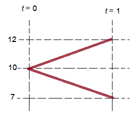
<figcaption>
รูปที่ 9.1 แสดงต้นไม้การเคลื่อนไหวของราคาในตัวอย่างที่ 9.1
</figcaption>
</figure>

□

<strong>ตัวอย่างที่ 9.2</strong> พิจารณาตลาดซึ่งมี 3 สภาวะ คือ ตลาดคึกคัก ตลาดซบเซา และตลาดผันผวน แทนด้วย <math display="inline" xmlns="http://www.w3.org/1998/Math/MathML"><semantics><msub><mi>ω</mi><mn>1</mn></msub><annotation encoding="application/x-tex">\omega_1</annotation></semantics></math>, <math display="inline" xmlns="http://www.w3.org/1998/Math/MathML"><semantics><msub><mi>ω</mi><mn>2</mn></msub><annotation encoding="application/x-tex">\omega_2</annotation></semantics></math> และ <math display="inline" xmlns="http://www.w3.org/1998/Math/MathML"><semantics><msub><mi>ω</mi><mn>3</mn></msub><annotation encoding="application/x-tex">\omega_3</annotation></semantics></math> ตามลำดับ โดยราคาและสภาวะสามารถเขียนตารางแสดงได้ดังนี้

<!-- PDF page 295: independently reviewed -->
<table>
<thead>
<tr>
<th style="text-align: center;">สภาวะ</th>
<th style="text-align: center;"><math display="inline" xmlns="http://www.w3.org/1998/Math/MathML"><semantics><mrow><mi>S</mi><mo stretchy="false" form="prefix">(</mo><mn>0</mn><mo stretchy="false" form="postfix">)</mo></mrow><annotation encoding="application/x-tex">S(0)</annotation></semantics></math></th>
<th style="text-align: center;"><math display="inline" xmlns="http://www.w3.org/1998/Math/MathML"><semantics><mrow><mi>S</mi><mo stretchy="false" form="prefix">(</mo><mn>1</mn><mo stretchy="false" form="postfix">)</mo></mrow><annotation encoding="application/x-tex">S(1)</annotation></semantics></math></th>
<th style="text-align: center;"><math display="inline" xmlns="http://www.w3.org/1998/Math/MathML"><semantics><mrow><mi>S</mi><mo stretchy="false" form="prefix">(</mo><mn>2</mn><mo stretchy="false" form="postfix">)</mo></mrow><annotation encoding="application/x-tex">S(2)</annotation></semantics></math></th>
</tr>
</thead>
<tbody>
<tr>
<td style="text-align: center;"><math display="inline" xmlns="http://www.w3.org/1998/Math/MathML"><semantics><msub><mi>ω</mi><mn>1</mn></msub><annotation encoding="application/x-tex">\omega_1</annotation></semantics></math></td>
<td style="text-align: center;">100</td>
<td style="text-align: center;">110</td>
<td style="text-align: center;">116</td>
</tr>
<tr>
<td style="text-align: center;"><math display="inline" xmlns="http://www.w3.org/1998/Math/MathML"><semantics><msub><mi>ω</mi><mn>2</mn></msub><annotation encoding="application/x-tex">\omega_2</annotation></semantics></math></td>
<td style="text-align: center;">100</td>
<td style="text-align: center;">90</td>
<td style="text-align: center;">80</td>
</tr>
<tr>
<td style="text-align: center;"><math display="inline" xmlns="http://www.w3.org/1998/Math/MathML"><semantics><msub><mi>ω</mi><mn>3</mn></msub><annotation encoding="application/x-tex">\omega_3</annotation></semantics></math></td>
<td style="text-align: center;">100</td>
<td style="text-align: center;">110</td>
<td style="text-align: center;">96</td>
</tr>
</tbody>
</table>

จากสภาวะที่กำหนดให้เขียนเป็นต้นไม้แสดงการเคลื่อนไหวของราคาได้ดังนี้

<figure class="source-figure">
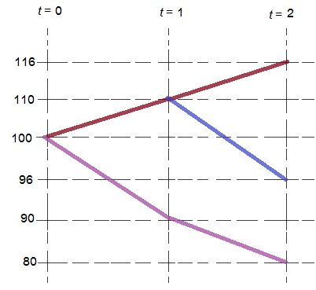
<figcaption>
รูปที่ 9.2 แสดงต้นไม้การเคลื่อนไหวของราคาในตัวอย่างที่ 9.2
</figcaption>
</figure>

□

<h2 id="ผลตอบแทน">9.2 ผลตอบแทน</h2>

เพื่อให้ง่ายต่อการนิยามอัตราผลตอบแทนจากการลงทุนในหุ้น อันดับแรกจะสมมติว่าหุ้นไม่มีการจ่ายเงินปันผล (No Dividend) ดังนั้นผลตอบแทนของการลงทุนจะเกิดจากส่วนต่างของราคาในช่วงเวลาที่ลงทุนเท่านั้น โดยอัตราผลตอบแทนสามารถนิยามได้ ดังนี้

<strong>บทนิยาม 9.1</strong> กำหนดให้ <math display="inline" xmlns="http://www.w3.org/1998/Math/MathML"><semantics><mrow><mi>S</mi><mo stretchy="false" form="prefix">(</mo><mi>t</mi><mo stretchy="false" form="postfix">)</mo></mrow><annotation encoding="application/x-tex">S(t)</annotation></semantics></math> เป็นราคาต่อหุ้นที่ราคา <math display="inline" xmlns="http://www.w3.org/1998/Math/MathML"><semantics><mi>t</mi><annotation encoding="application/x-tex">t</annotation></semantics></math> <em>อัตราผลตอบแทน</em> (Rate of Return) บนช่วงเวลา <math display="inline" xmlns="http://www.w3.org/1998/Math/MathML"><semantics><mrow><mo stretchy="false" form="prefix">[</mo><mi>m</mi><mo>,</mo><mi>n</mi><mo stretchy="false" form="postfix">]</mo></mrow><annotation encoding="application/x-tex">[m,n]</annotation></semantics></math> (หน่วย เป็น คาบเวลา) เขียนแทนด้วยสัญลักษณ์ <math display="inline" xmlns="http://www.w3.org/1998/Math/MathML"><semantics><mrow><mi>K</mi><mo stretchy="false" form="prefix">(</mo><mi>m</mi><mo>,</mo><mi>n</mi><mo stretchy="false" form="postfix">)</mo></mrow><annotation encoding="application/x-tex">K(m,n)</annotation></semantics></math> ซึ่งเป็นตัวแปรเชิงสุ่ม นิยามโดย

<math display="block" xmlns="http://www.w3.org/1998/Math/MathML"><semantics><mrow><mi>K</mi><mo stretchy="false" form="prefix">(</mo><mi>m</mi><mo>,</mo><mi>n</mi><mo stretchy="false" form="postfix">)</mo><mo>=</mo><mfrac><mrow><mi>S</mi><mo stretchy="false" form="prefix">(</mo><mi>n</mi><mo stretchy="false" form="postfix">)</mo><mo>−</mo><mi>S</mi><mo stretchy="false" form="prefix">(</mo><mi>m</mi><mo stretchy="false" form="postfix">)</mo></mrow><mrow><mi>S</mi><mo stretchy="false" form="prefix">(</mo><mi>m</mi><mo stretchy="false" form="postfix">)</mo></mrow></mfrac><mspace width="2.0em"></mspace><mo stretchy="false" form="prefix">(</mo><mn>9.1</mn><mo stretchy="false" form="postfix">)</mo></mrow><annotation encoding="application/x-tex">K(m,n)=\frac{S(n)-S(m)}{S(m)}\qquad(9.1)</annotation></semantics></math>

<!-- PDF page 296: independently reviewed -->

จากรูป (9.1) สามารถเขียนอีกรูปหนึ่งได้เป็น

<math display="block" xmlns="http://www.w3.org/1998/Math/MathML"><semantics><mrow><mi>S</mi><mo stretchy="false" form="prefix">(</mo><mi>n</mi><mo stretchy="false" form="postfix">)</mo><mo>=</mo><mo stretchy="false" form="prefix">(</mo><mn>1</mn><mo>+</mo><mi>K</mi><mo stretchy="false" form="prefix">(</mo><mi>m</mi><mo>,</mo><mi>n</mi><mo stretchy="false" form="postfix">)</mo><mo stretchy="false" form="postfix">)</mo><mi>S</mi><mo stretchy="false" form="prefix">(</mo><mi>m</mi><mo stretchy="false" form="postfix">)</mo><mspace width="2.0em"></mspace><mo stretchy="false" form="prefix">(</mo><mn>9.2</mn><mo stretchy="false" form="postfix">)</mo></mrow><annotation encoding="application/x-tex">S(n)=(1+K(m,n))S(m)\qquad(9.2)</annotation></semantics></math>

และ อัตราผลตอบแทนบน 1 ช่วงเวลา <math display="inline" xmlns="http://www.w3.org/1998/Math/MathML"><semantics><mrow><mo stretchy="false" form="prefix">[</mo><mi>n</mi><mo>−</mo><mn>1</mn><mo>,</mo><mi>n</mi><mo stretchy="false" form="postfix">]</mo></mrow><annotation encoding="application/x-tex">[n-1,n]</annotation></semantics></math> คือ <math display="inline" xmlns="http://www.w3.org/1998/Math/MathML"><semantics><mrow><mi>K</mi><mo stretchy="false" form="prefix">(</mo><mi>n</mi><mo>−</mo><mn>1</mn><mo>,</mo><mi>n</mi><mo stretchy="false" form="postfix">)</mo></mrow><annotation encoding="application/x-tex">K(n-1,n)</annotation></semantics></math> จะเขียนแทนด้วย <math display="inline" xmlns="http://www.w3.org/1998/Math/MathML"><semantics><mrow><mi>K</mi><mo stretchy="false" form="prefix">(</mo><mi>n</mi><mo stretchy="false" form="postfix">)</mo></mrow><annotation encoding="application/x-tex">K(n)</annotation></semantics></math>

ดังนั้น

<math display="block" xmlns="http://www.w3.org/1998/Math/MathML"><semantics><mrow><mi>K</mi><mo stretchy="false" form="prefix">(</mo><mi>n</mi><mo stretchy="false" form="postfix">)</mo><mo>=</mo><mfrac><mrow><mi>S</mi><mo stretchy="false" form="prefix">(</mo><mi>n</mi><mo stretchy="false" form="postfix">)</mo><mo>−</mo><mi>S</mi><mo stretchy="false" form="prefix">(</mo><mi>n</mi><mo>−</mo><mn>1</mn><mo stretchy="false" form="postfix">)</mo></mrow><mrow><mi>S</mi><mo stretchy="false" form="prefix">(</mo><mi>n</mi><mo>−</mo><mn>1</mn><mo stretchy="false" form="postfix">)</mo></mrow></mfrac><mspace width="2.0em"></mspace><mo stretchy="false" form="prefix">(</mo><mn>9.3</mn><mo stretchy="false" form="postfix">)</mo></mrow><annotation encoding="application/x-tex">K(n)=\frac{S(n)-S(n-1)}{S(n-1)}\qquad(9.3)</annotation></semantics></math>

ซึ่งเขียนอีกรูปหนึ่งได้เป็น

<math display="block" xmlns="http://www.w3.org/1998/Math/MathML"><semantics><mrow><mi>S</mi><mo stretchy="false" form="prefix">(</mo><mi>n</mi><mo stretchy="false" form="postfix">)</mo><mo>=</mo><mo stretchy="false" form="prefix">(</mo><mn>1</mn><mo>+</mo><mi>K</mi><mo stretchy="false" form="prefix">(</mo><mi>n</mi><mo stretchy="false" form="postfix">)</mo><mo stretchy="false" form="postfix">)</mo><mi>S</mi><mo stretchy="false" form="prefix">(</mo><mi>n</mi><mo>−</mo><mn>1</mn><mo stretchy="false" form="postfix">)</mo><mspace width="2.0em"></mspace><mo stretchy="false" form="prefix">(</mo><mn>9.4</mn><mo stretchy="false" form="postfix">)</mo></mrow><annotation encoding="application/x-tex">S(n)=(1+K(n))S(n-1)\qquad(9.4)</annotation></semantics></math>

<strong>หมายเหตุ</strong> หากนำเงินปันผลเข้ามาพิจารณาด้วย จะได้อัตราผลตอบแทนเป็น

<math display="block" xmlns="http://www.w3.org/1998/Math/MathML"><semantics><mrow><mi>K</mi><mo stretchy="false" form="prefix">(</mo><mi>n</mi><mo stretchy="false" form="postfix">)</mo><mo>=</mo><mfrac><mrow><mi>S</mi><mo stretchy="false" form="prefix">(</mo><mi>n</mi><mo stretchy="false" form="postfix">)</mo><mo>−</mo><mi>S</mi><mo stretchy="false" form="prefix">(</mo><mi>n</mi><mo>−</mo><mn>1</mn><mo stretchy="false" form="postfix">)</mo><mo>+</mo><mrow><mi mathvariant="normal">div</mi><mo>&#8289;</mo></mrow><mo stretchy="false" form="prefix">(</mo><mi>n</mi><mo stretchy="false" form="postfix">)</mo></mrow><mrow><mi>S</mi><mo stretchy="false" form="prefix">(</mo><mi>n</mi><mo>−</mo><mn>1</mn><mo stretchy="false" form="postfix">)</mo></mrow></mfrac><mspace width="2.0em"></mspace><mo stretchy="false" form="prefix">(</mo><mn>9.5</mn><mo stretchy="false" form="postfix">)</mo></mrow><annotation encoding="application/x-tex">K(n)=\frac{S(n)-S(n-1)+\operatorname{div}(n)}{S(n-1)}\qquad(9.5)</annotation></semantics></math>

เมื่อ <math display="inline" xmlns="http://www.w3.org/1998/Math/MathML"><semantics><mrow><mrow><mi mathvariant="normal">div</mi><mo>&#8289;</mo></mrow><mo stretchy="false" form="prefix">(</mo><mi>n</mi><mo stretchy="false" form="postfix">)</mo></mrow><annotation encoding="application/x-tex">\operatorname{div}(n)</annotation></semantics></math> เป็นเงินปันผลต่อหุ้นที่จ่ายในคาบที่ <math display="inline" xmlns="http://www.w3.org/1998/Math/MathML"><semantics><mi>n</mi><annotation encoding="application/x-tex">n</annotation></semantics></math>

<strong>ตัวอย่างที่ 9.3</strong> พิจารณาตลาดซึ่งมี 2 สภาวะ คือ ตลาดคึกคัก และ ตลาดซบเซา แทนด้วย <math display="inline" xmlns="http://www.w3.org/1998/Math/MathML"><semantics><msub><mi>ω</mi><mn>1</mn></msub><annotation encoding="application/x-tex">\omega_1</annotation></semantics></math> และ <math display="inline" xmlns="http://www.w3.org/1998/Math/MathML"><semantics><msub><mi>ω</mi><mn>2</mn></msub><annotation encoding="application/x-tex">\omega_2</annotation></semantics></math> ตามลำดับ ในตัวอย่างที่ 9.1 สามารถเขียนตารางแสดงอัตราผลตอบแทน <math display="inline" xmlns="http://www.w3.org/1998/Math/MathML"><semantics><mrow><mi>K</mi><mo stretchy="false" form="prefix">(</mo><mn>1</mn><mo stretchy="false" form="postfix">)</mo></mrow><annotation encoding="application/x-tex">K(1)</annotation></semantics></math> ได้ดังนี้

<table>
<thead>
<tr>
<th style="text-align: center;">สภาวะ</th>
<th style="text-align: center;"><math display="inline" xmlns="http://www.w3.org/1998/Math/MathML"><semantics><mrow><mi>K</mi><mo stretchy="false" form="prefix">(</mo><mn>1</mn><mo stretchy="false" form="postfix">)</mo></mrow><annotation encoding="application/x-tex">K(1)</annotation></semantics></math></th>
</tr>
</thead>
<tbody>
<tr>
<td style="text-align: center;"><math display="inline" xmlns="http://www.w3.org/1998/Math/MathML"><semantics><msub><mi>ω</mi><mn>1</mn></msub><annotation encoding="application/x-tex">\omega_1</annotation></semantics></math></td>
<td style="text-align: center;">0.2</td>
</tr>
<tr>
<td style="text-align: center;"><math display="inline" xmlns="http://www.w3.org/1998/Math/MathML"><semantics><msub><mi>ω</mi><mn>2</mn></msub><annotation encoding="application/x-tex">\omega_2</annotation></semantics></math></td>
<td style="text-align: center;">-0.3</td>
</tr>
</tbody>
</table>

□

<strong>ตัวอย่างที่ 9.4</strong> สมมติตลาดแห่งหนึ่งมี 3 สภาวะ คือ ตลาดคึกคัก ตลาดซบเซา และตลาดผันผวน แทนด้วย <math display="inline" xmlns="http://www.w3.org/1998/Math/MathML"><semantics><msub><mi>ω</mi><mn>1</mn></msub><annotation encoding="application/x-tex">\omega_1</annotation></semantics></math>, <math display="inline" xmlns="http://www.w3.org/1998/Math/MathML"><semantics><msub><mi>ω</mi><mn>2</mn></msub><annotation encoding="application/x-tex">\omega_2</annotation></semantics></math> และ <math display="inline" xmlns="http://www.w3.org/1998/Math/MathML"><semantics><msub><mi>ω</mi><mn>3</mn></msub><annotation encoding="application/x-tex">\omega_3</annotation></semantics></math> ตามลำดับ จากตัวอย่างที่ 9.2 จะได้ว่า อัตราผลตอบแทนตามแต่ละสภาวะแสดงในตารางดังต่อไปนี้

<table>
<thead>
<tr>
<th style="text-align: center;">สภาวะ</th>
<th style="text-align: center;"><math display="inline" xmlns="http://www.w3.org/1998/Math/MathML"><semantics><mrow><mi>K</mi><mo stretchy="false" form="prefix">(</mo><mn>1</mn><mo stretchy="false" form="postfix">)</mo></mrow><annotation encoding="application/x-tex">K(1)</annotation></semantics></math></th>
<th style="text-align: center;"><math display="inline" xmlns="http://www.w3.org/1998/Math/MathML"><semantics><mrow><mi>K</mi><mo stretchy="false" form="prefix">(</mo><mn>2</mn><mo stretchy="false" form="postfix">)</mo></mrow><annotation encoding="application/x-tex">K(2)</annotation></semantics></math></th>
<th style="text-align: center;"><math display="inline" xmlns="http://www.w3.org/1998/Math/MathML"><semantics><mrow><mi>K</mi><mo stretchy="false" form="prefix">(</mo><mn>0</mn><mo>,</mo><mn>2</mn><mo stretchy="false" form="postfix">)</mo></mrow><annotation encoding="application/x-tex">K(0,2)</annotation></semantics></math></th>
<th style="text-align: center;"><math display="inline" xmlns="http://www.w3.org/1998/Math/MathML"><semantics><mrow><mi>K</mi><mo stretchy="false" form="prefix">(</mo><mn>0</mn><mo>,</mo><mn>1</mn><mo stretchy="false" form="postfix">)</mo><mo>+</mo><mi>K</mi><mo stretchy="false" form="prefix">(</mo><mn>1</mn><mo>,</mo><mn>2</mn><mo stretchy="false" form="postfix">)</mo></mrow><annotation encoding="application/x-tex">K(0,1)+K(1,2)</annotation></semantics></math></th>
</tr>
</thead>
<tbody>
<tr>
<td style="text-align: center;"><math display="inline" xmlns="http://www.w3.org/1998/Math/MathML"><semantics><msub><mi>ω</mi><mn>1</mn></msub><annotation encoding="application/x-tex">\omega_1</annotation></semantics></math></td>
<td style="text-align: center;">0.1</td>
<td style="text-align: center;">0.0545</td>
<td style="text-align: center;">0.16</td>
<td style="text-align: center;">0.1545</td>
</tr>
<tr>
<td style="text-align: center;"><math display="inline" xmlns="http://www.w3.org/1998/Math/MathML"><semantics><msub><mi>ω</mi><mn>2</mn></msub><annotation encoding="application/x-tex">\omega_2</annotation></semantics></math></td>
<td style="text-align: center;">-0.1</td>
<td style="text-align: center;">-0.1111</td>
<td style="text-align: center;">-0.2</td>
<td style="text-align: center;">-0.2111</td>
</tr>
<tr>
<td style="text-align: center;"><math display="inline" xmlns="http://www.w3.org/1998/Math/MathML"><semantics><msub><mi>ω</mi><mn>3</mn></msub><annotation encoding="application/x-tex">\omega_3</annotation></semantics></math></td>
<td style="text-align: center;">0.1</td>
<td style="text-align: center;">-0.0127</td>
<td style="text-align: center;">-0.04</td>
<td style="text-align: center;">-0.0973</td>
</tr>
</tbody>
</table>

□

<!-- PDF page 297: independently reviewed -->

จากตัวอย่างที่ 9.4 จะเห็นว่า <math display="inline" xmlns="http://www.w3.org/1998/Math/MathML"><semantics><mrow><mi>K</mi><mo stretchy="false" form="prefix">(</mo><mn>0</mn><mo>,</mo><mn>1</mn><mo stretchy="false" form="postfix">)</mo><mo>+</mo><mi>K</mi><mo stretchy="false" form="prefix">(</mo><mn>1</mn><mo>,</mo><mn>2</mn><mo stretchy="false" form="postfix">)</mo><mo>≠</mo><mi>K</mi><mo stretchy="false" form="prefix">(</mo><mn>0</mn><mo>,</mo><mn>2</mn><mo stretchy="false" form="postfix">)</mo></mrow><annotation encoding="application/x-tex">K(0,1)+K(1,2)\ne K(0,2)</annotation></semantics></math> ดังนั้น อัตราผลตอบแทน <math display="inline" xmlns="http://www.w3.org/1998/Math/MathML"><semantics><mrow><mi>K</mi><mo stretchy="false" form="prefix">(</mo><mi>m</mi><mo>,</mo><mi>n</mi><mo stretchy="false" form="postfix">)</mo></mrow><annotation encoding="application/x-tex">K(m,n)</annotation></semantics></math> ไม่มีสมบัติการบวก (Non-additivity) อย่างไรก็ตาม ความสัมพันธ์ระหว่าง <math display="inline" xmlns="http://www.w3.org/1998/Math/MathML"><semantics><mrow><mi>K</mi><mo stretchy="false" form="prefix">(</mo><mi>m</mi><mo>,</mo><mi>n</mi><mo stretchy="false" form="postfix">)</mo></mrow><annotation encoding="application/x-tex">K(m,n)</annotation></semantics></math> กับ <math display="inline" xmlns="http://www.w3.org/1998/Math/MathML"><semantics><mrow><mi>K</mi><mo stretchy="false" form="prefix">(</mo><mi>n</mi><mo stretchy="false" form="postfix">)</mo></mrow><annotation encoding="application/x-tex">K(n)</annotation></semantics></math> ก็ยังเป็นสิ่งที่น่าสนใจ

<strong>ตัวอย่างที่ 9.5</strong> สมมติตลาดแห่งหนึ่งมี 3 สภาวะ คือ ตลาดคึกคัก ตลาดซบเซา และตลาดผันผวน แทนด้วย <math display="inline" xmlns="http://www.w3.org/1998/Math/MathML"><semantics><msub><mi>ω</mi><mn>1</mn></msub><annotation encoding="application/x-tex">\omega_1</annotation></semantics></math>, <math display="inline" xmlns="http://www.w3.org/1998/Math/MathML"><semantics><msub><mi>ω</mi><mn>2</mn></msub><annotation encoding="application/x-tex">\omega_2</annotation></semantics></math> และ <math display="inline" xmlns="http://www.w3.org/1998/Math/MathML"><semantics><msub><mi>ω</mi><mn>3</mn></msub><annotation encoding="application/x-tex">\omega_3</annotation></semantics></math> ตามลำดับ จากตัวอย่างที่ 9.2 ถ้ากำหนดปันผล 1 บาทต่อหุ้น จะได้ว่า อัตราผลตอบแทนตามแต่ละสภาวะแสดงในตารางดังต่อไปนี้

<table>
<thead>
<tr>
<th style="text-align: center;">สภาวะ</th>
<th style="text-align: center;"><math display="inline" xmlns="http://www.w3.org/1998/Math/MathML"><semantics><mrow><mi>K</mi><mo stretchy="false" form="prefix">(</mo><mn>1</mn><mo stretchy="false" form="postfix">)</mo></mrow><annotation encoding="application/x-tex">K(1)</annotation></semantics></math></th>
<th style="text-align: center;"><math display="inline" xmlns="http://www.w3.org/1998/Math/MathML"><semantics><mrow><mi>K</mi><mo stretchy="false" form="prefix">(</mo><mn>2</mn><mo stretchy="false" form="postfix">)</mo></mrow><annotation encoding="application/x-tex">K(2)</annotation></semantics></math></th>
<th style="text-align: center;"><math display="inline" xmlns="http://www.w3.org/1998/Math/MathML"><semantics><mrow><mi>K</mi><mo stretchy="false" form="prefix">(</mo><mn>0</mn><mo>,</mo><mn>2</mn><mo stretchy="false" form="postfix">)</mo></mrow><annotation encoding="application/x-tex">K(0,2)</annotation></semantics></math></th>
</tr>
</thead>
<tbody>
<tr>
<td style="text-align: center;"><math display="inline" xmlns="http://www.w3.org/1998/Math/MathML"><semantics><msub><mi>ω</mi><mn>1</mn></msub><annotation encoding="application/x-tex">\omega_1</annotation></semantics></math></td>
<td style="text-align: center;">0.11</td>
<td style="text-align: center;">0.0636</td>
<td style="text-align: center;">0.18</td>
</tr>
<tr>
<td style="text-align: center;"><math display="inline" xmlns="http://www.w3.org/1998/Math/MathML"><semantics><msub><mi>ω</mi><mn>2</mn></msub><annotation encoding="application/x-tex">\omega_2</annotation></semantics></math></td>
<td style="text-align: center;">-0.09</td>
<td style="text-align: center;">-0.1</td>
<td style="text-align: center;">-0.18</td>
</tr>
<tr>
<td style="text-align: center;"><math display="inline" xmlns="http://www.w3.org/1998/Math/MathML"><semantics><msub><mi>ω</mi><mn>3</mn></msub><annotation encoding="application/x-tex">\omega_3</annotation></semantics></math></td>
<td style="text-align: center;">0.11</td>
<td style="text-align: center;">-0.0273</td>
<td style="text-align: center;">-0.02</td>
</tr>
</tbody>
</table>

□

<strong>ทฤษฎีบท 9.2</strong> ความสัมพันธ์ระหว่างอัตราผลตอบแทน <math display="inline" xmlns="http://www.w3.org/1998/Math/MathML"><semantics><mrow><mi>K</mi><mo stretchy="false" form="prefix">(</mo><mi>m</mi><mo>,</mo><mi>n</mi><mo stretchy="false" form="postfix">)</mo></mrow><annotation encoding="application/x-tex">K(m,n)</annotation></semantics></math> กับ <math display="inline" xmlns="http://www.w3.org/1998/Math/MathML"><semantics><mrow><mi>K</mi><mo stretchy="false" form="prefix">(</mo><mi>n</mi><mo stretchy="false" form="postfix">)</mo></mrow><annotation encoding="application/x-tex">K(n)</annotation></semantics></math> อยู่ในรูป

<math display="block" xmlns="http://www.w3.org/1998/Math/MathML"><semantics><mrow><mn>1</mn><mo>+</mo><mi>K</mi><mo stretchy="false" form="prefix">(</mo><mi>m</mi><mo>,</mo><mi>n</mi><mo stretchy="false" form="postfix">)</mo><mo>=</mo><mo stretchy="false" form="prefix">[</mo><mn>1</mn><mo>+</mo><mi>K</mi><mo stretchy="false" form="prefix">(</mo><mi>m</mi><mo>+</mo><mn>1</mn><mo stretchy="false" form="postfix">)</mo><mo stretchy="false" form="postfix">]</mo><mo stretchy="false" form="prefix">[</mo><mn>1</mn><mo>+</mo><mi>K</mi><mo stretchy="false" form="prefix">(</mo><mi>m</mi><mo>+</mo><mn>2</mn><mo stretchy="false" form="postfix">)</mo><mo stretchy="false" form="postfix">]</mo><mi>⋯</mi><mo stretchy="false" form="prefix">[</mo><mn>1</mn><mo>+</mo><mi>K</mi><mo stretchy="false" form="prefix">(</mo><mi>n</mi><mo stretchy="false" form="postfix">)</mo><mo stretchy="false" form="postfix">]</mo><mspace width="2.0em"></mspace><mo stretchy="false" form="prefix">(</mo><mn>9.6</mn><mo stretchy="false" form="postfix">)</mo></mrow><annotation encoding="application/x-tex">1+K(m,n)=[1+K(m+1)][1+K(m+2)]\cdots[1+K(n)]\qquad(9.6)</annotation></semantics></math>

<strong>พิสูจน์</strong> พิจารณาแผนภาพกระแสเงิน

<figure class="source-figure">
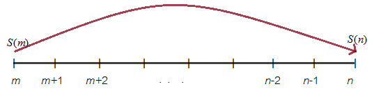
</figure>

จากแผนภาพจะเห็นว่า <math display="inline" xmlns="http://www.w3.org/1998/Math/MathML"><semantics><mrow><mi>S</mi><mo stretchy="false" form="prefix">(</mo><mi>n</mi><mo stretchy="false" form="postfix">)</mo></mrow><annotation encoding="application/x-tex">S(n)</annotation></semantics></math> เป็นเงินสะสมของการลงทุน ที่เวลา <math display="inline" xmlns="http://www.w3.org/1998/Math/MathML"><semantics><mi>m</mi><annotation encoding="application/x-tex">m</annotation></semantics></math> ด้วยเงินลงทุน <math display="inline" xmlns="http://www.w3.org/1998/Math/MathML"><semantics><mrow><mi>S</mi><mo stretchy="false" form="prefix">(</mo><mi>m</mi><mo stretchy="false" form="postfix">)</mo></mrow><annotation encoding="application/x-tex">S(m)</annotation></semantics></math> ด้วยฟังก์ชันเงินสะสะสม <math display="inline" xmlns="http://www.w3.org/1998/Math/MathML"><semantics><mrow><mo stretchy="false" form="prefix">[</mo><mn>1</mn><mo>+</mo><mi>K</mi><mo stretchy="false" form="prefix">(</mo><mi>m</mi><mo>+</mo><mn>1</mn><mo stretchy="false" form="postfix">)</mo><mo stretchy="false" form="postfix">]</mo><mo stretchy="false" form="prefix">[</mo><mn>1</mn><mo>+</mo><mi>K</mi><mo stretchy="false" form="prefix">(</mo><mi>m</mi><mo>+</mo><mn>2</mn><mo stretchy="false" form="postfix">)</mo><mo stretchy="false" form="postfix">]</mo><mi>⋯</mi><mo stretchy="false" form="prefix">[</mo><mn>1</mn><mo>+</mo><mi>K</mi><mo stretchy="false" form="prefix">(</mo><mi>n</mi><mo stretchy="false" form="postfix">)</mo><mo stretchy="false" form="postfix">]</mo></mrow><annotation encoding="application/x-tex">[1+K(m+1)][1+K(m+2)]\cdots[1+K(n)]</annotation></semantics></math> นั่นคือ

<math display="block" xmlns="http://www.w3.org/1998/Math/MathML"><semantics><mrow><mi>S</mi><mo stretchy="false" form="prefix">(</mo><mi>n</mi><mo stretchy="false" form="postfix">)</mo><mo>=</mo><mo stretchy="false" form="prefix">[</mo><mn>1</mn><mo>+</mo><mi>K</mi><mo stretchy="false" form="prefix">(</mo><mi>m</mi><mo>+</mo><mn>1</mn><mo stretchy="false" form="postfix">)</mo><mo stretchy="false" form="postfix">]</mo><mo stretchy="false" form="prefix">[</mo><mn>1</mn><mo>+</mo><mi>K</mi><mo stretchy="false" form="prefix">(</mo><mi>m</mi><mo>+</mo><mn>2</mn><mo stretchy="false" form="postfix">)</mo><mo stretchy="false" form="postfix">]</mo><mi>⋯</mi><mo stretchy="false" form="prefix">[</mo><mn>1</mn><mo>+</mo><mi>K</mi><mo stretchy="false" form="prefix">(</mo><mi>n</mi><mo stretchy="false" form="postfix">)</mo><mo stretchy="false" form="postfix">]</mo><mi>S</mi><mo stretchy="false" form="prefix">(</mo><mi>m</mi><mo stretchy="false" form="postfix">)</mo></mrow><annotation encoding="application/x-tex">S(n)=[1+K(m+1)][1+K(m+2)]\cdots[1+K(n)]S(m)</annotation></semantics></math>

และจากบทนิยามของ <math display="inline" xmlns="http://www.w3.org/1998/Math/MathML"><semantics><mrow><mi>K</mi><mo stretchy="false" form="prefix">(</mo><mi>m</mi><mo>,</mo><mi>n</mi><mo stretchy="false" form="postfix">)</mo></mrow><annotation encoding="application/x-tex">K(m,n)</annotation></semantics></math> ตามสูตร (9.2),

<math display="block" xmlns="http://www.w3.org/1998/Math/MathML"><semantics><mrow><mi>S</mi><mo stretchy="false" form="prefix">(</mo><mi>n</mi><mo stretchy="false" form="postfix">)</mo><mo>=</mo><mo stretchy="false" form="prefix">[</mo><mn>1</mn><mo>+</mo><mi>K</mi><mo stretchy="false" form="prefix">(</mo><mi>m</mi><mo>,</mo><mi>n</mi><mo stretchy="false" form="postfix">)</mo><mo stretchy="false" form="postfix">]</mo><mi>S</mi><mo stretchy="false" form="prefix">(</mo><mi>m</mi><mo stretchy="false" form="postfix">)</mo></mrow><annotation encoding="application/x-tex">S(n)=[1+K(m,n)]S(m)</annotation></semantics></math>

ดังนั้นจึงได้ว่า <math display="inline" xmlns="http://www.w3.org/1998/Math/MathML"><semantics><mrow><mn>1</mn><mo>+</mo><mi>K</mi><mo stretchy="false" form="prefix">(</mo><mi>m</mi><mo>,</mo><mi>n</mi><mo stretchy="false" form="postfix">)</mo><mo>=</mo><mo stretchy="false" form="prefix">[</mo><mn>1</mn><mo>+</mo><mi>K</mi><mo stretchy="false" form="prefix">(</mo><mi>m</mi><mo>+</mo><mn>1</mn><mo stretchy="false" form="postfix">)</mo><mo stretchy="false" form="postfix">]</mo><mo stretchy="false" form="prefix">[</mo><mn>1</mn><mo>+</mo><mi>K</mi><mo stretchy="false" form="prefix">(</mo><mi>m</mi><mo>+</mo><mn>2</mn><mo stretchy="false" form="postfix">)</mo><mo stretchy="false" form="postfix">]</mo><mi>⋯</mi><mo stretchy="false" form="prefix">[</mo><mn>1</mn><mo>+</mo><mi>K</mi><mo stretchy="false" form="prefix">(</mo><mi>n</mi><mo stretchy="false" form="postfix">)</mo><mo stretchy="false" form="postfix">]</mo></mrow><annotation encoding="application/x-tex">1+K(m,n)=[1+K(m+1)][1+K(m+2)]\cdots[1+K(n)]</annotation></semantics></math> □

<!-- PDF page 298: independently reviewed -->

เนื่องจากอัตราผลตอบแทน <math display="inline" xmlns="http://www.w3.org/1998/Math/MathML"><semantics><mrow><mi>K</mi><mo stretchy="false" form="prefix">(</mo><mi>m</mi><mo>,</mo><mi>n</mi><mo stretchy="false" form="postfix">)</mo></mrow><annotation encoding="application/x-tex">K(m,n)</annotation></semantics></math> ไม่มี<em>สมบัติการบวก</em> ทำให้ยากต่อการนำไปใช้งาน จึงเป็นสาเหตุที่จำเป็นต้องนิยามของอัตราผลตอบแทนใหม่เพื่อให้มีสมบัติการบวก อัตราผลตอบแทนที่นิยามใหม่นี้เรียกว่า <em>อัตราผลตอบแทนลอการิทึม</em> หรือเรียกอีกชื่อหนึ่งคือ <em>อัตราผลตอบแทนทบต้นต่อเนื่อง</em> โดยนิยามดังต่อไปนี้

<strong>บทนิยาม 9.3</strong> กำหนดให้ <math display="inline" xmlns="http://www.w3.org/1998/Math/MathML"><semantics><mrow><mi>S</mi><mo stretchy="false" form="prefix">(</mo><mi>t</mi><mo stretchy="false" form="postfix">)</mo></mrow><annotation encoding="application/x-tex">S(t)</annotation></semantics></math> เป็นราคาต่อหุ้นที่เวลา <math display="inline" xmlns="http://www.w3.org/1998/Math/MathML"><semantics><mi>t</mi><annotation encoding="application/x-tex">t</annotation></semantics></math> <em>อัตราผลตอบแทนลอการิทึม</em> (Logarithmic Return) บนช่วงเวลา <math display="inline" xmlns="http://www.w3.org/1998/Math/MathML"><semantics><mrow><mo stretchy="false" form="prefix">[</mo><mi>m</mi><mo>,</mo><mi>n</mi><mo stretchy="false" form="postfix">]</mo></mrow><annotation encoding="application/x-tex">[m,n]</annotation></semantics></math> เขียนแทนด้วยสัญลักษณ์ <math display="inline" xmlns="http://www.w3.org/1998/Math/MathML"><semantics><mrow><mi>k</mi><mo stretchy="false" form="prefix">(</mo><mi>m</mi><mo>,</mo><mi>n</mi><mo stretchy="false" form="postfix">)</mo></mrow><annotation encoding="application/x-tex">k(m,n)</annotation></semantics></math> ซึ่งเป็นตัวแปรเชิงสุ่ม นิยามโดย

<math display="block" xmlns="http://www.w3.org/1998/Math/MathML"><semantics><mrow><mi>k</mi><mo stretchy="false" form="prefix">(</mo><mi>m</mi><mo>,</mo><mi>n</mi><mo stretchy="false" form="postfix">)</mo><mo>=</mo><mrow><mi mathvariant="normal">ln</mi><mo>&#8289;</mo></mrow><mfrac><mrow><mi>S</mi><mo stretchy="false" form="prefix">(</mo><mi>n</mi><mo stretchy="false" form="postfix">)</mo></mrow><mrow><mi>S</mi><mo stretchy="false" form="prefix">(</mo><mi>m</mi><mo stretchy="false" form="postfix">)</mo></mrow></mfrac><mspace width="2.0em"></mspace><mo stretchy="false" form="prefix">(</mo><mn>9.7</mn><mo stretchy="false" form="postfix">)</mo></mrow><annotation encoding="application/x-tex">k(m,n)=\ln\frac{S(n)}{S(m)}\qquad(9.7)</annotation></semantics></math>

เขียนอีกรูปหนึ่งได้เป็น

<math display="block" xmlns="http://www.w3.org/1998/Math/MathML"><semantics><mrow><mi>S</mi><mo stretchy="false" form="prefix">(</mo><mi>n</mi><mo stretchy="false" form="postfix">)</mo><mo>=</mo><msup><mi>e</mi><mrow><mi>k</mi><mo stretchy="false" form="prefix">(</mo><mi>m</mi><mo>,</mo><mi>n</mi><mo stretchy="false" form="postfix">)</mo></mrow></msup><mi>S</mi><mo stretchy="false" form="prefix">(</mo><mi>m</mi><mo stretchy="false" form="postfix">)</mo><mspace width="2.0em"></mspace><mo stretchy="false" form="prefix">(</mo><mn>9.8</mn><mo stretchy="false" form="postfix">)</mo></mrow><annotation encoding="application/x-tex">S(n)=e^{k(m,n)}S(m)\qquad(9.8)</annotation></semantics></math>

และอัตราผลตอบแทนลอการิทึมบน 1 ช่วงเวลา <math display="inline" xmlns="http://www.w3.org/1998/Math/MathML"><semantics><mrow><mo stretchy="false" form="prefix">[</mo><mi>n</mi><mo>−</mo><mn>1</mn><mo>,</mo><mi>n</mi><mo stretchy="false" form="postfix">]</mo></mrow><annotation encoding="application/x-tex">[n-1,n]</annotation></semantics></math> คือ <math display="inline" xmlns="http://www.w3.org/1998/Math/MathML"><semantics><mrow><mi>k</mi><mo stretchy="false" form="prefix">(</mo><mi>n</mi><mo>−</mo><mn>1</mn><mo>,</mo><mi>n</mi><mo stretchy="false" form="postfix">)</mo></mrow><annotation encoding="application/x-tex">k(n-1,n)</annotation></semantics></math> เขียนโดยย่อด้วย <math display="inline" xmlns="http://www.w3.org/1998/Math/MathML"><semantics><mrow><mi>k</mi><mo stretchy="false" form="prefix">(</mo><mi>n</mi><mo stretchy="false" form="postfix">)</mo></mrow><annotation encoding="application/x-tex">k(n)</annotation></semantics></math>

ดังนั้น

<math display="block" xmlns="http://www.w3.org/1998/Math/MathML"><semantics><mrow><mi>k</mi><mo stretchy="false" form="prefix">(</mo><mi>n</mi><mo stretchy="false" form="postfix">)</mo><mo>=</mo><mrow><mi mathvariant="normal">ln</mi><mo>&#8289;</mo></mrow><mfrac><mrow><mi>S</mi><mo stretchy="false" form="prefix">(</mo><mi>n</mi><mo stretchy="false" form="postfix">)</mo></mrow><mrow><mi>S</mi><mo stretchy="false" form="prefix">(</mo><mi>n</mi><mo>−</mo><mn>1</mn><mo stretchy="false" form="postfix">)</mo></mrow></mfrac><mspace width="2.0em"></mspace><mo stretchy="false" form="prefix">(</mo><mn>9.9</mn><mo stretchy="false" form="postfix">)</mo></mrow><annotation encoding="application/x-tex">k(n)=\ln\frac{S(n)}{S(n-1)}\qquad(9.9)</annotation></semantics></math>

<strong>หมายเหตุ</strong> 1) หากนำเงินปันผลเข้ามาพิจารณาด้วย จะได้อัตราผลตอบแทนลอการิทึมเป็น

<math display="block" xmlns="http://www.w3.org/1998/Math/MathML"><semantics><mrow><mi>k</mi><mo stretchy="false" form="prefix">(</mo><mi>n</mi><mo stretchy="false" form="postfix">)</mo><mo>=</mo><mrow><mi mathvariant="normal">ln</mi><mo>&#8289;</mo></mrow><mfrac><mrow><mi>S</mi><mo stretchy="false" form="prefix">(</mo><mi>n</mi><mo stretchy="false" form="postfix">)</mo><mo>+</mo><mrow><mi mathvariant="normal">div</mi><mo>&#8289;</mo></mrow><mo stretchy="false" form="prefix">(</mo><mi>n</mi><mo stretchy="false" form="postfix">)</mo></mrow><mrow><mi>S</mi><mo stretchy="false" form="prefix">(</mo><mi>n</mi><mo>−</mo><mn>1</mn><mo stretchy="false" form="postfix">)</mo></mrow></mfrac><mspace width="2.0em"></mspace><mo stretchy="false" form="prefix">(</mo><mn>9.10</mn><mo stretchy="false" form="postfix">)</mo></mrow><annotation encoding="application/x-tex">k(n)=\ln\frac{S(n)+\operatorname{div}(n)}{S(n-1)}\qquad(9.10)</annotation></semantics></math>

เมื่อ <math display="inline" xmlns="http://www.w3.org/1998/Math/MathML"><semantics><mrow><mrow><mi mathvariant="normal">div</mi><mo>&#8289;</mo></mrow><mo stretchy="false" form="prefix">(</mo><mi>n</mi><mo stretchy="false" form="postfix">)</mo></mrow><annotation encoding="application/x-tex">\operatorname{div}(n)</annotation></semantics></math> เป็นเงินปันผลต่อหุ้นที่จ่ายในคาบที่ <math display="inline" xmlns="http://www.w3.org/1998/Math/MathML"><semantics><mi>n</mi><annotation encoding="application/x-tex">n</annotation></semantics></math>

<ol start="2" type="1">
<li>จากสูตรรูป (9.2) กับสูตรรูป (9.9) โดยการเปรียบเทียบจะได้ความสัมพันธ์ระหว่างอัตราผลตอบแทนกับอัตราผลตอบแทนลอการิทึม คือ</li>
</ol>

<math display="block" xmlns="http://www.w3.org/1998/Math/MathML"><semantics><mrow><mn>1</mn><mo>+</mo><mi>K</mi><mo stretchy="false" form="prefix">(</mo><mi>m</mi><mo>,</mo><mi>n</mi><mo stretchy="false" form="postfix">)</mo><mo>=</mo><msup><mi>e</mi><mrow><mi>k</mi><mo stretchy="false" form="prefix">(</mo><mi>m</mi><mo>,</mo><mi>n</mi><mo stretchy="false" form="postfix">)</mo></mrow></msup><mspace width="2.0em"></mspace><mo stretchy="false" form="prefix">(</mo><mn>9.11</mn><mo stretchy="false" form="postfix">)</mo></mrow><annotation encoding="application/x-tex">1+K(m,n)=e^{k(m,n)}\qquad(9.11)</annotation></semantics></math>

<strong>ตัวอย่างที่ 9.6</strong> พิจารณาตลาดซึ่งมี 3 สภาวะ คือ ตลาดคึกคัก ตลาดซบเซา และตลาดผันผวน แทนด้วย <math display="inline" xmlns="http://www.w3.org/1998/Math/MathML"><semantics><msub><mi>ω</mi><mn>1</mn></msub><annotation encoding="application/x-tex">\omega_1</annotation></semantics></math>, <math display="inline" xmlns="http://www.w3.org/1998/Math/MathML"><semantics><msub><mi>ω</mi><mn>2</mn></msub><annotation encoding="application/x-tex">\omega_2</annotation></semantics></math> และ <math display="inline" xmlns="http://www.w3.org/1998/Math/MathML"><semantics><msub><mi>ω</mi><mn>3</mn></msub><annotation encoding="application/x-tex">\omega_3</annotation></semantics></math> ตามลำดับ โดยราคาและสภาวะสามารถเขียนแสดงในตารางได้ดังนี้

<!-- PDF page 299: independently reviewed -->
<table>
<thead>
<tr>
<th style="text-align: center;">สภาวะ</th>
<th style="text-align: center;"><math display="inline" xmlns="http://www.w3.org/1998/Math/MathML"><semantics><mrow><mi>S</mi><mo stretchy="false" form="prefix">(</mo><mn>0</mn><mo stretchy="false" form="postfix">)</mo></mrow><annotation encoding="application/x-tex">S(0)</annotation></semantics></math></th>
<th style="text-align: center;"><math display="inline" xmlns="http://www.w3.org/1998/Math/MathML"><semantics><mrow><mi>S</mi><mo stretchy="false" form="prefix">(</mo><mn>1</mn><mo stretchy="false" form="postfix">)</mo></mrow><annotation encoding="application/x-tex">S(1)</annotation></semantics></math></th>
<th style="text-align: center;"><math display="inline" xmlns="http://www.w3.org/1998/Math/MathML"><semantics><mrow><mi>S</mi><mo stretchy="false" form="prefix">(</mo><mn>2</mn><mo stretchy="false" form="postfix">)</mo></mrow><annotation encoding="application/x-tex">S(2)</annotation></semantics></math></th>
<th style="text-align: center;"><math display="inline" xmlns="http://www.w3.org/1998/Math/MathML"><semantics><mrow><mi>S</mi><mo stretchy="false" form="prefix">(</mo><mn>3</mn><mo stretchy="false" form="postfix">)</mo></mrow><annotation encoding="application/x-tex">S(3)</annotation></semantics></math></th>
</tr>
</thead>
<tbody>
<tr>
<td style="text-align: center;"><math display="inline" xmlns="http://www.w3.org/1998/Math/MathML"><semantics><msub><mi>ω</mi><mn>1</mn></msub><annotation encoding="application/x-tex">\omega_1</annotation></semantics></math></td>
<td style="text-align: center;">10</td>
<td style="text-align: center;">11</td>
<td style="text-align: center;">11.6</td>
<td style="text-align: center;">12</td>
</tr>
<tr>
<td style="text-align: center;"><math display="inline" xmlns="http://www.w3.org/1998/Math/MathML"><semantics><msub><mi>ω</mi><mn>2</mn></msub><annotation encoding="application/x-tex">\omega_2</annotation></semantics></math></td>
<td style="text-align: center;">10</td>
<td style="text-align: center;">9</td>
<td style="text-align: center;">8</td>
<td style="text-align: center;">7</td>
</tr>
<tr>
<td style="text-align: center;"><math display="inline" xmlns="http://www.w3.org/1998/Math/MathML"><semantics><msub><mi>ω</mi><mn>3</mn></msub><annotation encoding="application/x-tex">\omega_3</annotation></semantics></math></td>
<td style="text-align: center;">10</td>
<td style="text-align: center;">11</td>
<td style="text-align: center;">9.6</td>
<td style="text-align: center;">10</td>
</tr>
</tbody>
</table>

และตารางแสดง อัตราผลตอบแทนลอการิทึมและสภาวะเป็นดังนี้

<table>
<thead>
<tr>
<th style="text-align: center;">สภาวะ</th>
<th style="text-align: center;"><math display="inline" xmlns="http://www.w3.org/1998/Math/MathML"><semantics><mrow><mi>k</mi><mo stretchy="false" form="prefix">(</mo><mn>1</mn><mo stretchy="false" form="postfix">)</mo></mrow><annotation encoding="application/x-tex">k(1)</annotation></semantics></math></th>
<th style="text-align: center;"><math display="inline" xmlns="http://www.w3.org/1998/Math/MathML"><semantics><mrow><mi>k</mi><mo stretchy="false" form="prefix">(</mo><mn>2</mn><mo stretchy="false" form="postfix">)</mo></mrow><annotation encoding="application/x-tex">k(2)</annotation></semantics></math></th>
<th style="text-align: center;"><math display="inline" xmlns="http://www.w3.org/1998/Math/MathML"><semantics><mrow><mi>k</mi><mo stretchy="false" form="prefix">(</mo><mn>3</mn><mo stretchy="false" form="postfix">)</mo></mrow><annotation encoding="application/x-tex">k(3)</annotation></semantics></math></th>
<th style="text-align: center;"><math display="inline" xmlns="http://www.w3.org/1998/Math/MathML"><semantics><mrow><mi>k</mi><mo stretchy="false" form="prefix">(</mo><mn>1</mn><mo stretchy="false" form="postfix">)</mo><mo>+</mo><mi>k</mi><mo stretchy="false" form="prefix">(</mo><mn>2</mn><mo stretchy="false" form="postfix">)</mo><mo>+</mo><mi>k</mi><mo stretchy="false" form="prefix">(</mo><mn>3</mn><mo stretchy="false" form="postfix">)</mo></mrow><annotation encoding="application/x-tex">k(1)+k(2)+k(3)</annotation></semantics></math></th>
<th style="text-align: center;"><math display="inline" xmlns="http://www.w3.org/1998/Math/MathML"><semantics><mrow><mi>k</mi><mo stretchy="false" form="prefix">(</mo><mn>0</mn><mo>,</mo><mn>3</mn><mo stretchy="false" form="postfix">)</mo></mrow><annotation encoding="application/x-tex">k(0,3)</annotation></semantics></math></th>
</tr>
</thead>
<tbody>
<tr>
<td style="text-align: center;"><math display="inline" xmlns="http://www.w3.org/1998/Math/MathML"><semantics><msub><mi>ω</mi><mn>1</mn></msub><annotation encoding="application/x-tex">\omega_1</annotation></semantics></math></td>
<td style="text-align: center;">0.0953</td>
<td style="text-align: center;">0.0531</td>
<td style="text-align: center;">0.0339</td>
<td style="text-align: center;">0.1823</td>
<td style="text-align: center;">0.1823</td>
</tr>
<tr>
<td style="text-align: center;"><math display="inline" xmlns="http://www.w3.org/1998/Math/MathML"><semantics><msub><mi>ω</mi><mn>2</mn></msub><annotation encoding="application/x-tex">\omega_2</annotation></semantics></math></td>
<td style="text-align: center;">-0.1054</td>
<td style="text-align: center;">-0.1178</td>
<td style="text-align: center;">-0.1335</td>
<td style="text-align: center;">-0.3567</td>
<td style="text-align: center;">-0.3567</td>
</tr>
<tr>
<td style="text-align: center;"><math display="inline" xmlns="http://www.w3.org/1998/Math/MathML"><semantics><msub><mi>ω</mi><mn>3</mn></msub><annotation encoding="application/x-tex">\omega_3</annotation></semantics></math></td>
<td style="text-align: center;">0.0953</td>
<td style="text-align: center;">-0.1361</td>
<td style="text-align: center;">0.0408</td>
<td style="text-align: center;">0</td>
<td style="text-align: center;">0</td>
</tr>
</tbody>
</table>

□

จากตัวอย่างที่ 9.6 จะเห็นได้ว่า <math display="inline" xmlns="http://www.w3.org/1998/Math/MathML"><semantics><mrow><mi>k</mi><mo stretchy="false" form="prefix">(</mo><mn>0</mn><mo>,</mo><mn>3</mn><mo stretchy="false" form="postfix">)</mo><mo>=</mo><mi>k</mi><mo stretchy="false" form="prefix">(</mo><mn>1</mn><mo stretchy="false" form="postfix">)</mo><mo>+</mo><mi>k</mi><mo stretchy="false" form="prefix">(</mo><mn>2</mn><mo stretchy="false" form="postfix">)</mo><mo>+</mo><mi>k</mi><mo stretchy="false" form="prefix">(</mo><mn>3</mn><mo stretchy="false" form="postfix">)</mo></mrow><annotation encoding="application/x-tex">k(0,3)=k(1)+k(2)+k(3)</annotation></semantics></math> ซึ่งเป็นผลที่ได้จากสมบัติการบวกที่จะกล่าวต่อไปนี้

<strong>ทฤษฎีบท 9.4</strong> ถ้าไม่มีการจ่ายเงินปันผล แล้ว อัตราผลตอบแทนลอการิทึม <math display="inline" xmlns="http://www.w3.org/1998/Math/MathML"><semantics><mrow><mi>k</mi><mo stretchy="false" form="prefix">(</mo><mi>m</mi><mo>,</mo><mi>n</mi><mo stretchy="false" form="postfix">)</mo></mrow><annotation encoding="application/x-tex">k(m,n)</annotation></semantics></math> มีสมบัติการบวก นั่นคือ ถ้า <math display="inline" xmlns="http://www.w3.org/1998/Math/MathML"><semantics><mrow><mi>m</mi><mo>≤</mo><mi>q</mi><mo>≤</mo><mi>n</mi></mrow><annotation encoding="application/x-tex">m\leq q\leq n</annotation></semantics></math> แล้ว

<math display="block" xmlns="http://www.w3.org/1998/Math/MathML"><semantics><mrow><mi>k</mi><mo stretchy="false" form="prefix">(</mo><mi>m</mi><mo>,</mo><mi>q</mi><mo stretchy="false" form="postfix">)</mo><mo>+</mo><mi>k</mi><mo stretchy="false" form="prefix">(</mo><mi>q</mi><mo>,</mo><mi>n</mi><mo stretchy="false" form="postfix">)</mo><mo>=</mo><mi>k</mi><mo stretchy="false" form="prefix">(</mo><mi>m</mi><mo>,</mo><mi>n</mi><mo stretchy="false" form="postfix">)</mo><mspace width="2.0em"></mspace><mo stretchy="false" form="prefix">(</mo><mn>9.12</mn><mo stretchy="false" form="postfix">)</mo></mrow><annotation encoding="application/x-tex">k(m,q)+k(q,n)=k(m,n)\qquad(9.12)</annotation></semantics></math>

<strong>พิสูจน์</strong> จากนิยามของอัตราผลตอบแทนลอการิทึม จะได้

<math display="block" xmlns="http://www.w3.org/1998/Math/MathML"><semantics><mtable><mtr><mtd columnalign="right" style="text-align: right; padding-right: 0"><mi>k</mi><mo stretchy="false" form="prefix">(</mo><mi>m</mi><mo>,</mo><mi>n</mi><mo stretchy="false" form="postfix">)</mo></mtd><mtd columnalign="left" style="text-align: left; padding-left: 0"><mo>=</mo><mrow><mi mathvariant="normal">ln</mi><mo>&#8289;</mo></mrow><mfrac><mrow><mi>S</mi><mo stretchy="false" form="prefix">(</mo><mi>n</mi><mo stretchy="false" form="postfix">)</mo></mrow><mrow><mi>S</mi><mo stretchy="false" form="prefix">(</mo><mi>m</mi><mo stretchy="false" form="postfix">)</mo></mrow></mfrac></mtd></mtr><mtr><mtd columnalign="right" style="text-align: right; padding-right: 0"></mtd><mtd columnalign="left" style="text-align: left; padding-left: 0"><mo>=</mo><mrow><mi mathvariant="normal">ln</mi><mo>&#8289;</mo></mrow><mrow><mo stretchy="true" form="prefix">(</mo><mfrac><mrow><mi>S</mi><mo stretchy="false" form="prefix">(</mo><mi>q</mi><mo stretchy="false" form="postfix">)</mo></mrow><mrow><mi>S</mi><mo stretchy="false" form="prefix">(</mo><mi>m</mi><mo stretchy="false" form="postfix">)</mo></mrow></mfrac><mo>⋅</mo><mfrac><mrow><mi>S</mi><mo stretchy="false" form="prefix">(</mo><mi>n</mi><mo stretchy="false" form="postfix">)</mo></mrow><mrow><mi>S</mi><mo stretchy="false" form="prefix">(</mo><mi>q</mi><mo stretchy="false" form="postfix">)</mo></mrow></mfrac><mo stretchy="true" form="postfix">)</mo></mrow><mo>=</mo><mrow><mi mathvariant="normal">ln</mi><mo>&#8289;</mo></mrow><mrow><mo stretchy="true" form="prefix">(</mo><mfrac><mrow><mi>S</mi><mo stretchy="false" form="prefix">(</mo><mi>q</mi><mo stretchy="false" form="postfix">)</mo></mrow><mrow><mi>S</mi><mo stretchy="false" form="prefix">(</mo><mi>m</mi><mo stretchy="false" form="postfix">)</mo></mrow></mfrac><mo stretchy="true" form="postfix">)</mo></mrow><mo>+</mo><mrow><mi mathvariant="normal">ln</mi><mo>&#8289;</mo></mrow><mrow><mo stretchy="true" form="prefix">(</mo><mfrac><mrow><mi>S</mi><mo stretchy="false" form="prefix">(</mo><mi>n</mi><mo stretchy="false" form="postfix">)</mo></mrow><mrow><mi>S</mi><mo stretchy="false" form="prefix">(</mo><mi>q</mi><mo stretchy="false" form="postfix">)</mo></mrow></mfrac><mo stretchy="true" form="postfix">)</mo></mrow></mtd></mtr><mtr><mtd columnalign="right" style="text-align: right; padding-right: 0"></mtd><mtd columnalign="left" style="text-align: left; padding-left: 0"><mo>=</mo><mi>k</mi><mo stretchy="false" form="prefix">(</mo><mi>m</mi><mo>,</mo><mi>q</mi><mo stretchy="false" form="postfix">)</mo><mo>+</mo><mi>k</mi><mo stretchy="false" form="prefix">(</mo><mi>q</mi><mo>,</mo><mi>n</mi><mo stretchy="false" form="postfix">)</mo></mtd></mtr></mtable><annotation encoding="application/x-tex">\begin{aligned}k(m,n)&amp;=\ln\frac{S(n)}{S(m)}\\&amp;=\ln\left(\frac{S(q)}{S(m)}\cdot\frac{S(n)}{S(q)}\right)=\ln\left(\frac{S(q)}{S(m)}\right)+\ln\left(\frac{S(n)}{S(q)}\right)\\&amp;=k(m,q)+k(q,n)\end{aligned}</annotation></semantics></math>

□

<strong>ทฤษฎีบท 9.5</strong> ถ้าไม่มีการจ่ายเงินปันผลแล้ว

<math display="block" xmlns="http://www.w3.org/1998/Math/MathML"><semantics><mrow><mi>k</mi><mo stretchy="false" form="prefix">(</mo><mi>m</mi><mo>,</mo><mi>n</mi><mo stretchy="false" form="postfix">)</mo><mo>=</mo><mi>k</mi><mo stretchy="false" form="prefix">(</mo><mi>m</mi><mo>+</mo><mn>1</mn><mo stretchy="false" form="postfix">)</mo><mo>+</mo><mi>k</mi><mo stretchy="false" form="prefix">(</mo><mi>m</mi><mo>+</mo><mn>2</mn><mo stretchy="false" form="postfix">)</mo><mo>+</mo><mi>⋯</mi><mo>+</mo><mi>k</mi><mo stretchy="false" form="prefix">(</mo><mi>n</mi><mo stretchy="false" form="postfix">)</mo><mspace width="2.0em"></mspace><mo stretchy="false" form="prefix">(</mo><mn>9.13</mn><mo stretchy="false" form="postfix">)</mo></mrow><annotation encoding="application/x-tex">k(m,n)=k(m+1)+k(m+2)+\cdots+k(n)\qquad(9.13)</annotation></semantics></math>

<strong>พิสูจน์</strong> พิสูจน์ได้โดยตรงโดยใช้สมบัติการบวกตามทฤษฎีบท 9.4 □

<!-- PDF page 300: independently reviewed -->
<h2 id="บทนยามและทฤษฎพนฐานทเกยวของ">9.3 บทนิยามและทฤษฎีพื้นฐานที่เกี่ยวข้อง</h2>

ต่อไปจะเขียนทบทวนบทนิยามและทฤษฎีพื้นฐานที่เกี่ยวข้องตัวแปรเชิงสุ่มพอสังเขปโดยละการพิสูจน์ กำหนดให้ <math display="inline" xmlns="http://www.w3.org/1998/Math/MathML"><semantics><mi>p</mi><annotation encoding="application/x-tex">p</annotation></semantics></math> เป็นฟังก์ชันการแจกแจงความน่าจะเป็นบนปริภูมิความน่าจะเป็น <math display="inline" xmlns="http://www.w3.org/1998/Math/MathML"><semantics><mi mathvariant="normal">Ω</mi><annotation encoding="application/x-tex">\Omega</annotation></semantics></math>

<strong>บทนิยาม 9.6 (ความน่าจะเป็นแบบมีเงื่อนไข)</strong> ให้ <math display="inline" xmlns="http://www.w3.org/1998/Math/MathML"><semantics><mi>A</mi><annotation encoding="application/x-tex">A</annotation></semantics></math> และ <math display="inline" xmlns="http://www.w3.org/1998/Math/MathML"><semantics><mi>B</mi><annotation encoding="application/x-tex">B</annotation></semantics></math> เป็น 2 เหตุการณ์ใดๆ ความน่าจะเป็นแบบมีเงื่อนไขของเหตุการณ์ <math display="inline" xmlns="http://www.w3.org/1998/Math/MathML"><semantics><mi>A</mi><annotation encoding="application/x-tex">A</annotation></semantics></math> เมื่อกำหนดเหตุการณ์ <math display="inline" xmlns="http://www.w3.org/1998/Math/MathML"><semantics><mi>B</mi><annotation encoding="application/x-tex">B</annotation></semantics></math> เขียนแทนด้วย <math display="inline" xmlns="http://www.w3.org/1998/Math/MathML"><semantics><mrow><mi>p</mi><mo stretchy="false" form="prefix">(</mo><mi>A</mi><mo>∣</mo><mi>B</mi><mo stretchy="false" form="postfix">)</mo></mrow><annotation encoding="application/x-tex">p(A\mid B)</annotation></semantics></math> นิยามโดย

<math display="block" xmlns="http://www.w3.org/1998/Math/MathML"><semantics><mrow><mi>p</mi><mo stretchy="false" form="prefix">(</mo><mi>A</mi><mo>∣</mo><mi>B</mi><mo stretchy="false" form="postfix">)</mo><mo>=</mo><mfrac><mrow><mi>p</mi><mo stretchy="false" form="prefix">(</mo><mi>A</mi><mo>∩</mo><mi>B</mi><mo stretchy="false" form="postfix">)</mo></mrow><mrow><mi>p</mi><mo stretchy="false" form="prefix">(</mo><mi>B</mi><mo stretchy="false" form="postfix">)</mo></mrow></mfrac><mspace width="2.0em"></mspace><mo stretchy="false" form="prefix">(</mo><mn>9.14</mn><mo stretchy="false" form="postfix">)</mo></mrow><annotation encoding="application/x-tex">p(A\mid B)=\frac{p(A\cap B)}{p(B)}\qquad(9.14)</annotation></semantics></math>

<strong>บทนิยาม 9.7</strong> ให้ <math display="inline" xmlns="http://www.w3.org/1998/Math/MathML"><semantics><mi>A</mi><annotation encoding="application/x-tex">A</annotation></semantics></math> และ <math display="inline" xmlns="http://www.w3.org/1998/Math/MathML"><semantics><mi>B</mi><annotation encoding="application/x-tex">B</annotation></semantics></math> เป็น 2 เหตุการณ์ใดๆ จะกล่าวว่า <math display="inline" xmlns="http://www.w3.org/1998/Math/MathML"><semantics><mi>A</mi><annotation encoding="application/x-tex">A</annotation></semantics></math> และ <math display="inline" xmlns="http://www.w3.org/1998/Math/MathML"><semantics><mi>B</mi><annotation encoding="application/x-tex">B</annotation></semantics></math> เป็นเหตุการณ์ที่อิสระกัน เมื่อ

<math display="block" xmlns="http://www.w3.org/1998/Math/MathML"><semantics><mrow><mi>p</mi><mo stretchy="false" form="prefix">(</mo><mi>A</mi><mo>∩</mo><mi>B</mi><mo stretchy="false" form="postfix">)</mo><mo>=</mo><mi>p</mi><mo stretchy="false" form="prefix">(</mo><mi>A</mi><mo stretchy="false" form="postfix">)</mo><mo>⋅</mo><mi>p</mi><mo stretchy="false" form="prefix">(</mo><mi>B</mi><mo stretchy="false" form="postfix">)</mo><mspace width="2.0em"></mspace><mo stretchy="false" form="prefix">(</mo><mn>9.15</mn><mo stretchy="false" form="postfix">)</mo></mrow><annotation encoding="application/x-tex">p(A\cap B)=p(A)\cdot p(B)\qquad(9.15)</annotation></semantics></math>

โดยสูตร (9.14) และ (9.15) จะได้ว่า <math display="inline" xmlns="http://www.w3.org/1998/Math/MathML"><semantics><mi>A</mi><annotation encoding="application/x-tex">A</annotation></semantics></math> และ <math display="inline" xmlns="http://www.w3.org/1998/Math/MathML"><semantics><mi>B</mi><annotation encoding="application/x-tex">B</annotation></semantics></math> เป็นเหตุการณ์ที่อิสระกัน เมื่อ

<math display="block" xmlns="http://www.w3.org/1998/Math/MathML"><semantics><mrow><mi>p</mi><mo stretchy="false" form="prefix">(</mo><mi>A</mi><mo>∣</mo><mi>B</mi><mo stretchy="false" form="postfix">)</mo><mo>=</mo><mi>p</mi><mo stretchy="false" form="prefix">(</mo><mi>A</mi><mo stretchy="false" form="postfix">)</mo><mspace width="2.0em"></mspace><mo stretchy="false" form="prefix">(</mo><mn>9.16</mn><mo stretchy="false" form="postfix">)</mo></mrow><annotation encoding="application/x-tex">p(A\mid B)=p(A)\qquad(9.16)</annotation></semantics></math>

ซึ่งสมมูลกับ

<math display="block" xmlns="http://www.w3.org/1998/Math/MathML"><semantics><mrow><mi>p</mi><mo stretchy="false" form="prefix">(</mo><mi>B</mi><mo>∣</mo><mi>A</mi><mo stretchy="false" form="postfix">)</mo><mo>=</mo><mi>p</mi><mo stretchy="false" form="prefix">(</mo><mi>B</mi><mo stretchy="false" form="postfix">)</mo><mspace width="2.0em"></mspace><mo stretchy="false" form="prefix">(</mo><mn>9.17</mn><mo stretchy="false" form="postfix">)</mo></mrow><annotation encoding="application/x-tex">p(B\mid A)=p(B)\qquad(9.17)</annotation></semantics></math>

<strong>บทนิยาม 9.8</strong> ให้ <math display="inline" xmlns="http://www.w3.org/1998/Math/MathML"><semantics><mi>X</mi><annotation encoding="application/x-tex">X</annotation></semantics></math> และ <math display="inline" xmlns="http://www.w3.org/1998/Math/MathML"><semantics><mi>Y</mi><annotation encoding="application/x-tex">Y</annotation></semantics></math> เป็นตัวแปรเชิงสุ่ม จะกล่าวว่า <math display="inline" xmlns="http://www.w3.org/1998/Math/MathML"><semantics><mi>X</mi><annotation encoding="application/x-tex">X</annotation></semantics></math> และ <math display="inline" xmlns="http://www.w3.org/1998/Math/MathML"><semantics><mi>Y</mi><annotation encoding="application/x-tex">Y</annotation></semantics></math> เป็นอิสระต่อกัน ถ้า

<math display="block" xmlns="http://www.w3.org/1998/Math/MathML"><semantics><mrow><mi>p</mi><mo stretchy="false" form="prefix">(</mo><mi>X</mi><mo>=</mo><mi>x</mi><mo>∧</mo><mi>Y</mi><mo>=</mo><mi>y</mi><mo stretchy="false" form="postfix">)</mo><mo>=</mo><mi>p</mi><mo stretchy="false" form="prefix">(</mo><mi>X</mi><mo>=</mo><mi>x</mi><mo stretchy="false" form="postfix">)</mo><mo>⋅</mo><mi>P</mi><mo stretchy="false" form="prefix">(</mo><mi>Y</mi><mo>=</mo><mi>y</mi><mo stretchy="false" form="postfix">)</mo><mspace width="2.0em"></mspace><mo stretchy="false" form="prefix">(</mo><mn>9.18</mn><mo stretchy="false" form="postfix">)</mo></mrow><annotation encoding="application/x-tex">p(X=x\land Y=y)=p(X=x)\cdot P(Y=y)\qquad(9.18)</annotation></semantics></math>

สำหรับทุกๆ <math display="inline" xmlns="http://www.w3.org/1998/Math/MathML"><semantics><mrow><mi>x</mi><mo>,</mo><mi>y</mi><mo>∈</mo><mi mathvariant="double-struck">ℝ</mi></mrow><annotation encoding="application/x-tex">x,y\in\mathbb R</annotation></semantics></math>

<strong>บทนิยาม 9.9</strong> ให้ <math display="inline" xmlns="http://www.w3.org/1998/Math/MathML"><semantics><mi>X</mi><annotation encoding="application/x-tex">X</annotation></semantics></math> เป็นตัวแปรเชิงสุ่ม ค่าคาดหวังของ <math display="inline" xmlns="http://www.w3.org/1998/Math/MathML"><semantics><mi>X</mi><annotation encoding="application/x-tex">X</annotation></semantics></math> เขียนแทนด้วย <math display="inline" xmlns="http://www.w3.org/1998/Math/MathML"><semantics><mrow><mi>E</mi><mo stretchy="false" form="prefix">[</mo><mi>X</mi><mo stretchy="false" form="postfix">]</mo></mrow><annotation encoding="application/x-tex">E[X]</annotation></semantics></math> นิยามโดย

<math display="block" xmlns="http://www.w3.org/1998/Math/MathML"><semantics><mrow><mi>E</mi><mo stretchy="false" form="prefix">[</mo><mi>X</mi><mo stretchy="false" form="postfix">]</mo><mo>=</mo><msub><mo>∫</mo><mi mathvariant="normal">Ω</mi></msub><mi>X</mi><mo stretchy="false" form="prefix">(</mo><mi>ω</mi><mo stretchy="false" form="postfix">)</mo><mi>p</mi><mo stretchy="false" form="prefix">(</mo><mi>ω</mi><mo stretchy="false" form="postfix">)</mo><mspace width="0.167em"></mspace><mi>d</mi><mi>ω</mi><mspace width="2.0em"></mspace><mo stretchy="false" form="prefix">(</mo><mn>9.19</mn><mo stretchy="false" form="postfix">)</mo></mrow><annotation encoding="application/x-tex">E[X]=\int_\Omega X(\omega)p(\omega)\,d\omega\qquad(9.19)</annotation></semantics></math>

โดยเฉพาะอย่างยิ่ง ถ้า <math display="inline" xmlns="http://www.w3.org/1998/Math/MathML"><semantics><mi>X</mi><annotation encoding="application/x-tex">X</annotation></semantics></math> เป็นตัวแปรเชิงสุ่มสุ่มไม่ต่อเนื่อง <math display="inline" xmlns="http://www.w3.org/1998/Math/MathML"><semantics><mrow><mi>E</mi><mo stretchy="false" form="prefix">[</mo><mi>X</mi><mo stretchy="false" form="postfix">]</mo><mo>=</mo><msub><mo>∑</mo><mrow><mi>ω</mi><mo>∈</mo><mi mathvariant="normal">Ω</mi></mrow></msub><mi>X</mi><mo stretchy="false" form="prefix">(</mo><mi>ω</mi><mo stretchy="false" form="postfix">)</mo><mi>p</mi><mo stretchy="false" form="prefix">(</mo><mi>ω</mi><mo stretchy="false" form="postfix">)</mo></mrow><annotation encoding="application/x-tex">E[X]=\sum_{\omega\in\Omega}X(\omega)p(\omega)</annotation></semantics></math>

<!-- PDF page 301: independently reviewed -->

<strong>ทฤษฎีบท 9.10 (สมบัติเชิงเส้นของค่าคาดหวัง)</strong> ให้ <math display="inline" xmlns="http://www.w3.org/1998/Math/MathML"><semantics><mi>X</mi><annotation encoding="application/x-tex">X</annotation></semantics></math> และ <math display="inline" xmlns="http://www.w3.org/1998/Math/MathML"><semantics><mi>Y</mi><annotation encoding="application/x-tex">Y</annotation></semantics></math> เป็นตัวแปรเชิงสุ่ม และ <math display="inline" xmlns="http://www.w3.org/1998/Math/MathML"><semantics><mrow><mi>a</mi><mo>,</mo><mi>b</mi><mo>∈</mo><mi mathvariant="double-struck">ℝ</mi></mrow><annotation encoding="application/x-tex">a,b\in\mathbb R</annotation></semantics></math> จะได้ว่า

<math display="block" xmlns="http://www.w3.org/1998/Math/MathML"><semantics><mrow><mi>E</mi><mo stretchy="false" form="prefix">[</mo><mi>a</mi><mi>X</mi><mo>+</mo><mi>b</mi><mi>Y</mi><mo stretchy="false" form="postfix">]</mo><mo>=</mo><mi>a</mi><mi>E</mi><mo stretchy="false" form="prefix">[</mo><mi>X</mi><mo stretchy="false" form="postfix">]</mo><mo>+</mo><mi>b</mi><mi>E</mi><mo stretchy="false" form="prefix">[</mo><mi>Y</mi><mo stretchy="false" form="postfix">]</mo><mspace width="2.0em"></mspace><mo stretchy="false" form="prefix">(</mo><mn>9.20</mn><mo stretchy="false" form="postfix">)</mo></mrow><annotation encoding="application/x-tex">E[aX+bY]=aE[X]+bE[Y]\qquad(9.20)</annotation></semantics></math>

<strong>บทนิยาม 9.11</strong> ให้ <math display="inline" xmlns="http://www.w3.org/1998/Math/MathML"><semantics><mi>X</mi><annotation encoding="application/x-tex">X</annotation></semantics></math> เป็นตัวแปรเชิงสุ่ม และ <math display="inline" xmlns="http://www.w3.org/1998/Math/MathML"><semantics><mi>A</mi><annotation encoding="application/x-tex">A</annotation></semantics></math> เป็นเหตุการณ์ ค่าคาดหวังแบบมีเงื่อนไขของ <math display="inline" xmlns="http://www.w3.org/1998/Math/MathML"><semantics><mi>X</mi><annotation encoding="application/x-tex">X</annotation></semantics></math> เมื่อกำหนดเหตุการณ์ <math display="inline" xmlns="http://www.w3.org/1998/Math/MathML"><semantics><mi>A</mi><annotation encoding="application/x-tex">A</annotation></semantics></math> เขียนแทนด้วย <math display="inline" xmlns="http://www.w3.org/1998/Math/MathML"><semantics><mrow><mi>E</mi><mo stretchy="false" form="prefix">[</mo><mi>X</mi><mo>∣</mo><mi>A</mi><mo stretchy="false" form="postfix">]</mo></mrow><annotation encoding="application/x-tex">E[X\mid A]</annotation></semantics></math> นิยามโดย

<math display="block" xmlns="http://www.w3.org/1998/Math/MathML"><semantics><mrow><mi>E</mi><mo stretchy="false" form="prefix">[</mo><mi>X</mi><mo>∣</mo><mi>A</mi><mo stretchy="false" form="postfix">]</mo><mo>=</mo><msub><mo>∫</mo><mi mathvariant="normal">Ω</mi></msub><mi>ω</mi><mo>⋅</mo><mi>p</mi><mo stretchy="false" form="prefix">(</mo><mi>X</mi><mo>=</mo><mi>ω</mi><mo>∣</mo><mi>A</mi><mo stretchy="false" form="postfix">)</mo><mspace width="0.167em"></mspace><mi>d</mi><mi>ω</mi><mspace width="2.0em"></mspace><mo stretchy="false" form="prefix">(</mo><mn>9.21</mn><mo stretchy="false" form="postfix">)</mo></mrow><annotation encoding="application/x-tex">E[X\mid A]=\int_\Omega\omega\cdot p(X=\omega\mid A)\,d\omega\qquad(9.21)</annotation></semantics></math>

โดยเฉพาะอย่างยิ่ง ถ้า <math display="inline" xmlns="http://www.w3.org/1998/Math/MathML"><semantics><mi>X</mi><annotation encoding="application/x-tex">X</annotation></semantics></math> เป็นตัวแปรเชิงสุ่มไม่ต่อเนื่อง <math display="inline" xmlns="http://www.w3.org/1998/Math/MathML"><semantics><mrow><mi>E</mi><mo stretchy="false" form="prefix">[</mo><mi>X</mi><mo>∣</mo><mi>A</mi><mo stretchy="false" form="postfix">]</mo><mo>=</mo><msub><mo>∑</mo><mrow><mi>ω</mi><mo>∈</mo><mi mathvariant="normal">Ω</mi></mrow></msub><mi>ω</mi><mo>⋅</mo><mi>p</mi><mo stretchy="false" form="prefix">(</mo><mi>X</mi><mo>=</mo><mi>ω</mi><mo>∣</mo><mi>A</mi><mo stretchy="false" form="postfix">)</mo></mrow><annotation encoding="application/x-tex">E[X\mid A]=\sum_{\omega\in\Omega}\omega\cdot p(X=\omega\mid A)</annotation></semantics></math>

<strong>ทฤษฎีบท 9.12</strong> ให้ <math display="inline" xmlns="http://www.w3.org/1998/Math/MathML"><semantics><mi>X</mi><annotation encoding="application/x-tex">X</annotation></semantics></math> และ <math display="inline" xmlns="http://www.w3.org/1998/Math/MathML"><semantics><mi>Y</mi><annotation encoding="application/x-tex">Y</annotation></semantics></math> เป็นตัวแปรเชิงสุ่ม, <math display="inline" xmlns="http://www.w3.org/1998/Math/MathML"><semantics><mi>A</mi><annotation encoding="application/x-tex">A</annotation></semantics></math> เป็นเหตุการณ์ และ <math display="inline" xmlns="http://www.w3.org/1998/Math/MathML"><semantics><mrow><mi>a</mi><mo>,</mo><mi>b</mi><mo>∈</mo><mi mathvariant="double-struck">ℝ</mi></mrow><annotation encoding="application/x-tex">a,b\in\mathbb R</annotation></semantics></math> จะได้ว่า

<math display="block" xmlns="http://www.w3.org/1998/Math/MathML"><semantics><mrow><mi>E</mi><mo stretchy="false" form="prefix">[</mo><mi>a</mi><mi>X</mi><mo>+</mo><mi>b</mi><mi>Y</mi><mo>∣</mo><mi>A</mi><mo stretchy="false" form="postfix">]</mo><mo>=</mo><mi>a</mi><mi>E</mi><mo stretchy="false" form="prefix">[</mo><mi>X</mi><mo>∣</mo><mi>A</mi><mo stretchy="false" form="postfix">]</mo><mo>+</mo><mi>b</mi><mi>E</mi><mo stretchy="false" form="prefix">[</mo><mi>Y</mi><mo>∣</mo><mi>A</mi><mo stretchy="false" form="postfix">]</mo><mspace width="2.0em"></mspace><mo stretchy="false" form="prefix">(</mo><mn>9.22</mn><mo stretchy="false" form="postfix">)</mo></mrow><annotation encoding="application/x-tex">E[aX+bY\mid A]=aE[X\mid A]+bE[Y\mid A]\qquad(9.22)</annotation></semantics></math>

<strong>ทฤษฎีบท 9.13</strong> ให้ <math display="inline" xmlns="http://www.w3.org/1998/Math/MathML"><semantics><mi>X</mi><annotation encoding="application/x-tex">X</annotation></semantics></math> และ <math display="inline" xmlns="http://www.w3.org/1998/Math/MathML"><semantics><msub><mi>A</mi><mi>i</mi></msub><annotation encoding="application/x-tex">A_i</annotation></semantics></math>, <math display="inline" xmlns="http://www.w3.org/1998/Math/MathML"><semantics><mrow><mi>i</mi><mo>=</mo><mn>1</mn><mo>,</mo><mn>2</mn><mo>,</mo><mn>3</mn><mo>,</mo><mi>.</mi><mi>.</mi><mi>.</mi></mrow><annotation encoding="application/x-tex">i=1,2,3,...</annotation></semantics></math>เป็นเหตุการณ์ซึ่ง <math display="inline" xmlns="http://www.w3.org/1998/Math/MathML"><semantics><mrow><msub><mi>A</mi><mi>i</mi></msub><mo>∩</mo><msub><mi>A</mi><mi>j</mi></msub><mo>=</mo><mi>ϕ</mi></mrow><annotation encoding="application/x-tex">A_i\cap A_j=\phi</annotation></semantics></math> ทุกๆ <math display="inline" xmlns="http://www.w3.org/1998/Math/MathML"><semantics><mrow><mi>i</mi><mo>≠</mo><mi>j</mi></mrow><annotation encoding="application/x-tex">i\ne j</annotation></semantics></math> จะได้ว่า

<math display="block" xmlns="http://www.w3.org/1998/Math/MathML"><semantics><mrow><mi>E</mi><mo stretchy="false" form="prefix">[</mo><mi>X</mi><mo stretchy="false" form="postfix">]</mo><mo>=</mo><munder><mo>∑</mo><mi>i</mi></munder><mi>E</mi><mo stretchy="false" form="prefix">[</mo><mi>X</mi><mo>∣</mo><msub><mi>A</mi><mi>i</mi></msub><mo stretchy="false" form="postfix">]</mo><mo>⋅</mo><mi>p</mi><mo stretchy="false" form="prefix">(</mo><msub><mi>A</mi><mi>i</mi></msub><mo stretchy="false" form="postfix">)</mo><mspace width="2.0em"></mspace><mo stretchy="false" form="prefix">(</mo><mn>9.23</mn><mo stretchy="false" form="postfix">)</mo></mrow><annotation encoding="application/x-tex">E[X]=\sum_i E[X\mid A_i]\cdot p(A_i)\qquad(9.23)</annotation></semantics></math>

<strong>ทฤษฎีบท 9.14</strong> ให้ <math display="inline" xmlns="http://www.w3.org/1998/Math/MathML"><semantics><mi>X</mi><annotation encoding="application/x-tex">X</annotation></semantics></math> และ <math display="inline" xmlns="http://www.w3.org/1998/Math/MathML"><semantics><mi>Y</mi><annotation encoding="application/x-tex">Y</annotation></semantics></math> เป็นตัวแปรเชิงสุ่มซึ่งอิสระต่อกัน จะได้ว่า

<math display="block" xmlns="http://www.w3.org/1998/Math/MathML"><semantics><mrow><mi>E</mi><mo stretchy="false" form="prefix">[</mo><mi>X</mi><mi>Y</mi><mo stretchy="false" form="postfix">]</mo><mo>=</mo><mi>E</mi><mo stretchy="false" form="prefix">[</mo><mi>X</mi><mo stretchy="false" form="postfix">]</mo><mo>⋅</mo><mi>E</mi><mo stretchy="false" form="prefix">[</mo><mi>Y</mi><mo stretchy="false" form="postfix">]</mo><mspace width="2.0em"></mspace><mo stretchy="false" form="prefix">(</mo><mn>9.24</mn><mo stretchy="false" form="postfix">)</mo></mrow><annotation encoding="application/x-tex">E[XY]=E[X]\cdot E[Y]\qquad(9.24)</annotation></semantics></math>

<strong>บทนิยาม 9.15</strong> ให้ <math display="inline" xmlns="http://www.w3.org/1998/Math/MathML"><semantics><mi>X</mi><annotation encoding="application/x-tex">X</annotation></semantics></math> เป็นตัวแปรเชิงสุ่ม ความแปรปรวน (Variance) ของ <math display="inline" xmlns="http://www.w3.org/1998/Math/MathML"><semantics><mi>X</mi><annotation encoding="application/x-tex">X</annotation></semantics></math> เขียนแทนด้วย <math display="inline" xmlns="http://www.w3.org/1998/Math/MathML"><semantics><mrow><mrow><mi mathvariant="normal">Var</mi><mo>&#8289;</mo></mrow><mo stretchy="false" form="prefix">[</mo><mi>X</mi><mo stretchy="false" form="postfix">]</mo></mrow><annotation encoding="application/x-tex">\operatorname{Var}[X]</annotation></semantics></math> นิยามโดย

<math display="block" xmlns="http://www.w3.org/1998/Math/MathML"><semantics><mrow><mrow><mi mathvariant="normal">Var</mi><mo>&#8289;</mo></mrow><mo stretchy="false" form="prefix">[</mo><mi>X</mi><mo stretchy="false" form="postfix">]</mo><mo>=</mo><mi>E</mi><mo stretchy="false" form="prefix">[</mo><mi>X</mi><mo>−</mo><mi>E</mi><mo stretchy="false" form="prefix">[</mo><mi>X</mi><mo stretchy="false" form="postfix">]</mo><msup><mo stretchy="false" form="postfix">]</mo><mn>2</mn></msup><mspace width="2.0em"></mspace><mo stretchy="false" form="prefix">(</mo><mn>9.25</mn><mo stretchy="false" form="postfix">)</mo></mrow><annotation encoding="application/x-tex">\operatorname{Var}[X]=E[X-E[X]]^2\qquad(9.25)</annotation></semantics></math>

<strong>บทนิยาม 9.16</strong> ให้ <math display="inline" xmlns="http://www.w3.org/1998/Math/MathML"><semantics><mi>X</mi><annotation encoding="application/x-tex">X</annotation></semantics></math> เป็นตัวแปรเชิงสุ่ม ส่วนเบี่ยงเบนมาตรฐาน (Standard Deviation) ของ <math display="inline" xmlns="http://www.w3.org/1998/Math/MathML"><semantics><mi>X</mi><annotation encoding="application/x-tex">X</annotation></semantics></math> เขียนแทนด้วย <math display="inline" xmlns="http://www.w3.org/1998/Math/MathML"><semantics><msub><mi>σ</mi><mi>X</mi></msub><annotation encoding="application/x-tex">\sigma_X</annotation></semantics></math> นิยามโดย

<math display="block" xmlns="http://www.w3.org/1998/Math/MathML"><semantics><mrow><msub><mi>σ</mi><mi>X</mi></msub><mo>=</mo><msqrt><mrow><mrow><mi mathvariant="normal">Var</mi><mo>&#8289;</mo></mrow><mo stretchy="false" form="prefix">[</mo><mi>X</mi><mo stretchy="false" form="postfix">]</mo></mrow></msqrt><mspace width="2.0em"></mspace><mo stretchy="false" form="prefix">(</mo><mn>9.26</mn><mo stretchy="false" form="postfix">)</mo></mrow><annotation encoding="application/x-tex">\sigma_X=\sqrt{\operatorname{Var}[X]}\qquad(9.26)</annotation></semantics></math>

<strong>ทฤษฎีบท 9.17</strong> ให้ <math display="inline" xmlns="http://www.w3.org/1998/Math/MathML"><semantics><mi>X</mi><annotation encoding="application/x-tex">X</annotation></semantics></math> เป็นตัวแปรเชิงสุ่ม จะได้ว่า

<math display="block" xmlns="http://www.w3.org/1998/Math/MathML"><semantics><mrow><mrow><mi mathvariant="normal">Var</mi><mo>&#8289;</mo></mrow><mo stretchy="false" form="prefix">[</mo><mi>X</mi><mo stretchy="false" form="postfix">]</mo><mo>=</mo><mi>E</mi><mo stretchy="false" form="prefix">[</mo><msup><mi>X</mi><mn>2</mn></msup><mo stretchy="false" form="postfix">]</mo><mo>−</mo><mo stretchy="false" form="prefix">(</mo><mi>E</mi><mo stretchy="false" form="prefix">[</mo><mi>X</mi><mo stretchy="false" form="postfix">]</mo><msup><mo stretchy="false" form="postfix">)</mo><mn>2</mn></msup><mspace width="2.0em"></mspace><mo stretchy="false" form="prefix">(</mo><mn>9.27</mn><mo stretchy="false" form="postfix">)</mo></mrow><annotation encoding="application/x-tex">\operatorname{Var}[X]=E[X^2]-(E[X])^2\qquad(9.27)</annotation></semantics></math>

<!-- PDF page 302: independently reviewed -->

<strong>ทฤษฎีบท 9.18</strong> ให้ <math display="inline" xmlns="http://www.w3.org/1998/Math/MathML"><semantics><mi>X</mi><annotation encoding="application/x-tex">X</annotation></semantics></math> เป็นตัวแปรเชิงสุ่ม และ <math display="inline" xmlns="http://www.w3.org/1998/Math/MathML"><semantics><mrow><mi>a</mi><mo>,</mo><mi>b</mi><mo>∈</mo><mi mathvariant="double-struck">ℝ</mi></mrow><annotation encoding="application/x-tex">a,b\in\mathbb R</annotation></semantics></math> จะได้ว่า

<math display="block" xmlns="http://www.w3.org/1998/Math/MathML"><semantics><mrow><mrow><mi mathvariant="normal">Var</mi><mo>&#8289;</mo></mrow><mo stretchy="false" form="prefix">[</mo><mi>a</mi><mi>X</mi><mo>+</mo><mi>b</mi><mo stretchy="false" form="postfix">]</mo><mo>=</mo><msup><mi>a</mi><mn>2</mn></msup><mrow><mi mathvariant="normal">Var</mi><mo>&#8289;</mo></mrow><mo stretchy="false" form="prefix">[</mo><mi>X</mi><mo stretchy="false" form="postfix">]</mo><mspace width="2.0em"></mspace><mo stretchy="false" form="prefix">(</mo><mn>9.28</mn><mo stretchy="false" form="postfix">)</mo></mrow><annotation encoding="application/x-tex">\operatorname{Var}[aX+b]=a^2\operatorname{Var}[X]\qquad(9.28)</annotation></semantics></math>

<strong>ทฤษฎีบท 9.19</strong> ให้ <math display="inline" xmlns="http://www.w3.org/1998/Math/MathML"><semantics><mrow><msub><mi>X</mi><mn>1</mn></msub><mo>,</mo><msub><mi>X</mi><mn>2</mn></msub><mo>,</mo><mi>.</mi><mi>.</mi><mi>.</mi><mo>,</mo><msub><mi>X</mi><mi>n</mi></msub></mrow><annotation encoding="application/x-tex">X_1,X_2,...,X_n</annotation></semantics></math> เป็นตัวแปรเชิงสุ่ม ซึ่งทุกคู่ใดๆ อิสระต่อกัน จะได้ว่า

<math display="block" xmlns="http://www.w3.org/1998/Math/MathML"><semantics><mrow><mrow><mi mathvariant="normal">Var</mi><mo>&#8289;</mo></mrow><mo stretchy="false" form="prefix">[</mo><msub><mi>X</mi><mn>1</mn></msub><mo>+</mo><msub><mi>X</mi><mn>2</mn></msub><mo>+</mo><mi>⋯</mi><mo>+</mo><msub><mi>X</mi><mi>n</mi></msub><mo stretchy="false" form="postfix">]</mo><mo>=</mo><munderover><mo>∑</mo><mrow><mi>i</mi><mo>=</mo><mn>1</mn></mrow><mi>n</mi></munderover><mrow><mi mathvariant="normal">Var</mi><mo>&#8289;</mo></mrow><mo stretchy="false" form="prefix">[</mo><msub><mi>X</mi><mi>i</mi></msub><mo stretchy="false" form="postfix">]</mo><mspace width="2.0em"></mspace><mo stretchy="false" form="prefix">(</mo><mn>9.29</mn><mo stretchy="false" form="postfix">)</mo></mrow><annotation encoding="application/x-tex">\operatorname{Var}[X_1+X_2+\cdots+X_n]=\sum_{i=1}^{n}\operatorname{Var}[X_i]\qquad(9.29)</annotation></semantics></math>

<strong>บทนิยาม 9.20</strong> กำหนดให้ <math display="inline" xmlns="http://www.w3.org/1998/Math/MathML"><semantics><mrow><mi>K</mi><mo stretchy="false" form="prefix">(</mo><mi>t</mi><mo stretchy="false" form="postfix">)</mo></mrow><annotation encoding="application/x-tex">K(t)</annotation></semantics></math> เป็นอัตราผลตอบแทนซึ่งเป็นตัวแปรเชิงสุ่ม ที่เวลา <math display="inline" xmlns="http://www.w3.org/1998/Math/MathML"><semantics><mi>t</mi><annotation encoding="application/x-tex">t</annotation></semantics></math> และกำหนดให้ <math display="inline" xmlns="http://www.w3.org/1998/Math/MathML"><semantics><mi>p</mi><annotation encoding="application/x-tex">p</annotation></semantics></math> เป็นฟังก์ชันการแจกแจงความน่าจะเป็น เรียก <math display="inline" xmlns="http://www.w3.org/1998/Math/MathML"><semantics><mrow><mi>E</mi><mo stretchy="false" form="prefix">[</mo><mi>K</mi><mo stretchy="false" form="prefix">(</mo><mi>t</mi><mo stretchy="false" form="postfix">)</mo><mo stretchy="false" form="postfix">]</mo></mrow><annotation encoding="application/x-tex">E[K(t)]</annotation></semantics></math> ว่า <em>อัตราผลตอบแทนที่คาดหวัง</em> (Expected Return) ที่เวลา <math display="inline" xmlns="http://www.w3.org/1998/Math/MathML"><semantics><mi>t</mi><annotation encoding="application/x-tex">t</annotation></semantics></math>

<strong>ตัวอย่างที่ 9.7</strong> พิจารณาตลาดซึ่งมี 3 สภาวะ คือ ตลาดคึกคัก ตลาดซบเซา และตลาดผันผวน แทนด้วย <math display="inline" xmlns="http://www.w3.org/1998/Math/MathML"><semantics><msub><mi>ω</mi><mn>1</mn></msub><annotation encoding="application/x-tex">\omega_1</annotation></semantics></math>, <math display="inline" xmlns="http://www.w3.org/1998/Math/MathML"><semantics><msub><mi>ω</mi><mn>2</mn></msub><annotation encoding="application/x-tex">\omega_2</annotation></semantics></math> และ <math display="inline" xmlns="http://www.w3.org/1998/Math/MathML"><semantics><msub><mi>ω</mi><mn>3</mn></msub><annotation encoding="application/x-tex">\omega_3</annotation></semantics></math> ตามลำดับ จากตัวอย่างที่ 9.4 โดยสมมติว่าความน่าจะเป็นของการเกิดสภาวะ เป็น 0.5, 0.25 และ 0.25 ตามลำดับ จงคำนวณหา <math display="inline" xmlns="http://www.w3.org/1998/Math/MathML"><semantics><mrow><mi>E</mi><mo stretchy="false" form="prefix">[</mo><mi>K</mi><mo stretchy="false" form="prefix">(</mo><mi>t</mi><mo stretchy="false" form="postfix">)</mo><mo stretchy="false" form="postfix">]</mo></mrow><annotation encoding="application/x-tex">E[K(t)]</annotation></semantics></math>

<strong>วิธิทำ</strong> จากตัวอย่างที่ 9.4 ได้ว่า

<table>
<thead>
<tr>
<th style="text-align: center;">สภาวะ</th>
<th style="text-align: center;"><math display="inline" xmlns="http://www.w3.org/1998/Math/MathML"><semantics><mrow><mi>K</mi><mo stretchy="false" form="prefix">(</mo><mn>1</mn><mo stretchy="false" form="postfix">)</mo></mrow><annotation encoding="application/x-tex">K(1)</annotation></semantics></math></th>
<th style="text-align: center;"><math display="inline" xmlns="http://www.w3.org/1998/Math/MathML"><semantics><mrow><mi>K</mi><mo stretchy="false" form="prefix">(</mo><mn>2</mn><mo stretchy="false" form="postfix">)</mo></mrow><annotation encoding="application/x-tex">K(2)</annotation></semantics></math></th>
</tr>
</thead>
<tbody>
<tr>
<td style="text-align: center;"><math display="inline" xmlns="http://www.w3.org/1998/Math/MathML"><semantics><msub><mi>ω</mi><mn>1</mn></msub><annotation encoding="application/x-tex">\omega_1</annotation></semantics></math></td>
<td style="text-align: center;">0.1</td>
<td style="text-align: center;">0.0545</td>
</tr>
<tr>
<td style="text-align: center;"><math display="inline" xmlns="http://www.w3.org/1998/Math/MathML"><semantics><msub><mi>ω</mi><mn>2</mn></msub><annotation encoding="application/x-tex">\omega_2</annotation></semantics></math></td>
<td style="text-align: center;">-0.1</td>
<td style="text-align: center;">-0.1111</td>
</tr>
<tr>
<td style="text-align: center;"><math display="inline" xmlns="http://www.w3.org/1998/Math/MathML"><semantics><msub><mi>ω</mi><mn>3</mn></msub><annotation encoding="application/x-tex">\omega_3</annotation></semantics></math></td>
<td style="text-align: center;">0.1</td>
<td style="text-align: center;">-0.0127</td>
</tr>
</tbody>
</table>

ดังนั้น <math display="inline" xmlns="http://www.w3.org/1998/Math/MathML"><semantics><mrow><mi>E</mi><mo stretchy="false" form="prefix">[</mo><mi>K</mi><mo stretchy="false" form="prefix">(</mo><mn>1</mn><mo stretchy="false" form="postfix">)</mo><mo stretchy="false" form="postfix">]</mo><mo>=</mo><msub><mo>∑</mo><mi>ω</mi></msub><mi>ω</mi><mi>p</mi><mo stretchy="false" form="prefix">(</mo><mi>ω</mi><mo stretchy="false" form="postfix">)</mo><mo>=</mo><mn>0.1</mn><mo stretchy="false" form="prefix">(</mo><mn>0.5</mn><mo stretchy="false" form="postfix">)</mo><mo>−</mo><mn>0.1</mn><mo stretchy="false" form="prefix">(</mo><mn>0.25</mn><mo stretchy="false" form="postfix">)</mo><mo>+</mo><mn>0.1</mn><mo stretchy="false" form="prefix">(</mo><mn>0.25</mn><mo stretchy="false" form="postfix">)</mo><mo>=</mo><mn>0.05</mn></mrow><annotation encoding="application/x-tex">E[K(1)]=\sum_\omega\omega p(\omega)=0.1(0.5)-0.1(0.25)+0.1(0.25)=0.05</annotation></semantics></math>

และ <math display="inline" xmlns="http://www.w3.org/1998/Math/MathML"><semantics><mrow><mi>E</mi><mo stretchy="false" form="prefix">[</mo><mi>K</mi><mo stretchy="false" form="prefix">(</mo><mn>2</mn><mo stretchy="false" form="postfix">)</mo><mo stretchy="false" form="postfix">]</mo><mo>=</mo><mn>0.0545</mn><mo stretchy="false" form="prefix">(</mo><mn>0.5</mn><mo stretchy="false" form="postfix">)</mo><mo>−</mo><mn>0.1111</mn><mo stretchy="false" form="prefix">(</mo><mn>0.25</mn><mo stretchy="false" form="postfix">)</mo><mo>−</mo><mn>0.0127</mn><mo stretchy="false" form="prefix">(</mo><mn>0.25</mn><mo stretchy="false" form="postfix">)</mo><mo>=</mo><mi>−</mi><mn>0.0037</mn></mrow><annotation encoding="application/x-tex">E[K(2)]=0.0545(0.5)-0.1111(0.25)-0.0127(0.25)=-0.0037</annotation></semantics></math> □

<strong>ทฤษฎีบท 9.21</strong> ถ้า <math display="inline" xmlns="http://www.w3.org/1998/Math/MathML"><semantics><mrow><mi>K</mi><mo stretchy="false" form="prefix">(</mo><mi>m</mi><mo>+</mo><mn>1</mn><mo stretchy="false" form="postfix">)</mo></mrow><annotation encoding="application/x-tex">K(m+1)</annotation></semantics></math>, <math display="inline" xmlns="http://www.w3.org/1998/Math/MathML"><semantics><mrow><mi>K</mi><mo stretchy="false" form="prefix">(</mo><mi>m</mi><mo>+</mo><mn>2</mn><mo stretchy="false" form="postfix">)</mo></mrow><annotation encoding="application/x-tex">K(m+2)</annotation></semantics></math>, …, <math display="inline" xmlns="http://www.w3.org/1998/Math/MathML"><semantics><mrow><mi>K</mi><mo stretchy="false" form="prefix">(</mo><mi>n</mi><mo stretchy="false" form="postfix">)</mo></mrow><annotation encoding="application/x-tex">K(n)</annotation></semantics></math> เป็นตัวแปรเชิงสุ่มอิสระ แล้ว จะได้ว่า

<math display="block" xmlns="http://www.w3.org/1998/Math/MathML"><semantics><mrow><mn>1</mn><mo>+</mo><mi>E</mi><mo stretchy="false" form="prefix">[</mo><mi>K</mi><mo stretchy="false" form="prefix">(</mo><mi>m</mi><mo>,</mo><mi>n</mi><mo stretchy="false" form="postfix">)</mo><mo stretchy="false" form="postfix">]</mo><mo>=</mo><mo stretchy="false" form="prefix">(</mo><mn>1</mn><mo>+</mo><mi>E</mi><mo stretchy="false" form="prefix">[</mo><mi>K</mi><mo stretchy="false" form="prefix">(</mo><mi>m</mi><mo>+</mo><mn>1</mn><mo stretchy="false" form="postfix">)</mo><mo stretchy="false" form="postfix">]</mo><mo stretchy="false" form="postfix">)</mo><mo stretchy="false" form="prefix">(</mo><mn>1</mn><mo>+</mo><mi>E</mi><mo stretchy="false" form="prefix">[</mo><mi>K</mi><mo stretchy="false" form="prefix">(</mo><mi>m</mi><mo>+</mo><mn>2</mn><mo stretchy="false" form="postfix">)</mo><mo stretchy="false" form="postfix">]</mo><mo stretchy="false" form="postfix">)</mo><mi>⋯</mi><mo stretchy="false" form="prefix">(</mo><mn>1</mn><mo>+</mo><mi>E</mi><mo stretchy="false" form="prefix">[</mo><mi>K</mi><mo stretchy="false" form="prefix">(</mo><mi>n</mi><mo stretchy="false" form="postfix">)</mo><mo stretchy="false" form="postfix">]</mo><mo stretchy="false" form="postfix">)</mo><mspace width="2.0em"></mspace><mo stretchy="false" form="prefix">(</mo><mn>9.30</mn><mo stretchy="false" form="postfix">)</mo></mrow><annotation encoding="application/x-tex">1+E[K(m,n)]=(1+E[K(m+1)])(1+E[K(m+2)])\cdots(1+E[K(n)])\qquad(9.30)</annotation></semantics></math>

<strong>พิสูจน์</strong> จากทฤษฎีบท 9.2 ,

<math display="block" xmlns="http://www.w3.org/1998/Math/MathML"><semantics><mrow><mn>1</mn><mo>+</mo><mi>K</mi><mo stretchy="false" form="prefix">(</mo><mi>m</mi><mo>,</mo><mi>n</mi><mo stretchy="false" form="postfix">)</mo><mo>=</mo><mo stretchy="false" form="prefix">(</mo><mn>1</mn><mo>+</mo><mi>K</mi><mo stretchy="false" form="prefix">(</mo><mi>m</mi><mo>+</mo><mn>1</mn><mo stretchy="false" form="postfix">)</mo><mo stretchy="false" form="postfix">)</mo><mo stretchy="false" form="prefix">(</mo><mn>1</mn><mo>+</mo><mi>K</mi><mo stretchy="false" form="prefix">(</mo><mi>m</mi><mo>+</mo><mn>2</mn><mo stretchy="false" form="postfix">)</mo><mo stretchy="false" form="postfix">)</mo><mi>⋯</mi><mo stretchy="false" form="prefix">(</mo><mn>1</mn><mo>+</mo><mi>K</mi><mo stretchy="false" form="prefix">(</mo><mi>n</mi><mo stretchy="false" form="postfix">)</mo><mo stretchy="false" form="postfix">)</mo></mrow><annotation encoding="application/x-tex">1+K(m,n)=(1+K(m+1))(1+K(m+2))\cdots(1+K(n))</annotation></semantics></math>

<!-- PDF page 303: independently reviewed -->

โดยทฤษฎีบท 9.12 และ ทฤษฎีบท 9.14 จะได้ว่า

<math display="block" xmlns="http://www.w3.org/1998/Math/MathML"><semantics><mtable><mtr><mtd columnalign="right" style="text-align: right; padding-right: 0"><mn>1</mn><mo>+</mo><mi>E</mi><mo stretchy="false" form="prefix">[</mo><mi>K</mi><mo stretchy="false" form="prefix">(</mo><mi>m</mi><mo>,</mo><mi>n</mi><mo stretchy="false" form="postfix">)</mo><mo stretchy="false" form="postfix">]</mo></mtd><mtd columnalign="left" style="text-align: left; padding-left: 0"><mo>=</mo><mi>E</mi><mo stretchy="false" form="prefix">[</mo><mn>1</mn><mo>+</mo><mi>K</mi><mo stretchy="false" form="prefix">(</mo><mi>m</mi><mo>,</mo><mi>n</mi><mo stretchy="false" form="postfix">)</mo><mo stretchy="false" form="postfix">]</mo><mo>=</mo><mi>E</mi><mo stretchy="false" form="prefix">[</mo><mo stretchy="false" form="prefix">(</mo><mn>1</mn><mo>+</mo><mi>K</mi><mo stretchy="false" form="prefix">(</mo><mi>m</mi><mo>+</mo><mn>1</mn><mo stretchy="false" form="postfix">)</mo><mo stretchy="false" form="postfix">)</mo><mo stretchy="false" form="prefix">(</mo><mn>1</mn><mo>+</mo><mi>K</mi><mo stretchy="false" form="prefix">(</mo><mi>m</mi><mo>+</mo><mn>2</mn><mo stretchy="false" form="postfix">)</mo><mo stretchy="false" form="postfix">)</mo><mi>⋯</mi><mo stretchy="false" form="prefix">(</mo><mn>1</mn><mo>+</mo><mi>K</mi><mo stretchy="false" form="prefix">(</mo><mi>n</mi><mo stretchy="false" form="postfix">)</mo><mo stretchy="false" form="postfix">)</mo><mo stretchy="false" form="postfix">]</mo></mtd></mtr><mtr><mtd columnalign="right" style="text-align: right; padding-right: 0"></mtd><mtd columnalign="left" style="text-align: left; padding-left: 0"><mo>=</mo><mi>E</mi><mo stretchy="false" form="prefix">[</mo><mn>1</mn><mo>+</mo><mi>K</mi><mo stretchy="false" form="prefix">(</mo><mi>m</mi><mo>+</mo><mn>1</mn><mo stretchy="false" form="postfix">)</mo><mo stretchy="false" form="postfix">]</mo><mi>E</mi><mo stretchy="false" form="prefix">[</mo><mn>1</mn><mo>+</mo><mi>K</mi><mo stretchy="false" form="prefix">(</mo><mi>m</mi><mo>+</mo><mn>2</mn><mo stretchy="false" form="postfix">)</mo><mo stretchy="false" form="postfix">]</mo><mi>⋯</mi><mi>E</mi><mo stretchy="false" form="prefix">[</mo><mn>1</mn><mo>+</mo><mi>K</mi><mo stretchy="false" form="prefix">(</mo><mi>n</mi><mo stretchy="false" form="postfix">)</mo><mo stretchy="false" form="postfix">]</mo></mtd></mtr><mtr><mtd columnalign="right" style="text-align: right; padding-right: 0"></mtd><mtd columnalign="left" style="text-align: left; padding-left: 0"><mo>=</mo><mo stretchy="false" form="prefix">(</mo><mn>1</mn><mo>+</mo><mi>E</mi><mo stretchy="false" form="prefix">[</mo><mi>K</mi><mo stretchy="false" form="prefix">(</mo><mi>m</mi><mo>+</mo><mn>1</mn><mo stretchy="false" form="postfix">)</mo><mo stretchy="false" form="postfix">]</mo><mo stretchy="false" form="postfix">)</mo><mo stretchy="false" form="prefix">(</mo><mn>1</mn><mo>+</mo><mi>E</mi><mo stretchy="false" form="prefix">[</mo><mi>K</mi><mo stretchy="false" form="prefix">(</mo><mi>m</mi><mo>+</mo><mn>2</mn><mo stretchy="false" form="postfix">)</mo><mo stretchy="false" form="postfix">]</mo><mo stretchy="false" form="postfix">)</mo><mi>⋯</mi><mo stretchy="false" form="prefix">(</mo><mn>1</mn><mo>+</mo><mi>E</mi><mo stretchy="false" form="prefix">[</mo><mi>K</mi><mo stretchy="false" form="prefix">(</mo><mi>n</mi><mo stretchy="false" form="postfix">)</mo><mo stretchy="false" form="postfix">]</mo><mo stretchy="false" form="postfix">)</mo></mtd></mtr></mtable><annotation encoding="application/x-tex">\begin{aligned}1+E[K(m,n)]&amp;=E[1+K(m,n)]=E[(1+K(m+1))(1+K(m+2))\cdots(1+K(n))]\\&amp;=E[1+K(m+1)]E[1+K(m+2)]\cdots E[1+K(n)]\\&amp;=(1+E[K(m+1)])(1+E[K(m+2)])\cdots(1+E[K(n)])\end{aligned}</annotation></semantics></math>

ดังนั้น <math display="inline" xmlns="http://www.w3.org/1998/Math/MathML"><semantics><mrow><mn>1</mn><mo>+</mo><mi>E</mi><mo stretchy="false" form="prefix">[</mo><mi>K</mi><mo stretchy="false" form="prefix">(</mo><mi>m</mi><mo>,</mo><mi>n</mi><mo stretchy="false" form="postfix">)</mo><mo stretchy="false" form="postfix">]</mo><mo>=</mo><mo stretchy="false" form="prefix">(</mo><mn>1</mn><mo>+</mo><mi>E</mi><mo stretchy="false" form="prefix">[</mo><mi>K</mi><mo stretchy="false" form="prefix">(</mo><mi>m</mi><mo>+</mo><mn>1</mn><mo stretchy="false" form="postfix">)</mo><mo stretchy="false" form="postfix">]</mo><mo stretchy="false" form="postfix">)</mo><mo stretchy="false" form="prefix">(</mo><mn>1</mn><mo>+</mo><mi>E</mi><mo stretchy="false" form="prefix">[</mo><mi>K</mi><mo stretchy="false" form="prefix">(</mo><mi>m</mi><mo>+</mo><mn>2</mn><mo stretchy="false" form="postfix">)</mo><mo stretchy="false" form="postfix">]</mo><mo stretchy="false" form="postfix">)</mo><mi>⋯</mi><mo stretchy="false" form="prefix">(</mo><mn>1</mn><mo>+</mo><mi>E</mi><mo stretchy="false" form="prefix">[</mo><mi>K</mi><mo stretchy="false" form="prefix">(</mo><mi>n</mi><mo stretchy="false" form="postfix">)</mo><mo stretchy="false" form="postfix">]</mo><mo stretchy="false" form="postfix">)</mo></mrow><annotation encoding="application/x-tex">1+E[K(m,n)]=(1+E[K(m+1)])(1+E[K(m+2)])\cdots(1+E[K(n)])</annotation></semantics></math> □

<strong>ทฤษฎีบท 9.22</strong> ถ้าหุ้นไม่มีการจ่ายเงินปันผลแล้ว

<math display="block" xmlns="http://www.w3.org/1998/Math/MathML"><semantics><mrow><mi>E</mi><mo stretchy="false" form="prefix">[</mo><mi>k</mi><mo stretchy="false" form="prefix">(</mo><mi>m</mi><mo>,</mo><mi>n</mi><mo stretchy="false" form="postfix">)</mo><mo stretchy="false" form="postfix">]</mo><mo>=</mo><mi>E</mi><mo stretchy="false" form="prefix">[</mo><mi>k</mi><mo stretchy="false" form="prefix">(</mo><mi>m</mi><mo>+</mo><mn>1</mn><mo stretchy="false" form="postfix">)</mo><mo stretchy="false" form="postfix">]</mo><mo>+</mo><mi>E</mi><mo stretchy="false" form="prefix">[</mo><mi>k</mi><mo stretchy="false" form="prefix">(</mo><mi>m</mi><mo>+</mo><mn>2</mn><mo stretchy="false" form="postfix">)</mo><mo stretchy="false" form="postfix">]</mo><mo>+</mo><mi>⋯</mi><mo>+</mo><mi>E</mi><mo stretchy="false" form="prefix">[</mo><mi>k</mi><mo stretchy="false" form="prefix">(</mo><mi>n</mi><mo stretchy="false" form="postfix">)</mo><mo stretchy="false" form="postfix">]</mo><mspace width="2.0em"></mspace><mo stretchy="false" form="prefix">(</mo><mn>9.31</mn><mo stretchy="false" form="postfix">)</mo></mrow><annotation encoding="application/x-tex">E[k(m,n)]=E[k(m+1)]+E[k(m+2)]+\cdots+E[k(n)]\qquad(9.31)</annotation></semantics></math>

<strong>พิสูจน์</strong> พิสูจน์ได้โดยตรงโดยใช้โดยทฤษฎีบท 9.12 □

<strong>ข้อสังเกต</strong> จากทฤษฎีบท 9.22 จะเห็นว่าการคำนวณค่าคาดหวังอัตราผลตอบแทนลอการิทึม <math display="inline" xmlns="http://www.w3.org/1998/Math/MathML"><semantics><mrow><mi>E</mi><mo stretchy="false" form="prefix">[</mo><mi>k</mi><mo stretchy="false" form="prefix">(</mo><mi>m</mi><mo>,</mo><mi>n</mi><mo stretchy="false" form="postfix">)</mo><mo stretchy="false" form="postfix">]</mo></mrow><annotation encoding="application/x-tex">E[k(m,n)]</annotation></semantics></math> ไม่ต้องใช้สมบัติความเป็นอิสระของตัวแปรเชิงสุ่ม <math display="inline" xmlns="http://www.w3.org/1998/Math/MathML"><semantics><mrow><mi>k</mi><mo stretchy="false" form="prefix">(</mo><mi>m</mi><mo>+</mo><mn>1</mn><mo stretchy="false" form="postfix">)</mo><mo>,</mo><mi>k</mi><mo stretchy="false" form="prefix">(</mo><mi>m</mi><mo>+</mo><mn>2</mn><mo stretchy="false" form="postfix">)</mo><mo>,</mo><mi>.</mi><mi>.</mi><mi>.</mi><mo>,</mo><mi>k</mi><mo stretchy="false" form="prefix">(</mo><mi>n</mi><mo stretchy="false" form="postfix">)</mo></mrow><annotation encoding="application/x-tex">k(m+1),k(m+2),...,k(n)</annotation></semantics></math> แตกต่างจาก ทฤษฎีบท 9.21 ซึ่งการคำนวณค่าคาดหวังอัตราผลตอบแทน <math display="inline" xmlns="http://www.w3.org/1998/Math/MathML"><semantics><mrow><mi>E</mi><mo stretchy="false" form="prefix">[</mo><mi>K</mi><mo stretchy="false" form="prefix">(</mo><mi>m</mi><mo>,</mo><mi>n</mi><mo stretchy="false" form="postfix">)</mo><mo stretchy="false" form="postfix">]</mo></mrow><annotation encoding="application/x-tex">E[K(m,n)]</annotation></semantics></math> จะต้องอาศัยความเป็นอิสระของตัวแปรเชิงสุ่ม <math display="inline" xmlns="http://www.w3.org/1998/Math/MathML"><semantics><mrow><mi>K</mi><mo stretchy="false" form="prefix">(</mo><mi>m</mi><mo>+</mo><mn>1</mn><mo stretchy="false" form="postfix">)</mo><mo>,</mo><mi>K</mi><mo stretchy="false" form="prefix">(</mo><mi>m</mi><mo>+</mo><mn>2</mn><mo stretchy="false" form="postfix">)</mo><mo>,</mo><mi>.</mi><mi>.</mi><mi>.</mi><mo>,</mo><mi>K</mi><mo stretchy="false" form="prefix">(</mo><mi>n</mi><mo stretchy="false" form="postfix">)</mo></mrow><annotation encoding="application/x-tex">K(m+1),K(m+2),...,K(n)</annotation></semantics></math>

<h2 id="แบบจำลองราคาตนไมทวภาค">9.4 แบบจำลองราคาต้นไม้ทวิภาค</h2>

แบบจำลองราคาต้นไม้ทวิภาค (Binomial Tree Prices Model) เป็นแบบจำลองพื้นฐานที่สำคัญในการอธิบายกลไกราคาของหุ้น นอกจากนี้ยังเป็นวิธีที่ง่ายต่อการทำความเข้าใจอีกด้วย สำหรับในหัวข้อนี้จะกล่าวถึงแบบจำลองราคาต้นไม้ทวิภาคภายใต้เงื่อนไขต่อไปนี้

<strong>เงื่อนไข BT-1</strong> อัตราผลตอบแทนต่อคาบเวลา (One-step Return) <math display="inline" xmlns="http://www.w3.org/1998/Math/MathML"><semantics><mrow><mi>K</mi><mo stretchy="false" form="prefix">(</mo><mi>n</mi><mo stretchy="false" form="postfix">)</mo></mrow><annotation encoding="application/x-tex">K(n)</annotation></semantics></math> เป็นตัวแปรเชิงสุ่มที่อิสระกัน นิยามโดย

<math display="block" xmlns="http://www.w3.org/1998/Math/MathML"><semantics><mrow><mi>K</mi><mo stretchy="false" form="prefix">(</mo><mi>n</mi><mo stretchy="false" form="postfix">)</mo><mo>=</mo><mrow><mo stretchy="true" form="prefix">{</mo><mtable><mtr><mtd columnalign="left" style="text-align: left"><mi>u</mi><mo>;</mo><mspace width="1.0em"></mspace><mrow><mtext mathvariant="normal">probability </mtext><mspace width="0.333em"></mspace></mrow><mi>p</mi></mtd></mtr><mtr><mtd columnalign="left" style="text-align: left"><mi>d</mi><mo>;</mo><mspace width="1.0em"></mspace><mrow><mtext mathvariant="normal">probability </mtext><mspace width="0.333em"></mspace></mrow><mn>1</mn><mo>−</mo><mi>p</mi></mtd></mtr></mtable></mrow><mspace width="2.0em"></mspace><mo stretchy="false" form="prefix">(</mo><mn>9.32</mn><mo stretchy="false" form="postfix">)</mo></mrow><annotation encoding="application/x-tex">K(n)=\begin{cases}u;\quad\text{probability }p\\d;\quad\text{probability }1-p\end{cases}\qquad(9.32)</annotation></semantics></math>

สำหรับแต่ละคาบเวลาที่ <math display="inline" xmlns="http://www.w3.org/1998/Math/MathML"><semantics><mi>n</mi><annotation encoding="application/x-tex">n</annotation></semantics></math> เมื่อ <math display="inline" xmlns="http://www.w3.org/1998/Math/MathML"><semantics><mrow><mi>−</mi><mn>1</mn><mo>&lt;</mo><mi>d</mi><mo>&lt;</mo><mi>u</mi></mrow><annotation encoding="application/x-tex">-1&lt;d&lt;u</annotation></semantics></math> และ <math display="inline" xmlns="http://www.w3.org/1998/Math/MathML"><semantics><mrow><mn>0</mn><mo>&lt;</mo><mi>p</mi><mo>&lt;</mo><mn>1</mn></mrow><annotation encoding="application/x-tex">0&lt;p&lt;1</annotation></semantics></math>

<!-- PDF page 304: independently reviewed -->

<strong>เงื่อนไข BT-2</strong> อัตราผลตอบแทน <math display="inline" xmlns="http://www.w3.org/1998/Math/MathML"><semantics><mi>r</mi><annotation encoding="application/x-tex">r</annotation></semantics></math> ต่อคาบ ของการลงทุนโดยปราศจากความเสี่ยง (Risk-free Investment) คงที่ทุกคาบเวลา และ

<math display="block" xmlns="http://www.w3.org/1998/Math/MathML"><semantics><mrow><mi>d</mi><mo>&lt;</mo><mi>r</mi><mo>&lt;</mo><mi>u</mi><mspace width="2.0em"></mspace><mo stretchy="false" form="prefix">(</mo><mn>9.33</mn><mo stretchy="false" form="postfix">)</mo></mrow><annotation encoding="application/x-tex">d&lt;r&lt;u\qquad(9.33)</annotation></semantics></math>

โดยเฉพาะอย่างยิ่ง ถ้า <math display="inline" xmlns="http://www.w3.org/1998/Math/MathML"><semantics><mi>δ</mi><annotation encoding="application/x-tex">\delta</annotation></semantics></math> เป็นอัตราดอกเบี้ยทบต้นต่อเนื่องที่สมมูลกับ <math display="inline" xmlns="http://www.w3.org/1998/Math/MathML"><semantics><mi>r</mi><annotation encoding="application/x-tex">r</annotation></semantics></math> แล้ว

<math display="block" xmlns="http://www.w3.org/1998/Math/MathML"><semantics><mrow><mrow><mi mathvariant="normal">ln</mi><mo>&#8289;</mo></mrow><mo stretchy="false" form="prefix">(</mo><mn>1</mn><mo>+</mo><mi>d</mi><mo stretchy="false" form="postfix">)</mo><mo>&lt;</mo><mi>δ</mi><mo>&lt;</mo><mrow><mi mathvariant="normal">ln</mi><mo>&#8289;</mo></mrow><mo stretchy="false" form="prefix">(</mo><mn>1</mn><mo>+</mo><mi>u</mi><mo stretchy="false" form="postfix">)</mo><mspace width="2.0em"></mspace><mo stretchy="false" form="prefix">(</mo><mn>9.34</mn><mo stretchy="false" form="postfix">)</mo></mrow><annotation encoding="application/x-tex">\ln(1+d)&lt;\delta&lt;\ln(1+u)\qquad(9.34)</annotation></semantics></math>

เงื่อนไข BT-1 ทำให้ทราบว่าราคา <math display="inline" xmlns="http://www.w3.org/1998/Math/MathML"><semantics><mrow><mi>S</mi><mo stretchy="false" form="prefix">(</mo><mi>n</mi><mo stretchy="false" form="postfix">)</mo></mrow><annotation encoding="application/x-tex">S(n)</annotation></semantics></math> จะเคลื่อนไหวขึ้นหรือลงด้วยตัวประกอบ <math display="inline" xmlns="http://www.w3.org/1998/Math/MathML"><semantics><mrow><mn>1</mn><mo>+</mo><mi>u</mi></mrow><annotation encoding="application/x-tex">1+u</annotation></semantics></math> และ <math display="inline" xmlns="http://www.w3.org/1998/Math/MathML"><semantics><mrow><mn>1</mn><mo>+</mo><mi>d</mi></mrow><annotation encoding="application/x-tex">1+d</annotation></semantics></math> สำหรับแต่ละคาบเวลาที่ <math display="inline" xmlns="http://www.w3.org/1998/Math/MathML"><semantics><mi>n</mi><annotation encoding="application/x-tex">n</annotation></semantics></math> ส่วนอสมการ <math display="inline" xmlns="http://www.w3.org/1998/Math/MathML"><semantics><mrow><mi>−</mi><mn>1</mn><mo>&lt;</mo><mi>d</mi><mo>&lt;</mo><mi>u</mi></mrow><annotation encoding="application/x-tex">-1&lt;d&lt;u</annotation></semantics></math> จะเป็นสิ่งยืนยันว่า <math display="inline" xmlns="http://www.w3.org/1998/Math/MathML"><semantics><mrow><mi>S</mi><mo stretchy="false" form="prefix">(</mo><mi>n</mi><mo stretchy="false" form="postfix">)</mo></mrow><annotation encoding="application/x-tex">S(n)</annotation></semantics></math> จะมีค่าเป็นบวกเสมอเมื่อ <math display="inline" xmlns="http://www.w3.org/1998/Math/MathML"><semantics><mrow><mi>S</mi><mo stretchy="false" form="prefix">(</mo><mn>0</mn><mo stretchy="false" form="postfix">)</mo></mrow><annotation encoding="application/x-tex">S(0)</annotation></semantics></math> เป็นบวก ตัวอย่างแผนภาพต้นไม้ของตัวประกอบของ <math display="inline" xmlns="http://www.w3.org/1998/Math/MathML"><semantics><mrow><mi>S</mi><mo stretchy="false" form="prefix">(</mo><mi>n</mi><mo stretchy="false" form="postfix">)</mo></mrow><annotation encoding="application/x-tex">S(n)</annotation></semantics></math> สำหรับ <math display="inline" xmlns="http://www.w3.org/1998/Math/MathML"><semantics><mrow><mi>n</mi><mo>=</mo><mn>1</mn><mo>,</mo><mn>2</mn><mo>,</mo><mn>3</mn></mrow><annotation encoding="application/x-tex">n=1,2,3</annotation></semantics></math> แสดงได้ดังนี้

<figure class="source-figure">
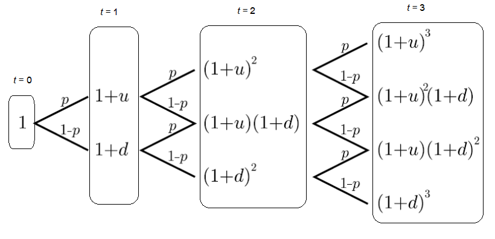
<figcaption>
รูปที่ 9.3 แสดงต้นไม้ของตัวประกอบของ S(n) สำหรับ n=1,2,3
</figcaption>
</figure>

จากแผนภาพต้นไม้สำหรับตัวแปรเชิงสุ่ม <math display="inline" xmlns="http://www.w3.org/1998/Math/MathML"><semantics><mrow><mi>S</mi><mo stretchy="false" form="prefix">(</mo><mn>1</mn><mo stretchy="false" form="postfix">)</mo></mrow><annotation encoding="application/x-tex">S(1)</annotation></semantics></math>, <math display="inline" xmlns="http://www.w3.org/1998/Math/MathML"><semantics><mrow><mi>S</mi><mo stretchy="false" form="prefix">(</mo><mn>2</mn><mo stretchy="false" form="postfix">)</mo></mrow><annotation encoding="application/x-tex">S(2)</annotation></semantics></math> และ <math display="inline" xmlns="http://www.w3.org/1998/Math/MathML"><semantics><mrow><mi>S</mi><mo stretchy="false" form="prefix">(</mo><mn>3</mn><mo stretchy="false" form="postfix">)</mo></mrow><annotation encoding="application/x-tex">S(3)</annotation></semantics></math> จะได้ว่า

<math display="block" xmlns="http://www.w3.org/1998/Math/MathML"><semantics><mrow><mi>S</mi><mo stretchy="false" form="prefix">(</mo><mn>1</mn><mo stretchy="false" form="postfix">)</mo><mo>=</mo><mrow><mo stretchy="true" form="prefix">{</mo><mtable><mtr><mtd columnalign="left" style="text-align: left"><mo stretchy="false" form="prefix">(</mo><mn>1</mn><mo>+</mo><mi>u</mi><mo stretchy="false" form="postfix">)</mo><mi>S</mi><mo stretchy="false" form="prefix">(</mo><mn>0</mn><mo stretchy="false" form="postfix">)</mo><mo>;</mo><mspace width="1.0em"></mspace><mrow><mtext mathvariant="normal">probability </mtext><mspace width="0.333em"></mspace></mrow><mi>p</mi></mtd></mtr><mtr><mtd columnalign="left" style="text-align: left"><mo stretchy="false" form="prefix">(</mo><mn>1</mn><mo>+</mo><mi>d</mi><mo stretchy="false" form="postfix">)</mo><mi>S</mi><mo stretchy="false" form="prefix">(</mo><mn>0</mn><mo stretchy="false" form="postfix">)</mo><mo>;</mo><mspace width="1.0em"></mspace><mrow><mtext mathvariant="normal">probability </mtext><mspace width="0.333em"></mspace></mrow><mn>1</mn><mo>−</mo><mi>p</mi></mtd></mtr></mtable></mrow><mspace width="2.0em"></mspace><mo stretchy="false" form="prefix">(</mo><mn>9.34</mn><mo stretchy="false" form="postfix">)</mo></mrow><annotation encoding="application/x-tex">S(1)=\begin{cases}(1+u)S(0);\quad\text{probability }p\\(1+d)S(0);\quad\text{probability }1-p\end{cases}\qquad(9.34)</annotation></semantics></math>

<math display="block" xmlns="http://www.w3.org/1998/Math/MathML"><semantics><mrow><mi>S</mi><mo stretchy="false" form="prefix">(</mo><mn>2</mn><mo stretchy="false" form="postfix">)</mo><mo>=</mo><mrow><mo stretchy="true" form="prefix">{</mo><mtable><mtr><mtd columnalign="left" style="text-align: left"><mo stretchy="false" form="prefix">(</mo><mn>1</mn><mo>+</mo><mi>u</mi><msup><mo stretchy="false" form="postfix">)</mo><mn>2</mn></msup><mi>S</mi><mo stretchy="false" form="prefix">(</mo><mn>0</mn><mo stretchy="false" form="postfix">)</mo><mo>;</mo><mspace width="1.0em"></mspace><mrow><mtext mathvariant="normal">probability </mtext><mspace width="0.333em"></mspace></mrow><msup><mi>p</mi><mn>2</mn></msup></mtd></mtr><mtr><mtd columnalign="left" style="text-align: left"><mo stretchy="false" form="prefix">(</mo><mn>1</mn><mo>+</mo><mi>u</mi><mo stretchy="false" form="postfix">)</mo><mo stretchy="false" form="prefix">(</mo><mn>1</mn><mo>+</mo><mi>d</mi><mo stretchy="false" form="postfix">)</mo><mi>S</mi><mo stretchy="false" form="prefix">(</mo><mn>0</mn><mo stretchy="false" form="postfix">)</mo><mo>;</mo><mspace width="1.0em"></mspace><mrow><mtext mathvariant="normal">probability </mtext><mspace width="0.333em"></mspace></mrow><mn>2</mn><mi>p</mi><mo stretchy="false" form="prefix">(</mo><mn>1</mn><mo>−</mo><mi>p</mi><mo stretchy="false" form="postfix">)</mo></mtd></mtr><mtr><mtd columnalign="left" style="text-align: left"><mo stretchy="false" form="prefix">(</mo><mn>1</mn><mo>+</mo><mi>d</mi><msup><mo stretchy="false" form="postfix">)</mo><mn>2</mn></msup><mi>S</mi><mo stretchy="false" form="prefix">(</mo><mn>0</mn><mo stretchy="false" form="postfix">)</mo><mo>;</mo><mspace width="1.0em"></mspace><mrow><mtext mathvariant="normal">probability </mtext><mspace width="0.333em"></mspace></mrow><mo stretchy="false" form="prefix">(</mo><mn>1</mn><mo>−</mo><mi>p</mi><msup><mo stretchy="false" form="postfix">)</mo><mn>2</mn></msup></mtd></mtr></mtable></mrow><mspace width="2.0em"></mspace><mo stretchy="false" form="prefix">(</mo><mn>9.35</mn><mo stretchy="false" form="postfix">)</mo></mrow><annotation encoding="application/x-tex">S(2)=\begin{cases}(1+u)^2S(0);\quad\text{probability }p^2\\(1+u)(1+d)S(0);\quad\text{probability }2p(1-p)\\(1+d)^2S(0);\quad\text{probability }(1-p)^2\end{cases}\qquad(9.35)</annotation></semantics></math>

<!-- PDF page 305: independently reviewed -->

<math display="block" xmlns="http://www.w3.org/1998/Math/MathML"><semantics><mrow><mi>S</mi><mo stretchy="false" form="prefix">(</mo><mn>3</mn><mo stretchy="false" form="postfix">)</mo><mo>=</mo><mrow><mo stretchy="true" form="prefix">{</mo><mtable><mtr><mtd columnalign="left" style="text-align: left"><mo stretchy="false" form="prefix">(</mo><mn>1</mn><mo>+</mo><mi>u</mi><msup><mo stretchy="false" form="postfix">)</mo><mn>3</mn></msup><mi>S</mi><mo stretchy="false" form="prefix">(</mo><mn>0</mn><mo stretchy="false" form="postfix">)</mo><mo>;</mo><mspace width="1.0em"></mspace><mrow><mtext mathvariant="normal">probability </mtext><mspace width="0.333em"></mspace></mrow><msup><mi>p</mi><mn>3</mn></msup></mtd></mtr><mtr><mtd columnalign="left" style="text-align: left"><mo stretchy="false" form="prefix">(</mo><mn>1</mn><mo>+</mo><mi>u</mi><msup><mo stretchy="false" form="postfix">)</mo><mn>2</mn></msup><mo stretchy="false" form="prefix">(</mo><mn>1</mn><mo>+</mo><mi>d</mi><mo stretchy="false" form="postfix">)</mo><mi>S</mi><mo stretchy="false" form="prefix">(</mo><mn>0</mn><mo stretchy="false" form="postfix">)</mo><mo>;</mo><mspace width="1.0em"></mspace><mrow><mtext mathvariant="normal">probability </mtext><mspace width="0.333em"></mspace></mrow><mn>3</mn><msup><mi>p</mi><mn>2</mn></msup><mo stretchy="false" form="prefix">(</mo><mn>1</mn><mo>−</mo><mi>p</mi><mo stretchy="false" form="postfix">)</mo></mtd></mtr><mtr><mtd columnalign="left" style="text-align: left"><mo stretchy="false" form="prefix">(</mo><mn>1</mn><mo>+</mo><mi>u</mi><mo stretchy="false" form="postfix">)</mo><mo stretchy="false" form="prefix">(</mo><mn>1</mn><mo>+</mo><mi>d</mi><msup><mo stretchy="false" form="postfix">)</mo><mn>2</mn></msup><mi>S</mi><mo stretchy="false" form="prefix">(</mo><mn>0</mn><mo stretchy="false" form="postfix">)</mo><mo>;</mo><mspace width="1.0em"></mspace><mrow><mtext mathvariant="normal">probability </mtext><mspace width="0.333em"></mspace></mrow><mn>3</mn><mi>p</mi><mo stretchy="false" form="prefix">(</mo><mn>1</mn><mo>−</mo><mi>p</mi><msup><mo stretchy="false" form="postfix">)</mo><mn>2</mn></msup></mtd></mtr><mtr><mtd columnalign="left" style="text-align: left"><mo stretchy="false" form="prefix">(</mo><mn>1</mn><mo>+</mo><mi>d</mi><msup><mo stretchy="false" form="postfix">)</mo><mn>3</mn></msup><mi>S</mi><mo stretchy="false" form="prefix">(</mo><mn>0</mn><mo stretchy="false" form="postfix">)</mo><mo>;</mo><mspace width="1.0em"></mspace><mrow><mtext mathvariant="normal">probability </mtext><mspace width="0.333em"></mspace></mrow><mo stretchy="false" form="prefix">(</mo><mn>1</mn><mo>−</mo><mi>p</mi><msup><mo stretchy="false" form="postfix">)</mo><mn>3</mn></msup></mtd></mtr></mtable></mrow><mspace width="2.0em"></mspace><mo stretchy="false" form="prefix">(</mo><mn>9.36</mn><mo stretchy="false" form="postfix">)</mo></mrow><annotation encoding="application/x-tex">S(3)=\begin{cases}(1+u)^3S(0);\quad\text{probability }p^3\\(1+u)^2(1+d)S(0);\quad\text{probability }3p^2(1-p)\\(1+u)(1+d)^2S(0);\quad\text{probability }3p(1-p)^2\\(1+d)^3S(0);\quad\text{probability }(1-p)^3\end{cases}\qquad(9.36)</annotation></semantics></math>

จากแนวคิดนี้ ถ้ากำหนดให้ <math display="inline" xmlns="http://www.w3.org/1998/Math/MathML"><semantics><mi>i</mi><annotation encoding="application/x-tex">i</annotation></semantics></math> สำหรับ <math display="inline" xmlns="http://www.w3.org/1998/Math/MathML"><semantics><mrow><mi>i</mi><mo>=</mo><mn>0</mn><mo>,</mo><mn>1</mn><mo>,</mo><mn>2</mn><mo>,</mo><mi>.</mi><mi>.</mi><mi>.</mi><mo>,</mo><mi>n</mi></mrow><annotation encoding="application/x-tex">i=0,1,2,...,n</annotation></semantics></math> เป็นจำนวนครั้งหรือจำนวนคาบเวลาที่ราคาหุ้นขึ้น โดยที่ความน่าจะเป็นที่หุ้นขึ้นในแต่ละครั้ง เท่ากับ <math display="inline" xmlns="http://www.w3.org/1998/Math/MathML"><semantics><mi>p</mi><annotation encoding="application/x-tex">p</annotation></semantics></math> และ <math display="inline" xmlns="http://www.w3.org/1998/Math/MathML"><semantics><mrow><mi>n</mi><mo>−</mo><mi>i</mi></mrow><annotation encoding="application/x-tex">n-i</annotation></semantics></math> เป็นจำนวนครั้งที่ราคาหุ้นลง โดยที่ความน่าจะเป็นที่หุ้นขึ้นในแต่ละครั้ง เท่ากับ <math display="inline" xmlns="http://www.w3.org/1998/Math/MathML"><semantics><mrow><mn>1</mn><mo>−</mo><mi>p</mi></mrow><annotation encoding="application/x-tex">1-p</annotation></semantics></math> จะได้ว่า <math display="inline" xmlns="http://www.w3.org/1998/Math/MathML"><semantics><mi>i</mi><annotation encoding="application/x-tex">i</annotation></semantics></math> เป็นตัวแปรเชิงสุ่มที่มีการแจกแจงความน่าจะเป็นแบบทวินาม ดังนั้นความน่าจะเป็นที่หุ้นขึ้น <math display="inline" xmlns="http://www.w3.org/1998/Math/MathML"><semantics><mi>i</mi><annotation encoding="application/x-tex">i</annotation></semantics></math> ครั้งจากทั้งหมด <math display="inline" xmlns="http://www.w3.org/1998/Math/MathML"><semantics><mi>n</mi><annotation encoding="application/x-tex">n</annotation></semantics></math> ครั้ง เท่ากับ

<math display="block" xmlns="http://www.w3.org/1998/Math/MathML"><semantics><mrow><mrow><mo stretchy="true" form="prefix">(</mo><mfrac linethickness="0"><mi>n</mi><mi>i</mi></mfrac><mo stretchy="true" form="postfix">)</mo></mrow><msup><mi>p</mi><mi>i</mi></msup><mo stretchy="false" form="prefix">(</mo><mn>1</mn><mo>−</mo><mi>p</mi><msup><mo stretchy="false" form="postfix">)</mo><mrow><mi>n</mi><mo>−</mo><mi>i</mi></mrow></msup><mspace width="2.0em"></mspace><mtext mathvariant="normal">เมื่อ</mtext><mspace width="1.0em"></mspace><mrow><mo stretchy="true" form="prefix">(</mo><mfrac linethickness="0"><mi>n</mi><mi>i</mi></mfrac><mo stretchy="true" form="postfix">)</mo></mrow><mo>=</mo><mfrac><mrow><mi>n</mi><mi>!</mi></mrow><mrow><mi>i</mi><mi>!</mi><mo stretchy="false" form="prefix">(</mo><mi>n</mi><mo>−</mo><mi>i</mi><mo stretchy="false" form="postfix">)</mo><mi>!</mi></mrow></mfrac><mspace width="2.0em"></mspace><mo stretchy="false" form="prefix">(</mo><mn>9.37</mn><mo stretchy="false" form="postfix">)</mo></mrow><annotation encoding="application/x-tex">\binom ni p^i(1-p)^{n-i}\qquad\text{เมื่อ}\quad\binom ni=\frac{n!}{i!(n-i)!}\qquad(9.37)</annotation></semantics></math>

ตัวอย่างเช่น ถ้าพิจารณาจำนวนครั้งที่ราคาหุ้นขึ้น <math display="inline" xmlns="http://www.w3.org/1998/Math/MathML"><semantics><mi>i</mi><annotation encoding="application/x-tex">i</annotation></semantics></math> ครั้ง จากการพิจารณาการลงทุน <math display="inline" xmlns="http://www.w3.org/1998/Math/MathML"><semantics><mrow><mi>n</mi><mo>=</mo><mn>10</mn></mrow><annotation encoding="application/x-tex">n=10</annotation></semantics></math> คาบ โดยกำหนดความน่าเป็นที่หุ้นขึ้นในแต่ละครั้ง เท่ากับ 0.5 จะได้ความน่าจะเป็นที่หุ้นขึ้นจำนวน <math display="inline" xmlns="http://www.w3.org/1998/Math/MathML"><semantics><mi>i</mi><annotation encoding="application/x-tex">i</annotation></semantics></math> ครั้ง สำหรับ <math display="inline" xmlns="http://www.w3.org/1998/Math/MathML"><semantics><mrow><mi>i</mi><mo>=</mo><mn>0</mn><mo>,</mo><mn>1</mn><mo>,</mo><mi>.</mi><mi>.</mi><mi>.</mi><mo>,</mo><mn>10</mn></mrow><annotation encoding="application/x-tex">i=0,1,...,10</annotation></semantics></math> แสดงได้ดังตารางต่อไปนี้

<table>
<thead>
<tr>
<th style="text-align: center;">จำนวนครั้งที่หุ้นขึ้น <math display="inline" xmlns="http://www.w3.org/1998/Math/MathML"><semantics><mi>i</mi><annotation encoding="application/x-tex">i</annotation></semantics></math></th>
<th style="text-align: center;">ความน่าจะเป็น <math display="inline" xmlns="http://www.w3.org/1998/Math/MathML"><semantics><mrow><mi>p</mi><mo stretchy="false" form="prefix">(</mo><mi>i</mi><mo stretchy="false" form="postfix">)</mo></mrow><annotation encoding="application/x-tex">p(i)</annotation></semantics></math></th>
</tr>
</thead>
<tbody>
<tr>
<td style="text-align: center;">0</td>
<td style="text-align: center;">0.0009765625</td>
</tr>
<tr>
<td style="text-align: center;">1</td>
<td style="text-align: center;">0.0097656250</td>
</tr>
<tr>
<td style="text-align: center;">2</td>
<td style="text-align: center;">0.0439453125</td>
</tr>
<tr>
<td style="text-align: center;">3</td>
<td style="text-align: center;">0.1171875000</td>
</tr>
<tr>
<td style="text-align: center;">4</td>
<td style="text-align: center;">0.2050781250</td>
</tr>
<tr>
<td style="text-align: center;">5</td>
<td style="text-align: center;">0.2460937500</td>
</tr>
<tr>
<td style="text-align: center;">6</td>
<td style="text-align: center;">0.2050781250</td>
</tr>
<tr>
<td style="text-align: center;">7</td>
<td style="text-align: center;">0.1171875000</td>
</tr>
<tr>
<td style="text-align: center;">8</td>
<td style="text-align: center;">0.0439453125</td>
</tr>
<tr>
<td style="text-align: center;">9</td>
<td style="text-align: center;">0.0097656250</td>
</tr>
<tr>
<td style="text-align: center;">10</td>
<td style="text-align: center;">0.0009765625</td>
</tr>
</tbody>
</table>

<!-- PDF page 306: independently reviewed -->
<figure class="source-figure">
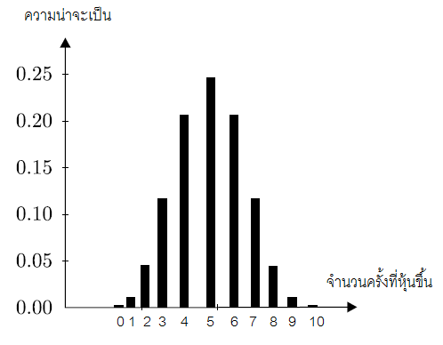
<figcaption>
รูปที่ 9.4 แสดงความน่าจะเป็นที่หุ้นขึ้นจำนวน i ครั้ง i=0,1,…,10
</figcaption>
</figure>

จาก (9.37) ทำให้ได้ ราคาหุ้น <math display="inline" xmlns="http://www.w3.org/1998/Math/MathML"><semantics><mrow><mi>S</mi><mo stretchy="false" form="prefix">(</mo><mi>n</mi><mo stretchy="false" form="postfix">)</mo></mrow><annotation encoding="application/x-tex">S(n)</annotation></semantics></math> ณ เวลา <math display="inline" xmlns="http://www.w3.org/1998/Math/MathML"><semantics><mi>n</mi><annotation encoding="application/x-tex">n</annotation></semantics></math> เท่ากับ

<math display="block" xmlns="http://www.w3.org/1998/Math/MathML"><semantics><mrow><mi>S</mi><mo stretchy="false" form="prefix">(</mo><mi>n</mi><mo stretchy="false" form="postfix">)</mo><mo>=</mo><mo stretchy="false" form="prefix">(</mo><mn>1</mn><mo>+</mo><mi>u</mi><msup><mo stretchy="false" form="postfix">)</mo><mi>i</mi></msup><mo stretchy="false" form="prefix">(</mo><mn>1</mn><mo>+</mo><mi>d</mi><msup><mo stretchy="false" form="postfix">)</mo><mrow><mi>n</mi><mo>−</mo><mi>i</mi></mrow></msup><mi>S</mi><mo stretchy="false" form="prefix">(</mo><mn>0</mn><mo stretchy="false" form="postfix">)</mo><mspace width="2.0em"></mspace><mo stretchy="false" form="prefix">(</mo><mn>9.38</mn><mo stretchy="false" form="postfix">)</mo></mrow><annotation encoding="application/x-tex">S(n)=(1+u)^i(1+d)^{n-i}S(0)\qquad(9.38)</annotation></semantics></math>

ด้วยความน่าจะเป็น <math display="inline" xmlns="http://www.w3.org/1998/Math/MathML"><semantics><mrow><mrow><mo stretchy="true" form="prefix">(</mo><mfrac linethickness="0"><mi>n</mi><mi>i</mi></mfrac><mo stretchy="true" form="postfix">)</mo></mrow><msup><mi>p</mi><mi>i</mi></msup><mo stretchy="false" form="prefix">(</mo><mn>1</mn><mo>−</mo><mi>p</mi><msup><mo stretchy="false" form="postfix">)</mo><mrow><mi>n</mi><mo>−</mo><mi>i</mi></mrow></msup></mrow><annotation encoding="application/x-tex">\binom ni p^i(1-p)^{n-i}</annotation></semantics></math> สำหรับ <math display="inline" xmlns="http://www.w3.org/1998/Math/MathML"><semantics><mrow><mi>i</mi><mo>=</mo><mn>0</mn><mo>,</mo><mn>1</mn><mo>,</mo><mi>.</mi><mi>.</mi><mi>.</mi><mo>,</mo><mn>10</mn></mrow><annotation encoding="application/x-tex">i=0,1,...,10</annotation></semantics></math>

<strong>ตัวอย่างที่ 9.8</strong> สมมติให้ราคาหุ้น <math display="inline" xmlns="http://www.w3.org/1998/Math/MathML"><semantics><mrow><mi>S</mi><mo stretchy="false" form="prefix">(</mo><mi>t</mi><mo stretchy="false" form="postfix">)</mo></mrow><annotation encoding="application/x-tex">S(t)</annotation></semantics></math> เป็นไปตามแบบจำลองต้นไม้ทวิภาค จงคำนวณหา <math display="inline" xmlns="http://www.w3.org/1998/Math/MathML"><semantics><mi>u</mi><annotation encoding="application/x-tex">u</annotation></semantics></math> และ <math display="inline" xmlns="http://www.w3.org/1998/Math/MathML"><semantics><mi>d</mi><annotation encoding="application/x-tex">d</annotation></semantics></math> ที่ทำให้ <math display="inline" xmlns="http://www.w3.org/1998/Math/MathML"><semantics><mrow><mi>S</mi><mo stretchy="false" form="prefix">(</mo><mn>1</mn><mo stretchy="false" form="postfix">)</mo><mo>=</mo><mrow><mo stretchy="true" form="prefix">{</mo><mtable><mtr><mtd columnalign="left" style="text-align: left"><mn>87</mn><mo>;</mo><mspace width="1.0em"></mspace><mo>↑</mo></mtd></mtr><mtr><mtd columnalign="left" style="text-align: left"><mn>76</mn><mo>;</mo><mspace width="1.0em"></mspace><mo>↓</mo></mtd></mtr></mtable></mrow></mrow><annotation encoding="application/x-tex">S(1)=\begin{cases}87;\quad\uparrow\\76;\quad\downarrow\end{cases}</annotation></semantics></math> และ <math display="inline" xmlns="http://www.w3.org/1998/Math/MathML"><semantics><mrow><mi>S</mi><mo stretchy="false" form="prefix">(</mo><mn>2</mn><mo stretchy="false" form="postfix">)</mo><mo>=</mo><mn>92</mn><mo>;</mo><mspace width="1.0em"></mspace><mo>↑</mo></mrow><annotation encoding="application/x-tex">S(2)=92;\quad\uparrow</annotation></semantics></math>

<strong>วิธีทำ</strong> จากแผนภาพต้นไม้ทวิภาค จะได้

<math display="block" xmlns="http://www.w3.org/1998/Math/MathML"><semantics><mrow><mi>S</mi><mo stretchy="false" form="prefix">(</mo><mn>1</mn><mo stretchy="false" form="postfix">)</mo><mo>=</mo><mrow><mo stretchy="true" form="prefix">{</mo><mtable><mtr><mtd columnalign="left" style="text-align: left"><mo stretchy="false" form="prefix">(</mo><mn>1</mn><mo>+</mo><mi>u</mi><mo stretchy="false" form="postfix">)</mo><mi>S</mi><mo stretchy="false" form="prefix">(</mo><mn>0</mn><mo stretchy="false" form="postfix">)</mo></mtd></mtr><mtr><mtd columnalign="left" style="text-align: left"><mo stretchy="false" form="prefix">(</mo><mn>1</mn><mo>+</mo><mi>d</mi><mo stretchy="false" form="postfix">)</mo><mi>S</mi><mo stretchy="false" form="prefix">(</mo><mn>0</mn><mo stretchy="false" form="postfix">)</mo></mtd></mtr></mtable></mrow><mo>=</mo><mrow><mo stretchy="true" form="prefix">{</mo><mtable><mtr><mtd columnalign="left" style="text-align: left"><mn>87</mn></mtd></mtr><mtr><mtd columnalign="left" style="text-align: left"><mn>76</mn></mtd></mtr></mtable></mrow></mrow><annotation encoding="application/x-tex">S(1)=\begin{cases}(1+u)S(0)\\(1+d)S(0)\end{cases}=\begin{cases}87\\76\end{cases}</annotation></semantics></math>

และ

<math display="block" xmlns="http://www.w3.org/1998/Math/MathML"><semantics><mrow><mi>S</mi><mo stretchy="false" form="prefix">(</mo><mn>2</mn><mo stretchy="false" form="postfix">)</mo><mo>=</mo><mrow><mo stretchy="true" form="prefix">{</mo><mtable><mtr><mtd columnalign="left" style="text-align: left"><mo stretchy="false" form="prefix">(</mo><mn>1</mn><mo>+</mo><mi>u</mi><msup><mo stretchy="false" form="postfix">)</mo><mn>2</mn></msup><mi>S</mi><mo stretchy="false" form="prefix">(</mo><mn>0</mn><mo stretchy="false" form="postfix">)</mo></mtd></mtr><mtr><mtd columnalign="left" style="text-align: left"><mo stretchy="false" form="prefix">(</mo><mn>1</mn><mo>+</mo><mi>u</mi><mo stretchy="false" form="postfix">)</mo><mo stretchy="false" form="prefix">(</mo><mn>1</mn><mo>+</mo><mi>d</mi><mo stretchy="false" form="postfix">)</mo><mi>S</mi><mo stretchy="false" form="prefix">(</mo><mn>0</mn><mo stretchy="false" form="postfix">)</mo></mtd></mtr><mtr><mtd columnalign="left" style="text-align: left"><mo stretchy="false" form="prefix">(</mo><mn>1</mn><mo>+</mo><mi>d</mi><msup><mo stretchy="false" form="postfix">)</mo><mn>2</mn></msup><mi>S</mi><mo stretchy="false" form="prefix">(</mo><mn>0</mn><mo stretchy="false" form="postfix">)</mo></mtd></mtr></mtable></mrow><mo>=</mo><mrow><mo stretchy="true" form="prefix">{</mo><mtable><mtr><mtd columnalign="left" style="text-align: left"><mn>92</mn></mtd></mtr><mtr><mtd columnalign="left" style="text-align: left"><mi>?</mi></mtd></mtr><mtr><mtd columnalign="left" style="text-align: left"><mi>?</mi></mtd></mtr></mtable></mrow></mrow><annotation encoding="application/x-tex">S(2)=\begin{cases}(1+u)^2S(0)\\(1+u)(1+d)S(0)\\(1+d)^2S(0)\end{cases}=\begin{cases}92\\?\\?\end{cases}</annotation></semantics></math>

นั่นคือ <math display="inline" xmlns="http://www.w3.org/1998/Math/MathML"><semantics><mrow><mo stretchy="false" form="prefix">(</mo><mn>1</mn><mo>+</mo><mi>u</mi><mo stretchy="false" form="postfix">)</mo><mi>S</mi><mo stretchy="false" form="prefix">(</mo><mn>0</mn><mo stretchy="false" form="postfix">)</mo><mo>=</mo><mn>87</mn></mrow><annotation encoding="application/x-tex">(1+u)S(0)=87</annotation></semantics></math> (1)

<math display="inline" xmlns="http://www.w3.org/1998/Math/MathML"><semantics><mrow><mo stretchy="false" form="prefix">(</mo><mn>1</mn><mo>+</mo><mi>d</mi><mo stretchy="false" form="postfix">)</mo><mi>S</mi><mo stretchy="false" form="prefix">(</mo><mn>0</mn><mo stretchy="false" form="postfix">)</mo><mo>=</mo><mn>76</mn></mrow><annotation encoding="application/x-tex">(1+d)S(0)=76</annotation></semantics></math> (2)

<!-- PDF page 307: independently reviewed -->

<math display="block" xmlns="http://www.w3.org/1998/Math/MathML"><semantics><mrow><mo stretchy="false" form="prefix">(</mo><mn>1</mn><mo>+</mo><mi>u</mi><msup><mo stretchy="false" form="postfix">)</mo><mn>2</mn></msup><mi>S</mi><mo stretchy="false" form="prefix">(</mo><mn>0</mn><mo stretchy="false" form="postfix">)</mo><mo>=</mo><mn>92</mn><mspace width="2.0em"></mspace><mo stretchy="false" form="prefix">(</mo><mn>3</mn><mo stretchy="false" form="postfix">)</mo></mrow><annotation encoding="application/x-tex">(1+u)^2S(0)=92\qquad(3)</annotation></semantics></math>

<math display="inline" xmlns="http://www.w3.org/1998/Math/MathML"><semantics><mrow><mo stretchy="false" form="prefix">(</mo><mn>3</mn><mo stretchy="false" form="postfix">)</mo><mi>/</mi><mo stretchy="false" form="prefix">(</mo><mn>1</mn><mo stretchy="false" form="postfix">)</mo></mrow><annotation encoding="application/x-tex">(3)/(1)</annotation></semantics></math>; <math display="inline" xmlns="http://www.w3.org/1998/Math/MathML"><semantics><mrow><mn>1</mn><mo>+</mo><mi>u</mi><mo>=</mo><mstyle displaystyle="true"><mfrac><mn>92</mn><mn>87</mn></mfrac></mstyle><mo>⇒</mo><mi>u</mi><mo>≈</mo><mn>1.0575</mn></mrow><annotation encoding="application/x-tex">1+u=\dfrac{92}{87}\Rightarrow u\approx1.0575</annotation></semantics></math>

<math display="inline" xmlns="http://www.w3.org/1998/Math/MathML"><semantics><mrow><mo stretchy="false" form="prefix">(</mo><mn>2</mn><mo stretchy="false" form="postfix">)</mo><mi>/</mi><mo stretchy="false" form="prefix">(</mo><mn>1</mn><mo stretchy="false" form="postfix">)</mo></mrow><annotation encoding="application/x-tex">(2)/(1)</annotation></semantics></math>; <math display="inline" xmlns="http://www.w3.org/1998/Math/MathML"><semantics><mrow><mstyle displaystyle="true"><mfrac><mrow><mn>1</mn><mo>+</mo><mi>d</mi></mrow><mrow><mn>1</mn><mo>+</mo><mi>u</mi></mrow></mfrac></mstyle><mo>=</mo><mstyle displaystyle="true"><mfrac><mn>76</mn><mn>87</mn></mfrac></mstyle><mo>⇒</mo><mn>1</mn><mo>+</mo><mi>d</mi><mo>=</mo><mstyle displaystyle="true"><mfrac><mn>76</mn><mn>87</mn></mfrac></mstyle><mrow><mo stretchy="true" form="prefix">(</mo><mstyle displaystyle="true"><mfrac><mn>92</mn><mn>87</mn></mfrac></mstyle><mo stretchy="true" form="postfix">)</mo></mrow><mo>⇒</mo><mi>d</mi><mo>≈</mo><mi>−</mi><mn>0.0762</mn></mrow><annotation encoding="application/x-tex">\dfrac{1+d}{1+u}=\dfrac{76}{87}\Rightarrow 1+d=\dfrac{76}{87}\left(\dfrac{92}{87}\right)\Rightarrow d\approx-0.0762</annotation></semantics></math>

ดังนั้น <math display="inline" xmlns="http://www.w3.org/1998/Math/MathML"><semantics><mrow><mi>u</mi><mo>≈</mo><mn>1.0575</mn></mrow><annotation encoding="application/x-tex">u\approx1.0575</annotation></semantics></math> และ <math display="inline" xmlns="http://www.w3.org/1998/Math/MathML"><semantics><mrow><mi>d</mi><mo>≈</mo><mi>−</mi><mn>0.0762</mn></mrow><annotation encoding="application/x-tex">d\approx-0.0762</annotation></semantics></math> □

<strong>ตัวอย่างที่ 9.9</strong> สมมติให้ราคาหุ้น <math display="inline" xmlns="http://www.w3.org/1998/Math/MathML"><semantics><mrow><mi>S</mi><mo stretchy="false" form="prefix">(</mo><mi>t</mi><mo stretchy="false" form="postfix">)</mo></mrow><annotation encoding="application/x-tex">S(t)</annotation></semantics></math> เป็นไปตามแบบจำลองต้นไม้ทวิภาค จงคำนวณหา <math display="inline" xmlns="http://www.w3.org/1998/Math/MathML"><semantics><mi>u</mi><annotation encoding="application/x-tex">u</annotation></semantics></math> และ <math display="inline" xmlns="http://www.w3.org/1998/Math/MathML"><semantics><mi>d</mi><annotation encoding="application/x-tex">d</annotation></semantics></math> ที่ทำให้ <math display="inline" xmlns="http://www.w3.org/1998/Math/MathML"><semantics><mrow><mi>S</mi><mo stretchy="false" form="prefix">(</mo><mn>2</mn><mo stretchy="false" form="postfix">)</mo><mo>=</mo><mrow><mo stretchy="true" form="prefix">{</mo><mtable><mtr><mtd columnalign="left" style="text-align: left"><mn>121</mn><mo>;</mo><mspace width="1.0em"></mspace><mo>↑</mo><mo>↑</mo></mtd></mtr><mtr><mtd columnalign="left" style="text-align: left"><mn>110</mn><mo>;</mo><mspace width="1.0em"></mspace><mo>↑</mo><mo>↓</mo><mrow><mspace width="0.333em"></mspace><mtext mathvariant="normal"> or </mtext><mspace width="0.333em"></mspace></mrow><mo>↓</mo><mo>↑</mo></mtd></mtr><mtr><mtd columnalign="left" style="text-align: left"><mn>100</mn><mo>;</mo><mspace width="1.0em"></mspace><mo>↓</mo><mo>↓</mo></mtd></mtr></mtable></mrow></mrow><annotation encoding="application/x-tex">S(2)=\begin{cases}121;\quad\uparrow\uparrow\\110;\quad\uparrow\downarrow\text{ or }\downarrow\uparrow\\100;\quad\downarrow\downarrow\end{cases}</annotation></semantics></math> เมื่อกำหนดให้ <math display="inline" xmlns="http://www.w3.org/1998/Math/MathML"><semantics><mrow><mi>S</mi><mo stretchy="false" form="prefix">(</mo><mn>0</mn><mo stretchy="false" form="postfix">)</mo><mo>=</mo><mn>100</mn></mrow><annotation encoding="application/x-tex">S(0)=100</annotation></semantics></math>

<strong>วิธีทำ</strong> จากแผนภาพต้นไม้ทวิภาค จะได้

<math display="block" xmlns="http://www.w3.org/1998/Math/MathML"><semantics><mrow><mi>S</mi><mo stretchy="false" form="prefix">(</mo><mn>2</mn><mo stretchy="false" form="postfix">)</mo><mo>=</mo><mrow><mo stretchy="true" form="prefix">{</mo><mtable><mtr><mtd columnalign="left" style="text-align: left"><mo stretchy="false" form="prefix">(</mo><mn>1</mn><mo>+</mo><mi>u</mi><msup><mo stretchy="false" form="postfix">)</mo><mn>2</mn></msup><mn>100</mn><mo>;</mo><mspace width="1.0em"></mspace><mo>↑</mo><mo>↑</mo></mtd></mtr><mtr><mtd columnalign="left" style="text-align: left"><mo stretchy="false" form="prefix">(</mo><mn>1</mn><mo>+</mo><mi>u</mi><mo stretchy="false" form="postfix">)</mo><mo stretchy="false" form="prefix">(</mo><mn>1</mn><mo>+</mo><mi>d</mi><mo stretchy="false" form="postfix">)</mo><mn>100</mn><mo>;</mo><mspace width="1.0em"></mspace><mo>↑</mo><mo>↓</mo><mrow><mspace width="0.333em"></mspace><mtext mathvariant="normal"> or </mtext><mspace width="0.333em"></mspace></mrow><mo>↓</mo><mo>↑</mo></mtd></mtr><mtr><mtd columnalign="left" style="text-align: left"><mo stretchy="false" form="prefix">(</mo><mn>1</mn><mo>+</mo><mi>d</mi><msup><mo stretchy="false" form="postfix">)</mo><mn>2</mn></msup><mn>100</mn><mo>;</mo><mspace width="1.0em"></mspace><mo>↓</mo><mo>↓</mo></mtd></mtr></mtable></mrow><mo>=</mo><mrow><mo stretchy="true" form="prefix">{</mo><mtable><mtr><mtd columnalign="left" style="text-align: left"><mn>121</mn><mo>;</mo><mspace width="1.0em"></mspace><mo>↑</mo><mo>↑</mo></mtd></mtr><mtr><mtd columnalign="left" style="text-align: left"><mn>110</mn><mo>;</mo><mspace width="1.0em"></mspace><mo>↑</mo><mo>↓</mo><mrow><mspace width="0.333em"></mspace><mtext mathvariant="normal"> or </mtext><mspace width="0.333em"></mspace></mrow><mo>↓</mo><mo>↑</mo></mtd></mtr><mtr><mtd columnalign="left" style="text-align: left"><mn>100</mn><mo>;</mo><mspace width="1.0em"></mspace><mo>↓</mo><mo>↓</mo></mtd></mtr></mtable></mrow></mrow><annotation encoding="application/x-tex">S(2)=\begin{cases}(1+u)^2 100;\quad\uparrow\uparrow\\(1+u)(1+d)100;\quad\uparrow\downarrow\text{ or }\downarrow\uparrow\\(1+d)^2 100;\quad\downarrow\downarrow\end{cases}=\begin{cases}121;\quad\uparrow\uparrow\\110;\quad\uparrow\downarrow\text{ or }\downarrow\uparrow\\100;\quad\downarrow\downarrow\end{cases}</annotation></semantics></math>

นั่นคือ <math display="inline" xmlns="http://www.w3.org/1998/Math/MathML"><semantics><mrow><mo stretchy="false" form="prefix">(</mo><mn>1</mn><mo>+</mo><mi>u</mi><msup><mo stretchy="false" form="postfix">)</mo><mn>2</mn></msup><mn>100</mn><mo>=</mo><mn>121</mn></mrow><annotation encoding="application/x-tex">(1+u)^2 100=121</annotation></semantics></math> (1)

<math display="inline" xmlns="http://www.w3.org/1998/Math/MathML"><semantics><mrow><mo stretchy="false" form="prefix">(</mo><mn>1</mn><mo>+</mo><mi>u</mi><mo stretchy="false" form="postfix">)</mo><mo stretchy="false" form="prefix">(</mo><mn>1</mn><mo>+</mo><mi>d</mi><mo stretchy="false" form="postfix">)</mo><mn>100</mn><mo>=</mo><mn>110</mn></mrow><annotation encoding="application/x-tex">(1+u)(1+d)100=110</annotation></semantics></math> (2)

<math display="inline" xmlns="http://www.w3.org/1998/Math/MathML"><semantics><mrow><mo stretchy="false" form="prefix">(</mo><mn>1</mn><mo>+</mo><mi>d</mi><msup><mo stretchy="false" form="postfix">)</mo><mn>2</mn></msup><mn>100</mn><mo>=</mo><mn>100</mn></mrow><annotation encoding="application/x-tex">(1+d)^2 100=100</annotation></semantics></math> (3)

แก้สมการ (3) จะได้ <math display="inline" xmlns="http://www.w3.org/1998/Math/MathML"><semantics><mrow><mi>d</mi><mo>=</mo><mn>0</mn></mrow><annotation encoding="application/x-tex">d=0</annotation></semantics></math> (<math display="inline" xmlns="http://www.w3.org/1998/Math/MathML"><semantics><mrow><mi>∵</mi><mi>d</mi><mo>&gt;</mo><mi>−</mi><mn>1</mn></mrow><annotation encoding="application/x-tex">\because d&gt;-1</annotation></semantics></math>)

แก้สมการ (1) จะได้ <math display="inline" xmlns="http://www.w3.org/1998/Math/MathML"><semantics><mrow><mi>u</mi><mo>=</mo><mn>0.1</mn></mrow><annotation encoding="application/x-tex">u=0.1</annotation></semantics></math> (<math display="inline" xmlns="http://www.w3.org/1998/Math/MathML"><semantics><mrow><mi>∵</mi><mi>u</mi><mo>&gt;</mo><mi>d</mi></mrow><annotation encoding="application/x-tex">\because u&gt;d</annotation></semantics></math>)

ดังนั้น <math display="inline" xmlns="http://www.w3.org/1998/Math/MathML"><semantics><mrow><mi>u</mi><mo>=</mo><mn>0.1</mn></mrow><annotation encoding="application/x-tex">u=0.1</annotation></semantics></math> และ <math display="inline" xmlns="http://www.w3.org/1998/Math/MathML"><semantics><mrow><mi>d</mi><mo>=</mo><mn>0</mn></mrow><annotation encoding="application/x-tex">d=0</annotation></semantics></math> □

<strong>ตัวอย่างที่ 9.10</strong> สมมติให้ราคาหุ้น <math display="inline" xmlns="http://www.w3.org/1998/Math/MathML"><semantics><mrow><mi>S</mi><mo stretchy="false" form="prefix">(</mo><mi>t</mi><mo stretchy="false" form="postfix">)</mo></mrow><annotation encoding="application/x-tex">S(t)</annotation></semantics></math> เป็นไปตามแบบจำลองต้นไม้ทวิภาค โดยที่ <math display="inline" xmlns="http://www.w3.org/1998/Math/MathML"><semantics><mrow><mi>S</mi><mo stretchy="false" form="prefix">(</mo><mn>2</mn><mo stretchy="false" form="postfix">)</mo><mo>=</mo><mrow><mo stretchy="true" form="prefix">{</mo><mtable><mtr><mtd columnalign="left" style="text-align: left"><mn>32</mn><mo>;</mo><mspace width="1.0em"></mspace><mo>↑</mo><mo>↑</mo></mtd></mtr><mtr><mtd columnalign="left" style="text-align: left"><mn>28</mn><mo>;</mo><mspace width="1.0em"></mspace><mo>↑</mo><mo>↓</mo><mrow><mspace width="0.333em"></mspace><mtext mathvariant="normal"> or </mtext><mspace width="0.333em"></mspace></mrow><mo>↓</mo><mo>↑</mo></mtd></mtr><mtr><mtd columnalign="left" style="text-align: left"><mi>x</mi><mo>;</mo><mspace width="1.0em"></mspace><mo>↓</mo><mo>↓</mo></mtd></mtr></mtable></mrow></mrow><annotation encoding="application/x-tex">S(2)=\begin{cases}32;\quad\uparrow\uparrow\\28;\quad\uparrow\downarrow\text{ or }\downarrow\uparrow\\x;\quad\downarrow\downarrow\end{cases}</annotation></semantics></math> จงคำนวณค่าของ <math display="inline" xmlns="http://www.w3.org/1998/Math/MathML"><semantics><mi>x</mi><annotation encoding="application/x-tex">x</annotation></semantics></math> และตรวจสอบว่าสามารถสร้างต้นไม้ทวิภาคของราคาได้สมบูรณ์หรือไม่ ถ้าสร้างได้ สร้างได้แบบเดียวหรือไม่

<strong>วิธีทำ</strong> จากแผนภาพต้นไม้ทวิภาค จะได้

<!-- PDF page 308: independently reviewed -->

<math display="block" xmlns="http://www.w3.org/1998/Math/MathML"><semantics><mrow><mi>S</mi><mo stretchy="false" form="prefix">(</mo><mn>2</mn><mo stretchy="false" form="postfix">)</mo><mo>=</mo><mrow><mo stretchy="true" form="prefix">{</mo><mtable><mtr><mtd columnalign="left" style="text-align: left"><mo stretchy="false" form="prefix">(</mo><mn>1</mn><mo>+</mo><mi>u</mi><msup><mo stretchy="false" form="postfix">)</mo><mn>2</mn></msup><mi>S</mi><mo stretchy="false" form="prefix">(</mo><mn>0</mn><mo stretchy="false" form="postfix">)</mo><mo>;</mo><mspace width="1.0em"></mspace><mo>↑</mo><mo>↑</mo></mtd></mtr><mtr><mtd columnalign="left" style="text-align: left"><mo stretchy="false" form="prefix">(</mo><mn>1</mn><mo>+</mo><mi>u</mi><mo stretchy="false" form="postfix">)</mo><mo stretchy="false" form="prefix">(</mo><mn>1</mn><mo>+</mo><mi>d</mi><mo stretchy="false" form="postfix">)</mo><mi>S</mi><mo stretchy="false" form="prefix">(</mo><mn>0</mn><mo stretchy="false" form="postfix">)</mo><mo>;</mo><mspace width="1.0em"></mspace><mo>↑</mo><mo>↓</mo><mrow><mspace width="0.333em"></mspace><mtext mathvariant="normal"> or </mtext><mspace width="0.333em"></mspace></mrow><mo>↓</mo><mo>↑</mo></mtd></mtr><mtr><mtd columnalign="left" style="text-align: left"><mo stretchy="false" form="prefix">(</mo><mn>1</mn><mo>+</mo><mi>d</mi><msup><mo stretchy="false" form="postfix">)</mo><mn>2</mn></msup><mi>S</mi><mo stretchy="false" form="prefix">(</mo><mn>0</mn><mo stretchy="false" form="postfix">)</mo><mo>;</mo><mspace width="1.0em"></mspace><mo>↓</mo><mo>↓</mo></mtd></mtr></mtable></mrow><mo>=</mo><mrow><mo stretchy="true" form="prefix">{</mo><mtable><mtr><mtd columnalign="left" style="text-align: left"><mn>32</mn><mo>;</mo><mspace width="1.0em"></mspace><mo>↑</mo><mo>↑</mo></mtd></mtr><mtr><mtd columnalign="left" style="text-align: left"><mn>28</mn><mo>;</mo><mspace width="1.0em"></mspace><mo>↑</mo><mo>↓</mo><mrow><mspace width="0.333em"></mspace><mtext mathvariant="normal"> or </mtext><mspace width="0.333em"></mspace></mrow><mo>↓</mo><mo>↑</mo></mtd></mtr><mtr><mtd columnalign="left" style="text-align: left"><mi>x</mi><mo>;</mo><mspace width="1.0em"></mspace><mo>↓</mo><mo>↓</mo></mtd></mtr></mtable></mrow></mrow><annotation encoding="application/x-tex">S(2)=\begin{cases}(1+u)^2S(0);\quad\uparrow\uparrow\\(1+u)(1+d)S(0);\quad\uparrow\downarrow\text{ or }\downarrow\uparrow\\(1+d)^2S(0);\quad\downarrow\downarrow\end{cases}=\begin{cases}32;\quad\uparrow\uparrow\\28;\quad\uparrow\downarrow\text{ or }\downarrow\uparrow\\x;\quad\downarrow\downarrow\end{cases}</annotation></semantics></math>

นั่นคือ <math display="inline" xmlns="http://www.w3.org/1998/Math/MathML"><semantics><mrow><mo stretchy="false" form="prefix">(</mo><mn>1</mn><mo>+</mo><mi>u</mi><msup><mo stretchy="false" form="postfix">)</mo><mn>2</mn></msup><mi>S</mi><mo stretchy="false" form="prefix">(</mo><mn>0</mn><mo stretchy="false" form="postfix">)</mo><mo>=</mo><mn>32</mn></mrow><annotation encoding="application/x-tex">(1+u)^2S(0)=32</annotation></semantics></math> (1)

<math display="inline" xmlns="http://www.w3.org/1998/Math/MathML"><semantics><mrow><mo stretchy="false" form="prefix">(</mo><mn>1</mn><mo>+</mo><mi>u</mi><mo stretchy="false" form="postfix">)</mo><mo stretchy="false" form="prefix">(</mo><mn>1</mn><mo>+</mo><mi>d</mi><mo stretchy="false" form="postfix">)</mo><mi>S</mi><mo stretchy="false" form="prefix">(</mo><mn>0</mn><mo stretchy="false" form="postfix">)</mo><mo>=</mo><mn>28</mn></mrow><annotation encoding="application/x-tex">(1+u)(1+d)S(0)=28</annotation></semantics></math> (2)

<math display="inline" xmlns="http://www.w3.org/1998/Math/MathML"><semantics><mrow><mo stretchy="false" form="prefix">(</mo><mn>1</mn><mo>+</mo><mi>d</mi><msup><mo stretchy="false" form="postfix">)</mo><mn>2</mn></msup><mi>S</mi><mo stretchy="false" form="prefix">(</mo><mn>0</mn><mo stretchy="false" form="postfix">)</mo><mo>=</mo><mi>x</mi></mrow><annotation encoding="application/x-tex">(1+d)^2S(0)=x</annotation></semantics></math> (3)

<math display="inline" xmlns="http://www.w3.org/1998/Math/MathML"><semantics><mrow><mo stretchy="false" form="prefix">(</mo><mn>1</mn><mo stretchy="false" form="postfix">)</mo><mo>×</mo><mo stretchy="false" form="prefix">(</mo><mn>3</mn><mo stretchy="false" form="postfix">)</mo></mrow><annotation encoding="application/x-tex">(1)\times(3)</annotation></semantics></math>; จะได้ <math display="inline" xmlns="http://www.w3.org/1998/Math/MathML"><semantics><mrow><mo stretchy="false" form="prefix">[</mo><mo stretchy="false" form="prefix">(</mo><mn>1</mn><mo>+</mo><mi>u</mi><mo stretchy="false" form="postfix">)</mo><mo stretchy="false" form="prefix">(</mo><mn>1</mn><mo>+</mo><mi>d</mi><mo stretchy="false" form="postfix">)</mo><mi>S</mi><mo stretchy="false" form="prefix">(</mo><mn>0</mn><mo stretchy="false" form="postfix">)</mo><msup><mo stretchy="false" form="postfix">]</mo><mn>2</mn></msup><mo>=</mo><mn>32</mn><mi>x</mi></mrow><annotation encoding="application/x-tex">[(1+u)(1+d)S(0)]^2=32x</annotation></semantics></math> (4)

แทน (2) ใน (4) จะได้ <math display="inline" xmlns="http://www.w3.org/1998/Math/MathML"><semantics><mrow><msup><mn>28</mn><mn>2</mn></msup><mo>=</mo><mn>32</mn><mi>x</mi><mo>⇒</mo><mi>x</mi><mo>=</mo><mstyle displaystyle="true"><mfrac><msup><mn>28</mn><mn>2</mn></msup><mn>32</mn></mfrac></mstyle><mo>=</mo><mn>24.50</mn></mrow><annotation encoding="application/x-tex">28^2=32x\Rightarrow x=\dfrac{28^2}{32}=24.50</annotation></semantics></math>

จากสมการ (1) จะได้ <math display="inline" xmlns="http://www.w3.org/1998/Math/MathML"><semantics><mrow><mi>u</mi><mo>=</mo><mi>−</mi><mn>1</mn><mo>±</mo><msqrt><mstyle displaystyle="true"><mfrac><mn>32</mn><mrow><mi>S</mi><mo stretchy="false" form="prefix">(</mo><mn>0</mn><mo stretchy="false" form="postfix">)</mo></mrow></mfrac></mstyle></msqrt></mrow><annotation encoding="application/x-tex">u=-1\pm\sqrt{\dfrac{32}{S(0)}}</annotation></semantics></math>

จากสมการ (3) จะได้ <math display="inline" xmlns="http://www.w3.org/1998/Math/MathML"><semantics><mrow><mi>d</mi><mo>=</mo><mi>−</mi><mn>1</mn><mo>±</mo><msqrt><mstyle displaystyle="true"><mfrac><mn>24.50</mn><mrow><mi>S</mi><mo stretchy="false" form="prefix">(</mo><mn>0</mn><mo stretchy="false" form="postfix">)</mo></mrow></mfrac></mstyle></msqrt></mrow><annotation encoding="application/x-tex">d=-1\pm\sqrt{\dfrac{24.50}{S(0)}}</annotation></semantics></math>

<math display="inline" xmlns="http://www.w3.org/1998/Math/MathML"><semantics><mrow><mi>∵</mi><mo>−</mo><mn>1</mn><mo>&lt;</mo><mi>d</mi><mo>&lt;</mo><mi>u</mi></mrow><annotation encoding="application/x-tex">\because-1&lt;d&lt;u</annotation></semantics></math> จะได้ <math display="inline" xmlns="http://www.w3.org/1998/Math/MathML"><semantics><mrow><mi>d</mi><mo>=</mo><mi>−</mi><mn>1</mn><mo>+</mo><msqrt><mstyle displaystyle="true"><mfrac><mn>24.50</mn><mrow><mi>S</mi><mo stretchy="false" form="prefix">(</mo><mn>0</mn><mo stretchy="false" form="postfix">)</mo></mrow></mfrac></mstyle></msqrt></mrow><annotation encoding="application/x-tex">d=-1+\sqrt{\dfrac{24.50}{S(0)}}</annotation></semantics></math> และ <math display="inline" xmlns="http://www.w3.org/1998/Math/MathML"><semantics><mrow><mi>u</mi><mo>=</mo><mi>−</mi><mn>1</mn><mo>+</mo><msqrt><mstyle displaystyle="true"><mfrac><mn>32</mn><mrow><mi>S</mi><mo stretchy="false" form="prefix">(</mo><mn>0</mn><mo stretchy="false" form="postfix">)</mo></mrow></mfrac></mstyle></msqrt></mrow><annotation encoding="application/x-tex">u=-1+\sqrt{\dfrac{32}{S(0)}}</annotation></semantics></math>

นั่นแสดงว่า เมื่อกำหนด <math display="inline" xmlns="http://www.w3.org/1998/Math/MathML"><semantics><mrow><mi>S</mi><mo stretchy="false" form="prefix">(</mo><mn>0</mn><mo stretchy="false" form="postfix">)</mo><mo>&gt;</mo><mn>0</mn></mrow><annotation encoding="application/x-tex">S(0)&gt;0</annotation></semantics></math> จะสามารถสร้างต้นไม้ทวิภาคของราคาได้สมบูรณ์และสร้างได้แบบเดียว โดยที่

<math display="block" xmlns="http://www.w3.org/1998/Math/MathML"><semantics><mrow><mi>K</mi><mo stretchy="false" form="prefix">(</mo><mi>n</mi><mo stretchy="false" form="postfix">)</mo><mo>=</mo><mrow><mo stretchy="true" form="prefix">{</mo><mtable><mtr><mtd columnalign="left" style="text-align: left"><mi>−</mi><mn>1</mn><mo>+</mo><msqrt><mstyle displaystyle="true"><mfrac><mn>24.50</mn><mrow><mi>S</mi><mo stretchy="false" form="prefix">(</mo><mn>0</mn><mo stretchy="false" form="postfix">)</mo></mrow></mfrac></mstyle></msqrt><mo>;</mo><mspace width="1.0em"></mspace><mrow><mtext mathvariant="normal">probability </mtext><mspace width="0.333em"></mspace></mrow><mi>p</mi></mtd></mtr><mtr><mtd columnalign="left" style="text-align: left"><mi>−</mi><mn>1</mn><mo>+</mo><msqrt><mstyle displaystyle="true"><mfrac><mn>32</mn><mrow><mi>S</mi><mo stretchy="false" form="prefix">(</mo><mn>0</mn><mo stretchy="false" form="postfix">)</mo></mrow></mfrac></mstyle></msqrt><mo>;</mo><mspace width="1.0em"></mspace><mrow><mtext mathvariant="normal">probability </mtext><mspace width="0.333em"></mspace></mrow><mn>1</mn><mo>−</mo><mi>p</mi></mtd></mtr></mtable></mrow></mrow><annotation encoding="application/x-tex">K(n)=\begin{cases}-1+\sqrt{\dfrac{24.50}{S(0)}};\quad\text{probability }p\\-1+\sqrt{\dfrac{32}{S(0)}};\quad\text{probability }1-p\end{cases}</annotation></semantics></math>

□

เงื่อนไข BT-1 และ BT-2 ทำให้ได้ว่ากลไกราคาของหุ้นจะเคลื่อนไหวสัมพันธ์กับราคาของสินทรัพย์ที่ไม่มีความเสี่ยง และ เป็นเงื่อนไขที่เพียงพอของทฤษฎีบทที่จะกล่าวถึงในหัวข้อต่อไปนี้

<!-- PDF page 309: independently reviewed -->
<h2 id="ความเปนกลางตอความเสยง">9.5 ความเป็นกลางต่อความเสี่ยง</h2>

คำว่า <em>ความเสี่ยง</em> ในที่นี้จะหมายถึงโอกาสที่การลงทุนนั้นจะเสียเงินต้น หรือเสี่ยงที่จะเสียโอกาสในการลงทุนที่จะได้ผลตอบแทนที่ดีกว่าจากการลงทุนอีกการลงทุนหนึ่ง เป็นต้น โดยในหัวข้อก่อนหน้านี้ได้กล่าวถึงการใช้ส่วนเบี่ยงมาตรฐานเป็นดัชนีวัดความเสี่ยง ในหัวข้อนี้จะแบ่งพฤติกรรมของนักลงทุนที่มีต่อความเสี่ยงโดยใช้ค่าคาดหวังของผลตอบแทนเป็นเกณฑ์ในการแบ่ง

ตามพจนานุกรมฉบับราชบัณฑิตยสถานได้จำแนกพฤติกรรมของที่คนต่อความเสี่ยงได้เป็น 3 ประเภท คือ

<ol type="1">
<li>
การไม่ชอบความเสี่ยง หรือ การหลีกเลี่ยงความเสี่ยง (Risk Aversion) นักลงทุนที่อยู่ในกลุ่มไม่ชอบความเสี่ยงจะมองหาการลงทุนที่ต้องมั่นใจว่า อัตราผลตอบแทนคาดหวังของการลงทุนใดๆ จะต้องมากกว่าอัตราดอกเบี้ยในตลาด
</li>
<li>
การชอบความเสี่ยงหรือการค้นหาความเสี่ยง (Risk Seeking) นักลงทุนที่อยู่ในกลุ่มชอบความเสี่ยงจะมองหาการลงทุนที่มีโอกาสทำกำไรได้สูงถึงแม้ว่าอัตราผลตอบแทนคาดหวังของการลงทุนใดๆ จะต่ำกว่าอัตราดอกเบี้ยในตลาดก็ตาม เช่น นักเสี่ยงโชคจากการซื้อลอตเตอรี่ นักเก็งกำไรในหุ้นที่มีความผันผวนของราคาสูง เป็นต้น
</li>
<li>
การเป็นกลางต่อความเสี่ยง (Risk Neutral) ซึ่งเป็นประเภทของพฤติกรรมต่อความเสี่ยงที่ไม่ได้เป็นทั้งกลุ่มที่ไม่ชอบความเสี่ยงและกลุ่มที่ชอบความเสี่ยง
</li>
</ol>

เมื่อพิจารณาถึงราคาของหุ้นในอนาคตซึ่งแน่นอนว่าเป็นสิ่งที่เราไม่มีทางรู้ได้ แต่เป็นไปได้ที่จะคาดเดาจากค่าคาดหวังของราคาจากแบบจำลองต้นไม้ทวิภาค ดังนั้นแนวทางหนึ่งสำหรับการวิเคราะห์ความเสี่ยงคือการเปรียบเทียบค่าคาดหวังของอัตราผลตอบแทนจากการลงทุนในหุ้นกับค่าคาดหวังของการลงทุนในสินทรัพย์ที่ไม่มีความเสี่ยง ซึ่งแนวคิดนี้สามารถนำไปประยุกต์ใช้อย่างมากในทฤษฎีของอนุพันธ์ทางการเงิน (เช่น ออปชั่น ฟอร์เวิร์ด ฟิวเจอร์ส) ซึ่งปรากฎในหนังสือเกี่ยวกับการกำหนดราคาตราสารอนุพันธ์ทั่วไปรวมถึงในตำราเล่มนี้ด้วย

พิจารณาค่าคาดหวังของราคาหุ้น <math display="inline" xmlns="http://www.w3.org/1998/Math/MathML"><semantics><mrow><mi>S</mi><mo stretchy="false" form="prefix">(</mo><mi>t</mi><mo stretchy="false" form="postfix">)</mo></mrow><annotation encoding="application/x-tex">S(t)</annotation></semantics></math> สำหรับที่เวลา <math display="inline" xmlns="http://www.w3.org/1998/Math/MathML"><semantics><mrow><mi>t</mi><mo>=</mo><mn>1</mn></mrow><annotation encoding="application/x-tex">t=1</annotation></semantics></math> ก่อน จากแบบจำลองต้นไม้ทวิภาค จะได้

<math display="block" xmlns="http://www.w3.org/1998/Math/MathML"><semantics><mrow><mi>S</mi><mo stretchy="false" form="prefix">(</mo><mn>1</mn><mo stretchy="false" form="postfix">)</mo><mo>=</mo><mrow><mo stretchy="true" form="prefix">{</mo><mtable><mtr><mtd columnalign="left" style="text-align: left"><mi>S</mi><mo stretchy="false" form="prefix">(</mo><mn>0</mn><mo stretchy="false" form="postfix">)</mo><mo stretchy="false" form="prefix">(</mo><mn>1</mn><mo>+</mo><mi>u</mi><mo stretchy="false" form="postfix">)</mo><mo>;</mo><mspace width="1.0em"></mspace><mrow><mtext mathvariant="normal">probability </mtext><mspace width="0.333em"></mspace></mrow><mi>p</mi></mtd></mtr><mtr><mtd columnalign="left" style="text-align: left"><mi>S</mi><mo stretchy="false" form="prefix">(</mo><mn>0</mn><mo stretchy="false" form="postfix">)</mo><mo stretchy="false" form="prefix">(</mo><mn>1</mn><mo>+</mo><mi>d</mi><mo stretchy="false" form="postfix">)</mo><mo>;</mo><mspace width="1.0em"></mspace><mrow><mtext mathvariant="normal">probability </mtext><mspace width="0.333em"></mspace></mrow><mn>1</mn><mo>−</mo><mi>p</mi></mtd></mtr></mtable></mrow></mrow><annotation encoding="application/x-tex">S(1)=\begin{cases}S(0)(1+u);\quad\text{probability }p\\S(0)(1+d);\quad\text{probability }1-p\end{cases}</annotation></semantics></math>

ดังนั้น <math display="inline" xmlns="http://www.w3.org/1998/Math/MathML"><semantics><mrow><mi>E</mi><mo stretchy="false" form="prefix">[</mo><mi>S</mi><mo stretchy="false" form="prefix">(</mo><mn>1</mn><mo stretchy="false" form="postfix">)</mo><mo stretchy="false" form="postfix">]</mo><mo>=</mo><mi>p</mi><mi>S</mi><mo stretchy="false" form="prefix">(</mo><mn>0</mn><mo stretchy="false" form="postfix">)</mo><mo stretchy="false" form="prefix">(</mo><mn>1</mn><mo>+</mo><mi>u</mi><mo stretchy="false" form="postfix">)</mo><mo>+</mo><mo stretchy="false" form="prefix">(</mo><mn>1</mn><mo>−</mo><mi>p</mi><mo stretchy="false" form="postfix">)</mo><mi>S</mi><mo stretchy="false" form="prefix">(</mo><mn>0</mn><mo stretchy="false" form="postfix">)</mo><mo stretchy="false" form="prefix">(</mo><mn>1</mn><mo>+</mo><mi>d</mi><mo stretchy="false" form="postfix">)</mo><mo>=</mo><mi>S</mi><mo stretchy="false" form="prefix">(</mo><mn>0</mn><mo stretchy="false" form="postfix">)</mo><mo stretchy="false" form="prefix">(</mo><mn>1</mn><mo>+</mo><mi>E</mi><mo stretchy="false" form="prefix">[</mo><mi>K</mi><mo stretchy="false" form="prefix">(</mo><mn>1</mn><mo stretchy="false" form="postfix">)</mo><mo stretchy="false" form="postfix">]</mo><mo stretchy="false" form="postfix">)</mo></mrow><annotation encoding="application/x-tex">E[S(1)]=pS(0)(1+u)+(1-p)S(0)(1+d)=S(0)(1+E[K(1)])</annotation></semantics></math>

<!-- PDF page 310: independently reviewed -->

เมื่อ <math display="inline" xmlns="http://www.w3.org/1998/Math/MathML"><semantics><mrow><mi>E</mi><mo stretchy="false" form="prefix">[</mo><mi>K</mi><mo stretchy="false" form="prefix">(</mo><mn>1</mn><mo stretchy="false" form="postfix">)</mo><mo stretchy="false" form="postfix">]</mo><mo>=</mo><mi>p</mi><mi>u</mi><mo>+</mo><mo stretchy="false" form="prefix">(</mo><mn>1</mn><mo>−</mo><mi>p</mi><mo stretchy="false" form="postfix">)</mo><mi>d</mi></mrow><annotation encoding="application/x-tex">E[K(1)]=pu+(1-p)d</annotation></semantics></math> โดยจะขยายแนวคิดนี้ไปยัง ค่าคาดหวังของราคา สำหรับที่เวลา <math display="inline" xmlns="http://www.w3.org/1998/Math/MathML"><semantics><mrow><mi>t</mi><mo>=</mo><mi>n</mi></mrow><annotation encoding="application/x-tex">t=n</annotation></semantics></math> จะได้ผลลัพธ์ ตามทฤษฎีบทต่อไปนี้

<strong>ทฤษฎีบท 9.23</strong> ภายใต้เงื่อนไข BT-1 จะได้ว่า ค่าคาดหวังของอัตราผลตอบแทน

<math display="block" xmlns="http://www.w3.org/1998/Math/MathML"><semantics><mrow><mi>E</mi><mo stretchy="false" form="prefix">[</mo><mi>K</mi><mo stretchy="false" form="prefix">(</mo><mi>n</mi><mo stretchy="false" form="postfix">)</mo><mo stretchy="false" form="postfix">]</mo><mo>=</mo><mi>p</mi><mi>u</mi><mo>+</mo><mo stretchy="false" form="prefix">(</mo><mn>1</mn><mo>−</mo><mi>p</mi><mo stretchy="false" form="postfix">)</mo><mi>d</mi></mrow><annotation encoding="application/x-tex">E[K(n)]=pu+(1-p)d</annotation></semantics></math>

สำหรับทุกๆ <math display="inline" xmlns="http://www.w3.org/1998/Math/MathML"><semantics><mrow><mi>n</mi><mo>=</mo><mn>0</mn><mo>,</mo><mn>1</mn><mo>,</mo><mn>2</mn><mo>,</mo><mi>.</mi><mi>.</mi><mi>.</mi></mrow><annotation encoding="application/x-tex">n=0,1,2,...</annotation></semantics></math>

<strong>พิสูจน์</strong> จากเงื่อนไข BT-1 เราทราบว่า <math display="inline" xmlns="http://www.w3.org/1998/Math/MathML"><semantics><mrow><mi>K</mi><mo stretchy="false" form="prefix">(</mo><mi>n</mi><mo stretchy="false" form="postfix">)</mo><mo>=</mo><mrow><mo stretchy="true" form="prefix">{</mo><mtable><mtr><mtd columnalign="left" style="text-align: left"><mi>u</mi><mo>;</mo><mspace width="1.0em"></mspace><mrow><mtext mathvariant="normal">probability </mtext><mspace width="0.333em"></mspace></mrow><mi>p</mi></mtd></mtr><mtr><mtd columnalign="left" style="text-align: left"><mi>d</mi><mo>;</mo><mspace width="1.0em"></mspace><mrow><mtext mathvariant="normal">probability </mtext><mspace width="0.333em"></mspace></mrow><mn>1</mn><mo>−</mo><mi>p</mi></mtd></mtr></mtable></mrow></mrow><annotation encoding="application/x-tex">K(n)=\begin{cases}u;\quad\text{probability }p\\d;\quad\text{probability }1-p\end{cases}</annotation></semantics></math> สำหรับทุกๆ <math display="inline" xmlns="http://www.w3.org/1998/Math/MathML"><semantics><mrow><mi>n</mi><mo>=</mo><mn>0</mn><mo>,</mo><mn>1</mn><mo>,</mo><mn>2</mn><mo>,</mo><mi>.</mi><mi>.</mi><mi>.</mi></mrow><annotation encoding="application/x-tex">n=0,1,2,...</annotation></semantics></math>

โดยนิยามของค่าคาดหวัง จะได้ <math display="inline" xmlns="http://www.w3.org/1998/Math/MathML"><semantics><mrow><mi>E</mi><mo stretchy="false" form="prefix">[</mo><mi>K</mi><mo stretchy="false" form="prefix">(</mo><mi>n</mi><mo stretchy="false" form="postfix">)</mo><mo stretchy="false" form="postfix">]</mo><mo>=</mo><mi>p</mi><mi>u</mi><mo>+</mo><mo stretchy="false" form="prefix">(</mo><mn>1</mn><mo>−</mo><mi>p</mi><mo stretchy="false" form="postfix">)</mo><mi>d</mi></mrow><annotation encoding="application/x-tex">E[K(n)]=pu+(1-p)d</annotation></semantics></math> □

<strong>ทฤษฎีบท 9.24</strong> ให้ <math display="inline" xmlns="http://www.w3.org/1998/Math/MathML"><semantics><mrow><mi>S</mi><mo stretchy="false" form="prefix">(</mo><mi>n</mi><mo stretchy="false" form="postfix">)</mo></mrow><annotation encoding="application/x-tex">S(n)</annotation></semantics></math> เป็นราคาหุ้นที่เวลา <math display="inline" xmlns="http://www.w3.org/1998/Math/MathML"><semantics><mrow><mi>t</mi><mo>=</mo><mi>n</mi></mrow><annotation encoding="application/x-tex">t=n</annotation></semantics></math> สำหรับ <math display="inline" xmlns="http://www.w3.org/1998/Math/MathML"><semantics><mrow><mi>n</mi><mo>=</mo><mn>0</mn><mo>,</mo><mn>1</mn><mo>,</mo><mn>2</mn><mo>,</mo><mi>.</mi><mi>.</mi><mi>.</mi></mrow><annotation encoding="application/x-tex">n=0,1,2,...</annotation></semantics></math> จะได้ว่า

<math display="block" xmlns="http://www.w3.org/1998/Math/MathML"><semantics><mrow><mi>E</mi><mo stretchy="false" form="prefix">[</mo><mi>S</mi><mo stretchy="false" form="prefix">(</mo><mi>n</mi><mo stretchy="false" form="postfix">)</mo><mo stretchy="false" form="postfix">]</mo><mo>=</mo><mi>S</mi><mo stretchy="false" form="prefix">(</mo><mn>0</mn><mo stretchy="false" form="postfix">)</mo><mo stretchy="false" form="prefix">(</mo><mn>1</mn><mo>+</mo><mi>E</mi><mo stretchy="false" form="prefix">[</mo><mi>K</mi><mo stretchy="false" form="prefix">(</mo><mn>1</mn><mo stretchy="false" form="postfix">)</mo><mo stretchy="false" form="postfix">]</mo><msup><mo stretchy="false" form="postfix">)</mo><mi>n</mi></msup><mspace width="2.0em"></mspace><mo stretchy="false" form="prefix">(</mo><mn>9.39</mn><mo stretchy="false" form="postfix">)</mo></mrow><annotation encoding="application/x-tex">E[S(n)]=S(0)(1+E[K(1)])^n\qquad(9.39)</annotation></semantics></math>

เมื่อ <math display="inline" xmlns="http://www.w3.org/1998/Math/MathML"><semantics><mrow><mi>E</mi><mo stretchy="false" form="prefix">[</mo><mi>K</mi><mo stretchy="false" form="prefix">(</mo><mn>1</mn><mo stretchy="false" form="postfix">)</mo><mo stretchy="false" form="postfix">]</mo><mo>=</mo><mi>p</mi><mi>u</mi><mo>+</mo><mo stretchy="false" form="prefix">(</mo><mn>1</mn><mo>−</mo><mi>p</mi><mo stretchy="false" form="postfix">)</mo><mi>d</mi></mrow><annotation encoding="application/x-tex">E[K(1)]=pu+(1-p)d</annotation></semantics></math>

<strong>พิสูจน์</strong> เพราะว่า <math display="inline" xmlns="http://www.w3.org/1998/Math/MathML"><semantics><mrow><mi>S</mi><mo stretchy="false" form="prefix">(</mo><mi>n</mi><mo stretchy="false" form="postfix">)</mo></mrow><annotation encoding="application/x-tex">S(n)</annotation></semantics></math> เป็นมูลค่าอนาคตที่ถูกสะสมจากเงินต้น <math display="inline" xmlns="http://www.w3.org/1998/Math/MathML"><semantics><mrow><mi>S</mi><mo stretchy="false" form="prefix">(</mo><mn>0</mn><mo stretchy="false" form="postfix">)</mo></mrow><annotation encoding="application/x-tex">S(0)</annotation></semantics></math> ด้วยตัวประกอบเงินสะสม <math display="inline" xmlns="http://www.w3.org/1998/Math/MathML"><semantics><mrow><mn>1</mn><mo>+</mo><mi>K</mi><mo stretchy="false" form="prefix">(</mo><mn>0</mn><mo>,</mo><mi>n</mi><mo stretchy="false" form="postfix">)</mo></mrow><annotation encoding="application/x-tex">1+K(0,n)</annotation></semantics></math>

นั่นคือ <math display="inline" xmlns="http://www.w3.org/1998/Math/MathML"><semantics><mrow><mi>S</mi><mo stretchy="false" form="prefix">(</mo><mi>n</mi><mo stretchy="false" form="postfix">)</mo><mo>=</mo><mi>S</mi><mo stretchy="false" form="prefix">(</mo><mn>0</mn><mo stretchy="false" form="postfix">)</mo><mo stretchy="false" form="prefix">[</mo><mn>1</mn><mo>+</mo><mi>K</mi><mo stretchy="false" form="prefix">(</mo><mn>0</mn><mo>,</mo><mi>n</mi><mo stretchy="false" form="postfix">)</mo><mo stretchy="false" form="postfix">]</mo></mrow><annotation encoding="application/x-tex">S(n)=S(0)[1+K(0,n)]</annotation></semantics></math>

ผลที่ตามมาคือ <math display="inline" xmlns="http://www.w3.org/1998/Math/MathML"><semantics><mrow><mi>E</mi><mo stretchy="false" form="prefix">[</mo><mi>S</mi><mo stretchy="false" form="prefix">(</mo><mi>n</mi><mo stretchy="false" form="postfix">)</mo><mo stretchy="false" form="postfix">]</mo><mo>=</mo><mi>S</mi><mo stretchy="false" form="prefix">(</mo><mn>0</mn><mo stretchy="false" form="postfix">)</mo><mi>E</mi><mo stretchy="false" form="prefix">[</mo><mn>1</mn><mo>+</mo><mi>K</mi><mo stretchy="false" form="prefix">(</mo><mn>0</mn><mo>,</mo><mi>n</mi><mo stretchy="false" form="postfix">)</mo><mo stretchy="false" form="postfix">]</mo><mo>=</mo><mi>S</mi><mo stretchy="false" form="prefix">(</mo><mn>0</mn><mo stretchy="false" form="postfix">)</mo><mo stretchy="false" form="prefix">(</mo><mn>1</mn><mo>+</mo><mi>E</mi><mo stretchy="false" form="prefix">[</mo><mi>K</mi><mo stretchy="false" form="prefix">(</mo><mn>0</mn><mo>,</mo><mi>n</mi><mo stretchy="false" form="postfix">)</mo><mo stretchy="false" form="postfix">]</mo><mo stretchy="false" form="postfix">)</mo></mrow><annotation encoding="application/x-tex">E[S(n)]=S(0)E[1+K(0,n)]=S(0)(1+E[K(0,n)])</annotation></semantics></math>

โดยทฤษฎีบท 9.21, <math display="inline" xmlns="http://www.w3.org/1998/Math/MathML"><semantics><mrow><mn>1</mn><mo>+</mo><mi>E</mi><mo stretchy="false" form="prefix">(</mo><mi>K</mi><mo stretchy="false" form="prefix">(</mo><mn>0</mn><mo>,</mo><mi>n</mi><mo stretchy="false" form="postfix">)</mo><mo stretchy="false" form="postfix">)</mo><mo>=</mo><mo stretchy="false" form="prefix">(</mo><mn>1</mn><mo>+</mo><mi>E</mi><mo stretchy="false" form="prefix">[</mo><mi>K</mi><mo stretchy="false" form="prefix">(</mo><mn>1</mn><mo stretchy="false" form="postfix">)</mo><mo stretchy="false" form="postfix">]</mo><mo stretchy="false" form="postfix">)</mo><mo stretchy="false" form="prefix">(</mo><mn>1</mn><mo>+</mo><mi>E</mi><mo stretchy="false" form="prefix">[</mo><mi>K</mi><mo stretchy="false" form="prefix">(</mo><mn>2</mn><mo stretchy="false" form="postfix">)</mo><mo stretchy="false" form="postfix">]</mo><mo stretchy="false" form="postfix">)</mo><mi>⋯</mi><mo stretchy="false" form="prefix">(</mo><mn>1</mn><mo>+</mo><mi>E</mi><mo stretchy="false" form="prefix">[</mo><mi>K</mi><mo stretchy="false" form="prefix">(</mo><mi>n</mi><mo stretchy="false" form="postfix">)</mo><mo stretchy="false" form="postfix">]</mo><mo stretchy="false" form="postfix">)</mo></mrow><annotation encoding="application/x-tex">1+E(K(0,n))=(1+E[K(1)])(1+E[K(2)])\cdots(1+E[K(n)])</annotation></semantics></math>

และโดยทฤษฎีบท 9.23, <math display="inline" xmlns="http://www.w3.org/1998/Math/MathML"><semantics><mrow><mi>E</mi><mo stretchy="false" form="prefix">[</mo><mi>K</mi><mo stretchy="false" form="prefix">(</mo><mi>n</mi><mo stretchy="false" form="postfix">)</mo><mo stretchy="false" form="postfix">]</mo><mo>=</mo><mi>E</mi><mo stretchy="false" form="prefix">[</mo><mi>K</mi><mo stretchy="false" form="prefix">(</mo><mn>1</mn><mo stretchy="false" form="postfix">)</mo><mo stretchy="false" form="postfix">]</mo></mrow><annotation encoding="application/x-tex">E[K(n)]=E[K(1)]</annotation></semantics></math> สำหรับทุกๆ <math display="inline" xmlns="http://www.w3.org/1998/Math/MathML"><semantics><mrow><mi>n</mi><mo>=</mo><mn>1</mn><mo>,</mo><mn>2</mn><mo>,</mo><mi>.</mi><mi>.</mi><mi>.</mi></mrow><annotation encoding="application/x-tex">n=1,2,...</annotation></semantics></math>

จึงได้ว่า <math display="inline" xmlns="http://www.w3.org/1998/Math/MathML"><semantics><mrow><mi>E</mi><mo stretchy="false" form="prefix">[</mo><mi>S</mi><mo stretchy="false" form="prefix">(</mo><mi>n</mi><mo stretchy="false" form="postfix">)</mo><mo stretchy="false" form="postfix">]</mo><mo>=</mo><mi>S</mi><mo stretchy="false" form="prefix">(</mo><mn>0</mn><mo stretchy="false" form="postfix">)</mo><mo stretchy="false" form="prefix">(</mo><mn>1</mn><mo>+</mo><mi>E</mi><mo stretchy="false" form="prefix">[</mo><mi>K</mi><mo stretchy="false" form="prefix">(</mo><mn>1</mn><mo stretchy="false" form="postfix">)</mo><mo stretchy="false" form="postfix">]</mo><msup><mo stretchy="false" form="postfix">)</mo><mi>n</mi></msup></mrow><annotation encoding="application/x-tex">E[S(n)]=S(0)(1+E[K(1)])^n</annotation></semantics></math> □

สำหรับการลงทุนกับสินทรัพย์ที่ไม่มีความเสี่ยงด้วยเงินต้น <math display="inline" xmlns="http://www.w3.org/1998/Math/MathML"><semantics><mrow><mi>S</mi><mo stretchy="false" form="prefix">(</mo><mn>0</mn><mo stretchy="false" form="postfix">)</mo></mrow><annotation encoding="application/x-tex">S(0)</annotation></semantics></math> เท่ากัน โดยมีอัตราดอกเบี้ยทบต้น <math display="inline" xmlns="http://www.w3.org/1998/Math/MathML"><semantics><mi>r</mi><annotation encoding="application/x-tex">r</annotation></semantics></math> ต่อคาบซึ่งสมมูลกับอัตราดอกเบี้ยทบต้นต่อเนื่อง <math display="inline" xmlns="http://www.w3.org/1998/Math/MathML"><semantics><mi>δ</mi><annotation encoding="application/x-tex">\delta</annotation></semantics></math> จะได้เงินสะสมจากการลงทุนเป็นระยะเวลา <math display="inline" xmlns="http://www.w3.org/1998/Math/MathML"><semantics><mi>n</mi><annotation encoding="application/x-tex">n</annotation></semantics></math> คาบ เท่ากับ <math display="inline" xmlns="http://www.w3.org/1998/Math/MathML"><semantics><mrow><mi>S</mi><mo stretchy="false" form="prefix">(</mo><mn>0</mn><mo stretchy="false" form="postfix">)</mo><mo stretchy="false" form="prefix">(</mo><mn>1</mn><mo>+</mo><mi>r</mi><msup><mo stretchy="false" form="postfix">)</mo><mi>n</mi></msup></mrow><annotation encoding="application/x-tex">S(0)(1+r)^n</annotation></semantics></math>

<!-- PDF page 311: independently reviewed -->

นั่นคือราคาสินทรัพย์ที่ไม่มีความเสี่ยงที่เวลา <math display="inline" xmlns="http://www.w3.org/1998/Math/MathML"><semantics><mrow><mi>t</mi><mo>=</mo><mi>n</mi></mrow><annotation encoding="application/x-tex">t=n</annotation></semantics></math> เท่ากับ

<math display="block" xmlns="http://www.w3.org/1998/Math/MathML"><semantics><mrow><mi>S</mi><mo stretchy="false" form="prefix">(</mo><mn>0</mn><mo stretchy="false" form="postfix">)</mo><mo stretchy="false" form="prefix">(</mo><mn>1</mn><mo>+</mo><mi>r</mi><msup><mo stretchy="false" form="postfix">)</mo><mi>n</mi></msup><mo>=</mo><mi>S</mi><mo stretchy="false" form="prefix">(</mo><mn>0</mn><mo stretchy="false" form="postfix">)</mo><msup><mi>e</mi><mrow><mi>δ</mi><mi>n</mi></mrow></msup><mspace width="2.0em"></mspace><mo stretchy="false" form="prefix">(</mo><mn>9.40</mn><mo stretchy="false" form="postfix">)</mo></mrow><annotation encoding="application/x-tex">S(0)(1+r)^n=S(0)e^{\delta n}\qquad(9.40)</annotation></semantics></math>

และค่าคาดหวังของราคาสินทรัพย์ที่ไม่มีความเสี่ยงนี้ จะเท่ากับ

<math display="block" xmlns="http://www.w3.org/1998/Math/MathML"><semantics><mrow><mi>E</mi><mo stretchy="false" form="prefix">[</mo><mi>S</mi><mo stretchy="false" form="prefix">(</mo><mn>0</mn><mo stretchy="false" form="postfix">)</mo><mo stretchy="false" form="prefix">(</mo><mn>1</mn><mo>+</mo><mi>r</mi><msup><mo stretchy="false" form="postfix">)</mo><mi>n</mi></msup><mo stretchy="false" form="postfix">]</mo><mo>=</mo><mi>S</mi><mo stretchy="false" form="prefix">(</mo><mn>0</mn><mo stretchy="false" form="postfix">)</mo><mo stretchy="false" form="prefix">(</mo><mn>1</mn><mo>+</mo><mi>r</mi><msup><mo stretchy="false" form="postfix">)</mo><mi>n</mi></msup><mspace width="2.0em"></mspace><mo stretchy="false" form="prefix">(</mo><mn>9.41</mn><mo stretchy="false" form="postfix">)</mo></mrow><annotation encoding="application/x-tex">E[S(0)(1+r)^n]=S(0)(1+r)^n\qquad(9.41)</annotation></semantics></math>

จาก (9.39) และ (9.41) ทำให้ได้ว่าถ้าต้องการเปรียบเทียบค่าคาดหวังของราคาหุ้นกับราคาสินทรัพย์ที่ไม่มีความเสี่ยง (เช่น ตราสารหนี้) นั้น เพียงพอที่จะเปรียบเทียบเฉพาะระหว่าง อัตราดอกเบี้ย <math display="inline" xmlns="http://www.w3.org/1998/Math/MathML"><semantics><mi>r</mi><annotation encoding="application/x-tex">r</annotation></semantics></math> กับ <math display="inline" xmlns="http://www.w3.org/1998/Math/MathML"><semantics><mrow><mi>E</mi><mo stretchy="false" form="prefix">[</mo><mi>K</mi><mo stretchy="false" form="prefix">(</mo><mi>n</mi><mo stretchy="false" form="postfix">)</mo><mo stretchy="false" form="postfix">]</mo></mrow><annotation encoding="application/x-tex">E[K(n)]</annotation></semantics></math> และในที่นี้จะแบ่งประเภทนักลงทุนโดยใช้ความสัมพันธ์ระหว่าง <math display="inline" xmlns="http://www.w3.org/1998/Math/MathML"><semantics><mi>r</mi><annotation encoding="application/x-tex">r</annotation></semantics></math> กับ <math display="inline" xmlns="http://www.w3.org/1998/Math/MathML"><semantics><mrow><mi>E</mi><mo stretchy="false" form="prefix">[</mo><mi>K</mi><mo stretchy="false" form="prefix">(</mo><mi>n</mi><mo stretchy="false" form="postfix">)</mo><mo stretchy="false" form="postfix">]</mo></mrow><annotation encoding="application/x-tex">E[K(n)]</annotation></semantics></math> ได้ดังนี้

เรียก นักลงทุนที่ชอบลงทุนในหุ้น เมื่อ <math display="inline" xmlns="http://www.w3.org/1998/Math/MathML"><semantics><mrow><mi>E</mi><mo stretchy="false" form="prefix">[</mo><mi>K</mi><mo stretchy="false" form="prefix">(</mo><mi>n</mi><mo stretchy="false" form="postfix">)</mo><mo stretchy="false" form="postfix">]</mo><mo>&gt;</mo><mi>r</mi></mrow><annotation encoding="application/x-tex">E[K(n)]&gt;r</annotation></semantics></math> ว่า<em>นักลงทุนประเภทไม่ชอบความเสี่ยง</em>

เรียก นักลงทุนที่ชอบลงทุนในหุ้น เมื่อ <math display="inline" xmlns="http://www.w3.org/1998/Math/MathML"><semantics><mrow><mi>E</mi><mo stretchy="false" form="prefix">[</mo><mi>K</mi><mo stretchy="false" form="prefix">(</mo><mi>n</mi><mo stretchy="false" form="postfix">)</mo><mo stretchy="false" form="postfix">]</mo><mo>&lt;</mo><mi>r</mi></mrow><annotation encoding="application/x-tex">E[K(n)]&lt;r</annotation></semantics></math> ว่า<em>นักลงทุนประเภทชอบความเสี่ยง</em>

เรียก นักลงทุนที่ชอบลงทุนในหุ้น เมื่อ <math display="inline" xmlns="http://www.w3.org/1998/Math/MathML"><semantics><mrow><mi>E</mi><mo stretchy="false" form="prefix">[</mo><mi>K</mi><mo stretchy="false" form="prefix">(</mo><mi>n</mi><mo stretchy="false" form="postfix">)</mo><mo stretchy="false" form="postfix">]</mo><mo>=</mo><mi>r</mi></mrow><annotation encoding="application/x-tex">E[K(n)]=r</annotation></semantics></math> ว่า<em>นักลงทุนประเภทเป็นกลางต่อความเสี่ยง</em>

สำหรับในทางคณิตศาสตร์การเงินจะศึกษาทฤษฎีต่างๆภายใต้ความเป็นกลางต่อความเสี่ยง นั่นคือ หาความน่าจะเป็น <math display="inline" xmlns="http://www.w3.org/1998/Math/MathML"><semantics><msup><mi>p</mi><mo>*</mo></msup><annotation encoding="application/x-tex">p^*</annotation></semantics></math> ซึ่งทำให้

<math display="block" xmlns="http://www.w3.org/1998/Math/MathML"><semantics><mrow><msup><mi>E</mi><mo>*</mo></msup><mo stretchy="false" form="prefix">[</mo><mi>K</mi><mo stretchy="false" form="prefix">(</mo><mi>n</mi><mo stretchy="false" form="postfix">)</mo><mo stretchy="false" form="postfix">]</mo><mo>=</mo><mi>r</mi></mrow><annotation encoding="application/x-tex">E^*[K(n)]=r</annotation></semantics></math>

โดยเรียก <math display="inline" xmlns="http://www.w3.org/1998/Math/MathML"><semantics><msup><mi>p</mi><mo>*</mo></msup><annotation encoding="application/x-tex">p^*</annotation></semantics></math> ดังกล่าวว่า <em>ความน่าจะเป็นความเป็นกลางต่อความเสี่ยง</em> (Risk-neutral Probability) และเรียก <math display="inline" xmlns="http://www.w3.org/1998/Math/MathML"><semantics><msup><mi>E</mi><mo>*</mo></msup><annotation encoding="application/x-tex">E^*</annotation></semantics></math> ว่า <em>การคาดหวังความเป็นกลางต่อความเสี่ยง</em> (Risk-neutral Expectation)

โดยนิยามของค่าคาดหวังและ <math display="inline" xmlns="http://www.w3.org/1998/Math/MathML"><semantics><mrow><mi>K</mi><mo stretchy="false" form="prefix">(</mo><mi>n</mi><mo stretchy="false" form="postfix">)</mo></mrow><annotation encoding="application/x-tex">K(n)</annotation></semantics></math> จะได้

<math display="block" xmlns="http://www.w3.org/1998/Math/MathML"><semantics><mrow><msup><mi>E</mi><mo>*</mo></msup><mo stretchy="false" form="prefix">[</mo><mi>K</mi><mo stretchy="false" form="prefix">(</mo><mi>n</mi><mo stretchy="false" form="postfix">)</mo><mo stretchy="false" form="postfix">]</mo><mo>=</mo><msup><mi>p</mi><mo>*</mo></msup><mi>u</mi><mo>+</mo><mo stretchy="false" form="prefix">(</mo><mn>1</mn><mo>−</mo><msup><mi>p</mi><mo>*</mo></msup><mo stretchy="false" form="postfix">)</mo><mi>d</mi><mo>=</mo><mi>r</mi><mspace width="2.0em"></mspace><mo stretchy="false" form="prefix">(</mo><mn>9.42</mn><mo stretchy="false" form="postfix">)</mo></mrow><annotation encoding="application/x-tex">E^*[K(n)]=p^*u+(1-p^*)d=r\qquad(9.42)</annotation></semantics></math>

เมื่อแก้สมการเพื่อหา <math display="inline" xmlns="http://www.w3.org/1998/Math/MathML"><semantics><msup><mi>p</mi><mo>*</mo></msup><annotation encoding="application/x-tex">p^*</annotation></semantics></math> จะได้

<math display="block" xmlns="http://www.w3.org/1998/Math/MathML"><semantics><mrow><msup><mi>p</mi><mo>*</mo></msup><mo>=</mo><mfrac><mrow><mi>r</mi><mo>−</mo><mi>d</mi></mrow><mrow><mi>u</mi><mo>−</mo><mi>d</mi></mrow></mfrac><mo>=</mo><mfrac><mrow><msup><mi>e</mi><mi>δ</mi></msup><mo>−</mo><mi>d</mi><mo>−</mo><mn>1</mn></mrow><mrow><mi>u</mi><mo>−</mo><mi>d</mi></mrow></mfrac><mspace width="2.0em"></mspace><mo stretchy="false" form="prefix">(</mo><mn>9.43</mn><mo stretchy="false" form="postfix">)</mo></mrow><annotation encoding="application/x-tex">p^*=\frac{r-d}{u-d}=\frac{e^\delta-d-1}{u-d}\qquad(9.43)</annotation></semantics></math>

<!-- PDF page 312: independently reviewed -->

<strong>หมายเหตุ</strong> ในที่นี้นักลงทุนจะต้องจำไว้เสมอว่าความน่าจะเป็นความเป็นกลางต่อความเสี่ยง <math display="inline" xmlns="http://www.w3.org/1998/Math/MathML"><semantics><msup><mi>p</mi><mo>*</mo></msup><annotation encoding="application/x-tex">p^*</annotation></semantics></math> คำนวณได้ในเชิงทฤษฎี ดังนั้นในทางปฎิบัติ <math display="inline" xmlns="http://www.w3.org/1998/Math/MathML"><semantics><msup><mi>p</mi><mo>*</mo></msup><annotation encoding="application/x-tex">p^*</annotation></semantics></math> อาจจะเท่าหรือไม่เท่ากับความน่าจะเป็นที่แท้จริง <math display="inline" xmlns="http://www.w3.org/1998/Math/MathML"><semantics><mi>p</mi><annotation encoding="application/x-tex">p</annotation></semantics></math> ก็ได้ สำหรับตลาดการลงทุนที่ <math display="inline" xmlns="http://www.w3.org/1998/Math/MathML"><semantics><mrow><msup><mi>p</mi><mo>*</mo></msup><mo>=</mo><mi>p</mi></mrow><annotation encoding="application/x-tex">p^*=p</annotation></semantics></math> จะเรียกว่า <em>ตลาดความเป็นกลางต่อความเสี่ยง</em> (Risk-neutral Market) และถึงแม้ว่า <math display="inline" xmlns="http://www.w3.org/1998/Math/MathML"><semantics><msup><mi>p</mi><mo>*</mo></msup><annotation encoding="application/x-tex">p^*</annotation></semantics></math> กับ <math display="inline" xmlns="http://www.w3.org/1998/Math/MathML"><semantics><mi>p</mi><annotation encoding="application/x-tex">p</annotation></semantics></math> จะไม่มีความสัมพันธ์กันซึ่งหมายถึงถ้าเราทราบค่า <math display="inline" xmlns="http://www.w3.org/1998/Math/MathML"><semantics><msup><mi>p</mi><mo>*</mo></msup><annotation encoding="application/x-tex">p^*</annotation></semantics></math> ก็ไม่สามารถใช้ <math display="inline" xmlns="http://www.w3.org/1998/Math/MathML"><semantics><msup><mi>p</mi><mo>*</mo></msup><annotation encoding="application/x-tex">p^*</annotation></semantics></math> เพื่อคำนวณหา <math display="inline" xmlns="http://www.w3.org/1998/Math/MathML"><semantics><mi>p</mi><annotation encoding="application/x-tex">p</annotation></semantics></math> แต่ <math display="inline" xmlns="http://www.w3.org/1998/Math/MathML"><semantics><msup><mi>p</mi><mo>*</mo></msup><annotation encoding="application/x-tex">p^*</annotation></semantics></math> มีประโยชน์ในแง่ของการนำไปใช้ในการศึกษาเชิงทฤษฎี การนำไปใช้ประโยชน์ในเรื่องของการประเมินมูลค่าและการกำหนดราคาสินทรัพย์ โดยเฉพาะอย่างยิ่งสินทรัพย์ที่เป็นตราสารอนุพันธ์ ซึ่งจะกล่าวถึงในบทต่อไป

<strong>ตัวอย่างที่ 9.11</strong> กำหนดให้ <math display="inline" xmlns="http://www.w3.org/1998/Math/MathML"><semantics><mrow><mi>u</mi><mo>=</mo><mn>0.2</mn></mrow><annotation encoding="application/x-tex">u=0.2</annotation></semantics></math> และ <math display="inline" xmlns="http://www.w3.org/1998/Math/MathML"><semantics><mrow><mi>r</mi><mo>=</mo><mn>0.1</mn></mrow><annotation encoding="application/x-tex">r=0.1</annotation></semantics></math> จงหา <math display="inline" xmlns="http://www.w3.org/1998/Math/MathML"><semantics><msup><mi>p</mi><mo>*</mo></msup><annotation encoding="application/x-tex">p^*</annotation></semantics></math> ในเทอมของ <math display="inline" xmlns="http://www.w3.org/1998/Math/MathML"><semantics><mi>d</mi><annotation encoding="application/x-tex">d</annotation></semantics></math>

<strong>วิธีทำ</strong> เพราะว่า <math display="inline" xmlns="http://www.w3.org/1998/Math/MathML"><semantics><mrow><msup><mi>p</mi><mo>*</mo></msup><mo>=</mo><mstyle displaystyle="true"><mfrac><mrow><mi>r</mi><mo>−</mo><mi>d</mi></mrow><mrow><mi>u</mi><mo>−</mo><mi>d</mi></mrow></mfrac></mstyle></mrow><annotation encoding="application/x-tex">p^*=\dfrac{r-d}{u-d}</annotation></semantics></math> ดังนั้น <math display="inline" xmlns="http://www.w3.org/1998/Math/MathML"><semantics><mrow><msup><mi>p</mi><mo>*</mo></msup><mo>=</mo><mstyle displaystyle="true"><mfrac><mrow><mn>0.1</mn><mo>−</mo><mi>d</mi></mrow><mrow><mn>0.2</mn><mo>−</mo><mi>d</mi></mrow></mfrac></mstyle></mrow><annotation encoding="application/x-tex">p^*=\dfrac{0.1-d}{0.2-d}</annotation></semantics></math> □

<strong>ตัวอย่างที่ 9.12</strong> จงแสดงว่า <math display="inline" xmlns="http://www.w3.org/1998/Math/MathML"><semantics><mrow><mi>d</mi><mo>&lt;</mo><mi>r</mi><mo>&lt;</mo><mi>u</mi></mrow><annotation encoding="application/x-tex">d&lt;r&lt;u</annotation></semantics></math> ก็ต่อเมื่อ <math display="inline" xmlns="http://www.w3.org/1998/Math/MathML"><semantics><mrow><mn>0</mn><mo>&lt;</mo><msup><mi>p</mi><mo>*</mo></msup><mo>&lt;</mo><mn>1</mn></mrow><annotation encoding="application/x-tex">0&lt;p^*&lt;1</annotation></semantics></math>

<strong>วิธีทำ</strong> เพราะว่า <math display="inline" xmlns="http://www.w3.org/1998/Math/MathML"><semantics><mrow><mn>0</mn><mo>&lt;</mo><msup><mi>p</mi><mo>*</mo></msup><mo>=</mo><mstyle displaystyle="true"><mfrac><mrow><mi>r</mi><mo>−</mo><mi>d</mi></mrow><mrow><mi>u</mi><mo>−</mo><mi>d</mi></mrow></mfrac></mstyle><mo>&lt;</mo><mn>1</mn><mo>⇔</mo><mn>0</mn><mo>&lt;</mo><mi>r</mi><mo>−</mo><mi>d</mi><mo>&lt;</mo><mi>u</mi><mo>−</mo><mi>d</mi></mrow><annotation encoding="application/x-tex">0&lt;p^*=\dfrac{r-d}{u-d}&lt;1\Leftrightarrow0&lt;r-d&lt;u-d</annotation></semantics></math> (<math display="inline" xmlns="http://www.w3.org/1998/Math/MathML"><semantics><mrow><mi>∵</mi><mi>u</mi><mo>−</mo><mi>d</mi><mo>&gt;</mo><mn>0</mn></mrow><annotation encoding="application/x-tex">\because u-d&gt;0</annotation></semantics></math>) <math display="inline" xmlns="http://www.w3.org/1998/Math/MathML"><semantics><mrow><mo>⇔</mo><mi>d</mi><mo>&lt;</mo><mi>r</mi><mo>&lt;</mo><mi>u</mi></mrow><annotation encoding="application/x-tex">\Leftrightarrow d&lt;r&lt;u</annotation></semantics></math> □

ความหมายในเชิงเรขาคณิตของความน่าจะเป็นความเป็นกลางต่อความเสี่ยง <math display="inline" xmlns="http://www.w3.org/1998/Math/MathML"><semantics><msup><mi>p</mi><mo>*</mo></msup><annotation encoding="application/x-tex">p^*</annotation></semantics></math> สามารถอธิบายได้ตามรูปที่ 9.5 คือ หากพิจารณา <math display="inline" xmlns="http://www.w3.org/1998/Math/MathML"><semantics><mrow><mo stretchy="false" form="prefix">(</mo><msup><mi>p</mi><mo>*</mo></msup><mo>,</mo><mn>1</mn><mo>−</mo><msup><mi>p</mi><mo>*</mo></msup><mo stretchy="false" form="postfix">)</mo></mrow><annotation encoding="application/x-tex">(p^*,1-p^*)</annotation></semantics></math> เป็นเวกเตอร์ในระนาบ <math display="inline" xmlns="http://www.w3.org/1998/Math/MathML"><semantics><msup><mi mathvariant="double-struck">ℝ</mi><mn>2</mn></msup><annotation encoding="application/x-tex">\mathbb R^2</annotation></semantics></math> จะได้ว่า เวกเตอร์ <math display="inline" xmlns="http://www.w3.org/1998/Math/MathML"><semantics><mrow><mo stretchy="false" form="prefix">(</mo><msup><mi>p</mi><mo>*</mo></msup><mo>,</mo><mn>1</mn><mo>−</mo><msup><mi>p</mi><mo>*</mo></msup><mo stretchy="false" form="postfix">)</mo></mrow><annotation encoding="application/x-tex">(p^*,1-p^*)</annotation></semantics></math> ตั้งฉากกับเวกเตอร์ <math display="inline" xmlns="http://www.w3.org/1998/Math/MathML"><semantics><mrow><mo stretchy="false" form="prefix">(</mo><mi>u</mi><mo>−</mo><mi>r</mi><mo>,</mo><mi>d</mi><mo>−</mo><mi>r</mi><mo stretchy="false" form="postfix">)</mo></mrow><annotation encoding="application/x-tex">(u-r,d-r)</annotation></semantics></math> เนื่องจาก

<math display="block" xmlns="http://www.w3.org/1998/Math/MathML"><semantics><mtable><mtr><mtd columnalign="right" style="text-align: right; padding-right: 0"><mo stretchy="false" form="prefix">(</mo><msup><mi>p</mi><mo>*</mo></msup><mo>,</mo><mn>1</mn><mo>−</mo><msup><mi>p</mi><mo>*</mo></msup><mo stretchy="false" form="postfix">)</mo><mo>⋅</mo><mo stretchy="false" form="prefix">(</mo><mi>u</mi><mo>−</mo><mi>r</mi><mo>,</mo><mi>d</mi><mo>−</mo><mi>r</mi><mo stretchy="false" form="postfix">)</mo></mtd><mtd columnalign="left" style="text-align: left; padding-left: 0"><mo>=</mo><msup><mi>p</mi><mo>*</mo></msup><mo stretchy="false" form="prefix">(</mo><mi>u</mi><mo>−</mo><mi>r</mi><mo stretchy="false" form="postfix">)</mo><mo>+</mo><mo stretchy="false" form="prefix">(</mo><mn>1</mn><mo>−</mo><msup><mi>p</mi><mo>*</mo></msup><mo stretchy="false" form="postfix">)</mo><mo stretchy="false" form="prefix">(</mo><mi>d</mi><mo>−</mo><mi>r</mi><mo stretchy="false" form="postfix">)</mo></mtd></mtr><mtr><mtd columnalign="right" style="text-align: right; padding-right: 0"></mtd><mtd columnalign="left" style="text-align: left; padding-left: 0"><mo>=</mo><munder><munder><mrow><msup><mi>p</mi><mo>*</mo></msup><mi>u</mi><mo>+</mo><mo stretchy="false" form="prefix">(</mo><mn>1</mn><mo>−</mo><msup><mi>p</mi><mo>*</mo></msup><mo stretchy="false" form="postfix">)</mo><mi>d</mi></mrow><mo accent="true">⏟</mo></munder><mi>r</mi></munder><mo>−</mo><msup><mi>p</mi><mo>*</mo></msup><mi>r</mi><mo>−</mo><mo stretchy="false" form="prefix">(</mo><mn>1</mn><mo>−</mo><msup><mi>p</mi><mo>*</mo></msup><mo stretchy="false" form="postfix">)</mo><mi>r</mi></mtd></mtr><mtr><mtd columnalign="right" style="text-align: right; padding-right: 0"></mtd><mtd columnalign="left" style="text-align: left; padding-left: 0"><mo>=</mo><mi>r</mi><mo>−</mo><mi>r</mi><mo>=</mo><mn>0</mn></mtd></mtr></mtable><annotation encoding="application/x-tex">\begin{aligned}(p^*,1-p^*)\cdot(u-r,d-r)&amp;=p^*(u-r)+(1-p^*)(d-r)\\&amp;=\underbrace{p^*u+(1-p^*)d}_{r}-p^*r-(1-p^*)r\\&amp;=r-r=0\end{aligned}</annotation></semantics></math>

นอกจากนี้ยังได้ว่า <math display="inline" xmlns="http://www.w3.org/1998/Math/MathML"><semantics><mrow><mo stretchy="false" form="prefix">(</mo><msup><mi>p</mi><mo>*</mo></msup><mo>,</mo><mn>1</mn><mo>−</mo><msup><mi>p</mi><mo>*</mo></msup><mo stretchy="false" form="postfix">)</mo></mrow><annotation encoding="application/x-tex">(p^*,1-p^*)</annotation></semantics></math> เป็นจุดบนเส้นตรงที่เชื่อมระหว่าจุด <math display="inline" xmlns="http://www.w3.org/1998/Math/MathML"><semantics><mrow><mo stretchy="false" form="prefix">(</mo><mn>0</mn><mo>,</mo><mn>1</mn><mo stretchy="false" form="postfix">)</mo></mrow><annotation encoding="application/x-tex">(0,1)</annotation></semantics></math> และ จุด <math display="inline" xmlns="http://www.w3.org/1998/Math/MathML"><semantics><mrow><mo stretchy="false" form="prefix">(</mo><mn>1</mn><mo>,</mo><mn>0</mn><mo stretchy="false" form="postfix">)</mo></mrow><annotation encoding="application/x-tex">(1,0)</annotation></semantics></math> ดังรูป

<figure class="source-figure">
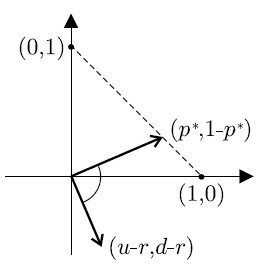
<figcaption>
รูปที่ 9.5 แสดงความหมายเชิงเรขาของความน่าจะเป็นความเป็นกลางต่อความเสี่ยง p*
</figcaption>
</figure>

<!-- PDF page 313: independently reviewed -->

และหากพิจารณาอัตราดอกเบี้ย <math display="inline" xmlns="http://www.w3.org/1998/Math/MathML"><semantics><mi>r</mi><annotation encoding="application/x-tex">r</annotation></semantics></math> ของการลงทุนที่ไม่มีความเสี่ยงเป็นจุดหมุนของคานจะได้ว่า <math display="inline" xmlns="http://www.w3.org/1998/Math/MathML"><semantics><msup><mi>p</mi><mo>*</mo></msup><annotation encoding="application/x-tex">p^*</annotation></semantics></math> และ <math display="inline" xmlns="http://www.w3.org/1998/Math/MathML"><semantics><mrow><mn>1</mn><mo>−</mo><msup><mi>p</mi><mo>*</mo></msup></mrow><annotation encoding="application/x-tex">1-p^*</annotation></semantics></math> เปรียบเสมือนแรงที่มีทิศทางตรงข้ามกันมากระทำต่อปลายคานที่มีมวล <math display="inline" xmlns="http://www.w3.org/1998/Math/MathML"><semantics><mi>u</mi><annotation encoding="application/x-tex">u</annotation></semantics></math> และ <math display="inline" xmlns="http://www.w3.org/1998/Math/MathML"><semantics><mi>d</mi><annotation encoding="application/x-tex">d</annotation></semantics></math> ตามลำดับเพื่อให้คานอยู่ในสภาวะสมดุล

<figure class="source-figure">
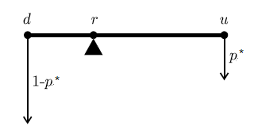
<figcaption>
รูปที่ 9.6 แสดงความหมายเชิงเปรียบเทียบ p* กับคานสมดุล
</figcaption>
</figure>
<h2 id="สมบตมารทงเกล">9.6 สมบัติมาร์ทิงเกล</h2>

แนวคิดของมาร์ทิงเกล (Martingale) มาจากการพิจารณาเกมที่ยุติธรรมเกมหนึ่งซึ่งหมายถึงเกมที่ค่าคาดหวังของการชนะ (แพ้) จากการเล่นเกมแต่ละครั้งเป็นศูนย์ โดยสมมติว่าผู้เล่น (Player) เล่นเกมหลายครั้ง โดยที่ทั้ง<em>การเดิมพันและผลของการเดิมพัน</em>ของผู้เล่นผู้นั้นไม่ต้องการความเป็นอิสระ แต่การเล่นแต่ละครั้ง<em>ยุติธรรม</em> ถ้าให้ <math display="inline" xmlns="http://www.w3.org/1998/Math/MathML"><semantics><msub><mi>Z</mi><mi>i</mi></msub><annotation encoding="application/x-tex">Z_i</annotation></semantics></math> แทนผลของการเดิมพันครั้งที่ <math display="inline" xmlns="http://www.w3.org/1998/Math/MathML"><semantics><mi>i</mi><annotation encoding="application/x-tex">i</annotation></semantics></math> และ <math display="inline" xmlns="http://www.w3.org/1998/Math/MathML"><semantics><msub><mi>X</mi><mi>i</mi></msub><annotation encoding="application/x-tex">X_i</annotation></semantics></math> เป็นเงินเดิมพันคงเหลือหลังเกมที่ <math display="inline" xmlns="http://www.w3.org/1998/Math/MathML"><semantics><mi>i</mi><annotation encoding="application/x-tex">i</annotation></semantics></math> ความยุติธรรมจะยืนยันได้ว่า ค่าคาดหวังของเงินเดิมพันคงเหลือครั้งต่อไป <math display="inline" xmlns="http://www.w3.org/1998/Math/MathML"><semantics><msub><mi>X</mi><mrow><mi>i</mi><mo>+</mo><mn>1</mn></mrow></msub><annotation encoding="application/x-tex">X_{i+1}</annotation></semantics></math> เมื่อทราบผลการเดิมพันก่อนหน้านี้ (นั่นคือทราบ <math display="inline" xmlns="http://www.w3.org/1998/Math/MathML"><semantics><msub><mi>Z</mi><mn>1</mn></msub><annotation encoding="application/x-tex">Z_1</annotation></semantics></math>, <math display="inline" xmlns="http://www.w3.org/1998/Math/MathML"><semantics><msub><mi>Z</mi><mn>2</mn></msub><annotation encoding="application/x-tex">Z_2</annotation></semantics></math>, …, <math display="inline" xmlns="http://www.w3.org/1998/Math/MathML"><semantics><msub><mi>Z</mi><mi>i</mi></msub><annotation encoding="application/x-tex">Z_i</annotation></semantics></math>) จะเท่ากับเงินเดิมพันคงเหลือหลังเกมครั้งที่ <math display="inline" xmlns="http://www.w3.org/1998/Math/MathML"><semantics><mi>i</mi><annotation encoding="application/x-tex">i</annotation></semantics></math> (<math display="inline" xmlns="http://www.w3.org/1998/Math/MathML"><semantics><msub><mi>X</mi><mi>i</mi></msub><annotation encoding="application/x-tex">X_i</annotation></semantics></math>) นั่นคือ <math display="inline" xmlns="http://www.w3.org/1998/Math/MathML"><semantics><mrow><mi>E</mi><mo stretchy="false" form="prefix">[</mo><msub><mi>X</mi><mrow><mi>i</mi><mo>+</mo><mn>1</mn></mrow></msub><mo>∣</mo><msub><mi>Z</mi><mn>1</mn></msub><mi>.</mi><mi>.</mi><mi>.</mi><msub><mi>Z</mi><mi>i</mi></msub><mo stretchy="false" form="postfix">]</mo><mo>=</mo><msub><mi>X</mi><mi>i</mi></msub></mrow><annotation encoding="application/x-tex">E[X_{i+1}\mid Z_1...Z_i]=X_i</annotation></semantics></math> โดยเรียกลำดับ <math display="inline" xmlns="http://www.w3.org/1998/Math/MathML"><semantics><mrow><mo stretchy="false" form="prefix">{</mo><msub><mi>X</mi><mi>i</mi></msub><mo stretchy="false" form="postfix">}</mo></mrow><annotation encoding="application/x-tex">\{X_i\}</annotation></semantics></math> ที่มีสมบัตินี้ว่า <em>มาร์ทิงเกล</em>

<strong>บทนิยาม 9.25</strong> ให้ <math display="inline" xmlns="http://www.w3.org/1998/Math/MathML"><semantics><mrow><mo stretchy="false" form="prefix">{</mo><msub><mi>Z</mi><mi>i</mi></msub><msubsup><mo stretchy="false" form="postfix">}</mo><mrow><mi>i</mi><mo>=</mo><mn>1</mn></mrow><mi>n</mi></msubsup></mrow><annotation encoding="application/x-tex">\{Z_i\}_{i=1}^n</annotation></semantics></math> และ <math display="inline" xmlns="http://www.w3.org/1998/Math/MathML"><semantics><mrow><mo stretchy="false" form="prefix">{</mo><msub><mi>X</mi><mi>i</mi></msub><msubsup><mo stretchy="false" form="postfix">}</mo><mrow><mi>i</mi><mo>=</mo><mn>1</mn></mrow><mi>n</mi></msubsup></mrow><annotation encoding="application/x-tex">\{X_i\}_{i=1}^n</annotation></semantics></math> เป็นลำดับของตัวแปรเชิงสุ่มบนปริภูมิความน่าจะเป็น <math display="inline" xmlns="http://www.w3.org/1998/Math/MathML"><semantics><mi mathvariant="normal">Ω</mi><annotation encoding="application/x-tex">\Omega</annotation></semantics></math> จะเรียก <math display="inline" xmlns="http://www.w3.org/1998/Math/MathML"><semantics><mrow><mo stretchy="false" form="prefix">{</mo><msub><mi>X</mi><mi>i</mi></msub><msubsup><mo stretchy="false" form="postfix">}</mo><mrow><mi>i</mi><mo>=</mo><mn>1</mn></mrow><mi>n</mi></msubsup></mrow><annotation encoding="application/x-tex">\{X_i\}_{i=1}^n</annotation></semantics></math> ว่า <em>มาร์ทิงเกล</em> ที่เกี่ยวข้องกับ <math display="inline" xmlns="http://www.w3.org/1998/Math/MathML"><semantics><mrow><mo stretchy="false" form="prefix">{</mo><msub><mi>Z</mi><mi>i</mi></msub><msubsup><mo stretchy="false" form="postfix">}</mo><mrow><mi>i</mi><mo>=</mo><mn>1</mn></mrow><mi>n</mi></msubsup></mrow><annotation encoding="application/x-tex">\{Z_i\}_{i=1}^n</annotation></semantics></math> ถ้า <math display="inline" xmlns="http://www.w3.org/1998/Math/MathML"><semantics><mrow><mi>E</mi><mo stretchy="false" form="prefix">[</mo><msub><mi>X</mi><mrow><mi>i</mi><mo>+</mo><mn>1</mn></mrow></msub><mo>∣</mo><msub><mi>Z</mi><mn>1</mn></msub><mi>.</mi><mi>.</mi><mi>.</mi><msub><mi>Z</mi><mi>i</mi></msub><mo stretchy="false" form="postfix">]</mo><mo>=</mo><msub><mi>X</mi><mi>i</mi></msub></mrow><annotation encoding="application/x-tex">E[X_{i+1}\mid Z_1...Z_i]=X_i</annotation></semantics></math> และเรียกลำดับ <math display="inline" xmlns="http://www.w3.org/1998/Math/MathML"><semantics><mrow><mo stretchy="false" form="prefix">{</mo><msub><mi>Y</mi><mrow><mi>i</mi><mo>+</mo><mn>1</mn></mrow></msub><mo>=</mo><msub><mi>X</mi><mrow><mi>i</mi><mo>+</mo><mn>1</mn></mrow></msub><mo>−</mo><msub><mi>X</mi><mi>i</mi></msub><mo stretchy="false" form="postfix">}</mo></mrow><annotation encoding="application/x-tex">\{Y_{i+1}=X_{i+1}-X_i\}</annotation></semantics></math> ว่า <em>ลำดับของผลต่างมาร์ทิงเกล</em> (Martingale Difference Sequence) ซึ่ง <math display="inline" xmlns="http://www.w3.org/1998/Math/MathML"><semantics><mrow><mi>E</mi><mo stretchy="false" form="prefix">[</mo><msub><mi>Y</mi><mrow><mi>i</mi><mo>+</mo><mn>1</mn></mrow></msub><mo>∣</mo><msub><mi>Z</mi><mn>1</mn></msub><mi>.</mi><mi>.</mi><mi>.</mi><msub><mi>Z</mi><mi>i</mi></msub><mo stretchy="false" form="postfix">]</mo><mo>=</mo><mn>0</mn></mrow><annotation encoding="application/x-tex">E[Y_{i+1}\mid Z_1...Z_i]=0</annotation></semantics></math>

ต่อไปจะอธิบายมาร์ทิงเกลสำหรับราคาหุ้น <math display="inline" xmlns="http://www.w3.org/1998/Math/MathML"><semantics><mrow><mi>S</mi><mo stretchy="false" form="prefix">(</mo><mi>n</mi><mo stretchy="false" form="postfix">)</mo></mrow><annotation encoding="application/x-tex">S(n)</annotation></semantics></math> จากทฤษฎีบท 9.23 ถ้าให้ <math display="inline" xmlns="http://www.w3.org/1998/Math/MathML"><semantics><msup><mi>p</mi><mo>*</mo></msup><annotation encoding="application/x-tex">p^*</annotation></semantics></math> เป็นความน่าจะเป็นความเป็นกลางต่อความเสี่ยง จะได้ว่าค่าคาดหวังของราคา <math display="inline" xmlns="http://www.w3.org/1998/Math/MathML"><semantics><mrow><mi>S</mi><mo stretchy="false" form="prefix">(</mo><mi>n</mi><mo stretchy="false" form="postfix">)</mo></mrow><annotation encoding="application/x-tex">S(n)</annotation></semantics></math> เท่ากับมูลค่าสะสมของเงิน <math display="inline" xmlns="http://www.w3.org/1998/Math/MathML"><semantics><mrow><mi>S</mi><mo stretchy="false" form="prefix">(</mo><mn>0</mn><mo stretchy="false" form="postfix">)</mo></mrow><annotation encoding="application/x-tex">S(0)</annotation></semantics></math> บาทสะสมด้วยอัตราดอกเบี้ยที่ปราศจากความเสี่ยง <math display="inline" xmlns="http://www.w3.org/1998/Math/MathML"><semantics><mi>r</mi><annotation encoding="application/x-tex">r</annotation></semantics></math> เป็นเวลา <math display="inline" xmlns="http://www.w3.org/1998/Math/MathML"><semantics><mi>n</mi><annotation encoding="application/x-tex">n</annotation></semantics></math> คาบ

<!-- PDF page 314: independently reviewed -->

นั่นคือ <math display="inline" xmlns="http://www.w3.org/1998/Math/MathML"><semantics><mrow><msup><mi>E</mi><mo>*</mo></msup><mo stretchy="false" form="prefix">[</mo><mi>S</mi><mo stretchy="false" form="prefix">(</mo><mi>n</mi><mo stretchy="false" form="postfix">)</mo><mo stretchy="false" form="postfix">]</mo><mo>=</mo><mi>S</mi><mo stretchy="false" form="prefix">(</mo><mn>0</mn><mo stretchy="false" form="postfix">)</mo><mo stretchy="false" form="prefix">(</mo><mn>1</mn><mo>+</mo><mi>r</mi><msup><mo stretchy="false" form="postfix">)</mo><mi>n</mi></msup><mo>=</mo><mi>S</mi><mo stretchy="false" form="prefix">(</mo><mn>0</mn><mo stretchy="false" form="postfix">)</mo><msup><mi>e</mi><mrow><mi>δ</mi><mi>n</mi></mrow></msup></mrow><annotation encoding="application/x-tex">E^*[S(n)]=S(0)(1+r)^n=S(0)e^{\delta n}</annotation></semantics></math> (9.44)

โดยที่ <math display="inline" xmlns="http://www.w3.org/1998/Math/MathML"><semantics><mrow><mi>r</mi><mo>=</mo><msup><mi>E</mi><mo>*</mo></msup><mo stretchy="false" form="prefix">[</mo><mi>K</mi><mo stretchy="false" form="prefix">(</mo><mi>n</mi><mo stretchy="false" form="postfix">)</mo><mo stretchy="false" form="postfix">]</mo></mrow><annotation encoding="application/x-tex">r=E^*[K(n)]</annotation></semantics></math> และ <math display="inline" xmlns="http://www.w3.org/1998/Math/MathML"><semantics><mi>δ</mi><annotation encoding="application/x-tex">\delta</annotation></semantics></math> เป็นอัตราดอกเบี้ยทบต้นต่อเนื่องสมมูลกับ <math display="inline" xmlns="http://www.w3.org/1998/Math/MathML"><semantics><mi>r</mi><annotation encoding="application/x-tex">r</annotation></semantics></math>

เพื่อให้สามารถเข้าใจแนวคิดของมาร์ทิงเกลได้ง่ายขึ้นขอให้ศึกษาจากตัวอย่างต่อไปนี้

<strong>ตัวอย่างที่ 9.13</strong> พิจารณาแบบจำลองต้นไม้ทวิภาค 2 คาบเวลา เมื่อกำหนด <math display="inline" xmlns="http://www.w3.org/1998/Math/MathML"><semantics><mrow><mi>S</mi><mo stretchy="false" form="prefix">(</mo><mn>0</mn><mo stretchy="false" form="postfix">)</mo><mo>=</mo><mn>100</mn></mrow><annotation encoding="application/x-tex">S(0)=100</annotation></semantics></math> บาท, <math display="inline" xmlns="http://www.w3.org/1998/Math/MathML"><semantics><mrow><mi>u</mi><mo>=</mo><mn>0.2</mn></mrow><annotation encoding="application/x-tex">u=0.2</annotation></semantics></math>, <math display="inline" xmlns="http://www.w3.org/1998/Math/MathML"><semantics><mrow><mi>d</mi><mo>=</mo><mi>−</mi><mn>0.1</mn></mrow><annotation encoding="application/x-tex">d=-0.1</annotation></semantics></math> และ <math display="inline" xmlns="http://www.w3.org/1998/Math/MathML"><semantics><mrow><mi>r</mi><mo>=</mo><mn>0.1</mn></mrow><annotation encoding="application/x-tex">r=0.1</annotation></semantics></math> โดยสูตร (9.43) คำนวณ <math display="inline" xmlns="http://www.w3.org/1998/Math/MathML"><semantics><mrow><msup><mi>p</mi><mo>*</mo></msup><mo>=</mo><mstyle displaystyle="true"><mfrac><mn>2</mn><mn>3</mn></mfrac></mstyle></mrow><annotation encoding="application/x-tex">p^*=\dfrac23</annotation></semantics></math> ซึ่งเป็นความน่าจะเป็นความเป็นกลางต่อความเสี่ยง จากข้อมูลที่กำหนดให้เขียนเป็นต้นไม้ทวิภาค ได้ดังแผนภาพ

<figure class="source-figure">
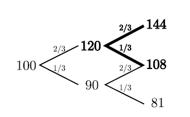
<figcaption>
รูปที่ 9.7 แสดงต้นไม้ทวิภาคตามตัวอย่าง 9. 13
</figcaption>
</figure>

เมื่อพิจารณาค่าของ <math display="inline" xmlns="http://www.w3.org/1998/Math/MathML"><semantics><mrow><msup><mi>E</mi><mo>*</mo></msup><mo stretchy="false" form="prefix">[</mo><mi>S</mi><mo stretchy="false" form="prefix">(</mo><mn>2</mn><mo stretchy="false" form="postfix">)</mo><mo>∣</mo><mi>S</mi><mo stretchy="false" form="prefix">(</mo><mn>1</mn><mo stretchy="false" form="postfix">)</mo><mo stretchy="false" form="postfix">]</mo></mrow><annotation encoding="application/x-tex">E^*[S(2)\mid S(1)]</annotation></semantics></math> เมื่อกำหนด <math display="inline" xmlns="http://www.w3.org/1998/Math/MathML"><semantics><mrow><mi>S</mi><mo stretchy="false" form="prefix">(</mo><mn>1</mn><mo stretchy="false" form="postfix">)</mo><mo>=</mo><mn>120</mn></mrow><annotation encoding="application/x-tex">S(1)=120</annotation></semantics></math> หรือ <math display="inline" xmlns="http://www.w3.org/1998/Math/MathML"><semantics><mrow><mi>S</mi><mo stretchy="false" form="prefix">(</mo><mn>1</mn><mo stretchy="false" form="postfix">)</mo><mo>=</mo><mn>90</mn></mrow><annotation encoding="application/x-tex">S(1)=90</annotation></semantics></math> จากรูปที่ 9.7 และ จากบทนิยามของค่าคาดหวังแบบมีเงื่อนไข จะได้ <math display="inline" xmlns="http://www.w3.org/1998/Math/MathML"><semantics><mrow><msup><mi>E</mi><mo>*</mo></msup><mo stretchy="false" form="prefix">[</mo><mi>S</mi><mo stretchy="false" form="prefix">(</mo><mn>2</mn><mo stretchy="false" form="postfix">)</mo><mo>∣</mo><mi>S</mi><mo stretchy="false" form="prefix">(</mo><mn>1</mn><mo stretchy="false" form="postfix">)</mo><mo stretchy="false" form="postfix">]</mo></mrow><annotation encoding="application/x-tex">E^*[S(2)\mid S(1)]</annotation></semantics></math> ดังนี้

ถ้า <math display="inline" xmlns="http://www.w3.org/1998/Math/MathML"><semantics><mrow><mi>S</mi><mo stretchy="false" form="prefix">(</mo><mn>1</mn><mo stretchy="false" form="postfix">)</mo><mo>=</mo><mn>120</mn></mrow><annotation encoding="application/x-tex">S(1)=120</annotation></semantics></math> จะได้ว่า

<math display="block" xmlns="http://www.w3.org/1998/Math/MathML"><semantics><mrow><msup><mi>E</mi><mo>*</mo></msup><mo stretchy="false" form="prefix">[</mo><mi>S</mi><mo stretchy="false" form="prefix">(</mo><mn>2</mn><mo stretchy="false" form="postfix">)</mo><mo>∣</mo><mi>S</mi><mo stretchy="false" form="prefix">(</mo><mn>1</mn><mo stretchy="false" form="postfix">)</mo><mo>=</mo><mn>120</mn><mo stretchy="false" form="postfix">]</mo><mo>=</mo><munder><mo>∑</mo><mi>ω</mi></munder><mi>ω</mi><mi>p</mi><mo stretchy="false" form="prefix">(</mo><mi>S</mi><mo stretchy="false" form="prefix">(</mo><mn>2</mn><mo stretchy="false" form="postfix">)</mo><mo>=</mo><mi>ω</mi><mo>∣</mo><mi>S</mi><mo stretchy="false" form="prefix">(</mo><mn>1</mn><mo stretchy="false" form="postfix">)</mo><mo>=</mo><mn>120</mn><mo stretchy="false" form="postfix">)</mo></mrow><annotation encoding="application/x-tex">E^*[S(2)\mid S(1)=120]=\sum_\omega\omega p(S(2)=\omega\mid S(1)=120)</annotation></semantics></math>

<math display="block" xmlns="http://www.w3.org/1998/Math/MathML"><semantics><mrow><mo>=</mo><mn>144</mn><mrow><mo stretchy="true" form="prefix">(</mo><mfrac><mn>2</mn><mn>3</mn></mfrac><mo stretchy="true" form="postfix">)</mo></mrow><mo>+</mo><mn>108</mn><mrow><mo stretchy="true" form="prefix">(</mo><mfrac><mn>1</mn><mn>3</mn></mfrac><mo stretchy="true" form="postfix">)</mo></mrow><mo>=</mo><mn>132</mn><mo>=</mo><mi>S</mi><mo stretchy="false" form="prefix">(</mo><mn>1</mn><mo stretchy="false" form="postfix">)</mo><mo stretchy="false" form="prefix">(</mo><mn>1</mn><mo>+</mo><mi>r</mi><mo stretchy="false" form="postfix">)</mo><mspace width="2.0em"></mspace><mo stretchy="false" form="prefix">(</mo><mn>1</mn><mo stretchy="false" form="postfix">)</mo></mrow><annotation encoding="application/x-tex">=144\left(\frac23\right)+108\left(\frac13\right)=132=S(1)(1+r)\qquad(1)</annotation></semantics></math>

ในทำนองเดียวกัน ถ้า <math display="inline" xmlns="http://www.w3.org/1998/Math/MathML"><semantics><mrow><mi>S</mi><mo stretchy="false" form="prefix">(</mo><mn>1</mn><mo stretchy="false" form="postfix">)</mo><mo>=</mo><mn>90</mn></mrow><annotation encoding="application/x-tex">S(1)=90</annotation></semantics></math> จะได้ว่า

<math display="block" xmlns="http://www.w3.org/1998/Math/MathML"><semantics><mrow><msup><mi>E</mi><mo>*</mo></msup><mo stretchy="false" form="prefix">[</mo><mi>S</mi><mo stretchy="false" form="prefix">(</mo><mn>2</mn><mo stretchy="false" form="postfix">)</mo><mo>∣</mo><mi>S</mi><mo stretchy="false" form="prefix">(</mo><mn>1</mn><mo stretchy="false" form="postfix">)</mo><mo>=</mo><mn>90</mn><mo stretchy="false" form="postfix">]</mo><mo>=</mo><munder><mo>∑</mo><mi>ω</mi></munder><mi>ω</mi><mi>p</mi><mo stretchy="false" form="prefix">(</mo><mi>S</mi><mo stretchy="false" form="prefix">(</mo><mn>2</mn><mo stretchy="false" form="postfix">)</mo><mo>=</mo><mi>ω</mi><mo>∣</mo><mi>S</mi><mo stretchy="false" form="prefix">(</mo><mn>1</mn><mo stretchy="false" form="postfix">)</mo><mo>=</mo><mn>90</mn><mo stretchy="false" form="postfix">)</mo></mrow><annotation encoding="application/x-tex">E^*[S(2)\mid S(1)=90]=\sum_\omega\omega p(S(2)=\omega\mid S(1)=90)</annotation></semantics></math>

<math display="block" xmlns="http://www.w3.org/1998/Math/MathML"><semantics><mrow><mo>=</mo><mn>108</mn><mrow><mo stretchy="true" form="prefix">(</mo><mfrac><mn>2</mn><mn>3</mn></mfrac><mo stretchy="true" form="postfix">)</mo></mrow><mo>+</mo><mn>81</mn><mrow><mo stretchy="true" form="prefix">(</mo><mfrac><mn>1</mn><mn>3</mn></mfrac><mo stretchy="true" form="postfix">)</mo></mrow><mo>=</mo><mn>99</mn><mo>=</mo><mi>S</mi><mo stretchy="false" form="prefix">(</mo><mn>1</mn><mo stretchy="false" form="postfix">)</mo><mo stretchy="false" form="prefix">(</mo><mn>1</mn><mo>+</mo><mi>r</mi><mo stretchy="false" form="postfix">)</mo><mspace width="2.0em"></mspace><mo stretchy="false" form="prefix">(</mo><mn>2</mn><mo stretchy="false" form="postfix">)</mo></mrow><annotation encoding="application/x-tex">=108\left(\frac23\right)+81\left(\frac13\right)=99=S(1)(1+r)\qquad(2)</annotation></semantics></math>

โดย (1) และ (2) สรุปได้ว่า

<math display="block" xmlns="http://www.w3.org/1998/Math/MathML"><semantics><mrow><msup><mi>E</mi><mo>*</mo></msup><mo stretchy="false" form="prefix">[</mo><mi>S</mi><mo stretchy="false" form="prefix">(</mo><mn>2</mn><mo stretchy="false" form="postfix">)</mo><mo>∣</mo><mi>S</mi><mo stretchy="false" form="prefix">(</mo><mn>1</mn><mo stretchy="false" form="postfix">)</mo><mo stretchy="false" form="postfix">]</mo><mo>=</mo><mi>S</mi><mo stretchy="false" form="prefix">(</mo><mn>1</mn><mo stretchy="false" form="postfix">)</mo><mo stretchy="false" form="prefix">(</mo><mn>1</mn><mo>+</mo><mi>r</mi><mo stretchy="false" form="postfix">)</mo><mspace width="2.0em"></mspace><mo stretchy="false" form="prefix">(</mo><mn>3</mn><mo stretchy="false" form="postfix">)</mo></mrow><annotation encoding="application/x-tex">E^*[S(2)\mid S(1)]=S(1)(1+r)\qquad(3)</annotation></semantics></math>

<!-- PDF page 315: independently reviewed -->

เมื่อคูณ <math display="inline" xmlns="http://www.w3.org/1998/Math/MathML"><semantics><mrow><mo stretchy="false" form="prefix">(</mo><mn>1</mn><mo>+</mo><mi>r</mi><msup><mo stretchy="false" form="postfix">)</mo><mrow><mi>−</mi><mn>2</mn></mrow></msup></mrow><annotation encoding="application/x-tex">(1+r)^{-2}</annotation></semantics></math> ตลอด (3) จะได้

<math display="block" xmlns="http://www.w3.org/1998/Math/MathML"><semantics><mrow><msup><mi>E</mi><mo>*</mo></msup><mo stretchy="false" form="prefix">[</mo><mi>S</mi><mo stretchy="false" form="prefix">(</mo><mn>2</mn><mo stretchy="false" form="postfix">)</mo><mo stretchy="false" form="prefix">(</mo><mn>1</mn><mo>+</mo><mi>r</mi><msup><mo stretchy="false" form="postfix">)</mo><mrow><mi>−</mi><mn>2</mn></mrow></msup><mo>∣</mo><mi>S</mi><mo stretchy="false" form="prefix">(</mo><mn>1</mn><mo stretchy="false" form="postfix">)</mo><mo stretchy="false" form="postfix">]</mo><mo>=</mo><mi>S</mi><mo stretchy="false" form="prefix">(</mo><mn>1</mn><mo stretchy="false" form="postfix">)</mo><mo stretchy="false" form="prefix">(</mo><mn>1</mn><mo>+</mo><mi>r</mi><msup><mo stretchy="false" form="postfix">)</mo><mrow><mi>−</mi><mn>1</mn></mrow></msup><mspace width="2.0em"></mspace><mo stretchy="false" form="prefix">(</mo><mn>4</mn><mo stretchy="false" form="postfix">)</mo></mrow><annotation encoding="application/x-tex">E^*[S(2)(1+r)^{-2}\mid S(1)]=S(1)(1+r)^{-1}\qquad(4)</annotation></semantics></math>

นั่นคือ <math display="inline" xmlns="http://www.w3.org/1998/Math/MathML"><semantics><mrow><msup><mi>E</mi><mo>*</mo></msup><mo stretchy="false" form="prefix">[</mo><mover><mi>S</mi><mo accent="true">̃</mo></mover><mo stretchy="false" form="prefix">(</mo><mn>2</mn><mo stretchy="false" form="postfix">)</mo><mo>∣</mo><mi>S</mi><mo stretchy="false" form="prefix">(</mo><mn>1</mn><mo stretchy="false" form="postfix">)</mo><mo stretchy="false" form="postfix">]</mo><mo>=</mo><mover><mi>S</mi><mo accent="true">̃</mo></mover><mo stretchy="false" form="prefix">(</mo><mn>1</mn><mo stretchy="false" form="postfix">)</mo></mrow><annotation encoding="application/x-tex">E^*[\widetilde S(2)\mid S(1)]=\widetilde S(1)</annotation></semantics></math> (5)

เมื่อ <math display="inline" xmlns="http://www.w3.org/1998/Math/MathML"><semantics><mrow><mover><mi>S</mi><mo accent="true">̃</mo></mover><mo stretchy="false" form="prefix">(</mo><mi>n</mi><mo stretchy="false" form="postfix">)</mo><mo>=</mo><mi>S</mi><mo stretchy="false" form="prefix">(</mo><mi>n</mi><mo stretchy="false" form="postfix">)</mo><mo stretchy="false" form="prefix">(</mo><mn>1</mn><mo>+</mo><mi>r</mi><msup><mo stretchy="false" form="postfix">)</mo><mrow><mi>−</mi><mi>n</mi></mrow></msup></mrow><annotation encoding="application/x-tex">\widetilde S(n)=S(n)(1+r)^{-n}</annotation></semantics></math>

เรียกความสัมพันธ์ตามสมการ (5) ว่า <em>สมบัติมาร์ทิงเกล</em> ของราคาหุ้น □

แนวคิดจากตัวอย่างที่ 9.13 ทำให้ทราบว่าเมื่อ คาบเวลาที่ 1 ได้ผ่านไปแล้ว และทราบราคาของหุ้นเท่ากับ <math display="inline" xmlns="http://www.w3.org/1998/Math/MathML"><semantics><mrow><mi>S</mi><mo stretchy="false" form="prefix">(</mo><mn>1</mn><mo stretchy="false" form="postfix">)</mo></mrow><annotation encoding="application/x-tex">S(1)</annotation></semantics></math> แล้ว ณ คาบเวลาที่ 2 ซึ่งเป็นเวลาในอนาคต (ราคาคาหุ้น <math display="inline" xmlns="http://www.w3.org/1998/Math/MathML"><semantics><mrow><mi>S</mi><mo stretchy="false" form="prefix">(</mo><mn>2</mn><mo stretchy="false" form="postfix">)</mo></mrow><annotation encoding="application/x-tex">S(2)</annotation></semantics></math> ยังไม่ทราบค่า) ค่าคาดหวังความเป็นกลางต่อความเสี่ยงของราคาคาหุ้น <math display="inline" xmlns="http://www.w3.org/1998/Math/MathML"><semantics><mrow><mi>S</mi><mo stretchy="false" form="prefix">(</mo><mn>2</mn><mo stretchy="false" form="postfix">)</mo></mrow><annotation encoding="application/x-tex">S(2)</annotation></semantics></math> จะมีความสัมพันธ์อย่างไรกับราคาหุ้น <math display="inline" xmlns="http://www.w3.org/1998/Math/MathML"><semantics><mrow><mi>S</mi><mo stretchy="false" form="prefix">(</mo><mn>1</mn><mo stretchy="false" form="postfix">)</mo></mrow><annotation encoding="application/x-tex">S(1)</annotation></semantics></math> ภายใต้แบบจำลองราคาทวิภาค

แนวคิดดังกล่าวนำไปสู่ทฤษฎีบท 9.26 และสมบัติมาทิงเกลของราคาหุ้น นั่นคือ สำหรับคาบเวลาที่ <math display="inline" xmlns="http://www.w3.org/1998/Math/MathML"><semantics><mi>n</mi><annotation encoding="application/x-tex">n</annotation></semantics></math> ใดๆ หากสมมติว่า คาบเวลาที่ <math display="inline" xmlns="http://www.w3.org/1998/Math/MathML"><semantics><mi>n</mi><annotation encoding="application/x-tex">n</annotation></semantics></math> ได้ผ่านไปแล้ว และทราบราคาของหุ้น <math display="inline" xmlns="http://www.w3.org/1998/Math/MathML"><semantics><mrow><mi>S</mi><mo stretchy="false" form="prefix">(</mo><mi>n</mi><mo stretchy="false" form="postfix">)</mo></mrow><annotation encoding="application/x-tex">S(n)</annotation></semantics></math> เราต้องการทราบว่าค่าคาดหวังความเป็นกลางต่อความเสี่ยงของราคา <math display="inline" xmlns="http://www.w3.org/1998/Math/MathML"><semantics><mrow><mi>S</mi><mo stretchy="false" form="prefix">(</mo><mi>n</mi><mo>+</mo><mn>1</mn><mo stretchy="false" form="postfix">)</mo></mrow><annotation encoding="application/x-tex">S(n+1)</annotation></semantics></math> มีความสัมพันธ์อย่างไรกับราคาหุ้น <math display="inline" xmlns="http://www.w3.org/1998/Math/MathML"><semantics><mrow><mi>S</mi><mo stretchy="false" form="prefix">(</mo><mi>n</mi><mo stretchy="false" form="postfix">)</mo></mrow><annotation encoding="application/x-tex">S(n)</annotation></semantics></math>

<strong>ทฤษฎีบท 9.26</strong> กำหนดให้ <math display="inline" xmlns="http://www.w3.org/1998/Math/MathML"><semantics><mrow><mi>S</mi><mo stretchy="false" form="prefix">(</mo><mi>n</mi><mo stretchy="false" form="postfix">)</mo></mrow><annotation encoding="application/x-tex">S(n)</annotation></semantics></math> เป็นราคาหุ้น ซึ่งเป็นราคาที่ทราบ ที่เวลา <math display="inline" xmlns="http://www.w3.org/1998/Math/MathML"><semantics><mrow><mi>t</mi><mo>=</mo><mi>n</mi></mrow><annotation encoding="application/x-tex">t=n</annotation></semantics></math> ค่าคาดหวังความเป็นกลางต่อความเสี่ยงแบบมีเงื่อนไขของ <math display="inline" xmlns="http://www.w3.org/1998/Math/MathML"><semantics><mrow><mi>S</mi><mo stretchy="false" form="prefix">(</mo><mi>n</mi><mo>+</mo><mn>1</mn><mo stretchy="false" form="postfix">)</mo></mrow><annotation encoding="application/x-tex">S(n+1)</annotation></semantics></math> จะเท่ากับ

<math display="block" xmlns="http://www.w3.org/1998/Math/MathML"><semantics><mrow><msup><mi>E</mi><mo>*</mo></msup><mo stretchy="false" form="prefix">[</mo><mi>S</mi><mo stretchy="false" form="prefix">(</mo><mi>n</mi><mo>+</mo><mn>1</mn><mo stretchy="false" form="postfix">)</mo><mo>∣</mo><mi>S</mi><mo stretchy="false" form="prefix">(</mo><mi>n</mi><mo stretchy="false" form="postfix">)</mo><mo stretchy="false" form="postfix">]</mo><mo>=</mo><mi>S</mi><mo stretchy="false" form="prefix">(</mo><mi>n</mi><mo stretchy="false" form="postfix">)</mo><mo stretchy="false" form="prefix">(</mo><mn>1</mn><mo>+</mo><mi>r</mi><mo stretchy="false" form="postfix">)</mo><mspace width="2.0em"></mspace><mo stretchy="false" form="prefix">(</mo><mn>9.45</mn><mo stretchy="false" form="postfix">)</mo></mrow><annotation encoding="application/x-tex">E^*[S(n+1)\mid S(n)]=S(n)(1+r)\qquad(9.45)</annotation></semantics></math>

<strong>พิสูจน์</strong> สมมติให้ <math display="inline" xmlns="http://www.w3.org/1998/Math/MathML"><semantics><mrow><mi>S</mi><mo stretchy="false" form="prefix">(</mo><mi>n</mi><mo stretchy="false" form="postfix">)</mo><mo>=</mo><mi>x</mi></mrow><annotation encoding="application/x-tex">S(n)=x</annotation></semantics></math> เมื่อเวลาผ่านไป <math display="inline" xmlns="http://www.w3.org/1998/Math/MathML"><semantics><mi>n</mi><annotation encoding="application/x-tex">n</annotation></semantics></math> คาบ

<figure class="source-figure">
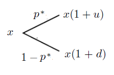
<figcaption>
รูปที่ 9.8 แสดงต้นไม้ทวิภาคแสดงราคาหลังจากทราบราคาที่เวลา n
</figcaption>
</figure>

จะได้ <math display="inline" xmlns="http://www.w3.org/1998/Math/MathML"><semantics><mrow><msup><mi>E</mi><mo>*</mo></msup><mo stretchy="false" form="prefix">[</mo><mi>S</mi><mo stretchy="false" form="prefix">(</mo><mi>n</mi><mo>+</mo><mn>1</mn><mo stretchy="false" form="postfix">)</mo><mo>∣</mo><mi>S</mi><mo stretchy="false" form="prefix">(</mo><mi>n</mi><mo stretchy="false" form="postfix">)</mo><mo>=</mo><mi>x</mi><mo stretchy="false" form="postfix">]</mo><mo>=</mo><msup><mi>p</mi><mo>*</mo></msup><mi>x</mi><mo stretchy="false" form="prefix">(</mo><mn>1</mn><mo>+</mo><mi>u</mi><mo stretchy="false" form="postfix">)</mo><mo>+</mo><mo stretchy="false" form="prefix">(</mo><mn>1</mn><mo>−</mo><msup><mi>p</mi><mo>*</mo></msup><mo stretchy="false" form="postfix">)</mo><mi>x</mi><mo stretchy="false" form="prefix">(</mo><mn>1</mn><mo>+</mo><mi>d</mi><mo stretchy="false" form="postfix">)</mo></mrow><annotation encoding="application/x-tex">E^*[S(n+1)\mid S(n)=x]=p^*x(1+u)+(1-p^*)x(1+d)</annotation></semantics></math>

<math display="block" xmlns="http://www.w3.org/1998/Math/MathML"><semantics><mrow><mo>=</mo><mi>x</mi><mrow><mo stretchy="true" form="prefix">(</mo><mn>1</mn><mo>+</mo><munder><munder><mrow><msup><mi>p</mi><mo>*</mo></msup><mi>u</mi><mo>+</mo><msup><mi>p</mi><mo>*</mo></msup><mo stretchy="false" form="prefix">(</mo><mn>1</mn><mo>+</mo><mi>d</mi><mo stretchy="false" form="postfix">)</mo></mrow><mo accent="true">⏟</mo></munder><mi>r</mi></munder><mo stretchy="true" form="postfix">)</mo></mrow><mspace width="2.0em"></mspace><mo stretchy="false" form="prefix">(</mo><mn>9.46</mn><mo stretchy="false" form="postfix">)</mo></mrow><annotation encoding="application/x-tex">=x\left(1+\underbrace{p^*u+p^*(1+d)}_{r}\right)\qquad(9.46)</annotation></semantics></math>

<!-- PDF page 316: independently reviewed -->

เนื่องจาก <math display="inline" xmlns="http://www.w3.org/1998/Math/MathML"><semantics><mrow><msup><mi>E</mi><mo>*</mo></msup><mo stretchy="false" form="prefix">[</mo><mi>K</mi><mo stretchy="false" form="prefix">(</mo><mn>1</mn><mo stretchy="false" form="postfix">)</mo><mo stretchy="false" form="postfix">]</mo><mo>=</mo><msup><mi>p</mi><mo>*</mo></msup><mi>u</mi><mo>+</mo><mo stretchy="false" form="prefix">(</mo><mn>1</mn><mo>−</mo><msup><mi>p</mi><mo>*</mo></msup><mo stretchy="false" form="postfix">)</mo><mi>d</mi><mo>=</mo><mi>r</mi></mrow><annotation encoding="application/x-tex">E^*[K(1)]=p^*u+(1-p^*)d=r</annotation></semantics></math>

ดังนั้น <math display="inline" xmlns="http://www.w3.org/1998/Math/MathML"><semantics><mrow><msup><mi>E</mi><mo>*</mo></msup><mo stretchy="false" form="prefix">[</mo><mi>S</mi><mo stretchy="false" form="prefix">(</mo><mi>n</mi><mo>+</mo><mn>1</mn><mo stretchy="false" form="postfix">)</mo><mo>∣</mo><mi>S</mi><mo stretchy="false" form="prefix">(</mo><mi>n</mi><mo stretchy="false" form="postfix">)</mo><mo>=</mo><mi>x</mi><mo stretchy="false" form="postfix">]</mo><mo>=</mo><mi>x</mi><mo stretchy="false" form="prefix">(</mo><mn>1</mn><mo>+</mo><mi>r</mi><mo stretchy="false" form="postfix">)</mo><mo>=</mo><mi>S</mi><mo stretchy="false" form="prefix">(</mo><mi>n</mi><mo stretchy="false" form="postfix">)</mo><mo stretchy="false" form="prefix">(</mo><mn>1</mn><mo>+</mo><mi>r</mi><mo stretchy="false" form="postfix">)</mo></mrow><annotation encoding="application/x-tex">E^*[S(n+1)\mid S(n)=x]=x(1+r)=S(n)(1+r)</annotation></semantics></math> □

ทฤษฎีบท 9.26 ทำให้ทราบว่าค่าคาดหวังความเป็นกลางต่อความเสี่ยงของราคา <math display="inline" xmlns="http://www.w3.org/1998/Math/MathML"><semantics><mrow><mi>S</mi><mo stretchy="false" form="prefix">(</mo><mi>n</mi><mo>+</mo><mn>1</mn><mo stretchy="false" form="postfix">)</mo></mrow><annotation encoding="application/x-tex">S(n+1)</annotation></semantics></math> เมื่อเวลา <math display="inline" xmlns="http://www.w3.org/1998/Math/MathML"><semantics><mi>n</mi><annotation encoding="application/x-tex">n</annotation></semantics></math> ได้ผ่านไปแล้ว (ทราบราคา <math display="inline" xmlns="http://www.w3.org/1998/Math/MathML"><semantics><mrow><mi>S</mi><mo stretchy="false" form="prefix">(</mo><mi>n</mi><mo stretchy="false" form="postfix">)</mo></mrow><annotation encoding="application/x-tex">S(n)</annotation></semantics></math> แล้ว) เท่ากับมูลค่าสะสมของราคา <math display="inline" xmlns="http://www.w3.org/1998/Math/MathML"><semantics><mrow><mi>S</mi><mo stretchy="false" form="prefix">(</mo><mi>n</mi><mo stretchy="false" form="postfix">)</mo></mrow><annotation encoding="application/x-tex">S(n)</annotation></semantics></math> ด้วยอัตราดอกเบี้ยปราศจากความเสี่ยง <math display="inline" xmlns="http://www.w3.org/1998/Math/MathML"><semantics><mi>r</mi><annotation encoding="application/x-tex">r</annotation></semantics></math> เป็นเวลา 1 คาบ

จากสมการ (9.45) ถ้าคูณด้วย <math display="inline" xmlns="http://www.w3.org/1998/Math/MathML"><semantics><mrow><mo stretchy="false" form="prefix">(</mo><mn>1</mn><mo>+</mo><mi>r</mi><msup><mo stretchy="false" form="postfix">)</mo><mrow><mi>−</mi><mo stretchy="false" form="prefix">(</mo><mi>n</mi><mo>+</mo><mn>1</mn><mo stretchy="false" form="postfix">)</mo></mrow></msup></mrow><annotation encoding="application/x-tex">(1+r)^{-(n+1)}</annotation></semantics></math> ทั้งสองข้างของสมการ จะได้

<math display="block" xmlns="http://www.w3.org/1998/Math/MathML"><semantics><mrow><msup><mi>E</mi><mo>*</mo></msup><mo stretchy="false" form="prefix">[</mo><mi>S</mi><mo stretchy="false" form="prefix">(</mo><mi>n</mi><mo>+</mo><mn>1</mn><mo stretchy="false" form="postfix">)</mo><mo stretchy="false" form="prefix">(</mo><mn>1</mn><mo>+</mo><mi>r</mi><msup><mo stretchy="false" form="postfix">)</mo><mrow><mi>−</mi><mo stretchy="false" form="prefix">(</mo><mi>n</mi><mo>+</mo><mn>1</mn><mo stretchy="false" form="postfix">)</mo></mrow></msup><mo>∣</mo><mi>S</mi><mo stretchy="false" form="prefix">(</mo><mi>n</mi><mo stretchy="false" form="postfix">)</mo><mo stretchy="false" form="postfix">]</mo><mo>=</mo><mi>S</mi><mo stretchy="false" form="prefix">(</mo><mi>n</mi><mo stretchy="false" form="postfix">)</mo><mo stretchy="false" form="prefix">(</mo><mn>1</mn><mo>+</mo><mi>r</mi><msup><mo stretchy="false" form="postfix">)</mo><mrow><mi>−</mi><mi>n</mi></mrow></msup><mspace width="2.0em"></mspace><mo stretchy="false" form="prefix">(</mo><mn>9.47</mn><mo stretchy="false" form="postfix">)</mo></mrow><annotation encoding="application/x-tex">E^*[S(n+1)(1+r)^{-(n+1)}\mid S(n)]=S(n)(1+r)^{-n}\qquad(9.47)</annotation></semantics></math>

กำหนดให้ <math display="inline" xmlns="http://www.w3.org/1998/Math/MathML"><semantics><mrow><mover><mi>S</mi><mo accent="true">̃</mo></mover><mo stretchy="false" form="prefix">(</mo><mi>n</mi><mo stretchy="false" form="postfix">)</mo><mo>=</mo><mi>S</mi><mo stretchy="false" form="prefix">(</mo><mi>n</mi><mo stretchy="false" form="postfix">)</mo><mo stretchy="false" form="prefix">(</mo><mn>1</mn><mo>+</mo><mi>r</mi><msup><mo stretchy="false" form="postfix">)</mo><mrow><mi>−</mi><mi>n</mi></mrow></msup></mrow><annotation encoding="application/x-tex">\widetilde S(n)=S(n)(1+r)^{-n}</annotation></semantics></math> จะได้

<math display="block" xmlns="http://www.w3.org/1998/Math/MathML"><semantics><mrow><msup><mi>E</mi><mo>*</mo></msup><mo stretchy="false" form="prefix">[</mo><mover><mi>S</mi><mo accent="true">̃</mo></mover><mo stretchy="false" form="prefix">(</mo><mi>n</mi><mo>+</mo><mn>1</mn><mo stretchy="false" form="postfix">)</mo><mo>∣</mo><mi>S</mi><mo stretchy="false" form="prefix">(</mo><mi>n</mi><mo stretchy="false" form="postfix">)</mo><mo stretchy="false" form="postfix">]</mo><mo>=</mo><mover><mi>S</mi><mo accent="true">̃</mo></mover><mo stretchy="false" form="prefix">(</mo><mi>n</mi><mo stretchy="false" form="postfix">)</mo><mspace width="2.0em"></mspace><mo stretchy="false" form="prefix">(</mo><mn>9.48</mn><mo stretchy="false" form="postfix">)</mo></mrow><annotation encoding="application/x-tex">E^*[\widetilde S(n+1)\mid S(n)]=\widetilde S(n)\qquad(9.48)</annotation></semantics></math>

ในที่นี้เรียก <math display="inline" xmlns="http://www.w3.org/1998/Math/MathML"><semantics><mrow><mover><mi>S</mi><mo accent="true">̃</mo></mover><mo stretchy="false" form="prefix">(</mo><mi>n</mi><mo stretchy="false" form="postfix">)</mo><mo>=</mo><mi>S</mi><mo stretchy="false" form="prefix">(</mo><mi>n</mi><mo stretchy="false" form="postfix">)</mo><mo stretchy="false" form="prefix">(</mo><mn>1</mn><mo>+</mo><mi>r</mi><msup><mo stretchy="false" form="postfix">)</mo><mrow><mi>−</mi><mi>n</mi></mrow></msup></mrow><annotation encoding="application/x-tex">\widetilde S(n)=S(n)(1+r)^{-n}</annotation></semantics></math> ว่า <em>ราคาหุ้นส่วนลด</em> (Discounted Stock Prices)

<strong>บทแทรก 9.27 (สมบัติของมาร์ทิงเกล)</strong> กำหนดให้ <math display="inline" xmlns="http://www.w3.org/1998/Math/MathML"><semantics><mrow><mover><mi>S</mi><mo accent="true">̃</mo></mover><mo stretchy="false" form="prefix">(</mo><mi>n</mi><mo stretchy="false" form="postfix">)</mo><mo>=</mo><mi>S</mi><mo stretchy="false" form="prefix">(</mo><mi>n</mi><mo stretchy="false" form="postfix">)</mo><mo stretchy="false" form="prefix">(</mo><mn>1</mn><mo>+</mo><mi>r</mi><msup><mo stretchy="false" form="postfix">)</mo><mrow><mi>−</mi><mi>n</mi></mrow></msup></mrow><annotation encoding="application/x-tex">\widetilde S(n)=S(n)(1+r)^{-n}</annotation></semantics></math> เป็นราคาหุ้นส่วนลด จะได้ว่า <math display="inline" xmlns="http://www.w3.org/1998/Math/MathML"><semantics><mrow><msup><mi>E</mi><mo>*</mo></msup><mo stretchy="false" form="prefix">[</mo><mover><mi>S</mi><mo accent="true">̃</mo></mover><mo stretchy="false" form="prefix">(</mo><mi>n</mi><mo>+</mo><mn>1</mn><mo stretchy="false" form="postfix">)</mo><mo>∣</mo><mi>S</mi><mo stretchy="false" form="prefix">(</mo><mi>n</mi><mo stretchy="false" form="postfix">)</mo><mo stretchy="false" form="postfix">]</mo><mo>=</mo><mover><mi>S</mi><mo accent="true">̃</mo></mover><mo stretchy="false" form="prefix">(</mo><mi>n</mi><mo stretchy="false" form="postfix">)</mo></mrow><annotation encoding="application/x-tex">E^*[\widetilde S(n+1)\mid S(n)]=\widetilde S(n)</annotation></semantics></math> สำหรับทุกๆ <math display="inline" xmlns="http://www.w3.org/1998/Math/MathML"><semantics><mrow><mi>n</mi><mo>=</mo><mn>0</mn><mo>,</mo><mn>1</mn><mo>,</mo><mn>2</mn><mo>,</mo><mi>.</mi><mi>.</mi><mi>.</mi></mrow><annotation encoding="application/x-tex">n=0,1,2,...</annotation></semantics></math>

จากบทแทรก 9.27 จะเห็นว่า ค่าคาดหวังของราคาหุ้นส่วนลดของคาบถัดไป (คาบเวลาที่ <math display="inline" xmlns="http://www.w3.org/1998/Math/MathML"><semantics><mrow><mi>n</mi><mo>+</mo><mn>1</mn></mrow><annotation encoding="application/x-tex">n+1</annotation></semantics></math>) เมื่อทราบราคาในปัจจุบัน (คาบเวลาที่ <math display="inline" xmlns="http://www.w3.org/1998/Math/MathML"><semantics><mi>n</mi><annotation encoding="application/x-tex">n</annotation></semantics></math>) จะเท่ากับราคาหุ้นส่วนลดในปัจจุบัน ซึ่งจะกล่าวว่า ราคาหุ้นส่วนลด <math display="inline" xmlns="http://www.w3.org/1998/Math/MathML"><semantics><mrow><mover><mi>S</mi><mo accent="true">̃</mo></mover><mo stretchy="false" form="prefix">(</mo><mi>n</mi><mo stretchy="false" form="postfix">)</mo></mrow><annotation encoding="application/x-tex">\widetilde S(n)</annotation></semantics></math> <em>ก่อกำเนิดมาร์ทิงเกล</em> ภายใต้ความน่าจะเป็นความเป็นกลางต่อความเสี่ยง <math display="inline" xmlns="http://www.w3.org/1998/Math/MathML"><semantics><msup><mi>p</mi><mo>*</mo></msup><annotation encoding="application/x-tex">p^*</annotation></semantics></math> และ กล่าวว่า <math display="inline" xmlns="http://www.w3.org/1998/Math/MathML"><semantics><msup><mi>p</mi><mo>*</mo></msup><annotation encoding="application/x-tex">p^*</annotation></semantics></math> เป็น<em>ความน่าจะเป็นมาร์ทิงเกล</em>

<strong>ตัวอย่างที่ 9.14</strong> กำหนดอัตราดอกเบี้ยของตราสารหนี้เท่ากับ 0.2 ต่อปี จงหาค่าคาดหวังความเป็นกลางต่อความเสี่ยงแบบมีเงื่อนไขของราคาหุ้น <math display="inline" xmlns="http://www.w3.org/1998/Math/MathML"><semantics><mrow><mi>S</mi><mo stretchy="false" form="prefix">(</mo><mn>3</mn><mo stretchy="false" form="postfix">)</mo></mrow><annotation encoding="application/x-tex">S(3)</annotation></semantics></math> เมื่อกำหนดราคาหุ้น <math display="inline" xmlns="http://www.w3.org/1998/Math/MathML"><semantics><mrow><mi>S</mi><mo stretchy="false" form="prefix">(</mo><mn>2</mn><mo stretchy="false" form="postfix">)</mo><mo>=</mo><mn>110</mn></mrow><annotation encoding="application/x-tex">S(2)=110</annotation></semantics></math> บาท

<strong>วิธีทำ</strong> จากทฤษฎีบท 9.26, <math display="inline" xmlns="http://www.w3.org/1998/Math/MathML"><semantics><mrow><msup><mi>E</mi><mo>*</mo></msup><mo stretchy="false" form="prefix">[</mo><mi>S</mi><mo stretchy="false" form="prefix">(</mo><mi>n</mi><mo>+</mo><mn>1</mn><mo stretchy="false" form="postfix">)</mo><mo>∣</mo><mi>S</mi><mo stretchy="false" form="prefix">(</mo><mi>n</mi><mo stretchy="false" form="postfix">)</mo><mo stretchy="false" form="postfix">]</mo><mo>=</mo><mi>S</mi><mo stretchy="false" form="prefix">(</mo><mi>n</mi><mo stretchy="false" form="postfix">)</mo><mo stretchy="false" form="prefix">(</mo><mn>1</mn><mo>+</mo><mi>r</mi><mo stretchy="false" form="postfix">)</mo></mrow><annotation encoding="application/x-tex">E^*[S(n+1)\mid S(n)]=S(n)(1+r)</annotation></semantics></math>

จะได้ <math display="inline" xmlns="http://www.w3.org/1998/Math/MathML"><semantics><mrow><msup><mi>E</mi><mo>*</mo></msup><mo stretchy="false" form="prefix">[</mo><mi>S</mi><mo stretchy="false" form="prefix">(</mo><mn>3</mn><mo stretchy="false" form="postfix">)</mo><mo>∣</mo><mi>S</mi><mo stretchy="false" form="prefix">(</mo><mn>2</mn><mo stretchy="false" form="postfix">)</mo><mo stretchy="false" form="postfix">]</mo><mo>=</mo><mi>S</mi><mo stretchy="false" form="prefix">(</mo><mn>2</mn><mo stretchy="false" form="postfix">)</mo><mo stretchy="false" form="prefix">(</mo><mn>1</mn><mo>+</mo><mi>r</mi><mo stretchy="false" form="postfix">)</mo><mo>=</mo><mn>110</mn><mo stretchy="false" form="prefix">(</mo><mn>1</mn><mo>+</mo><mn>0.2</mn><mo stretchy="false" form="postfix">)</mo><mo>=</mo><mn>132</mn></mrow><annotation encoding="application/x-tex">E^*[S(3)\mid S(2)]=S(2)(1+r)=110(1+0.2)=132</annotation></semantics></math>

ดังนั้น ค่าคาดหวังความเป็นกลางต่อความเสี่ยงแบบมีเงื่อนไขของราคาหุ้น <math display="inline" xmlns="http://www.w3.org/1998/Math/MathML"><semantics><mrow><mi>S</mi><mo stretchy="false" form="prefix">(</mo><mn>3</mn><mo stretchy="false" form="postfix">)</mo></mrow><annotation encoding="application/x-tex">S(3)</annotation></semantics></math> เมื่อกำหนดราคาหุ้น <math display="inline" xmlns="http://www.w3.org/1998/Math/MathML"><semantics><mrow><mi>S</mi><mo stretchy="false" form="prefix">(</mo><mn>2</mn><mo stretchy="false" form="postfix">)</mo><mo>=</mo><mn>110</mn></mrow><annotation encoding="application/x-tex">S(2)=110</annotation></semantics></math> บาท เท่ากับ 132 บาท □

<!-- PDF page 317: independently reviewed -->
<h2 id="ทฤษฎบทหลกมลการกำหนดราคาสนทรพย">9.7 ทฤษฎีบทหลักมูลการกำหนดราคาสินทรัพย์</h2>

ในหัวข้อนี้จะกล่าวถึงทฤษฎีบทหลักมูลการกำหนดราคาสินทรัพย์ซึ่งเป็นความสัมพันธ์ระหว่างความน่าจะเป็นความเป็นกลางต่อความเสี่ยงกับหลักการปราศจากการค้ากำไร (No-Arbitrage Principle) โดยอันดับแรกเราจะแสดงว่า หลักการปราศจากการค้ากำไร สมมูลกับ การมีความน่าจะเป็นความเป็นกลางต่อความเสี่ยงในแบบจำลองต้นไม้ทวิภาค

พิจารณาแบบจำลองราคาต้นไม้ทวิภาคที่มี <math display="inline" xmlns="http://www.w3.org/1998/Math/MathML"><semantics><mrow><mi>K</mi><mo stretchy="false" form="prefix">(</mo><mi>n</mi><mo stretchy="false" form="postfix">)</mo><mo>=</mo><mrow><mo stretchy="true" form="prefix">{</mo><mtable><mtr><mtd columnalign="left" style="text-align: left"><mi>u</mi><mo>;</mo><mspace width="1.0em"></mspace><mo>↑</mo></mtd></mtr><mtr><mtd columnalign="left" style="text-align: left"><mi>d</mi><mo>;</mo><mspace width="1.0em"></mspace><mo>↓</mo></mtd></mtr></mtable></mrow></mrow><annotation encoding="application/x-tex">K(n)=\begin{cases}u;\quad\uparrow\\d;\quad\downarrow\end{cases}</annotation></semantics></math> และ <math display="inline" xmlns="http://www.w3.org/1998/Math/MathML"><semantics><mi>r</mi><annotation encoding="application/x-tex">r</annotation></semantics></math> เป็นอัตราดอกเบี้ยจากการลงทุนที่ปราศจากความเสี่ยง (ตราสารหนี้) จะได้ความสัมพันธ์ระหว่างหลักการปราศจากการค้ากำไร กับ <math display="inline" xmlns="http://www.w3.org/1998/Math/MathML"><semantics><mrow><mi>d</mi><mo>,</mo><mi>u</mi></mrow><annotation encoding="application/x-tex">d,u</annotation></semantics></math> และ <math display="inline" xmlns="http://www.w3.org/1998/Math/MathML"><semantics><mi>r</mi><annotation encoding="application/x-tex">r</annotation></semantics></math> ดังนี้

<strong>ทฤษฎีบท 9.28</strong> แบบจำลองราคาต้นไม้ทวิภาคจะสอดคล้องกับหลักการปราศจากการค้ากำไร ก็ต่อเมื่อ <math display="inline" xmlns="http://www.w3.org/1998/Math/MathML"><semantics><mrow><mi>d</mi><mo>&lt;</mo><mi>r</mi><mo>&lt;</mo><mi>u</mi></mrow><annotation encoding="application/x-tex">d&lt;r&lt;u</annotation></semantics></math>

<strong>พิสูจน์</strong> เนื่องจากต้นไม้ทวิภาค 1 คาบเวลา ก่อกำเนิด ต้นไม้ทวิภาค <math display="inline" xmlns="http://www.w3.org/1998/Math/MathML"><semantics><mi>n</mi><annotation encoding="application/x-tex">n</annotation></semantics></math> คาบเวลา ดังนั้นเพียงพอที่จะพิจารณาเพียงต้นไม้ทวิภาค 1 คาบเวลา เท่านั้น

<math display="inline" xmlns="http://www.w3.org/1998/Math/MathML"><semantics><mrow><mo stretchy="false" form="prefix">(</mo><mo>⇒</mo><mo stretchy="false" form="postfix">)</mo></mrow><annotation encoding="application/x-tex">(\Rightarrow)</annotation></semantics></math> สมมติว่าแบบจำลองราคาต้นไม้ทวิภาคจะสอดคล้องกับหลักการปราศจากการค้ากำไร และสมมติโดยให้เกิดข้อขัดแย้งว่า <math display="inline" xmlns="http://www.w3.org/1998/Math/MathML"><semantics><mrow><mi>r</mi><mo>≤</mo><mi>d</mi></mrow><annotation encoding="application/x-tex">r\leq d</annotation></semantics></math> หรือ <math display="inline" xmlns="http://www.w3.org/1998/Math/MathML"><semantics><mrow><mi>r</mi><mo>≥</mo><mi>u</mi></mrow><annotation encoding="application/x-tex">r\geq u</annotation></semantics></math>

ถ้า <math display="inline" xmlns="http://www.w3.org/1998/Math/MathML"><semantics><mrow><mi>r</mi><mo>≤</mo><mi>d</mi></mrow><annotation encoding="application/x-tex">r\leq d</annotation></semantics></math> ที่เวลา <math display="inline" xmlns="http://www.w3.org/1998/Math/MathML"><semantics><mrow><mi>t</mi><mo>=</mo><mn>0</mn></mrow><annotation encoding="application/x-tex">t=0</annotation></semantics></math> สามารถทำธุรกรรมได้ดังนี้ ยืมเงินจำนวน <math display="inline" xmlns="http://www.w3.org/1998/Math/MathML"><semantics><mrow><mi>S</mi><mo stretchy="false" form="prefix">(</mo><mn>0</mn><mo stretchy="false" form="postfix">)</mo></mrow><annotation encoding="application/x-tex">S(0)</annotation></semantics></math> บาท อัตราดอกเบี้ย <math display="inline" xmlns="http://www.w3.org/1998/Math/MathML"><semantics><mi>r</mi><annotation encoding="application/x-tex">r</annotation></semantics></math> จากนั้นนำเงินที่ได้ ไปซื้อหุ้น 1 หุ้น ซึ่งจะทำให้ได้ <math display="inline" xmlns="http://www.w3.org/1998/Math/MathML"><semantics><mrow><mi>V</mi><mo stretchy="false" form="prefix">(</mo><mn>0</mn><mo stretchy="false" form="postfix">)</mo><mo>=</mo><mn>0</mn></mrow><annotation encoding="application/x-tex">V(0)=0</annotation></semantics></math> รอจนถึงเวลา <math display="inline" xmlns="http://www.w3.org/1998/Math/MathML"><semantics><mrow><mi>t</mi><mo>=</mo><mn>1</mn></mrow><annotation encoding="application/x-tex">t=1</annotation></semantics></math> ให้ทำธุรกรรมได้ดังนี้ ขายหุ้นที่มีอยู่ 1 หุ้น รับเงิน <math display="inline" xmlns="http://www.w3.org/1998/Math/MathML"><semantics><mrow><mi>S</mi><mo stretchy="false" form="prefix">(</mo><mn>1</mn><mo stretchy="false" form="postfix">)</mo></mrow><annotation encoding="application/x-tex">S(1)</annotation></semantics></math> บาทและคืนเงินที่ยืมมาเป็นเงิน <math display="inline" xmlns="http://www.w3.org/1998/Math/MathML"><semantics><mrow><mi>S</mi><mo stretchy="false" form="prefix">(</mo><mn>0</mn><mo stretchy="false" form="postfix">)</mo><mo stretchy="false" form="prefix">(</mo><mn>1</mn><mo>+</mo><mi>r</mi><mo stretchy="false" form="postfix">)</mo></mrow><annotation encoding="application/x-tex">S(0)(1+r)</annotation></semantics></math> บาท ดังนั้นจะได้

<math display="block" xmlns="http://www.w3.org/1998/Math/MathML"><semantics><mtable><mtr><mtd columnalign="right" style="text-align: right; padding-right: 0"><mi>V</mi><mo stretchy="false" form="prefix">(</mo><mn>1</mn><mo stretchy="false" form="postfix">)</mo></mtd><mtd columnalign="left" style="text-align: left; padding-left: 0"><mo>=</mo><mi>S</mi><mo stretchy="false" form="prefix">(</mo><mn>1</mn><mo stretchy="false" form="postfix">)</mo><mo>−</mo><mi>S</mi><mo stretchy="false" form="prefix">(</mo><mn>0</mn><mo stretchy="false" form="postfix">)</mo><mo stretchy="false" form="prefix">(</mo><mn>1</mn><mo>+</mo><mi>r</mi><mo stretchy="false" form="postfix">)</mo></mtd></mtr><mtr><mtd columnalign="right" style="text-align: right; padding-right: 0"></mtd><mtd columnalign="left" style="text-align: left; padding-left: 0"><mo>=</mo><mrow><mo stretchy="true" form="prefix">{</mo><mtable><mtr><mtd columnalign="left" style="text-align: left"><mo stretchy="false" form="prefix">(</mo><mn>1</mn><mo>+</mo><mi>u</mi><mo stretchy="false" form="postfix">)</mo><mi>S</mi><mo stretchy="false" form="prefix">(</mo><mn>0</mn><mo stretchy="false" form="postfix">)</mo><mo>−</mo><mi>S</mi><mo stretchy="false" form="prefix">(</mo><mn>0</mn><mo stretchy="false" form="postfix">)</mo><mo stretchy="false" form="prefix">(</mo><mn>1</mn><mo>+</mo><mi>r</mi><mo stretchy="false" form="postfix">)</mo><mo>;</mo><mspace width="1.0em"></mspace><mo>↑</mo></mtd></mtr><mtr><mtd columnalign="left" style="text-align: left"><mo stretchy="false" form="prefix">(</mo><mn>1</mn><mo>+</mo><mi>d</mi><mo stretchy="false" form="postfix">)</mo><mi>S</mi><mo stretchy="false" form="prefix">(</mo><mn>0</mn><mo stretchy="false" form="postfix">)</mo><mo>−</mo><mi>S</mi><mo stretchy="false" form="prefix">(</mo><mn>0</mn><mo stretchy="false" form="postfix">)</mo><mo stretchy="false" form="prefix">(</mo><mn>1</mn><mo>+</mo><mi>r</mi><mo stretchy="false" form="postfix">)</mo><mo>;</mo><mspace width="1.0em"></mspace><mo>↓</mo></mtd></mtr></mtable></mrow></mtd></mtr><mtr><mtd columnalign="right" style="text-align: right; padding-right: 0"></mtd><mtd columnalign="left" style="text-align: left; padding-left: 0"><mo>=</mo><mi>S</mi><mo stretchy="false" form="prefix">(</mo><mn>0</mn><mo stretchy="false" form="postfix">)</mo><mrow><mo stretchy="true" form="prefix">{</mo><mtable><mtr><mtd columnalign="left" style="text-align: left"><mi>u</mi><mo>−</mo><mi>r</mi><mo>;</mo><mspace width="1.0em"></mspace><mo>↑</mo></mtd></mtr><mtr><mtd columnalign="left" style="text-align: left"><mi>d</mi><mo>−</mo><mi>r</mi><mo>;</mo><mspace width="1.0em"></mspace><mo>↓</mo></mtd></mtr></mtable></mrow><mo>&gt;</mo><mn>0</mn><mspace width="1.0em"></mspace><mo stretchy="false" form="prefix">(</mo><mi>∵</mi><mi>r</mi><mo>≤</mo><mi>d</mi><mo>&lt;</mo><mi>u</mi><mo>⇒</mo><mn>0</mn><mo>≤</mo><mi>d</mi><mo>−</mo><mi>r</mi><mo>&lt;</mo><mi>u</mi><mo>−</mo><mi>r</mi><mo stretchy="false" form="postfix">)</mo></mtd></mtr></mtable><annotation encoding="application/x-tex">\begin{aligned}V(1)&amp;=S(1)-S(0)(1+r)\\&amp;=\begin{cases}(1+u)S(0)-S(0)(1+r);\quad\uparrow\\(1+d)S(0)-S(0)(1+r);\quad\downarrow\end{cases}\\&amp;=S(0)\begin{cases}u-r;\quad\uparrow\\d-r;\quad\downarrow\end{cases}&gt;0\quad(\because r\leq d&lt;u\Rightarrow0\leq d-r&lt;u-r)\end{aligned}</annotation></semantics></math>

ซึ่งขัดแย้งกับหลักการปราศจากการค้ากำไร

ถ้า <math display="inline" xmlns="http://www.w3.org/1998/Math/MathML"><semantics><mrow><mi>r</mi><mo>≥</mo><mi>u</mi></mrow><annotation encoding="application/x-tex">r\geq u</annotation></semantics></math> ที่เวลา <math display="inline" xmlns="http://www.w3.org/1998/Math/MathML"><semantics><mrow><mi>t</mi><mo>=</mo><mn>0</mn></mrow><annotation encoding="application/x-tex">t=0</annotation></semantics></math> สามารถทำธุกรรมได้ดังนี้ ยืมหุ้น 1 หุ้นมาขาย รับเงิน <math display="inline" xmlns="http://www.w3.org/1998/Math/MathML"><semantics><mrow><mi>S</mi><mo stretchy="false" form="prefix">(</mo><mn>0</mn><mo stretchy="false" form="postfix">)</mo></mrow><annotation encoding="application/x-tex">S(0)</annotation></semantics></math> บาท นำเงินที่ได้ไปลงทุนในตราสารหนี้ที่มีอัตราดอกเบี้ย <math display="inline" xmlns="http://www.w3.org/1998/Math/MathML"><semantics><mi>r</mi><annotation encoding="application/x-tex">r</annotation></semantics></math> ซึ่งจะทำให้ได้ <math display="inline" xmlns="http://www.w3.org/1998/Math/MathML"><semantics><mrow><mi>V</mi><mo stretchy="false" form="prefix">(</mo><mn>0</mn><mo stretchy="false" form="postfix">)</mo><mo>=</mo><mn>0</mn></mrow><annotation encoding="application/x-tex">V(0)=0</annotation></semantics></math> รอจนถึงเวลา <math display="inline" xmlns="http://www.w3.org/1998/Math/MathML"><semantics><mrow><mi>t</mi><mo>=</mo><mn>1</mn></mrow><annotation encoding="application/x-tex">t=1</annotation></semantics></math> ให้ทำธุรกรรมได้ดังนี้ ขายตราสารหนี้รับเงิน <math display="inline" xmlns="http://www.w3.org/1998/Math/MathML"><semantics><mrow><mi>S</mi><mo stretchy="false" form="prefix">(</mo><mn>0</mn><mo stretchy="false" form="postfix">)</mo><mo stretchy="false" form="prefix">(</mo><mn>1</mn><mo>+</mo><mi>r</mi><mo stretchy="false" form="postfix">)</mo></mrow><annotation encoding="application/x-tex">S(0)(1+r)</annotation></semantics></math> บาท ซื้อหุ้นคืน 1 หุ้นจ่ายเงิน <math display="inline" xmlns="http://www.w3.org/1998/Math/MathML"><semantics><mrow><mi>S</mi><mo stretchy="false" form="prefix">(</mo><mn>1</mn><mo stretchy="false" form="postfix">)</mo></mrow><annotation encoding="application/x-tex">S(1)</annotation></semantics></math> บาท ดังนั้น

<!-- PDF page 318: independently reviewed -->

<math display="block" xmlns="http://www.w3.org/1998/Math/MathML"><semantics><mrow><mi>V</mi><mo stretchy="false" form="prefix">(</mo><mn>1</mn><mo stretchy="false" form="postfix">)</mo><mo>=</mo><mi>S</mi><mo stretchy="false" form="prefix">(</mo><mn>0</mn><mo stretchy="false" form="postfix">)</mo><mo stretchy="false" form="prefix">(</mo><mn>1</mn><mo>+</mo><mi>r</mi><mo stretchy="false" form="postfix">)</mo><mo>−</mo><mi>S</mi><mo stretchy="false" form="prefix">(</mo><mn>1</mn><mo stretchy="false" form="postfix">)</mo><mo>=</mo><mi>S</mi><mo stretchy="false" form="prefix">(</mo><mn>0</mn><mo stretchy="false" form="postfix">)</mo><mrow><mo stretchy="true" form="prefix">{</mo><mtable><mtr><mtd columnalign="left" style="text-align: left"><mi>r</mi><mo>−</mo><mi>u</mi><mo>;</mo><mspace width="1.0em"></mspace><mo>↑</mo></mtd></mtr><mtr><mtd columnalign="left" style="text-align: left"><mi>r</mi><mo>−</mo><mi>d</mi><mo>;</mo><mspace width="1.0em"></mspace><mo>↓</mo></mtd></mtr></mtable></mrow><mo>&gt;</mo><mn>0</mn><mspace width="1.0em"></mspace><mo stretchy="false" form="prefix">(</mo><mi>∵</mi><mi>d</mi><mo>&lt;</mo><mi>u</mi><mo>≤</mo><mi>r</mi><mo>⇒</mo><mn>0</mn><mo>≤</mo><mi>r</mi><mo>−</mo><mi>u</mi><mo>&lt;</mo><mi>r</mi><mo>−</mo><mi>d</mi><mo stretchy="false" form="postfix">)</mo></mrow><annotation encoding="application/x-tex">V(1)=S(0)(1+r)-S(1)=S(0)\begin{cases}r-u;\quad\uparrow\\r-d;\quad\downarrow\end{cases}&gt;0\quad(\because d&lt;u\leq r\Rightarrow0\leq r-u&lt;r-d)</annotation></semantics></math>

ซึ่งขัดแย้งกับ หลักการปราศจากการค้ากำไร

จากทั้งกรณีจึงทำให้สรุปได้ว่า <math display="inline" xmlns="http://www.w3.org/1998/Math/MathML"><semantics><mrow><mi>d</mi><mo>&lt;</mo><mi>r</mi><mo>&lt;</mo><mi>u</mi></mrow><annotation encoding="application/x-tex">d&lt;r&lt;u</annotation></semantics></math>

<math display="inline" xmlns="http://www.w3.org/1998/Math/MathML"><semantics><mrow><mo stretchy="false" form="prefix">(</mo><mo>⇐</mo><mo stretchy="false" form="postfix">)</mo></mrow><annotation encoding="application/x-tex">(\Leftarrow)</annotation></semantics></math> สมมติว่า <math display="inline" xmlns="http://www.w3.org/1998/Math/MathML"><semantics><mrow><mi>d</mi><mo>&lt;</mo><mi>r</mi><mo>&lt;</mo><mi>u</mi></mrow><annotation encoding="application/x-tex">d&lt;r&lt;u</annotation></semantics></math> จะแสดงว่า แบบจำลองราคาต้นไม้ทวิภาคสอดคล้องกับหลักการปราศจากการค้ากำไร ให้ <math display="inline" xmlns="http://www.w3.org/1998/Math/MathML"><semantics><mrow><mo stretchy="false" form="prefix">[</mo><mi>x</mi><mo>,</mo><mi>y</mi><mo stretchy="false" form="postfix">]</mo></mrow><annotation encoding="application/x-tex">[x,y]</annotation></semantics></math> เป็นพอร์ตการลงทุน ซึ่ง <math display="inline" xmlns="http://www.w3.org/1998/Math/MathML"><semantics><mrow><mi>V</mi><mo stretchy="false" form="prefix">(</mo><mn>0</mn><mo stretchy="false" form="postfix">)</mo><mo>=</mo><mn>0</mn></mrow><annotation encoding="application/x-tex">V(0)=0</annotation></semantics></math> จะได้

<math display="block" xmlns="http://www.w3.org/1998/Math/MathML"><semantics><mrow><mi>x</mi><mi>S</mi><mo stretchy="false" form="prefix">(</mo><mn>0</mn><mo stretchy="false" form="postfix">)</mo><mo>+</mo><mi>y</mi><mi>A</mi><mo stretchy="false" form="prefix">(</mo><mn>0</mn><mo stretchy="false" form="postfix">)</mo><mo>=</mo><mn>0</mn><mspace width="2.0em"></mspace><mo stretchy="false" form="prefix">(</mo><mn>1</mn><mo stretchy="false" form="postfix">)</mo></mrow><annotation encoding="application/x-tex">xS(0)+yA(0)=0\qquad(1)</annotation></semantics></math>

จากสมการ (1) ทำให้ <math display="inline" xmlns="http://www.w3.org/1998/Math/MathML"><semantics><mrow><mo stretchy="false" form="prefix">[</mo><mi>x</mi><mo>,</mo><mi>y</mi><mo stretchy="false" form="postfix">]</mo><mo>=</mo><mo stretchy="false" form="prefix">[</mo><mi>x</mi><mo>,</mo><mi>−</mi><mstyle displaystyle="true"><mfrac><mrow><mi>S</mi><mo stretchy="false" form="prefix">(</mo><mn>0</mn><mo stretchy="false" form="postfix">)</mo></mrow><mrow><mi>A</mi><mo stretchy="false" form="prefix">(</mo><mn>0</mn><mo stretchy="false" form="postfix">)</mo></mrow></mfrac></mstyle><mi>x</mi><mo stretchy="false" form="postfix">]</mo></mrow><annotation encoding="application/x-tex">[x,y]=[x,-\dfrac{S(0)}{A(0)}x]</annotation></semantics></math> และเนื่องจาก <math display="inline" xmlns="http://www.w3.org/1998/Math/MathML"><semantics><mrow><mi>V</mi><mo stretchy="false" form="prefix">(</mo><mn>1</mn><mo stretchy="false" form="postfix">)</mo><mo>=</mo><mi>x</mi><mi>S</mi><mo stretchy="false" form="prefix">(</mo><mn>1</mn><mo stretchy="false" form="postfix">)</mo><mo>+</mo><mi>y</mi><mi>A</mi><mo stretchy="false" form="prefix">(</mo><mn>1</mn><mo stretchy="false" form="postfix">)</mo></mrow><annotation encoding="application/x-tex">V(1)=xS(1)+yA(1)</annotation></semantics></math> และ <math display="inline" xmlns="http://www.w3.org/1998/Math/MathML"><semantics><mrow><mi>V</mi><mo stretchy="false" form="prefix">(</mo><mn>1</mn><mo stretchy="false" form="postfix">)</mo><mo>≥</mo><mn>0</mn></mrow><annotation encoding="application/x-tex">V(1)\geq0</annotation></semantics></math> (เงื่อนไข Solvency) ทำให้ได้

<math display="block" xmlns="http://www.w3.org/1998/Math/MathML"><semantics><mtable><mtr><mtd columnalign="right" style="text-align: right; padding-right: 0"><mi>V</mi><mo stretchy="false" form="prefix">(</mo><mn>1</mn><mo stretchy="false" form="postfix">)</mo></mtd><mtd columnalign="left" style="text-align: left; padding-left: 0"><mo>=</mo><mrow><mo stretchy="true" form="prefix">{</mo><mtable><mtr><mtd columnalign="left" style="text-align: left"><mi>x</mi><mo stretchy="false" form="prefix">(</mo><mn>1</mn><mo>+</mo><mi>u</mi><mo stretchy="false" form="postfix">)</mo><mi>S</mi><mo stretchy="false" form="prefix">(</mo><mn>0</mn><mo stretchy="false" form="postfix">)</mo><mo>+</mo><mrow><mo stretchy="true" form="prefix">(</mo><mi>−</mi><mstyle displaystyle="true"><mfrac><mrow><mi>S</mi><mo stretchy="false" form="prefix">(</mo><mn>0</mn><mo stretchy="false" form="postfix">)</mo></mrow><mrow><mi>A</mi><mo stretchy="false" form="prefix">(</mo><mn>0</mn><mo stretchy="false" form="postfix">)</mo></mrow></mfrac></mstyle><mi>x</mi><mo stretchy="true" form="postfix">)</mo></mrow><mi>A</mi><mo stretchy="false" form="prefix">(</mo><mn>0</mn><mo stretchy="false" form="postfix">)</mo><mo stretchy="false" form="prefix">(</mo><mn>1</mn><mo>+</mo><mi>r</mi><mo stretchy="false" form="postfix">)</mo><mo>;</mo><mspace width="1.0em"></mspace><mo>↑</mo></mtd></mtr><mtr><mtd columnalign="left" style="text-align: left"><mi>x</mi><mo stretchy="false" form="prefix">(</mo><mn>1</mn><mo>+</mo><mi>d</mi><mo stretchy="false" form="postfix">)</mo><mi>S</mi><mo stretchy="false" form="prefix">(</mo><mn>0</mn><mo stretchy="false" form="postfix">)</mo><mo>+</mo><mrow><mo stretchy="true" form="prefix">(</mo><mi>−</mi><mstyle displaystyle="true"><mfrac><mrow><mi>S</mi><mo stretchy="false" form="prefix">(</mo><mn>0</mn><mo stretchy="false" form="postfix">)</mo></mrow><mrow><mi>A</mi><mo stretchy="false" form="prefix">(</mo><mn>0</mn><mo stretchy="false" form="postfix">)</mo></mrow></mfrac></mstyle><mi>x</mi><mo stretchy="true" form="postfix">)</mo></mrow><mi>A</mi><mo stretchy="false" form="prefix">(</mo><mn>0</mn><mo stretchy="false" form="postfix">)</mo><mo stretchy="false" form="prefix">(</mo><mn>1</mn><mo>+</mo><mi>r</mi><mo stretchy="false" form="postfix">)</mo><mo>;</mo><mspace width="1.0em"></mspace><mo>↓</mo></mtd></mtr></mtable></mrow></mtd></mtr><mtr><mtd columnalign="right" style="text-align: right; padding-right: 0"></mtd><mtd columnalign="left" style="text-align: left; padding-left: 0"><mo>=</mo><mi>x</mi><mi>S</mi><mo stretchy="false" form="prefix">(</mo><mn>0</mn><mo stretchy="false" form="postfix">)</mo><mrow><mo stretchy="true" form="prefix">{</mo><mtable><mtr><mtd columnalign="left" style="text-align: left"><mi>u</mi><mo>−</mo><mi>r</mi><mo>;</mo><mspace width="1.0em"></mspace><mo>↑</mo></mtd></mtr><mtr><mtd columnalign="left" style="text-align: left"><mi>d</mi><mo>−</mo><mi>r</mi><mo>;</mo><mspace width="1.0em"></mspace><mo>↓</mo></mtd></mtr></mtable></mrow><mo>≥</mo><mn>0</mn><mspace width="2.0em"></mspace><mo stretchy="false" form="prefix">(</mo><mn>2</mn><mo stretchy="false" form="postfix">)</mo></mtd></mtr></mtable><annotation encoding="application/x-tex">\begin{aligned}V(1)&amp;=\begin{cases}x(1+u)S(0)+\left(-\dfrac{S(0)}{A(0)}x\right)A(0)(1+r);\quad\uparrow\\x(1+d)S(0)+\left(-\dfrac{S(0)}{A(0)}x\right)A(0)(1+r);\quad\downarrow\end{cases}\\&amp;=xS(0)\begin{cases}u-r;\quad\uparrow\\d-r;\quad\downarrow\end{cases}\geq0\qquad(2)\end{aligned}</annotation></semantics></math>

เนื่องจาก <math display="inline" xmlns="http://www.w3.org/1998/Math/MathML"><semantics><mrow><mi>d</mi><mo>&lt;</mo><mi>r</mi><mo>&lt;</mo><mi>u</mi><mo>⇒</mo><mi>d</mi><mo>−</mo><mi>r</mi><mo>&lt;</mo><mn>0</mn><mo>&lt;</mo><mi>u</mi><mo>−</mo><mi>r</mi></mrow><annotation encoding="application/x-tex">d&lt;r&lt;u\Rightarrow d-r&lt;0&lt;u-r</annotation></semantics></math> ส่งผลให้ <math display="inline" xmlns="http://www.w3.org/1998/Math/MathML"><semantics><mrow><mi>x</mi><mo>=</mo><mn>0</mn></mrow><annotation encoding="application/x-tex">x=0</annotation></semantics></math> ดังนั้นได้ <math display="inline" xmlns="http://www.w3.org/1998/Math/MathML"><semantics><mrow><mi>V</mi><mo stretchy="false" form="prefix">(</mo><mn>1</mn><mo stretchy="false" form="postfix">)</mo><mo>=</mo><mn>0</mn></mrow><annotation encoding="application/x-tex">V(1)=0</annotation></semantics></math> จึงสามารถสรุปได้ว่า แบบจำลองราคาต้นไม้ทวิภาคสอดคล้องกับหลักการปราศจากการค้ากำไร □

<strong>ทฤษฎีบท 9.29</strong> แบบจำลองราคาต้นไม้ทวิภาคจะสอดคล้องกับหลักการปราศจากการค้ากำไร ก็ต่อเมื่อ มีความน่าจะเป็นความเป็นกลางต่อความเสี่ยง <math display="inline" xmlns="http://www.w3.org/1998/Math/MathML"><semantics><msup><mi>p</mi><mo>*</mo></msup><annotation encoding="application/x-tex">p^*</annotation></semantics></math> ซึ่ง <math display="inline" xmlns="http://www.w3.org/1998/Math/MathML"><semantics><mrow><mn>0</mn><mo>&lt;</mo><msup><mi>p</mi><mo>*</mo></msup><mo>&lt;</mo><mn>1</mn></mrow><annotation encoding="application/x-tex">0&lt;p^*&lt;1</annotation></semantics></math>

<strong>พิสูจน์</strong> ได้โดยตรงจาก ตัวอย่างที่ 9.12 และ ทฤษฎีบท 9.27 □

<strong>ทฤษฎีบท 9.30 (ทฤษฎีบทหลักมูลการกำหนดราคาสินทรัพย์)</strong> หลักการปราศจากการค้ากำไร สมมูลกับ การมีความน่าจะเป็นความเป็นกลางต่อความเสี่ยง <math display="inline" xmlns="http://www.w3.org/1998/Math/MathML"><semantics><msup><mi>P</mi><mo>*</mo></msup><annotation encoding="application/x-tex">P^*</annotation></semantics></math> บนปริภูมิความน่าจะเป็นของสภาวะ <math display="inline" xmlns="http://www.w3.org/1998/Math/MathML"><semantics><mi mathvariant="normal">Ω</mi><annotation encoding="application/x-tex">\Omega</annotation></semantics></math> ซึ่ง <math display="inline" xmlns="http://www.w3.org/1998/Math/MathML"><semantics><mrow><msup><mi>P</mi><mo>*</mo></msup><mo stretchy="false" form="prefix">(</mo><mi>ω</mi><mo stretchy="false" form="postfix">)</mo><mo>&gt;</mo><mn>0</mn></mrow><annotation encoding="application/x-tex">P^*(\omega)&gt;0</annotation></semantics></math> สำหรับแต่ละสภาวะ <math display="inline" xmlns="http://www.w3.org/1998/Math/MathML"><semantics><mrow><mi>ω</mi><mo>∈</mo><mi mathvariant="normal">Ω</mi></mrow><annotation encoding="application/x-tex">\omega\in\Omega</annotation></semantics></math> และราคาหุ้นส่วนลด <math display="inline" xmlns="http://www.w3.org/1998/Math/MathML"><semantics><mrow><mover><mi>S</mi><mo accent="true">̃</mo></mover><mo stretchy="false" form="prefix">(</mo><mi>n</mi><mo stretchy="false" form="postfix">)</mo><mo>=</mo><mi>S</mi><mo stretchy="false" form="prefix">(</mo><mi>n</mi><mo stretchy="false" form="postfix">)</mo><mo stretchy="false" form="prefix">(</mo><mn>1</mn><mo>+</mo><mi>r</mi><msup><mo stretchy="false" form="postfix">)</mo><mrow><mi>−</mi><mi>n</mi></mrow></msup></mrow><annotation encoding="application/x-tex">\widetilde S(n)=S(n)(1+r)^{-n}</annotation></semantics></math> สอดคล้องกับเงื่อนไข

<math display="block" xmlns="http://www.w3.org/1998/Math/MathML"><semantics><mrow><msup><mi>E</mi><mo>*</mo></msup><mo stretchy="false" form="prefix">[</mo><mover><mi>S</mi><mo accent="true">̃</mo></mover><mo stretchy="false" form="prefix">(</mo><mi>n</mi><mo>+</mo><mn>1</mn><mo stretchy="false" form="postfix">)</mo><mo>∣</mo><mi>S</mi><mo stretchy="false" form="prefix">(</mo><mi>n</mi><mo stretchy="false" form="postfix">)</mo><mo stretchy="false" form="postfix">]</mo><mo>=</mo><mover><mi>S</mi><mo accent="true">̃</mo></mover><mo stretchy="false" form="prefix">(</mo><mi>n</mi><mo stretchy="false" form="postfix">)</mo></mrow><annotation encoding="application/x-tex">E^*[\widetilde S(n+1)\mid S(n)]=\widetilde S(n)</annotation></semantics></math>

สำหรับทุกๆ <math display="inline" xmlns="http://www.w3.org/1998/Math/MathML"><semantics><mrow><mi>n</mi><mo>=</mo><mn>0</mn><mo>,</mo><mn>1</mn><mo>,</mo><mn>2</mn><mo>,</mo><mi>.</mi><mi>.</mi><mi>.</mi></mrow><annotation encoding="application/x-tex">n=0,1,2,...</annotation></semantics></math>

<!-- PDF page 319: independently reviewed -->

โดย บทแทรก 9.27 และทฤษฎีบท 9.30 ทำให้ได้ว่าทฤษฎีบทหลักมูลการกำหนดราคาสินทรัพย์เป็นทฤษฎีที่แสดงความสมมูลระหว่างหลักการปราศจากการค้ากำไรกับสมบัติมาร์ทิงเกลนั่นเอง

<strong>ตัวอย่างที่ 9.15</strong> กำหนดอัตราดอกเบี้ยของตราสารหนี้เท่ากับ 8 % ต่อปี และสมมติว่า ราคาหุ้นมีการเคลื่อนไหวตามสภาวะที่เป็นไปได้ 4 สภาวะ ดังนี้

<table>
<thead>
<tr>
<th style="text-align: center;">สภาวะ</th>
<th style="text-align: center;"><math display="inline" xmlns="http://www.w3.org/1998/Math/MathML"><semantics><mrow><mi>S</mi><mo stretchy="false" form="prefix">(</mo><mn>0</mn><mo stretchy="false" form="postfix">)</mo></mrow><annotation encoding="application/x-tex">S(0)</annotation></semantics></math></th>
<th style="text-align: center;"><math display="inline" xmlns="http://www.w3.org/1998/Math/MathML"><semantics><mrow><mi>S</mi><mo stretchy="false" form="prefix">(</mo><mn>1</mn><mo stretchy="false" form="postfix">)</mo></mrow><annotation encoding="application/x-tex">S(1)</annotation></semantics></math></th>
<th style="text-align: center;"><math display="inline" xmlns="http://www.w3.org/1998/Math/MathML"><semantics><mrow><mi>S</mi><mo stretchy="false" form="prefix">(</mo><mn>2</mn><mo stretchy="false" form="postfix">)</mo></mrow><annotation encoding="application/x-tex">S(2)</annotation></semantics></math></th>
</tr>
</thead>
<tbody>
<tr>
<td style="text-align: center;"><math display="inline" xmlns="http://www.w3.org/1998/Math/MathML"><semantics><msub><mi>ω</mi><mn>1</mn></msub><annotation encoding="application/x-tex">\omega_1</annotation></semantics></math></td>
<td style="text-align: center;">100</td>
<td style="text-align: center;">110</td>
<td style="text-align: center;">122</td>
</tr>
<tr>
<td style="text-align: center;"><math display="inline" xmlns="http://www.w3.org/1998/Math/MathML"><semantics><msub><mi>ω</mi><mn>2</mn></msub><annotation encoding="application/x-tex">\omega_2</annotation></semantics></math></td>
<td style="text-align: center;">100</td>
<td style="text-align: center;">110</td>
<td style="text-align: center;">108</td>
</tr>
<tr>
<td style="text-align: center;"><math display="inline" xmlns="http://www.w3.org/1998/Math/MathML"><semantics><msub><mi>ω</mi><mn>3</mn></msub><annotation encoding="application/x-tex">\omega_3</annotation></semantics></math></td>
<td style="text-align: center;">100</td>
<td style="text-align: center;">90</td>
<td style="text-align: center;">100</td>
</tr>
<tr>
<td style="text-align: center;"><math display="inline" xmlns="http://www.w3.org/1998/Math/MathML"><semantics><msub><mi>ω</mi><mn>4</mn></msub><annotation encoding="application/x-tex">\omega_4</annotation></semantics></math></td>
<td style="text-align: center;">100</td>
<td style="text-align: center;">90</td>
<td style="text-align: center;">90</td>
</tr>
</tbody>
</table>

จงตรวจสอบว่าการเคลื่อนไหวของราคาหุ้นตามสภาวะดังกล่าวสอดคล้องกับหลักการปราศจากการค้ากำไรหรือไม่

<strong>วิธีทำ</strong> โจทย์กำหนดให้ <math display="inline" xmlns="http://www.w3.org/1998/Math/MathML"><semantics><mrow><mi>r</mi><mo>=</mo><mn>0.1</mn></mrow><annotation encoding="application/x-tex">r=0.1</annotation></semantics></math> และจากตารางแสดงการเคลื่อนไหวของราคาหุ้นสามารถเขียนแทนด้วยแผนภาพต้นไม้ได้ดังนี้

<figure class="source-figure">
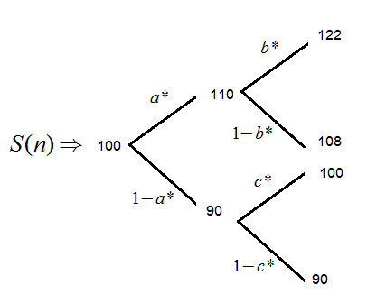
</figure>

เมื่อ <math display="inline" xmlns="http://www.w3.org/1998/Math/MathML"><semantics><mrow><msup><mi>a</mi><mo>*</mo></msup><mo>,</mo><msup><mi>b</mi><mo>*</mo></msup></mrow><annotation encoding="application/x-tex">a^*,b^*</annotation></semantics></math> และ <math display="inline" xmlns="http://www.w3.org/1998/Math/MathML"><semantics><msup><mi>c</mi><mo>*</mo></msup><annotation encoding="application/x-tex">c^*</annotation></semantics></math> เป็นความน่าจะเป็นความเป็นกลางต่อความเสี่ยงแต่ละขั้วกิ่งของต้นไม้ดังรูป จากแผนภาพคำนวณ <math display="inline" xmlns="http://www.w3.org/1998/Math/MathML"><semantics><mrow><msup><mi>a</mi><mo>*</mo></msup><mo>,</mo><msup><mi>b</mi><mo>*</mo></msup></mrow><annotation encoding="application/x-tex">a^*,b^*</annotation></semantics></math> และ <math display="inline" xmlns="http://www.w3.org/1998/Math/MathML"><semantics><msup><mi>c</mi><mo>*</mo></msup><annotation encoding="application/x-tex">c^*</annotation></semantics></math> ได้ดังนี้

<!-- PDF page 320: independently reviewed -->

<math display="block" xmlns="http://www.w3.org/1998/Math/MathML"><semantics><mrow><msup><mi>a</mi><mo>*</mo></msup><mo>=</mo><mfrac><mrow><mn>0.08</mn><mo>−</mo><mo stretchy="false" form="prefix">(</mo><mi>−</mi><mn>10</mn><mi>/</mi><mn>100</mn><mo stretchy="false" form="postfix">)</mo></mrow><mrow><mn>10</mn><mi>/</mi><mn>100</mn><mo>−</mo><mo stretchy="false" form="prefix">(</mo><mi>−</mi><mn>10</mn><mi>/</mi><mn>100</mn><mo stretchy="false" form="postfix">)</mo></mrow></mfrac><mo>=</mo><mn>0.9</mn><mo>,</mo><mspace width="1.0em"></mspace><msup><mi>b</mi><mo>*</mo></msup><mo>=</mo><mfrac><mrow><mn>0.08</mn><mo>−</mo><mo stretchy="false" form="prefix">(</mo><mi>−</mi><mn>2</mn><mi>/</mi><mn>110</mn><mo stretchy="false" form="postfix">)</mo></mrow><mrow><mo stretchy="false" form="prefix">(</mo><mn>12</mn><mi>/</mi><mn>110</mn><mo stretchy="false" form="postfix">)</mo><mo>−</mo><mo stretchy="false" form="prefix">(</mo><mi>−</mi><mn>2</mn><mi>/</mi><mn>110</mn><mo stretchy="false" form="postfix">)</mo></mrow></mfrac><mo>≈</mo><mn>0.7714</mn><mspace width="1.0em"></mspace><mtext mathvariant="normal">และ</mtext></mrow><annotation encoding="application/x-tex">a^*=\frac{0.08-(-10/100)}{10/100-(-10/100)}=0.9,\quad b^*=\frac{0.08-(-2/110)}{(12/110)-(-2/110)}\approx0.7714\quad\text{และ}</annotation></semantics></math>

<math display="block" xmlns="http://www.w3.org/1998/Math/MathML"><semantics><mrow><msup><mi>c</mi><mo>*</mo></msup><mo>=</mo><mfrac><mrow><mn>0.08</mn><mo>−</mo><mn>0</mn></mrow><mrow><mo stretchy="false" form="prefix">(</mo><mn>10</mn><mi>/</mi><mn>90</mn><mo stretchy="false" form="postfix">)</mo><mo>−</mo><mn>0</mn></mrow></mfrac><mo>=</mo><mn>0.72</mn></mrow><annotation encoding="application/x-tex">c^*=\frac{0.08-0}{(10/90)-0}=0.72</annotation></semantics></math>

จะได้ <math display="inline" xmlns="http://www.w3.org/1998/Math/MathML"><semantics><mrow><msup><mi>P</mi><mo>*</mo></msup><mo stretchy="false" form="prefix">(</mo><msub><mi>ω</mi><mn>1</mn></msub><mo stretchy="false" form="postfix">)</mo><mo>=</mo><mo stretchy="false" form="prefix">(</mo><msup><mi>a</mi><mo>*</mo></msup><mo stretchy="false" form="postfix">)</mo><mo stretchy="false" form="prefix">(</mo><msup><mi>b</mi><mo>*</mo></msup><mo stretchy="false" form="postfix">)</mo><mo>=</mo><mn>0.9</mn><mo stretchy="false" form="prefix">(</mo><mn>0.7714</mn><mo stretchy="false" form="postfix">)</mo><mo>=</mo><mn>0.69426</mn></mrow><annotation encoding="application/x-tex">P^*(\omega_1)=(a^*)(b^*)=0.9(0.7714)=0.69426</annotation></semantics></math>

<math display="inline" xmlns="http://www.w3.org/1998/Math/MathML"><semantics><mrow><msup><mi>P</mi><mo>*</mo></msup><mo stretchy="false" form="prefix">(</mo><msub><mi>ω</mi><mn>2</mn></msub><mo stretchy="false" form="postfix">)</mo><mo>=</mo><mo stretchy="false" form="prefix">(</mo><msup><mi>a</mi><mo>*</mo></msup><mo stretchy="false" form="postfix">)</mo><mo stretchy="false" form="prefix">(</mo><mn>1</mn><mo>−</mo><msup><mi>b</mi><mo>*</mo></msup><mo stretchy="false" form="postfix">)</mo><mo>=</mo><mn>0.9</mn><mo stretchy="false" form="prefix">(</mo><mn>0.2286</mn><mo stretchy="false" form="postfix">)</mo><mo>=</mo><mn>0.20574</mn></mrow><annotation encoding="application/x-tex">P^*(\omega_2)=(a^*)(1-b^*)=0.9(0.2286)=0.20574</annotation></semantics></math>

<math display="inline" xmlns="http://www.w3.org/1998/Math/MathML"><semantics><mrow><msup><mi>P</mi><mo>*</mo></msup><mo stretchy="false" form="prefix">(</mo><msub><mi>ω</mi><mn>3</mn></msub><mo stretchy="false" form="postfix">)</mo><mo>=</mo><mo stretchy="false" form="prefix">(</mo><mn>1</mn><mo>−</mo><msup><mi>a</mi><mo>*</mo></msup><mo stretchy="false" form="postfix">)</mo><mo stretchy="false" form="prefix">(</mo><msup><mi>c</mi><mo>*</mo></msup><mo stretchy="false" form="postfix">)</mo><mo>=</mo><mn>0.1</mn><mo stretchy="false" form="prefix">(</mo><mn>0.72</mn><mo stretchy="false" form="postfix">)</mo><mo>=</mo><mn>0.072</mn></mrow><annotation encoding="application/x-tex">P^*(\omega_3)=(1-a^*)(c^*)=0.1(0.72)=0.072</annotation></semantics></math>

<math display="inline" xmlns="http://www.w3.org/1998/Math/MathML"><semantics><mrow><msup><mi>P</mi><mo>*</mo></msup><mo stretchy="false" form="prefix">(</mo><msub><mi>ω</mi><mn>4</mn></msub><mo stretchy="false" form="postfix">)</mo><mo>=</mo><mo stretchy="false" form="prefix">(</mo><mn>1</mn><mo>−</mo><msup><mi>a</mi><mo>*</mo></msup><mo stretchy="false" form="postfix">)</mo><mo stretchy="false" form="prefix">(</mo><mn>1</mn><mo>−</mo><msup><mi>c</mi><mo>*</mo></msup><mo stretchy="false" form="postfix">)</mo><mo>=</mo><mn>0.1</mn><mo stretchy="false" form="prefix">(</mo><mn>0.28</mn><mo stretchy="false" form="postfix">)</mo><mo>=</mo><mn>0.028</mn></mrow><annotation encoding="application/x-tex">P^*(\omega_4)=(1-a^*)(1-c^*)=0.1(0.28)=0.028</annotation></semantics></math>

ดังนั้น มีความน่าจะเป็นความเป็นกลางต่อความเสี่ยง <math display="inline" xmlns="http://www.w3.org/1998/Math/MathML"><semantics><msup><mi>P</mi><mo>*</mo></msup><annotation encoding="application/x-tex">P^*</annotation></semantics></math> ซึ่ง <math display="inline" xmlns="http://www.w3.org/1998/Math/MathML"><semantics><mrow><msup><mi>P</mi><mo>*</mo></msup><mo stretchy="false" form="prefix">(</mo><mi>ω</mi><mo stretchy="false" form="postfix">)</mo><mo>&gt;</mo><mn>0</mn></mrow><annotation encoding="application/x-tex">P^*(\omega)&gt;0</annotation></semantics></math> สำหรับทุกๆ <math display="inline" xmlns="http://www.w3.org/1998/Math/MathML"><semantics><mrow><mi>ω</mi><mo>∈</mo><mi mathvariant="normal">Ω</mi></mrow><annotation encoding="application/x-tex">\omega\in\Omega</annotation></semantics></math> ต่อไปคำนวณราคาหุ้นส่วนลดจาก <math display="inline" xmlns="http://www.w3.org/1998/Math/MathML"><semantics><mrow><mover><mi>S</mi><mo accent="true">̃</mo></mover><mo stretchy="false" form="prefix">(</mo><mi>n</mi><mo stretchy="false" form="postfix">)</mo><mo>=</mo><mi>S</mi><mo stretchy="false" form="prefix">(</mo><mi>n</mi><mo stretchy="false" form="postfix">)</mo><mo stretchy="false" form="prefix">(</mo><mn>1</mn><mo>+</mo><mi>r</mi><msup><mo stretchy="false" form="postfix">)</mo><mrow><mi>−</mi><mi>n</mi></mrow></msup></mrow><annotation encoding="application/x-tex">\widetilde S(n)=S(n)(1+r)^{-n}</annotation></semantics></math> สำหรับทุกๆ <math display="inline" xmlns="http://www.w3.org/1998/Math/MathML"><semantics><mrow><mi>n</mi><mo>=</mo><mn>0</mn><mo>,</mo><mn>1</mn></mrow><annotation encoding="application/x-tex">n=0,1</annotation></semantics></math> ซึ่งจะได้แผนภาพต้นไม้ของราคาส่วนลด <math display="inline" xmlns="http://www.w3.org/1998/Math/MathML"><semantics><mrow><mover><mi>S</mi><mo accent="true">̃</mo></mover><mo stretchy="false" form="prefix">(</mo><mi>n</mi><mo stretchy="false" form="postfix">)</mo></mrow><annotation encoding="application/x-tex">\widetilde S(n)</annotation></semantics></math> ดังนี้

<figure class="source-figure">
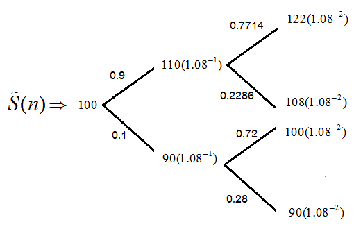
</figure>

จากแผนภาพคำนวณ <math display="inline" xmlns="http://www.w3.org/1998/Math/MathML"><semantics><mrow><msup><mi>E</mi><mo>*</mo></msup><mo stretchy="false" form="prefix">[</mo><mover><mi>S</mi><mo accent="true">̃</mo></mover><mo stretchy="false" form="prefix">(</mo><mi>n</mi><mo>+</mo><mn>1</mn><mo stretchy="false" form="postfix">)</mo><mo>∣</mo><mi>S</mi><mo stretchy="false" form="prefix">(</mo><mi>n</mi><mo stretchy="false" form="postfix">)</mo><mo stretchy="false" form="postfix">]</mo></mrow><annotation encoding="application/x-tex">E^*[\widetilde S(n+1)\mid S(n)]</annotation></semantics></math> สำหรับทุกๆ <math display="inline" xmlns="http://www.w3.org/1998/Math/MathML"><semantics><mrow><mi>n</mi><mo>=</mo><mn>0</mn><mo>,</mo><mn>1</mn></mrow><annotation encoding="application/x-tex">n=0,1</annotation></semantics></math> ได้ดังนี้

<math display="block" xmlns="http://www.w3.org/1998/Math/MathML"><semantics><mrow><msup><mi>E</mi><mo>*</mo></msup><mo stretchy="false" form="prefix">[</mo><mover><mi>S</mi><mo accent="true">̃</mo></mover><mo stretchy="false" form="prefix">(</mo><mn>1</mn><mo stretchy="false" form="postfix">)</mo><mo>∣</mo><mi>S</mi><mo stretchy="false" form="prefix">(</mo><mn>0</mn><mo stretchy="false" form="postfix">)</mo><mo>=</mo><mn>100</mn><mo stretchy="false" form="postfix">]</mo><mo>=</mo><mn>0.9</mn><mo stretchy="false" form="prefix">(</mo><mn>110</mn><mo stretchy="false" form="postfix">)</mo><mo stretchy="false" form="prefix">(</mo><msup><mn>1.08</mn><mrow><mi>−</mi><mn>1</mn></mrow></msup><mo stretchy="false" form="postfix">)</mo><mo>+</mo><mn>0.1</mn><mo stretchy="false" form="prefix">(</mo><mn>90</mn><mo stretchy="false" form="postfix">)</mo><mo stretchy="false" form="prefix">(</mo><msup><mn>1.08</mn><mrow><mi>−</mi><mn>1</mn></mrow></msup><mo stretchy="false" form="postfix">)</mo><mo>=</mo><mn>100</mn><mo>=</mo><mover><mi>S</mi><mo accent="true">̃</mo></mover><mo stretchy="false" form="prefix">(</mo><mn>0</mn><mo stretchy="false" form="postfix">)</mo></mrow><annotation encoding="application/x-tex">E^*[\widetilde S(1)\mid S(0)=100]=0.9(110)(1.08^{-1})+0.1(90)(1.08^{-1})=100=\widetilde S(0)</annotation></semantics></math>

<math display="block" xmlns="http://www.w3.org/1998/Math/MathML"><semantics><mtable><mtr><mtd columnalign="right" style="text-align: right; padding-right: 0"><msup><mi>E</mi><mo>*</mo></msup><mo stretchy="false" form="prefix">[</mo><mover><mi>S</mi><mo accent="true">̃</mo></mover><mo stretchy="false" form="prefix">(</mo><mn>2</mn><mo stretchy="false" form="postfix">)</mo><mo>∣</mo><mi>S</mi><mo stretchy="false" form="prefix">(</mo><mn>1</mn><mo stretchy="false" form="postfix">)</mo><mo>=</mo><mn>110</mn><mo stretchy="false" form="postfix">]</mo></mtd><mtd columnalign="left" style="text-align: left; padding-left: 0"><mo>=</mo><mn>0.7714</mn><mo stretchy="false" form="prefix">(</mo><mn>122</mn><mo stretchy="false" form="postfix">)</mo><mo stretchy="false" form="prefix">(</mo><msup><mn>1.08</mn><mrow><mi>−</mi><mn>2</mn></mrow></msup><mo stretchy="false" form="postfix">)</mo><mo>+</mo><mn>0.2286</mn><mo stretchy="false" form="prefix">(</mo><mn>108</mn><mo stretchy="false" form="postfix">)</mo><mo stretchy="false" form="prefix">(</mo><msup><mn>1.08</mn><mrow><mi>−</mi><mn>2</mn></mrow></msup><mo stretchy="false" form="postfix">)</mo></mtd></mtr><mtr><mtd columnalign="right" style="text-align: right; padding-right: 0"></mtd><mtd columnalign="left" style="text-align: left; padding-left: 0"><mo>=</mo><mn>101.8515</mn><mo>=</mo><mn>108</mn><mo stretchy="false" form="prefix">(</mo><msup><mn>1.08</mn><mrow><mi>−</mi><mn>1</mn></mrow></msup><mo stretchy="false" form="postfix">)</mo><mo>=</mo><mover><mi>S</mi><mo accent="true">̃</mo></mover><mo stretchy="false" form="prefix">(</mo><mn>1</mn><mo stretchy="false" form="postfix">)</mo></mtd></mtr></mtable><annotation encoding="application/x-tex">\begin{aligned}E^*[\widetilde S(2)\mid S(1)=110]&amp;=0.7714(122)(1.08^{-2})+0.2286(108)(1.08^{-2})\\&amp;=101.8515=108(1.08^{-1})=\widetilde S(1)\end{aligned}</annotation></semantics></math>

<math display="block" xmlns="http://www.w3.org/1998/Math/MathML"><semantics><mtable><mtr><mtd columnalign="right" style="text-align: right; padding-right: 0"><msup><mi>E</mi><mo>*</mo></msup><mo stretchy="false" form="prefix">[</mo><mover><mi>S</mi><mo accent="true">̃</mo></mover><mo stretchy="false" form="prefix">(</mo><mn>2</mn><mo stretchy="false" form="postfix">)</mo><mo>∣</mo><mi>S</mi><mo stretchy="false" form="prefix">(</mo><mn>1</mn><mo stretchy="false" form="postfix">)</mo><mo>=</mo><mn>90</mn><mo stretchy="false" form="postfix">]</mo></mtd><mtd columnalign="left" style="text-align: left; padding-left: 0"><mo>=</mo><mn>0.72</mn><mo stretchy="false" form="prefix">(</mo><mn>100</mn><mo stretchy="false" form="postfix">)</mo><mo stretchy="false" form="prefix">(</mo><msup><mn>1.08</mn><mrow><mi>−</mi><mn>2</mn></mrow></msup><mo stretchy="false" form="postfix">)</mo><mo>+</mo><mn>0.28</mn><mo stretchy="false" form="prefix">(</mo><mn>90</mn><mo stretchy="false" form="postfix">)</mo><mo stretchy="false" form="prefix">(</mo><msup><mn>1.08</mn><mrow><mi>−</mi><mn>2</mn></mrow></msup><mo stretchy="false" form="postfix">)</mo></mtd></mtr><mtr><mtd columnalign="right" style="text-align: right; padding-right: 0"></mtd><mtd columnalign="left" style="text-align: left; padding-left: 0"><mo>=</mo><mn>83.33</mn><mo>=</mo><mn>90</mn><mo stretchy="false" form="prefix">(</mo><msup><mn>1.08</mn><mrow><mi>−</mi><mn>1</mn></mrow></msup><mo stretchy="false" form="postfix">)</mo><mo>=</mo><mover><mi>S</mi><mo accent="true">̃</mo></mover><mo stretchy="false" form="prefix">(</mo><mn>1</mn><mo stretchy="false" form="postfix">)</mo></mtd></mtr></mtable><annotation encoding="application/x-tex">\begin{aligned}E^*[\widetilde S(2)\mid S(1)=90]&amp;=0.72(100)(1.08^{-2})+0.28(90)(1.08^{-2})\\&amp;=83.33=90(1.08^{-1})=\widetilde S(1)\end{aligned}</annotation></semantics></math>

ดังนั้นโดยทฤษฎีบทหลักมูลการกำหนดราคาสินทรัพย์ การเคลื่อนไหวของราคาหุ้นตามสภาวะดังกล่าวสอดคล้องกับหลักการปราศจากการค้ากำไร □

<!-- PDF page 321: independently reviewed -->
<h2 id="แบบจำลองราคาตนไมไตรภาค">9.8 แบบจำลองราคาต้นไม้ไตรภาค</h2>

แบบจำลองราคาต้นไม้ไตรภาค (Trinomial Tree Prices Model) เป็นแบบจำลองที่ขยายแนวความคิดของแบบจำลองราคาต้นไม้ทวิภาคของ <math display="inline" xmlns="http://www.w3.org/1998/Math/MathML"><semantics><mrow><mi>K</mi><mo stretchy="false" form="prefix">(</mo><mi>n</mi><mo stretchy="false" form="postfix">)</mo></mrow><annotation encoding="application/x-tex">K(n)</annotation></semantics></math> จากต้นไม้ 2 กิ่ง ไปยังต้นไม้ 3 กิ่ง ดังนั้นการเคลื่อนไหวของราคาจะไม่ได้มีเฉพาะแค่ขึ้นกับลงเท่านั้น แต่จะมีการเคลื่อนไหวของราคาที่อยู่ระหว่าง 2 กิ่งนั้น คือมีการเคลื่อนไหวของราคาเป็นไปได้ 3 ทาง โดยแบบจำลองราคาต้นไม้ไตรภาคมีเงื่อนไขดังนี้

<strong>เงื่อนไข TT-1</strong> กำหนดให้อัตราผลตอบแทนต่อคาบ <math display="inline" xmlns="http://www.w3.org/1998/Math/MathML"><semantics><mrow><mi>K</mi><mo stretchy="false" form="prefix">(</mo><mi>n</mi><mo stretchy="false" form="postfix">)</mo></mrow><annotation encoding="application/x-tex">K(n)</annotation></semantics></math> เป็นตัวแปรเชิงสุ่มที่อิสระกัน นิยามในรูป

<math display="block" xmlns="http://www.w3.org/1998/Math/MathML"><semantics><mrow><mi>K</mi><mo stretchy="false" form="prefix">(</mo><mi>n</mi><mo stretchy="false" form="postfix">)</mo><mo>=</mo><mrow><mo stretchy="true" form="prefix">{</mo><mtable><mtr><mtd columnalign="left" style="text-align: left"><mi>u</mi><mo>;</mo><mspace width="1.0em"></mspace><mrow><mtext mathvariant="normal">probability </mtext><mspace width="0.333em"></mspace></mrow><mi>p</mi></mtd></mtr><mtr><mtd columnalign="left" style="text-align: left"><mi>m</mi><mo>;</mo><mspace width="1.0em"></mspace><mrow><mtext mathvariant="normal">probability </mtext><mspace width="0.333em"></mspace></mrow><mi>q</mi></mtd></mtr><mtr><mtd columnalign="left" style="text-align: left"><mi>d</mi><mo>;</mo><mspace width="1.0em"></mspace><mrow><mtext mathvariant="normal">probability </mtext><mspace width="0.333em"></mspace></mrow><mn>1</mn><mo>−</mo><mi>p</mi><mo>−</mo><mi>q</mi></mtd></mtr></mtable></mrow><mspace width="2.0em"></mspace><mo stretchy="false" form="prefix">(</mo><mn>9.49</mn><mo stretchy="false" form="postfix">)</mo></mrow><annotation encoding="application/x-tex">K(n)=\begin{cases}u;\quad\text{probability }p\\m;\quad\text{probability }q\\d;\quad\text{probability }1-p-q\end{cases}\qquad(9.49)</annotation></semantics></math>

เมื่อ <math display="inline" xmlns="http://www.w3.org/1998/Math/MathML"><semantics><mrow><mi>d</mi><mo>&lt;</mo><mi>m</mi><mo>&lt;</mo><mi>u</mi></mrow><annotation encoding="application/x-tex">d&lt;m&lt;u</annotation></semantics></math> และ <math display="inline" xmlns="http://www.w3.org/1998/Math/MathML"><semantics><mrow><mn>0</mn><mo>&lt;</mo><mi>p</mi><mo>,</mo><mi>q</mi><mo>,</mo><mi>p</mi><mo>+</mo><mi>q</mi><mo>&lt;</mo><mn>1</mn></mrow><annotation encoding="application/x-tex">0&lt;p,q,p+q&lt;1</annotation></semantics></math>

เช่นเดียวกับในแบบจำลองต้นไม้ทวิภาค <math display="inline" xmlns="http://www.w3.org/1998/Math/MathML"><semantics><mi>u</mi><annotation encoding="application/x-tex">u</annotation></semantics></math> และ <math display="inline" xmlns="http://www.w3.org/1998/Math/MathML"><semantics><mi>d</mi><annotation encoding="application/x-tex">d</annotation></semantics></math> แทนการเคลื่อนไหวของราคาขึ้นและลง ตามลำดับ ในขณะที่ <math display="inline" xmlns="http://www.w3.org/1998/Math/MathML"><semantics><mi>m</mi><annotation encoding="application/x-tex">m</annotation></semantics></math> แทนการเคลื่อนไหวของราคาที่อยู่ระหว่างราคาที่เคลื่อนไหวขึ้นและลง ถ้า <math display="inline" xmlns="http://www.w3.org/1998/Math/MathML"><semantics><mrow><mi>m</mi><mo>=</mo><mn>0</mn></mrow><annotation encoding="application/x-tex">m=0</annotation></semantics></math> จะเรียกว่า <em>ศูนย์กลางหลัก</em> (Typical neutral)

<strong>เงื่อนไข TT-2</strong> กำหนดให้ <math display="inline" xmlns="http://www.w3.org/1998/Math/MathML"><semantics><mi>r</mi><annotation encoding="application/x-tex">r</annotation></semantics></math> เป็นอัตราผลตอบแทนต่อคาบของสินทรัพย์ไม่มีความเสี่ยงซึ่งคงที่ทุกคาบเวลาและ <math display="inline" xmlns="http://www.w3.org/1998/Math/MathML"><semantics><mrow><mi>d</mi><mo>&lt;</mo><mi>r</mi><mo>&lt;</mo><mi>u</mi></mrow><annotation encoding="application/x-tex">d&lt;r&lt;u</annotation></semantics></math>

เนื่องจาก <math display="inline" xmlns="http://www.w3.org/1998/Math/MathML"><semantics><mrow><mi>S</mi><mo stretchy="false" form="prefix">(</mo><mn>1</mn><mo stretchy="false" form="postfix">)</mo><mo>=</mo><mo stretchy="false" form="prefix">(</mo><mn>1</mn><mo>+</mo><mi>K</mi><mo stretchy="false" form="prefix">(</mo><mn>1</mn><mo stretchy="false" form="postfix">)</mo><mo stretchy="false" form="postfix">)</mo><mi>S</mi><mo stretchy="false" form="prefix">(</mo><mn>0</mn><mo stretchy="false" form="postfix">)</mo></mrow><annotation encoding="application/x-tex">S(1)=(1+K(1))S(0)</annotation></semantics></math> โดยเงื่อนไข TT-1 จะได้ <math display="inline" xmlns="http://www.w3.org/1998/Math/MathML"><semantics><mrow><mi>S</mi><mo stretchy="false" form="prefix">(</mo><mn>1</mn><mo stretchy="false" form="postfix">)</mo></mrow><annotation encoding="application/x-tex">S(1)</annotation></semantics></math> ดังนี้

<math display="block" xmlns="http://www.w3.org/1998/Math/MathML"><semantics><mrow><mi>S</mi><mo stretchy="false" form="prefix">(</mo><mn>1</mn><mo stretchy="false" form="postfix">)</mo><mo>=</mo><mrow><mo stretchy="true" form="prefix">{</mo><mtable><mtr><mtd columnalign="left" style="text-align: left"><mi>S</mi><mo stretchy="false" form="prefix">(</mo><mn>0</mn><mo stretchy="false" form="postfix">)</mo><mo stretchy="false" form="prefix">(</mo><mn>1</mn><mo>+</mo><mi>u</mi><mo stretchy="false" form="postfix">)</mo><mo>;</mo><mspace width="1.0em"></mspace><mrow><mtext mathvariant="normal">probability </mtext><mspace width="0.333em"></mspace></mrow><mi>p</mi></mtd></mtr><mtr><mtd columnalign="left" style="text-align: left"><mi>S</mi><mo stretchy="false" form="prefix">(</mo><mn>0</mn><mo stretchy="false" form="postfix">)</mo><mo stretchy="false" form="prefix">(</mo><mn>1</mn><mo>+</mo><mi>m</mi><mo stretchy="false" form="postfix">)</mo><mo>;</mo><mspace width="1.0em"></mspace><mrow><mtext mathvariant="normal">probability </mtext><mspace width="0.333em"></mspace></mrow><mi>q</mi></mtd></mtr><mtr><mtd columnalign="left" style="text-align: left"><mi>S</mi><mo stretchy="false" form="prefix">(</mo><mn>0</mn><mo stretchy="false" form="postfix">)</mo><mo stretchy="false" form="prefix">(</mo><mn>1</mn><mo>+</mo><mi>d</mi><mo stretchy="false" form="postfix">)</mo><mo>;</mo><mspace width="1.0em"></mspace><mrow><mtext mathvariant="normal">probability </mtext><mspace width="0.333em"></mspace></mrow><mn>1</mn><mo>−</mo><mi>p</mi><mo>−</mo><mi>q</mi></mtd></mtr></mtable></mrow><mspace width="2.0em"></mspace><mo stretchy="false" form="prefix">(</mo><mn>9.50</mn><mo stretchy="false" form="postfix">)</mo></mrow><annotation encoding="application/x-tex">S(1)=\begin{cases}S(0)(1+u);\quad\text{probability }p\\S(0)(1+m);\quad\text{probability }q\\S(0)(1+d);\quad\text{probability }1-p-q\end{cases}\qquad(9.50)</annotation></semantics></math>

<strong>ตัวอย่างที่ 9.15</strong> จงเขียนต้นไม้ไตรภาคสำหรับ <math display="inline" xmlns="http://www.w3.org/1998/Math/MathML"><semantics><mrow><mi>S</mi><mo stretchy="false" form="prefix">(</mo><mn>2</mn><mo stretchy="false" form="postfix">)</mo></mrow><annotation encoding="application/x-tex">S(2)</annotation></semantics></math> เมื่อสมมติว่าตลาดสอดคล้องตามเงื่อนไข TT-1 และ เงื่อนไข TT-2

<strong>วิธีทำ</strong> จากเงื่อนไข TT-1 เขียนแผนภาพต้นไม้ไตรภาคสำหรับตัวประกอบเงินสะสมได้ดังนี้

<!-- PDF page 322: independently reviewed -->
<figure class="source-figure">
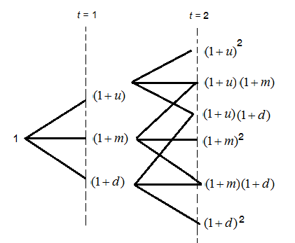
<figcaption>
รูปที่ 9.9 แสดงต้นไม้ไตรภาคแสดงตัวประกอบเงินสะสมของราคาที่เวลา t=2
</figcaption>
</figure>

จากแผนภาพ จะได้

<math display="block" xmlns="http://www.w3.org/1998/Math/MathML"><semantics><mrow><mi>S</mi><mo stretchy="false" form="prefix">(</mo><mn>2</mn><mo stretchy="false" form="postfix">)</mo><mo>=</mo><mrow><mo stretchy="true" form="prefix">{</mo><mtable><mtr><mtd columnalign="left" style="text-align: left"><mi>S</mi><mo stretchy="false" form="prefix">(</mo><mn>0</mn><mo stretchy="false" form="postfix">)</mo><mo stretchy="false" form="prefix">(</mo><mn>1</mn><mo>+</mo><mi>u</mi><msup><mo stretchy="false" form="postfix">)</mo><mn>2</mn></msup><mo>;</mo><mspace width="1.0em"></mspace><mrow><mtext mathvariant="normal">probability </mtext><mspace width="0.333em"></mspace></mrow><msup><mi>p</mi><mn>2</mn></msup></mtd></mtr><mtr><mtd columnalign="left" style="text-align: left"><mi>S</mi><mo stretchy="false" form="prefix">(</mo><mn>0</mn><mo stretchy="false" form="postfix">)</mo><mo stretchy="false" form="prefix">(</mo><mn>1</mn><mo>+</mo><mi>u</mi><mo stretchy="false" form="postfix">)</mo><mo stretchy="false" form="prefix">(</mo><mn>1</mn><mo>+</mo><mi>m</mi><mo stretchy="false" form="postfix">)</mo><mo>;</mo><mspace width="1.0em"></mspace><mrow><mtext mathvariant="normal">probability </mtext><mspace width="0.333em"></mspace></mrow><mn>2</mn><mi>p</mi><mi>q</mi></mtd></mtr><mtr><mtd columnalign="left" style="text-align: left"><mi>S</mi><mo stretchy="false" form="prefix">(</mo><mn>0</mn><mo stretchy="false" form="postfix">)</mo><mo stretchy="false" form="prefix">(</mo><mn>1</mn><mo>+</mo><mi>u</mi><mo stretchy="false" form="postfix">)</mo><mo stretchy="false" form="prefix">(</mo><mn>1</mn><mo>+</mo><mi>d</mi><mo stretchy="false" form="postfix">)</mo><mo>;</mo><mspace width="1.0em"></mspace><mrow><mtext mathvariant="normal">probability </mtext><mspace width="0.333em"></mspace></mrow><mn>2</mn><mi>p</mi><mo stretchy="false" form="prefix">(</mo><mn>1</mn><mo>−</mo><mi>p</mi><mo>−</mo><mi>q</mi><mo stretchy="false" form="postfix">)</mo></mtd></mtr><mtr><mtd columnalign="left" style="text-align: left"><mi>S</mi><mo stretchy="false" form="prefix">(</mo><mn>0</mn><mo stretchy="false" form="postfix">)</mo><mo stretchy="false" form="prefix">(</mo><mn>1</mn><mo>+</mo><mi>m</mi><msup><mo stretchy="false" form="postfix">)</mo><mn>2</mn></msup><mo>;</mo><mspace width="1.0em"></mspace><mrow><mtext mathvariant="normal">probability </mtext><mspace width="0.333em"></mspace></mrow><msup><mi>q</mi><mn>2</mn></msup></mtd></mtr><mtr><mtd columnalign="left" style="text-align: left"><mi>S</mi><mo stretchy="false" form="prefix">(</mo><mn>0</mn><mo stretchy="false" form="postfix">)</mo><mo stretchy="false" form="prefix">(</mo><mn>1</mn><mo>+</mo><mi>m</mi><mo stretchy="false" form="postfix">)</mo><mo stretchy="false" form="prefix">(</mo><mn>1</mn><mo>+</mo><mi>d</mi><mo stretchy="false" form="postfix">)</mo><mo>;</mo><mspace width="1.0em"></mspace><mrow><mtext mathvariant="normal">probability </mtext><mspace width="0.333em"></mspace></mrow><mn>2</mn><mo stretchy="false" form="prefix">(</mo><mn>1</mn><mo>−</mo><mi>p</mi><mo>−</mo><mi>q</mi><mo stretchy="false" form="postfix">)</mo><mi>q</mi></mtd></mtr><mtr><mtd columnalign="left" style="text-align: left"><mi>S</mi><mo stretchy="false" form="prefix">(</mo><mn>0</mn><mo stretchy="false" form="postfix">)</mo><mo stretchy="false" form="prefix">(</mo><mn>1</mn><mo>+</mo><mi>d</mi><msup><mo stretchy="false" form="postfix">)</mo><mn>2</mn></msup><mo>;</mo><mspace width="1.0em"></mspace><mrow><mtext mathvariant="normal">probability </mtext><mspace width="0.333em"></mspace></mrow><mo stretchy="false" form="prefix">(</mo><mn>1</mn><mo>−</mo><mi>p</mi><mo>−</mo><mi>q</mi><msup><mo stretchy="false" form="postfix">)</mo><mn>2</mn></msup></mtd></mtr></mtable></mrow></mrow><annotation encoding="application/x-tex">S(2)=\begin{cases}S(0)(1+u)^2;\quad\text{probability }p^2\\S(0)(1+u)(1+m);\quad\text{probability }2pq\\S(0)(1+u)(1+d);\quad\text{probability }2p(1-p-q)\\S(0)(1+m)^2;\quad\text{probability }q^2\\S(0)(1+m)(1+d);\quad\text{probability }2(1-p-q)q\\S(0)(1+d)^2;\quad\text{probability }(1-p-q)^2\end{cases}</annotation></semantics></math>

□

จากเงื่อนไข สำหรับค่าคาดหวังความเป็นกลางต่อความเสี่ยง <math display="inline" xmlns="http://www.w3.org/1998/Math/MathML"><semantics><mrow><msup><mi>E</mi><mo>*</mo></msup><mo stretchy="false" form="prefix">[</mo><mi>K</mi><mo stretchy="false" form="prefix">(</mo><mi>n</mi><mo stretchy="false" form="postfix">)</mo><mo stretchy="false" form="postfix">]</mo><mo>=</mo><mi>r</mi></mrow><annotation encoding="application/x-tex">E^*[K(n)]=r</annotation></semantics></math> จะได้ว่าความจะน่าเป็นความเป็นกลางต่อความเสี่ยง <math display="inline" xmlns="http://www.w3.org/1998/Math/MathML"><semantics><msup><mi>p</mi><mo>*</mo></msup><annotation encoding="application/x-tex">p^*</annotation></semantics></math> และ <math display="inline" xmlns="http://www.w3.org/1998/Math/MathML"><semantics><msup><mi>q</mi><mo>*</mo></msup><annotation encoding="application/x-tex">q^*</annotation></semantics></math> สามารถเขียนได้อยู่ในรูป

<math display="block" xmlns="http://www.w3.org/1998/Math/MathML"><semantics><mrow><msup><mi>p</mi><mo>*</mo></msup><mo stretchy="false" form="prefix">(</mo><mi>u</mi><mo>−</mo><mi>r</mi><mo stretchy="false" form="postfix">)</mo><mo>+</mo><msup><mi>q</mi><mo>*</mo></msup><mo stretchy="false" form="prefix">(</mo><mi>m</mi><mo>−</mo><mi>r</mi><mo stretchy="false" form="postfix">)</mo><mo>+</mo><mo stretchy="false" form="prefix">(</mo><mn>1</mn><mo>−</mo><msup><mi>p</mi><mo>*</mo></msup><mo>−</mo><msup><mi>q</mi><mo>*</mo></msup><mo stretchy="false" form="postfix">)</mo><mo stretchy="false" form="prefix">(</mo><mi>d</mi><mo>−</mo><mi>r</mi><mo stretchy="false" form="postfix">)</mo><mo>=</mo><mn>0</mn><mspace width="2.0em"></mspace><mo stretchy="false" form="prefix">(</mo><mn>9.51</mn><mo stretchy="false" form="postfix">)</mo></mrow><annotation encoding="application/x-tex">p^*(u-r)+q^*(m-r)+(1-p^*-q^*)(d-r)=0\qquad(9.51)</annotation></semantics></math>

เราสามารถพิจารณาสามสิ่งอันดับ <math display="inline" xmlns="http://www.w3.org/1998/Math/MathML"><semantics><mrow><mo stretchy="false" form="prefix">(</mo><msup><mi>p</mi><mo>*</mo></msup><mo>,</mo><msup><mi>q</mi><mo>*</mo></msup><mo>,</mo><mn>1</mn><mo>−</mo><msup><mi>p</mi><mo>*</mo></msup><mo>−</mo><msup><mi>q</mi><mo>*</mo></msup><mo stretchy="false" form="postfix">)</mo></mrow><annotation encoding="application/x-tex">(p^*,q^*,1-p^*-q^*)</annotation></semantics></math> เป็นเวกเตอร์ใน <math display="inline" xmlns="http://www.w3.org/1998/Math/MathML"><semantics><msup><mi mathvariant="double-struck">ℝ</mi><mn>3</mn></msup><annotation encoding="application/x-tex">\mathbb R^3</annotation></semantics></math> ตั้งฉากกับเวกเตอร์ <math display="inline" xmlns="http://www.w3.org/1998/Math/MathML"><semantics><mrow><mo stretchy="false" form="prefix">(</mo><mi>u</mi><mo>−</mo><mi>r</mi><mo>,</mo><mi>m</mi><mo>−</mo><mi>r</mi><mo>,</mo><mi>d</mi><mo>−</mo><mi>r</mi><mo stretchy="false" form="postfix">)</mo></mrow><annotation encoding="application/x-tex">(u-r,m-r,d-r)</annotation></semantics></math> ซึ่งเป็นเวกเตอร์ของกำไร(ขาดทุน) ต่อหุ้นต่อคาบเวลา นั่นหมายความว่า <math display="inline" xmlns="http://www.w3.org/1998/Math/MathML"><semantics><mrow><mo stretchy="false" form="prefix">(</mo><msup><mi>p</mi><mo>*</mo></msup><mo>,</mo><msup><mi>q</mi><mo>*</mo></msup><mo>,</mo><mn>1</mn><mo>−</mo><msup><mi>p</mi><mo>*</mo></msup><mo>−</mo><msup><mi>q</mi><mo>*</mo></msup><mo stretchy="false" form="postfix">)</mo></mrow><annotation encoding="application/x-tex">(p^*,q^*,1-p^*-q^*)</annotation></semantics></math> เป็นจุดบนรอยตัดระหว่างระนาบ <math display="inline" xmlns="http://www.w3.org/1998/Math/MathML"><semantics><mrow><mo stretchy="false" form="prefix">{</mo><mo stretchy="false" form="prefix">(</mo><mi>a</mi><mo>,</mo><mi>b</mi><mo>,</mo><mi>c</mi><mo stretchy="false" form="postfix">)</mo><mo>∣</mo><mi>a</mi><mo>,</mo><mi>b</mi><mo>,</mo><mi>c</mi><mo>≥</mo><mn>0</mn><mo>,</mo><mi>a</mi><mo>+</mo><mi>b</mi><mo>+</mo><mi>c</mi><mo>=</mo><mn>1</mn><mo stretchy="false" form="postfix">}</mo></mrow><annotation encoding="application/x-tex">\{(a,b,c)\mid a,b,c\geq0,a+b+c=1\}</annotation></semantics></math> กับระนาบซึ่งตั้งฉากกับเวกเตอร์ของกำไร <math display="inline" xmlns="http://www.w3.org/1998/Math/MathML"><semantics><mrow><mo stretchy="false" form="prefix">(</mo><mi>u</mi><mo>−</mo><mi>r</mi><mo>,</mo><mi>m</mi><mo>−</mo><mi>r</mi><mo>,</mo><mi>d</mi><mo>−</mo><mi>r</mi><mo stretchy="false" form="postfix">)</mo></mrow><annotation encoding="application/x-tex">(u-r,m-r,d-r)</annotation></semantics></math> ตามรูป ดังนี้

<!-- PDF page 323: independently reviewed -->
<figure class="source-figure">
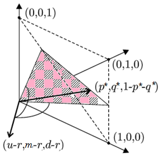
<figcaption>
รูปที่ 9.10 แสดงเรขาคณิตของความน่าจะเป็นความเป็นกลางต่อความเสี่ยง
</figcaption>
</figure>

เงื่อนไข TT-2 ยืนยันได้ว่ารอยตัดระหว่างระนาบสามเหลี่ยมกับระนาบซึ่งตั้งฉากกับเวกเตอร์ของกำไร <math display="inline" xmlns="http://www.w3.org/1998/Math/MathML"><semantics><mrow><mo stretchy="false" form="prefix">(</mo><mi>u</mi><mo>−</mo><mi>r</mi><mo>,</mo><mi>m</mi><mo>−</mo><mi>r</mi><mo>,</mo><mi>d</mi><mo>−</mo><mi>r</mi><mo stretchy="false" form="postfix">)</mo></mrow><annotation encoding="application/x-tex">(u-r,m-r,d-r)</annotation></semantics></math> ไม่เป็นเซตว่าง เนื่องจากเวกเตอร์<math display="inline" xmlns="http://www.w3.org/1998/Math/MathML"><semantics><mrow><mo stretchy="false" form="prefix">(</mo><mi>u</mi><mo>−</mo><mi>r</mi><mo>,</mo><mi>m</mi><mo>−</mo><mi>r</mi><mo>,</mo><mi>d</mi><mo>−</mo><mi>r</mi><mo stretchy="false" form="postfix">)</mo></mrow><annotation encoding="application/x-tex">(u-r,m-r,d-r)</annotation></semantics></math> ไม่ผ่านอัฏภาคที่เป็นบวก (Positive Octant) จะได้ว่ามีความน่าจะเป็นความเป็นกลางต่อความเสี่ยงเป็นจำนวนอนันต์ค่าอยู่บนเส้นตรงซึ่งเป็นรอยตัดตามรูปที่ 9.10

นอกจากการพิจารณาความน่าจะเป็นความเป็นกลางต่อความเสี่ยงในเชิงเรขาคณิตตามรูปที่ 9.10 แล้ว ยังสามารถพิจารณาความน่าจะเป็นความเป็นกลางต่อความเสี่ยงในเชิงกลศาสตร์ บนคานสมดุลซึ่งมี <math display="inline" xmlns="http://www.w3.org/1998/Math/MathML"><semantics><mi>r</mi><annotation encoding="application/x-tex">r</annotation></semantics></math> เป็นจุดหมุน โดยที่ <math display="inline" xmlns="http://www.w3.org/1998/Math/MathML"><semantics><msup><mi>q</mi><mo>*</mo></msup><annotation encoding="application/x-tex">q^*</annotation></semantics></math> เป็นแรงที่กระทำต่อวัตถุมวล <math display="inline" xmlns="http://www.w3.org/1998/Math/MathML"><semantics><mi>m</mi><annotation encoding="application/x-tex">m</annotation></semantics></math> ซึ่งอยู่ระหว่างวัตถุปลายคานทั้งสองมวล <math display="inline" xmlns="http://www.w3.org/1998/Math/MathML"><semantics><mi>d</mi><annotation encoding="application/x-tex">d</annotation></semantics></math> และ <math display="inline" xmlns="http://www.w3.org/1998/Math/MathML"><semantics><mi>u</mi><annotation encoding="application/x-tex">u</annotation></semantics></math> และมีแรง <math display="inline" xmlns="http://www.w3.org/1998/Math/MathML"><semantics><mrow><mn>1</mn><mo>−</mo><msup><mi>p</mi><mo>*</mo></msup><mo>−</mo><msup><mi>q</mi><mo>*</mo></msup></mrow><annotation encoding="application/x-tex">1-p^*-q^*</annotation></semantics></math> และ <math display="inline" xmlns="http://www.w3.org/1998/Math/MathML"><semantics><msup><mi>p</mi><mo>*</mo></msup><annotation encoding="application/x-tex">p^*</annotation></semantics></math> ตามลำดับ ดังรูปที่ 9.11

<figure class="source-figure">
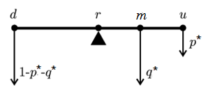
<figcaption>
รูปที่ 9.11 แสดงการอธิบายความน่าจะเป็นความเป็นกลางต่อความเสี่ยงเชิงกลศาสตร์
</figcaption>
</figure>

<strong>ตัวอย่างที่ 9.16</strong> กำหนดให้ <math display="inline" xmlns="http://www.w3.org/1998/Math/MathML"><semantics><mrow><mi>u</mi><mo>=</mo><mn>0.2</mn></mrow><annotation encoding="application/x-tex">u=0.2</annotation></semantics></math>, <math display="inline" xmlns="http://www.w3.org/1998/Math/MathML"><semantics><mrow><mi>m</mi><mo>=</mo><mn>0</mn></mrow><annotation encoding="application/x-tex">m=0</annotation></semantics></math>, <math display="inline" xmlns="http://www.w3.org/1998/Math/MathML"><semantics><mrow><mi>d</mi><mo>=</mo><mi>−</mi><mn>0.1</mn></mrow><annotation encoding="application/x-tex">d=-0.1</annotation></semantics></math> และ <math display="inline" xmlns="http://www.w3.org/1998/Math/MathML"><semantics><mrow><mi>r</mi><mo>=</mo><mn>0</mn></mrow><annotation encoding="application/x-tex">r=0</annotation></semantics></math> จงหาความน่าจะเป็นความเป็นกลางต่อความเสี่ยงที่เป็นไปได้ทั้งหมด

<strong>วิธีทำ</strong> จากสมการ (9.51), <math display="inline" xmlns="http://www.w3.org/1998/Math/MathML"><semantics><mrow><msup><mi>p</mi><mo>*</mo></msup><mo stretchy="false" form="prefix">(</mo><mi>u</mi><mo>−</mo><mi>r</mi><mo stretchy="false" form="postfix">)</mo><mo>+</mo><msup><mi>q</mi><mo>*</mo></msup><mo stretchy="false" form="prefix">(</mo><mi>m</mi><mo>−</mo><mi>r</mi><mo stretchy="false" form="postfix">)</mo><mo>+</mo><mo stretchy="false" form="prefix">(</mo><mn>1</mn><mo>−</mo><msup><mi>p</mi><mo>*</mo></msup><mo>−</mo><msup><mi>q</mi><mo>*</mo></msup><mo stretchy="false" form="postfix">)</mo><mo stretchy="false" form="prefix">(</mo><mi>d</mi><mo>−</mo><mi>r</mi><mo stretchy="false" form="postfix">)</mo><mo>=</mo><mn>0</mn></mrow><annotation encoding="application/x-tex">p^*(u-r)+q^*(m-r)+(1-p^*-q^*)(d-r)=0</annotation></semantics></math>

โดยการแทนค่า จะได้ <math display="inline" xmlns="http://www.w3.org/1998/Math/MathML"><semantics><mrow><msup><mi>p</mi><mo>*</mo></msup><mo stretchy="false" form="prefix">(</mo><mn>0.2</mn><mo>−</mo><mn>0</mn><mo stretchy="false" form="postfix">)</mo><mo>+</mo><msup><mi>q</mi><mo>*</mo></msup><mo stretchy="false" form="prefix">(</mo><mn>0</mn><mo>−</mo><mn>0</mn><mo stretchy="false" form="postfix">)</mo><mo>+</mo><mo stretchy="false" form="prefix">(</mo><mn>1</mn><mo>−</mo><msup><mi>p</mi><mo>*</mo></msup><mo>−</mo><mn>0</mn><mo stretchy="false" form="postfix">)</mo><mo stretchy="false" form="prefix">(</mo><mi>−</mi><mn>0.1</mn><mo>−</mo><mn>0</mn><mo stretchy="false" form="postfix">)</mo><mo>=</mo><mn>0</mn></mrow><annotation encoding="application/x-tex">p^*(0.2-0)+q^*(0-0)+(1-p^*-0)(-0.1-0)=0</annotation></semantics></math>

<!-- PDF page 324: independently reviewed -->

โดยการแก้สมการ จะได้ <math display="inline" xmlns="http://www.w3.org/1998/Math/MathML"><semantics><mrow><msup><mi>p</mi><mo>*</mo></msup><mo>=</mo><mn>1</mn><mi>/</mi><mn>3</mn></mrow><annotation encoding="application/x-tex">p^*=1/3</annotation></semantics></math> และ <math display="inline" xmlns="http://www.w3.org/1998/Math/MathML"><semantics><mrow><msup><mi>q</mi><mo>*</mo></msup><mo>=</mo><mi>s</mi></mrow><annotation encoding="application/x-tex">q^*=s</annotation></semantics></math> สำหรับทุกๆ <math display="inline" xmlns="http://www.w3.org/1998/Math/MathML"><semantics><mrow><mn>0</mn><mo>&lt;</mo><mi>s</mi><mo>&lt;</mo><mn>1</mn></mrow><annotation encoding="application/x-tex">0&lt;s&lt;1</annotation></semantics></math>

เนื่องจาก <math display="inline" xmlns="http://www.w3.org/1998/Math/MathML"><semantics><mrow><msup><mi>p</mi><mo>*</mo></msup><mo>+</mo><msup><mi>q</mi><mo>*</mo></msup><mo>=</mo><mn>1</mn></mrow><annotation encoding="application/x-tex">p^*+q^*=1</annotation></semantics></math> ดังนั้น <math display="inline" xmlns="http://www.w3.org/1998/Math/MathML"><semantics><mrow><mn>0</mn><mo>&lt;</mo><mi>s</mi><mo>&lt;</mo><mstyle displaystyle="true"><mfrac><mn>2</mn><mn>3</mn></mfrac></mstyle></mrow><annotation encoding="application/x-tex">0&lt;s&lt;\dfrac23</annotation></semantics></math> ดังนั้นความน่าจะเป็นความเป็นกลางต่อความเสี่ยงที่เป็นไปได้ทั้งหมด คือ <math display="inline" xmlns="http://www.w3.org/1998/Math/MathML"><semantics><mrow><mo stretchy="false" form="prefix">{</mo><mo stretchy="false" form="prefix">(</mo><msup><mi>p</mi><mo>*</mo></msup><mo>,</mo><msup><mi>q</mi><mo>*</mo></msup><mo stretchy="false" form="postfix">)</mo><mo>=</mo><mo stretchy="false" form="prefix">(</mo><mstyle displaystyle="true"><mfrac><mn>1</mn><mn>3</mn></mfrac></mstyle><mo>,</mo><mi>s</mi><mo stretchy="false" form="postfix">)</mo><mo>∣</mo><mi>s</mi><mo>∈</mo><mo stretchy="false" form="prefix">[</mo><mn>0</mn><mo>,</mo><mn>1</mn><mi>/</mi><mn>3</mn><mo stretchy="false" form="postfix">)</mo><mo stretchy="false" form="postfix">}</mo></mrow><annotation encoding="application/x-tex">\{(p^*,q^*)=(\dfrac13,s)\mid s\in[0,1/3)\}</annotation></semantics></math> □

<h2 id="แบบจำลองราคาเวลาตอเนอง">9.9 แบบจำลองราคาเวลาต่อเนื่อง</h2>

ในหัวข้อที่ผ่านมาได้กล่าวถึงแบบจำลองราคาเมื่อเวลาและราคาเป็นตัวแปรไม่ต่อเนื่องซึ่งเป็นแนวความรู้พื้นฐานนำไปสู่การพัฒนาแบบจำลองที่อธิบายการเคลื่อนไหวของราคาที่มีประสิทธิภาพมากขึ้น โดยในหัวข้อนี้จะกล่าวถึงแบบจำลองราคาเวลาต่อเนื่อง ซึ่งมีแนวความคิดมาจากแบบจำลองราคาต้นไม้ทวิภาคในตัวแปรเวลาไม่ต่อเนื่อง

พิจารณาช่วงเวลา <math display="inline" xmlns="http://www.w3.org/1998/Math/MathML"><semantics><mrow><mo stretchy="false" form="prefix">[</mo><mn>0</mn><mo>,</mo><mn>1</mn><mo stretchy="false" form="postfix">]</mo></mrow><annotation encoding="application/x-tex">[0,1]</annotation></semantics></math> แบ่งช่วงเวลาออกเป็น <math display="inline" xmlns="http://www.w3.org/1998/Math/MathML"><semantics><mi>N</mi><annotation encoding="application/x-tex">N</annotation></semantics></math> ช่วงเท่าๆกันจะได้ความกว้างหรือขนาดคาบเวลา <math display="inline" xmlns="http://www.w3.org/1998/Math/MathML"><semantics><mrow><mi>τ</mi><mo>=</mo><mstyle displaystyle="true"><mfrac><mn>1</mn><mi>N</mi></mfrac></mstyle></mrow><annotation encoding="application/x-tex">\tau=\dfrac1N</annotation></semantics></math> จากแบบจำลองราคาต้นไม้ทวิภาค สมมติให้ความน่าจะเป็นของการเคลื่อนไหวราคาขึ้นเท่ากับ <math display="inline" xmlns="http://www.w3.org/1998/Math/MathML"><semantics><mi>p</mi><annotation encoding="application/x-tex">p</annotation></semantics></math> ดังนั้นความน่าจะเป็นการเคลื่อนไหวราคาลงเท่ากับ <math display="inline" xmlns="http://www.w3.org/1998/Math/MathML"><semantics><mrow><mn>1</mn><mo>−</mo><mi>p</mi></mrow><annotation encoding="application/x-tex">1-p</annotation></semantics></math> จะได้อัตราผลตอบแทนลอการิทึม <math display="inline" xmlns="http://www.w3.org/1998/Math/MathML"><semantics><mrow><mi>k</mi><mo stretchy="false" form="prefix">(</mo><mi>n</mi><mo stretchy="false" form="postfix">)</mo></mrow><annotation encoding="application/x-tex">k(n)</annotation></semantics></math> สำหรับทุกๆ <math display="inline" xmlns="http://www.w3.org/1998/Math/MathML"><semantics><mrow><mi>n</mi><mo>=</mo><mn>1</mn><mo>,</mo><mn>2</mn><mo>,</mo><mi>.</mi><mi>.</mi><mi>.</mi><mo>,</mo><mi>N</mi></mrow><annotation encoding="application/x-tex">n=1,2,...,N</annotation></semantics></math>

<math display="block" xmlns="http://www.w3.org/1998/Math/MathML"><semantics><mrow><mi>k</mi><mo stretchy="false" form="prefix">(</mo><mi>n</mi><mo stretchy="false" form="postfix">)</mo><mo>=</mo><mrow><mi mathvariant="normal">ln</mi><mo>&#8289;</mo></mrow><mo stretchy="false" form="prefix">(</mo><mn>1</mn><mo>+</mo><mi>K</mi><mo stretchy="false" form="prefix">(</mo><mi>n</mi><mo stretchy="false" form="postfix">)</mo><mo stretchy="false" form="postfix">)</mo><mo>=</mo><mrow><mo stretchy="true" form="prefix">{</mo><mtable><mtr><mtd columnalign="left" style="text-align: left"><mrow><mi mathvariant="normal">ln</mi><mo>&#8289;</mo></mrow><mo stretchy="false" form="prefix">(</mo><mn>1</mn><mo>+</mo><mi>u</mi><mo stretchy="false" form="postfix">)</mo><mo>;</mo><mspace width="1.0em"></mspace><mrow><mtext mathvariant="normal">probability </mtext><mspace width="0.333em"></mspace></mrow><mi>p</mi></mtd></mtr><mtr><mtd columnalign="left" style="text-align: left"><mrow><mi mathvariant="normal">ln</mi><mo>&#8289;</mo></mrow><mo stretchy="false" form="prefix">(</mo><mn>1</mn><mo>+</mo><mi>d</mi><mo stretchy="false" form="postfix">)</mo><mo>;</mo><mspace width="1.0em"></mspace><mrow><mtext mathvariant="normal">probability </mtext><mspace width="0.333em"></mspace></mrow><mn>1</mn><mo>−</mo><mi>p</mi></mtd></mtr></mtable></mrow><mspace width="2.0em"></mspace><mo stretchy="false" form="prefix">(</mo><mn>9.52</mn><mo stretchy="false" form="postfix">)</mo></mrow><annotation encoding="application/x-tex">k(n)=\ln(1+K(n))=\begin{cases}\ln(1+u);\quad\text{probability }p\\\ln(1+d);\quad\text{probability }1-p\end{cases}\qquad(9.52)</annotation></semantics></math>

จากการแบ่งช่วงเวลา <math display="inline" xmlns="http://www.w3.org/1998/Math/MathML"><semantics><mrow><mo stretchy="false" form="prefix">[</mo><mn>0</mn><mo>,</mo><mn>1</mn><mo stretchy="false" form="postfix">]</mo></mrow><annotation encoding="application/x-tex">[0,1]</annotation></semantics></math> ออกเป็น <math display="inline" xmlns="http://www.w3.org/1998/Math/MathML"><semantics><mi>N</mi><annotation encoding="application/x-tex">N</annotation></semantics></math> ช่องย่อยเท่าๆกัน ซึ่งจะทำให้เกิดจุดเวลา <math display="inline" xmlns="http://www.w3.org/1998/Math/MathML"><semantics><mrow><mi>t</mi><mo>=</mo><mn>0</mn><mo>,</mo><mn>1</mn><mo>,</mo><mn>2</mn><mo>,</mo><mi>.</mi><mi>.</mi><mi>.</mi><mo>,</mo><mi>N</mi></mrow><annotation encoding="application/x-tex">t=0,1,2,...,N</annotation></semantics></math> (คาบ) โดยอัตราผลตอบแทนลอการิทึมทั้งหมดบนช่วง <math display="inline" xmlns="http://www.w3.org/1998/Math/MathML"><semantics><mrow><mo stretchy="false" form="prefix">[</mo><mn>0</mn><mo>,</mo><mn>1</mn><mo stretchy="false" form="postfix">]</mo></mrow><annotation encoding="application/x-tex">[0,1]</annotation></semantics></math> เท่ากับ <math display="inline" xmlns="http://www.w3.org/1998/Math/MathML"><semantics><mrow><mi>k</mi><mo stretchy="false" form="prefix">(</mo><mn>1</mn><mo stretchy="false" form="postfix">)</mo><mo>+</mo><mi>k</mi><mo stretchy="false" form="prefix">(</mo><mn>2</mn><mo stretchy="false" form="postfix">)</mo><mo>+</mo><mi>.</mi><mi>.</mi><mi>.</mi><mo>+</mo><mi>k</mi><mo stretchy="false" form="prefix">(</mo><mi>N</mi><mo stretchy="false" form="postfix">)</mo></mrow><annotation encoding="application/x-tex">k(1)+k(2)+...+k(N)</annotation></semantics></math> กำหนดสัญลักษณ์ให้ <math display="inline" xmlns="http://www.w3.org/1998/Math/MathML"><semantics><mi>μ</mi><annotation encoding="application/x-tex">\mu</annotation></semantics></math> แทนค่าคาดหวัง และ <math display="inline" xmlns="http://www.w3.org/1998/Math/MathML"><semantics><mi>σ</mi><annotation encoding="application/x-tex">\sigma</annotation></semantics></math> แทนส่วนเบี่ยงเบนมาตรฐานของอัตราผลตอบแทนลอการิทึม <math display="inline" xmlns="http://www.w3.org/1998/Math/MathML"><semantics><mrow><mi>k</mi><mo stretchy="false" form="prefix">(</mo><mn>1</mn><mo stretchy="false" form="postfix">)</mo><mo>+</mo><mi>k</mi><mo stretchy="false" form="prefix">(</mo><mn>2</mn><mo stretchy="false" form="postfix">)</mo><mo>+</mo><mi>.</mi><mi>.</mi><mi>.</mi><mo>+</mo><mi>k</mi><mo stretchy="false" form="prefix">(</mo><mi>N</mi><mo stretchy="false" form="postfix">)</mo></mrow><annotation encoding="application/x-tex">k(1)+k(2)+...+k(N)</annotation></semantics></math> เพราะว่า <math display="inline" xmlns="http://www.w3.org/1998/Math/MathML"><semantics><mrow><mi>K</mi><mo stretchy="false" form="prefix">(</mo><mi>n</mi><mo stretchy="false" form="postfix">)</mo></mrow><annotation encoding="application/x-tex">K(n)</annotation></semantics></math> เป็นตัวแปรเชิงสุ่มอิสระและ <math display="inline" xmlns="http://www.w3.org/1998/Math/MathML"><semantics><mrow><mi>k</mi><mo stretchy="false" form="prefix">(</mo><mi>n</mi><mo stretchy="false" form="postfix">)</mo><mo>=</mo><mrow><mi mathvariant="normal">ln</mi><mo>&#8289;</mo></mrow><mo stretchy="false" form="prefix">(</mo><mn>1</mn><mo>+</mo><mi>K</mi><mo stretchy="false" form="prefix">(</mo><mi>n</mi><mo stretchy="false" form="postfix">)</mo><mo stretchy="false" form="postfix">)</mo></mrow><annotation encoding="application/x-tex">k(n)=\ln(1+K(n))</annotation></semantics></math> สำหรับทุกๆ <math display="inline" xmlns="http://www.w3.org/1998/Math/MathML"><semantics><mi>n</mi><annotation encoding="application/x-tex">n</annotation></semantics></math> ดังนั้น <math display="inline" xmlns="http://www.w3.org/1998/Math/MathML"><semantics><mrow><mi>k</mi><mo stretchy="false" form="prefix">(</mo><mi>n</mi><mo stretchy="false" form="postfix">)</mo></mrow><annotation encoding="application/x-tex">k(n)</annotation></semantics></math> เป็นตัวแปรเชิงสุ่มอิสระสำหรับทุกๆ <math display="inline" xmlns="http://www.w3.org/1998/Math/MathML"><semantics><mi>n</mi><annotation encoding="application/x-tex">n</annotation></semantics></math> จากทฤษฎีบท 9.22 และ ทฤษฎีบท 9.19 จะได้

<math display="block" xmlns="http://www.w3.org/1998/Math/MathML"><semantics><mrow><mi>μ</mi><mo>=</mo><mi>E</mi><mo stretchy="false" form="prefix">[</mo><mi>k</mi><mo stretchy="false" form="prefix">(</mo><mn>1</mn><mo stretchy="false" form="postfix">)</mo><mo stretchy="false" form="postfix">]</mo><mo>+</mo><mi>E</mi><mo stretchy="false" form="prefix">[</mo><mi>k</mi><mo stretchy="false" form="prefix">(</mo><mn>2</mn><mo stretchy="false" form="postfix">)</mo><mo stretchy="false" form="postfix">]</mo><mo>+</mo><mi>.</mi><mi>.</mi><mi>.</mi><mo>+</mo><mi>E</mi><mo stretchy="false" form="prefix">[</mo><mi>k</mi><mo stretchy="false" form="prefix">(</mo><mi>N</mi><mo stretchy="false" form="postfix">)</mo><mo stretchy="false" form="postfix">]</mo><mo>=</mo><mi>N</mi><mi>E</mi><mo stretchy="false" form="prefix">[</mo><mi>k</mi><mo stretchy="false" form="prefix">(</mo><mi>n</mi><mo stretchy="false" form="postfix">)</mo><mo stretchy="false" form="postfix">]</mo><mspace width="2.0em"></mspace><mo stretchy="false" form="prefix">(</mo><mn>9.53</mn><mo stretchy="false" form="postfix">)</mo></mrow><annotation encoding="application/x-tex">\mu=E[k(1)]+E[k(2)]+...+E[k(N)]=NE[k(n)]\qquad(9.53)</annotation></semantics></math>

และ <math display="inline" xmlns="http://www.w3.org/1998/Math/MathML"><semantics><mrow><msup><mi>σ</mi><mn>2</mn></msup><mo>=</mo><mrow><mi mathvariant="normal">Var</mi><mo>&#8289;</mo></mrow><mo stretchy="false" form="prefix">[</mo><mi>k</mi><mo stretchy="false" form="prefix">(</mo><mn>1</mn><mo stretchy="false" form="postfix">)</mo><mo stretchy="false" form="postfix">]</mo><mo>+</mo><mrow><mi mathvariant="normal">Var</mi><mo>&#8289;</mo></mrow><mo stretchy="false" form="prefix">[</mo><mi>k</mi><mo stretchy="false" form="prefix">(</mo><mn>2</mn><mo stretchy="false" form="postfix">)</mo><mo stretchy="false" form="postfix">]</mo><mo>+</mo><mi>.</mi><mi>.</mi><mi>.</mi><mo>+</mo><mrow><mi mathvariant="normal">Var</mi><mo>&#8289;</mo></mrow><mo stretchy="false" form="prefix">[</mo><mi>k</mi><mo stretchy="false" form="prefix">(</mo><mi>N</mi><mo stretchy="false" form="postfix">)</mo><mo stretchy="false" form="postfix">]</mo><mo>=</mo><mi>N</mi><mrow><mi mathvariant="normal">Var</mi><mo>&#8289;</mo></mrow><mo stretchy="false" form="prefix">[</mo><mi>k</mi><mo stretchy="false" form="prefix">(</mo><mi>n</mi><mo stretchy="false" form="postfix">)</mo><mo stretchy="false" form="postfix">]</mo></mrow><annotation encoding="application/x-tex">\sigma^2=\operatorname{Var}[k(1)]+\operatorname{Var}[k(2)]+...+\operatorname{Var}[k(N)]=N\operatorname{Var}[k(n)]</annotation></semantics></math> (9.54)

นั่นคือ สำหรับแต่ละ <math display="inline" xmlns="http://www.w3.org/1998/Math/MathML"><semantics><mrow><mi>n</mi><mo>=</mo><mn>1</mn><mo>,</mo><mn>2</mn><mo>,</mo><mi>.</mi><mi>.</mi><mi>.</mi><mo>,</mo><mi>N</mi></mrow><annotation encoding="application/x-tex">n=1,2,...,N</annotation></semantics></math> จะได้ <math display="inline" xmlns="http://www.w3.org/1998/Math/MathML"><semantics><mrow><mi>E</mi><mo stretchy="false" form="prefix">[</mo><mi>k</mi><mo stretchy="false" form="prefix">(</mo><mi>n</mi><mo stretchy="false" form="postfix">)</mo><mo stretchy="false" form="postfix">]</mo><mo>=</mo><mstyle displaystyle="true"><mfrac><mi>μ</mi><mi>N</mi></mfrac></mstyle><mo>=</mo><mi>μ</mi><mi>τ</mi></mrow><annotation encoding="application/x-tex">E[k(n)]=\dfrac\mu N=\mu\tau</annotation></semantics></math> และ <math display="inline" xmlns="http://www.w3.org/1998/Math/MathML"><semantics><mrow><mrow><mi mathvariant="normal">Var</mi><mo>&#8289;</mo></mrow><mo stretchy="false" form="prefix">[</mo><mi>k</mi><mo stretchy="false" form="prefix">(</mo><mi>n</mi><mo stretchy="false" form="postfix">)</mo><mo stretchy="false" form="postfix">]</mo><mo>=</mo><mstyle displaystyle="true"><mfrac><msup><mi>σ</mi><mn>2</mn></msup><mi>N</mi></mfrac></mstyle><mo>=</mo><msup><mi>σ</mi><mn>2</mn></msup><mi>τ</mi></mrow><annotation encoding="application/x-tex">\operatorname{Var}[k(n)]=\dfrac{\sigma^2}N=\sigma^2\tau</annotation></semantics></math>

<!-- PDF page 325: independently reviewed -->

เพราะว่า <math display="inline" xmlns="http://www.w3.org/1998/Math/MathML"><semantics><mrow><mi>E</mi><mo stretchy="false" form="prefix">[</mo><mi>k</mi><mo stretchy="false" form="prefix">(</mo><mi>n</mi><mo stretchy="false" form="postfix">)</mo><mo stretchy="false" form="postfix">]</mo><mo>=</mo><mi>p</mi><mrow><mi mathvariant="normal">ln</mi><mo>&#8289;</mo></mrow><mo stretchy="false" form="prefix">(</mo><mn>1</mn><mo>+</mo><mi>u</mi><mo stretchy="false" form="postfix">)</mo><mo>+</mo><mo stretchy="false" form="prefix">(</mo><mn>1</mn><mo>−</mo><mi>p</mi><mo stretchy="false" form="postfix">)</mo><mrow><mi mathvariant="normal">ln</mi><mo>&#8289;</mo></mrow><mo stretchy="false" form="prefix">(</mo><mn>1</mn><mo>+</mo><mi>d</mi><mo stretchy="false" form="postfix">)</mo><mo>=</mo><mi>μ</mi><mi>τ</mi></mrow><annotation encoding="application/x-tex">E[k(n)]=p\ln(1+u)+(1-p)\ln(1+d)=\mu\tau</annotation></semantics></math> (9.55)

และ <math display="inline" xmlns="http://www.w3.org/1998/Math/MathML"><semantics><mrow><mrow><mi mathvariant="normal">Var</mi><mo>&#8289;</mo></mrow><mo stretchy="false" form="prefix">[</mo><mi>k</mi><mo stretchy="false" form="prefix">(</mo><mi>n</mi><mo stretchy="false" form="postfix">)</mo><mo stretchy="false" form="postfix">]</mo><mo>=</mo><mi>p</mi><mo stretchy="false" form="prefix">(</mo><mrow><mi mathvariant="normal">ln</mi><mo>&#8289;</mo></mrow><mo stretchy="false" form="prefix">(</mo><mn>1</mn><mo>+</mo><mi>u</mi><mo stretchy="false" form="postfix">)</mo><mo>−</mo><mi>E</mi><mo stretchy="false" form="prefix">[</mo><mi>k</mi><mo stretchy="false" form="prefix">(</mo><mi>n</mi><mo stretchy="false" form="postfix">)</mo><mo stretchy="false" form="postfix">]</mo><msup><mo stretchy="false" form="postfix">)</mo><mn>2</mn></msup><mo>+</mo><mo stretchy="false" form="prefix">(</mo><mn>1</mn><mo>−</mo><mi>p</mi><mo stretchy="false" form="postfix">)</mo><mo stretchy="false" form="prefix">(</mo><mrow><mi mathvariant="normal">ln</mi><mo>&#8289;</mo></mrow><mo stretchy="false" form="prefix">(</mo><mn>1</mn><mo>+</mo><mi>d</mi><mo stretchy="false" form="postfix">)</mo><mo>−</mo><mi>E</mi><mo stretchy="false" form="prefix">[</mo><mi>k</mi><mo stretchy="false" form="prefix">(</mo><mi>n</mi><mo stretchy="false" form="postfix">)</mo><mo stretchy="false" form="postfix">]</mo><msup><mo stretchy="false" form="postfix">)</mo><mn>2</mn></msup></mrow><annotation encoding="application/x-tex">\operatorname{Var}[k(n)]=p(\ln(1+u)-E[k(n)])^2+(1-p)(\ln(1+d)-E[k(n)])^2</annotation></semantics></math>

<math display="block" xmlns="http://www.w3.org/1998/Math/MathML"><semantics><mrow><mo>=</mo><mi>p</mi><mo stretchy="false" form="prefix">(</mo><mrow><mi mathvariant="normal">ln</mi><mo>&#8289;</mo></mrow><mo stretchy="false" form="prefix">(</mo><mn>1</mn><mo>+</mo><mi>u</mi><mo stretchy="false" form="postfix">)</mo><mo>−</mo><mi>μ</mi><mi>τ</mi><msup><mo stretchy="false" form="postfix">)</mo><mn>2</mn></msup><mo>+</mo><mo stretchy="false" form="prefix">(</mo><mn>1</mn><mo>−</mo><mi>p</mi><mo stretchy="false" form="postfix">)</mo><mo stretchy="false" form="prefix">(</mo><mrow><mi mathvariant="normal">ln</mi><mo>&#8289;</mo></mrow><mo stretchy="false" form="prefix">(</mo><mn>1</mn><mo>+</mo><mi>d</mi><mo stretchy="false" form="postfix">)</mo><mo>−</mo><mi>μ</mi><mi>τ</mi><msup><mo stretchy="false" form="postfix">)</mo><mn>2</mn></msup><mo>=</mo><msup><mi>σ</mi><mn>2</mn></msup><mi>τ</mi><mspace width="2.0em"></mspace><mo stretchy="false" form="prefix">(</mo><mn>9.56</mn><mo stretchy="false" form="postfix">)</mo></mrow><annotation encoding="application/x-tex">=p(\ln(1+u)-\mu\tau)^2+(1-p)(\ln(1+d)-\mu\tau)^2=\sigma^2\tau\qquad(9.56)</annotation></semantics></math>

เมื่อแก้ระบบสมการ (9.55) และ (9.56) จะได้

<math display="block" xmlns="http://www.w3.org/1998/Math/MathML"><semantics><mrow><mrow><mi mathvariant="normal">ln</mi><mo>&#8289;</mo></mrow><mo stretchy="false" form="prefix">(</mo><mn>1</mn><mo>+</mo><mi>u</mi><mo stretchy="false" form="postfix">)</mo><mo>=</mo><mi>μ</mi><mi>τ</mi><mo>+</mo><mi>σ</mi><msqrt><mi>τ</mi></msqrt><mrow><mo stretchy="true" form="prefix">(</mo><msqrt><mfrac><mrow><mn>1</mn><mo>−</mo><mi>p</mi></mrow><mi>p</mi></mfrac></msqrt><mo stretchy="true" form="postfix">)</mo></mrow><mspace width="1.0em"></mspace><mtext mathvariant="normal">และ</mtext><mspace width="1.0em"></mspace><mrow><mi mathvariant="normal">ln</mi><mo>&#8289;</mo></mrow><mo stretchy="false" form="prefix">(</mo><mn>1</mn><mo>+</mo><mi>d</mi><mo stretchy="false" form="postfix">)</mo><mo>=</mo><mi>μ</mi><mi>τ</mi><mo>−</mo><mi>σ</mi><msqrt><mi>τ</mi></msqrt><mrow><mo stretchy="true" form="prefix">(</mo><msqrt><mfrac><mi>p</mi><mrow><mn>1</mn><mo>−</mo><mi>p</mi></mrow></mfrac></msqrt><mo stretchy="true" form="postfix">)</mo></mrow><mspace width="2.0em"></mspace><mo stretchy="false" form="prefix">(</mo><mn>9.57</mn><mo stretchy="false" form="postfix">)</mo></mrow><annotation encoding="application/x-tex">\ln(1+u)=\mu\tau+\sigma\sqrt\tau\left(\sqrt{\frac{1-p}{p}}\right)\quad\text{และ}\quad\ln(1+d)=\mu\tau-\sigma\sqrt\tau\left(\sqrt{\frac{p}{1-p}}\right)\qquad(9.57)</annotation></semantics></math>

โดยเฉพาะอย่างยิ่ง ถ้า <math display="inline" xmlns="http://www.w3.org/1998/Math/MathML"><semantics><mrow><mi>p</mi><mo>=</mo><mn>0.5</mn></mrow><annotation encoding="application/x-tex">p=0.5</annotation></semantics></math> (ความน่าจะเป็นที่หุ้นขึ้นและลงในแต่ละเวลาเท่ากัน) จะได้

<math display="block" xmlns="http://www.w3.org/1998/Math/MathML"><semantics><mrow><mrow><mi mathvariant="normal">ln</mi><mo>&#8289;</mo></mrow><mo stretchy="false" form="prefix">(</mo><mn>1</mn><mo>+</mo><mi>u</mi><mo stretchy="false" form="postfix">)</mo><mo>=</mo><mi>μ</mi><mi>τ</mi><mo>+</mo><mi>σ</mi><msqrt><mi>τ</mi></msqrt><mspace width="1.0em"></mspace><mtext mathvariant="normal">และ</mtext><mspace width="1.0em"></mspace><mrow><mi mathvariant="normal">ln</mi><mo>&#8289;</mo></mrow><mo stretchy="false" form="prefix">(</mo><mn>1</mn><mo>+</mo><mi>d</mi><mo stretchy="false" form="postfix">)</mo><mo>=</mo><mi>μ</mi><mi>τ</mi><mo>−</mo><mi>σ</mi><msqrt><mi>τ</mi></msqrt><mspace width="2.0em"></mspace><mo stretchy="false" form="prefix">(</mo><mn>9.58</mn><mo stretchy="false" form="postfix">)</mo></mrow><annotation encoding="application/x-tex">\ln(1+u)=\mu\tau+\sigma\sqrt\tau\quad\text{และ}\quad\ln(1+d)=\mu\tau-\sigma\sqrt\tau\qquad(9.58)</annotation></semantics></math>

<strong>ตัวอย่างที่ 9.17</strong> จงหา <math display="inline" xmlns="http://www.w3.org/1998/Math/MathML"><semantics><mrow><mi>E</mi><mo stretchy="false" form="prefix">[</mo><mi>k</mi><mo stretchy="false" form="prefix">(</mo><mi>n</mi><mo stretchy="false" form="postfix">)</mo><mo stretchy="false" form="postfix">]</mo></mrow><annotation encoding="application/x-tex">E[k(n)]</annotation></semantics></math> และ <math display="inline" xmlns="http://www.w3.org/1998/Math/MathML"><semantics><mrow><mrow><mi mathvariant="normal">Var</mi><mo>&#8289;</mo></mrow><mo stretchy="false" form="prefix">[</mo><mi>k</mi><mo stretchy="false" form="prefix">(</mo><mi>n</mi><mo stretchy="false" form="postfix">)</mo><mo stretchy="false" form="postfix">]</mo></mrow><annotation encoding="application/x-tex">\operatorname{Var}[k(n)]</annotation></semantics></math> สำหรับทุกๆ <math display="inline" xmlns="http://www.w3.org/1998/Math/MathML"><semantics><mrow><mi>n</mi><mo>=</mo><mn>1</mn><mo>,</mo><mn>2</mn><mo>,</mo><mi>.</mi><mi>.</mi><mi>.</mi><mo>,</mo><mn>12</mn></mrow><annotation encoding="application/x-tex">n=1,2,...,12</annotation></semantics></math> เมื่อกำหนด <math display="inline" xmlns="http://www.w3.org/1998/Math/MathML"><semantics><mrow><mi>u</mi><mo>=</mo><mn>0.02</mn></mrow><annotation encoding="application/x-tex">u=0.02</annotation></semantics></math>, <math display="inline" xmlns="http://www.w3.org/1998/Math/MathML"><semantics><mrow><mi>d</mi><mo>=</mo><mi>−</mi><mn>0.01</mn></mrow><annotation encoding="application/x-tex">d=-0.01</annotation></semantics></math> และ <math display="inline" xmlns="http://www.w3.org/1998/Math/MathML"><semantics><mrow><mi>p</mi><mo>=</mo><mn>0.5</mn></mrow><annotation encoding="application/x-tex">p=0.5</annotation></semantics></math>

<strong>วิธีทำ</strong> เพราะว่า <math display="inline" xmlns="http://www.w3.org/1998/Math/MathML"><semantics><mrow><mi>E</mi><mo stretchy="false" form="prefix">[</mo><mi>k</mi><mo stretchy="false" form="prefix">(</mo><mi>n</mi><mo stretchy="false" form="postfix">)</mo><mo stretchy="false" form="postfix">]</mo><mo>=</mo><mn>0.5</mn><mo stretchy="false" form="prefix">(</mo><mrow><mi mathvariant="normal">ln</mi><mo>&#8289;</mo></mrow><mo stretchy="false" form="prefix">(</mo><mn>1</mn><mo>+</mo><mi>u</mi><mo stretchy="false" form="postfix">)</mo><mo>+</mo><mrow><mi mathvariant="normal">ln</mi><mo>&#8289;</mo></mrow><mo stretchy="false" form="prefix">(</mo><mn>1</mn><mo>+</mo><mi>d</mi><mo stretchy="false" form="postfix">)</mo><mo stretchy="false" form="postfix">)</mo></mrow><annotation encoding="application/x-tex">E[k(n)]=0.5(\ln(1+u)+\ln(1+d))</annotation></semantics></math> และ

<math display="inline" xmlns="http://www.w3.org/1998/Math/MathML"><semantics><mrow><mrow><mi mathvariant="normal">Var</mi><mo>&#8289;</mo></mrow><mo stretchy="false" form="prefix">[</mo><mi>k</mi><mo stretchy="false" form="prefix">(</mo><mi>n</mi><mo stretchy="false" form="postfix">)</mo><mo stretchy="false" form="postfix">]</mo><mo>=</mo><mn>0.5</mn><mo stretchy="false" form="prefix">(</mo><mrow><mi mathvariant="normal">ln</mi><mo>&#8289;</mo></mrow><mo stretchy="false" form="prefix">(</mo><mn>1</mn><mo>+</mo><mi>u</mi><mo stretchy="false" form="postfix">)</mo><mo>−</mo><mi>E</mi><mo stretchy="false" form="prefix">[</mo><mi>k</mi><mo stretchy="false" form="prefix">(</mo><mi>n</mi><mo stretchy="false" form="postfix">)</mo><mo stretchy="false" form="postfix">]</mo><msup><mo stretchy="false" form="postfix">)</mo><mn>2</mn></msup><mo>+</mo><mn>0.5</mn><mo stretchy="false" form="prefix">(</mo><mrow><mi mathvariant="normal">ln</mi><mo>&#8289;</mo></mrow><mo stretchy="false" form="prefix">(</mo><mn>1</mn><mo>+</mo><mi>d</mi><mo stretchy="false" form="postfix">)</mo><mo>−</mo><mi>E</mi><mo stretchy="false" form="prefix">[</mo><mi>k</mi><mo stretchy="false" form="prefix">(</mo><mi>n</mi><mo stretchy="false" form="postfix">)</mo><mo stretchy="false" form="postfix">]</mo><msup><mo stretchy="false" form="postfix">)</mo><mn>2</mn></msup></mrow><annotation encoding="application/x-tex">\operatorname{Var}[k(n)]=0.5(\ln(1+u)-E[k(n)])^2+0.5(\ln(1+d)-E[k(n)])^2</annotation></semantics></math>

ดังนั้น <math display="inline" xmlns="http://www.w3.org/1998/Math/MathML"><semantics><mrow><mi>E</mi><mo stretchy="false" form="prefix">[</mo><mi>k</mi><mo stretchy="false" form="prefix">(</mo><mi>n</mi><mo stretchy="false" form="postfix">)</mo><mo stretchy="false" form="postfix">]</mo><mo>=</mo><mn>0.5</mn><mo stretchy="false" form="prefix">(</mo><mrow><mi mathvariant="normal">ln</mi><mo>&#8289;</mo></mrow><mo stretchy="false" form="prefix">(</mo><mn>1</mn><mo>+</mo><mn>0.02</mn><mo stretchy="false" form="postfix">)</mo><mo>+</mo><mrow><mi mathvariant="normal">ln</mi><mo>&#8289;</mo></mrow><mo stretchy="false" form="prefix">(</mo><mn>1</mn><mo>−</mo><mn>0.01</mn><mo stretchy="false" form="postfix">)</mo><mo stretchy="false" form="postfix">)</mo><mo>≈</mo><mn>0.0049</mn></mrow><annotation encoding="application/x-tex">E[k(n)]=0.5(\ln(1+0.02)+\ln(1-0.01))\approx0.0049</annotation></semantics></math>

<math display="inline" xmlns="http://www.w3.org/1998/Math/MathML"><semantics><mrow><mrow><mi mathvariant="normal">Var</mi><mo>&#8289;</mo></mrow><mo stretchy="false" form="prefix">[</mo><mi>k</mi><mo stretchy="false" form="prefix">(</mo><mi>n</mi><mo stretchy="false" form="postfix">)</mo><mo stretchy="false" form="postfix">]</mo><mo>≈</mo><mn>0.5</mn><mo stretchy="false" form="prefix">(</mo><mrow><mi mathvariant="normal">ln</mi><mo>&#8289;</mo></mrow><mo stretchy="false" form="prefix">(</mo><mn>1</mn><mo>+</mo><mn>0.02</mn><mo stretchy="false" form="postfix">)</mo><mo>−</mo><mn>0.0049</mn><msup><mo stretchy="false" form="postfix">)</mo><mn>2</mn></msup><mo>+</mo><mn>0.5</mn><mo stretchy="false" form="prefix">(</mo><mrow><mi mathvariant="normal">ln</mi><mo>&#8289;</mo></mrow><mo stretchy="false" form="prefix">(</mo><mn>1</mn><mo>−</mo><mn>0.01</mn><mo stretchy="false" form="postfix">)</mo><mo>−</mo><mn>0.0049</mn><msup><mo stretchy="false" form="postfix">)</mo><mn>2</mn></msup></mrow><annotation encoding="application/x-tex">\operatorname{Var}[k(n)]\approx0.5(\ln(1+0.02)-0.0049)^2+0.5(\ln(1-0.01)-0.0049)^2</annotation></semantics></math>

<math display="block" xmlns="http://www.w3.org/1998/Math/MathML"><semantics><mrow><mo>≈</mo><mn>0.00022280</mn></mrow><annotation encoding="application/x-tex">\approx0.00022280</annotation></semantics></math>

□

ต่อไปจะเขียน <math display="inline" xmlns="http://www.w3.org/1998/Math/MathML"><semantics><mrow><mi>k</mi><mo stretchy="false" form="prefix">(</mo><mi>n</mi><mo stretchy="false" form="postfix">)</mo></mrow><annotation encoding="application/x-tex">k(n)</annotation></semantics></math> ในเทอมของ <math display="inline" xmlns="http://www.w3.org/1998/Math/MathML"><semantics><mi>μ</mi><annotation encoding="application/x-tex">\mu</annotation></semantics></math> และ <math display="inline" xmlns="http://www.w3.org/1998/Math/MathML"><semantics><mi>σ</mi><annotation encoding="application/x-tex">\sigma</annotation></semantics></math> จากสมการ

<math display="block" xmlns="http://www.w3.org/1998/Math/MathML"><semantics><mrow><mi>k</mi><mo stretchy="false" form="prefix">(</mo><mi>n</mi><mo stretchy="false" form="postfix">)</mo><mo>=</mo><mrow><mo stretchy="true" form="prefix">{</mo><mtable><mtr><mtd columnalign="left" style="text-align: left"><mrow><mi mathvariant="normal">ln</mi><mo>&#8289;</mo></mrow><mo stretchy="false" form="prefix">(</mo><mn>1</mn><mo>+</mo><mi>u</mi><mo stretchy="false" form="postfix">)</mo><mo>;</mo><mspace width="1.0em"></mspace><mrow><mtext mathvariant="normal">probability </mtext><mspace width="0.333em"></mspace></mrow><mi>p</mi></mtd></mtr><mtr><mtd columnalign="left" style="text-align: left"><mrow><mi mathvariant="normal">ln</mi><mo>&#8289;</mo></mrow><mo stretchy="false" form="prefix">(</mo><mn>1</mn><mo>+</mo><mi>d</mi><mo stretchy="false" form="postfix">)</mo><mo>;</mo><mspace width="1.0em"></mspace><mrow><mtext mathvariant="normal">probability </mtext><mspace width="0.333em"></mspace></mrow><mn>1</mn><mo>−</mo><mi>p</mi></mtd></mtr></mtable></mrow></mrow><annotation encoding="application/x-tex">k(n)=\begin{cases}\ln(1+u);\quad\text{probability }p\\\ln(1+d);\quad\text{probability }1-p\end{cases}</annotation></semantics></math>

และจากสูตร (9.57) จะได้ว่า

<math display="block" xmlns="http://www.w3.org/1998/Math/MathML"><semantics><mrow><mi>k</mi><mo stretchy="false" form="prefix">(</mo><mi>n</mi><mo stretchy="false" form="postfix">)</mo><mo>=</mo><mrow><mo stretchy="true" form="prefix">{</mo><mtable><mtr><mtd columnalign="left" style="text-align: left"><mi>μ</mi><mi>τ</mi><mo>+</mo><mi>σ</mi><msqrt><mi>τ</mi></msqrt><mrow><mo stretchy="true" form="prefix">(</mo><msqrt><mstyle displaystyle="true"><mfrac><mrow><mn>1</mn><mo>−</mo><mi>p</mi></mrow><mi>p</mi></mfrac></mstyle></msqrt><mo stretchy="true" form="postfix">)</mo></mrow><mo>;</mo><mspace width="1.0em"></mspace><mrow><mtext mathvariant="normal">probability </mtext><mspace width="0.333em"></mspace></mrow><mi>p</mi></mtd></mtr><mtr><mtd columnalign="left" style="text-align: left"><mi>μ</mi><mi>τ</mi><mo>−</mo><mi>σ</mi><msqrt><mi>τ</mi></msqrt><mrow><mo stretchy="true" form="prefix">(</mo><msqrt><mstyle displaystyle="true"><mfrac><mi>p</mi><mrow><mn>1</mn><mo>−</mo><mi>p</mi></mrow></mfrac></mstyle></msqrt><mo stretchy="true" form="postfix">)</mo></mrow><mo>;</mo><mspace width="1.0em"></mspace><mrow><mtext mathvariant="normal">probability </mtext><mspace width="0.333em"></mspace></mrow><mn>1</mn><mo>−</mo><mi>p</mi></mtd></mtr></mtable></mrow><mo>=</mo><mi>μ</mi><mi>τ</mi><mo>+</mo><mi>σ</mi><mi>λ</mi><mo stretchy="false" form="prefix">(</mo><mi>n</mi><mo stretchy="false" form="postfix">)</mo><mspace width="2.0em"></mspace><mo stretchy="false" form="prefix">(</mo><mn>9.58</mn><mo stretchy="false" form="postfix">)</mo></mrow><annotation encoding="application/x-tex">k(n)=\begin{cases}\mu\tau+\sigma\sqrt\tau\left(\sqrt{\dfrac{1-p}{p}}\right);\quad\text{probability }p\\\mu\tau-\sigma\sqrt\tau\left(\sqrt{\dfrac{p}{1-p}}\right);\quad\text{probability }1-p\end{cases}=\mu\tau+\sigma\lambda(n)\qquad(9.58)</annotation></semantics></math>

ดังนั้น <math display="inline" xmlns="http://www.w3.org/1998/Math/MathML"><semantics><mrow><mi>k</mi><mo stretchy="false" form="prefix">(</mo><mi>n</mi><mo stretchy="false" form="postfix">)</mo><mo>=</mo><mi>μ</mi><mi>τ</mi><mo>+</mo><mi>σ</mi><mi>λ</mi><mo stretchy="false" form="prefix">(</mo><mi>n</mi><mo stretchy="false" form="postfix">)</mo></mrow><annotation encoding="application/x-tex">k(n)=\mu\tau+\sigma\lambda(n)</annotation></semantics></math> (9.59)

<!-- PDF page 326: independently reviewed -->

เมื่อ <math display="inline" xmlns="http://www.w3.org/1998/Math/MathML"><semantics><mrow><mi>λ</mi><mo stretchy="false" form="prefix">(</mo><mi>n</mi><mo stretchy="false" form="postfix">)</mo><mo>=</mo><mrow><mo stretchy="true" form="prefix">{</mo><mtable><mtr><mtd columnalign="left" style="text-align: left"><msqrt><mi>τ</mi></msqrt><mrow><mo stretchy="true" form="prefix">(</mo><msqrt><mstyle displaystyle="true"><mfrac><mrow><mn>1</mn><mo>−</mo><mi>p</mi></mrow><mi>p</mi></mfrac></mstyle></msqrt><mo stretchy="true" form="postfix">)</mo></mrow><mo>;</mo><mspace width="1.0em"></mspace><mrow><mtext mathvariant="normal">probability </mtext><mspace width="0.333em"></mspace></mrow><mi>p</mi></mtd></mtr><mtr><mtd columnalign="left" style="text-align: left"><mi>−</mi><msqrt><mi>τ</mi></msqrt><mrow><mo stretchy="true" form="prefix">(</mo><msqrt><mstyle displaystyle="true"><mfrac><mi>p</mi><mrow><mn>1</mn><mo>−</mo><mi>p</mi></mrow></mfrac></mstyle></msqrt><mo stretchy="true" form="postfix">)</mo></mrow><mo>;</mo><mspace width="1.0em"></mspace><mrow><mtext mathvariant="normal">probability </mtext><mspace width="0.333em"></mspace></mrow><mn>1</mn><mo>−</mo><mi>p</mi></mtd></mtr></mtable></mrow></mrow><annotation encoding="application/x-tex">\lambda(n)=\begin{cases}\sqrt\tau\left(\sqrt{\dfrac{1-p}{p}}\right);\quad\text{probability }p\\-\sqrt\tau\left(\sqrt{\dfrac{p}{1-p}}\right);\quad\text{probability }1-p\end{cases}</annotation></semantics></math> เป็นตัวแปรเชิงสุ่ม สำหรับทุกๆ <math display="inline" xmlns="http://www.w3.org/1998/Math/MathML"><semantics><mrow><mi>n</mi><mo>=</mo><mn>1</mn><mo>,</mo><mn>2</mn><mo>,</mo><mi>.</mi><mi>.</mi><mi>.</mi></mrow><annotation encoding="application/x-tex">n=1,2,...</annotation></semantics></math>

โดยเฉพาะอย่างยิ่ง ถ้า <math display="inline" xmlns="http://www.w3.org/1998/Math/MathML"><semantics><mrow><mi>p</mi><mo>=</mo><mn>0.5</mn></mrow><annotation encoding="application/x-tex">p=0.5</annotation></semantics></math> จะได้ <math display="inline" xmlns="http://www.w3.org/1998/Math/MathML"><semantics><mrow><mi>λ</mi><mo stretchy="false" form="prefix">(</mo><mi>n</mi><mo stretchy="false" form="postfix">)</mo><mo>=</mo><mrow><mo stretchy="true" form="prefix">{</mo><mtable><mtr><mtd columnalign="left" style="text-align: left"><msqrt><mi>τ</mi></msqrt><mo>;</mo><mspace width="1.0em"></mspace><mrow><mtext mathvariant="normal">probability </mtext><mspace width="0.333em"></mspace></mrow><mi>p</mi></mtd></mtr><mtr><mtd columnalign="left" style="text-align: left"><mi>−</mi><msqrt><mi>τ</mi></msqrt><mo>;</mo><mspace width="1.0em"></mspace><mrow><mtext mathvariant="normal">probability </mtext><mspace width="0.333em"></mspace></mrow><mn>1</mn><mo>−</mo><mi>p</mi></mtd></mtr></mtable></mrow></mrow><annotation encoding="application/x-tex">\lambda(n)=\begin{cases}\sqrt\tau;\quad\text{probability }p\\-\sqrt\tau;\quad\text{probability }1-p\end{cases}</annotation></semantics></math>

<strong>ตัวอย่างที่ 9.18</strong> จงเขียน <math display="inline" xmlns="http://www.w3.org/1998/Math/MathML"><semantics><mrow><mi>S</mi><mo stretchy="false" form="prefix">(</mo><mn>1</mn><mo stretchy="false" form="postfix">)</mo></mrow><annotation encoding="application/x-tex">S(1)</annotation></semantics></math> และ <math display="inline" xmlns="http://www.w3.org/1998/Math/MathML"><semantics><mrow><mi>S</mi><mo stretchy="false" form="prefix">(</mo><mn>2</mn><mo stretchy="false" form="postfix">)</mo></mrow><annotation encoding="application/x-tex">S(2)</annotation></semantics></math> ในเทอมของ <math display="inline" xmlns="http://www.w3.org/1998/Math/MathML"><semantics><mi>μ</mi><annotation encoding="application/x-tex">\mu</annotation></semantics></math>, <math display="inline" xmlns="http://www.w3.org/1998/Math/MathML"><semantics><mi>σ</mi><annotation encoding="application/x-tex">\sigma</annotation></semantics></math>, <math display="inline" xmlns="http://www.w3.org/1998/Math/MathML"><semantics><mrow><mi>λ</mi><mo stretchy="false" form="prefix">(</mo><mn>1</mn><mo stretchy="false" form="postfix">)</mo></mrow><annotation encoding="application/x-tex">\lambda(1)</annotation></semantics></math> และ <math display="inline" xmlns="http://www.w3.org/1998/Math/MathML"><semantics><mrow><mi>λ</mi><mo stretchy="false" form="prefix">(</mo><mn>2</mn><mo stretchy="false" form="postfix">)</mo></mrow><annotation encoding="application/x-tex">\lambda(2)</annotation></semantics></math> เมื่อกำหนดให้ <math display="inline" xmlns="http://www.w3.org/1998/Math/MathML"><semantics><mrow><mi>p</mi><mo>=</mo><mn>0.5</mn></mrow><annotation encoding="application/x-tex">p=0.5</annotation></semantics></math>

<strong>วิธีทำ</strong> เพราะว่า <math display="inline" xmlns="http://www.w3.org/1998/Math/MathML"><semantics><mrow><mi>k</mi><mo stretchy="false" form="prefix">(</mo><mi>n</mi><mo stretchy="false" form="postfix">)</mo><mo>=</mo><mrow><mo stretchy="true" form="prefix">{</mo><mtable><mtr><mtd columnalign="left" style="text-align: left"><mi>μ</mi><mi>τ</mi><mo>+</mo><mi>σ</mi><msqrt><mi>τ</mi></msqrt><mo>;</mo><mspace width="1.0em"></mspace><mrow><mtext mathvariant="normal">probability </mtext><mspace width="0.333em"></mspace></mrow><mn>0.5</mn></mtd></mtr><mtr><mtd columnalign="left" style="text-align: left"><mi>μ</mi><mi>τ</mi><mo>−</mo><mi>σ</mi><msqrt><mi>τ</mi></msqrt><mo>;</mo><mspace width="1.0em"></mspace><mrow><mtext mathvariant="normal">probability </mtext><mspace width="0.333em"></mspace></mrow><mn>0.5</mn></mtd></mtr></mtable></mrow><mo>=</mo><mi>μ</mi><mi>τ</mi><mo>+</mo><mi>σ</mi><mi>λ</mi><mo stretchy="false" form="prefix">(</mo><mi>n</mi><mo stretchy="false" form="postfix">)</mo></mrow><annotation encoding="application/x-tex">k(n)=\begin{cases}\mu\tau+\sigma\sqrt\tau;\quad\text{probability }0.5\\\mu\tau-\sigma\sqrt\tau;\quad\text{probability }0.5\end{cases}=\mu\tau+\sigma\lambda(n)</annotation></semantics></math> และ

<math display="block" xmlns="http://www.w3.org/1998/Math/MathML"><semantics><mrow><mn>1</mn><mo>+</mo><mi>K</mi><mo stretchy="false" form="prefix">(</mo><mi>n</mi><mo stretchy="false" form="postfix">)</mo><mo>=</mo><msup><mi>e</mi><mrow><mi>k</mi><mo stretchy="false" form="prefix">(</mo><mi>n</mi><mo stretchy="false" form="postfix">)</mo></mrow></msup><mo>=</mo><mrow><mo stretchy="true" form="prefix">{</mo><mtable><mtr><mtd columnalign="left" style="text-align: left"><msup><mi>e</mi><mrow><mi>μ</mi><mi>τ</mi><mo>+</mo><mi>σ</mi><msqrt><mi>τ</mi></msqrt></mrow></msup><mo>;</mo><mspace width="1.0em"></mspace><mrow><mtext mathvariant="normal">probability </mtext><mspace width="0.333em"></mspace></mrow><mn>0.5</mn></mtd></mtr><mtr><mtd columnalign="left" style="text-align: left"><msup><mi>e</mi><mrow><mi>μ</mi><mi>τ</mi><mo>−</mo><mi>σ</mi><msqrt><mi>τ</mi></msqrt></mrow></msup><mo>;</mo><mspace width="1.0em"></mspace><mrow><mtext mathvariant="normal">probability </mtext><mspace width="0.333em"></mspace></mrow><mn>0.5</mn></mtd></mtr></mtable></mrow></mrow><annotation encoding="application/x-tex">1+K(n)=e^{k(n)}=\begin{cases}e^{\mu\tau+\sigma\sqrt\tau};\quad\text{probability }0.5\\e^{\mu\tau-\sigma\sqrt\tau};\quad\text{probability }0.5\end{cases}</annotation></semantics></math>

จากแผนภาพต้นไม้ทวิภาคจะได้

<math display="block" xmlns="http://www.w3.org/1998/Math/MathML"><semantics><mrow><mi>S</mi><mo stretchy="false" form="prefix">(</mo><mn>1</mn><mo stretchy="false" form="postfix">)</mo><mo>=</mo><mrow><mo stretchy="true" form="prefix">{</mo><mtable><mtr><mtd columnalign="left" style="text-align: left"><msup><mi>e</mi><mrow><mi>μ</mi><mi>τ</mi><mo>+</mo><mi>σ</mi><msqrt><mi>τ</mi></msqrt></mrow></msup><mi>S</mi><mo stretchy="false" form="prefix">(</mo><mn>0</mn><mo stretchy="false" form="postfix">)</mo><mo>;</mo><mspace width="1.0em"></mspace><mrow><mtext mathvariant="normal">probability </mtext><mspace width="0.333em"></mspace></mrow><mi>p</mi></mtd></mtr><mtr><mtd columnalign="left" style="text-align: left"><msup><mi>e</mi><mrow><mi>μ</mi><mi>τ</mi><mo>−</mo><mi>σ</mi><msqrt><mi>τ</mi></msqrt></mrow></msup><mi>S</mi><mo stretchy="false" form="prefix">(</mo><mn>0</mn><mo stretchy="false" form="postfix">)</mo><mo>;</mo><mspace width="1.0em"></mspace><mrow><mtext mathvariant="normal">probability </mtext><mspace width="0.333em"></mspace></mrow><mn>1</mn><mo>−</mo><mi>p</mi></mtd></mtr></mtable></mrow><mo>=</mo><mi>S</mi><mo stretchy="false" form="prefix">(</mo><mn>0</mn><mo stretchy="false" form="postfix">)</mo><msup><mi>e</mi><mrow><mi>μ</mi><mi>τ</mi><mo>+</mo><mi>σ</mi><mi>λ</mi><mo stretchy="false" form="prefix">(</mo><mn>1</mn><mo stretchy="false" form="postfix">)</mo></mrow></msup></mrow><annotation encoding="application/x-tex">S(1)=\begin{cases}e^{\mu\tau+\sigma\sqrt\tau}S(0);\quad\text{probability }p\\e^{\mu\tau-\sigma\sqrt\tau}S(0);\quad\text{probability }1-p\end{cases}=S(0)e^{\mu\tau+\sigma\lambda(1)}</annotation></semantics></math>

เมื่อ <math display="inline" xmlns="http://www.w3.org/1998/Math/MathML"><semantics><mrow><mi>λ</mi><mo stretchy="false" form="prefix">(</mo><mn>1</mn><mo stretchy="false" form="postfix">)</mo><mo>=</mo><mrow><mo stretchy="true" form="prefix">{</mo><mtable><mtr><mtd columnalign="left" style="text-align: left"><msqrt><mi>τ</mi></msqrt><mo>;</mo><mspace width="1.0em"></mspace><mrow><mtext mathvariant="normal">probability </mtext><mspace width="0.333em"></mspace></mrow><mn>0.5</mn></mtd></mtr><mtr><mtd columnalign="left" style="text-align: left"><mi>−</mi><msqrt><mi>τ</mi></msqrt><mo>;</mo><mspace width="1.0em"></mspace><mrow><mtext mathvariant="normal">probability </mtext><mspace width="0.333em"></mspace></mrow><mn>0.5</mn></mtd></mtr></mtable></mrow></mrow><annotation encoding="application/x-tex">\lambda(1)=\begin{cases}\sqrt\tau;\quad\text{probability }0.5\\-\sqrt\tau;\quad\text{probability }0.5\end{cases}</annotation></semantics></math>

และ

<math display="block" xmlns="http://www.w3.org/1998/Math/MathML"><semantics><mrow><mi>S</mi><mo stretchy="false" form="prefix">(</mo><mn>2</mn><mo stretchy="false" form="postfix">)</mo><mo>=</mo><mrow><mo stretchy="true" form="prefix">{</mo><mtable><mtr><mtd columnalign="left" style="text-align: left"><msup><mi>e</mi><mrow><mn>2</mn><mo stretchy="false" form="prefix">(</mo><mi>μ</mi><mi>τ</mi><mo>+</mo><mi>σ</mi><msqrt><mi>τ</mi></msqrt><mo stretchy="false" form="postfix">)</mo></mrow></msup><mi>S</mi><mo stretchy="false" form="prefix">(</mo><mn>0</mn><mo stretchy="false" form="postfix">)</mo><mo>;</mo><mspace width="1.0em"></mspace><mrow><mtext mathvariant="normal">probability </mtext><mspace width="0.333em"></mspace></mrow><mn>0.25</mn></mtd></mtr><mtr><mtd columnalign="left" style="text-align: left"><msup><mi>e</mi><mrow><mo stretchy="false" form="prefix">(</mo><mi>μ</mi><mi>τ</mi><mo>+</mo><mi>σ</mi><msqrt><mi>τ</mi></msqrt><mo stretchy="false" form="postfix">)</mo></mrow></msup><msup><mi>e</mi><mrow><mo stretchy="false" form="prefix">(</mo><mi>μ</mi><mi>τ</mi><mo>−</mo><mi>σ</mi><msqrt><mi>τ</mi></msqrt><mo stretchy="false" form="postfix">)</mo></mrow></msup><mi>S</mi><mo stretchy="false" form="prefix">(</mo><mn>0</mn><mo stretchy="false" form="postfix">)</mo><mo>=</mo><msup><mi>e</mi><mrow><mn>2</mn><mi>μ</mi><mi>τ</mi></mrow></msup><mi>S</mi><mo stretchy="false" form="prefix">(</mo><mn>0</mn><mo stretchy="false" form="postfix">)</mo><mo>;</mo><mspace width="1.0em"></mspace><mrow><mtext mathvariant="normal">probability </mtext><mspace width="0.333em"></mspace></mrow><mn>0.5</mn></mtd></mtr><mtr><mtd columnalign="left" style="text-align: left"><msup><mi>e</mi><mrow><mn>2</mn><mo stretchy="false" form="prefix">(</mo><mi>μ</mi><mi>τ</mi><mo>−</mo><mi>σ</mi><msqrt><mi>τ</mi></msqrt><mo stretchy="false" form="postfix">)</mo></mrow></msup><mi>S</mi><mo stretchy="false" form="prefix">(</mo><mn>0</mn><mo stretchy="false" form="postfix">)</mo><mo>;</mo><mspace width="1.0em"></mspace><mrow><mtext mathvariant="normal">probability </mtext><mspace width="0.333em"></mspace></mrow><mn>0.25</mn></mtd></mtr></mtable></mrow></mrow><annotation encoding="application/x-tex">S(2)=\begin{cases}e^{2(\mu\tau+\sigma\sqrt\tau)}S(0);\quad\text{probability }0.25\\e^{(\mu\tau+\sigma\sqrt\tau)}e^{(\mu\tau-\sigma\sqrt\tau)}S(0)=e^{2\mu\tau}S(0);\quad\text{probability }0.5\\e^{2(\mu\tau-\sigma\sqrt\tau)}S(0);\quad\text{probability }0.25\end{cases}</annotation></semantics></math>

<math display="block" xmlns="http://www.w3.org/1998/Math/MathML"><semantics><mrow><mo>=</mo><mrow><mo stretchy="true" form="prefix">{</mo><mtable><mtr><mtd columnalign="left" style="text-align: left"><msup><mi>e</mi><mrow><mn>2</mn><mo stretchy="false" form="prefix">(</mo><mi>μ</mi><mi>τ</mi><mo>+</mo><mi>σ</mi><msqrt><mi>τ</mi></msqrt><mo stretchy="false" form="postfix">)</mo></mrow></msup><mi>S</mi><mo stretchy="false" form="prefix">(</mo><mn>0</mn><mo stretchy="false" form="postfix">)</mo><mo>;</mo><mspace width="1.0em"></mspace><mrow><mtext mathvariant="normal">probability </mtext><mspace width="0.333em"></mspace></mrow><mn>0.25</mn></mtd></mtr><mtr><mtd columnalign="left" style="text-align: left"><msup><mi>e</mi><mrow><mo stretchy="false" form="prefix">(</mo><mi>μ</mi><mi>τ</mi><mo>+</mo><mi>σ</mi><msqrt><mi>τ</mi></msqrt><mo stretchy="false" form="postfix">)</mo></mrow></msup><msup><mi>e</mi><mrow><mo stretchy="false" form="prefix">(</mo><mi>μ</mi><mi>τ</mi><mo>−</mo><mi>σ</mi><msqrt><mi>τ</mi></msqrt><mo stretchy="false" form="postfix">)</mo></mrow></msup><mi>S</mi><mo stretchy="false" form="prefix">(</mo><mn>0</mn><mo stretchy="false" form="postfix">)</mo><mo>=</mo><msup><mi>e</mi><mrow><mn>2</mn><mi>μ</mi><mi>τ</mi></mrow></msup><mi>S</mi><mo stretchy="false" form="prefix">(</mo><mn>0</mn><mo stretchy="false" form="postfix">)</mo><mo>;</mo><mspace width="1.0em"></mspace><mrow><mtext mathvariant="normal">probability </mtext><mspace width="0.333em"></mspace></mrow><mn>0.5</mn></mtd></mtr><mtr><mtd columnalign="left" style="text-align: left"><msup><mi>e</mi><mrow><mn>2</mn><mo stretchy="false" form="prefix">(</mo><mi>μ</mi><mi>τ</mi><mo>−</mo><mi>σ</mi><msqrt><mi>τ</mi></msqrt><mo stretchy="false" form="postfix">)</mo></mrow></msup><mi>S</mi><mo stretchy="false" form="prefix">(</mo><mn>0</mn><mo stretchy="false" form="postfix">)</mo><mo>;</mo><mspace width="1.0em"></mspace><mrow><mtext mathvariant="normal">probability </mtext><mspace width="0.333em"></mspace></mrow><mn>0.25</mn></mtd></mtr></mtable></mrow></mrow><annotation encoding="application/x-tex">=\begin{cases}e^{2(\mu\tau+\sigma\sqrt\tau)}S(0);\quad\text{probability }0.25\\e^{(\mu\tau+\sigma\sqrt\tau)}e^{(\mu\tau-\sigma\sqrt\tau)}S(0)=e^{2\mu\tau}S(0);\quad\text{probability }0.5\\e^{2(\mu\tau-\sigma\sqrt\tau)}S(0);\quad\text{probability }0.25\end{cases}</annotation></semantics></math>

<math display="block" xmlns="http://www.w3.org/1998/Math/MathML"><semantics><mrow><mo>=</mo><mi>S</mi><mo stretchy="false" form="prefix">(</mo><mn>0</mn><mo stretchy="false" form="postfix">)</mo><msup><mi>e</mi><mrow><mn>2</mn><mi>μ</mi><mi>τ</mi><mo>+</mo><mi>σ</mi><mo stretchy="false" form="prefix">(</mo><mi>λ</mi><mo stretchy="false" form="prefix">(</mo><mn>1</mn><mo stretchy="false" form="postfix">)</mo><mo>+</mo><mi>λ</mi><mo stretchy="false" form="prefix">(</mo><mn>2</mn><mo stretchy="false" form="postfix">)</mo><mo stretchy="false" form="postfix">)</mo></mrow></msup></mrow><annotation encoding="application/x-tex">=S(0)e^{2\mu\tau+\sigma(\lambda(1)+\lambda(2))}</annotation></semantics></math>

<!-- PDF page 327: independently reviewed -->

เมื่อ <math display="inline" xmlns="http://www.w3.org/1998/Math/MathML"><semantics><mrow><mi>λ</mi><mo stretchy="false" form="prefix">(</mo><mn>2</mn><mo stretchy="false" form="postfix">)</mo><mo>=</mo><mrow><mo stretchy="true" form="prefix">{</mo><mtable><mtr><mtd columnalign="left" style="text-align: left"><msqrt><mi>τ</mi></msqrt><mo>;</mo><mspace width="1.0em"></mspace><mrow><mtext mathvariant="normal">probability </mtext><mspace width="0.333em"></mspace></mrow><mn>0.5</mn></mtd></mtr><mtr><mtd columnalign="left" style="text-align: left"><mi>−</mi><msqrt><mi>τ</mi></msqrt><mo>;</mo><mspace width="1.0em"></mspace><mrow><mtext mathvariant="normal">probability </mtext><mspace width="0.333em"></mspace></mrow><mn>0.5</mn></mtd></mtr></mtable></mrow></mrow><annotation encoding="application/x-tex">\lambda(2)=\begin{cases}\sqrt\tau;\quad\text{probability }0.5\\-\sqrt\tau;\quad\text{probability }0.5\end{cases}</annotation></semantics></math> และ <math display="inline" xmlns="http://www.w3.org/1998/Math/MathML"><semantics><mrow><mi>λ</mi><mo stretchy="false" form="prefix">(</mo><mn>1</mn><mo stretchy="false" form="postfix">)</mo><mo>+</mo><mi>λ</mi><mo stretchy="false" form="prefix">(</mo><mn>2</mn><mo stretchy="false" form="postfix">)</mo><mo>=</mo><mrow><mo stretchy="true" form="prefix">{</mo><mtable><mtr><mtd columnalign="left" style="text-align: left"><mn>2</mn><msqrt><mi>τ</mi></msqrt><mo>;</mo><mspace width="1.0em"></mspace><mrow><mtext mathvariant="normal">probability </mtext><mspace width="0.333em"></mspace></mrow><mn>0.25</mn></mtd></mtr><mtr><mtd columnalign="left" style="text-align: left"><mn>0</mn><mo>;</mo><mspace width="1.0em"></mspace><mrow><mtext mathvariant="normal">probability </mtext><mspace width="0.333em"></mspace></mrow><mn>0.5</mn></mtd></mtr><mtr><mtd columnalign="left" style="text-align: left"><mi>−</mi><mn>2</mn><msqrt><mi>τ</mi></msqrt><mo>;</mo><mspace width="1.0em"></mspace><mrow><mtext mathvariant="normal">probability </mtext><mspace width="0.333em"></mspace></mrow><mn>0.25</mn></mtd></mtr></mtable></mrow></mrow><annotation encoding="application/x-tex">\lambda(1)+\lambda(2)=\begin{cases}2\sqrt\tau;\quad\text{probability }0.25\\0;\quad\text{probability }0.5\\-2\sqrt\tau;\quad\text{probability }0.25\end{cases}</annotation></semantics></math> □

<h3 id="การเดนสม">9.9.1 การเดินสุ่ม</h3>

กำหนดให้ <math display="inline" xmlns="http://www.w3.org/1998/Math/MathML"><semantics><mrow><mi>w</mi><mo stretchy="false" form="prefix">(</mo><mi>n</mi><mo stretchy="false" form="postfix">)</mo></mrow><annotation encoding="application/x-tex">w(n)</annotation></semantics></math> เป็นตัวแปรเชิงสุ่มนิยาม โดย

<math display="block" xmlns="http://www.w3.org/1998/Math/MathML"><semantics><mrow><mi>w</mi><mo stretchy="false" form="prefix">(</mo><mi>n</mi><mo stretchy="false" form="postfix">)</mo><mo>=</mo><mi>λ</mi><mo stretchy="false" form="prefix">(</mo><mn>1</mn><mo stretchy="false" form="postfix">)</mo><mo>+</mo><mi>λ</mi><mo stretchy="false" form="prefix">(</mo><mn>2</mn><mo stretchy="false" form="postfix">)</mo><mo>+</mo><mi>.</mi><mi>.</mi><mi>.</mi><mo>+</mo><mi>λ</mi><mo stretchy="false" form="prefix">(</mo><mi>n</mi><mo stretchy="false" form="postfix">)</mo><mspace width="1.0em"></mspace><mrow><mtext mathvariant="normal">สำหรับทุกๆ </mtext><mspace width="0.333em"></mspace></mrow><mi>n</mi><mo>=</mo><mn>1</mn><mo>,</mo><mn>2</mn><mo>,</mo><mi>.</mi><mi>.</mi><mi>.</mi><mspace width="2.0em"></mspace><mo stretchy="false" form="prefix">(</mo><mn>9.60</mn><mo stretchy="false" form="postfix">)</mo></mrow><annotation encoding="application/x-tex">w(n)=\lambda(1)+\lambda(2)+...+\lambda(n)\quad\text{สำหรับทุกๆ }n=1,2,...\qquad(9.60)</annotation></semantics></math>

และ <math display="inline" xmlns="http://www.w3.org/1998/Math/MathML"><semantics><mrow><mi>w</mi><mo stretchy="false" form="prefix">(</mo><mn>0</mn><mo stretchy="false" form="postfix">)</mo><mo>=</mo><mn>0</mn></mrow><annotation encoding="application/x-tex">w(0)=0</annotation></semantics></math>

เราเรียก <math display="inline" xmlns="http://www.w3.org/1998/Math/MathML"><semantics><mrow><mi>w</mi><mo stretchy="false" form="prefix">(</mo><mi>n</mi><mo stretchy="false" form="postfix">)</mo></mrow><annotation encoding="application/x-tex">w(n)</annotation></semantics></math> ว่า <em>การเดินสุ่ม</em> ( Random Walk) และเรียก <math display="inline" xmlns="http://www.w3.org/1998/Math/MathML"><semantics><mrow><mi>w</mi><mo stretchy="false" form="prefix">(</mo><mi>n</mi><mo stretchy="false" form="postfix">)</mo></mrow><annotation encoding="application/x-tex">w(n)</annotation></semantics></math> ว่า <em>การเดินสุ่มสมมาตร</em> (Symmetric Random Walk) ถ้า <math display="inline" xmlns="http://www.w3.org/1998/Math/MathML"><semantics><mrow><mi>λ</mi><mo stretchy="false" form="prefix">(</mo><mi>n</mi><mo stretchy="false" form="postfix">)</mo><mo>=</mo><mrow><mo stretchy="true" form="prefix">{</mo><mtable><mtr><mtd columnalign="left" style="text-align: left"><msqrt><mi>τ</mi></msqrt><mo>;</mo><mspace width="1.0em"></mspace><mrow><mtext mathvariant="normal">probability </mtext><mspace width="0.333em"></mspace></mrow><mn>0.5</mn></mtd></mtr><mtr><mtd columnalign="left" style="text-align: left"><mi>−</mi><msqrt><mi>τ</mi></msqrt><mo>;</mo><mspace width="1.0em"></mspace><mrow><mtext mathvariant="normal">probability </mtext><mspace width="0.333em"></mspace></mrow><mn>0.5</mn></mtd></mtr></mtable></mrow></mrow><annotation encoding="application/x-tex">\lambda(n)=\begin{cases}\sqrt\tau;\quad\text{probability }0.5\\-\sqrt\tau;\quad\text{probability }0.5\end{cases}</annotation></semantics></math>

เห็นได้ชัดว่า <math display="inline" xmlns="http://www.w3.org/1998/Math/MathML"><semantics><mrow><mi>λ</mi><mo stretchy="false" form="prefix">(</mo><mi>n</mi><mo stretchy="false" form="postfix">)</mo><mo>=</mo><mi>w</mi><mo stretchy="false" form="prefix">(</mo><mi>n</mi><mo stretchy="false" form="postfix">)</mo><mo>−</mo><mi>w</mi><mo stretchy="false" form="prefix">(</mo><mi>n</mi><mo>−</mo><mn>1</mn><mo stretchy="false" form="postfix">)</mo></mrow><annotation encoding="application/x-tex">\lambda(n)=w(n)-w(n-1)</annotation></semantics></math> (9.61)

<strong>ทฤษฎีบท 9.31</strong> สำหรับเวลา <math display="inline" xmlns="http://www.w3.org/1998/Math/MathML"><semantics><mrow><mi>t</mi><mo>=</mo><mi>τ</mi><mi>n</mi></mrow><annotation encoding="application/x-tex">t=\tau n</annotation></semantics></math>, <math display="inline" xmlns="http://www.w3.org/1998/Math/MathML"><semantics><mrow><mi>n</mi><mo>=</mo><mn>1</mn><mo>,</mo><mn>2</mn><mo>,</mo><mi>.</mi><mi>.</mi><mi>.</mi></mrow><annotation encoding="application/x-tex">n=1,2,...</annotation></semantics></math> จะได้ว่า ราคาหุ้น <math display="inline" xmlns="http://www.w3.org/1998/Math/MathML"><semantics><mrow><mi>S</mi><mo stretchy="false" form="prefix">(</mo><mi>t</mi><mo stretchy="false" form="postfix">)</mo></mrow><annotation encoding="application/x-tex">S(t)</annotation></semantics></math> อยู่ในรูป

<math display="block" xmlns="http://www.w3.org/1998/Math/MathML"><semantics><mrow><mi>S</mi><mo stretchy="false" form="prefix">(</mo><mi>t</mi><mo stretchy="false" form="postfix">)</mo><mo>=</mo><mi>S</mi><mo stretchy="false" form="prefix">(</mo><mn>0</mn><mo stretchy="false" form="postfix">)</mo><msup><mi>e</mi><mrow><mi>μ</mi><mi>t</mi><mo>+</mo><mi>σ</mi><mi>w</mi><mo stretchy="false" form="prefix">(</mo><mi>t</mi><mo stretchy="false" form="postfix">)</mo></mrow></msup><mspace width="2.0em"></mspace><mo stretchy="false" form="prefix">(</mo><mn>9.62</mn><mo stretchy="false" form="postfix">)</mo></mrow><annotation encoding="application/x-tex">S(t)=S(0)e^{\mu t+\sigma w(t)}\qquad(9.62)</annotation></semantics></math>

<strong>พิสูจน์</strong> โดยทฤษฎีบท 9.5,

<math display="block" xmlns="http://www.w3.org/1998/Math/MathML"><semantics><mrow><mi>S</mi><mo stretchy="false" form="prefix">(</mo><mi>t</mi><mo stretchy="false" form="postfix">)</mo><mo>=</mo><mi>S</mi><mo stretchy="false" form="prefix">(</mo><mi>τ</mi><mi>n</mi><mo stretchy="false" form="postfix">)</mo><mo>=</mo><mi>S</mi><mo stretchy="false" form="prefix">(</mo><mn>0</mn><mo stretchy="false" form="postfix">)</mo><msup><mi>e</mi><mrow><mi>k</mi><mo stretchy="false" form="prefix">(</mo><mn>0</mn><mo>,</mo><mi>τ</mi><mi>n</mi><mo stretchy="false" form="postfix">)</mo></mrow></msup><mo>=</mo><mi>S</mi><mo stretchy="false" form="prefix">(</mo><mn>0</mn><mo stretchy="false" form="postfix">)</mo><msup><mi>e</mi><mrow><mi>k</mi><mo stretchy="false" form="prefix">(</mo><mn>1</mn><mi>τ</mi><mo stretchy="false" form="postfix">)</mo><mo>+</mo><mi>k</mi><mo stretchy="false" form="prefix">(</mo><mn>2</mn><mi>τ</mi><mo stretchy="false" form="postfix">)</mo><mo>+</mo><mi>.</mi><mi>.</mi><mi>.</mi><mo>+</mo><mi>k</mi><mo stretchy="false" form="prefix">(</mo><mi>n</mi><mi>τ</mi><mo stretchy="false" form="postfix">)</mo></mrow></msup><mo>=</mo><mi>S</mi><mo stretchy="false" form="prefix">(</mo><mn>0</mn><mo stretchy="false" form="postfix">)</mo><msup><mi>e</mi><mrow><munderover><mo>∑</mo><mrow><mi>i</mi><mo>=</mo><mn>1</mn></mrow><mi>n</mi></munderover><mi>k</mi><mo stretchy="false" form="prefix">(</mo><mi>i</mi><mi>τ</mi><mo stretchy="false" form="postfix">)</mo></mrow></msup><mspace width="2.0em"></mspace><mo stretchy="false" form="prefix">(</mo><mn>9.63</mn><mo stretchy="false" form="postfix">)</mo></mrow><annotation encoding="application/x-tex">S(t)=S(\tau n)=S(0)e^{k(0,\tau n)}=S(0)e^{k(1\tau)+k(2\tau)+...+k(n\tau)}=S(0)e^{\sum_{i=1}^n k(i\tau)}\qquad(9.63)</annotation></semantics></math>

จากสูตร (9.59), <math display="inline" xmlns="http://www.w3.org/1998/Math/MathML"><semantics><mrow><mi>k</mi><mo stretchy="false" form="prefix">(</mo><mi>i</mi><mi>τ</mi><mo stretchy="false" form="postfix">)</mo><mo>=</mo><mi>μ</mi><mi>τ</mi><mo>+</mo><mi>σ</mi><mi>λ</mi><mo stretchy="false" form="prefix">(</mo><mi>i</mi><mi>τ</mi><mo stretchy="false" form="postfix">)</mo></mrow><annotation encoding="application/x-tex">k(i\tau)=\mu\tau+\sigma\lambda(i\tau)</annotation></semantics></math>, <math display="inline" xmlns="http://www.w3.org/1998/Math/MathML"><semantics><mrow><mi>i</mi><mo>=</mo><mn>1</mn><mo>,</mo><mn>2</mn><mo>,</mo><mi>.</mi><mi>.</mi><mi>.</mi><mo>,</mo><mi>n</mi></mrow><annotation encoding="application/x-tex">i=1,2,...,n</annotation></semantics></math> เมื่อแทนใน (9.63) จะได้

<math display="block" xmlns="http://www.w3.org/1998/Math/MathML"><semantics><mtable><mtr><mtd columnalign="right" style="text-align: right; padding-right: 0"><mi>S</mi><mo stretchy="false" form="prefix">(</mo><mi>t</mi><mo stretchy="false" form="postfix">)</mo></mtd><mtd columnalign="left" style="text-align: left; padding-left: 0"><mo>=</mo><mi>S</mi><mo stretchy="false" form="prefix">(</mo><mn>0</mn><mo stretchy="false" form="postfix">)</mo><msup><mi>e</mi><mrow><munderover><mo>∑</mo><mrow><mi>i</mi><mo>=</mo><mn>1</mn></mrow><mi>n</mi></munderover><mo stretchy="false" form="prefix">(</mo><mi>μ</mi><mi>τ</mi><mo>+</mo><mi>σ</mi><mi>λ</mi><mo stretchy="false" form="prefix">(</mo><mi>i</mi><mi>τ</mi><mo stretchy="false" form="postfix">)</mo><mo stretchy="false" form="postfix">)</mo></mrow></msup><mo>=</mo><mi>S</mi><mo stretchy="false" form="prefix">(</mo><mn>0</mn><mo stretchy="false" form="postfix">)</mo><msup><mi>e</mi><mrow><mi>μ</mi><mi>τ</mi><mo>+</mo><mi>σ</mi><munderover><mo>∑</mo><mrow><mi>i</mi><mo>=</mo><mn>1</mn></mrow><mi>n</mi></munderover><mi>λ</mi><mo stretchy="false" form="prefix">(</mo><mi>i</mi><mi>τ</mi><mo stretchy="false" form="postfix">)</mo></mrow></msup></mtd></mtr><mtr><mtd columnalign="right" style="text-align: right; padding-right: 0"></mtd><mtd columnalign="left" style="text-align: left; padding-left: 0"><mo>=</mo><mi>S</mi><mo stretchy="false" form="prefix">(</mo><mn>0</mn><mo stretchy="false" form="postfix">)</mo><msup><mi>e</mi><mrow><mi>μ</mi><mi>n</mi><mi>τ</mi><mo>+</mo><mi>σ</mi><mi>w</mi><mo stretchy="false" form="prefix">(</mo><mi>n</mi><mi>τ</mi><mo stretchy="false" form="postfix">)</mo></mrow></msup><mo>=</mo><mi>S</mi><mo stretchy="false" form="prefix">(</mo><mn>0</mn><mo stretchy="false" form="postfix">)</mo><msup><mi>e</mi><mrow><mi>μ</mi><mi>t</mi><mo>+</mo><mi>σ</mi><mi>w</mi><mo stretchy="false" form="prefix">(</mo><mi>t</mi><mo stretchy="false" form="postfix">)</mo></mrow></msup></mtd></mtr></mtable><annotation encoding="application/x-tex">\begin{aligned}S(t)&amp;=S(0)e^{\sum_{i=1}^n(\mu\tau+\sigma\lambda(i\tau))}=S(0)e^{\mu\tau+\sigma\sum_{i=1}^n\lambda(i\tau)}\\&amp;=S(0)e^{\mu n\tau+\sigma w(n\tau)}=S(0)e^{\mu t+\sigma w(t)}\end{aligned}</annotation></semantics></math>

□

<!-- PDF page 328: independently reviewed -->
<h3 id="การเคลอนทแบบบราวนเนยน">9.9.2 การเคลื่อนที่แบบบราวน์เนียน</h3>

นิยามตัวแปรเชิงสุ่ม <math display="inline" xmlns="http://www.w3.org/1998/Math/MathML"><semantics><mrow><mi>x</mi><mo stretchy="false" form="prefix">(</mo><mi>n</mi><mo stretchy="false" form="postfix">)</mo></mrow><annotation encoding="application/x-tex">x(n)</annotation></semantics></math> โดย

<math display="block" xmlns="http://www.w3.org/1998/Math/MathML"><semantics><mrow><mi>x</mi><mo stretchy="false" form="prefix">(</mo><mi>n</mi><mo stretchy="false" form="postfix">)</mo><mo>=</mo><mfrac><mrow><mi>k</mi><mo stretchy="false" form="prefix">(</mo><mi>n</mi><mo stretchy="false" form="postfix">)</mo><mo>−</mo><mi>μ</mi><mi>τ</mi></mrow><mrow><mi>σ</mi><msqrt><mi>τ</mi></msqrt></mrow></mfrac><mspace width="1.0em"></mspace><mrow><mtext mathvariant="normal">สำหรับทุกๆ </mtext><mspace width="0.333em"></mspace></mrow><mi>n</mi><mo>=</mo><mn>1</mn><mo>,</mo><mn>2</mn><mo>,</mo><mi>.</mi><mi>.</mi><mi>.</mi><mspace width="2.0em"></mspace><mo stretchy="false" form="prefix">(</mo><mn>9.68</mn><mo stretchy="false" form="postfix">)</mo></mrow><annotation encoding="application/x-tex">x(n)=\frac{k(n)-\mu\tau}{\sigma\sqrt\tau}\quad\text{สำหรับทุกๆ }n=1,2,...\qquad(9.68)</annotation></semantics></math>

เนื่องจาก <math display="inline" xmlns="http://www.w3.org/1998/Math/MathML"><semantics><mrow><mi>k</mi><mo stretchy="false" form="prefix">(</mo><mi>n</mi><mo stretchy="false" form="postfix">)</mo></mrow><annotation encoding="application/x-tex">k(n)</annotation></semantics></math> เป็นตัวแปรเชิงสุ่มอิสระ ดังนั้น <math display="inline" xmlns="http://www.w3.org/1998/Math/MathML"><semantics><mrow><mi>x</mi><mo stretchy="false" form="prefix">(</mo><mi>n</mi><mo stretchy="false" form="postfix">)</mo></mrow><annotation encoding="application/x-tex">x(n)</annotation></semantics></math> เป็นตัวแปรเชิงสุ่มอิสระด้วย

เพราะว่า <math display="inline" xmlns="http://www.w3.org/1998/Math/MathML"><semantics><mrow><mi>E</mi><mo stretchy="false" form="prefix">[</mo><mi>k</mi><mo stretchy="false" form="prefix">(</mo><mi>n</mi><mo stretchy="false" form="postfix">)</mo><mo stretchy="false" form="postfix">]</mo><mo>=</mo><mi>μ</mi><mi>τ</mi></mrow><annotation encoding="application/x-tex">E[k(n)]=\mu\tau</annotation></semantics></math> และ <math display="inline" xmlns="http://www.w3.org/1998/Math/MathML"><semantics><mrow><mrow><mi mathvariant="normal">Var</mi><mo>&#8289;</mo></mrow><mo stretchy="false" form="prefix">[</mo><mi>k</mi><mo stretchy="false" form="prefix">(</mo><mi>n</mi><mo stretchy="false" form="postfix">)</mo><mo stretchy="false" form="postfix">]</mo><mo>=</mo><msup><mi>σ</mi><mn>2</mn></msup><mi>τ</mi></mrow><annotation encoding="application/x-tex">\operatorname{Var}[k(n)]=\sigma^2\tau</annotation></semantics></math>

ดังนั้น จะได้ <math display="inline" xmlns="http://www.w3.org/1998/Math/MathML"><semantics><mrow><mi>E</mi><mo stretchy="false" form="prefix">[</mo><mi>x</mi><mo stretchy="false" form="prefix">(</mo><mi>n</mi><mo stretchy="false" form="postfix">)</mo><mo stretchy="false" form="postfix">]</mo><mo>=</mo><mstyle displaystyle="true"><mfrac><mrow><mi>E</mi><mo stretchy="false" form="prefix">[</mo><mi>k</mi><mo stretchy="false" form="prefix">(</mo><mi>n</mi><mo stretchy="false" form="postfix">)</mo><mo stretchy="false" form="postfix">]</mo><mo>−</mo><mi>μ</mi><mi>τ</mi></mrow><mrow><mi>σ</mi><msqrt><mi>τ</mi></msqrt></mrow></mfrac></mstyle><mo>=</mo><mn>0</mn></mrow><annotation encoding="application/x-tex">E[x(n)]=\dfrac{E[k(n)]-\mu\tau}{\sigma\sqrt\tau}=0</annotation></semantics></math> (9.69)

และ <math display="inline" xmlns="http://www.w3.org/1998/Math/MathML"><semantics><mrow><mrow><mi mathvariant="normal">Var</mi><mo>&#8289;</mo></mrow><mo stretchy="false" form="prefix">[</mo><mi>x</mi><mo stretchy="false" form="prefix">(</mo><mi>n</mi><mo stretchy="false" form="postfix">)</mo><mo stretchy="false" form="postfix">]</mo><mo>=</mo><mrow><mi mathvariant="normal">Var</mi><mo>&#8289;</mo></mrow><mo stretchy="false" form="prefix">[</mo><mstyle displaystyle="true"><mfrac><mrow><mi>k</mi><mo stretchy="false" form="prefix">(</mo><mi>n</mi><mo stretchy="false" form="postfix">)</mo><mo>−</mo><mi>μ</mi><mi>τ</mi></mrow><mrow><mi>σ</mi><msqrt><mi>τ</mi></msqrt></mrow></mfrac></mstyle><mo stretchy="false" form="postfix">]</mo><mo>=</mo><mstyle displaystyle="true"><mfrac><mn>1</mn><mrow><msup><mi>σ</mi><mn>2</mn></msup><mi>τ</mi></mrow></mfrac></mstyle><mrow><mi mathvariant="normal">Var</mi><mo>&#8289;</mo></mrow><mo stretchy="false" form="prefix">[</mo><mi>k</mi><mo stretchy="false" form="prefix">(</mo><mi>n</mi><mo stretchy="false" form="postfix">)</mo><mo stretchy="false" form="postfix">]</mo><mo>=</mo><mn>1</mn></mrow><annotation encoding="application/x-tex">\operatorname{Var}[x(n)]=\operatorname{Var}[\dfrac{k(n)-\mu\tau}{\sigma\sqrt\tau}]=\dfrac1{\sigma^2\tau}\operatorname{Var}[k(n)]=1</annotation></semantics></math> (9.70)

โดยทฤษฎีลิมิตเข้าสู่ศูนย์กลาง (The Central Limit Theorem) จะได้ว่า

<math display="block" xmlns="http://www.w3.org/1998/Math/MathML"><semantics><mrow><mfrac><mrow><mi>x</mi><mo stretchy="false" form="prefix">(</mo><mn>1</mn><mo stretchy="false" form="postfix">)</mo><mo>+</mo><mi>x</mi><mo stretchy="false" form="prefix">(</mo><mn>2</mn><mo stretchy="false" form="postfix">)</mo><mo>+</mo><mi>.</mi><mi>.</mi><mi>.</mi><mo>+</mo><mi>x</mi><mo stretchy="false" form="prefix">(</mo><mi>n</mi><mo stretchy="false" form="postfix">)</mo></mrow><msqrt><mi>n</mi></msqrt></mfrac><mo>→</mo><mi>X</mi><mspace width="1.0em"></mspace><mrow><mtext mathvariant="normal">เมื่อ </mtext><mspace width="0.333em"></mspace></mrow><mi>n</mi><mo>→</mo><mi>∞</mi><mspace width="2.0em"></mspace><mo stretchy="false" form="prefix">(</mo><mn>9.71</mn><mo stretchy="false" form="postfix">)</mo></mrow><annotation encoding="application/x-tex">\frac{x(1)+x(2)+...+x(n)}{\sqrt n}\to X\quad\text{เมื่อ }n\to\infty\qquad(9.71)</annotation></semantics></math>

โดยที่ <math display="inline" xmlns="http://www.w3.org/1998/Math/MathML"><semantics><mi>X</mi><annotation encoding="application/x-tex">X</annotation></semantics></math> เป็นตัวแปรเชิงสุ่มที่มีการแจกแจงแบบปกติมาตรฐาน (<math display="inline" xmlns="http://www.w3.org/1998/Math/MathML"><semantics><mrow><mi>X</mi><mo>∼</mo><mi>N</mi><mo stretchy="false" form="prefix">(</mo><mn>0</mn><mo>,</mo><mn>1</mn><mo stretchy="false" form="postfix">)</mo></mrow><annotation encoding="application/x-tex">X\sim N(0,1)</annotation></semantics></math>)

<strong>หมายเหตุ</strong> ถ้า <math display="inline" xmlns="http://www.w3.org/1998/Math/MathML"><semantics><mrow><mi>X</mi><mo>∼</mo><mi>N</mi><mo stretchy="false" form="prefix">(</mo><mi>μ</mi><mo>,</mo><msup><mi>σ</mi><mn>2</mn></msup><mo stretchy="false" form="postfix">)</mo></mrow><annotation encoding="application/x-tex">X\sim N(\mu,\sigma^2)</annotation></semantics></math> แล้วฟังก์ชันความหนาแน่นการแจกแจงความน่าจะเป็น คือ

<math display="block" xmlns="http://www.w3.org/1998/Math/MathML"><semantics><mrow><mi>f</mi><mo stretchy="false" form="prefix">(</mo><mi>x</mi><mo stretchy="false" form="postfix">)</mo><mo>=</mo><mfrac><mn>1</mn><mrow><mi>σ</mi><msqrt><mrow><mn>2</mn><mi>π</mi></mrow></msqrt></mrow></mfrac><msup><mi>e</mi><mrow><mi>−</mi><mfrac><mn>1</mn><mn>2</mn></mfrac><msup><mrow><mo stretchy="true" form="prefix">(</mo><mfrac><mrow><mi>x</mi><mo>−</mo><mi>μ</mi></mrow><mi>σ</mi></mfrac><mo stretchy="true" form="postfix">)</mo></mrow><mn>2</mn></msup></mrow></msup><mspace width="2.0em"></mspace><mo stretchy="false" form="prefix">(</mo><mn>9.72</mn><mo stretchy="false" form="postfix">)</mo></mrow><annotation encoding="application/x-tex">f(x)=\frac1{\sigma\sqrt{2\pi}}e^{-\frac12\left(\frac{x-\mu}{\sigma}\right)^2}\qquad(9.72)</annotation></semantics></math>

เนื่องจาก <math display="inline" xmlns="http://www.w3.org/1998/Math/MathML"><semantics><mrow><mi>k</mi><mo stretchy="false" form="prefix">(</mo><mi>n</mi><mo stretchy="false" form="postfix">)</mo><mo>=</mo><mi>μ</mi><mi>τ</mi><mo>+</mo><mi>σ</mi><mi>λ</mi><mo stretchy="false" form="prefix">(</mo><mi>n</mi><mo stretchy="false" form="postfix">)</mo></mrow><annotation encoding="application/x-tex">k(n)=\mu\tau+\sigma\lambda(n)</annotation></semantics></math> ทำให้ได้

<math display="block" xmlns="http://www.w3.org/1998/Math/MathML"><semantics><mrow><mi>λ</mi><mo stretchy="false" form="prefix">(</mo><mi>n</mi><mo stretchy="false" form="postfix">)</mo><mo>=</mo><mfrac><mrow><mi>k</mi><mo stretchy="false" form="prefix">(</mo><mi>n</mi><mo stretchy="false" form="postfix">)</mo><mo>−</mo><mi>μ</mi><mi>τ</mi></mrow><mi>σ</mi></mfrac><mo>=</mo><msqrt><mi>τ</mi></msqrt><mfrac><mrow><mi>k</mi><mo stretchy="false" form="prefix">(</mo><mi>n</mi><mo stretchy="false" form="postfix">)</mo><mo>−</mo><mi>μ</mi><mi>τ</mi></mrow><mrow><mi>σ</mi><msqrt><mi>τ</mi></msqrt></mrow></mfrac><mo>=</mo><msqrt><mi>τ</mi></msqrt><mi>x</mi><mo stretchy="false" form="prefix">(</mo><mi>n</mi><mo stretchy="false" form="postfix">)</mo><mspace width="2.0em"></mspace><mo stretchy="false" form="prefix">(</mo><mn>9.73</mn><mo stretchy="false" form="postfix">)</mo></mrow><annotation encoding="application/x-tex">\lambda(n)=\frac{k(n)-\mu\tau}{\sigma}=\sqrt\tau\frac{k(n)-\mu\tau}{\sigma\sqrt\tau}=\sqrt\tau x(n)\qquad(9.73)</annotation></semantics></math>

กำหนดให้ <math display="inline" xmlns="http://www.w3.org/1998/Math/MathML"><semantics><mrow><mi>τ</mi><mo>=</mo><mstyle displaystyle="true"><mfrac><mn>1</mn><mi>N</mi></mfrac></mstyle></mrow><annotation encoding="application/x-tex">\tau=\dfrac1N</annotation></semantics></math> จะได้ <math display="inline" xmlns="http://www.w3.org/1998/Math/MathML"><semantics><mrow><mi>λ</mi><mo stretchy="false" form="prefix">(</mo><mi>n</mi><mo stretchy="false" form="postfix">)</mo><mo>=</mo><mstyle displaystyle="true"><mfrac><mrow><mi>x</mi><mo stretchy="false" form="prefix">(</mo><mi>n</mi><mo stretchy="false" form="postfix">)</mo></mrow><msqrt><mi>N</mi></msqrt></mfrac></mstyle></mrow><annotation encoding="application/x-tex">\lambda(n)=\dfrac{x(n)}{\sqrt N}</annotation></semantics></math>

เนื่องจาก <math display="inline" xmlns="http://www.w3.org/1998/Math/MathML"><semantics><mrow><mi>w</mi><mo stretchy="false" form="prefix">(</mo><mi>n</mi><mo stretchy="false" form="postfix">)</mo><mo>=</mo><mi>λ</mi><mo stretchy="false" form="prefix">(</mo><mn>1</mn><mo stretchy="false" form="postfix">)</mo><mo>+</mo><mi>λ</mi><mo stretchy="false" form="prefix">(</mo><mn>2</mn><mo stretchy="false" form="postfix">)</mo><mo>+</mo><mi>.</mi><mi>.</mi><mi>.</mi><mo>+</mo><mi>λ</mi><mo stretchy="false" form="prefix">(</mo><mi>n</mi><mo stretchy="false" form="postfix">)</mo></mrow><annotation encoding="application/x-tex">w(n)=\lambda(1)+\lambda(2)+...+\lambda(n)</annotation></semantics></math> ดังนั้นจะได้

<!-- PDF page 329: independently reviewed -->

<math display="block" xmlns="http://www.w3.org/1998/Math/MathML"><semantics><mrow><mi>w</mi><mo stretchy="false" form="prefix">(</mo><mi>n</mi><mo stretchy="false" form="postfix">)</mo><mo>=</mo><mfrac><mrow><mi>x</mi><mo stretchy="false" form="prefix">(</mo><mn>1</mn><mo stretchy="false" form="postfix">)</mo><mo>+</mo><mi>x</mi><mo stretchy="false" form="prefix">(</mo><mn>2</mn><mo stretchy="false" form="postfix">)</mo><mo>+</mo><mi>.</mi><mi>.</mi><mi>.</mi><mo>+</mo><mi>x</mi><mo stretchy="false" form="prefix">(</mo><mi>n</mi><mo stretchy="false" form="postfix">)</mo></mrow><msqrt><mi>N</mi></msqrt></mfrac><mspace width="2.0em"></mspace><mo stretchy="false" form="prefix">(</mo><mn>9.74</mn><mo stretchy="false" form="postfix">)</mo></mrow><annotation encoding="application/x-tex">w(n)=\frac{x(1)+x(2)+...+x(n)}{\sqrt N}\qquad(9.74)</annotation></semantics></math>

นั่นคือ สำหรับ <math display="inline" xmlns="http://www.w3.org/1998/Math/MathML"><semantics><mrow><msub><mi>t</mi><mi>N</mi></msub><mo>=</mo><mi>τ</mi><mi>n</mi></mrow><annotation encoding="application/x-tex">t_N=\tau n</annotation></semantics></math> (โดยที่ <math display="inline" xmlns="http://www.w3.org/1998/Math/MathML"><semantics><mrow><mi>τ</mi><mo>=</mo><mstyle displaystyle="true"><mfrac><mn>1</mn><mi>N</mi></mfrac></mstyle></mrow><annotation encoding="application/x-tex">\tau=\dfrac1N</annotation></semantics></math>) จะได้ว่า

<math display="block" xmlns="http://www.w3.org/1998/Math/MathML"><semantics><mrow><msub><mi>w</mi><mi>N</mi></msub><mo stretchy="false" form="prefix">(</mo><msub><mi>t</mi><mi>N</mi></msub><mo stretchy="false" form="postfix">)</mo><mo>:=</mo><mi>w</mi><mo stretchy="false" form="prefix">(</mo><mi>N</mi><msub><mi>t</mi><mi>N</mi></msub><mo stretchy="false" form="postfix">)</mo><mo>=</mo><msqrt><msub><mi>t</mi><mi>N</mi></msub></msqrt><mfrac><mrow><mi>x</mi><mo stretchy="false" form="prefix">(</mo><mn>1</mn><mo stretchy="false" form="postfix">)</mo><mo>+</mo><mi>x</mi><mo stretchy="false" form="prefix">(</mo><mn>2</mn><mo stretchy="false" form="postfix">)</mo><mo>+</mo><mi>.</mi><mi>.</mi><mi>.</mi><mo>+</mo><mi>x</mi><mo stretchy="false" form="prefix">(</mo><mi>N</mi><msub><mi>t</mi><mi>N</mi></msub><mo stretchy="false" form="postfix">)</mo></mrow><msqrt><mrow><mi>N</mi><msub><mi>t</mi><mi>N</mi></msub></mrow></msqrt></mfrac><mo>=</mo><msqrt><msub><mi>t</mi><mi>N</mi></msub></msqrt><mfrac><mrow><mi>x</mi><mo stretchy="false" form="prefix">(</mo><mn>1</mn><mo stretchy="false" form="postfix">)</mo><mo>+</mo><mi>x</mi><mo stretchy="false" form="prefix">(</mo><mn>2</mn><mo stretchy="false" form="postfix">)</mo><mo>+</mo><mi>.</mi><mi>.</mi><mi>.</mi><mo>+</mo><mi>x</mi><mo stretchy="false" form="prefix">(</mo><mi>n</mi><mo stretchy="false" form="postfix">)</mo></mrow><msqrt><mi>n</mi></msqrt></mfrac><mspace width="2.0em"></mspace><mo stretchy="false" form="prefix">(</mo><mn>9.75</mn><mo stretchy="false" form="postfix">)</mo></mrow><annotation encoding="application/x-tex">w_N(t_N):=w(Nt_N)=\sqrt{t_N}\frac{x(1)+x(2)+...+x(Nt_N)}{\sqrt{Nt_N}}=\sqrt{t_N}\frac{x(1)+x(2)+...+x(n)}{\sqrt n}\qquad(9.75)</annotation></semantics></math>

เมื่อให้ <math display="inline" xmlns="http://www.w3.org/1998/Math/MathML"><semantics><mrow><mi>N</mi><mo>→</mo><mi>∞</mi></mrow><annotation encoding="application/x-tex">N\to\infty</annotation></semantics></math> จะได้ <math display="inline" xmlns="http://www.w3.org/1998/Math/MathML"><semantics><mrow><msub><mi>t</mi><mi>N</mi></msub><mo>→</mo><mi>t</mi></mrow><annotation encoding="application/x-tex">t_N\to t</annotation></semantics></math> ผลที่ตามมา คือ

<math display="block" xmlns="http://www.w3.org/1998/Math/MathML"><semantics><mrow><msub><mi>w</mi><mi>N</mi></msub><mo stretchy="false" form="prefix">(</mo><msub><mi>t</mi><mi>N</mi></msub><mo stretchy="false" form="postfix">)</mo><mo>→</mo><msqrt><mi>t</mi></msqrt><mi>X</mi><mo>≡</mo><mi>W</mi><mo stretchy="false" form="prefix">(</mo><mi>t</mi><mo stretchy="false" form="postfix">)</mo></mrow><annotation encoding="application/x-tex">w_N(t_N)\to\sqrt tX\equiv W(t)</annotation></semantics></math>

เนื่องจาก <math display="inline" xmlns="http://www.w3.org/1998/Math/MathML"><semantics><mrow><mi>X</mi><mo>∼</mo><mi>N</mi><mo stretchy="false" form="prefix">(</mo><mn>0</mn><mo>,</mo><mn>1</mn><mo stretchy="false" form="postfix">)</mo></mrow><annotation encoding="application/x-tex">X\sim N(0,1)</annotation></semantics></math> ดังนั้น <math display="inline" xmlns="http://www.w3.org/1998/Math/MathML"><semantics><mrow><mi>W</mi><mo stretchy="false" form="prefix">(</mo><mi>t</mi><mo stretchy="false" form="postfix">)</mo><mo>∼</mo><mi>N</mi><mo stretchy="false" form="prefix">(</mo><mn>0</mn><mo>,</mo><mi>t</mi><mo stretchy="false" form="postfix">)</mo></mrow><annotation encoding="application/x-tex">W(t)\sim N(0,t)</annotation></semantics></math> สำหรับทุกๆ <math display="inline" xmlns="http://www.w3.org/1998/Math/MathML"><semantics><mrow><mi>t</mi><mo>&gt;</mo><mn>0</mn></mrow><annotation encoding="application/x-tex">t&gt;0</annotation></semantics></math> นั่นคือ <math display="inline" xmlns="http://www.w3.org/1998/Math/MathML"><semantics><mrow><mi>W</mi><mo stretchy="false" form="prefix">(</mo><mi>t</mi><mo stretchy="false" form="postfix">)</mo></mrow><annotation encoding="application/x-tex">W(t)</annotation></semantics></math> เป็นตัวแปรเชิงสุ่มซึ่งมีการแจกแจงแบบปกติด้วยค่าเฉลี่ย 0 และความแปรปรวน <math display="inline" xmlns="http://www.w3.org/1998/Math/MathML"><semantics><mi>t</mi><annotation encoding="application/x-tex">t</annotation></semantics></math> และเราเรียกค่าลิมิต <math display="inline" xmlns="http://www.w3.org/1998/Math/MathML"><semantics><mrow><mi>W</mi><mo stretchy="false" form="prefix">(</mo><mi>t</mi><mo stretchy="false" form="postfix">)</mo></mrow><annotation encoding="application/x-tex">W(t)</annotation></semantics></math> สำหรับทุกๆ <math display="inline" xmlns="http://www.w3.org/1998/Math/MathML"><semantics><mrow><mi>t</mi><mo>≥</mo><mn>0</mn></mrow><annotation encoding="application/x-tex">t\geq0</annotation></semantics></math> นี้ว่า <em>การเคลื่อนที่แบบบราวน์เนียน</em> (Brownian Motion) หรือ <em>กระบวนการวีเนอร์</em> (Wiener Process)

<strong>บทนิยาม 9.32</strong> เรียกเซตของตัวแปรเชิงสุ่ม<math display="inline" xmlns="http://www.w3.org/1998/Math/MathML"><semantics><mrow><mo stretchy="false" form="prefix">{</mo><mi>W</mi><mo stretchy="false" form="prefix">(</mo><mi>t</mi><mo stretchy="false" form="postfix">)</mo><msub><mo stretchy="false" form="postfix">}</mo><mrow><mi>t</mi><mo>≥</mo><mn>0</mn></mrow></msub></mrow><annotation encoding="application/x-tex">\{W(t)\}_{t\geq0}</annotation></semantics></math> ว่า <em>การเคลื่อนที่แบบบราวน์เนียน</em> ถ้าสำหรับทุกๆ <math display="inline" xmlns="http://www.w3.org/1998/Math/MathML"><semantics><mrow><mi>t</mi><mo>≥</mo><mn>0</mn></mrow><annotation encoding="application/x-tex">t\geq0</annotation></semantics></math>, <math display="inline" xmlns="http://www.w3.org/1998/Math/MathML"><semantics><mrow><mi>W</mi><mo stretchy="false" form="prefix">(</mo><mi>t</mi><mo stretchy="false" form="postfix">)</mo></mrow><annotation encoding="application/x-tex">W(t)</annotation></semantics></math> สอดคล้องเงื่อนไขต่อไปนี้

<ol type="1">
<li>
<math display="inline" xmlns="http://www.w3.org/1998/Math/MathML"><semantics><mrow><mi>W</mi><mo stretchy="false" form="prefix">(</mo><mn>0</mn><mo stretchy="false" form="postfix">)</mo><mo>=</mo><mn>0</mn></mrow><annotation encoding="application/x-tex">W(0)=0</annotation></semantics></math>
</li>
<li>
<math display="inline" xmlns="http://www.w3.org/1998/Math/MathML"><semantics><mrow><mi>W</mi><mo stretchy="false" form="prefix">(</mo><mi>t</mi><mo stretchy="false" form="postfix">)</mo><mo>∼</mo><mi>N</mi><mo stretchy="false" form="prefix">(</mo><mn>0</mn><mo>,</mo><mi>t</mi><mo stretchy="false" form="postfix">)</mo></mrow><annotation encoding="application/x-tex">W(t)\sim N(0,t)</annotation></semantics></math>
</li>
<li>
สำหรับทุกๆ <math display="inline" xmlns="http://www.w3.org/1998/Math/MathML"><semantics><mrow><mi>s</mi><mo>,</mo><mi>t</mi><mo>,</mo><mi>u</mi></mrow><annotation encoding="application/x-tex">s,t,u</annotation></semantics></math> ซึ่ง <math display="inline" xmlns="http://www.w3.org/1998/Math/MathML"><semantics><mrow><mn>0</mn><mo>≤</mo><mi>s</mi><mo>≤</mo><mi>t</mi><mo>≤</mo><mi>u</mi></mrow><annotation encoding="application/x-tex">0\leq s\leq t\leq u</annotation></semantics></math> ส่วนเพิ่ม <math display="inline" xmlns="http://www.w3.org/1998/Math/MathML"><semantics><mrow><mi>W</mi><mo stretchy="false" form="prefix">(</mo><mi>t</mi><mo stretchy="false" form="postfix">)</mo><mo>−</mo><mi>W</mi><mo stretchy="false" form="prefix">(</mo><mi>s</mi><mo stretchy="false" form="postfix">)</mo></mrow><annotation encoding="application/x-tex">W(t)-W(s)</annotation></semantics></math> และ <math display="inline" xmlns="http://www.w3.org/1998/Math/MathML"><semantics><mrow><mi>W</mi><mo stretchy="false" form="prefix">(</mo><mi>u</mi><mo stretchy="false" form="postfix">)</mo><mo>−</mo><mi>W</mi><mo stretchy="false" form="prefix">(</mo><mi>t</mi><mo stretchy="false" form="postfix">)</mo></mrow><annotation encoding="application/x-tex">W(u)-W(t)</annotation></semantics></math> เป็นตัวแปรเชิงสุ่มอิสระ
</li>
<li>
สำหรับทุกๆ <math display="inline" xmlns="http://www.w3.org/1998/Math/MathML"><semantics><mrow><mi>s</mi><mo>,</mo><mi>t</mi></mrow><annotation encoding="application/x-tex">s,t</annotation></semantics></math> ซึ่ง <math display="inline" xmlns="http://www.w3.org/1998/Math/MathML"><semantics><mrow><mn>0</mn><mo>≤</mo><mi>s</mi><mo>≤</mo><mi>t</mi></mrow><annotation encoding="application/x-tex">0\leq s\leq t</annotation></semantics></math> ส่วนเพิ่ม (Increment) <math display="inline" xmlns="http://www.w3.org/1998/Math/MathML"><semantics><mrow><mi>W</mi><mo stretchy="false" form="prefix">(</mo><mi>t</mi><mo stretchy="false" form="postfix">)</mo><mo>−</mo><mi>W</mi><mo stretchy="false" form="prefix">(</mo><mi>s</mi><mo stretchy="false" form="postfix">)</mo><mo>∼</mo><mi>N</mi><mo stretchy="false" form="prefix">(</mo><mn>0</mn><mo>,</mo><mi>t</mi><mo>−</mo><mi>s</mi><mo stretchy="false" form="postfix">)</mo></mrow><annotation encoding="application/x-tex">W(t)-W(s)\sim N(0,t-s)</annotation></semantics></math>
</li>
</ol>

<strong>หมายเหตุ</strong> ความแตกต่างระหว่าง <math display="inline" xmlns="http://www.w3.org/1998/Math/MathML"><semantics><mrow><mi>W</mi><mo stretchy="false" form="prefix">(</mo><mi>t</mi><mo stretchy="false" form="postfix">)</mo></mrow><annotation encoding="application/x-tex">W(t)</annotation></semantics></math> และ <math display="inline" xmlns="http://www.w3.org/1998/Math/MathML"><semantics><mrow><msub><mi>w</mi><mi>N</mi></msub><mo stretchy="false" form="prefix">(</mo><mi>t</mi><mo stretchy="false" form="postfix">)</mo></mrow><annotation encoding="application/x-tex">w_N(t)</annotation></semantics></math> คือ <math display="inline" xmlns="http://www.w3.org/1998/Math/MathML"><semantics><mrow><mi>W</mi><mo stretchy="false" form="prefix">(</mo><mi>t</mi><mo stretchy="false" form="postfix">)</mo></mrow><annotation encoding="application/x-tex">W(t)</annotation></semantics></math> เป็นตัวแปรเชิงสุ่มสำหรับทุกๆตัวแปรเวลาต่อเนื่อง <math display="inline" xmlns="http://www.w3.org/1998/Math/MathML"><semantics><mrow><mi>t</mi><mo>≥</mo><mn>0</mn></mrow><annotation encoding="application/x-tex">t\geq0</annotation></semantics></math> แต่ <math display="inline" xmlns="http://www.w3.org/1998/Math/MathML"><semantics><mrow><msub><mi>w</mi><mi>N</mi></msub><mo stretchy="false" form="prefix">(</mo><mi>t</mi><mo stretchy="false" form="postfix">)</mo></mrow><annotation encoding="application/x-tex">w_N(t)</annotation></semantics></math> เป็นตัวแปรเชิงสุ่ม สำหรับทุกๆตัวแปรเวลาไม่ต่อเนื่อง <math display="inline" xmlns="http://www.w3.org/1998/Math/MathML"><semantics><mrow><mi>t</mi><mo>=</mo><mi>n</mi><mi>τ</mi></mrow><annotation encoding="application/x-tex">t=n\tau</annotation></semantics></math>, <math display="inline" xmlns="http://www.w3.org/1998/Math/MathML"><semantics><mrow><mi>n</mi><mo>=</mo><mn>1</mn><mo>,</mo><mn>2</mn><mo>,</mo><mi>.</mi><mi>.</mi><mi>.</mi></mrow><annotation encoding="application/x-tex">n=1,2,...</annotation></semantics></math> โดยที่ <math display="inline" xmlns="http://www.w3.org/1998/Math/MathML"><semantics><mrow><mi>τ</mi><mo>=</mo><mstyle displaystyle="true"><mfrac><mn>1</mn><mi>N</mi></mfrac></mstyle></mrow><annotation encoding="application/x-tex">\tau=\dfrac1N</annotation></semantics></math>

<strong>แบบจำลองราคาเวลาต่อเนื่อง</strong>

ต่อไปจะสร้างแบบจำลองราคาเวลาต่อเนื่องโดยการพิจารณา <math display="inline" xmlns="http://www.w3.org/1998/Math/MathML"><semantics><mrow><mi>τ</mi><mo>=</mo><mstyle displaystyle="true"><mfrac><mn>1</mn><mi>N</mi></mfrac></mstyle></mrow><annotation encoding="application/x-tex">\tau=\dfrac1N</annotation></semantics></math> เมื่อ <math display="inline" xmlns="http://www.w3.org/1998/Math/MathML"><semantics><mrow><mi>N</mi><mo>→</mo><mi>∞</mi></mrow><annotation encoding="application/x-tex">N\to\infty</annotation></semantics></math> จะได้ว่าจุดเวลา <math display="inline" xmlns="http://www.w3.org/1998/Math/MathML"><semantics><mrow><mi>t</mi><mo>=</mo><mi>τ</mi><mi>n</mi></mrow><annotation encoding="application/x-tex">t=\tau n</annotation></semantics></math> เมื่อ <math display="inline" xmlns="http://www.w3.org/1998/Math/MathML"><semantics><mrow><mi>n</mi><mo>=</mo><mn>1</mn><mo>,</mo><mn>2</mn><mo>,</mo><mi>.</mi><mi>.</mi><mi>.</mi></mrow><annotation encoding="application/x-tex">n=1,2,...</annotation></semantics></math> เสมือนหนึ่งเป็นจุดเวลาที่ต่อเนื่องกัน

สมมติให้ <math display="inline" xmlns="http://www.w3.org/1998/Math/MathML"><semantics><mrow><mi>w</mi><mo stretchy="false" form="prefix">(</mo><mi>n</mi><mo stretchy="false" form="postfix">)</mo></mrow><annotation encoding="application/x-tex">w(n)</annotation></semantics></math> เป็นการเดินสุ่มสมมาตร ซึ่งมีนิยามตามสมการ (9.60)

<!-- PDF page 330: independently reviewed -->

พิจารณา <math display="inline" xmlns="http://www.w3.org/1998/Math/MathML"><semantics><mrow><mi>S</mi><mo stretchy="false" form="prefix">(</mo><mi>t</mi><mo>+</mo><mi>τ</mi><mo stretchy="false" form="postfix">)</mo><mo>−</mo><mi>S</mi><mo stretchy="false" form="prefix">(</mo><mi>t</mi><mo stretchy="false" form="postfix">)</mo></mrow><annotation encoding="application/x-tex">S(t+\tau)-S(t)</annotation></semantics></math> สำหรับ <math display="inline" xmlns="http://www.w3.org/1998/Math/MathML"><semantics><mrow><mi>t</mi><mo>=</mo><mi>τ</mi><mi>n</mi></mrow><annotation encoding="application/x-tex">t=\tau n</annotation></semantics></math>, <math display="inline" xmlns="http://www.w3.org/1998/Math/MathML"><semantics><mrow><mi>n</mi><mo>=</mo><mn>1</mn><mo>,</mo><mn>2</mn><mo>,</mo><mi>.</mi><mi>.</mi><mi>.</mi></mrow><annotation encoding="application/x-tex">n=1,2,...</annotation></semantics></math> เมื่อ <math display="inline" xmlns="http://www.w3.org/1998/Math/MathML"><semantics><mrow><mi>τ</mi><mo>=</mo><mstyle displaystyle="true"><mfrac><mn>1</mn><mi>N</mi></mfrac></mstyle></mrow><annotation encoding="application/x-tex">\tau=\dfrac1N</annotation></semantics></math> และ <math display="inline" xmlns="http://www.w3.org/1998/Math/MathML"><semantics><mrow><mi>N</mi><mo>→</mo><mi>∞</mi></mrow><annotation encoding="application/x-tex">N\to\infty</annotation></semantics></math>

ในที่นี้จะประมาณ <math display="inline" xmlns="http://www.w3.org/1998/Math/MathML"><semantics><mrow><mi>S</mi><mo stretchy="false" form="prefix">(</mo><mi>t</mi><mo>+</mo><mi>τ</mi><mo stretchy="false" form="postfix">)</mo><mo>−</mo><mi>S</mi><mo stretchy="false" form="prefix">(</mo><mi>t</mi><mo stretchy="false" form="postfix">)</mo></mrow><annotation encoding="application/x-tex">S(t+\tau)-S(t)</annotation></semantics></math> ในเทอมของ <math display="inline" xmlns="http://www.w3.org/1998/Math/MathML"><semantics><mi>τ</mi><annotation encoding="application/x-tex">\tau</annotation></semantics></math> ซึ่งมีดีกรีไม่เกินดีกรี 1

จากทฤษฎีบท 9.31 จะได้ว่า

<math display="block" xmlns="http://www.w3.org/1998/Math/MathML"><semantics><mrow><mtable><mtr><mtd columnalign="right" style="text-align: right; padding-right: 0"><mi>S</mi><mo stretchy="false" form="prefix">(</mo><mi>t</mi><mo>+</mo><mi>τ</mi><mo stretchy="false" form="postfix">)</mo><mo>−</mo><mi>S</mi><mo stretchy="false" form="prefix">(</mo><mi>t</mi><mo stretchy="false" form="postfix">)</mo></mtd><mtd columnalign="left" style="text-align: left; padding-left: 0"><mo>=</mo><mi>S</mi><mo stretchy="false" form="prefix">(</mo><mn>0</mn><mo stretchy="false" form="postfix">)</mo><msup><mi>e</mi><mrow><mi>μ</mi><mo stretchy="false" form="prefix">(</mo><mi>t</mi><mo>+</mo><mi>τ</mi><mo stretchy="false" form="postfix">)</mo><mo>+</mo><mi>σ</mi><mi>w</mi><mo stretchy="false" form="prefix">(</mo><mi>t</mi><mo>+</mo><mi>τ</mi><mo stretchy="false" form="postfix">)</mo></mrow></msup><mo>−</mo><mi>S</mi><mo stretchy="false" form="prefix">(</mo><mn>0</mn><mo stretchy="false" form="postfix">)</mo><msup><mi>e</mi><mrow><mi>μ</mi><mi>t</mi><mo>+</mo><mi>σ</mi><mi>w</mi><mo stretchy="false" form="prefix">(</mo><mi>t</mi><mo stretchy="false" form="postfix">)</mo></mrow></msup></mtd></mtr><mtr><mtd columnalign="right" style="text-align: right; padding-right: 0"></mtd><mtd columnalign="left" style="text-align: left; padding-left: 0"><mo>=</mo><mi>S</mi><mo stretchy="false" form="prefix">(</mo><mn>0</mn><mo stretchy="false" form="postfix">)</mo><msup><mi>e</mi><mrow><mi>μ</mi><mi>t</mi><mo>+</mo><mi>σ</mi><mi>w</mi><mo stretchy="false" form="prefix">(</mo><mi>t</mi><mo stretchy="false" form="postfix">)</mo></mrow></msup><mrow><mo stretchy="true" form="prefix">(</mo><msup><mi>e</mi><mrow><mi>μ</mi><mi>τ</mi><mo>+</mo><mi>σ</mi><mo stretchy="false" form="prefix">(</mo><mi>w</mi><mo stretchy="false" form="prefix">(</mo><mi>t</mi><mo>+</mo><mi>τ</mi><mo stretchy="false" form="postfix">)</mo><mo>−</mo><mi>w</mi><mo stretchy="false" form="prefix">(</mo><mi>t</mi><mo stretchy="false" form="postfix">)</mo><mo stretchy="false" form="postfix">)</mo></mrow></msup><mo>−</mo><mn>1</mn><mo stretchy="true" form="postfix">)</mo></mrow></mtd></mtr><mtr><mtd columnalign="right" style="text-align: right; padding-right: 0"></mtd><mtd columnalign="left" style="text-align: left; padding-left: 0"><mo>=</mo><mi>S</mi><mo stretchy="false" form="prefix">(</mo><mi>t</mi><mo stretchy="false" form="postfix">)</mo><mrow><mo stretchy="true" form="prefix">(</mo><msup><mi>e</mi><mrow><mi>μ</mi><mi>τ</mi><mo>+</mo><mi>σ</mi><mo stretchy="false" form="prefix">(</mo><mi>w</mi><mo stretchy="false" form="prefix">(</mo><mi>t</mi><mo>+</mo><mi>τ</mi><mo stretchy="false" form="postfix">)</mo><mo>−</mo><mi>w</mi><mo stretchy="false" form="prefix">(</mo><mi>t</mi><mo stretchy="false" form="postfix">)</mo><mo stretchy="false" form="postfix">)</mo></mrow></msup><mo>−</mo><mn>1</mn><mo stretchy="true" form="postfix">)</mo></mrow></mtd></mtr></mtable><mspace width="2.0em"></mspace><mo stretchy="false" form="prefix">(</mo><mn>9.64</mn><mo stretchy="false" form="postfix">)</mo></mrow><annotation encoding="application/x-tex">\begin{aligned}S(t+\tau)-S(t)&amp;=S(0)e^{\mu(t+\tau)+\sigma w(t+\tau)}-S(0)e^{\mu t+\sigma w(t)}\\&amp;=S(0)e^{\mu t+\sigma w(t)}\left(e^{\mu\tau+\sigma(w(t+\tau)-w(t))}-1\right)\\&amp;=S(t)\left(e^{\mu\tau+\sigma(w(t+\tau)-w(t))}-1\right)\end{aligned}\qquad(9.64)</annotation></semantics></math>

โดยการกระจายอนุกรมเทย์เลอร์ของ <math display="inline" xmlns="http://www.w3.org/1998/Math/MathML"><semantics><msup><mi>e</mi><mi>x</mi></msup><annotation encoding="application/x-tex">e^x</annotation></semantics></math> รอบจุด 0 ซึ่ง <math display="inline" xmlns="http://www.w3.org/1998/Math/MathML"><semantics><mrow><msup><mi>e</mi><mi>x</mi></msup><mo>≈</mo><mn>1</mn><mo>+</mo><mi>x</mi><mo>+</mo><mstyle displaystyle="true"><mfrac><msup><mi>x</mi><mn>2</mn></msup><mn>2</mn></mfrac></mstyle></mrow><annotation encoding="application/x-tex">e^x\approx1+x+\dfrac{x^2}2</annotation></semantics></math> ทำให้ได้

<math display="block" xmlns="http://www.w3.org/1998/Math/MathML"><semantics><mrow><mtable><mtr><mtd columnalign="right" style="text-align: right; padding-right: 0"><mi>S</mi><mo stretchy="false" form="prefix">(</mo><mi>t</mi><mo>+</mo><mi>τ</mi><mo stretchy="false" form="postfix">)</mo><mo>−</mo><mi>S</mi><mo stretchy="false" form="prefix">(</mo><mi>t</mi><mo stretchy="false" form="postfix">)</mo></mtd><mtd columnalign="left" style="text-align: left; padding-left: 0"><mo>≈</mo><mi>S</mi><mo stretchy="false" form="prefix">(</mo><mi>t</mi><mo stretchy="false" form="postfix">)</mo><mrow><mo stretchy="true" form="prefix">(</mo><mn>1</mn><mo>+</mo><mi>μ</mi><mi>τ</mi><mo>+</mo><mi>σ</mi><mo stretchy="false" form="prefix">(</mo><mi>w</mi><mo stretchy="false" form="prefix">(</mo><mi>t</mi><mo>+</mo><mi>τ</mi><mo stretchy="false" form="postfix">)</mo><mo>−</mo><mi>w</mi><mo stretchy="false" form="prefix">(</mo><mi>t</mi><mo stretchy="false" form="postfix">)</mo><mo stretchy="false" form="postfix">)</mo><mo>+</mo><mfrac><mrow><mo stretchy="false" form="prefix">(</mo><mi>μ</mi><mi>τ</mi><mo>+</mo><mi>σ</mi><mo stretchy="false" form="prefix">(</mo><mi>w</mi><mo stretchy="false" form="prefix">(</mo><mi>t</mi><mo>+</mo><mi>τ</mi><mo stretchy="false" form="postfix">)</mo><mo>−</mo><mi>w</mi><mo stretchy="false" form="prefix">(</mo><mi>t</mi><mo stretchy="false" form="postfix">)</mo><mo stretchy="false" form="postfix">)</mo><msup><mo stretchy="false" form="postfix">)</mo><mn>2</mn></msup></mrow><mn>2</mn></mfrac><mo>−</mo><mn>1</mn><mo stretchy="true" form="postfix">)</mo></mrow></mtd></mtr><mtr><mtd columnalign="right" style="text-align: right; padding-right: 0"></mtd><mtd columnalign="left" style="text-align: left; padding-left: 0"><mo>≈</mo><mi>S</mi><mo stretchy="false" form="prefix">(</mo><mi>t</mi><mo stretchy="false" form="postfix">)</mo><mrow><mo stretchy="true" form="prefix">(</mo><mi>μ</mi><mi>τ</mi><mo>+</mo><mi>σ</mi><mo stretchy="false" form="prefix">(</mo><mi>w</mi><mo stretchy="false" form="prefix">(</mo><mi>t</mi><mo>+</mo><mi>τ</mi><mo stretchy="false" form="postfix">)</mo><mo>−</mo><mi>w</mi><mo stretchy="false" form="prefix">(</mo><mi>t</mi><mo stretchy="false" form="postfix">)</mo><mo stretchy="false" form="postfix">)</mo><mo>+</mo><mi>σ</mi><mi>μ</mi><mi>τ</mi><mo stretchy="false" form="prefix">(</mo><mi>w</mi><mo stretchy="false" form="prefix">(</mo><mi>t</mi><mo>+</mo><mi>τ</mi><mo stretchy="false" form="postfix">)</mo><mo>−</mo><mi>w</mi><mo stretchy="false" form="prefix">(</mo><mi>t</mi><mo stretchy="false" form="postfix">)</mo><mo stretchy="false" form="postfix">)</mo><mo>+</mo><mfrac><mrow><msup><mi>σ</mi><mn>2</mn></msup><mo stretchy="false" form="prefix">(</mo><mi>w</mi><mo stretchy="false" form="prefix">(</mo><mi>t</mi><mo>+</mo><mi>τ</mi><mo stretchy="false" form="postfix">)</mo><mo>−</mo><mi>w</mi><mo stretchy="false" form="prefix">(</mo><mi>t</mi><mo stretchy="false" form="postfix">)</mo><msup><mo stretchy="false" form="postfix">)</mo><mn>2</mn></msup></mrow><mn>2</mn></mfrac><mo stretchy="true" form="postfix">)</mo></mrow></mtd></mtr></mtable><mspace width="2.0em"></mspace><mo stretchy="false" form="prefix">(</mo><mn>9.65</mn><mo stretchy="false" form="postfix">)</mo></mrow><annotation encoding="application/x-tex">\begin{aligned}S(t+\tau)-S(t)&amp;\approx S(t)\left(1+\mu\tau+\sigma(w(t+\tau)-w(t))+\frac{(\mu\tau+\sigma(w(t+\tau)-w(t)))^2}2-1\right)\\&amp;\approx S(t)\left(\mu\tau+\sigma(w(t+\tau)-w(t))+\sigma\mu\tau(w(t+\tau)-w(t))+\frac{\sigma^2(w(t+\tau)-w(t))^2}2\right)\end{aligned}\qquad(9.65)</annotation></semantics></math>

เพราะว่า <math display="inline" xmlns="http://www.w3.org/1998/Math/MathML"><semantics><mrow><mo stretchy="false" form="prefix">(</mo><mi>w</mi><mo stretchy="false" form="prefix">(</mo><mi>t</mi><mo>+</mo><mi>τ</mi><mo stretchy="false" form="postfix">)</mo><mo>−</mo><mi>w</mi><mo stretchy="false" form="prefix">(</mo><mi>t</mi><mo stretchy="false" form="postfix">)</mo><msup><mo stretchy="false" form="postfix">)</mo><mn>2</mn></msup><mo>=</mo><msup><mi>λ</mi><mn>2</mn></msup><mo stretchy="false" form="prefix">(</mo><mi>t</mi><mo>+</mo><mi>τ</mi><mo stretchy="false" form="postfix">)</mo><mo>=</mo><mi>τ</mi></mrow><annotation encoding="application/x-tex">(w(t+\tau)-w(t))^2=\lambda^2(t+\tau)=\tau</annotation></semantics></math> ดังนั้น

<math display="block" xmlns="http://www.w3.org/1998/Math/MathML"><semantics><mrow><mi>S</mi><mo stretchy="false" form="prefix">(</mo><mi>t</mi><mo>+</mo><mi>τ</mi><mo stretchy="false" form="postfix">)</mo><mo>−</mo><mi>S</mi><mo stretchy="false" form="prefix">(</mo><mi>t</mi><mo stretchy="false" form="postfix">)</mo><mo>≈</mo><mi>S</mi><mo stretchy="false" form="prefix">(</mo><mi>t</mi><mo stretchy="false" form="postfix">)</mo><mrow><mo stretchy="true" form="prefix">(</mo><mi>μ</mi><mi>τ</mi><mo>+</mo><mi>σ</mi><mo stretchy="false" form="prefix">(</mo><mi>w</mi><mo stretchy="false" form="prefix">(</mo><mi>t</mi><mo>+</mo><mi>τ</mi><mo stretchy="false" form="postfix">)</mo><mo>−</mo><mi>w</mi><mo stretchy="false" form="prefix">(</mo><mi>t</mi><mo stretchy="false" form="postfix">)</mo><mo stretchy="false" form="postfix">)</mo><mo>+</mo><mi>σ</mi><mi>μ</mi><mi>τ</mi><mo stretchy="false" form="prefix">(</mo><mi>w</mi><mo stretchy="false" form="prefix">(</mo><mi>t</mi><mo>+</mo><mi>τ</mi><mo stretchy="false" form="postfix">)</mo><mo>−</mo><mi>w</mi><mo stretchy="false" form="prefix">(</mo><mi>t</mi><mo stretchy="false" form="postfix">)</mo><mo stretchy="false" form="postfix">)</mo><mo>+</mo><mfrac><mrow><msup><mi>σ</mi><mn>2</mn></msup><mi>τ</mi></mrow><mn>2</mn></mfrac><mo stretchy="true" form="postfix">)</mo></mrow><mspace width="2.0em"></mspace><mo stretchy="false" form="prefix">(</mo><mn>9.66</mn><mo stretchy="false" form="postfix">)</mo></mrow><annotation encoding="application/x-tex">S(t+\tau)-S(t)\approx S(t)\left(\mu\tau+\sigma(w(t+\tau)-w(t))+\sigma\mu\tau(w(t+\tau)-w(t))+\frac{\sigma^2\tau}2\right)\qquad(9.66)</annotation></semantics></math>

เพราะว่า <math display="inline" xmlns="http://www.w3.org/1998/Math/MathML"><semantics><mrow><mi>σ</mi><mi>μ</mi><mi>τ</mi><mo stretchy="false" form="prefix">(</mo><mi>w</mi><mo stretchy="false" form="prefix">(</mo><mi>t</mi><mo>+</mo><mi>τ</mi><mo stretchy="false" form="postfix">)</mo><mo>−</mo><mi>w</mi><mo stretchy="false" form="prefix">(</mo><mi>t</mi><mo stretchy="false" form="postfix">)</mo><mo stretchy="false" form="postfix">)</mo><mo>=</mo><mi>σ</mi><mi>μ</mi><mi>τ</mi><mi>λ</mi><mo stretchy="false" form="prefix">(</mo><mi>t</mi><mo>+</mo><mi>τ</mi><mo stretchy="false" form="postfix">)</mo></mrow><annotation encoding="application/x-tex">\sigma\mu\tau(w(t+\tau)-w(t))=\sigma\mu\tau\lambda(t+\tau)</annotation></semantics></math> ซึ่งเป็นนิพจน์ของ <math display="inline" xmlns="http://www.w3.org/1998/Math/MathML"><semantics><mi>τ</mi><annotation encoding="application/x-tex">\tau</annotation></semantics></math> ดีกรีเกิน 1

ดังนั้น <math display="inline" xmlns="http://www.w3.org/1998/Math/MathML"><semantics><mrow><mi>S</mi><mo stretchy="false" form="prefix">(</mo><mi>t</mi><mo>+</mo><mi>τ</mi><mo stretchy="false" form="postfix">)</mo><mo>−</mo><mi>S</mi><mo stretchy="false" form="prefix">(</mo><mi>t</mi><mo stretchy="false" form="postfix">)</mo><mo>≈</mo><mrow><mo stretchy="true" form="prefix">(</mo><mi>μ</mi><mo>+</mo><mstyle displaystyle="true"><mfrac><msup><mi>σ</mi><mn>2</mn></msup><mn>2</mn></mfrac></mstyle><mo stretchy="true" form="postfix">)</mo></mrow><mi>S</mi><mo stretchy="false" form="prefix">(</mo><mi>t</mi><mo stretchy="false" form="postfix">)</mo><mi>τ</mi><mo>+</mo><mi>σ</mi><mo stretchy="false" form="prefix">(</mo><mi>w</mi><mo stretchy="false" form="prefix">(</mo><mi>t</mi><mo>+</mo><mi>τ</mi><mo stretchy="false" form="postfix">)</mo><mo>−</mo><mi>w</mi><mo stretchy="false" form="prefix">(</mo><mi>t</mi><mo stretchy="false" form="postfix">)</mo><mo stretchy="false" form="postfix">)</mo><mi>S</mi><mo stretchy="false" form="prefix">(</mo><mi>t</mi><mo stretchy="false" form="postfix">)</mo></mrow><annotation encoding="application/x-tex">S(t+\tau)-S(t)\approx\left(\mu+\dfrac{\sigma^2}2\right)S(t)\tau+\sigma(w(t+\tau)-w(t))S(t)</annotation></semantics></math> (9.67)

เนื่องจาก <math display="inline" xmlns="http://www.w3.org/1998/Math/MathML"><semantics><mrow><mi>t</mi><mo>=</mo><mi>n</mi><mi>τ</mi></mrow><annotation encoding="application/x-tex">t=n\tau</annotation></semantics></math> เมื่อ <math display="inline" xmlns="http://www.w3.org/1998/Math/MathML"><semantics><mrow><mi>τ</mi><mo>=</mo><mstyle displaystyle="true"><mfrac><mn>1</mn><mi>N</mi></mfrac></mstyle></mrow><annotation encoding="application/x-tex">\tau=\dfrac1N</annotation></semantics></math> ดังนั้น ราคาและการเดินเชิงสุมเชิงสมมาตรที่เวลา <math display="inline" xmlns="http://www.w3.org/1998/Math/MathML"><semantics><mi>t</mi><annotation encoding="application/x-tex">t</annotation></semantics></math> จึงขึ้นอยู่กับพารามิเตอร์ <math display="inline" xmlns="http://www.w3.org/1998/Math/MathML"><semantics><mi>N</mi><annotation encoding="application/x-tex">N</annotation></semantics></math> เพื่อให้สอดคล้องกันจะเขียนแทนราคาและการเดินเชิงสุ่มเชิงสมมาตรที่เวลา <math display="inline" xmlns="http://www.w3.org/1998/Math/MathML"><semantics><mi>t</mi><annotation encoding="application/x-tex">t</annotation></semantics></math> สำหรับ <math display="inline" xmlns="http://www.w3.org/1998/Math/MathML"><semantics><mrow><mi>N</mi><mo>=</mo><mn>1</mn><mo>,</mo><mn>2</mn><mo>,</mo><mi>.</mi><mi>.</mi><mi>.</mi></mrow><annotation encoding="application/x-tex">N=1,2,...</annotation></semantics></math> ด้วย <math display="inline" xmlns="http://www.w3.org/1998/Math/MathML"><semantics><mrow><msub><mi>S</mi><mi>N</mi></msub><mo stretchy="false" form="prefix">(</mo><mi>t</mi><mo stretchy="false" form="postfix">)</mo></mrow><annotation encoding="application/x-tex">S_N(t)</annotation></semantics></math> และ <math display="inline" xmlns="http://www.w3.org/1998/Math/MathML"><semantics><mrow><msub><mi>w</mi><mi>N</mi></msub><mo stretchy="false" form="prefix">(</mo><mi>t</mi><mo stretchy="false" form="postfix">)</mo></mrow><annotation encoding="application/x-tex">w_N(t)</annotation></semantics></math> ตามลำดับ ดังนั้น สมการ (9.67) สามารถเขียนได้ในรูป

<!-- PDF page 331: independently reviewed -->

<math display="block" xmlns="http://www.w3.org/1998/Math/MathML"><semantics><mrow><msub><mi>S</mi><mi>N</mi></msub><mrow><mo stretchy="true" form="prefix">(</mo><mi>t</mi><mo>+</mo><mfrac><mn>1</mn><mi>N</mi></mfrac><mo stretchy="true" form="postfix">)</mo></mrow><mo>−</mo><msub><mi>S</mi><mi>N</mi></msub><mo stretchy="false" form="prefix">(</mo><mi>t</mi><mo stretchy="false" form="postfix">)</mo><mo>≈</mo><mrow><mo stretchy="true" form="prefix">(</mo><mi>μ</mi><mo>+</mo><mfrac><msup><mi>σ</mi><mn>2</mn></msup><mn>2</mn></mfrac><mo stretchy="true" form="postfix">)</mo></mrow><msub><mi>S</mi><mi>N</mi></msub><mo stretchy="false" form="prefix">(</mo><mi>t</mi><mo stretchy="false" form="postfix">)</mo><mfrac><mn>1</mn><mi>N</mi></mfrac><mo>+</mo><mi>σ</mi><mrow><mo stretchy="true" form="prefix">(</mo><msub><mi>w</mi><mi>N</mi></msub><mrow><mo stretchy="true" form="prefix">(</mo><mi>t</mi><mo>+</mo><mfrac><mn>1</mn><mi>N</mi></mfrac><mo stretchy="true" form="postfix">)</mo></mrow><mo>−</mo><msub><mi>w</mi><mi>N</mi></msub><mo stretchy="false" form="prefix">(</mo><mi>t</mi><mo stretchy="false" form="postfix">)</mo><mo stretchy="true" form="postfix">)</mo></mrow><msub><mi>S</mi><mi>N</mi></msub><mo stretchy="false" form="prefix">(</mo><mi>t</mi><mo stretchy="false" form="postfix">)</mo><mspace width="2.0em"></mspace><mo stretchy="false" form="prefix">(</mo><mn>9.76</mn><mo stretchy="false" form="postfix">)</mo></mrow><annotation encoding="application/x-tex">S_N\left(t+\frac1N\right)-S_N(t)\approx\left(\mu+\frac{\sigma^2}2\right)S_N(t)\frac1N+\sigma\left(w_N\left(t+\frac1N\right)-w_N(t)\right)S_N(t)\qquad(9.76)</annotation></semantics></math>

ถ้ากำหนดให้ <math display="inline" xmlns="http://www.w3.org/1998/Math/MathML"><semantics><mrow><mi>N</mi><mo>→</mo><mi>∞</mi></mrow><annotation encoding="application/x-tex">N\to\infty</annotation></semantics></math> จะได้ว่า <math display="inline" xmlns="http://www.w3.org/1998/Math/MathML"><semantics><mrow><msub><mi>S</mi><mi>N</mi></msub><mo stretchy="false" form="prefix">(</mo><mi>t</mi><mo stretchy="false" form="postfix">)</mo><mo>→</mo><mi>S</mi><mo stretchy="false" form="prefix">(</mo><mi>t</mi><mo stretchy="false" form="postfix">)</mo></mrow><annotation encoding="application/x-tex">S_N(t)\to S(t)</annotation></semantics></math> สำหรับบางตัวแปรเชิงสุ่ม <math display="inline" xmlns="http://www.w3.org/1998/Math/MathML"><semantics><mrow><mi>S</mi><mo stretchy="false" form="prefix">(</mo><mi>t</mi><mo stretchy="false" form="postfix">)</mo></mrow><annotation encoding="application/x-tex">S(t)</annotation></semantics></math>

ดังนั้น จากสมการ (9.76) แบบจำลองราคาหุ้น <math display="inline" xmlns="http://www.w3.org/1998/Math/MathML"><semantics><mrow><mi>S</mi><mo stretchy="false" form="prefix">(</mo><mi>t</mi><mo stretchy="false" form="postfix">)</mo></mrow><annotation encoding="application/x-tex">S(t)</annotation></semantics></math> สำหรับเวลาต่อเนื่องจึงอยู่ในรูป

<math display="block" xmlns="http://www.w3.org/1998/Math/MathML"><semantics><mrow><mi>d</mi><mi>S</mi><mo stretchy="false" form="prefix">(</mo><mi>t</mi><mo stretchy="false" form="postfix">)</mo><mo>=</mo><mrow><mo stretchy="true" form="prefix">(</mo><mi>μ</mi><mo>+</mo><mfrac><msup><mi>σ</mi><mn>2</mn></msup><mn>2</mn></mfrac><mo stretchy="true" form="postfix">)</mo></mrow><mi>S</mi><mo stretchy="false" form="prefix">(</mo><mi>t</mi><mo stretchy="false" form="postfix">)</mo><mi>d</mi><mi>t</mi><mo>+</mo><mi>σ</mi><mi>S</mi><mo stretchy="false" form="prefix">(</mo><mi>t</mi><mo stretchy="false" form="postfix">)</mo><mi>d</mi><mi>W</mi><mo stretchy="false" form="prefix">(</mo><mi>t</mi><mo stretchy="false" form="postfix">)</mo><mspace width="2.0em"></mspace><mo stretchy="false" form="prefix">(</mo><mn>9.77</mn><mo stretchy="false" form="postfix">)</mo></mrow><annotation encoding="application/x-tex">dS(t)=\left(\mu+\frac{\sigma^2}2\right)S(t)dt+\sigma S(t)dW(t)\qquad(9.77)</annotation></semantics></math>

หรืออยู่ในอีกรูปหนึ่งคือ

<math display="block" xmlns="http://www.w3.org/1998/Math/MathML"><semantics><mrow><mfrac><mrow><mi>d</mi><mi>S</mi><mo stretchy="false" form="prefix">(</mo><mi>t</mi><mo stretchy="false" form="postfix">)</mo></mrow><mrow><mi>d</mi><mi>t</mi></mrow></mfrac><mo>=</mo><mrow><mo stretchy="true" form="prefix">(</mo><mi>μ</mi><mo>+</mo><mfrac><msup><mi>σ</mi><mn>2</mn></msup><mn>2</mn></mfrac><mo stretchy="true" form="postfix">)</mo></mrow><mi>S</mi><mo stretchy="false" form="prefix">(</mo><mi>t</mi><mo stretchy="false" form="postfix">)</mo><mo>+</mo><mi>σ</mi><mi>S</mi><mo stretchy="false" form="prefix">(</mo><mi>t</mi><mo stretchy="false" form="postfix">)</mo><mfrac><mrow><mi>d</mi><mi>W</mi><mo stretchy="false" form="prefix">(</mo><mi>t</mi><mo stretchy="false" form="postfix">)</mo></mrow><mrow><mi>d</mi><mi>t</mi></mrow></mfrac><mspace width="2.0em"></mspace><mo stretchy="false" form="prefix">(</mo><mn>9.78</mn><mo stretchy="false" form="postfix">)</mo></mrow><annotation encoding="application/x-tex">\frac{dS(t)}{dt}=\left(\mu+\frac{\sigma^2}2\right)S(t)+\sigma S(t)\frac{dW(t)}{dt}\qquad(9.78)</annotation></semantics></math>

เมื่อ <math display="inline" xmlns="http://www.w3.org/1998/Math/MathML"><semantics><mrow><mi>d</mi><mi>S</mi><mo stretchy="false" form="prefix">(</mo><mi>t</mi><mo stretchy="false" form="postfix">)</mo><mo>=</mo><mi>S</mi><mo stretchy="false" form="prefix">(</mo><mi>t</mi><mo>+</mo><mi>d</mi><mi>t</mi><mo stretchy="false" form="postfix">)</mo><mo>−</mo><mi>S</mi><mo stretchy="false" form="prefix">(</mo><mi>t</mi><mo stretchy="false" form="postfix">)</mo></mrow><annotation encoding="application/x-tex">dS(t)=S(t+dt)-S(t)</annotation></semantics></math> และ <math display="inline" xmlns="http://www.w3.org/1998/Math/MathML"><semantics><mrow><mi>d</mi><mi>W</mi><mo stretchy="false" form="prefix">(</mo><mi>t</mi><mo stretchy="false" form="postfix">)</mo><mo>=</mo><mi>W</mi><mo stretchy="false" form="prefix">(</mo><mi>t</mi><mo>+</mo><mi>d</mi><mi>t</mi><mo stretchy="false" form="postfix">)</mo><mo>−</mo><mi>W</mi><mo stretchy="false" form="prefix">(</mo><mi>t</mi><mo stretchy="false" form="postfix">)</mo></mrow><annotation encoding="application/x-tex">dW(t)=W(t+dt)-W(t)</annotation></semantics></math> เป็นส่วนเพิ่มของตัวแปรเชิงสุ่ม <math display="inline" xmlns="http://www.w3.org/1998/Math/MathML"><semantics><mrow><mi>S</mi><mo stretchy="false" form="prefix">(</mo><mi>t</mi><mo stretchy="false" form="postfix">)</mo></mrow><annotation encoding="application/x-tex">S(t)</annotation></semantics></math> และ <math display="inline" xmlns="http://www.w3.org/1998/Math/MathML"><semantics><mrow><mi>W</mi><mo stretchy="false" form="prefix">(</mo><mi>t</mi><mo stretchy="false" form="postfix">)</mo></mrow><annotation encoding="application/x-tex">W(t)</annotation></semantics></math> เหนือช่วงเวลาเล็กๆ <math display="inline" xmlns="http://www.w3.org/1998/Math/MathML"><semantics><mrow><mi>d</mi><mi>t</mi></mrow><annotation encoding="application/x-tex">dt</annotation></semantics></math>

และในทำนองเดียวกัน จากสูตร (9.62) สำหรับเวลาไม่ต่อเนื่อง <math display="inline" xmlns="http://www.w3.org/1998/Math/MathML"><semantics><mrow><mi>t</mi><mo>=</mo><mi>n</mi><mi>τ</mi></mrow><annotation encoding="application/x-tex">t=n\tau</annotation></semantics></math> เมื่อ <math display="inline" xmlns="http://www.w3.org/1998/Math/MathML"><semantics><mrow><mi>τ</mi><mo>=</mo><mstyle displaystyle="true"><mfrac><mn>1</mn><mi>N</mi></mfrac></mstyle></mrow><annotation encoding="application/x-tex">\tau=\dfrac1N</annotation></semantics></math> จะได้ว่า

<math display="block" xmlns="http://www.w3.org/1998/Math/MathML"><semantics><mrow><msub><mi>S</mi><mi>N</mi></msub><mo stretchy="false" form="prefix">(</mo><mi>t</mi><mo stretchy="false" form="postfix">)</mo><mo>=</mo><mi>S</mi><mo stretchy="false" form="prefix">(</mo><mn>0</mn><mo stretchy="false" form="postfix">)</mo><msup><mi>e</mi><mrow><mi>μ</mi><mi>t</mi><mo>+</mo><mi>σ</mi><msub><mi>w</mi><mi>N</mi></msub><mo stretchy="false" form="prefix">(</mo><mi>t</mi><mo stretchy="false" form="postfix">)</mo></mrow></msup><mspace width="2.0em"></mspace><mo stretchy="false" form="prefix">(</mo><mn>9.79</mn><mo stretchy="false" form="postfix">)</mo></mrow><annotation encoding="application/x-tex">S_N(t)=S(0)e^{\mu t+\sigma w_N(t)}\qquad(9.79)</annotation></semantics></math>

และถ้าให้ <math display="inline" xmlns="http://www.w3.org/1998/Math/MathML"><semantics><mrow><mi>N</mi><mo>→</mo><mi>∞</mi></mrow><annotation encoding="application/x-tex">N\to\infty</annotation></semantics></math> จะได้ว่า สำหรับเวลาต่อเนื่อง <math display="inline" xmlns="http://www.w3.org/1998/Math/MathML"><semantics><mrow><mi>t</mi><mo>≥</mo><mn>0</mn></mrow><annotation encoding="application/x-tex">t\geq0</annotation></semantics></math>,

<math display="block" xmlns="http://www.w3.org/1998/Math/MathML"><semantics><mrow><mi>S</mi><mo stretchy="false" form="prefix">(</mo><mi>t</mi><mo stretchy="false" form="postfix">)</mo><mo>=</mo><mi>S</mi><mo stretchy="false" form="prefix">(</mo><mn>0</mn><mo stretchy="false" form="postfix">)</mo><msup><mi>e</mi><mrow><mi>μ</mi><mi>t</mi><mo>+</mo><mi>σ</mi><mi>W</mi><mo stretchy="false" form="prefix">(</mo><mi>t</mi><mo stretchy="false" form="postfix">)</mo></mrow></msup><mspace width="2.0em"></mspace><mo stretchy="false" form="prefix">(</mo><mn>9.80</mn><mo stretchy="false" form="postfix">)</mo></mrow><annotation encoding="application/x-tex">S(t)=S(0)e^{\mu t+\sigma W(t)}\qquad(9.80)</annotation></semantics></math>

หากดำเนินการด้วยลอการิทึมฐานธรรมชาติทั้งสองข้าง จะได้

<math display="block" xmlns="http://www.w3.org/1998/Math/MathML"><semantics><mrow><mrow><mi mathvariant="normal">ln</mi><mo>&#8289;</mo></mrow><mi>S</mi><mo stretchy="false" form="prefix">(</mo><mi>t</mi><mo stretchy="false" form="postfix">)</mo><mo>=</mo><mrow><mi mathvariant="normal">ln</mi><mo>&#8289;</mo></mrow><mi>S</mi><mo stretchy="false" form="prefix">(</mo><mn>0</mn><mo stretchy="false" form="postfix">)</mo><mo>+</mo><mi>μ</mi><mi>t</mi><mo>+</mo><mi>σ</mi><mi>W</mi><mo stretchy="false" form="prefix">(</mo><mi>t</mi><mo stretchy="false" form="postfix">)</mo><mspace width="2.0em"></mspace><mo stretchy="false" form="prefix">(</mo><mn>9.81</mn><mo stretchy="false" form="postfix">)</mo></mrow><annotation encoding="application/x-tex">\ln S(t)=\ln S(0)+\mu t+\sigma W(t)\qquad(9.81)</annotation></semantics></math>

และเขียนได้ในอีกรูปหนึ่งเป็น

<math display="block" xmlns="http://www.w3.org/1998/Math/MathML"><semantics><mrow><mrow><mi mathvariant="normal">ln</mi><mo>&#8289;</mo></mrow><mfrac><mrow><mi>S</mi><mo stretchy="false" form="prefix">(</mo><mi>t</mi><mo stretchy="false" form="postfix">)</mo></mrow><mrow><mi>S</mi><mo stretchy="false" form="prefix">(</mo><mn>0</mn><mo stretchy="false" form="postfix">)</mo></mrow></mfrac><mo>=</mo><mi>μ</mi><mi>t</mi><mo>+</mo><mi>σ</mi><mi>W</mi><mo stretchy="false" form="prefix">(</mo><mi>t</mi><mo stretchy="false" form="postfix">)</mo><mspace width="2.0em"></mspace><mo stretchy="false" form="prefix">(</mo><mn>9.82</mn><mo stretchy="false" form="postfix">)</mo></mrow><annotation encoding="application/x-tex">\ln\frac{S(t)}{S(0)}=\mu t+\sigma W(t)\qquad(9.82)</annotation></semantics></math>

เพราะว่า <math display="inline" xmlns="http://www.w3.org/1998/Math/MathML"><semantics><mrow><mi>W</mi><mo stretchy="false" form="prefix">(</mo><mi>t</mi><mo stretchy="false" form="postfix">)</mo><mo>∼</mo><mi>N</mi><mo stretchy="false" form="prefix">(</mo><mn>0</mn><mo>,</mo><mi>t</mi><mo stretchy="false" form="postfix">)</mo></mrow><annotation encoding="application/x-tex">W(t)\sim N(0,t)</annotation></semantics></math> ดังนั้น <math display="inline" xmlns="http://www.w3.org/1998/Math/MathML"><semantics><mrow><mrow><mi mathvariant="normal">ln</mi><mo>&#8289;</mo></mrow><mi>S</mi><mo stretchy="false" form="prefix">(</mo><mi>t</mi><mo stretchy="false" form="postfix">)</mo><mo>∼</mo><mi>N</mi><mo stretchy="false" form="prefix">(</mo><mrow><mi mathvariant="normal">ln</mi><mo>&#8289;</mo></mrow><mi>S</mi><mo stretchy="false" form="prefix">(</mo><mn>0</mn><mo stretchy="false" form="postfix">)</mo><mo>+</mo><mi>μ</mi><mi>t</mi><mo>,</mo><msup><mi>σ</mi><mn>2</mn></msup><mi>t</mi><mo stretchy="false" form="postfix">)</mo></mrow><annotation encoding="application/x-tex">\ln S(t)\sim N(\ln S(0)+\mu t,\sigma^2t)</annotation></semantics></math>

<!-- PDF page 332: independently reviewed -->

และ <math display="inline" xmlns="http://www.w3.org/1998/Math/MathML"><semantics><mrow><mrow><mi mathvariant="normal">ln</mi><mo>&#8289;</mo></mrow><mstyle displaystyle="true"><mfrac><mrow><mi>S</mi><mo stretchy="false" form="prefix">(</mo><mi>t</mi><mo stretchy="false" form="postfix">)</mo></mrow><mrow><mi>S</mi><mo stretchy="false" form="prefix">(</mo><mn>0</mn><mo stretchy="false" form="postfix">)</mo></mrow></mfrac></mstyle><mo>∼</mo><mi>N</mi><mo stretchy="false" form="prefix">(</mo><mi>μ</mi><mi>t</mi><mo>,</mo><msup><mi>σ</mi><mn>2</mn></msup><mi>t</mi><mo stretchy="false" form="postfix">)</mo></mrow><annotation encoding="application/x-tex">\ln\dfrac{S(t)}{S(0)}\sim N(\mu t,\sigma^2t)</annotation></semantics></math>

ซึ่งจะกล่าวว่า <em>กระบวนการราคาแบบเวลาต่อเนื่อง</em> (Continuous-time Price Process) <math display="inline" xmlns="http://www.w3.org/1998/Math/MathML"><semantics><mrow><mi>S</mi><mo stretchy="false" form="prefix">(</mo><mi>t</mi><mo stretchy="false" form="postfix">)</mo></mrow><annotation encoding="application/x-tex">S(t)</annotation></semantics></math> มีการแจกแจงแบบ <em>ลอกนอร์มอล</em> (Lognormal Distribution) โดยเรียกตัวเลข <math display="inline" xmlns="http://www.w3.org/1998/Math/MathML"><semantics><mi>σ</mi><annotation encoding="application/x-tex">\sigma</annotation></semantics></math> ว่า <em>ค่าความผันผวน</em> (Volatility) ของราคา <math display="inline" xmlns="http://www.w3.org/1998/Math/MathML"><semantics><mrow><mi>S</mi><mo stretchy="false" form="prefix">(</mo><mi>t</mi><mo stretchy="false" form="postfix">)</mo></mrow><annotation encoding="application/x-tex">S(t)</annotation></semantics></math> ฟังก์ชันการแจกแจงความน่าจะเป็นของ <math display="inline" xmlns="http://www.w3.org/1998/Math/MathML"><semantics><mrow><mi>S</mi><mo stretchy="false" form="prefix">(</mo><mi>t</mi><mo stretchy="false" form="postfix">)</mo></mrow><annotation encoding="application/x-tex">S(t)</annotation></semantics></math> แสดงดังรูป

<figure class="source-figure">
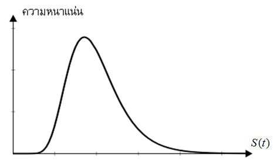
<figcaption>
รูปที่ 9.11 แสดงฟังก์ชันการแจกแจงความน่าจะเป็นของ S(t)
</figcaption>
</figure>

<!-- PDF page 334: independently reviewed -->
<h2 id="แบบฝกหดทายบทท-9">แบบฝึกหัดท้ายบทที่ 9</h2>
<ol type="1">
<li>พิจารณาแบบจำลองราคาแบบเวลาไม่ต่อเนื่องของหุ้น <math display="inline" xmlns="http://www.w3.org/1998/Math/MathML"><semantics><mi>S</mi><annotation encoding="application/x-tex">S</annotation></semantics></math> ที่ประกอบด้วย 2 คาบเวลา ดังแผนภาพ</li>
</ol>
<figure class="source-figure">
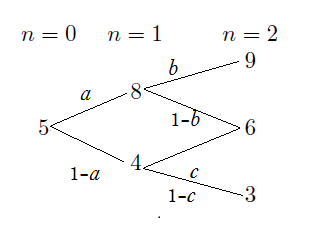
</figure>

และกำหนดให้ <math display="inline" xmlns="http://www.w3.org/1998/Math/MathML"><semantics><mi>r</mi><annotation encoding="application/x-tex">r</annotation></semantics></math> เป็นอัตราดอกเบี้ยต่อคาบของตราสารหนี้ <math display="inline" xmlns="http://www.w3.org/1998/Math/MathML"><semantics><mi>A</mi><annotation encoding="application/x-tex">A</annotation></semantics></math> จงหา <math display="inline" xmlns="http://www.w3.org/1998/Math/MathML"><semantics><mi>a</mi><annotation encoding="application/x-tex">a</annotation></semantics></math>, <math display="inline" xmlns="http://www.w3.org/1998/Math/MathML"><semantics><mi>b</mi><annotation encoding="application/x-tex">b</annotation></semantics></math> และ <math display="inline" xmlns="http://www.w3.org/1998/Math/MathML"><semantics><mi>c</mi><annotation encoding="application/x-tex">c</annotation></semantics></math> ซึ่งเป็นความน่าจะเป็นความเป็นกลางต่อความเสี่ยงในเทอมของ <math display="inline" xmlns="http://www.w3.org/1998/Math/MathML"><semantics><mi>r</mi><annotation encoding="application/x-tex">r</annotation></semantics></math> พร้อมทั้งตรวจสอบว่าแบบจำลองราคาสอดคล้องกับทฤษฎีบทหลักมูลการกำหนดราคาสินทรัพย์หรือไม่

<ol start="2" type="1">
<li>พิจารณาตลาดซึ่งมี 3 สภาวะ คือ <math display="inline" xmlns="http://www.w3.org/1998/Math/MathML"><semantics><msub><mi>ω</mi><mn>1</mn></msub><annotation encoding="application/x-tex">\omega_1</annotation></semantics></math>, <math display="inline" xmlns="http://www.w3.org/1998/Math/MathML"><semantics><msub><mi>ω</mi><mn>2</mn></msub><annotation encoding="application/x-tex">\omega_2</annotation></semantics></math> และ <math display="inline" xmlns="http://www.w3.org/1998/Math/MathML"><semantics><msub><mi>ω</mi><mn>3</mn></msub><annotation encoding="application/x-tex">\omega_3</annotation></semantics></math> ตามลำดับ โดยราคาและสภาวะสามารถเขียนตารางแสดงได้ดังนี้</li>
</ol>
<table>
<thead>
<tr>
<th style="text-align: center;">สภาวะ</th>
<th style="text-align: center;"><math display="inline" xmlns="http://www.w3.org/1998/Math/MathML"><semantics><mrow><mi>S</mi><mo stretchy="false" form="prefix">(</mo><mn>0</mn><mo stretchy="false" form="postfix">)</mo></mrow><annotation encoding="application/x-tex">S(0)</annotation></semantics></math></th>
<th style="text-align: center;"><math display="inline" xmlns="http://www.w3.org/1998/Math/MathML"><semantics><mrow><mi>S</mi><mo stretchy="false" form="prefix">(</mo><mn>1</mn><mo stretchy="false" form="postfix">)</mo></mrow><annotation encoding="application/x-tex">S(1)</annotation></semantics></math></th>
<th style="text-align: center;"><math display="inline" xmlns="http://www.w3.org/1998/Math/MathML"><semantics><mrow><mi>S</mi><mo stretchy="false" form="prefix">(</mo><mn>2</mn><mo stretchy="false" form="postfix">)</mo></mrow><annotation encoding="application/x-tex">S(2)</annotation></semantics></math></th>
<th style="text-align: center;"><math display="inline" xmlns="http://www.w3.org/1998/Math/MathML"><semantics><mrow><mi>S</mi><mo stretchy="false" form="prefix">(</mo><mn>3</mn><mo stretchy="false" form="postfix">)</mo></mrow><annotation encoding="application/x-tex">S(3)</annotation></semantics></math></th>
</tr>
</thead>
<tbody>
<tr>
<td style="text-align: center;"><math display="inline" xmlns="http://www.w3.org/1998/Math/MathML"><semantics><msub><mi>ω</mi><mn>1</mn></msub><annotation encoding="application/x-tex">\omega_1</annotation></semantics></math></td>
<td style="text-align: center;">100</td>
<td style="text-align: center;">120</td>
<td style="text-align: center;">120</td>
<td style="text-align: center;">125</td>
</tr>
<tr>
<td style="text-align: center;"><math display="inline" xmlns="http://www.w3.org/1998/Math/MathML"><semantics><msub><mi>ω</mi><mn>2</mn></msub><annotation encoding="application/x-tex">\omega_2</annotation></semantics></math></td>
<td style="text-align: center;">100</td>
<td style="text-align: center;">90</td>
<td style="text-align: center;">120</td>
<td style="text-align: center;">110</td>
</tr>
<tr>
<td style="text-align: center;"><math display="inline" xmlns="http://www.w3.org/1998/Math/MathML"><semantics><msub><mi>ω</mi><mn>3</mn></msub><annotation encoding="application/x-tex">\omega_3</annotation></semantics></math></td>
<td style="text-align: center;">100</td>
<td style="text-align: center;">90</td>
<td style="text-align: center;">110</td>
<td style="text-align: center;">120</td>
</tr>
</tbody>
</table>

2.1) จากสภาวะที่กำหนดให้จงเขียนเป็นต้นไม้แสดงการเคลื่อนไหวของราคา

2.2) จงคำนวณหา <math display="inline" xmlns="http://www.w3.org/1998/Math/MathML"><semantics><mrow><mi>K</mi><mo stretchy="false" form="prefix">(</mo><mi>n</mi><mo stretchy="false" form="postfix">)</mo></mrow><annotation encoding="application/x-tex">K(n)</annotation></semantics></math>

2.3) จงคำนวณหา <math display="inline" xmlns="http://www.w3.org/1998/Math/MathML"><semantics><mrow><mi>k</mi><mo stretchy="false" form="prefix">(</mo><mi>n</mi><mo stretchy="false" form="postfix">)</mo></mrow><annotation encoding="application/x-tex">k(n)</annotation></semantics></math> เมื่อกำหนดจ่ายเงินปันผล 2 บาทต่อหุ้นต่อคาบ

2.4) สมมติว่าความน่าจะเป็นของการเกิดสภาวะ <math display="inline" xmlns="http://www.w3.org/1998/Math/MathML"><semantics><msub><mi>ω</mi><mn>1</mn></msub><annotation encoding="application/x-tex">\omega_1</annotation></semantics></math>, <math display="inline" xmlns="http://www.w3.org/1998/Math/MathML"><semantics><msub><mi>ω</mi><mn>2</mn></msub><annotation encoding="application/x-tex">\omega_2</annotation></semantics></math> และ <math display="inline" xmlns="http://www.w3.org/1998/Math/MathML"><semantics><msub><mi>ω</mi><mn>3</mn></msub><annotation encoding="application/x-tex">\omega_3</annotation></semantics></math> เป็น 0.5, 0.3 และ 0.2 ตามลำดับ จงหาค่าคาดหวังของ <math display="inline" xmlns="http://www.w3.org/1998/Math/MathML"><semantics><mrow><mi>K</mi><mo stretchy="false" form="prefix">(</mo><mn>1</mn><mo>,</mo><mn>3</mn><mo stretchy="false" form="postfix">)</mo></mrow><annotation encoding="application/x-tex">K(1,3)</annotation></semantics></math>

<!-- PDF page 335: independently reviewed -->
<ol start="3" type="1">
<li>สมมติว่าราคาหุ้น <math display="inline" xmlns="http://www.w3.org/1998/Math/MathML"><semantics><mi>S</mi><annotation encoding="application/x-tex">S</annotation></semantics></math> เป็นไปตามแบบจำลองราคาต้นไม้ทวิภาค และ กำหนดให้</li>
</ol>

<math display="block" xmlns="http://www.w3.org/1998/Math/MathML"><semantics><mrow><mi>K</mi><mo stretchy="false" form="prefix">(</mo><mi>n</mi><mo stretchy="false" form="postfix">)</mo><mo>=</mo><mrow><mo stretchy="true" form="prefix">{</mo><mtable><mtr><mtd columnalign="left" style="text-align: left"><mn>0.2</mn><mo>;</mo><mspace width="1.0em"></mspace><mrow><mtext mathvariant="normal">probability </mtext><mspace width="0.333em"></mspace></mrow><mi>p</mi></mtd></mtr><mtr><mtd columnalign="left" style="text-align: left"><mn>0.05</mn><mo>;</mo><mspace width="1.0em"></mspace><mrow><mtext mathvariant="normal">probability </mtext><mspace width="0.333em"></mspace></mrow><mn>1</mn><mo>−</mo><mi>p</mi></mtd></mtr></mtable></mrow></mrow><annotation encoding="application/x-tex">K(n)=\begin{cases}0.2;\quad\text{probability }p\\0.05;\quad\text{probability }1-p\end{cases}</annotation></semantics></math>

กำหนดให้ <math display="inline" xmlns="http://www.w3.org/1998/Math/MathML"><semantics><mrow><mi>S</mi><mo stretchy="false" form="prefix">(</mo><mn>0</mn><mo stretchy="false" form="postfix">)</mo><mo>=</mo><mn>100</mn></mrow><annotation encoding="application/x-tex">S(0)=100</annotation></semantics></math> ถ้าความน่าจะเป็นความเป็นกลางต่อความเสี่ยงเท่ากับ 0.6 จงหาค่าคาดหวังความเป็นกลางต่อความเสี่ยงแบบมีเงื่อนไขของราคาหุ้น <math display="inline" xmlns="http://www.w3.org/1998/Math/MathML"><semantics><mrow><mi>S</mi><mo stretchy="false" form="prefix">(</mo><mn>3</mn><mo stretchy="false" form="postfix">)</mo></mrow><annotation encoding="application/x-tex">S(3)</annotation></semantics></math> เมื่อกำหนดราคาหุ้น <math display="inline" xmlns="http://www.w3.org/1998/Math/MathML"><semantics><mrow><mi>S</mi><mo stretchy="false" form="prefix">(</mo><mn>2</mn><mo stretchy="false" form="postfix">)</mo></mrow><annotation encoding="application/x-tex">S(2)</annotation></semantics></math> บาท

<ol start="4" type="1">
<li>
จากโจทย์ข้อ 3) จงหาราคาหุ้นส่วนลด (Discounted Stock Prices) ของคาบเวลาที่ 3
</li>
<li>
สมมติว่าราคาหุ้น <math display="inline" xmlns="http://www.w3.org/1998/Math/MathML"><semantics><mi>S</mi><annotation encoding="application/x-tex">S</annotation></semantics></math> เป็นไปตามแบบจำลองราคาต้นไม้ทวิภาค และ <math display="inline" xmlns="http://www.w3.org/1998/Math/MathML"><semantics><mrow><mi>S</mi><mo stretchy="false" form="prefix">(</mo><mn>0</mn><mo stretchy="false" form="postfix">)</mo><mo>=</mo><mn>100</mn></mrow><annotation encoding="application/x-tex">S(0)=100</annotation></semantics></math> โดยที่ความน่าจะเป็นของการเคลื่อนไหวราคาขึ้นเท่ากับการเคลื่อนไหวราคาลง และกำหนดให้แบ่งช่วงเวลา <math display="inline" xmlns="http://www.w3.org/1998/Math/MathML"><semantics><mrow><mo stretchy="false" form="prefix">[</mo><mn>0</mn><mo>,</mo><mn>1</mn><mo stretchy="false" form="postfix">]</mo></mrow><annotation encoding="application/x-tex">[0,1]</annotation></semantics></math> ออกเป็น 100 ช่องเท่าๆกัน ด้วยขนาดคาบเวลา <math display="inline" xmlns="http://www.w3.org/1998/Math/MathML"><semantics><mi>τ</mi><annotation encoding="application/x-tex">\tau</annotation></semantics></math> และกำหนดให้
</li>
</ol>

<math display="block" xmlns="http://www.w3.org/1998/Math/MathML"><semantics><mrow><mi>E</mi><mo stretchy="false" form="prefix">[</mo><mi>k</mi><mo stretchy="false" form="prefix">(</mo><mn>1</mn><mo stretchy="false" form="postfix">)</mo><mo stretchy="false" form="postfix">]</mo><mo>+</mo><mi>E</mi><mo stretchy="false" form="prefix">[</mo><mi>k</mi><mo stretchy="false" form="prefix">(</mo><mn>2</mn><mo stretchy="false" form="postfix">)</mo><mo stretchy="false" form="postfix">]</mo><mo>+</mo><mi>.</mi><mi>.</mi><mi>.</mi><mo>+</mo><mi>E</mi><mo stretchy="false" form="prefix">[</mo><mi>k</mi><mo stretchy="false" form="prefix">(</mo><mn>100</mn><mo stretchy="false" form="postfix">)</mo><mo stretchy="false" form="postfix">]</mo><mo>=</mo><mn>0.5</mn></mrow><annotation encoding="application/x-tex">E[k(1)]+E[k(2)]+...+E[k(100)]=0.5</annotation></semantics></math>

และ <math display="inline" xmlns="http://www.w3.org/1998/Math/MathML"><semantics><mrow><mrow><mi mathvariant="normal">Var</mi><mo>&#8289;</mo></mrow><mo stretchy="false" form="prefix">[</mo><mi>k</mi><mo stretchy="false" form="prefix">(</mo><mn>1</mn><mo stretchy="false" form="postfix">)</mo><mo stretchy="false" form="postfix">]</mo><mo>+</mo><mrow><mi mathvariant="normal">Var</mi><mo>&#8289;</mo></mrow><mo stretchy="false" form="prefix">[</mo><mi>k</mi><mo stretchy="false" form="prefix">(</mo><mn>2</mn><mo stretchy="false" form="postfix">)</mo><mo stretchy="false" form="postfix">]</mo><mo>+</mo><mi>.</mi><mi>.</mi><mi>.</mi><mo>+</mo><mrow><mi mathvariant="normal">Var</mi><mo>&#8289;</mo></mrow><mo stretchy="false" form="prefix">[</mo><mi>k</mi><mo stretchy="false" form="prefix">(</mo><mn>100</mn><mo stretchy="false" form="postfix">)</mo><mo stretchy="false" form="postfix">]</mo><mo>=</mo><mn>0.01</mn></mrow><annotation encoding="application/x-tex">\operatorname{Var}[k(1)]+\operatorname{Var}[k(2)]+...+\operatorname{Var}[k(100)]=0.01</annotation></semantics></math>

จงคำนวณหาราคาหุ้น <math display="inline" xmlns="http://www.w3.org/1998/Math/MathML"><semantics><mrow><mi>S</mi><mo stretchy="false" form="prefix">(</mo><mn>2</mn><mo stretchy="false" form="postfix">)</mo></mrow><annotation encoding="application/x-tex">S(2)</annotation></semantics></math>

<ol start="6" type="1">
<li>พิจารณาตลาดซึ่งมี 3 สภาวะ คือ ตลาดคึกคัก ตลาดซบเซา และตลาดผันผวน แทนด้วย <math display="inline" xmlns="http://www.w3.org/1998/Math/MathML"><semantics><msub><mi>ω</mi><mn>1</mn></msub><annotation encoding="application/x-tex">\omega_1</annotation></semantics></math>, <math display="inline" xmlns="http://www.w3.org/1998/Math/MathML"><semantics><msub><mi>ω</mi><mn>2</mn></msub><annotation encoding="application/x-tex">\omega_2</annotation></semantics></math> และ <math display="inline" xmlns="http://www.w3.org/1998/Math/MathML"><semantics><msub><mi>ω</mi><mn>3</mn></msub><annotation encoding="application/x-tex">\omega_3</annotation></semantics></math> ตามลำดับ โดยราคาและสภาวะสามารถเขียนตารางแสดงได้ดังนี้</li>
</ol>
<table>
<thead>
<tr>
<th style="text-align: center;">สภาวะ</th>
<th style="text-align: center;"><math display="inline" xmlns="http://www.w3.org/1998/Math/MathML"><semantics><mrow><mi>S</mi><mo stretchy="false" form="prefix">(</mo><mn>0</mn><mo stretchy="false" form="postfix">)</mo></mrow><annotation encoding="application/x-tex">S(0)</annotation></semantics></math></th>
<th style="text-align: center;"><math display="inline" xmlns="http://www.w3.org/1998/Math/MathML"><semantics><mrow><mi>S</mi><mo stretchy="false" form="prefix">(</mo><mn>1</mn><mo stretchy="false" form="postfix">)</mo></mrow><annotation encoding="application/x-tex">S(1)</annotation></semantics></math></th>
<th style="text-align: center;"><math display="inline" xmlns="http://www.w3.org/1998/Math/MathML"><semantics><mrow><mi>S</mi><mo stretchy="false" form="prefix">(</mo><mn>2</mn><mo stretchy="false" form="postfix">)</mo></mrow><annotation encoding="application/x-tex">S(2)</annotation></semantics></math></th>
</tr>
</thead>
<tbody>
<tr>
<td style="text-align: center;"><math display="inline" xmlns="http://www.w3.org/1998/Math/MathML"><semantics><msub><mi>ω</mi><mn>1</mn></msub><annotation encoding="application/x-tex">\omega_1</annotation></semantics></math></td>
<td style="text-align: center;">90</td>
<td style="text-align: center;">100</td>
<td style="text-align: center;">110</td>
</tr>
<tr>
<td style="text-align: center;"><math display="inline" xmlns="http://www.w3.org/1998/Math/MathML"><semantics><msub><mi>ω</mi><mn>2</mn></msub><annotation encoding="application/x-tex">\omega_2</annotation></semantics></math></td>
<td style="text-align: center;">90</td>
<td style="text-align: center;">80</td>
<td style="text-align: center;">90</td>
</tr>
<tr>
<td style="text-align: center;"><math display="inline" xmlns="http://www.w3.org/1998/Math/MathML"><semantics><msub><mi>ω</mi><mn>3</mn></msub><annotation encoding="application/x-tex">\omega_3</annotation></semantics></math></td>
<td style="text-align: center;">90</td>
<td style="text-align: center;">110</td>
<td style="text-align: center;">99</td>
</tr>
</tbody>
</table>

จากสภาวะที่กำหนดให้ จงเขียนเป็นต้นไม้แสดงการเคลื่อนไหวของราคาดังกล่าว

<ol start="7" type="1">
<li>จากข้อ 6) โดยสมมติว่าความน่าจะเป็นของการเกิดสภาวะ เป็น 0.5, 0.2 และ 0.3 ตามลำดับ จงคำนวณค่าของ <math display="inline" xmlns="http://www.w3.org/1998/Math/MathML"><semantics><mrow><mi>E</mi><mo stretchy="false" form="prefix">[</mo><mi>K</mi><mo stretchy="false" form="prefix">(</mo><mi>t</mi><mo stretchy="false" form="postfix">)</mo><mo stretchy="false" form="postfix">]</mo></mrow><annotation encoding="application/x-tex">E[K(t)]</annotation></semantics></math> และ <math display="inline" xmlns="http://www.w3.org/1998/Math/MathML"><semantics><mrow><mi>E</mi><mo stretchy="false" form="prefix">[</mo><mi>k</mi><mo stretchy="false" form="prefix">(</mo><mi>t</mi><mo stretchy="false" form="postfix">)</mo><mo stretchy="false" form="postfix">]</mo></mrow><annotation encoding="application/x-tex">E[k(t)]</annotation></semantics></math> ในกรณีต่อไปนี้</li>
</ol>

7.1) ไม่มีการจ่ายเงินปันผล

7.2) มีการจ่ายเงินปันผล 1.50 บาทต่อหุ้น

<!-- PDF page 336: independently reviewed -->
<ol start="8" type="1">
<li>กำหนดให้ <math display="inline" xmlns="http://www.w3.org/1998/Math/MathML"><semantics><mi>i</mi><annotation encoding="application/x-tex">i</annotation></semantics></math> เป็นอัตราดอกเบี้ยของตราสารหนี้ <math display="inline" xmlns="http://www.w3.org/1998/Math/MathML"><semantics><mi>A</mi><annotation encoding="application/x-tex">A</annotation></semantics></math> ซึ่ง <math display="inline" xmlns="http://www.w3.org/1998/Math/MathML"><semantics><mrow><mn>100</mn><mi>A</mi><mo stretchy="false" form="prefix">(</mo><mn>2</mn><mo stretchy="false" form="postfix">)</mo><mo>−</mo><mi>A</mi><mo stretchy="false" form="prefix">(</mo><mn>0</mn><mo stretchy="false" form="postfix">)</mo><mo>=</mo><mn>5</mn><mo>,</mo><mn>568</mn></mrow><annotation encoding="application/x-tex">100A(2)-A(0)=5,568</annotation></semantics></math>, <math display="inline" xmlns="http://www.w3.org/1998/Math/MathML"><semantics><mrow><mi>A</mi><mo stretchy="false" form="prefix">(</mo><mn>0</mn><mo stretchy="false" form="postfix">)</mo><mo>=</mo><mn>50</mn></mrow><annotation encoding="application/x-tex">A(0)=50</annotation></semantics></math> และสมมติว่าราคาของหุ้น <math display="inline" xmlns="http://www.w3.org/1998/Math/MathML"><semantics><mi>S</mi><annotation encoding="application/x-tex">S</annotation></semantics></math> เป็นไปได้ 4 สภาวะ คือ <math display="inline" xmlns="http://www.w3.org/1998/Math/MathML"><semantics><msub><mi>ω</mi><mn>1</mn></msub><annotation encoding="application/x-tex">\omega_1</annotation></semantics></math>, <math display="inline" xmlns="http://www.w3.org/1998/Math/MathML"><semantics><msub><mi>ω</mi><mn>2</mn></msub><annotation encoding="application/x-tex">\omega_2</annotation></semantics></math>, <math display="inline" xmlns="http://www.w3.org/1998/Math/MathML"><semantics><msub><mi>ω</mi><mn>3</mn></msub><annotation encoding="application/x-tex">\omega_3</annotation></semantics></math> และ <math display="inline" xmlns="http://www.w3.org/1998/Math/MathML"><semantics><msub><mi>ω</mi><mn>4</mn></msub><annotation encoding="application/x-tex">\omega_4</annotation></semantics></math> ดังนี้</li>
</ol>
<table>
<thead>
<tr>
<th style="text-align: center;">สภาวะ</th>
<th style="text-align: center;"><math display="inline" xmlns="http://www.w3.org/1998/Math/MathML"><semantics><mrow><mi>S</mi><mo stretchy="false" form="prefix">(</mo><mn>0</mn><mo stretchy="false" form="postfix">)</mo></mrow><annotation encoding="application/x-tex">S(0)</annotation></semantics></math></th>
<th style="text-align: center;"><math display="inline" xmlns="http://www.w3.org/1998/Math/MathML"><semantics><mrow><mi>S</mi><mo stretchy="false" form="prefix">(</mo><mn>1</mn><mo stretchy="false" form="postfix">)</mo></mrow><annotation encoding="application/x-tex">S(1)</annotation></semantics></math></th>
<th style="text-align: center;"><math display="inline" xmlns="http://www.w3.org/1998/Math/MathML"><semantics><mrow><mi>S</mi><mo stretchy="false" form="prefix">(</mo><mn>2</mn><mo stretchy="false" form="postfix">)</mo></mrow><annotation encoding="application/x-tex">S(2)</annotation></semantics></math></th>
</tr>
</thead>
<tbody>
<tr>
<td style="text-align: center;"><math display="inline" xmlns="http://www.w3.org/1998/Math/MathML"><semantics><msub><mi>ω</mi><mn>1</mn></msub><annotation encoding="application/x-tex">\omega_1</annotation></semantics></math></td>
<td style="text-align: center;">100</td>
<td style="text-align: center;">110</td>
<td style="text-align: center;">120</td>
</tr>
<tr>
<td style="text-align: center;"><math display="inline" xmlns="http://www.w3.org/1998/Math/MathML"><semantics><msub><mi>ω</mi><mn>2</mn></msub><annotation encoding="application/x-tex">\omega_2</annotation></semantics></math></td>
<td style="text-align: center;">100</td>
<td style="text-align: center;">110</td>
<td style="text-align: center;">115</td>
</tr>
<tr>
<td style="text-align: center;"><math display="inline" xmlns="http://www.w3.org/1998/Math/MathML"><semantics><msub><mi>ω</mi><mn>3</mn></msub><annotation encoding="application/x-tex">\omega_3</annotation></semantics></math></td>
<td style="text-align: center;">100</td>
<td style="text-align: center;">90</td>
<td style="text-align: center;">100</td>
</tr>
<tr>
<td style="text-align: center;"><math display="inline" xmlns="http://www.w3.org/1998/Math/MathML"><semantics><msub><mi>ω</mi><mn>4</mn></msub><annotation encoding="application/x-tex">\omega_4</annotation></semantics></math></td>
<td style="text-align: center;">100</td>
<td style="text-align: center;">90</td>
<td style="text-align: center;">80</td>
</tr>
</tbody>
</table>

ให้ <math display="inline" xmlns="http://www.w3.org/1998/Math/MathML"><semantics><msup><mi>p</mi><mo>*</mo></msup><annotation encoding="application/x-tex">p^*</annotation></semantics></math>, <math display="inline" xmlns="http://www.w3.org/1998/Math/MathML"><semantics><msup><mi>q</mi><mo>*</mo></msup><annotation encoding="application/x-tex">q^*</annotation></semantics></math> และ <math display="inline" xmlns="http://www.w3.org/1998/Math/MathML"><semantics><msup><mi>r</mi><mo>*</mo></msup><annotation encoding="application/x-tex">r^*</annotation></semantics></math> ความน่าจะเป็นความเป็นกลางต่อความเสี่ยงในกิ่งราคาของแต่ละขั้วกิ่งดังรูป

<figure class="source-figure">
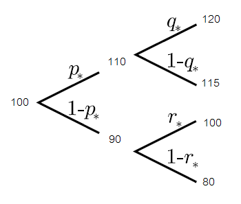
</figure>

จงแสดงว่าการกำหนดราคาของหุ้นสอดคล้องหลักการปราศจากการค้ากำไร หรือไม่

<ol start="9" type="1">
<li>
สมมติให้ราคาหุ้น <math display="inline" xmlns="http://www.w3.org/1998/Math/MathML"><semantics><mrow><mi>S</mi><mo stretchy="false" form="prefix">(</mo><mi>t</mi><mo stretchy="false" form="postfix">)</mo></mrow><annotation encoding="application/x-tex">S(t)</annotation></semantics></math> เป็นไปตามแบบจำลองต้นไม้ทวิภาค จงคำนวณหา <math display="inline" xmlns="http://www.w3.org/1998/Math/MathML"><semantics><mi>u</mi><annotation encoding="application/x-tex">u</annotation></semantics></math> และ <math display="inline" xmlns="http://www.w3.org/1998/Math/MathML"><semantics><mi>d</mi><annotation encoding="application/x-tex">d</annotation></semantics></math> ที่ทำให้ <math display="inline" xmlns="http://www.w3.org/1998/Math/MathML"><semantics><mrow><mi>S</mi><mo stretchy="false" form="prefix">(</mo><mn>1</mn><mo stretchy="false" form="postfix">)</mo><mo>=</mo><mrow><mo stretchy="true" form="prefix">{</mo><mtable><mtr><mtd columnalign="left" style="text-align: left"><mn>90</mn><mo>;</mo><mspace width="1.0em"></mspace><mo>↑</mo></mtd></mtr><mtr><mtd columnalign="left" style="text-align: left"><mn>73</mn><mo>;</mo><mspace width="1.0em"></mspace><mo>↓</mo></mtd></mtr></mtable></mrow></mrow><annotation encoding="application/x-tex">S(1)=\begin{cases}90;\quad\uparrow\\73;\quad\downarrow\end{cases}</annotation></semantics></math> และ <math display="inline" xmlns="http://www.w3.org/1998/Math/MathML"><semantics><mrow><mi>S</mi><mo stretchy="false" form="prefix">(</mo><mn>2</mn><mo stretchy="false" form="postfix">)</mo><mo>=</mo><mn>89</mn><mo>;</mo><mspace width="1.0em"></mspace><mo>↓</mo><mo>↓</mo></mrow><annotation encoding="application/x-tex">S(2)=89;\quad\downarrow\downarrow</annotation></semantics></math>
</li>
<li>
สมมติให้ราคาหุ้น <math display="inline" xmlns="http://www.w3.org/1998/Math/MathML"><semantics><mrow><mi>S</mi><mo stretchy="false" form="prefix">(</mo><mi>t</mi><mo stretchy="false" form="postfix">)</mo></mrow><annotation encoding="application/x-tex">S(t)</annotation></semantics></math> เป็นไปตามแบบจำลองต้นไม้ทวิภาค และ <math display="inline" xmlns="http://www.w3.org/1998/Math/MathML"><semantics><mrow><mi>K</mi><mo stretchy="false" form="prefix">(</mo><mi>n</mi><mo stretchy="false" form="postfix">)</mo><mo>=</mo><mrow><mo stretchy="true" form="prefix">{</mo><mtable><mtr><mtd columnalign="left" style="text-align: left"><mi>u</mi><mo>;</mo><mspace width="1.0em"></mspace><mo>↑</mo></mtd></mtr><mtr><mtd columnalign="left" style="text-align: left"><mi>d</mi><mo>;</mo><mspace width="1.0em"></mspace><mo>↓</mo></mtd></mtr></mtable></mrow></mrow><annotation encoding="application/x-tex">K(n)=\begin{cases}u;\quad\uparrow\\d;\quad\downarrow\end{cases}</annotation></semantics></math> ซึ่งทำให้ <math display="inline" xmlns="http://www.w3.org/1998/Math/MathML"><semantics><mrow><mi>S</mi><mo stretchy="false" form="prefix">(</mo><mn>2</mn><mo stretchy="false" form="postfix">)</mo><mo>=</mo><mrow><mo stretchy="true" form="prefix">{</mo><mtable><mtr><mtd columnalign="left" style="text-align: left"><mn>112</mn><mo>;</mo><mspace width="1.0em"></mspace><mo>↑</mo><mo>↑</mo></mtd></mtr><mtr><mtd columnalign="left" style="text-align: left"><mn>104</mn><mo>;</mo><mspace width="1.0em"></mspace><mo>↑</mo><mo>↓</mo><mrow><mspace width="0.333em"></mspace><mtext mathvariant="normal"> or </mtext><mspace width="0.333em"></mspace></mrow><mo>↓</mo><mo>↑</mo></mtd></mtr><mtr><mtd columnalign="left" style="text-align: left"><mn>96</mn><mo>;</mo><mspace width="1.0em"></mspace><mo>↓</mo><mo>↓</mo></mtd></mtr></mtable></mrow></mrow><annotation encoding="application/x-tex">S(2)=\begin{cases}112;\quad\uparrow\uparrow\\104;\quad\uparrow\downarrow\text{ or }\downarrow\uparrow\\96;\quad\downarrow\downarrow\end{cases}</annotation></semantics></math> ถ้า <math display="inline" xmlns="http://www.w3.org/1998/Math/MathML"><semantics><mrow><mi>S</mi><mo stretchy="false" form="prefix">(</mo><mn>0</mn><mo stretchy="false" form="postfix">)</mo><mo>=</mo><mn>100</mn></mrow><annotation encoding="application/x-tex">S(0)=100</annotation></semantics></math> แล้ว จงหา <math display="inline" xmlns="http://www.w3.org/1998/Math/MathML"><semantics><mrow><mi>S</mi><mo stretchy="false" form="prefix">(</mo><mn>3</mn><mo stretchy="false" form="postfix">)</mo></mrow><annotation encoding="application/x-tex">S(3)</annotation></semantics></math>
</li>
<li>
สำหรับแบบจำลองราคาต้นไม้ไตรภาค กำหนดให้ <math display="inline" xmlns="http://www.w3.org/1998/Math/MathML"><semantics><mrow><mi>u</mi><mo>=</mo><mn>0.12</mn></mrow><annotation encoding="application/x-tex">u=0.12</annotation></semantics></math>, <math display="inline" xmlns="http://www.w3.org/1998/Math/MathML"><semantics><mrow><mi>m</mi><mo>=</mo><mn>0.05</mn></mrow><annotation encoding="application/x-tex">m=0.05</annotation></semantics></math>, <math display="inline" xmlns="http://www.w3.org/1998/Math/MathML"><semantics><mrow><mi>d</mi><mo>=</mo><mn>0</mn></mrow><annotation encoding="application/x-tex">d=0</annotation></semantics></math> และ <math display="inline" xmlns="http://www.w3.org/1998/Math/MathML"><semantics><mrow><mi>r</mi><mo>=</mo><mn>0.1</mn></mrow><annotation encoding="application/x-tex">r=0.1</annotation></semantics></math> จงหาความน่าจะเป็นความเป็นกลางต่อความเสี่ยงที่เป็นไปได้ทั้งหมด
</li>
<li>
จากแบบจำลองราคาเวลาต่อเนื่อง กำหนดให้ <math display="inline" xmlns="http://www.w3.org/1998/Math/MathML"><semantics><mrow><mi>E</mi><mo stretchy="false" form="prefix">[</mo><mi>k</mi><mo stretchy="false" form="prefix">(</mo><mi>n</mi><mo stretchy="false" form="postfix">)</mo><mo stretchy="false" form="postfix">]</mo><mo>=</mo><mn>0.0049</mn></mrow><annotation encoding="application/x-tex">E[k(n)]=0.0049</annotation></semantics></math> และ <math display="inline" xmlns="http://www.w3.org/1998/Math/MathML"><semantics><mrow><mrow><mi mathvariant="normal">Var</mi><mo>&#8289;</mo></mrow><mo stretchy="false" form="prefix">[</mo><mi>k</mi><mo stretchy="false" form="prefix">(</mo><mi>n</mi><mo stretchy="false" form="postfix">)</mo><mo stretchy="false" form="postfix">]</mo><mo>=</mo><mn>0.0002</mn></mrow><annotation encoding="application/x-tex">\operatorname{Var}[k(n)]=0.0002</annotation></semantics></math> สำหรับทุกๆ <math display="inline" xmlns="http://www.w3.org/1998/Math/MathML"><semantics><mrow><mi>n</mi><mo>=</mo><mn>1</mn><mo>,</mo><mn>2</mn><mo>,</mo><mi>.</mi><mi>.</mi><mi>.</mi><mo>,</mo><mn>12</mn></mrow><annotation encoding="application/x-tex">n=1,2,...,12</annotation></semantics></math> จงคำนวณหา <math display="inline" xmlns="http://www.w3.org/1998/Math/MathML"><semantics><mrow><mi>K</mi><mo stretchy="false" form="prefix">(</mo><mi>n</mi><mo stretchy="false" form="postfix">)</mo></mrow><annotation encoding="application/x-tex">K(n)</annotation></semantics></math>
</li>
</ol>
