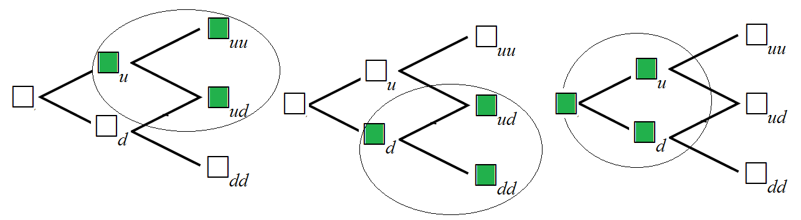
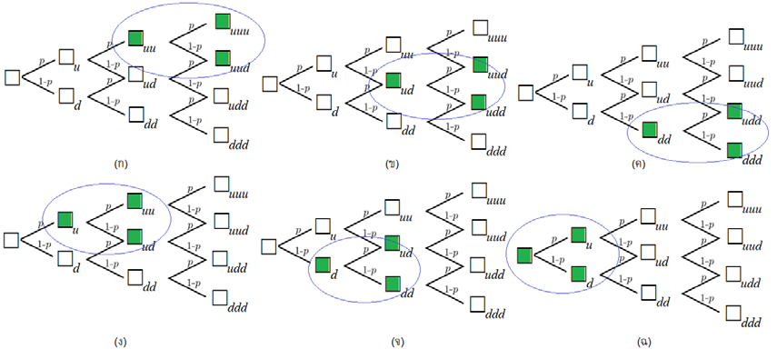

<!-- PDF page 338: independently reviewed -->

เนื้อหาประกอบด้วย

10.1 ยูโรเปียนออปชั่น

10.2 การกำหนดราคายูโรเปียนออปชั่น

10.3 อเมริกันออปชั่น

10.4 สูตรของแบล็ก-โชลส์

<h2 id="บทนำ">บทนำ</h2>

ในบทที่ 8 ได้กล่าวถึงการกำหนดราคาออปชั่นโดยใช้แบบจำลองต้นไม้ทวิภาค 1 คาบเวลา หัวใจสำคัญของการกำหนดราคาออปชั่น คือ จะต้องไม่ทำให้เกิดการค้ากำไรโดยปราศจากความเสี่ยง นั่นคือ การกำหนดราคาออปชั่นจะต้องสอดคล้องกับหลักการปราศจากการค้ากำไร นั่นเอง ในบทนี้ จะกล่าวถึงแบบจำลองราคาของตราสารออปชั่น 2 ประเภท คือ ออปชั่นแบบยุโรป หรือ ยูโรเปียนออปชั่น (European Option) และ ออปชั่นแบบอเมริกา หรือ อเมริกันออปชั่น (American Option) ซึ่งแบ่งประเภทตามเวลาการใช้สิทธิ โดยที่ ยูโรเปียนออปชั่น เป็นตราสารออปชั่นที่ให้สิทธิแก่ผู้ถือตราสารสามารถใช้สิทธิซื้อหรือสิทธิขายสินทรัพย์อ้างอิงตามราคาที่ระบุไว้ในสัญญาได้แค่ ณ วันครบอายุสัญญาเท่านั้น ส่วน อเมริกันออปชั่นเป็นตราสารออปชั่นที่ให้สิทธิแก่ผู้ถือตราสารสามารถใช้สิทธิซื้อหรือสิทธิขายสินทรัพย์อ้างอิงตามราคาที่ระบุไว้ในสัญญา ณ วันใดก็ได้ตลอดอายุสัญญา นั่นคือ ถ้ากำหนดให้ <math display="inline" xmlns="http://www.w3.org/1998/Math/MathML"><semantics><mrow><mi>S</mi><mo stretchy="false" form="prefix">(</mo><mi>t</mi><mo stretchy="false" form="postfix">)</mo></mrow><annotation encoding="application/x-tex">S(t)</annotation></semantics></math> เป็นราคาหุ้นต่อหน่วย <math display="inline" xmlns="http://www.w3.org/1998/Math/MathML"><semantics><mrow><mi>t</mi><mo>=</mo><mn>0</mn></mrow><annotation encoding="application/x-tex">t=0</annotation></semantics></math> เป็นเวลาปัจจุบัน, <math display="inline" xmlns="http://www.w3.org/1998/Math/MathML"><semantics><mrow><mi>t</mi><mo>=</mo><mi>T</mi></mrow><annotation encoding="application/x-tex">t=T</annotation></semantics></math> เป็นเวลาครบกำหนดตามที่ระบุในสัญญาออปชั่น (Expiry time or Exercise time) และ <math display="inline" xmlns="http://www.w3.org/1998/Math/MathML"><semantics><mi>K</mi><annotation encoding="application/x-tex">K</annotation></semantics></math> เป็นราคาใช้สิทธิ (Strike price or Exercise price) นั่นแสดงว่า ยูโรเปียนออปชั่นจะสามารถใช้สิทธิตามที่ระบุในสัญญาได้ที่เวลา <math display="inline" xmlns="http://www.w3.org/1998/Math/MathML"><semantics><mrow><mi>t</mi><mo>=</mo><mi>T</mi></mrow><annotation encoding="application/x-tex">t=T</annotation></semantics></math> เท่านั้น ส่วนอเมริกันออปชั่นจะสามารถใช้สิทธิได้ตลอดเวลาตั้งแต่เวลา <math display="inline" xmlns="http://www.w3.org/1998/Math/MathML"><semantics><mrow><mi>t</mi><mo>=</mo><mn>0</mn></mrow><annotation encoding="application/x-tex">t=0</annotation></semantics></math> ถึงเวลา <math display="inline" xmlns="http://www.w3.org/1998/Math/MathML"><semantics><mrow><mi>t</mi><mo>=</mo><mi>T</mi></mrow><annotation encoding="application/x-tex">t=T</annotation></semantics></math> นอกจากนี้ยังได้กล่าวถึงสูตรของแบล็กโชลส์ ซึ่งเป็นสูตรที่ใช้ในการกำหนดราคาตราสารที่มีชื่อเสียงอีกด้วย

<!-- PDF page 339: independently reviewed -->
<h2 id="ยโรเปยนออปชน">10.1 ยูโรเปียนออปชั่น</h2>

การกำหนดราคาออปชั่นโดยใช้แบบจำลองราคาตลาดอย่างง่าย หรือแบบจำลองต้นไม้ทวิภาค 1 คาบ เป็นการกำหนดราคาของยูโรเปียนคอลออปชั่น โดยมีเวลาครบกำหนดที่ <math display="inline" xmlns="http://www.w3.org/1998/Math/MathML"><semantics><mrow><mi>t</mi><mo>=</mo><mn>1</mn></mrow><annotation encoding="application/x-tex">t=1</annotation></semantics></math> และผลประโยชน์คือ

<math display="block" xmlns="http://www.w3.org/1998/Math/MathML"><semantics><mrow><mrow><mi mathvariant="normal">max</mi><mo>&#8289;</mo></mrow><mo stretchy="false" form="prefix">{</mo><mi>S</mi><mo stretchy="false" form="prefix">(</mo><mn>1</mn><mo stretchy="false" form="postfix">)</mo><mo>−</mo><mi>K</mi><mo>,</mo><mn>0</mn><mo stretchy="false" form="postfix">}</mo><mo>=</mo><mrow><mo stretchy="true" form="prefix">{</mo><mtable><mtr><mtd columnalign="left" style="text-align: left"><mi>S</mi><mo stretchy="false" form="prefix">(</mo><mn>1</mn><mo stretchy="false" form="postfix">)</mo><mo>−</mo><mi>K</mi><mo>;</mo></mtd><mtd columnalign="left" style="text-align: left"><mi>S</mi><mo stretchy="false" form="prefix">(</mo><mn>1</mn><mo stretchy="false" form="postfix">)</mo><mo>&gt;</mo><mi>K</mi></mtd></mtr><mtr><mtd columnalign="left" style="text-align: left"><mn>0</mn><mo>;</mo></mtd><mtd columnalign="left" style="text-align: left"><mi>S</mi><mo stretchy="false" form="prefix">(</mo><mn>1</mn><mo stretchy="false" form="postfix">)</mo><mo>≤</mo><mi>K</mi></mtd></mtr></mtable></mrow></mrow><annotation encoding="application/x-tex">\max\{S(1)-K,0\}=\begin{cases}S(1)-K;&amp;S(1)&gt;K\\0;&amp;S(1)\le K\end{cases}</annotation></semantics></math>

ในที่นี้ที่เวลา <math display="inline" xmlns="http://www.w3.org/1998/Math/MathML"><semantics><mrow><mi>t</mi><mo>=</mo><mn>1</mn></mrow><annotation encoding="application/x-tex">t=1</annotation></semantics></math> ในแบบจำลองจำลองต้นไม้ทวิภาค 1 คาบ จะหมายถึงเวลา ณ เวลาครบกำหนด <math display="inline" xmlns="http://www.w3.org/1998/Math/MathML"><semantics><mi>T</mi><annotation encoding="application/x-tex">T</annotation></semantics></math> นั่นเอง ดังนั้น ผลประโยชน์ของยูโรเปียนคอลออปชั่นจึงสามารถเขียนได้ในรูป

<math display="block" xmlns="http://www.w3.org/1998/Math/MathML"><semantics><mrow><mrow><mi mathvariant="normal">max</mi><mo>&#8289;</mo></mrow><mo stretchy="false" form="prefix">{</mo><mi>S</mi><mo stretchy="false" form="prefix">(</mo><mi>T</mi><mo stretchy="false" form="postfix">)</mo><mo>−</mo><mi>K</mi><mo>,</mo><mn>0</mn><mo stretchy="false" form="postfix">}</mo><mo>=</mo><mrow><mo stretchy="true" form="prefix">{</mo><mtable><mtr><mtd columnalign="left" style="text-align: left"><mi>S</mi><mo stretchy="false" form="prefix">(</mo><mi>T</mi><mo stretchy="false" form="postfix">)</mo><mo>−</mo><mi>K</mi><mo>;</mo></mtd><mtd columnalign="left" style="text-align: left"><mi>S</mi><mo stretchy="false" form="prefix">(</mo><mi>T</mi><mo stretchy="false" form="postfix">)</mo><mo>&gt;</mo><mi>K</mi></mtd></mtr><mtr><mtd columnalign="left" style="text-align: left"><mn>0</mn><mo>;</mo></mtd><mtd columnalign="left" style="text-align: left"><mi>S</mi><mo stretchy="false" form="prefix">(</mo><mi>T</mi><mo stretchy="false" form="postfix">)</mo><mo>≤</mo><mi>K</mi></mtd></mtr></mtable></mrow><mspace width="2.0em"></mspace><mo stretchy="false" form="prefix">(</mo><mn>10.1</mn><mo stretchy="false" form="postfix">)</mo></mrow><annotation encoding="application/x-tex">\max\{S(T)-K,0\}=\begin{cases}S(T)-K;&amp;S(T)&gt;K\\0;&amp;S(T)\le K\end{cases}\qquad(10.1)</annotation></semantics></math>

เพื่อความสะดวกจะแทน <math display="inline" xmlns="http://www.w3.org/1998/Math/MathML"><semantics><mrow><mrow><mi mathvariant="normal">max</mi><mo>&#8289;</mo></mrow><mo stretchy="false" form="prefix">{</mo><mi>S</mi><mo stretchy="false" form="prefix">(</mo><mi>T</mi><mo stretchy="false" form="postfix">)</mo><mo>−</mo><mi>K</mi><mo>,</mo><mn>0</mn><mo stretchy="false" form="postfix">}</mo></mrow><annotation encoding="application/x-tex">\max\{S(T)-K,0\}</annotation></semantics></math> ด้วย <math display="inline" xmlns="http://www.w3.org/1998/Math/MathML"><semantics><mrow><mo stretchy="false" form="prefix">[</mo><mi>S</mi><mo stretchy="false" form="prefix">(</mo><mi>T</mi><mo stretchy="false" form="postfix">)</mo><mo>−</mo><mi>K</mi><msup><mo stretchy="false" form="postfix">]</mo><mo>+</mo></msup></mrow><annotation encoding="application/x-tex">[S(T)-K]^+</annotation></semantics></math> เมื่อ <math display="inline" xmlns="http://www.w3.org/1998/Math/MathML"><semantics><mrow><mo stretchy="false" form="prefix">[</mo><mi>x</mi><msup><mo stretchy="false" form="postfix">]</mo><mo>+</mo></msup><mo>=</mo><mrow><mo stretchy="true" form="prefix">{</mo><mtable><mtr><mtd columnalign="left" style="text-align: left"><mi>x</mi><mo>;</mo></mtd><mtd columnalign="left" style="text-align: left"><mi>x</mi><mo>&gt;</mo><mn>0</mn></mtd></mtr><mtr><mtd columnalign="left" style="text-align: left"><mn>0</mn><mo>;</mo></mtd><mtd columnalign="left" style="text-align: left"><mi>x</mi><mo>≤</mo><mn>0</mn></mtd></mtr></mtable></mrow></mrow><annotation encoding="application/x-tex">[x]^+=\begin{cases}x;&amp;x&gt;0\\0;&amp;x\le0\end{cases}</annotation></semantics></math> (เรียกว่า ฟังก์ชันส่วนบวก ) และ ผลประโยชน์ของยูโรเปียนพุทออปชั่น คือ

<math display="block" xmlns="http://www.w3.org/1998/Math/MathML"><semantics><mrow><mo stretchy="false" form="prefix">[</mo><mi>K</mi><mo>−</mo><mi>S</mi><mo stretchy="false" form="prefix">(</mo><mi>T</mi><mo stretchy="false" form="postfix">)</mo><msup><mo stretchy="false" form="postfix">]</mo><mo>+</mo></msup><mspace width="2.0em"></mspace><mo stretchy="false" form="prefix">(</mo><mn>10.2</mn><mo stretchy="false" form="postfix">)</mo></mrow><annotation encoding="application/x-tex">[K-S(T)]^+\qquad(10.2)</annotation></semantics></math>

เนื่องจาก ผลประโยชน์ มีค่าไม่เป็นลบ ดังนั้น ค่าพรีเมียมจึงมีค่ามากกว่าศูนย์และถูกจ่ายเพื่อซื้อออปชั่นหรือซื้อสิทธิในการซื้อหรือการขายสินค้าอ้างอิง หากไม่มีการจ่ายพรีเมียมเพื่อซื้อออปชั่นจะเกิดการค้ากำไร (Arbitrage) โดยนักลงทุนสามารถทำกำไรได้โดยถือสัญญาออปชั่นและใช้สิทธิเมื่อผลประโยชน์มีค่าเป็นบวก ซึ่งหากเกิดเหตุการณ์เช่นนี้แล้วจะขัดแย้งกับหลักการปราศจากการค้ากำไร ในที่นี้ค่าพรีเมียมจะเป็นราคาตลาดของออปชั่น เพื่อความสะดวกต่อไปจะแทน ค่าพรีเมียมของยูโรเปียนคอลออปชั่นและยูโรเปียนพุทออปชั่นด้วย <math display="inline" xmlns="http://www.w3.org/1998/Math/MathML"><semantics><msup><mi>C</mi><mi>E</mi></msup><annotation encoding="application/x-tex">C^E</annotation></semantics></math> และ <math display="inline" xmlns="http://www.w3.org/1998/Math/MathML"><semantics><msup><mi>P</mi><mi>E</mi></msup><annotation encoding="application/x-tex">P^E</annotation></semantics></math> ตามลำดับ โดยที่ <math display="inline" xmlns="http://www.w3.org/1998/Math/MathML"><semantics><mi>δ</mi><annotation encoding="application/x-tex">\delta</annotation></semantics></math> เป็นอัตราดอกเบี้ยทบต้นต่อเนื่องที่สมมูลกับอัตราดอกเบี้ยทบต้นต่อคาบ <math display="inline" xmlns="http://www.w3.org/1998/Math/MathML"><semantics><mi>r</mi><annotation encoding="application/x-tex">r</annotation></semantics></math> นั่นคือ <math display="inline" xmlns="http://www.w3.org/1998/Math/MathML"><semantics><mrow><msup><mi>e</mi><mi>δ</mi></msup><mo>=</mo><mn>1</mn><mo>+</mo><mi>r</mi></mrow><annotation encoding="application/x-tex">e^\delta=1+r</annotation></semantics></math>

สำหรับผู้ซื้อคอลออปชั่น (Buyer) สมมติว่านักลงทุนยืมเงินจำนวน <math display="inline" xmlns="http://www.w3.org/1998/Math/MathML"><semantics><msup><mi>C</mi><mi>E</mi></msup><annotation encoding="application/x-tex">C^E</annotation></semantics></math> บาทด้วยอัตราดอกเบี้ยทบต้นต่อเนื่อง <math display="inline" xmlns="http://www.w3.org/1998/Math/MathML"><semantics><mi>δ</mi><annotation encoding="application/x-tex">\delta</annotation></semantics></math> เพื่อซื้อคอลออปชั่นจำนวน 1 สัญญา ดังนั้นที่เวลา <math display="inline" xmlns="http://www.w3.org/1998/Math/MathML"><semantics><mi>T</mi><annotation encoding="application/x-tex">T</annotation></semantics></math> นักลงทุนจะได้กำไรจากการซื้อคอลออปชั่น เท่ากับ ผลประโยชน์ที่รับ หักออกด้วย หนี้ชำระคืน <math display="inline" xmlns="http://www.w3.org/1998/Math/MathML"><semantics><mrow><mo>=</mo><mo stretchy="false" form="prefix">[</mo><mi>S</mi><mo stretchy="false" form="prefix">(</mo><mi>T</mi><mo stretchy="false" form="postfix">)</mo><mo>−</mo><mi>K</mi><msup><mo stretchy="false" form="postfix">]</mo><mo>+</mo></msup><mo>−</mo><msup><mi>C</mi><mi>E</mi></msup><msup><mi>e</mi><mrow><mi>δ</mi><mi>T</mi></mrow></msup><mspace width="2.0em"></mspace><mo stretchy="false" form="prefix">(</mo><mn>10.3</mn><mo stretchy="false" form="postfix">)</mo></mrow><annotation encoding="application/x-tex">=[S(T)-K]^+-C^E e^{\delta T}\qquad(10.3)</annotation></semantics></math>

<!-- PDF page 340: independently reviewed -->

และในทางตรงกันข้ามสำหรับผู้ออกคอลออปชั่น (Writer) จะได้รับเงินจำนวน <math display="inline" xmlns="http://www.w3.org/1998/Math/MathML"><semantics><msup><mi>C</mi><mi>E</mi></msup><annotation encoding="application/x-tex">C^E</annotation></semantics></math> บาทจากการขายคอลออปชั่นจำนวน 1 สัญญาและสมมติว่านำเงินที่ได้ไปลงทุนในสินทรัพย์ที่ปราศจากความเสี่ยงด้วยอัตราดอกเบี้ยทบต้นต่อเนื่อง <math display="inline" xmlns="http://www.w3.org/1998/Math/MathML"><semantics><mi>δ</mi><annotation encoding="application/x-tex">\delta</annotation></semantics></math> ดังนั้น กำไรจากการขายคอลออปชั่นที่ผู้ออกจะได้รับ เท่ากับ

เงินสะสมที่ได้รับ หักออกด้วย ผลประโยชน์จ่าย <math display="inline" xmlns="http://www.w3.org/1998/Math/MathML"><semantics><mrow><mo>=</mo><msup><mi>C</mi><mi>E</mi></msup><msup><mi>e</mi><mrow><mi>δ</mi><mi>T</mi></mrow></msup><mo>−</mo><mo stretchy="false" form="prefix">[</mo><mi>S</mi><mo stretchy="false" form="prefix">(</mo><mi>T</mi><mo stretchy="false" form="postfix">)</mo><mo>−</mo><mi>K</mi><msup><mo stretchy="false" form="postfix">]</mo><mo>+</mo></msup><mspace width="2.0em"></mspace><mo stretchy="false" form="prefix">(</mo><mn>10.4</mn><mo stretchy="false" form="postfix">)</mo></mrow><annotation encoding="application/x-tex">=C^Ee^{\delta T}-[S(T)-K]^+\qquad(10.4)</annotation></semantics></math>

ในทำนองเดียวกันสำหรับผู้ซื้อพุทออปชั่น สมมติว่า นักลงทุนยืมเงินจำนวน <math display="inline" xmlns="http://www.w3.org/1998/Math/MathML"><semantics><msup><mi>P</mi><mi>E</mi></msup><annotation encoding="application/x-tex">P^E</annotation></semantics></math> บาทด้วยอัตราดอกเบี้ยทบต้นต่อเนื่อง <math display="inline" xmlns="http://www.w3.org/1998/Math/MathML"><semantics><mi>δ</mi><annotation encoding="application/x-tex">\delta</annotation></semantics></math> เพื่อซื้อพุทออปชั่นจำนวน 1 สัญญา ดังนั้นที่เวลา <math display="inline" xmlns="http://www.w3.org/1998/Math/MathML"><semantics><mi>T</mi><annotation encoding="application/x-tex">T</annotation></semantics></math> นักลงทุนจะได้กำไรจากการซื้อพุทออปชั่น เท่ากับ

<math display="block" xmlns="http://www.w3.org/1998/Math/MathML"><semantics><mrow><mo stretchy="false" form="prefix">[</mo><mi>K</mi><mo>−</mo><mi>S</mi><mo stretchy="false" form="prefix">(</mo><mi>T</mi><mo stretchy="false" form="postfix">)</mo><msup><mo stretchy="false" form="postfix">]</mo><mo>+</mo></msup><mo>−</mo><msup><mi>P</mi><mi>E</mi></msup><msup><mi>e</mi><mrow><mi>δ</mi><mi>T</mi></mrow></msup><mspace width="2.0em"></mspace><mo stretchy="false" form="prefix">(</mo><mn>10.5</mn><mo stretchy="false" form="postfix">)</mo></mrow><annotation encoding="application/x-tex">[K-S(T)]^+-P^Ee^{\delta T}\qquad(10.5)</annotation></semantics></math>

และกำไรจากการขายพุทออปชั่นที่ผู้ออกจะได้รับ เท่ากับ

<math display="block" xmlns="http://www.w3.org/1998/Math/MathML"><semantics><mrow><msup><mi>P</mi><mi>E</mi></msup><msup><mi>e</mi><mrow><mi>δ</mi><mi>T</mi></mrow></msup><mo>−</mo><mo stretchy="false" form="prefix">[</mo><mi>K</mi><mo>−</mo><mi>S</mi><mo stretchy="false" form="prefix">(</mo><mi>T</mi><mo stretchy="false" form="postfix">)</mo><msup><mo stretchy="false" form="postfix">]</mo><mo>+</mo></msup><mspace width="2.0em"></mspace><mo stretchy="false" form="prefix">(</mo><mn>10.6</mn><mo stretchy="false" form="postfix">)</mo></mrow><annotation encoding="application/x-tex">P^Ee^{\delta T}-[K-S(T)]^+\qquad(10.6)</annotation></semantics></math>

<figure class="source-figure">
 
<figcaption>
รูปที่ 10.1 แสดงผลประโยชน์ (เส้นทึบ) และ กำไร (เส้นประ) ของคอลออปชั่นและพุทออปชั่น ลำดับ
</figcaption>
</figure>

<strong>ตัวอย่างที่ 10.1</strong> กำหนดราคาใช้สิทธิของพุทออปชั่น 45 บาท และอายุของสัญญา 3 เดือน สมมติว่า ผู้ถือได้กำไร 3.75 บาทหลังจากใช้สิทธิ และราคาซื้อออปชั่น 5.625 บาท จงหาราคาของหุ้นอ้างอิง ณ วันใช้สิทธิ กำหนดอัตราดอกเบี้ยเงินกู้ทบต้นต่อเนื่อง 6 % ต่อปี

<strong>วิธีทำ</strong> จากโจทย์กำหนดให้ <math display="inline" xmlns="http://www.w3.org/1998/Math/MathML"><semantics><mrow><msup><mi>P</mi><mi>E</mi></msup><mo>=</mo><mn>5.625</mn></mrow><annotation encoding="application/x-tex">P^E=5.625</annotation></semantics></math>, <math display="inline" xmlns="http://www.w3.org/1998/Math/MathML"><semantics><mrow><mi>K</mi><mo>=</mo><mn>45</mn></mrow><annotation encoding="application/x-tex">K=45</annotation></semantics></math>, <math display="inline" xmlns="http://www.w3.org/1998/Math/MathML"><semantics><mrow><mi>T</mi><mo>=</mo><mfrac><mn>3</mn><mn>12</mn></mfrac></mrow><annotation encoding="application/x-tex">T=\frac{3}{12}</annotation></semantics></math>, <math display="inline" xmlns="http://www.w3.org/1998/Math/MathML"><semantics><mrow><mi>δ</mi><mo>=</mo><mn>0.06</mn></mrow><annotation encoding="application/x-tex">\delta=0.06</annotation></semantics></math> และ กำไร 3.75 โจทย์ต้องการทราบ <math display="inline" xmlns="http://www.w3.org/1998/Math/MathML"><semantics><mrow><mi>S</mi><mo stretchy="false" form="prefix">(</mo><mn>3</mn><mi>/</mi><mn>12</mn><mo stretchy="false" form="postfix">)</mo></mrow><annotation encoding="application/x-tex">S(3/12)</annotation></semantics></math> เนื่องจากนักลงทุนจะได้กำไรจากการซื้อพุทออปชั่น เท่ากับ

<!-- PDF page 341: independently reviewed -->

<math display="block" xmlns="http://www.w3.org/1998/Math/MathML"><semantics><mtable><mtr><mtd columnalign="right" style="text-align: right; padding-right: 0"><mo stretchy="false" form="prefix">[</mo><mi>K</mi><mo>−</mo><mi>S</mi><mo stretchy="false" form="prefix">(</mo><mi>T</mi><mo stretchy="false" form="postfix">)</mo><msup><mo stretchy="false" form="postfix">]</mo><mo>+</mo></msup><mo>−</mo><msup><mi>P</mi><mi>E</mi></msup><msup><mi>e</mi><mrow><mi>δ</mi><mi>T</mi></mrow></msup></mtd><mtd columnalign="left" style="text-align: left; padding-left: 0"><mo>=</mo><mo stretchy="false" form="prefix">[</mo><mn>45</mn><mo>−</mo><mi>S</mi><mo stretchy="false" form="prefix">(</mo><mn>3</mn><mi>/</mi><mn>12</mn><mo stretchy="false" form="postfix">)</mo><msup><mo stretchy="false" form="postfix">]</mo><mo>+</mo></msup><mo>−</mo><mn>5.625</mn><msup><mi>e</mi><mrow><mn>0.06</mn><mo stretchy="false" form="prefix">(</mo><mn>3</mn><mi>/</mi><mn>12</mn><mo stretchy="false" form="postfix">)</mo></mrow></msup><mo>=</mo><mn>3.75</mn></mtd></mtr><mtr><mtd columnalign="right" style="text-align: right; padding-right: 0"><msup><mi></mi><mo>+</mo></msup></mtd><mtd columnalign="left" style="text-align: left; padding-left: 0"><mo>=</mo><mn>5.625</mn><msup><mi>e</mi><mrow><mn>0.06</mn><mo stretchy="false" form="prefix">(</mo><mn>3</mn><mi>/</mi><mn>12</mn><mo stretchy="false" form="postfix">)</mo></mrow></msup><mo>+</mo><mn>3.75</mn></mtd></mtr><mtr><mtd columnalign="right" style="text-align: right; padding-right: 0"><mn>45</mn><mo>−</mo><mi>S</mi><mo stretchy="false" form="prefix">(</mo><mn>3</mn><mi>/</mi><mn>12</mn><mo stretchy="false" form="postfix">)</mo></mtd><mtd columnalign="left" style="text-align: left; padding-left: 0"><mo>=</mo><mn>9.46</mn></mtd></mtr><mtr><mtd columnalign="right" style="text-align: right; padding-right: 0"><mi>S</mi><mo stretchy="false" form="prefix">(</mo><mn>3</mn><mi>/</mi><mn>12</mn><mo stretchy="false" form="postfix">)</mo></mtd><mtd columnalign="left" style="text-align: left; padding-left: 0"><mo>=</mo><mn>35.54</mn></mtd></mtr></mtable><annotation encoding="application/x-tex">\begin{aligned}[K-S(T)]^+-P^Ee^{\delta T}&amp;=[45-S(3/12)]^+-5.625e^{0.06(3/12)}=3.75\\[45-S(3/12)]^+&amp;=5.625e^{0.06(3/12)}+3.75\\45-S(3/12)&amp;=9.46\\S(3/12)&amp;=35.54\end{aligned}</annotation></semantics></math>

ราคาของหุ้นอ้างอิง ณ วันใช้สิทธิ เท่ากับ 35.54 บาท □

<strong>ตัวอย่างที่ 10.2</strong> สมมติว่าคอลออปชั่นของหุ้นอ้างอิง A อายุของสัญญา 2 เดือน มีราคาใช้สิทธิ 110 บาท ณ วันครบกำหนด ถ้าคอลออปชั่นมีราคาซื้อ ณ วันที่ 30 กันยายน พ.ศ. 2557 เท่ากับ 9.75 บาท และ ราคาหุ้นอ้างอิง ณ วันเดียวกันเท่ากับ 120 บาท จงหาคำนวณว่าราคาหุ้นอ้างอิงควรขึ้นเป็นอย่างน้อยเท่าไรจึงจะไม่ทำให้นักลงทุนขาดทุนจากการซื้อคอลออปชั่น ณ วันที่ครบกำหนด สมมติว่าอัตราดอกเบี้ยเงินกู้ทบต้นต่อเนื่อง 5 % ต่อปี

<strong>วิธีทำ</strong> จากโจทย์กำหนดให้ <math display="inline" xmlns="http://www.w3.org/1998/Math/MathML"><semantics><mrow><msup><mi>C</mi><mi>E</mi></msup><mo>=</mo><mn>9.75</mn></mrow><annotation encoding="application/x-tex">C^E=9.75</annotation></semantics></math>, <math display="inline" xmlns="http://www.w3.org/1998/Math/MathML"><semantics><mrow><mi>K</mi><mo>=</mo><mn>110</mn></mrow><annotation encoding="application/x-tex">K=110</annotation></semantics></math>, <math display="inline" xmlns="http://www.w3.org/1998/Math/MathML"><semantics><mrow><mi>T</mi><mo>=</mo><mfrac><mn>2</mn><mn>12</mn></mfrac></mrow><annotation encoding="application/x-tex">T=\frac{2}{12}</annotation></semantics></math>, <math display="inline" xmlns="http://www.w3.org/1998/Math/MathML"><semantics><mrow><mi>δ</mi><mo>=</mo><mn>0.05</mn></mrow><annotation encoding="application/x-tex">\delta=0.05</annotation></semantics></math> และ กำไร <math display="inline" xmlns="http://www.w3.org/1998/Math/MathML"><semantics><mrow><mo>≥</mo><mn>0</mn></mrow><annotation encoding="application/x-tex">\ge0</annotation></semantics></math> (ไม่ขาดทุน) โจทย์ต้องการทราบ <math display="inline" xmlns="http://www.w3.org/1998/Math/MathML"><semantics><mrow><mi>S</mi><mo stretchy="false" form="prefix">(</mo><mn>2</mn><mi>/</mi><mn>12</mn><mo stretchy="false" form="postfix">)</mo></mrow><annotation encoding="application/x-tex">S(2/12)</annotation></semantics></math> เนื่องจากนักลงทุนจะได้กำไรจากการซื้อคอลออปชั่น เท่ากับ

<math display="block" xmlns="http://www.w3.org/1998/Math/MathML"><semantics><mtable><mtr><mtd columnalign="right" style="text-align: right; padding-right: 0"><mo stretchy="false" form="prefix">[</mo><mi>S</mi><mo stretchy="false" form="prefix">(</mo><mi>T</mi><mo stretchy="false" form="postfix">)</mo><mo>−</mo><mi>K</mi><msup><mo stretchy="false" form="postfix">]</mo><mo>+</mo></msup><mo>−</mo><msup><mi>C</mi><mi>E</mi></msup><msup><mi>e</mi><mrow><mi>δ</mi><mi>T</mi></mrow></msup></mtd><mtd columnalign="left" style="text-align: left; padding-left: 0"><mo>=</mo><mo stretchy="false" form="prefix">[</mo><mi>S</mi><mo stretchy="false" form="prefix">(</mo><mn>2</mn><mi>/</mi><mn>12</mn><mo stretchy="false" form="postfix">)</mo><mo>−</mo><mn>110</mn><msup><mo stretchy="false" form="postfix">]</mo><mo>+</mo></msup><mo>−</mo><mn>9.75</mn><msup><mi>e</mi><mrow><mn>0.05</mn><mo stretchy="false" form="prefix">(</mo><mn>2</mn><mi>/</mi><mn>12</mn><mo stretchy="false" form="postfix">)</mo></mrow></msup><mo>≥</mo><mn>0</mn></mtd></mtr><mtr><mtd columnalign="right" style="text-align: right; padding-right: 0"><msup><mi></mi><mo>+</mo></msup></mtd><mtd columnalign="left" style="text-align: left; padding-left: 0"><mo>≥</mo><mn>9.75</mn><msup><mi>e</mi><mrow><mn>0.05</mn><mo stretchy="false" form="prefix">(</mo><mn>2</mn><mi>/</mi><mn>12</mn><mo stretchy="false" form="postfix">)</mo></mrow></msup></mtd></mtr><mtr><mtd columnalign="right" style="text-align: right; padding-right: 0"><mi>S</mi><mo stretchy="false" form="prefix">(</mo><mn>2</mn><mi>/</mi><mn>12</mn><mo stretchy="false" form="postfix">)</mo><mo>−</mo><mn>110</mn></mtd><mtd columnalign="left" style="text-align: left; padding-left: 0"><mo>≥</mo><mn>9.83</mn></mtd></mtr><mtr><mtd columnalign="right" style="text-align: right; padding-right: 0"><mi>S</mi><mo stretchy="false" form="prefix">(</mo><mn>2</mn><mi>/</mi><mn>12</mn><mo stretchy="false" form="postfix">)</mo></mtd><mtd columnalign="left" style="text-align: left; padding-left: 0"><mo>≥</mo><mn>119.83</mn></mtd></mtr></mtable><annotation encoding="application/x-tex">\begin{aligned}[S(T)-K]^+-C^Ee^{\delta T}&amp;=[S(2/12)-110]^+-9.75e^{0.05(2/12)}\ge0\\[S(2/12)-110]^+&amp;\ge9.75e^{0.05(2/12)}\\S(2/12)-110&amp;\ge9.83\\S(2/12)&amp;\ge119.83\end{aligned}</annotation></semantics></math>

ราคาของหุ้นอ้างอิง ณ วันใช้สิทธิควรขึ้นเป็นอย่างน้อย 119.83 บาท □

<strong>ตัวอย่างที่ 10.3</strong> สมมติคอลออปชั่นของหุ้นอ้างอิงหนึ่งมีอายุครบกำหนด 6 เดือน ราคาใช้สิทธิ 40 บาท ณ วันครบกำหนด และคอลออปชั่นมีราคาซื้อ 4 บาท ถ้าราคาหุ้น ณ วันครบกำหนด สามารถเป็น 38 บาท, 42 บาท หรือ 47 บาท ด้วยความน่าจะเป็น 1/3 เท่ากัน จงหาค่าคาดหวังของกำไร (ขาดทุน) ของผู้ถือสัญญา กำหนดอัตราดอกเบี้ยเงินกู้ทบต้นต่อเนื่อง 7% ต่อปี

<strong>วิธีทำ</strong> จากโจทย์ กำหนดให้ <math display="inline" xmlns="http://www.w3.org/1998/Math/MathML"><semantics><mrow><msup><mi>C</mi><mi>E</mi></msup><mo>=</mo><mn>4</mn></mrow><annotation encoding="application/x-tex">C^E=4</annotation></semantics></math>, <math display="inline" xmlns="http://www.w3.org/1998/Math/MathML"><semantics><mrow><mi>K</mi><mo>=</mo><mn>40</mn></mrow><annotation encoding="application/x-tex">K=40</annotation></semantics></math>, <math display="inline" xmlns="http://www.w3.org/1998/Math/MathML"><semantics><mrow><mi>T</mi><mo>=</mo><mfrac><mn>6</mn><mn>12</mn></mfrac></mrow><annotation encoding="application/x-tex">T=\frac{6}{12}</annotation></semantics></math>, <math display="inline" xmlns="http://www.w3.org/1998/Math/MathML"><semantics><mrow><mi>δ</mi><mo>=</mo><mn>0.07</mn></mrow><annotation encoding="application/x-tex">\delta=0.07</annotation></semantics></math>,

<math display="block" xmlns="http://www.w3.org/1998/Math/MathML"><semantics><mrow><mi>S</mi><mo stretchy="false" form="prefix">(</mo><mn>6</mn><mi>/</mi><mn>12</mn><mo stretchy="false" form="postfix">)</mo><mo>=</mo><mrow><mo stretchy="true" form="prefix">{</mo><mtable><mtr><mtd columnalign="left" style="text-align: left"><mn>47</mn><mo>;</mo></mtd><mtd columnalign="left" style="text-align: left"><mrow><mtext mathvariant="normal">probability </mtext><mspace width="0.333em"></mspace></mrow><mn>1</mn><mi>/</mi><mn>3</mn></mtd></mtr><mtr><mtd columnalign="left" style="text-align: left"><mn>42</mn><mo>;</mo></mtd><mtd columnalign="left" style="text-align: left"><mrow><mtext mathvariant="normal">probability </mtext><mspace width="0.333em"></mspace></mrow><mn>1</mn><mi>/</mi><mn>3</mn></mtd></mtr><mtr><mtd columnalign="left" style="text-align: left"><mn>38</mn><mo>;</mo></mtd><mtd columnalign="left" style="text-align: left"><mrow><mtext mathvariant="normal">probability </mtext><mspace width="0.333em"></mspace></mrow><mn>1</mn><mi>/</mi><mn>3</mn></mtd></mtr></mtable></mrow></mrow><annotation encoding="application/x-tex">S(6/12)=\begin{cases}47;&amp;\text{probability }1/3\\42;&amp;\text{probability }1/3\\38;&amp;\text{probability }1/3\end{cases}</annotation></semantics></math>

โจทย์ต้องการทราบค่าคาดหวังของกำไร จะแทนด้วย <math display="inline" xmlns="http://www.w3.org/1998/Math/MathML"><semantics><mrow><mi>E</mi><mo stretchy="false" form="prefix">[</mo><mrow><mi mathvariant="normal">P</mi><mi mathvariant="normal">r</mi><mi mathvariant="normal">o</mi><mi mathvariant="normal">f</mi><mi mathvariant="normal">i</mi><mi mathvariant="normal">t</mi></mrow><mo stretchy="false" form="postfix">]</mo></mrow><annotation encoding="application/x-tex">E[\mathrm{Profit}]</annotation></semantics></math> เนื่องจากนักลงทุนจะได้กำไรจากการซื้อคอลออปชั่น เท่ากับ <math display="inline" xmlns="http://www.w3.org/1998/Math/MathML"><semantics><mrow><mo stretchy="false" form="prefix">[</mo><mi>S</mi><mo stretchy="false" form="prefix">(</mo><mi>T</mi><mo stretchy="false" form="postfix">)</mo><mo>−</mo><mi>K</mi><msup><mo stretchy="false" form="postfix">]</mo><mo>+</mo></msup><mo>−</mo><msup><mi>C</mi><mi>E</mi></msup><msup><mi>e</mi><mrow><mi>δ</mi><mi>T</mi></mrow></msup></mrow><annotation encoding="application/x-tex">[S(T)-K]^+-C^Ee^{\delta T}</annotation></semantics></math>,

<!-- PDF page 342: independently reviewed -->

<math display="block" xmlns="http://www.w3.org/1998/Math/MathML"><semantics><mrow><mo stretchy="false" form="prefix">[</mo><mi>S</mi><mo stretchy="false" form="prefix">(</mo><mi>T</mi><mo stretchy="false" form="postfix">)</mo><mo>−</mo><mi>K</mi><msup><mo stretchy="false" form="postfix">]</mo><mo>+</mo></msup><mo>=</mo><mrow><mo stretchy="true" form="prefix">{</mo><mtable><mtr><mtd columnalign="left" style="text-align: left"><mo stretchy="false" form="prefix">[</mo><mn>47</mn><mo>−</mo><mn>40</mn><msup><mo stretchy="false" form="postfix">]</mo><mo>+</mo></msup><mo>;</mo></mtd><mtd columnalign="left" style="text-align: left"><mrow><mtext mathvariant="normal">probability </mtext><mspace width="0.333em"></mspace></mrow><mn>1</mn><mi>/</mi><mn>3</mn></mtd></mtr><mtr><mtd columnalign="left" style="text-align: left"><msup><mi></mi><mo>+</mo></msup><mo>;</mo></mtd><mtd columnalign="left" style="text-align: left"><mrow><mtext mathvariant="normal">probability </mtext><mspace width="0.333em"></mspace></mrow><mn>1</mn><mi>/</mi><mn>3</mn></mtd></mtr><mtr><mtd columnalign="left" style="text-align: left"><msup><mi></mi><mo>+</mo></msup><mo>;</mo></mtd><mtd columnalign="left" style="text-align: left"><mrow><mtext mathvariant="normal">probability </mtext><mspace width="0.333em"></mspace></mrow><mn>1</mn><mi>/</mi><mn>3</mn></mtd></mtr></mtable></mrow><mo>=</mo><mrow><mo stretchy="true" form="prefix">{</mo><mtable><mtr><mtd columnalign="left" style="text-align: left"><mn>7</mn><mo>;</mo></mtd><mtd columnalign="left" style="text-align: left"><mrow><mtext mathvariant="normal">probability </mtext><mspace width="0.333em"></mspace></mrow><mn>1</mn><mi>/</mi><mn>3</mn></mtd></mtr><mtr><mtd columnalign="left" style="text-align: left"><mn>2</mn><mo>;</mo></mtd><mtd columnalign="left" style="text-align: left"><mrow><mtext mathvariant="normal">probability </mtext><mspace width="0.333em"></mspace></mrow><mn>1</mn><mi>/</mi><mn>3</mn></mtd></mtr><mtr><mtd columnalign="left" style="text-align: left"><mn>0</mn><mo>;</mo></mtd><mtd columnalign="left" style="text-align: left"><mrow><mtext mathvariant="normal">probability </mtext><mspace width="0.333em"></mspace></mrow><mn>1</mn><mi>/</mi><mn>3</mn></mtd></mtr></mtable></mrow></mrow><annotation encoding="application/x-tex">[S(T)-K]^+=\begin{cases}[47-40]^+;&amp;\text{probability }1/3\\[42-40]^+;&amp;\text{probability }1/3\\[37-40]^+;&amp;\text{probability }1/3\end{cases}=\begin{cases}7;&amp;\text{probability }1/3\\2;&amp;\text{probability }1/3\\0;&amp;\text{probability }1/3\end{cases}</annotation></semantics></math>

และ <math display="inline" xmlns="http://www.w3.org/1998/Math/MathML"><semantics><mrow><msup><mi>C</mi><mi>E</mi></msup><msup><mi>e</mi><mrow><mi>δ</mi><mi>T</mi></mrow></msup><mo>=</mo><mn>4</mn><msup><mi>e</mi><mrow><mn>0.07</mn><mo stretchy="false" form="prefix">(</mo><mn>6</mn><mi>/</mi><mn>12</mn><mo stretchy="false" form="postfix">)</mo></mrow></msup><mo>=</mo><mn>4.14</mn></mrow><annotation encoding="application/x-tex">C^Ee^{\delta T}=4e^{0.07(6/12)}=4.14</annotation></semantics></math>

จะได้ <math display="inline" xmlns="http://www.w3.org/1998/Math/MathML"><semantics><mrow><mrow><mi mathvariant="normal">P</mi><mi mathvariant="normal">r</mi><mi mathvariant="normal">o</mi><mi mathvariant="normal">f</mi><mi mathvariant="normal">i</mi><mi mathvariant="normal">t</mi></mrow><mo>=</mo><mo stretchy="false" form="prefix">[</mo><mi>S</mi><mo stretchy="false" form="prefix">(</mo><mi>T</mi><mo stretchy="false" form="postfix">)</mo><mo>−</mo><mi>K</mi><msup><mo stretchy="false" form="postfix">]</mo><mo>+</mo></msup><mo>−</mo><msup><mi>C</mi><mi>E</mi></msup><msup><mi>e</mi><mrow><mi>δ</mi><mi>T</mi></mrow></msup><mo>=</mo><mrow><mo stretchy="true" form="prefix">{</mo><mtable><mtr><mtd columnalign="left" style="text-align: left"><mn>7</mn><mo>−</mo><mn>4.14</mn></mtd></mtr><mtr><mtd columnalign="left" style="text-align: left"><mn>2</mn><mo>−</mo><mn>4.14</mn></mtd></mtr><mtr><mtd columnalign="left" style="text-align: left"><mn>0</mn><mo>−</mo><mn>4.14</mn></mtd></mtr></mtable></mrow><mo>=</mo><mrow><mo stretchy="true" form="prefix">{</mo><mtable><mtr><mtd columnalign="left" style="text-align: left"><mn>2.86</mn><mo>;</mo></mtd><mtd columnalign="left" style="text-align: left"><mrow><mtext mathvariant="normal">probability </mtext><mspace width="0.333em"></mspace></mrow><mn>1</mn><mi>/</mi><mn>3</mn></mtd></mtr><mtr><mtd columnalign="left" style="text-align: left"><mi>−</mi><mn>2.14</mn><mo>;</mo></mtd><mtd columnalign="left" style="text-align: left"><mrow><mtext mathvariant="normal">probability </mtext><mspace width="0.333em"></mspace></mrow><mn>1</mn><mi>/</mi><mn>3</mn></mtd></mtr><mtr><mtd columnalign="left" style="text-align: left"><mi>−</mi><mn>4.14</mn><mo>;</mo></mtd><mtd columnalign="left" style="text-align: left"><mrow><mtext mathvariant="normal">probability </mtext><mspace width="0.333em"></mspace></mrow><mn>1</mn><mi>/</mi><mn>3</mn></mtd></mtr></mtable></mrow></mrow><annotation encoding="application/x-tex">\mathrm{Profit}=[S(T)-K]^+-C^Ee^{\delta T}=\begin{cases}7-4.14\\2-4.14\\0-4.14\end{cases}=\begin{cases}2.86;&amp;\text{probability }1/3\\-2.14;&amp;\text{probability }1/3\\-4.14;&amp;\text{probability }1/3\end{cases}</annotation></semantics></math>

ดังนั้น <math display="inline" xmlns="http://www.w3.org/1998/Math/MathML"><semantics><mrow><mi>E</mi><mo stretchy="false" form="prefix">[</mo><mrow><mi mathvariant="normal">P</mi><mi mathvariant="normal">r</mi><mi mathvariant="normal">o</mi><mi mathvariant="normal">f</mi><mi mathvariant="normal">i</mi><mi mathvariant="normal">t</mi></mrow><mo stretchy="false" form="postfix">]</mo><mo>=</mo><mo stretchy="false" form="prefix">(</mo><mn>1</mn><mi>/</mi><mn>3</mn><mo stretchy="false" form="postfix">)</mo><mo stretchy="false" form="prefix">(</mo><mn>2.86</mn><mo stretchy="false" form="postfix">)</mo><mo>+</mo><mo stretchy="false" form="prefix">(</mo><mn>1</mn><mi>/</mi><mn>3</mn><mo stretchy="false" form="postfix">)</mo><mo stretchy="false" form="prefix">(</mo><mi>−</mi><mn>2.14</mn><mo stretchy="false" form="postfix">)</mo><mo>+</mo><mo stretchy="false" form="prefix">(</mo><mn>1</mn><mi>/</mi><mn>3</mn><mo stretchy="false" form="postfix">)</mo><mo stretchy="false" form="prefix">(</mo><mi>−</mi><mn>4.14</mn><mo stretchy="false" form="postfix">)</mo><mo>=</mo><mi>−</mi><mn>1.14</mn></mrow><annotation encoding="application/x-tex">E[\mathrm{Profit}]=(1/3)(2.86)+(1/3)(-2.14)+(1/3)(-4.14)=-1.14</annotation></semantics></math> บาท □

<h3 id="ความเสมอภาคระหวางคอลออปชนและพทออปชน">10.1.1 ความเสมอภาคระหว่างคอลออปชั่นและพุทออปชั่น</h3>

ความเสมอภาคระหว่างคอลออปชั่นและพุทออปชั่น (Put-Call Parity) เป็นสมบัติหนึ่งที่สำคัญแสดงถึงความสัมพันธ์ระหว่างราคาคอลออปชั่นและพุทออปชั่น

สมมติให้ คอลออปชั่นและพุทออปชั่น มีเวลาครบกำหนด <math display="inline" xmlns="http://www.w3.org/1998/Math/MathML"><semantics><mi>T</mi><annotation encoding="application/x-tex">T</annotation></semantics></math> และราคาใช้สิทธิ <math display="inline" xmlns="http://www.w3.org/1998/Math/MathML"><semantics><mi>K</mi><annotation encoding="application/x-tex">K</annotation></semantics></math> เช่นเดียวกัน พิจารณาพอร์ตการลงทุน 2 พอร์ตการลงทุน ดังนี้

<u>พอร์ตการลงทุนที่ 1</u> ประกอบด้วย คอลออปชั่น 1 สัญญา และ ตราสารหนี้มูลค่า <math display="inline" xmlns="http://www.w3.org/1998/Math/MathML"><semantics><mrow><mi>K</mi><msup><mi>e</mi><mrow><mi>−</mi><mi>δ</mi><mi>T</mi></mrow></msup></mrow><annotation encoding="application/x-tex">Ke^{-\delta T}</annotation></semantics></math> บาท

ที่ เวลา <math display="inline" xmlns="http://www.w3.org/1998/Math/MathML"><semantics><mrow><mi>t</mi><mo>=</mo><mn>0</mn></mrow><annotation encoding="application/x-tex">t=0</annotation></semantics></math> ; พอร์ตมีมูลค่า เท่ากับ <math display="inline" xmlns="http://www.w3.org/1998/Math/MathML"><semantics><mrow><msup><mi>C</mi><mi>E</mi></msup><mo>+</mo><mi>K</mi><msup><mi>e</mi><mrow><mi>−</mi><mi>δ</mi><mi>T</mi></mrow></msup></mrow><annotation encoding="application/x-tex">C^E+Ke^{-\delta T}</annotation></semantics></math>

ที่ เวลา <math display="inline" xmlns="http://www.w3.org/1998/Math/MathML"><semantics><mrow><mi>t</mi><mo>=</mo><mi>T</mi></mrow><annotation encoding="application/x-tex">t=T</annotation></semantics></math> ; พอร์ตมีมูลค่า เท่ากับ <math display="inline" xmlns="http://www.w3.org/1998/Math/MathML"><semantics><mrow><mo stretchy="false" form="prefix">[</mo><mi>S</mi><mo stretchy="false" form="prefix">(</mo><mi>T</mi><mo stretchy="false" form="postfix">)</mo><mo>−</mo><mi>K</mi><msup><mo stretchy="false" form="postfix">]</mo><mo>+</mo></msup><mo>+</mo><mi>K</mi><mo>=</mo><mrow><mi mathvariant="normal">max</mi><mo>&#8289;</mo></mrow><mo stretchy="false" form="prefix">{</mo><mi>S</mi><mo stretchy="false" form="prefix">(</mo><mi>T</mi><mo stretchy="false" form="postfix">)</mo><mo>,</mo><mi>K</mi><mo stretchy="false" form="postfix">}</mo></mrow><annotation encoding="application/x-tex">[S(T)-K]^++K=\max\{S(T),K\}</annotation></semantics></math>

<u>พอร์ตการลงทุนที่ 2</u> ประกอบด้วย พุทออปชั่น 1 สัญญา และ หุ้น 1 หน่วย ราคา <math display="inline" xmlns="http://www.w3.org/1998/Math/MathML"><semantics><mrow><mi>S</mi><mo stretchy="false" form="prefix">(</mo><mn>0</mn><mo stretchy="false" form="postfix">)</mo></mrow><annotation encoding="application/x-tex">S(0)</annotation></semantics></math>

ที่ เวลา <math display="inline" xmlns="http://www.w3.org/1998/Math/MathML"><semantics><mrow><mi>t</mi><mo>=</mo><mn>0</mn></mrow><annotation encoding="application/x-tex">t=0</annotation></semantics></math> ; พอร์ตมีมูลค่า เท่ากับ <math display="inline" xmlns="http://www.w3.org/1998/Math/MathML"><semantics><mrow><msup><mi>P</mi><mi>E</mi></msup><mo>+</mo><mi>S</mi><mo stretchy="false" form="prefix">(</mo><mn>0</mn><mo stretchy="false" form="postfix">)</mo></mrow><annotation encoding="application/x-tex">P^E+S(0)</annotation></semantics></math>

ที่ เวลา <math display="inline" xmlns="http://www.w3.org/1998/Math/MathML"><semantics><mrow><mi>t</mi><mo>=</mo><mi>T</mi></mrow><annotation encoding="application/x-tex">t=T</annotation></semantics></math> ; พอร์ตมีมูลค่า เท่ากับ <math display="inline" xmlns="http://www.w3.org/1998/Math/MathML"><semantics><mrow><mo stretchy="false" form="prefix">[</mo><mi>K</mi><mo>−</mo><mi>S</mi><mo stretchy="false" form="prefix">(</mo><mi>T</mi><mo stretchy="false" form="postfix">)</mo><msup><mo stretchy="false" form="postfix">]</mo><mo>+</mo></msup><mo>+</mo><mi>S</mi><mo stretchy="false" form="prefix">(</mo><mi>T</mi><mo stretchy="false" form="postfix">)</mo><mo>=</mo><mrow><mi mathvariant="normal">max</mi><mo>&#8289;</mo></mrow><mo stretchy="false" form="prefix">{</mo><mi>S</mi><mo stretchy="false" form="prefix">(</mo><mi>T</mi><mo stretchy="false" form="postfix">)</mo><mo>,</mo><mi>K</mi><mo stretchy="false" form="postfix">}</mo></mrow><annotation encoding="application/x-tex">[K-S(T)]^++S(T)=\max\{S(T),K\}</annotation></semantics></math>

เนื่องจากมูลค่าอนาคต(ที่ เวลา <math display="inline" xmlns="http://www.w3.org/1998/Math/MathML"><semantics><mrow><mi>t</mi><mo>=</mo><mi>T</mi></mrow><annotation encoding="application/x-tex">t=T</annotation></semantics></math>) ของการลงทุนทั้ง 2 พอร์ตเท่ากัน ดังนั้น มูลค่าปัจจุบันของพอร์ตทั้ง 2 ย่อมเท่ากัน นั่นคือ

<math display="block" xmlns="http://www.w3.org/1998/Math/MathML"><semantics><mrow><msup><mi>C</mi><mi>E</mi></msup><mo>+</mo><mi>K</mi><msup><mi>e</mi><mrow><mi>−</mi><mi>δ</mi><mi>T</mi></mrow></msup><mo>=</mo><msup><mi>P</mi><mi>E</mi></msup><mo>+</mo><mi>S</mi><mo stretchy="false" form="prefix">(</mo><mn>0</mn><mo stretchy="false" form="postfix">)</mo><mspace width="2.0em"></mspace><mo stretchy="false" form="prefix">(</mo><mn>10.7</mn><mo stretchy="false" form="postfix">)</mo></mrow><annotation encoding="application/x-tex">C^E+Ke^{-\delta T}=P^E+S(0)\qquad(10.7)</annotation></semantics></math>

เรียกความสัมพันธ์ (10.7) ว่า ความเสมอภาคระหว่างคอลออปชั่นและพุทออปชั่น จากสมการ (10.7) สามารถจัดรูปใหม่ได้เป็น

<math display="block" xmlns="http://www.w3.org/1998/Math/MathML"><semantics><mrow><msup><mi>C</mi><mi>E</mi></msup><mo>−</mo><msup><mi>P</mi><mi>E</mi></msup><mo>=</mo><mi>S</mi><mo stretchy="false" form="prefix">(</mo><mn>0</mn><mo stretchy="false" form="postfix">)</mo><mo>−</mo><mi>K</mi><msup><mi>e</mi><mrow><mi>−</mi><mi>δ</mi><mi>T</mi></mrow></msup><mspace width="2.0em"></mspace><mo stretchy="false" form="prefix">(</mo><mn>10.8</mn><mo stretchy="false" form="postfix">)</mo></mrow><annotation encoding="application/x-tex">C^E-P^E=S(0)-Ke^{-\delta T}\qquad(10.8)</annotation></semantics></math>

<!-- PDF page 343: independently reviewed -->

ซึ่งสามารถให้ความหมายได้ว่า ผลต่างระหว่างราคาคอลออปชั่นกับพุทออปชั่น จะต้องเท่ากับ มูลค่าปัจจุบันของผลต่างราคาหุ้นและราคาใช้สิทธิ จะเห็นว่าการซื้อคอลออปชั่นพร้อมกับการออกพุทออปชั่นเพื่อขายจะเทียบเท่ากับการทำสัญญาฟอร์เวิร์ดที่มีระยะเวลาใช้สิทธิ <math display="inline" xmlns="http://www.w3.org/1998/Math/MathML"><semantics><mi>T</mi><annotation encoding="application/x-tex">T</annotation></semantics></math> และราคาฟอร์เวิร์ด <math display="inline" xmlns="http://www.w3.org/1998/Math/MathML"><semantics><mi>K</mi><annotation encoding="application/x-tex">K</annotation></semantics></math> ซึ่งแสดงให้เห็นได้ดังรูป

<figure class="source-figure">

<figcaption>
รูปที่ 10.2 แสดงความสัมพันธ์ระหว่างคอลออปชั่น พุทออปชั่น และฟอร์เวิร์ด
</figcaption>
</figure>

ยิ่งไปกว่านั้นจากสมการ (10.8) จะเห็นว่า ถ้าราคาใช้สิทธิ <math display="inline" xmlns="http://www.w3.org/1998/Math/MathML"><semantics><mrow><mi>K</mi><mo>=</mo><mi>S</mi><mo stretchy="false" form="prefix">(</mo><mn>0</mn><mo stretchy="false" form="postfix">)</mo><msup><mi>e</mi><mrow><mi>δ</mi><mi>T</mi></mrow></msup></mrow><annotation encoding="application/x-tex">K=S(0)e^{\delta T}</annotation></semantics></math> แล้วจะได้ว่า ราคาคอลออปชั่นกับราคาพุทออปชั่นจะเท่ากัน นั่นคือ <math display="inline" xmlns="http://www.w3.org/1998/Math/MathML"><semantics><mrow><msup><mi>C</mi><mi>E</mi></msup><mo>=</mo><msup><mi>P</mi><mi>E</mi></msup></mrow><annotation encoding="application/x-tex">C^E=P^E</annotation></semantics></math>

<strong>ทฤษฎีบท 10.1</strong> (ความเสมอภาคระหว่างคอลออปชั่นและพุทออปชั่น) สำหรับหุ้นซึ่งไม่มีการจ่ายปันผล จะได้ว่า <math display="inline" xmlns="http://www.w3.org/1998/Math/MathML"><semantics><mrow><msup><mi>C</mi><mi>E</mi></msup><mo>−</mo><msup><mi>P</mi><mi>E</mi></msup><mo>=</mo><mi>S</mi><mo stretchy="false" form="prefix">(</mo><mn>0</mn><mo stretchy="false" form="postfix">)</mo><mo>−</mo><mi>K</mi><msup><mi>e</mi><mrow><mi>−</mi><mi>δ</mi><mi>T</mi></mrow></msup></mrow><annotation encoding="application/x-tex">C^E-P^E=S(0)-Ke^{-\delta T}</annotation></semantics></math>

<strong>พิสูจน์</strong> จะพิสูจน์โดยข้อขัดแย้งโดยสมมติในทางตรงกันข้ามว่า <math display="inline" xmlns="http://www.w3.org/1998/Math/MathML"><semantics><mrow><msup><mi>C</mi><mi>E</mi></msup><mo>−</mo><msup><mi>P</mi><mi>E</mi></msup><mo>&gt;</mo><mi>S</mi><mo stretchy="false" form="prefix">(</mo><mn>0</mn><mo stretchy="false" form="postfix">)</mo><mo>−</mo><mi>K</mi><msup><mi>e</mi><mrow><mi>−</mi><mi>δ</mi><mi>T</mi></mrow></msup></mrow><annotation encoding="application/x-tex">C^E-P^E&gt;S(0)-Ke^{-\delta T}</annotation></semantics></math> หรือ <math display="inline" xmlns="http://www.w3.org/1998/Math/MathML"><semantics><mrow><msup><mi>C</mi><mi>E</mi></msup><mo>−</mo><msup><mi>P</mi><mi>E</mi></msup><mo>&lt;</mo><mi>S</mi><mo stretchy="false" form="prefix">(</mo><mn>0</mn><mo stretchy="false" form="postfix">)</mo><mo>−</mo><mi>K</mi><msup><mi>e</mi><mrow><mi>−</mi><mi>δ</mi><mi>T</mi></mrow></msup></mrow><annotation encoding="application/x-tex">C^E-P^E&lt;S(0)-Ke^{-\delta T}</annotation></semantics></math>

<u>กรณีที่ 1</u> <math display="inline" xmlns="http://www.w3.org/1998/Math/MathML"><semantics><mrow><msup><mi>C</mi><mi>E</mi></msup><mo>−</mo><msup><mi>P</mi><mi>E</mi></msup><mo>&gt;</mo><mi>S</mi><mo stretchy="false" form="prefix">(</mo><mn>0</mn><mo stretchy="false" form="postfix">)</mo><mo>−</mo><mi>K</mi><msup><mi>e</mi><mrow><mi>−</mi><mi>δ</mi><mi>T</mi></mrow></msup></mrow><annotation encoding="application/x-tex">C^E-P^E&gt;S(0)-Ke^{-\delta T}</annotation></semantics></math> สามารถทำธุรกรรมได้ดังนี้

ที่เวลา <math display="inline" xmlns="http://www.w3.org/1998/Math/MathML"><semantics><mrow><mi>t</mi><mo>=</mo><mn>0</mn></mrow><annotation encoding="application/x-tex">t=0</annotation></semantics></math>

<ul>
<li>ออกตราสารคอลออปชั่นและขาย 1 ตราสาร ได้รับเงิน <math display="inline" xmlns="http://www.w3.org/1998/Math/MathML"><semantics><msup><mi>C</mi><mi>E</mi></msup><annotation encoding="application/x-tex">C^E</annotation></semantics></math> บาท</li>
<li>ซื้อพุทออปชั่น 1 ตราสาร จ่ายเงิน <math display="inline" xmlns="http://www.w3.org/1998/Math/MathML"><semantics><msup><mi>P</mi><mi>E</mi></msup><annotation encoding="application/x-tex">P^E</annotation></semantics></math> บาท</li>
<li>ซื้อหุ้น 1 หน่วย จ่ายเงิน <math display="inline" xmlns="http://www.w3.org/1998/Math/MathML"><semantics><mrow><mi>S</mi><mo stretchy="false" form="prefix">(</mo><mn>0</mn><mo stretchy="false" form="postfix">)</mo></mrow><annotation encoding="application/x-tex">S(0)</annotation></semantics></math> บาท</li>
<li>นำเงินที่เหลือจำนวน <math display="inline" xmlns="http://www.w3.org/1998/Math/MathML"><semantics><mrow><msup><mi>C</mi><mi>E</mi></msup><mo>−</mo><msup><mi>P</mi><mi>E</mi></msup><mo>−</mo><mi>S</mi><mo stretchy="false" form="prefix">(</mo><mn>0</mn><mo stretchy="false" form="postfix">)</mo></mrow><annotation encoding="application/x-tex">C^E-P^E-S(0)</annotation></semantics></math> บาท ไปลงทุนในตราสารหนี้ ที่อัตราดอกเบี้ยทบต้นต่อเนื่อง <math display="inline" xmlns="http://www.w3.org/1998/Math/MathML"><semantics><mi>δ</mi><annotation encoding="application/x-tex">\delta</annotation></semantics></math> โดยถ้า <math display="inline" xmlns="http://www.w3.org/1998/Math/MathML"><semantics><mrow><msup><mi>C</mi><mi>E</mi></msup><mo>−</mo><msup><mi>P</mi><mi>E</mi></msup><mo>−</mo><mi>S</mi><mo stretchy="false" form="prefix">(</mo><mn>0</mn><mo stretchy="false" form="postfix">)</mo><mo>&gt;</mo><mn>0</mn></mrow><annotation encoding="application/x-tex">C^E-P^E-S(0)&gt;0</annotation></semantics></math> จะหมายถึง ลงทุนซื้อและถ้า <math display="inline" xmlns="http://www.w3.org/1998/Math/MathML"><semantics><mrow><msup><mi>C</mi><mi>E</mi></msup><mo>−</mo><msup><mi>P</mi><mi>E</mi></msup><mo>−</mo><mi>S</mi><mo stretchy="false" form="prefix">(</mo><mn>0</mn><mo stretchy="false" form="postfix">)</mo><mo>&lt;</mo><mn>0</mn></mrow><annotation encoding="application/x-tex">C^E-P^E-S(0)&lt;0</annotation></semantics></math> จะหมายถึง ยืมขาย</li>
</ul>

ดังนั้น มูลค่าของพอร์ต <math display="inline" xmlns="http://www.w3.org/1998/Math/MathML"><semantics><mrow><mi>V</mi><mo stretchy="false" form="prefix">(</mo><mn>0</mn><mo stretchy="false" form="postfix">)</mo><mo>=</mo><mn>0</mn></mrow><annotation encoding="application/x-tex">V(0)=0</annotation></semantics></math>

<!-- PDF page 344: independently reviewed -->

ที่เวลา <math display="inline" xmlns="http://www.w3.org/1998/Math/MathML"><semantics><mrow><mi>t</mi><mo>=</mo><mi>T</mi></mrow><annotation encoding="application/x-tex">t=T</annotation></semantics></math>

<ul>
<li>ขายหุ้น 1 หน่วย รับเงิน <math display="inline" xmlns="http://www.w3.org/1998/Math/MathML"><semantics><mrow><mi>S</mi><mo stretchy="false" form="prefix">(</mo><mi>T</mi><mo stretchy="false" form="postfix">)</mo></mrow><annotation encoding="application/x-tex">S(T)</annotation></semantics></math> บาท</li>
<li>ปิดสถานะของพุทออปชั่น รับเงิน <math display="inline" xmlns="http://www.w3.org/1998/Math/MathML"><semantics><mrow><mo stretchy="false" form="prefix">[</mo><mi>K</mi><mo>−</mo><mi>S</mi><mo stretchy="false" form="prefix">(</mo><mi>T</mi><mo stretchy="false" form="postfix">)</mo><msup><mo stretchy="false" form="postfix">]</mo><mo>+</mo></msup></mrow><annotation encoding="application/x-tex">[K-S(T)]^+</annotation></semantics></math> บาท</li>
<li>ขายตราสารหนี้ (คืนเงิน) จากเงินลงทุน <math display="inline" xmlns="http://www.w3.org/1998/Math/MathML"><semantics><mrow><msup><mi>C</mi><mi>E</mi></msup><mo>−</mo><msup><mi>P</mi><mi>E</mi></msup><mo>−</mo><mi>S</mi><mo stretchy="false" form="prefix">(</mo><mn>0</mn><mo stretchy="false" form="postfix">)</mo></mrow><annotation encoding="application/x-tex">C^E-P^E-S(0)</annotation></semantics></math> บาท รับเงิน (จ่ายเงิน) จำนวน <math display="inline" xmlns="http://www.w3.org/1998/Math/MathML"><semantics><mrow><mo stretchy="false" form="prefix">(</mo><msup><mi>C</mi><mi>E</mi></msup><mo>−</mo><msup><mi>P</mi><mi>E</mi></msup><mo>−</mo><mi>S</mi><mo stretchy="false" form="prefix">(</mo><mn>0</mn><mo stretchy="false" form="postfix">)</mo><mo stretchy="false" form="postfix">)</mo><msup><mi>e</mi><mrow><mi>δ</mi><mi>T</mi></mrow></msup></mrow><annotation encoding="application/x-tex">(C^E-P^E-S(0))e^{\delta T}</annotation></semantics></math> บาท</li>
<li>ปิดสถานะของคอลออปชั่น จ่ายเงิน <math display="inline" xmlns="http://www.w3.org/1998/Math/MathML"><semantics><mrow><mo stretchy="false" form="prefix">[</mo><mi>S</mi><mo stretchy="false" form="prefix">(</mo><mi>T</mi><mo stretchy="false" form="postfix">)</mo><mo>−</mo><mi>K</mi><msup><mo stretchy="false" form="postfix">]</mo><mo>+</mo></msup></mrow><annotation encoding="application/x-tex">[S(T)-K]^+</annotation></semantics></math> บาท</li>
</ul>

และเนื่องจาก <math display="inline" xmlns="http://www.w3.org/1998/Math/MathML"><semantics><mrow><mo stretchy="false" form="prefix">[</mo><mi>K</mi><mo>−</mo><mi>S</mi><mo stretchy="false" form="prefix">(</mo><mi>T</mi><mo stretchy="false" form="postfix">)</mo><msup><mo stretchy="false" form="postfix">]</mo><mo>+</mo></msup><mo>−</mo><mo stretchy="false" form="prefix">[</mo><mi>S</mi><mo stretchy="false" form="prefix">(</mo><mi>T</mi><mo stretchy="false" form="postfix">)</mo><mo>−</mo><mi>K</mi><msup><mo stretchy="false" form="postfix">]</mo><mo>+</mo></msup><mo>=</mo><mi>K</mi><mo>−</mo><mi>S</mi><mo stretchy="false" form="prefix">(</mo><mi>T</mi><mo stretchy="false" form="postfix">)</mo></mrow><annotation encoding="application/x-tex">[K-S(T)]^+-[S(T)-K]^+=K-S(T)</annotation></semantics></math>

ดังนั้น จะได้ <math display="inline" xmlns="http://www.w3.org/1998/Math/MathML"><semantics><mrow><mi>V</mi><mo stretchy="false" form="prefix">(</mo><mi>T</mi><mo stretchy="false" form="postfix">)</mo><mo>=</mo><mi>S</mi><mo stretchy="false" form="prefix">(</mo><mi>T</mi><mo stretchy="false" form="postfix">)</mo><mo>+</mo><mo stretchy="false" form="prefix">[</mo><mi>K</mi><mo>−</mo><mi>S</mi><mo stretchy="false" form="prefix">(</mo><mi>T</mi><mo stretchy="false" form="postfix">)</mo><msup><mo stretchy="false" form="postfix">]</mo><mo>+</mo></msup><mo>+</mo><mo stretchy="false" form="prefix">(</mo><msup><mi>C</mi><mi>E</mi></msup><mo>−</mo><msup><mi>P</mi><mi>E</mi></msup><mo>−</mo><mi>S</mi><mo stretchy="false" form="prefix">(</mo><mn>0</mn><mo stretchy="false" form="postfix">)</mo><mo stretchy="false" form="postfix">)</mo><msup><mi>e</mi><mrow><mi>δ</mi><mi>T</mi></mrow></msup><mo>−</mo><mo stretchy="false" form="prefix">[</mo><mi>S</mi><mo stretchy="false" form="prefix">(</mo><mi>T</mi><mo stretchy="false" form="postfix">)</mo><mo>−</mo><mi>K</mi><msup><mo stretchy="false" form="postfix">]</mo><mo>+</mo></msup><mo>=</mo><mi>K</mi><mo>+</mo><mo stretchy="false" form="prefix">(</mo><msup><mi>C</mi><mi>E</mi></msup><mo>−</mo><msup><mi>P</mi><mi>E</mi></msup><mo>−</mo><mi>S</mi><mo stretchy="false" form="prefix">(</mo><mn>0</mn><mo stretchy="false" form="postfix">)</mo><mo stretchy="false" form="postfix">)</mo><msup><mi>e</mi><mrow><mi>δ</mi><mi>T</mi></mrow></msup></mrow><annotation encoding="application/x-tex">V(T)=S(T)+[K-S(T)]^++(C^E-P^E-S(0))e^{\delta T}-[S(T)-K]^+=K+(C^E-P^E-S(0))e^{\delta T}</annotation></semantics></math>

โดยสมมติฐาน <math display="inline" xmlns="http://www.w3.org/1998/Math/MathML"><semantics><mrow><msup><mi>C</mi><mi>E</mi></msup><mo>−</mo><msup><mi>P</mi><mi>E</mi></msup><mo>−</mo><mi>S</mi><mo stretchy="false" form="prefix">(</mo><mn>0</mn><mo stretchy="false" form="postfix">)</mo><mo>+</mo><mi>K</mi><msup><mi>e</mi><mrow><mi>−</mi><mi>δ</mi><mi>T</mi></mrow></msup><mo>&gt;</mo><mn>0</mn><mspace width="0.278em"></mspace><mo>⇒</mo><mspace width="0.278em"></mspace><mo stretchy="false" form="prefix">(</mo><msup><mi>C</mi><mi>E</mi></msup><mo>−</mo><msup><mi>P</mi><mi>E</mi></msup><mo>−</mo><mi>S</mi><mo stretchy="false" form="prefix">(</mo><mn>0</mn><mo stretchy="false" form="postfix">)</mo><mo stretchy="false" form="postfix">)</mo><msup><mi>e</mi><mrow><mi>δ</mi><mi>T</mi></mrow></msup><mo>+</mo><mi>K</mi><mo>&gt;</mo><mn>0</mn></mrow><annotation encoding="application/x-tex">C^E-P^E-S(0)+Ke^{-\delta T}&gt;0\;\Rightarrow\;(C^E-P^E-S(0))e^{\delta T}+K&gt;0</annotation></semantics></math>

ดังนั้น <math display="inline" xmlns="http://www.w3.org/1998/Math/MathML"><semantics><mrow><mi>V</mi><mo stretchy="false" form="prefix">(</mo><mi>T</mi><mo stretchy="false" form="postfix">)</mo><mo>&gt;</mo><mn>0</mn></mrow><annotation encoding="application/x-tex">V(T)&gt;0</annotation></semantics></math> ซึ่งเกิดข้อขัดแย้งกับหลักการปราศจากการค้ากำไร

<u>กรณีที่ 2</u> <math display="inline" xmlns="http://www.w3.org/1998/Math/MathML"><semantics><mrow><msup><mi>C</mi><mi>E</mi></msup><mo>−</mo><msup><mi>P</mi><mi>E</mi></msup><mo>&lt;</mo><mi>S</mi><mo stretchy="false" form="prefix">(</mo><mn>0</mn><mo stretchy="false" form="postfix">)</mo><mo>−</mo><mi>K</mi><msup><mi>e</mi><mrow><mi>−</mi><mi>δ</mi><mi>T</mi></mrow></msup></mrow><annotation encoding="application/x-tex">C^E-P^E&lt;S(0)-Ke^{-\delta T}</annotation></semantics></math> สามารถทำธุรกรรมได้ดังนี้

ที่เวลา <math display="inline" xmlns="http://www.w3.org/1998/Math/MathML"><semantics><mrow><mi>t</mi><mo>=</mo><mn>0</mn></mrow><annotation encoding="application/x-tex">t=0</annotation></semantics></math>

<ul>
<li>ยืมหุ้นมาขาย 1 หน่วย รับเงิน <math display="inline" xmlns="http://www.w3.org/1998/Math/MathML"><semantics><mrow><mi>S</mi><mo stretchy="false" form="prefix">(</mo><mn>0</mn><mo stretchy="false" form="postfix">)</mo></mrow><annotation encoding="application/x-tex">S(0)</annotation></semantics></math> บาท</li>
<li>ออกตราสารพุทออปชั่นและขาย 1 ตราสาร ได้รับเงิน <math display="inline" xmlns="http://www.w3.org/1998/Math/MathML"><semantics><msup><mi>P</mi><mi>E</mi></msup><annotation encoding="application/x-tex">P^E</annotation></semantics></math> บาท</li>
<li>ซื้อคอลออปชั่น 1 ตราสาร จ่ายเงิน <math display="inline" xmlns="http://www.w3.org/1998/Math/MathML"><semantics><msup><mi>C</mi><mi>E</mi></msup><annotation encoding="application/x-tex">C^E</annotation></semantics></math> บาท</li>
<li>นำเงินที่เหลือจำนวน <math display="inline" xmlns="http://www.w3.org/1998/Math/MathML"><semantics><mrow><mi>S</mi><mo stretchy="false" form="prefix">(</mo><mn>0</mn><mo stretchy="false" form="postfix">)</mo><mo>+</mo><msup><mi>P</mi><mi>E</mi></msup><mo>−</mo><msup><mi>C</mi><mi>E</mi></msup></mrow><annotation encoding="application/x-tex">S(0)+P^E-C^E</annotation></semantics></math> บาท ไปลงทุนในตราสารหนี้ที่อัตราดอกเบี้ยทบต้นต่อเนื่อง <math display="inline" xmlns="http://www.w3.org/1998/Math/MathML"><semantics><mi>δ</mi><annotation encoding="application/x-tex">\delta</annotation></semantics></math></li>
</ul>

ดังนั้น มูลค่าของพอร์ต <math display="inline" xmlns="http://www.w3.org/1998/Math/MathML"><semantics><mrow><mi>V</mi><mo stretchy="false" form="prefix">(</mo><mn>0</mn><mo stretchy="false" form="postfix">)</mo><mo>=</mo><mn>0</mn></mrow><annotation encoding="application/x-tex">V(0)=0</annotation></semantics></math>

ที่ เวลา <math display="inline" xmlns="http://www.w3.org/1998/Math/MathML"><semantics><mrow><mi>t</mi><mo>=</mo><mi>T</mi></mrow><annotation encoding="application/x-tex">t=T</annotation></semantics></math>

<ul>
<li>ปิดสถานะของคอลออปชั่น 1 ตราสาร รับเงิน <math display="inline" xmlns="http://www.w3.org/1998/Math/MathML"><semantics><mrow><mo stretchy="false" form="prefix">[</mo><mi>S</mi><mo stretchy="false" form="prefix">(</mo><mi>T</mi><mo stretchy="false" form="postfix">)</mo><mo>−</mo><mi>K</mi><msup><mo stretchy="false" form="postfix">]</mo><mo>+</mo></msup></mrow><annotation encoding="application/x-tex">[S(T)-K]^+</annotation></semantics></math> บาท</li>
<li>ขายตราสารหนี้จากเงินลงทุน <math display="inline" xmlns="http://www.w3.org/1998/Math/MathML"><semantics><mrow><mi>S</mi><mo stretchy="false" form="prefix">(</mo><mn>0</mn><mo stretchy="false" form="postfix">)</mo><mo>+</mo><msup><mi>P</mi><mi>E</mi></msup><mo>−</mo><msup><mi>C</mi><mi>E</mi></msup></mrow><annotation encoding="application/x-tex">S(0)+P^E-C^E</annotation></semantics></math> บาท รับเงิน <math display="inline" xmlns="http://www.w3.org/1998/Math/MathML"><semantics><mrow><mo stretchy="false" form="prefix">(</mo><mi>S</mi><mo stretchy="false" form="prefix">(</mo><mn>0</mn><mo stretchy="false" form="postfix">)</mo><mo>+</mo><msup><mi>P</mi><mi>E</mi></msup><mo>−</mo><msup><mi>C</mi><mi>E</mi></msup><mo stretchy="false" form="postfix">)</mo><msup><mi>e</mi><mrow><mi>δ</mi><mi>T</mi></mrow></msup></mrow><annotation encoding="application/x-tex">(S(0)+P^E-C^E)e^{\delta T}</annotation></semantics></math> บาท</li>
<li>ซื้อหุ้นคืน 1 หน่วย จ่ายเงิน <math display="inline" xmlns="http://www.w3.org/1998/Math/MathML"><semantics><mrow><mi>S</mi><mo stretchy="false" form="prefix">(</mo><mi>T</mi><mo stretchy="false" form="postfix">)</mo></mrow><annotation encoding="application/x-tex">S(T)</annotation></semantics></math> บาท</li>
<li>ปิดสถานะของพุทออปชั่น จ่ายเงิน <math display="inline" xmlns="http://www.w3.org/1998/Math/MathML"><semantics><mrow><mo stretchy="false" form="prefix">[</mo><mi>K</mi><mo>−</mo><mi>S</mi><mo stretchy="false" form="prefix">(</mo><mi>T</mi><mo stretchy="false" form="postfix">)</mo><msup><mo stretchy="false" form="postfix">]</mo><mo>+</mo></msup></mrow><annotation encoding="application/x-tex">[K-S(T)]^+</annotation></semantics></math> บาท</li>
</ul>

จะได้ <math display="inline" xmlns="http://www.w3.org/1998/Math/MathML"><semantics><mrow><mi>V</mi><mo stretchy="false" form="prefix">(</mo><mi>T</mi><mo stretchy="false" form="postfix">)</mo><mo>=</mo><mo stretchy="false" form="prefix">[</mo><mi>S</mi><mo stretchy="false" form="prefix">(</mo><mi>T</mi><mo stretchy="false" form="postfix">)</mo><mo>−</mo><mi>K</mi><msup><mo stretchy="false" form="postfix">]</mo><mo>+</mo></msup><mo>+</mo><mo stretchy="false" form="prefix">(</mo><mi>S</mi><mo stretchy="false" form="prefix">(</mo><mn>0</mn><mo stretchy="false" form="postfix">)</mo><mo>+</mo><msup><mi>P</mi><mi>E</mi></msup><mo>−</mo><msup><mi>C</mi><mi>E</mi></msup><mo stretchy="false" form="postfix">)</mo><msup><mi>e</mi><mrow><mi>δ</mi><mi>T</mi></mrow></msup><mo>−</mo><mi>S</mi><mo stretchy="false" form="prefix">(</mo><mi>T</mi><mo stretchy="false" form="postfix">)</mo><mo>−</mo><mo stretchy="false" form="prefix">[</mo><mi>K</mi><mo>−</mo><mi>S</mi><mo stretchy="false" form="prefix">(</mo><mi>T</mi><mo stretchy="false" form="postfix">)</mo><msup><mo stretchy="false" form="postfix">]</mo><mo>+</mo></msup><mo>=</mo><mo stretchy="false" form="prefix">(</mo><mi>S</mi><mo stretchy="false" form="prefix">(</mo><mn>0</mn><mo stretchy="false" form="postfix">)</mo><mo>+</mo><msup><mi>P</mi><mi>E</mi></msup><mo>−</mo><msup><mi>C</mi><mi>E</mi></msup><mo stretchy="false" form="postfix">)</mo><msup><mi>e</mi><mrow><mi>δ</mi><mi>T</mi></mrow></msup><mo>−</mo><mi>K</mi></mrow><annotation encoding="application/x-tex">V(T)=[S(T)-K]^++(S(0)+P^E-C^E)e^{\delta T}-S(T)-[K-S(T)]^+=(S(0)+P^E-C^E)e^{\delta T}-K</annotation></semantics></math>

(<math display="inline" xmlns="http://www.w3.org/1998/Math/MathML"><semantics><mrow><mo>∴</mo><mo stretchy="false" form="prefix">[</mo><mi>S</mi><mo stretchy="false" form="prefix">(</mo><mi>T</mi><mo stretchy="false" form="postfix">)</mo><mo>−</mo><mi>K</mi><msup><mo stretchy="false" form="postfix">]</mo><mo>+</mo></msup><mo>−</mo><mo stretchy="false" form="prefix">[</mo><mi>K</mi><mo>−</mo><mi>S</mi><mo stretchy="false" form="prefix">(</mo><mi>T</mi><mo stretchy="false" form="postfix">)</mo><msup><mo stretchy="false" form="postfix">]</mo><mo>+</mo></msup><mo>=</mo><mi>S</mi><mo stretchy="false" form="prefix">(</mo><mi>T</mi><mo stretchy="false" form="postfix">)</mo><mo>−</mo><mi>K</mi></mrow><annotation encoding="application/x-tex">\therefore [S(T)-K]^+-[K-S(T)]^+=S(T)-K</annotation></semantics></math>)

<!-- PDF page 345: independently reviewed -->

โดยสมมติฐาน <math display="inline" xmlns="http://www.w3.org/1998/Math/MathML"><semantics><mrow><mi>S</mi><mo stretchy="false" form="prefix">(</mo><mn>0</mn><mo stretchy="false" form="postfix">)</mo><mo>+</mo><msup><mi>P</mi><mi>E</mi></msup><mo>−</mo><msup><mi>C</mi><mi>E</mi></msup><mo>−</mo><mi>K</mi><msup><mi>e</mi><mrow><mi>−</mi><mi>δ</mi><mi>T</mi></mrow></msup><mo>&gt;</mo><mn>0</mn><mspace width="0.278em"></mspace><mo>⇒</mo><mspace width="0.278em"></mspace><mo stretchy="false" form="prefix">(</mo><mi>S</mi><mo stretchy="false" form="prefix">(</mo><mn>0</mn><mo stretchy="false" form="postfix">)</mo><mo>+</mo><msup><mi>P</mi><mi>E</mi></msup><mo>−</mo><msup><mi>C</mi><mi>E</mi></msup><mo stretchy="false" form="postfix">)</mo><msup><mi>e</mi><mrow><mi>δ</mi><mi>T</mi></mrow></msup><mo>−</mo><mi>K</mi><mo>&gt;</mo><mn>0</mn></mrow><annotation encoding="application/x-tex">S(0)+P^E-C^E-Ke^{-\delta T}&gt;0\;\Rightarrow\;(S(0)+P^E-C^E)e^{\delta T}-K&gt;0</annotation></semantics></math>

ดังนั้น <math display="inline" xmlns="http://www.w3.org/1998/Math/MathML"><semantics><mrow><mi>V</mi><mo stretchy="false" form="prefix">(</mo><mi>T</mi><mo stretchy="false" form="postfix">)</mo><mo>&gt;</mo><mn>0</mn></mrow><annotation encoding="application/x-tex">V(T)&gt;0</annotation></semantics></math> ซึ่งเกิดข้อขัดแย้งกับหลักการปราศจากการค้ากำไร

จากทั้ง 2 กรณี จึงสรุปได้ว่า <math display="inline" xmlns="http://www.w3.org/1998/Math/MathML"><semantics><mrow><msup><mi>C</mi><mi>E</mi></msup><mo>−</mo><msup><mi>P</mi><mi>E</mi></msup><mo>=</mo><mi>S</mi><mo stretchy="false" form="prefix">(</mo><mn>0</mn><mo stretchy="false" form="postfix">)</mo><mo>−</mo><mi>K</mi><msup><mi>e</mi><mrow><mi>−</mi><mi>δ</mi><mi>T</mi></mrow></msup></mrow><annotation encoding="application/x-tex">C^E-P^E=S(0)-Ke^{-\delta T}</annotation></semantics></math> □

<strong>ตัวอย่างที่ 10.4</strong> สมมติว่าหุ้นอ้างอิงของบริษัทหนึ่งมีราคาปัจจุบัน 30.20 บาทต่อหุ้น และสมมติว่า ราคาของยูโรเปียนคอลออปชั่นของหุ้นอ้างอิงนี้ มีราคาใช้สิทธิ 30 บาท ซึ่งจะใช้สิทธิได้ในอีก 3 เดือนข้างหน้า โดยที่ราคาซื้อขายของคอลออปชั่นนี้เท่ากับ 5.66 บาท จงหาราคาซื้อขายของพุทออปชั่น ที่มีราคาใช้สิทธิ และเวลาใช้สิทธิเท่ากับคอลออปชั่นฉบับนี้ เมื่อกำหนดอัตราดอกเบี้ยเงินกู้ 6.5 % ต่อปี คิดทบต้นต่อเนื่อง

<strong>วิธีทำ</strong> จากโจทย์กำหนดให้ <math display="inline" xmlns="http://www.w3.org/1998/Math/MathML"><semantics><mrow><msup><mi>C</mi><mi>E</mi></msup><mo>=</mo><mn>5.66</mn></mrow><annotation encoding="application/x-tex">C^E=5.66</annotation></semantics></math>, <math display="inline" xmlns="http://www.w3.org/1998/Math/MathML"><semantics><mrow><mi>K</mi><mo>=</mo><mn>30</mn></mrow><annotation encoding="application/x-tex">K=30</annotation></semantics></math>, <math display="inline" xmlns="http://www.w3.org/1998/Math/MathML"><semantics><mrow><mi>T</mi><mo>=</mo><mfrac><mn>3</mn><mn>12</mn></mfrac></mrow><annotation encoding="application/x-tex">T=\frac{3}{12}</annotation></semantics></math>, <math display="inline" xmlns="http://www.w3.org/1998/Math/MathML"><semantics><mrow><mi>δ</mi><mo>=</mo><mn>0.065</mn></mrow><annotation encoding="application/x-tex">\delta=0.065</annotation></semantics></math>, <math display="inline" xmlns="http://www.w3.org/1998/Math/MathML"><semantics><mrow><mi>S</mi><mo stretchy="false" form="prefix">(</mo><mn>0</mn><mo stretchy="false" form="postfix">)</mo><mo>=</mo><mn>30.20</mn></mrow><annotation encoding="application/x-tex">S(0)=30.20</annotation></semantics></math> โจทย์ต้องการทราบราคาของพุทออปชั่น <math display="inline" xmlns="http://www.w3.org/1998/Math/MathML"><semantics><msup><mi>P</mi><mi>E</mi></msup><annotation encoding="application/x-tex">P^E</annotation></semantics></math> โดยใช้ทฤษฎีความเสมอภาคระหว่างคอลออปชั่นและพุทออปชั่น ได้ว่า <math display="inline" xmlns="http://www.w3.org/1998/Math/MathML"><semantics><mrow><msup><mi>C</mi><mi>E</mi></msup><mo>−</mo><msup><mi>P</mi><mi>E</mi></msup><mo>=</mo><mi>S</mi><mo stretchy="false" form="prefix">(</mo><mn>0</mn><mo stretchy="false" form="postfix">)</mo><mo>−</mo><mi>K</mi><msup><mi>e</mi><mrow><mi>−</mi><mi>δ</mi><mi>T</mi></mrow></msup></mrow><annotation encoding="application/x-tex">C^E-P^E=S(0)-Ke^{-\delta T}</annotation></semantics></math>

นั่นคือ <math display="inline" xmlns="http://www.w3.org/1998/Math/MathML"><semantics><mrow><msup><mi>P</mi><mi>E</mi></msup><mo>=</mo><msup><mi>C</mi><mi>E</mi></msup><mo>−</mo><mi>S</mi><mo stretchy="false" form="prefix">(</mo><mn>0</mn><mo stretchy="false" form="postfix">)</mo><mo>+</mo><mi>K</mi><msup><mi>e</mi><mrow><mi>−</mi><mi>δ</mi><mi>T</mi></mrow></msup><mo>=</mo><mn>5.66</mn><mo>−</mo><mn>30.20</mn><mo>+</mo><mn>30</mn><msup><mi>e</mi><mrow><mi>−</mi><mn>0.065</mn><mo stretchy="false" form="prefix">(</mo><mn>3</mn><mi>/</mi><mn>12</mn><mo stretchy="false" form="postfix">)</mo></mrow></msup><mo>=</mo><mn>4.98</mn></mrow><annotation encoding="application/x-tex">P^E=C^E-S(0)+Ke^{-\delta T}=5.66-30.20+30e^{-0.065(3/12)}=4.98</annotation></semantics></math> บาท □

<strong>ตัวอย่างที่ 10.5</strong> สมมติว่ายูโรเปียนคอลออปชั่น และพุทออปชั่นของหุ้นบริษัทหนึ่งมีราคาใช้สิทธิ 230 บาท ระยะเวลาใช้สิทธิ 6 เดือน โดยที่คอลออปชั่นและพุทออปชั่นมีราคาซื้อขายที่ 50.90 บาท และ 77.80 บาท ตามลำดับ ถ้าปัจจุบันหุ้นอ้างอิงราคา 205 บาท และอัตราดอกเบี้ยเงินกู้ทบต้นต่อเนื่อง 7% ต่อปี จงหาแนวทางการลงทุนที่ทำให้เกิดการค้ากำไรโดยปราศจากความเสี่ยง

<strong>วิธีทำ</strong> จากโจทย์ กำหนดให้ <math display="inline" xmlns="http://www.w3.org/1998/Math/MathML"><semantics><mrow><msup><mi>C</mi><mi>E</mi></msup><mo>=</mo><mn>50.90</mn></mrow><annotation encoding="application/x-tex">C^E=50.90</annotation></semantics></math>, <math display="inline" xmlns="http://www.w3.org/1998/Math/MathML"><semantics><mrow><msup><mi>P</mi><mi>E</mi></msup><mo>=</mo><mn>77.80</mn></mrow><annotation encoding="application/x-tex">P^E=77.80</annotation></semantics></math>, <math display="inline" xmlns="http://www.w3.org/1998/Math/MathML"><semantics><mrow><mi>K</mi><mo>=</mo><mn>230</mn></mrow><annotation encoding="application/x-tex">K=230</annotation></semantics></math>, <math display="inline" xmlns="http://www.w3.org/1998/Math/MathML"><semantics><mrow><mi>T</mi><mo>=</mo><mfrac><mn>6</mn><mn>12</mn></mfrac></mrow><annotation encoding="application/x-tex">T=\frac{6}{12}</annotation></semantics></math>, <math display="inline" xmlns="http://www.w3.org/1998/Math/MathML"><semantics><mrow><mi>δ</mi><mo>=</mo><mn>0.07</mn></mrow><annotation encoding="application/x-tex">\delta=0.07</annotation></semantics></math>, <math display="inline" xmlns="http://www.w3.org/1998/Math/MathML"><semantics><mrow><mi>S</mi><mo stretchy="false" form="prefix">(</mo><mn>0</mn><mo stretchy="false" form="postfix">)</mo><mo>=</mo><mn>205</mn></mrow><annotation encoding="application/x-tex">S(0)=205</annotation></semantics></math> จะเห็นว่า <math display="inline" xmlns="http://www.w3.org/1998/Math/MathML"><semantics><mrow><msup><mi>C</mi><mi>E</mi></msup><mo>−</mo><msup><mi>P</mi><mi>E</mi></msup><mo>≠</mo><mi>S</mi><mo stretchy="false" form="prefix">(</mo><mn>0</mn><mo stretchy="false" form="postfix">)</mo><mo>−</mo><mi>K</mi><msup><mi>e</mi><mrow><mi>−</mi><mi>δ</mi><mi>T</mi></mrow></msup></mrow><annotation encoding="application/x-tex">C^E-P^E\ne S(0)-Ke^{-\delta T}</annotation></semantics></math> เพราะว่า <math display="inline" xmlns="http://www.w3.org/1998/Math/MathML"><semantics><mrow><msup><mi>C</mi><mi>E</mi></msup><mo>−</mo><msup><mi>P</mi><mi>E</mi></msup><mo>=</mo><mn>50.90</mn><mo>−</mo><mn>77.80</mn><mo>=</mo><mi>−</mi><mn>26.9</mn></mrow><annotation encoding="application/x-tex">C^E-P^E=50.90-77.80=-26.9</annotation></semantics></math> และ <math display="inline" xmlns="http://www.w3.org/1998/Math/MathML"><semantics><mrow><mi>S</mi><mo stretchy="false" form="prefix">(</mo><mn>0</mn><mo stretchy="false" form="postfix">)</mo><mo>−</mo><mi>K</mi><msup><mi>e</mi><mrow><mi>−</mi><mi>δ</mi><mi>T</mi></mrow></msup><mo>=</mo><mn>205</mn><mo>−</mo><mn>230</mn><msup><mi>e</mi><mrow><mi>−</mi><mn>0.07</mn><mo stretchy="false" form="prefix">(</mo><mn>6</mn><mi>/</mi><mn>12</mn><mo stretchy="false" form="postfix">)</mo></mrow></msup><mo>=</mo><mi>−</mi><mn>17.09</mn></mrow><annotation encoding="application/x-tex">S(0)-Ke^{-\delta T}=205-230e^{-0.07(6/12)}=-17.09</annotation></semantics></math> ดังนั้นการกำหนดราคา <math display="inline" xmlns="http://www.w3.org/1998/Math/MathML"><semantics><msup><mi>C</mi><mi>E</mi></msup><annotation encoding="application/x-tex">C^E</annotation></semantics></math> และ <math display="inline" xmlns="http://www.w3.org/1998/Math/MathML"><semantics><msup><mi>P</mi><mi>E</mi></msup><annotation encoding="application/x-tex">P^E</annotation></semantics></math> ไม่สอดคล้องกับความเสมอภาคระหว่างคอลออปชั่นและพุทออปชั่น ซึ่งจะทำให้นักลงทุนสามารถค้ากำไรโดยปราศจากความเสี่ยงได้ โดยแนวทางการลงทุนดังกล่าวอาจทำได้ ดังนี้

ที่เวลา <math display="inline" xmlns="http://www.w3.org/1998/Math/MathML"><semantics><mrow><mi>t</mi><mo>=</mo><mn>0</mn></mrow><annotation encoding="application/x-tex">t=0</annotation></semantics></math>

<ul>
<li>ยืมหุ้นมาขาย 1 หน่วย รับเงิน 205 บาท</li>
<li>ออกตราสารพุทออปชั่นและขาย 1 ตราสาร ได้รับเงิน 77.80 บาท</li>
<li>ซื้อคอลออปชั่น 1 ตราสาร จ่ายเงิน 50.90 บาท</li>
<li>นำเงินที่เหลือ 231.90 บาท ไปลงทุนในตราสารหนี้อัตราดอกเบี้ยทบต้นต่อเนื่อง 7%</li>
</ul>

<!-- PDF page 346: independently reviewed -->

ดังนั้น มูลค่าของพอร์ต <math display="inline" xmlns="http://www.w3.org/1998/Math/MathML"><semantics><mrow><mi>V</mi><mo stretchy="false" form="prefix">(</mo><mn>0</mn><mo stretchy="false" form="postfix">)</mo><mo>=</mo><mn>0</mn></mrow><annotation encoding="application/x-tex">V(0)=0</annotation></semantics></math>

ที่ เวลา <math display="inline" xmlns="http://www.w3.org/1998/Math/MathML"><semantics><mrow><mi>t</mi><mo>=</mo><mn>6</mn><mi>/</mi><mn>12</mn></mrow><annotation encoding="application/x-tex">t=6/12</annotation></semantics></math>

<ul>
<li>ปิดสถานะของคอลออปชั่น 1 ตราสาร รับเงิน <math display="inline" xmlns="http://www.w3.org/1998/Math/MathML"><semantics><mrow><mo stretchy="false" form="prefix">[</mo><mi>S</mi><mo stretchy="false" form="prefix">(</mo><mi>T</mi><mo stretchy="false" form="postfix">)</mo><mo>−</mo><mn>230</mn><msup><mo stretchy="false" form="postfix">]</mo><mo>+</mo></msup></mrow><annotation encoding="application/x-tex">[S(T)-230]^+</annotation></semantics></math> บาท</li>
<li>ขายตราสารหนี้จากเงินลงทุน 231.90 บาท ได้รับเงิน <math display="inline" xmlns="http://www.w3.org/1998/Math/MathML"><semantics><mrow><mn>231.90</mn><msup><mi>e</mi><mrow><mn>0.07</mn><mo stretchy="false" form="prefix">(</mo><mn>6</mn><mi>/</mi><mn>12</mn><mo stretchy="false" form="postfix">)</mo></mrow></msup><mo>=</mo><mn>240.16</mn></mrow><annotation encoding="application/x-tex">231.90e^{0.07(6/12)}=240.16</annotation></semantics></math> บาท</li>
<li>ซื้อหุ้นคืน 1 หน่วย จ่ายเงิน <math display="inline" xmlns="http://www.w3.org/1998/Math/MathML"><semantics><mrow><mi>S</mi><mo stretchy="false" form="prefix">(</mo><mi>T</mi><mo stretchy="false" form="postfix">)</mo></mrow><annotation encoding="application/x-tex">S(T)</annotation></semantics></math> บาท</li>
<li>ปิดสถานะของพุทออปชั่น จ่ายเงิน <math display="inline" xmlns="http://www.w3.org/1998/Math/MathML"><semantics><mrow><mo stretchy="false" form="prefix">[</mo><mn>230</mn><mo>−</mo><mi>S</mi><mo stretchy="false" form="prefix">(</mo><mi>T</mi><mo stretchy="false" form="postfix">)</mo><msup><mo stretchy="false" form="postfix">]</mo><mo>+</mo></msup></mrow><annotation encoding="application/x-tex">[230-S(T)]^+</annotation></semantics></math> บาท</li>
</ul>

จะได้ <math display="inline" xmlns="http://www.w3.org/1998/Math/MathML"><semantics><mrow><mi>V</mi><mo stretchy="false" form="prefix">(</mo><mn>6</mn><mi>/</mi><mn>12</mn><mo stretchy="false" form="postfix">)</mo><mo>=</mo><mo stretchy="false" form="prefix">[</mo><mi>S</mi><mo stretchy="false" form="prefix">(</mo><mi>T</mi><mo stretchy="false" form="postfix">)</mo><mo>−</mo><mn>230</mn><msup><mo stretchy="false" form="postfix">]</mo><mo>+</mo></msup><mo>+</mo><mn>240.16</mn><mo>−</mo><mi>S</mi><mo stretchy="false" form="prefix">(</mo><mi>T</mi><mo stretchy="false" form="postfix">)</mo><mo>−</mo><mo stretchy="false" form="prefix">[</mo><mn>230</mn><mo>−</mo><mi>S</mi><mo stretchy="false" form="prefix">(</mo><mi>T</mi><mo stretchy="false" form="postfix">)</mo><msup><mo stretchy="false" form="postfix">]</mo><mo>+</mo></msup><mo>=</mo><mn>240.16</mn><mo>−</mo><mn>230</mn><mo>=</mo><mn>10.16</mn></mrow><annotation encoding="application/x-tex">V(6/12)=[S(T)-230]^++240.16-S(T)-[230-S(T)]^+=240.16-230=10.16</annotation></semantics></math>

นั่นคือ หากนักลงทุนลงทุนตามแนวทางนี้จะได้กำไร 10.16 บาทแน่นอนซึ่งเป็นกำไรจากการค้ากำไร □

สำหรับออปชั่นของหุ้นซึ่งมีการจ่ายปันผลที่มีมูลค่าปัจจุบันของเงินปันผล เท่ากับ <math display="inline" xmlns="http://www.w3.org/1998/Math/MathML"><semantics><msub><mrow><mi mathvariant="normal">d</mi><mi mathvariant="normal">i</mi><mi mathvariant="normal">v</mi></mrow><mn>0</mn></msub><annotation encoding="application/x-tex">\mathrm{div}_0</annotation></semantics></math> จะเทียบได้กับการหุ้นที่มีราคาปัจจุบัน <math display="inline" xmlns="http://www.w3.org/1998/Math/MathML"><semantics><mrow><mi>S</mi><mo stretchy="false" form="prefix">(</mo><mn>0</mn><mo stretchy="false" form="postfix">)</mo><mo>−</mo><msub><mrow><mi mathvariant="normal">d</mi><mi mathvariant="normal">i</mi><mi mathvariant="normal">v</mi></mrow><mn>0</mn></msub></mrow><annotation encoding="application/x-tex">S(0)-\mathrm{div}_0</annotation></semantics></math> (ราคาส่วนลด) และถ้ามีการจ่ายปันผลด้วยอัตราทบต้นต่อเนื่อง <math display="inline" xmlns="http://www.w3.org/1998/Math/MathML"><semantics><msub><mi>δ</mi><mrow><mi mathvariant="normal">d</mi><mi mathvariant="normal">i</mi><mi mathvariant="normal">v</mi></mrow></msub><annotation encoding="application/x-tex">\delta_{\mathrm{div}}</annotation></semantics></math> จะได้ <math display="inline" xmlns="http://www.w3.org/1998/Math/MathML"><semantics><mrow><msub><mrow><mi mathvariant="normal">d</mi><mi mathvariant="normal">i</mi><mi mathvariant="normal">v</mi></mrow><mn>0</mn></msub><mo>=</mo><mo stretchy="false" form="prefix">(</mo><mn>1</mn><mo>−</mo><msup><mi>e</mi><mrow><mi>−</mi><msub><mi>δ</mi><mrow><mi mathvariant="normal">d</mi><mi mathvariant="normal">i</mi><mi mathvariant="normal">v</mi></mrow></msub><mi>T</mi></mrow></msup><mo stretchy="false" form="postfix">)</mo><mi>S</mi><mo stretchy="false" form="prefix">(</mo><mn>0</mn><mo stretchy="false" form="postfix">)</mo></mrow><annotation encoding="application/x-tex">\mathrm{div}_0=(1-e^{-\delta_{\mathrm{div}}T})S(0)</annotation></semantics></math>

ดังนั้น <math display="inline" xmlns="http://www.w3.org/1998/Math/MathML"><semantics><mrow><mi>S</mi><mo stretchy="false" form="prefix">(</mo><mn>0</mn><mo stretchy="false" form="postfix">)</mo><mo>−</mo><msub><mrow><mi mathvariant="normal">d</mi><mi mathvariant="normal">i</mi><mi mathvariant="normal">v</mi></mrow><mn>0</mn></msub><mo>=</mo><mi>S</mi><mo stretchy="false" form="prefix">(</mo><mn>0</mn><mo stretchy="false" form="postfix">)</mo><mo>−</mo><mo stretchy="false" form="prefix">(</mo><mn>1</mn><mo>−</mo><msup><mi>e</mi><mrow><mi>−</mi><msub><mi>δ</mi><mrow><mi mathvariant="normal">d</mi><mi mathvariant="normal">i</mi><mi mathvariant="normal">v</mi></mrow></msub><mi>T</mi></mrow></msup><mo stretchy="false" form="postfix">)</mo><mi>S</mi><mo stretchy="false" form="prefix">(</mo><mn>0</mn><mo stretchy="false" form="postfix">)</mo><mo>=</mo><msup><mi>e</mi><mrow><mi>−</mi><msub><mi>δ</mi><mrow><mi mathvariant="normal">d</mi><mi mathvariant="normal">i</mi><mi mathvariant="normal">v</mi></mrow></msub><mi>T</mi></mrow></msup><mi>S</mi><mo stretchy="false" form="prefix">(</mo><mn>0</mn><mo stretchy="false" form="postfix">)</mo></mrow><annotation encoding="application/x-tex">S(0)-\mathrm{div}_0=S(0)-(1-e^{-\delta_{\mathrm{div}}T})S(0)=e^{-\delta_{\mathrm{div}}T}S(0)</annotation></semantics></math>

เมื่อแทน <math display="inline" xmlns="http://www.w3.org/1998/Math/MathML"><semantics><mrow><mi>S</mi><mo stretchy="false" form="prefix">(</mo><mn>0</mn><mo stretchy="false" form="postfix">)</mo></mrow><annotation encoding="application/x-tex">S(0)</annotation></semantics></math> ด้วย <math display="inline" xmlns="http://www.w3.org/1998/Math/MathML"><semantics><mrow><mi>S</mi><mo stretchy="false" form="prefix">(</mo><mn>0</mn><mo stretchy="false" form="postfix">)</mo><mo>−</mo><msub><mrow><mi mathvariant="normal">d</mi><mi mathvariant="normal">i</mi><mi mathvariant="normal">v</mi></mrow><mn>0</mn></msub></mrow><annotation encoding="application/x-tex">S(0)-\mathrm{div}_0</annotation></semantics></math> และ <math display="inline" xmlns="http://www.w3.org/1998/Math/MathML"><semantics><mrow><msup><mi>e</mi><mrow><mi>−</mi><msub><mi>δ</mi><mrow><mi mathvariant="normal">d</mi><mi mathvariant="normal">i</mi><mi mathvariant="normal">v</mi></mrow></msub><mi>T</mi></mrow></msup><mi>S</mi><mo stretchy="false" form="prefix">(</mo><mn>0</mn><mo stretchy="false" form="postfix">)</mo></mrow><annotation encoding="application/x-tex">e^{-\delta_{\mathrm{div}}T}S(0)</annotation></semantics></math> ลงในสมการ (10.8) จะได้ ความสัมพันธ์ของราคาออปชั่นดังบทแทรก 10.2 และ บทแทรก 10.3 ตามลำดับ

<strong>บทแทรก 10.2</strong> สำหรับหุ้นซึ่งมีการจ่ายปันผลมีมูลค่าปัจจุบันเป็น <math display="inline" xmlns="http://www.w3.org/1998/Math/MathML"><semantics><msub><mrow><mi mathvariant="normal">d</mi><mi mathvariant="normal">i</mi><mi mathvariant="normal">v</mi></mrow><mn>0</mn></msub><annotation encoding="application/x-tex">\mathrm{div}_0</annotation></semantics></math> จะได้ว่า

<math display="block" xmlns="http://www.w3.org/1998/Math/MathML"><semantics><mrow><msup><mi>C</mi><mi>E</mi></msup><mo>−</mo><msup><mi>P</mi><mi>E</mi></msup><mo>=</mo><mi>S</mi><mo stretchy="false" form="prefix">(</mo><mn>0</mn><mo stretchy="false" form="postfix">)</mo><mo>−</mo><msub><mrow><mi mathvariant="normal">d</mi><mi mathvariant="normal">i</mi><mi mathvariant="normal">v</mi></mrow><mn>0</mn></msub><mo>−</mo><mi>K</mi><msup><mi>e</mi><mrow><mi>−</mi><mi>δ</mi><mi>T</mi></mrow></msup><mspace width="2.0em"></mspace><mo stretchy="false" form="prefix">(</mo><mn>10.9</mn><mo stretchy="false" form="postfix">)</mo></mrow><annotation encoding="application/x-tex">C^E-P^E=S(0)-\mathrm{div}_0-Ke^{-\delta T}\qquad(10.9)</annotation></semantics></math>

<strong>พิสูจน์</strong> พิสูจน์ได้ในทำนองเดียวกับทฤษฎีบท 10.1 โดยการพิจารณา <math display="inline" xmlns="http://www.w3.org/1998/Math/MathML"><semantics><mrow><mi>S</mi><mo stretchy="false" form="prefix">(</mo><mn>0</mn><mo stretchy="false" form="postfix">)</mo></mrow><annotation encoding="application/x-tex">S(0)</annotation></semantics></math> เป็น <math display="inline" xmlns="http://www.w3.org/1998/Math/MathML"><semantics><mrow><mi>S</mi><mo stretchy="false" form="prefix">(</mo><mn>0</mn><mo stretchy="false" form="postfix">)</mo><mo>−</mo><msub><mrow><mi mathvariant="normal">d</mi><mi mathvariant="normal">i</mi><mi mathvariant="normal">v</mi></mrow><mn>0</mn></msub></mrow><annotation encoding="application/x-tex">S(0)-\mathrm{div}_0</annotation></semantics></math> □

<strong>บทแทรก 10.3</strong> สำหรับหุ้นซึ่งมีการจ่ายปันผลด้วยอัตราทบต้นต่อเนื่อง <math display="inline" xmlns="http://www.w3.org/1998/Math/MathML"><semantics><msub><mi>δ</mi><mrow><mi mathvariant="normal">d</mi><mi mathvariant="normal">i</mi><mi mathvariant="normal">v</mi></mrow></msub><annotation encoding="application/x-tex">\delta_{\mathrm{div}}</annotation></semantics></math> จะได้ว่า

<math display="block" xmlns="http://www.w3.org/1998/Math/MathML"><semantics><mrow><msup><mi>C</mi><mi>E</mi></msup><mo>−</mo><msup><mi>P</mi><mi>E</mi></msup><mo>=</mo><mi>S</mi><mo stretchy="false" form="prefix">(</mo><mn>0</mn><mo stretchy="false" form="postfix">)</mo><msup><mi>e</mi><mrow><mi>−</mi><msub><mi>δ</mi><mrow><mi mathvariant="normal">d</mi><mi mathvariant="normal">i</mi><mi mathvariant="normal">v</mi></mrow></msub><mi>T</mi></mrow></msup><mo>−</mo><mi>K</mi><msup><mi>e</mi><mrow><mi>−</mi><mi>δ</mi><mi>T</mi></mrow></msup><mspace width="2.0em"></mspace><mo stretchy="false" form="prefix">(</mo><mn>10.10</mn><mo stretchy="false" form="postfix">)</mo></mrow><annotation encoding="application/x-tex">C^E-P^E=S(0)e^{-\delta_{\mathrm{div}}T}-Ke^{-\delta T}\qquad(10.10)</annotation></semantics></math>

<strong>พิสูจน์</strong> ได้โดยตรงจาก บทแทรก 10.2 โดยการแทนค่า <math display="inline" xmlns="http://www.w3.org/1998/Math/MathML"><semantics><mrow><msub><mrow><mi mathvariant="normal">d</mi><mi mathvariant="normal">i</mi><mi mathvariant="normal">v</mi></mrow><mn>0</mn></msub><mo>=</mo><mo stretchy="false" form="prefix">(</mo><mn>1</mn><mo>−</mo><msup><mi>e</mi><mrow><mi>−</mi><msub><mi>δ</mi><mrow><mi mathvariant="normal">d</mi><mi mathvariant="normal">i</mi><mi mathvariant="normal">v</mi></mrow></msub><mi>T</mi></mrow></msup><mo stretchy="false" form="postfix">)</mo><mi>S</mi><mo stretchy="false" form="prefix">(</mo><mn>0</mn><mo stretchy="false" form="postfix">)</mo></mrow><annotation encoding="application/x-tex">\mathrm{div}_0=(1-e^{-\delta_{\mathrm{div}}T})S(0)</annotation></semantics></math> □

<!-- PDF page 347: independently reviewed -->

<strong>ตัวอย่างที่ 10.6</strong> ผู้นำเข้ารถยนต์ยี่ห้อหนึ่งจากญี่ปุ่นต้องการทำสัญญาออปชั่น เพื่อซื้อเงินสกุลเยนในอีก 6 เดือนข้างหน้า ถ้าอัตราดอกเบี้ยทบต้นต่อเนื่องสำหรับการลงทุนในเงินสกุลบาทไทยและสกุลเยนเป็น 3.5 % และ 2.5% ตามลำดับ โดยอัตราแลกเปลี่ยนเงินสกุลเยนเป็นเงินสกุลบาทไทย ณ ปัจจุบัน เท่ากับ 2.93 เยนต่อบาท จงหาราคาใช้สิทธิของยูโรเปียนคอลและยูโรเปียนพุทออปชั่นซึ่งทำให้ <math display="inline" xmlns="http://www.w3.org/1998/Math/MathML"><semantics><mrow><msup><mi>C</mi><mi>E</mi></msup><mo>=</mo><msup><mi>P</mi><mi>E</mi></msup></mrow><annotation encoding="application/x-tex">C^E=P^E</annotation></semantics></math>

<strong>วิธีทำ</strong> ในที่นี้จะพิจารณา อัตราดอกเบี้ยสำหรับการลงทุนในเงินสกุลบาทไทยเป็นอัตราผลตอบแทนจากการลงทุนในสินทรัพย์ที่ปราศจากความเสี่ยง <math display="inline" xmlns="http://www.w3.org/1998/Math/MathML"><semantics><mrow><mi>δ</mi><mo>=</mo><mn>0.035</mn></mrow><annotation encoding="application/x-tex">\delta=0.035</annotation></semantics></math> และอัตราดอกเบี้ยสำหรับการลงทุนในเงินสกุลเยนจะถูกพิจารณาเป็นอัตราปันผล <math display="inline" xmlns="http://www.w3.org/1998/Math/MathML"><semantics><mrow><msub><mi>δ</mi><mrow><mi mathvariant="normal">d</mi><mi mathvariant="normal">i</mi><mi mathvariant="normal">v</mi></mrow></msub><mo>=</mo><mn>0.025</mn></mrow><annotation encoding="application/x-tex">\delta_{\mathrm{div}}=0.025</annotation></semantics></math> กำหนดให้ <math display="inline" xmlns="http://www.w3.org/1998/Math/MathML"><semantics><mrow><mi>S</mi><mo stretchy="false" form="prefix">(</mo><mi>t</mi><mo stretchy="false" form="postfix">)</mo></mrow><annotation encoding="application/x-tex">S(t)</annotation></semantics></math> เป็นราคาเงินเยนในสกุลบาท จากโจทย์ จะได้ <math display="inline" xmlns="http://www.w3.org/1998/Math/MathML"><semantics><mrow><mi>T</mi><mo>=</mo><mfrac><mn>6</mn><mn>12</mn></mfrac></mrow><annotation encoding="application/x-tex">T=\frac{6}{12}</annotation></semantics></math>, <math display="inline" xmlns="http://www.w3.org/1998/Math/MathML"><semantics><mrow><mi>S</mi><mo stretchy="false" form="prefix">(</mo><mn>0</mn><mo stretchy="false" form="postfix">)</mo><mo>=</mo><mn>1</mn><mi>/</mi><mn>2.93</mn><mo>=</mo><mn>0.3412969283</mn></mrow><annotation encoding="application/x-tex">S(0)=1/2.93=0.3412969283</annotation></semantics></math> โจทย์ต้องการหาราคาใช้สิทธิ (<math display="inline" xmlns="http://www.w3.org/1998/Math/MathML"><semantics><mi>K</mi><annotation encoding="application/x-tex">K</annotation></semantics></math>) ของยูโรเปียนคอลและยูโรเปียนพุทออปชั่นซึ่งทำให้ <math display="inline" xmlns="http://www.w3.org/1998/Math/MathML"><semantics><mrow><msup><mi>C</mi><mi>E</mi></msup><mo>=</mo><msup><mi>P</mi><mi>E</mi></msup></mrow><annotation encoding="application/x-tex">C^E=P^E</annotation></semantics></math> จากบทแทรก 10.3 จะได้

<math display="block" xmlns="http://www.w3.org/1998/Math/MathML"><semantics><mrow><msup><mi>C</mi><mi>E</mi></msup><mo>−</mo><msup><mi>P</mi><mi>E</mi></msup><mo>=</mo><mo stretchy="false" form="prefix">(</mo><mn>0.3412969283</mn><mo stretchy="false" form="postfix">)</mo><msup><mi>e</mi><mrow><mi>−</mi><mn>0.025</mn><mo stretchy="false" form="prefix">(</mo><mn>6</mn><mi>/</mi><mn>12</mn><mo stretchy="false" form="postfix">)</mo></mrow></msup><mo>−</mo><mi>K</mi><msup><mi>e</mi><mrow><mi>−</mi><mn>0.035</mn><mo stretchy="false" form="prefix">(</mo><mn>6</mn><mi>/</mi><mn>12</mn><mo stretchy="false" form="postfix">)</mo></mrow></msup></mrow><annotation encoding="application/x-tex">C^E-P^E=(0.3412969283)e^{-0.025(6/12)}-Ke^{-0.035(6/12)}</annotation></semantics></math>

นั่นคือ <math display="inline" xmlns="http://www.w3.org/1998/Math/MathML"><semantics><mrow><mi>K</mi><mo>=</mo><mo stretchy="false" form="prefix">(</mo><mn>0.3412969283</mn><mo stretchy="false" form="postfix">)</mo><msup><mi>e</mi><mrow><mo stretchy="false" form="prefix">(</mo><mn>0.035</mn><mo>−</mo><mn>0.025</mn><mo stretchy="false" form="postfix">)</mo><mo stretchy="false" form="prefix">(</mo><mn>6</mn><mi>/</mi><mn>12</mn><mo stretchy="false" form="postfix">)</mo></mrow></msup><mo>=</mo><mn>0.3430076863</mn></mrow><annotation encoding="application/x-tex">K=(0.3412969283)e^{(0.035-0.025)(6/12)}=0.3430076863</annotation></semantics></math> □

<h3 id="เงอนไขขอบเขตราคาของออปชน">10.1.2 เงื่อนไขขอบเขตราคาของออปชั่น</h3>

ขอบเขตราคาของออปชั่น จะช่วยให้ผู้กำหนดราคาออปชั่น สามารถกำหนดราคาออปชั่นให้เข้าสู่ราคาออปชั่นที่สอดคล้องกับ หลักการปราศจากการค้ากำไร ได้ง่ายและรวดเร็วขึ้น เพราะหากการกำหนดราคาไม่สอดคล้องกับเงื่อนไขขอบเขตราคาก็ส่งผลให้เกิดการค้ากำไรโดยปราศจากความเสี่ยง เงื่อนไขขอบเขตราคาของออปชั่น เป็นไปตามอสมการในทฤษฏีบทต่อไปนี้

<strong>ทฤษฎีบท 10.4</strong> สำหรับหุ้นที่ไม่มีการจ่ายปันผล จะได้ว่า ราคาของออปชั่น <math display="inline" xmlns="http://www.w3.org/1998/Math/MathML"><semantics><msup><mi>C</mi><mi>E</mi></msup><annotation encoding="application/x-tex">C^E</annotation></semantics></math> และ <math display="inline" xmlns="http://www.w3.org/1998/Math/MathML"><semantics><msup><mi>P</mi><mi>E</mi></msup><annotation encoding="application/x-tex">P^E</annotation></semantics></math> จะสอดคล้องตามอสมการต่อไปนี้

<math display="block" xmlns="http://www.w3.org/1998/Math/MathML"><semantics><mrow><mo stretchy="false" form="prefix">[</mo><mi>S</mi><mo stretchy="false" form="prefix">(</mo><mn>0</mn><mo stretchy="false" form="postfix">)</mo><mo>−</mo><mi>K</mi><msup><mi>e</mi><mrow><mi>−</mi><mi>δ</mi><mi>T</mi></mrow></msup><msup><mo stretchy="false" form="postfix">]</mo><mo>+</mo></msup><mo>≤</mo><msup><mi>C</mi><mi>E</mi></msup><mo>&lt;</mo><mi>S</mi><mo stretchy="false" form="prefix">(</mo><mn>0</mn><mo stretchy="false" form="postfix">)</mo><mspace width="2.0em"></mspace><mo stretchy="false" form="prefix">(</mo><mn>10.11</mn><mo stretchy="false" form="postfix">)</mo></mrow><annotation encoding="application/x-tex">[S(0)-Ke^{-\delta T}]^+\le C^E&lt;S(0)\qquad(10.11)</annotation></semantics></math>

และ <math display="block" xmlns="http://www.w3.org/1998/Math/MathML"><semantics><mrow><mo stretchy="false" form="prefix">[</mo><mi>K</mi><msup><mi>e</mi><mrow><mi>−</mi><mi>δ</mi><mi>T</mi></mrow></msup><mo>−</mo><mi>S</mi><mo stretchy="false" form="prefix">(</mo><mn>0</mn><mo stretchy="false" form="postfix">)</mo><msup><mo stretchy="false" form="postfix">]</mo><mo>+</mo></msup><mo>≤</mo><msup><mi>P</mi><mi>E</mi></msup><mo>&lt;</mo><mi>K</mi><msup><mi>e</mi><mrow><mi>−</mi><mi>δ</mi><mi>T</mi></mrow></msup><mspace width="2.0em"></mspace><mo stretchy="false" form="prefix">(</mo><mn>10.12</mn><mo stretchy="false" form="postfix">)</mo></mrow><annotation encoding="application/x-tex">[Ke^{-\delta T}-S(0)]^+\le P^E&lt;Ke^{-\delta T}\qquad(10.12)</annotation></semantics></math>

<strong>พิสูจน์</strong> จะแสดงเฉพาะ อสมการ (10.11) เท่านั้น ที่เหลือจะขอละไว้เป็นแบบฝึกหัดสำหรับผู้อ่าน โดยจะแสดงว่า 1) <math display="inline" xmlns="http://www.w3.org/1998/Math/MathML"><semantics><mrow><msup><mi>C</mi><mi>E</mi></msup><mo>&lt;</mo><mi>S</mi><mo stretchy="false" form="prefix">(</mo><mn>0</mn><mo stretchy="false" form="postfix">)</mo></mrow><annotation encoding="application/x-tex">C^E&lt;S(0)</annotation></semantics></math> และ 2) <math display="inline" xmlns="http://www.w3.org/1998/Math/MathML"><semantics><mrow><msup><mi>C</mi><mi>E</mi></msup><mo>≥</mo><mo stretchy="false" form="prefix">[</mo><mi>S</mi><mo stretchy="false" form="prefix">(</mo><mn>0</mn><mo stretchy="false" form="postfix">)</mo><mo>−</mo><mi>K</mi><msup><mi>e</mi><mrow><mi>−</mi><mi>δ</mi><mi>T</mi></mrow></msup><msup><mo stretchy="false" form="postfix">]</mo><mo>+</mo></msup></mrow><annotation encoding="application/x-tex">C^E\ge[S(0)-Ke^{-\delta T}]^+</annotation></semantics></math>

<ol type="1">
<li>สมมติโดยเพื่อให้เกิดข้อแย้งว่า <math display="inline" xmlns="http://www.w3.org/1998/Math/MathML"><semantics><mrow><msup><mi>C</mi><mi>E</mi></msup><mo>≥</mo><mi>S</mi><mo stretchy="false" form="prefix">(</mo><mn>0</mn><mo stretchy="false" form="postfix">)</mo></mrow><annotation encoding="application/x-tex">C^E\ge S(0)</annotation></semantics></math> สามารถทำธุรกรรม ได้ดังนี้</li>
</ol>

<!-- PDF page 348: independently reviewed -->

ที่เวลา <math display="inline" xmlns="http://www.w3.org/1998/Math/MathML"><semantics><mrow><mi>t</mi><mo>=</mo><mn>0</mn></mrow><annotation encoding="application/x-tex">t=0</annotation></semantics></math>

<ul>
<li>ออกคอลออปชั่น เพื่อขาย 1 สัญญา รับเงิน <math display="inline" xmlns="http://www.w3.org/1998/Math/MathML"><semantics><msup><mi>C</mi><mi>E</mi></msup><annotation encoding="application/x-tex">C^E</annotation></semantics></math> บาท</li>
<li>ซื้อหุ้น 1 หน่วย จ่ายเงิน <math display="inline" xmlns="http://www.w3.org/1998/Math/MathML"><semantics><mrow><mi>S</mi><mo stretchy="false" form="prefix">(</mo><mn>0</mn><mo stretchy="false" form="postfix">)</mo></mrow><annotation encoding="application/x-tex">S(0)</annotation></semantics></math> บาท</li>
<li>นำเงินที่เหลือ <math display="inline" xmlns="http://www.w3.org/1998/Math/MathML"><semantics><mrow><msup><mi>C</mi><mi>E</mi></msup><mo>−</mo><mi>S</mi><mo stretchy="false" form="prefix">(</mo><mn>0</mn><mo stretchy="false" form="postfix">)</mo></mrow><annotation encoding="application/x-tex">C^E-S(0)</annotation></semantics></math> บาทไปลงทุนในตราสารหนี้อัตราดอกเบี้ยทบต้นต่อเนื่อง <math display="inline" xmlns="http://www.w3.org/1998/Math/MathML"><semantics><mi>δ</mi><annotation encoding="application/x-tex">\delta</annotation></semantics></math></li>
</ul>

จะได้ <math display="inline" xmlns="http://www.w3.org/1998/Math/MathML"><semantics><mrow><mi>V</mi><mo stretchy="false" form="prefix">(</mo><mn>0</mn><mo stretchy="false" form="postfix">)</mo><mo>=</mo><mn>0</mn></mrow><annotation encoding="application/x-tex">V(0)=0</annotation></semantics></math>

ที่เวลา <math display="inline" xmlns="http://www.w3.org/1998/Math/MathML"><semantics><mrow><mi>t</mi><mo>=</mo><mi>T</mi></mrow><annotation encoding="application/x-tex">t=T</annotation></semantics></math>

<ul>
<li>ขายหุ้น 1 หน่วย รับเงิน <math display="inline" xmlns="http://www.w3.org/1998/Math/MathML"><semantics><mrow><mi>S</mi><mo stretchy="false" form="prefix">(</mo><mi>T</mi><mo stretchy="false" form="postfix">)</mo></mrow><annotation encoding="application/x-tex">S(T)</annotation></semantics></math> บาท</li>
<li>รับเงิน <math display="inline" xmlns="http://www.w3.org/1998/Math/MathML"><semantics><mrow><mo stretchy="false" form="prefix">(</mo><msup><mi>C</mi><mi>E</mi></msup><mo>−</mo><mi>S</mi><mo stretchy="false" form="prefix">(</mo><mn>0</mn><mo stretchy="false" form="postfix">)</mo><mo stretchy="false" form="postfix">)</mo><msup><mi>e</mi><mrow><mi>δ</mi><mi>T</mi></mrow></msup></mrow><annotation encoding="application/x-tex">(C^E-S(0))e^{\delta T}</annotation></semantics></math> จากการลงทุนในตราสารหนี้</li>
<li>ปิดสถานะของคอลออปชั่น จ่ายเงิน <math display="inline" xmlns="http://www.w3.org/1998/Math/MathML"><semantics><mrow><mo stretchy="false" form="prefix">[</mo><mi>S</mi><mo stretchy="false" form="prefix">(</mo><mi>T</mi><mo stretchy="false" form="postfix">)</mo><mo>−</mo><mi>K</mi><msup><mo stretchy="false" form="postfix">]</mo><mo>+</mo></msup></mrow><annotation encoding="application/x-tex">[S(T)-K]^+</annotation></semantics></math> บาท</li>
</ul>

จะได้ <math display="inline" xmlns="http://www.w3.org/1998/Math/MathML"><semantics><mrow><mi>V</mi><mo stretchy="false" form="prefix">(</mo><mi>T</mi><mo stretchy="false" form="postfix">)</mo><mo>=</mo><mi>S</mi><mo stretchy="false" form="prefix">(</mo><mi>T</mi><mo stretchy="false" form="postfix">)</mo><mo>+</mo><mo stretchy="false" form="prefix">(</mo><msup><mi>C</mi><mi>E</mi></msup><mo>−</mo><mi>S</mi><mo stretchy="false" form="prefix">(</mo><mn>0</mn><mo stretchy="false" form="postfix">)</mo><mo stretchy="false" form="postfix">)</mo><msup><mi>e</mi><mrow><mi>δ</mi><mi>T</mi></mrow></msup><mo>−</mo><mo stretchy="false" form="prefix">[</mo><mi>S</mi><mo stretchy="false" form="prefix">(</mo><mi>T</mi><mo stretchy="false" form="postfix">)</mo><mo>−</mo><mi>K</mi><msup><mo stretchy="false" form="postfix">]</mo><mo>+</mo></msup><mo>=</mo><mrow><mi mathvariant="normal">min</mi><mo>&#8289;</mo></mrow><mo stretchy="false" form="prefix">{</mo><mi>S</mi><mo stretchy="false" form="prefix">(</mo><mi>T</mi><mo stretchy="false" form="postfix">)</mo><mo>,</mo><mi>K</mi><mo stretchy="false" form="postfix">}</mo><mo>+</mo><mo stretchy="false" form="prefix">(</mo><msup><mi>C</mi><mi>E</mi></msup><mo>−</mo><mi>S</mi><mo stretchy="false" form="prefix">(</mo><mn>0</mn><mo stretchy="false" form="postfix">)</mo><mo stretchy="false" form="postfix">)</mo><msup><mi>e</mi><mrow><mi>δ</mi><mi>T</mi></mrow></msup><mo>&gt;</mo><mn>0</mn></mrow><annotation encoding="application/x-tex">V(T)=S(T)+(C^E-S(0))e^{\delta T}-[S(T)-K]^+=\min\{S(T),K\}+(C^E-S(0))e^{\delta T}&gt;0</annotation></semantics></math>

ซึ่งขัดแย้งกับ หลักการปราศจากการค้ากำไร ดังนั้น <math display="inline" xmlns="http://www.w3.org/1998/Math/MathML"><semantics><mrow><msup><mi>C</mi><mi>E</mi></msup><mo>&lt;</mo><mi>S</mi><mo stretchy="false" form="prefix">(</mo><mn>0</mn><mo stretchy="false" form="postfix">)</mo></mrow><annotation encoding="application/x-tex">C^E&lt;S(0)</annotation></semantics></math>

<ol start="2" type="1">
<li>เพราะว่า <math display="inline" xmlns="http://www.w3.org/1998/Math/MathML"><semantics><mrow><msup><mi>C</mi><mi>E</mi></msup><mo>,</mo><msup><mi>P</mi><mi>E</mi></msup><mo>≥</mo><mn>0</mn></mrow><annotation encoding="application/x-tex">C^E,P^E\ge0</annotation></semantics></math> และจากสมการความเสมอภาคของราคาออปชั่น</li>
</ol>

<math display="block" xmlns="http://www.w3.org/1998/Math/MathML"><semantics><mrow><msup><mi>C</mi><mi>E</mi></msup><mo>=</mo><mi>S</mi><mo stretchy="false" form="prefix">(</mo><mn>0</mn><mo stretchy="false" form="postfix">)</mo><mo>−</mo><mi>K</mi><msup><mi>e</mi><mrow><mi>−</mi><mi>δ</mi><mi>T</mi></mrow></msup><mo>+</mo><msup><mi>P</mi><mi>E</mi></msup><mo>≥</mo><mi>S</mi><mo stretchy="false" form="prefix">(</mo><mn>0</mn><mo stretchy="false" form="postfix">)</mo><mo>−</mo><mi>K</mi><msup><mi>e</mi><mrow><mi>−</mi><mi>δ</mi><mi>T</mi></mrow></msup></mrow><annotation encoding="application/x-tex">C^E=S(0)-Ke^{-\delta T}+P^E\ge S(0)-Ke^{-\delta T}</annotation></semantics></math>

นั่นคือ <math display="inline" xmlns="http://www.w3.org/1998/Math/MathML"><semantics><mrow><msup><mi>C</mi><mi>E</mi></msup><mo>≥</mo><mrow><mi mathvariant="normal">max</mi><mo>&#8289;</mo></mrow><mo stretchy="false" form="prefix">{</mo><mn>0</mn><mo>,</mo><mi>S</mi><mo stretchy="false" form="prefix">(</mo><mn>0</mn><mo stretchy="false" form="postfix">)</mo><mo>−</mo><mi>K</mi><msup><mi>e</mi><mrow><mi>−</mi><mi>δ</mi><mi>T</mi></mrow></msup><mo stretchy="false" form="postfix">}</mo><mo>=</mo><mo stretchy="false" form="prefix">[</mo><mi>S</mi><mo stretchy="false" form="prefix">(</mo><mn>0</mn><mo stretchy="false" form="postfix">)</mo><mo>−</mo><mi>K</mi><msup><mi>e</mi><mrow><mi>−</mi><mi>δ</mi><mi>T</mi></mrow></msup><msup><mo stretchy="false" form="postfix">]</mo><mo>+</mo></msup></mrow><annotation encoding="application/x-tex">C^E\ge\max\{0,S(0)-Ke^{-\delta T}\}=[S(0)-Ke^{-\delta T}]^+</annotation></semantics></math>

จาก 1) และ 2) จึงสรุปได้ว่า <math display="inline" xmlns="http://www.w3.org/1998/Math/MathML"><semantics><mrow><mo stretchy="false" form="prefix">[</mo><mi>S</mi><mo stretchy="false" form="prefix">(</mo><mn>0</mn><mo stretchy="false" form="postfix">)</mo><mo>−</mo><mi>K</mi><msup><mi>e</mi><mrow><mi>−</mi><mi>δ</mi><mi>T</mi></mrow></msup><msup><mo stretchy="false" form="postfix">]</mo><mo>+</mo></msup><mo>≤</mo><msup><mi>C</mi><mi>E</mi></msup><mo>&lt;</mo><mi>S</mi><mo stretchy="false" form="prefix">(</mo><mn>0</mn><mo stretchy="false" form="postfix">)</mo></mrow><annotation encoding="application/x-tex">[S(0)-Ke^{-\delta T}]^+\le C^E&lt;S(0)</annotation></semantics></math> □

<figure class="source-figure">

<figcaption>
รูปที่ 10.3 แสดงขอบเขตของราคาคอลออปชั่นและพุทออปชั่น
</figcaption>
</figure>

<strong>บทแทรก 10.5</strong> สำหรับหุ้นที่มีการจ่ายปันผลมีมูลค่าปัจจุบันเป็น <math display="inline" xmlns="http://www.w3.org/1998/Math/MathML"><semantics><msub><mrow><mi mathvariant="normal">d</mi><mi mathvariant="normal">i</mi><mi mathvariant="normal">v</mi></mrow><mn>0</mn></msub><annotation encoding="application/x-tex">\mathrm{div}_0</annotation></semantics></math> จะได้ว่า ราคาของออปชั่น <math display="inline" xmlns="http://www.w3.org/1998/Math/MathML"><semantics><msup><mi>C</mi><mi>E</mi></msup><annotation encoding="application/x-tex">C^E</annotation></semantics></math> และ <math display="inline" xmlns="http://www.w3.org/1998/Math/MathML"><semantics><msup><mi>P</mi><mi>E</mi></msup><annotation encoding="application/x-tex">P^E</annotation></semantics></math> จะสอดคล้องตามอสมการต่อไปนี้

<!-- PDF page 349: independently reviewed -->

<math display="block" xmlns="http://www.w3.org/1998/Math/MathML"><semantics><mrow><mo stretchy="false" form="prefix">[</mo><mi>S</mi><mo stretchy="false" form="prefix">(</mo><mn>0</mn><mo stretchy="false" form="postfix">)</mo><mo>−</mo><msub><mrow><mi mathvariant="normal">d</mi><mi mathvariant="normal">i</mi><mi mathvariant="normal">v</mi></mrow><mn>0</mn></msub><mo>−</mo><mi>K</mi><msup><mi>e</mi><mrow><mi>−</mi><mi>δ</mi><mi>T</mi></mrow></msup><msup><mo stretchy="false" form="postfix">]</mo><mo>+</mo></msup><mo>≤</mo><msup><mi>C</mi><mi>E</mi></msup><mo>&lt;</mo><mi>S</mi><mo stretchy="false" form="prefix">(</mo><mn>0</mn><mo stretchy="false" form="postfix">)</mo><mo>−</mo><msub><mrow><mi mathvariant="normal">d</mi><mi mathvariant="normal">i</mi><mi mathvariant="normal">v</mi></mrow><mn>0</mn></msub><mspace width="2.0em"></mspace><mo stretchy="false" form="prefix">(</mo><mn>10.13</mn><mo stretchy="false" form="postfix">)</mo></mrow><annotation encoding="application/x-tex">[S(0)-\mathrm{div}_0-Ke^{-\delta T}]^+\le C^E&lt;S(0)-\mathrm{div}_0\qquad(10.13)</annotation></semantics></math>

และ <math display="block" xmlns="http://www.w3.org/1998/Math/MathML"><semantics><mrow><mo stretchy="false" form="prefix">[</mo><mi>K</mi><msup><mi>e</mi><mrow><mi>−</mi><mi>δ</mi><mi>T</mi></mrow></msup><mo>−</mo><mi>S</mi><mo stretchy="false" form="prefix">(</mo><mn>0</mn><mo stretchy="false" form="postfix">)</mo><mo>+</mo><msub><mrow><mi mathvariant="normal">d</mi><mi mathvariant="normal">i</mi><mi mathvariant="normal">v</mi></mrow><mn>0</mn></msub><msup><mo stretchy="false" form="postfix">]</mo><mo>+</mo></msup><mo>≤</mo><msup><mi>P</mi><mi>E</mi></msup><mo>&lt;</mo><mi>K</mi><msup><mi>e</mi><mrow><mi>−</mi><mi>δ</mi><mi>T</mi></mrow></msup><mspace width="2.0em"></mspace><mo stretchy="false" form="prefix">(</mo><mn>10.14</mn><mo stretchy="false" form="postfix">)</mo></mrow><annotation encoding="application/x-tex">[Ke^{-\delta T}-S(0)+\mathrm{div}_0]^+\le P^E&lt;Ke^{-\delta T}\qquad(10.14)</annotation></semantics></math>

<strong>พิสูจน์</strong> พิสูจน์ได้ในทำนองเดียวกับทฤษฎีบท 10.4 โดยการพิจารณา <math display="inline" xmlns="http://www.w3.org/1998/Math/MathML"><semantics><mrow><mi>S</mi><mo stretchy="false" form="prefix">(</mo><mn>0</mn><mo stretchy="false" form="postfix">)</mo></mrow><annotation encoding="application/x-tex">S(0)</annotation></semantics></math> เป็น <math display="inline" xmlns="http://www.w3.org/1998/Math/MathML"><semantics><mrow><mi>S</mi><mo stretchy="false" form="prefix">(</mo><mn>0</mn><mo stretchy="false" form="postfix">)</mo><mo>−</mo><msub><mrow><mi mathvariant="normal">d</mi><mi mathvariant="normal">i</mi><mi mathvariant="normal">v</mi></mrow><mn>0</mn></msub></mrow><annotation encoding="application/x-tex">S(0)-\mathrm{div}_0</annotation></semantics></math> □

<h3 id="ราคาของออปชนตามตวแปร">10.1.3 ราคาของออปชั่นตามตัวแปร</h3>

ในหัวข้อนี้จะกล่าวถึงราคาของออปชั่นเมื่อพิจารณาตัวแปรใดตัวหนึ่งต่อไปนี้ ได้แก่ จำนวนหน่วยของหุ้นที่ออปชั่นให้สิทธิซื้อ(ขาย) และ ราคาใช้สิทธิ <math display="inline" xmlns="http://www.w3.org/1998/Math/MathML"><semantics><mi>K</mi><annotation encoding="application/x-tex">K</annotation></semantics></math> มีการเปลี่ยนแปลงโดยตัวแปรที่เหลือจะถูกกำหนดให้คงที่ ภายใต้ระยะเวลาครบกำหนด <math display="inline" xmlns="http://www.w3.org/1998/Math/MathML"><semantics><mi>T</mi><annotation encoding="application/x-tex">T</annotation></semantics></math> เช่นเดียวกัน การทราบถึงลักษณะของการเปลี่ยนแปลงดังกล่าว จะทำให้สามารถกำหนดราคาออปชั่นที่ลู่เข้าสู่ราคาที่สมดุลซึ่งเป็นราคาที่ไม่ทำให้เกิดการค้ากำไรโดยปราศจากความเสี่ยงได้รวดเร็วขึ้น

<strong>ทฤษฎีบท 10.6</strong> (ราคาใช้สิทธิแปรเปลี่ยน) กำหนดให้ <math display="inline" xmlns="http://www.w3.org/1998/Math/MathML"><semantics><mrow><msup><mi>C</mi><mi>E</mi></msup><mo stretchy="false" form="prefix">(</mo><mi>K</mi><mo stretchy="false" form="postfix">)</mo></mrow><annotation encoding="application/x-tex">C^E(K)</annotation></semantics></math> และ <math display="inline" xmlns="http://www.w3.org/1998/Math/MathML"><semantics><mrow><msup><mi>P</mi><mi>E</mi></msup><mo stretchy="false" form="prefix">(</mo><mi>K</mi><mo stretchy="false" form="postfix">)</mo></mrow><annotation encoding="application/x-tex">P^E(K)</annotation></semantics></math> เป็นราคาของคอลออปชั่นและพุทออปชั่นที่ขึ้นอยู่กับตัวแปรราคาใช้สิทธิ <math display="inline" xmlns="http://www.w3.org/1998/Math/MathML"><semantics><mi>K</mi><annotation encoding="application/x-tex">K</annotation></semantics></math> ถ้า <math display="inline" xmlns="http://www.w3.org/1998/Math/MathML"><semantics><msub><mi>K</mi><mn>1</mn></msub><annotation encoding="application/x-tex">K_1</annotation></semantics></math> และ <math display="inline" xmlns="http://www.w3.org/1998/Math/MathML"><semantics><msub><mi>K</mi><mn>2</mn></msub><annotation encoding="application/x-tex">K_2</annotation></semantics></math> เป็นราคาใช้สิทธิของออปชั่นที่เวลา <math display="inline" xmlns="http://www.w3.org/1998/Math/MathML"><semantics><mi>T</mi><annotation encoding="application/x-tex">T</annotation></semantics></math> ซึ่ง <math display="inline" xmlns="http://www.w3.org/1998/Math/MathML"><semantics><mrow><msub><mi>K</mi><mn>1</mn></msub><mo>&lt;</mo><msub><mi>K</mi><mn>2</mn></msub></mrow><annotation encoding="application/x-tex">K_1&lt;K_2</annotation></semantics></math> แล้ว จะได้ว่า

<math display="block" xmlns="http://www.w3.org/1998/Math/MathML"><semantics><mrow><msup><mi>C</mi><mi>E</mi></msup><mo stretchy="false" form="prefix">(</mo><msub><mi>K</mi><mn>1</mn></msub><mo stretchy="false" form="postfix">)</mo><mo>&gt;</mo><msup><mi>C</mi><mi>E</mi></msup><mo stretchy="false" form="prefix">(</mo><msub><mi>K</mi><mn>2</mn></msub><mo stretchy="false" form="postfix">)</mo><mspace width="2.0em"></mspace><mo stretchy="false" form="prefix">(</mo><mn>10.15</mn><mo stretchy="false" form="postfix">)</mo></mrow><annotation encoding="application/x-tex">C^E(K_1)&gt;C^E(K_2)\qquad(10.15)</annotation></semantics></math>

และ <math display="block" xmlns="http://www.w3.org/1998/Math/MathML"><semantics><mrow><msup><mi>P</mi><mi>E</mi></msup><mo stretchy="false" form="prefix">(</mo><msub><mi>K</mi><mn>1</mn></msub><mo stretchy="false" form="postfix">)</mo><mo>&lt;</mo><msup><mi>P</mi><mi>E</mi></msup><mo stretchy="false" form="prefix">(</mo><msub><mi>K</mi><mn>2</mn></msub><mo stretchy="false" form="postfix">)</mo><mspace width="2.0em"></mspace><mo stretchy="false" form="prefix">(</mo><mn>10.16</mn><mo stretchy="false" form="postfix">)</mo></mrow><annotation encoding="application/x-tex">P^E(K_1)&lt;P^E(K_2)\qquad(10.16)</annotation></semantics></math>

<strong>พิสูจน์</strong> จะพิสูจน์เฉพาะ (10.15) เท่านั้นที่เหลือขอละไว้เป็นแบบฝึกหัดสำหรับผู้อ่าน กำหนดให้ <math display="inline" xmlns="http://www.w3.org/1998/Math/MathML"><semantics><mrow><msub><mi>K</mi><mn>1</mn></msub><mo>&lt;</mo><msub><mi>K</mi><mn>2</mn></msub></mrow><annotation encoding="application/x-tex">K_1&lt;K_2</annotation></semantics></math> สมมติว่าในทางตรงกันข้ามว่า <math display="inline" xmlns="http://www.w3.org/1998/Math/MathML"><semantics><mrow><msup><mi>C</mi><mi>E</mi></msup><mo stretchy="false" form="prefix">(</mo><msub><mi>K</mi><mn>1</mn></msub><mo stretchy="false" form="postfix">)</mo><mo>≤</mo><msup><mi>C</mi><mi>E</mi></msup><mo stretchy="false" form="prefix">(</mo><msub><mi>K</mi><mn>2</mn></msub><mo stretchy="false" form="postfix">)</mo></mrow><annotation encoding="application/x-tex">C^E(K_1)\le C^E(K_2)</annotation></semantics></math>

ที่เวลา <math display="inline" xmlns="http://www.w3.org/1998/Math/MathML"><semantics><mrow><mi>t</mi><mo>=</mo><mn>0</mn></mrow><annotation encoding="application/x-tex">t=0</annotation></semantics></math>

<ul>
<li>ออกคอลออปชั่นที่มี ราคาใช้สิทธิ <math display="inline" xmlns="http://www.w3.org/1998/Math/MathML"><semantics><msub><mi>K</mi><mn>2</mn></msub><annotation encoding="application/x-tex">K_2</annotation></semantics></math> ขาย 1 สัญญา รับเงิน <math display="inline" xmlns="http://www.w3.org/1998/Math/MathML"><semantics><mrow><msup><mi>C</mi><mi>E</mi></msup><mo stretchy="false" form="prefix">(</mo><msub><mi>K</mi><mn>2</mn></msub><mo stretchy="false" form="postfix">)</mo></mrow><annotation encoding="application/x-tex">C^E(K_2)</annotation></semantics></math> บาท</li>
<li>ซื้อคอลออปชั่นที่มี ราคาใช้สิทธิ <math display="inline" xmlns="http://www.w3.org/1998/Math/MathML"><semantics><msub><mi>K</mi><mn>1</mn></msub><annotation encoding="application/x-tex">K_1</annotation></semantics></math> จำนวน 1 สัญญา จ่ายเงิน <math display="inline" xmlns="http://www.w3.org/1998/Math/MathML"><semantics><mrow><msup><mi>C</mi><mi>E</mi></msup><mo stretchy="false" form="prefix">(</mo><msub><mi>K</mi><mn>1</mn></msub><mo stretchy="false" form="postfix">)</mo></mrow><annotation encoding="application/x-tex">C^E(K_1)</annotation></semantics></math> บาท</li>
<li>นำเงินที่เหลือ <math display="inline" xmlns="http://www.w3.org/1998/Math/MathML"><semantics><mrow><msup><mi>C</mi><mi>E</mi></msup><mo stretchy="false" form="prefix">(</mo><msub><mi>K</mi><mn>2</mn></msub><mo stretchy="false" form="postfix">)</mo><mo>−</mo><msup><mi>C</mi><mi>E</mi></msup><mo stretchy="false" form="prefix">(</mo><msub><mi>K</mi><mn>1</mn></msub><mo stretchy="false" form="postfix">)</mo></mrow><annotation encoding="application/x-tex">C^E(K_2)-C^E(K_1)</annotation></semantics></math> บาทไปลงทุนในตราสารหนี้อัตราดอกเบี้ยทบต้นต่อเนื่อง <math display="inline" xmlns="http://www.w3.org/1998/Math/MathML"><semantics><mi>δ</mi><annotation encoding="application/x-tex">\delta</annotation></semantics></math></li>
</ul>

จะได้ <math display="inline" xmlns="http://www.w3.org/1998/Math/MathML"><semantics><mrow><mi>V</mi><mo stretchy="false" form="prefix">(</mo><mn>0</mn><mo stretchy="false" form="postfix">)</mo><mo>=</mo><mn>0</mn></mrow><annotation encoding="application/x-tex">V(0)=0</annotation></semantics></math>

ที่เวลา <math display="inline" xmlns="http://www.w3.org/1998/Math/MathML"><semantics><mrow><mi>t</mi><mo>=</mo><mi>T</mi></mrow><annotation encoding="application/x-tex">t=T</annotation></semantics></math>

<ul>
<li>ปิดสถานะของคอลออปชั่นราคาใช้สิทธิ <math display="inline" xmlns="http://www.w3.org/1998/Math/MathML"><semantics><msub><mi>K</mi><mn>1</mn></msub><annotation encoding="application/x-tex">K_1</annotation></semantics></math> รับเงิน <math display="inline" xmlns="http://www.w3.org/1998/Math/MathML"><semantics><mrow><mo stretchy="false" form="prefix">[</mo><mi>S</mi><mo stretchy="false" form="prefix">(</mo><mi>T</mi><mo stretchy="false" form="postfix">)</mo><mo>−</mo><msub><mi>K</mi><mn>1</mn></msub><msup><mo stretchy="false" form="postfix">]</mo><mo>+</mo></msup></mrow><annotation encoding="application/x-tex">[S(T)-K_1]^+</annotation></semantics></math> บาท</li>
<li>ปิดสถานะของคอลออปชั่นราคาใช้สิทธิ <math display="inline" xmlns="http://www.w3.org/1998/Math/MathML"><semantics><msub><mi>K</mi><mn>2</mn></msub><annotation encoding="application/x-tex">K_2</annotation></semantics></math> จ่ายเงิน <math display="inline" xmlns="http://www.w3.org/1998/Math/MathML"><semantics><mrow><mo stretchy="false" form="prefix">[</mo><mi>S</mi><mo stretchy="false" form="prefix">(</mo><mi>T</mi><mo stretchy="false" form="postfix">)</mo><mo>−</mo><msub><mi>K</mi><mn>1</mn></msub><msup><mo stretchy="false" form="postfix">]</mo><mo>+</mo></msup></mrow><annotation encoding="application/x-tex">[S(T)-K_1]^+</annotation></semantics></math> บาท</li>
<li>รับเงิน <math display="inline" xmlns="http://www.w3.org/1998/Math/MathML"><semantics><mrow><mo stretchy="false" form="prefix">(</mo><msup><mi>C</mi><mi>E</mi></msup><mo stretchy="false" form="prefix">(</mo><msub><mi>K</mi><mn>2</mn></msub><mo stretchy="false" form="postfix">)</mo><mo>−</mo><msup><mi>C</mi><mi>E</mi></msup><mo stretchy="false" form="prefix">(</mo><msub><mi>K</mi><mn>1</mn></msub><mo stretchy="false" form="postfix">)</mo><mo stretchy="false" form="postfix">)</mo><msup><mi>e</mi><mrow><mi>δ</mi><mi>T</mi></mrow></msup></mrow><annotation encoding="application/x-tex">(C^E(K_2)-C^E(K_1))e^{\delta T}</annotation></semantics></math> จากการลงทุนในตราสารหนี้</li>
</ul>

<!-- PDF page 350: independently reviewed -->

จะได้ <math display="inline" xmlns="http://www.w3.org/1998/Math/MathML"><semantics><mtable><mtr><mtd columnalign="right" style="text-align: right; padding-right: 0"><mi>V</mi><mo stretchy="false" form="prefix">(</mo><mi>T</mi><mo stretchy="false" form="postfix">)</mo></mtd><mtd columnalign="left" style="text-align: left; padding-left: 0"><mo>=</mo><mo stretchy="false" form="prefix">[</mo><mi>S</mi><mo stretchy="false" form="prefix">(</mo><mi>T</mi><mo stretchy="false" form="postfix">)</mo><mo>−</mo><msub><mi>K</mi><mn>1</mn></msub><msup><mo stretchy="false" form="postfix">]</mo><mo>+</mo></msup><mo>−</mo><mo stretchy="false" form="prefix">[</mo><mi>S</mi><mo stretchy="false" form="prefix">(</mo><mi>T</mi><mo stretchy="false" form="postfix">)</mo><mo>−</mo><msub><mi>K</mi><mn>2</mn></msub><msup><mo stretchy="false" form="postfix">]</mo><mo>+</mo></msup><mo>+</mo><mo stretchy="false" form="prefix">(</mo><msup><mi>C</mi><mi>E</mi></msup><mo stretchy="false" form="prefix">(</mo><msub><mi>K</mi><mn>2</mn></msub><mo stretchy="false" form="postfix">)</mo><mo>−</mo><msup><mi>C</mi><mi>E</mi></msup><mo stretchy="false" form="prefix">(</mo><msub><mi>K</mi><mn>1</mn></msub><mo stretchy="false" form="postfix">)</mo><mo stretchy="false" form="postfix">)</mo><msup><mi>e</mi><mrow><mi>δ</mi><mi>T</mi></mrow></msup></mtd></mtr><mtr><mtd columnalign="right" style="text-align: right; padding-right: 0"></mtd><mtd columnalign="left" style="text-align: left; padding-left: 0"><mo>&gt;</mo><mo stretchy="false" form="prefix">(</mo><mi>S</mi><mo stretchy="false" form="prefix">(</mo><mi>T</mi><mo stretchy="false" form="postfix">)</mo><mo>−</mo><msub><mi>K</mi><mn>1</mn></msub><mo stretchy="false" form="postfix">)</mo><mo>−</mo><mo stretchy="false" form="prefix">(</mo><mi>S</mi><mo stretchy="false" form="prefix">(</mo><mi>T</mi><mo stretchy="false" form="postfix">)</mo><mo>−</mo><msub><mi>K</mi><mn>2</mn></msub><mo stretchy="false" form="postfix">)</mo><mo>+</mo><mo stretchy="false" form="prefix">(</mo><msup><mi>C</mi><mi>E</mi></msup><mo stretchy="false" form="prefix">(</mo><msub><mi>K</mi><mn>2</mn></msub><mo stretchy="false" form="postfix">)</mo><mo>−</mo><msup><mi>C</mi><mi>E</mi></msup><mo stretchy="false" form="prefix">(</mo><msub><mi>K</mi><mn>1</mn></msub><mo stretchy="false" form="postfix">)</mo><mo stretchy="false" form="postfix">)</mo><msup><mi>e</mi><mrow><mi>δ</mi><mi>T</mi></mrow></msup></mtd></mtr><mtr><mtd columnalign="right" style="text-align: right; padding-right: 0"></mtd><mtd columnalign="left" style="text-align: left; padding-left: 0"><mo>=</mo><mo stretchy="false" form="prefix">(</mo><msub><mi>K</mi><mn>2</mn></msub><mo>−</mo><msub><mi>K</mi><mn>1</mn></msub><mo stretchy="false" form="postfix">)</mo><mo>+</mo><mo stretchy="false" form="prefix">(</mo><msup><mi>C</mi><mi>E</mi></msup><mo stretchy="false" form="prefix">(</mo><msub><mi>K</mi><mn>2</mn></msub><mo stretchy="false" form="postfix">)</mo><mo>−</mo><msup><mi>C</mi><mi>E</mi></msup><mo stretchy="false" form="prefix">(</mo><msub><mi>K</mi><mn>1</mn></msub><mo stretchy="false" form="postfix">)</mo><mo stretchy="false" form="postfix">)</mo><msup><mi>e</mi><mrow><mi>δ</mi><mi>T</mi></mrow></msup><mo>&gt;</mo><mn>0</mn></mtd></mtr></mtable><annotation encoding="application/x-tex">\begin{aligned}V(T)&amp;=[S(T)-K_1]^+-[S(T)-K_2]^++(C^E(K_2)-C^E(K_1))e^{\delta T}\\&amp;&gt;(S(T)-K_1)-(S(T)-K_2)+(C^E(K_2)-C^E(K_1))e^{\delta T}\\&amp;=(K_2-K_1)+(C^E(K_2)-C^E(K_1))e^{\delta T}&gt;0\end{aligned}</annotation></semantics></math>

ซึ่งขัดแย้งกับหลักการปราศจากการค้ากำไร ดังนั้น <math display="inline" xmlns="http://www.w3.org/1998/Math/MathML"><semantics><mrow><msup><mi>C</mi><mi>E</mi></msup><mo stretchy="false" form="prefix">(</mo><msub><mi>K</mi><mn>1</mn></msub><mo stretchy="false" form="postfix">)</mo><mo>&gt;</mo><msup><mi>C</mi><mi>E</mi></msup><mo stretchy="false" form="prefix">(</mo><msub><mi>K</mi><mn>2</mn></msub><mo stretchy="false" form="postfix">)</mo></mrow><annotation encoding="application/x-tex">C^E(K_1)&gt;C^E(K_2)</annotation></semantics></math> □

ทฤษฎีบท 10.6 ทำให้ทราบว่าถ้ากำหนดราคาใช้สิทธิสูงขึ้น ราคาของคอลออปชั่นหรือค่าพรีเมียมจะถูกลง แต่ตรงกันข้ามกับพุทออปชั่นซึ่งที่ราคาใช้สิทธิสูงขึ้นค่าพรีเมียมจะแพงขึ้น

สมมติให้ ออปชั่น 1 สัญญาให้สิทธิซื้อ(ขาย)หุ้นได้จำนวน <math display="inline" xmlns="http://www.w3.org/1998/Math/MathML"><semantics><mi>x</mi><annotation encoding="application/x-tex">x</annotation></semantics></math> หน่วยที่ราคา <math display="inline" xmlns="http://www.w3.org/1998/Math/MathML"><semantics><mrow><mi>S</mi><mo stretchy="false" form="prefix">(</mo><mn>0</mn><mo stretchy="false" form="postfix">)</mo></mrow><annotation encoding="application/x-tex">S(0)</annotation></semantics></math> โดยมีราคาใช้สิทธิสำหรับหุ้น <math display="inline" xmlns="http://www.w3.org/1998/Math/MathML"><semantics><mi>x</mi><annotation encoding="application/x-tex">x</annotation></semantics></math> หน่วยเท่ากับ <math display="inline" xmlns="http://www.w3.org/1998/Math/MathML"><semantics><mi>K</mi><annotation encoding="application/x-tex">K</annotation></semantics></math> บาท ต่อไปจะพิจารณาค่าพรีเมียมของออปชั่นเมื่อจำนวนหุ้น <math display="inline" xmlns="http://www.w3.org/1998/Math/MathML"><semantics><mi>x</mi><annotation encoding="application/x-tex">x</annotation></semantics></math> ที่ออปชั่นให้สิทธิมีการเปลี่ยนแปลง

<strong>ทฤษฎีบท 10.7</strong> (จำนวนหุ้นในสิทธิแปรเปลี่ยน) กำหนดให้ <math display="inline" xmlns="http://www.w3.org/1998/Math/MathML"><semantics><mrow><msup><mi>C</mi><mi>E</mi></msup><mo stretchy="false" form="prefix">(</mo><mi>x</mi><mo stretchy="false" form="postfix">)</mo></mrow><annotation encoding="application/x-tex">C^E(x)</annotation></semantics></math> และ <math display="inline" xmlns="http://www.w3.org/1998/Math/MathML"><semantics><mrow><msup><mi>P</mi><mi>E</mi></msup><mo stretchy="false" form="prefix">(</mo><mi>x</mi><mo stretchy="false" form="postfix">)</mo></mrow><annotation encoding="application/x-tex">P^E(x)</annotation></semantics></math> เป็นราคาของคอลออปชั่นและพุทออปชั่นที่ขึ้นอยู่กับตัวแปรจำนวนหน่วยที่ตราสารให้สิทธิซื้อ (ขาย) <math display="inline" xmlns="http://www.w3.org/1998/Math/MathML"><semantics><mi>x</mi><annotation encoding="application/x-tex">x</annotation></semantics></math> หน่วย โดยมีราคาใช้สิทธิสำหรับจำนวนหน่วยดังกล่าวเท่ากับ <math display="inline" xmlns="http://www.w3.org/1998/Math/MathML"><semantics><mi>K</mi><annotation encoding="application/x-tex">K</annotation></semantics></math> ที่เวลาใช้สิทธิ <math display="inline" xmlns="http://www.w3.org/1998/Math/MathML"><semantics><mi>T</mi><annotation encoding="application/x-tex">T</annotation></semantics></math> ถ้า <math display="inline" xmlns="http://www.w3.org/1998/Math/MathML"><semantics><msub><mi>x</mi><mn>1</mn></msub><annotation encoding="application/x-tex">x_1</annotation></semantics></math> และ <math display="inline" xmlns="http://www.w3.org/1998/Math/MathML"><semantics><msub><mi>x</mi><mn>2</mn></msub><annotation encoding="application/x-tex">x_2</annotation></semantics></math> เป็นจำนวนหุ้นที่ออปชั่นให้สิทธิซื้อ (ขาย) ซึ่ง <math display="inline" xmlns="http://www.w3.org/1998/Math/MathML"><semantics><mrow><msub><mi>x</mi><mn>1</mn></msub><mo>&lt;</mo><msub><mi>x</mi><mn>2</mn></msub></mrow><annotation encoding="application/x-tex">x_1&lt;x_2</annotation></semantics></math> แล้ว จะได้ว่า <math display="inline" xmlns="http://www.w3.org/1998/Math/MathML"><semantics><mrow><msup><mi>C</mi><mi>E</mi></msup><mo stretchy="false" form="prefix">(</mo><msub><mi>x</mi><mn>1</mn></msub><mo stretchy="false" form="postfix">)</mo><mo>&lt;</mo><msup><mi>C</mi><mi>E</mi></msup><mo stretchy="false" form="prefix">(</mo><msub><mi>x</mi><mn>2</mn></msub><mo stretchy="false" form="postfix">)</mo><mspace width="2.0em"></mspace><mo stretchy="false" form="prefix">(</mo><mn>10.17</mn><mo stretchy="false" form="postfix">)</mo></mrow><annotation encoding="application/x-tex">C^E(x_1)&lt;C^E(x_2)\qquad(10.17)</annotation></semantics></math>

และ <math display="inline" xmlns="http://www.w3.org/1998/Math/MathML"><semantics><mrow><msup><mi>P</mi><mi>E</mi></msup><mo stretchy="false" form="prefix">(</mo><msub><mi>x</mi><mn>1</mn></msub><mo stretchy="false" form="postfix">)</mo><mo>&gt;</mo><msup><mi>P</mi><mi>E</mi></msup><mo stretchy="false" form="prefix">(</mo><msub><mi>x</mi><mn>2</mn></msub><mo stretchy="false" form="postfix">)</mo><mspace width="2.0em"></mspace><mo stretchy="false" form="prefix">(</mo><mn>10.18</mn><mo stretchy="false" form="postfix">)</mo></mrow><annotation encoding="application/x-tex">P^E(x_1)&gt;P^E(x_2)\qquad(10.18)</annotation></semantics></math>

<strong>พิสูจน์</strong> จะพิสูจน์เฉพาะ (10.17) เท่านั้นที่เหลือขอละไว้เป็นแบบฝึกหัดสำหรับผู้อ่าน กำหนดให้ <math display="inline" xmlns="http://www.w3.org/1998/Math/MathML"><semantics><mrow><msub><mi>x</mi><mn>1</mn></msub><mo>&lt;</mo><msub><mi>x</mi><mn>2</mn></msub></mrow><annotation encoding="application/x-tex">x_1&lt;x_2</annotation></semantics></math> สมมติว่าในทางตรงกันข้ามว่า <math display="inline" xmlns="http://www.w3.org/1998/Math/MathML"><semantics><mrow><msup><mi>C</mi><mi>E</mi></msup><mo stretchy="false" form="prefix">(</mo><msub><mi>x</mi><mn>1</mn></msub><mo stretchy="false" form="postfix">)</mo><mo>≥</mo><msup><mi>C</mi><mi>E</mi></msup><mo stretchy="false" form="prefix">(</mo><msub><mi>x</mi><mn>2</mn></msub><mo stretchy="false" form="postfix">)</mo></mrow><annotation encoding="application/x-tex">C^E(x_1)\ge C^E(x_2)</annotation></semantics></math>

ที่เวลา <math display="inline" xmlns="http://www.w3.org/1998/Math/MathML"><semantics><mrow><mi>t</mi><mo>=</mo><mn>0</mn></mrow><annotation encoding="application/x-tex">t=0</annotation></semantics></math>

<ul>
<li>ออกคอลออปชั่นที่ให้สิทธิซื้อหุ้นจำนวน <math display="inline" xmlns="http://www.w3.org/1998/Math/MathML"><semantics><msub><mi>x</mi><mn>1</mn></msub><annotation encoding="application/x-tex">x_1</annotation></semantics></math> หน่วย ขายสัญญา รับเงิน <math display="inline" xmlns="http://www.w3.org/1998/Math/MathML"><semantics><mrow><msup><mi>C</mi><mi>E</mi></msup><mo stretchy="false" form="prefix">(</mo><msub><mi>x</mi><mn>1</mn></msub><mo stretchy="false" form="postfix">)</mo></mrow><annotation encoding="application/x-tex">C^E(x_1)</annotation></semantics></math> บาท</li>
<li>ซื้อคอลออปชั่นที่ให้สิทธิซื้อหุ้นจำนวน <math display="inline" xmlns="http://www.w3.org/1998/Math/MathML"><semantics><msub><mi>x</mi><mn>2</mn></msub><annotation encoding="application/x-tex">x_2</annotation></semantics></math> หน่วย จ่ายเงิน <math display="inline" xmlns="http://www.w3.org/1998/Math/MathML"><semantics><mrow><msup><mi>C</mi><mi>E</mi></msup><mo stretchy="false" form="prefix">(</mo><msub><mi>x</mi><mn>2</mn></msub><mo stretchy="false" form="postfix">)</mo></mrow><annotation encoding="application/x-tex">C^E(x_2)</annotation></semantics></math> บาท</li>
<li>นำเงินที่เหลือ <math display="inline" xmlns="http://www.w3.org/1998/Math/MathML"><semantics><mrow><msup><mi>C</mi><mi>E</mi></msup><mo stretchy="false" form="prefix">(</mo><msub><mi>x</mi><mn>1</mn></msub><mo stretchy="false" form="postfix">)</mo><mo>−</mo><msup><mi>C</mi><mi>E</mi></msup><mo stretchy="false" form="prefix">(</mo><msub><mi>x</mi><mn>2</mn></msub><mo stretchy="false" form="postfix">)</mo></mrow><annotation encoding="application/x-tex">C^E(x_1)-C^E(x_2)</annotation></semantics></math> บาทไปลงทุนในตราสารหนี้อัตราดอกเบี้ยทบต้นต่อเนื่อง <math display="inline" xmlns="http://www.w3.org/1998/Math/MathML"><semantics><mi>δ</mi><annotation encoding="application/x-tex">\delta</annotation></semantics></math></li>
</ul>

จะได้ <math display="inline" xmlns="http://www.w3.org/1998/Math/MathML"><semantics><mrow><mi>V</mi><mo stretchy="false" form="prefix">(</mo><mn>0</mn><mo stretchy="false" form="postfix">)</mo><mo>=</mo><mn>0</mn></mrow><annotation encoding="application/x-tex">V(0)=0</annotation></semantics></math>

ที่เวลา <math display="inline" xmlns="http://www.w3.org/1998/Math/MathML"><semantics><mrow><mi>t</mi><mo>=</mo><mi>T</mi></mrow><annotation encoding="application/x-tex">t=T</annotation></semantics></math>

<ul>
<li>ปิดสถานะคอลออปชั่นที่ให้สิทธิซื้อหุ้นจำนวน <math display="inline" xmlns="http://www.w3.org/1998/Math/MathML"><semantics><msub><mi>x</mi><mn>2</mn></msub><annotation encoding="application/x-tex">x_2</annotation></semantics></math> หน่วย รับเงิน <math display="inline" xmlns="http://www.w3.org/1998/Math/MathML"><semantics><mrow><mo stretchy="false" form="prefix">[</mo><msub><mi>x</mi><mn>2</mn></msub><mi>S</mi><mo stretchy="false" form="prefix">(</mo><mi>T</mi><mo stretchy="false" form="postfix">)</mo><mo>−</mo><mi>K</mi><msup><mo stretchy="false" form="postfix">]</mo><mo>+</mo></msup></mrow><annotation encoding="application/x-tex">[x_2S(T)-K]^+</annotation></semantics></math> บาท</li>
<li>ปิดสถานะคอลออปชั่นที่ให้สิทธิซื้อหุ้นจำนวน <math display="inline" xmlns="http://www.w3.org/1998/Math/MathML"><semantics><msub><mi>x</mi><mn>1</mn></msub><annotation encoding="application/x-tex">x_1</annotation></semantics></math> หน่วย จ่ายเงิน <math display="inline" xmlns="http://www.w3.org/1998/Math/MathML"><semantics><mrow><mo stretchy="false" form="prefix">[</mo><msub><mi>x</mi><mn>1</mn></msub><mi>S</mi><mo stretchy="false" form="prefix">(</mo><mi>T</mi><mo stretchy="false" form="postfix">)</mo><mo>−</mo><mi>K</mi><msup><mo stretchy="false" form="postfix">]</mo><mo>+</mo></msup></mrow><annotation encoding="application/x-tex">[x_1S(T)-K]^+</annotation></semantics></math> บาท</li>
<li>รับเงิน <math display="inline" xmlns="http://www.w3.org/1998/Math/MathML"><semantics><mrow><mo stretchy="false" form="prefix">(</mo><msup><mi>C</mi><mi>E</mi></msup><mo stretchy="false" form="prefix">(</mo><msub><mi>x</mi><mn>1</mn></msub><mo stretchy="false" form="postfix">)</mo><mo>−</mo><msup><mi>C</mi><mi>E</mi></msup><mo stretchy="false" form="prefix">(</mo><msub><mi>x</mi><mn>2</mn></msub><mo stretchy="false" form="postfix">)</mo><mo stretchy="false" form="postfix">)</mo><msup><mi>e</mi><mrow><mi>δ</mi><mi>T</mi></mrow></msup></mrow><annotation encoding="application/x-tex">(C^E(x_1)-C^E(x_2))e^{\delta T}</annotation></semantics></math> จากการลงทุนในตราสารหนี้</li>
</ul>

<!-- PDF page 351: independently reviewed -->

จะได้ <math display="inline" xmlns="http://www.w3.org/1998/Math/MathML"><semantics><mtable><mtr><mtd columnalign="right" style="text-align: right; padding-right: 0"><mi>V</mi><mo stretchy="false" form="prefix">(</mo><mi>T</mi><mo stretchy="false" form="postfix">)</mo></mtd><mtd columnalign="left" style="text-align: left; padding-left: 0"><mo>=</mo><mo stretchy="false" form="prefix">[</mo><msub><mi>x</mi><mn>2</mn></msub><mi>S</mi><mo stretchy="false" form="prefix">(</mo><mi>T</mi><mo stretchy="false" form="postfix">)</mo><mo>−</mo><mi>K</mi><msup><mo stretchy="false" form="postfix">]</mo><mo>+</mo></msup><mo>−</mo><mo stretchy="false" form="prefix">[</mo><msub><mi>x</mi><mn>1</mn></msub><mi>S</mi><mo stretchy="false" form="prefix">(</mo><mi>T</mi><mo stretchy="false" form="postfix">)</mo><mo>−</mo><mi>K</mi><msup><mo stretchy="false" form="postfix">]</mo><mo>+</mo></msup><mo>+</mo><mo stretchy="false" form="prefix">(</mo><msup><mi>C</mi><mi>E</mi></msup><mo stretchy="false" form="prefix">(</mo><msub><mi>K</mi><mn>2</mn></msub><mo stretchy="false" form="postfix">)</mo><mo>−</mo><msup><mi>C</mi><mi>E</mi></msup><mo stretchy="false" form="prefix">(</mo><msub><mi>K</mi><mn>1</mn></msub><mo stretchy="false" form="postfix">)</mo><mo stretchy="false" form="postfix">)</mo><msup><mi>e</mi><mrow><mi>δ</mi><mi>T</mi></mrow></msup></mtd></mtr><mtr><mtd columnalign="right" style="text-align: right; padding-right: 0"></mtd><mtd columnalign="left" style="text-align: left; padding-left: 0"><mo>&gt;</mo><mo stretchy="false" form="prefix">(</mo><msub><mi>x</mi><mn>2</mn></msub><mi>S</mi><mo stretchy="false" form="prefix">(</mo><mi>T</mi><mo stretchy="false" form="postfix">)</mo><mo>−</mo><mi>K</mi><mo stretchy="false" form="postfix">)</mo><mo>−</mo><mo stretchy="false" form="prefix">(</mo><msub><mi>x</mi><mn>1</mn></msub><mi>S</mi><mo stretchy="false" form="prefix">(</mo><mi>T</mi><mo stretchy="false" form="postfix">)</mo><mo>−</mo><mi>K</mi><mo stretchy="false" form="postfix">)</mo><mo>+</mo><mo stretchy="false" form="prefix">(</mo><msup><mi>C</mi><mi>E</mi></msup><mo stretchy="false" form="prefix">(</mo><msub><mi>K</mi><mn>2</mn></msub><mo stretchy="false" form="postfix">)</mo><mo>−</mo><msup><mi>C</mi><mi>E</mi></msup><mo stretchy="false" form="prefix">(</mo><msub><mi>K</mi><mn>1</mn></msub><mo stretchy="false" form="postfix">)</mo><mo stretchy="false" form="postfix">)</mo><msup><mi>e</mi><mrow><mi>δ</mi><mi>T</mi></mrow></msup></mtd></mtr><mtr><mtd columnalign="right" style="text-align: right; padding-right: 0"></mtd><mtd columnalign="left" style="text-align: left; padding-left: 0"><mo>=</mo><mo stretchy="false" form="prefix">(</mo><msub><mi>x</mi><mn>2</mn></msub><mo>−</mo><msub><mi>x</mi><mn>1</mn></msub><mo stretchy="false" form="postfix">)</mo><mi>S</mi><mo stretchy="false" form="prefix">(</mo><mi>T</mi><mo stretchy="false" form="postfix">)</mo><mo>+</mo><mo stretchy="false" form="prefix">(</mo><msup><mi>C</mi><mi>E</mi></msup><mo stretchy="false" form="prefix">(</mo><msub><mi>K</mi><mn>2</mn></msub><mo stretchy="false" form="postfix">)</mo><mo>−</mo><msup><mi>C</mi><mi>E</mi></msup><mo stretchy="false" form="prefix">(</mo><msub><mi>K</mi><mn>1</mn></msub><mo stretchy="false" form="postfix">)</mo><mo stretchy="false" form="postfix">)</mo><msup><mi>e</mi><mrow><mi>δ</mi><mi>T</mi></mrow></msup><mo>&gt;</mo><mn>0</mn></mtd></mtr></mtable><annotation encoding="application/x-tex">\begin{aligned}V(T)&amp;=[x_2S(T)-K]^+-[x_1S(T)-K]^++(C^E(K_2)-C^E(K_1))e^{\delta T}\\&amp;&gt;(x_2S(T)-K)-(x_1S(T)-K)+(C^E(K_2)-C^E(K_1))e^{\delta T}\\&amp;=(x_2-x_1)S(T)+(C^E(K_2)-C^E(K_1))e^{\delta T}&gt;0\end{aligned}</annotation></semantics></math>

ซึ่งขัดแย้งกับ หลักการปราศจากการค้ากำไร ดังนั้น <math display="inline" xmlns="http://www.w3.org/1998/Math/MathML"><semantics><mrow><msup><mi>C</mi><mi>E</mi></msup><mo stretchy="false" form="prefix">(</mo><msub><mi>x</mi><mn>1</mn></msub><mo stretchy="false" form="postfix">)</mo><mo>&lt;</mo><msup><mi>C</mi><mi>E</mi></msup><mo stretchy="false" form="prefix">(</mo><msub><mi>x</mi><mn>2</mn></msub><mo stretchy="false" form="postfix">)</mo></mrow><annotation encoding="application/x-tex">C^E(x_1)&lt;C^E(x_2)</annotation></semantics></math> □

ทฤษฎีบท 10.7 ทำให้ทราบว่าถ้าจำนวนหน่วยหุ้นที่ออปชั่นให้สิทธิซื้อ (ขาย) เพิ่มมากขึ้น ค่าพรีเมียมหรือราคาของคอลออปชั่นจะแพงขึ้น แต่ตรงกันข้ามกับพุทออปชั่นซึ่งค่าพรีเมียมจะถูกลง

<h3 id="มลคาตามเวลาของออปชน">10.1.5 มูลค่าตามเวลาของออปชั่น</h3>

ภาวะเงิน (Moneyness) เป็นตำแหน่งความสัมพันธ์ของราคาปัจจุบันหรือราคาอนาคตของสินค้าอ้างอิงในที่นี้คือ หุ้น เทียบกับราคาใช้สิทธิของออปชั่น ซึ่งประกอบด้วย 3 ภาวะคือ ภาวะกำไรแฝง (In The Money : ITM) ภาวะขาดทุนแฝง (Out of The Money : OTM) และ ภาวะคุ้มทุนแฝง ( At The Money: ATM) ทำให้สามารถบ่งบอกได้ว่าออปชั่น ณ ขณะเวลานั้นๆ อยู่ในภาวะเงินใด เพื่อใช้ตัดสินใจในการลงทุนของนักลงทุนแต่ละคน

<strong>บทนิยาม 10.8</strong> (ภาวะเงิน) กำหนดให้ <math display="inline" xmlns="http://www.w3.org/1998/Math/MathML"><semantics><mrow><mn>0</mn><mo>&lt;</mo><mi>t</mi><mo>≤</mo><mi>T</mi></mrow><annotation encoding="application/x-tex">0&lt;t\le T</annotation></semantics></math> เป็นเวลา สำหรับออปชั่นที่มีราคาใช้สิทธิ <math display="inline" xmlns="http://www.w3.org/1998/Math/MathML"><semantics><mi>K</mi><annotation encoding="application/x-tex">K</annotation></semantics></math> จะกล่าวว่าคอลออปชั่น ที่เวลา <math display="inline" xmlns="http://www.w3.org/1998/Math/MathML"><semantics><mi>t</mi><annotation encoding="application/x-tex">t</annotation></semantics></math> อยู่ในภาวะ

<ul>
<li><em>กำไรแฝง</em> ถ้า <math display="inline" xmlns="http://www.w3.org/1998/Math/MathML"><semantics><mrow><mi>S</mi><mo stretchy="false" form="prefix">(</mo><mi>t</mi><mo stretchy="false" form="postfix">)</mo><mo>&gt;</mo><mi>K</mi></mrow><annotation encoding="application/x-tex">S(t)&gt;K</annotation></semantics></math></li>
<li><em>ขาดทุนแฝง</em> ถ้า <math display="inline" xmlns="http://www.w3.org/1998/Math/MathML"><semantics><mrow><mi>S</mi><mo stretchy="false" form="prefix">(</mo><mi>t</mi><mo stretchy="false" form="postfix">)</mo><mo>&lt;</mo><mi>K</mi></mrow><annotation encoding="application/x-tex">S(t)&lt;K</annotation></semantics></math></li>
<li><em>คุ้มทุนแฝง</em> ถ้า <math display="inline" xmlns="http://www.w3.org/1998/Math/MathML"><semantics><mrow><mi>S</mi><mo stretchy="false" form="prefix">(</mo><mi>t</mi><mo stretchy="false" form="postfix">)</mo><mo>=</mo><mi>K</mi></mrow><annotation encoding="application/x-tex">S(t)=K</annotation></semantics></math></li>
</ul>

และพุทออปชั่น ที่เวลา <math display="inline" xmlns="http://www.w3.org/1998/Math/MathML"><semantics><mi>t</mi><annotation encoding="application/x-tex">t</annotation></semantics></math> อยู่ในภาวะ

<ul>
<li><em>กำไรแฝง</em> ถ้า <math display="inline" xmlns="http://www.w3.org/1998/Math/MathML"><semantics><mrow><mi>S</mi><mo stretchy="false" form="prefix">(</mo><mi>t</mi><mo stretchy="false" form="postfix">)</mo><mo>&lt;</mo><mi>K</mi></mrow><annotation encoding="application/x-tex">S(t)&lt;K</annotation></semantics></math></li>
<li><em>ขาดทุนแฝง</em> ถ้า <math display="inline" xmlns="http://www.w3.org/1998/Math/MathML"><semantics><mrow><mi>S</mi><mo stretchy="false" form="prefix">(</mo><mi>t</mi><mo stretchy="false" form="postfix">)</mo><mo>&gt;</mo><mi>K</mi></mrow><annotation encoding="application/x-tex">S(t)&gt;K</annotation></semantics></math></li>
<li><em>คุ้มทุนแฝง</em> ถ้า <math display="inline" xmlns="http://www.w3.org/1998/Math/MathML"><semantics><mrow><mi>S</mi><mo stretchy="false" form="prefix">(</mo><mi>t</mi><mo stretchy="false" form="postfix">)</mo><mo>=</mo><mi>K</mi></mrow><annotation encoding="application/x-tex">S(t)=K</annotation></semantics></math></li>
</ul>

จากบทนิยาม 10.8 ที่เวลา <math display="inline" xmlns="http://www.w3.org/1998/Math/MathML"><semantics><mi>t</mi><annotation encoding="application/x-tex">t</annotation></semantics></math> ใดๆ คอลออปชั่นจะอยู่ในภาวะกำไรแฝง ถ้าราคาหุ้นสูงกว่าราคาใช้สิทธิ คอลออปชั่นจะอยู่ในภาวะขาดทุนแฝง ถ้าราคาหุ้นต่ำกว่าราคาใช้สิทธิ และคอลออปชั่นจะอยู่ภาวะคุ้มทุนถ้าราคาใช้สิทธิเท่ากับราคาใช้สิทธิ ส่วนพุทออปชั่นจะเงื่อนไขที่ทำให้เกิดภาวะเงินที่สวนทางกับภาวะเงินของคอลออปชั่นตามนิยาม

<!-- PDF page 352: independently reviewed -->

<strong>บทนิยาม 10.9</strong> กำหนดให้ <math display="inline" xmlns="http://www.w3.org/1998/Math/MathML"><semantics><mi>K</mi><annotation encoding="application/x-tex">K</annotation></semantics></math> เป็นราคาใช้สิทธิของออปชั่น เรียก <math display="inline" xmlns="http://www.w3.org/1998/Math/MathML"><semantics><mrow><mo stretchy="false" form="prefix">[</mo><mi>S</mi><mo stretchy="false" form="prefix">(</mo><mi>t</mi><mo stretchy="false" form="postfix">)</mo><mo>−</mo><mi>K</mi><msup><mo stretchy="false" form="postfix">]</mo><mo>+</mo></msup></mrow><annotation encoding="application/x-tex">[S(t)-K]^+</annotation></semantics></math> ที่เวลา <math display="inline" xmlns="http://www.w3.org/1998/Math/MathML"><semantics><mrow><mi>t</mi><mo>≤</mo><mi>T</mi></mrow><annotation encoding="application/x-tex">t\le T</annotation></semantics></math> ใดๆ ว่ามูลค่าแฝง (Intrinsic Value)ของคอลออปชั่น และเรียก <math display="inline" xmlns="http://www.w3.org/1998/Math/MathML"><semantics><mrow><mo stretchy="false" form="prefix">[</mo><mi>K</mi><mo>−</mo><mi>S</mi><mo stretchy="false" form="prefix">(</mo><mi>t</mi><mo stretchy="false" form="postfix">)</mo><msup><mo stretchy="false" form="postfix">]</mo><mo>+</mo></msup></mrow><annotation encoding="application/x-tex">[K-S(t)]^+</annotation></semantics></math> ว่า มูลค่าแฝงของพุทออปชั่น

จากบทนิยาม 10.9 จะเห็นว่า มูลค่าแฝงของออปชั่นเป็นบวกเมื่อออปชั่นจะอยู่ในภาวะกำไรแฝง และมูลค่าแฝงเท่ากับศูนย์เมื่อออปชั่นจะอยู่ในภาวะขาดทุนแฝง หรือ คุ้มทุนแฝง

<strong>บทนิยาม 10.10</strong> กำหนดให้ <math display="inline" xmlns="http://www.w3.org/1998/Math/MathML"><semantics><mi>K</mi><annotation encoding="application/x-tex">K</annotation></semantics></math> เป็นราคาใช้สิทธิของออปชั่น มูลค่าตามเวลา (The Time Value) ของออปชั่นคือผลต่างของราคาออปชั่นกับมูลค่าแฝงของออปชั่น นั่นคือ

<ul>
<li>มูลค่าตามเวลาสำหรับคอลออปชั่น เท่ากับ <math display="inline" xmlns="http://www.w3.org/1998/Math/MathML"><semantics><mrow><msup><mi>C</mi><mi>E</mi></msup><mo stretchy="false" form="prefix">(</mo><mi>t</mi><mo stretchy="false" form="postfix">)</mo><mo>−</mo><mo stretchy="false" form="prefix">[</mo><mi>S</mi><mo stretchy="false" form="prefix">(</mo><mi>t</mi><mo stretchy="false" form="postfix">)</mo><mo>−</mo><mi>K</mi><msup><mo stretchy="false" form="postfix">]</mo><mo>+</mo></msup></mrow><annotation encoding="application/x-tex">C^E(t)-[S(t)-K]^+</annotation></semantics></math></li>
<li>มูลค่าตามเวลาสำหรับพุทออปชั่น เท่ากับ <math display="inline" xmlns="http://www.w3.org/1998/Math/MathML"><semantics><mrow><msup><mi>P</mi><mi>E</mi></msup><mo stretchy="false" form="prefix">(</mo><mi>t</mi><mo stretchy="false" form="postfix">)</mo><mo>−</mo><mo stretchy="false" form="prefix">[</mo><mi>K</mi><mo>−</mo><mi>S</mi><mo stretchy="false" form="prefix">(</mo><mi>t</mi><mo stretchy="false" form="postfix">)</mo><msup><mo stretchy="false" form="postfix">]</mo><mo>+</mo></msup></mrow><annotation encoding="application/x-tex">P^E(t)-[K-S(t)]^+</annotation></semantics></math></li>
</ul>
<figure class="source-figure">

<figcaption>
รูปที่ 10.4 แสดงมูลค่าตามเวลาของคอลออปชั่น รูปขวามือเปรียบเทียบราคาของคอลคอปชั่นกับมูลค่าแฝง
</figcaption>
</figure>
<figure class="source-figure">

<figcaption>
รูปที่ 10.5 แสดงมูลค่าตามเวลาของพุทออปชั่น รูปขวามือเปรียบเทียบราคาของพุทคอปชั่นกับมูลค่าแฝง
</figcaption>
</figure>

มูลค่าตามเวลาของออปชั่นจะบ่งบอกถึงกำไร และ ขาดทุนที่เวลาต่างๆจากการลงทุนในออปชั่น

<!-- PDF page 353: independently reviewed -->
<h2 id="การกำหนดราคายโรเปยนออปชน">10.2 การกำหนดราคายูโรเปียนออปชั่น</h2>

<strong>ทฤษฎีบท 10.11</strong> กำหนดให้ <math display="inline" xmlns="http://www.w3.org/1998/Math/MathML"><semantics><mi>T</mi><annotation encoding="application/x-tex">T</annotation></semantics></math> เป็นระยะเวลาครบกำหนด และสมมติว่ามีพอร์ตการลงทุน <math display="inline" xmlns="http://www.w3.org/1998/Math/MathML"><semantics><mrow><mo stretchy="false" form="prefix">[</mo><mi>x</mi><mo stretchy="false" form="prefix">(</mo><mi>t</mi><mo stretchy="false" form="postfix">)</mo><mo>,</mo><mi>y</mi><mo stretchy="false" form="prefix">(</mo><mi>t</mi><mo stretchy="false" form="postfix">)</mo><mo stretchy="false" form="postfix">]</mo></mrow><annotation encoding="application/x-tex">[x(t),y(t)]</annotation></semantics></math> สำหรับ <math display="inline" xmlns="http://www.w3.org/1998/Math/MathML"><semantics><mrow><mn>0</mn><mo>≤</mo><mi>t</mi><mo>≤</mo><mi>T</mi></mrow><annotation encoding="application/x-tex">0\le t\le T</annotation></semantics></math> ที่ซึ่ง <math display="inline" xmlns="http://www.w3.org/1998/Math/MathML"><semantics><mrow><mi>V</mi><mo stretchy="false" form="prefix">(</mo><mi>T</mi><mo stretchy="false" form="postfix">)</mo><mo>=</mo><mi>D</mi><mo stretchy="false" form="prefix">(</mo><mi>T</mi><mo stretchy="false" form="postfix">)</mo></mrow><annotation encoding="application/x-tex">V(T)=D(T)</annotation></semantics></math> จะได้ว่าราคาออปชั่น <math display="inline" xmlns="http://www.w3.org/1998/Math/MathML"><semantics><mrow><mi>D</mi><mo stretchy="false" form="prefix">(</mo><mn>0</mn><mo stretchy="false" form="postfix">)</mo><mo>=</mo><mi>V</mi><mo stretchy="false" form="prefix">(</mo><mn>0</mn><mo stretchy="false" form="postfix">)</mo></mrow><annotation encoding="application/x-tex">D(0)=V(0)</annotation></semantics></math>

<strong>พิสูจน์</strong> สมมติในทางตรงกัยข้ามว่า <math display="inline" xmlns="http://www.w3.org/1998/Math/MathML"><semantics><mrow><mi>D</mi><mo stretchy="false" form="prefix">(</mo><mn>0</mn><mo stretchy="false" form="postfix">)</mo><mo>≠</mo><mi>V</mi><mo stretchy="false" form="prefix">(</mo><mn>0</mn><mo stretchy="false" form="postfix">)</mo></mrow><annotation encoding="application/x-tex">D(0)\ne V(0)</annotation></semantics></math>

ถ้า <math display="inline" xmlns="http://www.w3.org/1998/Math/MathML"><semantics><mrow><mi>D</mi><mo stretchy="false" form="prefix">(</mo><mn>0</mn><mo stretchy="false" form="postfix">)</mo><mo>&gt;</mo><mi>V</mi><mo stretchy="false" form="prefix">(</mo><mn>0</mn><mo stretchy="false" form="postfix">)</mo></mrow><annotation encoding="application/x-tex">D(0)&gt;V(0)</annotation></semantics></math>

ที่เวลา <math display="inline" xmlns="http://www.w3.org/1998/Math/MathML"><semantics><mrow><mi>t</mi><mo>=</mo><mn>0</mn></mrow><annotation encoding="application/x-tex">t=0</annotation></semantics></math> ทำธุรกรรมโดย

<ul>
<li>ออกและขายออปชั่น 1 สัญญา รับเงิน <math display="inline" xmlns="http://www.w3.org/1998/Math/MathML"><semantics><mrow><mi>D</mi><mo stretchy="false" form="prefix">(</mo><mn>0</mn><mo stretchy="false" form="postfix">)</mo></mrow><annotation encoding="application/x-tex">D(0)</annotation></semantics></math> บาท</li>
<li>ถือสถานะลองของสินทรัพย์ <math display="inline" xmlns="http://www.w3.org/1998/Math/MathML"><semantics><mrow><mo stretchy="false" form="prefix">[</mo><mi>x</mi><mo>,</mo><mi>y</mi><mo stretchy="false" form="postfix">]</mo></mrow><annotation encoding="application/x-tex">[x,y]</annotation></semantics></math> จ่ายเงิน <math display="inline" xmlns="http://www.w3.org/1998/Math/MathML"><semantics><mrow><mi>V</mi><mo stretchy="false" form="prefix">(</mo><mn>0</mn><mo stretchy="false" form="postfix">)</mo></mrow><annotation encoding="application/x-tex">V(0)</annotation></semantics></math> บาท</li>
<li>นำเงินที่เหลือ <math display="inline" xmlns="http://www.w3.org/1998/Math/MathML"><semantics><mrow><mi>D</mi><mo stretchy="false" form="prefix">(</mo><mn>0</mn><mo stretchy="false" form="postfix">)</mo><mo>−</mo><mi>V</mi><mo stretchy="false" form="prefix">(</mo><mn>0</mn><mo stretchy="false" form="postfix">)</mo><mo>&gt;</mo><mn>0</mn></mrow><annotation encoding="application/x-tex">D(0)-V(0)&gt;0</annotation></semantics></math> บาทไปลงทุนในตราสารหนี้อัตราดอกเบี้ยทบต้นต่อเนื่อง <math display="inline" xmlns="http://www.w3.org/1998/Math/MathML"><semantics><mi>δ</mi><annotation encoding="application/x-tex">\delta</annotation></semantics></math></li>
</ul>

จะได้ <math display="inline" xmlns="http://www.w3.org/1998/Math/MathML"><semantics><mrow><msub><mi>V</mi><mrow><mi>N</mi><mi>e</mi><mi>w</mi></mrow></msub><mo stretchy="false" form="prefix">(</mo><mn>0</mn><mo stretchy="false" form="postfix">)</mo><mo>=</mo><mn>0</mn></mrow><annotation encoding="application/x-tex">V_{New}(0)=0</annotation></semantics></math>

ที่เวลา <math display="inline" xmlns="http://www.w3.org/1998/Math/MathML"><semantics><mrow><mi>t</mi><mo>=</mo><mi>T</mi></mrow><annotation encoding="application/x-tex">t=T</annotation></semantics></math> ทำธุรกรรมโดย

<ul>
<li>ปิดสถานะลองของสินทรัพย์ <math display="inline" xmlns="http://www.w3.org/1998/Math/MathML"><semantics><mrow><mo stretchy="false" form="prefix">[</mo><mi>x</mi><mo>,</mo><mi>y</mi><mo stretchy="false" form="postfix">]</mo></mrow><annotation encoding="application/x-tex">[x,y]</annotation></semantics></math> รับเงิน <math display="inline" xmlns="http://www.w3.org/1998/Math/MathML"><semantics><mrow><mi>V</mi><mo stretchy="false" form="prefix">(</mo><mi>T</mi><mo stretchy="false" form="postfix">)</mo></mrow><annotation encoding="application/x-tex">V(T)</annotation></semantics></math> บาท</li>
<li>ปิดสถานะออปชั่นจ่ายผลประโยชน์ <math display="inline" xmlns="http://www.w3.org/1998/Math/MathML"><semantics><mrow><mi>D</mi><mo stretchy="false" form="prefix">(</mo><mi>T</mi><mo stretchy="false" form="postfix">)</mo></mrow><annotation encoding="application/x-tex">D(T)</annotation></semantics></math> บาท</li>
<li>รับเงิน <math display="inline" xmlns="http://www.w3.org/1998/Math/MathML"><semantics><mrow><mo stretchy="false" form="prefix">(</mo><mi>D</mi><mo stretchy="false" form="prefix">(</mo><mn>0</mn><mo stretchy="false" form="postfix">)</mo><mo>−</mo><mi>V</mi><mo stretchy="false" form="prefix">(</mo><mn>0</mn><mo stretchy="false" form="postfix">)</mo><mo stretchy="false" form="postfix">)</mo><msup><mi>e</mi><mrow><mi>δ</mi><mi>T</mi></mrow></msup></mrow><annotation encoding="application/x-tex">(D(0)-V(0))e^{\delta T}</annotation></semantics></math> จากการลงทุนในตราสารหนี้</li>
</ul>

จะได้ <math display="inline" xmlns="http://www.w3.org/1998/Math/MathML"><semantics><mrow><msub><mi>V</mi><mrow><mi>N</mi><mi>e</mi><mi>w</mi></mrow></msub><mo stretchy="false" form="prefix">(</mo><mi>T</mi><mo stretchy="false" form="postfix">)</mo><mo>=</mo><mi>V</mi><mo stretchy="false" form="prefix">(</mo><mi>T</mi><mo stretchy="false" form="postfix">)</mo><mo>−</mo><mi>D</mi><mo stretchy="false" form="prefix">(</mo><mi>T</mi><mo stretchy="false" form="postfix">)</mo><mo>+</mo><mo stretchy="false" form="prefix">(</mo><mi>D</mi><mo stretchy="false" form="prefix">(</mo><mn>0</mn><mo stretchy="false" form="postfix">)</mo><mo>−</mo><mi>V</mi><mo stretchy="false" form="prefix">(</mo><mn>0</mn><mo stretchy="false" form="postfix">)</mo><mo stretchy="false" form="postfix">)</mo><msup><mi>e</mi><mrow><mi>δ</mi><mi>T</mi></mrow></msup><mo>=</mo><mo stretchy="false" form="prefix">(</mo><mi>D</mi><mo stretchy="false" form="prefix">(</mo><mn>0</mn><mo stretchy="false" form="postfix">)</mo><mo>−</mo><mi>V</mi><mo stretchy="false" form="prefix">(</mo><mn>0</mn><mo stretchy="false" form="postfix">)</mo><mo stretchy="false" form="postfix">)</mo><msup><mi>e</mi><mrow><mi>δ</mi><mi>T</mi></mrow></msup><mo>&gt;</mo><mn>0</mn></mrow><annotation encoding="application/x-tex">V_{New}(T)=V(T)-D(T)+(D(0)-V(0))e^{\delta T}=(D(0)-V(0))e^{\delta T}&gt;0</annotation></semantics></math>

ถ้า <math display="inline" xmlns="http://www.w3.org/1998/Math/MathML"><semantics><mrow><mi>D</mi><mo stretchy="false" form="prefix">(</mo><mn>0</mn><mo stretchy="false" form="postfix">)</mo><mo>&lt;</mo><mi>V</mi><mo stretchy="false" form="prefix">(</mo><mn>0</mn><mo stretchy="false" form="postfix">)</mo></mrow><annotation encoding="application/x-tex">D(0)&lt;V(0)</annotation></semantics></math> สามารถทำธุรกรรมได้ในทำนองเดียวกันโดยถือสถานะตรงข้าม จากทั้ง 2 กรณีจะได้ <math display="inline" xmlns="http://www.w3.org/1998/Math/MathML"><semantics><mrow><msub><mi>V</mi><mrow><mi>N</mi><mi>e</mi><mi>w</mi></mrow></msub><mo stretchy="false" form="prefix">(</mo><mi>T</mi><mo stretchy="false" form="postfix">)</mo><mo>&gt;</mo><mn>0</mn></mrow><annotation encoding="application/x-tex">V_{New}(T)&gt;0</annotation></semantics></math> ซึ่งขัดแย้งกับหลักการปราศจากการค้ากำไร จึงสรุปได้ว่า <math display="inline" xmlns="http://www.w3.org/1998/Math/MathML"><semantics><mrow><mi>D</mi><mo stretchy="false" form="prefix">(</mo><mn>0</mn><mo stretchy="false" form="postfix">)</mo><mo>=</mo><mi>V</mi><mo stretchy="false" form="prefix">(</mo><mn>0</mn><mo stretchy="false" form="postfix">)</mo></mrow><annotation encoding="application/x-tex">D(0)=V(0)</annotation></semantics></math> ตามที่ต้องการ □

<h3 id="แบบจำลองตนไมทวภาค">10.2.1 แบบจำลองต้นไม้ทวิภาค</h3>

ให้ <math display="inline" xmlns="http://www.w3.org/1998/Math/MathML"><semantics><mi>T</mi><annotation encoding="application/x-tex">T</annotation></semantics></math> เป็นระยะเวลาครบกำหนดของออปชั่น กำหนดให้ <math display="inline" xmlns="http://www.w3.org/1998/Math/MathML"><semantics><mrow><mi>S</mi><mo stretchy="false" form="prefix">(</mo><mi>t</mi><mo stretchy="false" form="postfix">)</mo></mrow><annotation encoding="application/x-tex">S(t)</annotation></semantics></math> แทนราคาหุ้น(หุ้นอ้างอิง)ที่เวลา <math display="inline" xmlns="http://www.w3.org/1998/Math/MathML"><semantics><mrow><mi>t</mi><mo>=</mo><mn>1</mn><mo>,</mo><mn>2</mn><mo>,</mo><mi>.</mi><mi>.</mi><mi>.</mi></mrow><annotation encoding="application/x-tex">t=1,2,...</annotation></semantics></math> โดยที่มีอัตราการเปลี่ยนแปลง <math display="inline" xmlns="http://www.w3.org/1998/Math/MathML"><semantics><mrow><mi>K</mi><mo stretchy="false" form="prefix">(</mo><mi>n</mi><mo stretchy="false" form="postfix">)</mo><mo>=</mo><mrow><mo stretchy="true" form="prefix">{</mo><mtable><mtr><mtd columnalign="left" style="text-align: left"><mi>u</mi><mo>;</mo></mtd><mtd columnalign="left" style="text-align: left"><mo>↑</mo></mtd></mtr><mtr><mtd columnalign="left" style="text-align: left"><mi>d</mi><mo>;</mo></mtd><mtd columnalign="left" style="text-align: left"><mo>↓</mo></mtd></mtr></mtable></mrow></mrow><annotation encoding="application/x-tex">K(n)=\begin{cases}u;&amp;\uparrow\\d;&amp;\downarrow\end{cases}</annotation></semantics></math>, <math display="inline" xmlns="http://www.w3.org/1998/Math/MathML"><semantics><mrow><mi>n</mi><mo>=</mo><mn>1</mn><mo>,</mo><mn>2</mn><mo>,</mo><mi>.</mi><mi>.</mi><mi>.</mi></mrow><annotation encoding="application/x-tex">n=1,2,...</annotation></semantics></math> และ <math display="inline" xmlns="http://www.w3.org/1998/Math/MathML"><semantics><mi>r</mi><annotation encoding="application/x-tex">r</annotation></semantics></math> เป็นอัตราดอกเบี้ยทบต้นของการลงทุนในสินทรัพย์ที่ปราศจากความเสี่ยง(ตราสารหนี้) และกำหนดให้ <math display="inline" xmlns="http://www.w3.org/1998/Math/MathML"><semantics><mrow><mi>f</mi><mo stretchy="false" form="prefix">(</mo><mi>S</mi><mo stretchy="false" form="postfix">)</mo></mrow><annotation encoding="application/x-tex">f(S)</annotation></semantics></math> เป็นผลประโยชน์ของออปชั่น นั่นคือ <math display="inline" xmlns="http://www.w3.org/1998/Math/MathML"><semantics><mrow><mi>f</mi><mo stretchy="false" form="prefix">(</mo><mi>S</mi><mo stretchy="false" form="postfix">)</mo><mo>=</mo><mo stretchy="false" form="prefix">[</mo><mi>S</mi><mo>−</mo><mi>K</mi><msup><mo stretchy="false" form="postfix">]</mo><mo>+</mo></msup></mrow><annotation encoding="application/x-tex">f(S)=[S-K]^+</annotation></semantics></math> สำหรับคอลออปชั่น และ <math display="inline" xmlns="http://www.w3.org/1998/Math/MathML"><semantics><mrow><mi>f</mi><mo stretchy="false" form="prefix">(</mo><mi>S</mi><mo stretchy="false" form="postfix">)</mo><mo>=</mo><mo stretchy="false" form="prefix">[</mo><mi>K</mi><mo>−</mo><mi>S</mi><msup><mo stretchy="false" form="postfix">]</mo><mo>+</mo></msup></mrow><annotation encoding="application/x-tex">f(S)=[K-S]^+</annotation></semantics></math> สำหรับพุทออปชั่น และ กำหนดให้ <math display="inline" xmlns="http://www.w3.org/1998/Math/MathML"><semantics><mrow><mi>D</mi><mo stretchy="false" form="prefix">(</mo><mi>T</mi><mo stretchy="false" form="postfix">)</mo><mo>=</mo><mi>f</mi><mo stretchy="false" form="prefix">(</mo><mi>S</mi><mo stretchy="false" form="prefix">(</mo><mi>T</mi><mo stretchy="false" form="postfix">)</mo><mo stretchy="false" form="postfix">)</mo></mrow><annotation encoding="application/x-tex">D(T)=f(S(T))</annotation></semantics></math> โดยที่ <math display="inline" xmlns="http://www.w3.org/1998/Math/MathML"><semantics><mrow><mi>D</mi><mo stretchy="false" form="prefix">(</mo><mn>0</mn><mo stretchy="false" form="postfix">)</mo></mrow><annotation encoding="application/x-tex">D(0)</annotation></semantics></math> ราคา ของออปชั่น

<!-- PDF page 354: independently reviewed -->
<h2>
แบบจำลองต้นไม้ทวิภาค 1 คาบเวลา
</h2>

พิจารณาจำลองต้นไม้ทวิภาค 1 คาบเวลา สมมติว่ามีพอร์ตการลงทุน <math display="inline" xmlns="http://www.w3.org/1998/Math/MathML"><semantics><mrow><mo stretchy="false" form="prefix">[</mo><mi>x</mi><mo stretchy="false" form="prefix">(</mo><mi>t</mi><mo stretchy="false" form="postfix">)</mo><mo>,</mo><mi>y</mi><mo stretchy="false" form="prefix">(</mo><mi>t</mi><mo stretchy="false" form="postfix">)</mo><mo stretchy="false" form="postfix">]</mo></mrow><annotation encoding="application/x-tex">[x(t),y(t)]</annotation></semantics></math> สำหรับ <math display="inline" xmlns="http://www.w3.org/1998/Math/MathML"><semantics><mrow><mi>t</mi><mo>=</mo><mn>0</mn><mo>,</mo><mn>1</mn></mrow><annotation encoding="application/x-tex">t=0,1</annotation></semantics></math> ที่ซึ่ง <math display="inline" xmlns="http://www.w3.org/1998/Math/MathML"><semantics><mrow><mi>V</mi><mo stretchy="false" form="prefix">(</mo><mn>1</mn><mo stretchy="false" form="postfix">)</mo><mo>=</mo><mi>D</mi><mo stretchy="false" form="prefix">(</mo><mn>1</mn><mo stretchy="false" form="postfix">)</mo></mrow><annotation encoding="application/x-tex">V(1)=D(1)</annotation></semantics></math> ดังนั้นจะได้ <math display="inline" xmlns="http://www.w3.org/1998/Math/MathML"><semantics><mrow><mi>x</mi><mo stretchy="false" form="prefix">(</mo><mn>1</mn><mo stretchy="false" form="postfix">)</mo><mi>S</mi><mo stretchy="false" form="prefix">(</mo><mn>1</mn><mo stretchy="false" form="postfix">)</mo><mo>+</mo><mi>y</mi><mo stretchy="false" form="prefix">(</mo><mn>1</mn><mo stretchy="false" form="postfix">)</mo><mi>A</mi><mo stretchy="false" form="prefix">(</mo><mn>1</mn><mo stretchy="false" form="postfix">)</mo><mo>=</mo><mi>f</mi><mo stretchy="false" form="prefix">(</mo><mi>S</mi><mo stretchy="false" form="prefix">(</mo><mn>1</mn><mo stretchy="false" form="postfix">)</mo><mo stretchy="false" form="postfix">)</mo></mrow><annotation encoding="application/x-tex">x(1)S(1)+y(1)A(1)=f(S(1))</annotation></semantics></math> นั่นคือ

<math display="block" xmlns="http://www.w3.org/1998/Math/MathML"><semantics><mrow><mi>x</mi><mo stretchy="false" form="prefix">(</mo><mn>1</mn><mo stretchy="false" form="postfix">)</mo><mo stretchy="false" form="prefix">(</mo><mn>1</mn><mo>+</mo><mi>u</mi><mo stretchy="false" form="postfix">)</mo><mi>S</mi><mo stretchy="false" form="prefix">(</mo><mn>0</mn><mo stretchy="false" form="postfix">)</mo><mo>+</mo><mi>y</mi><mo stretchy="false" form="prefix">(</mo><mn>1</mn><mo stretchy="false" form="postfix">)</mo><mo stretchy="false" form="prefix">(</mo><mn>1</mn><mo>+</mo><mi>r</mi><mo stretchy="false" form="postfix">)</mo><mi>A</mi><mo stretchy="false" form="prefix">(</mo><mn>0</mn><mo stretchy="false" form="postfix">)</mo><mo>=</mo><mi>f</mi><mo stretchy="false" form="prefix">(</mo><msub><mi>S</mi><mi>u</mi></msub><mo stretchy="false" form="postfix">)</mo><mspace width="2.0em"></mspace><mo stretchy="false" form="prefix">(</mo><mn>1</mn><mo stretchy="false" form="postfix">)</mo></mrow><annotation encoding="application/x-tex">x(1)(1+u)S(0)+y(1)(1+r)A(0)=f(S_u)\qquad(1)</annotation></semantics></math>

และ

<math display="block" xmlns="http://www.w3.org/1998/Math/MathML"><semantics><mrow><mi>x</mi><mo stretchy="false" form="prefix">(</mo><mn>1</mn><mo stretchy="false" form="postfix">)</mo><mo stretchy="false" form="prefix">(</mo><mn>1</mn><mo>+</mo><mi>d</mi><mo stretchy="false" form="postfix">)</mo><mi>S</mi><mo stretchy="false" form="prefix">(</mo><mn>0</mn><mo stretchy="false" form="postfix">)</mo><mo>+</mo><mi>y</mi><mo stretchy="false" form="prefix">(</mo><mn>1</mn><mo stretchy="false" form="postfix">)</mo><mo stretchy="false" form="prefix">(</mo><mn>1</mn><mo>+</mo><mi>r</mi><mo stretchy="false" form="postfix">)</mo><mi>A</mi><mo stretchy="false" form="prefix">(</mo><mn>0</mn><mo stretchy="false" form="postfix">)</mo><mo>=</mo><mi>f</mi><mo stretchy="false" form="prefix">(</mo><msub><mi>S</mi><mi>d</mi></msub><mo stretchy="false" form="postfix">)</mo><mspace width="2.0em"></mspace><mo stretchy="false" form="prefix">(</mo><mn>2</mn><mo stretchy="false" form="postfix">)</mo></mrow><annotation encoding="application/x-tex">x(1)(1+d)S(0)+y(1)(1+r)A(0)=f(S_d)\qquad(2)</annotation></semantics></math>

โดยการแก้ระบบสมการ (1) และ (2) จะได้

<math display="block" xmlns="http://www.w3.org/1998/Math/MathML"><semantics><mrow><mi>x</mi><mo stretchy="false" form="prefix">(</mo><mn>1</mn><mo stretchy="false" form="postfix">)</mo><mo>=</mo><mfrac><mrow><mi>f</mi><mo stretchy="false" form="prefix">(</mo><msub><mi>S</mi><mi>u</mi></msub><mo stretchy="false" form="postfix">)</mo><mo>−</mo><mi>f</mi><mo stretchy="false" form="prefix">(</mo><msub><mi>S</mi><mi>d</mi></msub><mo stretchy="false" form="postfix">)</mo></mrow><mrow><mo stretchy="false" form="prefix">(</mo><mi>u</mi><mo>−</mo><mi>d</mi><mo stretchy="false" form="postfix">)</mo><mi>S</mi><mo stretchy="false" form="prefix">(</mo><mn>0</mn><mo stretchy="false" form="postfix">)</mo></mrow></mfrac><mspace width="1.0em"></mspace><mtext mathvariant="normal">และ</mtext><mspace width="1.0em"></mspace><mi>y</mi><mo stretchy="false" form="prefix">(</mo><mn>1</mn><mo stretchy="false" form="postfix">)</mo><mo>=</mo><mfrac><mrow><mo stretchy="false" form="prefix">(</mo><mn>1</mn><mo>+</mo><mi>u</mi><mo stretchy="false" form="postfix">)</mo><mi>f</mi><mo stretchy="false" form="prefix">(</mo><msub><mi>S</mi><mi>d</mi></msub><mo stretchy="false" form="postfix">)</mo><mo>−</mo><mo stretchy="false" form="prefix">(</mo><mn>1</mn><mo>+</mo><mi>d</mi><mo stretchy="false" form="postfix">)</mo><mi>f</mi><mo stretchy="false" form="prefix">(</mo><msub><mi>S</mi><mi>u</mi></msub><mo stretchy="false" form="postfix">)</mo></mrow><mrow><mo stretchy="false" form="prefix">(</mo><mi>u</mi><mo>−</mo><mi>d</mi><mo stretchy="false" form="postfix">)</mo><mo stretchy="false" form="prefix">(</mo><mn>1</mn><mo>+</mo><mi>r</mi><mo stretchy="false" form="postfix">)</mo><mi>A</mi><mo stretchy="false" form="prefix">(</mo><mn>0</mn><mo stretchy="false" form="postfix">)</mo></mrow></mfrac></mrow><annotation encoding="application/x-tex">x(1)=\frac{f(S_u)-f(S_d)}{(u-d)S(0)}\quad\text{และ}\quad y(1)=\frac{(1+u)f(S_d)-(1+d)f(S_u)}{(u-d)(1+r)A(0)}</annotation></semantics></math>

ดังนั้นถ้ากำหนดให้

<math display="block" xmlns="http://www.w3.org/1998/Math/MathML"><semantics><mrow><mo stretchy="false" form="prefix">[</mo><mi>x</mi><mo stretchy="false" form="prefix">(</mo><mi>t</mi><mo stretchy="false" form="postfix">)</mo><mo>,</mo><mi>y</mi><mo stretchy="false" form="prefix">(</mo><mi>t</mi><mo stretchy="false" form="postfix">)</mo><mo stretchy="false" form="postfix">]</mo><mo>=</mo><mrow><mo stretchy="true" form="prefix">[</mo><mfrac><mrow><mi>f</mi><mo stretchy="false" form="prefix">(</mo><msub><mi>S</mi><mi>u</mi></msub><mo stretchy="false" form="postfix">)</mo><mo>−</mo><mi>f</mi><mo stretchy="false" form="prefix">(</mo><msub><mi>S</mi><mi>d</mi></msub><mo stretchy="false" form="postfix">)</mo></mrow><mrow><mo stretchy="false" form="prefix">(</mo><mi>u</mi><mo>−</mo><mi>d</mi><mo stretchy="false" form="postfix">)</mo><mi>S</mi><mo stretchy="false" form="prefix">(</mo><mn>0</mn><mo stretchy="false" form="postfix">)</mo></mrow></mfrac><mo>,</mo><mfrac><mrow><mo stretchy="false" form="prefix">(</mo><mn>1</mn><mo>+</mo><mi>u</mi><mo stretchy="false" form="postfix">)</mo><mi>f</mi><mo stretchy="false" form="prefix">(</mo><msub><mi>S</mi><mi>d</mi></msub><mo stretchy="false" form="postfix">)</mo><mo>−</mo><mo stretchy="false" form="prefix">(</mo><mn>1</mn><mo>+</mo><mi>d</mi><mo stretchy="false" form="postfix">)</mo><mi>f</mi><mo stretchy="false" form="prefix">(</mo><msub><mi>S</mi><mi>u</mi></msub><mo stretchy="false" form="postfix">)</mo></mrow><mrow><mo stretchy="false" form="prefix">(</mo><mi>u</mi><mo>−</mo><mi>d</mi><mo stretchy="false" form="postfix">)</mo><mo stretchy="false" form="prefix">(</mo><mn>1</mn><mo>+</mo><mi>r</mi><mo stretchy="false" form="postfix">)</mo><mi>A</mi><mo stretchy="false" form="prefix">(</mo><mn>0</mn><mo stretchy="false" form="postfix">)</mo></mrow></mfrac><mo stretchy="true" form="postfix">]</mo></mrow><mrow><mspace width="0.333em"></mspace><mtext mathvariant="normal"> สำหรับทุกๆ </mtext><mspace width="0.333em"></mspace></mrow><mi>t</mi><mo>=</mo><mn>0</mn><mo>,</mo><mn>1</mn></mrow><annotation encoding="application/x-tex">[x(t),y(t)]=\left[\frac{f(S_u)-f(S_d)}{(u-d)S(0)},\frac{(1+u)f(S_d)-(1+d)f(S_u)}{(u-d)(1+r)A(0)}\right]\text{ สำหรับทุกๆ }t=0,1</annotation></semantics></math>

จะได้ว่า <math display="inline" xmlns="http://www.w3.org/1998/Math/MathML"><semantics><mrow><mo stretchy="false" form="prefix">[</mo><mi>x</mi><mo stretchy="false" form="prefix">(</mo><mi>t</mi><mo stretchy="false" form="postfix">)</mo><mo>,</mo><mi>y</mi><mo stretchy="false" form="prefix">(</mo><mi>t</mi><mo stretchy="false" form="postfix">)</mo><mo stretchy="false" form="postfix">]</mo></mrow><annotation encoding="application/x-tex">[x(t),y(t)]</annotation></semantics></math> เป็นพอร์ตการลงทุนที่ทำให้ <math display="inline" xmlns="http://www.w3.org/1998/Math/MathML"><semantics><mrow><mi>V</mi><mo stretchy="false" form="prefix">(</mo><mn>1</mn><mo stretchy="false" form="postfix">)</mo><mo>=</mo><mi>D</mi><mo stretchy="false" form="prefix">(</mo><mn>1</mn><mo stretchy="false" form="postfix">)</mo></mrow><annotation encoding="application/x-tex">V(1)=D(1)</annotation></semantics></math>

โดยทฤษฎีบท 10.11 ได้ว่า <math display="inline" xmlns="http://www.w3.org/1998/Math/MathML"><semantics><mrow><mi>D</mi><mo stretchy="false" form="prefix">(</mo><mn>0</mn><mo stretchy="false" form="postfix">)</mo><mo>=</mo><mi>V</mi><mo stretchy="false" form="prefix">(</mo><mn>0</mn><mo stretchy="false" form="postfix">)</mo></mrow><annotation encoding="application/x-tex">D(0)=V(0)</annotation></semantics></math> นั่นคือ

<math display="block" xmlns="http://www.w3.org/1998/Math/MathML"><semantics><mrow><mtable><mtr><mtd columnalign="right" style="text-align: right; padding-right: 0"><mi>D</mi><mo stretchy="false" form="prefix">(</mo><mn>0</mn><mo stretchy="false" form="postfix">)</mo></mtd><mtd columnalign="left" style="text-align: left; padding-left: 0"><mo>=</mo><mi>x</mi><mo stretchy="false" form="prefix">(</mo><mn>0</mn><mo stretchy="false" form="postfix">)</mo><mi>S</mi><mo stretchy="false" form="prefix">(</mo><mn>0</mn><mo stretchy="false" form="postfix">)</mo><mo>+</mo><mi>y</mi><mo stretchy="false" form="prefix">(</mo><mn>0</mn><mo stretchy="false" form="postfix">)</mo><mi>A</mi><mo stretchy="false" form="prefix">(</mo><mn>0</mn><mo stretchy="false" form="postfix">)</mo></mtd></mtr><mtr><mtd columnalign="right" style="text-align: right; padding-right: 0"></mtd><mtd columnalign="left" style="text-align: left; padding-left: 0"><mo>=</mo><mrow><mo stretchy="true" form="prefix">(</mo><mfrac><mrow><mi>f</mi><mo stretchy="false" form="prefix">(</mo><msub><mi>S</mi><mi>u</mi></msub><mo stretchy="false" form="postfix">)</mo><mo>−</mo><mi>f</mi><mo stretchy="false" form="prefix">(</mo><msub><mi>S</mi><mi>d</mi></msub><mo stretchy="false" form="postfix">)</mo></mrow><mrow><mo stretchy="false" form="prefix">(</mo><mi>u</mi><mo>−</mo><mi>d</mi><mo stretchy="false" form="postfix">)</mo><mi>S</mi><mo stretchy="false" form="prefix">(</mo><mn>0</mn><mo stretchy="false" form="postfix">)</mo></mrow></mfrac><mo stretchy="true" form="postfix">)</mo></mrow><mi>S</mi><mo stretchy="false" form="prefix">(</mo><mn>0</mn><mo stretchy="false" form="postfix">)</mo><mo>+</mo><mrow><mo stretchy="true" form="prefix">(</mo><mfrac><mrow><mo stretchy="false" form="prefix">(</mo><mn>1</mn><mo>+</mo><mi>u</mi><mo stretchy="false" form="postfix">)</mo><mi>f</mi><mo stretchy="false" form="prefix">(</mo><msub><mi>S</mi><mi>d</mi></msub><mo stretchy="false" form="postfix">)</mo><mo>−</mo><mo stretchy="false" form="prefix">(</mo><mn>1</mn><mo>+</mo><mi>d</mi><mo stretchy="false" form="postfix">)</mo><mi>f</mi><mo stretchy="false" form="prefix">(</mo><msub><mi>S</mi><mi>u</mi></msub><mo stretchy="false" form="postfix">)</mo></mrow><mrow><mo stretchy="false" form="prefix">(</mo><mi>u</mi><mo>−</mo><mi>d</mi><mo stretchy="false" form="postfix">)</mo><mo stretchy="false" form="prefix">(</mo><mn>1</mn><mo>+</mo><mi>r</mi><mo stretchy="false" form="postfix">)</mo><mi>A</mi><mo stretchy="false" form="prefix">(</mo><mn>0</mn><mo stretchy="false" form="postfix">)</mo></mrow></mfrac><mo stretchy="true" form="postfix">)</mo></mrow><mi>A</mi><mo stretchy="false" form="prefix">(</mo><mn>0</mn><mo stretchy="false" form="postfix">)</mo></mtd></mtr><mtr><mtd columnalign="right" style="text-align: right; padding-right: 0"></mtd><mtd columnalign="left" style="text-align: left; padding-left: 0"><mo>=</mo><mfrac><mrow><mi>f</mi><mo stretchy="false" form="prefix">(</mo><msub><mi>S</mi><mi>u</mi></msub><mo stretchy="false" form="postfix">)</mo><mo>−</mo><mi>f</mi><mo stretchy="false" form="prefix">(</mo><msub><mi>S</mi><mi>d</mi></msub><mo stretchy="false" form="postfix">)</mo></mrow><mrow><mo stretchy="false" form="prefix">(</mo><mi>u</mi><mo>−</mo><mi>d</mi><mo stretchy="false" form="postfix">)</mo></mrow></mfrac><mo>+</mo><mfrac><mrow><mo stretchy="false" form="prefix">(</mo><mn>1</mn><mo>+</mo><mi>u</mi><mo stretchy="false" form="postfix">)</mo><mi>f</mi><mo stretchy="false" form="prefix">(</mo><msub><mi>S</mi><mi>d</mi></msub><mo stretchy="false" form="postfix">)</mo><mo>−</mo><mo stretchy="false" form="prefix">(</mo><mn>1</mn><mo>+</mo><mi>d</mi><mo stretchy="false" form="postfix">)</mo><mi>f</mi><mo stretchy="false" form="prefix">(</mo><msub><mi>S</mi><mi>u</mi></msub><mo stretchy="false" form="postfix">)</mo></mrow><mrow><mo stretchy="false" form="prefix">(</mo><mi>u</mi><mo>−</mo><mi>d</mi><mo stretchy="false" form="postfix">)</mo><mo stretchy="false" form="prefix">(</mo><mn>1</mn><mo>+</mo><mi>r</mi><mo stretchy="false" form="postfix">)</mo></mrow></mfrac></mtd></mtr></mtable><mspace width="2.0em"></mspace><mo stretchy="false" form="prefix">(</mo><mn>10.19</mn><mo stretchy="false" form="postfix">)</mo></mrow><annotation encoding="application/x-tex">\begin{aligned}D(0)&amp;=x(0)S(0)+y(0)A(0)\\&amp;=\left(\frac{f(S_u)-f(S_d)}{(u-d)S(0)}\right)S(0)+\left(\frac{(1+u)f(S_d)-(1+d)f(S_u)}{(u-d)(1+r)A(0)}\right)A(0)\\&amp;=\frac{f(S_u)-f(S_d)}{(u-d)}+\frac{(1+u)f(S_d)-(1+d)f(S_u)}{(u-d)(1+r)}\end{aligned}\qquad(10.19)</annotation></semantics></math>

จะเห็นว่าราคาออปชั่น <math display="inline" xmlns="http://www.w3.org/1998/Math/MathML"><semantics><mrow><mi>D</mi><mo stretchy="false" form="prefix">(</mo><mn>0</mn><mo stretchy="false" form="postfix">)</mo></mrow><annotation encoding="application/x-tex">D(0)</annotation></semantics></math> นั้นไม่ขึ้นกับราคาปัจจุบันของตราสารหนี้ แต่ยังขึ้นอยู่กับราคาปัจจุบันของหุ้นหรือราคาสินค้าอ้างอิง (<math display="inline" xmlns="http://www.w3.org/1998/Math/MathML"><semantics><mrow><mi>∵</mi><mspace width="0.222em"></mspace><msub><mi>S</mi><mi>u</mi></msub><mo>=</mo><mo stretchy="false" form="prefix">(</mo><mn>1</mn><mo>+</mo><mi>u</mi><mo stretchy="false" form="postfix">)</mo><mi>S</mi><mo stretchy="false" form="prefix">(</mo><mn>0</mn><mo stretchy="false" form="postfix">)</mo></mrow><annotation encoding="application/x-tex">\because\ S_u=(1+u)S(0)</annotation></semantics></math> และ <math display="inline" xmlns="http://www.w3.org/1998/Math/MathML"><semantics><mrow><msub><mi>S</mi><mi>d</mi></msub><mo>=</mo><mo stretchy="false" form="prefix">(</mo><mn>1</mn><mo>+</mo><mi>d</mi><mo stretchy="false" form="postfix">)</mo><mi>S</mi><mo stretchy="false" form="prefix">(</mo><mn>0</mn><mo stretchy="false" form="postfix">)</mo></mrow><annotation encoding="application/x-tex">S_d=(1+d)S(0)</annotation></semantics></math>) ดังนั้นสามารถเขียน <math display="inline" xmlns="http://www.w3.org/1998/Math/MathML"><semantics><mrow><mi>D</mi><mo stretchy="false" form="prefix">(</mo><mn>0</mn><mo stretchy="false" form="postfix">)</mo></mrow><annotation encoding="application/x-tex">D(0)</annotation></semantics></math> ตามสูตร (10.19) ในรูป

<math display="block" xmlns="http://www.w3.org/1998/Math/MathML"><semantics><mrow><mi>D</mi><mo stretchy="false" form="prefix">(</mo><mn>0</mn><mo stretchy="false" form="postfix">)</mo><mo>=</mo><mi>x</mi><mi>S</mi><mo stretchy="false" form="prefix">(</mo><mn>0</mn><mo stretchy="false" form="postfix">)</mo><mo>+</mo><mi>y</mi><mspace width="2.0em"></mspace><mo stretchy="false" form="prefix">(</mo><mn>10.20</mn><mo stretchy="false" form="postfix">)</mo></mrow><annotation encoding="application/x-tex">D(0)=xS(0)+y\qquad(10.20)</annotation></semantics></math>

เมื่อ <math display="inline" xmlns="http://www.w3.org/1998/Math/MathML"><semantics><mrow><mo stretchy="false" form="prefix">[</mo><mi>x</mi><mo>,</mo><mi>y</mi><mo stretchy="false" form="postfix">]</mo><mo>=</mo><mrow><mo stretchy="true" form="prefix">[</mo><mfrac><mrow><mi>f</mi><mo stretchy="false" form="prefix">(</mo><msub><mi>S</mi><mi>u</mi></msub><mo stretchy="false" form="postfix">)</mo><mo>−</mo><mi>f</mi><mo stretchy="false" form="prefix">(</mo><msub><mi>S</mi><mi>d</mi></msub><mo stretchy="false" form="postfix">)</mo></mrow><mrow><mo stretchy="false" form="prefix">(</mo><mi>u</mi><mo>−</mo><mi>d</mi><mo stretchy="false" form="postfix">)</mo><mi>S</mi><mo stretchy="false" form="prefix">(</mo><mn>0</mn><mo stretchy="false" form="postfix">)</mo></mrow></mfrac><mo>,</mo><mfrac><mrow><mo stretchy="false" form="prefix">(</mo><mn>1</mn><mo>+</mo><mi>u</mi><mo stretchy="false" form="postfix">)</mo><mi>f</mi><mo stretchy="false" form="prefix">(</mo><msub><mi>S</mi><mi>d</mi></msub><mo stretchy="false" form="postfix">)</mo><mo>−</mo><mo stretchy="false" form="prefix">(</mo><mn>1</mn><mo>+</mo><mi>d</mi><mo stretchy="false" form="postfix">)</mo><mi>f</mi><mo stretchy="false" form="prefix">(</mo><msub><mi>S</mi><mi>u</mi></msub><mo stretchy="false" form="postfix">)</mo></mrow><mrow><mo stretchy="false" form="prefix">(</mo><mi>u</mi><mo>−</mo><mi>d</mi><mo stretchy="false" form="postfix">)</mo><mo stretchy="false" form="prefix">(</mo><mn>1</mn><mo>+</mo><mi>r</mi><mo stretchy="false" form="postfix">)</mo></mrow></mfrac><mo stretchy="true" form="postfix">]</mo></mrow></mrow><annotation encoding="application/x-tex">[x,y]=\left[\frac{f(S_u)-f(S_d)}{(u-d)S(0)},\frac{(1+u)f(S_d)-(1+d)f(S_u)}{(u-d)(1+r)}\right]</annotation></semantics></math> ซึ่งเรียก พอร์ตการลงทุน <math display="inline" xmlns="http://www.w3.org/1998/Math/MathML"><semantics><mrow><mo stretchy="false" form="prefix">[</mo><mi>x</mi><mo>,</mo><mi>y</mi><mo stretchy="false" form="postfix">]</mo></mrow><annotation encoding="application/x-tex">[x,y]</annotation></semantics></math> นี้ว่า <em>พอร์ตการลงทุนการจำลอง</em> (Replicating Portfolio) สำหรับการกำหนดราคาออปชั่น โดยที่สามารถพิจารณา <math display="inline" xmlns="http://www.w3.org/1998/Math/MathML"><semantics><mi>y</mi><annotation encoding="application/x-tex">y</annotation></semantics></math> เป็นจำนวนตราสารหนี้ที่มีราคาปัจจุบันเท่ากับ 1 บาท ต่อหน่วย ซึ่งเท่ากับมูลค่าปัจจุบันของตราสารหนี้ที่ราคาปัจจุบันใดๆ นั่นเอง

<!-- PDF page 355: independently reviewed -->

กำหนดให้ <math display="inline" xmlns="http://www.w3.org/1998/Math/MathML"><semantics><mrow><mi>C</mi><mo stretchy="false" form="prefix">(</mo><mn>1</mn><mo stretchy="false" form="postfix">)</mo><mo>=</mo><mrow><mo stretchy="true" form="prefix">{</mo><mtable><mtr><mtd columnalign="left" style="text-align: left"><msub><mi>C</mi><mi>u</mi></msub><mo>=</mo><mo stretchy="false" form="prefix">[</mo><msub><mi>S</mi><mi>u</mi></msub><mo>−</mo><mi>K</mi><msup><mo stretchy="false" form="postfix">]</mo><mo>+</mo></msup><mo>;</mo><mspace width="0.222em"></mspace><mrow><mtext mathvariant="normal">probability </mtext><mspace width="0.333em"></mspace></mrow><mi>p</mi></mtd></mtr><mtr><mtd columnalign="left" style="text-align: left"><msub><mi>C</mi><mi>d</mi></msub><mo>=</mo><mo stretchy="false" form="prefix">[</mo><msub><mi>S</mi><mi>d</mi></msub><mo>−</mo><mi>K</mi><msup><mo stretchy="false" form="postfix">]</mo><mo>+</mo></msup><mo>;</mo><mspace width="0.222em"></mspace><mrow><mtext mathvariant="normal">probability </mtext><mspace width="0.333em"></mspace></mrow><mn>1</mn><mo>−</mo><mi>p</mi></mtd></mtr></mtable></mrow></mrow><annotation encoding="application/x-tex">C(1)=\begin{cases}C_u=[S_u-K]^+;\ \text{probability }p\\C_d=[S_d-K]^+;\ \text{probability }1-p\end{cases}</annotation></semantics></math>

และ <math display="inline" xmlns="http://www.w3.org/1998/Math/MathML"><semantics><mrow><mi>P</mi><mo stretchy="false" form="prefix">(</mo><mn>1</mn><mo stretchy="false" form="postfix">)</mo><mo>=</mo><mrow><mo stretchy="true" form="prefix">{</mo><mtable><mtr><mtd columnalign="left" style="text-align: left"><msub><mi>P</mi><mi>u</mi></msub><mo>=</mo><mo stretchy="false" form="prefix">[</mo><mi>K</mi><mo>−</mo><msub><mi>S</mi><mi>u</mi></msub><msup><mo stretchy="false" form="postfix">]</mo><mo>+</mo></msup><mo>;</mo><mspace width="0.222em"></mspace><mrow><mtext mathvariant="normal">probability </mtext><mspace width="0.333em"></mspace></mrow><mi>p</mi></mtd></mtr><mtr><mtd columnalign="left" style="text-align: left"><msub><mi>P</mi><mi>d</mi></msub><mo>=</mo><mo stretchy="false" form="prefix">[</mo><mi>K</mi><mo>−</mo><msub><mi>S</mi><mi>d</mi></msub><msup><mo stretchy="false" form="postfix">]</mo><mo>+</mo></msup><mo>;</mo><mspace width="0.222em"></mspace><mrow><mtext mathvariant="normal">probability </mtext><mspace width="0.333em"></mspace></mrow><mn>1</mn><mo>−</mo><mi>p</mi></mtd></mtr></mtable></mrow></mrow><annotation encoding="application/x-tex">P(1)=\begin{cases}P_u=[K-S_u]^+;\ \text{probability }p\\P_d=[K-S_d]^+;\ \text{probability }1-p\end{cases}</annotation></semantics></math>

ดังนั้น จาก (10.19) จะได้ราคาออปชั่น ดังนี้

ราคาคอลออปชั่น <math display="block" xmlns="http://www.w3.org/1998/Math/MathML"><semantics><mrow><msup><mi>C</mi><mi>E</mi></msup><mo stretchy="false" form="prefix">(</mo><mn>0</mn><mo stretchy="false" form="postfix">)</mo><mo>=</mo><mfrac><mrow><msub><mi>C</mi><mi>u</mi></msub><mo>−</mo><msub><mi>C</mi><mi>d</mi></msub></mrow><mrow><mi>u</mi><mo>−</mo><mi>d</mi></mrow></mfrac><mo>+</mo><mfrac><mrow><mo stretchy="false" form="prefix">(</mo><mn>1</mn><mo>+</mo><mi>u</mi><mo stretchy="false" form="postfix">)</mo><msub><mi>C</mi><mi>d</mi></msub><mo>−</mo><mo stretchy="false" form="prefix">(</mo><mn>1</mn><mo>+</mo><mi>d</mi><mo stretchy="false" form="postfix">)</mo><msub><mi>C</mi><mi>u</mi></msub></mrow><mrow><mo stretchy="false" form="prefix">(</mo><mi>u</mi><mo>−</mo><mi>d</mi><mo stretchy="false" form="postfix">)</mo><mo stretchy="false" form="prefix">(</mo><mn>1</mn><mo>+</mo><mi>r</mi><mo stretchy="false" form="postfix">)</mo></mrow></mfrac><mspace width="2.0em"></mspace><mo stretchy="false" form="prefix">(</mo><mn>10.21</mn><mo stretchy="false" form="postfix">)</mo></mrow><annotation encoding="application/x-tex">C^E(0)=\frac{C_u-C_d}{u-d}+\frac{(1+u)C_d-(1+d)C_u}{(u-d)(1+r)}\qquad(10.21)</annotation></semantics></math>

และ ราคาพุทออปชั่น <math display="block" xmlns="http://www.w3.org/1998/Math/MathML"><semantics><mrow><msup><mi>P</mi><mi>E</mi></msup><mo stretchy="false" form="prefix">(</mo><mn>0</mn><mo stretchy="false" form="postfix">)</mo><mo>=</mo><mfrac><mrow><msub><mi>P</mi><mi>u</mi></msub><mo>−</mo><msub><mi>P</mi><mi>d</mi></msub></mrow><mrow><mi>u</mi><mo>−</mo><mi>d</mi></mrow></mfrac><mo>+</mo><mfrac><mrow><mo stretchy="false" form="prefix">(</mo><mn>1</mn><mo>+</mo><mi>u</mi><mo stretchy="false" form="postfix">)</mo><msub><mi>P</mi><mi>d</mi></msub><mo>−</mo><mo stretchy="false" form="prefix">(</mo><mn>1</mn><mo>+</mo><mi>d</mi><mo stretchy="false" form="postfix">)</mo><msub><mi>P</mi><mi>u</mi></msub></mrow><mrow><mo stretchy="false" form="prefix">(</mo><mi>u</mi><mo>−</mo><mi>d</mi><mo stretchy="false" form="postfix">)</mo><mo stretchy="false" form="prefix">(</mo><mn>1</mn><mo>+</mo><mi>r</mi><mo stretchy="false" form="postfix">)</mo></mrow></mfrac><mspace width="2.0em"></mspace><mo stretchy="false" form="prefix">(</mo><mn>10.22</mn><mo stretchy="false" form="postfix">)</mo></mrow><annotation encoding="application/x-tex">P^E(0)=\frac{P_u-P_d}{u-d}+\frac{(1+u)P_d-(1+d)P_u}{(u-d)(1+r)}\qquad(10.22)</annotation></semantics></math>

โดยทฤษฎีบท 8.14 ถ้า <math display="inline" xmlns="http://www.w3.org/1998/Math/MathML"><semantics><msup><mi>p</mi><mo>*</mo></msup><annotation encoding="application/x-tex">p^*</annotation></semantics></math> เป็นความน่าจะเป็นความเป็นกลางต่อความเสี่ยง นั่นคือ <math display="inline" xmlns="http://www.w3.org/1998/Math/MathML"><semantics><mrow><msup><mi>p</mi><mo>*</mo></msup><mo>=</mo><mfrac><mrow><mi>r</mi><mo>−</mo><mi>d</mi></mrow><mrow><mi>u</mi><mo>−</mo><mi>d</mi></mrow></mfrac></mrow><annotation encoding="application/x-tex">p^*=\frac{r-d}{u-d}</annotation></semantics></math>

จะได้ ราคาคอลออปชั่น <math display="block" xmlns="http://www.w3.org/1998/Math/MathML"><semantics><mrow><msup><mi>C</mi><mi>E</mi></msup><mo stretchy="false" form="prefix">(</mo><mn>0</mn><mo stretchy="false" form="postfix">)</mo><mo>=</mo><mo stretchy="false" form="prefix">(</mo><mn>1</mn><mo>+</mo><mi>r</mi><msup><mo stretchy="false" form="postfix">)</mo><mrow><mi>−</mi><mn>1</mn></mrow></msup><msup><mi>E</mi><mo>*</mo></msup><mo stretchy="false" form="prefix">[</mo><mi>C</mi><mo stretchy="false" form="prefix">(</mo><mn>1</mn><mo stretchy="false" form="postfix">)</mo><mo stretchy="false" form="postfix">]</mo><mspace width="2.0em"></mspace><mo stretchy="false" form="prefix">(</mo><mn>10.23</mn><mo stretchy="false" form="postfix">)</mo></mrow><annotation encoding="application/x-tex">C^E(0)=(1+r)^{-1}E^*[C(1)]\qquad(10.23)</annotation></semantics></math>

และ ราคาพุทออปชั่น <math display="block" xmlns="http://www.w3.org/1998/Math/MathML"><semantics><mrow><msup><mi>P</mi><mi>E</mi></msup><mo stretchy="false" form="prefix">(</mo><mn>0</mn><mo stretchy="false" form="postfix">)</mo><mo>=</mo><mo stretchy="false" form="prefix">(</mo><mn>1</mn><mo>+</mo><mi>r</mi><msup><mo stretchy="false" form="postfix">)</mo><mrow><mi>−</mi><mn>1</mn></mrow></msup><msup><mi>E</mi><mo>*</mo></msup><mo stretchy="false" form="prefix">[</mo><mi>P</mi><mo stretchy="false" form="prefix">(</mo><mn>1</mn><mo stretchy="false" form="postfix">)</mo><mo stretchy="false" form="postfix">]</mo><mspace width="2.0em"></mspace><mo stretchy="false" form="prefix">(</mo><mn>10.24</mn><mo stretchy="false" form="postfix">)</mo></mrow><annotation encoding="application/x-tex">P^E(0)=(1+r)^{-1}E^*[P(1)]\qquad(10.24)</annotation></semantics></math>

เมื่อ <math display="inline" xmlns="http://www.w3.org/1998/Math/MathML"><semantics><msup><mi>E</mi><mo>*</mo></msup><annotation encoding="application/x-tex">E^*</annotation></semantics></math> เป็นค่าคาดหวังความเป็นกลางต่อความเสี่ยง นั่นคือ

<math display="block" xmlns="http://www.w3.org/1998/Math/MathML"><semantics><mrow><mi>D</mi><mo stretchy="false" form="prefix">(</mo><mn>0</mn><mo stretchy="false" form="postfix">)</mo><mo>=</mo><mfrac><mn>1</mn><mrow><mn>1</mn><mo>+</mo><mi>r</mi></mrow></mfrac><mo minsize="120%" maxsize="120%" stretchy="true" form="prefix">(</mo><msup><mi>p</mi><mo>*</mo></msup><mi>f</mi><mo stretchy="false" form="prefix">(</mo><msub><mi>S</mi><mi>u</mi></msub><mo stretchy="false" form="postfix">)</mo><mo>+</mo><mo stretchy="false" form="prefix">(</mo><mn>1</mn><mo>−</mo><msup><mi>p</mi><mo>*</mo></msup><mo stretchy="false" form="postfix">)</mo><mi>f</mi><mo stretchy="false" form="prefix">(</mo><msub><mi>S</mi><mi>d</mi></msub><mo stretchy="false" form="postfix">)</mo><mo minsize="120%" maxsize="120%" stretchy="true" form="postfix">)</mo><mo>=</mo><mo stretchy="false" form="prefix">(</mo><mn>1</mn><mo>+</mo><mi>r</mi><msup><mo stretchy="false" form="postfix">)</mo><mrow><mi>−</mi><mn>1</mn></mrow></msup><msup><mi>E</mi><mo>*</mo></msup><mo stretchy="false" form="prefix">[</mo><mi>f</mi><mo stretchy="false" form="prefix">(</mo><mi>S</mi><mo stretchy="false" form="prefix">(</mo><mn>1</mn><mo stretchy="false" form="postfix">)</mo><mo stretchy="false" form="postfix">)</mo><mo stretchy="false" form="postfix">]</mo><mspace width="2.0em"></mspace><mo stretchy="false" form="prefix">(</mo><mn>10.25</mn><mo stretchy="false" form="postfix">)</mo></mrow><annotation encoding="application/x-tex">D(0)=\frac{1}{1+r}\bigl(p^*f(S_u)+(1-p^*)f(S_d)\bigr)=(1+r)^{-1}E^*[f(S(1))]\qquad(10.25)</annotation></semantics></math>

<strong>ตัวอย่างที่ 10.7</strong> กำหนดให้ <math display="inline" xmlns="http://www.w3.org/1998/Math/MathML"><semantics><mrow><mi>r</mi><mo>=</mo><mn>0.015</mn></mrow><annotation encoding="application/x-tex">r=0.015</annotation></semantics></math>, <math display="inline" xmlns="http://www.w3.org/1998/Math/MathML"><semantics><mrow><mi>S</mi><mo stretchy="false" form="prefix">(</mo><mn>0</mn><mo stretchy="false" form="postfix">)</mo><mo>=</mo><mi>K</mi><mo>=</mo><mn>1</mn></mrow><annotation encoding="application/x-tex">S(0)=K=1</annotation></semantics></math> บาท จงคำนวณหาราคา <math display="inline" xmlns="http://www.w3.org/1998/Math/MathML"><semantics><mrow><msup><mi>C</mi><mi>E</mi></msup><mo stretchy="false" form="prefix">(</mo><mn>0</mn><mo stretchy="false" form="postfix">)</mo></mrow><annotation encoding="application/x-tex">C^E(0)</annotation></semantics></math> ของคอลออปชั่น โดยใช้แบบจำลองราคาต้นไม้ทวิภาค 1 คาบเวลา เมื่อกำหนดให้ <math display="inline" xmlns="http://www.w3.org/1998/Math/MathML"><semantics><mrow><mi>u</mi><mo>=</mo><mn>0.04</mn></mrow><annotation encoding="application/x-tex">u=0.04</annotation></semantics></math> และ <math display="inline" xmlns="http://www.w3.org/1998/Math/MathML"><semantics><mrow><mi>d</mi><mo>=</mo><mi>−</mi><mn>0.06</mn></mrow><annotation encoding="application/x-tex">d=-0.06</annotation></semantics></math>

<strong>วิธีทำ</strong> คำนวณความน่าจะเป็นความเป็นกลางต่อความเสี่ยงได้ <math display="inline" xmlns="http://www.w3.org/1998/Math/MathML"><semantics><mrow><msup><mi>p</mi><mo>*</mo></msup><mo>=</mo><mfrac><mrow><mn>0</mn><mo>+</mo><mn>0.06</mn></mrow><mrow><mn>0.02</mn><mo>+</mo><mn>0.06</mn></mrow></mfrac><mo>=</mo><mn>0.75</mn></mrow><annotation encoding="application/x-tex">p^*=\frac{0+0.06}{0.02+0.06}=0.75</annotation></semantics></math>

และ <math display="inline" xmlns="http://www.w3.org/1998/Math/MathML"><semantics><mrow><mi>S</mi><mo stretchy="false" form="prefix">(</mo><mn>1</mn><mo stretchy="false" form="postfix">)</mo><mo>=</mo><mrow><mo stretchy="true" form="prefix">{</mo><mtable><mtr><mtd columnalign="left" style="text-align: left"><mn>1</mn><mo>+</mo><mn>0.04</mn><mo>;</mo><mspace width="0.222em"></mspace><mrow><mtext mathvariant="normal">probability </mtext><mspace width="0.333em"></mspace></mrow><mn>0.75</mn></mtd></mtr><mtr><mtd columnalign="left" style="text-align: left"><mn>1</mn><mo>−</mo><mn>0.06</mn><mo>;</mo><mspace width="0.222em"></mspace><mrow><mtext mathvariant="normal">probability </mtext><mspace width="0.333em"></mspace></mrow><mn>0.25</mn></mtd></mtr></mtable></mrow><mo>=</mo><mrow><mo stretchy="true" form="prefix">{</mo><mtable><mtr><mtd columnalign="left" style="text-align: left"><mn>1.04</mn><mo>;</mo><mspace width="0.222em"></mspace><mrow><mtext mathvariant="normal">probability </mtext><mspace width="0.333em"></mspace></mrow><mn>0.75</mn></mtd></mtr><mtr><mtd columnalign="left" style="text-align: left"><mn>0.94</mn><mo>;</mo><mspace width="0.222em"></mspace><mrow><mtext mathvariant="normal">probability </mtext><mspace width="0.333em"></mspace></mrow><mn>0.25</mn></mtd></mtr></mtable></mrow></mrow><annotation encoding="application/x-tex">S(1)=\begin{cases}1+0.04;\ \text{probability }0.75\\1-0.06;\ \text{probability }0.25\end{cases}=\begin{cases}1.04;\ \text{probability }0.75\\0.94;\ \text{probability }0.25\end{cases}</annotation></semantics></math>

ต่อไปคำนวณผลประโยชน์ของคอลออปชั่น คือ

<math display="block" xmlns="http://www.w3.org/1998/Math/MathML"><semantics><mrow><mi>f</mi><mo stretchy="false" form="prefix">(</mo><mi>S</mi><mo stretchy="false" form="prefix">(</mo><mn>1</mn><mo stretchy="false" form="postfix">)</mo><mo stretchy="false" form="postfix">)</mo><mo>=</mo><mo stretchy="false" form="prefix">[</mo><mi>S</mi><mo stretchy="false" form="prefix">(</mo><mn>1</mn><mo stretchy="false" form="postfix">)</mo><mo>−</mo><mi>K</mi><msup><mo stretchy="false" form="postfix">]</mo><mo>+</mo></msup><mo>=</mo><mo stretchy="false" form="prefix">[</mo><mi>S</mi><mo stretchy="false" form="prefix">(</mo><mn>1</mn><mo stretchy="false" form="postfix">)</mo><mo>−</mo><mn>1</mn><msup><mo stretchy="false" form="postfix">]</mo><mo>+</mo></msup><mo>=</mo><mrow><mo stretchy="true" form="prefix">{</mo><mtable><mtr><mtd columnalign="left" style="text-align: left"><mn>0.04</mn><mo>;</mo><mspace width="0.222em"></mspace><mrow><mtext mathvariant="normal">probability </mtext><mspace width="0.333em"></mspace></mrow><mn>0.75</mn></mtd></mtr><mtr><mtd columnalign="left" style="text-align: left"><mn>0</mn><mo>;</mo><mspace width="0.222em"></mspace><mrow><mtext mathvariant="normal">probability </mtext><mspace width="0.333em"></mspace></mrow><mn>0.25</mn></mtd></mtr></mtable></mrow></mrow><annotation encoding="application/x-tex">f(S(1))=[S(1)-K]^+=[S(1)-1]^+=\begin{cases}0.04;\ \text{probability }0.75\\0;\ \text{probability }0.25\end{cases}</annotation></semantics></math>

โดยสูตร (10.24) จะได้

<math display="block" xmlns="http://www.w3.org/1998/Math/MathML"><semantics><mrow><msup><mi>C</mi><mi>E</mi></msup><mo stretchy="false" form="prefix">(</mo><mn>0</mn><mo stretchy="false" form="postfix">)</mo><mo>=</mo><mo stretchy="false" form="prefix">(</mo><mn>1</mn><mo>+</mo><mi>r</mi><msup><mo stretchy="false" form="postfix">)</mo><mrow><mi>−</mi><mn>1</mn></mrow></msup><msup><mi>E</mi><mo>*</mo></msup><mo stretchy="false" form="prefix">[</mo><mi>f</mi><mo stretchy="false" form="prefix">(</mo><mi>S</mi><mo stretchy="false" form="prefix">(</mo><mn>1</mn><mo stretchy="false" form="postfix">)</mo><mo stretchy="false" form="postfix">)</mo><mo stretchy="false" form="postfix">]</mo><mo>=</mo><mo stretchy="false" form="prefix">(</mo><mn>1</mn><mo>+</mo><mn>0.015</mn><msup><mo stretchy="false" form="postfix">)</mo><mrow><mi>−</mi><mn>1</mn></mrow></msup><mo stretchy="false" form="prefix">(</mo><mn>0.04</mn><mo stretchy="false" form="prefix">(</mo><mn>0.75</mn><mo stretchy="false" form="postfix">)</mo><mo>+</mo><mn>0</mn><mo stretchy="false" form="prefix">(</mo><mn>0.25</mn><mo stretchy="false" form="postfix">)</mo><mo stretchy="false" form="postfix">)</mo><mo>=</mo><mn>0.02955665</mn><mspace width="1.0em"></mspace><mi>▫</mi></mrow><annotation encoding="application/x-tex">C^E(0)=(1+r)^{-1}E^*[f(S(1))]=(1+0.015)^{-1}(0.04(0.75)+0(0.25))=0.02955665\quad\square</annotation></semantics></math>

<!-- PDF page 356: independently reviewed -->

<strong>ตัวอย่างที่ 10.8</strong> สมมติให้ <math display="inline" xmlns="http://www.w3.org/1998/Math/MathML"><semantics><mrow><mi>S</mi><mo stretchy="false" form="prefix">(</mo><mn>0</mn><mo stretchy="false" form="postfix">)</mo><mo>=</mo><mi>K</mi><mo>=</mo><mn>100</mn></mrow><annotation encoding="application/x-tex">S(0)=K=100</annotation></semantics></math> บาท, <math display="inline" xmlns="http://www.w3.org/1998/Math/MathML"><semantics><mrow><mi>u</mi><mo>=</mo><mn>0.1</mn></mrow><annotation encoding="application/x-tex">u=0.1</annotation></semantics></math>, <math display="inline" xmlns="http://www.w3.org/1998/Math/MathML"><semantics><mrow><mi>d</mi><mo>=</mo><mn>0.01</mn></mrow><annotation encoding="application/x-tex">d=0.01</annotation></semantics></math> และ <math display="inline" xmlns="http://www.w3.org/1998/Math/MathML"><semantics><mrow><mi>r</mi><mo>=</mo><mn>0.06</mn></mrow><annotation encoding="application/x-tex">r=0.06</annotation></semantics></math> โดยทุกครั้งที่มีการขายหุ้นจะต้องจ่ายค่านายหน้าซื้อขาย( Commission) 0.25% ของมูลค่าหุ้นที่ขาย จงคำนวณกำไรที่ผู้ซื้อคอลออปชั่นได้รับ

<strong>วิธีทำ</strong> คำนวณความน่าจะเป็นความเป็นกลางต่อความเสี่ยงได้ <math display="inline" xmlns="http://www.w3.org/1998/Math/MathML"><semantics><mrow><msup><mi>p</mi><mo>*</mo></msup><mo>=</mo><mfrac><mrow><mn>0.06</mn><mo>−</mo><mn>0.01</mn></mrow><mrow><mn>0.1</mn><mo>−</mo><mn>0.01</mn></mrow></mfrac><mo>=</mo><mn>0.5556</mn></mrow><annotation encoding="application/x-tex">p^*=\frac{0.06-0.01}{0.1-0.01}=0.5556</annotation></semantics></math>

และ <math display="inline" xmlns="http://www.w3.org/1998/Math/MathML"><semantics><mrow><mi>S</mi><mo stretchy="false" form="prefix">(</mo><mn>1</mn><mo stretchy="false" form="postfix">)</mo><mo>=</mo><mrow><mo stretchy="true" form="prefix">{</mo><mtable><mtr><mtd columnalign="left" style="text-align: left"><mn>100</mn><mo stretchy="false" form="prefix">(</mo><mn>1</mn><mo>+</mo><mn>0.1</mn><mo stretchy="false" form="postfix">)</mo><mo>;</mo><mspace width="0.222em"></mspace><mrow><mtext mathvariant="normal">probability </mtext><mspace width="0.333em"></mspace></mrow><mn>0.5556</mn></mtd></mtr><mtr><mtd columnalign="left" style="text-align: left"><mn>100</mn><mo stretchy="false" form="prefix">(</mo><mn>1</mn><mo>+</mo><mn>0.01</mn><mo stretchy="false" form="postfix">)</mo><mo>;</mo><mspace width="0.222em"></mspace><mrow><mtext mathvariant="normal">probability </mtext><mspace width="0.333em"></mspace></mrow><mn>0.4444</mn></mtd></mtr></mtable></mrow><mo>=</mo><mrow><mo stretchy="true" form="prefix">{</mo><mtable><mtr><mtd columnalign="left" style="text-align: left"><mn>110</mn><mo>;</mo><mspace width="0.222em"></mspace><mrow><mtext mathvariant="normal">probability </mtext><mspace width="0.333em"></mspace></mrow><mn>0.5556</mn></mtd></mtr><mtr><mtd columnalign="left" style="text-align: left"><mn>101</mn><mo>;</mo><mspace width="0.222em"></mspace><mrow><mtext mathvariant="normal">probability </mtext><mspace width="0.333em"></mspace></mrow><mn>0.4444</mn></mtd></mtr></mtable></mrow></mrow><annotation encoding="application/x-tex">S(1)=\begin{cases}100(1+0.1);\ \text{probability }0.5556\\100(1+0.01);\ \text{probability }0.4444\end{cases}=\begin{cases}110;\ \text{probability }0.5556\\101;\ \text{probability }0.4444\end{cases}</annotation></semantics></math>

ต่อไปคำนวณผลประโยชน์ของคอลออปชั่น คือ

<math display="block" xmlns="http://www.w3.org/1998/Math/MathML"><semantics><mrow><mi>f</mi><mo stretchy="false" form="prefix">(</mo><mi>S</mi><mo stretchy="false" form="prefix">(</mo><mn>1</mn><mo stretchy="false" form="postfix">)</mo><mo stretchy="false" form="postfix">)</mo><mo>=</mo><mo stretchy="false" form="prefix">[</mo><mi>S</mi><mo stretchy="false" form="prefix">(</mo><mn>1</mn><mo stretchy="false" form="postfix">)</mo><mo>−</mo><mi>K</mi><msup><mo stretchy="false" form="postfix">]</mo><mo>+</mo></msup><mo>=</mo><mo stretchy="false" form="prefix">[</mo><mi>S</mi><mo stretchy="false" form="prefix">(</mo><mn>1</mn><mo stretchy="false" form="postfix">)</mo><mo>−</mo><mn>100</mn><msup><mo stretchy="false" form="postfix">]</mo><mo>+</mo></msup><mo>=</mo><mrow><mo stretchy="true" form="prefix">{</mo><mtable><mtr><mtd columnalign="left" style="text-align: left"><mn>10</mn><mo>;</mo><mspace width="0.222em"></mspace><mrow><mtext mathvariant="normal">probability </mtext><mspace width="0.333em"></mspace></mrow><mn>0.5556</mn></mtd></mtr><mtr><mtd columnalign="left" style="text-align: left"><mn>1</mn><mo>;</mo><mspace width="0.222em"></mspace><mrow><mtext mathvariant="normal">probability </mtext><mspace width="0.333em"></mspace></mrow><mn>0.4444</mn></mtd></mtr></mtable></mrow></mrow><annotation encoding="application/x-tex">f(S(1))=[S(1)-K]^+=[S(1)-100]^+=\begin{cases}10;\ \text{probability }0.5556\\1;\ \text{probability }0.4444\end{cases}</annotation></semantics></math>

โดยสูตร (10.25) จะได้

<math display="block" xmlns="http://www.w3.org/1998/Math/MathML"><semantics><mrow><msup><mi>C</mi><mi>E</mi></msup><mo stretchy="false" form="prefix">(</mo><mn>0</mn><mo stretchy="false" form="postfix">)</mo><mo>=</mo><mo stretchy="false" form="prefix">(</mo><mn>1</mn><mo>+</mo><mi>r</mi><msup><mo stretchy="false" form="postfix">)</mo><mrow><mi>−</mi><mn>1</mn></mrow></msup><msup><mi>E</mi><mo>*</mo></msup><mo stretchy="false" form="prefix">[</mo><mi>f</mi><mo stretchy="false" form="prefix">(</mo><mi>S</mi><mo stretchy="false" form="prefix">(</mo><mn>1</mn><mo stretchy="false" form="postfix">)</mo><mo stretchy="false" form="postfix">)</mo><mo stretchy="false" form="postfix">]</mo><mo>=</mo><mo stretchy="false" form="prefix">(</mo><mn>1</mn><mo>+</mo><mn>0.06</mn><msup><mo stretchy="false" form="postfix">)</mo><mrow><mi>−</mi><mn>1</mn></mrow></msup><mo stretchy="false" form="prefix">(</mo><mn>10</mn><mo stretchy="false" form="prefix">(</mo><mn>0.5556</mn><mo stretchy="false" form="postfix">)</mo><mo>+</mo><mn>1</mn><mo stretchy="false" form="prefix">(</mo><mn>0.4444</mn><mo stretchy="false" form="postfix">)</mo><mo stretchy="false" form="postfix">)</mo><mo>=</mo><mn>5.6608</mn></mrow><annotation encoding="application/x-tex">C^E(0)=(1+r)^{-1}E^*[f(S(1))]=(1+0.06)^{-1}(10(0.5556)+1(0.4444))=5.6608</annotation></semantics></math>

เนื่องจากการขายหุ้นมีค่านายหน้าซื้อขายเกิดขึ้น ดังนั้นกำไรที่ผู้ซื้อคอลออปชั่นได้รับ เท่ากับ

<math display="block" xmlns="http://www.w3.org/1998/Math/MathML"><semantics><mrow><mtable><mtr><mtd columnalign="right" style="text-align: right; padding-right: 0"><mo stretchy="false" form="prefix">[</mo><mi>S</mi><mo stretchy="false" form="prefix">(</mo><mn>1</mn><mo stretchy="false" form="postfix">)</mo><mo>−</mo><mi>K</mi><msup><mo stretchy="false" form="postfix">]</mo><mo>+</mo></msup><mo>−</mo><msup><mi>C</mi><mi>E</mi></msup><mo stretchy="false" form="prefix">(</mo><mn>1</mn><mo>+</mo><mi>r</mi><mo stretchy="false" form="postfix">)</mo><mo>−</mo><mtext mathvariant="normal">commission</mtext></mtd><mtd columnalign="left" style="text-align: left; padding-left: 0"><mo>=</mo><mo stretchy="false" form="prefix">[</mo><mi>S</mi><mo stretchy="false" form="prefix">(</mo><mn>1</mn><mo stretchy="false" form="postfix">)</mo><mo>−</mo><mn>100</mn><msup><mo stretchy="false" form="postfix">]</mo><mo>+</mo></msup><mo>−</mo><mn>5.6608</mn><mo stretchy="false" form="prefix">(</mo><mn>1</mn><mo>+</mo><mn>0.06</mn><mo stretchy="false" form="postfix">)</mo><mo>−</mo><mn>0.02</mn><mi>S</mi><mo stretchy="false" form="prefix">(</mo><mn>1</mn><mo stretchy="false" form="postfix">)</mo></mtd></mtr><mtr><mtd columnalign="right" style="text-align: right; padding-right: 0"></mtd><mtd columnalign="left" style="text-align: left; padding-left: 0"><mo>=</mo><mrow><mo stretchy="true" form="prefix">{</mo><mtable><mtr><mtd columnalign="left" style="text-align: left"><mn>10</mn><mo>;</mo><mo>↑</mo></mtd></mtr><mtr><mtd columnalign="left" style="text-align: left"><mn>1</mn><mo>;</mo><mo>↓</mo></mtd></mtr></mtable></mrow><mo>−</mo><mn>5.6608</mn><mo stretchy="false" form="prefix">(</mo><mn>1.06</mn><mo stretchy="false" form="postfix">)</mo><mo>−</mo><mn>0.02</mn><mrow><mo stretchy="true" form="prefix">{</mo><mtable><mtr><mtd columnalign="left" style="text-align: left"><mn>110</mn><mo>;</mo><mo>↑</mo></mtd></mtr><mtr><mtd columnalign="left" style="text-align: left"><mn>101</mn><mo>;</mo><mo>↓</mo></mtd></mtr></mtable></mrow></mtd></mtr><mtr><mtd columnalign="right" style="text-align: right; padding-right: 0"></mtd><mtd columnalign="left" style="text-align: left; padding-left: 0"><mo>=</mo><mrow><mo stretchy="true" form="prefix">{</mo><mtable><mtr><mtd columnalign="left" style="text-align: left"><mn>1.7996</mn><mo>;</mo><mo>↑</mo></mtd></mtr><mtr><mtd columnalign="left" style="text-align: left"><mi>−</mi><mn>7.0204</mn><mo>;</mo><mo>↓</mo></mtd></mtr></mtable></mrow></mtd></mtr></mtable><mspace width="1.0em"></mspace><mi>▫</mi></mrow><annotation encoding="application/x-tex">\begin{aligned}[S(1)-K]^+-C^E(1+r)-\text{commission}&amp;=[S(1)-100]^+-5.6608(1+0.06)-0.02S(1)\\&amp;=\begin{cases}10;\uparrow\\1;\downarrow\end{cases}-5.6608(1.06)-0.02\begin{cases}110;\uparrow\\101;\downarrow\end{cases}\\&amp;=\begin{cases}1.7996;\uparrow\\-7.0204;\downarrow\end{cases}\end{aligned}\quad\square</annotation></semantics></math>

<strong>ตัวอย่างที่ 10.9</strong> กำหนดให้ <math display="inline" xmlns="http://www.w3.org/1998/Math/MathML"><semantics><mrow><mi>S</mi><mo stretchy="false" form="prefix">(</mo><mn>0</mn><mo stretchy="false" form="postfix">)</mo><mo>=</mo><mn>100</mn></mrow><annotation encoding="application/x-tex">S(0)=100</annotation></semantics></math>, <math display="inline" xmlns="http://www.w3.org/1998/Math/MathML"><semantics><mrow><mi>K</mi><mo>=</mo><mn>95</mn></mrow><annotation encoding="application/x-tex">K=95</annotation></semantics></math>, <math display="inline" xmlns="http://www.w3.org/1998/Math/MathML"><semantics><mrow><mi>u</mi><mo>=</mo><mn>0.1</mn></mrow><annotation encoding="application/x-tex">u=0.1</annotation></semantics></math> และ <math display="inline" xmlns="http://www.w3.org/1998/Math/MathML"><semantics><mrow><mi>d</mi><mo>=</mo><mi>−</mi><mn>0.1</mn></mrow><annotation encoding="application/x-tex">d=-0.1</annotation></semantics></math> และสมมติว่าอัตราดอกเบี้ยจากการลงทุนที่ปราศจากความเสี่ยงเท่ากับ <math display="inline" xmlns="http://www.w3.org/1998/Math/MathML"><semantics><mrow><mn>8</mn><mi>%</mi></mrow><annotation encoding="application/x-tex">8\%</annotation></semantics></math> จงคำนวณหามูลค่าของพอร์ตการลงทุนการจำลองสำหรับคอลออปชั่นและพุทออปชั่น พร้อมทั้งคำนวณหาราคาของคอลและพุทออปชั่น

<strong>วิธีทำ</strong> จากโจทย์จะได้ <math display="inline" xmlns="http://www.w3.org/1998/Math/MathML"><semantics><mrow><mi>S</mi><mo stretchy="false" form="prefix">(</mo><mn>1</mn><mo stretchy="false" form="postfix">)</mo><mo>=</mo><mrow><mo stretchy="true" form="prefix">{</mo><mtable><mtr><mtd columnalign="left" style="text-align: left"><mn>100</mn><mo stretchy="false" form="prefix">(</mo><mn>1</mn><mo>+</mo><mn>0.1</mn><mo stretchy="false" form="postfix">)</mo><mo>;</mo><mo>↑</mo></mtd></mtr><mtr><mtd columnalign="left" style="text-align: left"><mn>100</mn><mo stretchy="false" form="prefix">(</mo><mn>1</mn><mo>−</mo><mn>0.1</mn><mo stretchy="false" form="postfix">)</mo><mo>;</mo><mo>↓</mo></mtd></mtr></mtable></mrow><mo>=</mo><mrow><mo stretchy="true" form="prefix">{</mo><mtable><mtr><mtd columnalign="left" style="text-align: left"><mn>110</mn><mo>;</mo><mo>↑</mo></mtd></mtr><mtr><mtd columnalign="left" style="text-align: left"><mn>90</mn><mo>;</mo><mo>↓</mo></mtd></mtr></mtable></mrow></mrow><annotation encoding="application/x-tex">S(1)=\begin{cases}100(1+0.1);\uparrow\\100(1-0.1);\downarrow\end{cases}=\begin{cases}110;\uparrow\\90;\downarrow\end{cases}</annotation></semantics></math>

และผลประโยชน์สำหรับคอลออปชั่น <math display="inline" xmlns="http://www.w3.org/1998/Math/MathML"><semantics><mrow><mi>f</mi><mo stretchy="false" form="prefix">(</mo><mi>S</mi><mo stretchy="false" form="postfix">)</mo><mo>=</mo><mo stretchy="false" form="prefix">[</mo><mi>S</mi><mo>−</mo><mn>95</mn><msup><mo stretchy="false" form="postfix">]</mo><mo>+</mo></msup><mo>=</mo><mrow><mo stretchy="true" form="prefix">{</mo><mtable><mtr><mtd columnalign="left" style="text-align: left"><mn>15</mn><mo>;</mo><mo>↑</mo></mtd></mtr><mtr><mtd columnalign="left" style="text-align: left"><mn>0</mn><mo>;</mo><mo>↓</mo></mtd></mtr></mtable></mrow></mrow><annotation encoding="application/x-tex">f(S)=[S-95]^+=\begin{cases}15;\uparrow\\0;\downarrow\end{cases}</annotation></semantics></math>

คำนวณหาพอร์ตการลงทุนการจำลองสำหรับคอลออปชั่นตามสูตร (10.24) ได้

<!-- PDF page 357: independently reviewed -->

<math display="block" xmlns="http://www.w3.org/1998/Math/MathML"><semantics><mrow><mo stretchy="false" form="prefix">[</mo><mi>x</mi><mo>,</mo><mi>y</mi><mo stretchy="false" form="postfix">]</mo><mo>=</mo><mrow><mo stretchy="true" form="prefix">[</mo><mfrac><mrow><mn>15</mn><mo>−</mo><mn>0</mn></mrow><mrow><mo stretchy="false" form="prefix">(</mo><mn>0.1</mn><mo>+</mo><mn>0.1</mn><mo stretchy="false" form="postfix">)</mo><mn>100</mn></mrow></mfrac><mo>,</mo><mfrac><mrow><mo stretchy="false" form="prefix">(</mo><mn>1</mn><mo>+</mo><mn>0.1</mn><mo stretchy="false" form="postfix">)</mo><mn>0</mn><mo>−</mo><mo stretchy="false" form="prefix">(</mo><mn>1</mn><mo>−</mo><mn>0.1</mn><mo stretchy="false" form="postfix">)</mo><mn>15</mn></mrow><mrow><mo stretchy="false" form="prefix">(</mo><mn>0.1</mn><mo>+</mo><mn>0.1</mn><mo stretchy="false" form="postfix">)</mo><mo stretchy="false" form="prefix">(</mo><mn>1</mn><mo>+</mo><mn>0.08</mn><mo stretchy="false" form="postfix">)</mo></mrow></mfrac><mo stretchy="true" form="postfix">]</mo></mrow><mo>=</mo><mo stretchy="false" form="prefix">[</mo><mn>0.75</mn><mo>,</mo><mi>−</mi><mn>62.50</mn><mo stretchy="false" form="postfix">]</mo></mrow><annotation encoding="application/x-tex">[x,y]=\left[\frac{15-0}{(0.1+0.1)100},\frac{(1+0.1)0-(1-0.1)15}{(0.1+0.1)(1+0.08)}\right]=[0.75,-62.50]</annotation></semantics></math>

โดยสูตร (10.23) จะได้

<math display="block" xmlns="http://www.w3.org/1998/Math/MathML"><semantics><mrow><msup><mi>C</mi><mi>E</mi></msup><mo stretchy="false" form="prefix">(</mo><mn>0</mn><mo stretchy="false" form="postfix">)</mo><mo>=</mo><mi>x</mi><mi>S</mi><mo stretchy="false" form="prefix">(</mo><mn>0</mn><mo stretchy="false" form="postfix">)</mo><mo>+</mo><mi>y</mi><mo>=</mo><mn>0.75</mn><mo stretchy="false" form="prefix">(</mo><mn>100</mn><mo stretchy="false" form="postfix">)</mo><mo>−</mo><mn>62.50</mn><mo>=</mo><mn>12.50</mn><mrow><mspace width="0.333em"></mspace><mtext mathvariant="normal"> บาท</mtext></mrow></mrow><annotation encoding="application/x-tex">C^E(0)=xS(0)+y=0.75(100)-62.50=12.50\text{ บาท}</annotation></semantics></math>

ต่อไปคำนวณหาพอร์ตการลงทุนการจำลองสำหรับพุทออปชั่น เนื่องจากผลประโยชน์สำหรับพุทออปชั่น <math display="inline" xmlns="http://www.w3.org/1998/Math/MathML"><semantics><mrow><mi>f</mi><mo stretchy="false" form="prefix">(</mo><mi>S</mi><mo stretchy="false" form="postfix">)</mo><mo>=</mo><mo stretchy="false" form="prefix">[</mo><mn>95</mn><mo>−</mo><mi>S</mi><msup><mo stretchy="false" form="postfix">]</mo><mo>+</mo></msup><mo>=</mo><mrow><mo stretchy="true" form="prefix">{</mo><mtable><mtr><mtd columnalign="left" style="text-align: left"><mn>0</mn><mo>;</mo><mo>↑</mo></mtd></mtr><mtr><mtd columnalign="left" style="text-align: left"><mn>5</mn><mo>;</mo><mo>↓</mo></mtd></mtr></mtable></mrow></mrow><annotation encoding="application/x-tex">f(S)=[95-S]^+=\begin{cases}0;\uparrow\\5;\downarrow\end{cases}</annotation></semantics></math> ดังนั้น พอร์ตการลงทุนการจำลองสำหรับพุทออปชั่น คือ

<math display="block" xmlns="http://www.w3.org/1998/Math/MathML"><semantics><mrow><mo stretchy="false" form="prefix">[</mo><mi>x</mi><mo>,</mo><mi>y</mi><mo stretchy="false" form="postfix">]</mo><mo>=</mo><mrow><mo stretchy="true" form="prefix">[</mo><mfrac><mrow><mn>0</mn><mo>−</mo><mn>5</mn></mrow><mrow><mo stretchy="false" form="prefix">(</mo><mn>0.1</mn><mo>+</mo><mn>0.1</mn><mo stretchy="false" form="postfix">)</mo><mn>100</mn></mrow></mfrac><mo>,</mo><mfrac><mrow><mo stretchy="false" form="prefix">(</mo><mn>1</mn><mo>+</mo><mn>0.1</mn><mo stretchy="false" form="postfix">)</mo><mn>5</mn><mo>−</mo><mo stretchy="false" form="prefix">(</mo><mn>1</mn><mo>−</mo><mn>0.1</mn><mo stretchy="false" form="postfix">)</mo><mn>0</mn></mrow><mrow><mo stretchy="false" form="prefix">(</mo><mn>0.1</mn><mo>+</mo><mn>0.1</mn><mo stretchy="false" form="postfix">)</mo><mo stretchy="false" form="prefix">(</mo><mn>1</mn><mo>+</mo><mn>0.08</mn><mo stretchy="false" form="postfix">)</mo></mrow></mfrac><mo stretchy="true" form="postfix">]</mo></mrow><mo>=</mo><mo stretchy="false" form="prefix">[</mo><mi>−</mi><mn>0.25</mn><mo>,</mo><mn>25.4630</mn><mo stretchy="false" form="postfix">]</mo></mrow><annotation encoding="application/x-tex">[x,y]=\left[\frac{0-5}{(0.1+0.1)100},\frac{(1+0.1)5-(1-0.1)0}{(0.1+0.1)(1+0.08)}\right]=[-0.25,25.4630]</annotation></semantics></math>

ซึ่งทำให้ได้ <math display="inline" xmlns="http://www.w3.org/1998/Math/MathML"><semantics><mrow><msup><mi>P</mi><mi>E</mi></msup><mo stretchy="false" form="prefix">(</mo><mn>0</mn><mo stretchy="false" form="postfix">)</mo><mo>=</mo><mi>x</mi><mi>S</mi><mo stretchy="false" form="prefix">(</mo><mn>0</mn><mo stretchy="false" form="postfix">)</mo><mo>+</mo><mi>y</mi><mo>=</mo><mi>−</mi><mn>0.25</mn><mo stretchy="false" form="prefix">(</mo><mn>100</mn><mo stretchy="false" form="postfix">)</mo><mo>+</mo><mn>25.4630</mn><mo>=</mo><mn>0.4630</mn></mrow><annotation encoding="application/x-tex">P^E(0)=xS(0)+y=-0.25(100)+25.4630=0.4630</annotation></semantics></math> บาท <math display="inline" xmlns="http://www.w3.org/1998/Math/MathML"><semantics><mi>▫</mi><annotation encoding="application/x-tex">\square</annotation></semantics></math>

<h2>
แบบจำลองต้นไม้ทวิภาค 2- คาบเวลา
</h2>

ต่อไปจะกำหนดราคาตราสารออปชั่นโดยใช้แบบจำลองต้นไม้ทวิภาค 2 คาบเวลา (2-Step Model) พิจารณาแผนภาพต้นไม้ทวิภาค 2 คาบเวลา ต่อไปนี้

<figure>

(ก)　　　　　　　　　　　(ข)　　　　　　　　　　　(ค)

<figcaption>
รูปที่ 10.6 แสดงต้นไม้ทวิภาค 2 คาบเวลา
</figcaption>
</figure>

จากต้นไม้ตามรูปที่ 10.6 จะได้ว่า <math display="inline" xmlns="http://www.w3.org/1998/Math/MathML"><semantics><mrow><mi>S</mi><mo stretchy="false" form="prefix">(</mo><mn>1</mn><mo stretchy="false" form="postfix">)</mo></mrow><annotation encoding="application/x-tex">S(1)</annotation></semantics></math> มีค่าที่เป็นไปได้ 2 ค่า คือ

<math display="block" xmlns="http://www.w3.org/1998/Math/MathML"><semantics><mrow><msub><mi>S</mi><mi>u</mi></msub><mo>=</mo><mo stretchy="false" form="prefix">(</mo><mn>1</mn><mo>+</mo><mi>u</mi><mo stretchy="false" form="postfix">)</mo><mi>S</mi><mo stretchy="false" form="prefix">(</mo><mn>0</mn><mo stretchy="false" form="postfix">)</mo><mspace width="1.0em"></mspace><mtext mathvariant="normal">และ</mtext><mspace width="1.0em"></mspace><msub><mi>S</mi><mi>d</mi></msub><mo>=</mo><mo stretchy="false" form="prefix">(</mo><mn>1</mn><mo>+</mo><mi>d</mi><mo stretchy="false" form="postfix">)</mo><mi>S</mi><mo stretchy="false" form="prefix">(</mo><mn>0</mn><mo stretchy="false" form="postfix">)</mo></mrow><annotation encoding="application/x-tex">S_u=(1+u)S(0)\quad\text{และ}\quad S_d=(1+d)S(0)</annotation></semantics></math>

และราคา <math display="inline" xmlns="http://www.w3.org/1998/Math/MathML"><semantics><mrow><mi>S</mi><mo stretchy="false" form="prefix">(</mo><mn>2</mn><mo stretchy="false" form="postfix">)</mo></mrow><annotation encoding="application/x-tex">S(2)</annotation></semantics></math> มีค่าที่เป็นไปได้ 3 ค่า คือ

<math display="block" xmlns="http://www.w3.org/1998/Math/MathML"><semantics><mrow><msub><mi>S</mi><mrow><mi>u</mi><mi>u</mi></mrow></msub><mo>=</mo><mo stretchy="false" form="prefix">(</mo><mn>1</mn><mo>+</mo><mi>u</mi><msup><mo stretchy="false" form="postfix">)</mo><mn>2</mn></msup><mi>S</mi><mo stretchy="false" form="prefix">(</mo><mn>0</mn><mo stretchy="false" form="postfix">)</mo><mo>,</mo><mspace width="1.0em"></mspace><msub><mi>S</mi><mrow><mi>u</mi><mi>d</mi></mrow></msub><mo>=</mo><mo stretchy="false" form="prefix">(</mo><mn>1</mn><mo>+</mo><mi>u</mi><mo stretchy="false" form="postfix">)</mo><mo stretchy="false" form="prefix">(</mo><mn>1</mn><mo>+</mo><mi>d</mi><mo stretchy="false" form="postfix">)</mo><mi>S</mi><mo stretchy="false" form="prefix">(</mo><mn>0</mn><mo stretchy="false" form="postfix">)</mo><mspace width="1.0em"></mspace><mtext mathvariant="normal">และ</mtext><mspace width="1.0em"></mspace><msub><mi>S</mi><mrow><mi>d</mi><mi>d</mi></mrow></msub><mo>=</mo><mo stretchy="false" form="prefix">(</mo><mn>1</mn><mo>+</mo><mi>d</mi><msup><mo stretchy="false" form="postfix">)</mo><mn>2</mn></msup><mi>S</mi><mo stretchy="false" form="prefix">(</mo><mn>0</mn><mo stretchy="false" form="postfix">)</mo></mrow><annotation encoding="application/x-tex">S_{uu}=(1+u)^2S(0),\quad S_{ud}=(1+u)(1+d)S(0)\quad\text{และ}\quad S_{dd}=(1+d)^2S(0)</annotation></semantics></math>

สามารถหาราคาออปชั่นแต่ละขั้วในแต่ละต้นไม้ย่อยโดยประยุกต์ใช้ต้นไม้ทวิภาค 1 คาบเวลา และ ทฤษฎีบท 10.11 ดังนี้

<!-- PDF page 358: independently reviewed -->

เนื่องจากผลประโยชน์ <math display="inline" xmlns="http://www.w3.org/1998/Math/MathML"><semantics><mrow><mi>D</mi><mo stretchy="false" form="prefix">(</mo><mn>2</mn><mo stretchy="false" form="postfix">)</mo><mo>=</mo><mi>f</mi><mo stretchy="false" form="prefix">(</mo><mi>S</mi><mo stretchy="false" form="prefix">(</mo><mn>2</mn><mo stretchy="false" form="postfix">)</mo><mo stretchy="false" form="postfix">)</mo></mrow><annotation encoding="application/x-tex">D(2)=f(S(2))</annotation></semantics></math> จากรูปที่ 10.6(ก) และ 10.6(ข) และ สูตร (10.24) จะได้ราคาออปชั่น <math display="inline" xmlns="http://www.w3.org/1998/Math/MathML"><semantics><mrow><mi>D</mi><mo stretchy="false" form="prefix">(</mo><mn>1</mn><mo stretchy="false" form="postfix">)</mo></mrow><annotation encoding="application/x-tex">D(1)</annotation></semantics></math> เป็นไปได้ 2 ค่า คือ

<math display="block" xmlns="http://www.w3.org/1998/Math/MathML"><semantics><mrow><msub><mi>D</mi><mi>u</mi></msub><mo stretchy="false" form="prefix">(</mo><mn>1</mn><mo stretchy="false" form="postfix">)</mo><mo>=</mo><mfrac><mn>1</mn><mrow><mn>1</mn><mo>+</mo><mi>r</mi></mrow></mfrac><mo minsize="120%" maxsize="120%" stretchy="true" form="prefix">(</mo><msup><mi>p</mi><mo>*</mo></msup><mi>f</mi><mo stretchy="false" form="prefix">(</mo><msub><mi>S</mi><mrow><mi>u</mi><mi>u</mi></mrow></msub><mo stretchy="false" form="postfix">)</mo><mo>+</mo><mo stretchy="false" form="prefix">(</mo><mn>1</mn><mo>−</mo><msup><mi>p</mi><mo>*</mo></msup><mo stretchy="false" form="postfix">)</mo><mi>f</mi><mo stretchy="false" form="prefix">(</mo><msub><mi>S</mi><mrow><mi>u</mi><mi>d</mi></mrow></msub><mo stretchy="false" form="postfix">)</mo><mo minsize="120%" maxsize="120%" stretchy="true" form="postfix">)</mo><mo>,</mo></mrow><annotation encoding="application/x-tex">D_u(1)=\frac{1}{1+r}\bigl(p^*f(S_{uu})+(1-p^*)f(S_{ud})\bigr),</annotation></semantics></math>

<math display="block" xmlns="http://www.w3.org/1998/Math/MathML"><semantics><mrow><msub><mi>D</mi><mi>d</mi></msub><mo stretchy="false" form="prefix">(</mo><mn>1</mn><mo stretchy="false" form="postfix">)</mo><mo>=</mo><mfrac><mn>1</mn><mrow><mn>1</mn><mo>+</mo><mi>r</mi></mrow></mfrac><mo minsize="120%" maxsize="120%" stretchy="true" form="prefix">(</mo><msup><mi>p</mi><mo>*</mo></msup><mi>f</mi><mo stretchy="false" form="prefix">(</mo><msub><mi>S</mi><mrow><mi>u</mi><mi>d</mi></mrow></msub><mo stretchy="false" form="postfix">)</mo><mo>+</mo><mo stretchy="false" form="prefix">(</mo><mn>1</mn><mo>−</mo><msup><mi>p</mi><mo>*</mo></msup><mo stretchy="false" form="postfix">)</mo><mi>f</mi><mo stretchy="false" form="prefix">(</mo><msub><mi>S</mi><mrow><mi>d</mi><mi>d</mi></mrow></msub><mo stretchy="false" form="postfix">)</mo><mo minsize="120%" maxsize="120%" stretchy="true" form="postfix">)</mo></mrow><annotation encoding="application/x-tex">D_d(1)=\frac{1}{1+r}\bigl(p^*f(S_{ud})+(1-p^*)f(S_{dd})\bigr)</annotation></semantics></math>

โดยใช้การทำซ้ำ (Replication Procedure) จากรูป 10.6 (ค) จะได้ ราคาออปชั่น <math display="inline" xmlns="http://www.w3.org/1998/Math/MathML"><semantics><mrow><mi>D</mi><mo stretchy="false" form="prefix">(</mo><mn>0</mn><mo stretchy="false" form="postfix">)</mo></mrow><annotation encoding="application/x-tex">D(0)</annotation></semantics></math> คือ

<math display="block" xmlns="http://www.w3.org/1998/Math/MathML"><semantics><mtable><mtr><mtd columnalign="right" style="text-align: right; padding-right: 0"><mi>D</mi><mo stretchy="false" form="prefix">(</mo><mn>0</mn><mo stretchy="false" form="postfix">)</mo></mtd><mtd columnalign="left" style="text-align: left; padding-left: 0"><mo>=</mo><mo stretchy="false" form="prefix">(</mo><mn>1</mn><mo>+</mo><mi>r</mi><msup><mo stretchy="false" form="postfix">)</mo><mrow><mi>−</mi><mn>1</mn></mrow></msup><msup><mi>E</mi><mo>*</mo></msup><mo stretchy="false" form="prefix">[</mo><mi>f</mi><mo stretchy="false" form="prefix">(</mo><mi>S</mi><mo stretchy="false" form="prefix">(</mo><mn>1</mn><mo stretchy="false" form="postfix">)</mo><mo stretchy="false" form="postfix">)</mo><mo stretchy="false" form="postfix">]</mo><mo>=</mo><mo stretchy="false" form="prefix">(</mo><mn>1</mn><mo>+</mo><mi>r</mi><msup><mo stretchy="false" form="postfix">)</mo><mrow><mi>−</mi><mn>1</mn></mrow></msup><msup><mi>E</mi><mo>*</mo></msup><mo stretchy="false" form="prefix">[</mo><mi>D</mi><mo stretchy="false" form="prefix">(</mo><mn>1</mn><mo stretchy="false" form="postfix">)</mo><mo stretchy="false" form="postfix">]</mo></mtd></mtr><mtr><mtd columnalign="right" style="text-align: right; padding-right: 0"></mtd><mtd columnalign="left" style="text-align: left; padding-left: 0"><mo>=</mo><mo stretchy="false" form="prefix">(</mo><mn>1</mn><mo>+</mo><mi>r</mi><msup><mo stretchy="false" form="postfix">)</mo><mrow><mi>−</mi><mn>1</mn></mrow></msup><mo stretchy="false" form="prefix">[</mo><msup><mi>p</mi><mo>*</mo></msup><msub><mi>D</mi><mi>u</mi></msub><mo stretchy="false" form="prefix">(</mo><mn>1</mn><mo stretchy="false" form="postfix">)</mo><mo>+</mo><mo stretchy="false" form="prefix">(</mo><mn>1</mn><mo>−</mo><msup><mi>p</mi><mo>*</mo></msup><mo stretchy="false" form="postfix">)</mo><msub><mi>D</mi><mi>d</mi></msub><mo stretchy="false" form="prefix">(</mo><mn>1</mn><mo stretchy="false" form="postfix">)</mo><mo stretchy="false" form="postfix">]</mo></mtd></mtr><mtr><mtd columnalign="right" style="text-align: right; padding-right: 0"></mtd><mtd columnalign="left" style="text-align: left; padding-left: 0"><mo>=</mo><mo stretchy="false" form="prefix">(</mo><mn>1</mn><mo>+</mo><mi>r</mi><msup><mo stretchy="false" form="postfix">)</mo><mrow><mi>−</mi><mn>2</mn></mrow></msup><mo stretchy="false" form="prefix">[</mo><msup><mi>p</mi><mo>*</mo></msup><mo stretchy="false" form="prefix">(</mo><msup><mi>p</mi><mo>*</mo></msup><mi>f</mi><mo stretchy="false" form="prefix">(</mo><msub><mi>S</mi><mrow><mi>u</mi><mi>u</mi></mrow></msub><mo stretchy="false" form="postfix">)</mo><mo>+</mo><mo stretchy="false" form="prefix">(</mo><mn>1</mn><mo>−</mo><msup><mi>p</mi><mo>*</mo></msup><mo stretchy="false" form="postfix">)</mo><mi>f</mi><mo stretchy="false" form="prefix">(</mo><msub><mi>S</mi><mrow><mi>u</mi><mi>d</mi></mrow></msub><mo stretchy="false" form="postfix">)</mo><mo stretchy="false" form="postfix">)</mo></mtd></mtr><mtr><mtd columnalign="right" style="text-align: right; padding-right: 0"></mtd><mtd columnalign="left" style="text-align: left; padding-left: 0"><mspace width="2.0em"></mspace><mo>+</mo><mo stretchy="false" form="prefix">(</mo><mn>1</mn><mo>−</mo><msup><mi>p</mi><mo>*</mo></msup><mo stretchy="false" form="postfix">)</mo><mo stretchy="false" form="prefix">(</mo><msup><mi>p</mi><mo>*</mo></msup><mi>f</mi><mo stretchy="false" form="prefix">(</mo><msub><mi>S</mi><mrow><mi>u</mi><mi>d</mi></mrow></msub><mo stretchy="false" form="postfix">)</mo><mo>+</mo><mo stretchy="false" form="prefix">(</mo><mn>1</mn><mo>−</mo><msup><mi>p</mi><mo>*</mo></msup><mo stretchy="false" form="postfix">)</mo><mi>f</mi><mo stretchy="false" form="prefix">(</mo><msub><mi>S</mi><mrow><mi>d</mi><mi>d</mi></mrow></msub><mo stretchy="false" form="postfix">)</mo><mo stretchy="false" form="postfix">)</mo><mo stretchy="false" form="postfix">]</mo></mtd></mtr><mtr><mtd columnalign="right" style="text-align: right; padding-right: 0"></mtd><mtd columnalign="left" style="text-align: left; padding-left: 0"><mo>=</mo><mo stretchy="false" form="prefix">(</mo><mn>1</mn><mo>+</mo><mi>r</mi><msup><mo stretchy="false" form="postfix">)</mo><mrow><mi>−</mi><mn>2</mn></mrow></msup><mo stretchy="false" form="prefix">[</mo><mo stretchy="false" form="prefix">(</mo><msup><mi>p</mi><mo>*</mo></msup><msup><mo stretchy="false" form="postfix">)</mo><mn>2</mn></msup><mi>f</mi><mo stretchy="false" form="prefix">(</mo><msub><mi>S</mi><mrow><mi>u</mi><mi>u</mi></mrow></msub><mo stretchy="false" form="postfix">)</mo><mo>+</mo><mn>2</mn><msup><mi>p</mi><mo>*</mo></msup><mo stretchy="false" form="prefix">(</mo><mn>1</mn><mo>−</mo><msup><mi>p</mi><mo>*</mo></msup><mo stretchy="false" form="postfix">)</mo><mi>f</mi><mo stretchy="false" form="prefix">(</mo><msub><mi>S</mi><mrow><mi>u</mi><mi>d</mi></mrow></msub><mo stretchy="false" form="postfix">)</mo><mo>+</mo><mo stretchy="false" form="prefix">(</mo><mn>1</mn><mo>−</mo><msup><mi>p</mi><mo>*</mo></msup><msup><mo stretchy="false" form="postfix">)</mo><mn>2</mn></msup><mi>f</mi><mo stretchy="false" form="prefix">(</mo><msub><mi>S</mi><mrow><mi>d</mi><mi>d</mi></mrow></msub><mo stretchy="false" form="postfix">)</mo><mo stretchy="false" form="postfix">]</mo></mtd></mtr><mtr><mtd columnalign="right" style="text-align: right; padding-right: 0"></mtd><mtd columnalign="left" style="text-align: left; padding-left: 0"><mo>=</mo><mo stretchy="false" form="prefix">(</mo><mn>1</mn><mo>+</mo><mi>r</mi><msup><mo stretchy="false" form="postfix">)</mo><mrow><mi>−</mi><mn>2</mn></mrow></msup><munderover><mo>∑</mo><mrow><mi>k</mi><mo>=</mo><mn>0</mn></mrow><mn>2</mn></munderover><mrow><mo stretchy="true" form="prefix">(</mo><mfrac linethickness="0"><mn>2</mn><mi>k</mi></mfrac><mo stretchy="true" form="postfix">)</mo></mrow><mo stretchy="false" form="prefix">(</mo><msup><mi>p</mi><mo>*</mo></msup><msup><mo stretchy="false" form="postfix">)</mo><mi>k</mi></msup><mo stretchy="false" form="prefix">(</mo><mn>1</mn><mo>−</mo><msup><mi>p</mi><mo>*</mo></msup><msup><mo stretchy="false" form="postfix">)</mo><mrow><mn>2</mn><mo>−</mo><mi>k</mi></mrow></msup><mi>f</mi><mo minsize="120%" maxsize="120%" stretchy="true" form="prefix">(</mo><mi>S</mi><mo stretchy="false" form="prefix">(</mo><mn>0</mn><mo stretchy="false" form="postfix">)</mo><mo stretchy="false" form="prefix">(</mo><mn>1</mn><mo>+</mo><mi>u</mi><msup><mo stretchy="false" form="postfix">)</mo><mi>k</mi></msup><mo stretchy="false" form="prefix">(</mo><mn>1</mn><mo>+</mo><mi>d</mi><msup><mo stretchy="false" form="postfix">)</mo><mrow><mn>2</mn><mo>−</mo><mi>k</mi></mrow></msup><mo minsize="120%" maxsize="120%" stretchy="true" form="postfix">)</mo></mtd></mtr><mtr><mtd columnalign="right" style="text-align: right; padding-right: 0"></mtd><mtd columnalign="left" style="text-align: left; padding-left: 0"><mo>=</mo><mo stretchy="false" form="prefix">(</mo><mn>1</mn><mo>+</mo><mi>r</mi><msup><mo stretchy="false" form="postfix">)</mo><mrow><mi>−</mi><mn>2</mn></mrow></msup><msup><mi>E</mi><mo>*</mo></msup><mo stretchy="false" form="prefix">[</mo><mi>f</mi><mo stretchy="false" form="prefix">(</mo><mi>S</mi><mo stretchy="false" form="prefix">(</mo><mn>2</mn><mo stretchy="false" form="postfix">)</mo><mo stretchy="false" form="postfix">)</mo><mo stretchy="false" form="postfix">]</mo></mtd></mtr></mtable><annotation encoding="application/x-tex">\begin{aligned}D(0)&amp;=(1+r)^{-1}E^*[f(S(1))]=(1+r)^{-1}E^*[D(1)]\\&amp;=(1+r)^{-1}[p^*D_u(1)+(1-p^*)D_d(1)]\\&amp;=(1+r)^{-2}[p^*(p^*f(S_{uu})+(1-p^*)f(S_{ud}))\\&amp;\qquad+(1-p^*)(p^*f(S_{ud})+(1-p^*)f(S_{dd}))]\\&amp;=(1+r)^{-2}[(p^*)^2f(S_{uu})+2p^*(1-p^*)f(S_{ud})+(1-p^*)^2f(S_{dd})]\\&amp;=(1+r)^{-2}\sum_{k=0}^{2}\binom{2}{k}(p^*)^k(1-p^*)^{2-k}f\bigl(S(0)(1+u)^k(1+d)^{2-k}\bigr)\\&amp;=(1+r)^{-2}E^*[f(S(2))]\end{aligned}</annotation></semantics></math>

นั่นคือ <math display="inline" xmlns="http://www.w3.org/1998/Math/MathML"><semantics><mrow><mi>D</mi><mo stretchy="false" form="prefix">(</mo><mn>0</mn><mo stretchy="false" form="postfix">)</mo><mo>=</mo><mo stretchy="false" form="prefix">(</mo><mn>1</mn><mo>+</mo><mi>r</mi><msup><mo stretchy="false" form="postfix">)</mo><mrow><mi>−</mi><mn>2</mn></mrow></msup><msup><mi>E</mi><mo>*</mo></msup><mo stretchy="false" form="prefix">[</mo><mi>f</mi><mo stretchy="false" form="prefix">(</mo><mi>S</mi><mo stretchy="false" form="prefix">(</mo><mn>2</mn><mo stretchy="false" form="postfix">)</mo><mo stretchy="false" form="postfix">)</mo><mo stretchy="false" form="postfix">]</mo></mrow><annotation encoding="application/x-tex">D(0)=(1+r)^{-2}E^*[f(S(2))]</annotation></semantics></math> (10.26)

<strong>ตัวอย่างที่ 10.10</strong> สมมติว่าหุ้นอ้างอิงของบริษัทหนึ่งมีราคาปัจจุบัน 100 บาทโดยมีอัตราเปลี่ยนแปลงราคาของหุ้น <math display="inline" xmlns="http://www.w3.org/1998/Math/MathML"><semantics><mrow><mi>K</mi><mo stretchy="false" form="prefix">(</mo><mi>n</mi><mo stretchy="false" form="postfix">)</mo><mo>=</mo><mrow><mo stretchy="true" form="prefix">{</mo><mtable><mtr><mtd columnalign="left" style="text-align: left"><mn>0.2</mn><mo>;</mo><mo>↑</mo></mtd></mtr><mtr><mtd columnalign="left" style="text-align: left"><mi>−</mi><mn>0.1</mn><mo>;</mo><mo>↓</mo></mtd></mtr></mtable></mrow></mrow><annotation encoding="application/x-tex">K(n)=\begin{cases}0.2;\uparrow\\-0.1;\downarrow\end{cases}</annotation></semantics></math>, <math display="inline" xmlns="http://www.w3.org/1998/Math/MathML"><semantics><mrow><mi>n</mi><mo>=</mo><mn>1</mn><mo>,</mo><mn>2</mn></mrow><annotation encoding="application/x-tex">n=1,2</annotation></semantics></math> และอัตราผลตอบแทนของตราสารหนี้เท่ากับ 0.12 ต่อปีทบต้นทุก 3 เดือน จงใช้แบบจำลองต้นไม้ทวิภาค 2 คาบเวลา คำนวณราคาของคอลและพุทออปชั่นซึ่งมีราคาใช้สิทธิ 105 บาท และเวลาใช้สิทธิเดือนที่ 6

<!-- PDF page 359: independently reviewed -->

<strong>วิธีทำ</strong> จากโจทย์ <math display="inline" xmlns="http://www.w3.org/1998/Math/MathML"><semantics><mrow><mi>u</mi><mo>=</mo><mn>0.2</mn></mrow><annotation encoding="application/x-tex">u=0.2</annotation></semantics></math>, <math display="inline" xmlns="http://www.w3.org/1998/Math/MathML"><semantics><mrow><mi>d</mi><mo>=</mo><mi>−</mi><mn>0.1</mn></mrow><annotation encoding="application/x-tex">d=-0.1</annotation></semantics></math> และ <math display="inline" xmlns="http://www.w3.org/1998/Math/MathML"><semantics><mrow><mi>r</mi><mo>=</mo><mn>0.12</mn><mi>/</mi><mn>4</mn><mo>=</mo><mn>0.03</mn></mrow><annotation encoding="application/x-tex">r=0.12/4=0.03</annotation></semantics></math> ต่องวด (3 เดือน) คำนวณความน่าจะเป็นความเป็นกลางต่อความเสี่ยงได้ <math display="inline" xmlns="http://www.w3.org/1998/Math/MathML"><semantics><mrow><msup><mi>p</mi><mo>*</mo></msup><mo>=</mo><mfrac><mrow><mn>0.03</mn><mo>+</mo><mn>0.1</mn></mrow><mrow><mn>0.2</mn><mo>+</mo><mn>0.1</mn></mrow></mfrac><mo>=</mo><mn>0.4333</mn></mrow><annotation encoding="application/x-tex">p^*=\frac{0.03+0.1}{0.2+0.1}=0.4333</annotation></semantics></math>

จากสูตร(9.35), <math display="inline" xmlns="http://www.w3.org/1998/Math/MathML"><semantics><mrow><mi>S</mi><mo stretchy="false" form="prefix">(</mo><mn>2</mn><mo stretchy="false" form="postfix">)</mo><mo>=</mo><mrow><mo stretchy="true" form="prefix">{</mo><mtable><mtr><mtd columnalign="left" style="text-align: left"><mo stretchy="false" form="prefix">(</mo><mn>1</mn><mo>+</mo><mi>u</mi><msup><mo stretchy="false" form="postfix">)</mo><mn>2</mn></msup><mi>S</mi><mo stretchy="false" form="prefix">(</mo><mn>0</mn><mo stretchy="false" form="postfix">)</mo><mo>;</mo><mspace width="0.222em"></mspace><mrow><mtext mathvariant="normal">probability </mtext><mspace width="0.333em"></mspace></mrow><msup><mi>p</mi><mn>2</mn></msup></mtd></mtr><mtr><mtd columnalign="left" style="text-align: left"><mo stretchy="false" form="prefix">(</mo><mn>1</mn><mo>+</mo><mi>u</mi><mo stretchy="false" form="postfix">)</mo><mo stretchy="false" form="prefix">(</mo><mn>1</mn><mo>+</mo><mi>d</mi><mo stretchy="false" form="postfix">)</mo><mi>S</mi><mo stretchy="false" form="prefix">(</mo><mn>0</mn><mo stretchy="false" form="postfix">)</mo><mo>;</mo><mspace width="0.222em"></mspace><mrow><mtext mathvariant="normal">probability </mtext><mspace width="0.333em"></mspace></mrow><mn>2</mn><mi>p</mi><mo stretchy="false" form="prefix">(</mo><mn>1</mn><mo>−</mo><mi>p</mi><mo stretchy="false" form="postfix">)</mo></mtd></mtr><mtr><mtd columnalign="left" style="text-align: left"><mo stretchy="false" form="prefix">(</mo><mn>1</mn><mo>+</mo><mi>d</mi><msup><mo stretchy="false" form="postfix">)</mo><mn>2</mn></msup><mi>S</mi><mo stretchy="false" form="prefix">(</mo><mn>0</mn><mo stretchy="false" form="postfix">)</mo><mo>;</mo><mspace width="0.222em"></mspace><mrow><mtext mathvariant="normal">probability </mtext><mspace width="0.333em"></mspace></mrow><mo stretchy="false" form="prefix">(</mo><mn>1</mn><mo>−</mo><mi>p</mi><msup><mo stretchy="false" form="postfix">)</mo><mn>2</mn></msup></mtd></mtr></mtable></mrow></mrow><annotation encoding="application/x-tex">S(2)=\begin{cases}(1+u)^2S(0);\ \text{probability }p^2\\(1+u)(1+d)S(0);\ \text{probability }2p(1-p)\\(1+d)^2S(0);\ \text{probability }(1-p)^2\end{cases}</annotation></semantics></math>

จะได้ <math display="inline" xmlns="http://www.w3.org/1998/Math/MathML"><semantics><mrow><mi>S</mi><mo stretchy="false" form="prefix">(</mo><mn>2</mn><mo stretchy="false" form="postfix">)</mo><mo>=</mo><mrow><mo stretchy="true" form="prefix">{</mo><mtable><mtr><mtd columnalign="left" style="text-align: left"><mn>144</mn><mo>;</mo><mspace width="0.222em"></mspace><mrow><mtext mathvariant="normal">probability </mtext><mspace width="0.333em"></mspace></mrow><mn>0.18774889</mn></mtd></mtr><mtr><mtd columnalign="left" style="text-align: left"><mn>108</mn><mo>;</mo><mspace width="0.222em"></mspace><mrow><mtext mathvariant="normal">probability </mtext><mspace width="0.333em"></mspace></mrow><mn>0.49110222</mn></mtd></mtr><mtr><mtd columnalign="left" style="text-align: left"><mn>81</mn><mo>;</mo><mspace width="0.222em"></mspace><mrow><mtext mathvariant="normal">probability </mtext><mspace width="0.333em"></mspace></mrow><mn>0.32114889</mn></mtd></mtr></mtable></mrow></mrow><annotation encoding="application/x-tex">S(2)=\begin{cases}144;\ \text{probability }0.18774889\\108;\ \text{probability }0.49110222\\81;\ \text{probability }0.32114889\end{cases}</annotation></semantics></math>

ต่อไปคำนวณผลประโยชน์สำหรับคอลออปชั่นได้

<math display="block" xmlns="http://www.w3.org/1998/Math/MathML"><semantics><mrow><mi>f</mi><mo stretchy="false" form="prefix">(</mo><mi>S</mi><mo stretchy="false" form="prefix">(</mo><mn>2</mn><mo stretchy="false" form="postfix">)</mo><mo stretchy="false" form="postfix">)</mo><mo>=</mo><mo stretchy="false" form="prefix">[</mo><mi>S</mi><mo stretchy="false" form="prefix">(</mo><mn>2</mn><mo stretchy="false" form="postfix">)</mo><mo>−</mo><mn>105</mn><msup><mo stretchy="false" form="postfix">]</mo><mo>+</mo></msup><mo>=</mo><mrow><mo stretchy="true" form="prefix">{</mo><mtable><mtr><mtd columnalign="left" style="text-align: left"><mn>39</mn><mo>;</mo><mspace width="0.222em"></mspace><mrow><mtext mathvariant="normal">probability </mtext><mspace width="0.333em"></mspace></mrow><mn>0.18774889</mn></mtd></mtr><mtr><mtd columnalign="left" style="text-align: left"><mn>3</mn><mo>;</mo><mspace width="0.222em"></mspace><mrow><mtext mathvariant="normal">probability </mtext><mspace width="0.333em"></mspace></mrow><mn>0.49110222</mn></mtd></mtr><mtr><mtd columnalign="left" style="text-align: left"><mn>0</mn><mo>;</mo><mspace width="0.222em"></mspace><mrow><mtext mathvariant="normal">probability </mtext><mspace width="0.333em"></mspace></mrow><mn>0.32114889</mn></mtd></mtr></mtable></mrow></mrow><annotation encoding="application/x-tex">f(S(2))=[S(2)-105]^+=\begin{cases}39;\ \text{probability }0.18774889\\3;\ \text{probability }0.49110222\\0;\ \text{probability }0.32114889\end{cases}</annotation></semantics></math>

คำนวณราคาคอลออปชั่นตามสูตร (10.26) ได้

<math display="block" xmlns="http://www.w3.org/1998/Math/MathML"><semantics><mtable><mtr><mtd columnalign="right" style="text-align: right; padding-right: 0"><msup><mi>C</mi><mi>E</mi></msup><mo stretchy="false" form="prefix">(</mo><mn>0</mn><mo stretchy="false" form="postfix">)</mo></mtd><mtd columnalign="left" style="text-align: left; padding-left: 0"><mo>=</mo><mo stretchy="false" form="prefix">(</mo><mn>1</mn><mo>+</mo><mi>r</mi><msup><mo stretchy="false" form="postfix">)</mo><mrow><mi>−</mi><mn>2</mn></mrow></msup><msup><mi>E</mi><mo>*</mo></msup><mo stretchy="false" form="prefix">[</mo><mi>f</mi><mo stretchy="false" form="prefix">(</mo><mi>S</mi><mo stretchy="false" form="prefix">(</mo><mn>2</mn><mo stretchy="false" form="postfix">)</mo><mo stretchy="false" form="postfix">)</mo><mo stretchy="false" form="postfix">]</mo></mtd></mtr><mtr><mtd columnalign="right" style="text-align: right; padding-right: 0"></mtd><mtd columnalign="left" style="text-align: left; padding-left: 0"><mo>=</mo><mo stretchy="false" form="prefix">(</mo><msup><mn>1.03</mn><mrow><mi>−</mi><mn>2</mn></mrow></msup><mo stretchy="false" form="postfix">)</mo><mo stretchy="false" form="prefix">(</mo><mn>39</mn><mo stretchy="false" form="prefix">(</mo><mn>0.18774889</mn><mo stretchy="false" form="postfix">)</mo><mo>+</mo><mn>3</mn><mo stretchy="false" form="prefix">(</mo><mn>0.49110222</mn><mo stretchy="false" form="postfix">)</mo><mo>+</mo><mn>0</mn><mo stretchy="false" form="prefix">(</mo><mn>0.32114889</mn><mo stretchy="false" form="postfix">)</mo><mo stretchy="false" form="postfix">)</mo><mo>=</mo><mn>8.2906</mn><mrow><mspace width="0.333em"></mspace><mtext mathvariant="normal"> บาท</mtext></mrow></mtd></mtr></mtable><annotation encoding="application/x-tex">\begin{aligned}C^E(0)&amp;=(1+r)^{-2}E^*[f(S(2))]\\&amp;=(1.03^{-2})(39(0.18774889)+3(0.49110222)+0(0.32114889))=8.2906\text{ บาท}\end{aligned}</annotation></semantics></math>

สำหรับการคำนวณราคาพุทออปชั่นสามารถทำได้ในทำนองเดียวกัน เนื่องจากผลประโยชน์สำหรับพุทออปชั่น

<math display="block" xmlns="http://www.w3.org/1998/Math/MathML"><semantics><mrow><mi>f</mi><mo stretchy="false" form="prefix">(</mo><mi>S</mi><mo stretchy="false" form="prefix">(</mo><mn>2</mn><mo stretchy="false" form="postfix">)</mo><mo stretchy="false" form="postfix">)</mo><mo>=</mo><mo stretchy="false" form="prefix">[</mo><mn>105</mn><mo>−</mo><mi>S</mi><mo stretchy="false" form="prefix">(</mo><mn>2</mn><mo stretchy="false" form="postfix">)</mo><msup><mo stretchy="false" form="postfix">]</mo><mo>+</mo></msup><mo>=</mo><mrow><mo stretchy="true" form="prefix">{</mo><mtable><mtr><mtd columnalign="left" style="text-align: left"><mn>0</mn><mo>;</mo><mspace width="0.222em"></mspace><mrow><mtext mathvariant="normal">probability </mtext><mspace width="0.333em"></mspace></mrow><mn>0.18774889</mn></mtd></mtr><mtr><mtd columnalign="left" style="text-align: left"><mn>0</mn><mo>;</mo><mspace width="0.222em"></mspace><mrow><mtext mathvariant="normal">probability </mtext><mspace width="0.333em"></mspace></mrow><mn>0.49110222</mn></mtd></mtr><mtr><mtd columnalign="left" style="text-align: left"><mn>24</mn><mo>;</mo><mspace width="0.222em"></mspace><mrow><mtext mathvariant="normal">probability </mtext><mspace width="0.333em"></mspace></mrow><mn>0.32114889</mn></mtd></mtr></mtable></mrow></mrow><annotation encoding="application/x-tex">f(S(2))=[105-S(2)]^+=\begin{cases}0;\ \text{probability }0.18774889\\0;\ \text{probability }0.49110222\\24;\ \text{probability }0.32114889\end{cases}</annotation></semantics></math>

ดังนั้น ราคาคอลออปชั่นตามสูตร (10.26) คือ

<math display="block" xmlns="http://www.w3.org/1998/Math/MathML"><semantics><mtable><mtr><mtd columnalign="right" style="text-align: right; padding-right: 0"><msup><mi>P</mi><mi>E</mi></msup><mo stretchy="false" form="prefix">(</mo><mn>0</mn><mo stretchy="false" form="postfix">)</mo></mtd><mtd columnalign="left" style="text-align: left; padding-left: 0"><mo>=</mo><mo stretchy="false" form="prefix">(</mo><mn>1</mn><mo>+</mo><mi>r</mi><msup><mo stretchy="false" form="postfix">)</mo><mrow><mi>−</mi><mn>2</mn></mrow></msup><msup><mi>E</mi><mo>*</mo></msup><mo stretchy="false" form="prefix">[</mo><mi>f</mi><mo stretchy="false" form="prefix">(</mo><mi>S</mi><mo stretchy="false" form="prefix">(</mo><mn>2</mn><mo stretchy="false" form="postfix">)</mo><mo stretchy="false" form="postfix">)</mo><mo stretchy="false" form="postfix">]</mo></mtd></mtr><mtr><mtd columnalign="right" style="text-align: right; padding-right: 0"></mtd><mtd columnalign="left" style="text-align: left; padding-left: 0"><mo>=</mo><mo stretchy="false" form="prefix">(</mo><msup><mn>1.03</mn><mrow><mi>−</mi><mn>2</mn></mrow></msup><mo stretchy="false" form="postfix">)</mo><mo stretchy="false" form="prefix">(</mo><mn>0</mn><mo stretchy="false" form="prefix">(</mo><mn>0.18774889</mn><mo stretchy="false" form="postfix">)</mo><mo>+</mo><mn>0</mn><mo stretchy="false" form="prefix">(</mo><mn>0.49110222</mn><mo stretchy="false" form="postfix">)</mo><mo>+</mo><mn>24</mn><mo stretchy="false" form="prefix">(</mo><mn>0.32114889</mn><mo stretchy="false" form="postfix">)</mo><mo stretchy="false" form="postfix">)</mo><mo>=</mo><mn>7.2651</mn><mrow><mspace width="0.333em"></mspace><mtext mathvariant="normal"> บาท</mtext></mrow><mspace width="1.0em"></mspace><mi>▫</mi></mtd></mtr></mtable><annotation encoding="application/x-tex">\begin{aligned}P^E(0)&amp;=(1+r)^{-2}E^*[f(S(2))]\\&amp;=(1.03^{-2})(0(0.18774889)+0(0.49110222)+24(0.32114889))=7.2651\text{ บาท}\quad\square\end{aligned}</annotation></semantics></math>

<!-- PDF page 360: independently reviewed -->
<h2>
แบบจำลองต้นไม้ทวิภาค 3 คาบเวลา
</h2>

ต่อไปจะกำหนดราคาตราสารออปชั่นโดยใช้แบบจำลองต้นไม้ทวิภาค 3 คาบเวลา ( 3-Step Model) โดยการพิจารณาต้นไม้ และ การทำซ้ำ ดังรูป ต่อไปนี้

<figure>

<figcaption>
รูปที่ 10.7 แสดงต้นไม้ทวิภาค 3 คาบเวลา
</figcaption>
</figure>

จากบทที่ 9 เราทราบว่าราคา <math display="inline" xmlns="http://www.w3.org/1998/Math/MathML"><semantics><mrow><mi>S</mi><mo stretchy="false" form="prefix">(</mo><mn>3</mn><mo stretchy="false" form="postfix">)</mo></mrow><annotation encoding="application/x-tex">S(3)</annotation></semantics></math> เป็นไปได้ 4 ค่า ดังนี้

<math display="block" xmlns="http://www.w3.org/1998/Math/MathML"><semantics><mrow><mi>S</mi><mo stretchy="false" form="prefix">(</mo><mn>3</mn><mo stretchy="false" form="postfix">)</mo><mo>=</mo><mrow><mo stretchy="true" form="prefix">{</mo><mtable><mtr><mtd columnalign="left" style="text-align: left"><msub><mi>S</mi><mrow><mi>u</mi><mi>u</mi><mi>u</mi></mrow></msub><mo>=</mo><mo stretchy="false" form="prefix">(</mo><mn>1</mn><mo>+</mo><mi>u</mi><msup><mo stretchy="false" form="postfix">)</mo><mn>3</mn></msup><mi>S</mi><mo stretchy="false" form="prefix">(</mo><mn>0</mn><mo stretchy="false" form="postfix">)</mo><mo>;</mo><mspace width="0.222em"></mspace><mrow><mtext mathvariant="normal">probability </mtext><mspace width="0.333em"></mspace></mrow><msup><mi>p</mi><mn>3</mn></msup></mtd></mtr><mtr><mtd columnalign="left" style="text-align: left"><msub><mi>S</mi><mrow><mi>u</mi><mi>u</mi><mi>d</mi></mrow></msub><mo>=</mo><mo stretchy="false" form="prefix">(</mo><mn>1</mn><mo>+</mo><mi>u</mi><msup><mo stretchy="false" form="postfix">)</mo><mn>2</mn></msup><mo stretchy="false" form="prefix">(</mo><mn>1</mn><mo>+</mo><mi>d</mi><mo stretchy="false" form="postfix">)</mo><mi>S</mi><mo stretchy="false" form="prefix">(</mo><mn>0</mn><mo stretchy="false" form="postfix">)</mo><mo>;</mo><mspace width="0.222em"></mspace><mrow><mtext mathvariant="normal">probability </mtext><mspace width="0.333em"></mspace></mrow><mn>3</mn><msup><mi>p</mi><mn>2</mn></msup><mo stretchy="false" form="prefix">(</mo><mn>1</mn><mo>−</mo><mi>p</mi><mo stretchy="false" form="postfix">)</mo></mtd></mtr><mtr><mtd columnalign="left" style="text-align: left"><msub><mi>S</mi><mrow><mi>u</mi><mi>d</mi><mi>d</mi></mrow></msub><mo>=</mo><mo stretchy="false" form="prefix">(</mo><mn>1</mn><mo>+</mo><mi>u</mi><mo stretchy="false" form="postfix">)</mo><mo stretchy="false" form="prefix">(</mo><mn>1</mn><mo>+</mo><mi>d</mi><msup><mo stretchy="false" form="postfix">)</mo><mn>2</mn></msup><mi>S</mi><mo stretchy="false" form="prefix">(</mo><mn>0</mn><mo stretchy="false" form="postfix">)</mo><mo>;</mo><mspace width="0.222em"></mspace><mrow><mtext mathvariant="normal">probability </mtext><mspace width="0.333em"></mspace></mrow><mn>3</mn><mi>p</mi><mo stretchy="false" form="prefix">(</mo><mn>1</mn><mo>−</mo><mi>p</mi><msup><mo stretchy="false" form="postfix">)</mo><mn>2</mn></msup></mtd></mtr><mtr><mtd columnalign="left" style="text-align: left"><msub><mi>S</mi><mrow><mi>d</mi><mi>d</mi><mi>d</mi></mrow></msub><mo>=</mo><mo stretchy="false" form="prefix">(</mo><mn>1</mn><mo>+</mo><mi>d</mi><msup><mo stretchy="false" form="postfix">)</mo><mn>3</mn></msup><mi>S</mi><mo stretchy="false" form="prefix">(</mo><mn>0</mn><mo stretchy="false" form="postfix">)</mo><mo>;</mo><mspace width="0.222em"></mspace><mrow><mtext mathvariant="normal">probability </mtext><mspace width="0.333em"></mspace></mrow><mo stretchy="false" form="prefix">(</mo><mn>1</mn><mo>−</mo><mi>p</mi><msup><mo stretchy="false" form="postfix">)</mo><mn>3</mn></msup></mtd></mtr></mtable></mrow></mrow><annotation encoding="application/x-tex">S(3)=\begin{cases}S_{uuu}=(1+u)^3S(0);\ \text{probability }p^3\\S_{uud}=(1+u)^2(1+d)S(0);\ \text{probability }3p^2(1-p)\\S_{udd}=(1+u)(1+d)^2S(0);\ \text{probability }3p(1-p)^2\\S_{ddd}=(1+d)^3S(0);\ \text{probability }(1-p)^3\end{cases}</annotation></semantics></math>

จะได้ <math display="inline" xmlns="http://www.w3.org/1998/Math/MathML"><semantics><mrow><mi>D</mi><mo stretchy="false" form="prefix">(</mo><mn>3</mn><mo stretchy="false" form="postfix">)</mo></mrow><annotation encoding="application/x-tex">D(3)</annotation></semantics></math> เป็นไปได้ 4 ค่า คือ

<math display="block" xmlns="http://www.w3.org/1998/Math/MathML"><semantics><mrow><mi>D</mi><mo stretchy="false" form="prefix">(</mo><mn>3</mn><mo stretchy="false" form="postfix">)</mo><mo>=</mo><mi>f</mi><mo stretchy="false" form="prefix">(</mo><mi>S</mi><mo stretchy="false" form="prefix">(</mo><mn>3</mn><mo stretchy="false" form="postfix">)</mo><mo stretchy="false" form="postfix">)</mo><mo>=</mo><mrow><mo stretchy="true" form="prefix">{</mo><mtable><mtr><mtd columnalign="left" style="text-align: left"><msub><mi>D</mi><mrow><mi>u</mi><mi>u</mi><mi>u</mi></mrow></msub><mo>=</mo><mi>f</mi><mo stretchy="false" form="prefix">(</mo><msub><mi>S</mi><mrow><mi>u</mi><mi>u</mi><mi>u</mi></mrow></msub><mo stretchy="false" form="postfix">)</mo><mo>;</mo><mspace width="0.222em"></mspace><mrow><mtext mathvariant="normal">probability </mtext><mspace width="0.333em"></mspace></mrow><mo stretchy="false" form="prefix">(</mo><msup><mi>p</mi><mo>*</mo></msup><msup><mo stretchy="false" form="postfix">)</mo><mn>3</mn></msup></mtd></mtr><mtr><mtd columnalign="left" style="text-align: left"><msub><mi>D</mi><mrow><mi>u</mi><mi>u</mi><mi>d</mi></mrow></msub><mo>=</mo><mi>f</mi><mo stretchy="false" form="prefix">(</mo><msub><mi>S</mi><mrow><mi>u</mi><mi>u</mi><mi>d</mi></mrow></msub><mo stretchy="false" form="postfix">)</mo><mo>;</mo><mspace width="0.222em"></mspace><mrow><mtext mathvariant="normal">probability </mtext><mspace width="0.333em"></mspace></mrow><mn>3</mn><mo stretchy="false" form="prefix">(</mo><msup><mi>p</mi><mo>*</mo></msup><msup><mo stretchy="false" form="postfix">)</mo><mn>2</mn></msup><mo stretchy="false" form="prefix">(</mo><mn>1</mn><mo>−</mo><msup><mi>p</mi><mo>*</mo></msup><mo stretchy="false" form="postfix">)</mo></mtd></mtr><mtr><mtd columnalign="left" style="text-align: left"><msub><mi>D</mi><mrow><mi>u</mi><mi>d</mi><mi>d</mi></mrow></msub><mo>=</mo><mi>f</mi><mo stretchy="false" form="prefix">(</mo><msub><mi>S</mi><mrow><mi>u</mi><mi>d</mi><mi>d</mi></mrow></msub><mo stretchy="false" form="postfix">)</mo><mo>;</mo><mspace width="0.222em"></mspace><mrow><mtext mathvariant="normal">probability </mtext><mspace width="0.333em"></mspace></mrow><mn>3</mn><msup><mi>p</mi><mo>*</mo></msup><mo stretchy="false" form="prefix">(</mo><mn>1</mn><mo>−</mo><msup><mi>p</mi><mo>*</mo></msup><msup><mo stretchy="false" form="postfix">)</mo><mn>2</mn></msup></mtd></mtr><mtr><mtd columnalign="left" style="text-align: left"><msub><mi>D</mi><mrow><mi>d</mi><mi>d</mi><mi>d</mi></mrow></msub><mo>=</mo><mi>f</mi><mo stretchy="false" form="prefix">(</mo><msub><mi>S</mi><mrow><mi>d</mi><mi>d</mi><mi>d</mi></mrow></msub><mo stretchy="false" form="postfix">)</mo><mo>;</mo><mspace width="0.222em"></mspace><mrow><mtext mathvariant="normal">probability </mtext><mspace width="0.333em"></mspace></mrow><mo stretchy="false" form="prefix">(</mo><mn>1</mn><mo>−</mo><msup><mi>p</mi><mo>*</mo></msup><msup><mo stretchy="false" form="postfix">)</mo><mn>3</mn></msup></mtd></mtr></mtable></mrow></mrow><annotation encoding="application/x-tex">D(3)=f(S(3))=\begin{cases}D_{uuu}=f(S_{uuu});\ \text{probability }(p^*)^3\\D_{uud}=f(S_{uud});\ \text{probability }3(p^*)^2(1-p^*)\\D_{udd}=f(S_{udd});\ \text{probability }3p^*(1-p^*)^2\\D_{ddd}=f(S_{ddd});\ \text{probability }(1-p^*)^3\end{cases}</annotation></semantics></math>

<!-- PDF page 361: independently reviewed -->

ค่า <math display="inline" xmlns="http://www.w3.org/1998/Math/MathML"><semantics><mrow><mi>D</mi><mo stretchy="false" form="prefix">(</mo><mn>2</mn><mo stretchy="false" form="postfix">)</mo></mrow><annotation encoding="application/x-tex">D(2)</annotation></semantics></math> เป็นไปได้ 3 ค่า คือ

<math display="block" xmlns="http://www.w3.org/1998/Math/MathML"><semantics><mrow><mi>D</mi><mo stretchy="false" form="prefix">(</mo><mn>2</mn><mo stretchy="false" form="postfix">)</mo><mo>=</mo><mrow><mo stretchy="true" form="prefix">{</mo><mtable><mtr><mtd columnalign="left" style="text-align: left"><msub><mi>D</mi><mrow><mi>u</mi><mi>u</mi></mrow></msub><mo>=</mo><mo stretchy="false" form="prefix">(</mo><mn>1</mn><mo>+</mo><mi>r</mi><msup><mo stretchy="false" form="postfix">)</mo><mrow><mi>−</mi><mn>1</mn></mrow></msup><mo stretchy="false" form="prefix">(</mo><msup><mi>p</mi><mo>*</mo></msup><msub><mi>D</mi><mrow><mi>u</mi><mi>u</mi><mi>u</mi></mrow></msub><mo>+</mo><mo stretchy="false" form="prefix">(</mo><mn>1</mn><mo>−</mo><msup><mi>p</mi><mo>*</mo></msup><mo stretchy="false" form="postfix">)</mo><msub><mi>D</mi><mrow><mi>u</mi><mi>u</mi><mi>d</mi></mrow></msub><mo stretchy="false" form="postfix">)</mo><mo>;</mo><mspace width="0.222em"></mspace><mrow><mtext mathvariant="normal">probability </mtext><mspace width="0.333em"></mspace></mrow><mo stretchy="false" form="prefix">(</mo><msup><mi>p</mi><mo>*</mo></msup><msup><mo stretchy="false" form="postfix">)</mo><mn>2</mn></msup></mtd></mtr><mtr><mtd columnalign="left" style="text-align: left"><msub><mi>D</mi><mrow><mi>u</mi><mi>d</mi></mrow></msub><mo>=</mo><mo stretchy="false" form="prefix">(</mo><mn>1</mn><mo>+</mo><mi>r</mi><msup><mo stretchy="false" form="postfix">)</mo><mrow><mi>−</mi><mn>1</mn></mrow></msup><mo stretchy="false" form="prefix">(</mo><msup><mi>p</mi><mo>*</mo></msup><msub><mi>D</mi><mrow><mi>u</mi><mi>u</mi><mi>d</mi></mrow></msub><mo>+</mo><mo stretchy="false" form="prefix">(</mo><mn>1</mn><mo>−</mo><msup><mi>p</mi><mo>*</mo></msup><mo stretchy="false" form="postfix">)</mo><msub><mi>D</mi><mrow><mi>u</mi><mi>d</mi><mi>d</mi></mrow></msub><mo stretchy="false" form="postfix">)</mo><mo>;</mo><mspace width="0.222em"></mspace><mrow><mtext mathvariant="normal">probability </mtext><mspace width="0.333em"></mspace></mrow><mn>2</mn><msup><mi>p</mi><mo>*</mo></msup><mo stretchy="false" form="prefix">(</mo><mn>1</mn><mo>−</mo><msup><mi>p</mi><mo>*</mo></msup><mo stretchy="false" form="postfix">)</mo></mtd></mtr><mtr><mtd columnalign="left" style="text-align: left"><msub><mi>D</mi><mrow><mi>d</mi><mi>d</mi></mrow></msub><mo>=</mo><mo stretchy="false" form="prefix">(</mo><mn>1</mn><mo>+</mo><mi>r</mi><msup><mo stretchy="false" form="postfix">)</mo><mrow><mi>−</mi><mn>1</mn></mrow></msup><mo stretchy="false" form="prefix">(</mo><msup><mi>p</mi><mo>*</mo></msup><msub><mi>D</mi><mrow><mi>u</mi><mi>d</mi><mi>d</mi></mrow></msub><mo>+</mo><mo stretchy="false" form="prefix">(</mo><mn>1</mn><mo>−</mo><msup><mi>p</mi><mo>*</mo></msup><mo stretchy="false" form="postfix">)</mo><msub><mi>D</mi><mrow><mi>d</mi><mi>d</mi><mi>d</mi></mrow></msub><mo stretchy="false" form="postfix">)</mo><mo>;</mo><mspace width="0.222em"></mspace><mrow><mtext mathvariant="normal">probability </mtext><mspace width="0.333em"></mspace></mrow><mo stretchy="false" form="prefix">(</mo><mn>1</mn><mo>−</mo><msup><mi>p</mi><mo>*</mo></msup><msup><mo stretchy="false" form="postfix">)</mo><mn>2</mn></msup></mtd></mtr></mtable></mrow></mrow><annotation encoding="application/x-tex">D(2)=\begin{cases}D_{uu}=(1+r)^{-1}(p^*D_{uuu}+(1-p^*)D_{uud});\ \text{probability }(p^*)^2\\D_{ud}=(1+r)^{-1}(p^*D_{uud}+(1-p^*)D_{udd});\ \text{probability }2p^*(1-p^*)\\D_{dd}=(1+r)^{-1}(p^*D_{udd}+(1-p^*)D_{ddd});\ \text{probability }(1-p^*)^2\end{cases}</annotation></semantics></math>

ค่า <math display="inline" xmlns="http://www.w3.org/1998/Math/MathML"><semantics><mrow><mi>D</mi><mo stretchy="false" form="prefix">(</mo><mn>1</mn><mo stretchy="false" form="postfix">)</mo></mrow><annotation encoding="application/x-tex">D(1)</annotation></semantics></math> เป็นไปได้ 2 ค่า คือ

<math display="block" xmlns="http://www.w3.org/1998/Math/MathML"><semantics><mrow><mi>D</mi><mo stretchy="false" form="prefix">(</mo><mn>1</mn><mo stretchy="false" form="postfix">)</mo><mo>=</mo><mrow><mo stretchy="true" form="prefix">{</mo><mtable><mtr><mtd columnalign="left" style="text-align: left"><msub><mi>D</mi><mi>u</mi></msub><mo>=</mo><mo stretchy="false" form="prefix">(</mo><mn>1</mn><mo>+</mo><mi>r</mi><msup><mo stretchy="false" form="postfix">)</mo><mrow><mi>−</mi><mn>1</mn></mrow></msup><mo stretchy="false" form="prefix">(</mo><msup><mi>p</mi><mo>*</mo></msup><msub><mi>D</mi><mrow><mi>u</mi><mi>u</mi></mrow></msub><mo>+</mo><mo stretchy="false" form="prefix">(</mo><mn>1</mn><mo>−</mo><msup><mi>p</mi><mo>*</mo></msup><mo stretchy="false" form="postfix">)</mo><msub><mi>D</mi><mrow><mi>u</mi><mi>d</mi></mrow></msub><mo stretchy="false" form="postfix">)</mo><mo>;</mo><mspace width="0.222em"></mspace><mrow><mtext mathvariant="normal">probability </mtext><mspace width="0.333em"></mspace></mrow><msup><mi>p</mi><mo>*</mo></msup></mtd></mtr><mtr><mtd columnalign="left" style="text-align: left"><msub><mi>D</mi><mi>d</mi></msub><mo>=</mo><mo stretchy="false" form="prefix">(</mo><mn>1</mn><mo>+</mo><mi>r</mi><msup><mo stretchy="false" form="postfix">)</mo><mrow><mi>−</mi><mn>1</mn></mrow></msup><mo stretchy="false" form="prefix">(</mo><msup><mi>p</mi><mo>*</mo></msup><msub><mi>D</mi><mrow><mi>u</mi><mi>d</mi></mrow></msub><mo>+</mo><mo stretchy="false" form="prefix">(</mo><mn>1</mn><mo>−</mo><msup><mi>p</mi><mo>*</mo></msup><mo stretchy="false" form="postfix">)</mo><msub><mi>D</mi><mrow><mi>d</mi><mi>d</mi></mrow></msub><mo stretchy="false" form="postfix">)</mo><mo>;</mo><mspace width="0.222em"></mspace><mrow><mtext mathvariant="normal">probability </mtext><mspace width="0.333em"></mspace></mrow><mn>1</mn><mo>−</mo><msup><mi>p</mi><mo>*</mo></msup></mtd></mtr></mtable></mrow></mrow><annotation encoding="application/x-tex">D(1)=\begin{cases}D_u=(1+r)^{-1}(p^*D_{uu}+(1-p^*)D_{ud});\ \text{probability }p^*\\D_d=(1+r)^{-1}(p^*D_{ud}+(1-p^*)D_{dd});\ \text{probability }1-p^*\end{cases}</annotation></semantics></math>

จะได้ ราคาออปชั่น <math display="inline" xmlns="http://www.w3.org/1998/Math/MathML"><semantics><mrow><mi>D</mi><mo stretchy="false" form="prefix">(</mo><mn>0</mn><mo stretchy="false" form="postfix">)</mo></mrow><annotation encoding="application/x-tex">D(0)</annotation></semantics></math> คือ

<math display="block" xmlns="http://www.w3.org/1998/Math/MathML"><semantics><mtable><mtr><mtd columnalign="right" style="text-align: right; padding-right: 0"><mi>D</mi><mo stretchy="false" form="prefix">(</mo><mn>0</mn><mo stretchy="false" form="postfix">)</mo></mtd><mtd columnalign="left" style="text-align: left; padding-left: 0"><mo>=</mo><mo stretchy="false" form="prefix">(</mo><mn>1</mn><mo>+</mo><mi>r</mi><msup><mo stretchy="false" form="postfix">)</mo><mrow><mi>−</mi><mn>1</mn></mrow></msup><mo stretchy="false" form="prefix">(</mo><msup><mi>p</mi><mo>*</mo></msup><msub><mi>D</mi><mi>u</mi></msub><mo>+</mo><mo stretchy="false" form="prefix">(</mo><mn>1</mn><mo>−</mo><msup><mi>p</mi><mo>*</mo></msup><mo stretchy="false" form="postfix">)</mo><msub><mi>D</mi><mi>d</mi></msub><mo stretchy="false" form="postfix">)</mo></mtd></mtr><mtr><mtd columnalign="right" style="text-align: right; padding-right: 0"></mtd><mtd columnalign="left" style="text-align: left; padding-left: 0"><mo>=</mo><mo stretchy="false" form="prefix">(</mo><mn>1</mn><mo>+</mo><mi>r</mi><msup><mo stretchy="false" form="postfix">)</mo><mrow><mi>−</mi><mn>2</mn></mrow></msup><mo stretchy="false" form="prefix">(</mo><msup><mi>p</mi><mo>*</mo></msup><mo stretchy="false" form="prefix">(</mo><msup><mi>p</mi><mo>*</mo></msup><msub><mi>D</mi><mrow><mi>u</mi><mi>u</mi></mrow></msub><mo>+</mo><mo stretchy="false" form="prefix">(</mo><mn>1</mn><mo>−</mo><msup><mi>p</mi><mo>*</mo></msup><mo stretchy="false" form="postfix">)</mo><msub><mi>D</mi><mrow><mi>u</mi><mi>d</mi></mrow></msub><mo stretchy="false" form="postfix">)</mo><mo>+</mo><mo stretchy="false" form="prefix">(</mo><mn>1</mn><mo>−</mo><msup><mi>p</mi><mo>*</mo></msup><mo stretchy="false" form="postfix">)</mo><mo stretchy="false" form="prefix">(</mo><msup><mi>p</mi><mo>*</mo></msup><msub><mi>D</mi><mrow><mi>u</mi><mi>d</mi></mrow></msub><mo>+</mo><mo stretchy="false" form="prefix">(</mo><mn>1</mn><mo>−</mo><msup><mi>p</mi><mo>*</mo></msup><mo stretchy="false" form="postfix">)</mo><msub><mi>D</mi><mrow><mi>d</mi><mi>d</mi></mrow></msub><mo stretchy="false" form="postfix">)</mo><mo stretchy="false" form="postfix">)</mo></mtd></mtr><mtr><mtd columnalign="right" style="text-align: right; padding-right: 0"></mtd><mtd columnalign="left" style="text-align: left; padding-left: 0"><mo>=</mo><mo stretchy="false" form="prefix">(</mo><mn>1</mn><mo>+</mo><mi>r</mi><msup><mo stretchy="false" form="postfix">)</mo><mrow><mi>−</mi><mn>2</mn></mrow></msup><mo stretchy="false" form="prefix">(</mo><mo stretchy="false" form="prefix">(</mo><msup><mi>p</mi><mo>*</mo></msup><msup><mo stretchy="false" form="postfix">)</mo><mn>2</mn></msup><msub><mi>D</mi><mrow><mi>u</mi><mi>u</mi></mrow></msub><mo>+</mo><mn>2</mn><msup><mi>p</mi><mo>*</mo></msup><mo stretchy="false" form="prefix">(</mo><mn>1</mn><mo>−</mo><msup><mi>p</mi><mo>*</mo></msup><mo stretchy="false" form="postfix">)</mo><msub><mi>D</mi><mrow><mi>u</mi><mi>d</mi></mrow></msub><mo>+</mo><mo stretchy="false" form="prefix">(</mo><mn>1</mn><mo>−</mo><msup><mi>p</mi><mo>*</mo></msup><msup><mo stretchy="false" form="postfix">)</mo><mn>2</mn></msup><msub><mi>D</mi><mrow><mi>d</mi><mi>d</mi></mrow></msub><mo stretchy="false" form="postfix">)</mo></mtd></mtr><mtr><mtd columnalign="right" style="text-align: right; padding-right: 0"></mtd><mtd columnalign="left" style="text-align: left; padding-left: 0"><mo>=</mo><mo stretchy="false" form="prefix">(</mo><mn>1</mn><mo>+</mo><mi>r</mi><msup><mo stretchy="false" form="postfix">)</mo><mrow><mi>−</mi><mn>3</mn></mrow></msup><mo stretchy="false" form="prefix">(</mo><mo stretchy="false" form="prefix">(</mo><msup><mi>p</mi><mo>*</mo></msup><msup><mo stretchy="false" form="postfix">)</mo><mn>2</mn></msup><mo stretchy="false" form="prefix">(</mo><msup><mi>p</mi><mo>*</mo></msup><msub><mi>D</mi><mrow><mi>u</mi><mi>u</mi><mi>u</mi></mrow></msub><mo>+</mo><mo stretchy="false" form="prefix">(</mo><mn>1</mn><mo>−</mo><msup><mi>p</mi><mo>*</mo></msup><mo stretchy="false" form="postfix">)</mo><msub><mi>D</mi><mrow><mi>u</mi><mi>u</mi><mi>d</mi></mrow></msub><mo stretchy="false" form="postfix">)</mo></mtd></mtr><mtr><mtd columnalign="right" style="text-align: right; padding-right: 0"></mtd><mtd columnalign="left" style="text-align: left; padding-left: 0"><mspace width="2.0em"></mspace><mo>+</mo><mn>2</mn><msup><mi>p</mi><mo>*</mo></msup><mo stretchy="false" form="prefix">(</mo><mn>1</mn><mo>−</mo><msup><mi>p</mi><mo>*</mo></msup><mo stretchy="false" form="postfix">)</mo><mo stretchy="false" form="prefix">(</mo><msup><mi>p</mi><mo>*</mo></msup><msub><mi>D</mi><mrow><mi>u</mi><mi>u</mi><mi>d</mi></mrow></msub><mo>+</mo><mo stretchy="false" form="prefix">(</mo><mn>1</mn><mo>−</mo><msup><mi>p</mi><mo>*</mo></msup><mo stretchy="false" form="postfix">)</mo><msub><mi>D</mi><mrow><mi>u</mi><mi>d</mi><mi>d</mi></mrow></msub><mo stretchy="false" form="postfix">)</mo><mo>+</mo><mo stretchy="false" form="prefix">(</mo><mn>1</mn><mo>−</mo><msup><mi>p</mi><mo>*</mo></msup><msup><mo stretchy="false" form="postfix">)</mo><mn>2</mn></msup><mo stretchy="false" form="prefix">(</mo><msup><mi>p</mi><mo>*</mo></msup><msub><mi>D</mi><mrow><mi>u</mi><mi>d</mi><mi>d</mi></mrow></msub><mo>+</mo><mo stretchy="false" form="prefix">(</mo><mn>1</mn><mo>−</mo><msup><mi>p</mi><mo>*</mo></msup><mo stretchy="false" form="postfix">)</mo><msub><mi>D</mi><mrow><mi>d</mi><mi>d</mi><mi>d</mi></mrow></msub><mo stretchy="false" form="postfix">)</mo><mo stretchy="false" form="postfix">)</mo></mtd></mtr><mtr><mtd columnalign="right" style="text-align: right; padding-right: 0"></mtd><mtd columnalign="left" style="text-align: left; padding-left: 0"><mo>=</mo><mo stretchy="false" form="prefix">(</mo><mn>1</mn><mo>+</mo><mi>r</mi><msup><mo stretchy="false" form="postfix">)</mo><mrow><mi>−</mi><mn>3</mn></mrow></msup><mo stretchy="false" form="prefix">(</mo><mo stretchy="false" form="prefix">(</mo><msup><mi>p</mi><mo>*</mo></msup><msup><mo stretchy="false" form="postfix">)</mo><mn>3</mn></msup><msub><mi>D</mi><mrow><mi>u</mi><mi>u</mi><mi>u</mi></mrow></msub><mo>+</mo><mn>3</mn><mo stretchy="false" form="prefix">(</mo><msup><mi>p</mi><mo>*</mo></msup><msup><mo stretchy="false" form="postfix">)</mo><mn>2</mn></msup><mo stretchy="false" form="prefix">(</mo><mn>1</mn><mo>−</mo><msup><mi>p</mi><mo>*</mo></msup><mo stretchy="false" form="postfix">)</mo><msub><mi>D</mi><mrow><mi>u</mi><mi>u</mi><mi>d</mi></mrow></msub><mo>+</mo><mn>3</mn><msup><mi>p</mi><mo>*</mo></msup><mo stretchy="false" form="prefix">(</mo><mn>1</mn><mo>−</mo><msup><mi>p</mi><mo>*</mo></msup><msup><mo stretchy="false" form="postfix">)</mo><mn>2</mn></msup><msub><mi>D</mi><mrow><mi>u</mi><mi>d</mi><mi>d</mi></mrow></msub><mo>+</mo><mo stretchy="false" form="prefix">(</mo><mn>1</mn><mo>−</mo><msup><mi>p</mi><mo>*</mo></msup><msup><mo stretchy="false" form="postfix">)</mo><mn>3</mn></msup><msub><mi>D</mi><mrow><mi>d</mi><mi>d</mi><mi>d</mi></mrow></msub><mo stretchy="false" form="postfix">)</mo></mtd></mtr><mtr><mtd columnalign="right" style="text-align: right; padding-right: 0"></mtd><mtd columnalign="left" style="text-align: left; padding-left: 0"><mo>=</mo><mo stretchy="false" form="prefix">(</mo><mn>1</mn><mo>+</mo><mi>r</mi><msup><mo stretchy="false" form="postfix">)</mo><mrow><mi>−</mi><mn>3</mn></mrow></msup><mo stretchy="false" form="prefix">(</mo><mo stretchy="false" form="prefix">(</mo><msup><mi>p</mi><mo>*</mo></msup><msup><mo stretchy="false" form="postfix">)</mo><mn>3</mn></msup><mi>f</mi><mo stretchy="false" form="prefix">(</mo><msub><mi>S</mi><mrow><mi>u</mi><mi>u</mi><mi>u</mi></mrow></msub><mo stretchy="false" form="postfix">)</mo><mo>+</mo><mn>3</mn><mo stretchy="false" form="prefix">(</mo><msup><mi>p</mi><mo>*</mo></msup><msup><mo stretchy="false" form="postfix">)</mo><mn>2</mn></msup><mo stretchy="false" form="prefix">(</mo><mn>1</mn><mo>−</mo><msup><mi>p</mi><mo>*</mo></msup><mo stretchy="false" form="postfix">)</mo><mi>f</mi><mo stretchy="false" form="prefix">(</mo><msub><mi>S</mi><mrow><mi>u</mi><mi>u</mi><mi>d</mi></mrow></msub><mo stretchy="false" form="postfix">)</mo><mo>+</mo><mn>3</mn><msup><mi>p</mi><mo>*</mo></msup><mo stretchy="false" form="prefix">(</mo><mn>1</mn><mo>−</mo><msup><mi>p</mi><mo>*</mo></msup><msup><mo stretchy="false" form="postfix">)</mo><mn>2</mn></msup><mi>f</mi><mo stretchy="false" form="prefix">(</mo><msub><mi>S</mi><mrow><mi>u</mi><mi>d</mi><mi>d</mi></mrow></msub><mo stretchy="false" form="postfix">)</mo></mtd></mtr><mtr><mtd columnalign="right" style="text-align: right; padding-right: 0"></mtd><mtd columnalign="left" style="text-align: left; padding-left: 0"><mspace width="2.0em"></mspace><mo>+</mo><mo stretchy="false" form="prefix">(</mo><mn>1</mn><mo>−</mo><msup><mi>p</mi><mo>*</mo></msup><msup><mo stretchy="false" form="postfix">)</mo><mn>3</mn></msup><mi>f</mi><mo stretchy="false" form="prefix">(</mo><msub><mi>S</mi><mrow><mi>d</mi><mi>d</mi><mi>d</mi></mrow></msub><mo stretchy="false" form="postfix">)</mo><mo stretchy="false" form="postfix">)</mo></mtd></mtr><mtr><mtd columnalign="right" style="text-align: right; padding-right: 0"></mtd><mtd columnalign="left" style="text-align: left; padding-left: 0"><mo>=</mo><mo stretchy="false" form="prefix">(</mo><mn>1</mn><mo>+</mo><mi>r</mi><msup><mo stretchy="false" form="postfix">)</mo><mrow><mi>−</mi><mn>3</mn></mrow></msup><mrow><mo stretchy="true" form="prefix">(</mo><munderover><mo>∑</mo><mrow><mi>k</mi><mo>=</mo><mn>0</mn></mrow><mn>3</mn></munderover><mrow><mo stretchy="true" form="prefix">(</mo><mfrac linethickness="0"><mn>3</mn><mi>k</mi></mfrac><mo stretchy="true" form="postfix">)</mo></mrow><mo stretchy="false" form="prefix">(</mo><msup><mi>p</mi><mo>*</mo></msup><msup><mo stretchy="false" form="postfix">)</mo><mi>k</mi></msup><mo stretchy="false" form="prefix">(</mo><mn>1</mn><mo>−</mo><msup><mi>p</mi><mo>*</mo></msup><msup><mo stretchy="false" form="postfix">)</mo><mrow><mn>3</mn><mo>−</mo><mi>k</mi></mrow></msup><mi>f</mi><mo stretchy="false" form="prefix">(</mo><mi>S</mi><mo stretchy="false" form="prefix">(</mo><mn>0</mn><mo stretchy="false" form="postfix">)</mo><mo stretchy="false" form="prefix">(</mo><mn>1</mn><mo>+</mo><mi>u</mi><msup><mo stretchy="false" form="postfix">)</mo><mi>k</mi></msup><mo stretchy="false" form="prefix">(</mo><mn>1</mn><mo>+</mo><mi>d</mi><msup><mo stretchy="false" form="postfix">)</mo><mrow><mn>3</mn><mo>−</mo><mi>k</mi></mrow></msup><mo stretchy="false" form="postfix">)</mo><mo stretchy="true" form="postfix">)</mo></mrow></mtd></mtr><mtr><mtd columnalign="right" style="text-align: right; padding-right: 0"></mtd><mtd columnalign="left" style="text-align: left; padding-left: 0"><mo>=</mo><mo stretchy="false" form="prefix">(</mo><mn>1</mn><mo>+</mo><mi>r</mi><msup><mo stretchy="false" form="postfix">)</mo><mrow><mi>−</mi><mn>3</mn></mrow></msup><msup><mi>E</mi><mo>*</mo></msup><mo stretchy="false" form="prefix">[</mo><mi>f</mi><mo stretchy="false" form="prefix">(</mo><mi>S</mi><mo stretchy="false" form="prefix">(</mo><mn>3</mn><mo stretchy="false" form="postfix">)</mo><mo stretchy="false" form="postfix">)</mo><mo stretchy="false" form="postfix">]</mo></mtd></mtr></mtable><annotation encoding="application/x-tex">\begin{aligned}D(0)&amp;=(1+r)^{-1}(p^*D_u+(1-p^*)D_d)\\&amp;=(1+r)^{-2}(p^*(p^*D_{uu}+(1-p^*)D_{ud})+(1-p^*)(p^*D_{ud}+(1-p^*)D_{dd}))\\&amp;=(1+r)^{-2}((p^*)^2D_{uu}+2p^*(1-p^*)D_{ud}+(1-p^*)^2D_{dd})\\&amp;=(1+r)^{-3}((p^*)^2(p^*D_{uuu}+(1-p^*)D_{uud})\\&amp;\qquad+2p^*(1-p^*)(p^*D_{uud}+(1-p^*)D_{udd})+(1-p^*)^2(p^*D_{udd}+(1-p^*)D_{ddd}))\\&amp;=(1+r)^{-3}((p^*)^3D_{uuu}+3(p^*)^2(1-p^*)D_{uud}+3p^*(1-p^*)^2D_{udd}+(1-p^*)^3D_{ddd})\\&amp;=(1+r)^{-3}((p^*)^3f(S_{uuu})+3(p^*)^2(1-p^*)f(S_{uud})+3p^*(1-p^*)^2f(S_{udd})\\&amp;\qquad+(1-p^*)^3f(S_{ddd}))\\&amp;=(1+r)^{-3}\left(\sum_{k=0}^{3}\binom{3}{k}(p^*)^k(1-p^*)^{3-k}f(S(0)(1+u)^k(1+d)^{3-k})\right)\\&amp;=(1+r)^{-3}E^*[f(S(3))]\end{aligned}</annotation></semantics></math>

นั่นคือ <math display="inline" xmlns="http://www.w3.org/1998/Math/MathML"><semantics><mrow><mi>D</mi><mo stretchy="false" form="prefix">(</mo><mn>0</mn><mo stretchy="false" form="postfix">)</mo><mo>=</mo><mo stretchy="false" form="prefix">(</mo><mn>1</mn><mo>+</mo><mi>r</mi><msup><mo stretchy="false" form="postfix">)</mo><mrow><mi>−</mi><mn>3</mn></mrow></msup><msup><mi>E</mi><mo>*</mo></msup><mo stretchy="false" form="prefix">[</mo><mi>f</mi><mo stretchy="false" form="prefix">(</mo><mi>S</mi><mo stretchy="false" form="prefix">(</mo><mn>3</mn><mo stretchy="false" form="postfix">)</mo><mo stretchy="false" form="postfix">)</mo><mo stretchy="false" form="postfix">]</mo></mrow><annotation encoding="application/x-tex">D(0)=(1+r)^{-3}E^*[f(S(3))]</annotation></semantics></math> (10.27)

<strong>ตัวอย่างที่ 10.11</strong> กำหนดให้ <math display="inline" xmlns="http://www.w3.org/1998/Math/MathML"><semantics><mrow><mi>S</mi><mo stretchy="false" form="prefix">(</mo><mn>0</mn><mo stretchy="false" form="postfix">)</mo><mo>=</mo><mi>K</mi><mo>=</mo><mn>100</mn></mrow><annotation encoding="application/x-tex">S(0)=K=100</annotation></semantics></math> บาท, <math display="inline" xmlns="http://www.w3.org/1998/Math/MathML"><semantics><mrow><mi>u</mi><mo>=</mo><mn>0.2</mn></mrow><annotation encoding="application/x-tex">u=0.2</annotation></semantics></math>, <math display="inline" xmlns="http://www.w3.org/1998/Math/MathML"><semantics><mrow><mi>d</mi><mo>=</mo><mi>−</mi><mn>0.1</mn></mrow><annotation encoding="application/x-tex">d=-0.1</annotation></semantics></math> และอัตราผลตอบแทนของตราสารหนี้เท่ากับ <math display="inline" xmlns="http://www.w3.org/1998/Math/MathML"><semantics><mn>0.08</mn><annotation encoding="application/x-tex">0.08</annotation></semantics></math> ต่อปีคิดทบต้นทุก 3 เดือน จงใช้แบบจำลอง 3-คาบเวลา เพื่อคำนวณราคาของคอลออปชั่นและพุทออปชั่น โดยใช้สิทธิได้เมื่อสิ้นเดือนที่ 9

<!-- PDF page 362: independently reviewed -->

<strong>วิธีทำ</strong> ในที่นี้จะใช้แบบจำลอง 3 คาบเวลา จากโจทย์จะได้ว่า 1 คาบเวลา (งวด) = 3 เดือน และโจทย์กำหนดให้ <math display="inline" xmlns="http://www.w3.org/1998/Math/MathML"><semantics><mrow><mi>u</mi><mo>=</mo><mn>0.2</mn></mrow><annotation encoding="application/x-tex">u=0.2</annotation></semantics></math>, <math display="inline" xmlns="http://www.w3.org/1998/Math/MathML"><semantics><mrow><mi>d</mi><mo>=</mo><mi>−</mi><mn>0.1</mn></mrow><annotation encoding="application/x-tex">d=-0.1</annotation></semantics></math> และ <math display="inline" xmlns="http://www.w3.org/1998/Math/MathML"><semantics><mrow><mi>r</mi><mo>=</mo><mn>0.08</mn><mi>/</mi><mn>4</mn><mo>=</mo><mn>0.02</mn></mrow><annotation encoding="application/x-tex">r=0.08/4=0.02</annotation></semantics></math> ต่อคาบ (3 เดือน)

สามารถคำนวณความน่าจะเป็นความเป็นกลางต่อความเสี่ยงได้ <math display="inline" xmlns="http://www.w3.org/1998/Math/MathML"><semantics><mrow><msup><mi>p</mi><mo>*</mo></msup><mo>=</mo><mfrac><mrow><mn>0.02</mn><mo>+</mo><mn>0.1</mn></mrow><mrow><mn>0.3</mn><mo>+</mo><mn>0.1</mn></mrow></mfrac><mo>=</mo><mn>0.3</mn></mrow><annotation encoding="application/x-tex">p^*=\frac{0.02+0.1}{0.3+0.1}=0.3</annotation></semantics></math>

จากสูตร (9.36), <math display="inline" xmlns="http://www.w3.org/1998/Math/MathML"><semantics><mrow><mi>S</mi><mo stretchy="false" form="prefix">(</mo><mn>3</mn><mo stretchy="false" form="postfix">)</mo><mo>=</mo><mrow><mo stretchy="true" form="prefix">{</mo><mtable><mtr><mtd columnalign="left" style="text-align: left"><mo stretchy="false" form="prefix">(</mo><mn>1</mn><mo>+</mo><mi>u</mi><msup><mo stretchy="false" form="postfix">)</mo><mn>3</mn></msup><mi>S</mi><mo stretchy="false" form="prefix">(</mo><mn>0</mn><mo stretchy="false" form="postfix">)</mo><mo>;</mo><mspace width="0.222em"></mspace><mrow><mtext mathvariant="normal">probability </mtext><mspace width="0.333em"></mspace></mrow><msup><mi>p</mi><mn>3</mn></msup></mtd></mtr><mtr><mtd columnalign="left" style="text-align: left"><mo stretchy="false" form="prefix">(</mo><mn>1</mn><mo>+</mo><mi>u</mi><msup><mo stretchy="false" form="postfix">)</mo><mn>2</mn></msup><mo stretchy="false" form="prefix">(</mo><mn>1</mn><mo>+</mo><mi>d</mi><mo stretchy="false" form="postfix">)</mo><mi>S</mi><mo stretchy="false" form="prefix">(</mo><mn>0</mn><mo stretchy="false" form="postfix">)</mo><mo>;</mo><mspace width="0.222em"></mspace><mrow><mtext mathvariant="normal">probability </mtext><mspace width="0.333em"></mspace></mrow><mn>3</mn><msup><mi>p</mi><mn>2</mn></msup><mo stretchy="false" form="prefix">(</mo><mn>1</mn><mo>−</mo><mi>p</mi><mo stretchy="false" form="postfix">)</mo></mtd></mtr><mtr><mtd columnalign="left" style="text-align: left"><mo stretchy="false" form="prefix">(</mo><mn>1</mn><mo>+</mo><mi>u</mi><mo stretchy="false" form="postfix">)</mo><mo stretchy="false" form="prefix">(</mo><mn>1</mn><mo>+</mo><mi>d</mi><msup><mo stretchy="false" form="postfix">)</mo><mn>2</mn></msup><mi>S</mi><mo stretchy="false" form="prefix">(</mo><mn>0</mn><mo stretchy="false" form="postfix">)</mo><mo>;</mo><mspace width="0.222em"></mspace><mrow><mtext mathvariant="normal">probability </mtext><mspace width="0.333em"></mspace></mrow><mn>3</mn><mi>p</mi><mo stretchy="false" form="prefix">(</mo><mn>1</mn><mo>−</mo><mi>p</mi><msup><mo stretchy="false" form="postfix">)</mo><mn>2</mn></msup></mtd></mtr><mtr><mtd columnalign="left" style="text-align: left"><mo stretchy="false" form="prefix">(</mo><mn>1</mn><mo>+</mo><mi>d</mi><msup><mo stretchy="false" form="postfix">)</mo><mn>3</mn></msup><mi>S</mi><mo stretchy="false" form="prefix">(</mo><mn>0</mn><mo stretchy="false" form="postfix">)</mo><mo>;</mo><mspace width="0.222em"></mspace><mrow><mtext mathvariant="normal">probability </mtext><mspace width="0.333em"></mspace></mrow><mo stretchy="false" form="prefix">(</mo><mn>1</mn><mo>−</mo><mi>p</mi><msup><mo stretchy="false" form="postfix">)</mo><mn>3</mn></msup></mtd></mtr></mtable></mrow></mrow><annotation encoding="application/x-tex">S(3)=\begin{cases}(1+u)^3S(0);\ \text{probability }p^3\\(1+u)^2(1+d)S(0);\ \text{probability }3p^2(1-p)\\(1+u)(1+d)^2S(0);\ \text{probability }3p(1-p)^2\\(1+d)^3S(0);\ \text{probability }(1-p)^3\end{cases}</annotation></semantics></math>

จะได้ <math display="inline" xmlns="http://www.w3.org/1998/Math/MathML"><semantics><mrow><mi>S</mi><mo stretchy="false" form="prefix">(</mo><mn>3</mn><mo stretchy="false" form="postfix">)</mo><mo>=</mo><mrow><mo stretchy="true" form="prefix">{</mo><mtable><mtr><mtd columnalign="left" style="text-align: left"><mn>172.80</mn><mo>;</mo><mspace width="0.222em"></mspace><mrow><mtext mathvariant="normal">probability </mtext><mspace width="0.333em"></mspace></mrow><mn>0.027</mn></mtd></mtr><mtr><mtd columnalign="left" style="text-align: left"><mn>129.60</mn><mo>;</mo><mspace width="0.222em"></mspace><mrow><mtext mathvariant="normal">probability </mtext><mspace width="0.333em"></mspace></mrow><mn>0.189</mn></mtd></mtr><mtr><mtd columnalign="left" style="text-align: left"><mn>97.2</mn><mo>;</mo><mspace width="0.222em"></mspace><mrow><mtext mathvariant="normal">probability </mtext><mspace width="0.333em"></mspace></mrow><mn>0.441</mn></mtd></mtr><mtr><mtd columnalign="left" style="text-align: left"><mn>72.9</mn><mo>;</mo><mspace width="0.222em"></mspace><mrow><mtext mathvariant="normal">probability </mtext><mspace width="0.333em"></mspace></mrow><mn>0.343</mn></mtd></mtr></mtable></mrow></mrow><annotation encoding="application/x-tex">S(3)=\begin{cases}172.80;\ \text{probability }0.027\\129.60;\ \text{probability }0.189\\97.2;\ \text{probability }0.441\\72.9;\ \text{probability }0.343\end{cases}</annotation></semantics></math>

ต่อไปคำนวณผลประโยชน์สำหรับคอลออปชั่นได้

<math display="block" xmlns="http://www.w3.org/1998/Math/MathML"><semantics><mrow><mi>f</mi><mo stretchy="false" form="prefix">(</mo><mi>S</mi><mo stretchy="false" form="prefix">(</mo><mn>3</mn><mo stretchy="false" form="postfix">)</mo><mo stretchy="false" form="postfix">)</mo><mo>=</mo><mo stretchy="false" form="prefix">[</mo><mi>S</mi><mo stretchy="false" form="prefix">(</mo><mn>3</mn><mo stretchy="false" form="postfix">)</mo><mo>−</mo><mn>100</mn><msup><mo stretchy="false" form="postfix">]</mo><mo>+</mo></msup><mo>=</mo><mrow><mo stretchy="true" form="prefix">{</mo><mtable><mtr><mtd columnalign="left" style="text-align: left"><mn>72.80</mn><mo>;</mo><mspace width="0.222em"></mspace><mrow><mtext mathvariant="normal">probability </mtext><mspace width="0.333em"></mspace></mrow><mn>0.027</mn></mtd></mtr><mtr><mtd columnalign="left" style="text-align: left"><mn>29.60</mn><mo>;</mo><mspace width="0.222em"></mspace><mrow><mtext mathvariant="normal">probability </mtext><mspace width="0.333em"></mspace></mrow><mn>0.189</mn></mtd></mtr><mtr><mtd columnalign="left" style="text-align: left"><mn>0</mn><mo>;</mo><mspace width="0.222em"></mspace><mrow><mtext mathvariant="normal">probability </mtext><mspace width="0.333em"></mspace></mrow><mn>0.441</mn></mtd></mtr><mtr><mtd columnalign="left" style="text-align: left"><mn>0</mn><mo>;</mo><mspace width="0.222em"></mspace><mrow><mtext mathvariant="normal">probability </mtext><mspace width="0.333em"></mspace></mrow><mn>0.343</mn></mtd></mtr></mtable></mrow></mrow><annotation encoding="application/x-tex">f(S(3))=[S(3)-100]^+=\begin{cases}72.80;\ \text{probability }0.027\\29.60;\ \text{probability }0.189\\0;\ \text{probability }0.441\\0;\ \text{probability }0.343\end{cases}</annotation></semantics></math>

คำนวณราคาคอลออปชั่นตามสูตร (10.27) ได้

<math display="block" xmlns="http://www.w3.org/1998/Math/MathML"><semantics><mtable><mtr><mtd columnalign="right" style="text-align: right; padding-right: 0"><msup><mi>C</mi><mi>E</mi></msup><mo stretchy="false" form="prefix">(</mo><mn>0</mn><mo stretchy="false" form="postfix">)</mo></mtd><mtd columnalign="left" style="text-align: left; padding-left: 0"><mo>=</mo><mo stretchy="false" form="prefix">(</mo><mn>1</mn><mo>+</mo><mi>r</mi><msup><mo stretchy="false" form="postfix">)</mo><mrow><mi>−</mi><mn>3</mn></mrow></msup><msup><mi>E</mi><mo>*</mo></msup><mo stretchy="false" form="prefix">[</mo><mi>f</mi><mo stretchy="false" form="prefix">(</mo><mi>S</mi><mo stretchy="false" form="prefix">(</mo><mn>3</mn><mo stretchy="false" form="postfix">)</mo><mo stretchy="false" form="postfix">)</mo><mo stretchy="false" form="postfix">]</mo></mtd></mtr><mtr><mtd columnalign="right" style="text-align: right; padding-right: 0"></mtd><mtd columnalign="left" style="text-align: left; padding-left: 0"><mo>=</mo><mo stretchy="false" form="prefix">(</mo><msup><mn>1.02</mn><mrow><mi>−</mi><mn>3</mn></mrow></msup><mo stretchy="false" form="postfix">)</mo><mo stretchy="false" form="prefix">(</mo><mn>72.80</mn><mo stretchy="false" form="prefix">(</mo><mn>0.027</mn><mo stretchy="false" form="postfix">)</mo><mo>+</mo><mn>29.60</mn><mo stretchy="false" form="prefix">(</mo><mn>0.189</mn><mo stretchy="false" form="postfix">)</mo><mo>+</mo><mn>0</mn><mo stretchy="false" form="prefix">(</mo><mn>0.441</mn><mo stretchy="false" form="postfix">)</mo><mo>+</mo><mn>0</mn><mo stretchy="false" form="prefix">(</mo><mn>0.343</mn><mo stretchy="false" form="postfix">)</mo><mo stretchy="false" form="postfix">)</mo><mo>=</mo><mn>7.1240</mn><mrow><mspace width="0.333em"></mspace><mtext mathvariant="normal"> บาท</mtext></mrow></mtd></mtr></mtable><annotation encoding="application/x-tex">\begin{aligned}C^E(0)&amp;=(1+r)^{-3}E^*[f(S(3))]\\&amp;=(1.02^{-3})(72.80(0.027)+29.60(0.189)+0(0.441)+0(0.343))=7.1240\text{ บาท}\end{aligned}</annotation></semantics></math>

สำหรับการคำนวณราคาพุทออปชั่นสามารถทำได้ในทำนองเดียวกัน เนื่องจากผลประโยชน์สำหรับพุทออปชั่น

<math display="block" xmlns="http://www.w3.org/1998/Math/MathML"><semantics><mrow><mi>f</mi><mo stretchy="false" form="prefix">(</mo><mi>S</mi><mo stretchy="false" form="prefix">(</mo><mn>3</mn><mo stretchy="false" form="postfix">)</mo><mo stretchy="false" form="postfix">)</mo><mo>=</mo><mo stretchy="false" form="prefix">[</mo><mn>100</mn><mo>−</mo><mi>S</mi><mo stretchy="false" form="prefix">(</mo><mn>3</mn><mo stretchy="false" form="postfix">)</mo><msup><mo stretchy="false" form="postfix">]</mo><mo>+</mo></msup><mo>=</mo><mrow><mo stretchy="true" form="prefix">{</mo><mtable><mtr><mtd columnalign="left" style="text-align: left"><mn>0</mn><mo>;</mo><mspace width="0.222em"></mspace><mrow><mtext mathvariant="normal">probability </mtext><mspace width="0.333em"></mspace></mrow><mn>0.027</mn></mtd></mtr><mtr><mtd columnalign="left" style="text-align: left"><mn>0</mn><mo>;</mo><mspace width="0.222em"></mspace><mrow><mtext mathvariant="normal">probability </mtext><mspace width="0.333em"></mspace></mrow><mn>0.189</mn></mtd></mtr><mtr><mtd columnalign="left" style="text-align: left"><mn>2.8</mn><mo>;</mo><mspace width="0.222em"></mspace><mrow><mtext mathvariant="normal">probability </mtext><mspace width="0.333em"></mspace></mrow><mn>0.441</mn></mtd></mtr><mtr><mtd columnalign="left" style="text-align: left"><mn>27.1</mn><mo>;</mo><mspace width="0.222em"></mspace><mrow><mtext mathvariant="normal">probability </mtext><mspace width="0.333em"></mspace></mrow><mn>0.343</mn></mtd></mtr></mtable></mrow></mrow><annotation encoding="application/x-tex">f(S(3))=[100-S(3)]^+=\begin{cases}0;\ \text{probability }0.027\\0;\ \text{probability }0.189\\2.8;\ \text{probability }0.441\\27.1;\ \text{probability }0.343\end{cases}</annotation></semantics></math>

ดังนั้น ราคาคอลออปชั่นตามสูตร (10.27) คือ

<math display="block" xmlns="http://www.w3.org/1998/Math/MathML"><semantics><mtable><mtr><mtd columnalign="right" style="text-align: right; padding-right: 0"><msup><mi>P</mi><mi>E</mi></msup><mo stretchy="false" form="prefix">(</mo><mn>0</mn><mo stretchy="false" form="postfix">)</mo></mtd><mtd columnalign="left" style="text-align: left; padding-left: 0"><mo>=</mo><mo stretchy="false" form="prefix">(</mo><mn>1</mn><mo>+</mo><mi>r</mi><msup><mo stretchy="false" form="postfix">)</mo><mrow><mi>−</mi><mn>3</mn></mrow></msup><msup><mi>E</mi><mo>*</mo></msup><mo stretchy="false" form="prefix">[</mo><mi>f</mi><mo stretchy="false" form="prefix">(</mo><mi>S</mi><mo stretchy="false" form="prefix">(</mo><mn>3</mn><mo stretchy="false" form="postfix">)</mo><mo stretchy="false" form="postfix">)</mo><mo stretchy="false" form="postfix">]</mo></mtd></mtr><mtr><mtd columnalign="right" style="text-align: right; padding-right: 0"></mtd><mtd columnalign="left" style="text-align: left; padding-left: 0"><mo>=</mo><mo stretchy="false" form="prefix">(</mo><msup><mn>1.02</mn><mrow><mi>−</mi><mn>3</mn></mrow></msup><mo stretchy="false" form="postfix">)</mo><mo stretchy="false" form="prefix">(</mo><mn>0</mn><mo stretchy="false" form="prefix">(</mo><mn>0.027</mn><mo stretchy="false" form="postfix">)</mo><mo>+</mo><mn>0</mn><mo stretchy="false" form="prefix">(</mo><mn>0.189</mn><mo stretchy="false" form="postfix">)</mo><mo>+</mo><mn>2.8</mn><mo stretchy="false" form="prefix">(</mo><mn>0.441</mn><mo stretchy="false" form="postfix">)</mo><mo>+</mo><mn>27.1</mn><mo stretchy="false" form="prefix">(</mo><mn>0.343</mn><mo stretchy="false" form="postfix">)</mo><mo stretchy="false" form="postfix">)</mo><mo>=</mo><mn>9.9227</mn><mrow><mspace width="0.333em"></mspace><mtext mathvariant="normal"> บาท</mtext></mrow><mspace width="1.0em"></mspace><mi>▫</mi></mtd></mtr></mtable><annotation encoding="application/x-tex">\begin{aligned}P^E(0)&amp;=(1+r)^{-3}E^*[f(S(3))]\\&amp;=(1.02^{-3})(0(0.027)+0(0.189)+2.8(0.441)+27.1(0.343))=9.9227\text{ บาท}\quad\square\end{aligned}</annotation></semantics></math>

<!-- PDF page 363: independently reviewed -->
<h2>
แบบจำลองต้นไม้ทวิภาค <math display="inline" xmlns="http://www.w3.org/1998/Math/MathML"><semantics><mi>N</mi><annotation encoding="application/x-tex">N</annotation></semantics></math> คาบเวลา
</h2>

จากแบบรูปที่ได้จากแบบจำลอง 1 คาบเวลา, 2 คาบเวลา และ 3 คาบเวลา สามารถสรุปสูตรของราคาออปชั่นด้วยแบบจำลอง <math display="inline" xmlns="http://www.w3.org/1998/Math/MathML"><semantics><mi>N</mi><annotation encoding="application/x-tex">N</annotation></semantics></math> คาบเวลา ได้ดังนี้

<math display="block" xmlns="http://www.w3.org/1998/Math/MathML"><semantics><mrow><mtable><mtr><mtd columnalign="right" style="text-align: right; padding-right: 0"><mi>D</mi><mo stretchy="false" form="prefix">(</mo><mn>0</mn><mo stretchy="false" form="postfix">)</mo></mtd><mtd columnalign="left" style="text-align: left; padding-left: 0"><mo>=</mo><mo stretchy="false" form="prefix">(</mo><mn>1</mn><mo>+</mo><mi>r</mi><msup><mo stretchy="false" form="postfix">)</mo><mrow><mi>−</mi><mi>N</mi></mrow></msup><mrow><mo stretchy="true" form="prefix">(</mo><munderover><mo>∑</mo><mrow><mi>k</mi><mo>=</mo><mn>0</mn></mrow><mi>N</mi></munderover><mrow><mo stretchy="true" form="prefix">(</mo><mfrac linethickness="0"><mi>N</mi><mi>k</mi></mfrac><mo stretchy="true" form="postfix">)</mo></mrow><mo stretchy="false" form="prefix">(</mo><msup><mi>p</mi><mo>*</mo></msup><msup><mo stretchy="false" form="postfix">)</mo><mi>k</mi></msup><mo stretchy="false" form="prefix">(</mo><mn>1</mn><mo>−</mo><msup><mi>p</mi><mo>*</mo></msup><msup><mo stretchy="false" form="postfix">)</mo><mrow><mi>N</mi><mo>−</mo><mi>k</mi></mrow></msup><mi>f</mi><mo minsize="120%" maxsize="120%" stretchy="true" form="prefix">(</mo><mi>S</mi><mo stretchy="false" form="prefix">(</mo><mn>0</mn><mo stretchy="false" form="postfix">)</mo><mo stretchy="false" form="prefix">(</mo><mn>1</mn><mo>+</mo><mi>u</mi><msup><mo stretchy="false" form="postfix">)</mo><mi>k</mi></msup><mo stretchy="false" form="prefix">(</mo><mn>1</mn><mo>+</mo><mi>d</mi><msup><mo stretchy="false" form="postfix">)</mo><mrow><mi>N</mi><mo>−</mo><mi>k</mi></mrow></msup><mo minsize="120%" maxsize="120%" stretchy="true" form="postfix">)</mo><mo stretchy="true" form="postfix">)</mo></mrow></mtd></mtr><mtr><mtd columnalign="right" style="text-align: right; padding-right: 0"></mtd><mtd columnalign="left" style="text-align: left; padding-left: 0"><mo>=</mo><mo stretchy="false" form="prefix">(</mo><mn>1</mn><mo>+</mo><mi>r</mi><msup><mo stretchy="false" form="postfix">)</mo><mrow><mi>−</mi><mi>N</mi></mrow></msup><msup><mi>E</mi><mo>*</mo></msup><mo stretchy="false" form="prefix">[</mo><mi>f</mi><mo stretchy="false" form="prefix">(</mo><mi>S</mi><mo stretchy="false" form="prefix">(</mo><mi>N</mi><mo stretchy="false" form="postfix">)</mo><mo stretchy="false" form="postfix">)</mo><mo stretchy="false" form="postfix">]</mo></mtd></mtr></mtable><mspace width="2.0em"></mspace><mo stretchy="false" form="prefix">(</mo><mn>10.28</mn><mo stretchy="false" form="postfix">)</mo></mrow><annotation encoding="application/x-tex">\begin{aligned}D(0)&amp;=(1+r)^{-N}\left(\sum_{k=0}^{N}\binom{N}{k}(p^*)^k(1-p^*)^{N-k}f\bigl(S(0)(1+u)^k(1+d)^{N-k}\bigr)\right)\\&amp;=(1+r)^{-N}E^*[f(S(N))]\end{aligned}\qquad(10.28)</annotation></semantics></math>

<strong>ทฤษฎีบท 10.12</strong> สำหรับแบบจำลองต้นไม้ทวิภาค <math display="inline" xmlns="http://www.w3.org/1998/Math/MathML"><semantics><mi>N</mi><annotation encoding="application/x-tex">N</annotation></semantics></math> คาบเวลา ซึ่งมี ผลประโยชน์ <math display="inline" xmlns="http://www.w3.org/1998/Math/MathML"><semantics><mrow><mi>f</mi><mo stretchy="false" form="prefix">(</mo><mi>S</mi><mo stretchy="false" form="prefix">(</mo><mi>N</mi><mo stretchy="false" form="postfix">)</mo><mo stretchy="false" form="postfix">)</mo></mrow><annotation encoding="application/x-tex">f(S(N))</annotation></semantics></math> จะได้ว่าภายใต้ความน่าจะเป็นความเป็นกลางต่อความเสี่ยง ราคาออปชั่น <math display="inline" xmlns="http://www.w3.org/1998/Math/MathML"><semantics><mrow><mi>D</mi><mo stretchy="false" form="prefix">(</mo><mn>0</mn><mo stretchy="false" form="postfix">)</mo></mrow><annotation encoding="application/x-tex">D(0)</annotation></semantics></math> อยู่ในรูป

<math display="block" xmlns="http://www.w3.org/1998/Math/MathML"><semantics><mrow><mi>D</mi><mo stretchy="false" form="prefix">(</mo><mn>0</mn><mo stretchy="false" form="postfix">)</mo><mo>=</mo><mo stretchy="false" form="prefix">(</mo><mn>1</mn><mo>+</mo><mi>r</mi><msup><mo stretchy="false" form="postfix">)</mo><mrow><mi>−</mi><mi>N</mi></mrow></msup><msup><mi>E</mi><mo>*</mo></msup><mo stretchy="false" form="prefix">[</mo><mi>f</mi><mo stretchy="false" form="prefix">(</mo><mi>S</mi><mo stretchy="false" form="prefix">(</mo><mi>N</mi><mo stretchy="false" form="postfix">)</mo><mo stretchy="false" form="postfix">)</mo><mo stretchy="false" form="postfix">]</mo><mspace width="2.0em"></mspace><mo stretchy="false" form="prefix">(</mo><mn>10.29</mn><mo stretchy="false" form="postfix">)</mo></mrow><annotation encoding="application/x-tex">D(0)=(1+r)^{-N}E^*[f(S(N))]\qquad(10.29)</annotation></semantics></math>

<strong>พิสูจน์</strong> สามารถพิสูจน์ได้โดยใช้อุปนัยเชิงคณิตศาสตร์ ซึ่งขอละไว้เป็นแบบฝึกหัดสำหรับผู้อ่าน <math display="inline" xmlns="http://www.w3.org/1998/Math/MathML"><semantics><mi>▫</mi><annotation encoding="application/x-tex">\square</annotation></semantics></math>

จากสูตร (10.26) สามารถกล่าวได้ว่า ราคาของออปชั่นจะเท่ากับมูลค่าปัจจุบันของค่าคาดหวังของผลประโยชน์ที่จะได้รับเมื่อมีการปิดสถานะของสัญญาที่เวลาใช้สิทธิ ดังนั้นหากหุ้นอ้างอิงมีการจ่ายเงินปันผล เพื่อไม่ให้เกิดการค้ากำไรโดยปราศจากความเสี่ยงซึ่งเกิดจากเงินปันผลที่ได้รับ ราคาของออปชั่น <math display="inline" xmlns="http://www.w3.org/1998/Math/MathML"><semantics><mrow><mi>D</mi><mo stretchy="false" form="prefix">(</mo><mn>0</mn><mo stretchy="false" form="postfix">)</mo></mrow><annotation encoding="application/x-tex">D(0)</annotation></semantics></math> จะต้องคำนวณจากราคาหุ้นที่หักออกด้วยเงินปันผลแล้ว นั่นคือถ้าสมมติว่ามีการจ่ายเงินปันผลครั้งเดียวที่คาบเวลาที่ <math display="inline" xmlns="http://www.w3.org/1998/Math/MathML"><semantics><mi>N</mi><annotation encoding="application/x-tex">N</annotation></semantics></math> จำนวน <math display="inline" xmlns="http://www.w3.org/1998/Math/MathML"><semantics><msub><mrow><mi mathvariant="normal">d</mi><mi mathvariant="normal">i</mi><mi mathvariant="normal">v</mi></mrow><mi>N</mi></msub><annotation encoding="application/x-tex">\mathrm{div}_N</annotation></semantics></math> ราคาของออปชั่น <math display="inline" xmlns="http://www.w3.org/1998/Math/MathML"><semantics><mrow><mi>D</mi><mo stretchy="false" form="prefix">(</mo><mn>0</mn><mo stretchy="false" form="postfix">)</mo></mrow><annotation encoding="application/x-tex">D(0)</annotation></semantics></math> จะเท่ากับค่าปัจจุบันของค่าคาดหวังของผลประโยชน์ที่คำนวณจากราคาที่หักออกด้วยเงินปันผลแล้ว นั่นคือ

<math display="block" xmlns="http://www.w3.org/1998/Math/MathML"><semantics><mrow><mi>D</mi><mo stretchy="false" form="prefix">(</mo><mn>0</mn><mo stretchy="false" form="postfix">)</mo><mo>=</mo><mo stretchy="false" form="prefix">(</mo><mn>1</mn><mo>+</mo><mi>r</mi><msup><mo stretchy="false" form="postfix">)</mo><mrow><mi>−</mi><mi>N</mi></mrow></msup><msup><mi>E</mi><mo>*</mo></msup><mo stretchy="false" form="prefix">[</mo><mi>f</mi><mo stretchy="false" form="prefix">(</mo><mi>S</mi><mo stretchy="false" form="prefix">(</mo><mi>N</mi><mo stretchy="false" form="postfix">)</mo><mo>−</mo><msub><mrow><mi mathvariant="normal">d</mi><mi mathvariant="normal">i</mi><mi mathvariant="normal">v</mi></mrow><mi>N</mi></msub><mo stretchy="false" form="postfix">)</mo><mo stretchy="false" form="postfix">]</mo><mspace width="2.0em"></mspace><mo stretchy="false" form="prefix">(</mo><mn>10.30</mn><mo stretchy="false" form="postfix">)</mo></mrow><annotation encoding="application/x-tex">D(0)=(1+r)^{-N}E^*[f(S(N)-\mathrm{div}_N)]\qquad(10.30)</annotation></semantics></math>

<strong>ตัวอย่างที่ 10.12</strong> กำหนดให้ <math display="inline" xmlns="http://www.w3.org/1998/Math/MathML"><semantics><mrow><mi>S</mi><mo stretchy="false" form="prefix">(</mo><mn>0</mn><mo stretchy="false" form="postfix">)</mo><mo>=</mo><mi>K</mi><mo>=</mo><mn>100</mn></mrow><annotation encoding="application/x-tex">S(0)=K=100</annotation></semantics></math> บาท, <math display="inline" xmlns="http://www.w3.org/1998/Math/MathML"><semantics><mrow><mi>u</mi><mo>=</mo><mn>0.2</mn></mrow><annotation encoding="application/x-tex">u=0.2</annotation></semantics></math>, <math display="inline" xmlns="http://www.w3.org/1998/Math/MathML"><semantics><mrow><mi>d</mi><mo>=</mo><mi>−</mi><mn>0.1</mn></mrow><annotation encoding="application/x-tex">d=-0.1</annotation></semantics></math> และอัตราผลตอบแทนของตราสารหนี้เท่ากับ <math display="inline" xmlns="http://www.w3.org/1998/Math/MathML"><semantics><mn>0.04</mn><annotation encoding="application/x-tex">0.04</annotation></semantics></math> ต่อครึ่งปี จงใช้แบบจำลอง 50 คาบเวลาคำนวณราคาของคอลออปชั่นและพุทออปชั่น โดยใช้สิทธิได้เมื่อสิ้นเดือนที่ 6

<strong>วิธีทำ</strong> ในที่นี้จะใช้แบบจำลอง 50 คาบเวลา จากโจทย์จะได้ว่า 1 คาบเวลา (งวด)= 6/50 เดือน และ โจทย์กำหนดให้ <math display="inline" xmlns="http://www.w3.org/1998/Math/MathML"><semantics><mrow><mi>u</mi><mo>=</mo><mn>0.3</mn></mrow><annotation encoding="application/x-tex">u=0.3</annotation></semantics></math>, <math display="inline" xmlns="http://www.w3.org/1998/Math/MathML"><semantics><mrow><mi>d</mi><mo>=</mo><mi>−</mi><mn>0.1</mn></mrow><annotation encoding="application/x-tex">d=-0.1</annotation></semantics></math> และ <math display="inline" xmlns="http://www.w3.org/1998/Math/MathML"><semantics><mrow><mi>r</mi><mo>=</mo><mo stretchy="false" form="prefix">(</mo><mn>1</mn><mo>+</mo><mn>0.04</mn><msup><mo stretchy="false" form="postfix">)</mo><mrow><mn>1</mn><mi>/</mi><mn>50</mn></mrow></msup><mo>−</mo><mn>1</mn><mo>=</mo><mn>0.00078472</mn></mrow><annotation encoding="application/x-tex">r=(1+0.04)^{1/50}-1=0.00078472</annotation></semantics></math> ต่องวด สามารถคำนวณความน่าจะเป็นความเป็นกลางต่อความเสี่ยงได้

<!-- PDF page 364: independently reviewed -->

<math display="block" xmlns="http://www.w3.org/1998/Math/MathML"><semantics><mrow><msup><mi>p</mi><mo>*</mo></msup><mo>=</mo><mfrac><mrow><mn>0.00078472</mn><mo>+</mo><mn>0.1</mn></mrow><mrow><mn>0.3</mn><mo>+</mo><mn>0.1</mn></mrow></mfrac><mo>=</mo><mn>0.2519618</mn></mrow><annotation encoding="application/x-tex">p^*=\frac{0.00078472+0.1}{0.3+0.1}=0.2519618</annotation></semantics></math>

จากสูตร (10.28),

<math display="block" xmlns="http://www.w3.org/1998/Math/MathML"><semantics><mrow><msup><mi>C</mi><mi>E</mi></msup><mo stretchy="false" form="prefix">(</mo><mn>0</mn><mo stretchy="false" form="postfix">)</mo><mo>=</mo><mo stretchy="false" form="prefix">(</mo><mn>1</mn><mo>+</mo><mi>r</mi><msup><mo stretchy="false" form="postfix">)</mo><mrow><mi>−</mi><mi>N</mi></mrow></msup><mrow><mo stretchy="true" form="prefix">(</mo><munderover><mo>∑</mo><mrow><mi>k</mi><mo>=</mo><mn>0</mn></mrow><mi>N</mi></munderover><mrow><mo stretchy="true" form="prefix">(</mo><mfrac linethickness="0"><mi>N</mi><mi>k</mi></mfrac><mo stretchy="true" form="postfix">)</mo></mrow><mo stretchy="false" form="prefix">(</mo><msup><mi>p</mi><mo>*</mo></msup><msup><mo stretchy="false" form="postfix">)</mo><mi>k</mi></msup><mo stretchy="false" form="prefix">(</mo><mn>1</mn><mo>−</mo><msup><mi>p</mi><mo>*</mo></msup><msup><mo stretchy="false" form="postfix">)</mo><mrow><mi>N</mi><mo>−</mo><mi>k</mi></mrow></msup><mi>f</mi><mo minsize="120%" maxsize="120%" stretchy="true" form="prefix">(</mo><mi>S</mi><mo stretchy="false" form="prefix">(</mo><mn>0</mn><mo stretchy="false" form="postfix">)</mo><mo stretchy="false" form="prefix">(</mo><mn>1</mn><mo>+</mo><mi>u</mi><msup><mo stretchy="false" form="postfix">)</mo><mi>k</mi></msup><mo stretchy="false" form="prefix">(</mo><mn>1</mn><mo>+</mo><mi>d</mi><msup><mo stretchy="false" form="postfix">)</mo><mrow><mi>N</mi><mo>−</mo><mi>k</mi></mrow></msup><mo minsize="120%" maxsize="120%" stretchy="true" form="postfix">)</mo><mo stretchy="true" form="postfix">)</mo></mrow></mrow><annotation encoding="application/x-tex">C^E(0)=(1+r)^{-N}\left(\sum_{k=0}^{N}\binom{N}{k}(p^*)^k(1-p^*)^{N-k}f\bigl(S(0)(1+u)^k(1+d)^{N-k}\bigr)\right)</annotation></semantics></math>

จะได้

<math display="block" xmlns="http://www.w3.org/1998/Math/MathML"><semantics><mtable><mtr><mtd columnalign="right" style="text-align: right; padding-right: 0"><msup><mi>C</mi><mi>E</mi></msup><mo stretchy="false" form="prefix">(</mo><mn>0</mn><mo stretchy="false" form="postfix">)</mo></mtd><mtd columnalign="left" style="text-align: left; padding-left: 0"><mo>=</mo><mo stretchy="false" form="prefix">(</mo><mn>1.00078472</mn><msup><mo stretchy="false" form="postfix">)</mo><mrow><mi>−</mi><mn>50</mn></mrow></msup><mrow><mo stretchy="true" form="prefix">(</mo><munderover><mo>∑</mo><mrow><mi>k</mi><mo>=</mo><mn>0</mn></mrow><mn>50</mn></munderover><mrow><mo stretchy="true" form="prefix">(</mo><mfrac linethickness="0"><mn>50</mn><mi>k</mi></mfrac><mo stretchy="true" form="postfix">)</mo></mrow><mo stretchy="false" form="prefix">(</mo><mn>0.2519618</mn><msup><mo stretchy="false" form="postfix">)</mo><mi>k</mi></msup><mo stretchy="false" form="prefix">(</mo><mn>1</mn><mo>−</mo><mn>0.2519618</mn><msup><mo stretchy="false" form="postfix">)</mo><mrow><mn>50</mn><mo>−</mo><mi>k</mi></mrow></msup><mi>f</mi><mo minsize="120%" maxsize="120%" stretchy="true" form="prefix">(</mo><mn>100</mn><mo stretchy="false" form="prefix">(</mo><mn>1.3</mn><msup><mo stretchy="false" form="postfix">)</mo><mi>k</mi></msup><mo stretchy="false" form="prefix">(</mo><mn>0.9</mn><msup><mo stretchy="false" form="postfix">)</mo><mrow><mn>50</mn><mo>−</mo><mi>k</mi></mrow></msup><mo minsize="120%" maxsize="120%" stretchy="true" form="postfix">)</mo><mo stretchy="true" form="postfix">)</mo></mrow></mtd></mtr></mtable><annotation encoding="application/x-tex">\begin{aligned}C^E(0)&amp;=(1.00078472)^{-50}\left(\sum_{k=0}^{50}\binom{50}{k}(0.2519618)^k(1-0.2519618)^{50-k}f\bigl(100(1.3)^k(0.9)^{50-k}\bigr)\right)\end{aligned}</annotation></semantics></math>

เมื่อ <math display="inline" xmlns="http://www.w3.org/1998/Math/MathML"><semantics><mrow><mi>f</mi><mo minsize="120%" maxsize="120%" stretchy="true" form="prefix">(</mo><mn>100</mn><mo stretchy="false" form="prefix">(</mo><mn>1.3</mn><msup><mo stretchy="false" form="postfix">)</mo><mi>k</mi></msup><mo stretchy="false" form="prefix">(</mo><mn>0.9</mn><msup><mo stretchy="false" form="postfix">)</mo><mrow><mn>50</mn><mo>−</mo><mi>k</mi></mrow></msup><mo minsize="120%" maxsize="120%" stretchy="true" form="postfix">)</mo><mo>=</mo><mo minsize="120%" maxsize="120%" stretchy="true" form="prefix">[</mo><mn>100</mn><mo stretchy="false" form="prefix">(</mo><mn>1.3</mn><msup><mo stretchy="false" form="postfix">)</mo><mi>k</mi></msup><mo stretchy="false" form="prefix">(</mo><mn>0.9</mn><msup><mo stretchy="false" form="postfix">)</mo><mrow><mn>50</mn><mo>−</mo><mi>k</mi></mrow></msup><mo>−</mo><mn>100</mn><msup><mo minsize="120%" maxsize="120%" stretchy="true" form="postfix">]</mo><mo>+</mo></msup><mo>=</mo><mn>100</mn><msup><mrow><mo stretchy="true" form="prefix">[</mo><mo stretchy="false" form="prefix">(</mo><mn>0.9</mn><msup><mo stretchy="false" form="postfix">)</mo><mn>50</mn></msup><msup><mrow><mo stretchy="true" form="prefix">(</mo><mfrac><mn>1.3</mn><mn>0.9</mn></mfrac><mo stretchy="true" form="postfix">)</mo></mrow><mi>k</mi></msup><mo>−</mo><mn>1</mn><mo stretchy="true" form="postfix">]</mo></mrow><mo>+</mo></msup></mrow><annotation encoding="application/x-tex">f\bigl(100(1.3)^k(0.9)^{50-k}\bigr)=\bigl[100(1.3)^k(0.9)^{50-k}-100\bigr]^+=100\left[(0.9)^{50}\left(\frac{1.3}{0.9}\right)^k-1\right]^+</annotation></semantics></math>

เนื่องจาก <math display="inline" xmlns="http://www.w3.org/1998/Math/MathML"><semantics><mrow><mo stretchy="false" form="prefix">(</mo><mn>0.9</mn><msup><mo stretchy="false" form="postfix">)</mo><mn>50</mn></msup><msup><mrow><mo stretchy="true" form="prefix">(</mo><mfrac><mn>1.3</mn><mn>0.9</mn></mfrac><mo stretchy="true" form="postfix">)</mo></mrow><mi>k</mi></msup><mo>−</mo><mn>1</mn><mo>&gt;</mo><mn>0</mn></mrow><annotation encoding="application/x-tex">(0.9)^{50}\left(\frac{1.3}{0.9}\right)^k-1&gt;0</annotation></semantics></math> สำหรับทุกๆ <math display="inline" xmlns="http://www.w3.org/1998/Math/MathML"><semantics><mrow><mi>k</mi><mo>≥</mo><mn>15</mn></mrow><annotation encoding="application/x-tex">k\geq15</annotation></semantics></math>

ทำให้ได้ว่า <math display="inline" xmlns="http://www.w3.org/1998/Math/MathML"><semantics><mrow><mi>f</mi><mo minsize="120%" maxsize="120%" stretchy="true" form="prefix">(</mo><mn>100</mn><mo stretchy="false" form="prefix">(</mo><mn>1.3</mn><msup><mo stretchy="false" form="postfix">)</mo><mi>k</mi></msup><mo stretchy="false" form="prefix">(</mo><mn>0.9</mn><msup><mo stretchy="false" form="postfix">)</mo><mrow><mn>50</mn><mo>−</mo><mi>k</mi></mrow></msup><mo minsize="120%" maxsize="120%" stretchy="true" form="postfix">)</mo><mo>=</mo><mn>100</mn><mrow><mo stretchy="true" form="prefix">(</mo><mo stretchy="false" form="prefix">(</mo><mn>0.9</mn><msup><mo stretchy="false" form="postfix">)</mo><mn>50</mn></msup><msup><mrow><mo stretchy="true" form="prefix">(</mo><mfrac><mn>1.3</mn><mn>0.9</mn></mfrac><mo stretchy="true" form="postfix">)</mo></mrow><mi>k</mi></msup><mo>−</mo><mn>1</mn><mo stretchy="true" form="postfix">)</mo></mrow></mrow><annotation encoding="application/x-tex">f\bigl(100(1.3)^k(0.9)^{50-k}\bigr)=100\left((0.9)^{50}\left(\frac{1.3}{0.9}\right)^k-1\right)</annotation></semantics></math> สำหรับทุกๆ <math display="inline" xmlns="http://www.w3.org/1998/Math/MathML"><semantics><mrow><mi>k</mi><mo>≥</mo><mn>15</mn></mrow><annotation encoding="application/x-tex">k\geq15</annotation></semantics></math>

ดังนั้น

<math display="block" xmlns="http://www.w3.org/1998/Math/MathML"><semantics><mtable><mtr><mtd columnalign="right" style="text-align: right; padding-right: 0"><msup><mi>C</mi><mi>E</mi></msup><mo stretchy="false" form="prefix">(</mo><mn>0</mn><mo stretchy="false" form="postfix">)</mo></mtd><mtd columnalign="left" style="text-align: left; padding-left: 0"><mo>=</mo><mo stretchy="false" form="prefix">(</mo><mn>1.00078472</mn><msup><mo stretchy="false" form="postfix">)</mo><mrow><mi>−</mi><mn>50</mn></mrow></msup><mrow><mo stretchy="true" form="prefix">(</mo><munderover><mo>∑</mo><mrow><mi>k</mi><mo>=</mo><mn>15</mn></mrow><mn>50</mn></munderover><mrow><mo stretchy="true" form="prefix">(</mo><mfrac linethickness="0"><mn>50</mn><mi>k</mi></mfrac><mo stretchy="true" form="postfix">)</mo></mrow><mo stretchy="false" form="prefix">(</mo><mn>0.2519618</mn><msup><mo stretchy="false" form="postfix">)</mo><mi>k</mi></msup><mo stretchy="false" form="prefix">(</mo><mn>1</mn><mo>−</mo><mn>0.2519618</mn><msup><mo stretchy="false" form="postfix">)</mo><mrow><mn>50</mn><mo>−</mo><mi>k</mi></mrow></msup><mn>100</mn><mrow><mo stretchy="true" form="prefix">(</mo><mo stretchy="false" form="prefix">(</mo><mn>0.9</mn><msup><mo stretchy="false" form="postfix">)</mo><mn>50</mn></msup><msup><mrow><mo stretchy="true" form="prefix">(</mo><mfrac><mn>1.3</mn><mn>0.9</mn></mfrac><mo stretchy="true" form="postfix">)</mo></mrow><mi>k</mi></msup><mo>−</mo><mn>1</mn><mo stretchy="true" form="postfix">)</mo></mrow><mo stretchy="true" form="postfix">)</mo></mrow></mtd></mtr><mtr><mtd columnalign="right" style="text-align: right; padding-right: 0"></mtd><mtd columnalign="left" style="text-align: left; padding-left: 0"><mo>=</mo><mn>45.6197</mn></mtd></mtr></mtable><annotation encoding="application/x-tex">\begin{aligned}C^E(0)&amp;=(1.00078472)^{-50}\left(\sum_{k=15}^{50}\binom{50}{k}(0.2519618)^k(1-0.2519618)^{50-k}100\left((0.9)^{50}\left(\frac{1.3}{0.9}\right)^k-1\right)\right)\\&amp;=45.6197\end{aligned}</annotation></semantics></math>

สำหรับพุทออปชั่น โดยใช้สูตร (10.28) ได้

<math display="block" xmlns="http://www.w3.org/1998/Math/MathML"><semantics><mtable><mtr><mtd columnalign="right" style="text-align: right; padding-right: 0"><msup><mi>P</mi><mi>E</mi></msup><mo stretchy="false" form="prefix">(</mo><mn>0</mn><mo stretchy="false" form="postfix">)</mo></mtd><mtd columnalign="left" style="text-align: left; padding-left: 0"><mo>=</mo><mo stretchy="false" form="prefix">(</mo><mn>1.00078472</mn><msup><mo stretchy="false" form="postfix">)</mo><mrow><mi>−</mi><mn>50</mn></mrow></msup><mrow><mo stretchy="true" form="prefix">(</mo><munderover><mo>∑</mo><mrow><mi>k</mi><mo>=</mo><mn>0</mn></mrow><mn>50</mn></munderover><mrow><mo stretchy="true" form="prefix">(</mo><mfrac linethickness="0"><mn>50</mn><mi>k</mi></mfrac><mo stretchy="true" form="postfix">)</mo></mrow><mo stretchy="false" form="prefix">(</mo><mn>0.2519618</mn><msup><mo stretchy="false" form="postfix">)</mo><mi>k</mi></msup><mo stretchy="false" form="prefix">(</mo><mn>1</mn><mo>−</mo><mn>0.2519618</mn><msup><mo stretchy="false" form="postfix">)</mo><mrow><mn>50</mn><mo>−</mo><mi>k</mi></mrow></msup><mi>f</mi><mo minsize="120%" maxsize="120%" stretchy="true" form="prefix">(</mo><mn>100</mn><mo stretchy="false" form="prefix">(</mo><mn>1.3</mn><msup><mo stretchy="false" form="postfix">)</mo><mi>k</mi></msup><mo stretchy="false" form="prefix">(</mo><mn>0.9</mn><msup><mo stretchy="false" form="postfix">)</mo><mrow><mn>50</mn><mo>−</mo><mi>k</mi></mrow></msup><mo minsize="120%" maxsize="120%" stretchy="true" form="postfix">)</mo><mo stretchy="true" form="postfix">)</mo></mrow></mtd></mtr></mtable><annotation encoding="application/x-tex">\begin{aligned}P^E(0)&amp;=(1.00078472)^{-50}\left(\sum_{k=0}^{50}\binom{50}{k}(0.2519618)^k(1-0.2519618)^{50-k}f\bigl(100(1.3)^k(0.9)^{50-k}\bigr)\right)\end{aligned}</annotation></semantics></math>

เมื่อ <math display="inline" xmlns="http://www.w3.org/1998/Math/MathML"><semantics><mrow><mi>f</mi><mo minsize="120%" maxsize="120%" stretchy="true" form="prefix">(</mo><mn>100</mn><mo stretchy="false" form="prefix">(</mo><mn>1.3</mn><msup><mo stretchy="false" form="postfix">)</mo><mi>k</mi></msup><mo stretchy="false" form="prefix">(</mo><mn>0.9</mn><msup><mo stretchy="false" form="postfix">)</mo><mrow><mn>50</mn><mo>−</mo><mi>k</mi></mrow></msup><mo minsize="120%" maxsize="120%" stretchy="true" form="postfix">)</mo><mo>=</mo><mo minsize="120%" maxsize="120%" stretchy="true" form="prefix">[</mo><mn>100</mn><mo>−</mo><mn>100</mn><mo stretchy="false" form="prefix">(</mo><mn>1.3</mn><msup><mo stretchy="false" form="postfix">)</mo><mi>k</mi></msup><mo stretchy="false" form="prefix">(</mo><mn>0.9</mn><msup><mo stretchy="false" form="postfix">)</mo><mrow><mn>50</mn><mo>−</mo><mi>k</mi></mrow></msup><msup><mo minsize="120%" maxsize="120%" stretchy="true" form="postfix">]</mo><mo>+</mo></msup><mo>=</mo><mn>100</mn><mo minsize="120%" maxsize="120%" stretchy="true" form="prefix">[</mo><mn>1</mn><mo>−</mo><mo stretchy="false" form="prefix">(</mo><mn>1.3</mn><msup><mo stretchy="false" form="postfix">)</mo><mi>k</mi></msup><mo stretchy="false" form="prefix">(</mo><mn>0.9</mn><msup><mo stretchy="false" form="postfix">)</mo><mrow><mn>50</mn><mo>−</mo><mi>k</mi></mrow></msup><msup><mo minsize="120%" maxsize="120%" stretchy="true" form="postfix">]</mo><mo>+</mo></msup></mrow><annotation encoding="application/x-tex">f\bigl(100(1.3)^k(0.9)^{50-k}\bigr)=\bigl[100-100(1.3)^k(0.9)^{50-k}\bigr]^+=100\bigl[1-(1.3)^k(0.9)^{50-k}\bigr]^+</annotation></semantics></math>

เนื่องจาก <math display="inline" xmlns="http://www.w3.org/1998/Math/MathML"><semantics><mrow><mn>1</mn><mo>−</mo><mo stretchy="false" form="prefix">(</mo><mn>0.9</mn><msup><mo stretchy="false" form="postfix">)</mo><mn>50</mn></msup><msup><mrow><mo stretchy="true" form="prefix">(</mo><mfrac><mn>1.3</mn><mn>0.9</mn></mfrac><mo stretchy="true" form="postfix">)</mo></mrow><mi>k</mi></msup><mo>&gt;</mo><mn>0</mn></mrow><annotation encoding="application/x-tex">1-(0.9)^{50}\left(\frac{1.3}{0.9}\right)^k&gt;0</annotation></semantics></math> สำหรับทุกๆ <math display="inline" xmlns="http://www.w3.org/1998/Math/MathML"><semantics><mrow><mi>k</mi><mo>≤</mo><mn>14</mn></mrow><annotation encoding="application/x-tex">k\leq14</annotation></semantics></math> ดังนั้น

<math display="block" xmlns="http://www.w3.org/1998/Math/MathML"><semantics><mrow><mi>f</mi><mo minsize="120%" maxsize="120%" stretchy="true" form="prefix">(</mo><mn>100</mn><mo stretchy="false" form="prefix">(</mo><mn>1.3</mn><msup><mo stretchy="false" form="postfix">)</mo><mi>k</mi></msup><mo stretchy="false" form="prefix">(</mo><mn>0.9</mn><msup><mo stretchy="false" form="postfix">)</mo><mrow><mn>50</mn><mo>−</mo><mi>k</mi></mrow></msup><mo minsize="120%" maxsize="120%" stretchy="true" form="postfix">)</mo><mo>=</mo><mn>100</mn><mo minsize="120%" maxsize="120%" stretchy="true" form="prefix">(</mo><mn>1</mn><mo>−</mo><mo stretchy="false" form="prefix">(</mo><mn>1.3</mn><msup><mo stretchy="false" form="postfix">)</mo><mi>k</mi></msup><mo stretchy="false" form="prefix">(</mo><mn>0.9</mn><msup><mo stretchy="false" form="postfix">)</mo><mrow><mn>50</mn><mo>−</mo><mi>k</mi></mrow></msup><mo minsize="120%" maxsize="120%" stretchy="true" form="postfix">)</mo><mspace width="1.0em"></mspace><mrow><mtext mathvariant="normal">สำหรับทุกๆ </mtext><mspace width="0.333em"></mspace></mrow><mi>k</mi><mo>≤</mo><mn>14</mn></mrow><annotation encoding="application/x-tex">f\bigl(100(1.3)^k(0.9)^{50-k}\bigr)=100\bigl(1-(1.3)^k(0.9)^{50-k}\bigr)\quad\text{สำหรับทุกๆ }k\leq14</annotation></semantics></math>

และทำให้ได้

<!-- PDF page 365: independently reviewed -->

<math display="block" xmlns="http://www.w3.org/1998/Math/MathML"><semantics><mtable><mtr><mtd columnalign="right" style="text-align: right; padding-right: 0"><msup><mi>P</mi><mi>E</mi></msup><mo stretchy="false" form="prefix">(</mo><mn>0</mn><mo stretchy="false" form="postfix">)</mo></mtd><mtd columnalign="left" style="text-align: left; padding-left: 0"><mo>=</mo><mo stretchy="false" form="prefix">(</mo><mn>1.00078472</mn><msup><mo stretchy="false" form="postfix">)</mo><mrow><mi>−</mi><mn>50</mn></mrow></msup><mrow><mo stretchy="true" form="prefix">(</mo><munderover><mo>∑</mo><mrow><mi>k</mi><mo>=</mo><mn>0</mn></mrow><mn>14</mn></munderover><mrow><mo stretchy="true" form="prefix">(</mo><mfrac linethickness="0"><mn>50</mn><mi>k</mi></mfrac><mo stretchy="true" form="postfix">)</mo></mrow><mo stretchy="false" form="prefix">(</mo><mn>0.2519618</mn><msup><mo stretchy="false" form="postfix">)</mo><mi>k</mi></msup><mo stretchy="false" form="prefix">(</mo><mn>1</mn><mo>−</mo><mn>0.2519618</mn><msup><mo stretchy="false" form="postfix">)</mo><mrow><mn>50</mn><mo>−</mo><mi>k</mi></mrow></msup><mn>100</mn><mo minsize="120%" maxsize="120%" stretchy="true" form="prefix">(</mo><mn>1</mn><mo>−</mo><mo stretchy="false" form="prefix">(</mo><mn>1.3</mn><msup><mo stretchy="false" form="postfix">)</mo><mi>k</mi></msup><mo stretchy="false" form="prefix">(</mo><mn>0.9</mn><msup><mo stretchy="false" form="postfix">)</mo><mrow><mn>50</mn><mo>−</mo><mi>k</mi></mrow></msup><mo minsize="120%" maxsize="120%" stretchy="true" form="postfix">)</mo><mo stretchy="true" form="postfix">)</mo></mrow></mtd></mtr><mtr><mtd columnalign="right" style="text-align: right; padding-right: 0"></mtd><mtd columnalign="left" style="text-align: left; padding-left: 0"><mo>=</mo><mn>41.7735</mn></mtd></mtr></mtable><annotation encoding="application/x-tex">\begin{aligned}P^E(0)&amp;=(1.00078472)^{-50}\left(\sum_{k=0}^{14}\binom{50}{k}(0.2519618)^k(1-0.2519618)^{50-k}100\bigl(1-(1.3)^k(0.9)^{50-k}\bigr)\right)\\&amp;=41.7735\end{aligned}</annotation></semantics></math>

เราสามารถตรวจสอบราคาของออปชั่นได้โดยใช้สมบัติความเสมอภาคระหว่างคอลและพุทออปชั่น

<math display="block" xmlns="http://www.w3.org/1998/Math/MathML"><semantics><mrow><msup><mi>C</mi><mi>E</mi></msup><mo stretchy="false" form="prefix">(</mo><mn>0</mn><mo stretchy="false" form="postfix">)</mo><mo>−</mo><msup><mi>P</mi><mi>E</mi></msup><mo stretchy="false" form="prefix">(</mo><mn>0</mn><mo stretchy="false" form="postfix">)</mo><mo>=</mo><mi>S</mi><mo stretchy="false" form="prefix">(</mo><mn>0</mn><mo stretchy="false" form="postfix">)</mo><mo>−</mo><mi>K</mi><msup><mi>e</mi><mrow><mi>−</mi><mi>δ</mi><mi>T</mi></mrow></msup></mrow><annotation encoding="application/x-tex">C^E(0)-P^E(0)=S(0)-Ke^{-\delta T}</annotation></semantics></math>

เนื่องจาก <math display="inline" xmlns="http://www.w3.org/1998/Math/MathML"><semantics><mrow><msup><mi>C</mi><mi>E</mi></msup><mo stretchy="false" form="prefix">(</mo><mn>0</mn><mo stretchy="false" form="postfix">)</mo><mo>−</mo><msup><mi>P</mi><mi>E</mi></msup><mo stretchy="false" form="prefix">(</mo><mn>0</mn><mo stretchy="false" form="postfix">)</mo><mo>=</mo><mn>45.6197</mn><mo>−</mo><mn>41.7735</mn><mo>=</mo><mn>3.8462</mn></mrow><annotation encoding="application/x-tex">C^E(0)-P^E(0)=45.6197-41.7735=3.8462</annotation></semantics></math> และ <math display="inline" xmlns="http://www.w3.org/1998/Math/MathML"><semantics><mrow><mi>S</mi><mo stretchy="false" form="prefix">(</mo><mn>0</mn><mo stretchy="false" form="postfix">)</mo><mo>−</mo><mi>K</mi><msup><mi>e</mi><mrow><mi>−</mi><mi>δ</mi><mi>T</mi></mrow></msup><mo>=</mo><mn>100</mn><mo>−</mo><mn>100</mn><mo stretchy="false" form="prefix">(</mo><msup><mn>1.00078472</mn><mrow><mi>−</mi><mn>50</mn></mrow></msup><mo stretchy="false" form="postfix">)</mo><mo>=</mo><mn>3.8461</mn></mrow><annotation encoding="application/x-tex">S(0)-Ke^{-\delta T}=100-100(1.00078472^{-50})=3.8461</annotation></semantics></math> มีค่าใกล้เคียงกันมาก จึงกล่าวได้ว่าการกำหนดราคาดังกล่าวสอดคล้องสมบัติความเสมอภาค <math display="inline" xmlns="http://www.w3.org/1998/Math/MathML"><semantics><mi>▫</mi><annotation encoding="application/x-tex">\square</annotation></semantics></math>

<strong>หมายเหตุ</strong> ตัวเลขที่ได้จากการคำนวณในตำราเล่มนี้ส่วนใหญ่แล้วเป็นค่าโดยประมาณ แต่เพื่อความสะดวกบางครั้งจะยังคงใช้เครื่องหมาย <math display="inline" xmlns="http://www.w3.org/1998/Math/MathML"><semantics><mo>=</mo><annotation encoding="application/x-tex">=</annotation></semantics></math> แทนเครื่องหมาย <math display="inline" xmlns="http://www.w3.org/1998/Math/MathML"><semantics><mo>≈</mo><annotation encoding="application/x-tex">\approx</annotation></semantics></math>

<strong>ตัวอย่างที่ 10.13</strong> จากตัวอย่างที่ 10.12 จงคำนวณราคาของคอลและพุทออปชั่นโดยสมมติว่าหุ้นมีการจ่ายปันผล 1 ครั้งที่ปลายเดือนที่ 6 จำนวน 3 บาท

<strong>วิธีทำ</strong> จากตัวอย่างที่ 10.12 จะได้

<math display="block" xmlns="http://www.w3.org/1998/Math/MathML"><semantics><mtable><mtr><mtd columnalign="right" style="text-align: right; padding-right: 0"><msup><mi>C</mi><mi>E</mi></msup><mo stretchy="false" form="prefix">(</mo><mn>0</mn><mo stretchy="false" form="postfix">)</mo></mtd><mtd columnalign="left" style="text-align: left; padding-left: 0"><mo>=</mo><mo stretchy="false" form="prefix">(</mo><mn>1.00078472</mn><msup><mo stretchy="false" form="postfix">)</mo><mrow><mi>−</mi><mn>50</mn></mrow></msup><mrow><mo stretchy="true" form="prefix">(</mo><munderover><mo>∑</mo><mrow><mi>k</mi><mo>=</mo><mn>0</mn></mrow><mn>50</mn></munderover><mrow><mo stretchy="true" form="prefix">(</mo><mfrac linethickness="0"><mn>50</mn><mi>k</mi></mfrac><mo stretchy="true" form="postfix">)</mo></mrow><mo stretchy="false" form="prefix">(</mo><mn>0.2519618</mn><msup><mo stretchy="false" form="postfix">)</mo><mi>k</mi></msup><mo stretchy="false" form="prefix">(</mo><mn>1</mn><mo>−</mo><mn>0.2519618</mn><msup><mo stretchy="false" form="postfix">)</mo><mrow><mn>50</mn><mo>−</mo><mi>k</mi></mrow></msup><mi>f</mi><mo minsize="120%" maxsize="120%" stretchy="true" form="prefix">(</mo><mn>100</mn><mo stretchy="false" form="prefix">(</mo><mn>1.3</mn><msup><mo stretchy="false" form="postfix">)</mo><mi>k</mi></msup><mo stretchy="false" form="prefix">(</mo><mn>0.9</mn><msup><mo stretchy="false" form="postfix">)</mo><mrow><mn>50</mn><mo>−</mo><mi>k</mi></mrow></msup><mo>−</mo><mn>3</mn><mo minsize="120%" maxsize="120%" stretchy="true" form="postfix">)</mo><mo stretchy="true" form="postfix">)</mo></mrow></mtd></mtr></mtable><annotation encoding="application/x-tex">\begin{aligned}C^E(0)&amp;=(1.00078472)^{-50}\left(\sum_{k=0}^{50}\binom{50}{k}(0.2519618)^k(1-0.2519618)^{50-k}f\bigl(100(1.3)^k(0.9)^{50-k}-3\bigr)\right)\end{aligned}</annotation></semantics></math>

เมื่อ

<math display="block" xmlns="http://www.w3.org/1998/Math/MathML"><semantics><mrow><mi>f</mi><mo minsize="120%" maxsize="120%" stretchy="true" form="prefix">(</mo><mn>100</mn><mo stretchy="false" form="prefix">(</mo><mn>1.3</mn><msup><mo stretchy="false" form="postfix">)</mo><mi>k</mi></msup><mo stretchy="false" form="prefix">(</mo><mn>0.9</mn><msup><mo stretchy="false" form="postfix">)</mo><mrow><mn>50</mn><mo>−</mo><mi>k</mi></mrow></msup><mo>−</mo><mn>3</mn><mo minsize="120%" maxsize="120%" stretchy="true" form="postfix">)</mo><mo>=</mo><mo minsize="120%" maxsize="120%" stretchy="true" form="prefix">[</mo><mn>100</mn><mo stretchy="false" form="prefix">(</mo><mn>1.3</mn><msup><mo stretchy="false" form="postfix">)</mo><mi>k</mi></msup><mo stretchy="false" form="prefix">(</mo><mn>0.9</mn><msup><mo stretchy="false" form="postfix">)</mo><mrow><mn>50</mn><mo>−</mo><mi>k</mi></mrow></msup><mo>−</mo><mn>3</mn><mo>−</mo><mn>100</mn><msup><mo minsize="120%" maxsize="120%" stretchy="true" form="postfix">]</mo><mo>+</mo></msup><mo>=</mo><mo minsize="120%" maxsize="120%" stretchy="true" form="prefix">[</mo><mn>100</mn><mo stretchy="false" form="prefix">(</mo><mn>1.3</mn><msup><mo stretchy="false" form="postfix">)</mo><mi>k</mi></msup><mo stretchy="false" form="prefix">(</mo><mn>0.9</mn><msup><mo stretchy="false" form="postfix">)</mo><mrow><mn>50</mn><mo>−</mo><mi>k</mi></mrow></msup><mo>−</mo><mn>103</mn><msup><mo minsize="120%" maxsize="120%" stretchy="true" form="postfix">]</mo><mo>+</mo></msup></mrow><annotation encoding="application/x-tex">f\bigl(100(1.3)^k(0.9)^{50-k}-3\bigr)=\bigl[100(1.3)^k(0.9)^{50-k}-3-100\bigr]^+=\bigl[100(1.3)^k(0.9)^{50-k}-103\bigr]^+</annotation></semantics></math>

เนื่องจาก <math display="inline" xmlns="http://www.w3.org/1998/Math/MathML"><semantics><mrow><mn>100</mn><mo stretchy="false" form="prefix">(</mo><mn>1.3</mn><msup><mo stretchy="false" form="postfix">)</mo><mi>k</mi></msup><mo stretchy="false" form="prefix">(</mo><mn>0.9</mn><msup><mo stretchy="false" form="postfix">)</mo><mrow><mn>50</mn><mo>−</mo><mi>k</mi></mrow></msup><mo>−</mo><mn>103</mn><mo>&gt;</mo><mn>0</mn></mrow><annotation encoding="application/x-tex">100(1.3)^k(0.9)^{50-k}-103&gt;0</annotation></semantics></math> สำหรับทุกๆ <math display="inline" xmlns="http://www.w3.org/1998/Math/MathML"><semantics><mrow><mi>k</mi><mo>≥</mo><mn>15</mn></mrow><annotation encoding="application/x-tex">k\geq15</annotation></semantics></math>

ทำให้ได้ว่า <math display="inline" xmlns="http://www.w3.org/1998/Math/MathML"><semantics><mrow><mi>f</mi><mo minsize="120%" maxsize="120%" stretchy="true" form="prefix">(</mo><mn>100</mn><mo stretchy="false" form="prefix">(</mo><mn>1.3</mn><msup><mo stretchy="false" form="postfix">)</mo><mi>k</mi></msup><mo stretchy="false" form="prefix">(</mo><mn>0.9</mn><msup><mo stretchy="false" form="postfix">)</mo><mrow><mn>50</mn><mo>−</mo><mi>k</mi></mrow></msup><mo>−</mo><mn>3</mn><mo minsize="120%" maxsize="120%" stretchy="true" form="postfix">)</mo><mo>=</mo><mn>100</mn><mo stretchy="false" form="prefix">(</mo><mn>1.3</mn><msup><mo stretchy="false" form="postfix">)</mo><mi>k</mi></msup><mo stretchy="false" form="prefix">(</mo><mn>0.9</mn><msup><mo stretchy="false" form="postfix">)</mo><mrow><mn>50</mn><mo>−</mo><mi>k</mi></mrow></msup><mo>−</mo><mn>103</mn></mrow><annotation encoding="application/x-tex">f\bigl(100(1.3)^k(0.9)^{50-k}-3\bigr)=100(1.3)^k(0.9)^{50-k}-103</annotation></semantics></math> สำหรับทุกๆ <math display="inline" xmlns="http://www.w3.org/1998/Math/MathML"><semantics><mrow><mi>k</mi><mo>≥</mo><mn>15</mn></mrow><annotation encoding="application/x-tex">k\geq15</annotation></semantics></math>

ดังนั้น

<math display="block" xmlns="http://www.w3.org/1998/Math/MathML"><semantics><mtable><mtr><mtd columnalign="right" style="text-align: right; padding-right: 0"><msup><mi>C</mi><mi>E</mi></msup><mo stretchy="false" form="prefix">(</mo><mn>0</mn><mo stretchy="false" form="postfix">)</mo></mtd><mtd columnalign="left" style="text-align: left; padding-left: 0"><mo>=</mo><mo stretchy="false" form="prefix">(</mo><mn>1.00078472</mn><msup><mo stretchy="false" form="postfix">)</mo><mrow><mi>−</mi><mn>50</mn></mrow></msup><mrow><mo stretchy="true" form="prefix">(</mo><munderover><mo>∑</mo><mrow><mi>k</mi><mo>=</mo><mn>15</mn></mrow><mn>50</mn></munderover><mrow><mo stretchy="true" form="prefix">(</mo><mfrac linethickness="0"><mn>50</mn><mi>k</mi></mfrac><mo stretchy="true" form="postfix">)</mo></mrow><mo stretchy="false" form="prefix">(</mo><mn>0.2519618</mn><msup><mo stretchy="false" form="postfix">)</mo><mi>k</mi></msup><mo stretchy="false" form="prefix">(</mo><mn>1</mn><mo>−</mo><mn>0.2519618</mn><msup><mo stretchy="false" form="postfix">)</mo><mrow><mn>50</mn><mo>−</mo><mi>k</mi></mrow></msup><mo minsize="120%" maxsize="120%" stretchy="true" form="prefix">(</mo><mn>100</mn><mo stretchy="false" form="prefix">(</mo><mn>1.3</mn><msup><mo stretchy="false" form="postfix">)</mo><mi>k</mi></msup><mo stretchy="false" form="prefix">(</mo><mn>0.9</mn><msup><mo stretchy="false" form="postfix">)</mo><mrow><mn>50</mn><mo>−</mo><mi>k</mi></mrow></msup><mo>−</mo><mn>103</mn><mo minsize="120%" maxsize="120%" stretchy="true" form="postfix">)</mo><mo stretchy="true" form="postfix">)</mo></mrow></mtd></mtr><mtr><mtd columnalign="right" style="text-align: right; padding-right: 0"></mtd><mtd columnalign="left" style="text-align: left; padding-left: 0"><mo>=</mo><mn>44.8625</mn></mtd></mtr></mtable><annotation encoding="application/x-tex">\begin{aligned}C^E(0)&amp;=(1.00078472)^{-50}\left(\sum_{k=15}^{50}\binom{50}{k}(0.2519618)^k(1-0.2519618)^{50-k}\bigl(100(1.3)^k(0.9)^{50-k}-103\bigr)\right)\\&amp;=44.8625\end{aligned}</annotation></semantics></math>

<!-- PDF page 366: independently reviewed -->

สำหรับพุทออปชั่น จะได้

<math display="block" xmlns="http://www.w3.org/1998/Math/MathML"><semantics><mtable><mtr><mtd columnalign="right" style="text-align: right; padding-right: 0"><msup><mi>P</mi><mi>E</mi></msup><mo stretchy="false" form="prefix">(</mo><mn>0</mn><mo stretchy="false" form="postfix">)</mo></mtd><mtd columnalign="left" style="text-align: left; padding-left: 0"><mo>=</mo><mo stretchy="false" form="prefix">(</mo><mn>1.00078472</mn><msup><mo stretchy="false" form="postfix">)</mo><mrow><mi>−</mi><mn>50</mn></mrow></msup><mrow><mo stretchy="true" form="prefix">(</mo><munderover><mo>∑</mo><mrow><mi>k</mi><mo>=</mo><mn>0</mn></mrow><mn>50</mn></munderover><mrow><mo stretchy="true" form="prefix">(</mo><mfrac linethickness="0"><mn>50</mn><mi>k</mi></mfrac><mo stretchy="true" form="postfix">)</mo></mrow><mo stretchy="false" form="prefix">(</mo><mn>0.2519618</mn><msup><mo stretchy="false" form="postfix">)</mo><mi>k</mi></msup><mo stretchy="false" form="prefix">(</mo><mn>1</mn><mo>−</mo><mn>0.2519618</mn><msup><mo stretchy="false" form="postfix">)</mo><mrow><mn>50</mn><mo>−</mo><mi>k</mi></mrow></msup><mi>f</mi><mo minsize="120%" maxsize="120%" stretchy="true" form="prefix">(</mo><mn>100</mn><mo stretchy="false" form="prefix">(</mo><mn>1.3</mn><msup><mo stretchy="false" form="postfix">)</mo><mi>k</mi></msup><mo stretchy="false" form="prefix">(</mo><mn>0.9</mn><msup><mo stretchy="false" form="postfix">)</mo><mrow><mn>50</mn><mo>−</mo><mi>k</mi></mrow></msup><mo>−</mo><mn>3</mn><mo minsize="120%" maxsize="120%" stretchy="true" form="postfix">)</mo><mo stretchy="true" form="postfix">)</mo></mrow></mtd></mtr></mtable><annotation encoding="application/x-tex">\begin{aligned}P^E(0)&amp;=(1.00078472)^{-50}\left(\sum_{k=0}^{50}\binom{50}{k}(0.2519618)^k(1-0.2519618)^{50-k}f\bigl(100(1.3)^k(0.9)^{50-k}-3\bigr)\right)\end{aligned}</annotation></semantics></math>

เมื่อ

<math display="block" xmlns="http://www.w3.org/1998/Math/MathML"><semantics><mrow><mi>f</mi><mo minsize="120%" maxsize="120%" stretchy="true" form="prefix">(</mo><mn>100</mn><mo stretchy="false" form="prefix">(</mo><mn>1.3</mn><msup><mo stretchy="false" form="postfix">)</mo><mi>k</mi></msup><mo stretchy="false" form="prefix">(</mo><mn>0.9</mn><msup><mo stretchy="false" form="postfix">)</mo><mrow><mn>50</mn><mo>−</mo><mi>k</mi></mrow></msup><mo>−</mo><mn>3</mn><mo minsize="120%" maxsize="120%" stretchy="true" form="postfix">)</mo><mo>=</mo><mo minsize="120%" maxsize="120%" stretchy="true" form="prefix">[</mo><mn>100</mn><mo>−</mo><mn>100</mn><mo stretchy="false" form="prefix">(</mo><mn>1.3</mn><msup><mo stretchy="false" form="postfix">)</mo><mi>k</mi></msup><mo stretchy="false" form="prefix">(</mo><mn>0.9</mn><msup><mo stretchy="false" form="postfix">)</mo><mrow><mn>50</mn><mo>−</mo><mi>k</mi></mrow></msup><mo>+</mo><mn>3</mn><msup><mo minsize="120%" maxsize="120%" stretchy="true" form="postfix">]</mo><mo>+</mo></msup><mo>=</mo><mo minsize="120%" maxsize="120%" stretchy="true" form="prefix">[</mo><mn>103</mn><mo>−</mo><mn>100</mn><mo stretchy="false" form="prefix">(</mo><mn>1.3</mn><msup><mo stretchy="false" form="postfix">)</mo><mi>k</mi></msup><mo stretchy="false" form="prefix">(</mo><mn>0.9</mn><msup><mo stretchy="false" form="postfix">)</mo><mrow><mn>50</mn><mo>−</mo><mi>k</mi></mrow></msup><msup><mo minsize="120%" maxsize="120%" stretchy="true" form="postfix">]</mo><mo>+</mo></msup></mrow><annotation encoding="application/x-tex">f\bigl(100(1.3)^k(0.9)^{50-k}-3\bigr)=\bigl[100-100(1.3)^k(0.9)^{50-k}+3\bigr]^+=\bigl[103-100(1.3)^k(0.9)^{50-k}\bigr]^+</annotation></semantics></math>

เนื่องจาก <math display="inline" xmlns="http://www.w3.org/1998/Math/MathML"><semantics><mrow><mn>103</mn><mo>−</mo><mn>100</mn><mo stretchy="false" form="prefix">(</mo><mn>1.3</mn><msup><mo stretchy="false" form="postfix">)</mo><mi>k</mi></msup><mo stretchy="false" form="prefix">(</mo><mn>0.9</mn><msup><mo stretchy="false" form="postfix">)</mo><mrow><mn>50</mn><mo>−</mo><mi>k</mi></mrow></msup><mo>&gt;</mo><mn>0</mn></mrow><annotation encoding="application/x-tex">103-100(1.3)^k(0.9)^{50-k}&gt;0</annotation></semantics></math> สำหรับทุกๆ <math display="inline" xmlns="http://www.w3.org/1998/Math/MathML"><semantics><mrow><mi>k</mi><mo>≤</mo><mn>14</mn></mrow><annotation encoding="application/x-tex">k\leq14</annotation></semantics></math> ดังนั้น <math display="inline" xmlns="http://www.w3.org/1998/Math/MathML"><semantics><mrow><mi>f</mi><mo minsize="120%" maxsize="120%" stretchy="true" form="prefix">(</mo><mn>100</mn><mo stretchy="false" form="prefix">(</mo><mn>1.3</mn><msup><mo stretchy="false" form="postfix">)</mo><mi>k</mi></msup><mo stretchy="false" form="prefix">(</mo><mn>0.9</mn><msup><mo stretchy="false" form="postfix">)</mo><mrow><mn>50</mn><mo>−</mo><mi>k</mi></mrow></msup><mo>−</mo><mn>3</mn><mo minsize="120%" maxsize="120%" stretchy="true" form="postfix">)</mo><mo>=</mo><mn>103</mn><mo>−</mo><mn>100</mn><mo stretchy="false" form="prefix">(</mo><mn>1.3</mn><msup><mo stretchy="false" form="postfix">)</mo><mi>k</mi></msup><mo stretchy="false" form="prefix">(</mo><mn>0.9</mn><msup><mo stretchy="false" form="postfix">)</mo><mrow><mn>50</mn><mo>−</mo><mi>k</mi></mrow></msup></mrow><annotation encoding="application/x-tex">f\bigl(100(1.3)^k(0.9)^{50-k}-3\bigr)=103-100(1.3)^k(0.9)^{50-k}</annotation></semantics></math> สำหรับทุกๆ <math display="inline" xmlns="http://www.w3.org/1998/Math/MathML"><semantics><mrow><mi>k</mi><mo>≤</mo><mn>14</mn></mrow><annotation encoding="application/x-tex">k\leq14</annotation></semantics></math>

และทำให้ได้

<math display="block" xmlns="http://www.w3.org/1998/Math/MathML"><semantics><mtable><mtr><mtd columnalign="right" style="text-align: right; padding-right: 0"><msup><mi>P</mi><mi>E</mi></msup><mo stretchy="false" form="prefix">(</mo><mn>0</mn><mo stretchy="false" form="postfix">)</mo></mtd><mtd columnalign="left" style="text-align: left; padding-left: 0"><mo>=</mo><mo stretchy="false" form="prefix">(</mo><mn>1.00078472</mn><msup><mo stretchy="false" form="postfix">)</mo><mrow><mi>−</mi><mn>50</mn></mrow></msup><mrow><mo stretchy="true" form="prefix">(</mo><munderover><mo>∑</mo><mrow><mi>k</mi><mo>=</mo><mn>0</mn></mrow><mn>14</mn></munderover><mrow><mo stretchy="true" form="prefix">(</mo><mfrac linethickness="0"><mn>50</mn><mi>k</mi></mfrac><mo stretchy="true" form="postfix">)</mo></mrow><mo stretchy="false" form="prefix">(</mo><mn>0.2519618</mn><msup><mo stretchy="false" form="postfix">)</mo><mi>k</mi></msup><mo stretchy="false" form="prefix">(</mo><mn>1</mn><mo>−</mo><mn>0.2519618</mn><msup><mo stretchy="false" form="postfix">)</mo><mrow><mn>50</mn><mo>−</mo><mi>k</mi></mrow></msup><mo minsize="120%" maxsize="120%" stretchy="true" form="prefix">(</mo><mn>103</mn><mo>−</mo><mn>100</mn><mo stretchy="false" form="prefix">(</mo><mn>1.3</mn><msup><mo stretchy="false" form="postfix">)</mo><mi>k</mi></msup><mo stretchy="false" form="prefix">(</mo><mn>0.9</mn><msup><mo stretchy="false" form="postfix">)</mo><mrow><mn>50</mn><mo>−</mo><mi>k</mi></mrow></msup><mo minsize="120%" maxsize="120%" stretchy="true" form="postfix">)</mo><mo stretchy="true" form="postfix">)</mo></mrow></mtd></mtr><mtr><mtd columnalign="right" style="text-align: right; padding-right: 0"></mtd><mtd columnalign="left" style="text-align: left; padding-left: 0"><mo>=</mo><mn>43.9010</mn></mtd></mtr></mtable><annotation encoding="application/x-tex">\begin{aligned}P^E(0)&amp;=(1.00078472)^{-50}\left(\sum_{k=0}^{14}\binom{50}{k}(0.2519618)^k(1-0.2519618)^{50-k}\bigl(103-100(1.3)^k(0.9)^{50-k}\bigr)\right)\\&amp;=43.9010\end{aligned}</annotation></semantics></math>

เราสามารถตรวจสอบราคาได้โดยใช้สมบัติความเสมอภาคระหว่างคอลและพุทออปชั่นในกรณีที่หุ้นมีการจ่ายปันผล ได้จาก

<math display="block" xmlns="http://www.w3.org/1998/Math/MathML"><semantics><mrow><msup><mi>C</mi><mi>E</mi></msup><mo>−</mo><msup><mi>P</mi><mi>E</mi></msup><mo>=</mo><mi>S</mi><mo stretchy="false" form="prefix">(</mo><mn>0</mn><mo stretchy="false" form="postfix">)</mo><mo>−</mo><msub><mrow><mi mathvariant="normal">d</mi><mi mathvariant="normal">i</mi><mi mathvariant="normal">v</mi></mrow><mn>0</mn></msub><mo>−</mo><mi>K</mi><msup><mi>e</mi><mrow><mi>−</mi><mi>δ</mi><mi>T</mi></mrow></msup></mrow><annotation encoding="application/x-tex">C^E-P^E=S(0)-\mathrm{div}_0-Ke^{-\delta T}</annotation></semantics></math>

เนื่องจาก <math display="inline" xmlns="http://www.w3.org/1998/Math/MathML"><semantics><mrow><msup><mi>C</mi><mi>E</mi></msup><mo stretchy="false" form="prefix">(</mo><mn>0</mn><mo stretchy="false" form="postfix">)</mo><mo>−</mo><msup><mi>P</mi><mi>E</mi></msup><mo stretchy="false" form="prefix">(</mo><mn>0</mn><mo stretchy="false" form="postfix">)</mo><mo>=</mo><mn>44.8625</mn><mo>−</mo><mn>43.9010</mn><mo>=</mo><mn>0.9615</mn></mrow><annotation encoding="application/x-tex">C^E(0)-P^E(0)=44.8625-43.9010=0.9615</annotation></semantics></math> และ <math display="inline" xmlns="http://www.w3.org/1998/Math/MathML"><semantics><mrow><mi>S</mi><mo stretchy="false" form="prefix">(</mo><mn>0</mn><mo stretchy="false" form="postfix">)</mo><mo>−</mo><mi>K</mi><msup><mi>e</mi><mrow><mi>−</mi><mi>δ</mi><mi>T</mi></mrow></msup><mo>−</mo><msub><mrow><mi mathvariant="normal">d</mi><mi mathvariant="normal">i</mi><mi mathvariant="normal">v</mi></mrow><mn>0</mn></msub><mo>=</mo><mn>100</mn><mo>−</mo><mn>100</mn><mo stretchy="false" form="prefix">(</mo><msup><mn>1.00078472</mn><mrow><mi>−</mi><mn>50</mn></mrow></msup><mo stretchy="false" form="postfix">)</mo><mo>−</mo><mn>3</mn><mo stretchy="false" form="prefix">(</mo><msup><mn>1.00078472</mn><mrow><mi>−</mi><mn>50</mn></mrow></msup><mo stretchy="false" form="postfix">)</mo><mo>=</mo><mn>0.9615</mn></mrow><annotation encoding="application/x-tex">S(0)-Ke^{-\delta T}-\mathrm{div}_0=100-100(1.00078472^{-50})-3(1.00078472^{-50})=0.9615</annotation></semantics></math> ดังนั้นจึงกล่าวได้ว่าการกำหนดราคาดังกล่าวสอดคล้องสมบัติความเสมอภาค <math display="inline" xmlns="http://www.w3.org/1998/Math/MathML"><semantics><mi>▫</mi><annotation encoding="application/x-tex">\square</annotation></semantics></math>

<h2>
10.2.2 สูตรของคอกซ์-โรสส์-โรบินสไตน์
</h2>

สูตรของคอกซ์-โรสส์-โรบินสไตน์ (Cox-Ross-Rubinstein Formula) จะพิจารณาแบบจำลองต้นไม้ทวิภาค <math display="inline" xmlns="http://www.w3.org/1998/Math/MathML"><semantics><mi>N</mi><annotation encoding="application/x-tex">N</annotation></semantics></math> - คาบเวลา สำหรับในกรณีที่ <math display="inline" xmlns="http://www.w3.org/1998/Math/MathML"><semantics><mi>K</mi><annotation encoding="application/x-tex">K</annotation></semantics></math> เป็นราคาใช้สิทธิซึ่ง ผลประโยชน์ <math display="inline" xmlns="http://www.w3.org/1998/Math/MathML"><semantics><mrow><mi>f</mi><mo stretchy="false" form="prefix">(</mo><mi>x</mi><mo stretchy="false" form="postfix">)</mo><mo>=</mo><mn>0</mn></mrow><annotation encoding="application/x-tex">f(x)=0</annotation></semantics></math> สำหรับทุกๆ <math display="inline" xmlns="http://www.w3.org/1998/Math/MathML"><semantics><mrow><mi>x</mi><mo>≤</mo><mi>K</mi></mrow><annotation encoding="application/x-tex">x\leq K</annotation></semantics></math> ดังนั้น จะมี <math display="inline" xmlns="http://www.w3.org/1998/Math/MathML"><semantics><mi>m</mi><annotation encoding="application/x-tex">m</annotation></semantics></math> ที่น้อยที่สุด ซึ่ง

<math display="block" xmlns="http://www.w3.org/1998/Math/MathML"><semantics><mrow><mi>S</mi><mo stretchy="false" form="prefix">(</mo><mn>0</mn><mo stretchy="false" form="postfix">)</mo><mo stretchy="false" form="prefix">(</mo><mn>1</mn><mo>+</mo><mi>u</mi><msup><mo stretchy="false" form="postfix">)</mo><mi>k</mi></msup><mo stretchy="false" form="prefix">(</mo><mn>1</mn><mo>+</mo><mi>d</mi><msup><mo stretchy="false" form="postfix">)</mo><mrow><mi>N</mi><mo>−</mo><mi>k</mi></mrow></msup><mo>&gt;</mo><mi>K</mi><mspace width="1.0em"></mspace><mrow><mtext mathvariant="normal">สำหรับทุกๆ </mtext><mspace width="0.333em"></mspace></mrow><mi>k</mi><mo>=</mo><mi>m</mi><mo>,</mo><mi>m</mi><mo>+</mo><mn>1</mn><mo>,</mo><mi>.</mi><mi>.</mi><mi>.</mi><mo>,</mo><mi>N</mi><mspace width="2.0em"></mspace><mo stretchy="false" form="prefix">(</mo><mn>10.31</mn><mo stretchy="false" form="postfix">)</mo></mrow><annotation encoding="application/x-tex">S(0)(1+u)^k(1+d)^{N-k}&gt;K\quad\text{สำหรับทุกๆ }k=m,m+1,...,N\qquad(10.31)</annotation></semantics></math>

จากสูตร (10.28) จะลดรูปได้เป็น

<math display="block" xmlns="http://www.w3.org/1998/Math/MathML"><semantics><mrow><msup><mi>C</mi><mi>E</mi></msup><mo>=</mo><mo stretchy="false" form="prefix">(</mo><mn>1</mn><mo>+</mo><mi>r</mi><msup><mo stretchy="false" form="postfix">)</mo><mrow><mi>−</mi><mi>N</mi></mrow></msup><mrow><mo stretchy="true" form="prefix">(</mo><munderover><mo>∑</mo><mrow><mi>k</mi><mo>=</mo><mi>m</mi></mrow><mi>N</mi></munderover><mrow><mo stretchy="true" form="prefix">(</mo><mfrac linethickness="0"><mi>N</mi><mi>k</mi></mfrac><mo stretchy="true" form="postfix">)</mo></mrow><mo stretchy="false" form="prefix">(</mo><msup><mi>p</mi><mo>*</mo></msup><msup><mo stretchy="false" form="postfix">)</mo><mi>k</mi></msup><mo stretchy="false" form="prefix">(</mo><mn>1</mn><mo>−</mo><msup><mi>p</mi><mo>*</mo></msup><msup><mo stretchy="false" form="postfix">)</mo><mrow><mi>N</mi><mo>−</mo><mi>k</mi></mrow></msup><mo minsize="120%" maxsize="120%" stretchy="true" form="prefix">(</mo><mi>S</mi><mo stretchy="false" form="prefix">(</mo><mn>0</mn><mo stretchy="false" form="postfix">)</mo><mo stretchy="false" form="prefix">(</mo><mn>1</mn><mo>+</mo><mi>u</mi><msup><mo stretchy="false" form="postfix">)</mo><mi>k</mi></msup><mo stretchy="false" form="prefix">(</mo><mn>1</mn><mo>+</mo><mi>d</mi><msup><mo stretchy="false" form="postfix">)</mo><mrow><mi>N</mi><mo>−</mo><mi>k</mi></mrow></msup><mo>−</mo><mi>K</mi><mo minsize="120%" maxsize="120%" stretchy="true" form="postfix">)</mo><mo stretchy="true" form="postfix">)</mo></mrow><mspace width="2.0em"></mspace><mo stretchy="false" form="prefix">(</mo><mn>10.32</mn><mo stretchy="false" form="postfix">)</mo></mrow><annotation encoding="application/x-tex">C^E=(1+r)^{-N}\left(\sum_{k=m}^{N}\binom{N}{k}(p^*)^k(1-p^*)^{N-k}\bigl(S(0)(1+u)^k(1+d)^{N-k}-K\bigr)\right)\qquad(10.32)</annotation></semantics></math>

<!-- PDF page 367: independently reviewed -->

จากสมการ (10.30) สามารถเขียนได้อยู่ในรูป

<math display="block" xmlns="http://www.w3.org/1998/Math/MathML"><semantics><mrow><msup><mi>C</mi><mi>E</mi></msup><mo>=</mo><msub><mi>a</mi><mi>N</mi></msub><mi>S</mi><mo stretchy="false" form="prefix">(</mo><mn>0</mn><mo stretchy="false" form="postfix">)</mo><mo>+</mo><msub><mi>b</mi><mi>N</mi></msub><mi>K</mi><mspace width="2.0em"></mspace><mo stretchy="false" form="prefix">(</mo><mn>10.33</mn><mo stretchy="false" form="postfix">)</mo></mrow><annotation encoding="application/x-tex">C^E=a_NS(0)+b_NK\qquad(10.33)</annotation></semantics></math>

เมื่อ <math display="inline" xmlns="http://www.w3.org/1998/Math/MathML"><semantics><mrow><msub><mi>a</mi><mi>N</mi></msub><mo>=</mo><mo stretchy="false" form="prefix">(</mo><mn>1</mn><mo>+</mo><mi>r</mi><msup><mo stretchy="false" form="postfix">)</mo><mrow><mi>−</mi><mi>N</mi></mrow></msup><mrow><mo stretchy="true" form="prefix">(</mo><msubsup><mo>∑</mo><mrow><mi>k</mi><mo>=</mo><mi>m</mi></mrow><mi>N</mi></msubsup><mrow><mo stretchy="true" form="prefix">(</mo><mfrac linethickness="0"><mi>N</mi><mi>k</mi></mfrac><mo stretchy="true" form="postfix">)</mo></mrow><mo stretchy="false" form="prefix">(</mo><msup><mi>p</mi><mo>*</mo></msup><msup><mo stretchy="false" form="postfix">)</mo><mi>k</mi></msup><mo stretchy="false" form="prefix">(</mo><mn>1</mn><mo>−</mo><msup><mi>p</mi><mo>*</mo></msup><msup><mo stretchy="false" form="postfix">)</mo><mrow><mi>N</mi><mo>−</mo><mi>k</mi></mrow></msup><mo stretchy="false" form="prefix">(</mo><mn>1</mn><mo>+</mo><mi>u</mi><msup><mo stretchy="false" form="postfix">)</mo><mi>k</mi></msup><mo stretchy="false" form="prefix">(</mo><mn>1</mn><mo>+</mo><mi>d</mi><msup><mo stretchy="false" form="postfix">)</mo><mrow><mi>N</mi><mo>−</mo><mi>k</mi></mrow></msup><mo stretchy="true" form="postfix">)</mo></mrow></mrow><annotation encoding="application/x-tex">a_N=(1+r)^{-N}\left(\sum_{k=m}^{N}\binom{N}{k}(p^*)^k(1-p^*)^{N-k}(1+u)^k(1+d)^{N-k}\right)</annotation></semantics></math>

และ <math display="inline" xmlns="http://www.w3.org/1998/Math/MathML"><semantics><mrow><msub><mi>b</mi><mi>N</mi></msub><mo>=</mo><mi>−</mi><mo stretchy="false" form="prefix">(</mo><mn>1</mn><mo>+</mo><mi>r</mi><msup><mo stretchy="false" form="postfix">)</mo><mrow><mi>−</mi><mi>N</mi></mrow></msup><msubsup><mo>∑</mo><mrow><mi>k</mi><mo>=</mo><mi>m</mi></mrow><mi>N</mi></msubsup><mrow><mo stretchy="true" form="prefix">(</mo><mfrac linethickness="0"><mi>N</mi><mi>k</mi></mfrac><mo stretchy="true" form="postfix">)</mo></mrow><mo stretchy="false" form="prefix">(</mo><msup><mi>p</mi><mo>*</mo></msup><msup><mo stretchy="false" form="postfix">)</mo><mi>k</mi></msup><mo stretchy="false" form="prefix">(</mo><mn>1</mn><mo>−</mo><msup><mi>p</mi><mo>*</mo></msup><msup><mo stretchy="false" form="postfix">)</mo><mrow><mi>N</mi><mo>−</mo><mi>k</mi></mrow></msup></mrow><annotation encoding="application/x-tex">b_N=-(1+r)^{-N}\sum_{k=m}^{N}\binom{N}{k}(p^*)^k(1-p^*)^{N-k}</annotation></semantics></math>

เราสามารถจัดรูป <math display="inline" xmlns="http://www.w3.org/1998/Math/MathML"><semantics><msub><mi>a</mi><mi>N</mi></msub><annotation encoding="application/x-tex">a_N</annotation></semantics></math> ให้อยู่ในรูปอย่างง่ายได้ดังนี้

<math display="block" xmlns="http://www.w3.org/1998/Math/MathML"><semantics><mrow><msub><mi>a</mi><mi>N</mi></msub><mo>=</mo><munderover><mo>∑</mo><mrow><mi>k</mi><mo>=</mo><mi>m</mi></mrow><mi>N</mi></munderover><mrow><mo stretchy="true" form="prefix">(</mo><mfrac linethickness="0"><mi>N</mi><mi>k</mi></mfrac><mo stretchy="true" form="postfix">)</mo></mrow><msup><mrow><mo stretchy="true" form="prefix">(</mo><msup><mi>p</mi><mo>*</mo></msup><mrow><mo stretchy="true" form="prefix">(</mo><mfrac><mrow><mn>1</mn><mo>+</mo><mi>u</mi></mrow><mrow><mn>1</mn><mo>+</mo><mi>r</mi></mrow></mfrac><mo stretchy="true" form="postfix">)</mo></mrow><mo stretchy="true" form="postfix">)</mo></mrow><mi>k</mi></msup><msup><mrow><mo stretchy="true" form="prefix">(</mo><mo stretchy="false" form="prefix">(</mo><mn>1</mn><mo>−</mo><msup><mi>p</mi><mo>*</mo></msup><mo stretchy="false" form="postfix">)</mo><mrow><mo stretchy="true" form="prefix">(</mo><mfrac><mrow><mn>1</mn><mo>+</mo><mi>d</mi></mrow><mrow><mn>1</mn><mo>+</mo><mi>r</mi></mrow></mfrac><mo stretchy="true" form="postfix">)</mo></mrow><mo stretchy="true" form="postfix">)</mo></mrow><mrow><mi>N</mi><mo>−</mo><mi>k</mi></mrow></msup><mspace width="2.0em"></mspace><mo stretchy="false" form="prefix">(</mo><mn>10.34</mn><mo stretchy="false" form="postfix">)</mo></mrow><annotation encoding="application/x-tex">a_N=\sum_{k=m}^{N}\binom{N}{k}\left(p^*\left(\frac{1+u}{1+r}\right)\right)^k\left((1-p^*)\left(\frac{1+d}{1+r}\right)\right)^{N-k}\qquad(10.34)</annotation></semantics></math>

จะสังเกต ได้ว่า <math display="inline" xmlns="http://www.w3.org/1998/Math/MathML"><semantics><mrow><msup><mi>p</mi><mo>*</mo></msup><mrow><mo stretchy="true" form="prefix">(</mo><mfrac><mrow><mn>1</mn><mo>+</mo><mi>u</mi></mrow><mrow><mn>1</mn><mo>+</mo><mi>r</mi></mrow></mfrac><mo stretchy="true" form="postfix">)</mo></mrow><mo>+</mo><mo stretchy="false" form="prefix">(</mo><mn>1</mn><mo>−</mo><msup><mi>p</mi><mo>*</mo></msup><mo stretchy="false" form="postfix">)</mo><mrow><mo stretchy="true" form="prefix">(</mo><mfrac><mrow><mn>1</mn><mo>+</mo><mi>d</mi></mrow><mrow><mn>1</mn><mo>+</mo><mi>r</mi></mrow></mfrac><mo stretchy="true" form="postfix">)</mo></mrow><mo>=</mo><mn>1</mn></mrow><annotation encoding="application/x-tex">p^*\left(\frac{1+u}{1+r}\right)+(1-p^*)\left(\frac{1+d}{1+r}\right)=1</annotation></semantics></math> เพื่อความสะดวกให้ <math display="inline" xmlns="http://www.w3.org/1998/Math/MathML"><semantics><mrow><mi>q</mi><mo>=</mo><msup><mi>p</mi><mo>*</mo></msup><mrow><mo stretchy="true" form="prefix">(</mo><mfrac><mrow><mn>1</mn><mo>+</mo><mi>u</mi></mrow><mrow><mn>1</mn><mo>+</mo><mi>r</mi></mrow></mfrac><mo stretchy="true" form="postfix">)</mo></mrow></mrow><annotation encoding="application/x-tex">q=p^*\left(\frac{1+u}{1+r}\right)</annotation></semantics></math>

จะได้ <math display="inline" xmlns="http://www.w3.org/1998/Math/MathML"><semantics><mrow><msub><mi>a</mi><mi>N</mi></msub><mo>=</mo><msubsup><mo>∑</mo><mrow><mi>k</mi><mo>=</mo><mi>m</mi></mrow><mi>N</mi></msubsup><mrow><mo stretchy="true" form="prefix">(</mo><mfrac linethickness="0"><mi>N</mi><mi>k</mi></mfrac><mo stretchy="true" form="postfix">)</mo></mrow><msup><mi>q</mi><mi>k</mi></msup><mo stretchy="false" form="prefix">(</mo><mn>1</mn><mo>−</mo><mi>q</mi><msup><mo stretchy="false" form="postfix">)</mo><mrow><mi>N</mi><mo>−</mo><mi>k</mi></mrow></msup></mrow><annotation encoding="application/x-tex">a_N=\sum_{k=m}^{N}\binom{N}{k}q^k(1-q)^{N-k}</annotation></semantics></math> (10.35)

นิยาม <math display="inline" xmlns="http://www.w3.org/1998/Math/MathML"><semantics><mrow><mi>φ</mi><mo stretchy="false" form="prefix">(</mo><mi>m</mi><mo>,</mo><mi>N</mi><mo>,</mo><mi>x</mi><mo stretchy="false" form="postfix">)</mo><mo>=</mo><msubsup><mo>∑</mo><mrow><mi>k</mi><mo>=</mo><mn>0</mn></mrow><mi>m</mi></msubsup><mrow><mo stretchy="true" form="prefix">(</mo><mfrac linethickness="0"><mi>N</mi><mi>k</mi></mfrac><mo stretchy="true" form="postfix">)</mo></mrow><msup><mi>x</mi><mi>k</mi></msup><mo stretchy="false" form="prefix">(</mo><mn>1</mn><mo>−</mo><mi>x</mi><msup><mo stretchy="false" form="postfix">)</mo><mrow><mi>N</mi><mo>−</mo><mi>k</mi></mrow></msup></mrow><annotation encoding="application/x-tex">\varphi(m,N,x)=\sum_{k=0}^{m}\binom{N}{k}x^k(1-x)^{N-k}</annotation></semantics></math> สำหรับทุกๆ <math display="inline" xmlns="http://www.w3.org/1998/Math/MathML"><semantics><mrow><mn>0</mn><mo>&lt;</mo><mi>x</mi><mo>&lt;</mo><mn>1</mn></mrow><annotation encoding="application/x-tex">0&lt;x&lt;1</annotation></semantics></math>

สังเกตได้ว่า <math display="inline" xmlns="http://www.w3.org/1998/Math/MathML"><semantics><mrow><mi>φ</mi><mo stretchy="false" form="prefix">(</mo><mi>N</mi><mo>,</mo><mi>N</mi><mo>,</mo><mi>x</mi><mo stretchy="false" form="postfix">)</mo><mo>=</mo><msubsup><mo>∑</mo><mrow><mi>k</mi><mo>=</mo><mn>0</mn></mrow><mi>N</mi></msubsup><mrow><mo stretchy="true" form="prefix">(</mo><mfrac linethickness="0"><mi>N</mi><mi>k</mi></mfrac><mo stretchy="true" form="postfix">)</mo></mrow><msup><mi>x</mi><mi>k</mi></msup><mo stretchy="false" form="prefix">(</mo><mn>1</mn><mo>−</mo><mi>x</mi><msup><mo stretchy="false" form="postfix">)</mo><mrow><mi>N</mi><mo>−</mo><mi>k</mi></mrow></msup><mo>=</mo><mn>1</mn></mrow><annotation encoding="application/x-tex">\varphi(N,N,x)=\sum_{k=0}^{N}\binom{N}{k}x^k(1-x)^{N-k}=1</annotation></semantics></math>

ดังนั้นสามารถเขียน <math display="inline" xmlns="http://www.w3.org/1998/Math/MathML"><semantics><msub><mi>a</mi><mi>N</mi></msub><annotation encoding="application/x-tex">a_N</annotation></semantics></math> และ <math display="inline" xmlns="http://www.w3.org/1998/Math/MathML"><semantics><msub><mi>b</mi><mi>N</mi></msub><annotation encoding="application/x-tex">b_N</annotation></semantics></math> ในรูปของ <math display="inline" xmlns="http://www.w3.org/1998/Math/MathML"><semantics><mi>φ</mi><annotation encoding="application/x-tex">\varphi</annotation></semantics></math> ได้เป็น

<math display="block" xmlns="http://www.w3.org/1998/Math/MathML"><semantics><mrow><msub><mi>a</mi><mi>N</mi></msub><mo>=</mo><mn>1</mn><mo>−</mo><mi>φ</mi><mo stretchy="false" form="prefix">(</mo><mi>m</mi><mo>−</mo><mn>1</mn><mo>,</mo><mi>N</mi><mo>,</mo><mi>q</mi><mo stretchy="false" form="postfix">)</mo><mspace width="1.0em"></mspace><mtext mathvariant="normal">และ</mtext><mspace width="1.0em"></mspace><msub><mi>b</mi><mi>N</mi></msub><mo>=</mo><mi>−</mi><mo stretchy="false" form="prefix">(</mo><mn>1</mn><mo>+</mo><mi>r</mi><msup><mo stretchy="false" form="postfix">)</mo><mrow><mi>−</mi><mi>N</mi></mrow></msup><mo stretchy="false" form="prefix">(</mo><mn>1</mn><mo>−</mo><mi>φ</mi><mo stretchy="false" form="prefix">(</mo><mi>m</mi><mo>−</mo><mn>1</mn><mo>,</mo><mi>N</mi><mo>,</mo><msup><mi>p</mi><mo>*</mo></msup><mo stretchy="false" form="postfix">)</mo><mo stretchy="false" form="postfix">)</mo><mspace width="2.0em"></mspace><mo stretchy="false" form="prefix">(</mo><mn>10.36</mn><mo stretchy="false" form="postfix">)</mo></mrow><annotation encoding="application/x-tex">a_N=1-\varphi(m-1,N,q)\quad\text{และ}\quad b_N=-(1+r)^{-N}(1-\varphi(m-1,N,p^*))\qquad(10.36)</annotation></semantics></math>

นั่นคือ

<math display="block" xmlns="http://www.w3.org/1998/Math/MathML"><semantics><mrow><msup><mi>C</mi><mi>E</mi></msup><mo>=</mo><mo stretchy="false" form="prefix">(</mo><mn>1</mn><mo>−</mo><mi>φ</mi><mo stretchy="false" form="prefix">(</mo><mi>m</mi><mo>−</mo><mn>1</mn><mo>,</mo><mi>N</mi><mo>,</mo><mi>q</mi><mo stretchy="false" form="postfix">)</mo><mo stretchy="false" form="postfix">)</mo><mi>S</mi><mo stretchy="false" form="prefix">(</mo><mn>0</mn><mo stretchy="false" form="postfix">)</mo><mo>−</mo><mo stretchy="false" form="prefix">(</mo><mn>1</mn><mo>+</mo><mi>r</mi><msup><mo stretchy="false" form="postfix">)</mo><mrow><mi>−</mi><mi>N</mi></mrow></msup><mo stretchy="false" form="prefix">(</mo><mn>1</mn><mo>−</mo><mi>φ</mi><mo stretchy="false" form="prefix">(</mo><mi>m</mi><mo>−</mo><mn>1</mn><mo>,</mo><mi>N</mi><mo>,</mo><msup><mi>p</mi><mo>*</mo></msup><mo stretchy="false" form="postfix">)</mo><mo stretchy="false" form="postfix">)</mo><mi>K</mi><mspace width="2.0em"></mspace><mo stretchy="false" form="prefix">(</mo><mn>10.37</mn><mo stretchy="false" form="postfix">)</mo></mrow><annotation encoding="application/x-tex">C^E=(1-\varphi(m-1,N,q))S(0)-(1+r)^{-N}(1-\varphi(m-1,N,p^*))K\qquad(10.37)</annotation></semantics></math>

และพิจารณาในทำนองเดียวกัน จะได้

<math display="block" xmlns="http://www.w3.org/1998/Math/MathML"><semantics><mrow><msup><mi>P</mi><mi>E</mi></msup><mo>=</mo><mi>−</mi><mi>φ</mi><mo stretchy="false" form="prefix">(</mo><mi>m</mi><mo>−</mo><mn>1</mn><mo>,</mo><mi>N</mi><mo>,</mo><mi>q</mi><mo stretchy="false" form="postfix">)</mo><mi>S</mi><mo stretchy="false" form="prefix">(</mo><mn>0</mn><mo stretchy="false" form="postfix">)</mo><mo>+</mo><mo stretchy="false" form="prefix">(</mo><mn>1</mn><mo>+</mo><mi>r</mi><msup><mo stretchy="false" form="postfix">)</mo><mrow><mi>−</mi><mi>N</mi></mrow></msup><mi>φ</mi><mo stretchy="false" form="prefix">(</mo><mi>m</mi><mo>−</mo><mn>1</mn><mo>,</mo><mi>N</mi><mo>,</mo><msup><mi>p</mi><mo>*</mo></msup><mo stretchy="false" form="postfix">)</mo><mi>K</mi><mspace width="2.0em"></mspace><mo stretchy="false" form="prefix">(</mo><mn>10.38</mn><mo stretchy="false" form="postfix">)</mo></mrow><annotation encoding="application/x-tex">P^E=-\varphi(m-1,N,q)S(0)+(1+r)^{-N}\varphi(m-1,N,p^*)K\qquad(10.38)</annotation></semantics></math>

<!-- PDF page 368: independently reviewed -->

<strong>ตัวอย่างที่ 10.14</strong> จากตัวอย่างที่ 10.12 จงใช้สูตรของคอกซ์-โรสส์-โรบินสไตน์สำหรับแบบจำลอง 50 คาบเวลาคำนวณราคาของคอลออปชั่นและพุทออปชั่น โดยใช้สิทธิได้เมื่อสิ้นเดือนที่ 6

<strong>วิธีทำ</strong> คำนวณความน่าจะเป็นความเป็นกลางต่อความเสี่ยงได้ <math display="inline" xmlns="http://www.w3.org/1998/Math/MathML"><semantics><mrow><msup><mi>p</mi><mo>*</mo></msup><mo>=</mo><mfrac><mrow><mn>0.00078472</mn><mo>+</mo><mn>0.1</mn></mrow><mrow><mn>0.3</mn><mo>+</mo><mn>0.1</mn></mrow></mfrac><mo>=</mo><mn>0.2519618</mn></mrow><annotation encoding="application/x-tex">p^*=\frac{0.00078472+0.1}{0.3+0.1}=0.2519618</annotation></semantics></math> และคำนวณ <math display="inline" xmlns="http://www.w3.org/1998/Math/MathML"><semantics><mrow><mi>q</mi><mo>=</mo><msup><mi>p</mi><mo>*</mo></msup><mrow><mo stretchy="true" form="prefix">(</mo><mfrac><mrow><mn>1</mn><mo>+</mo><mi>u</mi></mrow><mrow><mn>1</mn><mo>+</mo><mi>r</mi></mrow></mfrac><mo stretchy="true" form="postfix">)</mo></mrow></mrow><annotation encoding="application/x-tex">q=p^*\left(\frac{1+u}{1+r}\right)</annotation></semantics></math>

<math display="inline" xmlns="http://www.w3.org/1998/Math/MathML"><semantics><mrow><mo>=</mo><mn>0.2519618</mn><mrow><mo stretchy="true" form="prefix">(</mo><mfrac><mrow><mn>1</mn><mo>+</mo><mn>0.3</mn></mrow><mrow><mn>1</mn><mo>+</mo><mn>0.00078472</mn></mrow></mfrac><mo stretchy="true" form="postfix">)</mo></mrow><mo>=</mo><mn>0.32729351</mn></mrow><annotation encoding="application/x-tex">=0.2519618\left(\frac{1+0.3}{1+0.00078472}\right)=0.32729351</annotation></semantics></math>

เนื่องจาก <math display="inline" xmlns="http://www.w3.org/1998/Math/MathML"><semantics><mrow><mn>100</mn><mo stretchy="false" form="prefix">(</mo><mn>1.3</mn><msup><mo stretchy="false" form="postfix">)</mo><mi>k</mi></msup><mo stretchy="false" form="prefix">(</mo><mn>0.9</mn><msup><mo stretchy="false" form="postfix">)</mo><mrow><mn>50</mn><mo>−</mo><mi>k</mi></mrow></msup><mo>&gt;</mo><mn>100</mn></mrow><annotation encoding="application/x-tex">100(1.3)^k(0.9)^{50-k}&gt;100</annotation></semantics></math> สำหรับทุกๆ <math display="inline" xmlns="http://www.w3.org/1998/Math/MathML"><semantics><mrow><mi>k</mi><mo>≥</mo><mn>15</mn></mrow><annotation encoding="application/x-tex">k\geq15</annotation></semantics></math>

โดยสูตร (10.37) จะได้

<math display="block" xmlns="http://www.w3.org/1998/Math/MathML"><semantics><mrow><msup><mi>C</mi><mi>E</mi></msup><mo>=</mo><mo stretchy="false" form="prefix">(</mo><mn>1</mn><mo>−</mo><mi>φ</mi><mo stretchy="false" form="prefix">(</mo><mn>14</mn><mo>,</mo><mn>50</mn><mo>,</mo><mn>0.32729351</mn><mo stretchy="false" form="postfix">)</mo><mo stretchy="false" form="postfix">)</mo><mn>100</mn><mo>−</mo><mo stretchy="false" form="prefix">(</mo><msup><mn>1.00078472</mn><mrow><mi>−</mi><mn>50</mn></mrow></msup><mo stretchy="false" form="postfix">)</mo><mo stretchy="false" form="prefix">(</mo><mn>1</mn><mo>−</mo><mi>φ</mi><mo stretchy="false" form="prefix">(</mo><mn>14</mn><mo>,</mo><mn>50</mn><mo>,</mo><mn>0.2519618</mn><mo stretchy="false" form="postfix">)</mo><mo stretchy="false" form="postfix">)</mo><mn>100</mn></mrow><annotation encoding="application/x-tex">C^E=(1-\varphi(14,50,0.32729351))100-(1.00078472^{-50})(1-\varphi(14,50,0.2519618))100</annotation></semantics></math>

เมื่อ <math display="inline" xmlns="http://www.w3.org/1998/Math/MathML"><semantics><mrow><mi>φ</mi><mo stretchy="false" form="prefix">(</mo><mn>14</mn><mo>,</mo><mn>50</mn><mo>,</mo><mn>0.32729351</mn><mo stretchy="false" form="postfix">)</mo><mo>=</mo><msubsup><mo>∑</mo><mrow><mi>k</mi><mo>=</mo><mn>0</mn></mrow><mn>14</mn></msubsup><mrow><mo stretchy="true" form="prefix">(</mo><mfrac linethickness="0"><mn>50</mn><mi>k</mi></mfrac><mo stretchy="true" form="postfix">)</mo></mrow><msup><mn>0.32729351</mn><mi>k</mi></msup><mo stretchy="false" form="prefix">(</mo><mn>1</mn><mo>−</mo><mn>0.32729351</mn><msup><mo stretchy="false" form="postfix">)</mo><mrow><mn>50</mn><mo>−</mo><mi>k</mi></mrow></msup><mo>=</mo><mn>0.29142835</mn></mrow><annotation encoding="application/x-tex">\varphi(14,50,0.32729351)=\sum_{k=0}^{14}\binom{50}{k}0.32729351^k(1-0.32729351)^{50-k}=0.29142835</annotation></semantics></math>

และ <math display="inline" xmlns="http://www.w3.org/1998/Math/MathML"><semantics><mrow><mi>φ</mi><mo stretchy="false" form="prefix">(</mo><mn>14</mn><mo>,</mo><mn>50</mn><mo>,</mo><mn>0.2519618</mn><mo stretchy="false" form="postfix">)</mo><mo>=</mo><msubsup><mo>∑</mo><mrow><mi>k</mi><mo>=</mo><mn>0</mn></mrow><mn>14</mn></msubsup><mrow><mo stretchy="true" form="prefix">(</mo><mfrac linethickness="0"><mn>50</mn><mi>k</mi></mfrac><mo stretchy="true" form="postfix">)</mo></mrow><msup><mn>0.2519618</mn><mi>k</mi></msup><mo stretchy="false" form="prefix">(</mo><mn>1</mn><mo>−</mo><mn>0.2519618</mn><msup><mo stretchy="false" form="postfix">)</mo><mrow><mn>50</mn><mo>−</mo><mi>k</mi></mrow></msup><mo>=</mo><mn>0.73753011</mn></mrow><annotation encoding="application/x-tex">\varphi(14,50,0.2519618)=\sum_{k=0}^{14}\binom{50}{k}0.2519618^k(1-0.2519618)^{50-k}=0.73753011</annotation></semantics></math>

ดังนั้น

<math display="block" xmlns="http://www.w3.org/1998/Math/MathML"><semantics><mrow><msup><mi>C</mi><mi>E</mi></msup><mo>=</mo><mo stretchy="false" form="prefix">(</mo><mn>1</mn><mo>−</mo><mn>0.29142835</mn><mo stretchy="false" form="postfix">)</mo><mn>100</mn><mo>−</mo><mo stretchy="false" form="prefix">(</mo><msup><mn>1.00078472</mn><mrow><mi>−</mi><mn>50</mn></mrow></msup><mo stretchy="false" form="postfix">)</mo><mo stretchy="false" form="prefix">(</mo><mn>1</mn><mo>−</mo><mn>0.73753011</mn><mo stretchy="false" form="postfix">)</mo><mn>100</mn><mo>=</mo><mn>45.6197</mn></mrow><annotation encoding="application/x-tex">C^E=(1-0.29142835)100-(1.00078472^{-50})(1-0.73753011)100=45.6197</annotation></semantics></math>

ต่อไปคำนวณราคาพุทออปชั่นโดยใช้สูตร (10.38) ได้

<math display="block" xmlns="http://www.w3.org/1998/Math/MathML"><semantics><mtable><mtr><mtd columnalign="right" style="text-align: right; padding-right: 0"><msup><mi>P</mi><mi>E</mi></msup></mtd><mtd columnalign="left" style="text-align: left; padding-left: 0"><mo>=</mo><mi>−</mi><mi>φ</mi><mo stretchy="false" form="prefix">(</mo><mn>14</mn><mo>,</mo><mn>50</mn><mo>,</mo><mn>0.32729351</mn><mo stretchy="false" form="postfix">)</mo><mn>100</mn><mo>+</mo><mo stretchy="false" form="prefix">(</mo><msup><mn>1.00078472</mn><mrow><mi>−</mi><mn>50</mn></mrow></msup><mo stretchy="false" form="postfix">)</mo><mi>φ</mi><mo stretchy="false" form="prefix">(</mo><mn>14</mn><mo>,</mo><mn>50</mn><mo>,</mo><mn>0.2519618</mn><mo stretchy="false" form="postfix">)</mo><mn>100</mn></mtd></mtr><mtr><mtd columnalign="right" style="text-align: right; padding-right: 0"></mtd><mtd columnalign="left" style="text-align: left; padding-left: 0"><mo>=</mo><mo stretchy="false" form="prefix">(</mo><mi>−</mi><mn>0.29142835</mn><mo stretchy="false" form="postfix">)</mo><mn>100</mn><mo>+</mo><mo stretchy="false" form="prefix">(</mo><msup><mn>1.00078472</mn><mrow><mi>−</mi><mn>50</mn></mrow></msup><mo stretchy="false" form="postfix">)</mo><mo stretchy="false" form="prefix">(</mo><mn>0.73753011</mn><mo stretchy="false" form="postfix">)</mo><mn>100</mn></mtd></mtr><mtr><mtd columnalign="right" style="text-align: right; padding-right: 0"></mtd><mtd columnalign="left" style="text-align: left; padding-left: 0"><mo>=</mo><mn>41.7735</mn><mspace width="1.0em"></mspace><mi>▫</mi></mtd></mtr></mtable><annotation encoding="application/x-tex">\begin{aligned}P^E&amp;=-\varphi(14,50,0.32729351)100+(1.00078472^{-50})\varphi(14,50,0.2519618)100\\&amp;=(-0.29142835)100+(1.00078472^{-50})(0.73753011)100\\&amp;=41.7735\quad\square\end{aligned}</annotation></semantics></math>

<h2>
10.3 อเมริกันออปชั่น
</h2>

เราทราบมาแล้วว่า อเมริกันออปชั่น เป็นตราสารออปชั่นที่ให้สิทธิแก่ผู้ถือตราสารสามารถใช้สิทธิซื้อหรือสิทธิขายสินทรัพย์อ้างอิงตามราคาที่ระบุไว้ในสัญญา ณ วันใดก็ได้ตลอดอายุสัญญา ในหัวข้อนี้จะพิจารณาสมบัติต่างๆ การกำหนดราคาของอเมริกันออปชั่น รวมถึงความสัมพันธ์ระหว่างยูโรเปียนออปชั่นและอเมริกันออปชั่น

<!-- PDF page 369: independently reviewed -->
<h3 id="สมบตของอเมรกนออปชน">10.3.1 สมบัติของอเมริกันออปชั่น</h3>

กำหนดให้ <math display="inline" xmlns="http://www.w3.org/1998/Math/MathML"><semantics><msup><mi>C</mi><mi>A</mi></msup><annotation encoding="application/x-tex">C^A</annotation></semantics></math> และ <math display="inline" xmlns="http://www.w3.org/1998/Math/MathML"><semantics><msup><mi>P</mi><mi>A</mi></msup><annotation encoding="application/x-tex">P^A</annotation></semantics></math> แทนราคาหรือค่าพรีเมียมของคอลอเมริกันออปชั่น และ พุทอเมริกันออปชั่น ตามลำดับ ส่วนสัญลักษณ์อื่นๆยังคงเหมือนในหัวข้อที่ผ่านๆมา ยกเว้นจะระบุเป็นอย่างอื่น

<strong>ทฤษฎีบท 10.13 (ความเสมอภาคเชิงประมาณระหว่างพุทและคอล)</strong> ราคาของคอลอเมริกันออปชั่นและพุทอเมริกันออปชั่น ที่มีราคาใช้สิทธิ <math display="inline" xmlns="http://www.w3.org/1998/Math/MathML"><semantics><mi>K</mi><annotation encoding="application/x-tex">K</annotation></semantics></math> และเวลาครบกำหนด <math display="inline" xmlns="http://www.w3.org/1998/Math/MathML"><semantics><mi>T</mi><annotation encoding="application/x-tex">T</annotation></semantics></math> เหมือนกันมีความสัมพันธ์ ดังอสมการต่อไปนี้

<math display="block" xmlns="http://www.w3.org/1998/Math/MathML"><semantics><mrow><mi>S</mi><mo stretchy="false" form="prefix">(</mo><mn>0</mn><mo stretchy="false" form="postfix">)</mo><mo>−</mo><mi>K</mi><mo>≤</mo><msup><mi>C</mi><mi>A</mi></msup><mo>−</mo><msup><mi>P</mi><mi>A</mi></msup><mo>≤</mo><mi>S</mi><mo stretchy="false" form="prefix">(</mo><mn>0</mn><mo stretchy="false" form="postfix">)</mo><mo>−</mo><mi>K</mi><msup><mi>e</mi><mrow><mi>−</mi><mi>δ</mi><mi>T</mi></mrow></msup><mspace width="2.0em"></mspace><mo stretchy="false" form="prefix">(</mo><mn>10.39</mn><mo stretchy="false" form="postfix">)</mo></mrow><annotation encoding="application/x-tex">S(0)-K\leq C^A-P^A\leq S(0)-Ke^{-\delta T}\qquad(10.39)</annotation></semantics></math>

<strong>พิสูจน์</strong> จะแสดงว่า ข้อ1) <math display="inline" xmlns="http://www.w3.org/1998/Math/MathML"><semantics><mrow><msup><mi>C</mi><mi>A</mi></msup><mo>−</mo><msup><mi>P</mi><mi>A</mi></msup><mo>≤</mo><mi>S</mi><mo stretchy="false" form="prefix">(</mo><mn>0</mn><mo stretchy="false" form="postfix">)</mo><mo>−</mo><mi>K</mi><msup><mi>e</mi><mrow><mi>−</mi><mi>δ</mi><mi>T</mi></mrow></msup></mrow><annotation encoding="application/x-tex">C^A-P^A\leq S(0)-Ke^{-\delta T}</annotation></semantics></math> และ ข้อ 2) <math display="inline" xmlns="http://www.w3.org/1998/Math/MathML"><semantics><mrow><msup><mi>C</mi><mi>A</mi></msup><mo>−</mo><msup><mi>P</mi><mi>A</mi></msup><mo>≥</mo><mi>S</mi><mo stretchy="false" form="prefix">(</mo><mn>0</mn><mo stretchy="false" form="postfix">)</mo><mo>−</mo><mi>K</mi></mrow><annotation encoding="application/x-tex">C^A-P^A\geq S(0)-K</annotation></semantics></math>

ข้อ1) สมมติในทางตรงกันข้ามว่า <math display="inline" xmlns="http://www.w3.org/1998/Math/MathML"><semantics><mrow><msup><mi>C</mi><mi>A</mi></msup><mo>−</mo><msup><mi>P</mi><mi>A</mi></msup><mo>&gt;</mo><mi>S</mi><mo stretchy="false" form="prefix">(</mo><mn>0</mn><mo stretchy="false" form="postfix">)</mo><mo>−</mo><mi>K</mi><msup><mi>e</mi><mrow><mi>−</mi><mi>δ</mi><mi>T</mi></mrow></msup></mrow><annotation encoding="application/x-tex">C^A-P^A&gt;S(0)-Ke^{-\delta T}</annotation></semantics></math>

ที่เวลา <math display="inline" xmlns="http://www.w3.org/1998/Math/MathML"><semantics><mrow><mi>t</mi><mo>=</mo><mn>0</mn></mrow><annotation encoding="application/x-tex">t=0</annotation></semantics></math> สามารถทำธุรกรรม ได้ดังนี้

<ul>
<li>ออกคอลออปชั่นเพื่อขาย 1 สัญญา รับเงิน <math display="inline" xmlns="http://www.w3.org/1998/Math/MathML"><semantics><msup><mi>C</mi><mi>A</mi></msup><annotation encoding="application/x-tex">C^A</annotation></semantics></math> บาท</li>
<li>ยืมเงิน <math display="inline" xmlns="http://www.w3.org/1998/Math/MathML"><semantics><mrow><mi>K</mi><msup><mi>e</mi><mrow><mi>−</mi><mi>δ</mi><mi>T</mi></mrow></msup></mrow><annotation encoding="application/x-tex">Ke^{-\delta T}</annotation></semantics></math> บาท</li>
<li>ซื้อพุทออปชั่น 1 สัญญา จ่ายเงิน <math display="inline" xmlns="http://www.w3.org/1998/Math/MathML"><semantics><msup><mi>P</mi><mi>A</mi></msup><annotation encoding="application/x-tex">P^A</annotation></semantics></math> บาท</li>
<li>ซื้อหุ้น 1 หน่วย จ่ายเงิน <math display="inline" xmlns="http://www.w3.org/1998/Math/MathML"><semantics><mrow><mi>S</mi><mo stretchy="false" form="prefix">(</mo><mn>0</mn><mo stretchy="false" form="postfix">)</mo></mrow><annotation encoding="application/x-tex">S(0)</annotation></semantics></math> บาท</li>
<li>นำเงินที่เหลือจำนวน <math display="inline" xmlns="http://www.w3.org/1998/Math/MathML"><semantics><mrow><msup><mi>C</mi><mi>A</mi></msup><mo>+</mo><mi>K</mi><msup><mi>e</mi><mrow><mi>−</mi><mi>δ</mi><mi>T</mi></mrow></msup><mo>−</mo><msup><mi>P</mi><mi>A</mi></msup><mo>−</mo><mi>S</mi><mo stretchy="false" form="prefix">(</mo><mn>0</mn><mo stretchy="false" form="postfix">)</mo><mo>&gt;</mo><mn>0</mn></mrow><annotation encoding="application/x-tex">C^A+Ke^{-\delta T}-P^A-S(0)&gt;0</annotation></semantics></math> ไปลงทุนในตราสารหนี้ที่ให้อัตราดอกเบี้ยคิดทบต้นต่อเนื่อง <math display="inline" xmlns="http://www.w3.org/1998/Math/MathML"><semantics><mi>δ</mi><annotation encoding="application/x-tex">\delta</annotation></semantics></math></li>
</ul>

จะได้ <math display="inline" xmlns="http://www.w3.org/1998/Math/MathML"><semantics><mrow><mi>V</mi><mo stretchy="false" form="prefix">(</mo><mn>0</mn><mo stretchy="false" form="postfix">)</mo><mo>=</mo><mn>0</mn></mrow><annotation encoding="application/x-tex">V(0)=0</annotation></semantics></math>

สำหรับการถือสัญญาพุทอเมริกันออปชั่น ผู้ถือสามารถเลือกใช้สิทธิ ที่บางเวลา <math display="inline" xmlns="http://www.w3.org/1998/Math/MathML"><semantics><mrow><msub><mi>t</mi><mn>1</mn></msub><mo>≤</mo><mi>T</mi></mrow><annotation encoding="application/x-tex">t_1\leq T</annotation></semantics></math> ที่ทำให้ผล ผลประโยชน์เป็นบวก โดยจะได้รับผลประโยชน์เท่ากับ <math display="inline" xmlns="http://www.w3.org/1998/Math/MathML"><semantics><mrow><mi>K</mi><mo>−</mo><mi>S</mi><mo stretchy="false" form="prefix">(</mo><msub><mi>t</mi><mn>1</mn></msub><mo stretchy="false" form="postfix">)</mo></mrow><annotation encoding="application/x-tex">K-S(t_1)</annotation></semantics></math> บาท แต่หากไม่มีเวลาใช้สิทธิที่ทำให้ผลประโยชน์เป็นบวก ผู้ถือจะใช้สิทธิที่เวลา<math display="inline" xmlns="http://www.w3.org/1998/Math/MathML"><semantics><mi>T</mi><annotation encoding="application/x-tex">T</annotation></semantics></math> โดยจะได้รับผลประโยชน์เท่ากับ 0 บาท

สำหรับการถือสัญญาคอลอเมริกันออปชั่น ผู้ถือสามารถเลือกใช้สิทธิ ที่บางเวลา <math display="inline" xmlns="http://www.w3.org/1998/Math/MathML"><semantics><mrow><msub><mi>t</mi><mn>2</mn></msub><mo>≤</mo><mi>T</mi></mrow><annotation encoding="application/x-tex">t_2\leq T</annotation></semantics></math> ที่ทำให้ผล ผลประโยชน์เป็นบวก โดยผู้ออกจะต้องจ่ายผลประโยชน์เท่ากับ <math display="inline" xmlns="http://www.w3.org/1998/Math/MathML"><semantics><mrow><mi>S</mi><mo stretchy="false" form="prefix">(</mo><msub><mi>t</mi><mn>2</mn></msub><mo stretchy="false" form="postfix">)</mo><mo>−</mo><mi>K</mi></mrow><annotation encoding="application/x-tex">S(t_2)-K</annotation></semantics></math> บาท แต่หากไม่มีเวลาใช้สิทธิที่ทำให้ผลประโยชน์เป็นบวก ผู้ถือจะใช้สิทธิที่เวลา <math display="inline" xmlns="http://www.w3.org/1998/Math/MathML"><semantics><mi>T</mi><annotation encoding="application/x-tex">T</annotation></semantics></math> โดยผู้ออกจะจ่ายผลประโยชน์เท่ากับ 0 บาท ขายหุ้น 1 หน่วย เวลา <math display="inline" xmlns="http://www.w3.org/1998/Math/MathML"><semantics><msub><mi>t</mi><mn>2</mn></msub><annotation encoding="application/x-tex">t_2</annotation></semantics></math> รับเงิน <math display="inline" xmlns="http://www.w3.org/1998/Math/MathML"><semantics><mrow><mi>S</mi><mo stretchy="false" form="prefix">(</mo><msub><mi>t</mi><mn>2</mn></msub><mo stretchy="false" form="postfix">)</mo></mrow><annotation encoding="application/x-tex">S(t_2)</annotation></semantics></math> บาท แต่หากไม่มีเวลาดังกล่าวขายที่ เวลา <math display="inline" xmlns="http://www.w3.org/1998/Math/MathML"><semantics><mi>T</mi><annotation encoding="application/x-tex">T</annotation></semantics></math> รับเงิน <math display="inline" xmlns="http://www.w3.org/1998/Math/MathML"><semantics><mrow><mi>S</mi><mo stretchy="false" form="prefix">(</mo><mi>T</mi><mo stretchy="false" form="postfix">)</mo></mrow><annotation encoding="application/x-tex">S(T)</annotation></semantics></math> บาท

ที่เวลา <math display="inline" xmlns="http://www.w3.org/1998/Math/MathML"><semantics><mi>T</mi><annotation encoding="application/x-tex">T</annotation></semantics></math> รับเงิน <math display="inline" xmlns="http://www.w3.org/1998/Math/MathML"><semantics><mrow><mo stretchy="false" form="prefix">(</mo><msup><mi>C</mi><mi>A</mi></msup><mo>+</mo><mi>K</mi><msup><mi>e</mi><mrow><mi>−</mi><mi>δ</mi><mi>T</mi></mrow></msup><mo>−</mo><msup><mi>P</mi><mi>A</mi></msup><mo>−</mo><mi>S</mi><mo stretchy="false" form="prefix">(</mo><mn>0</mn><mo stretchy="false" form="postfix">)</mo><mo stretchy="false" form="postfix">)</mo><msup><mi>e</mi><mrow><mi>δ</mi><mi>T</mi></mrow></msup></mrow><annotation encoding="application/x-tex">(C^A+Ke^{-\delta T}-P^A-S(0))e^{\delta T}</annotation></semantics></math> บาท จากการลงทุนในตราสารหนี้

<!-- PDF page 370: independently reviewed -->

เราพิจารณาค่าของ <math display="inline" xmlns="http://www.w3.org/1998/Math/MathML"><semantics><mrow><mi>V</mi><mo stretchy="false" form="prefix">(</mo><mi>T</mi><mo stretchy="false" form="postfix">)</mo></mrow><annotation encoding="application/x-tex">V(T)</annotation></semantics></math> ตามกรณีต่อไปนี้

<u>กรณีที่ 1</u> ถ้าไม่มี <math display="inline" xmlns="http://www.w3.org/1998/Math/MathML"><semantics><msub><mi>t</mi><mn>2</mn></msub><annotation encoding="application/x-tex">t_2</annotation></semantics></math> ที่มีสมบัติดังกล่าว จะได้

<math display="block" xmlns="http://www.w3.org/1998/Math/MathML"><semantics><mrow><mi>V</mi><mo stretchy="false" form="prefix">(</mo><mi>T</mi><mo stretchy="false" form="postfix">)</mo><mo>=</mo><mo stretchy="false" form="prefix">(</mo><msup><mi>C</mi><mi>A</mi></msup><mo>+</mo><mi>K</mi><msup><mi>e</mi><mrow><mi>−</mi><mi>δ</mi><mi>T</mi></mrow></msup><mo>−</mo><msup><mi>P</mi><mi>A</mi></msup><mo>−</mo><mi>S</mi><mo stretchy="false" form="prefix">(</mo><mn>0</mn><mo stretchy="false" form="postfix">)</mo><mo stretchy="false" form="postfix">)</mo><msup><mi>e</mi><mrow><mi>δ</mi><mi>T</mi></mrow></msup><mo>+</mo><mo stretchy="false" form="prefix">(</mo><mi>S</mi><mo stretchy="false" form="prefix">(</mo><msub><mi>t</mi><mn>2</mn></msub><mo stretchy="false" form="postfix">)</mo><mrow><mspace width="0.333em"></mspace><mtext mathvariant="normal"> or </mtext><mspace width="0.333em"></mspace></mrow><mi>S</mi><mo stretchy="false" form="prefix">(</mo><mi>T</mi><mo stretchy="false" form="postfix">)</mo><mo stretchy="false" form="postfix">)</mo><mo>+</mo><mo stretchy="false" form="prefix">(</mo><mi>K</mi><mo>−</mo><mi>S</mi><mo stretchy="false" form="prefix">(</mo><msub><mi>t</mi><mn>1</mn></msub><mo stretchy="false" form="postfix">)</mo><mrow><mspace width="0.333em"></mspace><mtext mathvariant="normal"> or </mtext><mspace width="0.333em"></mspace></mrow><mn>0</mn><mo stretchy="false" form="postfix">)</mo><mo>&gt;</mo><mn>0</mn></mrow><annotation encoding="application/x-tex">V(T)=(C^A+Ke^{-\delta T}-P^A-S(0))e^{\delta T}+(S(t_2)\text{ or }S(T))+(K-S(t_1)\text{ or }0)&gt;0</annotation></semantics></math>

<u>กรณีที่ 2</u> ถ้าไม่มี <math display="inline" xmlns="http://www.w3.org/1998/Math/MathML"><semantics><msub><mi>t</mi><mn>1</mn></msub><annotation encoding="application/x-tex">t_1</annotation></semantics></math> ที่มีสมบัติดังกล่าว จะได้

<math display="block" xmlns="http://www.w3.org/1998/Math/MathML"><semantics><mrow><mi>V</mi><mo stretchy="false" form="prefix">(</mo><mi>T</mi><mo stretchy="false" form="postfix">)</mo><mo>=</mo><mo stretchy="false" form="prefix">(</mo><msup><mi>C</mi><mi>A</mi></msup><mo>+</mo><mi>K</mi><msup><mi>e</mi><mrow><mi>−</mi><mi>δ</mi><mi>T</mi></mrow></msup><mo>−</mo><msup><mi>P</mi><mi>A</mi></msup><mo>−</mo><mi>S</mi><mo stretchy="false" form="prefix">(</mo><mn>0</mn><mo stretchy="false" form="postfix">)</mo><mo stretchy="false" form="postfix">)</mo><msup><mi>e</mi><mrow><mi>δ</mi><mi>T</mi></mrow></msup><mo>+</mo><mo stretchy="false" form="prefix">(</mo><mi>S</mi><mo stretchy="false" form="prefix">(</mo><mi>T</mi><mo stretchy="false" form="postfix">)</mo><mrow><mspace width="0.333em"></mspace><mtext mathvariant="normal"> or </mtext><mspace width="0.333em"></mspace></mrow><mi>S</mi><mo stretchy="false" form="prefix">(</mo><msub><mi>t</mi><mn>2</mn></msub><mo stretchy="false" form="postfix">)</mo><mo stretchy="false" form="postfix">)</mo><mo>−</mo><mo stretchy="false" form="prefix">(</mo><mi>S</mi><mo stretchy="false" form="prefix">(</mo><msub><mi>t</mi><mn>2</mn></msub><mo stretchy="false" form="postfix">)</mo><mo>−</mo><mi>K</mi><mrow><mspace width="0.333em"></mspace><mtext mathvariant="normal"> or </mtext><mspace width="0.333em"></mspace></mrow><mn>0</mn><mo stretchy="false" form="postfix">)</mo><mo>&gt;</mo><mn>0</mn></mrow><annotation encoding="application/x-tex">V(T)=(C^A+Ke^{-\delta T}-P^A-S(0))e^{\delta T}+(S(T)\text{ or }S(t_2))-(S(t_2)-K\text{ or }0)&gt;0</annotation></semantics></math>

<u>กรณีที่ 3</u> ถ้ามีทั้ง <math display="inline" xmlns="http://www.w3.org/1998/Math/MathML"><semantics><msub><mi>t</mi><mn>1</mn></msub><annotation encoding="application/x-tex">t_1</annotation></semantics></math> และ <math display="inline" xmlns="http://www.w3.org/1998/Math/MathML"><semantics><msub><mi>t</mi><mn>2</mn></msub><annotation encoding="application/x-tex">t_2</annotation></semantics></math> ที่มีสมบัติดังกล่าว จะได้

<math display="block" xmlns="http://www.w3.org/1998/Math/MathML"><semantics><mrow><mi>V</mi><mo stretchy="false" form="prefix">(</mo><mi>T</mi><mo stretchy="false" form="postfix">)</mo><mo>=</mo><mo stretchy="false" form="prefix">(</mo><msup><mi>C</mi><mi>A</mi></msup><mo>+</mo><mi>K</mi><msup><mi>e</mi><mrow><mi>−</mi><mi>δ</mi><mi>T</mi></mrow></msup><mo>−</mo><msup><mi>P</mi><mi>A</mi></msup><mo>−</mo><mi>S</mi><mo stretchy="false" form="prefix">(</mo><mn>0</mn><mo stretchy="false" form="postfix">)</mo><mo stretchy="false" form="postfix">)</mo><msup><mi>e</mi><mrow><mi>δ</mi><mi>T</mi></mrow></msup><mo>+</mo><mi>S</mi><mo stretchy="false" form="prefix">(</mo><msub><mi>t</mi><mn>2</mn></msub><mo stretchy="false" form="postfix">)</mo><mo>+</mo><mo stretchy="false" form="prefix">(</mo><mi>K</mi><mo>−</mo><mi>S</mi><mo stretchy="false" form="prefix">(</mo><msub><mi>t</mi><mn>1</mn></msub><mo stretchy="false" form="postfix">)</mo><mo stretchy="false" form="postfix">)</mo><mo>−</mo><mo stretchy="false" form="prefix">(</mo><mi>S</mi><mo stretchy="false" form="prefix">(</mo><msub><mi>t</mi><mn>2</mn></msub><mo stretchy="false" form="postfix">)</mo><mo>−</mo><mi>K</mi><mo stretchy="false" form="postfix">)</mo><mo>&gt;</mo><mn>0</mn></mrow><annotation encoding="application/x-tex">V(T)=(C^A+Ke^{-\delta T}-P^A-S(0))e^{\delta T}+S(t_2)+(K-S(t_1))-(S(t_2)-K)&gt;0</annotation></semantics></math>

จากทั้ง 3 กรณี จะได้ว่า <math display="inline" xmlns="http://www.w3.org/1998/Math/MathML"><semantics><mrow><mi>V</mi><mo stretchy="false" form="prefix">(</mo><mi>T</mi><mo stretchy="false" form="postfix">)</mo><mo>&gt;</mo><mn>0</mn></mrow><annotation encoding="application/x-tex">V(T)&gt;0</annotation></semantics></math> ซึ่งขัดแย้งกับ หลักการปราศจากการค้ากำไร

จึงได้สรุปว่า <math display="inline" xmlns="http://www.w3.org/1998/Math/MathML"><semantics><mrow><msup><mi>C</mi><mi>A</mi></msup><mo>−</mo><msup><mi>P</mi><mi>A</mi></msup><mo>≤</mo><mi>S</mi><mo stretchy="false" form="prefix">(</mo><mn>0</mn><mo stretchy="false" form="postfix">)</mo><mo>−</mo><mi>K</mi><msup><mi>e</mi><mrow><mi>−</mi><mi>δ</mi><mi>T</mi></mrow></msup></mrow><annotation encoding="application/x-tex">C^A-P^A\leq S(0)-Ke^{-\delta T}</annotation></semantics></math>

ข้อ 2) พิสูจน์ได้ทำนองเดียวกันซึ่งขอละไว้เป็นแบบฝึกหัดสำหรับผู้อ่าน <math display="inline" xmlns="http://www.w3.org/1998/Math/MathML"><semantics><mi>▫</mi><annotation encoding="application/x-tex">\square</annotation></semantics></math>

<strong>บทแทรก 10.14</strong> สำหรับหุ้นที่มีการจ่ายปันผลมีมูลค่าปัจจุบันเป็น <math display="inline" xmlns="http://www.w3.org/1998/Math/MathML"><semantics><msub><mrow><mi mathvariant="normal">div</mi><mo>&#8289;</mo></mrow><mn>0</mn></msub><annotation encoding="application/x-tex">\operatorname{div}_0</annotation></semantics></math> จะได้ว่า ราคาของออปชั่น <math display="inline" xmlns="http://www.w3.org/1998/Math/MathML"><semantics><msup><mi>C</mi><mi>A</mi></msup><annotation encoding="application/x-tex">C^A</annotation></semantics></math> และ <math display="inline" xmlns="http://www.w3.org/1998/Math/MathML"><semantics><msup><mi>P</mi><mi>A</mi></msup><annotation encoding="application/x-tex">P^A</annotation></semantics></math> จะสอดคล้องตามอสมการ

<math display="block" xmlns="http://www.w3.org/1998/Math/MathML"><semantics><mrow><mi>S</mi><mo stretchy="false" form="prefix">(</mo><mn>0</mn><mo stretchy="false" form="postfix">)</mo><mo>−</mo><msub><mrow><mi mathvariant="normal">div</mi><mo>&#8289;</mo></mrow><mn>0</mn></msub><mo>−</mo><mi>K</mi><mo>≤</mo><msup><mi>C</mi><mi>A</mi></msup><mo>−</mo><msup><mi>P</mi><mi>A</mi></msup><mo>≤</mo><mi>S</mi><mo stretchy="false" form="prefix">(</mo><mn>0</mn><mo stretchy="false" form="postfix">)</mo><mo>−</mo><mi>K</mi><msup><mi>e</mi><mrow><mi>−</mi><mi>δ</mi><mi>T</mi></mrow></msup><mspace width="2.0em"></mspace><mo stretchy="false" form="prefix">(</mo><mn>10.40</mn><mo stretchy="false" form="postfix">)</mo></mrow><annotation encoding="application/x-tex">S(0)-\operatorname{div}_0-K\leq C^A-P^A\leq S(0)-Ke^{-\delta T}\qquad(10.40)</annotation></semantics></math>

และยิ่งไปกว่านั้น สำหรับหุ้นซึ่งมีการจ่ายปันผลด้วยอัตราทบต้นต่อเนื่อง <math display="inline" xmlns="http://www.w3.org/1998/Math/MathML"><semantics><msub><mi>δ</mi><mi mathvariant="normal">div</mi></msub><annotation encoding="application/x-tex">\delta_{\operatorname{div}}</annotation></semantics></math> จะได้ว่า

<math display="block" xmlns="http://www.w3.org/1998/Math/MathML"><semantics><mrow><mi>S</mi><mo stretchy="false" form="prefix">(</mo><mn>0</mn><mo stretchy="false" form="postfix">)</mo><msup><mi>e</mi><mrow><mi>−</mi><msub><mi>δ</mi><mi mathvariant="normal">div</mi></msub><mi>T</mi></mrow></msup><mo>−</mo><mi>K</mi><mo>≤</mo><msup><mi>C</mi><mi>A</mi></msup><mo>−</mo><msup><mi>P</mi><mi>A</mi></msup><mo>≤</mo><mi>S</mi><mo stretchy="false" form="prefix">(</mo><mn>0</mn><mo stretchy="false" form="postfix">)</mo><mo>−</mo><mi>K</mi><msup><mi>e</mi><mrow><mi>−</mi><mi>δ</mi><mi>T</mi></mrow></msup><mspace width="2.0em"></mspace><mo stretchy="false" form="prefix">(</mo><mn>10.41</mn><mo stretchy="false" form="postfix">)</mo></mrow><annotation encoding="application/x-tex">S(0)e^{-\delta_{\operatorname{div}}T}-K\leq C^A-P^A\leq S(0)-Ke^{-\delta T}\qquad(10.41)</annotation></semantics></math>

<strong>พิสูจน์</strong> พิสูจน์ได้ในทำนองเดียวกับทฤษฎีบท 10.13 โดยการพิจารณา <math display="inline" xmlns="http://www.w3.org/1998/Math/MathML"><semantics><mrow><mi>S</mi><mo stretchy="false" form="prefix">(</mo><mn>0</mn><mo stretchy="false" form="postfix">)</mo></mrow><annotation encoding="application/x-tex">S(0)</annotation></semantics></math> เป็น <math display="inline" xmlns="http://www.w3.org/1998/Math/MathML"><semantics><mrow><mi>S</mi><mo stretchy="false" form="prefix">(</mo><mn>0</mn><mo stretchy="false" form="postfix">)</mo><mo>−</mo><msub><mrow><mi mathvariant="normal">div</mi><mo>&#8289;</mo></mrow><mn>0</mn></msub></mrow><annotation encoding="application/x-tex">S(0)-\operatorname{div}_0</annotation></semantics></math> <math display="inline" xmlns="http://www.w3.org/1998/Math/MathML"><semantics><mi>▫</mi><annotation encoding="application/x-tex">\square</annotation></semantics></math>

<strong>ทฤษฎีบท 10.15</strong> กำหนดให้อเมริกันออปชั่น และยูโรเปียนออปชั่นเป็นตราสารภายใต้เงื่อนไขเดียวกัน (สินค้าอ้างอิง <math display="inline" xmlns="http://www.w3.org/1998/Math/MathML"><semantics><mi>S</mi><annotation encoding="application/x-tex">S</annotation></semantics></math> ราคาใช้สิทธิ <math display="inline" xmlns="http://www.w3.org/1998/Math/MathML"><semantics><mi>K</mi><annotation encoding="application/x-tex">K</annotation></semantics></math> และระยะเวลาครบกำหนด <math display="inline" xmlns="http://www.w3.org/1998/Math/MathML"><semantics><mi>T</mi><annotation encoding="application/x-tex">T</annotation></semantics></math> ) จะได้ว่า

<math display="block" xmlns="http://www.w3.org/1998/Math/MathML"><semantics><mrow><msup><mi>C</mi><mi>E</mi></msup><mo>≤</mo><msup><mi>C</mi><mi>A</mi></msup><mspace width="1.0em"></mspace><mtext mathvariant="normal">และ</mtext><mspace width="1.0em"></mspace><msup><mi>P</mi><mi>E</mi></msup><mo>≤</mo><msup><mi>C</mi><mi>A</mi></msup><mspace width="2.0em"></mspace><mo stretchy="false" form="prefix">(</mo><mn>10.42</mn><mo stretchy="false" form="postfix">)</mo></mrow><annotation encoding="application/x-tex">C^E\leq C^A\quad\text{และ}\quad P^E\leq C^A\qquad(10.42)</annotation></semantics></math>

<strong>พิสูจน์</strong> จะพิสูจน์เฉพาะ <math display="inline" xmlns="http://www.w3.org/1998/Math/MathML"><semantics><mrow><msup><mi>C</mi><mi>E</mi></msup><mo>≤</mo><msup><mi>C</mi><mi>A</mi></msup></mrow><annotation encoding="application/x-tex">C^E\leq C^A</annotation></semantics></math> สำหรับการแสดงว่า <math display="inline" xmlns="http://www.w3.org/1998/Math/MathML"><semantics><mrow><msup><mi>P</mi><mi>E</mi></msup><mo>≤</mo><msup><mi>C</mi><mi>A</mi></msup></mrow><annotation encoding="application/x-tex">P^E\leq C^A</annotation></semantics></math> ขอละไว้เป็นแบบฝึกหัดสำหรับผู้อ่าน สมมติในทางตรงกันข้ามว่า <math display="inline" xmlns="http://www.w3.org/1998/Math/MathML"><semantics><mrow><msup><mi>C</mi><mi>E</mi></msup><mo>&gt;</mo><msup><mi>C</mi><mi>A</mi></msup></mrow><annotation encoding="application/x-tex">C^E&gt;C^A</annotation></semantics></math>

<!-- PDF page 371: independently reviewed -->

ที่เวลา <math display="inline" xmlns="http://www.w3.org/1998/Math/MathML"><semantics><mrow><mi>t</mi><mo>=</mo><mn>0</mn></mrow><annotation encoding="application/x-tex">t=0</annotation></semantics></math>

<ul>
<li>ออกยูโรเปียนคอลออปชั่นเพื่อขาย 1 สัญญา รับเงิน <math display="inline" xmlns="http://www.w3.org/1998/Math/MathML"><semantics><msup><mi>C</mi><mi>E</mi></msup><annotation encoding="application/x-tex">C^E</annotation></semantics></math> บาท</li>
<li>ซื้ออเมริกันคอลออปชั่น 1 สัญญา จ่ายเงิน <math display="inline" xmlns="http://www.w3.org/1998/Math/MathML"><semantics><msup><mi>C</mi><mi>A</mi></msup><annotation encoding="application/x-tex">C^A</annotation></semantics></math> บาท</li>
<li>นำเงินที่เหลือ <math display="inline" xmlns="http://www.w3.org/1998/Math/MathML"><semantics><mrow><msup><mi>C</mi><mi>E</mi></msup><mo>−</mo><msup><mi>C</mi><mi>A</mi></msup><mo>&gt;</mo><mn>0</mn></mrow><annotation encoding="application/x-tex">C^E-C^A&gt;0</annotation></semantics></math> ไปลงทุนในตราสารหนี้อัตราดอกเบี้ยทบต้นต่อเนื่อง <math display="inline" xmlns="http://www.w3.org/1998/Math/MathML"><semantics><mi>δ</mi><annotation encoding="application/x-tex">\delta</annotation></semantics></math></li>
</ul>

จะได้ <math display="inline" xmlns="http://www.w3.org/1998/Math/MathML"><semantics><mrow><mi>V</mi><mo stretchy="false" form="prefix">(</mo><mn>0</mn><mo stretchy="false" form="postfix">)</mo><mo>=</mo><mn>0</mn></mrow><annotation encoding="application/x-tex">V(0)=0</annotation></semantics></math>

<u>หมายเหตุ</u> สำหรับอเมริกันคอลออปชั่น 1 สัญญา นักลงทุนสามารถปิดสถานะได้เมื่อมี <math display="inline" xmlns="http://www.w3.org/1998/Math/MathML"><semantics><mrow><msub><mi>t</mi><mn>1</mn></msub><mo>≤</mo><mi>T</mi></mrow><annotation encoding="application/x-tex">t_1\leq T</annotation></semantics></math> ที่ทำให้ <math display="inline" xmlns="http://www.w3.org/1998/Math/MathML"><semantics><mrow><mi>S</mi><mo stretchy="false" form="prefix">(</mo><msub><mi>t</mi><mn>1</mn></msub><mo stretchy="false" form="postfix">)</mo><mo>&gt;</mo><mi>K</mi></mrow><annotation encoding="application/x-tex">S(t_1)&gt;K</annotation></semantics></math> จะได้ผลประโยชน์ เท่ากับ <math display="inline" xmlns="http://www.w3.org/1998/Math/MathML"><semantics><mrow><mi>S</mi><mo stretchy="false" form="prefix">(</mo><msub><mi>t</mi><mn>1</mn></msub><mo stretchy="false" form="postfix">)</mo><mo>−</mo><mi>K</mi></mrow><annotation encoding="application/x-tex">S(t_1)-K</annotation></semantics></math> บาท หากไม่มี <math display="inline" xmlns="http://www.w3.org/1998/Math/MathML"><semantics><msub><mi>t</mi><mn>1</mn></msub><annotation encoding="application/x-tex">t_1</annotation></semantics></math> ดังกล่าว ปิดสถานะที่ <math display="inline" xmlns="http://www.w3.org/1998/Math/MathML"><semantics><mrow><mi>t</mi><mo>=</mo><mi>T</mi></mrow><annotation encoding="application/x-tex">t=T</annotation></semantics></math> ได้ผลประโยชน์ 0 บาท

ที่เวลา <math display="inline" xmlns="http://www.w3.org/1998/Math/MathML"><semantics><mrow><mi>t</mi><mo>=</mo><mi>T</mi></mrow><annotation encoding="application/x-tex">t=T</annotation></semantics></math>

<ul>
<li>รับเงิน <math display="inline" xmlns="http://www.w3.org/1998/Math/MathML"><semantics><mrow><mo stretchy="false" form="prefix">[</mo><mi>S</mi><mo stretchy="false" form="prefix">(</mo><msub><mi>t</mi><mn>1</mn></msub><mo stretchy="false" form="postfix">)</mo><mo>−</mo><mi>K</mi><msup><mo stretchy="false" form="postfix">]</mo><mo>+</mo></msup></mrow><annotation encoding="application/x-tex">[S(t_1)-K]^+</annotation></semantics></math> บาท จากการปิดสถานะอเมริกันคอลออปชั่น</li>
<li>รับเงิน <math display="inline" xmlns="http://www.w3.org/1998/Math/MathML"><semantics><mrow><mo stretchy="false" form="prefix">(</mo><msup><mi>C</mi><mi>E</mi></msup><mo>−</mo><msup><mi>C</mi><mi>A</mi></msup><mo stretchy="false" form="postfix">)</mo><msup><mi>e</mi><mrow><mi>δ</mi><mi>T</mi></mrow></msup></mrow><annotation encoding="application/x-tex">(C^E-C^A)e^{\delta T}</annotation></semantics></math> บาทจากการลงทุนในตราสารหนี้</li>
<li>ปิดสถานะยูโรเปียนคอลออปชั่น จ่ายผลประโยชน์ <math display="inline" xmlns="http://www.w3.org/1998/Math/MathML"><semantics><mrow><mo stretchy="false" form="prefix">[</mo><mi>S</mi><mo stretchy="false" form="prefix">(</mo><mi>T</mi><mo stretchy="false" form="postfix">)</mo><mo>−</mo><mi>K</mi><msup><mo stretchy="false" form="postfix">]</mo><mo>+</mo></msup></mrow><annotation encoding="application/x-tex">[S(T)-K]^+</annotation></semantics></math> บาท</li>
</ul>

จะได้ <math display="inline" xmlns="http://www.w3.org/1998/Math/MathML"><semantics><mrow><mi>V</mi><mo stretchy="false" form="prefix">(</mo><mi>T</mi><mo stretchy="false" form="postfix">)</mo><mo>=</mo><mo stretchy="false" form="prefix">[</mo><mi>S</mi><mo stretchy="false" form="prefix">(</mo><msub><mi>t</mi><mn>1</mn></msub><mo stretchy="false" form="postfix">)</mo><mo>−</mo><mi>K</mi><msup><mo stretchy="false" form="postfix">]</mo><mo>+</mo></msup><mo>+</mo><mo stretchy="false" form="prefix">(</mo><msup><mi>C</mi><mi>E</mi></msup><mo>−</mo><msup><mi>C</mi><mi>A</mi></msup><mo stretchy="false" form="postfix">)</mo><msup><mi>e</mi><mrow><mi>δ</mi><mi>T</mi></mrow></msup><mo>−</mo><mo stretchy="false" form="prefix">[</mo><mi>S</mi><mo stretchy="false" form="prefix">(</mo><mi>T</mi><mo stretchy="false" form="postfix">)</mo><mo>−</mo><mi>K</mi><msup><mo stretchy="false" form="postfix">]</mo><mo>+</mo></msup><mo>&gt;</mo><mn>0</mn></mrow><annotation encoding="application/x-tex">V(T)=[S(t_1)-K]^++(C^E-C^A)e^{\delta T}-[S(T)-K]^+&gt;0</annotation></semantics></math> เกิดข้อขัดแย้งกับ หลักการปราศจากการค้ากำไร ดังนั้นจึงสรุปได้ว่า <math display="inline" xmlns="http://www.w3.org/1998/Math/MathML"><semantics><mrow><msup><mi>C</mi><mi>E</mi></msup><mo>≤</mo><msup><mi>C</mi><mi>A</mi></msup></mrow><annotation encoding="application/x-tex">C^E\leq C^A</annotation></semantics></math> <math display="inline" xmlns="http://www.w3.org/1998/Math/MathML"><semantics><mi>▫</mi><annotation encoding="application/x-tex">\square</annotation></semantics></math>

<strong>ทฤษฎีบท 10.16</strong> ราคาของอเมริกันคอลออปชั่นและยูโรเปียนคอลออปชั่น ที่มีราคาใช้สิทธิ <math display="inline" xmlns="http://www.w3.org/1998/Math/MathML"><semantics><mi>K</mi><annotation encoding="application/x-tex">K</annotation></semantics></math> และเวลาครบกำหนด <math display="inline" xmlns="http://www.w3.org/1998/Math/MathML"><semantics><mi>T</mi><annotation encoding="application/x-tex">T</annotation></semantics></math> เหมือนกัน จะเท่ากันเมื่อเวลาใช้สิทธิกับเวลาครบกำหนดเป็นเวลาเดียวกัน

<strong>พิสูจน์</strong> สมมติว่าเวลาใช้สิทธิกับเวลาครบกำหนดเป็นเวลาเดียวกัน

จากทฤษฎีบท 10.15 เราได้ว่า <math display="inline" xmlns="http://www.w3.org/1998/Math/MathML"><semantics><mrow><msup><mi>C</mi><mi>E</mi></msup><mo>≤</mo><msup><mi>C</mi><mi>A</mi></msup></mrow><annotation encoding="application/x-tex">C^E\leq C^A</annotation></semantics></math> เหลือเพียงแต่แสดงว่า <math display="inline" xmlns="http://www.w3.org/1998/Math/MathML"><semantics><mrow><msup><mi>C</mi><mi>E</mi></msup><mo>≥</mo><msup><mi>C</mi><mi>A</mi></msup></mrow><annotation encoding="application/x-tex">C^E\geq C^A</annotation></semantics></math>

สมมติในทางตรงกันข้ามว่า <math display="inline" xmlns="http://www.w3.org/1998/Math/MathML"><semantics><mrow><msup><mi>C</mi><mi>E</mi></msup><mo>&lt;</mo><msup><mi>C</mi><mi>A</mi></msup></mrow><annotation encoding="application/x-tex">C^E&lt;C^A</annotation></semantics></math>

ที่เวลา <math display="inline" xmlns="http://www.w3.org/1998/Math/MathML"><semantics><mrow><mi>t</mi><mo>=</mo><mn>0</mn></mrow><annotation encoding="application/x-tex">t=0</annotation></semantics></math>

<ul>
<li>ออกสัญญาอเมริกันคอลออปชั่นเพื่อขาย 1 สัญญา รับเงิน <math display="inline" xmlns="http://www.w3.org/1998/Math/MathML"><semantics><msup><mi>C</mi><mi>A</mi></msup><annotation encoding="application/x-tex">C^A</annotation></semantics></math> บาท</li>
<li>ซื้อยูโรเปียนคอลออปชั่น 1 สัญญา จ่ายเงิน <math display="inline" xmlns="http://www.w3.org/1998/Math/MathML"><semantics><msup><mi>C</mi><mi>E</mi></msup><annotation encoding="application/x-tex">C^E</annotation></semantics></math> บาท</li>
<li>นำเงินที่เหลือ <math display="inline" xmlns="http://www.w3.org/1998/Math/MathML"><semantics><mrow><msup><mi>C</mi><mi>A</mi></msup><mo>−</mo><msup><mi>C</mi><mi>E</mi></msup><mo>&gt;</mo><mn>0</mn></mrow><annotation encoding="application/x-tex">C^A-C^E&gt;0</annotation></semantics></math> ไปลงทุนในตราสารหนี้อัตราดอกเบี้ยทบต้นต่อเนื่อง <math display="inline" xmlns="http://www.w3.org/1998/Math/MathML"><semantics><mi>δ</mi><annotation encoding="application/x-tex">\delta</annotation></semantics></math></li>
</ul>

จะได้ <math display="inline" xmlns="http://www.w3.org/1998/Math/MathML"><semantics><mrow><mi>V</mi><mo stretchy="false" form="prefix">(</mo><mn>0</mn><mo stretchy="false" form="postfix">)</mo><mo>=</mo><mn>0</mn></mrow><annotation encoding="application/x-tex">V(0)=0</annotation></semantics></math>

เนื่องจากเวลาใช้สิทธิกับเวลาครบกำหนดเป็นเวลาเดียวกัน จะได้ว่าผู้ถืออเมริกันคอลออปชั่น จะใช้สิทธิที่เวลา <math display="inline" xmlns="http://www.w3.org/1998/Math/MathML"><semantics><mrow><mi>t</mi><mo>=</mo><mi>T</mi></mrow><annotation encoding="application/x-tex">t=T</annotation></semantics></math>

<!-- PDF page 372: independently reviewed -->

ที่เวลา <math display="inline" xmlns="http://www.w3.org/1998/Math/MathML"><semantics><mrow><mi>t</mi><mo>=</mo><mi>T</mi></mrow><annotation encoding="application/x-tex">t=T</annotation></semantics></math>

<ul>
<li>ปิดสถานะยูโรเปียนคอลออปชั่น รับผลประโยชน์ <math display="inline" xmlns="http://www.w3.org/1998/Math/MathML"><semantics><mrow><mo stretchy="false" form="prefix">[</mo><mi>S</mi><mo stretchy="false" form="prefix">(</mo><mi>T</mi><mo stretchy="false" form="postfix">)</mo><mo>−</mo><mi>K</mi><msup><mo stretchy="false" form="postfix">]</mo><mo>+</mo></msup></mrow><annotation encoding="application/x-tex">[S(T)-K]^+</annotation></semantics></math> บาท</li>
<li>รับเงิน <math display="inline" xmlns="http://www.w3.org/1998/Math/MathML"><semantics><mrow><mo stretchy="false" form="prefix">(</mo><msup><mi>C</mi><mi>A</mi></msup><mo>−</mo><msup><mi>C</mi><mi>E</mi></msup><mo stretchy="false" form="postfix">)</mo><msup><mi>e</mi><mrow><mi>δ</mi><mi>T</mi></mrow></msup></mrow><annotation encoding="application/x-tex">(C^A-C^E)e^{\delta T}</annotation></semantics></math> บาทจากการลงทุนในตราสารหนี้</li>
<li>ปิดสถานะอเมริกันคอลออปชั่น จ่ายผลประโยชน์ <math display="inline" xmlns="http://www.w3.org/1998/Math/MathML"><semantics><mrow><mo stretchy="false" form="prefix">[</mo><mi>S</mi><mo stretchy="false" form="prefix">(</mo><mi>T</mi><mo stretchy="false" form="postfix">)</mo><mo>−</mo><mi>K</mi><msup><mo stretchy="false" form="postfix">]</mo><mo>+</mo></msup></mrow><annotation encoding="application/x-tex">[S(T)-K]^+</annotation></semantics></math> บาท</li>
</ul>

จะได้ <math display="inline" xmlns="http://www.w3.org/1998/Math/MathML"><semantics><mrow><mi>V</mi><mo stretchy="false" form="prefix">(</mo><mi>T</mi><mo stretchy="false" form="postfix">)</mo><mo>=</mo><mo stretchy="false" form="prefix">(</mo><msup><mi>C</mi><mi>A</mi></msup><mo>−</mo><msup><mi>C</mi><mi>E</mi></msup><mo stretchy="false" form="postfix">)</mo><msup><mi>e</mi><mrow><mi>δ</mi><mi>T</mi></mrow></msup><mo>&gt;</mo><mn>0</mn></mrow><annotation encoding="application/x-tex">V(T)=(C^A-C^E)e^{\delta T}&gt;0</annotation></semantics></math> เกิดข้อขัดแย้งกับ หลักการปราศจากการค้ากำไร

ดังนั้น จึงสรุปได้ว่า <math display="inline" xmlns="http://www.w3.org/1998/Math/MathML"><semantics><mrow><msup><mi>C</mi><mi>A</mi></msup><mo>≤</mo><msup><mi>C</mi><mi>E</mi></msup></mrow><annotation encoding="application/x-tex">C^A\leq C^E</annotation></semantics></math> <math display="inline" xmlns="http://www.w3.org/1998/Math/MathML"><semantics><mi>▫</mi><annotation encoding="application/x-tex">\square</annotation></semantics></math>

<strong>ทฤษฎีบท 10.17 (ขอบเขตราคา)</strong> ราคาของอเมริกันคอลออปชั่นและอเมริกันพุทคอลออปชั่นของหุ้นอ้างอิง <math display="inline" xmlns="http://www.w3.org/1998/Math/MathML"><semantics><mi>S</mi><annotation encoding="application/x-tex">S</annotation></semantics></math> ไม่มีการจ่ายปันผล มีราคาใช้สิทธิ <math display="inline" xmlns="http://www.w3.org/1998/Math/MathML"><semantics><mi>K</mi><annotation encoding="application/x-tex">K</annotation></semantics></math> และเวลาครบกำหนด <math display="inline" xmlns="http://www.w3.org/1998/Math/MathML"><semantics><mi>T</mi><annotation encoding="application/x-tex">T</annotation></semantics></math> เหมือนกัน สอดคล้องดังอสมการต่อไปนี้

<math display="block" xmlns="http://www.w3.org/1998/Math/MathML"><semantics><mrow><mo stretchy="false" form="prefix">[</mo><mi>S</mi><mo stretchy="false" form="prefix">(</mo><mn>0</mn><mo stretchy="false" form="postfix">)</mo><mo>−</mo><mi>K</mi><msup><mi>e</mi><mrow><mi>−</mi><mi>δ</mi><mi>T</mi></mrow></msup><msup><mo stretchy="false" form="postfix">]</mo><mo>+</mo></msup><mo>≤</mo><msup><mi>C</mi><mi>A</mi></msup><mo>&lt;</mo><mi>S</mi><mo stretchy="false" form="prefix">(</mo><mn>0</mn><mo stretchy="false" form="postfix">)</mo><mspace width="2.0em"></mspace><mo stretchy="false" form="prefix">(</mo><mn>10.43</mn><mo stretchy="false" form="postfix">)</mo></mrow><annotation encoding="application/x-tex">[S(0)-Ke^{-\delta T}]^+\leq C^A&lt;S(0)\qquad(10.43)</annotation></semantics></math>

และ <math display="inline" xmlns="http://www.w3.org/1998/Math/MathML"><semantics><mrow><mo stretchy="false" form="prefix">[</mo><mi>K</mi><mo>−</mo><mi>S</mi><mo stretchy="false" form="prefix">(</mo><mn>0</mn><mo stretchy="false" form="postfix">)</mo><msup><mo stretchy="false" form="postfix">]</mo><mo>+</mo></msup><mo>≤</mo><msup><mi>P</mi><mi>A</mi></msup><mo>&lt;</mo><mi>K</mi></mrow><annotation encoding="application/x-tex">[K-S(0)]^+\leq P^A&lt;K</annotation></semantics></math> (10.44)

ยิ่งไปกว่านั้น ถ้า หุ้นมีการจ่ายปันผล จะได้ว่า

<math display="block" xmlns="http://www.w3.org/1998/Math/MathML"><semantics><mrow><mrow><mi mathvariant="normal">max</mi><mo>&#8289;</mo></mrow><mo stretchy="false" form="prefix">{</mo><mn>0</mn><mo>,</mo><mi>S</mi><mo stretchy="false" form="prefix">(</mo><mn>0</mn><mo stretchy="false" form="postfix">)</mo><mo>−</mo><mi>K</mi><mo>,</mo><mi>S</mi><mo stretchy="false" form="prefix">(</mo><mn>0</mn><mo stretchy="false" form="postfix">)</mo><mo>−</mo><msub><mrow><mi mathvariant="normal">div</mi><mo>&#8289;</mo></mrow><mn>0</mn></msub><mo>−</mo><mi>K</mi><msup><mi>e</mi><mrow><mi>−</mi><mi>δ</mi><mi>T</mi></mrow></msup><mo stretchy="false" form="postfix">}</mo><mo>≤</mo><msup><mi>C</mi><mi>A</mi></msup><mo>&lt;</mo><mi>S</mi><mo stretchy="false" form="prefix">(</mo><mn>0</mn><mo stretchy="false" form="postfix">)</mo><mspace width="2.0em"></mspace><mo stretchy="false" form="prefix">(</mo><mn>10.45</mn><mo stretchy="false" form="postfix">)</mo></mrow><annotation encoding="application/x-tex">\max\{0,S(0)-K,S(0)-\operatorname{div}_0-Ke^{-\delta T}\}\leq C^A&lt;S(0)\qquad(10.45)</annotation></semantics></math>

และ

<math display="block" xmlns="http://www.w3.org/1998/Math/MathML"><semantics><mrow><mrow><mi mathvariant="normal">max</mi><mo>&#8289;</mo></mrow><mo stretchy="false" form="prefix">{</mo><mn>0</mn><mo>,</mo><mi>−</mi><mi>S</mi><mo stretchy="false" form="prefix">(</mo><mn>0</mn><mo stretchy="false" form="postfix">)</mo><mo>+</mo><mi>K</mi><mo>,</mo><mi>−</mi><mi>S</mi><mo stretchy="false" form="prefix">(</mo><mn>0</mn><mo stretchy="false" form="postfix">)</mo><mo>+</mo><msub><mrow><mi mathvariant="normal">div</mi><mo>&#8289;</mo></mrow><mn>0</mn></msub><mo>+</mo><mi>K</mi><msup><mi>e</mi><mrow><mi>−</mi><mi>δ</mi><mi>T</mi></mrow></msup><mo stretchy="false" form="postfix">}</mo><mo>≤</mo><msup><mi>P</mi><mi>A</mi></msup><mo>&lt;</mo><mi>K</mi><mspace width="2.0em"></mspace><mo stretchy="false" form="prefix">(</mo><mn>10.46</mn><mo stretchy="false" form="postfix">)</mo></mrow><annotation encoding="application/x-tex">\max\{0,-S(0)+K,-S(0)+\operatorname{div}_0+Ke^{-\delta T}\}\leq P^A&lt;K\qquad(10.46)</annotation></semantics></math>

<strong>ทฤษฎีบท 10.18 (ราคาใช้สิทธิแปรเปลี่ยน)</strong> กำหนดให้ <math display="inline" xmlns="http://www.w3.org/1998/Math/MathML"><semantics><mrow><msup><mi>C</mi><mi>A</mi></msup><mo stretchy="false" form="prefix">(</mo><mi>K</mi><mo stretchy="false" form="postfix">)</mo></mrow><annotation encoding="application/x-tex">C^A(K)</annotation></semantics></math> และ <math display="inline" xmlns="http://www.w3.org/1998/Math/MathML"><semantics><mrow><msup><mi>P</mi><mi>A</mi></msup><mo stretchy="false" form="prefix">(</mo><mi>K</mi><mo stretchy="false" form="postfix">)</mo></mrow><annotation encoding="application/x-tex">P^A(K)</annotation></semantics></math> เป็นราคาของอเมริกันคอลออปชั่นและอเมริกันพุทออปชั่นที่ขึ้นอยู่กับตัวแปรราคาใช้สิทธิ <math display="inline" xmlns="http://www.w3.org/1998/Math/MathML"><semantics><mi>K</mi><annotation encoding="application/x-tex">K</annotation></semantics></math> ถ้า <math display="inline" xmlns="http://www.w3.org/1998/Math/MathML"><semantics><msub><mi>K</mi><mn>1</mn></msub><annotation encoding="application/x-tex">K_1</annotation></semantics></math> และ <math display="inline" xmlns="http://www.w3.org/1998/Math/MathML"><semantics><msub><mi>K</mi><mn>2</mn></msub><annotation encoding="application/x-tex">K_2</annotation></semantics></math> เป็นราคาใช้สิทธิของออปชั่นที่เวลา <math display="inline" xmlns="http://www.w3.org/1998/Math/MathML"><semantics><mi>T</mi><annotation encoding="application/x-tex">T</annotation></semantics></math> ที่ซึ่ง <math display="inline" xmlns="http://www.w3.org/1998/Math/MathML"><semantics><mrow><msub><mi>K</mi><mn>1</mn></msub><mo>&lt;</mo><msub><mi>K</mi><mn>2</mn></msub></mrow><annotation encoding="application/x-tex">K_1&lt;K_2</annotation></semantics></math> แล้ว จะได้ว่า

<math display="block" xmlns="http://www.w3.org/1998/Math/MathML"><semantics><mrow><msup><mi>C</mi><mi>A</mi></msup><mo stretchy="false" form="prefix">(</mo><msub><mi>K</mi><mn>1</mn></msub><mo stretchy="false" form="postfix">)</mo><mo>&gt;</mo><msup><mi>C</mi><mi>A</mi></msup><mo stretchy="false" form="prefix">(</mo><msub><mi>K</mi><mn>2</mn></msub><mo stretchy="false" form="postfix">)</mo><mspace width="2.0em"></mspace><mo stretchy="false" form="prefix">(</mo><mn>10.47</mn><mo stretchy="false" form="postfix">)</mo></mrow><annotation encoding="application/x-tex">C^A(K_1)&gt;C^A(K_2)\qquad(10.47)</annotation></semantics></math>

และ <math display="inline" xmlns="http://www.w3.org/1998/Math/MathML"><semantics><mrow><msup><mi>P</mi><mi>A</mi></msup><mo stretchy="false" form="prefix">(</mo><msub><mi>K</mi><mn>1</mn></msub><mo stretchy="false" form="postfix">)</mo><mo>&lt;</mo><msup><mi>P</mi><mi>A</mi></msup><mo stretchy="false" form="prefix">(</mo><msub><mi>K</mi><mn>2</mn></msub><mo stretchy="false" form="postfix">)</mo></mrow><annotation encoding="application/x-tex">P^A(K_1)&lt;P^A(K_2)</annotation></semantics></math> (10.48)

<strong>ทฤษฎีบท 10.19 (จำนวนหุ้นในสิทธิแปรเปลี่ยน)</strong> กำหนดให้ <math display="inline" xmlns="http://www.w3.org/1998/Math/MathML"><semantics><mrow><msup><mi>C</mi><mi>A</mi></msup><mo stretchy="false" form="prefix">(</mo><mi>x</mi><mo stretchy="false" form="postfix">)</mo></mrow><annotation encoding="application/x-tex">C^A(x)</annotation></semantics></math> และ <math display="inline" xmlns="http://www.w3.org/1998/Math/MathML"><semantics><mrow><msup><mi>P</mi><mi>A</mi></msup><mo stretchy="false" form="prefix">(</mo><mi>x</mi><mo stretchy="false" form="postfix">)</mo></mrow><annotation encoding="application/x-tex">P^A(x)</annotation></semantics></math> เป็นราคาของอเมริกันคอลออปชั่นและอเมริกันพุทออปชั่นที่ขึ้นอยู่กับตัวแปรจำนวนหน่วยที่ตราสารให้สิทธิซื้อ (ขาย) <math display="inline" xmlns="http://www.w3.org/1998/Math/MathML"><semantics><mi>x</mi><annotation encoding="application/x-tex">x</annotation></semantics></math> หน่วย โดยมีราคาใช้สิทธิสำหรับจำนวนหน่วยดังกล่าวเท่ากับ <math display="inline" xmlns="http://www.w3.org/1998/Math/MathML"><semantics><mi>K</mi><annotation encoding="application/x-tex">K</annotation></semantics></math> เวลาใช้สิทธิ <math display="inline" xmlns="http://www.w3.org/1998/Math/MathML"><semantics><mi>T</mi><annotation encoding="application/x-tex">T</annotation></semantics></math> ถ้า <math display="inline" xmlns="http://www.w3.org/1998/Math/MathML"><semantics><msub><mi>x</mi><mn>1</mn></msub><annotation encoding="application/x-tex">x_1</annotation></semantics></math> และ <math display="inline" xmlns="http://www.w3.org/1998/Math/MathML"><semantics><msub><mi>x</mi><mn>2</mn></msub><annotation encoding="application/x-tex">x_2</annotation></semantics></math> เป็นจำนวนหุ้นที่ออปชั่นให้สิทธิซื้อ(ขาย)ที่ซึ่ง <math display="inline" xmlns="http://www.w3.org/1998/Math/MathML"><semantics><mrow><msub><mi>x</mi><mn>1</mn></msub><mo>&lt;</mo><msub><mi>x</mi><mn>2</mn></msub></mrow><annotation encoding="application/x-tex">x_1&lt;x_2</annotation></semantics></math> แล้ว จะได้ว่า

<math display="block" xmlns="http://www.w3.org/1998/Math/MathML"><semantics><mrow><msup><mi>C</mi><mi>A</mi></msup><mo stretchy="false" form="prefix">(</mo><msub><mi>x</mi><mn>1</mn></msub><mo stretchy="false" form="postfix">)</mo><mo>&lt;</mo><msup><mi>C</mi><mi>A</mi></msup><mo stretchy="false" form="prefix">(</mo><msub><mi>x</mi><mn>2</mn></msub><mo stretchy="false" form="postfix">)</mo><mspace width="2.0em"></mspace><mo stretchy="false" form="prefix">(</mo><mn>10.49</mn><mo stretchy="false" form="postfix">)</mo></mrow><annotation encoding="application/x-tex">C^A(x_1)&lt;C^A(x_2)\qquad(10.49)</annotation></semantics></math>

และ <math display="inline" xmlns="http://www.w3.org/1998/Math/MathML"><semantics><mrow><msup><mi>P</mi><mi>A</mi></msup><mo stretchy="false" form="prefix">(</mo><msub><mi>x</mi><mn>1</mn></msub><mo stretchy="false" form="postfix">)</mo><mo>&gt;</mo><msup><mi>P</mi><mi>A</mi></msup><mo stretchy="false" form="prefix">(</mo><msub><mi>x</mi><mn>2</mn></msub><mo stretchy="false" form="postfix">)</mo></mrow><annotation encoding="application/x-tex">P^A(x_1)&gt;P^A(x_2)</annotation></semantics></math> (10.50)

<!-- PDF page 373: independently reviewed -->

<strong>บทนิยาม 10.20</strong> กำหนดให้ <math display="inline" xmlns="http://www.w3.org/1998/Math/MathML"><semantics><mi>K</mi><annotation encoding="application/x-tex">K</annotation></semantics></math> เป็นราคาใช้สิทธิของออปชั่น <em>มูลค่าตามเวลา</em> (The Time Value) ของอเมริกันออปชั่น นิยาม ดังนี้

<ul>
<li>มูลค่าตามเวลาสำหรับคอลออปชั่น เท่ากับ <math display="inline" xmlns="http://www.w3.org/1998/Math/MathML"><semantics><mrow><msup><mi>C</mi><mi>A</mi></msup><mo stretchy="false" form="prefix">(</mo><mi>t</mi><mo stretchy="false" form="postfix">)</mo><mo>−</mo><mo stretchy="false" form="prefix">[</mo><mi>S</mi><mo stretchy="false" form="prefix">(</mo><mi>t</mi><mo stretchy="false" form="postfix">)</mo><mo>−</mo><mi>K</mi><msup><mo stretchy="false" form="postfix">]</mo><mo>+</mo></msup></mrow><annotation encoding="application/x-tex">C^A(t)-[S(t)-K]^+</annotation></semantics></math></li>
<li>มูลค่าตามเวลาสำหรับพุทออปชั่น เท่ากับ <math display="inline" xmlns="http://www.w3.org/1998/Math/MathML"><semantics><mrow><msup><mi>P</mi><mi>A</mi></msup><mo stretchy="false" form="prefix">(</mo><mi>t</mi><mo stretchy="false" form="postfix">)</mo><mo>−</mo><mo stretchy="false" form="prefix">[</mo><mi>K</mi><mo>−</mo><mi>S</mi><mo stretchy="false" form="prefix">(</mo><mi>t</mi><mo stretchy="false" form="postfix">)</mo><msup><mo stretchy="false" form="postfix">]</mo><mo>+</mo></msup></mrow><annotation encoding="application/x-tex">P^A(t)-[K-S(t)]^+</annotation></semantics></math></li>
</ul>
<figure class="source-figure">

</figure>

<em>รูปที่ 10.8 แสดงมูลค่าตามเวลาของอเมริกันพุทออปชั่นรูปขวามือเปรียบเทียบราคาของพุทคอปชั่นกับมูลค่าแฝง</em>

<strong>ตัวอย่างที่ 10.15</strong> กำหนดให้หุ้นของบริษัทหนึ่ง มีราคาปัจจุบัน 125.50 บาทต่อหน่วยโดยที่อเมริกันออปชั่นของหุ้นดังกล่าวที่ราคาใช้สิทธิต่างๆมีราคาดังตาราง ต่อไปนี้

<table class="source-table option-prices-table">
<thead>
<tr>
<th rowspan="2">
ราคาใช้สิทธิ(บาท)
</th>
<th colspan="2">
ราคาออปชั่น(บาท)
</th>
</tr>
<tr>
<th>
คอลออปชั่น
</th>
<th>
พุทออปชั่น
</th>
</tr>
</thead>
<tbody>
<tr>
<td>
115
</td>
<td>
18.50
</td>
<td>
3.25
</td>
</tr>
<tr>
<td>
125
</td>
<td>
12.75
</td>
<td>
6.50
</td>
</tr>
<tr>
<td>
135
</td>
<td>
7.25
</td>
<td>
10.25
</td>
</tr>
</tbody>
</table>

จงคำนวณมูลค่าแฝง และมูลค่าตามเวลา

<strong>วิธีทำ</strong> มูลค่าแฝงของออปชั่นตามบทนิยาม 10.9 คือ

<math display="inline" xmlns="http://www.w3.org/1998/Math/MathML"><semantics><mrow><mo stretchy="false" form="prefix">[</mo><mi>S</mi><mo stretchy="false" form="prefix">(</mo><mi>t</mi><mo stretchy="false" form="postfix">)</mo><mo>−</mo><mi>K</mi><msup><mo stretchy="false" form="postfix">]</mo><mo>+</mo></msup></mrow><annotation encoding="application/x-tex">[S(t)-K]^+</annotation></semantics></math> สำหรับคอลออปชั่น และ <math display="inline" xmlns="http://www.w3.org/1998/Math/MathML"><semantics><mrow><mo stretchy="false" form="prefix">[</mo><mi>K</mi><mo>−</mo><mi>S</mi><mo stretchy="false" form="prefix">(</mo><mi>t</mi><mo stretchy="false" form="postfix">)</mo><msup><mo stretchy="false" form="postfix">]</mo><mo>+</mo></msup></mrow><annotation encoding="application/x-tex">[K-S(t)]^+</annotation></semantics></math> สำหรับพุทออปชั่น

และ มูลค่าตามเวลาของออปชั่นตามบทนิยาม 10.20 คือ

<math display="inline" xmlns="http://www.w3.org/1998/Math/MathML"><semantics><mrow><msup><mi>C</mi><mi>A</mi></msup><mo stretchy="false" form="prefix">(</mo><mi>t</mi><mo stretchy="false" form="postfix">)</mo><mo>−</mo><mo stretchy="false" form="prefix">[</mo><mi>S</mi><mo stretchy="false" form="prefix">(</mo><mi>t</mi><mo stretchy="false" form="postfix">)</mo><mo>−</mo><mi>K</mi><msup><mo stretchy="false" form="postfix">]</mo><mo>+</mo></msup></mrow><annotation encoding="application/x-tex">C^A(t)-[S(t)-K]^+</annotation></semantics></math> สำหรับคอลออปชั่น และ <math display="inline" xmlns="http://www.w3.org/1998/Math/MathML"><semantics><mrow><msup><mi>P</mi><mi>A</mi></msup><mo stretchy="false" form="prefix">(</mo><mi>t</mi><mo stretchy="false" form="postfix">)</mo><mo>−</mo><mo stretchy="false" form="prefix">[</mo><mi>K</mi><mo>−</mo><mi>S</mi><mo stretchy="false" form="prefix">(</mo><mi>t</mi><mo stretchy="false" form="postfix">)</mo><msup><mo stretchy="false" form="postfix">]</mo><mo>+</mo></msup></mrow><annotation encoding="application/x-tex">P^A(t)-[K-S(t)]^+</annotation></semantics></math> สำหรับพุทออปชั่น

โดยค่าต่างๆที่คำนวณได้ แสดงในตารางต่อไปนี้

<!-- PDF page 374: independently reviewed -->
<table class="source-table option-value-table">
<thead>
<tr>
<th rowspan="2">
ราคาใช้ สิทธิ(บาท)
</th>
<th colspan="2">
ราคาออปชั่น(บาท)
</th>
<th colspan="2">
มูลค่าแฝง
</th>
<th colspan="2">
มูลค่าตามเวลา
</th>
</tr>
<tr>
<th>
คอลออปชั่น
</th>
<th>
พุทออปชั่น
</th>
<th>
คอลออปชั่น
</th>
<th>
พุทออปชั่น
</th>
<th>
คอลออปชั่น
</th>
<th>
พุทออปชั่น
</th>
</tr>
</thead>
<tbody>
<tr>
<td>
115
</td>
<td>
18.50
</td>
<td>
3.25
</td>
<td>
10.50
</td>
<td>
0
</td>
<td>
8
</td>
<td>
3.25
</td>
</tr>
<tr>
<td>
125
</td>
<td>
12.75
</td>
<td>
6.50
</td>
<td>
0.50
</td>
<td>
0
</td>
<td>
12.25
</td>
<td>
6.50
</td>
</tr>
<tr>
<td>
135
</td>
<td>
7.25
</td>
<td>
10.25
</td>
<td>
0
</td>
<td>
9.5
</td>
<td>
7.25
</td>
<td>
0.75
</td>
</tr>
</tbody>
</table>

<math display="inline" xmlns="http://www.w3.org/1998/Math/MathML"><semantics><mi>▫</mi><annotation encoding="application/x-tex">\square</annotation></semantics></math>

<h3 id="การกำหนดราคาอเมรกนออปชน">10.3.2 การกำหนดราคาอเมริกันออปชั่น</h3>

ในหัวข้อนี้จะกล่าวถึงการกำหนดราคาอเมริกันออปชั่นด้วยแบบจำลองต้นไม้ทวิภาค <math display="inline" xmlns="http://www.w3.org/1998/Math/MathML"><semantics><mi>N</mi><annotation encoding="application/x-tex">N</annotation></semantics></math> - คาบเวลา โดยนิยามของอเมริกันออปชั่น เราทราบว่านักลงทุนสามารถใช้สิทธิได้ทุกๆ จุดเวลา <math display="inline" xmlns="http://www.w3.org/1998/Math/MathML"><semantics><mi>n</mi><annotation encoding="application/x-tex">n</annotation></semantics></math> ซึ่ง <math display="inline" xmlns="http://www.w3.org/1998/Math/MathML"><semantics><mrow><mn>0</mn><mo>≤</mo><mi>n</mi><mo>≤</mo><mi>N</mi></mrow><annotation encoding="application/x-tex">0\leq n\leq N</annotation></semantics></math> โดยมีผลประโยชน์ <math display="inline" xmlns="http://www.w3.org/1998/Math/MathML"><semantics><mrow><mi>f</mi><mo stretchy="false" form="prefix">(</mo><mi>S</mi><mo stretchy="false" form="prefix">(</mo><mi>n</mi><mo stretchy="false" form="postfix">)</mo><mo stretchy="false" form="postfix">)</mo></mrow><annotation encoding="application/x-tex">f(S(n))</annotation></semantics></math> ในที่นี้จะแทนราคาอเมริกันออปชั่นที่เวลา <math display="inline" xmlns="http://www.w3.org/1998/Math/MathML"><semantics><mi>n</mi><annotation encoding="application/x-tex">n</annotation></semantics></math> ด้วยสัญลักษณ์ <math display="inline" xmlns="http://www.w3.org/1998/Math/MathML"><semantics><mrow><msup><mi>D</mi><mi>A</mi></msup><mo stretchy="false" form="prefix">(</mo><mi>n</mi><mo stretchy="false" form="postfix">)</mo></mrow><annotation encoding="application/x-tex">D^A(n)</annotation></semantics></math>

พิจารณาแบบจำลอง 2 คาบเวลา จะได้ว่านักลงทุนสามารถเลือกใช้สิทธิเพื่อให้เกิดผลประโยชน์ได้ 2 จุดเวลา คือ ที่เวลา <math display="inline" xmlns="http://www.w3.org/1998/Math/MathML"><semantics><mrow><mi>t</mi><mo>=</mo><mn>1</mn></mrow><annotation encoding="application/x-tex">t=1</annotation></semantics></math>โดยมีผลประโยชน์ <math display="inline" xmlns="http://www.w3.org/1998/Math/MathML"><semantics><mrow><mi>f</mi><mo stretchy="false" form="prefix">(</mo><mi>S</mi><mo stretchy="false" form="prefix">(</mo><mn>1</mn><mo stretchy="false" form="postfix">)</mo><mo stretchy="false" form="postfix">)</mo></mrow><annotation encoding="application/x-tex">f(S(1))</annotation></semantics></math> และเวลาครบกำหนด (<math display="inline" xmlns="http://www.w3.org/1998/Math/MathML"><semantics><mrow><mi>t</mi><mo>=</mo><mn>2</mn></mrow><annotation encoding="application/x-tex">t=2</annotation></semantics></math>) โดยมูลค่าของออปชั่น ณ เวลาครบกำหนด คือ

<math display="block" xmlns="http://www.w3.org/1998/Math/MathML"><semantics><mrow><msup><mi>D</mi><mi>A</mi></msup><mo stretchy="false" form="prefix">(</mo><mn>2</mn><mo stretchy="false" form="postfix">)</mo><mo>=</mo><mi>f</mi><mo stretchy="false" form="prefix">(</mo><mi>S</mi><mo stretchy="false" form="prefix">(</mo><mn>2</mn><mo stretchy="false" form="postfix">)</mo><mo stretchy="false" form="postfix">)</mo></mrow><annotation encoding="application/x-tex">D^A(2)=f(S(2))</annotation></semantics></math>

เมื่อ

<math display="block" xmlns="http://www.w3.org/1998/Math/MathML"><semantics><mrow><mi>S</mi><mo stretchy="false" form="prefix">(</mo><mn>2</mn><mo stretchy="false" form="postfix">)</mo><mo>=</mo><mrow><mo stretchy="true" form="prefix">{</mo><mtable><mtr><mtd columnalign="left" style="text-align: left"><mo stretchy="false" form="prefix">(</mo><mn>1</mn><mo>+</mo><mi>u</mi><msup><mo stretchy="false" form="postfix">)</mo><mn>2</mn></msup><mi>S</mi><mo stretchy="false" form="prefix">(</mo><mn>0</mn><mo stretchy="false" form="postfix">)</mo></mtd><mtd columnalign="left" style="text-align: left"><mo>;</mo><mspace width="0.222em"></mspace><mrow><mtext mathvariant="normal">probability </mtext><mspace width="0.333em"></mspace></mrow><msup><mi>p</mi><mn>2</mn></msup></mtd></mtr><mtr><mtd columnalign="left" style="text-align: left"><mo stretchy="false" form="prefix">(</mo><mn>1</mn><mo>+</mo><mi>u</mi><mo stretchy="false" form="postfix">)</mo><mo stretchy="false" form="prefix">(</mo><mn>1</mn><mo>+</mo><mi>d</mi><mo stretchy="false" form="postfix">)</mo><mi>S</mi><mo stretchy="false" form="prefix">(</mo><mn>0</mn><mo stretchy="false" form="postfix">)</mo></mtd><mtd columnalign="left" style="text-align: left"><mo>;</mo><mspace width="0.222em"></mspace><mrow><mtext mathvariant="normal">probability </mtext><mspace width="0.333em"></mspace></mrow><mn>2</mn><mi>p</mi><mo stretchy="false" form="prefix">(</mo><mn>1</mn><mo>−</mo><mi>p</mi><mo stretchy="false" form="postfix">)</mo></mtd></mtr><mtr><mtd columnalign="left" style="text-align: left"><mo stretchy="false" form="prefix">(</mo><mn>1</mn><mo>+</mo><mi>d</mi><msup><mo stretchy="false" form="postfix">)</mo><mn>2</mn></msup><mi>S</mi><mo stretchy="false" form="prefix">(</mo><mn>0</mn><mo stretchy="false" form="postfix">)</mo></mtd><mtd columnalign="left" style="text-align: left"><mo>;</mo><mspace width="0.222em"></mspace><mrow><mtext mathvariant="normal">probability </mtext><mspace width="0.333em"></mspace></mrow><mo stretchy="false" form="prefix">(</mo><mn>1</mn><mo>−</mo><mi>p</mi><msup><mo stretchy="false" form="postfix">)</mo><mn>2</mn></msup></mtd></mtr></mtable></mrow></mrow><annotation encoding="application/x-tex">S(2)=\begin{cases}(1+u)^2S(0)&amp;;\ \text{probability }p^2\\(1+u)(1+d)S(0)&amp;;\ \text{probability }2p(1-p)\\(1+d)^2S(0)&amp;;\ \text{probability }(1-p)^2\end{cases}</annotation></semantics></math>

ที่เวลา <math display="inline" xmlns="http://www.w3.org/1998/Math/MathML"><semantics><mrow><mi>t</mi><mo>=</mo><mn>1</mn></mrow><annotation encoding="application/x-tex">t=1</annotation></semantics></math> ผู้ถือออปชั่นสามารถเลือกใช้สิทธิได้ทันทีซึ่งจะได้รับผลประโยชน์ <math display="inline" xmlns="http://www.w3.org/1998/Math/MathML"><semantics><mrow><mi>f</mi><mo stretchy="false" form="prefix">(</mo><mi>S</mi><mo stretchy="false" form="prefix">(</mo><mn>1</mn><mo stretchy="false" form="postfix">)</mo><mo stretchy="false" form="postfix">)</mo></mrow><annotation encoding="application/x-tex">f(S(1))</annotation></semantics></math> บาท หรือรอจนกว่าจะถึงเวลา <math display="inline" xmlns="http://www.w3.org/1998/Math/MathML"><semantics><mrow><mi>t</mi><mo>=</mo><mn>2</mn></mrow><annotation encoding="application/x-tex">t=2</annotation></semantics></math> ซึ่งจะได้รับผลประโยชน์ <math display="inline" xmlns="http://www.w3.org/1998/Math/MathML"><semantics><mrow><mi>f</mi><mo stretchy="false" form="prefix">(</mo><mi>S</mi><mo stretchy="false" form="prefix">(</mo><mn>2</mn><mo stretchy="false" form="postfix">)</mo><mo stretchy="false" form="postfix">)</mo></mrow><annotation encoding="application/x-tex">f(S(2))</annotation></semantics></math> เนื่องจากหากผู้ถือออปชั่นรอจนถึงเวลา <math display="inline" xmlns="http://www.w3.org/1998/Math/MathML"><semantics><mrow><mi>t</mi><mo>=</mo><mn>2</mn></mrow><annotation encoding="application/x-tex">t=2</annotation></semantics></math> แล้วราคาอเมริกันออปชั่นที่เวลา <math display="inline" xmlns="http://www.w3.org/1998/Math/MathML"><semantics><mrow><mi>t</mi><mo>=</mo><mn>1</mn></mrow><annotation encoding="application/x-tex">t=1</annotation></semantics></math> จะมีค่าเท่ากับ ราคาของยูโรเปียนออปชั่น ซึ่งราคาออปชั่นที่เวลา <math display="inline" xmlns="http://www.w3.org/1998/Math/MathML"><semantics><mrow><mi>t</mi><mo>=</mo><mn>1</mn></mrow><annotation encoding="application/x-tex">t=1</annotation></semantics></math> คือ

<math display="block" xmlns="http://www.w3.org/1998/Math/MathML"><semantics><mrow><mo stretchy="false" form="prefix">(</mo><mn>1</mn><mo>+</mo><mi>r</mi><msup><mo stretchy="false" form="postfix">)</mo><mrow><mi>−</mi><mn>1</mn></mrow></msup><msup><mi>E</mi><mo>*</mo></msup><mo stretchy="false" form="prefix">[</mo><mi>f</mi><mo stretchy="false" form="prefix">(</mo><mi>S</mi><mo stretchy="false" form="prefix">(</mo><mn>2</mn><mo stretchy="false" form="postfix">)</mo><mo stretchy="false" form="postfix">)</mo><mo stretchy="false" form="postfix">]</mo><mo>=</mo><mo stretchy="false" form="prefix">(</mo><mn>1</mn><mo>+</mo><mi>r</mi><msup><mo stretchy="false" form="postfix">)</mo><mrow><mi>−</mi><mn>1</mn></mrow></msup><mo stretchy="false" form="prefix">[</mo><msup><mi>p</mi><mo>*</mo></msup><mi>f</mi><mo stretchy="false" form="prefix">(</mo><mo stretchy="false" form="prefix">(</mo><mn>1</mn><mo>+</mo><mi>u</mi><mo stretchy="false" form="postfix">)</mo><mi>S</mi><mo stretchy="false" form="prefix">(</mo><mn>1</mn><mo stretchy="false" form="postfix">)</mo><mo stretchy="false" form="postfix">)</mo><mo>+</mo><mo stretchy="false" form="prefix">(</mo><mn>1</mn><mo>−</mo><msup><mi>p</mi><mo>*</mo></msup><mo stretchy="false" form="postfix">)</mo><mi>f</mi><mo stretchy="false" form="prefix">(</mo><mo stretchy="false" form="prefix">(</mo><mn>1</mn><mo>+</mo><mi>d</mi><mo stretchy="false" form="postfix">)</mo><mi>S</mi><mo stretchy="false" form="prefix">(</mo><mn>1</mn><mo stretchy="false" form="postfix">)</mo><mo stretchy="false" form="postfix">)</mo><mo stretchy="false" form="postfix">]</mo><mspace width="2.0em"></mspace><mo stretchy="false" form="prefix">(</mo><mn>10.51</mn><mo stretchy="false" form="postfix">)</mo></mrow><annotation encoding="application/x-tex"> (1+r)^{-1}E^{*}[f(S(2))]=(1+r)^{-1}[p^{*}f((1+u)S(1))+(1-p^{*})f((1+d)S(1))]\qquad(10.51)</annotation></semantics></math>

ดังนั้น ทำให้ได้ว่าราคาของอเมริกันออปชั่นที่ <math display="inline" xmlns="http://www.w3.org/1998/Math/MathML"><semantics><mrow><mi>t</mi><mo>=</mo><mn>1</mn></mrow><annotation encoding="application/x-tex">t=1</annotation></semantics></math> จะต้องเท่ากับค่าสูงสุดระหว่าง ราคาใช้สิทธิทันที กับราคาจากการรอให้ถึงเวลา <math display="inline" xmlns="http://www.w3.org/1998/Math/MathML"><semantics><mrow><mi>t</mi><mo>=</mo><mn>2</mn></mrow><annotation encoding="application/x-tex">t=2</annotation></semantics></math> นั่นคือ

<math display="block" xmlns="http://www.w3.org/1998/Math/MathML"><semantics><mrow><msup><mi>D</mi><mi>A</mi></msup><mo stretchy="false" form="prefix">(</mo><mn>1</mn><mo stretchy="false" form="postfix">)</mo><mo>=</mo><mrow><mi mathvariant="normal">max</mi><mo>&#8289;</mo></mrow><mo stretchy="false" form="prefix">{</mo><mi>f</mi><mo stretchy="false" form="prefix">(</mo><mi>S</mi><mo stretchy="false" form="prefix">(</mo><mn>1</mn><mo stretchy="false" form="postfix">)</mo><mo stretchy="false" form="postfix">)</mo><mo>,</mo><mo stretchy="false" form="prefix">(</mo><mn>1</mn><mo>+</mo><mi>r</mi><msup><mo stretchy="false" form="postfix">)</mo><mrow><mi>−</mi><mn>1</mn></mrow></msup><msup><mi>E</mi><mo>*</mo></msup><mo stretchy="false" form="prefix">[</mo><mi>f</mi><mo stretchy="false" form="prefix">(</mo><mi>S</mi><mo stretchy="false" form="prefix">(</mo><mn>2</mn><mo stretchy="false" form="postfix">)</mo><mo stretchy="false" form="postfix">)</mo><mo stretchy="false" form="postfix">]</mo><mo stretchy="false" form="postfix">}</mo><mo>=</mo><msub><mi>f</mi><mn>1</mn></msub><mo stretchy="false" form="prefix">(</mo><mi>S</mi><mo stretchy="false" form="prefix">(</mo><mn>1</mn><mo stretchy="false" form="postfix">)</mo><mo stretchy="false" form="postfix">)</mo><mspace width="2.0em"></mspace><mo stretchy="false" form="prefix">(</mo><mn>10.52</mn><mo stretchy="false" form="postfix">)</mo></mrow><annotation encoding="application/x-tex">D^A(1)=\max\{f(S(1)),(1+r)^{-1}E^{*}[f(S(2))]\}=f_1(S(1))\qquad(10.52)</annotation></semantics></math>

เมื่อ <math display="inline" xmlns="http://www.w3.org/1998/Math/MathML"><semantics><mrow><msub><mi>f</mi><mn>1</mn></msub><mo stretchy="false" form="prefix">(</mo><mi>x</mi><mo stretchy="false" form="postfix">)</mo><mo>=</mo><mrow><mi mathvariant="normal">max</mi><mo>&#8289;</mo></mrow><mo stretchy="false" form="prefix">{</mo><mi>f</mi><mo stretchy="false" form="prefix">(</mo><mi>x</mi><mo stretchy="false" form="postfix">)</mo><mo>,</mo><mo stretchy="false" form="prefix">(</mo><mn>1</mn><mo>+</mo><mi>r</mi><msup><mo stretchy="false" form="postfix">)</mo><mrow><mi>−</mi><mn>1</mn></mrow></msup><mo stretchy="false" form="prefix">[</mo><msup><mi>p</mi><mo>*</mo></msup><mi>f</mi><mo stretchy="false" form="prefix">(</mo><mo stretchy="false" form="prefix">(</mo><mn>1</mn><mo>+</mo><mi>u</mi><mo stretchy="false" form="postfix">)</mo><mi>x</mi><mo stretchy="false" form="postfix">)</mo><mo>+</mo><mo stretchy="false" form="prefix">(</mo><mn>1</mn><mo>−</mo><msup><mi>p</mi><mo>*</mo></msup><mo stretchy="false" form="postfix">)</mo><mi>f</mi><mo stretchy="false" form="prefix">(</mo><mo stretchy="false" form="prefix">(</mo><mn>1</mn><mo>+</mo><mi>d</mi><mo stretchy="false" form="postfix">)</mo><mi>x</mi><mo stretchy="false" form="postfix">)</mo><mo stretchy="false" form="postfix">]</mo><mo stretchy="false" form="postfix">}</mo></mrow><annotation encoding="application/x-tex">f_1(x)=\max\{f(x),(1+r)^{-1}[p^{*}f((1+u)x)+(1-p^{*})f((1+d)x)]\}</annotation></semantics></math>

<!-- PDF page 375: independently reviewed -->

พิจารณาในทำนองเดียวกัน จะได้ ว่าราคาของอเมริกันออปชั่นที่ <math display="inline" xmlns="http://www.w3.org/1998/Math/MathML"><semantics><mrow><mi>t</mi><mo>=</mo><mn>0</mn></mrow><annotation encoding="application/x-tex">t=0</annotation></semantics></math> จะต้องเท่ากับค่าสูงสุดระหว่าง ราคาใช้สิทธิทันที กับราคาจากการรอให้ถึงเวลา <math display="inline" xmlns="http://www.w3.org/1998/Math/MathML"><semantics><mrow><mi>t</mi><mo>=</mo><mn>1</mn></mrow><annotation encoding="application/x-tex">t=1</annotation></semantics></math> นั่นคือ

<math display="block" xmlns="http://www.w3.org/1998/Math/MathML"><semantics><mrow><msup><mi>D</mi><mi>A</mi></msup><mo stretchy="false" form="prefix">(</mo><mn>0</mn><mo stretchy="false" form="postfix">)</mo><mo>=</mo><mrow><mi mathvariant="normal">max</mi><mo>&#8289;</mo></mrow><mo stretchy="false" form="prefix">{</mo><mi>f</mi><mo stretchy="false" form="prefix">(</mo><mi>S</mi><mo stretchy="false" form="prefix">(</mo><mn>0</mn><mo stretchy="false" form="postfix">)</mo><mo stretchy="false" form="postfix">)</mo><mo>,</mo><mo stretchy="false" form="prefix">(</mo><mn>1</mn><mo>+</mo><mi>r</mi><msup><mo stretchy="false" form="postfix">)</mo><mrow><mi>−</mi><mn>1</mn></mrow></msup><mo stretchy="false" form="prefix">[</mo><msup><mi>p</mi><mo>*</mo></msup><msub><mi>f</mi><mn>1</mn></msub><mo stretchy="false" form="prefix">(</mo><mo stretchy="false" form="prefix">(</mo><mn>1</mn><mo>+</mo><mi>u</mi><mo stretchy="false" form="postfix">)</mo><mi>S</mi><mo stretchy="false" form="prefix">(</mo><mn>0</mn><mo stretchy="false" form="postfix">)</mo><mo stretchy="false" form="postfix">)</mo><mo>+</mo><mo stretchy="false" form="prefix">(</mo><mn>1</mn><mo>−</mo><msup><mi>p</mi><mo>*</mo></msup><mo stretchy="false" form="postfix">)</mo><msub><mi>f</mi><mn>1</mn></msub><mo stretchy="false" form="prefix">(</mo><mo stretchy="false" form="prefix">(</mo><mn>1</mn><mo>+</mo><mi>d</mi><mo stretchy="false" form="postfix">)</mo><mi>S</mi><mo stretchy="false" form="prefix">(</mo><mn>0</mn><mo stretchy="false" form="postfix">)</mo><mo stretchy="false" form="postfix">)</mo><mo stretchy="false" form="postfix">]</mo><mo stretchy="false" form="postfix">}</mo><mspace width="2.0em"></mspace><mo stretchy="false" form="prefix">(</mo><mn>10.53</mn><mo stretchy="false" form="postfix">)</mo></mrow><annotation encoding="application/x-tex">D^A(0)=\max\{f(S(0)),(1+r)^{-1}[p^{*}f_1((1+u)S(0))+(1-p^{*})f_1((1+d)S(0))]\}\qquad(10.53)</annotation></semantics></math>

สำหรับการกำหนดราคาอเมริกันออปชั่นด้วยแบบจำลองต้นไม้ทวิภาค <math display="inline" xmlns="http://www.w3.org/1998/Math/MathML"><semantics><mi>N</mi><annotation encoding="application/x-tex">N</annotation></semantics></math> คาบเวลา สามารถทำได้ในลักษณะเดียวกันโดยการพิจารณาเวลาไปข้างหลังซึ่งจะได้ลำดับของ <math display="inline" xmlns="http://www.w3.org/1998/Math/MathML"><semantics><mrow><msup><mi>D</mi><mi>N</mi></msup><mo stretchy="false" form="prefix">(</mo><mi>n</mi><mo stretchy="false" form="postfix">)</mo></mrow><annotation encoding="application/x-tex">D^N(n)</annotation></semantics></math> ดังต่อไปนี้

<math display="block" xmlns="http://www.w3.org/1998/Math/MathML"><semantics><mrow><msup><mi>D</mi><mi>A</mi></msup><mo stretchy="false" form="prefix">(</mo><mi>N</mi><mo stretchy="false" form="postfix">)</mo><mo>=</mo><mi>f</mi><mo stretchy="false" form="prefix">(</mo><mi>S</mi><mo stretchy="false" form="prefix">(</mo><mi>N</mi><mo stretchy="false" form="postfix">)</mo><mo stretchy="false" form="postfix">)</mo></mrow><annotation encoding="application/x-tex">D^A(N)=f(S(N))</annotation></semantics></math>

<math display="block" xmlns="http://www.w3.org/1998/Math/MathML"><semantics><mtable><mtr><mtd columnalign="right" style="text-align: right; padding-right: 0"><msup><mi>D</mi><mi>A</mi></msup><mo stretchy="false" form="prefix">(</mo><mi>N</mi><mo>−</mo><mn>1</mn><mo stretchy="false" form="postfix">)</mo></mtd><mtd columnalign="left" style="text-align: left; padding-left: 0"><mo>=</mo><mrow><mi mathvariant="normal">max</mi><mo>&#8289;</mo></mrow><mo stretchy="false" form="prefix">{</mo><mi>f</mi><mo stretchy="false" form="prefix">(</mo><mi>S</mi><mo stretchy="false" form="prefix">(</mo><mi>N</mi><mo>−</mo><mn>1</mn><mo stretchy="false" form="postfix">)</mo><mo stretchy="false" form="postfix">)</mo><mo>,</mo><mo stretchy="false" form="prefix">(</mo><mn>1</mn><mo>+</mo><mi>r</mi><msup><mo stretchy="false" form="postfix">)</mo><mrow><mi>−</mi><mn>1</mn></mrow></msup><mo stretchy="false" form="prefix">[</mo><msup><mi>p</mi><mo>*</mo></msup><mi>f</mi><mo stretchy="false" form="prefix">(</mo><mo stretchy="false" form="prefix">(</mo><mn>1</mn><mo>+</mo><mi>u</mi><mo stretchy="false" form="postfix">)</mo><mi>S</mi><mo stretchy="false" form="prefix">(</mo><mi>N</mi><mo>−</mo><mn>1</mn><mo stretchy="false" form="postfix">)</mo><mo stretchy="false" form="postfix">)</mo></mtd></mtr><mtr><mtd columnalign="right" style="text-align: right; padding-right: 0"></mtd><mtd columnalign="left" style="text-align: left; padding-left: 0"><mspace width="5.0em"></mspace><mo>+</mo><mo stretchy="false" form="prefix">(</mo><mn>1</mn><mo>−</mo><msup><mi>p</mi><mo>*</mo></msup><mo stretchy="false" form="postfix">)</mo><mi>f</mi><mo stretchy="false" form="prefix">(</mo><mo stretchy="false" form="prefix">(</mo><mn>1</mn><mo>+</mo><mi>d</mi><mo stretchy="false" form="postfix">)</mo><mi>S</mi><mo stretchy="false" form="prefix">(</mo><mi>N</mi><mo>−</mo><mn>1</mn><mo stretchy="false" form="postfix">)</mo><mo stretchy="false" form="postfix">)</mo><mo stretchy="false" form="postfix">]</mo><mo stretchy="false" form="postfix">}</mo><mo>≡</mo><msub><mi>f</mi><mrow><mi>N</mi><mo>−</mo><mn>1</mn></mrow></msub><mo stretchy="false" form="prefix">(</mo><mi>S</mi><mo stretchy="false" form="prefix">(</mo><mi>N</mi><mo>−</mo><mn>1</mn><mo stretchy="false" form="postfix">)</mo><mo stretchy="false" form="postfix">)</mo></mtd></mtr></mtable><annotation encoding="application/x-tex">\begin{aligned}D^A(N-1)&amp;=\max\{f(S(N-1)),(1+r)^{-1}[p^{*}f((1+u)S(N-1))\\&amp;\hspace{5em}+(1-p^{*})f((1+d)S(N-1))]\}\equiv f_{N-1}(S(N-1))\end{aligned}</annotation></semantics></math>

<math display="block" xmlns="http://www.w3.org/1998/Math/MathML"><semantics><mtable><mtr><mtd columnalign="right" style="text-align: right; padding-right: 0"><msup><mi>D</mi><mi>A</mi></msup><mo stretchy="false" form="prefix">(</mo><mi>N</mi><mo>−</mo><mn>2</mn><mo stretchy="false" form="postfix">)</mo></mtd><mtd columnalign="left" style="text-align: left; padding-left: 0"><mo>=</mo><mrow><mi mathvariant="normal">max</mi><mo>&#8289;</mo></mrow><mo stretchy="false" form="prefix">{</mo><mi>f</mi><mo stretchy="false" form="prefix">(</mo><mi>S</mi><mo stretchy="false" form="prefix">(</mo><mi>N</mi><mo>−</mo><mn>2</mn><mo stretchy="false" form="postfix">)</mo><mo stretchy="false" form="postfix">)</mo><mo>,</mo><mo stretchy="false" form="prefix">(</mo><mn>1</mn><mo>+</mo><mi>r</mi><msup><mo stretchy="false" form="postfix">)</mo><mrow><mi>−</mi><mn>1</mn></mrow></msup><mo stretchy="false" form="prefix">[</mo><msup><mi>p</mi><mo>*</mo></msup><msub><mi>f</mi><mrow><mi>N</mi><mo>−</mo><mn>1</mn></mrow></msub><mo stretchy="false" form="prefix">(</mo><mo stretchy="false" form="prefix">(</mo><mn>1</mn><mo>+</mo><mi>u</mi><mo stretchy="false" form="postfix">)</mo><mi>S</mi><mo stretchy="false" form="prefix">(</mo><mi>N</mi><mo>−</mo><mn>2</mn><mo stretchy="false" form="postfix">)</mo><mo stretchy="false" form="postfix">)</mo></mtd></mtr><mtr><mtd columnalign="right" style="text-align: right; padding-right: 0"></mtd><mtd columnalign="left" style="text-align: left; padding-left: 0"><mspace width="5.0em"></mspace><mo>+</mo><mo stretchy="false" form="prefix">(</mo><mn>1</mn><mo>−</mo><msup><mi>p</mi><mo>*</mo></msup><mo stretchy="false" form="postfix">)</mo><msub><mi>f</mi><mrow><mi>N</mi><mo>−</mo><mn>1</mn></mrow></msub><mo stretchy="false" form="prefix">(</mo><mo stretchy="false" form="prefix">(</mo><mn>1</mn><mo>+</mo><mi>d</mi><mo stretchy="false" form="postfix">)</mo><mi>S</mi><mo stretchy="false" form="prefix">(</mo><mi>N</mi><mo>−</mo><mn>2</mn><mo stretchy="false" form="postfix">)</mo><mo stretchy="false" form="postfix">)</mo><mo stretchy="false" form="postfix">]</mo><mo stretchy="false" form="postfix">}</mo><mo>≡</mo><msub><mi>f</mi><mrow><mi>N</mi><mo>−</mo><mn>2</mn></mrow></msub><mo stretchy="false" form="prefix">(</mo><mi>S</mi><mo stretchy="false" form="prefix">(</mo><mi>N</mi><mo>−</mo><mn>2</mn><mo stretchy="false" form="postfix">)</mo><mo stretchy="false" form="postfix">)</mo></mtd></mtr></mtable><annotation encoding="application/x-tex">\begin{aligned}D^A(N-2)&amp;=\max\{f(S(N-2)),(1+r)^{-1}[p^{*}f_{N-1}((1+u)S(N-2))\\&amp;\hspace{5em}+(1-p^{*})f_{N-1}((1+d)S(N-2))]\}\equiv f_{N-2}(S(N-2))\end{aligned}</annotation></semantics></math>

<math display="block" xmlns="http://www.w3.org/1998/Math/MathML"><semantics><mi>⋮</mi><annotation encoding="application/x-tex">\vdots</annotation></semantics></math>

<math display="block" xmlns="http://www.w3.org/1998/Math/MathML"><semantics><mtable><mtr><mtd columnalign="right" style="text-align: right; padding-right: 0"><msup><mi>D</mi><mi>A</mi></msup><mo stretchy="false" form="prefix">(</mo><mn>1</mn><mo stretchy="false" form="postfix">)</mo></mtd><mtd columnalign="left" style="text-align: left; padding-left: 0"><mo>=</mo><mrow><mi mathvariant="normal">max</mi><mo>&#8289;</mo></mrow><mo stretchy="false" form="prefix">{</mo><mi>f</mi><mo stretchy="false" form="prefix">(</mo><mi>S</mi><mo stretchy="false" form="prefix">(</mo><mn>1</mn><mo stretchy="false" form="postfix">)</mo><mo stretchy="false" form="postfix">)</mo><mo>,</mo><mo stretchy="false" form="prefix">(</mo><mn>1</mn><mo>+</mo><mi>r</mi><msup><mo stretchy="false" form="postfix">)</mo><mrow><mi>−</mi><mn>1</mn></mrow></msup><mo stretchy="false" form="prefix">[</mo><msup><mi>p</mi><mo>*</mo></msup><msub><mi>f</mi><mn>2</mn></msub><mo stretchy="false" form="prefix">(</mo><mo stretchy="false" form="prefix">(</mo><mn>1</mn><mo>+</mo><mi>u</mi><mo stretchy="false" form="postfix">)</mo><mi>S</mi><mo stretchy="false" form="prefix">(</mo><mn>1</mn><mo stretchy="false" form="postfix">)</mo><mo stretchy="false" form="postfix">)</mo></mtd></mtr><mtr><mtd columnalign="right" style="text-align: right; padding-right: 0"></mtd><mtd columnalign="left" style="text-align: left; padding-left: 0"><mspace width="5.0em"></mspace><mo>+</mo><mo stretchy="false" form="prefix">(</mo><mn>1</mn><mo>−</mo><msup><mi>p</mi><mo>*</mo></msup><mo stretchy="false" form="postfix">)</mo><msub><mi>f</mi><mn>2</mn></msub><mo stretchy="false" form="prefix">(</mo><mo stretchy="false" form="prefix">(</mo><mn>1</mn><mo>+</mo><mi>d</mi><mo stretchy="false" form="postfix">)</mo><mi>S</mi><mo stretchy="false" form="prefix">(</mo><mn>1</mn><mo stretchy="false" form="postfix">)</mo><mo stretchy="false" form="postfix">)</mo><mo stretchy="false" form="postfix">]</mo><mo stretchy="false" form="postfix">}</mo><mo>≡</mo><msub><mi>f</mi><mn>1</mn></msub><mo stretchy="false" form="prefix">(</mo><mi>S</mi><mo stretchy="false" form="prefix">(</mo><mn>1</mn><mo stretchy="false" form="postfix">)</mo><mo stretchy="false" form="postfix">)</mo></mtd></mtr></mtable><annotation encoding="application/x-tex">\begin{aligned}D^A(1)&amp;=\max\{f(S(1)),(1+r)^{-1}[p^{*}f_2((1+u)S(1))\\&amp;\hspace{5em}+(1-p^{*})f_2((1+d)S(1))]\}\equiv f_1(S(1))\end{aligned}</annotation></semantics></math>

<math display="block" xmlns="http://www.w3.org/1998/Math/MathML"><semantics><mrow><mtable><mtr><mtd columnalign="right" style="text-align: right; padding-right: 0"><msup><mi>D</mi><mi>A</mi></msup><mo stretchy="false" form="prefix">(</mo><mn>0</mn><mo stretchy="false" form="postfix">)</mo></mtd><mtd columnalign="left" style="text-align: left; padding-left: 0"><mo>=</mo><mrow><mi mathvariant="normal">max</mi><mo>&#8289;</mo></mrow><mo stretchy="false" form="prefix">{</mo><mi>f</mi><mo stretchy="false" form="prefix">(</mo><mi>S</mi><mo stretchy="false" form="prefix">(</mo><mn>0</mn><mo stretchy="false" form="postfix">)</mo><mo stretchy="false" form="postfix">)</mo><mo>,</mo><mo stretchy="false" form="prefix">(</mo><mn>1</mn><mo>+</mo><mi>r</mi><msup><mo stretchy="false" form="postfix">)</mo><mrow><mi>−</mi><mn>1</mn></mrow></msup><mo stretchy="false" form="prefix">[</mo><msup><mi>p</mi><mo>*</mo></msup><msub><mi>f</mi><mn>1</mn></msub><mo stretchy="false" form="prefix">(</mo><mo stretchy="false" form="prefix">(</mo><mn>1</mn><mo>+</mo><mi>u</mi><mo stretchy="false" form="postfix">)</mo><mi>S</mi><mo stretchy="false" form="prefix">(</mo><mn>0</mn><mo stretchy="false" form="postfix">)</mo><mo stretchy="false" form="postfix">)</mo></mtd></mtr><mtr><mtd columnalign="right" style="text-align: right; padding-right: 0"></mtd><mtd columnalign="left" style="text-align: left; padding-left: 0"><mspace width="5.0em"></mspace><mo>+</mo><mo stretchy="false" form="prefix">(</mo><mn>1</mn><mo>−</mo><msup><mi>p</mi><mo>*</mo></msup><mo stretchy="false" form="postfix">)</mo><msub><mi>f</mi><mn>1</mn></msub><mo stretchy="false" form="prefix">(</mo><mo stretchy="false" form="prefix">(</mo><mn>1</mn><mo>+</mo><mi>d</mi><mo stretchy="false" form="postfix">)</mo><mi>S</mi><mo stretchy="false" form="prefix">(</mo><mn>0</mn><mo stretchy="false" form="postfix">)</mo><mo stretchy="false" form="postfix">)</mo><mo stretchy="false" form="postfix">]</mo><mo stretchy="false" form="postfix">}</mo></mtd></mtr></mtable><mspace width="2.0em"></mspace><mo stretchy="false" form="prefix">(</mo><mn>10.54</mn><mo stretchy="false" form="postfix">)</mo></mrow><annotation encoding="application/x-tex">\begin{aligned}D^A(0)&amp;=\max\{f(S(0)),(1+r)^{-1}[p^{*}f_1((1+u)S(0))\\&amp;\hspace{5em}+(1-p^{*})f_1((1+d)S(0))]\}\end{aligned}\qquad(10.54)</annotation></semantics></math>

<strong>ตัวอย่างที่ 10.16</strong> กำหนดอเมริกันพุทออปชั่นของหุ้นบริษัทหนึ่ง มีราคาใช้สิทธิ 100 บาท อายุของสัญญา 6 เดือน (<math display="inline" xmlns="http://www.w3.org/1998/Math/MathML"><semantics><mrow><mi>t</mi><mo>=</mo><mn>2</mn></mrow><annotation encoding="application/x-tex">t=2</annotation></semantics></math>) สมมติว่าราคาปัจจุบันของหุ้นอ้างอิงเท่ากับ 90 บาท โดยมีอัตราการเปลี่ยนแปลงราคา

<math display="block" xmlns="http://www.w3.org/1998/Math/MathML"><semantics><mrow><mi>K</mi><mo stretchy="false" form="prefix">(</mo><mi>n</mi><mo stretchy="false" form="postfix">)</mo><mo>=</mo><mrow><mo stretchy="true" form="prefix">{</mo><mtable><mtr><mtd columnalign="left" style="text-align: left"><mn>0.1</mn></mtd><mtd columnalign="left" style="text-align: left"><mo>;</mo><mo>↑</mo></mtd></mtr><mtr><mtd columnalign="left" style="text-align: left"><mi>−</mi><mn>0.1</mn></mtd><mtd columnalign="left" style="text-align: left"><mo>;</mo><mo>↓</mo></mtd></mtr></mtable></mrow></mrow><annotation encoding="application/x-tex">K(n)=\begin{cases}0.1&amp;;\uparrow\\-0.1&amp;;\downarrow\end{cases}</annotation></semantics></math>

และอัตราผลตอบแทนของการลงทุนในตราสารหนี้เท่ากับ 0.20 ต่อปีทบต้นทุก 3 เดือน จงคำนวณราคาของพุทออปชั่น <math display="inline" xmlns="http://www.w3.org/1998/Math/MathML"><semantics><mrow><msup><mi>P</mi><mi>A</mi></msup><mo stretchy="false" form="prefix">(</mo><mn>0</mn><mo stretchy="false" form="postfix">)</mo></mrow><annotation encoding="application/x-tex">P^A(0)</annotation></semantics></math> โดยใช้แบบจำลองต้นไม้ทวิภาค 2 คาบเวลา

<strong>วิธีทำ</strong> จากโจทย์ต้องการหา <math display="inline" xmlns="http://www.w3.org/1998/Math/MathML"><semantics><mrow><msup><mi>P</mi><mi>A</mi></msup><mo stretchy="false" form="prefix">(</mo><mn>0</mn><mo stretchy="false" form="postfix">)</mo></mrow><annotation encoding="application/x-tex">P^A(0)</annotation></semantics></math> โดยใช้แบบจำลองต้นไม้ทวิภาค 2 คาบเวลา ซึ่งต้นไม้แสดงราคาหุ้นอ้างอิงเป็นดังนี้

<!-- PDF page 376: independently reviewed -->
<figure class="source-figure">

</figure>

ในที่นี้ <math display="inline" xmlns="http://www.w3.org/1998/Math/MathML"><semantics><mrow><mi>r</mi><mo>=</mo><mn>0.20</mn><mi>/</mi><mn>4</mn><mo>=</mo><mn>0.05</mn></mrow><annotation encoding="application/x-tex">r=0.20/4=0.05</annotation></semantics></math> ต่อคาบเวลา และคำนวณความน่าจะเป็นความเป็นกลางต่อความเสี่ยง

<math display="block" xmlns="http://www.w3.org/1998/Math/MathML"><semantics><mrow><msup><mi>p</mi><mo>*</mo></msup><mo>=</mo><mfrac><mrow><mn>0.05</mn><mo>+</mo><mn>0.1</mn></mrow><mrow><mn>0.1</mn><mo>+</mo><mn>0.1</mn></mrow></mfrac><mo>=</mo><mn>0.75</mn></mrow><annotation encoding="application/x-tex">p^{*}=\frac{0.05+0.1}{0.1+0.1}=0.75</annotation></semantics></math>

เราจะคำนวณ <math display="inline" xmlns="http://www.w3.org/1998/Math/MathML"><semantics><mrow><msup><mi>P</mi><mi>A</mi></msup><mo stretchy="false" form="prefix">(</mo><mn>0</mn><mo stretchy="false" form="postfix">)</mo></mrow><annotation encoding="application/x-tex">P^A(0)</annotation></semantics></math> จาก (10.54) โดยการสร้างลำดับราคาของพุทออปชั่น ดังนี้

<math display="block" xmlns="http://www.w3.org/1998/Math/MathML"><semantics><mrow><msup><mi>P</mi><mi>A</mi></msup><mo stretchy="false" form="prefix">(</mo><mn>2</mn><mo stretchy="false" form="postfix">)</mo><mo>=</mo><mo stretchy="false" form="prefix">[</mo><mn>100</mn><mo>−</mo><mi>S</mi><mo stretchy="false" form="prefix">(</mo><mn>2</mn><mo stretchy="false" form="postfix">)</mo><msup><mo stretchy="false" form="postfix">]</mo><mo>+</mo></msup></mrow><annotation encoding="application/x-tex">P^A(2)=[100-S(2)]^+</annotation></semantics></math>

<math display="block" xmlns="http://www.w3.org/1998/Math/MathML"><semantics><mtable><mtr><mtd columnalign="right" style="text-align: right; padding-right: 0"><msup><mi>P</mi><mi>A</mi></msup><mo stretchy="false" form="prefix">(</mo><mn>1</mn><mo stretchy="false" form="postfix">)</mo></mtd><mtd columnalign="left" style="text-align: left; padding-left: 0"><mo>=</mo><mrow><mi mathvariant="normal">max</mi><mo>&#8289;</mo></mrow><mo stretchy="false" form="prefix">{</mo><mo stretchy="false" form="prefix">[</mo><mn>100</mn><mo>−</mo><mi>S</mi><mo stretchy="false" form="prefix">(</mo><mn>1</mn><mo stretchy="false" form="postfix">)</mo><msup><mo stretchy="false" form="postfix">]</mo><mo>+</mo></msup><mo>,</mo><mo stretchy="false" form="prefix">(</mo><mn>1</mn><mo>+</mo><mi>r</mi><msup><mo stretchy="false" form="postfix">)</mo><mrow><mi>−</mi><mn>1</mn></mrow></msup><mo stretchy="false" form="prefix">[</mo><msup><mi>p</mi><mo>*</mo></msup><mo stretchy="false" form="prefix">[</mo><mn>100</mn><mo>−</mo><mo stretchy="false" form="prefix">(</mo><mn>1</mn><mo>+</mo><mi>u</mi><mo stretchy="false" form="postfix">)</mo><mi>S</mi><mo stretchy="false" form="prefix">(</mo><mn>1</mn><mo stretchy="false" form="postfix">)</mo><msup><mo stretchy="false" form="postfix">]</mo><mo>+</mo></msup></mtd></mtr><mtr><mtd columnalign="right" style="text-align: right; padding-right: 0"></mtd><mtd columnalign="left" style="text-align: left; padding-left: 0"><mspace width="6.0em"></mspace><mo>+</mo><mo stretchy="false" form="prefix">(</mo><mn>1</mn><mo>−</mo><msup><mi>p</mi><mo>*</mo></msup><mo stretchy="false" form="postfix">)</mo><mo stretchy="false" form="prefix">[</mo><mn>100</mn><mo>−</mo><mo stretchy="false" form="prefix">(</mo><mn>1</mn><mo>+</mo><mi>d</mi><mo stretchy="false" form="postfix">)</mo><mi>S</mi><mo stretchy="false" form="prefix">(</mo><mn>1</mn><mo stretchy="false" form="postfix">)</mo><msup><mo stretchy="false" form="postfix">]</mo><mo>+</mo></msup><mo stretchy="false" form="postfix">]</mo><mo stretchy="false" form="postfix">}</mo><mo>≡</mo><msub><mi>f</mi><mn>1</mn></msub><mo stretchy="false" form="prefix">(</mo><mi>S</mi><mo stretchy="false" form="prefix">(</mo><mn>1</mn><mo stretchy="false" form="postfix">)</mo><mo stretchy="false" form="postfix">)</mo></mtd></mtr></mtable><annotation encoding="application/x-tex">\begin{aligned}P^A(1)&amp;=\max\{[100-S(1)]^+,(1+r)^{-1}[p^{*}[100-(1+u)S(1)]^+\\&amp;\hspace{6em}+(1-p^{*})[100-(1+d)S(1)]^+]\}\equiv f_1(S(1))\end{aligned}</annotation></semantics></math>

<math display="block" xmlns="http://www.w3.org/1998/Math/MathML"><semantics><mrow><msup><mi>P</mi><mi>A</mi></msup><mo stretchy="false" form="prefix">(</mo><mn>0</mn><mo stretchy="false" form="postfix">)</mo><mo>=</mo><mrow><mi mathvariant="normal">max</mi><mo>&#8289;</mo></mrow><mo stretchy="false" form="prefix">{</mo><mi>f</mi><mo stretchy="false" form="prefix">(</mo><mi>S</mi><mo stretchy="false" form="prefix">(</mo><mn>0</mn><mo stretchy="false" form="postfix">)</mo><mo stretchy="false" form="postfix">)</mo><mo>,</mo><mo stretchy="false" form="prefix">(</mo><mn>1</mn><mo>+</mo><mi>r</mi><msup><mo stretchy="false" form="postfix">)</mo><mrow><mi>−</mi><mn>1</mn></mrow></msup><mo stretchy="false" form="prefix">[</mo><msup><mi>p</mi><mo>*</mo></msup><msub><mi>f</mi><mn>1</mn></msub><mo stretchy="false" form="prefix">(</mo><mo stretchy="false" form="prefix">(</mo><mn>1</mn><mo>+</mo><mi>u</mi><mo stretchy="false" form="postfix">)</mo><mi>S</mi><mo stretchy="false" form="prefix">(</mo><mn>0</mn><mo stretchy="false" form="postfix">)</mo><mo stretchy="false" form="postfix">)</mo><mo>+</mo><mo stretchy="false" form="prefix">(</mo><mn>1</mn><mo>−</mo><msup><mi>p</mi><mo>*</mo></msup><mo stretchy="false" form="postfix">)</mo><msub><mi>f</mi><mn>1</mn></msub><mo stretchy="false" form="prefix">(</mo><mo stretchy="false" form="prefix">(</mo><mn>1</mn><mo>+</mo><mi>d</mi><mo stretchy="false" form="postfix">)</mo><mi>S</mi><mo stretchy="false" form="prefix">(</mo><mn>0</mn><mo stretchy="false" form="postfix">)</mo><mo stretchy="false" form="postfix">)</mo><mo stretchy="false" form="postfix">]</mo><mo stretchy="false" form="postfix">}</mo></mrow><annotation encoding="application/x-tex">P^A(0)=\max\{f(S(0)),(1+r)^{-1}[p^{*}f_1((1+u)S(0))+(1-p^{*})f_1((1+d)S(0))]\}</annotation></semantics></math>

ต่อไปคำนวณค่าต่างๆ ที่เกี่ยวข้องดังนี้

คำนวณมูลค่าแฝง <math display="inline" xmlns="http://www.w3.org/1998/Math/MathML"><semantics><mrow><mo stretchy="false" form="prefix">[</mo><mn>100</mn><mo>−</mo><mi>S</mi><mo stretchy="false" form="prefix">(</mo><mi>t</mi><mo stretchy="false" form="postfix">)</mo><msup><mo stretchy="false" form="postfix">]</mo><mo>+</mo></msup></mrow><annotation encoding="application/x-tex">[100-S(t)]^+</annotation></semantics></math>, <math display="inline" xmlns="http://www.w3.org/1998/Math/MathML"><semantics><mrow><mi>t</mi><mo>=</mo><mn>0</mn><mo>,</mo><mn>1</mn><mo>,</mo><mn>2</mn></mrow><annotation encoding="application/x-tex">t=0,1,2</annotation></semantics></math> ซึ่งแสดงได้ด้วยต้นไม้ดังนี้

<figure class="source-figure">

</figure>

ต่อไปคำนวณ

<math display="block" xmlns="http://www.w3.org/1998/Math/MathML"><semantics><mrow><mo stretchy="false" form="prefix">(</mo><msup><mn>1.05</mn><mrow><mi>−</mi><mn>1</mn></mrow></msup><mo stretchy="false" form="postfix">)</mo><mo stretchy="false" form="prefix">(</mo><mn>0.75</mn><mo stretchy="false" form="prefix">[</mo><mn>100</mn><mo>−</mo><mn>1.1</mn><mi>S</mi><mo stretchy="false" form="prefix">(</mo><mn>1</mn><mo stretchy="false" form="postfix">)</mo><msup><mo stretchy="false" form="postfix">]</mo><mo>+</mo></msup><mo>+</mo><mn>0.25</mn><mo stretchy="false" form="prefix">[</mo><mn>100</mn><mo>−</mo><mn>0.9</mn><mi>S</mi><mo stretchy="false" form="prefix">(</mo><mn>1</mn><mo stretchy="false" form="postfix">)</mo><msup><mo stretchy="false" form="postfix">]</mo><mo>+</mo></msup><mo stretchy="false" form="postfix">)</mo></mrow><annotation encoding="application/x-tex"> (1.05^{-1})(0.75[100-1.1S(1)]^++0.25[100-0.9S(1)]^+)</annotation></semantics></math>

<math display="block" xmlns="http://www.w3.org/1998/Math/MathML"><semantics><mrow><mo>=</mo><mo stretchy="false" form="prefix">(</mo><msup><mn>1.05</mn><mrow><mi>−</mi><mn>1</mn></mrow></msup><mo stretchy="false" form="postfix">)</mo><mrow><mo stretchy="true" form="prefix">(</mo><mn>0.75</mn><msup><mrow><mo stretchy="true" form="prefix">[</mo><mn>100</mn><mo>−</mo><mrow><mo stretchy="true" form="prefix">{</mo><mtable><mtr><mtd columnalign="center" style="text-align: center"><mn>108.9</mn></mtd></mtr><mtr><mtd columnalign="center" style="text-align: center"><mn>89.1</mn></mtd></mtr></mtable><mo stretchy="true" form="postfix">}</mo></mrow><mo stretchy="true" form="postfix">]</mo></mrow><mo>+</mo></msup><mo>+</mo><mn>0.25</mn><msup><mrow><mo stretchy="true" form="prefix">[</mo><mn>100</mn><mo>−</mo><mrow><mo stretchy="true" form="prefix">{</mo><mtable><mtr><mtd columnalign="center" style="text-align: center"><mn>89.1</mn></mtd></mtr><mtr><mtd columnalign="center" style="text-align: center"><mn>72.9</mn></mtd></mtr></mtable><mo stretchy="true" form="postfix">}</mo></mrow><mo stretchy="true" form="postfix">]</mo></mrow><mo>+</mo></msup><mo stretchy="true" form="postfix">)</mo></mrow></mrow><annotation encoding="application/x-tex">=(1.05^{-1})\left(0.75\left[100-\begin{Bmatrix}108.9\\89.1\end{Bmatrix}\right]^++0.25\left[100-\begin{Bmatrix}89.1\\72.9\end{Bmatrix}\right]^+\right)</annotation></semantics></math>

<math display="block" xmlns="http://www.w3.org/1998/Math/MathML"><semantics><mrow><mo>=</mo><mo stretchy="false" form="prefix">(</mo><msup><mn>1.05</mn><mrow><mi>−</mi><mn>1</mn></mrow></msup><mo stretchy="false" form="postfix">)</mo><mrow><mo stretchy="true" form="prefix">(</mo><mn>0.75</mn><mrow><mo stretchy="true" form="prefix">{</mo><mtable><mtr><mtd columnalign="center" style="text-align: center"><mn>0</mn></mtd></mtr><mtr><mtd columnalign="center" style="text-align: center"><mn>10.9</mn></mtd></mtr></mtable><mo stretchy="true" form="postfix">}</mo></mrow><mo>+</mo><mn>0.25</mn><mrow><mo stretchy="true" form="prefix">{</mo><mtable><mtr><mtd columnalign="center" style="text-align: center"><mn>10.9</mn></mtd></mtr><mtr><mtd columnalign="center" style="text-align: center"><mn>27.1</mn></mtd></mtr></mtable><mo stretchy="true" form="postfix">}</mo></mrow><mo stretchy="true" form="postfix">)</mo></mrow><mo>=</mo><mrow><mo stretchy="true" form="prefix">{</mo><mtable><mtr><mtd columnalign="center" style="text-align: center"><mn>2.5952</mn></mtd></mtr><mtr><mtd columnalign="center" style="text-align: center"><mn>14.2381</mn></mtd></mtr></mtable><mo stretchy="true" form="postfix">}</mo></mrow></mrow><annotation encoding="application/x-tex">=(1.05^{-1})\left(0.75\begin{Bmatrix}0\\10.9\end{Bmatrix}+0.25\begin{Bmatrix}10.9\\27.1\end{Bmatrix}\right)=\begin{Bmatrix}2.5952\\14.2381\end{Bmatrix}</annotation></semantics></math>

<!-- PDF page 377: independently reviewed -->

เพื่อความสะดวกกำหนดให้

<math display="block" xmlns="http://www.w3.org/1998/Math/MathML"><semantics><mrow><msub><mi>f</mi><mn>1</mn></msub><mo stretchy="false" form="prefix">(</mo><mi>x</mi><mo stretchy="false" form="postfix">)</mo><mo>=</mo><mrow><mi mathvariant="normal">max</mi><mo>&#8289;</mo></mrow><mo stretchy="false" form="prefix">{</mo><mo stretchy="false" form="prefix">[</mo><mn>100</mn><mo>−</mo><mi>x</mi><msup><mo stretchy="false" form="postfix">]</mo><mo>+</mo></msup><mo>,</mo><mo stretchy="false" form="prefix">(</mo><msup><mn>1.05</mn><mrow><mi>−</mi><mn>1</mn></mrow></msup><mo stretchy="false" form="postfix">)</mo><mo stretchy="false" form="prefix">[</mo><mn>0.75</mn><mo stretchy="false" form="prefix">[</mo><mn>100</mn><mo>−</mo><mn>1.1</mn><mi>x</mi><msup><mo stretchy="false" form="postfix">]</mo><mo>+</mo></msup><mo>+</mo><mn>0.25</mn><mo stretchy="false" form="prefix">[</mo><mn>100</mn><mo>−</mo><mn>0.9</mn><mi>x</mi><msup><mo stretchy="false" form="postfix">]</mo><mo>+</mo></msup><mo stretchy="false" form="postfix">]</mo><mo stretchy="false" form="postfix">}</mo></mrow><annotation encoding="application/x-tex">f_1(x)=\max\{[100-x]^+,(1.05^{-1})[0.75[100-1.1x]^++0.25[100-0.9x]^+]\}</annotation></semantics></math>

จะได้

<math display="block" xmlns="http://www.w3.org/1998/Math/MathML"><semantics><mtable><mtr><mtd columnalign="right" style="text-align: right; padding-right: 0"><msub><mi>f</mi><mn>1</mn></msub><mo stretchy="false" form="prefix">(</mo><mi>S</mi><mo stretchy="false" form="prefix">(</mo><mn>1</mn><mo stretchy="false" form="postfix">)</mo><mo stretchy="false" form="postfix">)</mo></mtd><mtd columnalign="left" style="text-align: left; padding-left: 0"><mo>=</mo><mrow><mi mathvariant="normal">max</mi><mo>&#8289;</mo></mrow><mo stretchy="false" form="prefix">{</mo><mo stretchy="false" form="prefix">[</mo><mn>100</mn><mo>−</mo><mi>S</mi><mo stretchy="false" form="prefix">(</mo><mn>1</mn><mo stretchy="false" form="postfix">)</mo><msup><mo stretchy="false" form="postfix">]</mo><mo>+</mo></msup><mo>,</mo><mo stretchy="false" form="prefix">(</mo><msup><mn>1.05</mn><mrow><mi>−</mi><mn>1</mn></mrow></msup><mo stretchy="false" form="postfix">)</mo><mo stretchy="false" form="prefix">[</mo><mn>0.75</mn><mo stretchy="false" form="prefix">[</mo><mn>100</mn><mo>−</mo><mn>1.1</mn><mi>S</mi><mo stretchy="false" form="prefix">(</mo><mn>1</mn><mo stretchy="false" form="postfix">)</mo><msup><mo stretchy="false" form="postfix">]</mo><mo>+</mo></msup></mtd></mtr><mtr><mtd columnalign="right" style="text-align: right; padding-right: 0"></mtd><mtd columnalign="left" style="text-align: left; padding-left: 0"><mspace width="7.0em"></mspace><mo>+</mo><mn>0.25</mn><mo stretchy="false" form="prefix">[</mo><mn>100</mn><mo>−</mo><mn>0.9</mn><mi>S</mi><mo stretchy="false" form="prefix">(</mo><mn>1</mn><mo stretchy="false" form="postfix">)</mo><msup><mo stretchy="false" form="postfix">]</mo><mo>+</mo></msup><mo stretchy="false" form="postfix">]</mo><mo stretchy="false" form="postfix">}</mo></mtd></mtr><mtr><mtd columnalign="right" style="text-align: right; padding-right: 0"></mtd><mtd columnalign="left" style="text-align: left; padding-left: 0"><mo>=</mo><mrow><mi mathvariant="normal">max</mi><mo>&#8289;</mo></mrow><mrow><mo stretchy="true" form="prefix">{</mo><mrow><mo stretchy="true" form="prefix">{</mo><mtable><mtr><mtd columnalign="center" style="text-align: center"><mn>1</mn></mtd></mtr><mtr><mtd columnalign="center" style="text-align: center"><mn>19</mn></mtd></mtr></mtable><mo stretchy="true" form="postfix">}</mo></mrow><mo>,</mo><mrow><mo stretchy="true" form="prefix">{</mo><mtable><mtr><mtd columnalign="center" style="text-align: center"><mn>2.5952</mn></mtd></mtr><mtr><mtd columnalign="center" style="text-align: center"><mn>14.2381</mn></mtd></mtr></mtable><mo stretchy="true" form="postfix">}</mo></mrow><mo stretchy="true" form="postfix">}</mo></mrow><mo>=</mo><mrow><mo stretchy="true" form="prefix">{</mo><mtable><mtr><mtd columnalign="center" style="text-align: center"><mn>2.5952</mn></mtd></mtr><mtr><mtd columnalign="center" style="text-align: center"><mn>19</mn></mtd></mtr></mtable><mo stretchy="true" form="postfix">}</mo></mrow></mtd></mtr></mtable><annotation encoding="application/x-tex">\begin{aligned}f_1(S(1))&amp;=\max\{[100-S(1)]^+,(1.05^{-1})[0.75[100-1.1S(1)]^+\\&amp;\hspace{7em}+0.25[100-0.9S(1)]^+]\}\\&amp;=\max\left\{\begin{Bmatrix}1\\19\end{Bmatrix},\begin{Bmatrix}2.5952\\14.2381\end{Bmatrix}\right\}=\begin{Bmatrix}2.5952\\19\end{Bmatrix}\end{aligned}</annotation></semantics></math>

ดังนั้น จะได้ลำดับของราคาพุทออปชั่นได้ดังนี้

<math display="block" xmlns="http://www.w3.org/1998/Math/MathML"><semantics><mrow><msup><mi>P</mi><mi>A</mi></msup><mo stretchy="false" form="prefix">(</mo><mn>2</mn><mo stretchy="false" form="postfix">)</mo><mo>=</mo><mo stretchy="false" form="prefix">[</mo><mn>100</mn><mo>−</mo><mi>S</mi><mo stretchy="false" form="prefix">(</mo><mn>2</mn><mo stretchy="false" form="postfix">)</mo><msup><mo stretchy="false" form="postfix">]</mo><mo>+</mo></msup><mo>=</mo><mrow><mo stretchy="true" form="prefix">{</mo><mtable><mtr><mtd columnalign="left" style="text-align: left"><mn>0</mn></mtd><mtd columnalign="left" style="text-align: left"><mo>;</mo><mo>↑</mo><mo>↑</mo></mtd></mtr><mtr><mtd columnalign="left" style="text-align: left"><mn>10.9</mn></mtd><mtd columnalign="left" style="text-align: left"><mo>;</mo><mo>↑</mo><mo>↓</mo><mrow><mspace width="0.333em"></mspace><mtext mathvariant="normal"> or </mtext><mspace width="0.333em"></mspace></mrow><mo>↓</mo><mo>↑</mo></mtd></mtr><mtr><mtd columnalign="left" style="text-align: left"><mn>27.1</mn></mtd><mtd columnalign="left" style="text-align: left"><mo>;</mo><mo>↓</mo><mo>↓</mo></mtd></mtr></mtable></mrow></mrow><annotation encoding="application/x-tex">P^A(2)=[100-S(2)]^+=\begin{cases}0&amp;;\uparrow\uparrow\\10.9&amp;;\uparrow\downarrow\text{ or }\downarrow\uparrow\\27.1&amp;;\downarrow\downarrow\end{cases}</annotation></semantics></math>

<math display="block" xmlns="http://www.w3.org/1998/Math/MathML"><semantics><mrow><msup><mi>P</mi><mi>A</mi></msup><mo stretchy="false" form="prefix">(</mo><mn>1</mn><mo stretchy="false" form="postfix">)</mo><mo>=</mo><msub><mi>f</mi><mn>1</mn></msub><mo stretchy="false" form="prefix">(</mo><mi>S</mi><mo stretchy="false" form="prefix">(</mo><mn>1</mn><mo stretchy="false" form="postfix">)</mo><mo stretchy="false" form="postfix">)</mo><mo>=</mo><mrow><mo stretchy="true" form="prefix">{</mo><mtable><mtr><mtd columnalign="center" style="text-align: center"><mn>2.5952</mn></mtd></mtr><mtr><mtd columnalign="center" style="text-align: center"><mn>19</mn></mtd></mtr></mtable><mo stretchy="true" form="postfix">}</mo></mrow></mrow><annotation encoding="application/x-tex">P^A(1)=f_1(S(1))=\begin{Bmatrix}2.5952\\19\end{Bmatrix}</annotation></semantics></math>

<math display="block" xmlns="http://www.w3.org/1998/Math/MathML"><semantics><mrow><msup><mi>P</mi><mi>A</mi></msup><mo stretchy="false" form="prefix">(</mo><mn>0</mn><mo stretchy="false" form="postfix">)</mo><mo>=</mo><mrow><mi mathvariant="normal">max</mi><mo>&#8289;</mo></mrow><mo stretchy="false" form="prefix">{</mo><mn>10</mn><mo>,</mo><mo stretchy="false" form="prefix">(</mo><mn>1.05</mn><msup><mo stretchy="false" form="postfix">)</mo><mrow><mi>−</mi><mn>1</mn></mrow></msup><mo stretchy="false" form="prefix">(</mo><mn>0.75</mn><mo stretchy="false" form="prefix">(</mo><mn>2.5952</mn><mo stretchy="false" form="postfix">)</mo><mo>+</mo><mn>0.25</mn><mo stretchy="false" form="prefix">(</mo><mn>19</mn><mo stretchy="false" form="postfix">)</mo><mo stretchy="false" form="postfix">)</mo><mo stretchy="false" form="postfix">}</mo><mo>=</mo><mrow><mi mathvariant="normal">max</mi><mo>&#8289;</mo></mrow><mo stretchy="false" form="prefix">{</mo><mn>10</mn><mo>,</mo><mn>6.3775</mn><mo stretchy="false" form="postfix">}</mo><mo>=</mo><mn>10</mn></mrow><annotation encoding="application/x-tex">P^A(0)=\max\{10,(1.05)^{-1}(0.75(2.5952)+0.25(19))\}=\max\{10,6.3775\}=10</annotation></semantics></math>

นั่นคือ ราคาของพุทออปชั่น <math display="inline" xmlns="http://www.w3.org/1998/Math/MathML"><semantics><mrow><msup><mi>P</mi><mi>A</mi></msup><mo stretchy="false" form="prefix">(</mo><mn>0</mn><mo stretchy="false" form="postfix">)</mo><mo>=</mo><mn>10</mn></mrow><annotation encoding="application/x-tex">P^A(0)=10</annotation></semantics></math> บาท <math display="inline" xmlns="http://www.w3.org/1998/Math/MathML"><semantics><mi>▫</mi><annotation encoding="application/x-tex">\square</annotation></semantics></math>

สำหรับในกรณีที่หุ้นอ้างอิงมีการจ่ายเงินปันผลราคาที่นำมาคำนวณผลประโยชน์จะต้องเป็นราคาที่หักออกด้วยเงินปันผลแล้ว (Ex-dividend Stock Price) ซึ่งการคำนวณราคาของอเมริกันออปชั่นสามารถศึกษาได้จากตัวอย่างต่อไปนี้

<strong>ตัวอย่างที่ 10.17</strong> จากตัวอย่างที่ 10.16 จงคำนวณราคาของอเมริกันพุทออปชั่น <math display="inline" xmlns="http://www.w3.org/1998/Math/MathML"><semantics><mrow><msup><mi>P</mi><mi>A</mi></msup><mo stretchy="false" form="prefix">(</mo><mn>0</mn><mo stretchy="false" form="postfix">)</mo></mrow><annotation encoding="application/x-tex">P^A(0)</annotation></semantics></math> ถ้าสมมติว่าหุ้นอ้างอิงมีการจ่ายเงินปันผล 5 บาทที่เวลา <math display="inline" xmlns="http://www.w3.org/1998/Math/MathML"><semantics><mrow><mi>t</mi><mo>=</mo><mn>2</mn></mrow><annotation encoding="application/x-tex">t=2</annotation></semantics></math>

<strong>วิธีทำ</strong> จากโจทย์ต้องการหา <math display="inline" xmlns="http://www.w3.org/1998/Math/MathML"><semantics><mrow><msup><mi>P</mi><mi>A</mi></msup><mo stretchy="false" form="prefix">(</mo><mn>0</mn><mo stretchy="false" form="postfix">)</mo></mrow><annotation encoding="application/x-tex">P^A(0)</annotation></semantics></math>โดยใช้แบบจำลองต้นไม้ทวิภาค 2 คาบเวลา โดยต้นไม้แสดงราคาหุ้นอ้างอิงที่หักออกด้วยเงินปันผลเป็นดังนี้

<figure class="source-figure">

</figure>

<!-- PDF page 378: independently reviewed -->

เราสามารถคำนวณราคา <math display="inline" xmlns="http://www.w3.org/1998/Math/MathML"><semantics><mrow><msup><mi>P</mi><mi>A</mi></msup><mo stretchy="false" form="prefix">(</mo><mn>0</mn><mo stretchy="false" form="postfix">)</mo></mrow><annotation encoding="application/x-tex">P^A(0)</annotation></semantics></math> ได้เช่นเดียวกับกรณีที่หุ้นอ้างอิงไม่มีการจ่ายเงินปันผล โดยเริ่มจากคำนวณมูลค่าแฝงของพุทออปชั่น ได้ดังนี้

<figure class="source-figure">

</figure>

ต่อไปคำนวณ

<math display="block" xmlns="http://www.w3.org/1998/Math/MathML"><semantics><mrow><mo stretchy="false" form="prefix">(</mo><msup><mn>1.05</mn><mrow><mi>−</mi><mn>1</mn></mrow></msup><mo stretchy="false" form="postfix">)</mo><mo stretchy="false" form="prefix">(</mo><mn>0.75</mn><mo stretchy="false" form="prefix">[</mo><mn>100</mn><mo>−</mo><mn>1.1</mn><mi>S</mi><mo stretchy="false" form="prefix">(</mo><mn>1</mn><mo stretchy="false" form="postfix">)</mo><msup><mo stretchy="false" form="postfix">]</mo><mo>+</mo></msup><mo>+</mo><mn>0.25</mn><mo stretchy="false" form="prefix">[</mo><mn>100</mn><mo>−</mo><mn>0.9</mn><mi>S</mi><mo stretchy="false" form="prefix">(</mo><mn>1</mn><mo stretchy="false" form="postfix">)</mo><msup><mo stretchy="false" form="postfix">]</mo><mo>+</mo></msup><mo stretchy="false" form="postfix">)</mo></mrow><annotation encoding="application/x-tex"> (1.05^{-1})(0.75[100-1.1S(1)]^++0.25[100-0.9S(1)]^+)</annotation></semantics></math>

<math display="block" xmlns="http://www.w3.org/1998/Math/MathML"><semantics><mrow><mo>=</mo><mo stretchy="false" form="prefix">(</mo><msup><mn>1.05</mn><mrow><mi>−</mi><mn>1</mn></mrow></msup><mo stretchy="false" form="postfix">)</mo><mrow><mo stretchy="true" form="prefix">(</mo><mn>0.75</mn><mrow><mo stretchy="true" form="prefix">{</mo><mtable><mtr><mtd columnalign="center" style="text-align: center"><mn>0</mn></mtd></mtr><mtr><mtd columnalign="center" style="text-align: center"><mn>15.90</mn></mtd></mtr></mtable><mo stretchy="true" form="postfix">}</mo></mrow><mo>+</mo><mn>0.25</mn><mrow><mo stretchy="true" form="prefix">{</mo><mtable><mtr><mtd columnalign="center" style="text-align: center"><mn>15.90</mn></mtd></mtr><mtr><mtd columnalign="center" style="text-align: center"><mn>32.10</mn></mtd></mtr></mtable><mo stretchy="true" form="postfix">}</mo></mrow><mo stretchy="true" form="postfix">)</mo></mrow></mrow><annotation encoding="application/x-tex">=(1.05^{-1})\left(0.75\begin{Bmatrix}0\\15.90\end{Bmatrix}+0.25\begin{Bmatrix}15.90\\32.10\end{Bmatrix}\right)</annotation></semantics></math>

<math display="block" xmlns="http://www.w3.org/1998/Math/MathML"><semantics><mrow><mo>=</mo><mrow><mo stretchy="true" form="prefix">{</mo><mtable><mtr><mtd columnalign="center" style="text-align: center"><mo stretchy="false" form="prefix">(</mo><msup><mn>1.05</mn><mrow><mi>−</mi><mn>1</mn></mrow></msup><mo stretchy="false" form="postfix">)</mo><mo stretchy="false" form="prefix">(</mo><mn>0.75</mn><mo stretchy="false" form="prefix">(</mo><mn>0</mn><mo stretchy="false" form="postfix">)</mo><mo>+</mo><mn>0.25</mn><mo stretchy="false" form="prefix">(</mo><mn>15.90</mn><mo stretchy="false" form="postfix">)</mo><mo stretchy="false" form="postfix">)</mo></mtd></mtr><mtr><mtd columnalign="center" style="text-align: center"><mo stretchy="false" form="prefix">(</mo><msup><mn>1.05</mn><mrow><mi>−</mi><mn>1</mn></mrow></msup><mo stretchy="false" form="postfix">)</mo><mo stretchy="false" form="prefix">(</mo><mn>0.75</mn><mo stretchy="false" form="prefix">(</mo><mn>15.90</mn><mo stretchy="false" form="postfix">)</mo><mo>+</mo><mn>0.25</mn><mo stretchy="false" form="prefix">(</mo><mn>32.10</mn><mo stretchy="false" form="postfix">)</mo><mo stretchy="false" form="postfix">)</mo></mtd></mtr></mtable><mo stretchy="true" form="postfix">}</mo></mrow><mo>=</mo><mrow><mo stretchy="true" form="prefix">{</mo><mtable><mtr><mtd columnalign="center" style="text-align: center"><mn>3.7857</mn></mtd></mtr><mtr><mtd columnalign="center" style="text-align: center"><mn>19</mn></mtd></mtr></mtable><mo stretchy="true" form="postfix">}</mo></mrow></mrow><annotation encoding="application/x-tex">=\begin{Bmatrix}(1.05^{-1})(0.75(0)+0.25(15.90))\\(1.05^{-1})(0.75(15.90)+0.25(32.10))\end{Bmatrix}=\begin{Bmatrix}3.7857\\19\end{Bmatrix}</annotation></semantics></math>

เพื่อความสะดวกกำหนดให้

<math display="block" xmlns="http://www.w3.org/1998/Math/MathML"><semantics><mrow><msub><mi>f</mi><mn>1</mn></msub><mo stretchy="false" form="prefix">(</mo><mi>x</mi><mo stretchy="false" form="postfix">)</mo><mo>=</mo><mrow><mi mathvariant="normal">max</mi><mo>&#8289;</mo></mrow><mo stretchy="false" form="prefix">{</mo><mo stretchy="false" form="prefix">[</mo><mn>100</mn><mo>−</mo><mi>x</mi><msup><mo stretchy="false" form="postfix">]</mo><mo>+</mo></msup><mo>,</mo><mo stretchy="false" form="prefix">(</mo><msup><mn>1.05</mn><mrow><mi>−</mi><mn>1</mn></mrow></msup><mo stretchy="false" form="postfix">)</mo><mo stretchy="false" form="prefix">[</mo><mn>0.75</mn><mo stretchy="false" form="prefix">[</mo><mn>100</mn><mo>−</mo><mn>1.1</mn><mi>x</mi><msup><mo stretchy="false" form="postfix">]</mo><mo>+</mo></msup><mo>+</mo><mn>0.25</mn><mo stretchy="false" form="prefix">[</mo><mn>100</mn><mo>−</mo><mn>0.9</mn><mi>x</mi><msup><mo stretchy="false" form="postfix">]</mo><mo>+</mo></msup><mo stretchy="false" form="postfix">]</mo><mo stretchy="false" form="postfix">}</mo></mrow><annotation encoding="application/x-tex">f_1(x)=\max\{[100-x]^+,(1.05^{-1})[0.75[100-1.1x]^++0.25[100-0.9x]^+]\}</annotation></semantics></math>

จะได้

<math display="block" xmlns="http://www.w3.org/1998/Math/MathML"><semantics><mtable><mtr><mtd columnalign="right" style="text-align: right; padding-right: 0"><msub><mi>f</mi><mn>1</mn></msub><mo stretchy="false" form="prefix">(</mo><mi>S</mi><mo stretchy="false" form="prefix">(</mo><mn>1</mn><mo stretchy="false" form="postfix">)</mo><mo stretchy="false" form="postfix">)</mo></mtd><mtd columnalign="left" style="text-align: left; padding-left: 0"><mo>=</mo><mrow><mi mathvariant="normal">max</mi><mo>&#8289;</mo></mrow><mo stretchy="false" form="prefix">{</mo><mo stretchy="false" form="prefix">[</mo><mn>100</mn><mo>−</mo><mi>S</mi><mo stretchy="false" form="prefix">(</mo><mn>1</mn><mo stretchy="false" form="postfix">)</mo><msup><mo stretchy="false" form="postfix">]</mo><mo>+</mo></msup><mo>,</mo><mo stretchy="false" form="prefix">(</mo><msup><mn>1.05</mn><mrow><mi>−</mi><mn>1</mn></mrow></msup><mo stretchy="false" form="postfix">)</mo><mo stretchy="false" form="prefix">[</mo><mn>0.75</mn><mo stretchy="false" form="prefix">[</mo><mn>100</mn><mo>−</mo><mn>1.1</mn><mi>S</mi><mo stretchy="false" form="prefix">(</mo><mn>1</mn><mo stretchy="false" form="postfix">)</mo><msup><mo stretchy="false" form="postfix">]</mo><mo>+</mo></msup></mtd></mtr><mtr><mtd columnalign="right" style="text-align: right; padding-right: 0"></mtd><mtd columnalign="left" style="text-align: left; padding-left: 0"><mspace width="7.0em"></mspace><mo>+</mo><mn>0.25</mn><mo stretchy="false" form="prefix">[</mo><mn>100</mn><mo>−</mo><mn>0.9</mn><mi>S</mi><mo stretchy="false" form="prefix">(</mo><mn>1</mn><mo stretchy="false" form="postfix">)</mo><msup><mo stretchy="false" form="postfix">]</mo><mo>+</mo></msup><mo stretchy="false" form="postfix">]</mo><mo stretchy="false" form="postfix">}</mo></mtd></mtr><mtr><mtd columnalign="right" style="text-align: right; padding-right: 0"></mtd><mtd columnalign="left" style="text-align: left; padding-left: 0"><mo>=</mo><mrow><mi mathvariant="normal">max</mi><mo>&#8289;</mo></mrow><mrow><mo stretchy="true" form="prefix">{</mo><mrow><mo stretchy="true" form="prefix">{</mo><mtable><mtr><mtd columnalign="center" style="text-align: center"><mn>1</mn></mtd></mtr><mtr><mtd columnalign="center" style="text-align: center"><mn>19</mn></mtd></mtr></mtable><mo stretchy="true" form="postfix">}</mo></mrow><mo>,</mo><mrow><mo stretchy="true" form="prefix">{</mo><mtable><mtr><mtd columnalign="center" style="text-align: center"><mn>3.7857</mn></mtd></mtr><mtr><mtd columnalign="center" style="text-align: center"><mn>19</mn></mtd></mtr></mtable><mo stretchy="true" form="postfix">}</mo></mrow><mo stretchy="true" form="postfix">}</mo></mrow><mo>=</mo><mrow><mo stretchy="true" form="prefix">{</mo><mtable><mtr><mtd columnalign="center" style="text-align: center"><mn>3.7857</mn></mtd></mtr><mtr><mtd columnalign="center" style="text-align: center"><mn>19</mn></mtd></mtr></mtable><mo stretchy="true" form="postfix">}</mo></mrow></mtd></mtr></mtable><annotation encoding="application/x-tex">\begin{aligned}f_1(S(1))&amp;=\max\{[100-S(1)]^+,(1.05^{-1})[0.75[100-1.1S(1)]^+\\&amp;\hspace{7em}+0.25[100-0.9S(1)]^+]\}\\&amp;=\max\left\{\begin{Bmatrix}1\\19\end{Bmatrix},\begin{Bmatrix}3.7857\\19\end{Bmatrix}\right\}=\begin{Bmatrix}3.7857\\19\end{Bmatrix}\end{aligned}</annotation></semantics></math>

ดังนั้นจากลำดับของราคาพุทออปชั่นได้ดังนี้

<math display="block" xmlns="http://www.w3.org/1998/Math/MathML"><semantics><mrow><msup><mi>P</mi><mi>A</mi></msup><mo stretchy="false" form="prefix">(</mo><mn>2</mn><mo stretchy="false" form="postfix">)</mo><mo>=</mo><mo stretchy="false" form="prefix">[</mo><mn>100</mn><mo>−</mo><mi>S</mi><mo stretchy="false" form="prefix">(</mo><mn>2</mn><mo stretchy="false" form="postfix">)</mo><msup><mo stretchy="false" form="postfix">]</mo><mo>+</mo></msup><mo>=</mo><mrow><mo stretchy="true" form="prefix">{</mo><mtable><mtr><mtd columnalign="left" style="text-align: left"><mn>0</mn></mtd><mtd columnalign="left" style="text-align: left"><mo>;</mo><mo>↑</mo><mo>↑</mo></mtd></mtr><mtr><mtd columnalign="left" style="text-align: left"><mn>15.9</mn></mtd><mtd columnalign="left" style="text-align: left"><mo>;</mo><mo>↑</mo><mo>↓</mo><mrow><mspace width="0.333em"></mspace><mtext mathvariant="normal"> or </mtext><mspace width="0.333em"></mspace></mrow><mo>↓</mo><mo>↑</mo></mtd></mtr><mtr><mtd columnalign="left" style="text-align: left"><mn>32.1</mn></mtd><mtd columnalign="left" style="text-align: left"><mo>;</mo><mo>↓</mo><mo>↓</mo></mtd></mtr></mtable></mrow></mrow><annotation encoding="application/x-tex">P^A(2)=[100-S(2)]^+=\begin{cases}0&amp;;\uparrow\uparrow\\15.9&amp;;\uparrow\downarrow\text{ or }\downarrow\uparrow\\32.1&amp;;\downarrow\downarrow\end{cases}</annotation></semantics></math>

<math display="block" xmlns="http://www.w3.org/1998/Math/MathML"><semantics><mrow><msup><mi>P</mi><mi>A</mi></msup><mo stretchy="false" form="prefix">(</mo><mn>1</mn><mo stretchy="false" form="postfix">)</mo><mo>=</mo><msub><mi>f</mi><mn>1</mn></msub><mo stretchy="false" form="prefix">(</mo><mi>S</mi><mo stretchy="false" form="prefix">(</mo><mn>1</mn><mo stretchy="false" form="postfix">)</mo><mo stretchy="false" form="postfix">)</mo><mo>=</mo><mrow><mo stretchy="true" form="prefix">{</mo><mtable><mtr><mtd columnalign="center" style="text-align: center"><mn>3.7857</mn></mtd></mtr><mtr><mtd columnalign="center" style="text-align: center"><mn>19</mn></mtd></mtr></mtable><mo stretchy="true" form="postfix">}</mo></mrow></mrow><annotation encoding="application/x-tex">P^A(1)=f_1(S(1))=\begin{Bmatrix}3.7857\\19\end{Bmatrix}</annotation></semantics></math>

<math display="block" xmlns="http://www.w3.org/1998/Math/MathML"><semantics><mrow><msup><mi>P</mi><mi>A</mi></msup><mo stretchy="false" form="prefix">(</mo><mn>0</mn><mo stretchy="false" form="postfix">)</mo><mo>=</mo><mrow><mi mathvariant="normal">max</mi><mo>&#8289;</mo></mrow><mo stretchy="false" form="prefix">{</mo><mn>10</mn><mo>,</mo><mo stretchy="false" form="prefix">(</mo><mn>1.05</mn><msup><mo stretchy="false" form="postfix">)</mo><mrow><mi>−</mi><mn>1</mn></mrow></msup><mo stretchy="false" form="prefix">(</mo><mn>0.75</mn><mo stretchy="false" form="prefix">(</mo><mn>3.7857</mn><mo stretchy="false" form="postfix">)</mo><mo>+</mo><mn>0.25</mn><mo stretchy="false" form="prefix">(</mo><mn>19</mn><mo stretchy="false" form="postfix">)</mo><mo stretchy="false" form="postfix">)</mo><mo stretchy="false" form="postfix">}</mo><mo>=</mo><mrow><mi mathvariant="normal">max</mi><mo>&#8289;</mo></mrow><mo stretchy="false" form="prefix">{</mo><mn>10</mn><mo>,</mo><mn>7.2279</mn><mo stretchy="false" form="postfix">}</mo><mo>=</mo><mn>10</mn></mrow><annotation encoding="application/x-tex">P^A(0)=\max\{10,(1.05)^{-1}(0.75(3.7857)+0.25(19))\}=\max\{10,7.2279\}=10</annotation></semantics></math>

นั่นคือ ราคาของพุทออปชั่น <math display="inline" xmlns="http://www.w3.org/1998/Math/MathML"><semantics><mrow><msup><mi>P</mi><mi>A</mi></msup><mo stretchy="false" form="prefix">(</mo><mn>0</mn><mo stretchy="false" form="postfix">)</mo><mo>=</mo><mn>10</mn></mrow><annotation encoding="application/x-tex">P^A(0)=10</annotation></semantics></math> บาท <math display="inline" xmlns="http://www.w3.org/1998/Math/MathML"><semantics><mi>▫</mi><annotation encoding="application/x-tex">\square</annotation></semantics></math>

<!-- PDF page 379: independently reviewed -->
<h2 id="สตรของแบลก-โชลส">10.4 สูตรของแบล็ก-โชลส์</h2>

หัวข้อนี้จะกล่าวถึงแบบจำลองราคาของแบล็ก-โชลส์คิดค้นโดย ฟิชเชอร์ แบล็ก (Fisher Black), มายรอน โชลส์ (Myron Scholes) และ โรเบิร์ต ซี เมอร์ทัน(Robert C. Merton) ซึ่ง 2 ใน 3 ในนี้คือ มายรอน โชลส์ และ โรเบิร์ต ซี เมอร์ทัน ได้รับรางวัลโนเบลในสาขาเศรฐศาสตร์ ในปี ค.ศ.1970 และเป็นที่น่าเสียดายที่ ฟิชเชอร์ แบล็ก ได้เสียชีวิตลงเสียก่อนจึงไม่ได้รับรางวัล แบบจำลองแบล็ก-โชลส์มีบทบาทค่อนข้างมากในการกำหนดราคาซื้อขายออปชั่นในปัจจุบัน ถึงแม้ว่าแต่ละสมการในแบบจำลองจะต้องใช้พื้นฐานทางคณิตศาสตร์ที่ยุ่งยากและมีความซับซ้อนอย่างมาก แต่เนื่องด้วยในปัจจุบันความเจริญทางด้านวิทยาการคอมพิวเตอร์ก็เจริญรุดหน้าไปอย่างมากเช่นกัน เราจึงสามารถนำคอมพิวเตอร์มาใช้แก้ปัญหาและคำนวณราคาออปชั่นด้วยแบบจำลองที่ยุ่งยากนี้ได้อย่างง่ายดาย ไม่ว่าจะใช้โปรแกรม EXCEL หรือ โปรแกรมสำเร็จรูปอื่นที่ได้พัฒนาขึ้นเพื่อให้สามารถใช้งานทางด้านการเงินได้โดยเฉพาะ เป็นต้น

การกำหนดสัญลักษณ์ต่างๆที่จะใช้ต่อไปนี้ยังคงใช้เหมือนที่ได้กล่าวไว้ก่อนหน้านี้ เราอ้างถึงแบบจำลองราคาเชิงเวลาต่อเนื่องที่ได้กล่าวไว้ในบทที่ 9 จะได้ราคาของหุ้นกำหนดโดย

<math display="block" xmlns="http://www.w3.org/1998/Math/MathML"><semantics><mrow><mi>S</mi><mo stretchy="false" form="prefix">(</mo><mi>t</mi><mo stretchy="false" form="postfix">)</mo><mo>=</mo><mi>S</mi><mo stretchy="false" form="prefix">(</mo><mn>0</mn><mo stretchy="false" form="postfix">)</mo><msup><mi>e</mi><mrow><mi>μ</mi><mi>t</mi><mo>+</mo><mi>σ</mi><mi>W</mi><mo stretchy="false" form="prefix">(</mo><mi>t</mi><mo stretchy="false" form="postfix">)</mo></mrow></msup><mspace width="2.0em"></mspace><mo stretchy="false" form="prefix">(</mo><mn>10.55</mn><mo stretchy="false" form="postfix">)</mo></mrow><annotation encoding="application/x-tex">S(t)=S(0)e^{\mu t+\sigma W(t)}\qquad(10.55)</annotation></semantics></math>

เมื่อ <math display="inline" xmlns="http://www.w3.org/1998/Math/MathML"><semantics><mrow><mi>W</mi><mo stretchy="false" form="prefix">(</mo><mi>t</mi><mo stretchy="false" form="postfix">)</mo></mrow><annotation encoding="application/x-tex">W(t)</annotation></semantics></math> เป็นตัวแปรเชิงสุ่มของการเคลื่อนที่แบบบาวน์เนียน และ <math display="inline" xmlns="http://www.w3.org/1998/Math/MathML"><semantics><mrow><mi>S</mi><mo stretchy="false" form="prefix">(</mo><mi>t</mi><mo stretchy="false" form="postfix">)</mo></mrow><annotation encoding="application/x-tex">S(t)</annotation></semantics></math> มีการแจกแจกแบบลอกนอร์มอล

พิจารณายูโรเปียนออปชั่นที่มีระยะเวลาครบกำหนด <math display="inline" xmlns="http://www.w3.org/1998/Math/MathML"><semantics><mi>T</mi><annotation encoding="application/x-tex">T</annotation></semantics></math> และผลประโยชน์ <math display="inline" xmlns="http://www.w3.org/1998/Math/MathML"><semantics><mrow><mi>f</mi><mo stretchy="false" form="prefix">(</mo><mi>S</mi><mo stretchy="false" form="prefix">(</mo><mi>T</mi><mo stretchy="false" form="postfix">)</mo><mo stretchy="false" form="postfix">)</mo></mrow><annotation encoding="application/x-tex">f(S(T))</annotation></semantics></math> เราสามารถพิจารณาได้ในลักษณะเดียวกับแบบจำลองราคาแบบไม่ต่อเนื่อง คือ ราคาออปชั่นที่เวลา <math display="inline" xmlns="http://www.w3.org/1998/Math/MathML"><semantics><mrow><mi>t</mi><mo>=</mo><mn>0</mn></mrow><annotation encoding="application/x-tex">t=0</annotation></semantics></math> คือค่าคาดหวังของผลประโยชน์ <math display="inline" xmlns="http://www.w3.org/1998/Math/MathML"><semantics><mrow><mi>f</mi><mo stretchy="false" form="prefix">(</mo><mi>S</mi><mo stretchy="false" form="prefix">(</mo><mi>T</mi><mo stretchy="false" form="postfix">)</mo><mo stretchy="false" form="postfix">)</mo></mrow><annotation encoding="application/x-tex">f(S(T))</annotation></semantics></math> ที่ถูกคิดลดด้วยฟังก์ชันคิดลดจากอัตราผลตอบแทนทบต้นต่อเนื่อง <math display="inline" xmlns="http://www.w3.org/1998/Math/MathML"><semantics><mi>δ</mi><annotation encoding="application/x-tex">\delta</annotation></semantics></math> ของตราสารหนี้ที่สมมูลกับอัตราผลตอบแทนต่องวด <math display="inline" xmlns="http://www.w3.org/1998/Math/MathML"><semantics><mi>r</mi><annotation encoding="application/x-tex">r</annotation></semantics></math> นั่นคือ <math display="inline" xmlns="http://www.w3.org/1998/Math/MathML"><semantics><mrow><msup><mi>e</mi><mrow><mi>−</mi><mi>δ</mi><mi>T</mi></mrow></msup><mo>=</mo><mo stretchy="false" form="prefix">(</mo><mn>1</mn><mo>+</mo><mi>r</mi><msup><mo stretchy="false" form="postfix">)</mo><mrow><mi>−</mi><mi>T</mi></mrow></msup></mrow><annotation encoding="application/x-tex">e^{-\delta T}=(1+r)^{-T}</annotation></semantics></math> ดังนั้น จะได้

<math display="block" xmlns="http://www.w3.org/1998/Math/MathML"><semantics><mrow><mi>D</mi><mo stretchy="false" form="prefix">(</mo><mn>0</mn><mo stretchy="false" form="postfix">)</mo><mo>=</mo><msup><mi>e</mi><mrow><mi>−</mi><mi>δ</mi><mi>T</mi></mrow></msup><msup><mi>E</mi><mo>*</mo></msup><mo stretchy="false" form="prefix">[</mo><mi>f</mi><mo stretchy="false" form="prefix">(</mo><mi>S</mi><mo stretchy="false" form="prefix">(</mo><mi>T</mi><mo stretchy="false" form="postfix">)</mo><mo stretchy="false" form="postfix">)</mo><mo stretchy="false" form="postfix">]</mo><mspace width="2.0em"></mspace><mo stretchy="false" form="prefix">(</mo><mn>10.56</mn><mo stretchy="false" form="postfix">)</mo></mrow><annotation encoding="application/x-tex">D(0)=e^{-\delta T}E^{*}[f(S(T))]\qquad(10.56)</annotation></semantics></math>

ภายใต้ความน่าจะเป็นความเป็นกลางต่อความเสี่ยง <math display="inline" xmlns="http://www.w3.org/1998/Math/MathML"><semantics><msup><mi>p</mi><mo>*</mo></msup><annotation encoding="application/x-tex">p^{*}</annotation></semantics></math>

ต่อไปจะพิจารณา <math display="inline" xmlns="http://www.w3.org/1998/Math/MathML"><semantics><mrow><mi>E</mi><mo stretchy="false" form="prefix">[</mo><msup><mi>e</mi><mrow><mi>−</mi><mi>δ</mi><mi>t</mi></mrow></msup><mi>S</mi><mo stretchy="false" form="prefix">(</mo><mi>t</mi><mo stretchy="false" form="postfix">)</mo><mo stretchy="false" form="postfix">]</mo></mrow><annotation encoding="application/x-tex">E[e^{-\delta t}S(t)]</annotation></semantics></math> ซึ่งเป็นค่าคาดหวังของราคา <math display="inline" xmlns="http://www.w3.org/1998/Math/MathML"><semantics><mrow><mi>S</mi><mo stretchy="false" form="prefix">(</mo><mi>t</mi><mo stretchy="false" form="postfix">)</mo></mrow><annotation encoding="application/x-tex">S(t)</annotation></semantics></math> ที่ถูกคิดลดด้วย <math display="inline" xmlns="http://www.w3.org/1998/Math/MathML"><semantics><msup><mi>e</mi><mrow><mi>−</mi><mi>δ</mi><mi>t</mi></mrow></msup><annotation encoding="application/x-tex">e^{-\delta t}</annotation></semantics></math> หรือมูลค่าปัจจุบันของราคา <math display="inline" xmlns="http://www.w3.org/1998/Math/MathML"><semantics><mrow><mi>S</mi><mo stretchy="false" form="prefix">(</mo><mi>t</mi><mo stretchy="false" form="postfix">)</mo></mrow><annotation encoding="application/x-tex">S(t)</annotation></semantics></math> เนื่องจาก <math display="inline" xmlns="http://www.w3.org/1998/Math/MathML"><semantics><mrow><mi>W</mi><mo stretchy="false" form="prefix">(</mo><mi>t</mi><mo stretchy="false" form="postfix">)</mo><mo>∼</mo><mi>N</mi><mo stretchy="false" form="prefix">(</mo><mn>0</mn><mo>,</mo><mi>t</mi><mo stretchy="false" form="postfix">)</mo></mrow><annotation encoding="application/x-tex">W(t)\sim N(0,t)</annotation></semantics></math> โดยมีฟังก์ชันความหนาแน่น คือ <math display="inline" xmlns="http://www.w3.org/1998/Math/MathML"><semantics><mrow><mstyle displaystyle="true"><mfrac><mn>1</mn><msqrt><mrow><mn>2</mn><mi>π</mi><mi>t</mi></mrow></msqrt></mfrac></mstyle><msup><mi>e</mi><mrow><mi>−</mi><msup><mi>x</mi><mn>2</mn></msup><mi>/</mi><mo stretchy="false" form="prefix">(</mo><mn>2</mn><mi>t</mi><mo stretchy="false" form="postfix">)</mo></mrow></msup></mrow><annotation encoding="application/x-tex">\dfrac{1}{\sqrt{2\pi t}}e^{-x^2/(2t)}</annotation></semantics></math> ภายใต้ความน่าจะเป็น <math display="inline" xmlns="http://www.w3.org/1998/Math/MathML"><semantics><mi>p</mi><annotation encoding="application/x-tex">p</annotation></semantics></math> ดังนั้นจะได้ว่า

<!-- PDF page 380: independently reviewed -->

<math display="block" xmlns="http://www.w3.org/1998/Math/MathML"><semantics><mtable><mtr><mtd columnalign="right" style="text-align: right; padding-right: 0"><mi>E</mi><mo stretchy="false" form="prefix">[</mo><msup><mi>e</mi><mrow><mi>−</mi><mi>δ</mi><mi>t</mi></mrow></msup><mi>S</mi><mo stretchy="false" form="prefix">(</mo><mi>t</mi><mo stretchy="false" form="postfix">)</mo><mo stretchy="false" form="postfix">]</mo></mtd><mtd columnalign="left" style="text-align: left; padding-left: 0"><mo>=</mo><mi>E</mi><mo stretchy="false" form="prefix">[</mo><mi>S</mi><mo stretchy="false" form="prefix">(</mo><mn>0</mn><mo stretchy="false" form="postfix">)</mo><msup><mi>e</mi><mrow><mi>−</mi><mi>δ</mi><mi>t</mi><mo>+</mo><mi>μ</mi><mi>t</mi><mo>+</mo><mi>σ</mi><mi>W</mi><mo stretchy="false" form="prefix">(</mo><mi>t</mi><mo stretchy="false" form="postfix">)</mo></mrow></msup><mo stretchy="false" form="postfix">]</mo></mtd></mtr><mtr><mtd columnalign="right" style="text-align: right; padding-right: 0"></mtd><mtd columnalign="left" style="text-align: left; padding-left: 0"><mo>=</mo><mi>S</mi><mo stretchy="false" form="prefix">(</mo><mn>0</mn><mo stretchy="false" form="postfix">)</mo><mi>E</mi><mo stretchy="false" form="prefix">[</mo><msup><mi>e</mi><mrow><mi>−</mi><mi>δ</mi><mi>t</mi><mo>+</mo><mi>μ</mi><mi>t</mi><mo>+</mo><mi>σ</mi><mi>W</mi><mo stretchy="false" form="prefix">(</mo><mi>t</mi><mo stretchy="false" form="postfix">)</mo></mrow></msup><mo stretchy="false" form="postfix">]</mo></mtd></mtr><mtr><mtd columnalign="right" style="text-align: right; padding-right: 0"></mtd><mtd columnalign="left" style="text-align: left; padding-left: 0"><mo>=</mo><mi>S</mi><mo stretchy="false" form="prefix">(</mo><mn>0</mn><mo stretchy="false" form="postfix">)</mo><msubsup><mo>∫</mo><mrow><mi>−</mi><mi>∞</mi></mrow><mi>∞</mi></msubsup><msup><mi>e</mi><mrow><mi>−</mi><mi>δ</mi><mi>t</mi><mo>+</mo><mi>μ</mi><mi>t</mi><mo>+</mo><mi>σ</mi><mi>x</mi></mrow></msup><mfrac><mn>1</mn><msqrt><mrow><mn>2</mn><mi>π</mi><mi>t</mi></mrow></msqrt></mfrac><msup><mi>e</mi><mrow><mi>−</mi><msup><mi>x</mi><mn>2</mn></msup><mi>/</mi><mo stretchy="false" form="prefix">(</mo><mn>2</mn><mi>t</mi><mo stretchy="false" form="postfix">)</mo></mrow></msup><mi>d</mi><mi>x</mi></mtd></mtr><mtr><mtd columnalign="right" style="text-align: right; padding-right: 0"></mtd><mtd columnalign="left" style="text-align: left; padding-left: 0"><mo>=</mo><mi>S</mi><mo stretchy="false" form="prefix">(</mo><mn>0</mn><mo stretchy="false" form="postfix">)</mo><msubsup><mo>∫</mo><mrow><mi>−</mi><mi>∞</mi></mrow><mi>∞</mi></msubsup><mfrac><mn>1</mn><msqrt><mrow><mn>2</mn><mi>π</mi><mi>t</mi></mrow></msqrt></mfrac><msup><mi>e</mi><mrow><mo stretchy="false" form="prefix">(</mo><mi>−</mi><mi>δ</mi><mo>+</mo><mi>μ</mi><mo>+</mo><mfrac><mn>1</mn><mn>2</mn></mfrac><msup><mi>σ</mi><mn>2</mn></msup><mo stretchy="false" form="postfix">)</mo><mi>t</mi><mo>−</mo><mo stretchy="false" form="prefix">(</mo><mi>x</mi><mo>−</mo><mi>σ</mi><mi>t</mi><msup><mo stretchy="false" form="postfix">)</mo><mn>2</mn></msup><mi>/</mi><mo stretchy="false" form="prefix">(</mo><mn>2</mn><mi>t</mi><mo stretchy="false" form="postfix">)</mo></mrow></msup><mi>d</mi><mi>x</mi></mtd></mtr><mtr><mtd columnalign="right" style="text-align: right; padding-right: 0"></mtd><mtd columnalign="left" style="text-align: left; padding-left: 0"><mo>=</mo><mi>S</mi><mo stretchy="false" form="prefix">(</mo><mn>0</mn><mo stretchy="false" form="postfix">)</mo><msup><mi>e</mi><mrow><mo stretchy="false" form="prefix">(</mo><mi>−</mi><mi>δ</mi><mo>+</mo><mi>μ</mi><mo>+</mo><mfrac><mn>1</mn><mn>2</mn></mfrac><msup><mi>σ</mi><mn>2</mn></msup><mo stretchy="false" form="postfix">)</mo><mi>t</mi></mrow></msup><msubsup><mo>∫</mo><mrow><mi>−</mi><mi>∞</mi></mrow><mi>∞</mi></msubsup><mfrac><mn>1</mn><msqrt><mrow><mn>2</mn><mi>π</mi><mi>t</mi></mrow></msqrt></mfrac><msup><mi>e</mi><mrow><mi>−</mi><mo stretchy="false" form="prefix">(</mo><mi>x</mi><mo>−</mo><mi>σ</mi><mi>t</mi><msup><mo stretchy="false" form="postfix">)</mo><mn>2</mn></msup><mi>/</mi><mo stretchy="false" form="prefix">(</mo><mn>2</mn><mi>t</mi><mo stretchy="false" form="postfix">)</mo></mrow></msup><mi>d</mi><mi>x</mi></mtd></mtr><mtr><mtd columnalign="right" style="text-align: right; padding-right: 0"></mtd><mtd columnalign="left" style="text-align: left; padding-left: 0"><mo>=</mo><mi>S</mi><mo stretchy="false" form="prefix">(</mo><mn>0</mn><mo stretchy="false" form="postfix">)</mo><msup><mi>e</mi><mrow><mo stretchy="false" form="prefix">(</mo><mi>−</mi><mi>δ</mi><mo>+</mo><mi>μ</mi><mo>+</mo><mfrac><mn>1</mn><mn>2</mn></mfrac><msup><mi>σ</mi><mn>2</mn></msup><mo stretchy="false" form="postfix">)</mo><mi>t</mi></mrow></msup><msubsup><mo>∫</mo><mrow><mi>−</mi><mi>∞</mi></mrow><mi>∞</mi></msubsup><mfrac><mn>1</mn><msqrt><mrow><mn>2</mn><mi>π</mi><mi>t</mi></mrow></msqrt></mfrac><msup><mi>e</mi><mrow><mi>−</mi><msup><mi>y</mi><mn>2</mn></msup><mi>/</mi><mo stretchy="false" form="prefix">(</mo><mn>2</mn><mi>t</mi><mo stretchy="false" form="postfix">)</mo></mrow></msup><mi>d</mi><mi>y</mi></mtd></mtr><mtr><mtd columnalign="right" style="text-align: right; padding-right: 0"></mtd><mtd columnalign="left" style="text-align: left; padding-left: 0"><mo>=</mo><mi>S</mi><mo stretchy="false" form="prefix">(</mo><mn>0</mn><mo stretchy="false" form="postfix">)</mo><msup><mi>e</mi><mrow><mo stretchy="false" form="prefix">(</mo><mi>−</mi><mi>δ</mi><mo>+</mo><mi>μ</mi><mo>+</mo><mfrac><mn>1</mn><mn>2</mn></mfrac><msup><mi>σ</mi><mn>2</mn></msup><mo stretchy="false" form="postfix">)</mo><mi>t</mi></mrow></msup><mspace width="2.0em"></mspace><mo stretchy="false" form="prefix">(</mo><mn>10.57</mn><mo stretchy="false" form="postfix">)</mo></mtd></mtr></mtable><annotation encoding="application/x-tex">\begin{aligned}E[e^{-\delta t}S(t)]&amp;=E[S(0)e^{-\delta t+\mu t+\sigma W(t)}]\\&amp;=S(0)E[e^{-\delta t+\mu t+\sigma W(t)}]\\&amp;=S(0)\int_{-\infty}^{\infty}e^{-\delta t+\mu t+\sigma x}\frac{1}{\sqrt{2\pi t}}e^{-x^2/(2t)}dx\\&amp;=S(0)\int_{-\infty}^{\infty}\frac{1}{\sqrt{2\pi t}}e^{(-\delta+\mu+\frac12\sigma^2)t-(x-\sigma t)^2/(2t)}dx\\&amp;=S(0)e^{(-\delta+\mu+\frac12\sigma^2)t}\int_{-\infty}^{\infty}\frac{1}{\sqrt{2\pi t}}e^{-(x-\sigma t)^2/(2t)}dx\\&amp;=S(0)e^{(-\delta+\mu+\frac12\sigma^2)t}\int_{-\infty}^{\infty}\frac{1}{\sqrt{2\pi t}}e^{-y^2/(2t)}dy\\&amp;=S(0)e^{(-\delta+\mu+\frac12\sigma^2)t}\qquad(10.57)\end{aligned}</annotation></semantics></math>

จาก (10.57) จะเห็นว่าค่าคาดหวังของมูลค่าปัจจุบัน <math display="inline" xmlns="http://www.w3.org/1998/Math/MathML"><semantics><mrow><mi>S</mi><mo stretchy="false" form="prefix">(</mo><mi>t</mi><mo stretchy="false" form="postfix">)</mo></mrow><annotation encoding="application/x-tex">S(t)</annotation></semantics></math> ไม่ควรขึ้นกับเวลา <math display="inline" xmlns="http://www.w3.org/1998/Math/MathML"><semantics><mi>t</mi><annotation encoding="application/x-tex">t</annotation></semantics></math> นั่นคือ อัตราดอกเบี้ยทบต้นต่อเนื่อง <math display="inline" xmlns="http://www.w3.org/1998/Math/MathML"><semantics><mi>δ</mi><annotation encoding="application/x-tex">\delta</annotation></semantics></math> จะต้องเท่ากับ <math display="inline" xmlns="http://www.w3.org/1998/Math/MathML"><semantics><mrow><mi>μ</mi><mo>+</mo><mstyle displaystyle="true"><mfrac><mn>1</mn><mn>2</mn></mfrac></mstyle><msup><mi>σ</mi><mn>2</mn></msup></mrow><annotation encoding="application/x-tex">\mu+\dfrac12\sigma^2</annotation></semantics></math> ซึ่งจะทำให้ <math display="inline" xmlns="http://www.w3.org/1998/Math/MathML"><semantics><mrow><mi>E</mi><mo stretchy="false" form="prefix">[</mo><msup><mi>e</mi><mrow><mi>−</mi><mi>δ</mi><mi>t</mi></mrow></msup><mi>S</mi><mo stretchy="false" form="prefix">(</mo><mi>t</mi><mo stretchy="false" form="postfix">)</mo><mo stretchy="false" form="postfix">]</mo><mo>=</mo><mi>S</mi><mo stretchy="false" form="prefix">(</mo><mn>0</mn><mo stretchy="false" form="postfix">)</mo></mrow><annotation encoding="application/x-tex">E[e^{-\delta t}S(t)]=S(0)</annotation></semantics></math> ดังนั้นเงื่อนไข <math display="inline" xmlns="http://www.w3.org/1998/Math/MathML"><semantics><mrow><mi>δ</mi><mo>=</mo><mi>μ</mi><mo>+</mo><mstyle displaystyle="true"><mfrac><mn>1</mn><mn>2</mn></mfrac></mstyle><msup><mi>σ</mi><mn>2</mn></msup></mrow><annotation encoding="application/x-tex">\delta=\mu+\dfrac12\sigma^2</annotation></semantics></math> เป็นเงื่อนไขที่เพียงพอและจำเป็นที่ทำให้มีความน่าจะเป็นความเป็นกลางต่อความเสี่ยง <math display="inline" xmlns="http://www.w3.org/1998/Math/MathML"><semantics><msup><mi>p</mi><mo>*</mo></msup><annotation encoding="application/x-tex">p^{*}</annotation></semantics></math> ซึ่ง

<math display="block" xmlns="http://www.w3.org/1998/Math/MathML"><semantics><mrow><msup><mi>E</mi><mo>*</mo></msup><mo stretchy="false" form="prefix">[</mo><msup><mi>e</mi><mrow><mi>−</mi><mi>δ</mi><mi>t</mi></mrow></msup><mi>S</mi><mo stretchy="false" form="prefix">(</mo><mi>t</mi><mo stretchy="false" form="postfix">)</mo><mo stretchy="false" form="postfix">]</mo><mo>=</mo><mi>S</mi><mo stretchy="false" form="prefix">(</mo><mn>0</mn><mo stretchy="false" form="postfix">)</mo><mspace width="2.0em"></mspace><mo stretchy="false" form="prefix">(</mo><mn>10.58</mn><mo stretchy="false" form="postfix">)</mo></mrow><annotation encoding="application/x-tex">E^{*}[e^{-\delta t}S(t)]=S(0)\qquad(10.58)</annotation></semantics></math>

การแสดงว่ามีความน่าจะเป็นความเป็นกลางต่อความเสี่ยง <math display="inline" xmlns="http://www.w3.org/1998/Math/MathML"><semantics><msup><mi>p</mi><mo>*</mo></msup><annotation encoding="application/x-tex">p^{*}</annotation></semantics></math> มีความยุ่งยากซับซ้อน ซึ่งในที่นี้จะไม่กล่าวถึงบทพิสูจน์

<strong>ทฤษฎีบท 10.21</strong> ให้ <math display="inline" xmlns="http://www.w3.org/1998/Math/MathML"><semantics><mrow><mi>S</mi><mo stretchy="false" form="prefix">(</mo><mi>t</mi><mo stretchy="false" form="postfix">)</mo></mrow><annotation encoding="application/x-tex">S(t)</annotation></semantics></math> เป็นราคาหุ้น ซึ่งเป็นราคาที่จะทราบ ที่เวลา <math display="inline" xmlns="http://www.w3.org/1998/Math/MathML"><semantics><mrow><mi>t</mi><mo>=</mo><mi>s</mi></mrow><annotation encoding="application/x-tex">t=s</annotation></semantics></math> ค่าคาดหวังความเป็นกลางต่อความเสี่ยงแบบมีเงื่อนไขของ <math display="inline" xmlns="http://www.w3.org/1998/Math/MathML"><semantics><mrow><mi>S</mi><mo stretchy="false" form="prefix">(</mo><mi>t</mi><mo stretchy="false" form="postfix">)</mo></mrow><annotation encoding="application/x-tex">S(t)</annotation></semantics></math> จะเท่ากับ

<math display="block" xmlns="http://www.w3.org/1998/Math/MathML"><semantics><mrow><msup><mi>E</mi><mo>*</mo></msup><mo stretchy="false" form="prefix">[</mo><mi>S</mi><mo stretchy="false" form="prefix">(</mo><mi>t</mi><mo stretchy="false" form="postfix">)</mo><msup><mi>e</mi><mrow><mi>−</mi><mi>δ</mi><mi>t</mi></mrow></msup><mo>∣</mo><mi>S</mi><mo stretchy="false" form="prefix">(</mo><mi>s</mi><mo stretchy="false" form="postfix">)</mo><mo stretchy="false" form="postfix">]</mo><mo>=</mo><mi>S</mi><mo stretchy="false" form="prefix">(</mo><mi>s</mi><mo stretchy="false" form="postfix">)</mo><msup><mi>e</mi><mrow><mi>−</mi><mi>δ</mi><mi>s</mi></mrow></msup><mspace width="2.0em"></mspace><mo stretchy="false" form="prefix">(</mo><mn>10.59</mn><mo stretchy="false" form="postfix">)</mo></mrow><annotation encoding="application/x-tex">E^{*}[S(t)e^{-\delta t}\mid S(s)]=S(s)e^{-\delta s}\qquad(10.59)</annotation></semantics></math>

<strong>บทแทรก 10.22 (สมบัติของมาร์ทิงเกล)</strong> กำหนดให้ <math display="inline" xmlns="http://www.w3.org/1998/Math/MathML"><semantics><mrow><mover><mi>S</mi><mo accent="true">̃</mo></mover><mo stretchy="false" form="prefix">(</mo><mi>s</mi><mo stretchy="false" form="postfix">)</mo><mo>=</mo><mi>S</mi><mo stretchy="false" form="prefix">(</mo><mi>s</mi><mo stretchy="false" form="postfix">)</mo><msup><mi>e</mi><mrow><mi>−</mi><mi>δ</mi><mi>s</mi></mrow></msup></mrow><annotation encoding="application/x-tex">\widetilde{S}(s)=S(s)e^{-\delta s}</annotation></semantics></math> เป็นราคาหุ้นส่วนลด ภายใต้ความน่าจะเป็นความเป็นกลางต่อความเสี่ยง จะได้ว่า

<math display="block" xmlns="http://www.w3.org/1998/Math/MathML"><semantics><mrow><msup><mi>E</mi><mo>*</mo></msup><mo stretchy="false" form="prefix">[</mo><mover><mi>S</mi><mo accent="true">̃</mo></mover><mo stretchy="false" form="prefix">(</mo><mi>t</mi><mo stretchy="false" form="postfix">)</mo><mo>∣</mo><mi>S</mi><mo stretchy="false" form="prefix">(</mo><mi>s</mi><mo stretchy="false" form="postfix">)</mo><mo stretchy="false" form="postfix">]</mo><mo>=</mo><mover><mi>S</mi><mo accent="true">̃</mo></mover><mo stretchy="false" form="prefix">(</mo><mi>s</mi><mo stretchy="false" form="postfix">)</mo><mspace width="1.0em"></mspace><mrow><mtext mathvariant="normal">สำหรับทุกๆ </mtext><mspace width="0.333em"></mspace></mrow><mi>t</mi><mo>≥</mo><mi>s</mi><mo>≥</mo><mn>0</mn><mspace width="2.0em"></mspace><mo stretchy="false" form="prefix">(</mo><mn>10.60</mn><mo stretchy="false" form="postfix">)</mo></mrow><annotation encoding="application/x-tex">E^{*}[\widetilde{S}(t)\mid S(s)]=\widetilde{S}(s)\quad\text{สำหรับทุกๆ }t\geq s\geq0\qquad(10.60)</annotation></semantics></math>

<!-- PDF page 381: independently reviewed -->

พิจารณายูโรเปียนคอลออปชั่น จากสมการ (10.53) จะได้

<math display="block" xmlns="http://www.w3.org/1998/Math/MathML"><semantics><mtable><mtr><mtd columnalign="right" style="text-align: right; padding-right: 0"><msup><mi>C</mi><mi>E</mi></msup><mo stretchy="false" form="prefix">(</mo><mn>0</mn><mo stretchy="false" form="postfix">)</mo></mtd><mtd columnalign="left" style="text-align: left; padding-left: 0"><mo>=</mo><msup><mi>e</mi><mrow><mi>−</mi><mi>δ</mi><mi>T</mi></mrow></msup><msup><mi>E</mi><mo>*</mo></msup><mo stretchy="false" form="prefix">[</mo><mo stretchy="false" form="prefix">[</mo><mi>S</mi><mo stretchy="false" form="prefix">(</mo><mi>T</mi><mo stretchy="false" form="postfix">)</mo><mo>−</mo><mi>K</mi><msup><mo stretchy="false" form="postfix">]</mo><mo>+</mo></msup><mo stretchy="false" form="postfix">]</mo></mtd></mtr><mtr><mtd columnalign="right" style="text-align: right; padding-right: 0"></mtd><mtd columnalign="left" style="text-align: left; padding-left: 0"><mo>=</mo><msup><mi>E</mi><mo>*</mo></msup><mo stretchy="false" form="prefix">[</mo><mo stretchy="false" form="prefix">[</mo><mi>S</mi><mo stretchy="false" form="prefix">(</mo><mi>T</mi><mo stretchy="false" form="postfix">)</mo><msup><mi>e</mi><mrow><mi>−</mi><mi>δ</mi><mi>T</mi></mrow></msup><mo>−</mo><mi>K</mi><msup><mi>e</mi><mrow><mi>−</mi><mi>δ</mi><mi>T</mi></mrow></msup><msup><mo stretchy="false" form="postfix">]</mo><mo>+</mo></msup><mo stretchy="false" form="postfix">]</mo></mtd></mtr><mtr><mtd columnalign="right" style="text-align: right; padding-right: 0"></mtd><mtd columnalign="left" style="text-align: left; padding-left: 0"><mo>=</mo><msup><mi>E</mi><mo>*</mo></msup><mo stretchy="false" form="prefix">[</mo><mo stretchy="false" form="prefix">[</mo><mi>S</mi><mo stretchy="false" form="prefix">(</mo><mn>0</mn><mo stretchy="false" form="postfix">)</mo><msup><mi>e</mi><mrow><mi>−</mi><mi>δ</mi><mi>T</mi><mo>+</mo><mi>μ</mi><mi>T</mi><mo>+</mo><mi>σ</mi><mi>W</mi><mo stretchy="false" form="prefix">(</mo><mi>T</mi><mo stretchy="false" form="postfix">)</mo></mrow></msup><mo>−</mo><mi>K</mi><msup><mi>e</mi><mrow><mi>−</mi><mi>δ</mi><mi>T</mi></mrow></msup><msup><mo stretchy="false" form="postfix">]</mo><mo>+</mo></msup><mo stretchy="false" form="postfix">]</mo></mtd></mtr><mtr><mtd columnalign="right" style="text-align: right; padding-right: 0"></mtd><mtd columnalign="left" style="text-align: left; padding-left: 0"><mo>=</mo><msup><mi>E</mi><mo>*</mo></msup><mo stretchy="false" form="prefix">[</mo><mo stretchy="false" form="prefix">[</mo><mi>S</mi><mo stretchy="false" form="prefix">(</mo><mn>0</mn><mo stretchy="false" form="postfix">)</mo><msup><mi>e</mi><mrow><mi>−</mi><mo stretchy="false" form="prefix">(</mo><mi>μ</mi><mo>+</mo><mfrac><mn>1</mn><mn>2</mn></mfrac><msup><mi>σ</mi><mn>2</mn></msup><mo stretchy="false" form="postfix">)</mo><mi>T</mi><mo>+</mo><mi>μ</mi><mi>T</mi><mo>+</mo><mi>σ</mi><mi>W</mi><mo stretchy="false" form="prefix">(</mo><mi>T</mi><mo stretchy="false" form="postfix">)</mo></mrow></msup><mo>−</mo><mi>K</mi><msup><mi>e</mi><mrow><mi>−</mi><mi>δ</mi><mi>T</mi></mrow></msup><msup><mo stretchy="false" form="postfix">]</mo><mo>+</mo></msup><mo stretchy="false" form="postfix">]</mo></mtd></mtr><mtr><mtd columnalign="right" style="text-align: right; padding-right: 0"></mtd><mtd columnalign="left" style="text-align: left; padding-left: 0"><mo>=</mo><msup><mi>E</mi><mo>*</mo></msup><mo stretchy="false" form="prefix">[</mo><mo stretchy="false" form="prefix">[</mo><mi>S</mi><mo stretchy="false" form="prefix">(</mo><mn>0</mn><mo stretchy="false" form="postfix">)</mo><msup><mi>e</mi><mrow><mi>−</mi><mfrac><mn>1</mn><mn>2</mn></mfrac><msup><mi>σ</mi><mn>2</mn></msup><mi>T</mi><mo>+</mo><mi>σ</mi><mi>W</mi><mo stretchy="false" form="prefix">(</mo><mi>T</mi><mo stretchy="false" form="postfix">)</mo></mrow></msup><mo>−</mo><mi>K</mi><msup><mi>e</mi><mrow><mi>−</mi><mi>δ</mi><mi>T</mi></mrow></msup><msup><mo stretchy="false" form="postfix">]</mo><mo>+</mo></msup><mo stretchy="false" form="postfix">]</mo></mtd></mtr></mtable><annotation encoding="application/x-tex">\begin{aligned}C^E(0)&amp;=e^{-\delta T}E^{*}[[S(T)-K]^+]\\&amp;=E^{*}[[S(T)e^{-\delta T}-Ke^{-\delta T}]^+]\\&amp;=E^{*}[[S(0)e^{-\delta T+\mu T+\sigma W(T)}-Ke^{-\delta T}]^+]\\&amp;=E^{*}[[S(0)e^{-(\mu+\frac12\sigma^2)T+\mu T+\sigma W(T)}-Ke^{-\delta T}]^+]\\&amp;=E^{*}[[S(0)e^{-\frac12\sigma^2T+\sigma W(T)}-Ke^{-\delta T}]^+]\end{aligned}</annotation></semantics></math>

<math display="block" xmlns="http://www.w3.org/1998/Math/MathML"><semantics><mrow><mo>=</mo><msubsup><mo>∫</mo><mrow><mi>−</mi><msub><mi>d</mi><mn>2</mn></msub><msqrt><mi>T</mi></msqrt></mrow><mi>∞</mi></msubsup><mrow><mo stretchy="true" form="prefix">(</mo><mi>S</mi><mo stretchy="false" form="prefix">(</mo><mn>0</mn><mo stretchy="false" form="postfix">)</mo><msup><mi>e</mi><mrow><mi>−</mi><mfrac><mn>1</mn><mn>2</mn></mfrac><msup><mi>σ</mi><mn>2</mn></msup><mi>T</mi><mo>+</mo><mi>σ</mi><mi>x</mi></mrow></msup><mo>−</mo><mi>K</mi><msup><mi>e</mi><mrow><mi>−</mi><mi>δ</mi><mi>T</mi></mrow></msup><mo stretchy="true" form="postfix">)</mo></mrow><mfrac><mn>1</mn><msqrt><mrow><mn>2</mn><mi>π</mi><mi>T</mi></mrow></msqrt></mfrac><msup><mi>e</mi><mrow><mi>−</mi><msup><mi>x</mi><mn>2</mn></msup><mi>/</mi><mo stretchy="false" form="prefix">(</mo><mn>2</mn><mi>T</mi><mo stretchy="false" form="postfix">)</mo></mrow></msup><mi>d</mi><mi>x</mi></mrow><annotation encoding="application/x-tex">=\int_{-d_2\sqrt{T}}^{\infty}\left(S(0)e^{-\frac12\sigma^2T+\sigma x}-Ke^{-\delta T}\right)\frac{1}{\sqrt{2\pi T}}e^{-x^2/(2T)}dx</annotation></semantics></math>

<math display="block" xmlns="http://www.w3.org/1998/Math/MathML"><semantics><mrow><mo>=</mo><mi>S</mi><mo stretchy="false" form="prefix">(</mo><mn>0</mn><mo stretchy="false" form="postfix">)</mo><msubsup><mo>∫</mo><mrow><mi>−</mi><msub><mi>d</mi><mn>2</mn></msub><msqrt><mi>T</mi></msqrt></mrow><mi>∞</mi></msubsup><msup><mi>e</mi><mrow><mi>−</mi><mfrac><mn>1</mn><mn>2</mn></mfrac><msup><mi>σ</mi><mn>2</mn></msup><mi>T</mi><mo>+</mo><mi>σ</mi><mi>x</mi></mrow></msup><mfrac><mn>1</mn><msqrt><mrow><mn>2</mn><mi>π</mi><mi>T</mi></mrow></msqrt></mfrac><msup><mi>e</mi><mrow><mi>−</mi><msup><mi>x</mi><mn>2</mn></msup><mi>/</mi><mo stretchy="false" form="prefix">(</mo><mn>2</mn><mi>T</mi><mo stretchy="false" form="postfix">)</mo></mrow></msup><mi>d</mi><mi>x</mi><mo>−</mo><mi>K</mi><msup><mi>e</mi><mrow><mi>−</mi><mi>δ</mi><mi>T</mi></mrow></msup><msubsup><mo>∫</mo><mrow><mi>−</mi><msub><mi>d</mi><mn>2</mn></msub><msqrt><mi>T</mi></msqrt></mrow><mi>∞</mi></msubsup><mfrac><mn>1</mn><msqrt><mrow><mn>2</mn><mi>π</mi><mi>T</mi></mrow></msqrt></mfrac><msup><mi>e</mi><mrow><mi>−</mi><msup><mi>x</mi><mn>2</mn></msup><mi>/</mi><mo stretchy="false" form="prefix">(</mo><mn>2</mn><mi>T</mi><mo stretchy="false" form="postfix">)</mo></mrow></msup><mi>d</mi><mi>x</mi></mrow><annotation encoding="application/x-tex">=S(0)\int_{-d_2\sqrt{T}}^{\infty}e^{-\frac12\sigma^2T+\sigma x}\frac{1}{\sqrt{2\pi T}}e^{-x^2/(2T)}dx-Ke^{-\delta T}\int_{-d_2\sqrt{T}}^{\infty}\frac{1}{\sqrt{2\pi T}}e^{-x^2/(2T)}dx</annotation></semantics></math>

<math display="block" xmlns="http://www.w3.org/1998/Math/MathML"><semantics><mrow><mo>=</mo><mi>S</mi><mo stretchy="false" form="prefix">(</mo><mn>0</mn><mo stretchy="false" form="postfix">)</mo><msubsup><mo>∫</mo><mrow><mi>−</mi><msub><mi>d</mi><mn>2</mn></msub><msqrt><mi>T</mi></msqrt></mrow><mi>∞</mi></msubsup><mfrac><mn>1</mn><msqrt><mrow><mn>2</mn><mi>π</mi><mi>T</mi></mrow></msqrt></mfrac><msup><mi>e</mi><mrow><mi>−</mi><mo stretchy="false" form="prefix">(</mo><msup><mi>x</mi><mn>2</mn></msup><mo>−</mo><mn>2</mn><mi>T</mi><mi>σ</mi><mi>x</mi><mo>+</mo><msup><mi>σ</mi><mn>2</mn></msup><msup><mi>T</mi><mn>2</mn></msup><mo stretchy="false" form="postfix">)</mo><mi>/</mi><mo stretchy="false" form="prefix">(</mo><mn>2</mn><mi>T</mi><mo stretchy="false" form="postfix">)</mo></mrow></msup><mi>d</mi><mi>x</mi><mo>−</mo><mi>K</mi><msup><mi>e</mi><mrow><mi>−</mi><mi>δ</mi><mi>T</mi></mrow></msup><msubsup><mo>∫</mo><mrow><mi>−</mi><msub><mi>d</mi><mn>2</mn></msub><msqrt><mi>T</mi></msqrt></mrow><mi>∞</mi></msubsup><mfrac><mn>1</mn><msqrt><mrow><mn>2</mn><mi>π</mi><mi>T</mi></mrow></msqrt></mfrac><msup><mi>e</mi><mrow><mi>−</mi><msup><mi>x</mi><mn>2</mn></msup><mi>/</mi><mo stretchy="false" form="prefix">(</mo><mn>2</mn><mi>T</mi><mo stretchy="false" form="postfix">)</mo></mrow></msup><mi>d</mi><mi>x</mi></mrow><annotation encoding="application/x-tex">=S(0)\int_{-d_2\sqrt{T}}^{\infty}\frac{1}{\sqrt{2\pi T}}e^{-(x^2-2T\sigma x+\sigma^2T^2)/(2T)}dx-Ke^{-\delta T}\int_{-d_2\sqrt{T}}^{\infty}\frac{1}{\sqrt{2\pi T}}e^{-x^2/(2T)}dx</annotation></semantics></math>

<math display="block" xmlns="http://www.w3.org/1998/Math/MathML"><semantics><mrow><mo>=</mo><mi>S</mi><mo stretchy="false" form="prefix">(</mo><mn>0</mn><mo stretchy="false" form="postfix">)</mo><msubsup><mo>∫</mo><mrow><mi>−</mi><msub><mi>d</mi><mn>2</mn></msub><msqrt><mi>T</mi></msqrt></mrow><mi>∞</mi></msubsup><mfrac><mn>1</mn><msqrt><mrow><mn>2</mn><mi>π</mi><mi>T</mi></mrow></msqrt></mfrac><msup><mi>e</mi><mrow><mi>−</mi><mo stretchy="false" form="prefix">(</mo><mi>x</mi><mo>−</mo><mi>σ</mi><mi>T</mi><msup><mo stretchy="false" form="postfix">)</mo><mn>2</mn></msup><mi>/</mi><mo stretchy="false" form="prefix">(</mo><mn>2</mn><mi>T</mi><mo stretchy="false" form="postfix">)</mo></mrow></msup><mi>d</mi><mi>x</mi><mo>−</mo><mi>K</mi><msup><mi>e</mi><mrow><mi>−</mi><mi>δ</mi><mi>T</mi></mrow></msup><msubsup><mo>∫</mo><mrow><mi>−</mi><msub><mi>d</mi><mn>2</mn></msub></mrow><mi>∞</mi></msubsup><mfrac><mn>1</mn><msqrt><mrow><mn>2</mn><mi>π</mi></mrow></msqrt></mfrac><msup><mi>e</mi><mrow><mi>−</mi><msup><mi>y</mi><mn>2</mn></msup><mi>/</mi><mn>2</mn></mrow></msup><mi>d</mi><mi>y</mi></mrow><annotation encoding="application/x-tex">=S(0)\int_{-d_2\sqrt{T}}^{\infty}\frac{1}{\sqrt{2\pi T}}e^{-(x-\sigma T)^2/(2T)}dx-Ke^{-\delta T}\int_{-d_2}^{\infty}\frac{1}{\sqrt{2\pi}}e^{-y^2/2}dy</annotation></semantics></math>

<math display="block" xmlns="http://www.w3.org/1998/Math/MathML"><semantics><mrow><mo>=</mo><mi>S</mi><mo stretchy="false" form="prefix">(</mo><mn>0</mn><mo stretchy="false" form="postfix">)</mo><msubsup><mo>∫</mo><mrow><mi>−</mi><msub><mi>d</mi><mn>1</mn></msub></mrow><mi>∞</mi></msubsup><mfrac><mn>1</mn><msqrt><mrow><mn>2</mn><mi>π</mi></mrow></msqrt></mfrac><msup><mi>e</mi><mrow><mi>−</mi><msup><mi>y</mi><mn>2</mn></msup><mi>/</mi><mn>2</mn></mrow></msup><mi>d</mi><mi>y</mi><mo>−</mo><mi>K</mi><msup><mi>e</mi><mrow><mi>−</mi><mi>δ</mi><mi>T</mi></mrow></msup><msubsup><mo>∫</mo><mrow><mi>−</mi><msub><mi>d</mi><mn>2</mn></msub></mrow><mi>∞</mi></msubsup><mfrac><mn>1</mn><msqrt><mrow><mn>2</mn><mi>π</mi></mrow></msqrt></mfrac><msup><mi>e</mi><mrow><mi>−</mi><msup><mi>y</mi><mn>2</mn></msup><mi>/</mi><mn>2</mn></mrow></msup><mi>d</mi><mi>y</mi></mrow><annotation encoding="application/x-tex">=S(0)\int_{-d_1}^{\infty}\frac{1}{\sqrt{2\pi}}e^{-y^2/2}dy-Ke^{-\delta T}\int_{-d_2}^{\infty}\frac{1}{\sqrt{2\pi}}e^{-y^2/2}dy</annotation></semantics></math>

นั่นคือ

<math display="block" xmlns="http://www.w3.org/1998/Math/MathML"><semantics><mrow><msup><mi>C</mi><mi>E</mi></msup><mo stretchy="false" form="prefix">(</mo><mn>0</mn><mo stretchy="false" form="postfix">)</mo><mo>=</mo><mi>S</mi><mo stretchy="false" form="prefix">(</mo><mn>0</mn><mo stretchy="false" form="postfix">)</mo><mi>N</mi><mo stretchy="false" form="prefix">(</mo><msub><mi>d</mi><mn>1</mn></msub><mo stretchy="false" form="postfix">)</mo><mo>−</mo><mi>K</mi><msup><mi>e</mi><mrow><mi>−</mi><mi>δ</mi><mi>T</mi></mrow></msup><mi>N</mi><mo stretchy="false" form="prefix">(</mo><msub><mi>d</mi><mn>2</mn></msub><mo stretchy="false" form="postfix">)</mo><mspace width="2.0em"></mspace><mo stretchy="false" form="prefix">(</mo><mn>10.61</mn><mo stretchy="false" form="postfix">)</mo></mrow><annotation encoding="application/x-tex">C^E(0)=S(0)N(d_1)-Ke^{-\delta T}N(d_2)\qquad(10.61)</annotation></semantics></math>

เมื่อ <math display="inline" xmlns="http://www.w3.org/1998/Math/MathML"><semantics><mrow><msub><mi>d</mi><mn>1</mn></msub><mo>=</mo><mstyle displaystyle="true"><mfrac><mrow><mrow><mi mathvariant="normal">ln</mi><mo>&#8289;</mo></mrow><mstyle displaystyle="true"><mfrac><mrow><mi>S</mi><mo stretchy="false" form="prefix">(</mo><mn>0</mn><mo stretchy="false" form="postfix">)</mo></mrow><mi>K</mi></mfrac></mstyle><mo>+</mo><mo stretchy="false" form="prefix">(</mo><mi>δ</mi><mo>+</mo><mn>0.5</mn><msup><mi>σ</mi><mn>2</mn></msup><mo stretchy="false" form="postfix">)</mo><mi>T</mi></mrow><mrow><mi>σ</mi><msqrt><mi>T</mi></msqrt></mrow></mfrac></mstyle></mrow><annotation encoding="application/x-tex">d_1=\dfrac{\ln\dfrac{S(0)}{K}+(\delta+0.5\sigma^2)T}{\sigma\sqrt{T}}</annotation></semantics></math>, <math display="inline" xmlns="http://www.w3.org/1998/Math/MathML"><semantics><mrow><msub><mi>d</mi><mn>2</mn></msub><mo>=</mo><mstyle displaystyle="true"><mfrac><mrow><mrow><mi mathvariant="normal">ln</mi><mo>&#8289;</mo></mrow><mstyle displaystyle="true"><mfrac><mrow><mi>S</mi><mo stretchy="false" form="prefix">(</mo><mn>0</mn><mo stretchy="false" form="postfix">)</mo></mrow><mi>K</mi></mfrac></mstyle><mo>+</mo><mo stretchy="false" form="prefix">(</mo><mi>δ</mi><mo>−</mo><mn>0.5</mn><msup><mi>σ</mi><mn>2</mn></msup><mo stretchy="false" form="postfix">)</mo><mi>T</mi></mrow><mrow><mi>σ</mi><msqrt><mi>T</mi></msqrt></mrow></mfrac></mstyle></mrow><annotation encoding="application/x-tex">d_2=\dfrac{\ln\dfrac{S(0)}{K}+(\delta-0.5\sigma^2)T}{\sigma\sqrt{T}}</annotation></semantics></math> และ

<math display="block" xmlns="http://www.w3.org/1998/Math/MathML"><semantics><mrow><mi>N</mi><mo stretchy="false" form="prefix">(</mo><mi>x</mi><mo stretchy="false" form="postfix">)</mo><mo>=</mo><msubsup><mo>∫</mo><mrow><mi>−</mi><mi>∞</mi></mrow><mi>x</mi></msubsup><mfrac><mn>1</mn><msqrt><mrow><mn>2</mn><mi>π</mi></mrow></msqrt></mfrac><msup><mi>e</mi><mrow><mi>−</mi><msup><mi>y</mi><mn>2</mn></msup><mi>/</mi><mn>2</mn></mrow></msup><mi>d</mi><mi>y</mi><mo>=</mo><msubsup><mo>∫</mo><mrow><mi>−</mi><mi>x</mi></mrow><mi>∞</mi></msubsup><mfrac><mn>1</mn><msqrt><mrow><mn>2</mn><mi>π</mi></mrow></msqrt></mfrac><msup><mi>e</mi><mrow><mi>−</mi><msup><mi>y</mi><mn>2</mn></msup><mi>/</mi><mn>2</mn></mrow></msup><mi>d</mi><mi>y</mi><mspace width="2.0em"></mspace><mo stretchy="false" form="prefix">(</mo><mn>10.62</mn><mo stretchy="false" form="postfix">)</mo></mrow><annotation encoding="application/x-tex">N(x)=\int_{-\infty}^{x}\frac{1}{\sqrt{2\pi}}e^{-y^2/2}dy=\int_{-x}^{\infty}\frac{1}{\sqrt{2\pi}}e^{-y^2/2}dy\qquad(10.62)</annotation></semantics></math>

จะเห็นว่า <math display="inline" xmlns="http://www.w3.org/1998/Math/MathML"><semantics><mrow><mi>N</mi><mo stretchy="false" form="prefix">(</mo><mi>x</mi><mo stretchy="false" form="postfix">)</mo></mrow><annotation encoding="application/x-tex">N(x)</annotation></semantics></math> เป็นฟังก์ชันค่าสะสมของการกระจายความน่าจะเป็นแบบปกติมาตรฐาน <math display="inline" xmlns="http://www.w3.org/1998/Math/MathML"><semantics><mrow><mi>N</mi><mo stretchy="false" form="prefix">(</mo><mn>0</mn><mo>,</mo><mn>1</mn><mo stretchy="false" form="postfix">)</mo></mrow><annotation encoding="application/x-tex">N(0,1)</annotation></semantics></math> นั่นคือ <math display="inline" xmlns="http://www.w3.org/1998/Math/MathML"><semantics><mrow><mi>N</mi><mo stretchy="false" form="prefix">(</mo><mi>x</mi><mo stretchy="false" form="postfix">)</mo><mo>=</mo><mi>P</mi><mo stretchy="false" form="prefix">(</mo><mi>z</mi><mo>≤</mo><mi>x</mi><mo stretchy="false" form="postfix">)</mo><mo>=</mo><mi>P</mi><mo stretchy="false" form="prefix">(</mo><mi>z</mi><mo>≥</mo><mi>−</mi><mi>x</mi><mo stretchy="false" form="postfix">)</mo></mrow><annotation encoding="application/x-tex">N(x)=P(z\leq x)=P(z\geq-x)</annotation></semantics></math> ดังนั้นสามารถคำนวณค่า <math display="inline" xmlns="http://www.w3.org/1998/Math/MathML"><semantics><mrow><mi>N</mi><mo stretchy="false" form="prefix">(</mo><mi>x</mi><mo stretchy="false" form="postfix">)</mo></mrow><annotation encoding="application/x-tex">N(x)</annotation></semantics></math> ได้จากตารางความน่าจะเป็นสะสมของการแจงแจงแบบปกติซึ่งปรากฏอยู่ในภาคผนวก หรือเพื่อความสะดวกอาจจะใช้คำสั่งฟังก์ชัน NORMSDIST(z) ในโปรแกรม EXCEL ก็ได้

<!-- PDF page 382: independently reviewed -->
<figure class="source-figure">

</figure>

<em>รูปที่ 10.9 แสดงฟังก์ชันค่าสะสมของการกระจายความน่าจะเป็นแบบปกติมาตรฐาน <math display="inline" xmlns="http://www.w3.org/1998/Math/MathML"><semantics><mrow><mi>N</mi><mo stretchy="false" form="prefix">(</mo><mi>x</mi><mo stretchy="false" form="postfix">)</mo><mo>=</mo><mi>P</mi><mo stretchy="false" form="prefix">(</mo><mi>z</mi><mo>≤</mo><mi>x</mi><mo stretchy="false" form="postfix">)</mo></mrow><annotation encoding="application/x-tex">N(x)=P(z\leq x)</annotation></semantics></math></em>

โดยอาศัยแนวความคิดจากสมการ (10.59) และ (10.60) จะได้ราคายูโรเปียนคอลออปชั่นและยูโรเปียนพุทออปชั่น ที่เวลา <math display="inline" xmlns="http://www.w3.org/1998/Math/MathML"><semantics><mrow><mi>t</mi><mo>≤</mo><mi>T</mi></mrow><annotation encoding="application/x-tex">t\leq T</annotation></semantics></math> ดังทฤษฎีบทต่อไปนี้

<strong>ทฤษฎีบท 10.23 (สูตรของแบล็ก-โชลส์)</strong> สำหรับยูโรเปียนออปชั่นซึ่งมีราคาใช้สิทธิ <math display="inline" xmlns="http://www.w3.org/1998/Math/MathML"><semantics><mi>K</mi><annotation encoding="application/x-tex">K</annotation></semantics></math> และเวลาครบกำหนด <math display="inline" xmlns="http://www.w3.org/1998/Math/MathML"><semantics><mi>T</mi><annotation encoding="application/x-tex">T</annotation></semantics></math> จะได้ว่า ราคาของออปชั่นที่เวลา <math display="inline" xmlns="http://www.w3.org/1998/Math/MathML"><semantics><mrow><mi>t</mi><mo>≤</mo><mi>T</mi></mrow><annotation encoding="application/x-tex">t\leq T</annotation></semantics></math> ใดๆ เป็นไปดังนี้

<math display="block" xmlns="http://www.w3.org/1998/Math/MathML"><semantics><mrow><msup><mi>C</mi><mi>E</mi></msup><mo stretchy="false" form="prefix">(</mo><mi>t</mi><mo stretchy="false" form="postfix">)</mo><mo>=</mo><mi>S</mi><mo stretchy="false" form="prefix">(</mo><mi>t</mi><mo stretchy="false" form="postfix">)</mo><mi>N</mi><mo stretchy="false" form="prefix">(</mo><msub><mi>d</mi><mn>1</mn></msub><mo stretchy="false" form="postfix">)</mo><mo>−</mo><mi>K</mi><msup><mi>e</mi><mrow><mi>−</mi><mi>δ</mi><mo stretchy="false" form="prefix">(</mo><mi>T</mi><mo>−</mo><mi>t</mi><mo stretchy="false" form="postfix">)</mo></mrow></msup><mi>N</mi><mo stretchy="false" form="prefix">(</mo><msub><mi>d</mi><mn>2</mn></msub><mo stretchy="false" form="postfix">)</mo><mspace width="2.0em"></mspace><mo stretchy="false" form="prefix">(</mo><mn>10.63</mn><mo stretchy="false" form="postfix">)</mo></mrow><annotation encoding="application/x-tex">C^E(t)=S(t)N(d_1)-Ke^{-\delta(T-t)}N(d_2)\qquad(10.63)</annotation></semantics></math>

และ

<math display="block" xmlns="http://www.w3.org/1998/Math/MathML"><semantics><mrow><msup><mi>P</mi><mi>E</mi></msup><mo stretchy="false" form="prefix">(</mo><mi>t</mi><mo stretchy="false" form="postfix">)</mo><mo>=</mo><mi>K</mi><msup><mi>e</mi><mrow><mi>−</mi><mi>δ</mi><mo stretchy="false" form="prefix">(</mo><mi>T</mi><mo>−</mo><mi>t</mi><mo stretchy="false" form="postfix">)</mo></mrow></msup><mi>N</mi><mo stretchy="false" form="prefix">(</mo><mi>−</mi><msub><mi>d</mi><mn>2</mn></msub><mo stretchy="false" form="postfix">)</mo><mo>−</mo><mi>S</mi><mo stretchy="false" form="prefix">(</mo><mi>t</mi><mo stretchy="false" form="postfix">)</mo><mi>N</mi><mo stretchy="false" form="prefix">(</mo><mi>−</mi><msub><mi>d</mi><mn>1</mn></msub><mo stretchy="false" form="postfix">)</mo><mspace width="2.0em"></mspace><mo stretchy="false" form="prefix">(</mo><mn>10.64</mn><mo stretchy="false" form="postfix">)</mo></mrow><annotation encoding="application/x-tex">P^E(t)=Ke^{-\delta(T-t)}N(-d_2)-S(t)N(-d_1)\qquad(10.64)</annotation></semantics></math>

เมื่อ <math display="inline" xmlns="http://www.w3.org/1998/Math/MathML"><semantics><mrow><msub><mi>d</mi><mn>1</mn></msub><mo>=</mo><mstyle displaystyle="true"><mfrac><mrow><mrow><mi mathvariant="normal">ln</mi><mo>&#8289;</mo></mrow><mstyle displaystyle="true"><mfrac><mrow><mi>S</mi><mo stretchy="false" form="prefix">(</mo><mn>0</mn><mo stretchy="false" form="postfix">)</mo></mrow><mi>K</mi></mfrac></mstyle><mo>+</mo><mo stretchy="false" form="prefix">(</mo><mi>δ</mi><mo>+</mo><mn>0.5</mn><msup><mi>σ</mi><mn>2</mn></msup><mo stretchy="false" form="postfix">)</mo><mo stretchy="false" form="prefix">(</mo><mi>T</mi><mo>−</mo><mi>t</mi><mo stretchy="false" form="postfix">)</mo></mrow><mrow><mi>σ</mi><msqrt><mrow><mi>T</mi><mo>−</mo><mi>t</mi></mrow></msqrt></mrow></mfrac></mstyle></mrow><annotation encoding="application/x-tex">d_1=\dfrac{\ln\dfrac{S(0)}{K}+(\delta+0.5\sigma^2)(T-t)}{\sigma\sqrt{T-t}}</annotation></semantics></math>, <math display="inline" xmlns="http://www.w3.org/1998/Math/MathML"><semantics><mrow><msub><mi>d</mi><mn>2</mn></msub><mo>=</mo><mstyle displaystyle="true"><mfrac><mrow><mrow><mi mathvariant="normal">ln</mi><mo>&#8289;</mo></mrow><mstyle displaystyle="true"><mfrac><mrow><mi>S</mi><mo stretchy="false" form="prefix">(</mo><mn>0</mn><mo stretchy="false" form="postfix">)</mo></mrow><mi>K</mi></mfrac></mstyle><mo>+</mo><mo stretchy="false" form="prefix">(</mo><mi>δ</mi><mo>−</mo><mn>0.5</mn><msup><mi>σ</mi><mn>2</mn></msup><mo stretchy="false" form="postfix">)</mo><mo stretchy="false" form="prefix">(</mo><mi>T</mi><mo>−</mo><mi>t</mi><mo stretchy="false" form="postfix">)</mo></mrow><mrow><mi>σ</mi><msqrt><mrow><mi>T</mi><mo>−</mo><mi>t</mi></mrow></msqrt></mrow></mfrac></mstyle></mrow><annotation encoding="application/x-tex">d_2=\dfrac{\ln\dfrac{S(0)}{K}+(\delta-0.5\sigma^2)(T-t)}{\sigma\sqrt{T-t}}</annotation></semantics></math> และ

<math display="block" xmlns="http://www.w3.org/1998/Math/MathML"><semantics><mrow><mi>N</mi><mo stretchy="false" form="prefix">(</mo><mi>x</mi><mo stretchy="false" form="postfix">)</mo><mo>=</mo><msubsup><mo>∫</mo><mrow><mi>−</mi><mi>∞</mi></mrow><mi>x</mi></msubsup><mfrac><mn>1</mn><msqrt><mrow><mn>2</mn><mi>π</mi></mrow></msqrt></mfrac><msup><mi>e</mi><mrow><mi>−</mi><msup><mi>y</mi><mn>2</mn></msup><mi>/</mi><mn>2</mn></mrow></msup><mi>d</mi><mi>y</mi><mspace width="2.0em"></mspace><mo stretchy="false" form="prefix">(</mo><mn>10.65</mn><mo stretchy="false" form="postfix">)</mo></mrow><annotation encoding="application/x-tex">N(x)=\int_{-\infty}^{x}\frac{1}{\sqrt{2\pi}}e^{-y^2/2}dy\qquad(10.65)</annotation></semantics></math>

ในสูตร (10.65) จะเห็นว่ามีพารามิเตอร์ตัวหนึ่งที่มีความสำคัญเป็นอย่างมากในการกำหนดหรือประเมินราคาออปชั่นด้วยสูตรของแบล็ก-โชลส์ นั่นคือ พารามิเตอร์ <math display="inline" xmlns="http://www.w3.org/1998/Math/MathML"><semantics><mi>σ</mi><annotation encoding="application/x-tex">\sigma</annotation></semantics></math> ซึ่งเรียกว่า ค่าความผันผวน(Volatility) ของราคาหุ้น <math display="inline" xmlns="http://www.w3.org/1998/Math/MathML"><semantics><mrow><mi>S</mi><mo stretchy="false" form="prefix">(</mo><mi>t</mi><mo stretchy="false" form="postfix">)</mo></mrow><annotation encoding="application/x-tex">S(t)</annotation></semantics></math> เนื่องจาก <math display="inline" xmlns="http://www.w3.org/1998/Math/MathML"><semantics><mrow><mrow><mi mathvariant="normal">ln</mi><mo>&#8289;</mo></mrow><mstyle displaystyle="true"><mfrac><mrow><mi>S</mi><mo stretchy="false" form="prefix">(</mo><mi>t</mi><mo stretchy="false" form="postfix">)</mo></mrow><mrow><mi>S</mi><mo stretchy="false" form="prefix">(</mo><mn>0</mn><mo stretchy="false" form="postfix">)</mo></mrow></mfrac></mstyle><mo>∼</mo><mi>N</mi><mo stretchy="false" form="prefix">(</mo><mi>μ</mi><mi>t</mi><mo>,</mo><msup><mi>σ</mi><mn>2</mn></msup><mi>t</mi><mo stretchy="false" form="postfix">)</mo></mrow><annotation encoding="application/x-tex">\ln\dfrac{S(t)}{S(0)}\sim N(\mu t,\sigma^2t)</annotation></semantics></math> ถ้าแทน <math display="inline" xmlns="http://www.w3.org/1998/Math/MathML"><semantics><mrow><mi>t</mi><mo>=</mo><mn>1</mn></mrow><annotation encoding="application/x-tex">t=1</annotation></semantics></math> จะได้ <math display="inline" xmlns="http://www.w3.org/1998/Math/MathML"><semantics><mrow><mrow><mi mathvariant="normal">ln</mi><mo>&#8289;</mo></mrow><mstyle displaystyle="true"><mfrac><mrow><mi>S</mi><mo stretchy="false" form="prefix">(</mo><mn>1</mn><mo stretchy="false" form="postfix">)</mo></mrow><mrow><mi>S</mi><mo stretchy="false" form="prefix">(</mo><mn>0</mn><mo stretchy="false" form="postfix">)</mo></mrow></mfrac></mstyle><mo>∼</mo><mi>N</mi><mo stretchy="false" form="prefix">(</mo><mi>μ</mi><mo>,</mo><msup><mi>σ</mi><mn>2</mn></msup><mo stretchy="false" form="postfix">)</mo></mrow><annotation encoding="application/x-tex">\ln\dfrac{S(1)}{S(0)}\sim N(\mu,\sigma^2)</annotation></semantics></math> นั่นคือ ค่าความผันผวน <math display="inline" xmlns="http://www.w3.org/1998/Math/MathML"><semantics><mi>σ</mi><annotation encoding="application/x-tex">\sigma</annotation></semantics></math> ก็คือส่วนเบี่ยงเบนของอัตราผลตอบแทนลอการิทึมต่อคาบเวลานั่นเอง เนื่องจาก <math display="inline" xmlns="http://www.w3.org/1998/Math/MathML"><semantics><mrow><mi>S</mi><mo stretchy="false" form="prefix">(</mo><mi>t</mi><mo stretchy="false" form="postfix">)</mo></mrow><annotation encoding="application/x-tex">S(t)</annotation></semantics></math> เป็นราคาหุ้นในอนาคต ดังนั้นจึงไม่สามารถคำนวณค่าความผันผวน <math display="inline" xmlns="http://www.w3.org/1998/Math/MathML"><semantics><mi>σ</mi><annotation encoding="application/x-tex">\sigma</annotation></semantics></math> ได้โดยตรง ในทางปฏิบัตินิยมใช้ ส่วนเบี่ยงเบนของอัตราผลตอบแทนลอการิทึมต่อคาบเวลาซึ่งคำนวณจากข้อมูลราคาในอดีตมาแทนค่าความผันผวน <math display="inline" xmlns="http://www.w3.org/1998/Math/MathML"><semantics><mi>σ</mi><annotation encoding="application/x-tex">\sigma</annotation></semantics></math> ในเชิงทฤษฎีจากสมการ

<!-- PDF page 383: independently reviewed -->

(9.54) เราทราบว่า <math display="inline" xmlns="http://www.w3.org/1998/Math/MathML"><semantics><mrow><msup><mi>σ</mi><mn>2</mn></msup><mo>=</mo><mi>N</mi><mi>V</mi><mi>a</mi><mi>r</mi><mo stretchy="false" form="prefix">[</mo><mi>k</mi><mo stretchy="false" form="prefix">(</mo><mi>n</mi><mo stretchy="false" form="postfix">)</mo><mo stretchy="false" form="postfix">]</mo></mrow><annotation encoding="application/x-tex">\sigma^2=NVar[k(n)]</annotation></semantics></math> ในที่นี้จะประมาณ <math display="inline" xmlns="http://www.w3.org/1998/Math/MathML"><semantics><mrow><mi>V</mi><mi>a</mi><mi>r</mi><mo stretchy="false" form="prefix">[</mo><mi>k</mi><mo stretchy="false" form="prefix">(</mo><mi>n</mi><mo stretchy="false" form="postfix">)</mo><mo stretchy="false" form="postfix">]</mo></mrow><annotation encoding="application/x-tex">Var[k(n)]</annotation></semantics></math> ด้วย ความแปรปรวน <math display="inline" xmlns="http://www.w3.org/1998/Math/MathML"><semantics><mrow><msup><mi>s</mi><mn>2</mn></msup><mo>=</mo><mstyle displaystyle="true"><mfrac><mrow><msubsup><mo>∑</mo><mrow><mi>i</mi><mo>=</mo><mn>1</mn></mrow><mi>n</mi></msubsup><mo stretchy="false" form="prefix">(</mo><msub><mi>x</mi><mi>i</mi></msub><mo>−</mo><mover><mi>x</mi><mo accent="true">‾</mo></mover><msup><mo stretchy="false" form="postfix">)</mo><mn>2</mn></msup></mrow><mrow><mi>n</mi><mo>−</mo><mn>1</mn></mrow></mfrac></mstyle></mrow><annotation encoding="application/x-tex">s^2=\dfrac{\sum_{i=1}^{n}(x_i-\bar{x})^2}{n-1}</annotation></semantics></math> จากกลุ่มตัวอย่างของอัตราผลตอบแทนลอการิทึม <math display="inline" xmlns="http://www.w3.org/1998/Math/MathML"><semantics><mi>X</mi><annotation encoding="application/x-tex">X</annotation></semantics></math> ของหุ้นอ้างอิง

นั่นคือ

<math display="block" xmlns="http://www.w3.org/1998/Math/MathML"><semantics><mrow><msup><mi>σ</mi><mn>2</mn></msup><mo>≈</mo><msup><mi>s</mi><mn>2</mn></msup><mi>N</mi><mo>=</mo><mrow><mo stretchy="true" form="prefix">(</mo><mfrac><mrow><munderover><mo>∑</mo><mrow><mi>i</mi><mo>=</mo><mn>1</mn></mrow><mi>n</mi></munderover><mo stretchy="false" form="prefix">(</mo><msub><mi>x</mi><mi>i</mi></msub><mo>−</mo><mover><mi>x</mi><mo accent="true">‾</mo></mover><msup><mo stretchy="false" form="postfix">)</mo><mn>2</mn></msup></mrow><mrow><mi>n</mi><mo>−</mo><mn>1</mn></mrow></mfrac><mo stretchy="true" form="postfix">)</mo></mrow><mi>N</mi><mspace width="2.0em"></mspace><mo stretchy="false" form="prefix">(</mo><mn>10.66</mn><mo stretchy="false" form="postfix">)</mo></mrow><annotation encoding="application/x-tex">\sigma^2\approx s^2N=\left(\frac{\sum_{i=1}^{n}(x_i-\bar{x})^2}{n-1}\right)N\qquad(10.66)</annotation></semantics></math>

เมื่อ <math display="inline" xmlns="http://www.w3.org/1998/Math/MathML"><semantics><mi>n</mi><annotation encoding="application/x-tex">n</annotation></semantics></math> เป็นขนาดของกลุ่มตัวอย่าง

<math display="inline" xmlns="http://www.w3.org/1998/Math/MathML"><semantics><msub><mi>S</mi><mi>i</mi></msub><annotation encoding="application/x-tex">S_i</annotation></semantics></math> เป็นราคาหุ้นในที่เวลาที่ <math display="inline" xmlns="http://www.w3.org/1998/Math/MathML"><semantics><mi>i</mi><annotation encoding="application/x-tex">i</annotation></semantics></math> (<math display="inline" xmlns="http://www.w3.org/1998/Math/MathML"><semantics><mrow><mi>i</mi><mo>=</mo><mn>0</mn><mo>,</mo><mn>1</mn><mo>,</mo><mn>2</mn><mo>,</mo><mi>.</mi><mi>.</mi><mi>.</mi><mo>,</mo><mi>n</mi></mrow><annotation encoding="application/x-tex">i=0,1,2,...,n</annotation></semantics></math>)

<math display="inline" xmlns="http://www.w3.org/1998/Math/MathML"><semantics><mrow><msub><mi>x</mi><mi>i</mi></msub><mo>=</mo><mrow><mi mathvariant="normal">ln</mi><mo>&#8289;</mo></mrow><mstyle displaystyle="true"><mfrac><msub><mi>S</mi><mi>i</mi></msub><msub><mi>S</mi><mrow><mi>i</mi><mo>−</mo><mn>1</mn></mrow></msub></mfrac></mstyle></mrow><annotation encoding="application/x-tex">x_i=\ln\dfrac{S_i}{S_{i-1}}</annotation></semantics></math> อัตราผลตอบแทนลอการิทึมของหุ้นอ้างอิง (<math display="inline" xmlns="http://www.w3.org/1998/Math/MathML"><semantics><mrow><mi>i</mi><mo>=</mo><mn>1</mn><mo>,</mo><mn>2</mn><mo>,</mo><mi>.</mi><mi>.</mi><mi>.</mi><mo>,</mo><mi>n</mi></mrow><annotation encoding="application/x-tex">i=1,2,...,n</annotation></semantics></math>)

<math display="inline" xmlns="http://www.w3.org/1998/Math/MathML"><semantics><mover><mi>x</mi><mo accent="true">‾</mo></mover><annotation encoding="application/x-tex">\bar{x}</annotation></semantics></math> เป็นค่าเฉลี่ยของอัตราผลตอบแทนลอการิทึมของหุ้นอ้างอิง

<math display="inline" xmlns="http://www.w3.org/1998/Math/MathML"><semantics><mi>N</mi><annotation encoding="application/x-tex">N</annotation></semantics></math> เป็นจำนวนจุดเวลาที่แบ่งใน 1 คาบเวลา (ในที่นี้จำนวนจุดเวลา ใน 1 ปีกำหนดให้เท่า 250 วันทำการใน 1 ปี )

<strong>ตัวอย่างที่ 10.18</strong> จงประมาณค่าความผันผวน <math display="inline" xmlns="http://www.w3.org/1998/Math/MathML"><semantics><mi>σ</mi><annotation encoding="application/x-tex">\sigma</annotation></semantics></math> ต่อปี ของราคาหุ้นของบริษัทหนึ่งจากข้อมูลราคาปิดของหุ้นย้อนหลัง 42 วันทำการ ดังนี้

<table class="source-table volatility-table">
<thead>
<tr>
<th>
วันที่
</th>
<th>
<i>S</i>i
</th>
<th>
<i>x</i>i = ln(<i>S</i>i / <i>S</i>i−1)
</th>
<th>
<i>x</i>i − x̄
</th>
<th>
(<i>x</i>i − x̄)2
</th>
</tr>
</thead>
<tbody>
<tr>
<td>
0
</td>
<td>
100.00
</td>
<td>
-
</td>
<td>
-
</td>
<td>
-
</td>
</tr>
<tr>
<td>
1
</td>
<td>
100.00
</td>
<td>
0
</td>
<td>
0.0002451
</td>
<td>
0.00000006
</td>
</tr>
<tr>
<td>
2
</td>
<td>
99.00
</td>
<td>
-0.01005034
</td>
<td>
-0.0098052
</td>
<td>
0.00009614
</td>
</tr>
<tr>
<td>
3
</td>
<td>
99.00
</td>
<td>
0
</td>
<td>
0.0002451
</td>
<td>
0.00000006
</td>
</tr>
<tr>
<td>
4
</td>
<td>
100.00
</td>
<td>
0.010050336
</td>
<td>
0.0102955
</td>
<td>
0.00010600
</td>
</tr>
<tr>
<td>
5
</td>
<td>
101.00
</td>
<td>
0.009950331
</td>
<td>
0.0101955
</td>
<td>
0.00010395
</td>
</tr>
<tr>
<td>
6
</td>
<td>
100.00
</td>
<td>
-0.00995033
</td>
<td>
-0.0097052
</td>
<td>
0.00009419
</td>
</tr>
<tr>
<td>
7
</td>
<td>
99.00
</td>
<td>
-0.01005034
</td>
<td>
-0.0098052
</td>
<td>
0.00009614
</td>
</tr>
<tr>
<td>
8
</td>
<td>
99.00
</td>
<td>
0
</td>
<td>
0.0002451
</td>
<td>
0.00000006
</td>
</tr>
<tr>
<td>
9
</td>
<td>
98.00
</td>
<td>
-0.01015237
</td>
<td>
-0.0099072
</td>
<td>
0.00009815
</td>
</tr>
<tr>
<td>
10
</td>
<td>
97.00
</td>
<td>
-0.0102565
</td>
<td>
-0.0100114
</td>
<td>
0.00010023
</td>
</tr>
<tr>
<td>
11
</td>
<td>
98.00
</td>
<td>
0.0102565
</td>
<td>
0.0105016
</td>
<td>
0.00011028
</td>
</tr>
<tr>
<td>
12
</td>
<td>
98.00
</td>
<td>
0
</td>
<td>
0.0002451
</td>
<td>
0.00000006
</td>
</tr>
<tr>
<td>
13
</td>
<td>
97.00
</td>
<td>
-0.0102565
</td>
<td>
-0.0100114
</td>
<td>
0.00010023
</td>
</tr>
<tr>
<td>
14
</td>
<td>
96.00
</td>
<td>
-0.01036279
</td>
<td>
-0.0101177
</td>
<td>
0.00010237
</td>
</tr>
<tr>
<td>
15
</td>
<td>
96.00
</td>
<td>
0
</td>
<td>
0.0002451
</td>
<td>
0.00000006
</td>
</tr>
</tbody>
</table>

<!-- PDF page 384: independently reviewed -->
<table class="source-table volatility-table">
<tbody>
<tr>
<td>
16
</td>
<td>
95.00
</td>
<td>
-0.0104713
</td>
<td>
-0.0102262
</td>
<td>
0.00010457
</td>
</tr>
<tr>
<td>
17
</td>
<td>
95.00
</td>
<td>
0
</td>
<td>
0.0002451
</td>
<td>
0.00000006
</td>
</tr>
<tr>
<td>
18
</td>
<td>
96.00
</td>
<td>
0.0104713
</td>
<td>
0.0107164
</td>
<td>
0.00011484
</td>
</tr>
<tr>
<td>
19
</td>
<td>
97.00
</td>
<td>
0.010362787
</td>
<td>
0.0106079
</td>
<td>
0.00011253
</td>
</tr>
<tr>
<td>
20
</td>
<td>
97.00
</td>
<td>
0
</td>
<td>
0.0002451
</td>
<td>
0.00000006
</td>
</tr>
<tr>
<td>
21
</td>
<td>
97.00
</td>
<td>
0
</td>
<td>
0.0002451
</td>
<td>
0.00000006
</td>
</tr>
<tr>
<td>
22
</td>
<td>
98.00
</td>
<td>
0.0102565
</td>
<td>
0.0105016
</td>
<td>
0.00011028
</td>
</tr>
<tr>
<td>
23
</td>
<td>
98.00
</td>
<td>
0
</td>
<td>
0.0002451
</td>
<td>
0.00000006
</td>
</tr>
<tr>
<td>
24
</td>
<td>
99.00
</td>
<td>
0.010152371
</td>
<td>
0.0103975
</td>
<td>
0.00010811
</td>
</tr>
<tr>
<td>
25
</td>
<td>
100.00
</td>
<td>
0.010050336
</td>
<td>
0.0102955
</td>
<td>
0.00010600
</td>
</tr>
<tr>
<td>
26
</td>
<td>
100.00
</td>
<td>
0
</td>
<td>
0.0002451
</td>
<td>
0.00000006
</td>
</tr>
<tr>
<td>
27
</td>
<td>
99.00
</td>
<td>
-0.01005034
</td>
<td>
-0.0098052
</td>
<td>
0.00009614
</td>
</tr>
<tr>
<td>
28
</td>
<td>
99.00
</td>
<td>
0
</td>
<td>
0.0002451
</td>
<td>
0.00000006
</td>
</tr>
<tr>
<td>
29
</td>
<td>
99.00
</td>
<td>
0
</td>
<td>
0.0002451
</td>
<td>
0.00000006
</td>
</tr>
<tr>
<td>
30
</td>
<td>
100.00
</td>
<td>
0.010050336
</td>
<td>
0.0102955
</td>
<td>
0.00010600
</td>
</tr>
<tr>
<td>
31
</td>
<td>
100.00
</td>
<td>
0
</td>
<td>
0.0002451
</td>
<td>
0.00000006
</td>
</tr>
<tr>
<td>
32
</td>
<td>
101.00
</td>
<td>
0.009950331
</td>
<td>
0.0101955
</td>
<td>
0.00010395
</td>
</tr>
<tr>
<td>
33
</td>
<td>
100.00
</td>
<td>
-0.00995033
</td>
<td>
-0.0097052
</td>
<td>
0.00009419
</td>
</tr>
<tr>
<td>
34
</td>
<td>
99.00
</td>
<td>
-0.01005034
</td>
<td>
-0.0098052
</td>
<td>
0.00009614
</td>
</tr>
<tr>
<td>
35
</td>
<td>
99.00
</td>
<td>
0
</td>
<td>
0.0002451
</td>
<td>
0.00000006
</td>
</tr>
<tr>
<td>
36
</td>
<td>
99.00
</td>
<td>
0
</td>
<td>
0.0002451
</td>
<td>
0.00000006
</td>
</tr>
<tr>
<td>
37
</td>
<td>
100.00
</td>
<td>
0.010050336
</td>
<td>
0.0102955
</td>
<td>
0.00010600
</td>
</tr>
<tr>
<td>
38
</td>
<td>
99.00
</td>
<td>
-0.01005034
</td>
<td>
-0.0098052
</td>
<td>
0.00009614
</td>
</tr>
<tr>
<td>
39
</td>
<td>
99.00
</td>
<td>
0
</td>
<td>
0.0002451
</td>
<td>
0.00000006
</td>
</tr>
<tr>
<td>
40
</td>
<td>
99.00
</td>
<td>
0
</td>
<td>
0.0002451
</td>
<td>
0.00000006
</td>
</tr>
<tr>
<td>
41
</td>
<td>
99.00
</td>
<td>
0
</td>
<td>
0.0002451
</td>
<td>
0.00000006
</td>
</tr>
<tr>
<td>
</td>
<td>
</td>
<td>
x̄ = −0.00024513
</td>
<td>
</td>
<td>
s2 = 0.00005909
</td>
</tr>
</tbody>
</table>

จากตาราง <math display="inline" xmlns="http://www.w3.org/1998/Math/MathML"><semantics><mrow><msup><mi>σ</mi><mn>2</mn></msup><mo>≈</mo><msup><mi>s</mi><mn>2</mn></msup><mi>N</mi><mo>=</mo><mn>0.00005909</mn><mo stretchy="false" form="prefix">(</mo><mn>250</mn><mo stretchy="false" form="postfix">)</mo><mo>=</mo><mn>0.01477282</mn></mrow><annotation encoding="application/x-tex">\sigma^2\approx s^2N=0.00005909(250)=0.01477282</annotation></semantics></math> ดังนั้นจะได้ค่าความผันผวนของราคาหุ้น <math display="inline" xmlns="http://www.w3.org/1998/Math/MathML"><semantics><mrow><mi>σ</mi><mo>≈</mo><mn>0.1215435</mn><mo>=</mo><mn>12.15435</mn><mi>%</mi></mrow><annotation encoding="application/x-tex">\sigma\approx0.1215435=12.15435\%</annotation></semantics></math> ต่อปี <math display="inline" xmlns="http://www.w3.org/1998/Math/MathML"><semantics><mi>▫</mi><annotation encoding="application/x-tex">\square</annotation></semantics></math>

<!-- PDF page 385: independently reviewed -->

<strong>ตัวอย่างที่ 10.19</strong> กำหนดยูโรเปียนพุทออปชั่นของหุ้นบริษัทหนึ่ง มีราคาใช้สิทธิ 100 บาท อายุของสัญญา 6 เดือน สมมติว่าราคาปัจจุบันของหุ้นอ้างอิงเท่ากับ 90 บาท และอัตราผลตอบแทนของการลงทุนในตราสารหนี้ 0.2 ต่อปีทบต้นต่อเนื่องและอัตราผลตอบแทนลอการิทึมคาดหวัง <math display="inline" xmlns="http://www.w3.org/1998/Math/MathML"><semantics><mrow><mi>μ</mi><mo>=</mo><mn>0.2</mn></mrow><annotation encoding="application/x-tex">\mu=0.2</annotation></semantics></math> สมมติว่าราคาหุ้นอ้างอิงมีค่าความผันผวน 12.15 % ต่อปี จงใช้สูตรของแบล็ก-โชลส์คำนวณหา <math display="inline" xmlns="http://www.w3.org/1998/Math/MathML"><semantics><mrow><msup><mi>P</mi><mi>E</mi></msup><mo stretchy="false" form="prefix">(</mo><mi>t</mi><mo stretchy="false" form="postfix">)</mo></mrow><annotation encoding="application/x-tex">P^E(t)</annotation></semantics></math> สำหรับ <math display="inline" xmlns="http://www.w3.org/1998/Math/MathML"><semantics><mrow><mi>t</mi><mo>∈</mo><mo stretchy="false" form="prefix">[</mo><mn>0</mn><mo>,</mo><mn>0.5</mn><mo stretchy="false" form="postfix">]</mo></mrow><annotation encoding="application/x-tex">t\in[0,0.5]</annotation></semantics></math> เมื่อแบ่งช่วงเวลาออกเป็น 10 ช่องเท่าๆกัน โดยสมมติว่าราคาของหุ้นอ้างอิงที่เวลาต่างๆจากการจำลองได้ผลลัพธ์ดังนี้

<table class="source-table stock-simulation-table">
<tbody>
<tr>
<th>
<i>t</i>i
</th>
<td>
0
</td>
<td>
0.05
</td>
<td>
0.1
</td>
<td>
0.15
</td>
<td>
0.2
</td>
<td>
0.25
</td>
<td>
0.3
</td>
<td>
0.35
</td>
<td>
0.4
</td>
<td>
0.45
</td>
<td>
0.5
</td>
</tr>
<tr>
<th>
<i>S</i>i
</th>
<td>
90
</td>
<td>
93.05
</td>
<td>
93.04
</td>
<td>
96.38
</td>
<td>
97.11
</td>
<td>
98.08
</td>
<td>
100.35
</td>
<td>
99.61
</td>
<td>
104.58
</td>
<td>
106.38
</td>
<td>
107.21
</td>
</tr>
</tbody>
</table>

<strong>วิธีทำ</strong> จากโจทย์กำหนดให้ <math display="inline" xmlns="http://www.w3.org/1998/Math/MathML"><semantics><mrow><mi>S</mi><mo stretchy="false" form="prefix">(</mo><mn>0</mn><mo stretchy="false" form="postfix">)</mo><mo>=</mo><mn>90</mn></mrow><annotation encoding="application/x-tex">S(0)=90</annotation></semantics></math>, <math display="inline" xmlns="http://www.w3.org/1998/Math/MathML"><semantics><mrow><mi>K</mi><mo>=</mo><mn>100</mn></mrow><annotation encoding="application/x-tex">K=100</annotation></semantics></math>, <math display="inline" xmlns="http://www.w3.org/1998/Math/MathML"><semantics><mrow><mi>T</mi><mo>=</mo><mn>6</mn><mi>/</mi><mn>12</mn><mo>=</mo><mn>0.5</mn></mrow><annotation encoding="application/x-tex">T=6/12=0.5</annotation></semantics></math>, <math display="inline" xmlns="http://www.w3.org/1998/Math/MathML"><semantics><mrow><mi>δ</mi><mo>=</mo><mn>0.2</mn></mrow><annotation encoding="application/x-tex">\delta=0.2</annotation></semantics></math> และ <math display="inline" xmlns="http://www.w3.org/1998/Math/MathML"><semantics><mrow><msup><mi>σ</mi><mn>2</mn></msup><mo>=</mo><msup><mn>0.1215</mn><mn>2</mn></msup><mo>=</mo><mn>0.01476225</mn></mrow><annotation encoding="application/x-tex">\sigma^2=0.1215^2=0.01476225</annotation></semantics></math>

จากสูตรของแบล็ก-โชลส์ (10.64) และ (10.65) จะได้

<math display="block" xmlns="http://www.w3.org/1998/Math/MathML"><semantics><mrow><msub><mi>d</mi><mn>1</mn></msub><mo>=</mo><mfrac><mrow><mrow><mi mathvariant="normal">ln</mi><mo>&#8289;</mo></mrow><mstyle displaystyle="true"><mfrac><mn>90</mn><mn>100</mn></mfrac></mstyle><mo>+</mo><mo stretchy="false" form="prefix">(</mo><mn>0.2</mn><mo>+</mo><mn>0.5</mn><mo stretchy="false" form="prefix">(</mo><mn>0.01476225</mn><mo stretchy="false" form="postfix">)</mo><mo stretchy="false" form="postfix">)</mo><mo stretchy="false" form="prefix">(</mo><mn>0.5</mn><mo>−</mo><mi>t</mi><mo stretchy="false" form="postfix">)</mo></mrow><mrow><mn>0.1215</mn><msqrt><mrow><mn>0.5</mn><mo>−</mo><mi>t</mi></mrow></msqrt></mrow></mfrac><mo>=</mo><mfrac><mrow><mi>−</mi><mn>0.0137</mn><mo>−</mo><mn>1.7068</mn><mi>t</mi></mrow><msqrt><mrow><mn>0.5</mn><mo>−</mo><mi>t</mi></mrow></msqrt></mfrac></mrow><annotation encoding="application/x-tex">d_1=\frac{\ln\dfrac{90}{100}+(0.2+0.5(0.01476225))(0.5-t)}{0.1215\sqrt{0.5-t}}=\frac{-0.0137-1.7068t}{\sqrt{0.5-t}}</annotation></semantics></math>

และ

<math display="block" xmlns="http://www.w3.org/1998/Math/MathML"><semantics><mrow><msub><mi>d</mi><mn>2</mn></msub><mo>=</mo><mfrac><mrow><mrow><mi mathvariant="normal">ln</mi><mo>&#8289;</mo></mrow><mstyle displaystyle="true"><mfrac><mn>90</mn><mn>100</mn></mfrac></mstyle><mo>+</mo><mo stretchy="false" form="prefix">(</mo><mn>0.2</mn><mo>−</mo><mn>0.5</mn><mo stretchy="false" form="prefix">(</mo><mn>0.01476225</mn><mo stretchy="false" form="postfix">)</mo><mo stretchy="false" form="postfix">)</mo><mo stretchy="false" form="prefix">(</mo><mn>0.5</mn><mo>−</mo><mi>t</mi><mo stretchy="false" form="postfix">)</mo></mrow><mrow><mn>0.1215</mn><msqrt><mrow><mn>0.5</mn><mo>−</mo><mi>t</mi></mrow></msqrt></mrow></mfrac><mo>=</mo><mfrac><mrow><mi>−</mi><mn>0.0745</mn><mo>−</mo><mn>1.5853</mn><mi>t</mi></mrow><msqrt><mrow><mn>0.5</mn><mo>−</mo><mi>t</mi></mrow></msqrt></mfrac></mrow><annotation encoding="application/x-tex">d_2=\frac{\ln\dfrac{90}{100}+(0.2-0.5(0.01476225))(0.5-t)}{0.1215\sqrt{0.5-t}}=\frac{-0.0745-1.5853t}{\sqrt{0.5-t}}</annotation></semantics></math>

และ

<math display="block" xmlns="http://www.w3.org/1998/Math/MathML"><semantics><mrow><msup><mi>P</mi><mi>E</mi></msup><mo stretchy="false" form="prefix">(</mo><mi>t</mi><mo stretchy="false" form="postfix">)</mo><mo>=</mo><mn>100</mn><msup><mi>e</mi><mrow><mi>−</mi><mn>0.2</mn><mo stretchy="false" form="prefix">(</mo><mn>0.5</mn><mo>−</mo><mi>t</mi><mo stretchy="false" form="postfix">)</mo></mrow></msup><mi>N</mi><mo stretchy="false" form="prefix">(</mo><mi>−</mi><msub><mi>d</mi><mn>2</mn></msub><mo stretchy="false" form="postfix">)</mo><mo>−</mo><mi>S</mi><mo stretchy="false" form="prefix">(</mo><mi>t</mi><mo stretchy="false" form="postfix">)</mo><mi>N</mi><mo stretchy="false" form="prefix">(</mo><mi>−</mi><msub><mi>d</mi><mn>1</mn></msub><mo stretchy="false" form="postfix">)</mo></mrow><annotation encoding="application/x-tex">P^E(t)=100e^{-0.2(0.5-t)}N(-d_2)-S(t)N(-d_1)</annotation></semantics></math>

เมื่อ <math display="inline" xmlns="http://www.w3.org/1998/Math/MathML"><semantics><mrow><mi>N</mi><mo stretchy="false" form="prefix">(</mo><mi>x</mi><mo stretchy="false" form="postfix">)</mo><mo>=</mo><mi>P</mi><mo stretchy="false" form="prefix">(</mo><mi>z</mi><mo>≤</mo><mi>x</mi><mo stretchy="false" form="postfix">)</mo></mrow><annotation encoding="application/x-tex">N(x)=P(z\leq x)</annotation></semantics></math>

เราจะเขียนกราฟของ <math display="inline" xmlns="http://www.w3.org/1998/Math/MathML"><semantics><mrow><msup><mi>P</mi><mi>E</mi></msup><mo stretchy="false" form="prefix">(</mo><mi>t</mi><mo stretchy="false" form="postfix">)</mo></mrow><annotation encoding="application/x-tex">P^E(t)</annotation></semantics></math>โดยการแบ่งช่วงเวลา <math display="inline" xmlns="http://www.w3.org/1998/Math/MathML"><semantics><mrow><mo stretchy="false" form="prefix">[</mo><mn>0</mn><mo>,</mo><mn>0.5</mn><mo stretchy="false" form="postfix">]</mo></mrow><annotation encoding="application/x-tex">[0,0.5]</annotation></semantics></math> ออกเป็น 10 ช่องย่อยๆ จะได้ความกว้างของแต่ละช่องย่อยเท่ากับ <math display="inline" xmlns="http://www.w3.org/1998/Math/MathML"><semantics><mrow><mstyle displaystyle="true"><mfrac><mrow><mn>0.5</mn><mo>−</mo><mn>0</mn></mrow><mn>10</mn></mfrac></mstyle><mo>=</mo><mn>0.05</mn></mrow><annotation encoding="application/x-tex">\dfrac{0.5-0}{10}=0.05</annotation></semantics></math> โดยมีจุดเวลาเป็น <math display="inline" xmlns="http://www.w3.org/1998/Math/MathML"><semantics><msub><mi>t</mi><mi>i</mi></msub><annotation encoding="application/x-tex">t_i</annotation></semantics></math>, <math display="inline" xmlns="http://www.w3.org/1998/Math/MathML"><semantics><mrow><msub><mi>d</mi><mn>1</mn></msub><mo stretchy="false" form="prefix">(</mo><msub><mi>t</mi><mi>i</mi></msub><mo stretchy="false" form="postfix">)</mo></mrow><annotation encoding="application/x-tex">d_1(t_i)</annotation></semantics></math>, <math display="inline" xmlns="http://www.w3.org/1998/Math/MathML"><semantics><mrow><msub><mi>d</mi><mn>2</mn></msub><mo stretchy="false" form="prefix">(</mo><msub><mi>t</mi><mi>i</mi></msub><mo stretchy="false" form="postfix">)</mo></mrow><annotation encoding="application/x-tex">d_2(t_i)</annotation></semantics></math>, <math display="inline" xmlns="http://www.w3.org/1998/Math/MathML"><semantics><mrow><mi>N</mi><mo stretchy="false" form="prefix">(</mo><mi>−</mi><msub><mi>d</mi><mn>1</mn></msub><mo stretchy="false" form="prefix">(</mo><msub><mi>t</mi><mi>i</mi></msub><mo stretchy="false" form="postfix">)</mo><mo stretchy="false" form="postfix">)</mo></mrow><annotation encoding="application/x-tex">N(-d_1(t_i))</annotation></semantics></math>, <math display="inline" xmlns="http://www.w3.org/1998/Math/MathML"><semantics><mrow><mi>N</mi><mo stretchy="false" form="prefix">(</mo><mi>−</mi><msub><mi>d</mi><mn>2</mn></msub><mo stretchy="false" form="prefix">(</mo><msub><mi>t</mi><mi>i</mi></msub><mo stretchy="false" form="postfix">)</mo><mo stretchy="false" form="postfix">)</mo></mrow><annotation encoding="application/x-tex">N(-d_2(t_i))</annotation></semantics></math> และ <math display="inline" xmlns="http://www.w3.org/1998/Math/MathML"><semantics><mrow><msup><mi>P</mi><mi>E</mi></msup><mo stretchy="false" form="prefix">(</mo><msub><mi>t</mi><mi>i</mi></msub><mo stretchy="false" form="postfix">)</mo></mrow><annotation encoding="application/x-tex">P^E(t_i)</annotation></semantics></math> แสดงในตารางต่อไปนี้

<!-- PDF page 386: independently reviewed -->
<table class="source-table option-path-table">
<thead>
<tr>
<th>
<i>t</i>i
</th>
<th>
<i>S</i>(<i>t</i>i)
</th>
<th>
<i>d</i>1(<i>t</i>i)
</th>
<th>
<i>d</i>2(<i>t</i>i)
</th>
<th>
<i>N</i>(−<i>d</i>1)
</th>
<th>
<i>N</i>(−<i>d</i>2)
</th>
<th>
<i>P</i>E(<i>t</i>i)
</th>
</tr>
</thead>
<tbody>
<tr>
<td>
0
</td>
<td>
90
</td>
<td>
-0.0194
</td>
<td>
-0.1054
</td>
<td>
0.5077289
</td>
<td>
0.54195449
</td>
<td>
3.342468
</td>
</tr>
<tr>
<td>
0.05
</td>
<td>
93.05
</td>
<td>
-0.1476
</td>
<td>
-0.2292
</td>
<td>
0.5586866
</td>
<td>
0.590650775
</td>
<td>
1.996808
</td>
</tr>
<tr>
<td>
0.1
</td>
<td>
93.04
</td>
<td>
-0.2915
</td>
<td>
-0.3685
</td>
<td>
0.6146771
</td>
<td>
0.643732176
</td>
<td>
2.236551
</td>
</tr>
<tr>
<td>
0.15
</td>
<td>
96.38
</td>
<td>
-0.4559
</td>
<td>
-0.5279
</td>
<td>
0.6757727
</td>
<td>
0.701206915
</td>
<td>
0.249714
</td>
</tr>
<tr>
<td>
0.2
</td>
<td>
97.11
</td>
<td>
-0.6482
</td>
<td>
-0.7149
</td>
<td>
0.7415877
</td>
<td>
0.762660714
</td>
<td>
0
</td>
</tr>
<tr>
<td>
0.25
</td>
<td>
98.08
</td>
<td>
-0.8808
</td>
<td>
-0.9417
</td>
<td>
0.810787
</td>
<td>
0.826814069
</td>
<td>
0
</td>
</tr>
<tr>
<td>
0.3
</td>
<td>
100.35
</td>
<td>
-1.1756
</td>
<td>
-1.2300
</td>
<td>
0.8801207
</td>
<td>
0.890658681
</td>
<td>
0
</td>
</tr>
<tr>
<td>
0.35
</td>
<td>
99.61
</td>
<td>
-1.5778
</td>
<td>
-1.6250
</td>
<td>
0.9426944
</td>
<td>
0.947917402
</td>
<td>
0
</td>
</tr>
<tr>
<td>
0.4
</td>
<td>
104.58
</td>
<td>
-2.2023
</td>
<td>
-2.2409
</td>
<td>
0.986177
</td>
<td>
0.987482207
</td>
<td>
0
</td>
</tr>
<tr>
<td>
0.45
</td>
<td>
106.38
</td>
<td>
-3.4961
</td>
<td>
-3.5235
</td>
<td>
0.999764
</td>
<td>
0.99978708
</td>
<td>
0
</td>
</tr>
<tr>
<td>
0.5
</td>
<td>
107.21
</td>
<td>
−∞
</td>
<td>
−∞
</td>
<td>
1
</td>
<td>
1
</td>
<td>
0
</td>
</tr>
</tbody>
</table>

<strong>หมายเหตุ</strong> ค่าที่คำนวณได้จากสูตรของแบล็ก-โชลส์ได้ค่าน้อยกว่า 0 แต่เงื่อนไขขอบเขตของราคาตามทฤษฎีบท 10.17 จึงได้ว่าราคาของ <math display="inline" xmlns="http://www.w3.org/1998/Math/MathML"><semantics><mrow><msup><mi>P</mi><mi>E</mi></msup><mo stretchy="false" form="prefix">(</mo><msub><mi>t</mi><mi>i</mi></msub><mo stretchy="false" form="postfix">)</mo><mo>=</mo><mn>0</mn></mrow><annotation encoding="application/x-tex">P^E(t_i)=0</annotation></semantics></math> เมื่อ <math display="inline" xmlns="http://www.w3.org/1998/Math/MathML"><semantics><mrow><msub><mi>t</mi><mi>i</mi></msub><mo>≥</mo><mn>0.2</mn></mrow><annotation encoding="application/x-tex">t_i\geq0.2</annotation></semantics></math>

<figure class="source-figure">

</figure>

<em>กราฟแสดงราคาของหุ้นที่ เวลา <math display="inline" xmlns="http://www.w3.org/1998/Math/MathML"><semantics><mi>t</mi><annotation encoding="application/x-tex">t</annotation></semantics></math> ใดๆ</em>

<figure class="source-figure">

</figure>

<em>กราฟแสดงราคาของ <math display="inline" xmlns="http://www.w3.org/1998/Math/MathML"><semantics><mrow><msup><mi>P</mi><mi>E</mi></msup><mo stretchy="false" form="prefix">(</mo><mi>t</mi><mo stretchy="false" form="postfix">)</mo></mrow><annotation encoding="application/x-tex">P^E(t)</annotation></semantics></math> ที่เวลา <math display="inline" xmlns="http://www.w3.org/1998/Math/MathML"><semantics><mi>t</mi><annotation encoding="application/x-tex">t</annotation></semantics></math> ใดๆ</em>

<math display="inline" xmlns="http://www.w3.org/1998/Math/MathML"><semantics><mi>▫</mi><annotation encoding="application/x-tex">\square</annotation></semantics></math>

<!-- PDF page 388: independently reviewed -->
<h2 id="แบบฝกหดทายบทท-10">แบบฝึกหัดท้ายบทที่ 10</h2>
<ol type="1">
<li>
กำหนดราคาใช้สิทธิของยูโรเปียนคอลออปชั่น 145 บาท และอายุของสัญญา 6 เดือน สมมติว่าผู้ถือได้กำไร 13 บาทหลังจากใช้สิทธิ และราคาซื้อออปชั่น 15.50 บาท จงหาราคาของหุ้นอ้างอิง ณ วันใช้สิทธิ กำหนดอัตราดอกเบี้ยเงินกู้ทบต้นต่อเนื่อง 7 % ต่อปี
</li>
<li>
สมมติว่าพุทออปชั่นของหุ้นอ้างอิง A อายุของสัญญา 3 เดือน มีราคาใช้สิทธิ 110 บาท ณ วันครบกำหนด ถ้าพุทออปชั่นมีราคาซื้อ ณ วันที่ 31 ตุลาคม พ.ศ. 2557 เท่ากับ 12.50 บาท และ ราคาหุ้นอ้างอิง ณ วันเดียวกันเท่ากับ 110 บาท จงหาราคาหุ้นอ้างอิงควรเปลี่ยนแปลงอย่างไรจึงจะทำให้นักลงทุนไม่ขาดทุนจากการซื้อคอลออปชั่น ณ วันที่ครบกำหนด สมมติว่าอัตราดอกเบี้ยเงินกู้ทบต้นต่อเนื่อง 6.5 % ต่อปี
</li>
<li>
สมมติพุทออปชั่นของหุ้นอ้างอิงหนึ่งมีอายุครบกำหนด 3 เดือน ราคาใช้สิทธิ 80 บาท ณ วันครบกำหนด และคอลออปชั่นมีราคาซื้อ 10.25 บาท ถ้าราคาหุ้น ณ วันครบกำหนด สามารถเป็น 92 บาท, 80 บาท หรือ 75 บาท ด้วยความน่าจะเป็น 1/3 เท่ากัน จงหาค่าคาดหวังของกำไร(ขาดทุน)ของผู้ถือสัญญา กำหนดอัตราดอกเบี้ยเงินกู้ 8% ต่อปี
</li>
<li>
สมมติให้หุ้นอ้างอิงของบริษัทหนึ่งมีราคาปัจจุบัน 130 บาทต่อหุ้น และสมมติว่าราคาของยูโรเปียนคอลออปชั่นของหุ้นอ้างอิงนี้ มีราคาใช้สิทธิ 120 บาท ซึ่งจะใช้สิทธิได้ในอีก 6 เดือนข้างหน้า โดยที่ราคาซื้อขายของคอลออปชั่นนี้เท่ากับ 25.50 บาท จงหาราคาซื้อขายของพุทออปชั่นที่มีราคาใช้สิทธิ และเวลาใช้สิทธิเท่ากับคอลออปชั่นฉบับนี้ เมื่อกำหนดอัตราดอกเบี้ยเงินกู้ 8.5 % ต่อปี คิดทบต้นทุกครึ่งปี
</li>
<li>
ผู้ส่งออกเสื้อผ้ายี่ห้อหนึ่งไปยังประเทศสหรัฐอเมริกาต้องการทำสัญญาออปชั่น เพื่อขายเงินสกุลดอลล่าร์ ในอีก 6 เดือน ถ้าอัตราดอกเบี้ยทบต้นต่อเนื่องสำหรับการลงทุนในเงินสกุลบาทไทยและสกุลดอลล่าร์เป็น 2.5 % และ 3.5% ตามลำดับ โดยอัตราแลกเปลี่ยนเงินสกุลดอลล่าร์เป็นเงินสกุลบาทไทย ณ ปัจจุบัน เท่ากับ 33.25 ต่อดอลล่าร์ จงหาราคาใช้สิทธิของยูโรเปียนคอลและยูโรเปียนพุทออปชั่นซึ่งทำให้ <math display="inline" xmlns="http://www.w3.org/1998/Math/MathML"><semantics><mrow><msup><mi>C</mi><mi>E</mi></msup><mo>=</mo><msup><mi>P</mi><mi>E</mi></msup><mo>+</mo><mn>1</mn></mrow><annotation encoding="application/x-tex">C^E=P^E+1</annotation></semantics></math>
</li>
</ol>

<!-- PDF page 389: independently reviewed -->
<ol start="6" type="1">
<li>
สมมติว่ายูโรเปียนคอลออปชั่น และพุทออปชั่นของหุ้นบริษัทหนึ่งมีราคาใช้สิทธิ 120 บาท ระยะเวลาใช้สิทธิ 9 เดือน โดยที่มีคอลและพุทออปชั่นมีราคาซื้อขายที่ 15.20 บาท และ 17.80 บาท ตามลำดับ ถ้าราคาปัจจุบันหุ้นอ้างอิงราคา 105 บาท และอัตราดอกเบี้ยเงินกู้ทบต้นต่อเนื่อง 6.7% ต่อปี จงหาแนวทางการลงทุนที่ทำให้เกิดการค้ากำไรโดยปราศจากความเสี่ยง
</li>
<li>
กำหนดให้ <math display="inline" xmlns="http://www.w3.org/1998/Math/MathML"><semantics><mrow><mi>r</mi><mo>=</mo><mn>0.05</mn></mrow><annotation encoding="application/x-tex">r=0.05</annotation></semantics></math>, <math display="inline" xmlns="http://www.w3.org/1998/Math/MathML"><semantics><mrow><mi>S</mi><mo stretchy="false" form="prefix">(</mo><mn>0</mn><mo stretchy="false" form="postfix">)</mo><mo>=</mo><mi>K</mi><mo>=</mo><mn>100</mn></mrow><annotation encoding="application/x-tex">S(0)=K=100</annotation></semantics></math> บาท จงคำนวณหาราคา <math display="inline" xmlns="http://www.w3.org/1998/Math/MathML"><semantics><mrow><msup><mi>P</mi><mi>E</mi></msup><mo stretchy="false" form="prefix">(</mo><mn>0</mn><mo stretchy="false" form="postfix">)</mo></mrow><annotation encoding="application/x-tex">P^E(0)</annotation></semantics></math> ของคอลออปชั่น โดยใช้แบบจำลองราคาต้นไม้ทวิภาค 1 คาบเวลา เมื่อกำหนดให้ <math display="inline" xmlns="http://www.w3.org/1998/Math/MathML"><semantics><mrow><mi>u</mi><mo>=</mo><mn>0.10</mn></mrow><annotation encoding="application/x-tex">u=0.10</annotation></semantics></math> และ <math display="inline" xmlns="http://www.w3.org/1998/Math/MathML"><semantics><mrow><mi>d</mi><mo>=</mo><mi>−</mi><mn>0.05</mn></mrow><annotation encoding="application/x-tex">d=-0.05</annotation></semantics></math>
</li>
<li>
สำหรับยูโรเปียนออปชั่น สมมติให้ <math display="inline" xmlns="http://www.w3.org/1998/Math/MathML"><semantics><mrow><mi>S</mi><mo stretchy="false" form="prefix">(</mo><mn>0</mn><mo stretchy="false" form="postfix">)</mo><mo>=</mo><mn>100</mn></mrow><annotation encoding="application/x-tex">S(0)=100</annotation></semantics></math>, <math display="inline" xmlns="http://www.w3.org/1998/Math/MathML"><semantics><mrow><mi>K</mi><mo>=</mo><mn>110</mn></mrow><annotation encoding="application/x-tex">K=110</annotation></semantics></math> บาท, <math display="inline" xmlns="http://www.w3.org/1998/Math/MathML"><semantics><mrow><mi>u</mi><mo>=</mo><mn>0.2</mn></mrow><annotation encoding="application/x-tex">u=0.2</annotation></semantics></math>, <math display="inline" xmlns="http://www.w3.org/1998/Math/MathML"><semantics><mrow><mi>d</mi><mo>=</mo><mi>−</mi><mn>0.1</mn></mrow><annotation encoding="application/x-tex">d=-0.1</annotation></semantics></math> และ <math display="inline" xmlns="http://www.w3.org/1998/Math/MathML"><semantics><mrow><mi>r</mi><mo>=</mo><mn>0.05</mn></mrow><annotation encoding="application/x-tex">r=0.05</annotation></semantics></math> โดยทุกครั้งที่มีการขายหุ้นจะต้องจ่ายค่านายหน้าซื้อขาย( Commission) 0.25% ของมูลค่าหุ้นที่ขาย จงคำนวณกำไรที่ผู้ซื้อพุทออปชั่นได้รับ
</li>
<li>
สำหรับยูโรเปียนออปชั่น กำหนดให้ <math display="inline" xmlns="http://www.w3.org/1998/Math/MathML"><semantics><mrow><mi>S</mi><mo stretchy="false" form="prefix">(</mo><mn>0</mn><mo stretchy="false" form="postfix">)</mo><mo>=</mo><mi>K</mi><mo>=</mo><mn>1</mn></mrow><annotation encoding="application/x-tex">S(0)=K=1</annotation></semantics></math>, <math display="inline" xmlns="http://www.w3.org/1998/Math/MathML"><semantics><mrow><mi>u</mi><mo>=</mo><mn>0.15</mn></mrow><annotation encoding="application/x-tex">u=0.15</annotation></semantics></math> และ <math display="inline" xmlns="http://www.w3.org/1998/Math/MathML"><semantics><mrow><mi>d</mi><mo>=</mo><mi>−</mi><mn>0.1</mn></mrow><annotation encoding="application/x-tex">d=-0.1</annotation></semantics></math> และสมมติว่าอัตราดอกเบี้ยจากการลงทุนที่ปราศจากความเสี่ยงเท่ากับ 7.5 % จงคำนวณหามูลค่าของพอร์ตการลงทุนการจำลองสำหรับคอลออปชั่นและพุทออปชั่น พร้อมทั้งคำนวณหาราคาของคอลและพุทออปชั่นด้วย
</li>
<li>
สำหรับยูโรเปียนออปชั่น สมมติว่าหุ้นอ้างอิงของบริษัทหนึ่งมีราคาปัจจุบัน 100 บาทโดยมีอัตราเปลี่ยนแปลงราคาของหุ้น <math display="inline" xmlns="http://www.w3.org/1998/Math/MathML"><semantics><mrow><mi>k</mi><mo stretchy="false" form="prefix">(</mo><mi>n</mi><mo stretchy="false" form="postfix">)</mo><mo>=</mo><mrow><mo stretchy="true" form="prefix">{</mo><mtable><mtr><mtd columnalign="left" style="text-align: left"><mn>0.1823</mn></mtd><mtd columnalign="left" style="text-align: left"><mo>;</mo><mo>↑</mo></mtd></mtr><mtr><mtd columnalign="left" style="text-align: left"><mi>−</mi><mn>0.1054</mn></mtd><mtd columnalign="left" style="text-align: left"><mo>;</mo><mo>↓</mo></mtd></mtr></mtable></mrow></mrow><annotation encoding="application/x-tex">k(n)=\begin{cases}0.1823&amp;;\uparrow\\-0.1054&amp;;\downarrow\end{cases}</annotation></semantics></math>, <math display="inline" xmlns="http://www.w3.org/1998/Math/MathML"><semantics><mrow><mi>n</mi><mo>=</mo><mn>1</mn><mo>,</mo><mn>2</mn></mrow><annotation encoding="application/x-tex">n=1,2</annotation></semantics></math> และอัตราผลตอบแทนของตราสารหนี้เท่ากับ 0.6 ต่อปีทบต้นทุกเดือน จงใช้แบบจำลองต้นไม้ทวิภาค 2 คาบเวลา คำนวณราคาของคอลและพุทออปชั่นซึ่งมีราคาใช้สิทธิ 110 บาท และเวลาใช้สิทธิเดือนที่ 3
</li>
<li>
สำหรับยูโรเปียนออปชั่น กำหนดให้ <math display="inline" xmlns="http://www.w3.org/1998/Math/MathML"><semantics><mrow><mi>S</mi><mo stretchy="false" form="prefix">(</mo><mn>0</mn><mo stretchy="false" form="postfix">)</mo><mo>=</mo><mi>K</mi><mo>=</mo><mn>100</mn></mrow><annotation encoding="application/x-tex">S(0)=K=100</annotation></semantics></math> บาท, <math display="inline" xmlns="http://www.w3.org/1998/Math/MathML"><semantics><mrow><mi>u</mi><mo>=</mo><mn>0.2</mn></mrow><annotation encoding="application/x-tex">u=0.2</annotation></semantics></math>, <math display="inline" xmlns="http://www.w3.org/1998/Math/MathML"><semantics><mrow><mi>d</mi><mo>=</mo><mi>−</mi><mn>0.1</mn></mrow><annotation encoding="application/x-tex">d=-0.1</annotation></semantics></math> และอัตราผลตอบแทนของตราสารหนี้เท่ากับ 0.08 ต่อปีคิดทบต้นทุก 3 เดือน จงใช้แบบจำลอง 3 คาบเวลาคำนวณราคาของคอลออปชั่นและพุทออปชั่น โดยใช้สิทธิได้เมื่อสิ้นเดือนที่ 9
</li>
<li>
สำหรับยูโรเปียนออปชั่น กำหนดให้ <math display="inline" xmlns="http://www.w3.org/1998/Math/MathML"><semantics><mrow><mi>S</mi><mo stretchy="false" form="prefix">(</mo><mn>0</mn><mo stretchy="false" form="postfix">)</mo><mo>=</mo><mn>100</mn></mrow><annotation encoding="application/x-tex">S(0)=100</annotation></semantics></math>, <math display="inline" xmlns="http://www.w3.org/1998/Math/MathML"><semantics><mrow><mi>K</mi><mo>=</mo><mn>90</mn></mrow><annotation encoding="application/x-tex">K=90</annotation></semantics></math> บาท, <math display="inline" xmlns="http://www.w3.org/1998/Math/MathML"><semantics><mrow><mi>u</mi><mo>=</mo><mn>0.2</mn></mrow><annotation encoding="application/x-tex">u=0.2</annotation></semantics></math>, <math display="inline" xmlns="http://www.w3.org/1998/Math/MathML"><semantics><mrow><mi>d</mi><mo>=</mo><mi>−</mi><mn>0.2</mn></mrow><annotation encoding="application/x-tex">d=-0.2</annotation></semantics></math> และอัตราผลตอบแทนของตราสารหนี้เท่ากับ 0.08 ต่อปีทบต้นทุกครึ่งปี สัญญามีอายุ 6 เดือน
</li>
</ol>

12.1) จงใช้แบบจำลอง 20 คาบเวลาคำนวณราคาของคอลออปชั่นและพุทออปชั่น

12.2) จงใช้สูตรของคอกซ์-โรสส์-โรบินสไตน์สำหรับแบบจำลอง 20 คาบเวลาคำนวณราคาของคอลออปชั่นและพุทออปชั่น

<!-- PDF page 390: independently reviewed -->

12.2) สมมติว่าหุ้นมีการจ่ายปันผล 1 ครั้งที่ปลายเดือนที่ 6 จำนวน 5.5 บาทจงคำนวณราคาของคอลและพุทออปชั่น

<ol start="13" type="1">
<li>สำหรับอเมริกันออปชั่น กำหนดให้หุ้นของบริษัทหนึ่ง มีราคาปัจจุบัน 125.50 บาทต่อหน่วย โดยที่อเมริกันออปชั่นของหุ้นดังกล่าวที่ราคาใช้สิทธิต่างๆมีราคาดังตาราง ต่อไปนี้</li>
</ol>
<table class="source-table option-prices-table">
<thead>
<tr>
<th rowspan="2">
ราคาใช้สิทธิ(บาท)
</th>
<th colspan="2">
ราคาออปชั่น(บาท)
</th>
</tr>
<tr>
<th>
คอลออปชั่น
</th>
<th>
พุทออปชั่น
</th>
</tr>
</thead>
<tbody>
<tr>
<td>
110
</td>
<td>
19.50
</td>
<td>
4.25
</td>
</tr>
<tr>
<td>
120
</td>
<td>
13.75
</td>
<td>
7.50
</td>
</tr>
<tr>
<td>
130
</td>
<td>
8.25
</td>
<td>
11.25
</td>
</tr>
</tbody>
</table>

จงคำนวณมูลค่าแฝง และมูลค่าตามเวลา

<ol start="14" type="1">
<li>กำหนดอเมริกันพุทออปชั่นของหุ้นบริษัทหนึ่ง มีราคาใช้สิทธิ 100 บาท อายุของสัญญา 6 เดือน (<math display="inline" xmlns="http://www.w3.org/1998/Math/MathML"><semantics><mrow><mi>t</mi><mo>=</mo><mn>3</mn></mrow><annotation encoding="application/x-tex">t=3</annotation></semantics></math>) สมมติว่าราคาปัจจุบันของหุ้นอ้างอิงเท่ากับ 90 บาท โดยมีอัตราการเปลี่ยนแปลงราคา <math display="inline" xmlns="http://www.w3.org/1998/Math/MathML"><semantics><mrow><mi>k</mi><mo stretchy="false" form="prefix">(</mo><mi>n</mi><mo stretchy="false" form="postfix">)</mo><mo>=</mo><mrow><mo stretchy="true" form="prefix">{</mo><mtable><mtr><mtd columnalign="left" style="text-align: left"><mn>0.0953</mn></mtd><mtd columnalign="left" style="text-align: left"><mo>;</mo><mo>↑</mo></mtd></mtr><mtr><mtd columnalign="left" style="text-align: left"><mi>−</mi><mn>0.1054</mn></mtd><mtd columnalign="left" style="text-align: left"><mo>;</mo><mo>↓</mo></mtd></mtr></mtable></mrow></mrow><annotation encoding="application/x-tex">k(n)=\begin{cases}0.0953&amp;;\uparrow\\-0.1054&amp;;\downarrow\end{cases}</annotation></semantics></math> และอัตราผลตอบแทนของตราสารหนี้ 0.20 ต่อปีทบต้นทุก 3 เดือน</li>
</ol>

14.1) จงคำนวณราคาของคอลออปชั่น <math display="inline" xmlns="http://www.w3.org/1998/Math/MathML"><semantics><mrow><msup><mi>C</mi><mi>A</mi></msup><mo stretchy="false" form="prefix">(</mo><mn>0</mn><mo stretchy="false" form="postfix">)</mo></mrow><annotation encoding="application/x-tex">C^A(0)</annotation></semantics></math>

14.2) จงคำนวณราคาของอเมริกันคอลออปชั่น <math display="inline" xmlns="http://www.w3.org/1998/Math/MathML"><semantics><mrow><msup><mi>C</mi><mi>A</mi></msup><mo stretchy="false" form="prefix">(</mo><mn>0</mn><mo stretchy="false" form="postfix">)</mo></mrow><annotation encoding="application/x-tex">C^A(0)</annotation></semantics></math> ถ้าสมมติว่าหุ้นอ้างอิงมีการจ่ายเงินปันผล 4.5 บาทที่เวลา <math display="inline" xmlns="http://www.w3.org/1998/Math/MathML"><semantics><mrow><mi>t</mi><mo>=</mo><mn>3</mn></mrow><annotation encoding="application/x-tex">t=3</annotation></semantics></math>

<ol start="15" type="1">
<li>
จงใช้แบบจำลองต้นไม้ทวิภาค 3 คาบเวลา คำนวณราคาของคอลยูโรเปียนออปชั่น และ คอลอเมริกันออปชั่นของหุ้นอ้างอิงของบริษัทหนึ่ง ซึ่งมีราคาใช้สิทธิ 100 บาท และมีอายุ 6 เดือน โดยสมมติว่า <math display="inline" xmlns="http://www.w3.org/1998/Math/MathML"><semantics><mrow><mi>S</mi><mo stretchy="false" form="prefix">(</mo><mn>0</mn><mo stretchy="false" form="postfix">)</mo><mo>=</mo><mn>48</mn></mrow><annotation encoding="application/x-tex">S(0)=48</annotation></semantics></math> บาท <math display="inline" xmlns="http://www.w3.org/1998/Math/MathML"><semantics><mrow><mi>u</mi><mo>=</mo><mn>0.15</mn></mrow><annotation encoding="application/x-tex">u=0.15</annotation></semantics></math>, <math display="inline" xmlns="http://www.w3.org/1998/Math/MathML"><semantics><mrow><mi>d</mi><mo>=</mo><mi>−</mi><mn>0.20</mn></mrow><annotation encoding="application/x-tex">d=-0.20</annotation></semantics></math> และอัตราดอกเบี้ยจากการลงทุนในสินทรัพย์ที่ปราศจากความเสี่ยงคิดทบต้นต่อเนื่อง 7 % ต่อปี
</li>
<li>
จงใช้แบบจำลองต้นไม้ทวิภาค 3 คาบเวลา คำนวณและเปรียบเทียบราคายูโรเปียนคอลออปชั่นกับราคาอเมริกันคอลออปชั่น ที่มีราคาใช้สิทธิ 20 บาท และมีอายุ 3 เดือน กำหนดให้ <math display="inline" xmlns="http://www.w3.org/1998/Math/MathML"><semantics><mrow><mi>u</mi><mo>=</mo><mn>0.15</mn></mrow><annotation encoding="application/x-tex">u=0.15</annotation></semantics></math> <math display="inline" xmlns="http://www.w3.org/1998/Math/MathML"><semantics><mrow><mi>d</mi><mo>=</mo><mi>−</mi><mn>0.1</mn></mrow><annotation encoding="application/x-tex">d=-0.1</annotation></semantics></math> อัตราดอกเบี้ยเงินกู้ 12% ต่อปีทบต้นทุกเดือน และ ราคาปัจจุบันเท่ากับ 18 บาท โดยหุ้นอ้างอิงมีการจ่ายเงินปันผล 1 ครั้ง 0.50 บาท ต่อหุ้น ณ ปลายเดือนที่ 3
</li>
</ol>

<!-- PDF page 391: independently reviewed -->
<ol start="17" type="1">
<li>กำหนดยูโรเปียนพุทออปชั่นของหุ้นบริษัทหนึ่ง มีราคาใช้สิทธิ 30 บาท อายุของสัญญา 3 เดือน สมมติว่าราคาปัจจุบันของหุ้นอ้างอิงเท่ากับ 32 บาท และอัตราผลตอบแทนของการลงทุนในตราสารหนี้ 0.3 ต่อปีทบต้นต่อเนื่องและอัตราผลตอบแทนลอการิทึมคาดหวัง <math display="inline" xmlns="http://www.w3.org/1998/Math/MathML"><semantics><mrow><mi>μ</mi><mo>=</mo><mn>0.15</mn></mrow><annotation encoding="application/x-tex">\mu=0.15</annotation></semantics></math> สมมติว่าราคาหุ้นอ้างอิงมีค่าความผันผวน 20.35 % ต่อปี จงใช้สูตรของแบล็ก-โชลส์คำนวณหา <math display="inline" xmlns="http://www.w3.org/1998/Math/MathML"><semantics><mrow><msup><mi>C</mi><mi>E</mi></msup><mo stretchy="false" form="prefix">(</mo><mi>t</mi><mo stretchy="false" form="postfix">)</mo></mrow><annotation encoding="application/x-tex">C^E(t)</annotation></semantics></math> สำหรับ <math display="inline" xmlns="http://www.w3.org/1998/Math/MathML"><semantics><mrow><mi>t</mi><mo>∈</mo><mo stretchy="false" form="prefix">[</mo><mn>0</mn><mo>,</mo><mn>0.25</mn><mo stretchy="false" form="postfix">]</mo></mrow><annotation encoding="application/x-tex">t\in[0,0.25]</annotation></semantics></math> เมื่อแบ่งช่วงเวลาออกเป็น 10 ช่องเท่าๆกัน โดยสมมติว่าราคาของหุ้นอ้างอิงที่เวลาต่างๆจากการจำลองได้ผลลัพธิ์ดังนี้</li>
</ol>
<table class="source-table stock-simulation-table">
<tbody>
<tr>
<th>
<i>t</i>i
</th>
<td>
0
</td>
<td>
0.025
</td>
<td>
0.050
</td>
<td>
0.075
</td>
<td>
0.100
</td>
<td>
0.125
</td>
<td>
0.150
</td>
<td>
0.175
</td>
<td>
0.200
</td>
<td>
0.225
</td>
<td>
0.250
</td>
</tr>
<tr>
<th>
<i>S</i>i
</th>
<td>
50
</td>
<td>
50.20
</td>
<td>
50.34
</td>
<td>
50.41
</td>
<td>
51.1
</td>
<td>
51.01
</td>
<td>
50.89
</td>
<td>
51.08
</td>
<td>
51.08
</td>
<td>
51.08
</td>
<td>
51.08
</td>
</tr>
</tbody>
</table>
<ol start="18" type="1">
<li>จงประมาณค่าความผันผวน <math display="inline" xmlns="http://www.w3.org/1998/Math/MathML"><semantics><mi>σ</mi><annotation encoding="application/x-tex">\sigma</annotation></semantics></math> ต่อปี ของราคาหุ้นของบริษัทหนึ่งจากข้อมูลราคาปิดของหุ้นย้อนหลัง 22 วันทำการ ดังนี้</li>
</ol>
<table class="source-table stock-history-table">
<thead>
<tr>
<th>
วันที่
</th>
<th>
ราคา
</th>
<th>
วันที่
</th>
<th>
ราคา
</th>
</tr>
</thead>
<tbody>
<tr>
<td>
0
</td>
<td>
50
</td>
<td>
11
</td>
<td>
51.08
</td>
</tr>
<tr>
<td>
1
</td>
<td>
50.00
</td>
<td>
12
</td>
<td>
51.84
</td>
</tr>
<tr>
<td>
2
</td>
<td>
50.00
</td>
<td>
13
</td>
<td>
50.88
</td>
</tr>
<tr>
<td>
3
</td>
<td>
50.41
</td>
<td>
14
</td>
<td>
50.88
</td>
</tr>
<tr>
<td>
4
</td>
<td>
51.10
</td>
<td>
15
</td>
<td>
50.58
</td>
</tr>
<tr>
<td>
5
</td>
<td>
51.01
</td>
<td>
16
</td>
<td>
49.75
</td>
</tr>
<tr>
<td>
6
</td>
<td>
50.89
</td>
<td>
17
</td>
<td>
48.90
</td>
</tr>
<tr>
<td>
7
</td>
<td>
51.08
</td>
<td>
18
</td>
<td>
48.67
</td>
</tr>
<tr>
<td>
8
</td>
<td>
51.08
</td>
<td>
19
</td>
<td>
48.31
</td>
</tr>
<tr>
<td>
9
</td>
<td>
51.08
</td>
<td>
20
</td>
<td>
47.51
</td>
</tr>
<tr>
<td>
10
</td>
<td>
51.08
</td>
<td>
21
</td>
<td>
47.51
</td>
</tr>
</tbody>
</table>
<ol start="19" type="1">
<li>จงใช้แบบจำลองต้นไม้ทวิภาค 3 คาบเวลา คำนวณและเปรียบเทียบราคายูโรเปียนคอลออปชั่นกับราคาอเมริกันคอลออปชั่น ที่มีราคาใช้สิทธิ 120 บาท และมีอายุ 6 เดือน โดยกำหนด <math display="inline" xmlns="http://www.w3.org/1998/Math/MathML"><semantics><mrow><mi>u</mi><mo>=</mo><mn>0.2</mn></mrow><annotation encoding="application/x-tex">u=0.2</annotation></semantics></math> <math display="inline" xmlns="http://www.w3.org/1998/Math/MathML"><semantics><mrow><mi>d</mi><mo>=</mo><mn>0</mn></mrow><annotation encoding="application/x-tex">d=0</annotation></semantics></math> อัตราดอกเบี้ยเงินกู้ 8 % ต่อปีทบต้นทุก 3 เดือน และ ราคาปัจจุบันเท่ากับ 100 บาท</li>
</ol>
